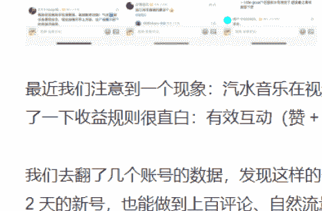
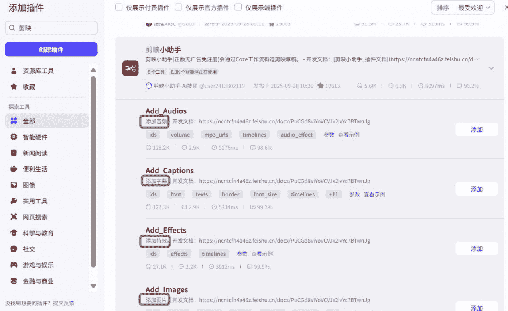
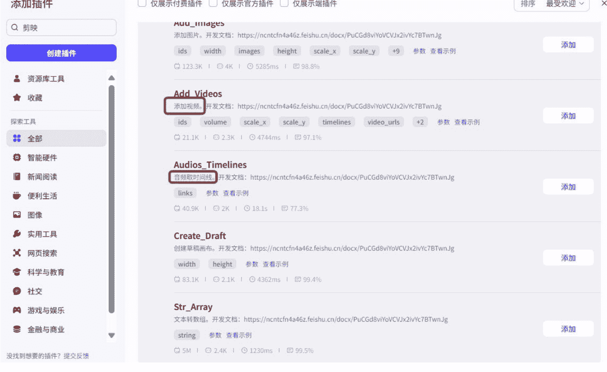
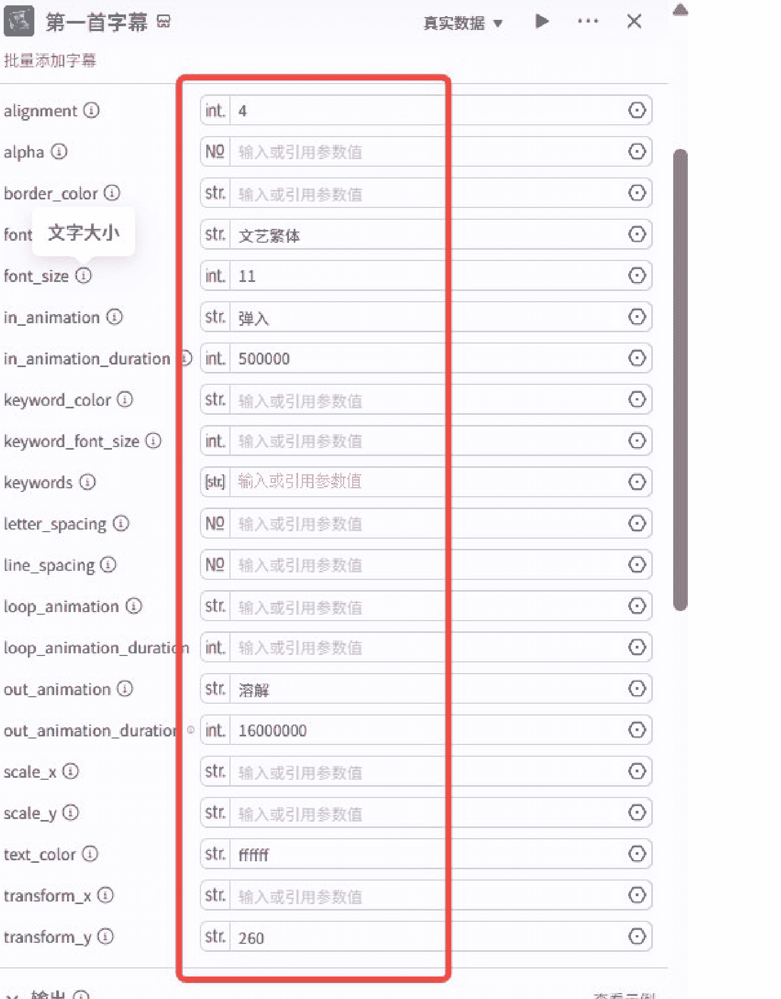
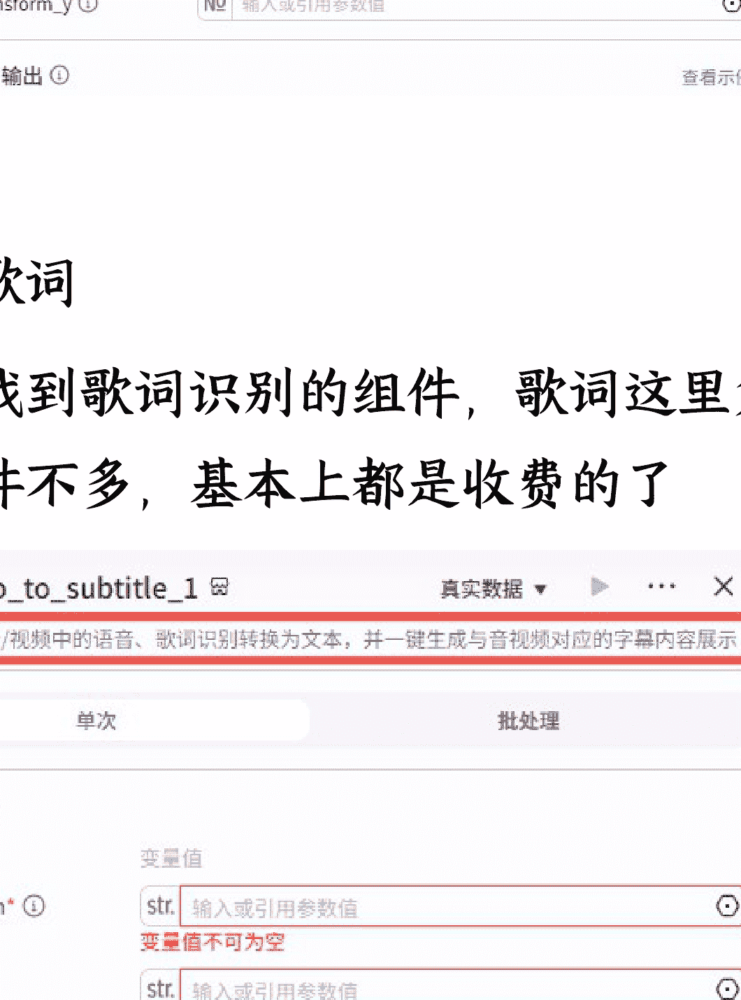
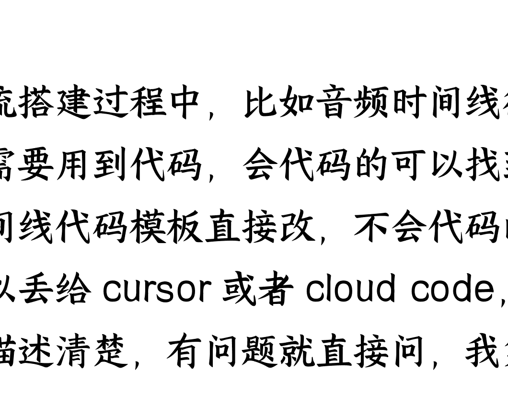
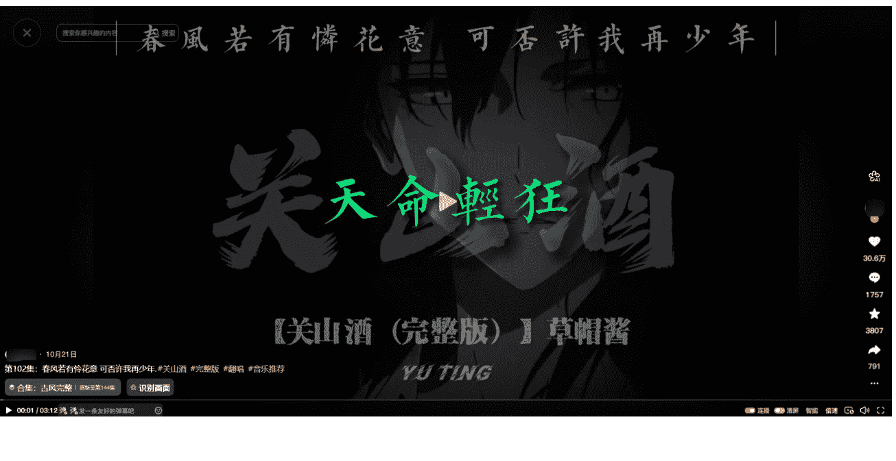

公众号懒人搜索，懒人专属群分享

# 拆解视频元素，用扣子 + 飞书多维表格实现日均 300 条原创短视频的自动化生产

251215 副业 SC 精华

公众号懒人搜索，懒人专属群独享

懒人微信:lazyhelper

哈喽，大家好，我是小灰，目前在做短视频相关业务，因为业务量比较大，用到了扣子工作流 + 飞书多维表格提效

## 一、搭建工作流做视频的背景

日常做视频的时候，会建立很多剪映模板，提高做视频的效率，但后来发现效率还是不够高，并且好几个人都用同一个模板做出来的还是差异比较大；

后来想到用 RPA 操作剪映去剪视频，但是剪视频这种还是比较精细化的，RPA 经常出错或者位置不对，检查比较费时间，了解到扣子可以调用剪映模块，搭建工作流生成，跟着航海手册去学习基础搭建，用 Cloud Code 辅助做代码；工作流搭成后，可以多人共享，做出来的视频标准化程度很高，质量稳定；

工作流的应用场景很多，电商类混剪视频、科普类视频、小说推广沙雕动画、AI 漫剧，都能搭视频工作流去批量生成，还可以嵌入多平台自动发布；

圈友们如果发现各平台上有类似批量化的视频内容想要去做，一般都可以几十到几百不等买一套对应的工作流去生成。

圈友们如果业务需要做大量视频，比如矩阵账号做内容、切片混剪等等，内容标准化程度越高，搭建工作流就越简单；

做工作流最重要的是环节拆解，只有制作环节拆解的够细，工作流才会跑的更顺。

## 二、我选择用扣子搭建自动化视频工作流的历程

我的平常要做大量的短视频 (每天几百条)，因为有点非标准化，自动化 rpa 很难解决。

后来自己学习扣子工作流，把一些非标准化的交给各个大模型去判断，标准化的部分直接调用剪映，结合起来，接入飞书表格。

现在可以做到只需要在飞书表格批量填写视频信息，就能批量生成成品视频的剪映草稿，如果哪个生成的不能用，直接改一下视频信息重新生成就行。

就像包子老师展示的 AI 不停的生成内容，不合适的删掉重新生成就行，这个思路就是包子老师启发的，现在每天产出 300 条原创视频，并且 token 成本可以忽略。

## 三、工作流对我的帮助

之前需要七八个人剪视频的量，现在两三个人负责检查筛选就可以。我的这种形式，不需要生成内容，所以不需要消耗 token，基本 0 成本产出。

这种形式是模仿人工剪，所以视频产出和真人手工剪是完全分不出来的，获得的数据和真人手剪是一样的，但是效率提升 10 倍

SCBI 实验室第十期里面的音乐类视频、祝福类视频都快速搭建工作流，每天产出视频，和我拆解的例子也是非常相似的，现在还在试验中

那说回正题，第十期 SCBI，我们依旧挑了 3 个有数据、有迹象、有真实账号验证的机会，和大家聊聊这周的项目机会。

### 案例 1：视频号汽水音乐推广，正在起量

最近我们注意到一个现象：汽水音乐在视频号做活动，只要视频里挂“音乐推广活动”，有效互动就能计算收益。去验证了一下收益规则很直白：有效互动（赞 + 收藏 + 分享 + 喜欢）×0.3 元，单条作品最高可得 1500 元。

我们去翻了几个账号的数据，发现这样的号并不少，有些账号连续好几条视频都能拿到几千互动；甚至一些只做了 1-2 天的新号，也能做到上百评论、自然流量直接起飞。看得出来，这是视频号在补内容池。

为什么会这样？有两个信号特别明显：

- 1. 视频号和抖音的用户画像重叠度不高，这意味着什么？抖音上已经卷烂的“情绪向音乐内容”，到了视频号就是增量。很多用户第一次看到这种内容，反馈非常真实，评论区有讨论、有情绪、有主动互动。

### 案例 3：爆款是重复的，年底了，祝福视频又可以重现了

年底是“祝福内容”的天然旺季，而这一点从数据上已经开始显现。我们抓到的几个账号里，出现了非常典型的现象：同一个祝福视频重复发，也有收益；同一个账号一天发 5-8 条，都能拿到播放；互动和评论比平时更活跃。

更关键的是图里的收益数据：有账号单条视频的收益已经开始明显上升，尤其是带祝福、祈愿、好运、长辈祝福等主题的内容。

为什么会这样？老逻辑了，但每年都会灵验一次：一到年底，每个人都需要一句“顺顺利利”“平安喜乐”。

而且祝福内容的创作门槛极低，可以是写字，可以是风景图配祝福，可以是 AI 换脸跳舞，可以是剪纸、灯笼、雪景，目前已经给两位老板定制搭建了视频工作流，收益两千元，不多，但是这个路线是可以变现的

## 四、针对短视频业务的拆解

### Ⅰ、音乐类短视频为例拆解

音乐类短视频标准化元素拆解：抖音上随便找的例子 - 音乐类

这个音乐视频由几部分组成：上方和下方固定的文案 + 背景歌名 + 背景视频/图片 + 中间的歌词

扣子工作流中有很多现成的调用剪映的模块，剪映基础功能大部分都是不收费的，大家可以自己点进去看看，现成的组件点击添加，然后拖拽连接前后就可以，这里面我们常用的：字幕、音频、文案、视频、音频时间线、特效、贴纸等等，都是现成的模块

接下来需要根据需求一个个添加，怎么前后连接，大家可以看扣子工作流 + 多维表格航海手册，我就是对着航海手册一个个前后连接，这里放几个案例截图，里面不止这些组件，大家需要调用剪映的可以直接在扣子插件里面搜“剪映”

#### 添加字幕

比如我要添加到屏幕上方，就找到添加字幕的组件，在这里填上相关的信息，比如字体、字号、字幕特效、字幕出入场、放置坐标等等

#### 添加音乐

我要添加什么音乐，有现成的组件可以根据歌名搜索剪映背景音乐库里的音乐

#### 添加视频/图片

我要添加的视频，就找添加视频的组件

#### 添加歌词

需要找到歌词识别的组件，歌词这里免费的组件不多，基本上都是收费的了

工作流搭建过程中，比如音频时间线很多时候需要用到代码，会代码的可以找了一段时间线代码模板直接改，不会代码的同学可以丢给 Cursor 或者 Cloud Code，把需求描述清楚，有问题就直接问，我第一次就修改了十几次，用了三四个小时才运行成功

这样需要添加的内容、各个元素出现的时间都有了

### 音乐类短视频非标准化元素拆解

文案：文案是非标准化元素，需要根据具体的歌来写文案，我做的时候，本来想直接在扣子工作流内接入豆包大模型，但是又怕生成的次品率太高，不好检查，所以选择在飞书多维表格接入 DeepSeek 大模型，生成的文案可以直接看到

图片/视频：背景图片和视频也是有两种方式，一种是在飞书多维表格里面填入图片和视频，让扣子工作流调用飞书多维表格的内容，一种是在扣子工作流内接入生图生视频模型，最后为了可控性更高，选择在飞书多维表格里接入生图生视频大模型

### 把飞书多维表格和扣子工作流结合起来

如何把飞书多维表格接入扣子工作流，Coze + 多维表格工作流航海手册里面有非常详细的教程，我就是根据教程一步一步做的

### 结合起来的效果如下

上面接入 AI 的字段都可以设置为自动更新的，我只是演示，没有选择自动更新

“工作流生成”字段就是调用扣子工作流，生成剪映的草稿，最后的链接是剪映草稿，导入剪映里就可以直接打开成品视频，演示视频生成的除了没有背景视频，其他的都和这个随便找的例子接近抖音上随便找的例子 - 音乐类

我这里是简单演示，没有加入背景视频和图片，只加入了语言大模型生成文案，生图生视频模型接入飞书多维表格也是一样的

我这里只用到了语言大模型，所以消耗的 token 非常少，其他的都是直接调用剪映模块，基本不消耗算力，除了每月 9.9 的扣子个人版，生成 1 条视频不到 1 毛钱

### 2、口播类视频同理

把口播素材放入多维表格，然后用扣子调用字段内容，在口播视频里加上字幕、特效、贴纸、背景音乐都可以，并且我把这些可以调整的变量都放在多维表格里，变量方便自己控制

## 五、分享思路

把视频拆解成标准化的元素和非标准化的元素，标准化的元素可以直接用扣子工作流调用剪映模块制作，非标准化的元素可以放在多维表格里面，接入 AI 进行制作，并且方便控制变量，设置自动更新之后，每时每刻都可以生成视频，后续只需要检查审核，不合格的一键重新生成就行。

## 六、变现方式

- 1、如果会搭工作流的话，可以给别人定制工作流

目前像这种抖音上随便找的例子 - 音乐类相对简单的视频工作流，工作流定制价格大概在 1500-3000 元左右一套，熟练的话，1 天即可做出一套。

现在市场需求除了几个红海模板，其他的空间不小，比如：

- 大学生宝妈买一套工作流生成内容，做账号
- 作为副业买一套，每天发布，有些行业是可以接任务的
- 做内容的老板的需求大部分工作流都能实现
- 现在做 YouTube 的也可以定制工作流

这类视频历史解说博主内容、假如书籍会说话的内容就是这类工作流做出来的，这种工作流的定制价格大概在 2000-5000 元左右一套，当然，这种模板出来好久了，竞争比较大，现在几百块甚至几十块就能买一套相似的（非定制）

- 2、抖音小红书上面很多 AI 内容的账号都是通过这种方式批量做出来的

这个博主假如书籍会说话，主要盈利模式是卖工作流 + 带学员；次要盈利模式是中视频伙伴计划收益，按照播放获取收益；橱窗带货量是最少的。这个博主算是这类的头部博主，多少收益不太好估。

这个博主抖音上随便找的例子 - 音乐类，接任务做音乐推广，像这条爆的视频，大概 3000 元左右的现金奖励

## 七、给新手的建议

建议先跟着扣子 + 多维表格航海手册完整做下来，再研究扣子插件市场中剪映相关模块

对视频元素的拆解要足够细，因为工作流就是把每一块元素拼接起来，需要什么元素就调用什么模块

不会代码的新手可以用 Cursor、Cloud Code 等工具辅助去写，不需要很懂代码什么意思，只要不停的把问题描述清楚，像我给的这个案例，整个工作流用到代码只需要十几行就可以，所以入门还是很简单的

最后，安利小懒的付费群:

懒人专属群 (介绍)

### 📖 这里是你对抗信息过载的护城河。

已稳定运行 6 年，累计拆解、研读 3000+ 个互联网商业实战案例与行业前沿内参和时政/宏观文章。

我们不搬运垃圾，只做高价值信息的筛选器与放大镜。

### 懒人专属群更新记录：

https://hk57gvlx7u.feishu.cn/docx/H0kRdZbSbolBR0xkaXtcuVE0nTg

### 懒人专属群更新记录 (需梯子，备用):

https://lazybook.fun/blog/record2

【免责声明】本资料归档于社群内部知识库，仅供成员课题研究与学术交流，请在查阅后 24 小时内删除。