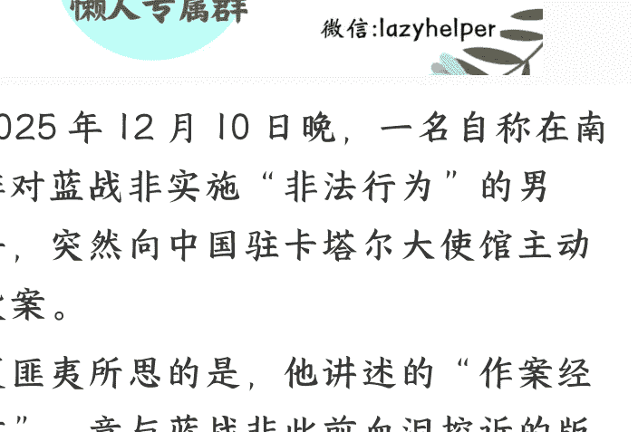
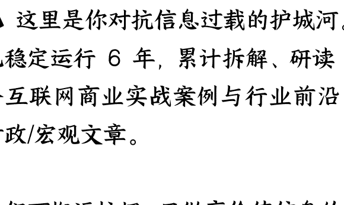

# 绑匪自首，蓝战非事件出现反转？

25|2|15文/卢克文工作室嘉宾风雨如歌
整理：公众号懒人搜索，<u>懒人专属群</u>独享
懒人微信：lazyhelper

2025 年 12 月 10 日晚，一名自称在南非对蓝战非实施“非法行为”的男子，突然向中国驻卡塔尔大使馆主动投案。

更匪夷所思的是，他讲述的“作案经过”，竟与蓝战非此前血泪控诉的版本截然不同。

是良心发现，还是另有隐情？

是真凶浮出水面，还是被人推上前台的“替罪羊”？

## 01

先看看自首者是怎么说的。他表示，自己因炒股亏损与日常消费，背负巨额债务，今年 12 月至明年 1 月是债务的最后还款期限。走投无路之下，他萌生了向蓝战非先生索要钱财的念头。得知蓝战非要往南非开普敦飞往南极后，自首者临时决定前往南非，并赶在蓝战非之前抵达当地。为了蹲守蓝战非，他在机场等候了三天。

期间，他曾试图寻找当地帮手，前后联系了三名黑车司机，且明确告知对方“不得伤害任何人、不携带任何武器”。前两名黑车司机担心他有犯罪意图，均拒绝了合作。第三名黑车司机是事发当晚在酒店楼下临时找到的，对方起初同意跟随他上楼，但自首者察觉到“该司机情绪不稳定，且彼此陌生难以掌控”，便让其先行离开。随后，他凭借中国人身份，冒充蓝战非先生成功补办了房卡（他称前台分不清中国人身份）。靠着这张房卡，他于当晚 12 点进入了蓝战非的房间。此时，蓝战非还在熟睡中。他将蓝战非叫醒，蓝战非受惊不小，但短暂冷静后，自首者说明了索要钱财的来意，并反复强调“不会伤害他”。最终，蓝战非分两笔向自首者转账共计 108.8 万元，资金均转入了自首者在国内的实名账户。过程中，自首者始终与蓝战非保持一米以上的距离，两人一人坐沙发、一人坐床尾，没有任何肢体接触，更不存在暴力胁迫的情况。自首者还提出，“能否当作借钱，自己可以签署欠条”。

自首者特别强调，自己全程未携带真实武器，仅带了一瓶防狼喷雾，且只举起过一次，之后便一直放在兜里；网传的“枪支”，实际是一把道具枪。从头到尾只有他一个人参与，不存在团伙作案的情况，也没有买通酒店工作人员和航空公司。以上，就是自首者的说法。而这个说法，与蓝战非对案发当晚的描述，存在天壤之别。双方的描述，主要有四大矛盾点。

- 第一个，是案发当晚参与者的人数。
自首者的叙述里，找两个黑车司机帮忙但屡屡碰壁，最后一个司机还因情绪不稳定被他打发走了，整个过程就是孤狼式行动，没有同伙配合。但蓝战非的描述，截然不同。他明确指出，绑匪是三个人，而且是“一人带两黑”的团伙作案模式。单人作案可能是临时起意的勒索，团伙作案则更可能是有组织的绑架。

- 第二个矛盾，是有没有暴力胁迫。
自首者强调连肢体接触都没有，全程和蓝战非保持一米以上距离，一个坐沙发一个坐床尾，甚至提出“当作借钱，可以签署欠条”。全程客客气气，完全是“协商式索财”。刀、枪等凶器是不存在的，只带了个防狼喷雾和道具枪。但蓝战非的描述，充满了让人毛骨悚然的细节。

- 第三个主要矛盾，是案发现场的具体经过。
比如“睁开眼刀架在脖子上”“剥光衣服拍裸照”“拿女性衣服出来让我不停揉指纹”“刀架我脖子上掏杯子出来让我采集自己的精液”。绑匪还逼他转账、撸网贷，收集指纹、毛发、口水等生物信息，威胁要伪造强奸案，整个过程持续了四五个小时，把他折磨得情绪失控，大哭大喊。

- 第四个矛盾，作案到底是临时起意，还是提前布局。
自首者的逻辑很清晰：因为债务快到期，走投无路才想到找蓝战非要钱，得知对方行程后“临时决定前往南非”，在机场蹲守三天。整个过程仓促又狼狈，完全是赶鸭子上架。

蓝战非则表示，这是一起精心策划的犯罪，绑匪疑似提前半年布局，曾伪装粉丝，试图在机场制造偶遇，让蓝战非上他们的出租车。幸亏蓝战非警觉，选择了官方出租车。看似两人各执一词，其实，自首者说的话，简直漏洞大到能塞进一头大象。

## 02

自首者说，同伙是在南非大街上随便拦的黑车司机。稍有生活常识的都知道，平时找朋友帮个忙，都得提前请吃饭喝酒，把话说透，更别说这种上门要钱的事，说白了就是半抢半要，陌生人凭啥帮你？好处少，风险大，但凡黑车司机脑子没进水，都不会干这事儿，这说法简直侮辱人的智商。

转账这事儿，更离谱。你想想，半夜三更突然闯进个陌生人跟你要钱，正常人第一反应，要么是叫保安，要么直接报警，就算心善，最多给个几百块打发走。谁会脑子一热，转个 108.8 万？蓝战非再有钱，也不是大风刮来的，不可能因为对方的三言两语，就把上百万送一个素不相识的人。

结合蓝战非说的那些被刀架脖子、拍裸照的细节，这事大概率有胁迫，自首的哥们，有点想把恶性事件往“协商借钱”上靠的意思。事情真正的关键，是作案者为什么突然自首？一个敢跑到异国他乡搞事情的人，要么胆大包天，要么背后有人撑着，怎么会突然乖乖自首？这里面，绝对藏着门道。自首者，很可能是犯罪团伙抛出的替罪羊。比如，你一个人扛下所有，作为交换，我们会给你家人一笔钱，帮你争取轻判等等。

就算分不清，也不会轻易补卡，因为高星级酒店有一套管理流程。补卡通常需核验姓名、证件号、订单等关键信息，部分高端酒店还需人脸识别，仅凭“外貌像中国人”就补卡成功的可能性极低。真相，大概率是买通了酒店内部人员。自首者一直强调的“单人作案”，更是逻辑不通。蓝战非前往南非这件事，他自己在直播间说过，但只是说了个大概，航班号、酒店名称、房间号等具体信息，本人并未透露。没有团伙支持，仅靠自首者一个人，想搞到以上信息，几乎不可能。“无暴力胁迫却转账百万”的说法，更是搞笑。要是没有暴力胁迫，谁会在半夜被陌生人叫醒后，乖乖转账 108.8 万巨款？只有被迫转账一种可能。所以，蓝战非描述的“刀架脖子、威胁伪造强奸案、收集精液”等细节，才符合“被迫转账”的逻辑，这就需要团伙的配合，起码两个人。一到两人拿凶器，威胁住受害人，另一个，负责操作受害人的手机转账和撸网贷。

这和蓝战非描述的"3 个绑匪”，对得上。自首者向中国驻卡塔尔大使馆自首的行为，更是反常。明明作案地点在南非，为什么不向当地警方或者中国驻南非大使馆投案？卡塔尔和中国没有签署引渡条约，卡塔尔和南非也没有签署引渡条约。无论中国还是南非，想从卡塔尔引渡自首，都有相当的难度。毫无疑问，卡塔尔是一个精心选择的自首地点。这样做的“好处”，很明显。一方面，跨洲调查案件的难度非常大，争取到的时间足够做许多事情，比如销毁证据；另一方面，即便查出了什么，由于卡塔尔和两国没有引渡条约，也未必能惩罚他们。如果没有团伙，事先也不进行细致准备，仅凭一个人的“临时起意”，绝无可能选择卡塔尔。

这潭水，远比我们看到的要深。

最后，安利小懒的付费群：
懒人专属群（介绍）

这里是你对抗信息过载的护城河。已稳定运行 6 年，累计拆解、研读 3000+ 个互联网商业实战案例与行业前沿内参和时政/宏观文章。我们不搬运垃圾，只做高价值信息的筛选器与放大镜。

懒人专属群更新记录：
https://hk57gvlx7u.feishu.cn/docx/H0kRdZbSbolBR0xkaXtcuVE0nTg
懒人专属群更新记录（需梯子，备用）：
https://lazybook.fun/blog/record2

【免责声明】本资料归档于社群内部知识库，仅供成员课题研究与学术交流，请在查阅后 24 小时内删除。