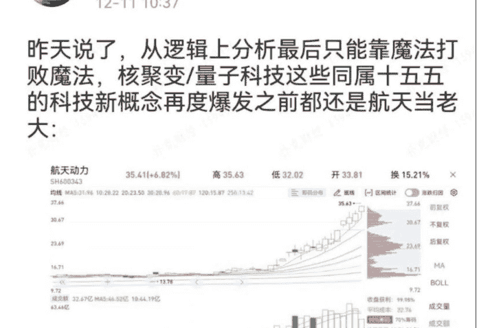
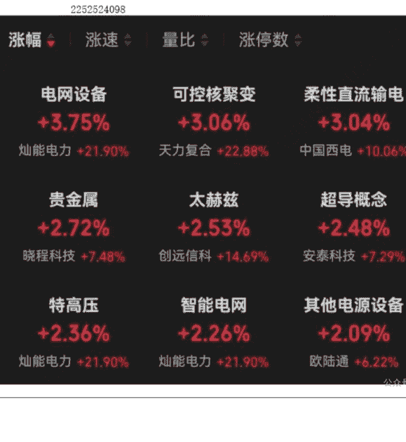

# 先锋战役：复盘商业航天

**观星老道**

整理：公众号懒人搜索，懒人专属群独享

懒人微信：lazyhelper

## （一）启动阶段

11 月中旬启动（科创 50 指数跌破 60 日线时），12 月初进入加速段——资金抢跑政策预期，板块呈阶梯式上涨。

进入加速段的诱发因素是 11 月下旬北京发布太空算力规划，提出在 700-800km 晨昏轨道部署 GW 级数据中心；国家航天局随后印发《推进商业航天高质量安全发展行动计划（2025-2027 年）》。

11 月 14 日至 12 月 4 日仅 15 个交易日，航天发展区间最大涨幅 118%，多只成分股出现连续 10cm 涨停。

政策→订单→技术突破三重共振

GW 星座、G60 星链下半年集中招投标，市场预计单年卫星发射需求超千颗，火箭运力缺口显性化。

此前“力箭二号”计划已于 9 月首飞并承担空间站货运任务，验证了商业火箭成熟度；加速段末期，卖方机构反复写报告提示朱雀三号可重复使用火箭首飞在即，继续加热市场温度——但是商业航天的机构票（如中国卫星、臻镭科技、烽火通信、中国卫通等）最初并没有作出明显正反馈，反而是机构没有重点配置的、看上去纯属名字测热点的“航天系”央企股票带头暴涨（如航天动力、航天发展、航天科技等），呈现反抱团特征，回味：图 2025 年跨年攻略之大雪锦囊本周开始机构票陆续补涨，反抱团的游资炒作品种加速赶顶。

其实如果把时间线拉长看，在今年三季度机构和游资已经同步加仓商业航天板块，且明牌是调研频次骤增（截止 11 月启动前已有 32 家概念股接待机构调研环比翻倍）——龙虎榜显示游资席位与深股通机构席位/短线与配置盘形成共振。

## （二）产业链扫描

- **卫星制造**：星载 IC、TR 组件、姿控系统供不应求，航天智装、国博电子等月内最大涨幅 50%+。

- **火箭发射**: reusable rocket 带动发射成本下行至 5 万元/kg 以下，中科宇航、天兵科技等民营订单排至 2026 年。

- **地面终端**：6G 加速推进，手机直连卫星成为智能手机标配，通宇通讯、上海瀚讯 2 日涨幅均超 10%。

- **运营服务**：卫星互联网运营牌照有望年内发放，中国卫通、银河航天率先完成 3 万颗频谱协调，奠定国内“星座主权”。

## （三）十五五规划定位商业航天首次被赋予国家新基建属性，战略意义回味

市场杂谈：粗浅探讨一下十五五规划期间大搞商业航天的国情及社会经济意义

**观星老道** 圈主

12-12 11:38

今上午这个板块轮动，根据我的剧情解读，商业航天要小心了：

最后，安利小懒的付费群：

**懒人专属群** ([介绍](#lazyhelper))

这里是你对抗信息过载的护城河。

已稳定运行 6 年，累计拆解、研读 3000+ 个互联网商业实战案例与行业前沿内参和时政/宏观文章。

我们不搬运垃圾，只做高价值信息的筛选器

与放大镜。

**懒人专属群更新记录**：[https://hk57gvlx7u.feishu.cn/docx/H0kRdZbSbolBR0xkaXtcuVE0nTg](https://hk57gvlx7u.feishu.cn/docx/H0kRdZbSbolBR0xkaXtcuVE0nTg)

**懒人专属群更新记录（需梯子，备用）**：[https://lazybook.fun/blog/record2](https://lazybook.fun/blog/record2)

**【免责声明】** 本资料归档于社群内部知识库，仅供成员课题研究与学术交流，请在查阅后 24 小时内删除。