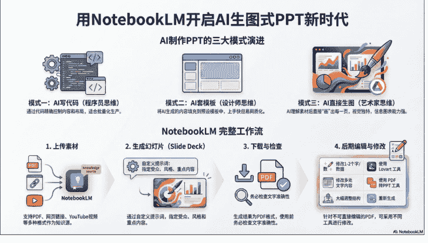
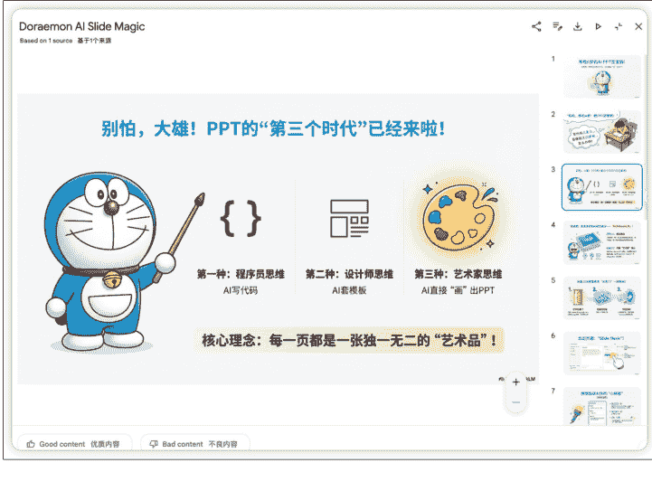

# 600 页 AI-PPT 实战后，我写了这篇全网最全 NotebookLM 制作 PPT 教程

251216 副业 SC 精华

整理：公众号懒人搜索，懒人专属群独享

懒人微信:lazyhelper


各位生财圈友大家好，我是 sky 陈天，一名 AI 企业培训讲师、企业 AI 业务提效顾问。

最近用 Google 的 NotebookLM 做了一套 70 多页的 AI 营销主题的 PPT，做了两场商业分享，效果出乎意料的好。

客户反馈说，这 PPT 看起来不像 AI 生成的，更像是专业设计师做的信息图。



(notebooklm 直接生成的 PPT)

我研究 AI 做 PPT 这件事，已经快 3 年了。

市面上大大小小的工具用了 20 多个，Gamma、KIMI、AIPPT、通义、讯飞、天工、文心一言……基本上叫得上名字的我都试过。

我的 AI 工作流课程里那 500 多页 PPT，全部都是用 Gamma 做的。

当时觉得 Gamma 已经是天花板了，没想到现在被 NotebookLM 超越了。

上个月 Google 把 Nano Banana Pro 整合进 NotebookLM 之后，AI 做 PPT 这件事发生了质的变化。

PPT 制作从"AI 填内容 + 套模板"变成了"AI 直接画图成 PPT"。

每一页都是独立设计的图，不撞模板，视觉独特性拉满。

比如我可以做一个哆啦 A 梦版的 PPT。



也可以做一个疯狂动物城版的 PPT。


所以这篇文章，根据我用 AIPPT 工具制作了 600 多页 PPT 的经验，系统性地给大家梳理一下：

怎么用 NotebookLM 制作 PPT，以及实际使用中会遇到的各种问题怎么解决。

包括：

- 完整的制作流程（含账号获取）
- 我用 AI 做了上百页 PPT 的实战经验
- 生成后发现错别字的 4 种修改方法
- 6 种常见 PPT 风格 + 如何固定你想要的风格
- 如何制作超长 PPT（一次只能生成十几页怎么办）

这应该是目前全网最全的 NotebookLM 生成 PPT 教程了，建议收藏转发哦！

## 一、完整制作流程：从注册到导出

### 账号获取

NotebookLM 是 Google 的 AI 知识管理的产品，需要 Google 账号才能使用。如果你在国内，需要科学上网才能访问。

访问地址：notebooklm.google.com

NotebookLM 本身是免费的，但生成 Slide Deck (幻灯片) 和 Infographic (信息图) 功能有使用次数限制。而且免费效果不好需要等很久。

我的建议是，直接某鱼买一个 Gemini Pro 账号，一年账号的话，其实也就八十多块钱。

Gemini Pro 的账号是和 NotebookLM 账号打通的，都可以用。

### 创建笔记本

登录后，点击「Create new」创建一个新笔记本，给它起个名字。

比如你要做一个 AI 营销趋势的 PPT，就叫"AI 营销趋势分享"。

### 上传素材（关键步骤）

上传的素材和文本决定了你 PPT 的内容质量。


NotebookLM 支持这些格式：

- PDF 文档：研究报告、白皮书、电子书都可以
- Google Docs：直接从 Google Drive 导入
- 网页链接：粘贴 URL，它会自动抓取内容
- YouTube 视频：粘贴视频链接，它会提取字幕内容
- 纯文本：直接复制粘贴

但这里有一个关键技巧，很多人不知道：

直接上传素材让它生成 PPT，效果往往不够理想。因为 AI 需要自己理解和组织内容，可能和你想要的结构不一样。

我的做法是：先让 AI 生成逐字稿，再用逐字稿生成 PPT。

### 具体流程是这样的：

#### 第一步：用 AI 生成演讲逐字稿

把你的素材喂给随便一个 AI，让它帮你写一份完整的演讲逐字稿。


##### 提示词可以这样写：

> 你是一个逐字稿撰写专家，请根据以下素材，帮我写一份 XX 主题的演讲逐字稿。要求：1、分成 X 个章节，每个章节 3-5 个要点 2、每个要点有清晰的标题和 2-3 句解释 3、语言风格：内容专业且要口语化 4、总时长约 XX 分钟 素材如下：[粘贴你的素材]

#### 第二步：把逐字稿粘贴到 NotebookLM

生成的逐字稿复制下来，直接粘贴到 NotebookLM 的素材区。

你可以选择「Paste text」，把整份逐字稿作为一个 source 上传。

#### 第三步：生成 PPT

这时候再生成 PPT，出来的内容就是按照你的逐字稿结构来的，和你想要的高度一致。

我做那 70 页 PPT 就是用这个方法。

先花 30 分钟用 AI 把逐字稿写好、改好，确认内容没问题，再丢进 NotebookLM 生成。

这样做的好处是：你对内容有完全的掌控权，AI 只负责视觉呈现。

### 生成 Slide Deck

素材准备好后，记得勾选素材，只需要勾选你要生成的素材就可以了，然后在右侧找到「Studio」面板，点击「Slide Deck」。

点击旁边的铅笔图标，可以做自定义设置：

### Format（格式）：

- Detailed Deck：详细版，每页内容更丰富，适合阅读型 PPT
- Presenter Slides：演讲版，每页内容更精简，适合现场演示

### Language（语言）：

- 选择你想要的输出语言
- 直接选中文就行了

### Custom Prompt（自定义提示词）：

这里可以输入你想要的风格来输入。如果不输入信息的话生成的 PPT 有可能质量会没有那么高，随机性会比较大一些。

比如我的哆啦 A 梦风格的就是这个提示词："我想请你根据我的这个文件创建出一个哆啦 A 梦讲解整个 AI PPT 生成课程的 PPT，要用哆啦 A 梦的风格去讲，大概 15 页"

设置完成后，点击「Generate」，等待生成。

生成时间大概 3-10 分钟，取决于素材量。

好消息是你可以继续在笔记本里做其他事情，它会在后台生成。

### 查看和导出

生成完成后，你可以下载为 PDF 文件，也可以直接在网页中放映。


## 二、生成后发现错别字？4 种修改方法

NotebookLM 做的 PPT 很好看，但是有一个很大的问题，字有时候会乱码，比如说这个字明显就是有问题的。但它是图片改起来特别麻烦。


### 那到底怎么改呢？

NotebookLM 目前只能导出 PDF，不能直接编辑。

我把市面上的办法都试了一遍，总结了四种解决方案，适合不同场景。

### 方法一：PDF 转 PPT 工具

把导出的 PDF 转成可编辑的 PPTX 格式。

操作步骤：

1. 从 NotebookLM 下载 PDF
2. 在 WPS 里点击 pdf 转化为 PPT


转化之后可能会有很多错别字，直接点击审阅里面的校对，多次自动修改错别字就好了


#### 选择通用校对


并且把错别字一键替换掉


最后把右下角的 NotebookLM 的水印手动的删掉


转换后的 PPT，文字会被识别成文本框，可以编辑。但复杂的图形元素可能还是图片形式，没法改。

此外我也遇到了一个问题：如果 AI 生成的文本出现大批量乱码，改起来会非常麻烦。

所以如果 AI 生成的很多乱码，请重新生成一版，选择乱码少一点的版本，然后再进行修改，否则后续的修改工作将会非常繁琐。

### 方法二：用 Lovart 编辑图片中的文字

这是一个更灵活的方法，特别适合只需要改几个字的情况。

Lovart（lovart.ai）是一个非常强大的 AI 设计工具，网址：

https://www.lovart.ai/zh

它有一个功能叫【编辑文字】——可以识别图片里的文字，单独对文字的部分进行修改。

操作步骤：

1. 打开 lovart.ai，新建一个项目


2. 把 NotebookLM 生成的 PPT 页面复制或者导出，注意是单张图片，不是整个 pdf。

选择编辑文字功能，系统会自动识别文字


直接对文本框的文字修改，修改后点击【应用修改】，稍等十秒钟就会重新生成一张图片。


适合场景：只改 1-2 个字或数据，想保持原有设计风格。

特别强调一下，但如果说文字大面积乱码，用这种方式改文字也会照样会乱码。

所以当你某一页都是乱码的时候，适合用第三种方式。

### 方法三：用 AI 重新修复生成

这个方法特别适合处理大批量文字不清晰或者想去水印的情况。

操作步骤：

- 把需要修改的 PPT 页面复制
- 打开 Lovart、Gemini Pro 或者任何支持 Nano Banana Pro 的工具，国内的 Seedream 4.5 也可以，上传截图，加上这段提示词：

```
完全复刻这张图片，只提升文字清晰度和去除右下角水印，确保中文字体不变形不乱码，保持所有内容布局和图标与原图完全一致。4K
```

AI 会重新生成一张几乎一样的图，但文字更清晰，水印也去掉了


适合场景：文字大面积模糊、想去水印、想提升整体清晰度。

### 方法四：Windows 智能圈选（Windows 用户专属）

这个方法是我在小红书上看到的，博主 @brucevanfdm 分享的，Windows 用户可以试试。

#### 操作步骤：

- 安装微软电脑管家（Microsoft PC Manager）
- 打开 PPT 的 PDF 页面
- 使用电脑管家里的「智能圈选」功能


圈选后可以自动把图片内容转化成可编辑的 PPT 格式

视频来源：小红书 或 X 平台 ID: @brucevanfdm

这个方法的好处是不需要额外的在线工具，直接在本地就能完成。

适合场景：Windows 用户，想快速把图片 PPT 转成可编辑格式。

最后做一个四种方法的对比，大家可以根据自己的情况自行选择。

| 方法 | 适合场景 | 优点 | 缺点 |
| :--- | :--- | :--- | :--- |
| PDF 转 PPT | 改多处内容 | 全面可编辑 | 复杂图形可能变形 |
| Lovart | 改 1-2 个字 | 保持原设计 | 需要逐页处理 |
| AI 重新生成 | 去水印、提升清晰度 | 大批量改内容 | 可能有细微差异 |
| Windows 圈选 | 快速转换 | 本地操作 | 仅限 Windows |

我的建议是：小改用 Lovart，大改用 PDF 转 PPT，去水印用 AI 重新生成，Windows 用户可以试试智能圈选。

## 三、5 种常见 PPT 风格 + 如何固定你想要的风格

NotebookLM 生成的 PPT 默认是它自己的风格，但实际工作中，我们往往需要特定的视觉风格。

所以我给大家准备了几个常见的风格提示词，复制粘贴到 Custom Prompt 框里就行。

### 极简商务风


特点：大量留白，黑白灰为主，点缀一个强调色，适合正式商务汇报、投资路演。

```
Create professional minimalist slides
with generous whitespace and clean
visual hierarchy. Use a restrained color
palette: white backgrounds, charcoal
gray text, with navy blue as the single accent color. Typography should be modern sans-serif, with bold headlines and light body text. Each slide focuses on one key message. Use simple geometric shapes and thin lines as subtle decorative elements. Include high-quality photography with muted, desaturated tones when images are needed. Maintain consistent 60% whitespace across all slides.
```

### 科技未来风


特点：深色背景，蓝紫渐变，几何线条，数据可视化，适合科技公司、AI 主题、产品发布。

```
Create futuristic tech-style slides with dark backgrounds (#0a0a0f or deep navy). Use electric blue (#00d4ff) and purple (#8b5cf6) as accent colors with subtle gradient effects. Feature geometric patterns: circuit-like lines, hexagonal grids, glowing nodes and connection lines. Typography should be sleek and modern, with a tech/digital feel. Include data visualizations with neon glow effects. Add subtle particle effects or abstract digital elements in backgrounds. Create a sense of innovation and cutting-edge technology.
```

### 活泼创意风


特点：高饱和度色彩，手绘元素，不规则形状，适合创意提案、品牌营销、年轻受众。

```
Create vibrant, energetic slides with bold saturated colors: coral pink, electric yellow, turquoise, and bright orange. Use playful hand-drawn elements: sketchy borders, doodle icons, brush stroke textures, and organic blob shapes. Typography should mix playful display fonts with clean sans-serif body text. Include fun illustrations and cartoon-style graphics. Layouts should feel dynamic and slightly asymmetrical. Add confetti, stars, or abstract squiggles as decorative elements. The overall mood should be optimistic, youthful, and engaging.
```

### 信息图表风


特点：数据可视化，图标丰富，流程图，对比图，适合数据报告、行业分析、复杂概念解释。

```
Create infographic-style slides that transform complex information into visual stories. Use a cohesive color palette with 4-5 colors: one primary, two secondary, and accent colors for highlights. Feature abundant custom icons, pictograms, and symbolic illustrations. Include diverse chart types: pie charts, bar graphs, timelines, flowcharts, comparison tables, and process diagrams. Use visual metaphors and illustrated concepts. Typography should be bold and scannable with clear size hierarchy. Each slide should tell a complete visual story with minimal text and maximum visual communication.
```

### 疯狂动物城风格


特点：迪士尼 3D 动画质感，拟人化动物角色，现代都市场景，色彩明亮温暖，适合团队分享、企业文化、轻松主题的汇报。

```
Create slides in Disney Zootopia 2 animation style. Apply soft edge lighting, smooth shadow rendering, warm harmonious color palette, subtle fur texture details at light edges. Feature expressive anthropomorphic animal characters in professional settings – animals in business attire, working in offices, giving presentations. Use clean studio-style backgrounds with soft blue gradients. Character designs should have Disney-level quality with expressive shapes and friendly expressions. Typography should be rounded, friendly sans-serif fonts. High resolution, cinematic color grading. Overall mood: professional yet approachable, warm, optimistic. Each slide should feel like a promotional art piece from the movie.
```

### 哆啦 A 梦风格

特点：日系手绘动漫风格，蓝白配色为主，可爱圆润的线条，充满童趣和想象力，适合教育培训、创意分享、科技产品介绍。

Create slides in classic Doraemon Japanese anime style with hand-drawn 2D illustration aesthetics. Use the iconic color palette: bright sky blue, white, warm yellow, and soft pink accents. Feature cute, rounded character designs with simple expressive faces and clean outlines. Include whimsical futuristic gadgets and magical elements floating in scenes. Backgrounds should have soft pastel gradients or simple clean environments. Add playful elements like clouds, stars, and magical sparkles. Typography should be rounded, cute Japanese-style fonts. Overall mood: cheerful, imaginative, nostalgic, and educational. Each slide should feel like a page from a manga or anime storyboard with a sense of wonder and possibility。这两个 IP 风格做出来的 PPT 非常有辨识度，特别适合需要打破沉闷、制造轻松氛围的场合。

我之前用疯狂动物城风格做过一个团队复盘的 PPT，效果非常好，大家看了都觉得很有意思。

这六套提示词我都实测过，效果还不错。你可以根据实际需要微调，比如换个主色调、调整某个具体元素。

### 如何固定和提取你想要的风格

如果你有一套公司品牌规范，或者看到某个 PPT 风格很喜欢，想让 NotebookLM 学习，我也给大家准备了一个风格提取的办法。

操作步骤：

- 第一步：准备参考图

收集 5-6 张你喜欢的 PPT 截图或设计图。可以是：

- 你公司之前做得好的 PPT 页面
- 网上看到喜欢的设计风格
- Dribbble、Pinterest 上的灵感图

- 第二步：用 AI 提取风格

把这些图上传到任何一个 AI，用这个提示词：

请分析这几张图片的设计风格，从以下维度提取特征：

- 1. 色彩体系：主色调、辅助色、强调色的具体色值或描述
- 2. 版式布局：信息层级、留白比例、对齐方式
- 3. 字体风格：标题/正文的字体类型、大小比例、粗细对比
- 4. 图形元素：图标风格、装饰元素、边框特点
- 5. 图片处理：照片风格、滤镜效果、裁剪方式
- 6. 整体调性：专业/活泼/极简/科技感等关键词

最后，请将以上分析总结成一段英文提示词，格式为："Create slides with [风格描述], using [色彩描述], featuring [版式特点], with [图形元素特点]..." 这段提示词将用于 NotebookLM 的 Slide Deck 生成功能。

- 第三步：应用到 NotebookLM

把 AI 生成的英文提示词，复制到 NotebookLM 的 Custom Prompt 框里。

#### 实际效果：

比如我上传了几张极简商务风的 PPT，AI 生成了这样的提示词：


```
「Create slides with an elegant, intellectual, and editorial aesthetic, using a warm cream/beige background (#F5F5F0) with deep forest green text (#1A3C34) and muted gold accents (#C5A065). Featuring a clean layout with generous whitespace and clear visual hierarchy. Use Serif fonts for large, bold headings to create a classic look, and Sans-serif fonts for readable body text. Incorporate minimalist line-art icons and abstract fluid artistic elements for visuals. Ensure the overall tone is professional yet sophisticated, resembling a high-quality magazine layout. 」
```

把这段放进 NotebookLM，生成的 PPT 就会往这个风格靠拢。

不是 100% 精确复刻，但能让输出风格更接近你想要的。多试几次，调整提示词，效果会越来越好。

## 四、长 PPT 怎么做？(一次只能生成十几页)

这是很多人遇到的问题：NotebookLM 一次只能生成十几页 PPT，但我要做的是 70 页的长 PPT，怎么办？

我的方法是：把文档拆分，分段生成，最后合并。

具体操作：

- 第一步：把逐字稿按章节拆分

比如你的逐字稿有 5 个章节，就拆成 5 个独立的文档，怎么拆呢？按照每个部分 15 页的部分来拆。

就是每一个文档大概 15 页左右的 PPT。

- 第二步：每个章节单独创建文件

在 NotebookLM 里创建 5 个文件，每个文件只上传对应章节的内容。

- 第三步：分别生成 Slide Deck

每个笔记本分别生成 PPT，而且都是要固定风格这样每个章节都能得到完整的十几页 PPT。


- 第四步：合并 PDF

把 5 个 PDF 下载下来，转化为 PPT 后合并成一个完整的 PDF。

### 关于风格一致性的问题：

你可能会担心：分开生成的话，每一部分风格会不会不一样？

解决方法是：在每个笔记本的 Custom Prompt 里，使用完全相同的风格提示词。

比如都写："Create slides with a minimalist professional aesthetic, using navy blue and white color scheme, clean sans-serif typography, generous whitespace."

这样生成出来的 5 个部分，风格就是统一的。

我做 70 页 PPT 的时候，就是拆成了 4 个部分，每部分 15-20 页，最后合并起来。

整体风格会比较统一，但是完全统一有点难，就得对提示词有非常精准的调整了。

## 五、国产 AI-PPT 工具推荐

最后可能有些小伙伴问，我现在用不了国外的 NotebookLM，有没有一些其他的类似的国产工具可以使用？

我这边也试了几个工具：

- 1、秘塔：https://metaso.cn/

Meta AI 调用的是 nano banana pro 模型，而且还是免费的（免费的要啥自行车？）。目前看起来效果还是不错的，但是它的入口是在学习点啥，这个可以作为一个平替

### 具体教程：

https://mp.weixin.qq.com/s/CijVsVvj_MhyF6iezbO0Tg


- 2、扣子空间：https://www.coze.cn/space-preview

这个产品也是免费的，扣子空间用的是国内的 Seedream 4.5 的模型，测试下来中文文字乱码比较少，但是审美比较差。

- 3、天工：https://skywork.ai/

天工最近接入了 nano banana pro，但需要付费，所以我还没试，但实在用不了国外模型的可以测试一下。

最后聊几句感受。

我是做 AI 企业咨询和培训的，所以有大量的 PPT 要做。从 23 年开始，我就在研究怎么用 AI 来提效这件事。

让我感到有点“恐怖”的是，AI 的进化速度太快了。

过去一年时间，我这套工作流的框架基本没变：

明确目标和受众 → AI 写大纲 → AI 生成内容 → 人工修改内容 → AI PPT 生成 → 精修调整

但随着 AI 的不断进化，每一步的准确率都大大提升了，精美程度也提升了很多。

24 年的时候我准备一个一小时的分享，可能需要花两天时间。

但这次做 70 页 PPT，从写逐字稿到最终导出，我只花了 3 个小时。客户看了都以为是请设计师做的。

所以我的体会是：AI 工具在越来越成熟，但对我们来说，更重要的是把自己的工作流拆好、AI 化。

可能当下 AI 还只能做到 60 分，但随着 AI 的升级迭代，可能过不了太久，就能达到 90 分的产出。

## 这也是为什么我一直在强调 AI 工作流思维——工具会变，但工作产出不会变，方法论不会变。

与其不断追逐新的 AI 工具，不如好好打磨自己的 AI 工作流。

最后，我希望这是我写的最后一篇 PPT 教程。

因为再过半年，可能我们真的都不需要学习怎么做 PPT 了。PPT 的“言出法随”时代，可能很快就会到来。

如果那一天真的到来，那更值得我们思考的是：

褪去华丽的包装和外衣后，我们的观点（Point）到底是什么？是不是真的有力量（Power）？

毕竟，PPT 的全称是 PowerPoint。

这篇分享如果对你有帮助，欢迎点个赞和在看，你的喜欢是我更新的最大动力。

我是 sky 陈天，下一期再见！

## 最后，安利小懒的付费群:

### 懒人专属群 (介绍)


📚 这里是你对抗信息过载的护城河。

已稳定运行 6 年，累计拆解、研读 3000+ 个互联网商业实战案例与行业前沿内参和时政/宏观文章。

我们不搬运垃圾，只做高价值信息的筛选器与放大镜。

懒人专属群更新记录:

https://hk57gvlx7u.feishu.cn/docx/H0kRdZbSboIBR0xkaXtcuVE0nTg

懒人专属群更新记录 (需梯子，备用):

https://lazybook.fun/blog/record2

【免责声明】本资料归档于社群内部知识库，仅供成员课题研究与学术交流，请在查阅后 24 小时内删除。