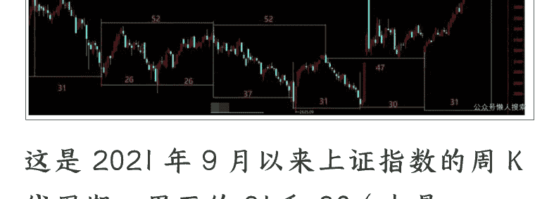
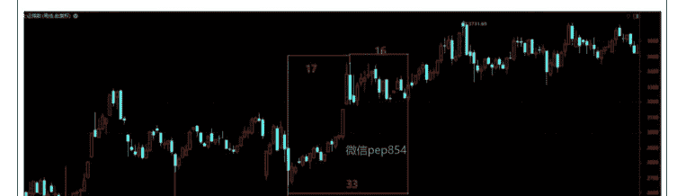
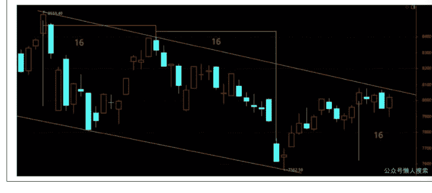
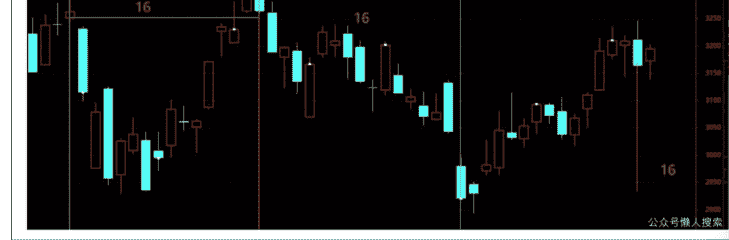
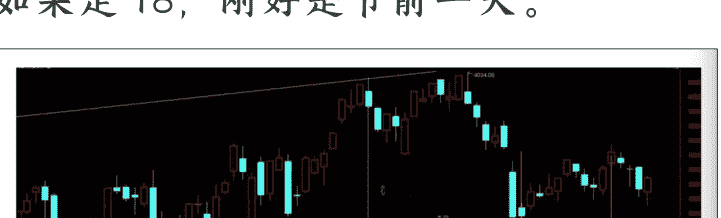

# 为 2026 年布局的第一个方向

2025 年 12 月 14 日 安民深度分析

整理：公众号懒人搜索，懒人专属群独享

懒人微信:lazyhelper

前面的文章中，我们讲了这段时间在深度思考，就是要为 2026 年布局。本文将公布第一个操作的板块。在公布之前，我们先看看对指数和相关板块的周期研究，后面会讲对该板块后续并购方案的研判。

## 1.上证指数的周期

以前的周期，我们不多讲，大家可以看我们今年夏天讲新周期的文章，那篇的牛市周期结论为后面的走势所证明。这里谈谈近期的周期。这是我们对周期的学问所做的深度研究，但也有可能是盲人摸象。

(免责声明：本文只为开拓视野、引导思路，并非择时，亦非荐股，股市有风险，入市需谨慎。本文为周期研究，仅为对 K 线周期历史数据如何划分的客观分析与研判，不构成任何投资建议或意见，不对用户依据本文做出的任何投资与决策承担责任。请大家注意投资风险。) 先看图：

这是 2021 年 9 月以来上证指数的周 K 线周期。里面的 31 和 30（也是 61）、37、47，是以前反复出现过的周期。但在以前的历史上，没有连续出现过 3 次 30 或 31 周期重复的。因此，我们判断这次的 31 周期，即最右边的那个 31 周期为更大周期的一部分。希望这一判断是正确的。

还有，本图最后一根周 K 线和实际略有区别，主要是截取周 K 线图时，周交易没有结束，但它不影响周 K 线的数据。主要是数字不好敲上去，稍用点力，经常搞到一半就完蛋了，就又得重来。

判断这个 31 周期不能以单独周期存在的原因，有三：

- (1) 92 周期不太对。2024 年 2 月 5 日以来，到 2025 年 11 月 14 日，周线上是 31+30+31=92 周期。这不像一轮牛市的周期。即不像牛市三段论的第一段。

- (2) 历史上 33 和 34 周期的表现。如上图，最左边的 31 周期前面是 30 周，即是 30+31 周；最右边的 31 周期，往后数两周，低点即第 33 根周 K 线，是 11 月 24 日的 3816 点。我们看看历史上类似的第 33 周的表现。

2013 年到 2015 年的牛市，还有 2019 年到 2021 年的牛市，33 周期都是低点，后面两次都重新走牛。

上图是从 2013 年 6 月 25 日起的牛市，先一个 37 周周期，37 为多次出现的周期。

再接一个 30 周，小高点出现在第 30 周。第 31 周和 32 周调整，第 33 周出低点开始走强，并突破前高，继续走牛。

本次的节奏跟这个非常像。小高点出现在第 31 周，当周收阴，第 32 周也收阴，第 33 周出现调整的低点。只是本次第 33 周、34 周和 35 周走势都比较弱，暂时还没有创新高。

再看一个：

下图，2019 年到 2021 年牛市，图中的 33 周，前 17 周上行，后面 15 周横盘振荡调整，到第 16 周时向上了，牛市继续。17+16 刚好 33 周，形成低点。

本次低点 3816 点，即 11 月 24 日那周，刚好为 33 周。所以我们反复讲到 33 和 34 周期。这个 33 周或 34 周是否最终有效，还需要确认。要么确认 33 周或 34 周有效，要么确认其他周期有效。

这里有个逻辑，上周四的文章中讲到了。不清楚的，可以去看 12 月 11 日（周四）的文章。这里略有修改：

> “即突破 4034=否认小 b=没有小 c=调整结束=确认 33 和 34 有效;这里若下来，略向下突破 3816 点=证明小 b 结束=小 c 成为现实。”

(3) 就是如果 33 周或 34 周无效，那么后面将会出现的最近的两个周期分别是：

- 37 周周期，47 或 48 周周期。当然，还有更大些的周期。

首先我们否定低点在 47 或 48 周，因为它跟 31 周是有关系的。31+16=47;47 或 48 是上证指数前面曾经反复出现过的周期，如果它在明年春分前后形成有效的低点，那么就证明了前面的 31 周高点也是有效的，是较大级别的高点。

但我们看历史上，没有连续出现过 3 次的 30 或 31 周期。就是说，我们前面判断，今年 4 月份的低点后，到 11 月 14 日的 31 周期，是更大周期的一部分，即 11 月 14 日的 31 周不是大周期而是小周期。从历史周期走势看现在，那第三个 31 周期不应该成为大级别的高点。也即 47 周或 48 周可以成为大级别的高点，但第三个 31 周期成为大级别的高点，找不到历史依据。

当然，除了 47 或 48 周期外，大级别的高点当然也有可能是其他更长的周期。这个我们以后再研究。

且本周就是第 36 周，下周是第 37 周。37 是历史遗传周期，按 37 出现的规律，它最长延长到第 38 周，也即节前的那周，最后一天是 12 月 31 日。那周的周五本来是元月 2 日，但元旦休市。

所以，最迟 12 月 31 日，就会有结果。要么创新高证明 33 周期有效；要么跌下来，破 3816 点或不破 3816 点，但回落到 3816 点附近，证明 37 或 38 周有效。这两种结果中，必有一种是正确的。且总体上 37 周是正日子，前后一周都是时间窗。

## 2.为做好 2026 年行情，我们这一波先布局证券。

为什么布局券商，这个在 11 月 2 日的文章就讲了。这里讲讲周期的因素。

图中的周线周期，跟前面的上证指数周 K 线图一样，最后一根周 K 线略有区别，不是周五收盘后截图的，但不影响数周 K 线的数据。这图是 880472 证券指数前 10 年的周期。39 和 40 周期，出现过 3 次。65 和 66 周期，出现过 3 次，73 和 74 周期，出现过两次，47 周期 1 次。

另外，最右边的 39 周期，加上后面没有画的，到 12 月 5 日那周，刚好是 73 周，12 日那周是 74 周，12 月 19 日这周是 75 周。因此，证券这里到底是个 39+47+39 周期后面再加个 39 周期，还是 39+47+73 周期，估计有可能是 73 周或 74 周期有效 (74 可以拖后一周)。当然，也不排除受大势影响，73 周并不是最低点而是次低点。

当然，如果它没有效果的话，那么后面最近的两个周期是，又一个 39 周期或者是 47 周期。39 周期是到 2026 年 1 月 9 日那周，48 周就到明年 3 月 20 日春分那周。所以，跟前面讲大势时的 48 周期一样，不会是 48 周的低点，47 周期也应该不是。

所以，市场就三个选择，要么 73 周期有效。要么再来一个 39 周期，或者跟大盘 37 或 38 周同时见底，12 月 4 日的低点所在的 73 周期成为次低点。

如果接下来，券商 880472 的指数不破 1663.20 点，那 73 它就有效。略破一下也没有事。75 周可以是低点，它可以是 74 周的右偏移一周。这两个实际上是同一周期。注意我们前期一直在讲的，某一周是正日子，左右一周都有效。

最不济 39 周也是可以成为低点的，左偏移一周是 38 周期，就是节前，此时需要 73 周应该是次低点。跟我们以前讲月 K 线图，讲券商没有下跌空间，但后面它是月线上的次低点一个道理。

所以券商的周期是，要么 12 月 4 日的 1663 点那周是有效的低点，证明 73 周有效；要么拖两周到 75 周，就是 12 月 19 日的这周，那就是 74 周右偏移一周。这是第一选择。

第二选择是，要么是跟随大势，跟大势同时见底，就是 12 月 26 日那周的 37 周，晚一周就是 12 月 31 日那周，38 周。它们属同一周期。此时，是受大势影响，而且 73 周是次低点。

第三选择，最晚到 39 周，拖后一周是 40 周。我们从周 K 线看，这种可能性不大，因为 39 周历史上没有连续出现过。

所以，12 月份到 1 月份券商指数有 3 个见底周期，基本上是三选一。当然，其中只有一个是正确的。

## 3.券商指数的 3 个技术要点:

(1) 下面的支撑线 (斜向上的黄色线，下表中的左侧支撑):

| 时间 | 左侧 (支撑) | 右侧确认 |
| :--- | :--- | :--- |
| 12 月 15 日 | 1666.22 | 1781.13 |
| 12 月 16 日 | 1667.88 | 1778.78 |
| 12 月 17 日 | 1669.54 | 1776.42 |
| 12 月 18 日 | 1671.20 | 1774.06 |
| 12 月 19 日 | 1672.86 | 1771.71 |
| 12 月 22 日 | 1674.52 | 1769.35 |
| 12 月 23 日 | 1676.17 | 1766.99 |
| 12 月 24 日 | 1677.83 | 1764.64 |
| 12 月 25 日 | 1679.49 | 1762.28 |
| 12 月 26 日 | 1681.15 | 1759.92 |
| 12 月 29 日 | 1682.81 | 1757.57 |
| 12 月 30 日 | 1684.47 | 1755.21 |
| 12 月 31 日 | 1686.13 | 1752.85 |
| 1 月 5 日 | 1687.78 | 1750.50 |
| 1 月 6 日 | 1689.44 | 1748.14 |
| 1 月 7 日 | 1691.10 | 1745.78 |
| 1 月 8 日 | 1692.76 | 1743.43 |
| 1 月 9 日 | 1694.42 | 1741.07 |
| 1 月 12 日 | 1696.08 | 1738.71 |
| 1 月 13 日 | 1697.74 | 1736.35 |
| 1 月 14 日 | 1699.39 | 1734.00 |
| 1 月 15 日 | 1701.05 | 1731.64 |
| 1 月 16 日 | 1702.71 | 1729.28 |

(2) 上面的黄色横线，压力线。我们用周线来算它的压力位，因为时间太长了，用周 K 线就可以的。注意站稳即表示有效突破。

| 时间 | 压力位 |
|---|---|
| 12 月 19 日 | 1960.22 |
| 12 月 26 日 | 1960.21 |
| 1 月 2 日 | 1960.21 |
| 1 月 9 日 | 1960.20 |
| 1 月 16 日 | 1960.19 |
| 1 月 23 日 | 1960.18 |
| 1 月 30 日 | 1960.17 |

(3) 右侧突破确认线，如下图上面的那根线:

右侧突破确认线每天的压力位，放在第一个表里。

## 4.基本面的 3 个因素和如何选券商

12 月 9 日的文章，关于选券商的方法，依然有效。当时的建议是：第一，选有重组预期的 (重点是北京)。第二，选有平台的 (就是汇金旗下的)。第三，选优质的不选劣质的。这方面，我们前期有研究，大家可以看看 11 月 2 日的文章。第四，选大不选小。

顺序稍有调整。

### 3 个因素是:

- (1) 金融强国，这个不多讲，反正 2035 年要达到目标。
- (2) 扶持大券商，就是给大券商松绑，加杠杆。目前，中国券商最高的杠杆率有文章讲 4.5 倍，我们计算的比这个要高，中信 6.32 倍。但国际上都很高，一般都在 12 倍以上。
- (3) 券商重组，重点是北京，中央汇金。

上面选券商的四点，前两点都指向汇金。我们看中金公司重组后的三家公司，表内数据单位为亿元，是截止到 2025 年 9 月 30 日的数据。后面的表一样。

| | 中金公司 | 信达证券 | 东兴证券 | 小计 |
| :--- | :--- | :--- | :--- | :--- |
| 经纪 | 45.16 | 7.74 | 7.17 | 60.07 |
| 投行 | 29.4 | 0.84 | 3.71 | 33.95 |
| 资管 | 10.62 | 1.26 | 1.5 | 13.38 |
| 利息 | -10.2 | 3.03 | 5.39 | -1.78 |
| 投资 | 104.24 | 14.55 | 19.32 | 138.11 |
| 加总 | 179.22 | 27.42 | 37.09 | 243.73 |
| 总资产 | 7649.41 | 1282.51 | 1163.91 | 10095.83 |
| 股东净资产 | 1155.01 | 263.66 | 295.92 | 1714.59 |
| 收入 | 207.61 | 30.19 | 36.10 | 273.9 |
| 股东净利润 | 65.67 | 13.54 | 15.99 | 95.2 |
| 净资产 | 1178.2 | 272.21 | 296.4 | 1746.81 |
| 杠杆率 | 6.49 | 4.71 | 3.93 | 5.78 |

需要说明的是，经纪、投行、资管、利息都是净收入。投资是三个方面的相加，即投资收益 + 公允价值变动收益 + 归属母公司所有者的其他综合收益的税后净额。为什么这么处理，我们这里不多谈理由。大家知道会计处理跟这个有差别就行。会计会将归属母公司所有者的其他综合收益的税后净额算成净资产而不是利润。

重组后，公司总资产为 10095.83 亿，净资产 1746.81 亿。前三季度收入为 273.9 亿，股东净利润为 95.2 亿。

这在目前的大券商中居于什么水平呢？

| | 中信 | 国泰 | 华泰 | 新中金 |
|---|---|---|---|---|
| 总资产 | 20263.1 | 20089.26 | 10258.49 | 10095.83 |
| 股东净资产 | 3150.25 | 3241.42 | 2054.09 | 1714.59 |
| 收入 | 558.15 | 458.92 | 271.29 | 273.9 |
| 股东净利润 | 213.59 | 220.74 | 127.33 | 95.2 |
| 净资产 | 3207.92 | 3389.17 | 2054.65 | 1746.81 |
| 杠杆率 | 6.32 | 5.93 | 4.99 | 5.78 |

大致第 4。总资产第 4，股东净资产第 4，前三季度收入第 3，股东净利润第 6。当然，如果有其他券商重组，到时顺序就会有变。

注意，我们是要通过重组造大船，对标的不仅是国内，而是高盛、摩根士丹利们。我们看看它们的数据，单位是亿美元：

| | 高盛 | 摩根士丹利 |
|---|---|---|
| 总资产 | 1.81 万 | 1.36 万 |
| 股东净资产 | 1244.02 | 1099.62 |
| 收入 | 448.29 | 527.55 |
| 股东净利润 | 119.16 | 124.64 |
| 净资产 | 1244.02 | 1110.57 |
| 杠杆率 | 14.55 | 12.25 |

我们最大的券商，资产规模大致是人家的 1/5 强或 1/6 弱。净资产大致是人家的 37% 到 42%，这个指标稍有看头。营收是人家的 15% 到 18%，股东净利润大致是人家的 1/4 左右。

所以，从对标国外头部券商来看，券商做强做大的路还远没有完成。

那我们可以看看汇金手中还有的券商，有长江证券（原名长江证券承销保荐等，此处指长城国瑞证券），原是厦门的券商，查不到数据，就没有列出来。估计比较小。

| | 中国银河 | 中信建投 | 申万宏源 | 光大证券 |
|---|---|---|---|---|
| 经纪 | 63.05 | 57.57 | 44.85 | 29.72 |
| 投行 | 4.75 | 18.46 | 8.51 | 4.87 |
| 资管 | 3.96 | 9.51 | 5.18 | 6.66 |
| 利息 | 32.07 | 6.73 | 4.62 | 17.26 |
| 投资 | 110.08 | 70.03 | 121.85 | 15.61 |
| 加总 | 213.91 | 162.3 | 185.01 | 74.12 |
| 总资产 | 8610.93 | 6627.57 | 7219.73 | 3054.36 |
| 股东净资产 | 1523.93 | 1157.79 | 1111.92 | 673.04 |
| 收入 | 227.51 | 172.89 | 194.99 | 81.89 |
| 股东净利润 | 109.68 | 70.89 | 80.16 | 26.78 |
| 净资产 | 1524.09 | 1158.27 | 1395.42 | 681.72 |
| 杠杆率 | 5.65 | 5.72 | 5.17 | 4.48 |

上表有 4 家，再加上长城国瑞就齐全了。需要说明一点，大家可看看，这 5 家券商，3 大一中一小。其中中信建投是从北京市国资委那边转过来的，就是北京市姿态很好，积极配合国家做大做强券商的战略。很显然，中信建投进来应该是被并购的。它可以跟中国银河合并，也可以跟申万宏源合并。

于是我们就可以设想：

第一，全部 8 家券商合并成两家，那第一家就是以中金为主，大中金 + 中东兴 + 中信达 + 大申万宏源或大中信建投。很显然，因为刚合并不久，因此中金估计两年内不会再合并了。这后一步就没有办法推进。

第二，第二家以中国银河为主。原来是传银河与中金合并，现在合并不成，估计有可能是人事的问题或业务的原因。如果银河仍采用中金模式，大并中和小，那就是合并光大证券和长城国瑞。所以，这种方案应该是光大证券有价值。

第三，第二家仍以中国银河为主，合并大的，难度小的是合并中信建投，人事方面要好办一些，因为它来自北京，比中央级券商低一层级。合并申万宏源人事难度相对要大一些，而且申万宏源总部在上海，中信建投在北京，因此合并银河、中信建投更合理。当然，从业务的角度，经纪银河、中信建投和申万三家都比较强，中信建投的价值是投行和资管业务，这恰恰是银河和申万两家的弱点。从更快做大做强的角度，就是银河吸收合并中信建投。合并后结果如下：

| | 中国银河 | 中信建投 | 小计 | 券商排名 |
|---|---|---|---|---|
| 经纪 | 63.05 | 57.57 | 120.62 | 第 1 |
| 投行 | 4.75 | 18.46 | 23.21 | 第 4 |
| 资管 | 3.96 | 9.51 | 13.47 | 第 5 |
| 利息 | 32.07 | 6.73 | 38.8 | 第 2 |
| 投资 | 110.08 | 70.03 | 180.11 | 第 3 |
| 加总 | 213.91 | 162.3 | 376.21 | |
| 总资产 | 8610.93 | 6627.57 | 15238.5 | 第 3 |
| 股东净资产 | 1523.93 | 1157.79 | 2681.72 | 第 3 |
| 收入 | 227.51 | 172.89 | 400.4 | 第 3 |
| 股东净利润 | 109.68 | 70.89 | 180.57 | 第 3 |
| 净资产 | 1524.09 | 1158.27 | 2682.36 | |
| 杠杆率 | 5.65 | 5.72 | 5.68 | |

总体上在全部券商中排第 3 位。未来仍然要做大做强，仍然会采取并购手段，但要在消化之后。

- 第四，如果银河合并中信建投，中金也合并了，那么它们在两三年内都没有办法并购申万，因为要消化。此时为了更快，有可能让申万宏源合并光大和长城国瑞。这样三项并购同时推进，比较符合实际。如果让申万宏源、光大证券和长城国瑞停在那里等，似乎不符合咱们全国一盘棋的风格。

当然，这个合并存在某种不确定性。国家如果是要等的话，也不是不可能，几年后再进行第二次吸收合并。

| | 申万宏源 | 光大证券 | 小计 | 券商排名 |
|---|---|---|---|---|
| 经纪 | 44.85 | 29.72 | 74.57 | 第 4 |
| 投行 | 8.51 | 4.87 | 13.38 | 第 6 |
| 资管 | 5.18 | 6.66 | 11.84 | 第 8 |
| 利息 | 4.62 | 17.26 | 21.88 | 第 4 |
| 投资 | 121.85 | 15.61 | 137.46 | 第 4 |
| 加总 | 185.01 | 74.12 | 259.13 |  |
| 总资产 | 7219.73 | 3054.36 | 10274.09 | 第 4 |
| 股东净资产 | 1111.92 | 673.04 | 1784.96 | 第 5 |
| 收入 | 194.99 | 81.89 | 276.88 | 第 4 |
| 股东净利润 | 80.16 | 26.78 | 106.94 | 第 6 |
| 净资产 | 1395.42 | 681.72 | 2077.14 |  |
| 杠杆率 | 5.17 | 4.48 | 4.95 |  |

它们合并以后，大致排到第 4 名，大中金就是第 6 名。

总体上就是两家方案或三家方案。且即使这里并购后，后面也还有很长的路要走。

- 第五，从 K 线上可以发现踪迹。11 月 21 日，中信建投就自己在走自己的。光大证券 12 月 9 日也有一冲。

## 5. 国际因素

国际上，主要就是美联储降息和日元加息。目前美元已经降息了。12 月 19 日，要看日元是否加息。正常日元会加息，如果是宣布明年多次加息的话，就会推动日本和全球长期国债收益率抬升，并引发全球长期国债、汇率和资本市场的动荡。因此，12 月份是多事之秋。但这个动荡过后，反弹就会来临。12 月的动荡，应该是为明年筑底的一部分。市场在这里盘，估计是等这个动荡过去。

> 我们需要静待这块石头落地。

## 6. 上证指数日线节奏

先看上证 50。

82003 前面两个都是 8 个交易日，这里如果是 8，则就是 12 月 17 日的低点。当然，节奏可以后拖，因为有其他指数的影响。就是到别的指数拖后见底时，12 月 17 日可以是次低点，指数到时多加个下跌的小尾巴。也可以是最低点，上证 50 指数在其他指数见底时出次低点。

其他指数如创业板指、中小 100。它们影响到深成指。还有上证指数。

这是中小 100，前面两个 16。后面 16 则是 29 日，17 就是 30 日。

创业板指的节奏跟中小 100 差不多。右边高点稍有差别，16 则是节后第一天。深成指右边的高点比中小 100 晚一天。

上证指数的节奏，前面一个 18，后面如果走 18，刚好是节前一天。

最后，73 到 75 周，证券指数有可能周期有效，出现个最低点或次低点。时间是 12 月 2 日或 12 月 19 日那周。它们是低点或次低点，都能证明 73 周或 74 周有效。大盘指向 37 周或 38 周，37 周是 12 月 26 日那周；38 周是节前 3 天；39 周是节后。39 周也是证券前面反复出现的一个周期。不过这里感觉 73、75 或随大盘的 37、38 周更有效。

鉴于券商和大盘的走势，我们自己计划在这期间分批布局，当然重仓不要重，不超过 3 成仓，且不贷款。注意贷款炒股者，很多最后都血本无归。

这只是预判，是研究；实际走势需要临盘决断。

> (免责声明：本文只为开拓视野、引导思路，并非择时，亦非荐股，股市有风险，入市需谨慎。本文为周期研究，仅为对 K 线周期历史数据如何划分的客观分析与研判，不构成任何投资建议或意见，不对用户依据本文做出的任何投资与决策承担责任。请大家注意投资风险。)

最后，安利小懒的付费群：

## 懒人专属群介绍

👑 这里是你对抗信息过载的护城河。

已稳定运行 6 年，累计拆解、研读 3000+ 个互联网商业实战案例与行业前沿内参和时政/宏观文章。

我们不搬运垃圾，只做高价值信息的筛选器与放大镜。

## 懒人专属群更新记录:

https://hk57gvlx7u.feishu.cn/docx/H0kRdZbSbolBR0xkaXtcuVE0nTg

## 懒人专属群更新记录 (需梯子，备用):

https://lazybook.fun/blog/record2

【免责声明】本资料归档于社群内部知识库，仅供成员课题研究与学术交流，请在查阅后 24 小时内删除。