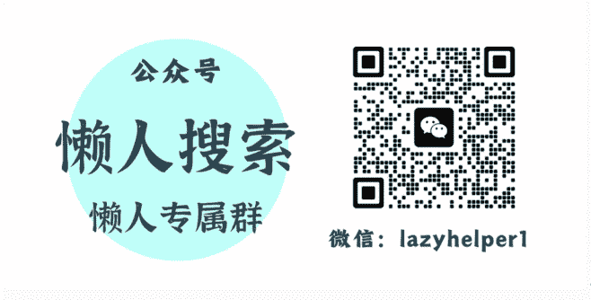

# 一年一度，这可能是“最厉害的”说服术

251217

整理：公众号懒人搜索，懒人专属群独享

懒人微信:lazyhelper

最近，色彩机构潘通，发布了 2026 年的“年度代表色”。这个颜色叫，云上舞白。大概可以理解成，“在云彩上跳舞的那个白”。这个颜色的英文原名叫，Cloud Dancer，直译过来是“云上舞者”。听起来带点“松弛感”，有没有？

但巧的是，很多年前有部不太出名的美国电影，也叫 Cloud Dancer，不过它当时的中文译名是《云霄大追杀》，松弛感一秒消失。你看，翻译还是挺重要的不是？讲法不同，带来的感受也完全不同。

书归正传。我们之前讲过潘通的商业模式，讲过它的企业故事，但是今天，咱们换个角度，说说潘通是怎么讲故事的。不瞒你说，潘通每年发布年度色这个事，在我个人看来，堪称是一年一度的“最佳商业叙事”。

你看，每年潘通发布年度色之后，时尚界、设计界、家居界，都在讨论。品牌开始调整产品线，设计师开始重新配色，媒体开始解读它的深层含义。

但问题是，凭什么潘通说这个颜色会流行，全世界就信了？它又不能预测未来。它也不是什么神秘组织。它就是一家美国的色彩管理公司啊。

更关键的是，这是潘通 26 年来，第一次把白色选为年度代表色。白色，这个最基础、最没特点的颜色，潘通却说这个颜色会在 2026 年流行。它是哪来的底气做出这个预测的呢？为什么它觉得人们一定会信呢？

换句话说，这就好比，年底了，潘通向全世界所有跟色彩有关的行业，包括时尚业、家具业、广告业，潘通向全世界的所有这些行业，递交了一份标书。然后标书上写着两个大字，“选我”，我说的这个颜色就是对的，就应该流行。然后，它居然就中标了，大量的行业就会跟随。比如我们前段时间讲过，就连云南的鲜花育种，有一部分都是紧跟着潘通色走的。

那么，潘通是怎么做到的？

注意，我们不是否定或者质疑潘通对色彩的洞察。我们的重点是，从潘通的叙事方式里，找到一些关于说服的共性技巧，并且希望这些技巧也能为你所用。

好，咱们正式开始。潘通做了什么 呢？

第一步，是先给你一个“听起来很有道理”的解释。

潘通发布云上舞白的时候，他们的一位高管是这么说的：“在这个转型时期，当我们重新构想未来及自身在世界中的定位时，云上舞白这种内敛的白色调，预示着一份清晰与明朗。周遭的喧嚣已令人不堪重负，使得我们难以倾听内心深处的声音。以简化为显著特征，云上舞白能提升我们的专注力，让我们远离外界的干扰。”

而潘通的另一位高管说：“云上舞白这种轻盈的白色，为创意开启了广阔空间，让想象力自由驰骋、漂浮，从而孕育出新的洞察与大胆的构想。”

你看，这套解释里，有几个关键词：清晰、明朗、简化、专注、创意、想象力。

听起来是不是有点道理？

注意，这只是感性层面的表述。而为了增加逻辑层面的说服力，潘通每年都会配上一些调研数据。比如今年，潘通针对“云上舞白”给出的数据是，全球公民平均每天的屏幕使用时长超过 6 小时 40 分钟。成年人一天获取的信息量，可能超过 20 年前一个人全年的信息。

而有了数据之后，潘通的潜台词也许是，你看，现在信息这么多，大家这么焦虑，所以需要一个“视觉上的喘息之地”。而云上舞白，就是这个喘息之地。

再往前看，2019 年，潘通发布的年度色是珊瑚橙。潘通给出的解释是：在纷繁复杂的时代，人们需要寻找被赋予人性化品质的色彩，珊瑚橙带来滋养、舒适和亲和力。你看，又是把一个社会情绪，跟颜色绑定在一起。

2020 年，潘通选择了经典蓝。这次的解释是：在科技加速变化的时代，人们需要一个能提供稳定和平静感的颜色。经典蓝就是这样一个颜色。

这是潘通的第一步，给出一个“听起来很有道理”的解释。它找到了一个真实存在的社会现象，然后把这个现象跟它选的颜色绑定在一起。

第二步是，建立“它说的应该是对的”的权威感。

首先，潘通有一套标准化的色彩体系。它拥有超过 1 万种颜色标准，每一种颜色都有一个独一无二的编号。这套体系的样本册，售价高达 9000 美元一本。但全球的设计师、制造商、品牌商，都愿意买。

因为这套标准，已经成为事实上的国际色彩语言。你说“PANTONE 11-4201”，全世界的工厂都知道这是什么颜色。一旦你建立了标准，你就有了话语权。

其次，潘通的年度色不是随便选的。它会邀请 20 位行业专家，从春季开始反复研究流行色，整个过程持续 9 个月。

据说，这些专家会从当年的社会大事中汲取灵感，综合考虑经济、政治、文化等多重因素。

最后，是一直重复前面两步，发布年度色这个事，潘通已经做了 26 年。从 2000 年开始发布到现在，从来没有中断过。

长时间的积累，本身就会带来“权威感”。人们会想：它做了这么久，应该是有道理的吧。

这是第二步，通过标准化体系、专业流程、历史积累，建立了权威感。

第三步是，制造“你看，真的在流行”的现实验证。说白了，就是制造“自证预言”。

在正式公布年度色之前，潘通会跟多家公司签订许可协议，让这些公司提前用年度色制作产品。等到潘通公布年度色的时候，市面上已经有大量类似颜色的产品了。

这时候，消费者会看到：哇，这个颜色到处都是，真的在流行。但其实，这个“流行”是潘通和品牌们一起制造出来的。

咱们拿 2025 年的摩卡慕斯举个例子。

2024 年 12 月，潘通发布了 2025 年度色摩卡慕斯。发布之后，很多品牌在 2025 春夏系列中都用了摩卡慕斯。有的厂商推出了摩卡慕斯色手机，甚至有消费者把自己的车改装成同色系。消费者看到这些产品，会觉得：摩卡慕斯真的流行了。

但你想想，这些品牌为什么会在潘通发布之后立刻跟进？因为有一部分品牌，是提前就知道了。它们跟潘通签了协议，提前拿到了年度色的信息，提前设计了产品。

等潘通一发布，它们的产品就上市了。

这大概是潘通每年都在做的事情：

> 找到一个时代情绪，然后把它跟年度色绑定。而每一次，市场都会跟进，品牌都会采用，消费者都会看到“这个颜色真的在流行”。

这就是“自证预言”的逻辑：我说它会流行，然后我让它真的流行起来。

而且，潘通还会推出联名产品。

比如，潘通已经为云上舞白推出了 12 项联名，涵盖美妆、数码产品、家具、服饰等多个领域。这些联名产品，会进一步强化“云上舞白正在流行”的印象。

这是第三步，制造“自证预言”。

最后一步，给你“我也有这种感觉”的情绪共鸣。

什么意思？就是让你觉得：这个颜色说的，就是我现在感受。

比如，潘通在解读云上舞白的时候，提到了几个社会趋势。

## 首先，是情绪经济的爆发。

中国情绪经济的市场规模达到了 2.3 万亿元。预计到 2029 年，这个数字会突破 4.5 万亿元。超过 80% 的消费者，每个月至少有一次以治愈、解压、奖励自己为目的的“情绪消费”。这个趋势是真实的。人们确实越来越在意情绪价值。

## 其次，是极简主义的回归。

无印良品在 2025 财年第一季度，销售额同比大涨 21.3%，营业利润增加了 58.2%。这也许说明，在经济不确定性增加的背景下，消费者更青睐简单、纯粹、不浮夸的东西。你看，这个趋势也是真实的。极简主义确实在回归。

## 最后，是 AI 时代的“留白”需求。

据说，现在全世界有超过 2 亿人，愿意在视频网站花钱买会员，就为了去掉广告。因为他们受够了信息轰炸，他们想要一个干净的界面。这个需求也是真实的。人们确实需要留白。

你看，这三个趋势都是真实存在的。潘通做的，是把这些真实的社会情绪，嫁接到它选的颜色上，努力在普通人中制造共鸣。

有意思的是，潘通的预测也不总是准的。比如，2022 年底，潘通发布 2023 年代表色“非凡洋红”。但实际上，2023 年真正流行的是上半年的多巴胺色系，以及下半年的美拉德色系。

说到这，潘通的说服逻辑我们已经拆解完了。

那么，这套说服术，对我们有什么启发？

假如我是一个品牌，我不一定要跟随潘通色，但我可以学习它的说服逻辑：找到真实的需求，给出合理的解释，建立权威感，制造现实验证。

假如我是一个设计师，我不一定要用云上舞白，但我可以思考：我的设计，有没有给用户提供情绪价值？有没有踩中时代的节奏？

假如我是一个创业者，我不一定要关注年度色，但我可以学习潘通的方法：如何把一个产品，变成一种趋势？

换句话说，与其说潘通是在“定义颜色”，不如说，它是在“发现情绪”，然后，找到一个故事，让这种情绪与某个色彩之间，同频共振。

### 最后，安利小懒的付费群：

懒人专属群（介绍）

🛡这里是你对抗信息过载的护城河。
已稳定运行 6 年，累计拆解、研读 3000+ 个互联网商业实战案例与行业前沿内参和时政/宏观文章。

我们不搬运垃圾，只做高价值信息的筛选器与放大镜。

### 懒人专属群更新记录：

https://hk57gvlx7u.feishu.cn/docx/H0kRdZbSbolBR0xkaXtcuVE0nTg

懒人专属群更新记录（需梯子，备用）：
https://lazybook.fun/blog/record2

【免责声明】本资料归档于社群内部知识库，仅供成员课题研究与学术交流，请在查阅后 24 小时内删除。