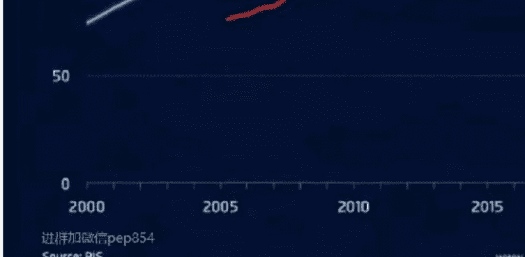

# 2026 年，三大泡沫会否崩盘？

2025 年 12 月 15 日 六爷阿旦

整理：公众号懒人搜索，懒人专属群筛选
懒人微信：lazyhelper1

## 前言

美国开启战略收缩，美元该怎么办？今天这篇文章就是对这个问题的一个系统梳理。因为美元超发形成了当前最显著的房产、AI 和数字币，这三大泡沫。在美国收缩的同时，如果美元进一步收缩，那么这三大泡沫很有可能会在 2026 年引发崩盘。以当今的全球化程度，这对全世界而言，都将是一场灾难，其影响将远超 1929 年大萧条，并可能会引发新的世界大战。

那这一切会发生吗？我以美国金融资本的视角进行了梳理和解答，全文 5000 字，希望对大家的 2026 年有所帮助。

2025 年马上就要过去了，对于我们很多普通人来说，这可能依旧是比较艰难的一年。不过从经济周期的角度来说，有观点认为，2026 年，将进入衰退周期的拐点，也就是新一轮复苏，可能将会在 2026 年启动。

我们看现在的国际环境，在 2026 年似乎也有可能会构成一个转折点，主要原因就在于中美之间的关系，有可能从全面的对抗，转为局部的交易和合作。应该说这是从外部的宏观环境上，给复苏也创造了比较好的条件和机会。

但是这种复苏的预期，其实始终都是站在我们的视角下来看问题。之所以从我们的视角看复苏的机会比较大，那是因为这几年以来，我们其实一直在进行经济结构的调整。房地产已经回到了 2015 年翻倍上涨前的水平，国内的风险释放，应该说已经初步实现。

但是现在的问题是，从宏观周期来讲，美国的周期跟我们恰好是一个错位的位置，也就是美国有可能是恰好处于繁荣转向萧条的拐点上。而且从中美之间国际关系的调整来看，站在美国的角度来理解，跟我们也恰好相反，就是美国放弃对抗，本身是迫不得已的选择。

那么在这样一种情况下，再来看一下 2026 年最大的宏观风险，其实就集中在美国的三大泡沫，会不会崩盘上。以当今的全球化程度而言，如果美国出现系统性的泡沫崩盘危机，那全世界可能都难以幸免，所以这是 2026 年宏观层面，最大的一个问题。

## 房地产泡沫会不会崩盘？

首先我们需要看美国的资产泡沫会不会崩盘，这个资产泡沫，主要就是指美国的房地产泡沫。

我前面说美国在经济周期上可能跟我们出现了一个错位，这里面房地产市场的价格走势，就是一个比较典型的代表。因为我们这边的房地产市场价格是在 2021 年见顶，其实有很多二三线城市的房产价格，在更早之前的 2019 年，2020 年，就已经见顶，出现了滞涨的迹象。

但是美国恰好跟我们相反，美国是在疫情之后，为了救市，当时搞了无限量放水，而且是搞了好几轮放水，这样美国国内的资产价格，从 2020 年开始出现了一轮全面的大幅上涨，甚至当时美国都遭遇了比较严重的通胀危机。

在这个过程中，美国的房地产价格，在最近这几年出现了加速上涨，有些热点地区的房价，甚至出现了翻倍上涨。

所以中美两国以房地产为代表的资产价格，在 2021 年，开始分道扬镳，出现了两种截然不同的走势。如果从风险的角度来看，我们目前不敢说在山脚下，但至少应该回到山腰以下了，而美国呢，现在应该是在山顶。

之所以说美国的房地产价格有可能正处在山顶上，这是因为 2026 年，正好是美国房地产周期的一个拐点。说到这个拐点，就不得不说美国房地产市场的一个 18 年周期。

美国经济学家 FredFoldvary 的研究指出，自 1800 年以来，美国地产中长周期通常跨越 18 年左右，短周期则受美债长端利率影响，跨度在 35 年。

该周期的核心驱动力包括人口购房周期和金融信贷周期：美国人通常 25 岁左右首次购房，偿还 30 年房贷后约 55 岁进入换房或投资阶段，形成 18-20 年的需求迭代；同时银行信贷宽松与收紧的周期约 18 年，二者叠加推动房地产市场呈现规律性波动。

美国房地产的这个 18 年的周期，在最近的这 50 年里，有过三次崩盘验证。分别是在 1972 年，1990 年和 2008 年，这中间的间隔恰好都是 18 年。

### 美国房价到顶了吗？

1972 年崩盘：战后住房需求旺盛引发过度开发，银行信贷宽松导致供过于求，房价暴跌 20% 以上，大量建筑企业和银行破产。
1990 年崩盘：日本资金撤离美国商业地产，纽约、洛杉矶等热点城市房价跌幅超 30%，距上一轮崩盘恰好 18 年。
2008 年次贷危机：次贷衍生品泡沫破裂引发全球金融危机，房价暴跌且楼市低迷持续至 2012 年，与 1990 年崩盘间隔同样为 18 年。

而 2026 年距离上一次的房价崩盘，也就是 2008 年，正好是 18 年。

现在美国的房价，早就已经超过 2006 年泡沫时期的峰值，衡量房价相对高低的一些指标，比如房价收入比，房贷负担率，也基本上都是处于近 20 年来最差的水平，这些也都是周期尾端的估值泡沫特征。

目前 30 年期抵押贷款利率在 6.2% 左右，这么高的贷款利率，对于购房需求，也形成了很大的压制。

对美国房地产市场而言，目前唯一的好消息，可能就是住房的供给侧没有制造太大的压力。但是在 2026 年会不会形成一个拐点，美国房地产 18 年一次的崩盘周期，2026 年会不会再次验证？

目前来看，确实还不好说。

## AI 泡沫会不会崩盘？

美国资产价格的泡沫化，本质上都是因为背后美元泛滥的阶段，那就相当于全世界都是美元的池子，但现在的问题是美国要进行战略收缩，那扩张的美元，就只能在美国国内找资产池子进行承接。

所以这不仅是美国房地产的问题，而是美国所有的资产价格，在泛滥的美元推动之下，都在出现泡沫化的特征，美国的房地产是如此，美股更是如此。

现在美国股市有泡沫，这一点来说，应该说是大家的共识，但是问题就是这个共识始终没有被市场验证，不仅没有被验证过，反倒是被市场一次又一次的打脸。

在 2019 年以前，美股的估值，大家就觉得偏高，但是在经历了疫情期间的放水之后，美股又经历了翻倍的上涨。道琼斯指数 2 万点，你觉得高，涨到 4 万点，4 万点你还觉得高，现在已经快 5 万点了。所以说美股的极限在哪里？

可能在你想象力尽头的一光年之外。美股泡沫化的问题，其实现在最主要的体现，就是集中在人工智能产业的泡沫化上。

现在美国最炙手可热的那些 AI 企业，到目前为止，基本上都没有赚钱，但是这并不妨碍人们给他一个很高的估值。

像搞大模型的 OpenAI，目前的估值是 5,000 亿美元，但是今年的营收可能也就只有 130 亿美元左右，而且还是亏损的。如果明年 OpenAI 再进行融资，它的估值有可能继续上涨，搞不好有可能搞到 1 万亿以上。只要他的故事讲得好，他的估值可能会一路水涨船高。

现在人工智能的处境，非常像是在人类科技生产力大突破的前夜。

所有的投资人都相信，人工智能一旦有了大的突破，那么人类的生产力将会实现飞跃，所以说目前不仅是在美国，在我们这边也是投入了海量的资金，而且这种资金的规模，后续可能还会继续增加。

因为对于投资者来说，这种机会可能是百年难得一遇的。钱的价值，在当今这个时代已经变得很廉价，而投资人工智能的潜在收益，有可能是无穷大的，这是大家的一个共识基础。

但是人工智能在什么时候会有实质性的突破，目前谁也说不好，最乐观的预期，可能就是三年内。最悲观的，可能也看到了 10 年后。

所以我把这件事情总结为一句话，叫“望山跑死马”。

通用人工智能的实现，可能是很美好的。这个美好的未来，就像一座山，立在天边，大家都看到了，都在往那个方向跑，都在不停的追加投资，但是什么时候能跑到，谁也不知道。

所以这自然也会引发一个疑问，就是这场人工智能投资的 AI 泡沫，会不会崩盘？

说实话，我个人的预期比较悲观，尤其是在美国这一侧，他们对于人工智能的投资，依旧是投资于芯片和大模型，也就是对于算力的追求上，但是现在美国受制于两个瓶颈的限制。

一个是算力背后需要电力的支持，美国这种算力的增长，再往后，美国电力的供应可能跟不上。

微软、亚马逊、谷歌、Meta、甲骨文五大科技巨头计划在 2025-2027 年新增至少 16GW 算力集群，且 2027 年亚马逊总算力将实现翻倍；到 2030 年，美国整体 AI 算力规模预计达到 153GW，其中 2026-2030 年每年新增算力约 40GW。

按这个增速来看的话，美国后面五年年均电力需求增速需要达到 4%-5%，才能满足算力增长带来的电力需求缺口，而过去 20 年，美国电力增长的历史均值不到 1%。美国要按五倍的增速来建设电力基础设施，他们能做到吗？

2030 年美国 AI 算力预计需用电约 1269TWh，占全美总用电量的 22%；而 2023 年美国数据中心用电量仅为 176TWh，占比 4.4%，五年内电力需求将增长超 6 倍。美国能源部预测，到 2030 年电网需新增约 101GW 负荷，其中 AI 数据中心贡献近一半；但同期美国规划的基荷电源仅新增 22GW，电力装机容量缺口超 70%。

另一个就是美国人工智能在产业上的落地。目前美国的人工智能，始终是集中在大模型和算力的建设上，怎么转化成工业的生产力，甚至如何构建盈利模式，目前都是一团浆糊。说白了，这是一个还处于讲故事阶段的投资。

但是从前面说到的美元超发，后面需要资产池子的这个角度来说，美国的 AI 产业大发展，这个估值的弹性空间还非常大，理论上来说，容纳的美元可以达到十万亿的规模。

从我个人观察的角度来看，虽然对 AI 泡沫看空的人很多，但我个人感觉，这一块反倒会是比较坚固的。因为我观察到的一个迹象，是美国的资本财团，正在 AI 产业上进行抱团，搞交叉持股。

这一幕最早是在罗斯福时代，对华尔街进行整顿的时候，美国的金融资本巨头，就搞过这样的操作，就是化整为零，交叉持股，隐蔽身份。后来日本在 90 年代房地产泡沫崩盘之后，为了避免美国资本来进行抄底，日本的财团也学习过美国的这种做法，就是交叉持股，以时间换空间。

目前英伟达，AMD，微软，甲骨文，特斯拉，英特尔，其实已经开始了这种交叉持股的操作。最新的迪士尼背后的财团，也已经在入股 OpenAI。我预计这一趋势，在 2026 年还会继续扩大。通过交叉持股的操作，形成铁索连船。

后面美国资本财团，有可能会继续追加投入。因为就目前来说，我个人的感觉是，他们已经把未来所有的翻盘希望，全押在这上面了。

所以在这一块，AI 泡沫会不会在 2026 年崩盘？

我个人的看法相对会比较谨慎。如果 AI 泡沫不会崩盘，那大概率的，美股可能也很难崩盘。

但是如果在明年 4 月，中美之间达成了一份比较好的贸易协议，那未来的投资方向，有可能会从对抗的机会，转向合作的机会。这是要注意的一个点。

## 稳定币泡沫会不会崩盘？

特朗普放开了对于数字货币发行的监管。很多人把这个认为是特朗普自己要发币赚钱。但说实在的一个方面，但更重要的是它背后有一个大的趋势。特朗普应该是已经听别人跟他指点清楚了，他才这么做的。

这个趋势就是我前面提到的，美国战略收缩和美元扩张之间的矛盾。美国战略收缩之后，美国主导的全球经济一体化的这种利益覆盖，也不是美国霸权可以掌控的时代了。

那么在这个趋势之下，美元理论上来说就必须进行收缩，不能再作为全球货币，但是现在美国的债务又在不停的增长，美元还要继续进行放水。

这很显然，就形成了一个矛盾。

如果要解决这个矛盾，目前来说，就只有两种办法。

一种办法就是缩减债务，消灭美元。其实现在的货币发行，基本上都是以债务为基础的。因为债务就可以形成一笔资金，或者说抵押，就可以发行货币。如果反向操作，要消灭过多的流动性，那就是刺破资产泡沫的同时，消灭债务，也消灭货币。

还有一种办法，就是扩大池子。

打造更多的资产池子，来容纳超发的美元。比如国债市场，美股市场，美国的房地产市场，以及前面说到的人工智能新兴产业，这里面都需要投入海量的资金。如果这些都还不够，那特朗普放开数字币的发行监管，就是在打造新的资产池子。你要说这种资产信用不够，那没有关系，美国已经进行了新的立法，这种数字币换了一个模式，现在叫做稳定币。他的发行就需要用美国国债作为抵押。目前美国也在推动这一趋势，就是数字币的发行，都要建立以美国国债为核心的资产储备。美债，这对美国来说就是一举多得的好事。

但是在我看来，这里面有一个更关键的地方，也就是说是全世界的资金，在维持数字币的泡沫，它潜在的影响相对就比较小。

所以说如果美国有这样一个消灭多余流动性的需要，那么选择数字货币，应该是合理的。但是现在最大的问题在于，目前的数字货币规模还不够大。

根据 CoinGecko:2025 年 12 月 12 日的数据，与美国有核心关联的数字货币总市值为 4054.91 亿美元，24 小时交易量达 296941 亿美元。

说实话，这个规模还太小。美国房地产市场总规模大约是 55 万亿美元，美股总市值大约是 20 万亿美元，美国国债总规模将近 40 万亿美元，而数字货币的规模，现在几百亿美元都还处于起步阶段。

用，就得看美国如何考虑了。

最后说实话，美国现在面临的难题依然很难。最难的部分，就是我前面说到的，到底应该对抗还是合作来看，大家应该有一个共识，就是尽量避免，再出现崩盘，危害很可能超过 1929 年的世纪大萧条。

那样的话，人类有可能几十年都缓不过来，并引发新的世界大战。

所以从这个角度来看的话，美国最务实的选择，是有效的做大资产池子的方式，就是吞并加拿大、墨西哥。把这两块资产拿到手，再进行债务置换，美债的发行空间，至少可以增加到 100 万亿美元。

那样的话，美元就不是泡沫，而是没有泡沫就不好喝的啤酒。

最后，安利小懒的付费群：

懒人专属群（介绍）

📚 这里是你对抗信息过载的护城河。

已稳定运行 6 年，累计拆解、研读 3000+ 个互联网商业实战案例与行业前沿内参和时政/宏观文章。

我们不搬运垃圾，只做高价值信息的筛选器与放大镜。

## 懒人专属群更新记录：

https://hk57gvlx7u.feishu.cn/docx/H0kRdZbSbolBR0xkaXtcuVEOnTg

懒人专属群更新记录 (需梯子，备用):

https://lazybook.fun/blog/record2

【免责声明】本资料归档于社群内部知识库，仅供成员课题研究与学术交流，请在查阅后 24 小时内删除。