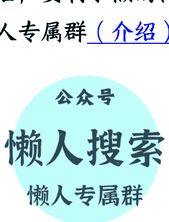

# 185 | “提升中国居民消费”，成了中美共识

251218
整理：公众号懒人搜索，懒人专属群筛选
懒人微信：lazyhelper1

欢迎打开《蔡钰·商业参考 4》，我是蔡钰。

上次我们提到特朗普政府的美国《国家安全战略报告》，有个细节很特别，报告说，“我们必须鼓励欧洲、日本、韩国、澳大利亚、加拿大、墨西哥以及其他主要国家采取贸易政策，使中国经济向家庭消费倾斜。”

无独有偶，就在 10 月份，摩根士丹利的前首席经济学家史蒂芬·罗奇，以 80 岁之高龄，也特意跑到中国给“十五五规划”提建议，要中国在 10 年内把家庭消费占 GDP 的比重提高到 50%。

让中国提高家庭消费，听上去是一片好意，也是中国本来就在努力推动的，提消费就是稳增长嘛。

但为什么，美国要把这事看作它国家安全战略的一部分，还说要用结盟搞贸易胁迫、来逼中国做一件对中国自己有好处的事情？

这是因为，让中国扩大家庭消费也就是居民消费，对美国自己的好处更多。

## 三个好处

这种好处至少有三个：

- 第一个好处，提升美国制造业的相对竞争力。

中国多消费，也就意味着少出口，家庭消费力提升后还可以多买点儿 iPhone、特斯拉、开心果。美国也赢得了产业回流的时间。

- 第二个好处，削弱中国的整体竞争力。

中国当前享受着一个顺差飞轮：制造业顺差带来外汇与利润积累，带来再投资与研发，带来技术进步，带来更强的制造业竞争力，带来更大顺差。

这个飞轮，不只给中国带来经济优势，还带来了对外投资能力、金融安全缓冲、对“全球南方”的影响力、在制裁环境下的抗压性，等等等等。

《美国安全战略报告》里反思前些年科技贸易战时，也意识到了这一点。

而如果中国大幅提高家庭消费比重，飞轮末端的顺差扩张就会放缓甚至收缩，制造业的研发和扩张资源减少，国家层面的外部缓冲能力也会下降。

- 第三个好处，是重塑全球规则叙事，把压力给“道德化”。

什么意思？

简单来说，就是把美国自家的逆差问题转化成了中国经济的结构问题。

如果美国直接说：“我要冲逆差、降赤字，还要维持美元霸权，你得让着我。”这谁听了都反感。如果换一种说法：“这么做对世界和对你都好。”这就变成了道德和责任叙事，有了拉拢盟友的理由。

家庭消费，正好是这种叙事的最佳切口，听上去比制裁、关税什么的要友善多了。至于提升家庭消费的同时，你在汇率、收入分配、产业结构、顺差规模上要付出什么代价，叙事里是不能提的。

所以啊，美国对中国这个经济对手“家庭消费”的关心，有点像我们经常在娱乐行业看到的故事。各种颁奖礼，会给最牛的歌手、演员和导演颁发“终身成就奖”，背后的含义其实是：您退场吧，有您在永远也轮不到我们拿奖。

但区别在于，明星们拿完终身成就奖，只是象征性退场，不再拿奖，还是可以继续唱歌拍戏的；而美国对中国的要求却是实质性退场，回家把“家庭消费”这个孩子的胃口撑大，让孩子在国际贸易链条里多吃饭、少做饭。

## 压迫升值

话说回来。提升家庭消费或者叫居民消费，对中国自己的经济大盘也是有好处的。

你肯定有感受，这两年国内各种消费补贴、新增假期层出不穷。我们刚刚开完的中央经济工作会议，也在鼓励消费。会议开完后，商务部、中国人民银行、金融监管总局等三部门还联合发布了一个《关于加强商务和金融协同 更大力度提振消费的通知》，要求商务和金融系统帮着提振和扩大消费。

但美国，或者说特朗普政府，作为一个把中国看作“经济竞争对手”的外部力量，喊出的提升中国家庭消费，用什么手段能实现呢？总不能以美国财政部的名义给中国居民发钱吧？

外部力量用的当然是外部手段，而且要能快速见效的那种。办法之一就是美国《国家安全战略报告》里提到的盟友联合贸易政策，办法之二是要求人民币大幅升值。

2025 年前 11 个月，中国累计贸易顺差历史性地突破了 1 万亿美元，这让西方相当震惊。《纽约时报》很快总结说，这是因为人民币汇率在走弱，以及中国物价在欧美物价上涨的同时却下跌。

随后，《纽约时报》在另一篇报道里列出了中美酒店客房、麦当劳汉堡、一加智能手机和比亚迪海豹的巨大价格差异，然后就下结论说，人民币汇率偏低，是“当前全球经济里最显著的、扭曲的现象”。

随后，几乎同一时间，金融机构们也开始配合喊话了。高盛在一份研报里语出惊人，说人民币被低估了 25%。国际货币基金组织 IMF 也说，中国应该允许人民币升值，并更多地依赖国内消费，而不是不断增长的出口。这也就算了，IMF 甚至还建议，中国缩减不必要的产业政策支持和低效投资。

这话再翻译一下，就是在说，你中国别搞产业升级了，赶紧让居民吃喝玩乐起来。

这话说的，已经明显超出了 IMF 的合理表达边界。它作为一个中立国际组织，是不应该直接要求一个国家政府干预汇率的。但这个态度，倒是跟美国刚发的《国家安全战略报告》十分一致。

我们可以认为，特朗普政府对 IMF 的施压成功了。就在几个月前，美国财长贝森特就公开要求 IMF 点名批评中国的货币政策，随后让自己的前幕僚长去给 IMF 总裁当起了第一副总裁。

## 《广场协议》

如果你觉得这套操作似曾相识，那你的感觉对了：40 年前，美国对日本干过几乎一模一样的事，逼日本签署了《广场协议》，推动日元快速升值，最终演化为日本失去的十年、二十年、三十年。

我得给你简单回顾一下这个世界经济史当中的名场面：

1980 年代初，美国也深陷类似今天的双赤字困境里：财政赤字扩大，贸易逆差恶化，制造业加速空心化。

怪谁呢？美国认为，怪当时的世界顺差大国——日本。在当时，美国市场被日本汽车、电子产品填满，国内民众对日本的不满情绪也极高。

美国当时也是面临两条路的选择。

一条路是继续加关税、搞配额、打贸易战。但那会引发盟友反弹，也会直接推高通胀，政治代价极大。

而另一条路就是把问题给“技术化”，通过逼日元升值来解决自家的困境。

美国要求日本办点事还是容易的。

1985 年，美日之间签了一份《广场协议》，随后短短两年，日元对美元汇率直接从 250:1 升到了 120:1，升了一倍。

这种升值法，当然把日本的出口、就业冲击得无比惨。日本政府为了维持自家经济，不得已又大幅降息，这又引发了楼市和资产的泡沫化，直到 1990 年代经济被彻底拉爆，40 年过去也没能恢复。

而这期间，美国制造业确实赢得了喘息空间。这个喘息空间，也是用指责日本顺差过大、汇率扭曲、让 IMF 配合喊话、用道德叙事铺路这套组合拳打出来的。历史并不重复，但确实会押韵啊。

## 升值的优劣

好，回到我们自身。提升居民消费和推动人民币升值，中国对这两件事到底是什么态度呢？

提升居民消费，这个不用说了，中国也是在大力推动的。

人民币升值呢？就在 11 月份，人民币其实有过小幅升值。但进入 12 月后，中国央行出手干预，放慢了它的升值步伐。

到了中央经济工作会议，会议也要求说，2026 年要“保持人民币汇率在合理均衡水平上的基本稳定”。

大概意思，还是让汇率稳住，不要急着上蹿。

那问题就来了：人民币升值，不也能降低我们进口原材料的成本吗？为什么一定会导致出口涨价、打击外贸竞争力呢？

关键在于，收入端受到的冲击快，成本端受到的冲击慢。

中国的出口商品，大多以美元或者欧元计价，而没有定价权。亚马逊上卖 200 美元的小音箱，人民币升值了也仍然只能卖 200 美元。你一涨价，订单马上给了土耳其卖家。

所以，出口企业不敢跟着汇率变动涨价，只能忍受利润缩水。等到成本端进口的下一批原材料、设备进入新的循环，出口企业的一口老血已经吐出去了。

出口企业就算真的因为本币升值，买到了更便宜的进口原材料，它的整体生产成本也是在升高的。因为中国制造业的成本结构里，真正的大头是本地化成本，比如工资、土地厂房、税费社保、本地配套服务、融资成本等等，这些成本并不会因为本币升值而变便宜。

所以，本币升值给外贸行业带来的结果就是，收入端等比例缩水，成本端只部分下降，利润率被迅速压扁。

这也是为什么过去两年，你越来越多听到一个说法叫“宏观政策取向的一致性和有效性”，放到汇率上，当然也要求汇率服务于经济大局。

## 总结

好，以上，我们关注“提升中国居民消费”这个奇特的中美共识，分析了共识背后的美国动机和对中国的影响，还借它简单回顾了日本 40 年前《广场协议》的简单脉络。

把这些线索总结起来，就是我们需要在 2026 年留意的一个趋势：中美之间的经济博弈，要从单挑关税战，扩展到联盟关税战与汇率战的组合了。

其中的关税战是显性的；而汇率战是隐性的，它会被包裹在“提升家庭消费”的这个叙事里。

你认为，2026 年的人民币汇率会保持稳定，还是用升值来换点别的什么呢？

听听你的想法。

再见。

## 最后，安利小懒的付费群：

### 懒人专属群（介绍）

微信：lazyhelper1

📝 这里是你对抗信息过载的护城河。

已稳定运行 6 年，累计拆解、研读 3000+ 个互联网商业实战案例与行业前沿内参和时政/宏观文章。

我们不搬运垃圾，只做高价值信息的筛选器与放大镜。

### 懒人专属群更新记录：

https://hk57gvIx7u.feishu.cn/docx/H0kRdZbSbolBROxkaXtcuVE0nTg

### 懒人专属群更新记录 (需梯子，备用):

https://lazybook.fun/blog/record2

> 【免责声明】本资料归档于社群内部知识库，仅供成员课题研究与学术交流，请在查阅后 24 小时内删除。