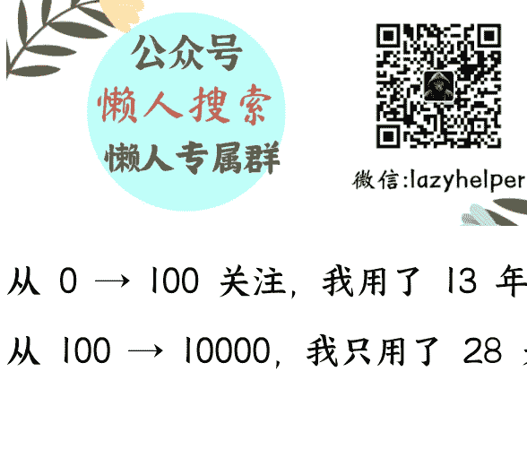
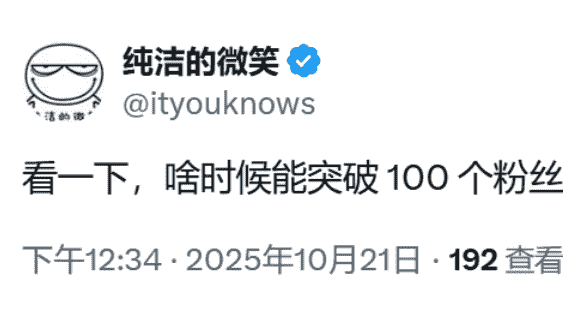
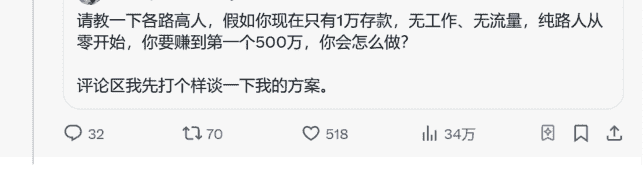
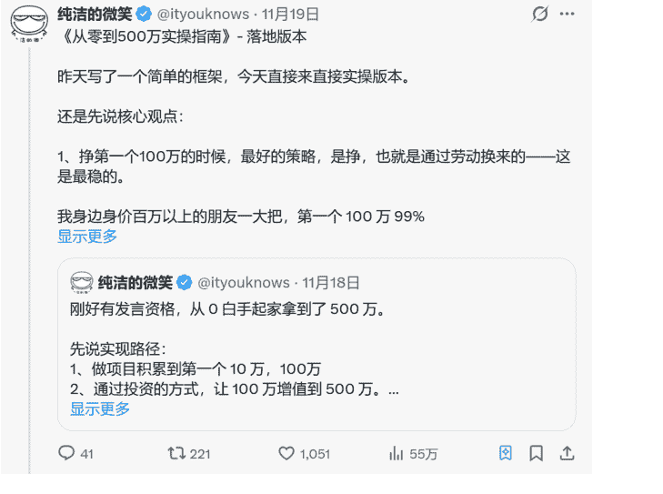

# 28 天，X 平台涨粉到 10000 读者，一手热乎的经验深度复盘

### 2025 年 12 月 18 日 副业 SC 精华

公众号懒人搜索，懒人专属群独享

懒人微信：lazyhelper

从 0 → 100 关注，我用了 13 年。

从 100 → 10000，我只用了 28 天。

给大家做一个深度复盘，我是如何从 0 开始启动，做到 10000 粉丝的。

先和大家聊聊我为什么要做 X 平台？

2025 年开始，我给自己定了一个目标：以后只关注 AI、出海、Web3。为了执行这个方向，我就不断去了解海外的一些真实场景。

X 平台算是我出海第一站，我推特账号最早是 2012 年注册的，从 2012 年到 2025 年 8 月，一共只有十几个粉丝。

到了今年 9 月，我才下定决心做一个 X 博主，原因很简单：我看到身边两个人拿到了结果。

一个是涛哥，他在 X 平台做到了 2 万读者，我打听了一下，他从 X 引流了不少用户。

另外是在生财线下大会，听到一个博主说：在 X 平台 1 万多粉丝，2 个月变现了十几万。（她属于比较厉害的那种，平均下来，1 万关注每月几千元应该是有）

我一听：变现效率这么高？那我一定得试一试。

## 第一阶段：漫长探索期

我们都想先付费节省时间。

从 9 月开始，我报了 N 个关于 X 的训练营，或者付费进了不同 X 博主运营的社区；也看了很多付费帖子；还按各种“专家建议”去写起号贴，甚至找大 V 帮我转发。

但粉丝量仍然没突破 100。

那会儿我有点着急，市面上看到各种涨粉方案我都想试。看到有人在平台互关涨粉，我也加入了，别说，还真有一点点效果——粉丝终于从十几个突破了 100 个。但真要靠互关涨到一万，那得等到何年马月？肯定行不通，所以我还是一直在探索：怎么做才能更快涨粉。

## 第二阶段：付费咨询

后来我在一个付费社群里，看到一个朋友说他可以提供付费咨询。因为我看他跟我一起进的同一个社群，我几乎没咋涨粉，但他直接从 0 涨到 1 万多。

我判断：这种一手经验，才最值钱。于是我加了他微信，直接付费，让他带我干。

第二天我抽了半小时，和他通了半小时语音。他大概讲了下 X 平台的特点，以及新人输出需要注意的事项等。就这半小时，真的帮我打通了任督二脉。

我到现在还记得最重要的几个点：

- 1、改头像，让老粉一眼认出我，直接关注。
- 2、改简介，让新读者知道我是谁、在哪个领域、关注我能学到什么。
- 3、不要发孤贴，去找热门帖子引用（quote）。
- 4、要开蓝 V，交保护费

## 第三阶段：小心尝试

聊完立刻行动。

我开始刷各个大 V 的帖子，看哪些话题适合我去引用（quote）。突然刷到大 V 发帖说：普通人如果从 0 开始，如何赚到 500 万。

我一看这话题很有吸引力，恰好我也是从 0 起步一路干过来的，于是把我的经验分享了一下，引用后发布了。

作为新人，发帖有两个关键点：你没粉丝，想 0 启动传播，刚开始确实需要做一点“辅助动作”。

- 1、把内容分成两部分：一部分自己发帖，另一部分作为评论发到大 V 的原帖下面（曝光量绝对比自己发要大）。
- 2、在 X 的社群里发红包，让大家帮忙加热——点赞、评论、转发。

有效果吗？非常有效。

我之前发了 3 个多月，没有一篇阅读量破 1000 的，大部分都是几十。

那天这条帖子阅读量直接破万，我盯着数据刷新，一直涨：从 100 到 1000，到 10000，再到 5 万，当天就破了 10 万，最终单篇阅读量 34 万。

当天涨粉 500+，第二天再涨粉 500+（真的快，一天顶十年）。

## 第四阶段：找到感觉，开始放大

虽然第一篇爆了，但我心里不踏实：会不会只是运气？

而且那篇只是讲了“赚 500 万”的思路和大概。既然这个方向大家感兴趣，那我就继续往这个方向写，看看能不能复刻。

第二天，我引用了第一天的帖子，写了一篇《从零到 500 万实操指南》——落地版。

同样套路实操：发完去 X 社群发红包，请大家加热。没想到这一篇比上一篇还爆。

因为这篇更火，也把昨天那篇带起来了，最终这篇阅读量到了 55 万，粉丝涨到 1000+。

之前我也做了 7、8 年自媒体，也算有点经验。

我的感觉是：如果一个方向的话题好，那就持续写这个方向，直到没有流量或者没有素材为止。

于是我写了一系列“赚钱”话题：

- 1、上班可不可以攒到 500 万？别傻了。
- 2、可不可以用几万块本金，在股市里炒到 500 万？
- 3、在币圈炒币可不可以赚到 500 万？

几乎都爆了。

写完后粉丝就到了 3000+。

从这个时期开始，我给自己定了一个目标：每天必须发 3 个帖子，每天总阅读量要到 10 万+。

## 第五阶段：总结经验，坚持执行

当粉丝量大于 1000+ 以后，我就在想：每次发帖都要去群里发红包加热吗？这肯定不是长久之计。

后来我发现：不去群里加热，也能爆，影响没那么大。

1000 用户之后，帖子一般都有基础流量了；再去群里加热，边际效果就没那么大了，不需要过多干预数据。

除了赚钱这个话题，我发现在 X 平台，这些话题都比较受欢迎：网络问题、纯净 IP、赚钱、失业、AI、投资、数字货币、AI 绘画等。

只要帖子质量足够高，在 X 平台都比较容易爆。

我的定位是：AI、出海、Web3。

除了日常分享外，大部分内容都集中在这三个领域。

除了赚钱话题外，我在失业、投资等领域写的帖子也慢慢热了起来，到现在感觉节奏就稳了：一边按核心领域持续写，一边看到有趣的话题也会发一发。

基本上每天阅读量 30 万+，涨粉 150 左右。

## 第六阶段：X 平台如何变现

我给自己定的目标是：涨粉到 10000 之前不主动考虑变现，但就算这样，也被动赚了一点小钱。

有一天我写孙宇晨相关帖子，无意间爆了。

那篇成了我在 X 平台阅读量最高的一条：几天时间单篇破 100 万阅读量。我就顺势开通了 X 平台创作者收益，半个月后收到了马斯克的第一笔工资：668 元人民币（737 港币）。

另外，在 X 平台粉丝大于 2000，通常就可以被邀请进接商单群（如果你没有渠道也可以找我），就能接品牌商单。

一般按数据反馈，一个月好好接上几单，几千块块是有的——我已经接了两个了，下个月结算。

另外，接商单赚钱是一方面，真的是有机会可以依靠媒体，接触到市面上最新的一些出海产品，这种感觉比赚钱的还要好玩一些，相当于站在了一个信息的前沿阵地。

还有一块收入：一些读者通过 X 加了我微信，看到了我们公司的产品，也有部分读者报名了，收入一万多。

这就是我做 X 平台第一个月的收入。

在 X 平台做博主，收入大概就这几块：

- 1、X 平台创作者收益 / 订阅收益。
- 2、接商单（粉丝大于 2000 更容易参与）。
- 3、引流到私域，承接原有业务。

## 第七阶段：大道至简

所有技巧最后都会汇集成一句话：用户刷到你的帖子，为什么要关注你？

想明白这件事，就成功了一半。有的帖子有阅读量，但不一定有人愿意关注你。所以不能只为了阅读量去搞纯吸眼球的东西，要用高质量内容吸引同频的人。

另外，人都是慕强的。你要在帖子里体现价值，让别人有一个「愿意关注你」的理由，涨粉的速度才会真正起来。

长远来看，还是「人设、话题、内容」三位一体，再加上强制更新的节奏。我现在定的要求是按照这个标准每天更新 3 条帖子，涨粉就不会太难。

这其实和别的平台做 IP 一样，本质是共通的。

无非就那几个理由：

- 1、感觉你很牛，关注你可以开阔眼界。
- 2、你很有趣，看你内容让我开心。
- 3、你很专业：对投资/数字货币/AI 感兴趣的用户，刚好刷到你，你又讲得明白，自然就关注你了。

一句话：你要通过内容吸引到你的目标用户。

## 最后

28 天运营 X 平台的经历，让我很明显地感受到这个平台的活力，以及它非常疯狂的裂变机制。

从目前趋势来看，X 平台中文区用户越来越多。而且能在 X 上看到你内容的人，整体质量也相对更高。

你想一想：在国内任何平台，作为小白想写出一篇 10 万+有多难？在 X 上，这个难度系数至少能除以 10。

另外，每条帖子下面都会有很多人留言、讨论，创作热情完全不一样。

这种感觉有点像：2016 年的博客园、2017 年的公众号、2018 年的知乎。

对小白来说，如果想做自媒体，我对比过不少平台后的结论是：X 的冷启动更快，变现效率也更高。

从我的体感来看，X 仍然有流量红利，如果你真的想做自媒体，这应该是值得你去花时间、花精力去研究的一个平台了。

最后，安利小懒的付费群：

懒人专属群（介绍）

🛡️ 这里是你对抗信息过载的护城河。

已稳定运行 6 年，累计拆解、研读 3000+ 个互联网商业实战案例与行业前沿内参和时政/宏观文章。

我们不搬运垃圾，只做高价值信息的筛选器与放大镜。

懒人专属群更新记录:

https://hk57gvlx7u.feishu.cn/docx/H0kRdZbSbolBR0xkaXtcuVE0nTg

懒人专属群更新记录 (需梯子，备用):

https://lazybook.fun/blog/record2

【免责声明】本资料归档于社群内部知识库，仅供成员课题研究与学术交流，请在查阅后 24 小时内删除。