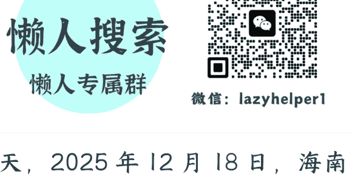

# 正式启动，海南封关背后的“真红利”与“关键点”

2025 年 12 月 19 日

整理：公众号懒人搜索，懒人专属群筛选

懒人微信：lazyhelper1



昨天，2025 年 12 月 18 日，海南自贸港正式启动全岛封关运作，也就是我们一直说的“海南封关”。这个日期选得也很有讲究。47 年前的这天，1978 年 12 月 18 日，恰好是党的十一届三中全会开启了改革开放的大潮。

关于海南封关，有些人的第一反应可能是，机会来了，要不要去海南发财？我要不要去海南闯一闯？还有，到底什么样的行业适合去海南发展？

关于这些问题，资深政经学者马江博老师，做了专门的分析。接下来，咱们就展开说说。

首先，交代个背景，什么叫“封关”？很多人可能都知道，在这简单复习一下。

所谓封关，就是把海南打造成一个“境内但是关外”的区域。境内，是在中国国境之内。关外，是在常规海关规则之外。这么说可能有点抽象，所谓“境内关外”，核心政策就在于三点，“一线放开、二线管住、岛内自由”。

“一线”放开，就是面向国际的放开。

海南对进口商品实行零关税。封关后零关税商品的税目比例，将从封关前的 21% 提升到 74%。零关税商品范围，将扩大到 6600 多个税目。对企业来说，进口原料和设备的成本能降低 20% 到 40%。

“二线”管住，则是指面向内地要管住。

因为国外货物进入海南是“零关税”了，所以海南的货物再进入内地，要被当作是“进口”，重新征收关税。这是为了形成与内地的“防火墙”，防止海南的低价免税商品，冲击内地的价格体系。

比如一台进口汽车，在内地可能要卖 100 万元，但在海南因为零关税，可能只要 70 万元。假如这台车能“随便”从海南运到内地卖，内地的汽车市场就乱套了。所以“二线管住”就是要防止这种情况。海南的免税商品要进入内地，必须补缴关税，让价格回到正常水平。

所谓“岛内自由”，简单说，就是这些零关税进来的货物，在海南岛内可以自由流动和使用，可以在全岛任意地点存放和加工。

在“一线放开、二线管住、岛内自由”的基础上，还有一个重要的政策，叫“加工增值免关税”。简单说，就是你在海南，从境外进口原料，然后在海南当地加工，只要增值超过 30%，这些产品就可以免关税销往内地。注意，这是“二线管住”的一个例外。一般来说，海南的货物进入内地要交关税，但假如你在海南加工增值超过 30%，就可以免关税。

换句话说，那些能创造“增值”的企业，能从中获得实打实的好处。

除了零关税，海南还有一个重要的政策，叫“双 15%"。一个针对企业，一个针对个人。

对企业来说，在海南注册并实际运营，且属于鼓励类产业的企业，企业所得税按 15% 征收，而内地是 25%，香港是 16.5%。换句话说，企业的利润多了。

对个人来说，纳入海南相关人才目录的个人，个人所得税也最高按 15% 征收，而内地最高是 45%。对于高收入人才来说，到手的钱会明显变多。

除了前面说的，海南的新措施还有很多，包括医疗、教育、金融等等。

那么，我们应该怎样理解这些新举措呢？关于这个问题，我们首先得理解海南自贸港的“定位”。马江博老师说，海南自贸港的核心使命，与深圳、浦东，这样以巨大经济增量为核心的改革开放重镇，有着很大区别。海南的首要价值不在于成为下一个深圳那样的经济巨人，而在于成为中国未来更大范围制度型开放的“压力测试场”。

说白了，海南的核心使命，首先不是带来经济大爆发和人群暴富，而是为国家的高水平对外开放做探索。

## 为什么选择海南？

其一，从地理上来说，不同于陆路相连的经济特区，海南作为一个物理上的“岛”，“岛”上的商品、人员、资金、数据的异常流动，能够被有效监测和阻断，实现空间上的隔离。

其二，从经济体量上来说，海南 2024 年的 GDP 是 7935 亿元，大概相当于深圳市南山区的体量。即使对外开放中有任何敏感的探索，对内地的经济影响也相对有限。

这两种特性决定了，海南天然就是一个完美的“制度试验场”。

比如，在“一线放开”和“岛内自由”的框架下，政策允许海南试错。离岸数据、离岸金融、医疗国际化等敏感领域的高开放尺度，都可以在海南先行先试，成熟后再向全国推广。

再比如，通过零关税和“岛内自由”的压力测试，可以看看国内的产业适应力。在 6600 个零关税税目落地后，可以观察哪些本土产业会被冲击、哪些能反向升级。

再比如，海南推行“极简审批”“非禁即入”等改革之后，能不能进一步激活国际化的营商环境。这些都会为全国性的改革，提供经验支撑。

这种“制度试验场”的定位，也解释了为什么国家对海南的扶持，更侧重“软基建”而不是“硬投入”。没有像当年浦东或深圳那样，做大规模的基建投资，而是密集出台了 200 多项政策文件。

说完了海南封关的红利和核心逻辑，接下来说说真实的机会和风险。

马江博老师把海南封关后的机会，分为三类：头部玩家的游戏、中小企业的赛道、个人可参与的结构性机会。

## 第一类，头部玩家的游戏。

比如，免税零售。免税零售是重资产行业，需要巨额资金投入、供应链资源、品牌授权，这些都不是普通企业能玩得起的。

再比如，离岸金融。海南是国家层面重点支持、系统推进离岸金融创新的核心区域，企业可以开设“本外币一体化资金池”，大幅提高跨境资金调拨效率。听起来很诱人，但这个业务目前只有部分银行能做，而且主要服务的是大型跨国企业。门槛很高。

所以，马江博老师叮嘱，假如你看到有人跟你说“来海南做免税生意”“帮你开离岸账户”，大概率不靠谱，不要轻信。

## 第二类，中小企业的赛道，其核心在于“低门槛 + 高确定性”的机会。

比如，加工增值贸易。像电子产品组装，从东南亚进口零部件，在海南组装成成品，销往内地。只要增值超过 30%，就能免关税。还有食品深加工，进口咖啡豆、可可豆，在海南加工成速溶咖啡、巧克力，销往内地。还有进口化工原料，在海南加工成塑料制品、橡胶制品，销往内地。

而且不需要你自己建厂，海南有 13 个重点产业园区，很多园区都有“代加工”服务。你只需要找到合适的产品、对接好上下游，然后委托园区内的工厂加工。所以有各种供应链资源和销售渠道的中小企业，是比较容易在这波大潮中获益的。

当然，这个模式也有门槛：你需要懂贸易、懂供应链、懂报关报检，但相比免税零售、离岸金融，这个门槛已经低很多了。

对中小企业来说，除了加工增值贸易，还可以考虑数字服务外包。

这是一个很多人忽视的机会。海南是数据跨境流动的重要试点区域。海南出台了全国首部支持国际数据中心发展的专门性法规，《海南自由贸易港国际数据中心发展规定》。换句话说，海南可以成为中国企业“出海”和海外企业“入华”的数据中转站。比如，可以做跨境电商数据处理，帮国内电商平台处理海外订单数据、用户行为数据。再比如，帮游戏公司做海外发行、市场拓展、数据分析等。再比如，金融数据服务，可以帮跨国企业做财务数据整合、合规审计等。

这些业务的特点是：轻资产、高毛利、可复制。而且，很多数据服务是可以远程完成的。从当前看，这个赛道还在快速增长，空间还很大。

## 第三类，企业之外，人可以如何参与。

首先，最重要的提醒是，要选对产业。海南明确了"4+3+3"产业体系：四大主导产业：旅游业、现代服务业、高新技术产业、热带特色高效农业。三大未来产业：南繁种业、深海科技、商业航天。三大境外消费回流产业：高端购物、医疗、教育。只有在这些产业里，才能享受更好的政策。

这里还有个特别的行业可以留意，马江博老师说，技能培训也许是一个可以考虑的项目。海南封关后的发展需要更多的新型人才，目前“跨境电商运营”“离岸金融合规”“税务规划”等这类课程的需求比较多。而且海南省 2025 年还启动了“技能照亮前程”培训行动，计划 2025—2027 年每年培训补贴覆盖 10 万人次以上。

说完上面这些真机会，马江博老师也提醒，要警惕几个伪机会。

比如，号称的“免税代购”。很多人看到海南免税购物火爆，就想做代购。但这个生意早就是红海了，而且不符合法规。2025 年 10 月 17 日，海口市中级人民法院，已经对两宗离岛免税“套代购”走私案件公开宣判。换句话说，打擦边球是有刑事风险的。

其次是壳公司注册，有些中介会跟你说来海南注册个公司，享受 15% 的企业所得税优惠，不需要实际经营。事实上，海南当地已经在依托大数据对企业办公场地、员工社保、人员居住等信息做全面核验。假如你注册的公司 在海南，但实际团队、业务都在内地，属于“壳注册”，会被取消税收优惠，还要补税加滞纳金。

换句话说，一定不要忽视合规风险。海南封关后的监管是非常严的，尤其是税务、海关、外汇，这都是强监管行业。

所以，对于想去海南寻找机会的人，马江博老师有一个忠告：海南这次的封关战略，中央要的不是吹大泡沫的大干快上，而是高质量发展下的扎实突破。要远离那些企图借封关炒作的各种击鼓传花的游戏。海南的红利，只属于长期主义者。

## 最后，安利小懒的付费群：

懒人专属群 (介绍)


🚬 这里是你对抗信息过载的护城河。

已稳定运行 6 年，累计拆解、研读 3000+ 个互联网商业实战案例与行业前沿内参和时政/宏观文章。

我们不搬运垃圾，只做高价值信息的筛选器与放大镜。

### 懒人专属群更新记录：

```
https://hk57gvlx7u.feishu.cn/docx/H0kRdZbSbolBR0xkaXtcuVE0nTg
```

### 懒人专属群更新记录 (需梯子，备用):

```
https://lazybook.fun/blog/record2
```

【免责声明】本资料归档于社群内部知识库，仅供成员课题研究与学术交流，请在查阅后 24 小时内删除。