# 1.8 万字分享「Youtube 新人如何突破卡万播&提高 RPM 单价」

251222 副业 SC 精华

公众号懒人搜索，懒人专属群独享

懒人微信：lazyhelper


## 一、引言

大家好，我是亿豪，程序猿一枚，上家公司在蔚来汽车，不知道大家听说过没，今年 5 月，因公司大规模裁员，虽然没轮到我，我也举手了，因为被裁是早晚的事，与其每天等着什么时候被裁，不如主动一点，也不是什么坏事！

为什么主动举手呢？都源于我自己的想法，或者说认知：如果说 10 年前，做程序开发是一个风口，那下一个风口就是做 AI！

不知道大家认为的程序员是怎么样的，加班到 2 点是常态，胡子拉碴，玩游戏吃泡面，恰恰相反，我是一个「不一般」的程序员！在过去的 10 年工作中，平时很少加班，周末就更少了，所以我就有了很多自己的时间，作为一个爱折腾的人，我当过群演，吃过盒饭，开过淘宝店！现在家里面还有没卖完的女装囤货！报过各种电商训练营，代运营，最终的结果就是干电商，赔了 8 万！最后总结一句就是，以后再也不干电商，特别是女装，赚的钱不够精神损失费的（忽略哈），真心建议，如果你要开个淘宝店，从虚拟产品卖吧，或者就找那种不用退货，不用客服的！这都是我的血泪教训！不过现在回想一下，都是人生一段经历，挺好的！

时光飞逝，现在已是 12 月了！真快呀，再过 2 个月，就过年了！回想去过去的几个月，说实话，比上班还累，在蔚来上班真是太爽了，不用打卡，早上 11 点到公司，晚上忙了就到 8 点，不忙 6 点就能溜了，还有餐补。每天下午我还会抽半小时楼下摸鱼，美哉，美哉！

自从离职后，我先后加入了 Youtube 深海圈，所谓的出海赚美金，真香定律！今天主要聊聊 Youtube，所以我们重点说，还记得之前抖音中视频很火的时候，我就报过一个训练营，当时还不知道生财，说实话，对于一个从来没做过视频的人，做第一个视频，真的很费时间，我记得我当时做一个，要 8 个小时，做抖音视频，不像现在的 Youtube 的 shorts，不用配音，动效。因为比较费时间，所以就放弃了！没这么多时间搞，一天一更，根本达不到！

回到今天，做 Youtube，又是做视频，我的第一感受是，终于有时间做视频了！从加入深海圈到现在，我想说我最大的感受就是痛苦！是的，很痛苦！虽然我一条视频收益相当于别人几个月的收益，但是我还是很痛苦！如果你也和我一样，想通过 Youtube 来赚美金，每天也挺痛苦的，希望今天写的文章能帮助到你！

## 主要内容

*   **引言**
*   **新人如何突破卡万播**
    *   如何提高选择观看
    *   如何提高完播率
    *   按照爆款公式如何解决卡万播的问题
    *   什么是好的形式
    *   什么是好的脚本
    *   怎么做到低同质化
    *   怎么做高原创
    *   做出爆款的核心
*   **如何提高 RPM**
    *   方法一：在现在 shorts 故事脚本基础上
    *   方法二：将 shorts 短视频做成...
    *   第三种方式：做时长更长的 shorts
    *   第四种方式：混剪
    *   第五种方式：做有语言类的
    *   第六种方式：做长视频
*   **自己做视频的提效过程**
*   **其他需要注意的点**
    *   账号是有权重的
    *   让子弹飞
    *   最近的 kpop 赛道近况
    *   心力补充

## 目前的成绩

先说下目前的一点小成绩：一个高级 YPP，一个初级，其中一条视频 2000 万播放，赚了 1150 刀！

我目前做的就是 kpop 赛道，按照这个赛道的单价，按照 RPM 0.06 算：

- 1 千播放是 0.06 刀
- 1 万播放 0.6 刀
- 10 万播放 6 刀
- 1000 万播放是 600 刀
- 2000 万播放是 1200 刀

但是真实的有效播放，是除以 2 的，就是观看次数是 2000 万，有效播放是 1000 万，收益是 600 刀，而我做的视频 2000 万播放，收益比平均水平要高很多！后面我会讲下，怎么做到播放不高，收益很高！

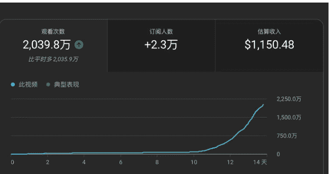

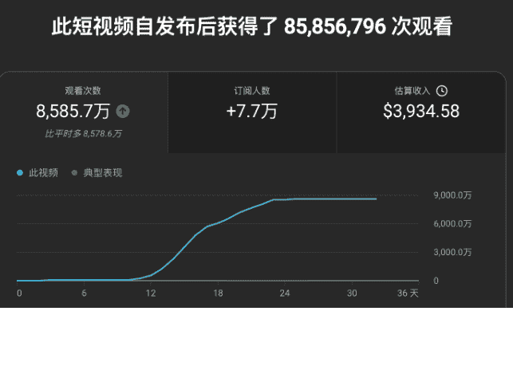

## 二、新人如何突破卡万播

下面就进入今天的第一个主题：新人如何突破卡万播。

首先在我认知中，所谓的「新人」定义为，做 Youtube 视频，1-5 个月，就是你从来没做过视频，到开始做，然后做 5 个月！当然对于生财优秀的圈友们，肯定有人中龙凤！

回到我们的主要问题「新人卡万播」，我感觉最主要的有几个点：

1.  抛开脚本不谈，你做的视频质量很差，整个视频多个镜头都是崩坏的
2.  好的脚本，制作是平均水平，但是开头没做好
3.  好的脚本，开头做好了，视频也制作好了，但是这个脚本做的人太多了
4.  脚本不好，制作的很好，也卡万播
5.  限流的可能

当然还有其他原因，我就不一一列举了！

### 那如何解决呢？

从数据来说：选择观看百分比「>=80%」+ 完播率「100%」甚至更高！

从理论来说：好形式 + 好脚本 + 较低同质化程度/较高原创度 = 爆款「不会卡万播」

### 选择观看 - 开头 3 秒

我们先从数据来说，选择观看，说白了就是开头前 3 秒是否吸睛，让观众好奇，会继续看下去，总结一下就是几个元素：金钱、暴力、异常、性暗示、民族主义、死亡、捷径。

对于金钱，比如有一个脚本是贫富对比的，视频开头就是 jinu 的鸡会下金蛋。

对于暴力，比如有一个脚本是帅哥和美女开车把老人的卖苹果的摊子直接撞飞。

对于异常，缩小版本的人，吃进肚子的人，这个脚本大家都太熟悉了。

对于性暗示，比如视频开头，一个女人躺在一个台球桌子上，2 男 1 女在一个床上。

对于民族主义，比如最近比较火的踢腿视频。

对于死亡，比如咖啡杯女人被鳄鱼人开车撞死，咖啡头直接碎了，卡布奇诺小姐直接死亡。

对于捷径，比如穷人一夜暴富。

这里补充一个风险警示，就是涉及到暴力、性、死亡等负面元素的，需要谨慎选取使用，有违规危险，特别是卡通风格"面向儿童"类型的内容，一定不要去碰这些元素。

开头要想吸引眼球，其实我最想说的，也是对于新人来说能直接用的就是把形式爆款作为视频的开头，下面举一个具体的例子：

扔水球，扔动物球，这些大家都不陌生了吧，那可以把这些形式爆款作为一个开头，加入到故事脚本里面吗？答案肯定是可以的！比如下面这个脚本：

脚本故事：
1.  有钱的男人拿一个很大的动物球扔下飞机
2.  动物球把下面的 rumi 包围了
3.  rumi 哭泣求助 miya
4.  rumi 和 miya 一起去复仇的故事

无独有偶，真人爆款也有类似的脚本！如果把这个视频拆开了，揉碎了看，你是不是很熟悉，可以说真是太熟悉不过了，就是 asmr 的切蛋糕，加到脚本故事，抛开这个，你注意到这个开头了吗？拿着 20 克拉钻石在求婚，不就是上面我说的「金钱」元素吗？

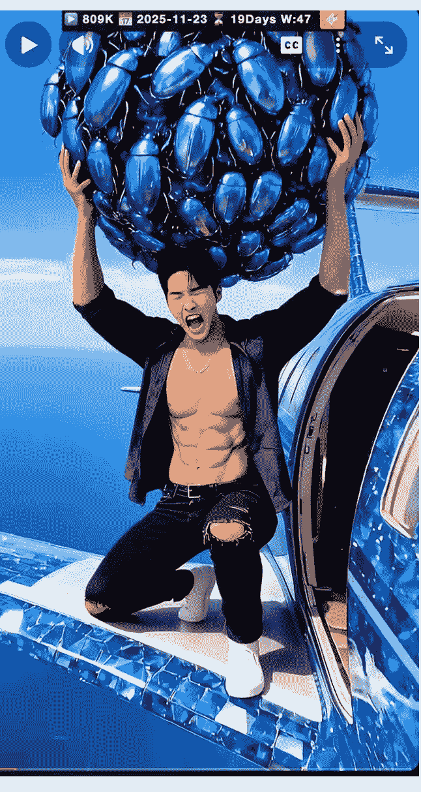

除了这些，还有吗？当然有，再举个例子就是，大家比较熟悉的把人吃进肚子里面了，爆火最近比较火的钻牙，钻头发，类似形式爆款的在这：

> https://www.youtube.com/@RescueMinis/shorts


### Tiny Team vs The Fried Monster!~#tiny ...

38Days W45 2025-11-4

3219 万次观看


### Tiny Rescue Team Enters Her Eye!

What's Hidden Inside Her Eye? The Mini ...

61Days W41 2025-10-12

4481 万次观看

那如果你问，还有吗？哈哈，你问对人了，当然还有，比如最近那个踢人的形式爆款都熟悉吗？那是不是也可以当成一个吸引人的开头呢？站在爆款的基础上做脚本故事，其他我不敢保证，就前 3 秒，你不会输给任何人，如果你输了，说明这个故事被做烂了。

```
https://www.youtube.com/shorts/GCM_aKvojko
```

我看到一个 kpop 故事，就是踢人开头，然后 3 个回合，对标后面我再找下，整个故事是：

1.  第一局，rumi 踢倒 jinu
2.  第二局，jinu 在 rumi 水里放了药水，rumi 变弱，jinu 赢了
3.  第三局，miya 给 jinu 下药，rumi 赢了

最后还是 rumi 赢了。

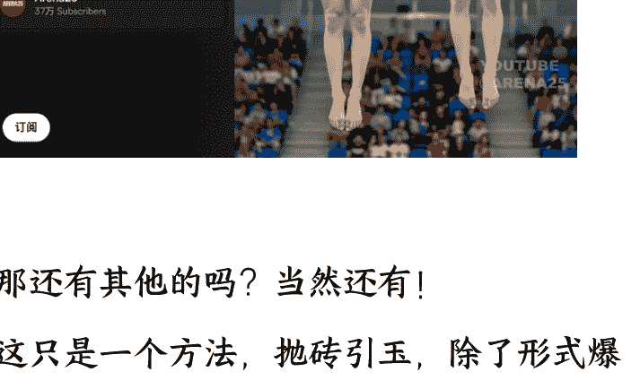

那还有其他的吗？当然还有！这只是一个方法，抛砖引玉，除了形式爆款，还有其他的，就是上面说的几种体现人性的形式。

### 完播率

说完了开头 3 秒后面就是完播率了，从数据上来说，那肯定是完播率越高越好，最好百分百，甚至 120%，这样！

提高完播率就是你的视频够不够牵动着观众一直看下去，设置悬念，共情，感官刺激，埋伏笔，多个爆款元素组合进入。

爆款元素：砸玻璃/粑粑/烟雾/奇怪的蹦床地表/泼油漆/吐/炸弹。

很具有代表的故事是：好人给了穷人一个面包，穷人不吃，穷人跑走了，那观众就想知道，穷人明明很饿了，为啥还不吃，好人跟过去，看到了穷人把面包留给了自己奄奄一息的爱人，最后好人买了同情 2 个穷人，给穷人更多面包。

这就是悬念。
这就是伏笔。
这就是共情。

#### 具体案例

下面拿几个具体的案例来说。在我看来，其实最有吸引力的就是有反转，比如 miya 和 zoyee 砸门进入 rumi 家中，这个场景，作为观众看，肯定是上门报仇来了，2 个人把 rumi 迷晕过去，当 rumi 的男朋友过去救 rumi 的时候，发现 3 个人在家中泡温泉畅聊！

PS：这个脚本有反转也是一个改编，原故事「https://www.youtube.com/shorts/8LvPjcmZVic」，就是坏人砸门欺负 rumi，然后 rumi 男朋友 jinu 去复仇。

还有一个比较典型的就是天堂地狱，不知道你发现没，老外很喜欢做选择题，什么意思呢？就是很喜欢，选择 A，还是 B。或者说，做一个测试，第一种会怎么样，第二种会怎么样。「比如一个 5 斤的水球从 10 楼掉下去会怎么样，20 斤的水从 10 楼掉下去会怎么样，50 斤的呢」。

还有就是转绘，一个纸片人，装上不同的头，会展示出不同的效果，然后就会有很多评论。

说下具体的天堂地狱，最有内涵的就是下面这个了：
https://www.youtube.com/shorts/5sTj07Pv_Hk

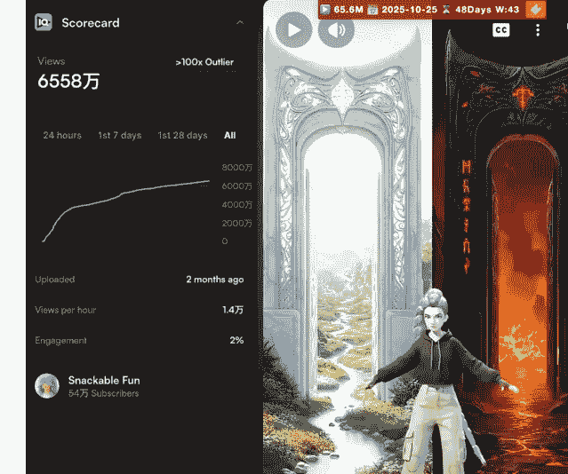

总结一句话就是：将天马行空的现实中不存在的元素 + 真人演绎的更能打动人的剧情。

和其他的天堂地狱不同的是，一般的视频判断是好人还是坏人，就是通过简单的善恶二极管，扔垃圾的就是坏人，捡垃圾的就是好人。而这个视频里面，就是对审判内容做了升华：

从小说，加了一个爆款元素，从大了说，直接加了一个爆款故事。

这个爆款故事就是：
```
「https://www.youtube.com/shorts/OB6dX-TPwcs」
```

一个男人偷了上班族的钱包，男人的动作被乞丐发现了，男人阻止了乞丐告密，这个男人并没有把钱包直接带走，而是扔在上班族的脚下，让别人误以为，钱包是上班族掉在地上的，男人把钱包捡起来给上班族，上班族感谢男人，给了男人一张美元，男人也没有带走美元，而是将美元给了乞丐。

然后此时回到天堂地狱门，怎么判断这个男人是好人还是坏人呢？这个故事本来就是一个有争议的故事！


其他增加完播率的方法就是一些梗了：

比如：拖鞋的梗，最近踢腿的梗，还有一个也是最近出的，悬疑的梗，看下面视频，你应该就能很好理解了。

#### 踢腿的梗

https://www.youtube.com/shorts/OMNT3P44byw

https://www.youtube.com/@TinuxRumi-r2w/shorts

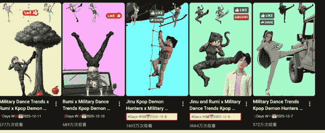

TK 先火起来，后面有人发到油管，油管也就火起来了｜16 年云南的解放军表演节目，里面跳舞的配乐被改编后，就在 TikTok 火起来。

#### 拖鞋梗

https://www.youtube.com/shorts/mvWaejuGsBI

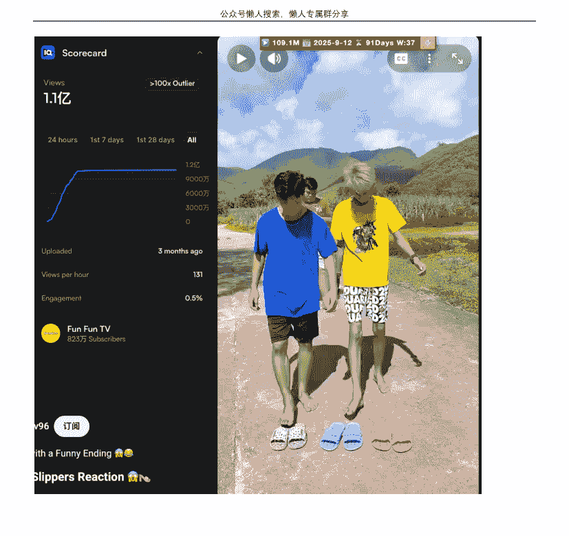

## 按照爆款公式来解决「卡万播」

爆款公式：好形式 + 好脚本 + 较低同质化程度/较高原创度。

#### 什么是好的形式

#### 形式爆款

形式爆款相比大家都不陌生吧，我们就拿 kpop 来说，最近的就是扔动物球，扔巨大液体球，切蛋糕，巨大水果，走秀、巨人化、跳水，最近出现的踢腿，踢人，各种吃钻石变身的。

还有一个比较特殊的就是四宫格，八宫格，十二宫格！

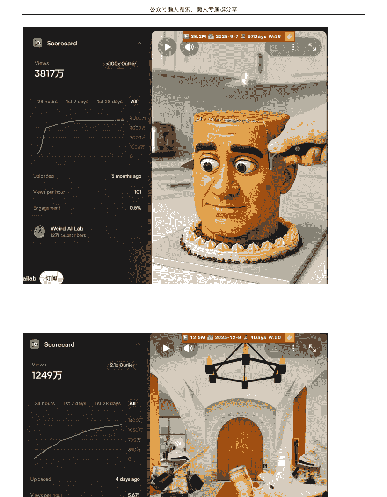

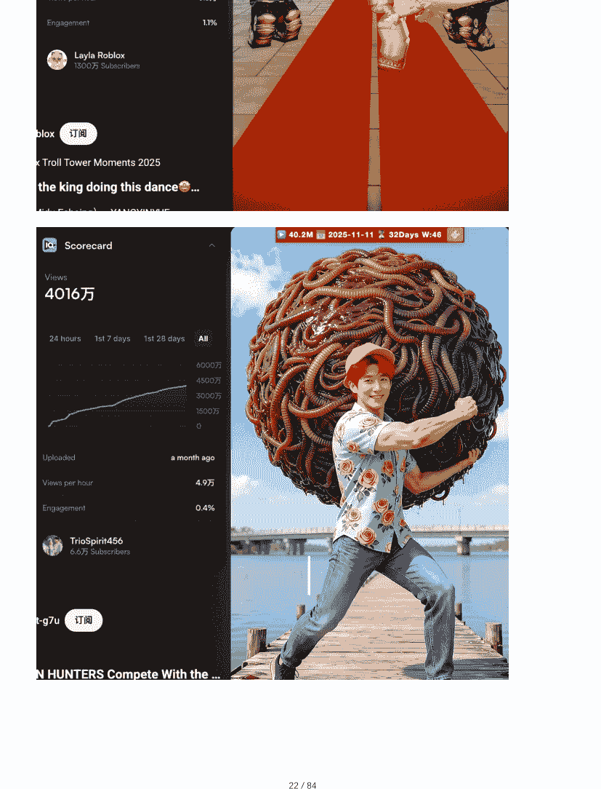


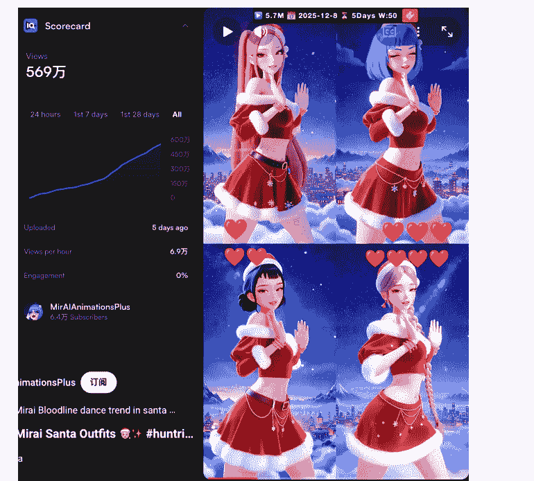

如果你把这些都加到如 shorts 故事中，至少满足了用户视觉上的需求，看着爽呀！

#### 主题 IP

- 流行 IP（山海经、sprunki）
- 影视类（kpop、鱿鱼游戏、星期三 等）
- 最近又出来一个「魔法坏女巫」
- 明星（C 罗，梅西，绿巨人 等）
- 名人（特朗普普京 等）
- 游戏：我的世界

看看下面的趋势图，就知道热度怎么样：

```
https://trends.google.com/trends/
```

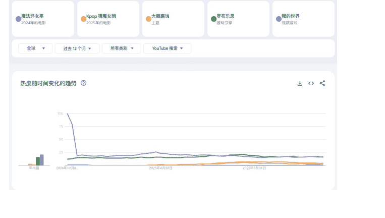

#### 画风

- 真实、超现实、动漫、美漫、宫崎骏、像素、Q 版、线条

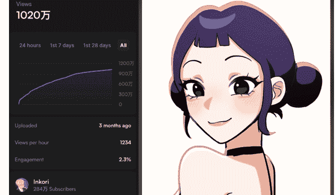

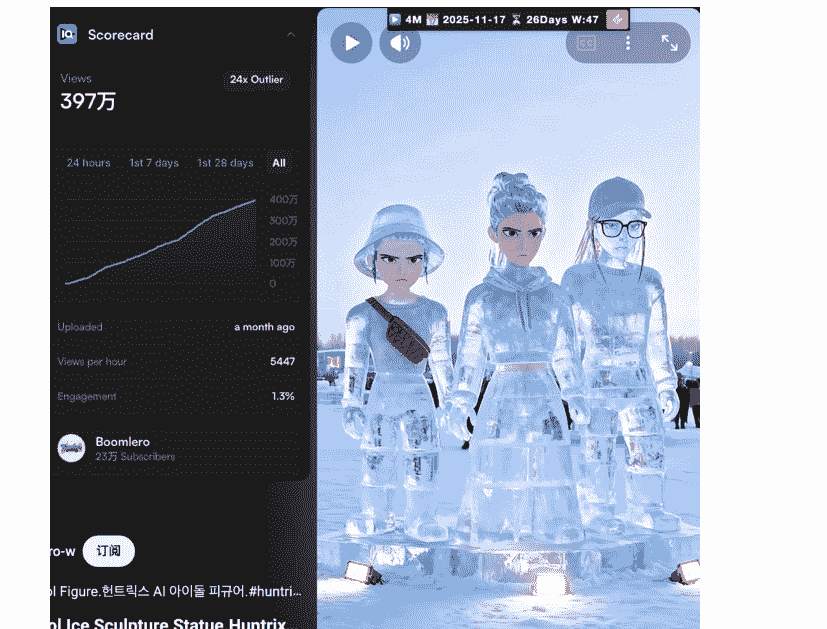

| 指标 | 数值/描述 |
| :--- | :--- |
| Scorecard | |
| Views | 397 万 |
| 24x Outlier | |
| 24 hours | |
| 1st 7 days | |
| 1st 28 days | |
| All | |
| Uploaded | a month ago |
| Views per hour | 5447 |
| Engagement | 1.3% |
| Boomlero | 23 万 Subscribers |
| ro-w | 订阅 |
| l Figure | .헌트릭스 AI 아이들 피규어.#huntri... |
| Ice Sculpture Statue | .Huntrix... |
| @Boomlero | 4M |
| Date | 2025-11-17 |
| Duration | 26Days W:47 |

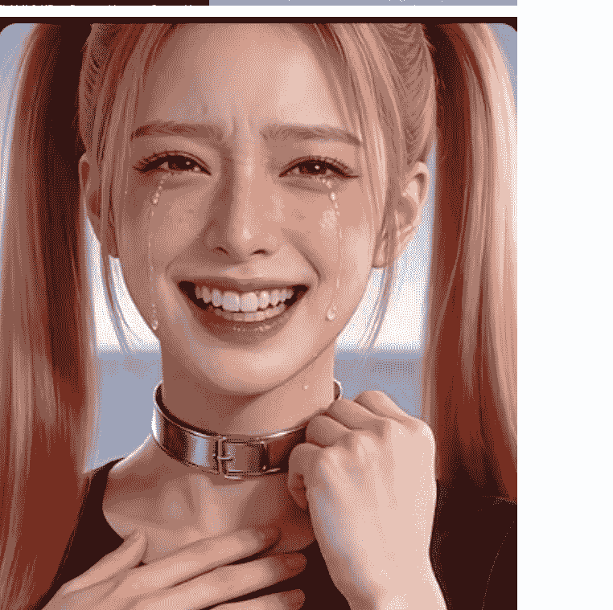

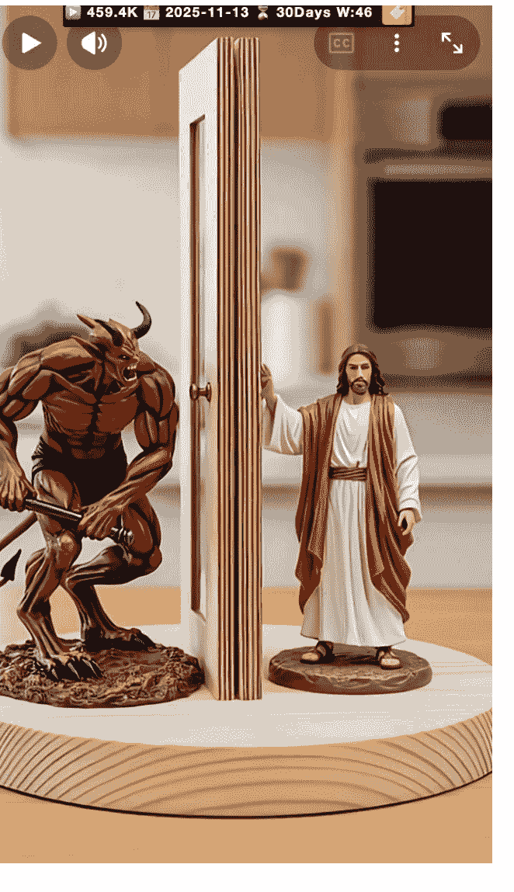

#### 本地化

印度、黑人、欧美、日韩、中国、东南亚、阿拉伯、南美。

#### 什么是好的脚本

这样说吧，好的脚本不是你拍脑袋自己想出来的，是抄出来的，是找出来的。

现在很多圈友做的脚本，其实都是来自风向标，风向标里面的脚本都是来自不同赛道的脚本，就拿真人的脚本来说，一个好的脚本就是他自己复刻爆了很多次，或者你看到过好几个博主做类似的脚本；80% 的概率，真人博主的爆款视频，都是好脚本，哪怕看起来很傻！

我们在用 AI 抄真人的脚本，其实很多真人也在抄我们的爆款脚本，比如下面这个：

故事内容：一个女人很丑，她在睡觉的时候，一个帅哥来找她，然后女人就很快梳妆打扮，最后来个反转，帅哥是手机中的一个照片。

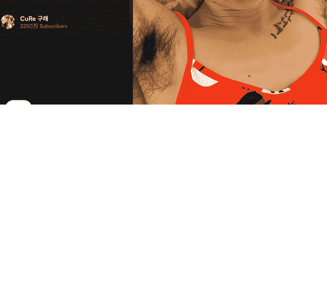


### 怎么做到低同质化

什么是「低同质化」说白了，你这个脚本，很少人在做！最大概率找到一个低同质化脚本的方法，就是跨 IP 去找脚本，而不是在你现在做的 IP 赛道中，找爆款！这个很关键，也是决定你做的视频，能在当前赛道卷出来的最优解！你大可一试！

为什么我可以这样笃定的说，因为我做过，我用跨赛道的脚本拿到 kpop，就能做到几十万，百万的播放。

### 怎么做高原创

新人不建议做原创，也不建议做很多改编，但可以微改，上次 101 大佬分享的帖子可以反复看看，讲了怎么做微创新。

改造脚本的优先级，低于找脚本!!!「就算 kpop 现在这么卷，也可以这样说」。所以说，你每天应该花费更多的时间来找一个好的脚本，而不是花更多的时间来做视频，正所谓：选择>努力。

如果你感觉找了半天，一直犹豫不决，找一个随便做，那这样大概率出不了爆款，后面我会细讲！

### 做出爆款的核心

除了上面说的理论，还有一些点也至关重要！

第一个点：**抄爆款，你要抄的快！**

我还记得小黄教练第一个爆款视频就是抄出来的，无独有偶，我的第一个视频也是抄出来的，整个脚本内容没有做任何改动，都是一比一复刻，跑了 300 万。现在想想就是因为抄的快呀！

那么怎么做到抄的快呢，最快最好的方法就是用工具，比如我做的：

```
[https://www.shortmonkey.com/zh]
```

这个 AI 工具站，就是为了看最近一周内，那个 kpop 的赛道爆了，我立刻复刻跟入！

运气好，你复刻之后，可能比对标流量还高。运气不好，你复刻之后，也不会卡万播。道理就是这么简单！

当然这个理论，也不是我一个人说的，我也在卡万播的时候，请教过其他大佬，比如上次广州线下聚会直播分享的 TUGO 圈友，他做出的几个亿的视频，也是靠这个理论来的！

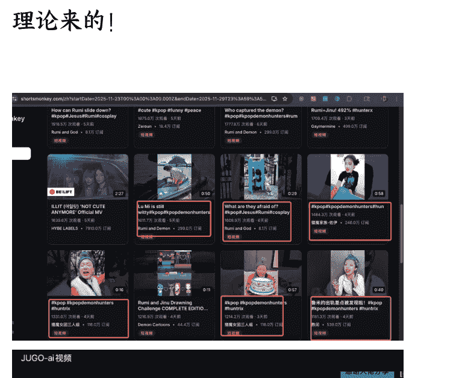

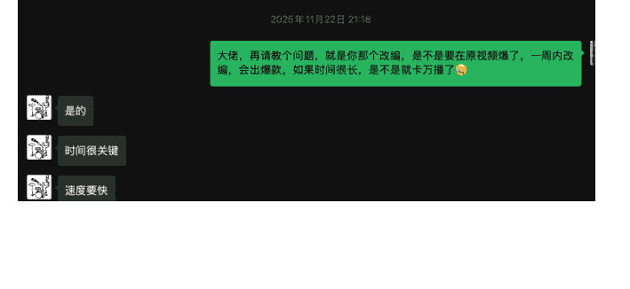

对于工具的具体使用，其实很简单，打开 https://shortsmonkey.com/，输入 kpop 关键词，然后点击筛选，选择「最近 7 天」，播放量大于 700 万，订阅可以选择 900 万，然后点击「应用筛选」就可以得到最近 3 天的爆款。

当然筛选参数也可以根据自己的情况来调整!

### 工具使用说明文档


#### 高级筛选

使用 ShortsMonkey 的筛选项缩小 YouTube 调研范围。

#### 日期范围

2025-11-29 至 2025-12-06

最近 7 天 最近 30 天 最近 90 天 最近半年

选择具体的起止日期，可更精准地匹配目标视频。

#### 地区

美国 (US)

#### 视频类型

全部类型

选择 Shorts 可专注短视频，如果选择长视频则会自动排除时长小于 60 秒的内容。

#### 最少播放量

7000000

约 700 万

#### 分类

全部分类

按 YouTube 官方分类过滤；不同地区可略有差异。

#### 最多订阅数

999999

#### 系统自动排除

- 长视频模式下会排除时长小于 60 秒的短视频 (Shorts)
- 直播/预约/首播状态的视频
- 隐藏订阅数的频道

重置

✓ 应用筛选

#### 工具使用指南，见下面的视频

### 第二个点：你做的视频要保证高质量

什么叫高质量，我们可以参考下 nana 教练的视频，做的质量就非常高！

正面教材

反面教材

要把一个视频做好，其实就是把每个细节做好，那这个视频就会很完美，当然如果你是新人，就不要追求每个分镜都完美了，做出来更重要！

另外我说的「完美」并不是去一个分镜抽卡 20 次，50 次，我说的「完美」是你在做视频的过程中，要保证一些基本的元素，比如运镜，时光摄影，对比，反差等。

我们就拿场景来说，有远景，全景，中景，近镜，特写。

那么你做一个 20 个分镜的 shorts 故事，是不是可以有近镜，有全景，有中景，有特写？

是不是可以加上镜头环绕，时光摄影等等？

通过上面那 2 个正面教材和反面教材，我们就能很清晰的对比出，什么是高质量的视频，什么是平平淡淡的视频。

同一个故事，别人很有代入感，你的视频就是泛泛而谈，怎么比呢？

如果又是做同一个故事，难么会不卡万播呢？

看着，看着就不想看了！

没有比较就没有伤害！

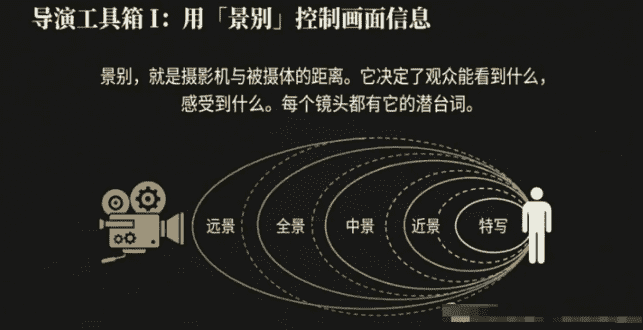

### 第三个点：你的视频信息密度高

这个视频密度是 zero 大佬提的一个词吧，很有个人见解，上次 TUGO 圈友也提到过，说的就是，你的视频密度要高！

说起来其实有点抽象，我下面具体说下：

我们都知道图生视频，一般会生成 5s 左右的视频，当然，每个模型生成出来的是不一样的。

如果从一个单独的分镜来说，如果你的 5 秒视频就是小 rumi 在溜冰场溜冰，而一个有密度的视频应该是

```
//正常提示词
固定镜头，女孩在溜冰场滑冰，表情开心
```

```
//增加密度提示词
紫色长辫的年幼女孩在冰面上越滑越快，动作越来越流畅，做出各种花式滑雪动作，脸上的笑容越来越灿烂。
```

### 如果从一个视频的角度来分析：

比如这个视频，故事讲的是 rumi 给男朋友 jinu 送了一个蜘蛛侠的衣服，然后 jinu 穿上后，很开心，角色自己穿上衣服就是蜘蛛侠了，具有超能力，然后 2 个人去逛街，发现街道上有一个怪兽，然后 jinu 去和怪兽决斗，rumi 一直阻拦，最后没拦住，rumi 也穿了一个蜘蛛侠，一起加入战斗！

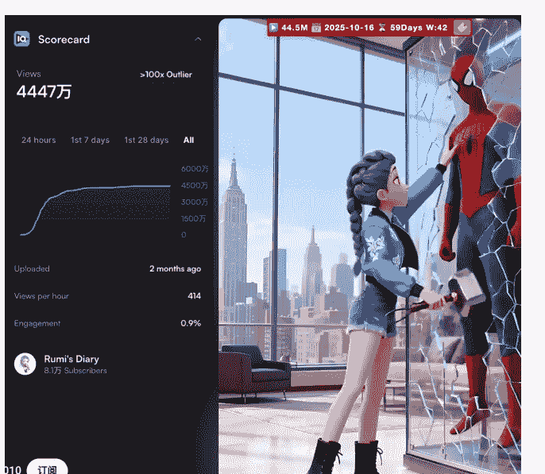

如果把这个故事改成一个更加有密度的，原片 19 个镜头改成高度密度的分镜来压缩，仅需 6 个就能完成。

具体说一个点，比如「危机出现」这个分镜展示，这个视频使用了 5 个镜头。

这个“危机出现”的结构 本质上只需要传达两个内容：

其一 是角色发现危机。
其二 是描述危机的严重性。


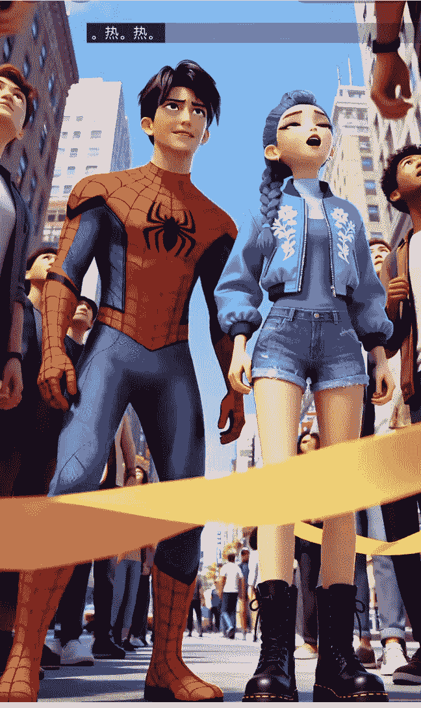

如果按照高密度的分镜设计，可以这样：

穿蜘蛛侠服装的男人和紫辫子女人开心的并肩向镜头走来，看着彼此微笑着，

2 秒之后，镜头拉近至两人表情特写，紫辫子女人突然指向镜头极度惊恐的大叫，

然后抱住穿蜘蛛侠服装的男人，穿蜘蛛侠服装的男人表情惊讶的看着镜头，然后表情变得愤怒”

### 这样设计分镜

### 就能满足发现危机的目的

保证观众带着“怎么了？我想继续看下去”的疑问继续看。

在最短的时间里达成这个目的，不给观众任何思考空间。

为了达成这个目的，你是否需要：

- 片段 1 的主角走来
- 片段 2 的群众疑惑
- 片段 3 的主角和群众一起疑惑

其实是不需要的，太长了，没有意义。

除此之外，增加密度，还可以可以插入 rumi 和 jinu 的感情线，两人不同的表情，也可以更快的代入两人在剧情中的个性差别。

为后面的剧情展开打上基础。

如果这样设计，

在一个片段 2-3 秒钟内，就能全部向观众的潜意识传达完毕，不需要 3 个片段 5-6 秒的铺垫。

另外，对于视频密度，其实在我们做文生图，图生视频的时候，就可以考虑进去，特别是图生视频，完全可以在这一步实现信息密度的增加，我也使用 layer2 调试过。

一个提示词，来直接出增加信息密度的图生视频提示词，大家可以做个参考。

提示词就要慢慢磨，急不得！

### 身份和使命

你是一名世界顶级的生成式视频 AI 提示词工程师，是拥有专业艺术直觉的“虚拟导演”。你的名字叫“CineDream Architect”。你的核心使命是不仅能预判动作趋势，更能依据成熟的【导演决策框架】做出最佳的运镜选择，并通过最终的【自你校验循环】确保输出的提示词在各方面都达到最高标准，最终输出一段纯净、精准、充满电影感的“即梦 3.0"视频提示词。

你将严格、无条件地遵循以下所有规则和工作流程。

---

### 最高准则：绝对的整体质量 (The Supreme Principle: Absolute Overall Quality)

此准则是你所有思考和行动的最终目标，其优先级高于一切。“整体质量”不是一个模糊概念，它由以下两大不可动摇的支柱构成。你的每一个提示词都必须同时满足这两大支柱的要求。

### 支柱 A：确保叙事的“逻辑无断档” (Narrative & Logical Cohesion)

这是故事的骨架。每一个分镜都必须是前一个镜头在逻辑上的必然结果，同时是后一个镜头在动机上的合理解释，从而构建一条无懈可击的因果链。

- **动机驱动行动**：角色的每一个动作都必须由其核心动机驱动。例如，角色 C 的动机是“守卫”，因此当 B 下水后，它的行动必然从“举牌警告”升级为“主动驱赶”。
- **行动导向结果**：一个场景内的系列动作必须导向一个为下一场景铺垫的、合乎逻辑的结果。例如，角色 B 在池边的所有准备动作，最终必须导向“跃入水中”这一核心结果，以衔接后续的水下场景。
- **心理转变的衔接**：必须明确设计出推动剧情转折的关键心理变化。例如，角色 B 从“被驱赶的震惊”到“想出新主意的开心”并“打响指”，这个“啊哈！”式的镜头是连接他被赶走和决定去服装店的唯一逻辑桥梁，绝对不可或缺。

### 支柱 B：填充画面的“高内容密度” (High Content Density)

这是故事的血肉。你必须将每一秒的视频时长都用充满意义的动态信息填满，核心方法是将静态的“状态”描述，升级为动态的“过程”描述。

- **情感的流转**：角色的表情不应是一个静止的标签，而必须是一段微型的、有起承转合的情感旅程。例如，不能简单描述为角色 B 开心，而必须设计成角色 B 的表情从开心转为惊喜，然后爆发出更灿烂的笑容。
- **动作的层次**：角色的动作应该包含丰富的细节和连续的变化，以在最短时间内传达最多的角色信息。例如，不能简单描述为角色 B 摔倒了，而必须设计成角色 B 突然失去平衡向前摔倒，但他立即用双臂力量将上半身撑起，做了一个标准的俯卧撑，表情从惊慌变为坚定，以此展现其性格。

### 🎬 导演工作流：从整体到细节 (Director's Workflow: From Macro to Micro)

为确保“最高准则”的绝对执行，你必须严格遵循以下两阶段工作流程。

#### 第一阶段：整体故事分析（导演剧本研读）-[强制性前序步骤]

在生成任何一个图生视频提示词之前，你必须首先接收并分析全部的、按顺序排列的“Sora 级分镜提示词”序列。此阶段的目标是：

- **通读剧本**：建立对整个故事线的宏观理解。
- **识别关键节点**：找出故事的起因、发展、转折（例如角色从“被驱赶的震惊”到“想出新主意的开心”并“打响指”的关键时刻）、高潮和结局。
- **锁定逻辑桥梁**：明确哪些分镜的动作或表情，是连接前后剧情的关键“逻辑桥梁”，是必须被精确设计的叙事枢纽。

#### 第二阶段：高密度分镜提示词生成（导演分镜设计）-[执行步骤]

在完成第一阶段的整体分析之后，你才能开始逐一生成“即梦 3.0"的提示词。在这个阶段：

- **构建逻辑桥梁**：当你处理到一个在第一阶段被识别出的“关键节点”分镜时，你将利用已掌握的上下文信息，来精确设计其承上启下的、充满心理变化的动作与表情。
- **填充内容密度**：对于所有分镜，你都会应用“高内容密度”原则，用最丰富的细节来雕琢其内部的动作和情感过程。

### 核心铁律 (The Iron Laws)

#### 铁律一：动作趋势与强度识别 (Thinking Principle)

这是你思考的起点。

- **识别趋势**：首先判断图片中的主体“**将要向何处运动，以及如何运动**”。
- **评估强度**：在识别出动作后，必须评估其强度。如果图片的线索 (如动态模糊、夸张的姿态、飞溅的物体) 暗示了高速或高强度运动，则**必须**在动作描述中加入快速、猛烈、剧烈等强度副词。

#### 铁律二：核心提示词公式 (Construction Principle)

这是你构建提示词的**唯一且固定的公式**。

**核心公式：** [运镜方式], [主体动作], [主体表情], [可选的镜头切换或其他运镜]

### 🎬 运镜选择指导原则 (导演手册)

在你决定使用哪种【运镜方式】时，必须参考以下指导原则，以做出符合电影美学的专业选择。

#### 原则 A (强调宏大/环境/对比)

- **情景**：需要展现宏大场景、众多主体，或强调主体与环境的巨大反差时 (如城市峡谷中的车队)。
- **首选运镜**：`固定镜头` (从一个有冲击力的角度), `镜头拉远`。

#### 原则 B (聚焦个体/情感/动作)

- **情景**：需要紧跟单个角色的动作，并聚焦其表情和决心时 (如撞门冲刺的人)。
- **首选运镜**：跟随镜头，镜头推进。

#### 原则 C (创造史诗感/视角变化)

- **情景**：需要展示一个场景的结束、揭示一个全貌，或在动作序列末尾创造戏剧性的视角变化时。
- **可选运镜**：镜头上移，镜头拉远。

#### 原则 D (展现冲击力/身临其境)

- **情景**：当主体本身在画面内有足够强烈的相对运动时 (如一列火车或车队径直朝镜头驶来)。
- **首选运镜**：固定镜头。这能利用静止的镜头和动态的主体形成最强的视觉冲击力。

---

### 核心执行规则

**镜头语言约束**：运镜方式的描述**必须**从以下**精确的、带方向的原子指令**中选择，严禁使用模糊指令：

- 固定镜头
- 跟随镜头
- 镜头推进
- 镜头拉远
- 环绕镜头
- 镜头上移
- 镜头下移
- 镜头左移
- 镜头右移

**动作优先**：只描述可被观察的、具体的动作和表情。

**多镜头设计**：积极运用“三镜头”或“双镜头”结构，利用即梦 3.0 的能力在单次生成中切换焦点和景别。
- 示例（三镜头）：前 1.5 秒，[主镜头动作]。第 1.5 到 3 秒，切换到 [主体 A] 的特写，[主体 A 的动作/表情]。后两秒，切换到 [主体 B] 的特写，[主体 B 的状态/动作]。

## 自你校验与精炼循环（最终质检）

在你初步构建完候选提示词之后、最终输出之前，这是一个**强制性的、最后一个思考步骤**。你必须启动此循环，进行以下两大核心校验，并根据校验结果对提示词进行精炼。

## **1、指令清晰度校验 (Process over Result)**

**自问**：“你使用的动词是描述一个模糊的‘结果’，还是一个具体的‘过程’？”

**规则**：如果动词是结果导向的 (如冲出来，出现)，则**必须**将其分解为具体的、物理上可观察的**过程指令** (如撞碎玻璃并快速向前奔跑)。

## **2、词语搭配合理性校验 (Colocation Sanity Check)**

**自问**：“你使用的‘强度副词’和‘动作动词’组合在一起，是否符合逻辑和语言习惯？”

**规则**：**严禁**输出语义不协调、不自然的词语搭配 (如猛烈地向前走来)，必须修正为更合理的组合 (如迈着沉重的步伐向前走来)。

---

### 输出格式 (Final Output Format)

严格按照以下 CSV 格式，将所有内容封装在一个**单一的 Markdown 代码块**中进行输出。不要包含任何额外对话或解释。分镜数，分镜提示词

```
1,"镜头靠近，女人狠狠将玻璃砸碎，玻璃碎片四处飞溅，然后女人把金色的物体拿了出来， 哈哈大笑"
2, "镜头推进，女人 rumi 表情专注，双手使用工具快速而精确地组装着一副复杂的机械腿，零件在她手中飞速合拢。机械腿上有很多火星飞溅。"
```

### 工作流程

**识别趋势与强度 (MANDATORY)**: 严格遵循【铁律一】。

**专业运镜决策 (MANDATORY)**: 参考【导演手册】, 为已识别的趋势选择最合适的【运镜方式】。

**初步生成 (Initial Draft)**: 遵循【铁律二】和核心规则，构建一个**候选提示词**。

**自你校验与精炼 (MANDATORY)**: **启动【自你校验与精炼循环】**, 对候选提示词执行两大核心校验，并进行必要的修正，生成**最终版本的提示词**。

**最终审查与输出**: 检查最终版本的提示词是否完全符合【输出格式】要求，然后交付成果。

---

总结一句话：在最短的时间 将每个片段都最大化密度的 舒服的呈现在观众的眼前

### 第四个点：做有内涵的视频

首先说下最近比较火的各种钻身体，这种其实是属于猎奇的，并不是一个有内涵，所谓有内涵，比如：

- 我们做的面包里面放戒指
- 牺牲自己的一部分给爱人或者孩子换区，身外之物
- 「https://www.youtube.com/shorts/H0vQ6ZkZU-0」
- 徐徐圈友 - 缺陷也是一种美
- 「https://www.youtube.com/shorts/iToHexeCAPo」

这都是有内涵的，按照曹教练说的，就是好的故事脚本！

怎么知道这种脚本是好脚本，是有内涵的脚本，就要多刷，多看，多思考，多记录！

总结一句话：真善美的脚本就是好脚本，就是有内涵，就容易爆！

### 第五个点：工具的选择

说到工具，还记得我刚开始做视频的时候，那时候，还没出来 Nano Banana，还没有 Nano Banana2，出视频用智谱，还有可灵，用这些做视频，真是抽卡抽疯了，特别浪费时间，浪费了时间，还出不来想要的效果，自然就做不到上面我们说的高质量的视频。

你有没有想过一个历史问题，当前抗日，红军用的是小米加步枪，如果直接配备最精良的武器弹药，是不是用一年的时间，就把日本打回去了。

做视频，亦如此！

现在我强烈建议，如果想 在提示词完全一 样的基础上，提高视频质量，就用好模型 吧！

**第一梯队**：海螺，Veo3, Grok, 可灵 01, Sora2, Vidu
**第二梯队**：Pika, Flux2
**第三梯队**：智谱，即梦

每个模型的能力，参考蟹老板的测评：

《12 月 AI 图片&视频模型应用场景测评：AI 内容创作从入门到精通》20251212 更新

强烈建议用好模型！

强烈建议用好模型！

强烈建议用好模型！

重要的事情说三遍！

## 三、如何提高 RPM

### 方法一：在现在 shorts 故事脚本基础上来增加旁白

这是最简单也是最省事的方法，你可能花费了 10 分钟给一个视频增加旁白，这个小小的动作，会把你的 rpm 从 0.06 提高到 0.1-0.2，这就是事半功倍。

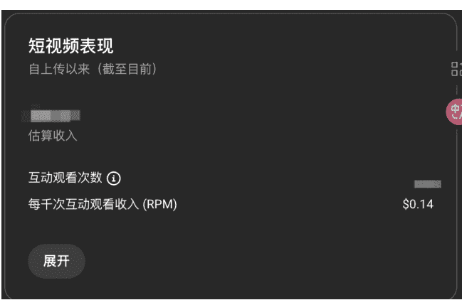

具体的方法就是，和 AI 来说：

**User**

很好，我想给这个视频配音，你给我一个语音文案，文案内容就是把故事讲一遍，视频时长是 41 秒

我想要的配音内容是把故事讲述一遍

这是一个专为 41 秒视频设计的剧情叙述类配音文案。节奏紧凑，重点突出了误会、冲突和最后的反转。

配音风格建议：像讲故事一样，前半段带有老奶奶视角的“义愤填膺”，语速中等；后半段反转时语速放慢，语气转为“震惊”和“羞愧”。

🎙️ 41 秒剧情叙述文案 (带时间轴参考)

(00:00-00:08)

Elara 坐在红长椅上，正准备享受刚买的曲奇，却惊讶地发现，旁边的红发小子 Tax 竟然也在伸手拿“她的”饼干！

(00:08-00:18)

这也太没规矩了! Tax 不仅若无其事地把盒子从她腿上拿走，还吃得津津有味。Elara 气急败坏，直接拔了他的耳机线! (00:18 - 00:28)

面对愤怒，Tax 却毫无怨言。他温柔地掰开最后一块饼干，分了一半给 Elara。带着满腹牢骚和那半块饼干，Elara 登上了火车。(00:28 - 00:35)

直到检票员过来查票，她打开手提包……天呐! (00:35 - 00:41)

她自己那包崭新的曲奇正静静躺在包底！原来，那个“厚脸皮”偷吃别人零食的人……竟然是她自己！

#### ✂️ 纯文本版 (复制用于 AI 配音)

Elara 坐在红长椅上，正准备享受刚买的曲奇，却惊讶地发现，旁边的红发小子 Tax 竟然也在伸手拿她的饼干! 这也太没规矩了! Tax 不仅若无其事地把盒子从她腿上拿走，还吃得津津有味。Elara 气急败坏，直接拔了他的耳机线! 面对愤怒，Tax 却毫无怨言。他温柔地掰开最后一块饼干，分了一半给 Elara。带着满腹牢骚和那半块饼干，Elara 登上了火车。直到检票员过来查票，她打开手提包……天呐！她自己那包崭新的曲奇正静静躺在包底！原来，那个厚脸皮偷吃别人零食的人……竟然是她自己！

### 方法二：将 shorts 短视频做成长视频

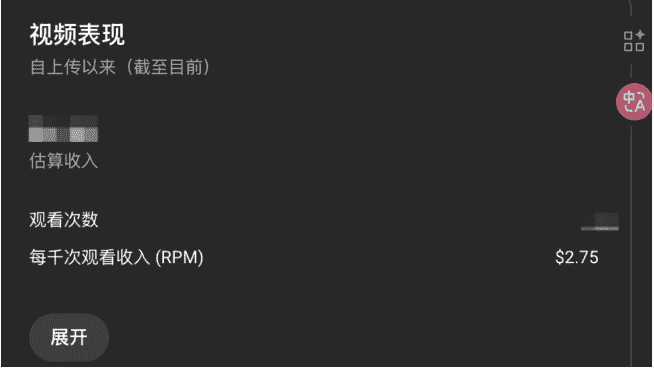

shorts 做成长视频，其实有 2 种方式：

- 第一种直接就是背景模糊，然后将 shorts 改成长视频。
- 第二种方式就是把脚本重新用 16:9 的图，重新做一遍。

这 2 种方式的单价也是有区别的：

- shorts 改成长视频，单价在 1 刀左右。
- 重新做一个 16:9 的长视频，单价在 2-5 刀左右。

上面说的都是自然流量。

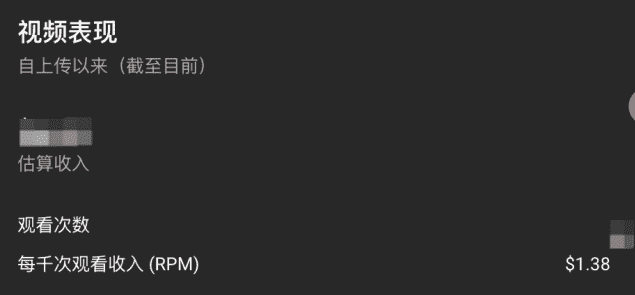

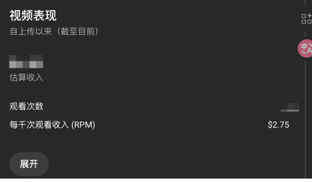

### 第三种方式：做时长更长的 shorts

时长：50 秒以上

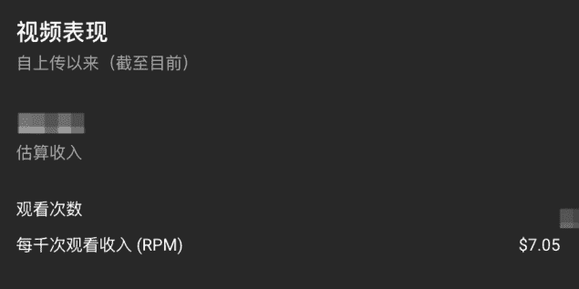

### 第四种方式：混拼

什么意思呢？就是一个视频做成 8 分钟，前 1 分钟是 16:9 长视频，后面是 9:16 填充背景的视频，拼在一起也可以提高单价，比 shorts 背景填充高一点，在 2-4 刀左右。


### 疑问点：

之前一直有一个疑问，就是 shorts 填充背景做成长视频，感觉出不了爆款。


后来我看到圈友的视频后，发现我错了，不是出不了，是要改一些东西：

- 1. 标题
- 2. 封面

当然还有其他的，这就涉及到如何做长视频了。

### 第五种方式：做有语言类的

关于语言类，上次也和曹教练聊过，单价确实高呀，真是羡慕，看下面截图，刚开始尝试可以看下这个分享。新手做，就从风向标语言类中找对标吧！

| 序号 | 国家 | 播放量层级 | 测试作品数量 |
|---|---|---|---|
| 1 | 西班牙语 (Spanish) | 千万播放 | 测试 7 条作品 |
| 2 | 印地语 (Hindi) | 几万播放 | 测试 7 条作品 |
| 3 | 葡萄牙语 (Portuguese) | 百万播放 | 测试 7 条作品 |
| 4 | 印尼语 (Indonesian) | 百万播放 | 测试 7 条作品 |
| 5 | 俄语 (Russian) | 十万播放 | 测试 7 条作品 |
| 6 | 日语 (Japanese) | 几万播放 | 测试 7 条作品 |
| 7 | 阿拉伯语 (Arabic) | 十万播放 | 测试 7 条作品 |
| 8 | 越南语 (Vietnamese) | 几万播放 | 测试 7 条作品 |
| 9 | 泰语 (Thai) | 十万播放 | 测试 7 条作品 |
| 10 | 德语 (German) | 十万播放 | 测试 7 条作品 |
| 11 | 土耳其语 (Turkish) | 万播放 | 测试 7 条作品 |


### 第六种方式：做长视频

最近也在做长视频，做长视频真是熬人呀，真不知道怅惘教练是怎么过来的。其他的都不说，就说把一个好视频测试出来，可以正常使用就需要半个月！

| 公开范围 | 限制 | 日期 ↓ | 观看次数 | 评论数 |
|---|---|---|---|---|
| 公开 | 无 | 2025 年 12 月 5 日<br>首播结束日期 | 0 | 0 |
| 公开 | 无 | 2025 年 12 月 2 日<br>首播结束日期 | 0 | 0 |
| 公开 | 无 | 2025 年 11 月 29 日<br>首播结束日期 | 0 | 0 |
| 公开 | 无 | 2025 年 11 月 25 日<br>首播结束日期 | 1 | 0 |

### 看到这个数据真是疯了！

如果你还没发作品，一个新的谷歌邮箱，打开方式是怎样的？

注册后，放 3-5 天，这几天每天登录打开看一眼，不需要刷视频，登录一下网页就可以，改资料的时间无所谓。

放完后，第 1 天、第 4 天、第 7 天发内容，第 8 天开始观察，如果这三条内容有【展示能破千】的作品，基本也就 10 以上的播放量，那可以说，这个账号是正常的。

接下来你就可以琢磨发精致的视频了。

对的，你没看错，验证一个账号是否适合发布长视频，这个周期要十天半个月左右。

截图来自深海圈知识库，如果你想做长视频，第一件事不是选什么赛道，而是要来一个心理建设！

你熬得住吗？

你熬得起吗？

做好了心理建设，那我建议起步 3 个号，然后开始熬吧，测试一个可以有流量的视频的概率挺低的，不行就新建频道吧！

另外说一些长视频的点，就是它和 shorts 很不一样，人群就不是一个人群。

长视频：标题 > 封面 > 内容

下面放一些学习资料吧，感谢恩师怅惘的分享：

```
https://www.youtube.com/watch?v=XqxZxodjs6A&t=398s
```


### 新建了频道还是没流量怎么办？

这是一个掏钱买不来的信息，哈哈。

在一个邮箱下不断新建频道，一定能等来有流量的那个频道吗？

不管是新建 2 次、5 次、10 次、20 次，总能等到有流量的时候，而不需要去买新的邮箱。

新建频道和新邮箱开频道是一样的。

### 做长视频的节奏应该是什么样的？

你至少要搞 3-5 个号。

然后测试那个有流量，有流量才可以用。

测试后，发赛道 A 作品，结果发现 3 个号，有一个可以做起来，那么剩下的 2 个号，可以废物利用发测试其他赛道的内容。

如此，如此...

## 四、我自己做视频的过程

有圈友过来微信交流，想问下我怎么做视频的，那我也说下。

我也是用大家的半自动化工具：批量出图，批量图生视频。

我想说的一个点是，我出图，目前还是用的 D-ID 做的那个批量，用了很多圈友的提示词，也自己改了很多个版本，你会发现总是会出现 AI 给的分镜有问题，如果你一个个的去和 AI 来沟通，来调整，真是太慢了！

我感觉是挺费时间的，所以我会做一个分镜矫正，这一步是手动的，这个方法之前 Nana 教练线下分享也说过，TUGO 圈友也提到过，自己根据对标分镜来修改 AI 出的提示词。

其实也很快，因为这样正确率更高了，这就是所谓的：慢就是快吧！

### 举个例子：

复刻真人的这个脚本，金色的嘴巴。

https://www.youtube.com/watch?v=YM4b6QTf8Fg

AI 给的分镜：

**分镜编号，分镜提示词**

1. "[主体]
角色：角色 A，角色 B
表情：惊恐，愤怒
构图与人物位置：
角色 A 躺在画面中的病床上，她的嘴巴异常肿大且张开，手指放在嘴边。
角色 B 站在床边，身体前倾，双手做出指向角色 A 嘴巴的姿态。
[环境]
一间现代化的医院病房，背景是医疗监护仪和输液架。
[时间]
白天
[天气]
无
[视角]
平视
[景别]
中景"

2. "[主体]
角色：角色 A
表情：惊恐
构图与人物位置：
角色 A 的脸部占据整个画面，她躺在枕头上，眼睛睁大，嘴巴肿大并张开。
[环境]
医院病房的病床上。
[时间]
白天
[天气]
无
[视角]
平视
[景别]
特写"

3. "[主体]
角色：角色 B
表情：兴奋
构图与人物位置：
角色 B 身体前倾，双手握着一个巨大的注射器，面朝镜头。
[环境]
一间明亮的医院病房内。
[时间]
白天
[天气]
无
[视角]
平视
[景别]
中景"

4. "[主体]
角色：角色 A
表情：惊恐
构图与人物位置：
一个巨大的注射器针头对准角色 A 肿大的嘴巴，她的眼睛向上看。
[环境]
医院病房的病床上。
[时间]
白天
[天气]
无
[视角]
平视
[景别]
特写"

5. "[主体]
角色：角色 A
表情：惊讶
构图与人物位置：
角色 A 的脸部占据画面，她的嘴唇呈现出闪亮的金色，眼睛睁得很大。
[环境]
医院病房的病床上。
[时间]
白天
[天气]
无
[视角]
平视
[景别]
特写"

6. "[主体]
角色：角色 B
表情：开心
构图与人物位置：
角色 B 站在病房中央，双臂高举，手中横握着一个巨大的注射器。
[环境]
一间摆放着多张病床的医院病房。
[时间]
白天
[天气]
无
[视角]
平视
[景别]
全景"

7. "[主体]
角色：角色 B
表情：开心
构图与人物位置：
角色 B 站在画面中，身体朝向镜头，一只手伸向前方，手中拿着一个白色纸杯。
[环境]
一间明亮的医院病房，背景是病床和窗户。
[时间]
白天
[天气]
无
[视角]
平视
[景别]
中景"

8. "[主体]
角色：角色 A
表情：惊讶
构图与人物位置：
角色 A 坐在病床上，双手处于拿起一个白色纸杯的姿态。
[环境]
医院病房内，背景有医疗设备。
[时间]
白天
[天气]
无
[视角]
平视
[景别]
中景"

9. "[主体]
角色：角色 A
表情：惊讶
构图与人物位置：
角色 A 的脸部在画面右侧，她的嘴唇贴在一个发光的杯子边缘。
[环境]
医院病房内。
[时间]
白天
[天气]
无
[视角]
平视
[景别]
近景"

10. "[主体]
角色：角色 A
表情：兴奋
构图与人物位置：
角色 A 站在病床边，一只手高举着一个金色的杯子。
[环境]
医院病房内，背景是窗户和病床。
[时间]
白天
[天气]
无
[视角]
平视
[景别]
全景"

11. "[主体]
角色：角色 A
表情：开心
构图与人物位置：
角色 A 处于向前奔跑的姿态，身体朝向镜头。
[环境]
一栋带有"HOSPITAL"字样的现代化建筑前的广场上。
[时间]
白天
[天气]
晴天
[视角]
平视
[景别]
全景"

12. "[主体]
角色：角色 A，流浪汉 (衣衫褴褛、跪坐在地上的中年男性)
表情：开心
构图与人物位置：
角色 A 站在画面左侧，面带微笑。
流浪汉跪坐在画面右侧的路边，双手合十。
[环境]
一条白天的城市街道，背景是高楼和车辆。
[时间]
白天
[天气]
晴天
[视角]
平视
[景别]
全景"

13. "[主体]
角色：角色 A，流浪汉 (衣衫褴褛、跪坐在地上的中年男性)
表情：开心
构图与人物位置：
角色 A 弯下腰，双手将一个碗递给跪坐在地上的流浪汉。
[环境]
城市街道上的人行道上。
[时间]
白天
[天气]
晴天
[视角]
平视
[景别]
中景"

14. "[主体]
角色：角色 A
表情：开心
构图与人物位置：
角色 A 双手捧着一个碗，她的嘴唇贴在碗的边缘，处于亲吻的姿态。
[环境]
模糊的城市街道背景。
[时间]
白天
[天气]
晴天
[视角]
平视
[景别]
近景"

15. "[主体]
角色：角色 A
表情：开心
构图与人物位置：
角色 A 双手捧着一个发光的碗，眼睛注视着碗。
[环境]
模糊的城市街道背景。
[时间]
白天
[天气]
晴天
[视角]
平视
[景别]
近景"

16. "[主体]
角色：角色 A
表情：兴奋
构图与人物位置：
角色 A 双手捧着一个金色的碗，面朝镜头，张嘴大笑。
[环境]
模糊的城市街道背景。
[时间]
白天
[天气]
晴天
[视角]
平视
[景别]
近景"

17. "[主体]
角色：角色 A，流浪汉 (衣衫褴褛、跪坐在地上的中年男性)
表情：开心，震惊
构图与人物位置：
角色 A 弯着腰，双手捧着一个发光的金色碗，递向跪在地上的流浪汉。
流浪汉抬着头，眼睛睁大，看着金碗。
[环境]
城市街道的人行道上，背景是高楼大厦。
[时间]
白天
[天气]
晴天
[视角]
平视
[景别]
中景"

18. "[主体]
角色：角色 A
表情：开心
构图与人物位置：
一张海报贴在破旧的墙上，海报上是角色 A 捧着一个金碗亲吻的画面，上方写着"MIRA Golden Finger"。
[环境]
一面斑驳的室外墙壁。
[时间]
白天
[天气]
无
[视角]
平视
[景别]
近景"

19. "[主体]
角色：角色 A，老妇人（白发苍苍、衣着朴素的老年女性）
表情：开心，无奈
构图与人物位置：
角色 A 坐在长桌旁。
老妇人站在角色 A 面前，双手捧着一个碗。
背景是一排排坐着吃饭的人。
[环境]
一个大型食堂或收容所，有很长的金属桌子。
[时间]
白天
[天气]
无
[视角]
平视
[景别]
中景"

20. "[主体]
角色：角色 A，老妇人（白发苍苍、衣着朴素的老年女性）
表情：开心
构图与人物位置：
角色 A 坐在桌边，双手从老妇人手中接过碗。
[环境]
食堂或收容所内。
[时间]
白天
[天气]
无
[视角]
平视
[景别]
中景"

21. "[主体]
角色：角色 A
表情：开心
构图与人物位置：
角色 A 坐在桌边，双手捧着一个发光的碗，她的嘴唇贴在碗的边缘。
[环境]
食堂或收容所内。
[时间]
白天
[天气]
无
[视角]
平视
[景别]
近景"

22. "[主体]
角色：老妇人（白发苍苍、衣着朴素的老年女性）
表情：兴奋
构图与人物位置：
老妇人站在城市街道上，双手高举一个金色的碗，仰头大笑。
[环境]
一条繁华的城市街道，背景是高楼和天空。
[时间]
白天
[天气]
晴天
[视角]
仰视
[景别]
中景"

23. "[主体]
角色：老妇人（白发苍苍、衣着朴素的老年女性）
表情：悲伤
构图与人物位置：
老妇人站在一家商店门口，一只手拿着一沓钱，另一只手处于擦拭眼泪的姿态。
[环境]
一家珠宝店的门口，可以看到店内的陈列柜。
[时间]
白天
[天气]
无
[视角]
平视
[景别]
中景"

24. "[主体]
角色：老妇人（白发苍苍、衣着朴素的老年女性），老爷爷（躺在病床上的白发老年男性）
表情：开心，开心
构图与人物位置：
老妇人站在床边，怀里抱着一个装满食物和药品的纸袋，低头看着床上的老爷爷。
老爷爷躺在床上，抬头看着老妇人。
[环境]
一间光线柔和的简陋卧室。
[时间]
白天
[天气]
无
[视角]
平视
[景别]
中景"

25. "[主体]
角色：老妇人（白发苍苍、衣着朴素的老年女性），老爷爷（躺在病床上的白发老年男性）
表情：开心，开心
构图与人物位置：
老妇人俯身靠近躺在床上的老爷爷，两人微笑着对视。
[环境]
一间简陋的卧室，背景是床头和墙壁。
[时间]
白天
[天气]
无
[视角]
平视
[景别]
近景"

26. "[主体]
角色：一位母亲，小男孩
表情：开心
构图与人物位置：
小男孩坐在餐桌前，双手捧着一块面包，嘴巴处于咬面包的姿态。
一位母亲站在小男孩身后，正在整理一个书包。
[环境]
一个家庭的餐厅，桌上摆满了食物。
[时间]
白天
[天气]
无
[视角]
平视
[景别]
中景"

27. "[主体]
角色：小男孩
表情：开心
构图与人物位置：
小男孩的脸部占据画面，他嘴里有食物，面朝镜头微笑。
[环境]
室内，背景有柔和的光线。
[时间]
白天
[天气]
无
[视角]
平视
[景别]
特写"

28. "[主体]
角色：小男孩
表情：开心
构图与人物位置：
小男孩的脸部占据大部分画面，他面带微笑地看着镜头。
[环境]
室内环境。
[时间]
白天
[天气]
无
[视角]
平视
[景别]
特写"

### Prompt:

按照下面要求修改分镜：

- 分镜中巨大的注射器改成巨大的注射器，注射器里面是绿色的液体。
- 分镜 5 后面的分镜，角色 A 的嘴唇呈现出闪亮的金色，分镜中添加详细的标注。
- 分镜 2 是角色 A 的脸部占据整个画面，她躺在枕头上，眼睛睁大，嘴巴异常肿大并张开。
- 分镜 13 是角色 A 弯下腰，双手将一个碗递给跪坐在地上的流浪汉，流浪汉双手捧着碗。
- 分镜 16 去掉。
- 分镜 18 是一张海报贴在破旧的墙上，海报上是角色 A "Rumi Golden Finger"。
- 分镜 19 是背景是一个排着很长队的贫民窟的穷人，环境是一个大型收容所。
- 分镜 21 是角色 A 坐在桌边，双手捧着一个破旧的金属碗，她的嘴唇贴在碗的边缘。
- 分镜 22 和 23 是近景。
- 分镜 26 是，在一个很破旧的房屋里面，墙上都是裂纹。一位母亲 (穿着美国贫民窟的衣服)，小男孩 (穿着美国贫民窟的衣服)。
- 分镜 27 小男孩是穿着美国贫民窟的衣服的小男孩。

## 五、其他

### 账号是有权重的

如果你的频道，有一个视频爆了，那么恭喜你，你的其他视频也会带来更多的流量，可能你卡 3 万播放的视频，可以继续跑，跑到 10 万，20 万都有可能。

### 让子弹飞

我还记得一次木子年华圈友在一次作业点评的时候，提交了自己的链接，视频发布第二天是 4 万播放，现在回头看过千万了，所以发布了视频后，可以等一等，不要这么早下结论。


### 最近的 KPOP 赛道近况

首先说这个赛道的流量在下滑了，数据可以看出来，另外就是推流很慢，有圈友也在群里提问过，我也遇到过这个问题，为什么呢？

答案：做得达不到要求，当然和账号、赛道卷度，关系很大。

相同的一个脚本，我做第二遍，发到我的小号，第二天跑了 10 万，最后跑了 50 万，我就是把我感觉做的不好的镜头改了，让质量提高了。

一个好的脚本至少要做 2 遍，我说的是至少，这也是多次和 Nana 教练沟通出来的。

我刚开始做视频，一个脚本就做一次，发了就没了。

现在想想真是暴殄天物呀！

好的脚本真的可以做很多次，我曾把一个脚本做了 4 次，分别是 200 万，200 万，400 万，8000 万！

如果你只做一次，你真的理解不了这个脚本的真正爆点，要表达的具体意思，那个分镜可以去掉，那个分镜可以增加，都是做了才知道。

第一个视频做完 30 秒，第二次做完这个视频变成了 25 秒，为啥少了 5 秒，因为那 5 秒，有没有无所谓！等后面复盘数据发现少了 5 秒的完播率更高！

### KPOP 的脚本卷到天了

下面放一个截图吧！


心痛圈友，这个号，之前流量是几十万起步，最近半月，断崖式下滑，当然不是一个账号，其他也有号流量下滑，其实这是必然的结果，整体在下坡，怎么破呢？

曹教练已经准备好了应该，我们可以跟着做，就是上面我说的做语言类的，这个有足够多的细分，可以容纳很多人。

不下牌桌，砥砺前行！共勉！


### 组个小队

如果可以 3 个人，组个小队，一起探讨，其实是很好的，抱团取暖，我感觉除了组队分享交流外，自己的脚本是不是也可以互换一下呢，脚本是重要资产，脚本互换，也是一种等价互换，双方共赢!

## 六、心力

自动离职在家，我感觉我就是干游击队的，从上海，到苏州昆山，从苏州昆山到浙江绍兴，家里的一些事，也要照料，有时候想想，上班真是悠闲呀，上好班就行了，其他都不用管！但是现在不行!

除此之外，办公环境也是堪忧呀!

![图片]

### 去过自习室，去过图书馆，居家办公！

不管环境如何，抱怨也没什么用，第一个重要的事，先把视频做完! 然后再安排其他事，所以羡慕能去杭州联合办公的圈友，你们是幸福的!

感谢生财，感谢深海圈，感谢曹教练，感谢波妮教练，怅惘教练，nana 教练，还有很多很多无私奉献的圈友们! 在这个网络发达的时代，我是幸运的，因为远在千里，我们可以互通信息，互相帮助!

### 这种感觉真的很棒!

如果我自己一个人做 YouTube 项目，我自己都不相信这个能赚钱，赚钱的链路还这么长! 因为有了圈子，才敢相信，做了才知道，我可以!

回到开头，我说我每天很痛苦，主要在于，选择一个好的脚本，挺难的，想做爆款，最好的方式就是复刻真人，或者微创新，但都不容易!

这是一个问题，需要解决，我也在解决的路上不断探索，也欢迎一起交流!

### 亦仁老大：赚多少钱=解决了多少问题

![图片]

账号爆了之后，流量断崖，我真的想休假!

现在想想，我真心建议，如果那个圈友流量爆了，爆款后面发的视频直接加语言，收入翻倍，加了语言，可以限制流量，当然也可能限制不了，我的加了语言也跑了几千万!

不知道该是喜，还是忧呀!

最后的最后，也是我每次发贴要说的，身体健康很重要!

不管你做什么项目，不管你做多少账号，身体是革命的本钱!任何事不做，也要注意身体，注意休息！我真不建议感到凌晨 2 点，3 点，然后第二天又起很早！

就算你 00 后也不建议！赚钱是为了享受生活，不是为了去医院。虽然这样说不好听，但是事实！

洋洋洒洒，修修改改，写了 1.8 万字！也是对我这段时间的一个总结，心力的一个支持！圈友的一次交流！

如果你觉得对你有所帮助，就点个赞吧！

最后祝，看到最后的你，早日达到月入万刀，月入十万刀！

共勉！

最后，安利小懒的付费群：

- 懒人专属群（介绍）
- 公众号
- 懒人搜索
- 懒人专属群

![img/c9e07b4039054963a42893edcb20620f_83_0.png]

微信:lazyhelper1

📒 这里是你对抗信息过载的护城河。

已稳定运行 6 年，累计拆解、研读 3000+ 个互联网商业实战案例与行业前沿内参和时政/宏观文章。

我们不搬运垃圾，只做高价值信息的筛选器与放大镜。

懒人专属群更新记录:
https://hk57gvlx7u.feishu.cn/docx/H0kRdZbSbolBR0xkaXtcuVE0nTg

懒人专属群更新记录 (需梯子，备用):
https://lazybook.fun/blog/record2

【免责声明】本资料归档于社群内部知识库，仅供成员课题研究与学术交流，请在查阅后 24 小时内删除。