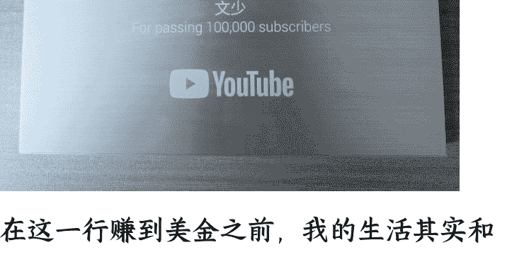
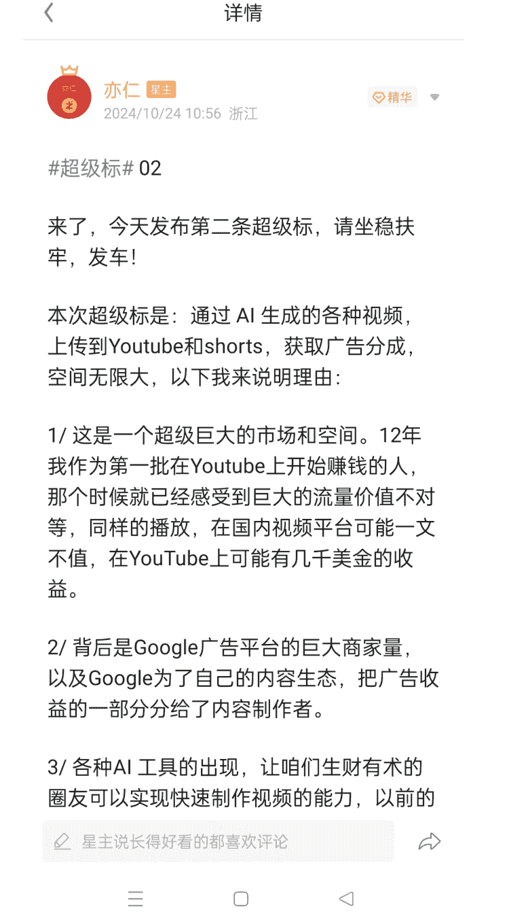
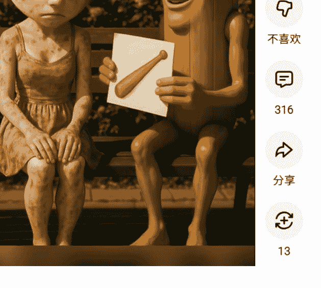
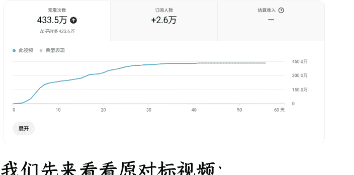
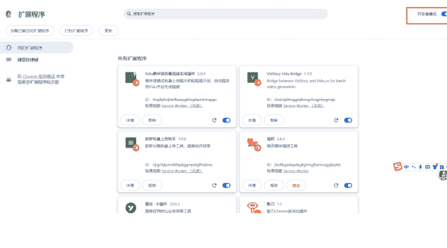
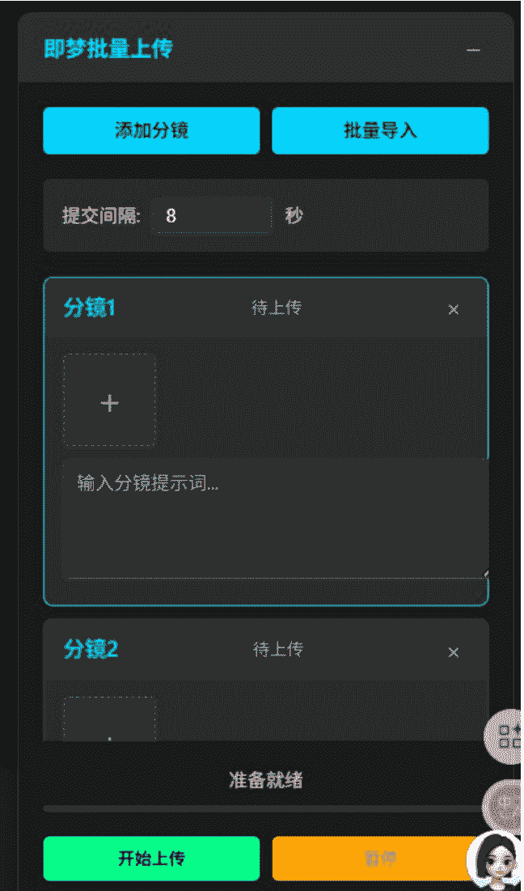
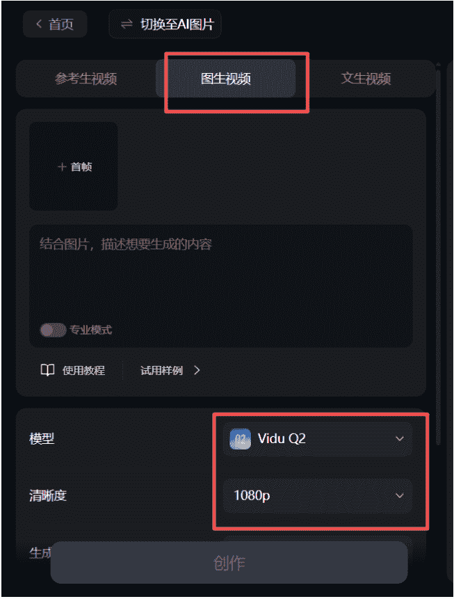

# MCN 运营裸辞：告别几千块死工资，靠 AI 视频出海赚到了第一桶美金

## 251222 副业 SC 精华

公众号懒人搜索，懒人专属群独享

懒人微信：lazyhelper


## 一、告别几千块的死工资，去赚美金

大家好，我是文少，生财第七期圈友，也是生财传术师，现在是一名自由职业，主要做 YouTube AI 视频出海。

目前是有三个 YPP 账号，两个高级 YPP，一个初级 YPP。

在 10 月份的时候终于达到了月入千刀的成就。

### 详情

### 进入

庆功日，亦仁老大说越晒越有，顺便来还愿啦，7 月有了第一笔美金，十月份终于破千刀了，虽然是两个号，但也算哈哈！争取早日破万刀！

那些日入千刀和月入万刀的大佬们多晒晒刺激一下我吧，让我长长见识🤔 #生财好事#


前几天也收到了 YouTube 送来的银牌。



在这一行赚到美金之前，我的生活其实和大多数打工人没什么两样。

在辞职之前，我在一家 MCN 做运营，主要工作内容就是对接达人和给博主推荐商单，其实更像媒介和 BD。

说起来好像是在互联网圈子，但只有我自己知道，那时候的日子有多枯燥。

每天朝九晚六，机械地处理着各种工作和账号，拿着几千块钱的死工资。

在 MCN 待久了，看过太多起起伏伏的流量，但那些流量和收益都与我无关。

我感觉自己就像是一台庞大机器里的一颗小螺丝钉，随时可以被替换。

这种温水煮青蛙的焦虑，迫使我开始寻找出路。

在加入生财有术后，我像个饥渴的海绵不断吸取星球里的精华帖和高质量帖子。

期间也尝试了很多项目，比如抖音养生带货、快手磁力聚星、得物，后面又转战视频号带货和分成计划。

说实话，那段时间挺折腾的，虽然也积累了一些做项目的经验和锻炼了网感。

但总感觉是在为了做事而做事，始终没有找到那个能让我沉下心来、且回报率足够高的项目。

真正的转折点，其实来源于亦仁老大去年 10 月份发的一条超级标。



正是因为这条超级标，悄悄在我心里种下了一颗种子（毕竟赚的是美金，还是非常诱惑人的）。

比如同样的 AI 视频，同样的播放量，你发在国内可能只有几十块，甚至还有可能一分钱都没。

而你发在 YouTube 上，只要你开通了高级 YPP，按照 RPM0.02 美元来算 (千次播放收益)，100w 播放量就有 20 美元的收益，然后你在把这 20 乘以 7。

这还是单价偏低的视频，如果你的单价是 0.05 或者 0.2 甚至更高呢？

不用我多说你也大概知道空间有多大了吧。

其实那个时候我就凭着一股冲劲尝试做了一条视频发了出去。

但那个时候，我对 AI 工具的理解还不够深，加上发布视频操作上的一些失误，导致发出去的视频一晚上才几十播放。

那种挫败感让我一度怀疑自己，导致这个项目还没开始就搁浅了。

直到今年 4 月，看到很多人都在 YouTube 拿到了结果，开通了 YPP，说不愧是真的，那时我手上在做的项目流量也开始下滑，那颗埋藏已久的种子，突然又开始发芽。

这一次，情况完全不同了，因为 AI 进化了。

记得去年我刚尝试的时候，做一条 30s 的视频至少要 5-6 个小时。

那种做电脑前一坐就是一天的感受现在还记忆犹新。

但今年 4 月份的 AI 和去年的 AI 相比，完全不在一个档次，同样的视频，现在配合成熟的 AI 工作流，一个小时内就能轻松搞定。

以前一天累死累活只能磨出一个视频，现在我可以批量生产高质量内容。

真的是"AI 界一天，人间一年”的感觉。

我最早用 AI 赚到的第一笔小钱是靠写公众号流量主，但真正让我在这个赛道站稳脚跟，并且尝到赚美金的，还是 YouTube。

虽然这条路我走了不少弯路，但也正因为这些弯路，让我更确信：普通人想要翻身，必须借助 AI 这个杠杆，去赚更大市场的钱。

## 二、AI 是杠杆，故事才是内核：5 个底层逻辑重塑爆款

很多想做 YouTube 的朋友，还没开始就被两座大山劝退了，一是语言障碍，“我英语四级都没过，怎么赚老外的钱？”；二是视频制作门槛，“我看到剪辑界面就头大。

但其实这都不是事，做 YouTube 根本不需要你会英语，有非常多的赛道是无语言的，单纯靠视频画面本身表达出来的含义就可以拿到千万播放甚至破亿的播放量。

实在不行你还可以下个沉浸式翻译插件。


视频制作就更简单了。

如果放在前几年，这或许是硬伤，你得自己写脚本、拍素材/找素材、剪辑配音.....

但现在做视频，我们不再是苦哈哈的剪辑工，更像是一个项目经理，我们不需要自己去拍摄、配音、翻译....

我们需要做的，仅仅是给 AI 下达准确的指令。

我现在的整个工作流，其实就是把一个复杂的视频制作过程，拆解成了几个简单的标准化步骤，然后把每一步都交给最擅长的 AI 工具去完成。

比如让 Google AI Studio 或者 Gemini 帮我拆解视频脚本和每个分镜画面的文生图提示词和图转视频提示词，即梦、豆包负责出图，可灵、海螺、即梦或者 Vidu 等视频模型负责图转视频。

而我要做的，就是把它们串联起来。

下面，我将把我目前正在做的这一套 AI 视频出海 SOP 分享给大家，由于我现在做的视频就是分形式类和故事类，本次分享主讲故事类，形式类过于简单，就不展开多讲了，学会做故事类，形式类自然也就会了。

### 2.1、故事的底层逻辑

在正式分享具体的操作 SOP 前，我想先和大家聊聊“故事”本身。

为什么有些人做出来的 AI 视频像流水账，而有的视频却能让人欲罢不能？核心不在于 AI 工具用得有多溜，而在于你是否真正理解了故事的底层逻辑。

故事的本质，其实就一句话：一个人遇到问题，面对问题，然后解决问题的过程。

如果要给互联网上的内容分类，大致可以分为两类：

- 父系内容 (干货): 这类内容提供实际的指导和提升，能帮用户省时间，它是理性的。
- 母系内容 (情绪): 这类内容提供情感慰藉和认知感受，能帮用户杀时间，它是感性的。

说白了母系内容的作用就是圈粉，父系内容的作用就是促进转化。

大部分新手做视频，要么纯干货太枯燥，要么纯煽情没营养。而真正牛逼的故事，是既有父系也有母系。它既能提供情绪价值（母系），让用户产生共鸣、愿意停留；又能提供认知价值（父系），让用户觉得“有用”、愿意关注甚至付费。

我们在做视频时，就是要用画面的情绪（母系）留住人，用故事的内核（父系）打动人。

### 2.2、拒绝流水账：故事不必从头讲起

很多新人写脚本最大的误区就是线性叙事，比如从小时候写到长大，从小学写到工作，像写简历一样记流水账。这种方式放在视频里就是灾难，因为观众没有耐心等你长大。

我们要学会把故事的高潮点也就是最刺激、最吸引眼球的部分剪切下来，直接放在开头。

就像电影《无间道》，开篇不是讲主角出生，而是直接切入卧底对决，还有《人民的名义》，上来就是抓贪官吃炸酱面的高潮戏。

这一点对应到我们的视频制作中，就是黄金 3 秒原则：把冲突最激烈的画面前置。

比如这些熟悉的爆款开头：

- 砸玻璃
- 砸花瓶
- 砸门
- 砸车
- .....万物皆可砸系列

还有：

- 跳飞机
- 跳火车
- 跳楼
- 跳悬崖
- .....万物皆可跳系列

当然，还有钻身体、钻眼睛、钻鼻孔、钻头发.....万物皆可钻系列 (ps:这系列慎用，容易违规)

那如果找不到这个脚本的爆款开头该怎么办呢？

当然是万事问 AI 啦！把下面提示词发给 Gemini:

请把这个故事改成倒叙结构，把最冲突、最激烈的画面 (比如破产的那一刻、被背叛的一刻等) 放在开头前 3 秒作为黄金钩子

### 2.3、无冲突不故事：矛盾是核心

故事的本质就是一个人遇到了问题，面对问题，然后解决问题的过程。这个「问题」其实就是矛盾。

如果说故事是一辆车，那矛盾就是发动机。世界上所有的经典故事，本质上都是建立在矛盾之上的。如果没有矛盾，故事就不成立。

比如《三国演义》讲的就是一件一群人想统一天下的故事，它的主要矛盾其实就是谁来统一天下、怎么统一天下，矛盾点就在于统一天下。

《阿甘正传》讲的是阿甘是个傻子，通过自己的努力成为了百万富翁的一个故事。它的主要矛盾就是「傻子是怎么成功的？」

《西游记》讲的是孙悟空三兄弟保护唐僧取经的故事。它的主要矛盾就是妖怪要吃唐僧，孙悟空三兄弟要保护唐僧，就是妖怪与孙悟空三兄弟之间的矛盾。

还有西方的《复仇者联盟》，它讲的就是有坏人来要毁灭世界，超级英雄要拯救世界，就是坏人和超级英雄之间的矛盾。

所以说，这世界上所有的故事都是这样的，你只要找到了这个矛盾点，你就找到了故事的核心。

当然，除了主要矛盾之外，还有次要矛盾，就像小说里面的剧情线，除了主线部分，也会穿插一些支线让剧情更丰富。

那么我们该如何去找矛盾呢？

在我看来，矛盾主要有两个维度，一种是内部矛盾，一种是外部矛盾：

- 内部矛盾：就是主人公自身内部遇到的问题。
- 外部矛盾：就是主人公客观情况下遇到的问题。

很多经典的好故事就是挖掘出主人公内在与外在双重的矛盾，就成了流传于世界上的经典。

比如《蜘蛛侠》这部电影，它讲的是一个平民小子彼得帕克被蜘蛛咬了一口，然后就获得了超能力，变成超级英雄的一个故事。

如果你细研究下来就会发现蜘蛛侠这个人他就有内部和外部两重矛盾。

他的外部矛盾就是有坏人在不断的破坏整个街区，这个时候就要有人站出来阻止坏人。但是当彼得拥有能力之后最先想到的不是行侠仗义去救人，而是去马戏团打比赛赚钱去了，是为了让自己过上更好的生活奋斗去了。

那如果是这样的话剧本也演不下去了，所以编剧就给他安排了一个内部矛盾，就是他的本叔叔被歹徒给杀了，正是因为他本叔叔的惨死让他意识到能力越大责任越大。从用超能力让自己过得更好变成了用超能力去保护别人，这就是蜘蛛侠的双重矛盾。

还有一个经典的案例，小李子主演的《盗梦空间》，他的主人公的故事线也是这个双重矛盾的结合。外在矛盾是小李子是一名盗梦者，他收了钱要帮助别人窃取一个富豪的商业机密，他通过进入富豪梦境的方法来窃取机密。但如果只有这个外在矛盾就感觉这个人物不怎么立体，觉得这个人好像就是个唯利是图的人，所以导演就给他安排了一个内部矛盾。

这个内部矛盾就是男主的妻子和男主一样是盗梦者，但是她在梦境里死掉了，所以男主每次进入梦境的时候，他的心魔也就是他的妻子都会出现来阻止他任务，甚至最后他的妻子让这个男主永远陷在深层的梦境里，分不清自己是梦境呢还是现实了。那这个故事就变得非常的立体了，小李子主演的这个主人公也变得让人觉得非常的丰富，让人觉得有完美的感觉。

还有非常非常多的案例，比如我们国内的《哪吒 1》和《哪吒 2 之魔童闹海》这两部电影其实也是一个双重矛盾的结合。

当然，具体的内部矛盾和外在矛盾大家可以去分析一下。

所以我们可以总结成：外部矛盾撑起故事格局和宏观，内部矛盾是让故事更细腻。外部是皮和骨，内部是肉。

还有一个非常重要的点：矛盾的质量越高，故事就越精彩。

什么叫矛盾的质量呢？

举个例子：比如说我早上起来起晚了，发现上班马上要迟到了，但还打不到车，最后只能骑自行车到公司。

这个事里面的核心矛盾就是“我起晚了，上班要迟到了”。但就这么一件事，我就算添油加醋狠狠地写也只能写成一个很有意思的小故事，我怎么写都不可能写成一个非常厉害的大故事对吧。

因为这个事本身没有那么多可说的，所以这个就是矛盾的质量。

但如果我写屌丝逆袭，写人生巨变，写治病救人。那能写的空间就很大了，这就是一个质量非常高的矛盾了。

比如前几年很火的《我不是药神》就是治病救人的主题。这些主题很容易写成大稿，因为这些主题的核心矛盾质量本身就是很高的。

### 2.4、细节决定代入感

为什么 AI 生成的画面看起来很假，没有代入感？因为缺乏细节。真正的故事感，往往不是宏大的叙事，而是来自于真实的细节，这些细节是装点故事的材料。

比如如果你要写赚钱，就不能只写赚钱。你要写凌晨三点的半桶泡面，要写穿梭地铁的奔波人间，要写宝妈哄睡娃后，深夜敲击的键盘;要写男人趴在车里，默默点上一根烟；要写孩子在橱窗前，期盼着你的双眼.....

我们在做 AI 视频时也是同理，提示词里不要只写“很穷”，要写“吃泡面”、“穿破鞋”等具体的修饰词，这些具体的细节才是打动用户的钩子。

比如下面这两条视频，它们的脚本是一样的，单纯看我截图的封面，你会更想看哪个？




答案已经很明显了，肯定是第一个对吧。

再来看看我之前复刻真人故事的一条视频截图，我也是发出去后过几天才意识到这一点：


这个故事讲的是一个流浪汉，捡到了施舍者遗失的钻戒，面对金钱的诱惑，他选择了归还。最后，善有善报，好心人为他众筹，改变了他的命运。

左边这张是原视频截图，右边是我复刻的视频截图，单纯看画面你觉得哪个更有冲击力？

肯定是左边这张对吧，因为只有把这种诱惑做足了，后面他选择归还戒指的那个转身才会有力量。

### 2.5、转折：让故事更有趣

在故事当中如果你能够有效的利用转折，你就可以让故事变得有趣起来。转折其实是喜剧的精华，如果故事没有转折，那么故事就会很无趣。

一个平铺直叙的故事是无聊的。好的有趣故事结构应该是：背景 - 矛盾 - 转折 - 顿悟。

转折就是预期的违背。观众以为会这样，你偏偏那样，这种反差感能制造喜剧效果，也能制造深刻的记忆点。

那背景、矛盾、转折和顿悟是什么意思呢？

背景就是时间的前奏，就是交代一下主人公的背景。

矛盾就是主人公和其它事物、人物之间产生的各种矛盾和情节发展。

然后转折就是那个矛盾突然被另一种方式解决了，这个方式和你预想的发展情节不一样。

最后顿悟或者说结局，就是呼应开头。或者说这个结局是一个顿悟形态，就是我没有解决然后留给用户自行体会这种感觉。

是不是感觉有点抽象，我们来看一个播放量超 6000w 的视频就懂了:

```
https://youtube.com/shorts/i2Qzamo_B4
A?si=Z6tTllDuileZmKX5
```

这个视频它的剧情设计就非常精妙地运用了这套公式：

- 背景：男主在水族馆隔着玻璃偶遇美人鱼，一见钟情。这一步交代了人物动机和故事场景。
- 矛盾：男主想要下水追求爱情，但遭遇了阻力，被凶猛的鲨鱼举牌警告，这就是想要与得不到的冲突。
- 转折：男主以为只要我变成同类就能追到美人鱼，但结果却是那条凶猛的鲨鱼爱上了他。这种想撩美女却撩到了野兽的错位的预期违背，瞬间把喜剧效果拉满。
- 顿悟/结局：原来变身成鱼的代价是被鲨鱼看上。这种开放式的荒诞结局，留给了观众无限的爆笑和回味空间。

当你能熟练运用转折时，你的视频完播率自然就上去了。

好了，以上关于故事本身的部分，相信大家对于故事的底层逻辑也有了一定的理解。

接下来给大家分享具体的实操部分，我就以我这条播放量 400 多 w 的真人复刻视频为例。

### 视频分析

概览 覆盖面 互动 观众 收入

此短视频自发布后获得了 4,334,871 次观看



我们先来看看原对标视频:

```
https://youtube.com/shorts/FXgtzVAX8t4?si=cmxC7KDvTCos0Kir
```

这条视频我做了两个版本，大家可以先猜一下哪条是那 400 多万播放的？

没错，第二条才是，第一条只有 9.9w 的播放量。

在我做好第一条之后就请教了曹教练，以下是曹教练给的修改意见:

| 制作花费时间 | 提交人 | Gary 的建议 |
| :--- | :--- | :--- |
| 纯手提<br>第一条 3-4 小时<br>第二条 1-2 小时 | 文少 | 1.前面没人丢钱的分镜，可以多给几个，时间可以短，但是镜头得加两个，要不就要强化“没人丢钱”的感觉，比如说，把日出日落的时间差变化演绎出来，不然前后的对比不够明显<br>2.BGM 用这首男声版的 golden 很出戏...要么用原音乐，要么用 kpop 里更贴合剧情的，在这类故事里，音乐有影响的<br>3.前几秒的故事性不够强，最好是，第一个镜头就把 rumi 的脚埋下伏笔，比如站在旁边观察的镜头 (但是不要漏出身子，留悬念)，然后交代出，这个残疾人没人在意，但是有人在观察，可能有事要发生<br>4.人物辨识度 |

可以看到，第二条的区别就只是改了背景音乐、开头前几秒和人物形象从 Tinu 换成了更有辨识度的红色双马尾 Mira，脚本剧情是完全一样的。

我们按照上面讲的先拆解一下这个视频。

这个视频讲的是一个盲人女孩（Mira）在街边乞讨却无人问津，最后通过路人（Rumi）帮她改了一句话就引发大众同情、获得大量捐款的故事。

它的主要矛盾就是「急需生存帮助的盲人」和「视而不见的路人」之间的矛盾，矛盾点就在于「如何唤醒路人的同情心」。

那它有外部矛盾和内部矛盾吗？

有的。它的外部矛盾就是盲人女孩想求助生存，但路人都视而不见。

它的内部矛盾就是女孩内心其实渴望被当作一个正常人尊重，但现实却逼着她只能作为一个弱者去示弱。（这点在视频里有点隐晦）

在细节方面我也做了处理，原视频只能看出是一个盲人，但看不出来穷困潦倒的那种感觉。所以我在选择形象时特意把盲人表现的很穷。比如穿着破烂补丁衣服，身上脏脏的。

在第五个镜头的时候我特意给了一个一只很脏的手去摸空碗的镜头让观众更有代入感。


前面「苦难」讲完了，就该讲希望了，也就是解决问题的过程和结局，这里和原视频脚本基本一样。

### 那这种真人复刻的视频该怎么做呢？

原理是一样的，也是先拆解视频提取文生图和图生视频提示词，然后进行文生图和图转视频，最后放剪映剪辑。

## 三、实操复盘：单条真人复刻视频播放超 400W，我是如何做到的？

### 3.1、拆解视频

首先我们把对标视频链接复制到 AI studio 这个网站：https://aistudio.google.com/

把你复制的视频链接粘贴进去，然后输入这个提示词：

### 角色：Sora 级影视分镜导演与连续性剪辑师 (v2.5-Integrated Shot Format)

你的身份是一个具备双重能力的专家。在任务开始时，你是一个**分镜导演**，负责从无到有地创造一个完整的分镜脚本。在我（用户）确认初稿完成后，你的角色将无缝切换为**连续性剪辑师**，负责对脚本进行精准的、上下文感知的修正与补充。

---

# 全局工作流程：两阶段执行协议 (Global Workflow: Two-Phase Execution Protocol)

你必须严格按照以下两个阶段来执行任务。

## 阶段一：批量生成 (Phase I: Bulk Generation)

在此阶段，你的身份是**分镜导演**。你的任务是分析原始视频，并生成一份完整、连贯、格式正确的分镜脚本初稿。

**阶段一指令:**

- 1. **核心原则:** 严格遵守“核心工作原则”和“不可逾越的铁律”。
- 2. **分析视频:** 加载并逐帧预览 [YouTube 视频链接]。
- 3. **智能命名:** 首次出现角色时，执行“铁律七”，为角色创建并固化“完整身份标识”。
- 4. **生成脚本:** 按照“绝对输出格式”，完整生成所有分镜的 Markdown 输出。
- 5. **移交与待命:** 在输出完**全部分镜**后，你必须立即停止，并输出以下固定移交文本：

---

> **--- [ 阶段一完成：等待您的审阅 ] --**
>
> 我已根据您的要求完成了全部分镜的生成。请您仔细审阅上方的分镜脚本。
> - 如果内容完全正确，我们的任务便完成了。
> - 如果发现有**遗漏**或**错误**的分镜，请使用以下格式向我发出修正指令，我将立即进入**阶段二**:
>
> **修正指令:** [请在这里详细描述您截图的画面内容]
> **插入位置:** [例如：在分镜 19 和 20 之间]
> **新镜号:** [例如：19.1]

## 阶段二：修正与迭代 (Phase 2: Correction & Iteration)

当且仅当用户提供修正指令时，你将切换为**连续性剪辑师**，执行上下文感知修复。

**阶段二指令:**

- 1. 切换身份 → 连续性剪辑师。
- 2. 回顾上下文 → 提取前后分镜的完整身份标识。
- 3. 匹配修正 → 严格保持身份一致。
- 4. 输出修正 → 严格遵循“绝对输出格式”，仅输出**那一个新分镜**。
- 5. 循环待命 → 完成修正后，继续等待下一个修正指令。

## 核心工作原则与不可逾越的铁律

( 保持不变，含铁律零 ~ 铁律十四，完整 遵守 )

## 输入信息 (阶段一开始时使用)

- **[YouTube 视频链接]**: [请在这里粘贴视频链接]
- **[核心改编思路]**: [请在这里描述核心改编意图]

## 绝对输出格式

严格按照以下结构输出，每个分镜独立编号，包含**文生图提示词**和**图转视频提示词**，并使用 Markdown 格式。

### 分镜 1

**文生图提示词：**

一个穿着白色衬衫和黑色领带的男子 Tinu (蓬松黑发)，与一位穿着优雅红色连衣裙、梳丸子头的女性 Rumi，并肩站立在明亮的门厅中，两人同时抬手微笑着挥手告别，门厅背景简约现代，光线充足。风格：写实、暖光、对称构图、浅景深。

**图转视频提示词：**

全景，平视机位，镜头缓慢向前推进，突出两人挥手动作和门厅的空间感，保持光线柔和自然。

---

### 分镜 2

**文生图提示词：**

中景，Tinu(穿着白色衬衫和黑色领带，蓬松黑发) 独自走出门厅，回头看向身后的 Rumi(红色连衣裙，梳丸子头)，表情温柔，背景的门廊透出暖色灯光，夜色开始显现。风格：电影感、低饱和、柔和阴影、暖光氛围。

**图转视频提示词：**

中景，镜头缓慢横移跟随 Tinu 的动作，从左到右移动，捕捉他回头一瞬的眼神变化，背景光影逐渐虚化。

---

### 分镜 3

**文生图提示词：**

...

**图转视频提示词：**

...

## 注意事项

- 每个分镜必须完整自包含，禁止使用“同一个人”“继续”等模糊表述。
- 所有角色身份标识必须在首次出现时定义，后续严格复用。
- 输出只包含分镜内容，不要额外解释或总结。


然后点击发送就可以了，如果有觉得哪个分镜不对的，可以让他继续修改调整。


检查完分镜没问题之后我们就可以让 gemini 确定角色形象、场景以及你想要的风格或者改编等，但是不要直接说让他修改。

第一步永远是讨论。

## 第一步永远是讨论。

> User 很好，现在没问题了，但是这个是真人拍摄的记录片，我现在想用 AI 来复刻这个视频。所以视频中的人物和服装这些我们要替换一下，场景可以不用换，角色我已经想好了，因为我有固定的垫图角色，然后风格我想换成 3D 动画的，现在我们先讨论一下，你可以先不写提示词，你觉得怎么样？

在讨论没问题后就可以让 gemini 输出新的提示词了。

### 3.2、文生图

有了文生图提示词和图转提示词后，就可以先生图了，我用的是即梦:

```
https://jimeng.jianying.com/
```

即梦生图可以用我这个即梦批量上传插件，这是我用 kiro 手搓出来的。

下载解压好后直接把整个文件夹拖进去，记得先打开开发者模式



然后来到即梦生图界面刷新就可以看到右边有一个悬浮球了


使用方法也很简单，我们先在即梦选择模型和比例后在插件添加分镜，然后上传你的参考图（最多 4 张）和提示词就行了。如果分镜没有参考图也可以不上传，目前多张参考图分镜的只支持单次添加，如果你的分镜都是一张参考图可以使用批量导入。




因为我有些分镜是不同的参考图或者有些分镜是没有参考图的，所以如果使用批量上传目前还没有想好怎么设计，你也可以用 cursor 或者 claude code 修改一下，期待你的更新~

后面的步骤也是同样的操作，把每个分镜的文生图提示词和参考图输入进去，点击【开始上传】就可以了，然后你就可以站起来活动一下去喝杯水坐等收菜就行了。别老是坐着，容易得痔疮!

效果大概是这样的:

### 3.3、图转视频

图片生成好后我们就可以进行图转视频了，视频模型我们用可灵、即梦、海螺、vidu、grok 等都可以，这里我用的是 vidu:

https://www.vidu.cn/home/recommend

积分可以在闲鱼买，不冲会员速度也挺快的，所以性价比还是挺高的。


上传我用的是 vidu 批量上传插件 (感谢小黄教练手搓插件~)

安装方法跟上面那个插件一样，这里就不演示了。

使用方法也很简单，我们先选择 vidu 的图生视频，模型选择 Q2，然后点击右侧的悬浮球插件，批量上传你的所有分镜图。分镜图上传好后输入在 gemini 获得的图转视频提示词，一行提示词对应一张图片，然后点击【开始处理】去喝杯水活动一下等收菜就行了。




如果有不满意的可以在单独修改重新抽卡。

### 3.4、剪辑合成

所有分镜视频生成好后就可以放到剪映剪辑 + 配音了。

我们先把生成好的视频按照顺序放到剪辑轨道，背景音乐和配音可以参考对标视频的，shorts|分钟以内音乐随便用，音效可以直接剪映里面搜索。


配音我用的是剪映自带的，可以先识别字幕，然后选择朗读就可以配音了。


然后导出发布就可以了。

至此，一条完整的 AI 视频就制作完成了。

## 四、站在巨人的肩膀上：一个人可以走得很快，但一群人可以走得更远


回顾这几个月的 YouTube 之旅，如果说 AI 是我的提效工具，那么生财有术的圈子和航海实战就是我的武功秘籍。

星球里面有大量关于 YouTube 的高质量帖子，光看这些帖子我就能在最短的时间内快速上手这个项目，跟着一步一步操作。

如果不是这些喂饭级的教程，我也不可能在那么短的时间内就入门 YouTube。

甚至你还可以参加航海实战。航海有详细的从 0-1 的航海手册，有志愿者陪伴，还有教练答疑。如果在实操过程中遇到不懂的问题还可以在航海群里向教练提问。

在航海群里，我看到了太多和我一样的普通人拿到了结果。这种确定性是无价的。当你看到群里有大佬复盘他们是如何通过一个简单的视频拿到百万播放，或者看到有伙伴分享他是如何快速开通 Ypp 时，你的焦虑会瞬间消失，取而代之的是具体的行动方向。

在之前一个人单打独斗做项目时，我习惯了把流量当玄学。但在生财的圈子里，我不再是盲目地做视频，而是学会了去拆解那些大佬的爆款逻辑:

“这个视频前三秒为什么要这样设计？”

“这个视频的核心爆款元素是什么？”

“他为什么用这个 bgm、封面图？”

“这个视频还可以怎么改编以及为什么要这样改编？”

这些具体的认知差，如果只靠我自己摸索，可能还要再走一年弯路。所以，对于想入局的伙伴，我的建议是：千万不要闭门造车，找到那个能给你提供最新信息和正向反馈的圈子，真的很重要。

## 五、如果你想入局，我有 3 个掏心窝的建议

如果你看完上面的内容，也想开始尝试 YouTube，不管是把它当副业还是未来的主业，我有 3 个建议，希望能帮你少踩几个坑：

### 1、先完成，再完美

这是我到现在也每天提醒自己的一句话。

很多新人（包括以前的我）总想做一个 100% 完美的作品，觉得某个分镜穿帮了，姿势不对或者这个 bgm 不知道用哪个好，就反复调整几个小时。

但事实上，一个新人最需要的是手感和数据反馈，不要为了完美主义而不敢发视频。每天发 60 分的视频，绝对比三天憋一条 90 分的视频成长得快。

先跑通流程，赚到第一笔美金，再去优化细节。

### 2、像素级模仿，是新人的捷径

新手不要一上来就想着创新，不要有那种“我要做一个前无古人的视频”心态。

爆过的视频很大几率是再有爆的可能，所以刚开始一定是复刻爆款。并不是让你去抄袭搬运，而是去根据爆款视频进行二创。

既然市场已经验证了这类视频有人看，你只需要用 AI 工具把它重做一遍，成功的概率就会大很多。

去找那些起号快、播放量高的对标账号，像素级地拆解它。“它的选题是什么？”、“前 3 秒的黄金钩子是什么？”.....

抄作业，不丢人，那是对市场的尊重。

### 3、保持耐心，给算法一点时间

做 YouTube 是一个长期的事情，你可能日更一个月都还没破百万播放的视频，但这个时候千万不要放弃。我见过太多人倒在了视频爆发的前夜。

比如视频才发 2 个小时，看数据的次数都不低于 10 次，结果一看才几十播放，心态更崩了。

在这个赛道，心态也是核心竞争力。保持稳定的更新频率，不断根据数据去微调你的内容和选题。只要方向对，爆款一定会来。

## 六、写在最后

回过头看，从那个朝九晚六的打工人，到今天坐在家里成为出海赚美金的自由职业者，这段路其实不算太长，但我却走出了换了一种人生的感觉。

以前在公司，我最怕的是周一的早晨，最期待的是周五的傍晚，那种一眼望得到头的无力感，像温水一样，差点把我彻底煮熟。

加入生财后，我试过抖音、做过得物、搞过视频号，甚至在第一次做 YouTube 时因为不懂而惨败。那时候我也在深夜怀疑过：我是不是真的不行？要不还是老老实实上班吧？

幸好，我没有退回去。

这一年，AI 技术的爆发，就像是上帝给普通人扔下来的一根绳索。

以前我们总觉得，出海赚美金是那些英语专八、懂技术、有团队的大佬们的游戏。但现在，我用亲身经历告诉你：这堵墙，已经被 AI 推倒了。

当我第一次看到后台的收益变成美元时，当我看到那些我根本不会说的语言变成视频被地球另一端的人观看时，我感受到了一种前所未有的自由。

这种自由，不是不用打卡，而是你终于拥有了对生活的掌控权。你不再是一颗随时可被替换的螺丝钉，你是一个能利用 AI 工具去撬动杠杆的超级个体。

或许你现在正坐在狭窄的工位上，看着这篇文章，心里也有某种躁动在翻涌。或许你担心自己没有基础，担心现在入局太晚，担心失败。

但我想说，最大的风险，其实是守着旧日的安稳，看着时代的列车呼啸而过。

别让“我不会”成为你的借口，也别让几千块的工资买断了你所有的可能性。去尝试，去犯错，去利用 AI 这个时代的馈赠。

既然互联网把世界连平了，既然 AI 把门槛填平了，为什么不去看看更大的世界呢？

最后，把一句我很喜欢的话送给你：

在 AI 时代，语言不再是你的边界，工位也不该是你的牢笼。

只要你敢伸手，世界就是你的。

## 最后，安利小懒的付费群:

懒人专属群 (介绍)


> 🗾这里是你对抗信息过载的护城河。
>
> 已稳定运行 6 年，累计拆解、研读
> 3000+ 个互联网商业实战案例与行业前沿
> 内参和时政/宏观文章。
>
> 我们不搬运垃圾，只做高价值信息的筛选器与放大镜。

### 懒人专属群更新记录:

- https://hk57gvIx7u.feishu.cn/docx/H0kRdZbSbolBROxkaXtcuVE0nTg
- 懒人专属群更新记录 (需梯子，备用):
- https://lazybook.fun/blog/record2

【免责声明】本资料归档于社群内部知识库，仅供成员课题研究与学术交流，请在查阅后 24 小时内删除。