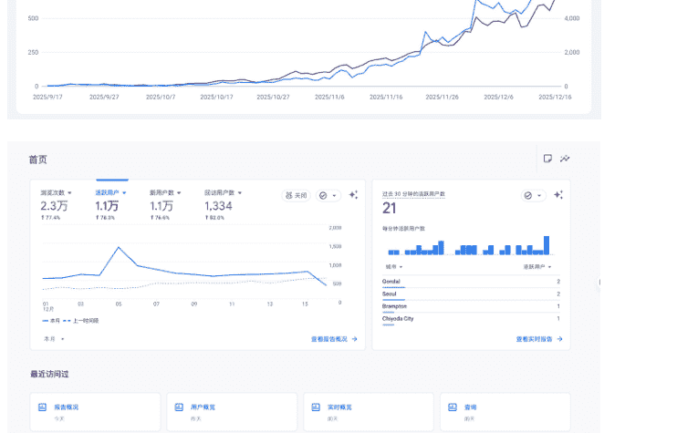
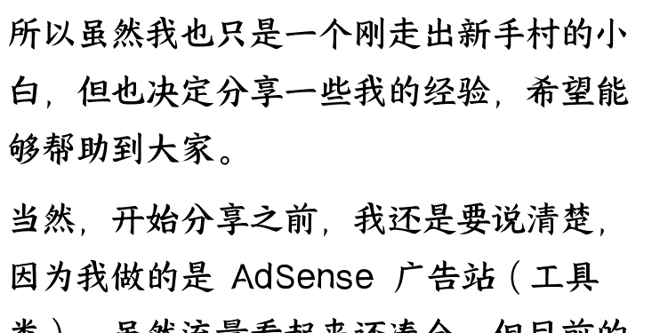
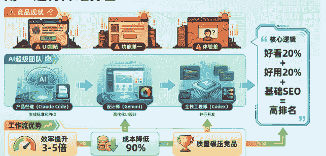
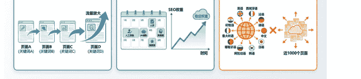

# 我是如何只做“老词”，用笨办法获取稳定流量，把日活做到 700+ 的？

251222 副业 SC 精华

公众号懒人搜索，懒人专属群独享

懒人微信:lazyhelper

在正式开始分享前，想先聊聊我的背景，或许能给同样在迷茫中的你一点共鸣。

今年 5 月之前，我还是一名普通的内容运营。离职后，我决定开始做 web 出海这个陌生领域，报名了刘小排老师的生财有术，尝试学习独立开发。

说实话，起步阶段简直是噩梦。

作为一个纯文科生，面对满屏的代码，我感到前所未有的无力。那些对程序员来说习以为常的逻辑，对我来说就像天书。无数个深夜，我盯着报错的屏幕，一度想放弃，觉得自己这辈子都学不会写代码了。

好在，AI 能力的爆发拯救了我，再加上生财里像二歪、Mixo 等热心朋友的帮助，我慢慢熬过了新手期。

7 月份，我磕磕绊绊地上线了第一个练手站。虽然功能完整，但没什么流量，也没什么人用。

9 月份，我上线了第二个站——也就是今天的主角。

就在前几天，我看后台数据时，发现这个小破站的日活已经稳定在 700 左右。在即刻上分享了这个小确幸后，没想到收获了许多朋友的关注。

所以虽然我也只是一个刚走出新手村的小白，但也决定分享一些我的经验，希望能够帮助到大家。

当然，开始分享之前，我还是要说清楚，因为我做的是 AdSense 广告站 (工具类)，虽然流量看起来还凑合，但目前的变现金额其实很微薄，一个月也就几十美元，连顿像样的火锅都吃不起。

比起社区里动辄月入万刀的大佬，这个成绩只能算是一粒芝麻。

但对于 5 月份还是一行代码都不会写、对建站一窍不通的我来说，这几十美元却有着特殊的意义——它证明了我作为一个非技术人员，靠着笨办法和 AI 工具，真真切切地跑通了从开发、上线、推广到变现的完整闭环。

千里之行，始于足下。今天写这篇文章，就是复盘一下这第一步是怎么迈出去的。

把时间拨回今年 5 月，那时的我还是一张白纸。因为参加了刘小排老师的课程，我开始接触独立开发。

在建站之初，我的策略很简单：循序渐进，先练手，不贪大。

所以我选择了一个逻辑最简单的 AdSense 广告站来跑通全流程。

现在这个阶段的话，算是跑通了第一部分。

但在这里，我想先停一下，聊聊为什么大多数独立开发者做不好流量？

我之前也焦虑过，觉得流量就是要做爆款，要在推特上刷屏。但后来我发现，这种烟花式流量虽然好看，但不可复现，且生命周期极短。

对于普通人来说，我们需要的是「稳定流量」。

稳定流量 = 刚需搜索 (SEO) + 长期沉淀 (资产)。

这里说的资产，不仅是那些只要服务器不挂就能一直被搜到的网页，还包括我们辛苦发出去的每一条外链。它们就像是我们在互联网上撒下的种子，只要种下去了，就会源源不断地把养分（流量）输送回来。

它不像追热点，今天写了明天就过气；它更像存钱，你做的每一个页面、发的每一条外链，都是在给未来存利息。这也是我选择这条笨路的根本原因。

简单分享一下我是如何跑通整个流量逻辑的：

- 1. 选产品（找准刚需切口）
- 2. 发外链（笨功夫也是真功夫）
- 3. 加内页（量变引起质变）

接下来，我想和大家详细聊聊这三点实操经验。

## 一、选产品：与其追新，不如翻新

选品是出海建站的老生常谈，也是最容易让新人迷茫的第一步。作为一个纯小白，我有自知之明：去竞争激烈的新词、热词，我肯定卷不过那些经验丰富的大佬。所以，我的策略反其道而行之：不做新词，只做老词。，这样也更容易拿到反馈。

### 为什么选老词？

与其在红海里做炮灰，不如在蓝海里做地头蛇。老词虽然听起来不性感，但需求极其稳定。

我在选品调研时意识到，真正的低竞争不等于低流量。一个值得做的优质老词，其实需要满足四个维度的平衡：

- 流量适中（Volume）：通常建议月搜索量在 100-5000 之间（太低没意义，太高卷不动）。
- 有钱途（CPC > $1）：点击成本最好在 1 美元以上。这代表有人愿意为这个流量花钱，商业价值高，我们做广告变现才容易。
- 难度低（KD < 30）：Keyword Difficulty（关键词难度）最好在 30 以下，这样新站才有可能在 3-6 个月内冲上首页。我选的这个词 KD 只有 20 多，属于绿色简单模式。
- 意图明确（User Intent）：这是最关键的一点。选的词必须包含具体的场景或痛点。
- ✖ 反面教材：比如“单位换算”这种大词，需求太模糊，你不知道用户到底想算汇率、重量还是长度。
- ✔ 正面教材：比如“千焦 (kJ) 换算成卡路里 (cal) 计算器”，这种词虽然长，但用户意图极其精准，就是来找工具按一下计算器的。

这种低难度、高价值、意图清晰的词，往往因为太具体或者太普通而被大玩家忽略，但这恰恰是我们新手捡漏的最佳机会。

### 选品策略：与其追新，不如翻新

> > 被大玩家忽略的精准需求，才是新手的最佳机会

### 用 AI 进行降维打击

确定了关键词后，我调研了排名前几的竞品网站。结果让我很惊讶：排名第一第二的网站，体验做得非常稀巴烂。

UI 简陋：很多是几年前的老站，界面风格还停留在上个世纪。

功能单一：受限于当年的技术或代码能力，功能做得非常简单，甚至有些还不太好用。

这就是 AI 时代给我们的红利。

以前大家代码能力有限，做出来的工具丑一点、简单一点也能忍。但现在，有了 AI 工具，我作为一个小白，完全可以组建一支超级 AI 开发团队，用更高标准的代码质量、更现代的 UI 设计，去降维打击这些老旧的竞品。

我的三位一体 AI 工作流是这样的：

产品经理 (Claude Code)：我不再自己瞎想功能，而是把需求丢给 Claude Code。

**这里有个进阶技巧：利用 Claude Code 的 `Skills` 系统**。

比如我定义了一个 `product-requirements` 的 skill，只要我说“帮我写个 PRD”，它就会自动激活，按我预设的模板生成标准化的产品文档。这比每次从头写 prompt 效率高太多了。

设计师 (Gemini)：我也不会设计，但我会用 Gemini。告诉它“生成一个现代化、极简风格的 UI 原型”，它能结合多模态能力，帮我把页面布局、配色方案安排得明明白白，直接输出高颜值的设计思路。

全栈工程师 (Codex)：最后，把 Claude 的需求和 Gemini 的设计给到 Codex。最爽的是它的并行执行能力 (`/dev` 命令配合 `--parallel` 参数)，我可以让它同时跑前端组件开发和后端 API 编写，就像真的有两个程序员在同时帮我干活，效率比我一个人手搓快了 3-5 倍。

有了这套 AI 组合拳，我就能以极低的成本，快速构建出一个在体验上碾压竞品的新站。

我的核心逻辑非常简单粗暴：

在同一个关键词战场里，只要我能把产品做得比他们好看 20%，好用 20%，再配合基础的 SEO 和内页策略，我就有很大机会在这个简单模式的战场里拿到高排名。

事实证明，这套打法是完全跑得通的。现在市面上还有很多类似的工具站，依旧停留在丑且简陋的阶段，这都是我们可以用 AI 去重做一遍、抢占流量的巨大红利。

## 二、发外链：运营思维战胜程序员思维

在和很多独立开发者交流时，我发现一个有趣的现象：大家都不爱发外链。

很多技术出身的朋友觉得酒香不怕巷子深，只要产品好，流量自然来。

说实话，刚开始我也很抗拒发外链，觉得这事儿太 low，像个发传单的。但我强迫自己换了个视角：这不是发广告，这是在给搜索引擎投票。谷歌需要通过这些票数来判断你的网站是否值得被推荐。

我的策略非常朴实，就是用笨功夫去堆量。前前后后，我大概为这个网站发了 100-200 个外链。

### 坚持白嫖原则

因为这个站本身是练手性质，前期没赚钱，所以我给自己定了个规矩：只发免费的，绝不花钱买。

我的外链来源主要分三批：

- 第一批（冷启动）：找一些专门针对新产品发布的平台（Launch platforms）提交。
- 第二批（老站权重）：挖掘一些老的黄页网站（Directories），虽然看起来旧，但域名权重高。
- 第三批（垂直导航）：寻找垂直领域的导航站提交收录。

前前后后，我也因此积累了一份属于自己的优质外链资源表。我觉得这应该是每一个独立开发者都必须准备的资产。

### 只要发了，就一定有效果

发外链的过程很枯燥，但回报是肉眼可见的。

上个月：我的核心关键词排名还只是勉强挤进前 10。

这个月：随着外链效应的累积，好几个大流量词已经稳居 前 5，甚至个别词在很多语言环境下已经做到了 Top 2。

| ↓ 点击次数 | 展示 | 排名 |
| --- | --- | --- |
| 2,979 | 13,992 | 4.1 |
| 1,360 | 11,419 | 4.9 |
| 834 | 2,681 | 3.0 |
| 722 | 3,231 | 5.1 |
| 697 | 9,948 | 6.8 |
| 566 | 2,616 | 4.1 |
| 323 | 1,662 | 5.8 |
| 274 | 3,419 | 6.1 |
| 260 | 888 | 3.0 |
| 149 | 523 | 4.1 |

所以，我想对大家说：一定要发外链！哪怕每天只发几个，慢慢积累，网站的权重就会一点点做上去，排名自然也就水涨船高。

### Chrome 插件引流法

这里我要分享一个非常高性价比的骚操作：开发 Chrome 插件来获取高权重外链。

很多朋友不知道，Google Chrome 应用商店本身的域名权重极高 (DR 90+)。只要你在上面发布插件，并填入你的官网地址，你就自动获得了一条极其优质的外链。

具体操作路径如下：

- 1. 注册开发者账号：去 Chrome Web Store 注册一个开发者账号，只需一次性支付 5 美元（约 35 元人民币），终身有效。
- 2. 用 AI 生成插件：不需要你会写代码。直接把你的核心功能丢给 Claude 或 codex，让它生成一个简单的 Chrome 插件版本。
  - 可以是网站功能的简化版（比如一键换算）；
  - 也可以是功能的补充（比如快速查询）。
- 3. 上架发布：在发布页面的官网一栏，填入你的网站链接。

为什么推荐这个方法？

成本极低：5 美元一次性投入，后续发布不花钱。

效率极高：用 AI 写一个简单插件，熟练的话 1 小时 就能搞定从开发到上架的全流程。

权重极高：这是 Google 自家的平台，外链质量没得说，对新站排名的拉动效果非常明显。

这也是我每个新站都会标配的一个秘密武器，强烈推荐大家尝试！

## 三、加内页：量变引起质变

最后一个关键点是加内页。

我观察到，很多做工具站的朋友容易陷入一个误区：只做一个单纯的功能页。导致整个网站极其单薄，只有 1-2 个页面。

从 SEO 的角度看，这是很吃亏的。

打个比方，谷歌就像个书店老板。如果你的店里只有两三本书，他肯定不愿意把你放在显眼的橱窗位置。反之，你的书 (页面) 越多、内容越丰富，他就会觉得你这家店“很有料”，权重自然也会随之提升。

### 怎么把页面变多？

为了解决这个问题，我采用了一套组合拳，把我的网站从单薄做到了丰满，目前全站大概有 1000 个页面左右。

我的竞品大多只有 1-2 个页面，在页面体量上，我直接形成了碾压优势。

具体做法如下：

### 策略一：拓展兄弟关键词页面

主关键词做起来后，我会去挖掘很多长尾的兄弟关键词。

针对每一个兄弟词，我都会专门生成一个新的产品页面。这些页面的功能其实大同小异，只要能用就行，核心目的是承接搜索流量。目前我大概做了十几个这样的产品内页。

### 策略二：用运营思维做高质量内容

除了功能页，我还专门写了相关的博客文章。这里我要特别强调一点：千万不要用 AI 生成垃圾水文。

因为我是运营出身，对内容质量有执念。我发现很多竞品虽然也有博客，但全是 AI 一眼假的废话。所以我选择了发挥我的长板——人工润色+AI 辅助。

我大概撰写了 60-70 篇高质量文章，每一篇都经过我的人工校验，确保逻辑通顺、干货满满。虽然这比纯 AI 生成要慢，但这种精品内容带来的 SEO 权重极其稳定。

这里也想多说一句关于扬长避短：

其实做流量的方法很多，比如现在很火的短视频引流 (社媒传播)。但我很有自知之明，我在镜头前不自在，做视频效率低，所以我果断放弃了 TikTok/Youtube 这条路，专心死磕我最擅长的文字内容。

我觉得独立开发最重要的是找到自己的舒适区：如果你擅长视频，就去做视频；如果你像我一样擅长写字，那就把文章写到极致。没必要跟风，适合自己的才是最高效的。

### 策略三：多语言裂变

之前读刘小排老师的文章，他提到通过 32 种语言本地化让网站流量大增。这让我很受启发，但我没有盲目照搬。

对于像我这样的不懂代码的，完全依靠 Vibe Coding 的个人站长来说，语言做得太多，反而可能是个负担。维护成本高不说，如果内容质量跟不上，很容易被搜索引擎判定为低质量站点。

经过权衡，我认为 10-15 个高质量语言版本才是性价比最高的选择。

所以我最终锁定了最核心的 12 种语言：包括英语、中文、西语等覆盖全球绝大部分高价值用户的核心层，以及竞争没那么极端、适合吃长尾流量的日语、韩语等潜力层。

这样做的好处是：既吃到了多语言的 SEO 红利，又避免了因为语言过多导致的内容质量失控。

这是最能快速放大页面数量的一招。

我给网站上了 12 种语言的版本。

算一算账：(十几个产品页 + 几十篇文章) × 12 种语言 ≈ 近 1000 个页面。

## 独立开发 SEO 增长三策略

- 策略一：拓展兄弟关键词页面
  - 长尾词 + 独立页面 = 流量放大器
- 策略二：用运营思维做高质量内容
  - 人工润色+AI 辅助 = 稳定权重
- 策略三：多语言裂变
  - 12 种语言 = 近 1000 个页面

## 写在最后

从 5 月份的一个编程小白，到今天拥有一个日活 700+ 的网站，这段经历让我明白：AI 时代，技术不再是壁垒，耐得住寂寞的执行力才是。

说实话，独立开发是一场极其消耗心力的修行。

在这条路上，你会遇到无数个想放弃的瞬间：代码报错修不好时、发了外链没人点时、看着后台 0 访问发呆时……这种孤独感是吞噬性的。

但请相信，每一个穿越过黑暗隧道的人，靠的都不是聪明，而是死磕。

在这个喧嚣的时代，能沉下心来做一件属于自己的小事，本身就是一种胜利。

这一路走来，除了刘小排老师的课程和 AI 工具的加持之外，还要特别感谢环境的力量。

最近我一直在生财有术的联合办公工作，这里的氛围真的太棒了。大家每天都在为了自己的目标死磕，那种高密度的信息交流和毫无保留的分享精神，给了我巨大的能量。坦白说，能从 0 到 1 坚持下来，很大一部分原因正是得益于身边这群优秀的战友们的鼓励和互助。

给自己多一点耐心，给时间多一点信心。

路虽远，行则将至。希望我的分享能给你一点启发，也以此文勉励正在路上的我和你。

最后，安利小懒的付费群：

懒人专属群 ( 介绍 )

微信：lazyhelper1

这里是你对抗信息过载的护城河。

已稳定运行 6 年，累计拆解、研读 3000+ 个互联网商业实战案例与行业前沿内参和时政/宏观文章。

我们不搬运垃圾，只做高价值信息的筛选器与放大镜。

## 懒人专属群更新记录：

https://hk57gvIx7u.feishu.cn/docx/H0kRdZbSbolBR0xkaXtcuVEOnTg

## 懒人专属群更新记录（需梯子，备用）:

https://lazybook.fun/blog/record2

【免责声明】本资料归档于社群内部知识库，仅供成员课题研究与学术交流，请在查阅后 24 小时内删除。