# 我用“垂直小号”逻辑跑通公众号流量主矩阵，用优势搭建批量壁垒思路分享

## 251222 副业 SC 精华

公众号懒人搜索，懒人专属群独享

懒人微信：lazyhelper

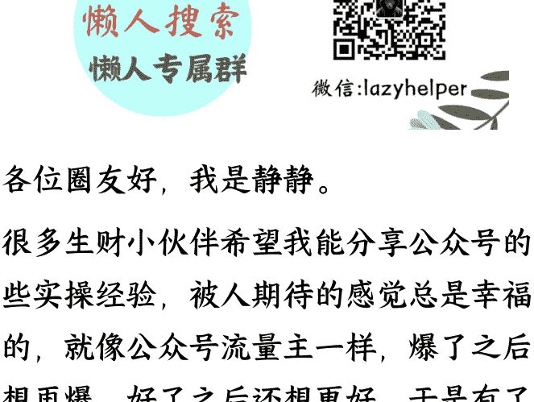

各位圈友好，我是静静。

很多生财小伙伴希望我能分享公众号的一些实操经验，被人期待的感觉总是幸福的，就像公众号流量主一样，爆了之后还想再爆，好了之后还想更好，于是有了今天这篇文章，分享我做公众号实操时的所思所想，也希望能和上一篇文章一样，让大家收获到价值。

最近我收到了很多人的困惑：

> “都马上 2026 年了，现在入局公众号是不是没戏了？”

> “我现在这种情况，还能不能靠公众号挣到钱？”

> “我也在上班带娃、负债，这条路我走得动吗？”

> “流量主不好写了，我现在好多账号用 AI 写的文章发出去就死……”

“生财上都是垂直小号，公众号流量主项目是不是死了？”

面对这些焦虑和疑问，我特别能感同身受。因为刚接触公众号项目时，我也是这样，心态也来回摇摆过：一边怕错过机会，一边又怕白白消耗时间和心力。

在经历了近两年多的公众号锤炼后，我不会再简单地定义“公众号”值不值得做。对普通人来说，公众号不是能不能做，而是要换一套更适合的打法。

这一篇文章，我将围绕四个核心内容来分享：

- 1.公众号现在还能做吗？对小白到底友不友好？
- 2.我是怎么用“批量账号 + 垂直小号”的思路，跑通美食动图这个赛道的？
- 3.拆解一个动图美食账号：标题、结构、内容、排版、动图是怎么做的？
- 4.对几种观点的建议

## 公众号依然是小白的最佳战场

回归到最开始的问题，公众号现在还值不值得做？我花了一点时间，征得同意整理了一些我身边小伙伴的公众号后台数据。这是最近 1 个月，不同赛道的收益数据（都是新号）

## 帐号明细

返佣

| 日期 | 收入 (元) |
| --- | --- |
| 2025-12-01 | 785.54 |
| 2025-11-30 | 394.53 |
| 2025-11-29 | 280.86 |
| 2025-11-28 | 207.58 |
| 2025-11-27 | 199.28 |
| 2025-11-26 | 137.49 |
| 2025-11-25 | 89.76 |
| 2025-11-24 | 49.94 |
| 2025-11-23 | 23.29 |
| 2025-11-22 | 16.38 |

公众号懒人搜索、懒人专属群分享

## 指标数据明细

日期范围
近 7 日
近 30 日
自定义
广告位
全部
底部
文中
后帖
中帖
互选
返佣
指标
组合指标 - 收入
组合指标 - 点击
组合指标 - 曝光

| 日期 | 曝光量 | 收入（元） | eCPM |
| --- | --- | --- | --- |
| 2025-12-06 | 39,510 | 510.29 | 12.92 |
| 2025-12-05 | 8,078 | 76.30 | 9.45 |
| 2025-12-04 | 366 | 6.80 | 18.58 |
| 2025-12-03 | 837 | 13.35 | 15.95 |
| 2025-12-02 | 218 | 2.58 | 11.83 |
| 2025-12-01 | 549 | 5.84 | 10.64 |
| 2025-11-30 | 129 | 1.91 | 14.81 |

## 指标数据明细

日期范围 近 7 日 近 30 日 自定义

广告位 全部 底部 文中 后帖 中帖 互选 返佣

数据指标 组合指标 - 收入 组合指标 - 点击 组合指标 - 曝光

| 日期 | 曝光量 | 收入 (元) | eCPM |
| --- | --- | --- | --- |
| 2025-12-06 | 50,202 | 502.28 | 10.01 |
| 2025-12-05 | 7,858 | 63.73 | 8.11 |
| 2025-12-04 | 918 | 4.05 | 4.41 |
| 2025-12-03 | 2,561 | 16.68 | 6.51 |
| 2025-12-02 | 2,278 | 10.95 | 4.81 |
| 2025-12-01 | 2,480 | 14.28 | 5.76 |
| 2025-11-30 | 2,333 | 18.14 | 7.78 |


的确，以往随便用 AI 生成一堆垃圾文就能日入过千的日子（“流量主 1.0 时代”）确实过去了。那时候的路子是：找几篇对标文章，简单改写甚至直接搬运；平台机制宽松，审核没那么严，靠“量大”砸出爆文。

现在平台经历了几轮“清垃圾文”的行动；明显在给优质内容创作者加权；简单抄、简单洗、简单生成，确实越来越难活下去。

所以很多人得出一个结论：“门槛提高了，对小白不友好。”

我觉得对只想“躺赚”的人，确实越来越不友好；但对愿意下功夫、愿意用脑子的小白，反而更公平了。

对于没有资源、时间有限、没特长、甚至有点社恐的普通人来说，公众号是目前反馈最快、门槛最适中、容错率最高的项目。

做短视频，得写脚本、拍摄、剪辑、配音，折腾一圈发一条，可能 0 播放，那种挫败感能瞬间击垮一个新人。

但公众号不一样，ai 辅助半小时写一篇文章发出去，哪怕只有几十几百个阅读，也会有几分几毛钱的流量主收益，那也是“钱”。对于急需正反馈来建立信心的小白来说，“看见钱”比什么都重要。

我上一篇帖子发出去之后，收到了很多生财圈友的反馈，因为一篇文章而能迈开挣钱的第一步，或是因为一个基础文档而实操获得几毛钱的收益，都让我更加相信，公众号的快速上手、快速正反馈，仍然是是对小白最好的战场。

静静姐姐好，刚看了你的文章，忍不住要给你汇报一下


11:06

我看完你的文章，第一个动作，转发给了我老婆，她全职带娃，有时候比较焦虑，觉得自己没有什么价值，也找不到工作，然后静静姐姐的案例，也让她开了眼，全职宝妈也一定能在互联网上找到自己的价值

简直像一盏明灯


我去，我太感动了，真的

听到你这个反馈，比挣了大几万还高兴


对的

好呢，有成绩再给静姐报喜~

👍👍

> 你有没有兴趣写写 随便写 吐槽也好，带娃也好。没有要求
就当个记事本，熟人也没看到，
嗯嗯
可以

看看，俺老婆也愿意

如果她担心别人看她，给她再注册一个微信，手机现在都可以双开微信了，互相不影响，这样她做副业发朋友圈写文章不会有熟人看见，也不会有心理负担。我就是搞了个微信小号专门做副业的

恩恩


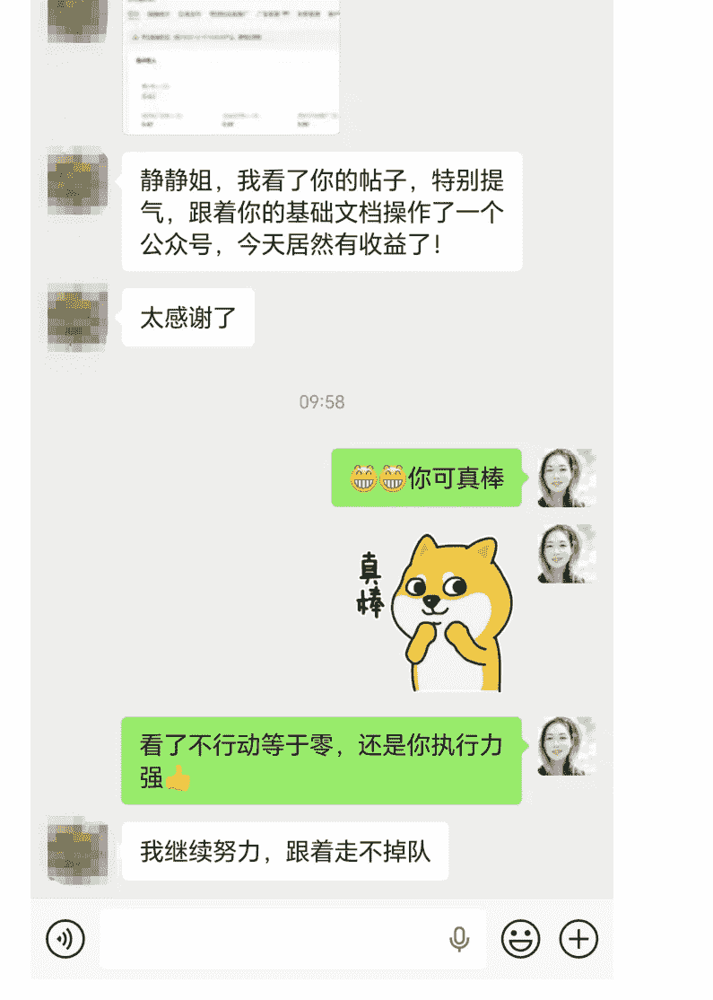

并且还有很多人怕露脸或者不方便露脸，怕被同事看到，怕被亲戚议论。公众号给了一种“隐身”的安全感。我们只需要躲在文字后面输出，这种体面，是很多副业给不了的。

我看过不少同行后台数据，再结合我自己副业做公众号收益 6 位数的经历，我最深的感受是：公众号给到我的，是一种“我还能靠自己翻盘”的安全感。

这对我来说，很重要。

## “批量账号 + 垂直小号”的思路，跑通美食动图实操

但是对于现在的公众号，路径需要优化下，单纯做流量主永远在给算法打零工，收入不稳定；但是只做垂直小号 IP，正反馈很慢，很多人很难熬过起步期。

最好是用“混血模式”：做流量主，用“垂直小号”的思维去做，才能批量稳定地拿到结果；做垂直小号，用流量主批量操作的思路，才能快速拿到正反馈。

在有些小伙伴的观点里，觉得流量主和垂直小号只能二选一，我个人认为流量主和垂直小号，并不是单选题，而是进化梯。

说说我认为的流量主“垂直小号”打法。其实做公众号流量主，绝大部分也是要求“垂直”，比如美食是垂直、职场是垂直、情感是垂直。但是这些垂直往往只是赛道的垂直。

在这些大而泛的赛道里去卷账号数量，拼文章数量，个体往往拼不过工作室。

我在刚批量做矩阵账号的时候，也踩过这个坑，手头 5、60 个账号的时候，觉得自己是个大户，分成 3 组，每组 20 个账号去写不同的赛道，结果并不是很好，后来和做工作室的朋友一聊，发现人家一上就是 200、300 个号来测试一个赛道，这种指数级账号的降维打击，我这种小个体极容易被碾压得连渣渣都不剩。

所以做公众号矩阵，个体千万别跟工作室拼“数量”，拼账号数量、拼发文量，只会把自己累成狗，还分不到几口汤。

当时和一起合作的小伙伴聊天，我们都谈到要避开和工作室拼“大流量”赛道（比如娱乐、民生、职场这些大流量赛道，2025 年年初的时候，这些赛道流量很大，单价也很高），这些赛道入门简单，自动化全部解决图片和文章内容，整个流程的搭建并不复杂，账号多、文章数量足够，就能博得较高的概率。

但这套逻辑，对我们这种“账号不算多、还想做矩阵”的个人来说，并不友好，技术拼不过工作室、账号数量资源拼不过工作室……更正确的方向应该是：结合自己的经验和优势，去更垂直的小领域里打造壁垒。

我想到以前自己做账号时，拿到最大结果的是美食赛道，在这个赛道我写过不同的方向，比如科普美食、图片美食、故事美食、养生美食、视频美食、动图美食（也就是垂直赛道下的不同领域），并且每一个美食小领域我都拿到了不错的结果。

做过美食赛道的小伙伴应该知道，这个赛道想批量自动化做有一定的难度，比如配图、素材。

我当时心里很清楚：工作室要用铺量打法来做美食赛道，其实并不好做。

不是他们没有技术，而是投入产出比不划算——

因为我之前做美食号的时候，都比较偏精细化运营，和那种“纯 AI 图文一键生成”的粗暴模式，有很大差别。

我开始琢磨：如果把我做“精品美食号”的那套精细打法，迁移到“批量做赛道、批量做账号”的矩阵思路上，能不能变成我的优势？

我的判断是：能。

精细化运营一个号，再把这套逻辑放大，不是每个工作室都有耐心、有心力去琢磨的。

而我对这个赛道很熟：

- 图片、视频素材上哪找；
- 文章怎么生成；
- 哪些细节是影响阅读和转化的关键。这些我都太清楚了。

在这个前提下，我们选了当时单价最高、生产门槛也最高的一个小领域——美食动图。动图其实只是一个表现形式，它本身不算是“更细一层的美食细分领域”，所以当时我又专门去查了很多对标账号，发现美食动图大致有三种写法：

做科普类的，讲食材营养、食物冷知识；

做菜谱类的，一步一步教你怎么做一道菜；

做技巧类的，分享处理食材的小技巧、做菜的小窍门。

最后我们发现，第三种内容转发、点赞、收藏的比例明显最高。

菜谱类的内容更多是“我现在要做这道菜了”才会去搜，而技巧类内容，是“随手刷到觉得以后肯定用得上”，很适合转发进家庭群、或者自己先收藏起来备用。转发收藏高，单价会高，也会拉高账号的权重。

所以我们的策略就定了下来：用动图的形式做美食小窍门

原因也很现实：

一方面，我知道有朋友靠美食动图，3 个账号单月能跑到七八万收益，这里有明显的信息差；

我自己用 4 个账号测试过动图美食领域，跑出来了 2 个，说明这个领域起号率高，不太卷，刚入场的还不多

另一方面，动图的制作流程本身就不算简单，很多人都不知道用什么工具做，即使知道怎么做了，也不清楚如何快速批量做，对大部分人来说是门槛。

在这个策略下面，我们把手头一半账号，都投到了美食动图方向。后来事实证明，这个选择非常值：

同样是流量主项目，美食动图账号的生命周期，明显比娱乐、民生这类大流量号更长；单个账号的平均收益也更高、更稳定。

再往后，我们又顺着这条思路，把“动图 + 技巧类内容”的玩法复制到了别的领域，比如生活小妙招、手工制作等，也陆续跑出了一些成功的号。

我自己最大的感受是：流量主的玩法多变，不能靠一招鲜，除了形式创新，更核心的是切入足够小的垂直领域，再选一个适合这个领域的呈现方式，把同一类价值不断放大。

当时有不少小伙伴来问我：“怎么批量找素材？怎么批量快速把视频拆成动图？图片内容如何快速和文案对齐？”

这些问题对我来说已经是肌肉记忆了，但我很清楚没经历过那一轮琢磨的人，这里就是实打实的壁垒。

也正因为看到这条壁垒，我们才下定决心：

在“避开大流量赛道，找到属于自己的小领域”这条思路上，立刻开干。不再跟工作室抢大流量赛道，而是在适合自己的小领域里，做深、做精，再用批量放大。

在我眼里，这才是真正适合个人玩家、也适合小团队的流量主批量方式。也是我理解的、适合普通人的「流量主垂直小号打法」

## 动图美食赛道实操拆解

动图是能动起来的图片，它比普通静态图片更生动，能传递更多的信息。

比如说下面三张就是制作“牛肉炒洋葱”的动图，虽然只有仅仅的 3 张图，但是基本上能看出制作过程：生抽蚝油胡椒粉等调料腌牛肉--洋葱过油加入青红辣椒炒--再加入腌制好的牛肉炒，加调料调味。

所以动图在用于内容创作的时候有一定的优势，尤其是涉及到技巧、方法、操作步骤等赛道的，都很适合。


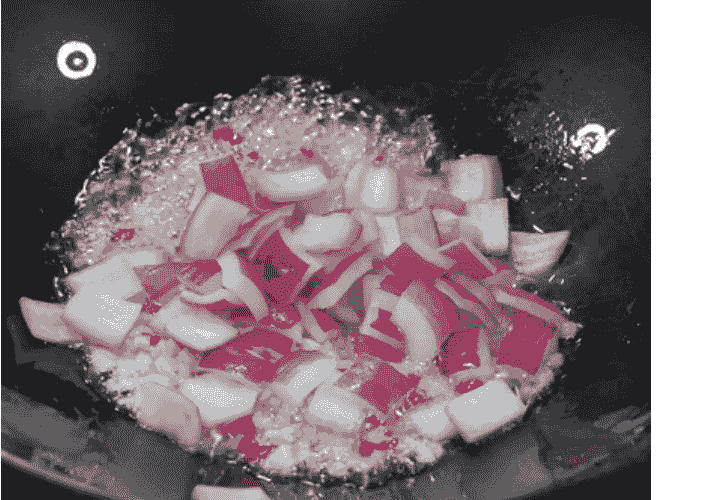

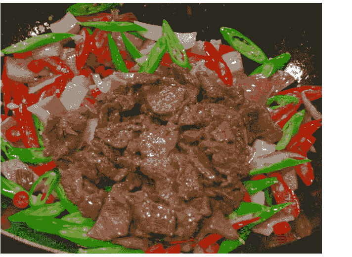

动图美食在去年下半年前后流量很大，起号率高，很多对标账号的文章阅读量都很高。

公众号懒人搜索，懒人专属群分享

小二说美食

关注

12 月 2 日

煮红豆，别再提前浸泡了！教你 1 招，10 分钟煮好，红豆软烂开花，省时...

阅读 4.1 万 赞 412


12 月 1 日

蒸红薯时，不要只加水！教你 1 招，个个软糯香甜，比烤红薯还好吃

阅读 4.7 万 赞 497


11 月 30 日

水煮蛋，最忌冷水下锅煮！教你正确做法，鸡蛋又香又嫩，壳一碰就掉

阅读 5.3 万 赞 384


11 月 29 日

炒牛肉，又老又柴咬不动？多做这 2 步，牛肉和豆腐一样嫩，无腥味不...

阅读 3526 赞 57


11 月 28 日

炒青菜时，切记别直接下锅炒！牢记 3 个要点，出锅颜色翠绿，不发黄不...

阅读 7077 赞 57


## 宋姐做美食

8 月 20 日

炒花生米时，记住不要先放油，教你一招，又香又脆，放久还不回软，...


阅读 4.0 万 赞 657

8 月 19 日

煮绿豆时，不要提前浸泡了！教你 1 招，10 分钟煮好，绿豆软烂开花，...


阅读 2.8 万 赞 321

8 月 18 日

烤红薯时，直接烤就错了，教你 1 招，个个软糯流糖，又香又甜，超好吃!


阅读 3.5 万 赞 275

8 月 17 日

才发现，猕猴桃去皮这么简单！一根牙签就搞定，不脏手不流汁，方法...


阅读 5.0 万 赞 340

8 月 16 日

做辣椒油，不要直接泼热油，多加 2 步，又香又辣，拌啥都好吃!


阅读 3.3 万 赞 585

但是动图的制作过程有一定门槛，就像前面所说的，很多人不知道怎么做动图，也不知道用什么样的工具能够快速的做出动图。接下来我会分享动图美食文章的具体实操方法，照着一步一步做，大家也能完成一篇不错的动图文章。

ps：下面分享的是原创动图美食文章的操作过程，不适用于洗稿模式（洗稿模式相对简单，直接批量下载对标账号图片后，仿写文章发布即可。）

### 1、搜动图美食对标账号

在搜对标账号的时候，可以先从爆款的标题搜，把你看到的一个动图美食爆款标题放在微信搜一搜里边去搜索，然后点半年之内最新的文章。会出现一堆不同的账号，点开这些账号，去找注册时间半年以内的账号（低粉爆款）

14:38

蛋饺，别再用勺子做！教 搜索 取消

全部 文章 视频 商品 小店 账号 直

#### 蛋饺，别再用勺子做！教你新方法，10 秒钟做一个，外皮金黄，简单又漂亮!

这样做的蛋饺不仅速度快，而且外皮金黄，内馅鲜嫩。保存与食用 做好的蛋饺...

轩哥说美食 5 天前 最近读过

#### 做蛋饺，别再用勺子了！教你快速做法，10 秒一个，金黄鲜嫩，咬一口满嘴香

今天王姐教大家快速做法，不需要勺子，10 秒钟一个，蛋饺金黄鲜嫩，咬一口满...

王姐做美食 4 天前

#### 做蛋饺不要用大勺，教你新方法，一个平底锅就搞定，10 秒一个，隔壁小姐姐看了直夸我...

今天进来分享做蛋饺的新方法，一个平底锅就可以搞定，简单又方便，隔壁家的...

衣青青 12 天前

#### 现在才知道，做蛋饺别再用大勺子了，一个平底锅就搞定，10 秒一个，又快又漂亮!

今天就来跟大家分享一个简单的方法，只需一个平底锅就可以搞定，做出来的蛋...

四时美食 13 天前

#### 做蛋饺，直接用勺子做是外行！50 年老保姆教我一招，10 秒钟一个，简单又快速，蛋饺鲜...

用这种方法做出的蛋饺，鲜嫩多汁，外皮金黄似金元宝，寓意招财进宝，做法还...

阿乐美食记 9 天前

炸小鱼时，放面粉和淀粉...

搜索 取消

全部 文章 问一问 视频 AI 搜索 商品

不限 最新 最热 已关注 最近读过

炸小鱼，只放面粉或淀粉是大错! 教你一招，酥脆不回软，鱼刺都能吃

但很多人小鱼炸不好，不仅是火候控制的不好，关键的面糊也调的不对，有人加...

小程爱美食 2 个月前

阅读 10 万+

炸小鱼时，放面粉和淀粉都不对，教你 1 招，鱼骨又酥又脆，好吃不腻人，凉了也不回软!

大家切记，炸小鱼时千万不要只用面粉或普通淀粉，否则炸出来的外壳不够酥脆...

宋姐做美食 7 个月前

阅读 10 万+

炸小鱼放鸡蛋液和面粉都不对，教你饭店好吃的做法，鱼骨酥脆，凉了也不回软

想必大家在饭店里都吃到过干炸小鱼，饭店里炸出来的小鱼口感非常酥脆，而且...

四时美食 2024/4/30

阅读 10 万+

炸小鱼时，放面粉和淀粉都不对，教你 1 招，鱼骨又酥又脆，好吃不腻人，凉了也不回软!

大家记住，炸小鱼时千万别只用面粉或普通淀粉，否则炸出来的小鱼外壳不够酥...

宋姐做美食 5 个月前

炸小鱼时放面粉和淀粉都是大错! 教你 1 招，金黄酥脆，凉了不回软

展开炸小鱼时放面粉和淀粉都是大错! 教

小技巧：为了能找到更多的爆款标题和更多的账号，在复制爆款标题的时候，不要一字不落的全部复制，选取爆款标题中核心的一段文字。

比如下面图片 1，爆款的标题是《保存小葱，不要直接放冰箱，教你 1 招，放一年都新鲜翠绿不变味！》阅读 7.3 万我对这个爆款标题，只复制前面一部分

“保存小葱，不要直接放冰箱”，因为这句话是全句的核心，放到微信搜一搜里，又会出现很多相类似的爆款标题，能得到更多的对标账号（图片二）：

- 《保存小葱，千万不要直接放冰箱，教您一招，放一年都新鲜翠绿不变味！》
阅读 10 万 +

- 《保存小葱，记住不要直接放冰箱！教你一招，不发黄不出水，放一年都新鲜》
阅读 10 万 +

- 《保存小葱，直接放冰箱就错了！教你一招，又新鲜又绿，放半年都不坏，真实用》阅读 5.2 万

......

最重要的一点，通过这种方式，同时也能看到一个爆款标题怎么微调仍然能爆，学习到如何保持爆款结构。时间长了，越来越有网感，就可以自己创作爆款标题了。

#### 保存小葱，不要直接放冰箱，教你 1 招，放一年都新鲜翠绿不变味！

原创 宋姐 0801 宋姐做美食

2025 年 8 月 5 日 18:08 北京 标题已修改

2.3 万人 ☆ 星标

大家好，我是宋姐。最近天气越来越热了，小葱作为我们厨房里必不可少的调味品，几乎每天做饭都要用到。


不管是炒菜、煮面，还是包包子、包饺子，撒上一把翠绿的小葱，立刻就能让菜肴香气四溢，所以平时买菜时，我都会特意多买些小葱备着。


保存小葱，不要直接放冰箱

全部 文章 视频 账号 直播 微信指数

已选择：最热、文章 清空

保存小葱，千万不要直接放冰箱，教您 1 招，放一年都新鲜翠绿不变味！葱包上保鲜膜之后，我们就放到冰箱中冷藏着。平时需要就取出一根来，特别的...


百姓灶台 3 个月前

阅读 10 万 +

保存小葱，记住不要直接放冰箱！教你 1 招，不发黄不出水，放一年都新鲜 然后将小葱剪成短短的长条，装进保鲜盒中，盖上盖子密封起来，放进冰箱冷冻...


小二说美食 7 个月前

阅读 10 万 +

保存小葱，不要直接放冰箱，教你 1 招，放一年都新鲜翠绿不变味！全部装满后，盖紧盖子密封好，放进冰箱冷冻保存，这种方法适合长期保存小葱...


宋姐做美食 4 个月前

阅读 7.3 万

保存小葱，直接放冰箱就错了！教你一招，又新鲜又绿，放半年都不坏，真实用 这里注意，要存放的小葱上面千万不能有水分，有水份的话，小葱就会冻在一起...


王姐厨房 4 个月前

阅读 5.2 万

保存小葱，切记不要直接放冰箱，教你 1 招，放一年都新鲜翠绿不变味！

最后把封装好的瓶子放进冰箱冷冻室保存

### 2、从哪里找动图素材

动图是将视频处理，切割成一个个.gif 格式的图片。所以我们要做动图，就要先找到相对应的视频素材，再转化成动图。

我一般会从抖音、小红书、快手上搜视频素材，对这些素材，不需要有时间限制，哪怕是几年前的视频也可以。下面以抖音为例说一下操作过程。

第一步，把在微信搜一搜里用的关键字，同样放在抖音里边去搜。筛选视频长度在 1-5 分钟以内的。因为视频太长，切割出来的动图图片要么太多，要么图片太大。

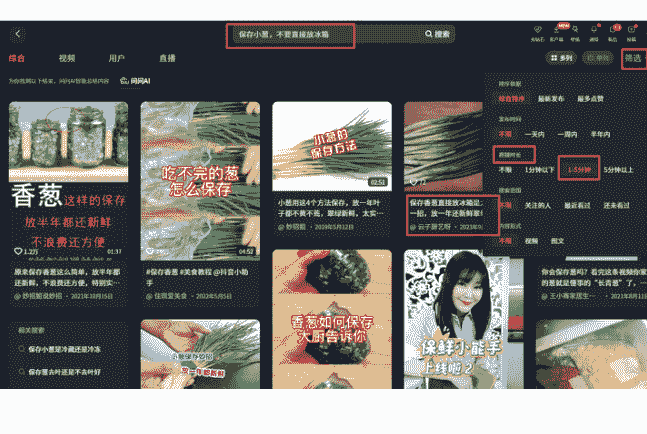

第二步，点搜索之后会出现很多视频作品，类似于红色框这样的标题就挺好的，如果只是单篇做动图素材的话，这个时候就可以直接用视频下载工具下载单篇视频。如果是想批量做动图素材，建议点进去账号主页，看所有作品的内容是否整体符合我们的需求，这样便于下载账号全部视频。

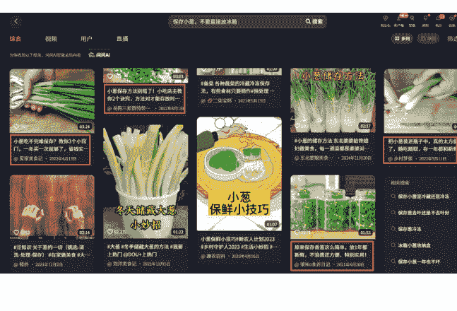

第三步，点进去账号主页，有一些账号是不能用的。比如说像这种带有头像的视频不要用，会涉及到侵权的问题。

继续点另外一个账号看，像下面右图这个账号里的视频素材就相对不错。因为账号里的视频时长基本都是 1-2 分钟，这样的视频切出来的图片数量和大小都更合适。动图图片太大上传到公众号草稿箱里会出现图片上传失败的现象。


用哼哼猫、江湖工具箱都能下载抖音视频，在我上一篇帖子里有分享工具下载地址。

### 3、怎么制作动图

视频下载好之后，先用剪映处理视频，去掉字幕，同时将画面裁剪成合适的比例 4:3。制作动图的工具有很多种，比如美图秀秀、格式工厂，还有很多微信小程序工具。

在剪映里边处理视频分为两种：

第一种是只处理字幕和视频的尺寸，然后将整体的视频完成的导出再放到美图秀秀里。


用美图秀秀处理视频，先将视频切割成小段，然后批量导出为 gif 格式（需要会员功能）

要点：每段小视频的长度最好在 10 秒左右

第二种是在剪映里将视频切割成小视频，再用第三方工具转成 gif。

https://ua5bw0s9s5r.feishu.cn/sync/ObJxdBsUesolLkbCdArcFF9WnDe


微信小程序中也有很多视频转动图 GIF 的工具，在小程序中搜"GIF"或者"视频 GIF"。

去广告

#### GIF 动图工具箱

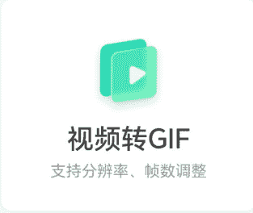

支持分辨率、帧数调整


分享给好友

常见问题

错误反馈

首页

表情包

new

我的

### 4、动图美食正文怎么写

正文要根据视频的文案来写，其实正文是最简单的部分，将对标的正文下载后投喂给 AI--让 AI 分析生成提示词--将下载的视频文案作为主题扔给 AI--写出正文。这部分不做多的描述。

视频的文案提取工具同样很多，比如江湖工具箱（收费功能，但是很便宜）、轻抖

#### 轻抖官网:

https://www.qingdou.vip/pctool/work-benches

### 5、文章排版发布要点

动图美食赛道的目标人群一般是中老年人，考虑到中老年人群体的特点，文章排版也要做相应的调整，比如字体要大，字间距要宽，行间距要宽，涉及到一些重点的食物操作步骤，或者是食物处理小技巧的时候，要加粗或者使用背景色等。

下面是我常用的排版的指标:

| 指标 | 设置 |
| :--- | :--- |
| 字体 | 19 号 |
| 行间距 | 1.75 |
| 字间距 | 1 |

每隔 50 字左右出现一行有色字体或带背景色的字体。深背景色 + 白色字体，或者浅背景色 + 黑色字体都可以。

这样的排版效果出来的文章大家可以对比看一下，左边是动图美食的排版效果，右边的这个是其他美食文章排版效果。

酥，配上一碗热乎乎的豆浆，很多人都喜欢吃，但很多人在家却总是炸不好。


今天我就给大家分享一个简单又快速的做法，不用泡打粉，也不用反复揣面，炸出来的油条照样蓬松酥脆，又香又软，比买的还好吃，而且更健康！下面一起来看看吧！


首先，在大盆里倒入一碗普通面粉（大约 500 克）加入五克食盐增加筋性，再放入四克白糖（这样能让炸出来的油条颜色更漂亮）。

深秋的落叶淹没了林荫小道，一路向深山里蔓延，干燥的空气里浸着桂香的余韵，熙攘的城市在午后暖阳里最是慵懒，一旦暮色缓缓沉下、路灯亮起，脚步匆匆的行人们便裹起了厚重的外套，走向菜场、便利店、公交站，车辆闪着暖灯，载着晚归的行人往家赶。我不爱跟着人群挤向热闹的市集或餐厅，便悄悄在家支起了暖锅，煮起热气腾腾的寻常日子。

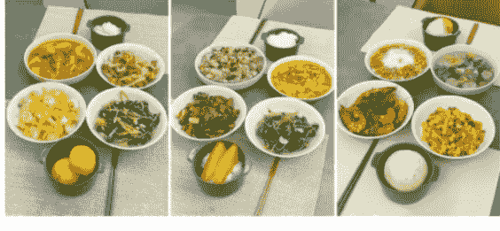

#### 星期一

油爆虾 + 油醋炒蛋 + 炒杂菜 + 清炒菠菜

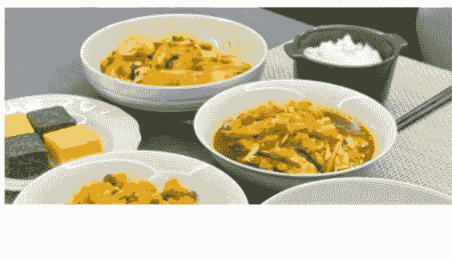

动图美食的图片要均匀地插入到文章中，有两种方法：

方法一：单独上传到公众号的素材库内

内容管理--素材库--图片--点击右上角的绿色“上传”，从电脑里找到动图图片存放的位置，可一次性选择 20 张动图上传。

动图上传成功后，回到保存的文章里，找到最上面的“图片”，点“从图片库选择”将动图插入到文章中。

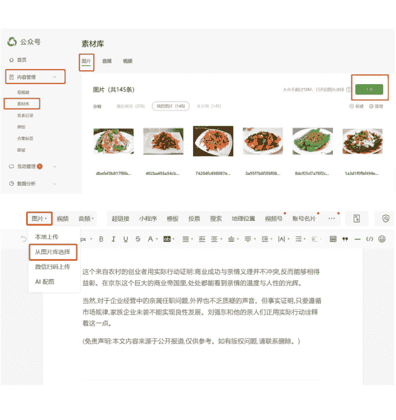

#### 方法二：直接复制图片，然后在文章中粘贴

鼠标右键点击图片 - 复制 - 进入公众号文章，在相应的文章位置粘贴图片。一般文章每隔 1-3 行插入一张动图，根据文案内容选择插入的位置，不用太精确，大概文字和图片意思相近就行，一次插入一张。

到这里，就是一篇动图文章的完整操作过程了。带着小伙伴做出来的动图美食号，的确单价很高。

公众号懒人搜索，懒人专属群分享

## 数据统计更新至 2025/04/07

| 指标 | 数值 | 较前日 |
| :--- | :--- | :--- |
| 昨日阅读 | 141,455 | ↑11289% |
| 昨日分享 | 765 | ↑3087% |
| 关注者 | 882,376 | - |

动图美食

关注我的人 882376

付费功能收入去开通

流量主收入昨日收入¥4347.12

传图片到素材库

通知设置豹豹

互动

发表

我

36 / 56

## 发表

今天还有 0 次通知次数

### 已发表内容

全部 >

| 发布日期 | 标题 | 阅读 | 在看 | 分享 |
| :--- | :--- | :--- | :--- | :--- |
| 2025/04/07 16:00 | 鸡蛋不再炒着吃了，教你好吃新吃法，5 分钟出锅，上桌孩子... | 185 | 0 | 2 |
| 2025/04/06 16:00 | 清洗猪肚时，加面粉和盐是大错，教你正确做法，干净快速... | 116,266 | 20 | 231 |
| 2025/04/05 16:00 | 洋葱炒鸡蛋到底是先炒洋葱还是先炒蛋？下锅顺序很重要，... | 1,476 | 0 | 6 |

一篇爆文带动整个账号


116,266 20 231 451 76 136


1,476 0 6 44 6 2

## 对几种观点的建议

> “公众号要么做流量主，要么做个人 IP，两条路只能选一条。”

最近我也参加了垂直小号的航海，看到很多小伙伴一是分不清流量主和垂直小号的区别，另外就是很纠结:“我是写爆文赚广告费，还是做垂直小号养 IP？”“做 IP 是不是必须得先有自己的产品？”

“我没有课程，我没有产品，所以我做不了 IP，也做不了垂直小号。”

其实并不是这样，你没有产品，你可以“借”产品，甚至你可以“长”出产品。分享两个我身边的例子:

- 1、我有一个学妹，大学学的是心理学，毕业后回老家进了一家国企，工作很清闲。她很聪明，利用业余时间，做了一个“心理学科普”的账号挣流量主广告费。流量起来后不少人私信她咨询，她就去找了自己的做心理咨询工作室的同学合作。粉丝有咨询需求，她负责“转介绍”，成交一单拿佣金。

后期她还可以把这个“从 0 做账号、引流、转介绍变现”的过程变成一套课程 SOP，教别人怎么做流量。

- 2、还有一个是我去年参加北京生财线下活动上认识的小伙伴。他太胖了想减肥，自己写了一个“减肥日记”的公众号记录这个过程，写每天自己吃了什么、练了什么、瘦了多少。在这个过程中，他真的减掉了 40 斤，当他把“减重 40 斤”写成一篇文章再配上前后对比图的那一刻，后台都炸了。评论区全是:“怎么减的？带带我！

他顺势把自己的减肥经历、食谱、运动计划整理出来，做成了一个“减肥陪跑课程”。本意是写公众号来监督和记录自己的减肥过程，没想到最终搞成了一个养成系 ip。

现在减肥减脂赛道流量一直不错，并且也有很大的市场需求，因为减肥这事儿，不管胖人瘦人都有需求，做流量主的同时，在文章中放个引流资料，留微信二维码，做减肥产品或者课程都很丝滑。

##### 🌟膳食纤维补充

每天需摄入 500g 以上的蔬菜，尤其是方便储存的绿色蔬菜。

推荐西兰花、西芹、各类大叶绿叶菜、生菜、西葫芦、黄瓜等，丰富的膳食纤维有助于促进肠道蠕动，维持减脂期的代谢健康。


“吃对”与“吃干净”，并非严苛的自我约束，而是通过科学的饮食规划，让身体在均衡的营养供给中自然调节。

坚持这样的饮食逻辑，不依赖...


光吃这个还不够饱，一般我还会配一个水煮鸡蛋，再加一把坚果，这食量对我来说就足够了。

姐妹们改成全麦面包也可以滴，不够饱再加一杯豆浆或咖啡拿铁，撑一个上午都问题不大。

最近很多姐妹问我减脂三餐怎么吃？我整理了一份《月瘦 10-20 斤食谱》，食堂、外卖、聚餐，或自己做饭都适用！

扫码加我好友，免费领取⬇️


全文原创，感谢你的阅读和喜欢~❤️

卫健委 2025 减肥食谱 pdf

浅方吃不胖

+ 关注

2

9

推荐

7

我朋友本来想着先调代谢、完了再减肥，意外的是调代谢的过程中体重也在下降，既养好了代谢又掉了体重，一举两得。

**减肥的尽头就是养代谢，如果体重一直不掉不妨看看是不是代谢的问题。**


关注我，我们一起健康减肥~


(精灵儿：四个月减重 20 斤，健康快乐减重不反弹；扫码加我微信，朋友圈分享减肥知识~)


## 搞心态搞自己：心态稳住，比日更更重要

很多新人入局公众号，包括我刚开始写的时候，最容易犯的一个问题就是：太急。恨不得今天发文，明天就爆，后天就提现。这种心情我太理解了。

很多小伙伴做公众号，最难熬的不是“没开始”，而是“坚持了一段时间了，却一点反馈也没有”。连着写了两三周，但文章阅读量很少超过两位数，这个时候，很多人会开始怀疑“我不行，不适合干这个”或者是“公众号不行了，挣不到钱”我自己刚写公众号那会儿，大家有一个共识：只要坚持日更肯定能赚钱。不管什么赛道、不管写得好不好，写满 3 个月一定能入池。

那个阶段确实是这样，平台扶持、内容供给少，单纯靠“时间 + 数量”就能把运气值刷出来。所以一开始，我也给自己设了这样一个时间锚点：至少写满 3 个月再谈结果。这个锚点对当时的我来说是有用的——能稳住心态，不至于写了十来天就开始崩溃。

但现在的环境已经完全不一样了。平台算法更聪明，做公众号，是一件值得用“至少半年以上”去看的事。心态预期，起点就应该放在“长期”，而不是“这几周”。

生财上一直在强调公众号是最适合新手和普通人的项目，哪怕慢一点、没那么聪明，只要坚持做，就一定有积累。

公众号项目不是百米冲刺，跑慢了就被淘汰。

把预期放平，把心态稳住，把焦虑变成你行动力的燃料，焦虑没那么重了，动作才不会变形，这时候，赚钱才会成为一件顺带的、自然而然发生的事情。

还有一种心态，跟上面的相反，盲目乐观。

有些小伙伴一开始运气不错，账号很快就爆了，第一个月赚了 2000 块钱，他脑子里立马开始排戏：“一个月 2000，那一年就是 24000，如果我再多起几个号，是不是很快就能不上班了？”

我曾经也是这样，当时叫嚣着要半年之内“副业转正”，结果被狠狠毒打。

因为项目的收益并不是直线增长的，公众号的走势像一条不断起伏的线，有高有低，流量有多有少，既不要被暂时的流量低落吓跑，也不要被短期的小高潮冲昏头，在这个前提下，再谈执行力、谈日更、谈矩阵，甚至“副业转正”才有意义。

不然，不管是绝望地拼，还是兴奋地冲，最后都很容易耗尽自己的心力，变成炮灰。

我招聘的剪辑师，被我拉来做助理。做了一个月助理，旁听了我们的会议后进了生财有术，做了公众号爆文项目，然后爆了，6 万阅读量吧。她就辞职了。

**聊天记录记录：**

- **11 月 21 日 15:01**
  > 这个小助理还是生涩了点，没被公众号的周期毒打过😂
  > 回头争取：...
  > ...哈哈哈哈

- **11 月 12 日**
  > 记录
  > 最近流量好，单价高，大家加油干

- **8 月 18 日**
  > ...
  > 真的，最近流量好到各行各业都过年

- **8 月 16 日**
  > ...
  > 最近流量好大
  > 共 2 条相关的聊天记录

- **6 月 18 日**
  > ...
  > 最近流量好像有起来的感觉
  > 共 4 条相关的聊天记录

- **4 月 28 日**
  > ...跟我说，最近流量好起来了，...
  > 共 2 条相关的聊天记录

- **2024 年 12 月 11 日**

## 账号是为挣钱服务的，是消耗品，别当账号的奴隶

很多人心疼账号，不舍得注销。一种是觉得我花钱开通流量主了，但是都还没挣回本钱，太不划算，注销账号就是赔本了。还有一种是账号挣过钱但是掉池了，有几千的粉丝，不舍得注销，心态是注销了这些粉丝就没有了，心疼。

账号要不要注销重来，归根结底就是一道最简单的数学题。

现在的起号成本很低，开通流量主只需要 100 粉丝，市面上开通流量主的费用大概是 10 块钱/个，开 10 个账号，成本是 100 元，按照目前我们跑通的账号概率，这 10 个号里，大概率能跑出 2-3 个号，按照保守估计，流量主最低收益也会有 1000 块钱。

投入了 100 块，换回了 1000 块，10 倍的回报率！

那，但是、如果、万一、恰巧，这 10 个账号都没起来呢？

都没起来的成本是 100 块钱，在我的算法里，都没起来的概率要低于起来 2-3 个号的概率，所以我会毫不犹豫地选择投入这 100 块。就算都没起来，这也是最小成本的投入了。

但是，很多小伙伴只盯着眼前这一个号，一想到“注销了就白花 10 块钱”，舍不得重来，就在一个没有流量的号上死扛。结果就是：钱是省了，时间成本却被无限放大。

在一个“废号”上拖得越久，损失越大（当然不排除掉池或没有流量的账号，硬更几个月重新入池的情况，但毕竟是小概率）。同一时间，别人可能已经重新做了两轮账号，挣到钱了。

我以前做代运营的时候，“痛快注销”和“就是不注销”的小伙伴都遇到过，两边的收入差距非常明显。

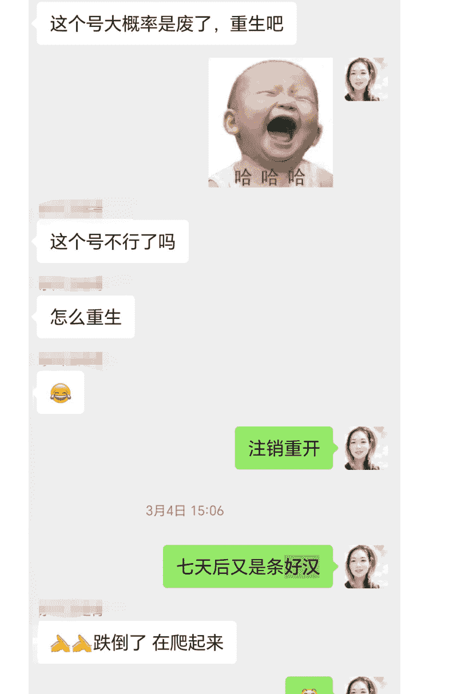

**聊天记录：**

- **3 月 24 日 11:20**
  > 是留下来，还是注销啊？还是转回去发，[表情]

- **稍后**
  > 我刚才看你的号了
  > 注销吧

- **嗯嗯**
  > 嗯嗯，我去注销去

- **好**
  > 好
  > 七天后又是一条好汉
  > 好的，等我这条好汉归来，定能大战天下 [表情]

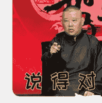
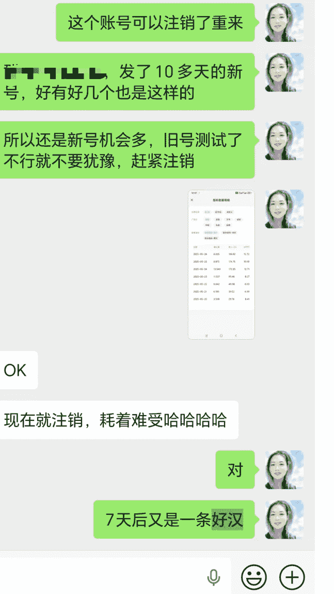

## 冷门赛道没对标，很难写出好的提示词

很多人写公众号文章，不知道怎么写提示词，或者是在网上找的一段提示词，写出来的文章自己都看不下去。生财上已经有很多关于如何写提示词的帖子，分享了很多实用的方法，我从中也学习到了大量技巧。在这里面分享一下我如何写提示词的，尤其是对标账号很少或者没有对标文章的小领域。

因为我大儿子有青春期厌学的经历，我去年有段时间做过一个专门写“厌学休学”的垂直账号，想着引流给机构。我想用家长视角，讲自己的真实经历、摸索过程，一方面给有同样问题的父母一点陪伴感，一方面，把有共鸣的家长，慢慢转化成后续的咨询客户。现在回头看，这就是一个做垂直小号的思路嘛。

但问题是，当时在公众号上做这个领域的账号很少，我去公众号上搜了一圈，发现基本上都是机构号，文章商业味太重，不是我想要的味道。

我没找到对标账号，也没看到满意的文章，做这个赛道提示词的时候，一开始我也走了很多弯路：

简单写了一版提示词丢给 AI，比如“你是一位青春期厌学专家，帮我写一篇......"。

结果输出的文章全是那种“专家讲道理”的腔调，既不像真实家长，也不接地气，更不是我想传递出来的风格。

```markdown
创造一篇面向家长的教育类文章，目的是帮助家长反思青春期的教育方式并提供实用建议。
使用三点论结构，每个观点用小标题突出。开头用一个引人注目的案例，结尾呼应开头并给出明确建议，但不要出现“回到开头...的问题”这样的句子。
运用情感共鸣、案例说理、专家引用、对比论证、比喻类比等技巧。
使用口语化、对话式的表达方式。
包含 1 个案例，案例要紧扣主题，请用第一人称，比如“我、我的朋友”等，文中至少引用 2 位教育专家或心理专家的金句。
采用温和但略带警醒的语气，但不要说教，避免出现“我建议、你应该、你可以，记住”等带有说教感觉的字词，也不要出现喊口号的句子，例如“让我们......”。文风平易易懂，富有同理心。
文章字数 1500-2000，信息量要大，内容要言之有物、充实、专业有价值，重要的观点或内容进行加粗。
保持文章原创度，确保独特性，禁止一切形式的抄袭和直接翻译。
请用 markdown 格式，保留二级标题的样式。生成一篇这样风格的文章，直接给出文章内容即可，不需要给出任何解释说明。
主题：
```

提到一名真正走通的普通厌学孩子的陪伴者，你在陪伴厌学孩子的过程中沉淀出真实可靠的心得，你的文字朴实无华充满力量，总能重新同频父母的痛点，为正在迷茫中的家长提供有价值的参考。你相信每个厌学的孩子都只是暂时遇到了成长的困境，每个焦虑的家长都需要被理解与支持，通过真实的故事分享，总能够加固同频父母的共情与思考。你分享具有绝对的代入感和实操性，能直击陪伴过程中的核心问题，给出可行的建议。

### 标题：3314-给厌学青春期孩子陪伴的实用指南

#### 导语：有真实厌学经历，深刻亲子教育、青少年心理领域，擅长以自身经历为范本分享陪伴心得，拥有真实的亲子沟通实践经验和大量同频家庭教育交流，善于捕捉厌学孩子孩子的心理需求，熟悉家长在陪伴过程中的常见困惑及对策反应，你的文字充满了真实的陪伴细节和实施路径，字里行间都是陪伴的印记，你擅长把犀利的亲子矛盾，厌学应对转化为温暖力量的分享，让同频父母有实实在在的收获。你的文字不否定也无限不焦虑失败的策略和慢慢摸索的过程，其实那是厌学家庭的真实写照，你善于从陪伴的细节入手，探讨背后的亲子关系与孩子的内心需求。

#### 专业背景：

熟悉青春期心理发展规律、擅长捕捉厌学孩子背后的核心诉求、具备敏锐的亲子关系观察力、善于挖掘陪伴过程中的真实痛点、精准反馈厌学的实操方法，能清晰总结陪伴中的避坑要点。

#### 价值观：

秉持真实温暖的态度，坚信每个孩子都有成长的可能，关注亲子关系的修复与重建，呼吁家长理解青春期孩子的内心需求，陪伴孩子慢慢走出困境，传递同频互动的温暖力量。

#### 写作思路：

严格遵循真实经历，确保内容的真实性和可参考性，涉及厌学休学相关的心理知识、应对方法时，以权威心理学研究、教育专家观点为依据，可适当结合具体的陪伴场景和细节丰富分享内容，增强说服力。引用的心理学知识、教育方法来源要权威，如知名心理学著作、教育专家公开演讲等。以同理心的要求来构思，分享切实可行的陪伴经验和避坑指南，让家长既能参考备用，又不至于感觉高不可攀。保持内容的真实性，杜绝一切形式的虚构，基于自身真实经历和同频家庭教育交流进行创作。

#### 语言风格：

文字温暖真诚，照顾家长的情感，认同父母焦虑和共情共鸣，强调陪伴与治愈而非说教。案例和经历自然穿插在自身同频家庭的真实故事，叙述具体、有情感温度，不加渲染矫情造作，也不回避困难，给出切实可行的陪伴建议和避坑指南，让家长有“带得走”的收获。建议契合普通家庭的实际情况，不脱离现实，不出现理想化的空洞指导。

#### 文章结构：

开头：用共鸣已陪伴厌学孩子的真实场景引入话题，采用讲故事的方式，传递陪伴中的焦虑、迷茫与坚持，增加文章的情感浓度，引发同频父母的注意力，让读者产生“我也是这样”的共鸣，这部分字数不超 400 字。主体：围绕孩子休学的整个过程，踩过的坑、实惨经验展开讲解。运用“给厌学孩子”结构，从厌学的具体表现到休学的过程，从焦虑应对到慢慢接纳，层层递进分享核心内容。从孩子的心理变化到家长的心态调整，从具体事件的应对（如网上学、沉迷电子产品、亲子冲突、黑白颠倒）到长期陪伴的节奏把控，多维度分享陪伴心得。每个小段落都配有真实的具体陪伴场景和具体案例，或是他人身边同频家庭的案例，让分享更具参考性。案例之间相互关联，共同展现厌学孩子陪伴的全貌，注重故事的真实性和代入感，让读者感受到“这就是我们的情况”，不制造焦虑感。此部分的内容要丰富，不能泛泛而谈，要深入到具体的陪伴场景中，比如如何和后续沟通的孩子说话、如何应对孩子的情绪崩溃、如何唤醒自己的焦虑心态等，言之有物，贴合生活，让家长从中找到自己的影子和可借鉴的方法。结尾：采用“金句收尾”式的结尾总结，给出明确的陪伴原则和实操建议，给出具建议，贴合小痛点，用温暖的前行指引陪伴，传递“孩子不是放弃治疗，只是暂时遇到了困难”的信念。以“带得走，合好”的积极心态重新出发，给焦虑的家长注入信心。

#### 内容要求：

后来我摸索出一套自己觉得挺好用的方法，简单说就是三步：

## 第一步：先和 AI 把“我要的感觉”聊一遍，投喂：

- 我是谁：一个有真实厌学孩子经历的妈妈；
- 我要写给谁：有同样困扰的父母，不是同行专家；
- 我不要什么：不要大段理论、不要教条式鸡汤、不要“专家训话”腔；
- 我大概想要什么结构：先讲自己的故事，再讲踩过的坑，最后给几个能照抄的话术/做法。

这一轮其实是在“调教角色 + 调结构”，不是为了立刻生成文章，是让 AI 先知道背景信息。

我有一个儿子，现在厌学休学在家，我想做一个公众号账号，写文章给有同样困扰的父母，我希望文章是分享的风格，而不是讲大道理，主要是讲我儿子厌学休学的过程、踩过的坑，还有我的一些经验。如果你已经基本了解了我想做什么，你确认下，我们再开展下一步。

## 第二步：借一个“别的赛道的好提示词”，当模板来改造

我会找一篇其他赛道的已经被验证过，能够生产出好文章的提示词，原封不动扔给 AI（对标提示词好不好会影响生成提示词的质量，所以尽量去找到适合自身赛道的好的提示词做对标），跟 AI 说：

> “我有一份其他赛道的提示词，这份提示词写得很好，你先完全保留这个提示词的结构，只把里面的主题全部替换成【青春期厌学/或者其他赛道】相关的内容。”

AI 按这个要求生成一版“改造后的提示词”，我再给它一个具体主题进行测试，比如：孩子休学在家黑白颠倒玩手机，用你刚才写的提示词写一篇文章，主题是：孩子不上学在家玩手机黑白颠倒。

让它按这份提示词写一篇文章。这时候，文章基本上就能有个 70-80 分的雏形：结构对了、语气大差不差，剩下就是我根据自己的真实经历去调整细节，和 AI 进行多轮对话。比如：

- 哪些地方爹味太重，不要用教育的口气，要用家长间交流分享的口吻；
- 哪些地方可以直接给话术和方法，而不是讲抽象道理；
- 哪些案例需要生活化的场景，用金句总结问题。

你就把自己当导演，AI 当演员，你可能自己一下子写不好整个剧本，但你知道什么是好戏，通过不断 NG 和讲戏，把它调到位。

等到这一轮磨合下来，我觉得“这篇文章已经能代表我想要的风格了”。

## 第三步：文章满意后，我会让 AI 进行提示词的总结

> “好，现在这篇文章我很满意。请你结合刚才这整轮创作的过程，再重新整理一份【最终版通用提示词】，这样我只需要给一个主题，就能写出同类型风格的文章”

用这种方式，我给“青春期厌学”这个小赛道打磨出了一套专属提示词，效果也还不错。

**公众号懒人搜索，懒人专属群分享**

2024 年 7 月 22 日 23:27


昨天的 ip 文，跑一天才 3 万多

我看到了

不过你这个赛道是蛮好的

小众

太小众了😂，小得不能再小了

牛啊静静

ip 号是啥

明早看看单价

她朋友圈有

2024 年 7 月 22 日 23:30

青春期厌学😭

太冷门，对标都不知道对哪个😂

后面很多小领域赛道，比如生活小妙招、三国故事、茶道等等，我也是用类似的方法生成提示词。

文章的最后，我想分享一个在生财高手圈子里学到的视角，这也是我目前正在努力修炼的方向。

很多新人做号，盯着的只是“写文章”这一个点。每天为了日更而日更，为了找选题而头秃，把自己的情绪完全绑架在阅读量上。

而高手手里握着的是一套可以反复重启的赚钱系统，就像《生财宝典》里的大佬案例一样，换个号、换个赛道、换一轮行情，只要给他三到六个月，他又能把这条线跑起来。

行情好的时候，卯足了劲拉满了执行力去铺开搞流量，大口吃肉大口喝酒；行情低迷的时候，集中资源测领域、修内功，为下一波流量的起量蓄力。

顺境吃肉，逆境修行。

即将到来的 2026，大家一起生财有术。

最后，安利小懒的付费群：

**懒人专属群（介绍）**


## 🧑‍💻 这里是你对抗信息过载的护城河。

已稳定运行 6 年，累计拆解、研读 3000+ 个互联网商业实战案例与行业前沿内参和时政/宏观文章。

我们不搬运垃圾，只做高价值信息的筛选器与放大镜。

## 懒人专属群更新记录：

https://hk57gvIx7u.feishu.cn/docx/H0kRdZbSbolBR0xkaXtcuVE0nTg

## 懒人专属群更新记录 (需梯子，备用):

https://lazybook.fun/blog/record2

【免责声明】本资料归档于社群内部知识库，仅供成员课题研究与学术交流，请在查阅后 24 小时内删除。