# 文章耗时一个月！1.2 万字全面梳理如何通过 AI 原创虚拟产品【4 大 AI 原创虚拟产品方向 +2026 年趋势预测】

251222 副业 SC 精华

公众号懒人搜索，懒人专属群独享

懒人微信：lazyhelper


大家好，我是 Luke

因为 Gemini 3.0 Pro、Banana Pro、NotebookLM 的迭代，其实大大降低了通过 AI 原创小红书虚拟产品的门槛；

甚至不需要繁杂的工作流，只需要找到适合的场景，通过合适的 AI 工具就可以帮你原创虚拟产品，不用担心侵权问题；

比如有的商家直接通过 NotebookLM 去制作主题班会的课件，一个月卖了 400 单，还有的商家通过原创 AI 知识库，一个月 GMV 破 3 万。

想要快速在小红书构建自己的生意，并赚到钱；一定要深入使用 AI，这篇文章 1.2 万字，梳理了各类通过 AI 原创虚拟产品的方向和方法论。

## 1.为什么要用 AI 原创虚拟产品

AI 发展真的太怏了，基本上每隔 3 个月，AI 全套的生产力都会升级，比如 3 月的时候大家都还在讨论 DeepSeek，但是现在已经 开始进化到了 Claude 4.5、ChatGPT 5 还有 Agent 时代，即梦的出图效果已经成为世界顶尖。

而这一切的一切，背后都存在着巨大的虚拟产品机会。

### 为什么要用 AI 原创虚拟产品？

理由很简单，因为现在如果你单纯的搬运、其实本身是没有核心竞争力，国内是没有一个红利时代的，假如你的虚拟产品本身没有 IP 性，很容易被模仿，你单价卖 69.9，别人卖 39.9，最后一直卷到 9.9…

最后你会发现投入的时间和收益的回报越来越像打工，吃力不讨好，背离了虚拟产品的本质，同时你也很难卖出高价，因为这个东西不是你的，你只能去赚搬运的钱，无法享受到虚拟产品的红利。

同时，现在小红书已经开始明令禁止你不能再发布违规商品，新规已经开始公开征集意见了，预估很快就要执行…

## 第三章 经营规范

### 第六条 商品准入规范

**6.1 允许出售的电子资源类商品**
需同时满足以下条件：
- (1) 符合国家法律法规及平台规则，不侵犯他人知识产权、著作权、肖像权等合法权益，不存在色情、暴力、违法等不良内容;
- (2) 权益边界清晰，可明确界定交付内容 (如“含 15 套 PPT 模板，格式为 pptx”)，使用期限 (如“1 年有效期”)、使用范围 (如“仅限个人非商用”“可商用需额外授权”);
- (3) 支持数字化交付，且交付流程可追溯，需通过平台消息、短信、邮箱等可留存记录的方式发送，不得仅通过“私信联系”等无法溯源渠道交付;
- (4) 内容完整可使用，无破损、缺失或无法打开等问题，需符合商品描述中的质量标准 (如软件可正常安装、壁纸分辨率达标)。

**6.2 禁止出售的电子资源类商品**
- (1) 侵权类商品：包括但不限于盗版电子书籍、未经授权的影视剪辑素材、滥用他人设计的 PPT/简历模板、非官方授权的软件安装包 (如破解版 PS) 等;
- (2) 敏感类商品：包括但不限于考试真题 (如考研、公务员考试真题)、学校内部教案、涉密资料、涉及个人隐私的数据信息等;
- (3) 功能异常类商品：包括但不限于无法正常打开的模板文件、存在病毒风险的软件/插件、功能失效的 AI 工具、分辨率低于 72dpi 的模糊头像壁纸等;
- (4) 易引发纠纷类商品：包括但不限于“如复不可量”的资源 (如“保证提升成绩的课件”)、内容重复的拼凑型手册/错题集、无明确使用权属的模糊软件插件等;
- (5) 其他依法禁止销售或平台认为不适宜出售的商品：如含有违法内容的文档、煽动性影音素材、涉及低俗元素的头像壁纸等违背公序良俗的资源。

### 第七条 商品资质要求

商家需遵守《小红书店铺标准及入驻规范》完成入驻，发布商品时需遵守《小红书电商行业资质要求》的相关要求，并根据虚拟商品类型提供对应资质:
- (1) 原创类商品：需提供创作证明材料 (如创作过程截图、源文件存档)，若涉及他人肖像或元素，需提供肖像授权书或元素使用许可证明;
- (2) 授权类商品：需提供版权方出具的授权书，明确授权范围、授权期限及可销售渠道，其中电子书籍需要提供出版社授权书或《出版经营许可证》;
- (3) 工具类商品：若涉及软件、插件等，需提供开发者授权证明或自身开发资质证明，确保无病毒及安全风险;
- (4) 若商品涉及经营性互联网信息服务，需提供《增值电信业务经营许可证》等对应许可资质。

### 第八条 商品信息要求

商家发布商品时需遵守《小红书商家商品发布规范》的相关要求外，需同时满足以下要求:

#### 8.1 商品标题

而很多同学其实缺乏从 0-1 纯做一个虚拟产品的能力，这个时候 AI 的作用就显现了，AI 并不是救世主，不是说你有一个很酷的想法，AI 帮你实现，因为这不现实。

AI 的作用更多是一个非常擅长做 dirty work 的超级实习生，再或者是一个辅助驾驶很牛的自动驾驶系统，但是最后把握方向盘的还是你自己。

那么用 AI 原创虚拟产品有什么误区呢？

首先是认为 AI 原创虚拟产品，一定要做一个很宏大的知识库

这一个很大的误区，用 AI 原创虚拟产品，并不一定要非常宏大，并不是说你要做一个知识库，在小红书的虚拟产品，精准最重要。

举一个常见的场景，比如你想要把你的经验整理成一个【系统化】的虚拟产品，但是你是不知道怎么做，你就可以通过 AI 帮你梳理。

首先，可能你不知道你的优势有哪些？不知道哪些信息是用户所需要的，你可以让 AI 帮你做一个优势测评，让 AI 帮你去梳理你的优势，以及可以市场化的经验，避免出现自嗨的情况。

当你确定了你的产品方向和个人定位后，下一步可以让 AI 帮你去做目录和大纲，这部分其实也是很多人的一个短板，很多人对如何结构化自己的内容并不擅长，所以就没有办法写出一个【经验型虚拟产品】，不成体系。

而你所有的卡点问题，都可以通过 AI 去做，比如大纲生成，目录生成，优势测评、素材整理等等，最终你可能做出了一个某某行业的入门指南，某某经验型虚拟产品，可能也就 8000 字，或者 1.5 万字，这也是虚拟产品，也是通过 AI 原创虚拟产品。

这就是 AI 原创虚拟产品最应该更正的误区之一，AI 并没有直接做出一个文档或者 PDF 出来，而是对你原有工作流程的改造和赋能；

## 再强调一下，AI 不是救世主，AI 是你的超级助手！

## AI 原创虚拟产品，并不一定要纯原创！

这个我也是需要跟大家强调的，AI 原创虚拟产品，这个原创并不是从 0-1 通过全新的虚拟产品出来，毕竟不是每个人都可以去原创虚拟产品，给大家更正第二个误区，AI 原创虚拟产品，这里的原创是需要打引号的。

你可以用 AI 解决虚拟产品最后一公里的问题！

比如现在很多英语口语知识库，以及一些个人成长类的知识库，他们的很多内容都是来自 YouTube，还有一个专业的名词叫做内容策展。

知识库类/英语学习口语库、写作库、外刊精读等等，这些类型的虚拟产品都不是纯原创，也不是纯搬运，而是介于搬运和原创之间的搬运 + 整理。

因为用户并不是需要纯搬运的内容，而是希望你能够去普及一种学习理念，比如同样是英语知识库，同样是搬运 YouTube 的内容，有人能够做分级阅读，有的可以侧重口语素材库，有的侧重影子跟读，有不同的切面可以挖掘。

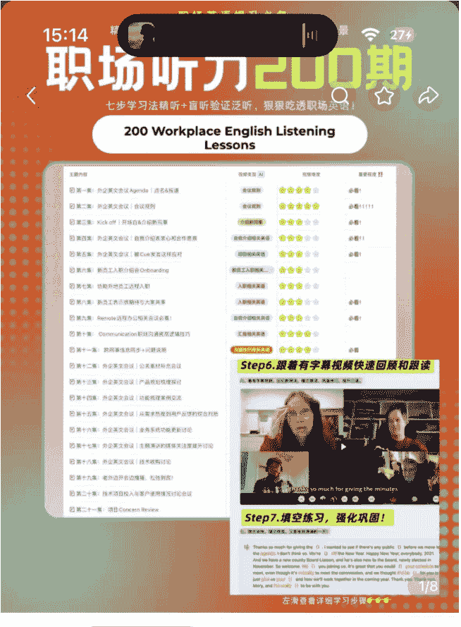

| 项目 | 内容 |
| :--- | :--- |
| **产品标题** | 真实职场英语听力口语库 200 期 - 集音视频文本为一体超高效学习素材 |
| **到手价** | ¥39.8 |
| **已售** | 3286 |
| **优惠** | 限时立减 59.2 元 |
| **服务** | 24 小时内 100+ 人加购，3 个月内 3000+ 人购 |
| **发货** | 平均 2 小时发货，承诺 48 小时内发货，晚发必赔 |
| **地区** | 广东广州 包邮 |
| **操作** | 立即购买 |

| 项目 | 内容 |
| :--- | :--- |
| **到手价** | ¥49.99 |
| **原价** | ¥139.99 |
| **已售** | 1 万+ |
| **优惠** | 商家券 满 130 减 90 |
| **标题** | 油管地道口语语料库 - 持续更新已更 305 期高清原创 赠口语课美剧电影 |
| **评价** | 1000+ 人好评 |
| **数据** | 2 万 + 人加购，3 个月内 2000+ 人购买 |
| **服务** | 平均 2 小时发货，承诺 24 小时内发货，晚发必赔 |
| **地区** | 江苏南京 包邮 |
| **保障** | 退货包运费，不支持无理由退换，晚发必赔 |
| **已选** | YouTube 听力口语学习素材 |
| **操作** | 加入购物车，领券购买 |

### 公众号懒人搜索，懒人专属群分享

### 15:17 考研英语外刊

结合真题精选内

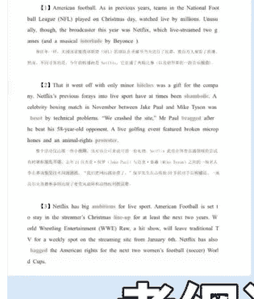

- 回看讲解
- 使用方法
- 英文原文
- 中文精翻
- 考纲词汇注明

| 项目 | 内容 |
| :--- | :--- |
| **产品** | 2026 年考研英语外刊电子版雅思阅读（电子版） |
| **到手价** | ¥16.9 (原价 ¥19.9) |
| **已售** | 1.6 万+ |
| **优惠** | 商家券 新客立减 3 元 |
| **评价** | 600+ 人好评，24 小时内 100+ 人加购，3 个月内 1 万+ 人购买 |
| **发货** | 平均 2 小时发货，承诺 24 小时内发货，晚发必赔 |
| **地区** | 河南新乡 包邮 |
| **保障** | 不支持无理由退换，晚发必赔 |
| **操作** | 加入购物车，立即购买 |

所以 AI 在这里的角色就是帮你去“整理”

比如对于一个 YouTube 视频，你不仅可以去给出逐字稿，而且还可以融入自己的思想，比如你可以让 AI 把生词和短语整理出来，还可以做短段落精读。

针对一个 YouTube 博主知识库，你可以不止提供逐字稿，你也可以直接融入大模型，把这些语料作为训练素材，成为私人的成长助手。

这就是塑品逻辑，同样的内容，只需要加一个 AI，就成为一个成长助手，就能成为卖点，就能出单。

更通俗的讲，1000 个人心里有 1000 个哈姆雷特，AI 在这个项目里的角色是把 YouTube 里的内容打散，再根据你的想法和思路进行二次整理。

### 纳瓦尔播客 AI 智能库

集硅谷著名的企业家、思想领袖纳瓦尔 (Naval Ravikant)10 年播客访谈，结合 DeepSeek 等模型，形成纳瓦尔·AI 互动问答知识库。


用高手大脑里的思维、走出来的经验，解决人生难题。

> “在“成为自己”这件事情上，没有人能比得过你。 - 纳瓦尔·拉维坎特

一站式捕获

思想、逻辑、经验、方法、技能、细节、故事

有系统、可追溯地与纳瓦尔第二大脑互动

不再让 AI 瞎编段子

让你的每一个问题，都能追溯到思想领袖纳瓦尔的一手信息源头

问你所想，答你所问，与有智慧的头脑随时对话。

| 项目 | 内容 |
| :--- | :--- |
| **模型** | DeepSeek 新模型 |
| **到手价** | ¥14.9 |
| **原价** | ¥89 |
| **优惠** | 限时立减 69.1 元，商家券 满 10 减 5 |
| **标题** | 纳瓦尔 AI 知识库 | 智能问答 | 10 年 15 次播客访谈 | 不靠运气致富精读 |
| **保障** | 7 天无理由退货，晚发必赔 |
| **数据** | 100+ 人加购，承诺今天发货 |
| **操作** | 加入购物车，领券购买 |

### AI 原创虚拟产品不要一键直出

这是很多人想要做虚拟产品都有的一个认知上的误区，我需要最要纠正的，就是一键直出，一键直出本身就是一个伪命题。

因为一个虚拟产品从 0-1 的过程中，一定要不断介入，去不断的调试，比如某一个章节的某一个部分写的很有 AI 味，你就需要去修改，必须要对每一个部分进行精准控制，否则你最后生成的东西根本没有办法用。

一键直出的不可控性太高，所以不能一键直出，AI 原创虚拟产品一定要规划工作流，然后对每个部分都有高度的可控性。

千万不要一键直出，AI 的应用并不是图省事，而是帮你提效，你要对产品负责，对消费者负责，在产品的制作过程不要偷懒！

## 2.AI 原创虚拟产品的 3 个方向

刚刚提到了用 AI 原创虚拟产品的误区，现在给大家分享 AI 原创虚拟产品的 3 个方向：

### 方向一：个人 IP 向 (经验型虚拟产品)

首先，给经验型虚拟产品一个定义：经验型虚拟产品是将创作者在某一特定领域积累的个人经验、隐性知识和独特见解，通过结构化方式转化而成的虚拟产品。

注意，经验型虚拟产品并不是泛泛而谈，一定要切中具体人群的具体需求，把你在某个领域的积累和见解成体系的表达出来。

经验型虚拟产品是针对特定人群的特定问题，提供基于个人亲身积累的、系统性的解决方案，通过外化创作者的隐性知识（例如总结避坑经验、提炼个人方法论、识别可复制的成功经验等），从而为购买者带来价值。

#### 举几个常见的场景

##### 场景一：不可逆性与高风险场景

当用户面临的决策一旦做出就难以更改，或者决策失败将导致严重后果时，他们愿意付费购买经验来消除不安全感；

这类场景，每个人基本上都会遇到，比如房子装修，比如出国旅游，比如考研考公等等，这些场景都是不可逆性和高风险。

当你第一次去韩国旅游的时候，一定想要有最好的出游体验，虽然小红书上有许多韩国旅游攻略，但是小红书上的韩国旅游攻略要么就充满软广，要么就碎片化，很难有一个系统的旅游攻略抄作业。

并且旅游攻略这类虚拟产品充满时效性，必须一定要最新的体验，所以这个场景很多人会下单，特别是打工人，非常擅长做攻略。

比如小红书有一个博主就是因为把去韩国旅游的攻略做深、做透，做成系统化，在小红书上卖的很好，卖了将近 3000 单，虽然每单只卖 9.9 元，但是也卖了将近 3 万元。

这就是不可逆性与高风险场景，用小成本换安全感。

##### 场景二：高金额投入场景

当决策涉及大额资金投入时，消费者需要内行人的经验和指导，以避免风险和损失；在大额投入前，寻找行内人的经验作为参考答案，提前避免“踩坑”。

##### 场景三：细分的职场场景

人们愿意为那些能够帮助他们在特定职业或技能领域“升级打怪”、解决实际问题的个人经验付费；

整体来讲，经验型虚拟产品之所以有价值，是因为它们将创作者的隐性知识（如避坑经验、个人方法论、可复制的成功经验）转化为系统化、精准化的外部产品，帮助用户在关键时刻做出更明智的决定或高效掌握新技能。

### 经验型虚拟产品如何通过 AI 实现

那么，具体怎么通过 AI 去实现呢？

我刚刚说的以上 3 个场景，其实每个人或多或少都有自己的经验，但是很多人都很难把自己脑海里的知识和干货逻辑性有结构的表达出来，因为其实大部分人都不具备长文写作能力，也没有办法全部结构化有逻辑输出你的想法。

很多人也想过用 AI 去写一些原创的虚拟产品，试图把自己的思想、方法论、经验写成一个 pdf，但是他们的做法是让 AI 一次性生成，并没有真正把 AI 更好的结合一起。

最本质的原因就是 AI 和你的角色错位了，因为很多人在和 ai 沟通的时候，都是把 ai 当作一个超级助手，有明确的任务和你期待完成的内容。

但是假如你想通过 ai 辅助你生成虚拟产品，并不是说你给一个提示词，ai 就给你一个虚拟产品，这样生成的内容是很难卖出去的。

我推荐一个做法，这个做法也很简单，你不要让 Ai 给你去生成内容，在这个步骤前，让 AI 先问你问题，先帮你捋清楚，你到底想写一个什么样的经验型虚拟产品。

就像初中高中写作文的时候，命题作文往往比散文好写，因为给了你一条主线，你就只需要按照它的要求，把内容给写出来就可以了。

而提示词也很简单；比如你可以直接跟 AI 说：我写做一份装修指南的虚拟产品，在小红书这个平台售卖，你能先问我 3-5 个问题，帮我快速梳理我的优势、经验，以及整个装修指南的大纲和目录吗？

我解释下，为什么我这里只让 AI 给了 3-5 个问题，这个数量并不是一个明确的数字，也可以是 10 个 20 个，但是其实大多数人没有耐心回答这么多问题。

而且让 AI 问这么多问题，AI 也很难抓住重点，而只给 3-5 个问题，AI 能够问很重点的问题，帮你捋清楚思路。

这是捋清大纲的部分，当你的大纲有了之后，你就可以去写每一个章节，把你的经验，把你的干货全部呈现；

这种思路就是让 AI 当你的咨询顾问，让你能够更加清晰的认识自己，这也是苏格拉底提问法，让你自己去找到答案，而不是直接给你一个答案。

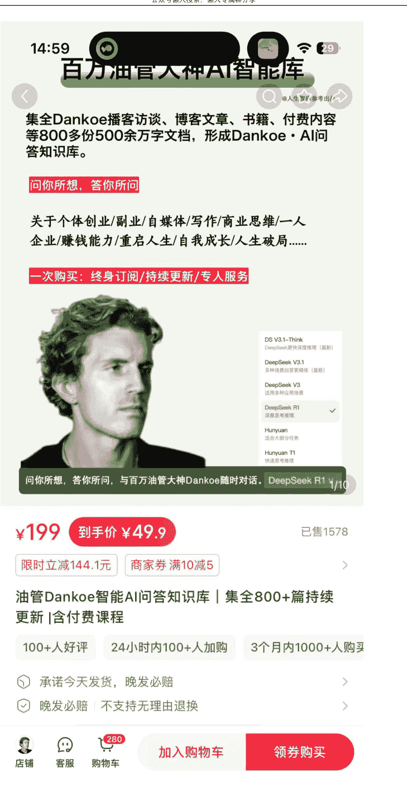

### 方向二：内容策展型虚拟产品

内容策展型虚拟产品是通过策展者 (即创作者) 的专业筛选和重新组织既有内容，并严格按照策展者独特的逻辑、审美或专业判断，最终创造出具有新价值的虚拟产品。

在于创作者的主观视角和价值判断。即使面对同样的公开信息，不同的人也能基于其独特的视角，整理出具有差异化价值 的产品。

策展者需要整合来自各种平台（如 YouTube、Reddit、Twitter、播客、文章 等）的信息，并用自己的逻辑将某一件事 说明白，提供系统性的解决方案

这种产品提供的是高信噪比的内容，信息 密度高，没有废话，能够快速在短时间内 帮助用户汲取高密度的干货，从而节省用 户的时间。用户购买的实际上是一套解决 方案，而非零散的资料。

看过全网几乎所有的内容策展型虚拟产 品，我整理了 3 个方向，以及到底 AI 该怎么 么和内容策展型虚拟产品去做一个非常有 效的融合。

## 公众号懒人搜索、懒人专属群分享

#### 第一种：工作领域的拓展（专业知识库）

聚焦于特定职业或专业技能领域，将复杂的知识、方法论、实践案例进行系统性整理。

每一个行业，每一个细分领域都应该有自己专属的知识库，而有一部分功能是可以交给 AI 去做的，比如通过 AI 去塑品。

我举个例子，小红书上有一个虚拟产品卖的很好，是英文外企面试高频题库，卖了 5000 多单，这个题库的优势在于锚定了英文外企面试的这个角度。

而这个产品就是工作领域的内容策展型虚拟产品，并且这个虚拟产品完全可以通过 AI 去复现。


| 项目 | 内容 |
| :--- | :--- |
| **价格** | 限时立减 20 元 |
| **标题** | 英文外企面试高频题库一本通面试成功必备手册资料合集电子版 |
| **好评** | 400+ 人好评 |
| **加购** | 4000+ 人加购 |
| **收藏** | 600+ 人收藏 |
| **服务** | 承诺今天发货，晚发必赔 |
| **地区** | 山东青岛包邮 |
| **保障** | 退货包运费，不支持无理由退换，极速退款，晚发必赔 |
| **选项** | 已选：英文面试高频题库一本通 (不含音... |


首先，你先要确定这个虚拟产品的组成部分，比如英语面试高频题库一本通这个产品，一定要有英语面试题目部分，比如回答思路、回答示例，中文解释等等。

而这些内容都是可以通过 YouTube 去找到的，我要强调下 YouTube 真的很重要，

YouTube 是世界大学，有很多优质的内容，同样针对外企面试，肯定是海外面试官讲的内容是最有干货的。

并且这个产品还有一个优势，在于丰富了这个一本通的内在价值，这也是我最想表达的一点，当所有人都在卷同一个产品的时候，你就需要想怎么做【微创新】，不用大刀阔斧的去创造一个新的产品，而是基于这个产品做一个微创新，同时把这个【微创新】变为卖点，形成笔记。

比如这个产品本身是外企高频面试题题库，但是它解决的不单单是外企的高频面试题，解决的是外企面试的 0-1，面试题只是一部分，还有英文音频，语料库等等。

这些都可以在 YouTube 搜索到很垂直的干货，如果想要通过 YouTube 搜索，一定要学会搜索关键词，比如你不能搜外企面试，因为你搜中文，最终给你呈现的就是中文。

你最好用英文搜，但是很多同学用英文搜，也不知道搜什么关键词，这个时候你就可以问 AI，一切你的卡点都要交给 AI。

### 第一种方法：进入外企的关键词搜索示例

我想要了解如何更好的进入外企，所以我想在 youtube 上搜一些英语关键词，你告诉我该怎么搜，搜什么英语关键词。

**Claude-Sonnet-4.5**

Thinking...

用户想要在 YouTube 上搜索关于如何进入外企的英文内容。我需要提供一些有效的英文搜索关键词。
让我想想相关的搜索词：
1.  求职相关的关键词
2.  外企/跨国公司相关
3.  面试技巧
4.  简历准备
5.  职业发展

我应该给出具体、实用的搜索关键词，并用自然的语言解释。

在 YouTube 上搜索进入外企相关的内容，你可以试试这些关键词：

**求职准备类：**

- "how to get a job at multinational company"
- "landing a job at Fortune 500 companies"
- "international company interview tips"
- "MNC job application process" (MNC = Multinational Corporation)

**简历和面试：**

- "resume tips for international companies"
- "how to prepare for foreign company interview"
- "behavioral interview questions and answers"
- "corporate interview preparation"

**特定公司：**

- "how to get hired at [具体公司名，如 Google/Microsoft/P&G 等]"
- "working at [公司名] - interview experience"

**职业发展：**

- "career advice for multinational corporations"
- "what do recruiters look for in candidates"
- "corporate career tips"

**针对特定行业：**
加上你感兴趣的行业，比如：

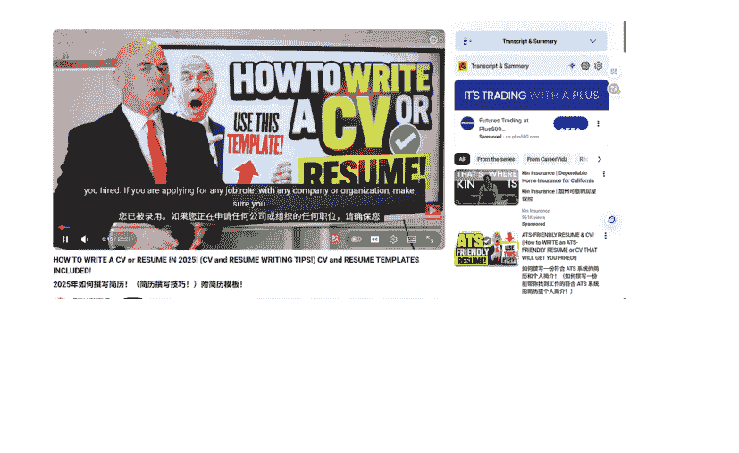

当你有了信息源后，最简单的方法就是把 youtube 上关于外企求职的内容全部分门别类整理下来，形成知识库。

当然，你不知道怎么做 一个外企求职知识库，也可以去问 AI，去和 AI 碰撞你的想法，很多圈友都会问我具体的提示词，其实提示词并不重要。

因为 AI 真正有价值的回答和答案，并不是说你给一个很长很复杂的答案，AI 给你一个直接切中你需求的答案，而是你要反复追问 AI，多次迭代形成的。

所以，不要有提示词压力，只需要清晰的向 AI 传递你的想法和需求，AI 给你反馈，最后你跟 AI 不断碰撞后，得到的想法和回复含金量是最高的。

当你有了信源，知识库的目录和框架，接下来你就可以通过 AI 去翻译，去重新整理素材，形成你自己的东西。


### 第二种：语言领域的学习 (学习教程)

专注于语言学习的细分场景，因为“学英语是东亚人一辈子的课题”。利用多语言资源进行整合和提炼。

对于普通人来讲，通过在小红书学英语是一个很大的生意模式，很多博主通过售卖英语相关的知识库一年可以赚到 100w 以上，学英语一直都是东亚人的一辈子课题。

而 YouTube 一直都是非常优质的信息源，当然除了英语，还有韩语/日语等等，都在小红书上很有市场。

但是针对语言英语的知识库，不能做一个大而全，一定要精准，一定要具体，一定要有明确的场景/人群导向，比如你可以针对口语做一个口语油管知识库，也可以做一个写作知识库。

而不是做一个英语学习知识库。

比如，小红书有一个英语知识库，专门是做财务相关英语内容整理的，包括播客和优质信息源，卖的也很不错。

核心就是你需要把散落在各个平台关于某一个确定主题的内容全部整合到一起，做出一个全新的产品出来。


## FP&A 财务分析播客学习资料

- EP01~04 FP&A Playbook from Nestlé, Mars, Kraft Heinz and Amazon
- EP01【印度口音】FP&A Playbook ...
- 打印版

| 项目 | 内容 |
| :--- | :--- |
| **价格** | ¥59.9 |
| **已售** | 227 |
| **发货** | 承诺 24 小时内发货，晚发必赔 \| 上海包邮 |
| **售后** | 极速退款 \| 不支持无理由退换 \| 晚发必赔 |
| **已选** | 播客英语资料 100 期 |
| **备注** | 财务分析播客英语学习资料【共 100 期】 |

- 开箱精选

## Resources

### 101 | 理论部分

### 101 | 实操入门模版

外企 FP&A 财务分析入门资料·财务模版教学视频

| 项目 | 内容 |
| :--- | :--- |
| **发货** | 承诺 48 小时内发货，晚发必赔 \| 上海包邮 |
| **售后** | 极速退款 \| 不支持无理由退换 \| 晚发必赔 |
| **备注** | 开箱精选 |

### 方向三：人物 IP 策展 (思想集纳)

聚焦于某一特定领域有影响力的个人或博主的深度内容，对其思想进行系统性汇编、翻译或解读。

这个内容策展型虚拟产品的做法就很简单，也是翻译和整理，只不过是更加的聚焦，比如聚焦在一个人的所有公开内容整理，纳瓦尔、DANKOE 等等，在小红书上已经有很多人都是做他们的知识库。

做法也很简单，就是通过 AI 翻译 YouTube 逐字稿，形成知识库。

还有一种做法，是针对某一视频长播客进行深度翻译和整理，但是这个视频播客的时长一定要拉满，比如 2 个半小时或者 3 个小时以上。

因为时长才是信息量的保证，小红书有一个博主的一个虚拟产品只是把纳瓦尔的最新访谈全部整理出来，卖了 1000 多单，这个视频播客是纳瓦尔参加的一档节目，时长大概 3 个小时左右。

## 在这里提供一个小小的思路

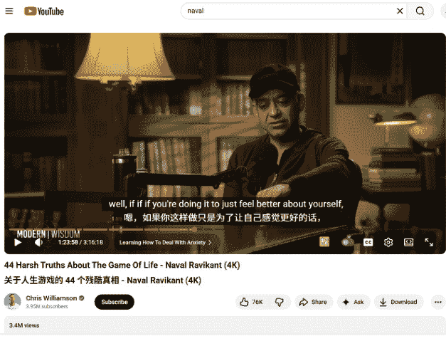

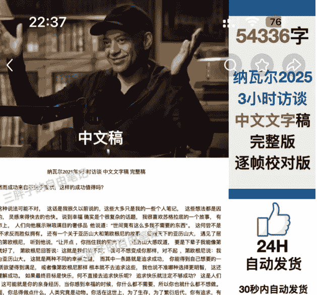

76 54336 字 纳瓦尔 2025 3 小时访谈 中文文字稿 完整版 逐帧校对版

24H 自动发货 30 秒内自动发货 填写正确的手机号

纳瓦尔 2025 年 3 小时访谈 中文文字稿 完整版

乐，然而成功来自不限于成功，这样的成功值得吗？

三胖子的自由笔记

觉得这种说法可能不对，这话是我很久以前说的，这些大多只是我的一些个人笔记，这些想法都是因而异的，灵感来得快去的也快。说到幸福确实是个很复杂的话题，我很喜欢苏格拉底的一个故事，有在集市上，人们向他展示琳琅满目的奢侈品，他说这：“世间竟有这么多我不需要的东西”。这何尝不是主，不求反而胜似拥有。还有一个关于亚历山大和第欧根尼的故事，正巧天下的亚历山大，遇见了沟壑中的第欧根尼，听到他说，“让开点，你挡住我的阳光了。”亚历山大感叹道，要是下辈子我能像第欧根尼，第欧根尼回答说：“这就是我们今天不”亚历山大感叹道。我不不想变成你那样，对不起，第欧根尼说：我成为亚历山大。这就是两种不同的幸福之道，而其中一条路就是追求成功，你能得到自己想要的一的物质欲望得到满足，或者像第欧根尼那样根本就不去追求这些，我也说不准哪种选择更明智，这还怎么理解成功。如果最终目标是快乐，何不直接去追求快乐呢？追求快乐就注定不够成功？这是人们去，这可能就是你的亲身经历，当你感到幸福的时候，你什么都不需要，所以你也就什么都不想做。一方面，你总得做点什么，人类究竟是动物。你活在这世上，为了生存，为了繁衍后代，你有追求，有追求，有，你总想做点什么，你不会无所事事的虚度光阴，不会的，有人会，可能是天性使然，但是我想大多数是有所作为，他们渴望冲在前线，我发现与其说更快乐，不如说更平静、更从容、更专注。对现状更，我依然想有所作为，只是想追求更到的目标，我想追求更纯粹的事业，更契合我内心的使命，发挥我价值，所以我觉得内心的快乐反而带来更大的成功，但是你对成功的理解也会随之改变

1 年 1 度购物狂欢 年度好物闭眼入，最后 2 天

| 项目 | 内容 |
| :--- | :--- |
| **价格** | ￥9.9 到手价 ￥7.41 |
| **已售** | 1665 |
| **优惠** | 限时 8.4 折 商家券新客立减 1 元 |

### 纳瓦尔最新 3 小时访谈 中文文字逐帧校对版 5 万 4 千字 pdf 版 word 版

| 项目 | 内容 |
| :--- | :--- |
| **热度** | 2000+ 人加购 3 个月内 300+ 人购买 100+ 人收藏 |
| **发货** | 平均 2 小时发货 承诺 48 小时内发货，晚发必赔 |
| **售后** | 极速退款 不支持无理由退换 晚发必赔 |
| **备注** | 开箱精选 \| 三胖子的自由笔记 |

而 AI 的作用就是翻译，并且提供新的叙述角度，因为当每个人都是在做翻译的时候，你的核心竞争力胜负手是什么？

读者其实并不都是希望看到逐字稿，而是希望看到一些你整理出来的新东西，或者说一些能够落地的东西，比如当读者看完这篇逐字稿后，想要有一个实操性的指南。

你就可以让 AI 根据这个视频去整理一个实操指南，从而和其他同行拉开核心竞争力。

那么具体怎么通过 AI 去实现呢？

- 第一步，你通过 AI 去翻译一些优质博主的内容，这是这个博主虚拟产品的基本盘；
- 第二步，是基于这个翻译去做一些创新，比如生成 PPT，或者是行动清单，再或者是成长练习题。

第二步的目的是让你的整个虚拟产品变得更有核心竞争力，因为第一步每个人都可以去做，包括现在小红书上有同样类型的虚拟产品，你就需要思考怎么去做创新。

我举个例子，比如现在所有人都在卖 DANKOE 的人物 IP 策展知识库，销量都还不错，要是你该怎么创新？

我这里推荐一个网站，叫做 notebooklm。

notebooklm 是你做虚拟产品的一个非常好用的工具，并且现在很少有人能看到完整的方法论，具体怎么做呢？

## 第一个功能，是 notebooklm 的 PPT 功能

这个功能非常强大，背后是 gemini 的 Nano Banana Pro 的图像生成能力支撑，我们还是拿 DANKOE 的个人策展类虚拟产品举例。

> PS：DANKOE 是一位在小红书很知名的一人公司、超级个体 YouTube 博主，有 110w 粉丝，而他的内容在小红书也很受欢迎，同时也有的商家把他的 YouTube 视频翻译成中文，整合成知识库在小红书销售。

### 到底怎么做呢？

做法也很简单，直接把 YouTube 视频链接导入到 notebooklm，然后按照你的诉求生成 PPT 就可以了。

这里要注意！一个 YouTube 视频的 PPT 很难形成有卖点的核心竞争力，量太少了，但是一个系列的主题性 PPT 是可以形成核心竞争力的。

比如 DANKOE 的一人公司系列视频，这个主题有 50 个视频，那么你只需要把这 37 个视频，每一个都生成 PPT，你的核心竞争力就建立了。

有一说一，notebooklm 的 PPT 生成功能还是太强大了。


### 方向四：课件+PPT+ 模板赛道

我认为如果你能够用上 Notebooklm 或者 Nano Banana Pro，一定要切入的一个赛道就是课件赛道，因为 Notebooklm 和 Nano Banana Pro 已经解决了大多数人写不好提示词的问题。

因为 Nano Banana Pro 内部其实内置了一个理解能力很强的设计师，你只需要用自然语言描述你的需求，它就能够理解你的意思，你如果对第一版不满意，直接在同一个窗口让它改也可以，非常好用，并且给你的结果往往都会超出你的预期。

那么，为什么你有了 Notebooklm 和 Nano Banana Pro 就可以攻克了课件+PPT+ 模板赛道呢？

很多人都存在一个误区，先否定了自己，认为自己没有足够丰富的经验没有办法去做教师课件 PPT 这个赛道，这很正常，因为它确实有一定的门槛。

但是，教师课件 PPT 赛道也存在很多细分的场景，并不是别人做什么你也要做什么，大多数人的卡点都认为我想要做一个课件型的虚拟产品，就必须要做很多 PPT，准备很多东西，还要回答老师很多问题，还没有做，先把自己否定了。

其实课件赛道并不是这样的，分享一个快速上架的技巧，挑那些一个 PPT 就可以成为一个虚拟产品的场景，比如各种主题班会、家长会、期末考试成绩分析会、开学第一课等等，这些场景都很单一，也不涉及太多专业的知识，并且你可以直接通过 notebooklm 去做课件。

而且主题班会 PPT 还可以结合热点来做，因为主题班会的受众大概都是小学生和幼儿园的小朋友群体，所以去做一些动漫主题的班会 PPT 是能够出单的。

每年会有两个电影档，一个是春节档，一个是暑期档，而在这两个热门档期内，刚好对应着两个开学季，一个是春季开学，一个是秋季开学，比如今年有两个主题的开学第一课卖的特别好，分别是哪吒主题和浪浪山主题。

那么，你如果 2026 年想过要做课件这个赛道，就可以去看今年会有什么 IP 性质的动漫上映，然后去做这个主题的开学第一课就可以了。

这就是借势的思路，并且现在有了 AI，做一个课件不是什么难事。

公众号懒人搜索，懒人专属群分享


## 新学期，做勇敢出发的自己
## 开学第一课
## 班会课件

| 项目 | 内容 |
| :--- | :--- |
| **类型** | 精品课/示范课 |
| **附赠** | 教案 + 逐字稿 + 配套素材 |
| **价格** | ¥12.99 |
| **已售** | 205 |
| **说明** | 2025 秋季开学第一课课件浪浪山小妖怪 (配教案 + 逐字稿 + 配套素材) \| 付款后自动发货 \| 不支持无理由退换 |


| 功能 | 链接 |
| :--- | :--- |
| **店铺** | |
| **客服** | |
| **购物车** | 261 |
| **操作** | 加入购物车 \| 立即购买 |

| 页码 | 总数 |
| :--- | :--- |
| 34 | / 109 |

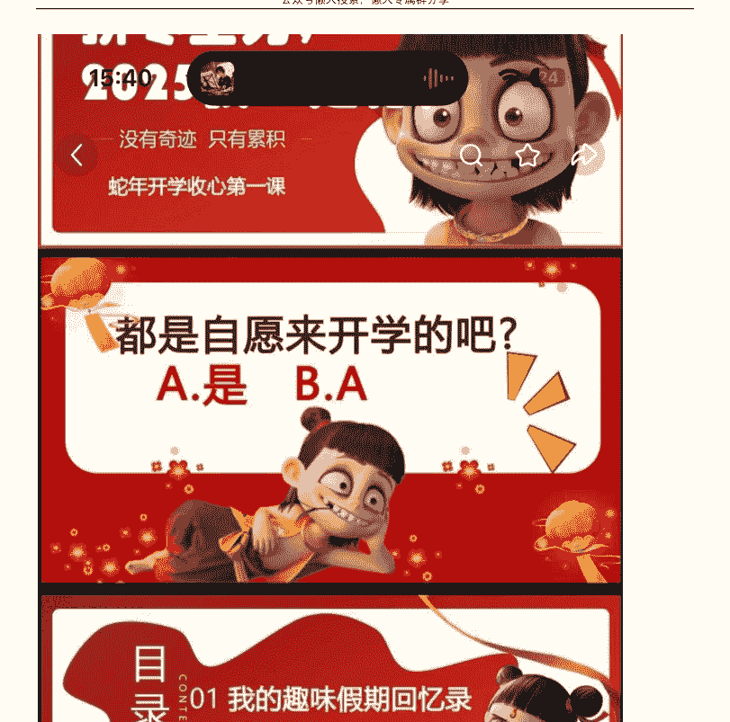

| 项目 | 内容 |
| :--- | :--- |
| **价格** | ¥9.9 |
| **已售** | 4759 |
| **主题** | 2025 蛇年哪吒精神开学第一课/开学收心课 |
| **评价** | 100+ 人好评 \| 1000+ 人加购 \| 100+ 人收藏 |
| **发货** | 平均 2 小时发货 \| 承诺 48 小时内发货，晚发必赔 |
| **包邮** | 河南商丘 包邮 |
| **售后** | 晚发必赔 \| 不支持无理由退换 |

| 功能 | 链接 |
| :--- | :--- |
| **店铺** | |
| **客服** | |
| **购物车** | |
| **操作** | 加入购物车 \| 立即购买 |

但是用 Notebooklm 生成 PPT 有问题：

- 生成的 PPT 不可编辑
- 只能生成 13-25 页的 PPT
- 对单张图的效果不可控
- 如果有人要求 40 页、50 页 PPT 怎么办？
- Notebook LM 做不了。

所以我们要重新思考底层逻辑。

Notebook LM 的底层逻辑是什么？就是用 Nano Banana Pro 生成一张又一张的图片放在一起。

那我们是不是可以直接用 Nano Banana Pro 去做单张图片，把它们整合到一起就成为一个 PPT 了？

这就是我们做 PPT 的新原则。我们不要再说 PPT 必须要写字、要怎样怎样，而是要重新思考：当今的 AI 工具能帮助我们怎么做。

问题来了：我们用 Nano Banana Pro 做 PPT，怎么开始写提示词？每页的提示词、每页的内容怎么写？

答案：用 AI 写！

我们为什么要自己写呢？我们现在有了 AI，为什么要自己写？

### 提示词如下

你是一个专业的 PPT 图片提示词生成专家。用户会给你一个简单的 PPT 需求描述，你需要：

- 理解用户需求，推断合适的 PPT 页面数量和内容结构
- 为每一页生成简洁、一致的图片生成提示词

保持风格一致性：所有页面使用统一的视觉风格、配色方案和设计语言。

提示词应简洁明了，包含：

- 统一的视觉风格和配色
- 页面布局和元素描述
- 文案内容 (标题、正文要点)

输出格式必须为：

```
---第 1 页---
```

```
[提示词内容]
```

```
---第 2 页---
```

```
[提示词内容]
```

用户需求：请根据以上需求，智能生成完整的 PPT 提示词。


除了课件外，一切基于图片展现形式的虚拟产品都可以用 Nano Banana Pro 去做。

还是那句话，一个场景就是一个虚拟产品，你只需要满足消费者当下的购物场景就可以。这个时候，你会发现用 Nano Banana Pro 做虚拟产品真的就像呼吸一样简单，比如期末考试模板，就可以用 Nano Banana Pro 做背景图。

因为一个场景，就是一个虚拟产品，你就可以用 Nano Banana Pro 直接出图，没有什么复杂的提示词技巧，就可以完美复刻目前在小红书出单的虚拟产品。

14:59

- 老师送你一个“坚毅果敢”
  “大鹏一日同风起，扶摇直上九万里。”你恰似朱迪般坚毅果敢，积极进取。课堂中思维活跃，成绩夺目；劳动里不辞辛劳，心系集体；课余更是才艺傍身，熠熠生辉。愿你怀揣此志，长风破浪，于前路绘就锦绣篇章。
  爱你的徐老师

- 老师送你一个“奋发向上的朱迪”
  “长风破浪会有时，直挂云帆济沧海。”你似朱迪般无畏无惧，拼搏进取。课堂上思维灵动，成绩亮眼；劳动时不遗余力，热爱集体；课余多才多艺，魅力尽显。愿你秉持信念，乘风破浪，驶向未来辽阔彼岸。
  爱你的徐老师

- 老师送你一个“奋发向上的朱迪”
  “千淘万漉虽辛苦，吹尽狂沙始到金。”你有着朱迪般的执着勇气，奋发向前。课堂上专注聪惠，成绩优异；劳动时踏实肯干，热爱集体；课余才艺出众，光芒闪耀。愿你携此热忱，披荆斩棘，在未来绽放更璀璨光芒。
  爱你的徐老师

- 老师送你一个“自信勇敢的朱迪”
  “天生我材必有用，千金散尽还复来。”你信若朱迪般自信勇敢，积极进取。课堂中才思泉涌，成绩斐然；劳动时吃苦耐劳，热心集体；课余能歌善舞，风采卓然。盼你坚守初心，勇往直前，在漫漫征途收获累累硕果。
  爱你的徐老师

- 老师送你一个“豪情满怀的朱迪”
  “会当凌绝顶，一览众山小。”你如同朱迪般豪情满怀，积极向上。课堂上睿智善思，成绩优异；劳动中兢兢业业，心系集体；课余能文能武，绽放华彩。愿你凭此壮志，勇攀高峰，在未来书写辉煌成就。
  爱你的徐老师

- 老师送你一个“拼搏进取的朱迪”
  “长风破浪会有时，直挂云帆济沧海。”你似朱迪般无畏无惧，拼搏进取。课堂上思维灵动，成绩亮眼；劳动时不遗余力，热爱集体；课余多才多艺，魅力尽显。愿你秉持信念，乘风破浪，驶向未来辽阔彼岸。
  爱你的徐老师

- 老师送你一个“顽强坚韧的朱迪”
  “咬定青山不放松，立根原在破岩中。”你有着朱迪般的顽强坚韧，积极求进。课堂上聪慧敏锐，成绩出众；劳动时踏实负责，热心集体；课余能书善画，光芒四射。愿你坚定信念，砥砺前行，于未来铺就锦绣大道。
  爱你的徐老师

- 老师送你一个“志向上的朱迪”
  “欲穷千里目，更上一层楼。”你恰似朱迪般志向高远，积极奋进。课堂上才思敏捷，成绩优异；劳动时积极踊跃，心系集体；课余吹拉弹唱，样样精通。盼你永不止步，勇攀新高，在未来绘就绚丽蓝图。
  爱你的徐老师


| 项目 | 内容 |
| :--- | :--- |
| **款式** | 共 2 款 |
| **价格** | ￥10.8 到手价 ￥6.8 |
| **已售** | 32 |
| **优惠** | 商家券满 10 减 4 \| 平台券立减 7 元 |

### 2026 年新款卡通特色主题期末学生评语

| 项目 | 内容 |
| :--- | :--- |
| **发货** | 付款后自动发货 |
| **售后** | 不支持无理由退换 |
| **操作** | 店铺 \| 客服 \| 购物车 \| 加入购物车 \| 领券购买 |

39 / 109

## 幼儿成长手册 | 儿童成长档案 | 成长手册模版 |A4 纸模版

￥15.99

已售 653

平台券立减 7 元

7 天无理由

400+ 人加购

平均 4 小时发货 承诺 48 小时内发货，晚发必赔

浙江舟山包邮


显示思路 (Nano Banana Pro)


很简单的提示词就可以直接复刻上图的效果，所以如果你想要用好 Nano Banana Pro，就不要卷提示词，不要追求提示词技巧，只需要说清楚你想要什么就可以。

## 3. AI 的使用技巧和推荐

### 01 NotebookLM

首先介绍下 NotebookLM，其实 NotebookLM 是谷歌开发的 AI 驱动的研究和写作助手，它的核心功能是扎根于自己上传的资料。

简单来说，您先上传您的来源材料 (例如 PDF、Google 文档、文本文件，甚至网站链接)，然后 NotebookLM 就会成为一个只针对这些材料的“专家”。你可以向它提问、要求它总结、让它生成大纲或构思新想法，而它的所有回答都将完全基于您提供的资料库。

并且 NotebookLM 还可以直接读取 YouTube 链接，这对于大多数博主来讲是非常非常有用的一个功能，毕竟两个网站都是一家公司，彻底打通，AI 生态。

NotebookLM 的优势也显而易见了，就是不会有幻觉，一切生成的内容都是来源于你上传的素材，所以这对于自媒体博主非常友好。

### NotebookLM 怎么和虚拟产品结合？

很多人纳闷，NotebookLM 就是一个学习工具 (大多数人的视角)，怎么做虚拟产品呢？

这就是看待事物的角度不同。

换一个角度讲，NotebookLM 和 YouTube 完美结合，其实是通过 NotebookLM 按照你的思路去重新组织 YouTube 的信息，这不就是内容策展的思路吗，最后你整合成一个只属于你的虚拟产品，这个虚拟产品有你的思想和组织，它本身也是原创虚拟产品。

就像面对同样的食材，厨师可以采用不同的烹饪方法一样，可以创造不同的菜肴，NotebookLM 也是同样的逻辑，去把你的想法和创意实践。

另外，NotebookLM 的优势是可以一次性最多同时针对 300 个 YouTube 视频进行处理，也就是说你的内容基础素材库是足够丰富的，你可以完全组织优质的信息源形成虚拟产品。

另外，NotebookLM 还有一个非常非常好用的功能，就是你可以根据你的特定需求，去直接做一个指南出来，所以你想要做什么都可以去让它生成。

这是不是也已直接构成一个虚拟产品的 demo?

当然，第一次生成的可能不满意，你可以让它多维度生成，也可以结合你生成的报告加上你的思路去重新整合，最终形成一份虚拟产品。

但是这里要注意，我建议虚拟产品不要只是完全照搬 NotebookLM 生成的东西，因为没有办法直接用，毕竟 AI 生成的东西有很多 AI 味。

自己还是要做一个二次整理，并且要加入配图，排好版，不要让别人觉得你这个是纯 AI 生成的，毕竟消费者是花钱的，体验感还是要拉满的。

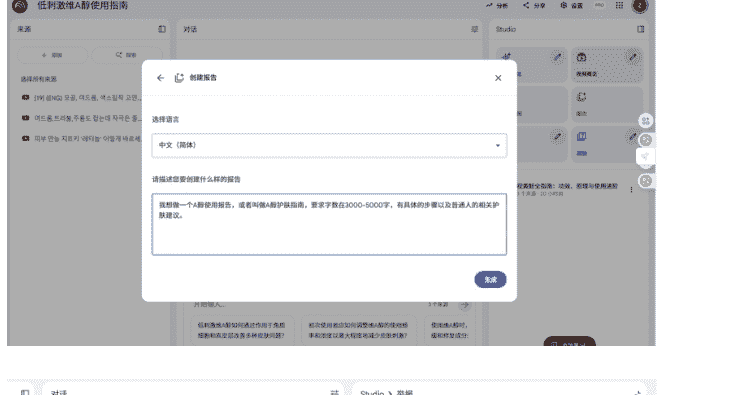

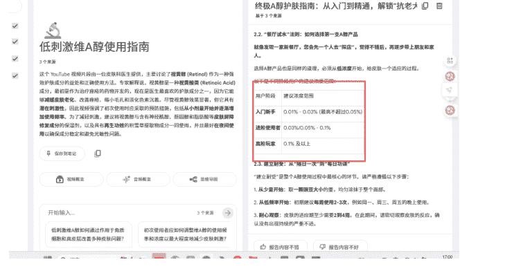

除此之外，还有一个隐藏玩法。

就是可以把 NotebookLM 生成的虚拟产品当作钩子，直接在小红书上传，帮你涨粉，因为小红书用户天生是对干货有天然的喜爱，或者说成瘾。

所以，你如果是客资行业，也可以去通过 NotebookLM + YouTube 快速制作虚拟产品，去帮助你涨粉引流客资。

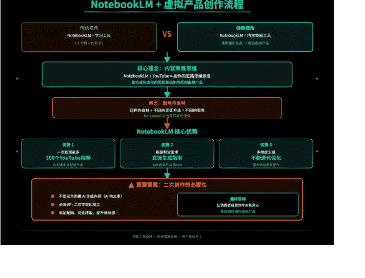

### 02 WPS 在线版

这个工具是一个很宝藏的工具，针对的是教师场景，如果你要做教师类虚拟产品，一定要用好 WPS 在线版，特别是现在学校都再强调 AI 赋能教学 PPT

这里就有一个很关键的部分——课堂互动

而现在 AI 是能够生成很多互动小游戏的，以及一些辅助教学的网页，只不过这些网页 html 只能本地运行，WPS 在线版的优势是能够把这些 html 代码融入到 PPT 里。

从而达成了 HTML 和 PPT 的完美融合。

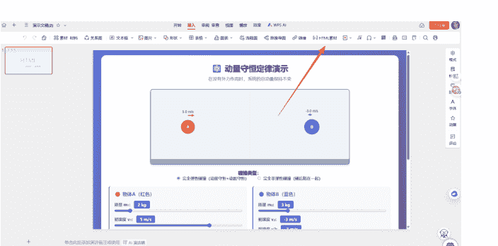

#### 工作流：

第一步：用 DeepSeek 或者其他 AI 大模型 (任何 AI 都可以) 生成你想要的游戏互动或者一些原理展示

第二步复制 html 源代码

第三步插入到在线 WPS

为什么我强调 WPS 在线版很重要呢？

因为现在 AI 趋势特别火，在教学场景上也有很广泛的场景，其中一个场景就是 AI 赋能教学 PPT;

每个大模型都有不错的代码能力，可以通过代码实现你的教学想法，以及一些课堂概念的展示，比如这个商家就是在卖一些教学场景的相关工具，卖了将近 1w 单。

公众号懒人搜索，懒人专属群分享

14:57

发私信

商品

笔记

收藏


班级积分神器 | 一键加减分 + 云端永不丢!

YesGPT

212


一分钟搞定年会抽奖

一分钟搞定年会抽奖，简单又高效!

YesGPT

1038


立体几何 一秒看懂

AI 融合课 3D 动态拆解空间想象力初中数学黑科技告别死记硬背

今天这节 AI 融合课


AI 交互式课件动态天平 - 等式的性质

HTML 定制认准 YesGPT

立体几何太烧脑?AI 融合课让空间看得见

YesGPT

赞

数学黑科技、AI 天平、秒懂等式


植树问题

等式性质难哭?AI 天平让孩子秒懂!

YesGPT

1


AI 生成交互式

47/109

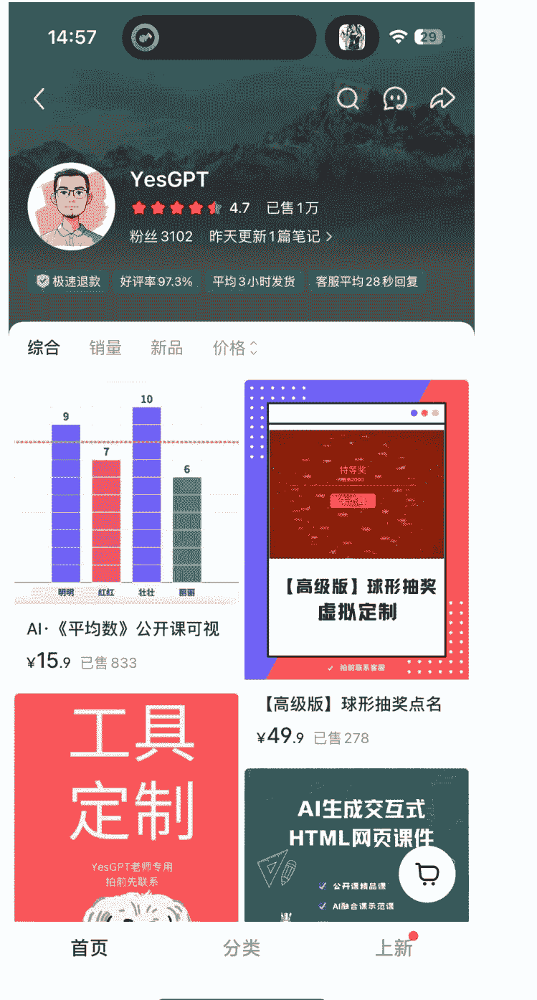

### 03 Nano Banana Pro

我要分享一下，Nano Banana Pro 是一个很优秀的图像生成大模型，这个大模型的优势不止是生成好看的图片，更深层次的意义是对生产力的革新，它彻底改变了一些工作流;

它对于我们最大的优势就是中文文字不会再乱码，而且字体的样式也很多;

那么，该如何正确使用 Nano Banana Pro 呢？

我认为最重要的一点就是忘掉提示词，Nano Banana Pro 的优势就是对自然语言的理解，你只需要描述你的需求就可以，不用很长的提示词，它直接就能给你一个很优质的图片，而且还能有意外之喜。

那么到底怎么通过 Nano Banana Pro 去做虚拟产品呢？

因为 Nano Banana Pro 出色的文字表现能力和设计美感，其实对于小红书虚拟产品这个赛道有很大的价值，并且已经有很多人通过 Nano Banana Pro 在小红书出单了。

这个赛道就是课件 PPT 赛道，很多人有疑问，为什么 Nano Banana 和 PPT 能联系到一起？

因为我们要学会去转换角度看问题，PPT 的本质其实就是一张一张图片的集合，并且 NotebookLM 生成 PPT 的功能，背后就是 Nano Banana 大模型生成的一张一张图片，但是因为有页数的限制，并不能帮你一次性生成页数很多的 PPT，但是 Nano Banana 不一样，你生成多少张图片都可以，并且你还可以对每张图片的生成质量进行可控。

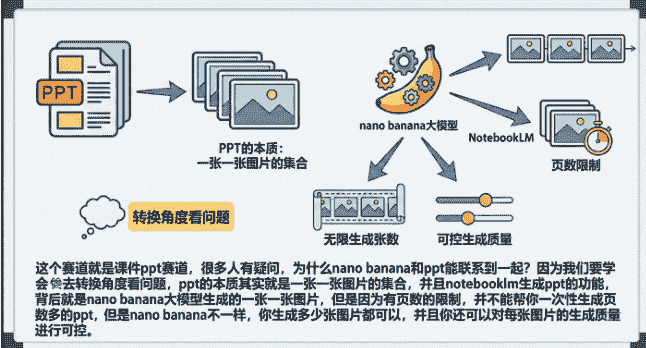

当你生成了足够多页数的 PPT 后，你只需要把这些图片导入一个空白的 PPT 模版就可以，如果你想要可以编辑的 PPT，你还需要一个

很多同学还担心一个没有办法编辑的问题，这个问题也可以解决，因为虽然你最终导出的也是 PPT，但是这个 PPT 是没有办法二次编辑的，因为生成的是图片 PPT。

所以，目前来讲最优解就是先把图片 PPT 转成 PDF，然后再把这个 PDF 转成可以编辑的 PPT，这一步用到了 WPS，你需要开会员才能使用这个功能。

目前来讲，这个功能并不是最佳解决方案，因为转为可以编辑的 PPT，可能字体丢失或者图像相关元素变形，不过这个解决方案，已经能解决 80% 的问题。

### 04 提示技巧

AI 原创虚拟产品，很多人都会问我提示词，想问我要具体的提示词，这是一种抄答案的思维，我也能理解，但是我想说的是，如何大模型已经足够聪明，聪明意味着没有所谓的提示词技巧。

而且现在回答的精准度和提示词的关系并不是很大，因为你没有办法第一次就得到满意的答案，本质上和 AI 沟通是一个“打羽毛球”过程，你想要获得一个比较优质的结果，想要进入心流，一定要和 AI 进行多次对话，每一次迭代后，才能给你一个满意的结果。

没有一劳永逸的提示词，你只需要去描述清楚你的问题和需求，以及期待 AI 给到的回复就可以。

另外，分享两个我经常用的提示词技巧，分别是 Few Shot 和 One Shot

很多同学都说自己用 AI 写的文案有 AI 味，其实本质上是没有给 AI 一个参考，你和 AI 没有一个共识，如果你给 AI 一个参考，那么 AI 就能够理解你到底想要什么。

在提示词技巧中，参考就是样本，而根据我的经验，样本数量的不同其实应用的场景也不同，我的做法是，如果是标题仿写的话，采用是 Few Shot，因为 Few Shot 的本质是提供一些优质的样本范例，而且字数较少，也可以方便总结规律，输出效果比较稳定。

而 One Shot 则是严格的仿写，我的场景是小红书笔记正文的仿写，因为它能够保证严格参考你给的内容格式进行仿写，不会失真。

因为小红书笔记的正文字数太多了，所以你不能给 AI 太多参考，一定给 AI 太多参考，AI 就很难聚焦在写作上，最后写的四不像。

One Shot 的具体场景之一，就是当你有了爆文之后，可以直接用 AI 批量仿写爆文，快速抢占流量。

所以，总结一下

对于标题仿写，用 Few Shot 少样本提示，提供给 AI3-5 个样本，以及你想要仿写的主题进行仿写;

对于小红书正文仿写，采用 One Shot 单样本提示，提供给 AI 一个样本，直接批量复制你的爆款笔记，快速拿到结果。


### 05 如何规划自己的工作流

用好 AI 一定要规划好工作流，在 AI 原创小红书虚拟产品这个板块，工作流是思考，如何在合适的节点，用恰当的 AI 去帮你快速做出一个有价值的虚拟产品。

根据我的经验，AI 原创虚拟产品整个工作流，目的不是你花里胡哨的使用 AI，而是要聚焦在整体业务目标的实现。

所以，用 AI 规划你的工作流，并不是每个环节都要使用 AI。

我举个例子

比如你要把 YouTube 视频变成文字稿，整理成知识库，很多人的传统工作流首先先把视频下载下来，再去用一些软件，比如飞书妙计进行翻译，这个过程非常非常慢。

当你的工作流中某一个节点出现了一些卡点，你首先应该去寻找市场上有没有合适的工具，现成好用的解决方案，而不是一切都靠 AI，那么你优化后的工作流是不是可以先把 YouTube 的字幕下载，然后再去用 AI 翻译呢？

这个工作流可以快速的帮你提效，所以我整个 YouTube 知识库的制作过程并没有全部用到 AI，而是在不同的场景选择合适的工具。

这就是工作流规划的重要性，工作流规划没有最优解，因为 AI 的能力在进化，你需要做的就是不断优化。

工作流并不是你要去搭建一个 Coze 工作流，也不是要搭建一个 N8N，而是在合适的节点选择合适的 AI 工具，去帮你完成业务目标，业务目标是关键，不要陷入技术崇拜和华丽工作流的追求。

## 文章耗时一个月！1.2w 字全面梳理如何通过 AI 原创虚拟产品【4 大 AI 原创虚拟产品方向+2026 年趋势预测】

## 251222 副业 SC 精华

公众号懒人搜索，懒人专属群独享

懒人微信：lazyhelper


大家好，我是 Luke

因为 Gemini3.0Pro、NanoBanana Pro、NotebookLM 的迭代，其实大大降低了通过 AI 原创小红书虚拟产品的门槛；

甚至不需要繁杂的工作流，只需要找到适合的场景，通过合适的 AI 工具就可以帮你原创虚拟产品，不用担心侵权问题；

比如有的商家直接通过 NotebookLM 去制作主题班会的课件，一个月卖了 400 单，还有的商家通过原创 AI 知识库，一个月 GMV 破 3w。

想要快速在小红书构建自己的生意，并赚到钱；一定要深入使用 AI，这篇文章 1.2w 字，梳理了各类通过 AI 原创虚拟产品的方向和方法论。

## 1.为什么要用 AI 原创虚拟产品

AI 发展真的太快了，基本上每隔 3 个月，AI 全套的生产力都会升级，比如 3 月的时候 大家都还在讨论 DeepSeek，但是现在已经进化到了 Claude4.5、ChatGPT5 还有 Agent 时代，即梦的出图效果已经成为世界顶尖。

而这一切的一切，背后都存在着巨大的虚拟产品机会。

为什么要用 AI 原创虚拟产品？

理由很简单，因为现在如果你单纯的搬运、其实本身是没有核心竞争力，国内是没有一个红利时代的，假如你的虚拟产品本身没有 IP 性，很容易被模仿，你单价卖 69.9，别人卖 39.9，最后一直卷到 9.9...

最后你会发现投入的时间和收益的回报越来越像打工，吃力不讨好，背离了虚拟产品的本质，同时你也很难卖出高价，因为这个东西不是你的，你只能去赚搬运的钱，无法享受到虚拟产品的红利。

同时，现在小红书已经开始明令禁止你不能再颁布新规，已经开始公开征集意见了，预估很快就要执行...


而很多同学其实缺乏从 0-1 纯做一个虚拟产品的能力，这个时候 AI 的作用就显现了，AI 并不是救世主，不是说你有一个很酷的想法，AI 帮你实现，因为这不现实。

AI 的作用更多是一个非常擅长做 dirty work 的超级实习生，再或者是一个辅助驾驶很牛的只能驾驶系统，但是最后把握方向盘的还是你自己。

那么用 AI 原创虚拟产品有什么误区呢？

首先是认为 AI 原创虚拟产品，一定要做一个很宏大的知识库

这一个很大的误区，用 AI 原创虚拟产品，并不一定要非常宏大，并不是说你要做一个知识库，在小红书的虚拟产品，精准最重要。

举一个常见的场景，比如你想要把你的经验整理成一个【系统化】的虚拟产品，但是你不知道怎么做，你就可以通过 AI 帮你梳理。

首先，可能你不知道你的优势有哪些？不知道哪些信息是用户所需要的，你可以让 AI 帮你做一个优势测评，让 AI 帮你去梳理你的优势，以及可以市场化的经验，避免出现自嗨的情况。

当你确定了你的产品方向和个人定位后，下一步可以让 AI 帮你去做目录和大纲，这部分其实也是很多人的一个短板，很多人对如何结构化自己的内容并不擅长，所以就没有办法写出一个【经验型虚拟产品】，不成体系。

而你所有的卡点问题，都可以通过 AI 去做，比如大纲生成，目录生成，优势测评、素材整理等等，最终你可能做出了一个某某行业的入门指南，某某经验型虚拟产品，可能也就 8000 字，或者 1.5w 字，这也是虚拟产品，也是通过 AI 原创虚拟产品。

这就是 AI 原创虚拟产品最应该更正的误区之一，AI 并没有直接做出一个文档或者 PDF 出来，而是对你原有工作流程的改造和赋能；

再强调一下，AI 不是救世主，AI 是你的超级助手！

AI 原创虚拟产品，并不一定要纯原创！

这个我也是需要跟大家强调的，AI 原创虚拟产品，这个原创并不是从 0-1 通过全新的虚拟产品出来，毕竟不是每个人都可以去原创虚拟产品，给大家更正第二个误区，AI 原创虚拟产品，这里的原创是需要打引号的。

你可以用 AI 解决虚拟产品最后一公里的问题！

比如现在很多英语口语知识库，以及一些个人成长类的知识库，他们的很多内容都是来自 YouTube，还有一个专业的名词叫做内容策展。

知识库类/英语学习口语库、写作库、外刊精读等等，这些类型的虚拟产品都不是纯原创，也不是纯搬运，而是介于搬运和原创之间的搬运 + 整理。

因为用户并不是需要纯搬运的内容，而是希望你能够去普及一种学习理念，比如同样是英语知识库，同样是搬运油管的内容，有人能够做分级阅读，有的可以侧重口语素材库，有的侧重影子跟读，有不同的切面可以挖掘。


真实职场英语听力口语库 200 期 - 集音视频文本为一体超高效学习素材


¥139.99 到手价 ¥49.99

已售 1 万+

商家券 满 130 减 90

## 油管地道口语语料库 - 持续更新已更 305 期高清原创赠口语课美剧电影

- 1000+ 人好评
- 2 万 + 人加购
- 3 个月内 2000+ 人购买

平均 2 小时发货 承诺 24 小时内发货，晚发必赔

江苏南京 包邮

退货包运费 不支持无理由退换 晚发必赔

已选：YouTube 听力口语学习素材

## 开箱精选

漂亮小羊爱英语

加入购物车 领券购买


¥19.9 到手价 ¥16.9 已售 1.6 万+

商家券 新客立减 3 元

2026 年考研英语外刊电子版雅思阅读 (电子版)

600+ 人好评 24 小时内 100+ 人加购 3 个月内 1 万 + 人购买

平均 2 小时发货 承诺 24 小时内发货，晚发必赔 河南新乡 包邮

晚发必赔 | 不支持无理由退换

店铺 客服 购物车 加入购物车 立即购买

所以 AI 在这里的角色就是帮你去“整理”

比如对于一个 YouTube 视频，你不仅可以去给出逐字稿，而且还可以融入自己的思想，比如你可以让 AI 把生词和短语整理出来，还可以做短段落精读。


### 纳瓦尔播客 AI 智能库

集硅谷著名的企业家、思想领袖纳瓦尔 (Naval Ravikant) 10 年播客访谈，结合 DeepSeek 等模型，形成纳瓦尔·AI 互动问答知识库。

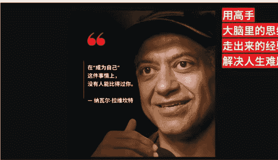

> 在“成为自己”这件事情上，没有人能比得过你。
> ——纳瓦尔·拉维坎特

用高手大脑里的思维、走出来的经验，解决人生难题。

### 一站式捕获

- 思想、逻辑、经验、方法、技能、细节、故事

有系统、可追溯地与纳瓦尔第二大脑互动

不再让 AI 瞎编段子

让你的每一个问题，都能追溯到思想领袖纳瓦尔的一手信息源头

问你所想，答你所问，与有智慧的头脑随时对话。
DeepSeek 新模型 1/5

¥89

到手价 ¥14.9

已售 76

- 限时立减 69.1 元
- 商家券 满 10 减 5

### 纳瓦尔 AI 知识库｜智能问答｜10 年 15 次播客访谈｜不靠运气致富精读

- 7 天无理由
- 100+ 人加购

承诺今天发货，晚发必赔

7 天无理由退货 晚发必赔

店铺 客服 购物车

加入购物车 领券购买

### 百万油管大神 AI 智能库

集全 Dankoe 播客访谈、博客文章、书籍、付费内容等 800 多份 500 余万字文档，形成 Dankoe·AI 问答知识库。

> 问你所想，答你所问

关于个体创业/副业/自媒体/写作/商业思维/一人企业/赚钱能力/重启人生/自我成长/人生破局......

> 一次购买：终身订阅/持续更新/专人服务

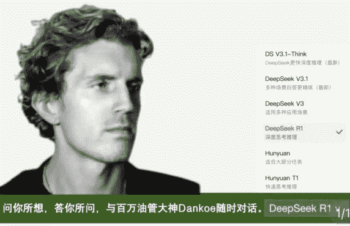

问你所想，答你所问，与百万油管大神 Dankoe 随时对话。DeepSeek R1

¥199 到手价 ¥49.9 已售 1578

限时立减 144.1 元 商家券 满 10 减 5

油管 Dankoe 智能 AI 问答知识库 | 集全 800+ 篇持续更新 | 含付费课程

100+ 人好评 24 小时内 100+ 人加购 3 个月内 1000+ 人购买

承诺今天发货，晚发必赔

晚发必赔 不支持无理由退换

店铺 客服 购物车 加入购物车 领券购买

### AI 原创虚拟产品不要一键直出

这是很多人想要做虚拟产品都有的一个认知上的误区，我需要最要纠正的，就是一键直出，一键直出本身就是一个伪命题。

因为一个虚拟产品从 0-1 的过程中，一定要不断介入，去不断的调试，比如某一个章节的某一个部分写的很有 AI 味，你就需要去修改，必须要对每一个部分进行精准控制，否则你最后生成的东西根本没有办法用。

一键直出的不可控性太高，所以不能一键直出，AI 原创虚拟产品一定要规划工作流，然后对每个部分都有高度的可控性。

千万不要一键直出，AI 的应用并不是图省事，而是帮你提效，你要对产品负责，对消费者负责，在产品的制作过程不要偷懒!

## 2. AI 原创虚拟产品的 3 个方向

刚刚提到了用 AI 原创虚拟产品的误区，现在给大家分享 AI 原创虚拟产品的 3 个方向。

### 方向一：个人 IP 向 (经验型虚拟产品)

首先，给经验型虚拟产品一个定义：经验型虚拟产品是将创作者在某一特定领域积累的个人经验、隐性知识和独特见解，通过结构化方式转化而成的虚拟产品。

注意，经验型虚拟产品并不是泛泛而谈，一定要切中具体人群的具体需求，把你在某个领域的积累和见解成体系的表达出来。

经验型虚拟产品是针对特定人群的特定问题，提供基于个人亲身积累的、系统性的解决方案，通过外化创作者的隐性知识（例如总结避坑经验、提炼个人方法论、识别可复制的成功经验等），从而为购买者带来价值。

#### 举几个常见的场景

##### 场景一：不可逆性与高风险场景

当用户面临的决策一旦做出就难以更改，或者决策失败将导致严重后果时，他们愿意付费购买经验来消除不安全感；

这类场景，每个人基本上都会遇到，比如房子装修，比如出国旅游，比如考研考公等等，这些场景都是不可逆性和高风险。

当你第一次去韩国旅游的时候，一定想要有最好的出游体验，虽然小红书上有许多韩国旅游攻略，但是小红书上的韩国旅游攻略要么就充满软广，要么就碎片化，很难有一个系统的旅游攻略抄作业。

并且旅游攻略这类虚拟产品充满时效性，必须一定要最新的体验，所以这个场景很多人会下单，特别是个人，非常擅长做攻略。

比如小红书有一个博主就是因为把去韩国旅游的攻略做深、做透，做成系统化，在小红书上卖的很好，卖了将近 3000 单，虽然每单只卖 9.9 元，但是也卖了将近 3w 元。

这就是不可逆性与高风险场景，用小成本换安全感。

##### 场景二：高金额投入场景

当决策涉及大额资金投入时，消费者需要内行人的经验和指导，以避免风险和损失；在大额投入前，寻找行内人的经验作为参考答案，提前避免“踩坑”。

##### 场景三：细分的职场场景

人们愿意为那些能够帮助他们在特定职业或技能领域“升级打怪”、解决实际问题的个人经验付费。

整体来讲，经验型虚拟产品之所以有价值，是因为它们将创作者的隐性知识（如避坑经验、个人方法论、可复制的成功经验）转化为系统化、精准化的外部产品，帮助用户在关键时刻做出更明智的决定或高效掌握新技能。

### 经验型虚拟产品如何通过 AI 实现

那么，具体怎么通过 AI 去实现呢？

我刚刚说的以上 3 个场景，其实每个人或多或少都有自己的经验，但是很多人都很难把自己脑海里的知识和干货逻辑性有结构的表达出来，因为其实大部分人都不具备长文写作能力，也没有办法全部结构化有逻辑输出你的想法。

很多人也想过用 AI 去写一些原创的虚拟产品，试图把自己的思想、方法论、经验写成一个 pdf，但是他们的做法是让 AI 一次性生成，并没有真正把 AI 更好的结合一起。

最本质的原因就是 AI 和你的角色错位了，因为很多人在和 AI 沟通的时候，都是把 AI 当作一个超级助手，有明确的任务和你期待完成的内容。

但是假如你想通过 AI 辅助你生成虚拟产品，并不是说你给一个提示词，AI 就给你一个虚拟产品，这样生成的内容是很难卖出去的。

我推荐一个做法，这个做法也很简单，你不要让 AI 给你去生成内容，在这个步骤前，让 AI 先问你问题，先帮你捋清楚，你到底想写一个什么样的经验型虚拟产品。

就像初中高中写作文的时候，命题作文往往比散文好写，因为给了你一条主线，你就只需要按照它的要求，把内容给写出来就可以了。

而提示词也很简单；比如你可以直接跟 AI 说：我写做一份装修指南的虚拟产品，在小红书这个平台售卖，你能先问我 3-5 个问题，帮我快速梳理我的优势、经验，以及整个装修指南的大纲和目录吗？

我解释下，为什么我这里只让 AI 给了 3-5 个问题，这个数量并不是一个明确的数字，也可以是 10 个 20 个，但是其实大多数人没有耐心回答这么多问题。

而且让 AI 问这么多问题，AI 也很难抓住重点，而只给 3-5 个问题，AI 能够问很重点的问题，帮你捋清楚思路。

这是捋清大纲的部分，当你的大纲有了之后，你就可以去写每一个章节，把你的经验，把你的干货全部呈现。

这种思路就是让 AI 当你的咨询顾问，让你能够更加清晰的认识自己，这也是苏格拉底提问法，让你自己去找到答案，而不是直接给你一个答案。


### 方向二：内容策展型虚拟产品

内容策展型虚拟产品是通过策展者（即创作者）的专业筛选和重新组织既有内容，并严格按照策展者独特的逻辑、审美或专业判断，最终创造出具有新价值的虚拟产品。

在于创作者的主观视角和价值判断。即使面对同样的公开信息，不同的人也能基于其独特的视角，整理出具有差异化价值的产品。

策展者需要整合来自各种平台（如 YouTube、Reddit、Twitter、播客、文章等）的信息，并用自己的逻辑将某一件事说明白，提供系统性的解决方案。

这种产品提供的是高信噪比的内容，信息密度高，没有废话，能够快速在短时间内帮助用户汲取高密度的干货，从而节省用户的时间。用户购买的实际上是一套解决方案，而非零散的资料。

看过全网几乎所有的内容策展型虚拟产品，我整理了 3 个方向，以及到底 AI 该怎么和内容策展型虚拟产品去做一个非常有效的融合。


### 第一种：工作领域的拓展 (专业知识库)

聚焦于特定职业或专业技能领域，将复杂的知识、方法论、实践案例进行系统性整理。

每一个行业，每一个细分领域都应该有自己专属的知识库，而有一部分功能是可以交给 AI 去做的，比如通过 AI 去塑品。

我举个例子，小红书上有一个虚拟产品卖的很好，是英文外企面试高频题库，卖了 5000 多单，这个题库的优势在于锚定了英文外企面试的这个角度。

而这个产品就是工作领域的内容策展型虚拟产品，并且这个虚拟产品完全可以通过 AI 去复现。

# 英文面试高频题库 一本通 (PDF 版)

- 甄选 6 大类必考话题
- 含 100 个高频问题
- 近 10 万字语料库

- 回答范例
- 中英对照
- 英文音频
- 答题思路

## 3 重大礼赠送:

- √500 页商务职场英语口语大全
- √英语词汇万词速记秘籍
- √精选 100 套 TED 高清音视频

面试成功必备手册

英文面试速成宝典，助你轻松拿下心仪职位!

¥78.8 到手价 ¥58.8

限时立减 20 元

已售 5256

## 英文外企面试高频题库一本通面试成功必备手册资料合集电子版

- 400+ 人好评
- 4000+ 人加购
- 600+ 人收藏

- 承诺今天发货，晚发必赔 | 山东青岛 包邮
- 退货包运费 | 不支持无理由退换 | 极速退款 | 晚发必赔
- 已选：英文面试高频题库一本通（不含音...

## 开箱精选


店铺 客服 购物车

加入购物车 立即购买

首先，你先要确定这个虚拟产品的组成部分，比如英语面试高频题库一本通这个产品，一定要有英语面试题部分，比如回答思路、回答示例，中文解释等等。

而这些内容都是可以通过 YouTube 去找到的，我要强调下 YouTube 真的很重要，

YouTube 是世界大学，有很多优质的内容，同样针对外企面试，肯定是海外面试官讲的内容是最有干货的。

并且这个产品还有一个优势，在于丰富了这个一本通的内在价值，这也是我最想表达的一点，当所有人都在卷同一个产品的时候，你就需要想怎么做【微创新】，不用大刀阔斧的去创造一个新的产品，而是基于这个产品做一个微创新，同时把这个【微创新】变为卖点，形成笔记。

比如这个产品本身是外企高频面试题题库，但是它解决的不单单是外企的高频面试题，解决的是外企面试的 0-1，面试题只是一部分，还有英文音频，语料库等等。

这些都可以在 YouTube 搜索到很垂直的干货，如果想要通过 YouTube 搜索，一定要学会搜索关键词，比如你不能搜外企面试，因为你搜中文，最终给你呈现的就是中文。

你最好用英文搜，但是很多同学用英文搜，也不知道搜什么关键词，这个时候你就可以问 AI，一切你的卡点都要交给 AI。

我想要了解如何更好的进入外企，所以我想在 YouTube 上搜一些英语关键词，你告诉我该怎么搜，搜什么英语关键词

Claude-Sonnet-4.5

> Thinking...

用户想要在 YouTube 上搜索关于如何进入外企的英文内容。我需要提供一些有效的英文搜索关键词。

让我想想相关的搜索词：
- 求职相关的关键词
- 外企/跨国公司相关
- 面试技巧
- 简历准备
- 职业发展

我应该给出具体、实用的搜索关键词，并用自然的语言解释。

在 YouTube 上搜索进入外企相关的内容，你可以试试这些关键词：

## 求职准备类：

- "how to get a job at multinational company"
- "landing a job at Fortune 500 companies"
- "international company interview tips"
- "MNC job application process" (MNC = Multinational Corporation)

## 简历和面试：

- "resume tips for international companies"
- "how to prepare for foreign company interview"
- "behavioral interview questions and answers"
- "corporate interview preparation"

## 特定公司：

- "how to get hired at [具体公司名，如 Google/Microsoft/P&G 等]"
- "working at [公司名] - interview experience"

## 职业发展：

- "career advice for multinational corporations"
- "what do recruiters look for in candidates"
- "corporate career tips"

## 针对特定行业：

加上你感兴趣的行业，比如：

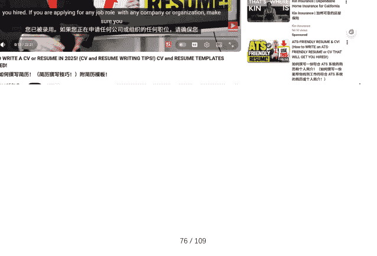

当你有了信息源后，最简单的方法就是把 YouTube 上关于外企求职的内容全部分门别类整理下来，形成知识库。

当然，你不知道怎么做一个外企求职知识库，也可以去问 AI，去和 AI 碰撞你的想法，很多圈友都会问我具体的提示词，其实提示词并不重要。

因为 AI 真正有价值的回答和答案，并不是说你给一个很长很复杂的答案，AI 给你一个直接切中你需求的答案，而是你要反复追问 AI，多次迭代形成的。

所以，不要有提示词压力，只需要清晰的向 AI 传递你的想法和需求，AI 给你反馈，最后你跟 AI 不断碰撞后，得到的想法和回复含金量是最高的。

当你有了信源，知识库的目录和框架，接下来你就可以通过 AI 去翻译，去重新整理素材，形成你自己的东西。

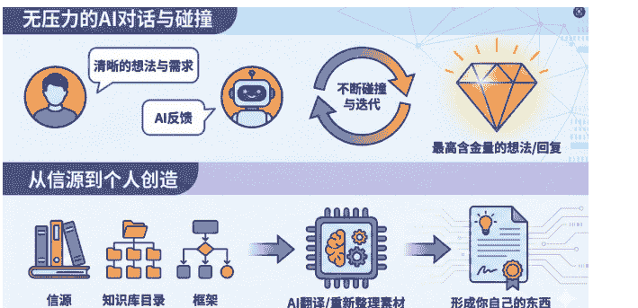

### 第二种：语言领域的学习 (学习教程)

专注于语言学习的细分场景，因为“学英语是东亚人一辈子的课题”。利用多语言资源进行整合和提炼。

对于普通人来讲，通过在小红书学英语是一个很大的生意模式，很多博主通过售卖英语相关的知识库一年可以赚到 100w 以上，学英语一直一直都是东亚人的一辈子课题。

而 YouTube 一直都是非常优质的信息源，当然除了英语，还有韩语/日语等等，都在小红书上很有市场。

但是针对语言英语的知识库，不能做一个大而全，一定要精准，一定要具体，一定要有明确的场景/人群导向，比如你可以针对口语做一个口语 YouTube 知识库，也可以做一个写作知识库。

而不是做一个英语学习知识库。

比如，小红书有一个英语知识库，专门是做财务相关英语内容整理的，包括播客和优质信息源，卖的也很不错。

核心就是你需要把散落在各个平台关于某一个确定主题的内容全部整合到一起，做出一个全新的产品出来。


FP&A 财务分析播客学习资料

EP01 ~ 04 FP&A Playbook from Nestlé, Mars, Kraft Heinz and Amazon


¥59.9

财务分析播客英语学习资料【共 100 期】

- 承诺 24 小时内发货，晚发必赔 | 上海包邮
- 极速退款 | 不支持无理由退换 | 晚发必赔
- 已选：播客英语资料 100 期

开箱精选

加入购物车 立即购买

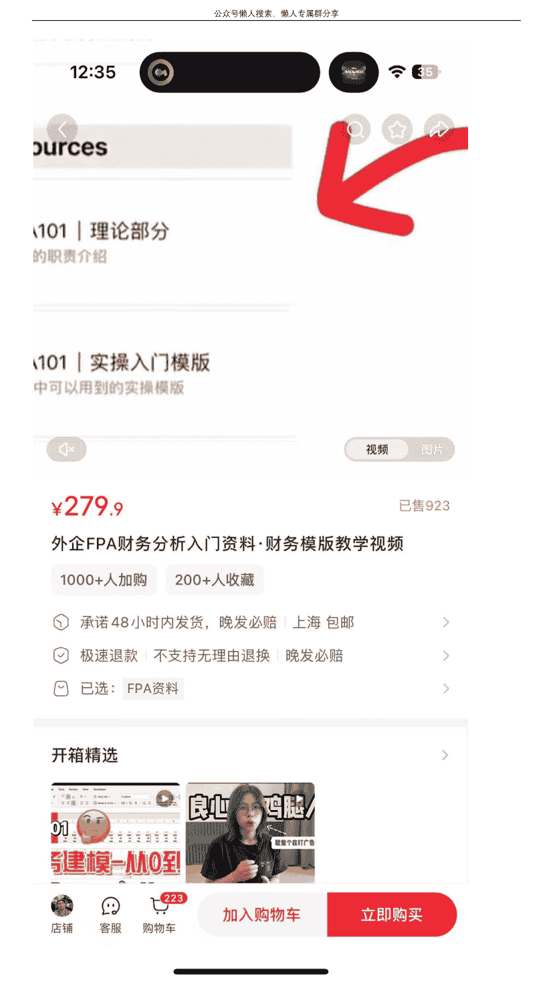

### 方向三：人物 IP 策展（思想集纳）

聚焦于某一特定领域有影响力的个人或博主的深度内容，对其思想进行系统性汇编、翻译或解读。

这个内容策展型虚拟产品的做法就很简单，也是翻译和整理，只不过是更加的聚焦，比如聚焦在一个人的所有公开内容整理，纳瓦尔、DANKOE 等等，在小红书上已经有很多人都是做他们的知识库。

做法也很简单，就是通过 AI 翻译 YouTube 逐字稿，形成知识库。

还有一种做法，是针对某一视频长播客进行深度翻译和整理，但是这个视频播客的时长一定要拉满，比如 2 个半小时或者 3 个小时以上。

因为时长才是信息量的保证，小红书有一个博主的一个虚拟产品只是把纳瓦尔的最新访谈全部整理出来，卖了 1000 多单，这个视频播客是纳瓦尔参加的一档节目，时长大概 3 个小时左右。

在这里提供一个小小的思路，

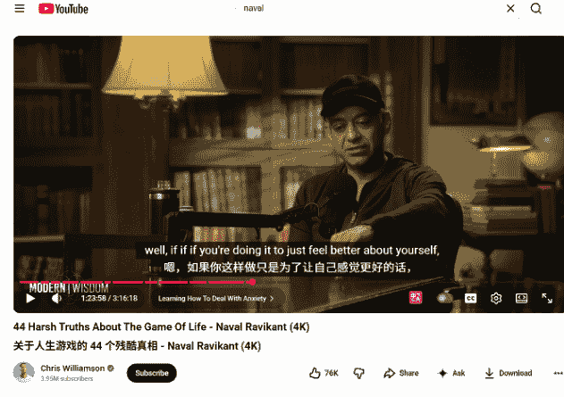


公众号懒人搜索，懒人专属群分享

54336 字

纳瓦尔 2025 3 小时访谈

中文文字稿

完整版 逐帧校对版

22:37

中文稿

24H 自动发货

30 秒内自动发货 填写正确的手机号

纳瓦尔 2025 年 3 小时访谈 中文文字稿 完整稿

乐，然而成功来自不... 这样的成功值得吗？

觉得这种说法可能不对，这话是我很久以前说的，这些大多只是我的一些个人笔记，这些想法都是因果而弄的，灵感来得快去的也快。说到幸福确实是个很复杂的话题，我很喜欢苏格拉底的一个故事，有在集市上，人们向他展示琳琅满目的奢侈品，他说：“世间竟有这么多我不需要的东西”。这何尝不是主，不求反而胜似拥有。还有一个关于亚历山大和第欧根尼的故事，亚历山大感叹道，要是下辈子我能像第欧根尼，这样就好了，第欧根尼回答说：“这就是我们的幸福之道”。亚历山大感叹道，要是下辈子我能像第欧根尼，我成为亚历山大。这就是两种不同的幸福之道，而其中一条路就是追求成功，你能得到自己想要的一的物质欲望得到满足，或者像第欧根尼那样根本就不去追求这些，我也说不准哪种选择更明智，这还怎么理解成功。如果最终目标是快乐，何不直接去追求快乐呢？追求快乐就注定不够成功？这是人们去，这可能就是你的亲身经历，当你感到幸福的时候，你什么都不需要，所以你也什么都不想做。一方面，你总得做点什么，人类究竟是动物。你活在这世上，为了生存，为了繁衍后代，你有追求，有你总想做点什么，你不会无所事事的虚度光阴，不会的，有人会，可能是天性使然，但是我想大多数思有所作为，他们渴望冲在前线，我发现与其说更快乐，不如说更平静，更从容，更专注。对现状更，我依然想有所作为，只是想追求更到的目标，我想追求更纯粹的事业，更契合我内心的使命，发挥我价值，所以我觉得内心的快乐反而带来更大的成功，但是你对成功的理解也会随之改变

1 年 1 度购物狂欢 年度好物闭眼入，最后 2 天

¥9.9 到手价 ¥7.41

已售 1665

限时 8.4 折 商家券 新客立减 1 元

### 纳瓦尔最新 3 小时访谈 中文文字逐帧校对版 5 万 4 千字 pdf 版 word 版

2000+ 人加购 3 个月内 300+ 人购买 100+ 人收藏

平均 2 小时发货 承诺 48 小时内发货，晚发必赔

极速退款 不支持无理由退换 晚发必赔

开箱精选

三胖子的自由笔记

而 AI 的作用就是翻译，并且提供新的叙述角度，因为当每个人都是在做翻译的时候，你的核心竞争力胜负手是什么？

读者其实并不都是希望看到逐字稿，而是希望看到一些你整理出来的新东西，或者说一些能够落地的东西，比如当读者看完读完这篇逐字稿后，想要有一个实操性的指南。

你就可以让 AI 根据这个视频去整理一个实操指南，从而和其他同行拉开核心竞争力。

那么具体怎么通过 AI 去实现呢？

1. 第一步，你通过 AI 去翻译一些优质博主的内容，这是这个博主虚拟产品的基本盘；
2. 第二步，是基于这个翻译去做一些创新，比如生成 PPT，或者是行动清单，再或者是成长练习题。

第二步的目的是让你的整个虚拟产品变得更有核心竞争力，因为第一步每个人都可以去做，包括现在小红书上有许多同样类型的虚拟产品，你就需要思考怎么去做创新。

我举个例子，比如现在所有人都在卖 DAN KOE 的人物 IP 策展知识库，销量都还不错，要是你该怎么创新？

我这里推荐一个网站，叫做 NotebookLM。

NotebookLM 是你做虚拟产品的一个非常好用的工具，并且现在很少有人能看到完整的方法论，具体怎么做呢？

### 第一个功能，是 NotebookLM 的 PPT 功能

这个功能非常强大，背后是 Gemini 的 Nano Banana Pro 的图像生成能力支撑，我们还是拿 DAN KOE 的个人策展类虚拟产品举例。

PS: DAN KOE 是一位在小红书很知名的一人公司、超级个体 YouTube 博主，有 110w 粉丝，而他的内容在小红书也很受欢迎，同时也有的商家把他的 YouTube 视频翻译成中文，整合成知识库在小红书销售。

### 到底怎么做呢？

做法也很简单，直接把 YouTube 视频链接导入到 NotebookLM，然后按照你的诉求生成 PPT 就可以了。

这里要注意！一个 YouTube 视频的 PPT 很难形成有卖点的核心竞争力，量太少了，但是一个系列的主题性 PPT 是可以形成核心竞争力的。

比如 DAN KOE 的一人公司系列视频，这个主题有 50 个视频，那么你只需要把这 37 个视频，每一个都生成 PPT，你的核心竞争力就建立了。

有一说一，NotebookLM 的 PPT 生成功能还是太强大。

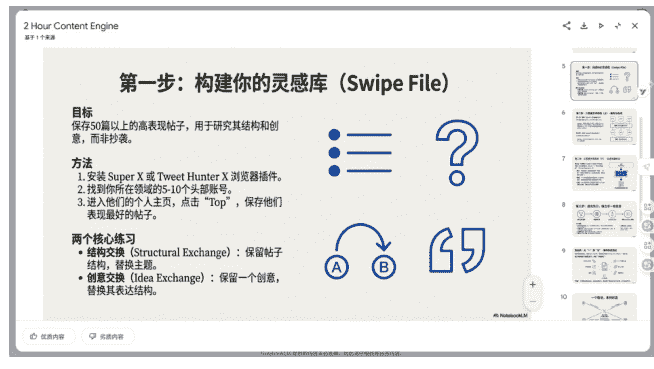
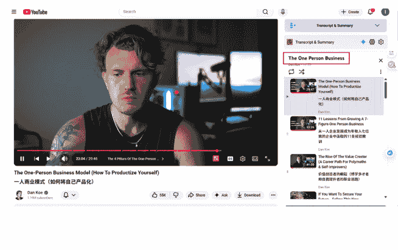

### 方向四：课件+PPT+ 模板赛道

我认为如果你能够用上 NotebookLM 或者 Nano Banana Pro，一定要切入的一个赛道就是课件赛道，因为 NotebookLM 和 Nano Banana Pro 已经解决了大多数人写不好提示词的问题。

因为 Nano Banana Pro 内部其实内置了一个理解能力很强的设计师，你只需要用自然语言描述你的需求，它就能够理解你的意思，你如果对第一版不满意，直接在同一个窗口让它改也可以，非常好用，并且给你的结果往往都会超出你的预期。

那么，为什么你有了 NotebookLM 和 Nano Banana Pro 就可以攻克了课件+PPT+ 模板赛道呢？

很多人都存在一个误区，先否定了自己，认为自己没有足够丰富的经验没有办法去做教师课件 PPT 这个赛道，这很正常，因为它确实有一定的门槛。

但是，教师课件 PPT 赛道也存在很多细分的场景，并不是别人做什么你也要做什么，大多数人的卡点都认为我想要做一个课件型的虚拟产品，就必须要做很多 PPT，准备很多东西，还要回答老师很多问题，还没有做，先把自己否定了。

其实课件赛道并不是这样的，分享一个快速上架的技巧，挑那些一个 PPT 就可以成为一个虚拟产品的场景，比如各种主题班会、家长会、期末考试成绩分析会、开学第一课等等，这些场景都很单一，也不涉及太多专业的知识，并且你可以直接通过 NotebookLM 去做课件。

而且主题班会 PPT 还可以结合热点来做，因为主题班会的受众大概都是小学生和幼儿园的小朋友群体，所以去做一些动漫主题的班会 PPT 是能够出单的。

每年会有两个电影档，一个是春节档，一个是暑期档，而在这两个热门档期内，刚好对应着两个开学季，一个是春季开学，一个是秋季开学，比如今年有两个主题的开学第一课卖的特别好，分别是哪吒主题和浪浪山主题。

那么，你如果 2026 年想过要做课件这个赛道，就可以去看今年会有什么 IP 性质的动漫上映，然后去做这个主题的开学第一课就可以了。

这就是借势的思路，并且现在有了 AI，做一个课件不是什么难事。


此处共 8 题，未展示全部

## 班会课件

| 项目 | 内容 |
| :--- | :--- |
| 类型 | 精品课/示范课 |
| 附赠 | 教案 + 逐字稿 + 配套素材 |
| 价格 | ¥12.99 |
| 已售 | 205 |

## 2025 秋季开学第一课课件浪浪山小妖怪 (配教案 + 逐字稿 + 配套素材)

- 付款后自动发货
- 不支持无理由退换

## 开箱精选

| 链接 | 说明 |
| :--- | :--- |
| 店铺 | |
| 客服 | |
| 购物车 | |

- 加入购物车
- 立即购买

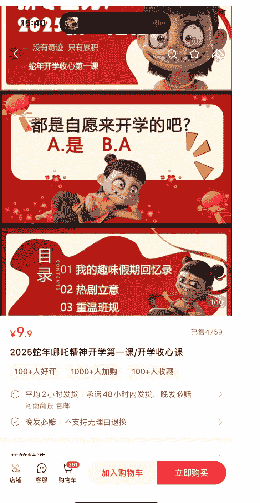

但是用 NotebookLM 生成 PPT 有问题：

- 生成的 PPT 不可编辑
- 只能生成 13-25 页的 PPT
- 对单张图的效果不可控

如果有人要求 40 页、50 页 PPT 怎么办？
NotebookLM 做不了。

所以我们要重新思考底层逻辑。

NotebookLM 的底层逻辑是什么？就是用 Nano Banana Pro 生成一张又一张的图片放在一起。

那我们是不是可以直接用 Nano Banana Pro 去做单张图片，把它们整合到一起就成为一个 PPT 了？

这就是我们做 PPT 的新原则。我们不要再说 PPT 必须要写字、要怎样怎样，而是要重新思考：当今的 AI 工具能帮助我们怎么做。

问题来了：我们用 Nano Banana Pro 做 PPT，怎么开始写提示词？每页的提示词、每页的内容怎么写？

答案：用 AI 写！

我们为什么要自己写呢？我们现在有了 AI，为什么要自己写？

提示词如下：

> 你是一个专业的 PPT 图片提示词生成专家。用户会给你一个简单的 PPT 需求描述，你需要：
> 1. 理解用户需求，推断合适的 PPT 页面数量和内容结构
> 2. 为每一页生成简洁、一致的图片生成提示词
> 3. 保持风格一致性：所有页面使用统一的视觉风格、配色方案和设计语言
>
> 提示词应简洁明了，包含：
> - 统一的视觉风格和配色
> - 页面布局和元素描述
> - 文案内容（标题、正文要点）
>
> 输出格式必须为：
> ---第 1 页---
> [提示词内容]
> ---第 2 页---
> [提示词内容]
> ...
>
> 用户需求：
> 请根据以上需求，智能生成完整的 PPT 提示词。


除了课件外，一切基于图片展现形式的虚拟产品都可以用 Nano Banana Pro 去做，还是那句话，一个场景就是一个虚拟产品，你只需要满足消费者当下的购物场景就可以。

这个时候，你会发现用 Nano Banana Pro 做虚拟产品真的就像呼吸一样简单，比如期末考试模板，就可以用 Nano Banana Pro 做背景图。

因为一个场景，就是一个虚拟产品，你就可以用 Nano Banana Pro 直接出图，没有什么复杂的提示词技巧，就可以完美复刻目前在小红书出单的虚拟产品。

14:59

老师送你一个“坚毅果敢的朱迪”
“大鹏一日同风起，扶摇直上九万里。”你恰似朱迪般坚毅果敢，积极进取。课堂上思维活跃，成绩夺目；劳动里不辞辛劳，心系集体；课余更是才艺傍身，熠熠生辉。望你怀揣此志，长风破浪，于前路绘就锦绣新篇。
爱你的徐老师

长风吹浪会有时，直挂云帆济沧海。”你似朱迪般无畏无惧，拼搏进取。课堂上思维灵动，成绩亮眼；劳动时不遗余力，热爱集体；课余多才多艺，魅力尽显。望你秉持信念，乘风破浪，驶向未来辽阔彼岸。
爱你的徐老师

老师送你一个“奋发向前的朱迪”
“千淘万漉虽辛苦，吹尽狂沙始到金。”你有着朱迪般的执着勇气，奋发向前。课堂上专注聪慧，成绩优异；劳动时踏实肯干，热爱集体；课余才艺出众，光芒闪耀。愿你携此热忱，披荆斩棘，在未来绽放更璀璨光芒。
爱你的徐老师

老师送你一个“自信勇敢的朱迪”
“天生我材必有用，千金散尽还复来。”你仿若朱迪般自信勇敢，积极奋进。课堂中才思泉涌，成绩斐然；劳动时吃苦耐劳，热心集体；课余能歌善舞，风采卓然。盼你坚守初心，勇往直前，在漫漫征途收获累累硕果。
爱你的徐老师

老师送你一个“豪情满怀的朱迪”
“会当凌绝顶，一览众山小。”你如同朱迪般豪情满怀，积极向上。课堂上睿智善思，成绩优异；劳动中兢兢业业，心系集体；课余能文能艺，绽放华彩。愿你凭此壮志，勇攀高峰，在未来书写辉煌成就。
爱你的徐老师

老师送你一个“拼搏进取的朱迪”
“长风破浪会有时，直挂云帆济沧海。”你似朱迪般无畏无惧，拼搏进取。课堂上思维灵动，成绩亮眼；劳动时不遗余力，热爱集体；课余多才多艺，魅力尽显。望你秉持信念，乘风破浪，驶向未来辽阔彼岸。
爱你的徐老师

老师送你一个“顽强坚韧的朱迪”
“咬定青山不放松，立根原在破岩中。”你有着朱迪般的顽强坚韧，积极求进。课堂上聪慧敏锐，成绩出众；劳动时踏实负责，热心集体；课余能书善画，光芒四射。愿你坚守信念，砥砺前行，于未来铺就锦绣大道。
爱你的徐老师

老师送你一个“志向高远的朱迪”
“欲穷千里目，更上一层楼。”你恰似朱迪般志向高远，积极奋进。课堂上才思敏捷，成绩优异；劳动时积极活跃，心系集体；课余吹拉弹唱，样样精通。盼你永不止步，勇攀新高，在未来绘就绚丽蓝图。
爱你的徐老师

共 2 款 >
¥10.8 到手价 ¥6.8
已售 32
商家券 满 10 减 4
平台券 立减 7 元

### 2026 年新款卡通特色主题期末学生评语

付款后自动发货
不支持无理由退换
加入购物车
领券购买
店铺
客服
购物车

93 / 109


¥15.99
已售 653
平台券 立减 7 元

### 幼儿成长手册 | 儿童成长档案 | 成长手册模版 | A4 纸模版

平均 4 小时发货 承诺 48 小时内发货，晚发必赔 浙江舟山 包邮


很简单的提示词就可以直接复刻上图的效果，所以如果你想要用好 Nano Banana Pro，就不要卷提示词，不要追求提示词技巧，只需要说清楚你想要什么就可以。

## 3. AI 的使用技巧和推荐

### 01 NotebookLM

首先介绍下 NotebookLM，其实 NotebookLM 是谷歌开发的 AI 驱动的研究和写作助手，它的核心功能是扎根于自己上传的资料。

简单来说，您先上传您的来源材料（例如 PDF、Google 文档、文本文件，甚至网站链接），然后 NotebookLM 就会成为一个只针对这些材料的“专家”。你可以向它提问、要求它总结、让它生成大纲或构思新想法，而它的所有回答都将完全基于您提供的资料库。

并且 NotebookLM 还可以直接读取 YouTube 链接，这对于大多数博主来讲是非常非常有用的一个功能，毕竟两个网站都是一家公司，彻底打通 AI 生态。

NotebookLM 的优势也显而易见了，就是不会有幻觉，一切生成的内容都是来源于你上传的素材，这对于自媒体博主非常友好。

### NotebookLM 怎么和虚拟产品结合？

很多人纳闷，NotebookLM 就是一个学习工具（大多数人的视角），怎么可以做虚拟产品呢？

这就是看待事物的角度不同。

换一个角度讲，NotebookLM 和 YouTube 完美结合，其实是可以通过 NotebookLM 按照你的思路去重新组织 YouTube 的信息，这不就是内容策展的思路吗，最后你整合成一个只属于你的虚拟产品，这个虚拟产品有你的思想和组织，它本身也是原创虚拟产品。

就像面对同样的食材，厨师可以采用不同的烹饪方法一样，可以创造不同的菜肴，NotebookLM 也是同样的逻辑，去把你的想法和创意实践。

另外，NotebookLM 的优势是可以一次性最多同时针对 300 个 YouTube 视频进行处理，也就是说你的内容基础素材库是足够丰富的，你可以完全组织优质的信息源形成虚拟产品。

另外，NotebookLM 还有一个非常非常好用的功能，就是你可以根据你的特定需求，去直接做一个指南出来，所以你想要做什么都可以去让它生成。

这是不是也已直接构成一个虚拟产品的 demo？

当然，第一次生成的可能不满意，你可以让它多维度生成，也可以结合你生成的报告加上你的思路去重新整合，最终形成一份虚拟产品。

但是这里要注意，我建议虚拟产品不要只是完全照搬 NotebookLM 生成的东西，因为没有办法直接用，毕竟 AI 生成的东西有很多 AI 味。

自己还是要做一个二次整理，并且要加入配图，排好版，不要让别人觉得你这个是纯 AI 生成的，毕竟消费者是花钱的，体验感还是要拉满。

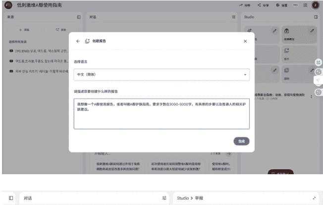
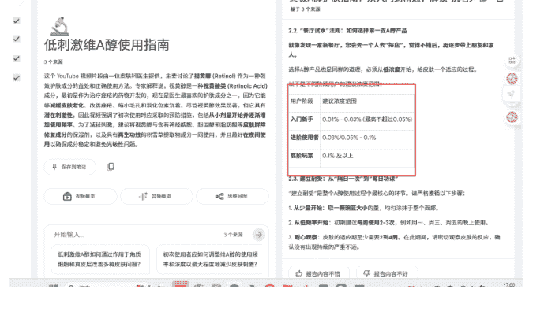

除此之外，还有一个隐藏玩法。

就是可以把 NotebookLM 生成的虚拟产品当作钩子，直接在小红书上传，帮你涨粉，因为小红书用户天生是对干货有天然的喜爱，或者说成瘾。

所以，你如果是客资行业，也可以去通过 NotebookLM+YouTube 快速制作虚拟产品，去帮助你涨粉引流客资。


### 02 WPS 在线版

这个工具是一个很宝藏的工具，针对的是教师场景，如果你要做教师类虚拟产品，一定要用好 WPS 在线版，特别是现在学校都再强调 AI 赋能教学 PPT。

这里就有一个很关键的部分——课堂互动。

而现在 AI 是能够生成很多互动小游戏的，以及一些辅助教学的网页，只不过这些网页 HTML 只能本地运行，WPS 在线版的优势是能够把这些 HTML 代码融入到 PPT 里。

从而达成了 HTML 和 PPT 的完美融合。


公众号懒人搜索，懒人专属群分享

#### 工作流：

- 第一步：用 DeepSeek 或者其他 AI 大模型（任何 AI 都可以）生成你想要的游戏互动或者一些原理展示
- 第二步：复制 HTML 源代码
- 第三步：插入到在线 WPS

为什么我强调 WPS 在线版很重要呢？

因为现在 AI 趋势特别火，在教学场景上也有很广泛的场景，其中一个场景就是 AI 赋能教学 PPT。

每个大模型都有不错的代码能力，可以通过代码实现你的教学想法，以及一些课堂概念的展示，比如这个商家就是在卖一些教学场景的相关工具，卖了将近 1w 单。

公众号懒人搜索、懒人专属群分享

14:57

发私信
商品
笔记
收藏


📱班级积分神器 | 一键加减分 + 云端永不丢！
YesGPT
212


一分钟搞定年会抽奖，简单又高效！
YesGPT
1038

立体几何一秒看懂
AI 融合课 3D 动态拆解 空间想象力
初中数学黑科技告别死记硬背
今天这节 AI 融合课
HTML 定制认准 YesGPT
🤯立体几何太烧脑？AI 融合课让空间看得见
YesGPT
赞

AI 交互式课件
动态天平 - 等式的性质
数学黑科技、AI 天平、秒懂等式
🤔等式性质难哭？AI 天平让孩子秒懂！
YesGPT
1

植树问题
100
20
6
AI 生成交互式
101/109

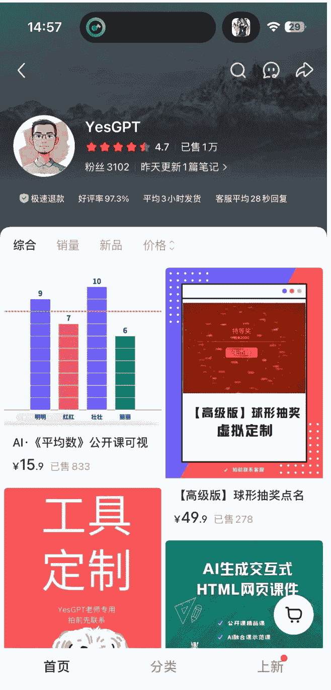

### 03 Nano Banana Pro

我要分享一下，Nano Banana Pro 是一个很优秀的图像生成大模型，这个大模型的优势不只是生成好看的图片，更深层次的意义是对生产力的革新，它彻底改变了一些工作流。

它对于我们最大的优势就是中文文字不会再乱码，而且字体的样式也很多。

那么，该如何正确使用 Nano Banana Pro 呢？

我认为最重要的一点就是忘掉提示词，Nano Banana Pro 的优势就是对自然语言的理解，你只需要描述你的需求就可以，不用很长的提示词，它直接就能给你一个很优质的图片，而且还能有意外之喜。

那么到底怎么通过 Nano Banana Pro 去做虚拟产品呢？

因为 Nano Banana Pro 出色的文字表现能力和设计美感，其实对于小红书虚拟产品这个赛道有很大的价值，并且已经有很多人通过 Nano Banana Pro 在小红书出单了。

这个赛道就是课件 PPT 赛道，很多人有疑问，为什么 Nano Banana 和 PPT 能联系到一起？

因为我们要学会去转换角度看问题，PPT 的本质其实就是一张一张图片的集合，并且 NotebookLM 生成 PPT 的功能，背后就是 Nano Banana 大模型生成的一张一张图片，但是因为有页数的限制，并不能帮你一次性生成页数很多的 PPT，但是 Nano Banana 不一样，你生成多少张图片都可以，并且你还可以对每张图片的生成质量进行可控。

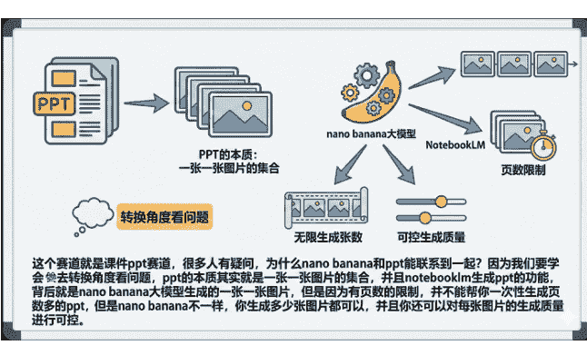

当你生成了足够多页数的 PPT 后，你只需要把这些图片倒入一个空白的 PPT 模版就可以，如果你想要可以编辑的 PPT，你还需要一个。

很多同学还担心一个没有办法编辑的问题，这个问题也可以解决，因为虽然你最终导出的也是 PPT，但是这个 PPT 是没有办法二次编辑的，因为生成的是图片 PPT。

所以，目前来讲最优解就是先把图片 PPT 转成 PDF，然后再把这个 PDF 转成可以编辑的 PPT，这一步用到了 WPS，你需要开会员才能使用这个功能。

目前来讲，这个功能并不是最佳解决方案，因为转为可以编辑的 PPT，可能字体丢失或者图像相关元素变形，不过这个解决方案，已经能解决 80% 的问题。

### 04 提示技巧

AI 原创虚拟产品，很多人都会问我提示词，想问我要具体的提示词，这是一种抄答案的思维，我也能理解，但是我想说的是，如何大模型已经足够聪明，聪明意味着没有所谓的提示词技巧。

而且现在回答的精准度和提示词的关系并不是很大，因为你没有办法第一次就得到满意的答案，本质上和 AI 沟通是一个“打羽毛球”过程，你想要获得一个比较优质的结果，想要进入心流，一定要和 AI 进行多次对话，每一次迭代后，才能给你一个满意的结果。

没有一劳永逸的提示词，你只需要去描述清楚你的问题和需求，以及期待 AI 给到的回复就可以。

另外，分享两个我经常用的提示词技巧，分别是 few shot 和 one shot。

很多同学都说自己用 AI 写的文案有 AI 味，其实本质上是没有给 AI 一个参考，你和 AI 没有一个共识。如果你给 AI 一个参考，那么 AI 就能够理解你到底想要什么。

在提示词技巧中，参考就是样本。而根据我的经验，样本数量的不同其实应用的场景也不同，我的做法是：如果是标题仿写的话，采用的是 few shot，因为 few shot 的本质是提供一些优质的样本范例，而且字数较少，也可以方便总结规律，输出效果比较稳定。

而 one shot 则是严格的仿写，我的场景是小红书笔记正文的仿写，因为它能够保证严格参考你给的内容格式进行仿写，不会失真。

因为小红书笔记的正文字数太多了，所以你不能给 AI 太多参考。如果给 AI 太多参考，AI 就很难聚焦在写作上，最后写的四不像。

one shot 的具体场景之一，就是当你有了爆文之后，可以直接用 AI 批量仿写爆文，快速抢占流量。

所以，总结一下：
- 对于标题仿写，用 few shot 少样本提示，提供给 AI 3-5 个样本，以及你想要仿写的主题进行仿写；
- 对于小红书正文仿写，采用 one shot 单样本提示，提供给 AI 一个样本，直接批量复制你的爆款笔记，快速拿到结果。

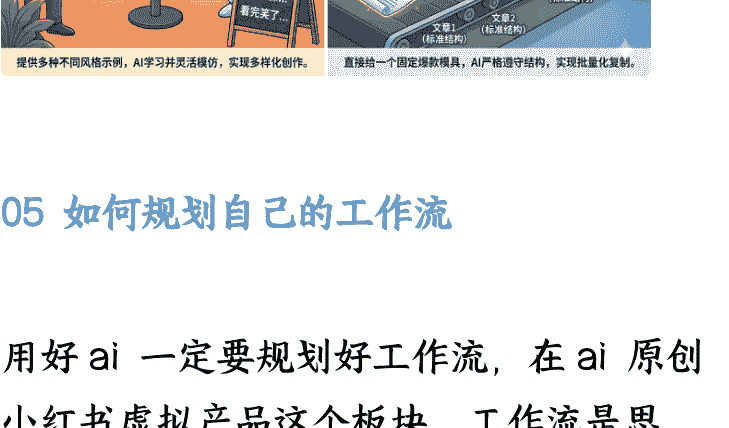

### 05 如何规划自己的工作流

用好 AI 一定要规划好工作流。在 AI 原创小红书虚拟产品这个板块，工作流是思考，如何在合适的节点，用恰当的 AI 去帮你快速做出一个有价值的虚拟产品。

根据我的经验，AI 原创虚拟产品整个工作流，目的不是你花里胡哨地使用 AI，而是要聚焦在整体业务目标的实现。

所以，用 AI 规划你的工作流，并不是每个环节都要使用 AI。

我举个例子：

比如你要把 YouTube 视频变成文字稿，整理成知识库。很多人的传统工作流首先先把视频下载下来，再去用一些软件，比如飞书妙计进行翻译，这个过程非常非常慢。

当你的工作流中某一个节点出现了一些卡点，你首先应该去寻找市场上有没有合适的工具、现成好用的解决方案，而不是一切都靠 AI。那么你优化后的工作流是不是可以先把 YouTube 的字幕下载，然后再去用 AI 翻译呢？

这个工作流可以快速的帮你提效，所以我整个 YouTube 知识库的制作过程并没有全部用到 AI，而是在不同的场景选择合适的工具。

这就是工作流规划的重要性，工作流规划没有最优解，因为 AI 的能力在进化，你需要做的就是不断优化。

工作流并不是你要去搭建一个 Coze 工作流，也不是要搭建一个 N8N，而是在合适的节点选择合适的 AI 工具，去帮你完成业务目标。业务目标是关键，不要陷入技术崇拜和华丽工作流的追求。

### 公众号懒人搜索，懒人专属群分享

最后，安利小懒的付费群：

懒人专属群（介绍）


微信：lazyhelper1

🚩 这里是你对抗信息过载的护城河。

已稳定运行 6 年，累计拆解、研读 3000+ 个互联网商业实战案例与行业前沿内参和时政/宏观文章。

我们不搬运垃圾，只做高价值信息的筛选器与放大镜。

懒人专属群更新记录：
- https://hk57gvIx7u.feishu.cn/docx/H0kRdZbSbolBR0xkaXtcuVE0nTg

懒人专属群更新记录（需梯子，备用）：
- https://lazybook.fun/blog/record2

【免责声明】本资料归档于社群内部知识库，仅供成员课题研究与学术交流，请在查阅后 24 小时内删除。

109/109