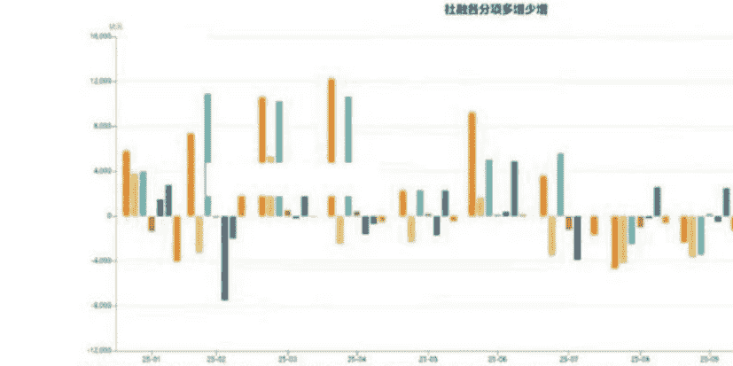

# 备忘：服务业、重要会议通稿、物价、汇率、债市、A 股和宏观数据

## 251216 火星船长 1989

整理：公众号懒人搜索，懒人专属群精选

懒人微信：lazyhelper1

本篇的内容各个部分相互关联，共同构成结论。阅读时需要注意。

然后，即便相互关联、看上去逻辑性很强，我也不一定是对的，仅供参考。请务必保持独立思考。

## 1、服务业通缩

11 月底我在备忘中聊了服务业 PMI 的情况。11 月服务业 PMI 回落至 49.5%，较 10 月回落 0.7%。很多人解释说是由于“十一黄金周”带来的消费高峰过去，11 月自然回落。但我们回看历史数据，从 2015 年至 2020 年，每一个 11 月的服务业 PMI 都高于 10 月。BUT，从 2021 年开始发生变化，往后的每个 11 月都低于 10 月。什么原因？恐怕是口罩后经济主体的行为模式发生了变化。”金九银十”没了（之后的物流和装修也少了），年底企业和政府”冲支出”少了，居民曾经年底集中消费的意愿也已下降。现在的服务业更多取决于补贴（而补贴往往在年底退坡），同时居民把消费集中在“假期”（并缩减平时的消费），形成了 11 月服务业 PMI 较 10 月骤降的情形。

对于现在我国追求“再通胀”而言，服务业重要性大于制造业。为什么？首先，我国制造业可以容纳的就业已经显著减少，并且这一趋势还在加速。

原因在于：①自动化和智能化替代，②高劳动密集型产能向海外转移。在这个过程中，服务业吸纳了大量劳动力，它们包括：吉祥三保、铁人三项、各种灵活就业（比如直播）。

而再通胀的前提一定是居民人均可支配收入预期的提升，最终推动形成“工资 - 通胀”螺旋。

居民收入包括：工资性收入、财产性收入、转移支付收入。

工资性收入提升，要求服务业通胀；

财产性收入提升，要求房价&房租上涨，或股市上涨/分红增加；

转移支付收入提升，要求更多财政资源被用于居民福利、养老、医疗、教育、补贴。

并且，以上收入还不能是“短暂提升”，需得是“持续提升”，因为“预期真正改变”才能形成“工资 - 通胀”螺旋。短暂提升是无效的。这就是通缩治理的难度。

上一期《经济观察报》又有一篇报道引起了我的注意——《注册企业数暴增 45.7%，北京家政“卷”起来了》。文章提到：

- (1) 亲眼见证了北京上门保洁的订单价格被行业新入局者”一路打下来”——最低时出现 39.9 元两小时的服务定价..只能赔本赚吆喝。
- (2) 去年下半年起，在政策引导下，大量资金持续涌入家政赛道..但短期内市场需求并未同步增长。
- (3) 2025 年前 10 个月，北京市家政相关企业注册量由去年同期的 1.38 万增至 2.01 万家..
- (4) 自理老人的住家护理人员服务定价从 5000 元/月降至 4500 元/月。2024 年之前，极少有家政人员愿意承接这样的降价订单，但今年..许多家政人员也接受了这样的定价。
- (5) 一位患有传染性疾病的家政人员未能通过公司的体检环节，几天后，..通过另一家家政公司，已接到护理老人的工作。（内卷的结果就是劣币驱逐良币，Be careful!

显示出服务业继制造业后内卷、通缩的迹象。

## 2、中央经济工作会议：强调内需、供需平衡，但看起来很艰难

### 几个重点:

- (1) 对形势的判断: “..发展中、转型中的问题，经过努力可以解决。..苦练内功应对外部挑战。...外部环境变化影响加深。”总体比 2024 年底更加乐观和松弛。
- (2) 财政政策: “重视解决地方财政困难。...优化财政支出结构，规范税收优惠、财政补贴政策。...保持必要的财政赤字、债务总规模和支出总量。”财政力度表态不及此前普遍预期。
- (3) 货币政策: “灵活高效运用降准降息多种政策工具，，，畅通传导机制，，，促进物价合理回升...”货币政策力度表述超过此前普遍预期。
- (4) 供需关系:”.国内供强需弱矛盾突出。...制定实施城乡居民增收计划。..清理消费领域不合理的限制措施，释放服务消费潜力。..推动投资止跌回稳，适当增加中央预算内投资规模。..制定全国统一大市场建设条例，深入整治‘内卷式’竞争。”供给方面，①整治内卷，②清理限制措施;需求方面，①城乡居民增收计划，②增加中央预算内投资规模。

### 总体上看，有几个想法:

- (1) 2026 年相比 2025 年，会是一个财政小年 (2025 年毫无疑问是个财政大年），税收和补贴会更加从严，着力提高财政收入，稳定赤字率；
- (2) 对货币政策可以不必那么谨慎、悲观，降准降息都会有；我在之前备忘和视频中也提过，货币、财政轮番出牌是必要的，也可以避免被人误以为你在 QE 或者 MMT；
- (3) 反内卷是通缩性质政策，其“推动价格上涨”的效果最终大概率证伪（试问，企业内卷的本质原因是什么？这个原因有任何的改变吗？）。清理限制措施我认为会是有效的，看各地执行的能力。居民增收计划看到底会是个什么计划。增加中央预算内投资规模，很难超预期。因此总体看，供过于求的状态很难改变。

BUT，我们也看到本次会议对”内需”的高度重视，“内需主导”这一表述，突出了它被作为国家经济循环根基的地位。

## 3、汇率：持续升值的逻辑和可能的走向

在最新一期视频中，我聊了日本上世纪 90 年代初的“大升值”。乍看之下很不可理喻，但回到当时的日本，了解它的心态和面临的约束后，也可以理解。当前的 RMB 和当时的日元有一些相似性：

（1）从国际贸易的角度，RMB 当前的价格令贸易伙伴非常不爽。2022 年初至今，RMB 贬值约 15%，而 PPI 每年降 2.5-3%，这部分也直接反映在制成品的价格上。于是将 RMB 相对美元的表观贬值幅度，叠加国内的通缩环境，相当于这几年给出口工业品降价了 25% 甚至更多。

2025 年在“对等关税冲击”下，出口依然非常顽强甚至全年实现了超过 1 万亿美元的“里程碑式“贸易顺差，除了有我国产品竞争力强大外，汇率和 RMB 贬值带来的“降价效应”功不可没。

日本当年对美的贸易顺差不断扩大，和我们当前情形很像——内需不振、但出口超强。同样也引起了很大的反对，尤其是来自美国人的抗议。

因此，对等关税冲击后 RMB 一路升值，实际是与美国达成协议和妥协的内容之一。升值有助于实现贸易“再平衡”。

（2）央行降息较慢，一方面坚持认为通缩是“转型过程中的问题”、“经过努力可以解决”，一方面可能损害金融体系的稳定性。而且逐渐“降息无用论”竟成为了共识。因此我国实际利率偏高。

除了上面两点与日元相似，以下考虑，出发点虽与当年的日本政府不同，但最终的结果都是默许本币升值：

在 G2 竞争博弈宏观背景下，美国将中国视为最重要的战略对手。贸易战和俄乌冲突让我国意识到美国将它提供给全球的金融便利性转而”武器化”的极大可能性，因此人民币必须尽快国际化，被更多伙伴所接受。人民币的稳定和一定幅度的升值有助于它的“价值重估”和推广（和 A 股一样，本质都是一种资产，越涨越闪闪惹人爱）。

日元最终的结果，所有人都已经看到了。1995 年日元升至高点之后，震荡 7 年时间。2013 年在安倍晋三发出“三支箭（超宽松货币政策、积极财政刺激、结构性改革）”之后，日元开启了一段漫长的贬值之路。为什么如此？因为：①通缩螺旋已经持续 20 年，社会各阶层已经形成了根深蒂固的通缩预期，这导致常规手段全部失效；②利用大宽松、大刺激，一举扭转预期。而在经济恢复的过程中，日元贬值起到了重要作用：①日元计价的资产价格上行；②日本出口和出海企业的日元计价利润大增；③日本国内出现了成本推动型的通货膨胀。

接下来我们延续上面的思路讨论 RMB 后续的走向。在此之前，我们应明确 RMB 与日元的差异：①央行对 RMB 的控制能力超过日本央行；②我国必然不会如日本那样完全根据美国的诉求行事；③RMB 绝对不是避险货币；④RMB 快速大幅贬值对我国的帮助很可能小于日本，因为 a 会引发贸易对手反弹，同时 b 我国并没有如日本那样庞大的海外资产，最后 c 由于资本管制、尽管国内的资产 (股、楼) 显得便宜，海外资本进入也有相当难度。

因此，有可能产生的情况是:

- (1) RMB 继续升值，直到贸易顺差开始缩小。这是对美方以及其他贸易对手不满的回应，同时也为 RMB 向友好国家推广降低阻力;
- (2) 这样我们就能够理解，为什么本次中央经济工作会议将内需放在如此重要的战略地位，因为外需已经很难提供增量 GDP 的拉动 (RMB 还要升);
- p.s.也许我们明年某个月份就会看到顺差开始显著缩小。
- (3) RMB 也是一种重要资产，尤其是对于出口或出海企业而言，是否换汇是一个重要考虑。如果 RMB 升值成为一致预期，那么升值可能就会在换汇的推动下加速。而央妈拥有控制力，将避免“大幅波动”，因此一旦快速升值，肯定会往回按，但也会默许这一方向;
- (4)RMB 升值会抑制出口，并激励出海，同时导致国内的 RMB 计价的资产价格变贵 (对于海外资本而言)。因此总体来说，出口导向型国家的货币升值对本国经济是不利的。因此，RMB 升值同样有通缩效应，除非我们真的成功拉动了内需；
- (5) 如果转型“内需主导”成功，那么 RMB 的升值就会拥有坚实的地基，未来升到一定水平，不至于大幅回落；如果内需始终激发不起来，那么很可能还是会再“有控制地贬回来”。

## 4、通缩和 A 债

- (1) 前面已经讨论了服务业通缩的情况，也讨论了经济工作会议对 2026 年的安排，即财政整体力度回收；如果财政确实不如 2025 年积极，再加上私人部门没理由不继续躺平，那么 2026 年将出现信用收缩；
- (2) 前面已经讨论了汇率的问题，RMB 持续升值将使外需对经济的推力减弱；
- (3) 根据上面两点，明年价格水平很难好转甚至有可能从某个时点开始恶化；
- (4) 有限的财政资源将确定性地用于支持科创和超前基建，以及两重两新。此外，要关注是否显著地侧重收入分配调整。内需要被真正地激发，只有两条路径，其一是激发居民的安全感，其二是激发居民的恐惧感；安全感要求社保福利完善到大家认为超额储蓄是没必要的事情，恐惧感要求居民认为再不花掉、钱一定会很快“变毛”（我们多次聊过，不负责任的央行会诱导出这种恐惧）；
- (5)RMB 的升值，对于海外资本而言很有意义。首先，在 RMB 升值趋势下，投资于中国资产具备了重要的安全垫。其次，RMB 升值会带来内部的通缩压力，使债市拥有了获取资本利得的前提。因此，RMB 升值会提升 A 债对海外资本的吸引力；
- (6) 基于以上，在观察到真正对启动内需有实质性帮助的政策前，依然会对超长债持有相当有意义的仓位，其他久期的债券也会适当配置；个人观点，超长债已经处在具有高度战略价值的配置区间，短期的波动来源是机构受到 Vanke、浙金等事件冲击后对流动性的需求（卖出流动性好的利率债），以及这些事件引发机构对固收类产品风报比的重新评估和资产重配（其中一部分可能会考虑卖出各种债券、并将配置迁移到红利股上）。
- (7) 上篇视频”当市场说你是错的”，我看到评论区会有非常多的人说“市场永远对”。学习时非常忌讳人云亦云，“市场永远对”的含义是趋势永远有它的道理，并且要敬畏趋势，从交易者的行动上要谦卑，比如你不能持有令自己感到恐惧的仓位、去对抗趋势；但巴菲特、芒格、霍华德、段永平这类大师绝不可能认可这句话，因为从价值投资者的角度，市场最终只是一个疯狂的报价机器，它是一个要不就处于极端、要不就正走向极端的钟摆。

## 5、A 股:趋势和结构

### (1) 趋势

首先， “不加速，无转折”。形成趋势的事物末端总要加速。这是个规律。

而本轮行情的速度始终在被控制，因此没有积累过多风险 (交易角度，最大的风险是筹码结构和杠杆)。

接着，讨论一个老生常谈的问题——为什么曾经 A 股从无慢牛？这个问题与“为什么企业总要内卷？”其实指向同一个答案。这个答案的名字叫做“长期产权不确定性 + 社会信用和契约精神极度匮乏”。

在长期产权不确定 + 契约精神不存在的背景下，唯一合理的选项就是在“政策窗口期”疯狂攫取利润。这就是内卷和暴力牛市的来源。而内卷则必然导致利润坍塌，暴力牛市也必然以一地鸡毛收尾。

那么，为什么现在反而有可能出现慢牛了？并不是因为长期不确定性消失了，而是：①内部，“政策窗口期”消失了，所以“周期”也消失了;②外部，暂时还是“广阔天地大有可为”，暂时还是一片蓝海，卷得少。

最后，A 股的定位自 2024 年 924 之后发生改变，被高层视为扭转预期的最重要抓手之一（当时挑了两个抓手，一个股市、一个楼市，结果抓住了一个，另一个搂了一把，抓空了，掉得更深了，想想要不先算了），也是给科创企业融资、未来解决债务问题的重要方式。这是保持牛市的必要性。保持牛市的可能性在于，央行必要时直接下场 + 不断下降的无风险利率，这个我们之前聊过了，不再重复。

### (2) 结构

上周我们看到泡泡玛特和贵州茅台同时下跌。实际上整个消费板块都跌得很凶，关键是涨的时候也没带它们。泡玛和茅台同属可选消费品，是周期的典型代表。茅台我从刚开星球时就在聊，从来都是不看好。我说过它是地产、基建时代的产物，是服从性测试的工具，是上个时代文化皇冠上的明珠。我知道有些人平时会喝白酒，我有亲人嗜酒如命，但他们喝的不是茅台。茅台的金融属性远大于消费属性。曾经我说茅台压力最可怕的时候，是收藏箱货的人开始甩货的时候。茅台已经跌破指导价，是新一轮趋势的开始。茅台处于下跌趋势，一样符合“不加速、无转折”的规律。总之，周期品、尤其是内需主导的周期品，还是不看好。

2026 年 A 股的结构，首先肯定还是科技，这是时代主旋律，也符合 A 股“三年一轮”的风格周期（2013-2015 成长、2016-2018 价值、2019-2021 成长、2022-2024 价值、2025-?，这种风格周期背后是政策周期和产业周期）。接着，红利风格很可能也会在某个时间段与长债共振，演绎对通缩加剧的担忧。

### (3) 短期的下跌

A 股的下跌和震荡是对 4-9 月的连续上行的修正，性质与黄金在 4-8 月的横盘调整一样。包括港股。修正背后的原因包括短期流动性、对估值和产业进展的担忧。

## 6、一些宏观数据和图的简单讨论

### (1)MI 领先 PPI，9 个月。

很多人用这个来前瞻 PPI 明年上半年必将持续上行。首先 MI 中包含居民存款后，对企业部门状态的描述性减弱，与 PPI 之间的相关性必然减弱。其次我的备忘中聊过多次，MI 基本上与财政脉冲同步，实际上就是政府开支成为了企业&居民的活化存款。而已知 2026 年财政力度会下降。那么 2026 年 MI 表现必然相对羸弱。而由此 PPI 的上行则很难期待，除非海外经济的火热超乎寻常。则就算 MI 领先 PPI9 个月的规律依然成立，前瞻指标已经必然走弱的前景下，PPI 短期的上行对市场还有意义吗？

公众号懒人搜索、懒人专属群分享

### (2) 图 2,

房屋租金同环比数据明显下行，当然环比有季节性因素 (年底退租、需求减少，虽然并非每年 11 月环比都下行)。租金走势与服务业景气度下滑共振。由于租金下滑，房价下滑形成的租售比提升就会被抵消，而同时 30 年国债收益率最近升得很快。30 年国债收益率和租售比之间的差距拉大，这就使买房这件事看起来更加“算不过账”。

都在说 2026 年会是服务经济的大年，但看起来必须要财政用力刺激才可以，不然按照它自己的趋势，不萎靡就不错了。

### (3) 图 3,

严重收缩的居民长贷（与房价方向一致），继续收缩的政府债。

P.S. 写到这里想到领导们“留足政策空间”的思维惯性。2024 年引导利率下行、RMB 一定幅度贬值，为 2025 年 Trump 上台后与我国展开贸易战做好准备。2025 年得以以财政脉冲对抗内需下滑，以高度竞争力的出口对抗关税。

根据中央经济工作会议通稿，对外部压力的判断降低，也形成了 2026 年的政策基调，财政略往回收。

“政策空间”何时再打开，一个是外部压力再加大，一个是内部压力再加大。

但是，“通缩治理的时间窗口”并不是永远存在的。一是人口压力在这里，老龄化和生育危机每年都在变得更加严重；二是通缩预期一旦形成，就会变得难以逆转。

### (4) 图 4，

几乎全部在下行的经济数据。和预期的一样。明年，如果反内卷继续推动、并且财政力度回撤、补贴总额下降（或持平），则经济数据可能进一步走弱。

## 最后，安利小懒的付费群：

### 懒人专属群（介绍）

公众号懒人搜索，懒人专属群分享

📖 这里是你对抗信息过载的护城河。

已稳定运行 6 年，累计拆解、研读 3000+ 个互联网商业实战案例与行业前沿内参和时政/宏观文章。

我们不搬运垃圾，只做高价值信息的筛选器与放大镜。

### 懒人专属群更新记录：

https://hk57gvlx7u.feishu.cn/docx/H0kRdZbSbolBR0xkaXtcuVE0nTg

### 懒人专属群更新记录（需梯子，备用）:

https://lazybook.fun/blog/record2

【免责声明】本资料归档于社群内部知识库，仅供成员课题研究与学术交流，请在查阅后 24 小时内删除。