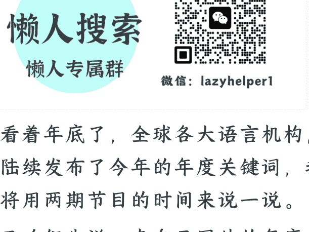

# 2025 年度关键词，命名了你这一年的困惑

251223

整理：公众号懒人搜索，懒人专属群精选

懒人微信:lazyhelper1

眼看着年底了，全球各大语言机构，都陆续发布了今年的年度关键词，我们将用两期节目的时间来说一说。

今天咱们先说，来自于国外的年度关键词，而关于国内关键词的解读我们会放在下周。好，咱们正式开始。

那说到国际语言机构的评选，其中最受关注的就是四大词典了，分别是牛津、剑桥、韦氏和柯林斯。

截止到上周，四大词典的年度词已经全部出炉。维特根斯坦说过，语言的极限意味着世界的极限。当我们无法用语言描述某种现象时，这个现象就在我们认知的盲区。而一旦给它命名，它就从混沌变成了可讨论的对象。

那么，过去一年，四大词典评选出了哪些词呢？接下来我们就展开看看。

## 第一个，《剑桥词典》的年度词，Parasocial，类似亲密。

把这个词拆开来看，para 是“旁边、类似”的意思，social 是“社交”，合在一起就是“类似社交但不是真正社交”的关系。

说白了，就是一种单向的、不对等的情感关系。你觉得和对方很熟，关心对方的生活，为对方的事情感到高兴或者难过，但其实对方根本不认识你。

剑桥的官方说明里说，parasocial 捕捉到了 2025 年的时代精神。这就是，我们和屏幕那端的“关系”越来越复杂。

比如，有人每天刷偶像的微博，看他的视频，关心他的恋爱、工作、生活，甚至认为自己和他是朋友。再比如，有人每天晚上准时进某个主播的直播间，给他打赏，和他互动。但实际上，他可能面对的是几万个观众。还有人把 AI 当作知己、恋人、心灵导师，但它只是一个算法。这些都属于类似亲密的关系。

其实，“parasocial”这个词本身并不是新词，早在 1956 年，芝加哥大学的社会学家就提出了这个概念。当时电视刚兴起，很多社会学家发现观众会把节目主持人当成“老朋友”，于是就有了这个名词。但那时候“parasocial”还只是学术名词，并没有大众化。

真正让这个词出圈的，是社交媒体。最关键助推者，是美国歌手泰勒·斯威夫特。2025 年，她宣布订婚。很多粉丝像亲友一样狂欢、流泪、写长文分析他们的感情历程，仿佛自己见证了整个恋情。很多媒体在报道时，就大量使用了“parasocial”这个词。

剑桥大学实验社会心理学教授，西蒙娜·施纳尔说：“我们已经进入了一个许多人与网红建立不健康且过度亲密的准社会关系的时代。这导致人们产生一种错觉，认为他们了解那些人，可以信任他们，甚至表现出极端的忠诚。然而，真相是，这种关系完全是单向的。”

但注意，这并不是说这些关系必然是坏的，而是说有时候它会替代现实社交，会加剧个体的孤独。

换句话说，parasocial 这个词，并不是否定这些关系，而是在提醒我们，屏幕那端的人或 AI，不是真正的亲密关系，可以适度体验，但也要回归真实的生活。

## 第二个，《牛津词典》的年度词，Rage bait，愤怒诱饵。

也就是，那些故意惹你生气的内容。它的目的不是传递信息，也不是表达观点，而是激怒你。因为愤怒会让你互动，比如点赞、评论、转发，而这些互动会让算法把这条内容推给更多人。

《牛津词典》的评选过程也很有意思，他们把每个入围词都拍成短视频拉票，而“rage bait”这个词的视频里是个暴躁的绿色鸟人，用挑衅口吻说“人们就是喜欢我，你能责怪他们吗？”很多人说，这本身也是一种试图触发愤怒的“诱饵”。

牛津语言协会主席卡斯珀·格拉思沃尔说：“过去，互联网主要通过激发好奇心来吸引注意力，如今它正急剧转向劫持我们的情绪。”

比如，现在网络上有大量的所谓“职场惨案”。“老板当众扇员工耳光”“迟到 1 分钟扣 500，员工跪地求情”“怀孕女员工被直接劝退”。视频没有前因后果，只有一眼就能激怒你的画面。再比如，很多内容会故意使用某种“情绪模组”。比如，性别对立、地域歧视、代际矛盾等等。

人们的情绪、停留时长，会让数据变好。而且生气的人特别想说话，会评论、转发、@同事，这些都是算法眼中的“高价值互动”。算法多推，创作者涨粉，然后带货变现。

好消息是，卡斯珀也提到“rage bait”这个词的搜索量激增，意味着我们越来越意识到，自己可能陷入网络操纵策略。

命名本身就是对抗的第一步。一旦我们能识别“愤怒诱饵”的套路，就从被动的情绪消费者变成了主动的观察者。就像看魔术，一旦知道了手法，魔术就失去了魔力。

也许当人们再刷到这些视频，第一反应不再是愤怒，而是停下来想一想：这是完整的事件吗？前因后果呢？这个账号是专门做这类内容的吗？

这种意识上的转变，看起来很小，但实际上是把主动权拿回到自己手里。当越来越多的人开始搜索“rage bait”这个词，说明集体觉醒正在发生。

## 第三个，《柯林斯英语词典》的年度词，vibe coding，氛围编程。

简单说，就是用“不写代码”的方式写代码。

以前你想做个登录页面，得写几百行代码，页面结构、样式、交互逻辑等，每一步都得自己来。但是现在，你只需要用大白话告诉 AI 你的需求，它就会直接生成。

这个词是怎么火起来的呢？今年 2 月，前特斯拉 AI 总监安德烈·卡帕西在推特上说，他现在编程就是，自己只管讲需求、给氛围，实现的过程完全可以交给 AI，而且他把这个过程命名为“vibe coding”。后来，这条帖子迅速在开发者圈子里传开。

柯林斯官网的说法是，这代表了“从变量到氛围的编程”。以前你关心变量、函数、算法，现在你关心“我想要什么效果”“这个功能应该是什么感觉”。

而且不只是编程可以“氛围化”，其他行业也在发生类似的变化。设计师用 AI 做图，律师用 AI 写合同，营销人员用 AI 写文案，等等。“氛围化”也许正在很多领域发生。你不需要掌握所有专业技能，只需要表达你想要什么，AI 就能帮你实现。这是一个从“我会做”到“我会说”的转变。

这对程序员职业意味着什么呢？

首先，核心竞争力转移了。以前核心能力是“写代码”，现在核心能力是“如何利用 AI 开发更好的软件”。程序员从代码的直接编写者，变成需求提出者和验证者、系统架构设计者。

其次，使用 AI 成为必备技能。会用 AI 编程工具的开发者，将比不会用的更有竞争力。不是“会不会写代码”，而是“会不会让 AI 写出你想要的代码”。

据说，在 2025 年的 YC 冬季营里，25% 的团队 95% 的代码由 AI 生成。硅谷已开出百万年薪招聘“Vibe Coder”氛围编程专家。

当然，AI 的编程未必可靠，于是，由此延伸出了一个新服务，“审核 AI 的编程”。国外有越来越多的外包程序员，专门修复企业用 vibe coding 写出来的项目。

换句话说，vibe coding 虽然降低了入门的门槛，一些工作变少了，但同时，也有另一些工作增加了。程序员的角色正在转变，不是被 AI 替代，而是和 AI 协作，专注于更高层次的创造和判断。

## 第四个，《韦氏词典》的年度词，Slop，AI 垃圾。

“slop”这个词的历史很长，18 世纪它指的是“松软的泥浆”，后来泛指毫无价值的东西。

今年，韦氏给它加了一个新定义：借助人工智能批量生成的低质量数字内容。韦氏词典总裁格雷格·巴洛说：“人们对 AI 既着迷，又厌烦，还觉得荒唐。”着迷是因为 AI 降低了很多工作的门槛，甚至让不会写代码的人也可以做应用，而厌烦是因为 AI 生成的内容泛滥成灾。

那么，slop 带来的争议和风险是什么呢？

- 第一个风险是“模型自噬障碍”。莱斯大学和斯坦福大学研究发现，将 AI 生成内容输入 AI 模型，会导致输出质量下跌。如果 AI 只学习其他 AI 生成的内容，经过几代训练后，AI 将输出无意义的垃圾信息，最终走向“模型崩溃”。只需要 0.01% 虚假的文本，就能让模型的“有害输出”增加 11.2%。
- 第二个风险是社会信用体系的动摇。假如 AI 伪造内容，已突破“有图有真相”的传统认知防线。那么人们对“真假”的区分，难度就会越来越高。

说到这，假如把 vibe coding 和 slop 放在一起看，正好体现了 AI 的双面性。**vibe coding 是人工智能作为生产力工具的一面，而 slop 是人工智能作为垃圾制造机的一面**。也许 2025 年，AI 对我们来说，已经不再是一个单纯的好或坏的技术，而是一个复杂的、矛盾的处境。

关于四大词典 2025 年的关键词，咱们先说到这。这些词乍一看很陌生，但仔细观察，它们描述的也许就是我们身边正在发生的现象。

心理学上有个发现，当你用语言精确命名一种情绪时，大脑负责理性思考的前额叶活跃度上升，负责情绪反应的杏仁核活跃度下降。说白了，命名本身，就是把情绪从“被动承受”变成“主动控制”。

命名现实，就是在改写现实。就像人类学家爱德华·萨丕尔说的，"**现实世界很大程度上，是建立在群体的语言习惯之上的**"。

最后，安利小懒的付费群：

## 懒人专属群（介绍）

这里是你对抗信息过载的护城河。

已稳定运行 6 年，累计拆解、研读 3000+ 个互联网商业实战案例与行业前沿内参和时政/宏观文章。

我们不搬运垃圾，只做高价值信息的筛选器与放大镜。

## 懒人专属群更新记录

- https://hk57gvlx7u.feishu.cn/docx/H0kRdZbSboIBROxkaXtcuVEOnTg

## 懒人专属群更新记录（需梯子，备用）

- https://lazybook.fun/blog/record2

【免责声明】本资料归档于社群内部知识库，仅供成员课题研究与学术交流，请在查阅后 24 小时内删除。