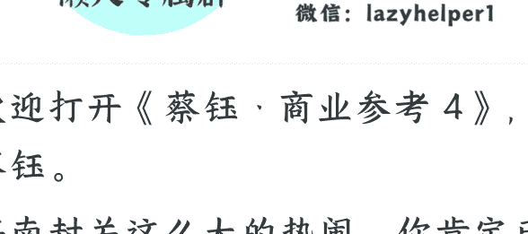

# 189 | 海南封关：给世界的“中国试用装”

251224

整理：公众号懒人搜索，懒人专属群精选

懒人微信：lazyhelper1

欢迎打开《蔡钰·商业参考 4》，我是蔡钰。

海南封关这么大的热闹，你肯定已经听说了。

2025 年 12 月 18 日，海南正式启动封关。这个动作，标志着中国的对外开放又走到了一个新的历史节点。它不光是 2025 年的中国大事件，也会是未来十年的世界级大事件。

## 封关的概念

从此，海南成了自由贸易港，遵循“一线”放开，“二线”管住，岛内自由的原则，站在“境内关外”这种新处境里，替中国探索制度化开放了。

所谓“一线”，就是海南岛跟境外其他国家的分界线。一线放开，就是海南要跟境外尽量接轨。这个接轨最显著的特征，就是大多数商品进出享受“零关税”待遇。

“二线”，就是海南岛与内地的分界线。二线管住，就是一线零关税进岛的商品，如果要进入内地，要向海关补缴进口关税。

岛内自由，就是说零关税货物在岛内可以自由存放，没有期限限制；享惠企业之间，也可以自由买卖和加工这些货物，不必另外交税。而且，在海南注册的企业、在海南工作的高端人才，还可以享受 15% 的超低所得税税率。

中国居民去海南旅游、出差，并不是离境，还是拿身份证买机票、船票就能去。这叫“封关不封岛”。

所以，海南的“境内关外”处境，指的也就是，它同时处于中国国境线以内和海关线以外。

## 客体自觉

其实在海南正式封关的前两年，我身边不少朋友就已经开始张罗去海南注册公司了。不过，其中至少一半人折腾了一通之后得出的结论是：这海南自贸港，好像也没比内地有多大红利啊？

就拿它最著名的零关税待遇来说，全球货物进海南确实是零关税了，但要是想从海南再进入内地，还得补缴关税。这跟从北上广深入关也没多什么区别。

另外，海南企业和工作人才，说是都能享受 15% 的所得税优惠，确实比全国其它各省要低很多，但条件是，企业要在海南有实质经营，人才一年至少要在海南住满 90 天。这对一般企业和个人来说实在满足不了。

等到这两天海南正式封关，我又特意问了几家外贸企业，外贸企业们对海南的封关红利也感触不深。

其实啊，你还真别说，对这些朋友来说，“无感”反而是合理的。这正好涉及到了这次的海南封关，我最想跟你分享的两个判断和一个建议。

两个判断是：

- 海南封关红利的真正目标人群，不是内循环导向的中国企业和中国民众，而是外资企业、全球人才。
- 那普通个体在封关后的海南岛上，有没有新的事业机会呢？当然也有。但主要思路不是走出去赚海外市场的钱，而是帮外资在中国赚钱。

- 一个建议是，海南封关，虽然是在代表中国探索更深的开放，但我们作为中国民众，却需要有“客体自觉”。

## 封关细节

怎么个意思？我先给你讲几个海南封关的政策细节：

- 第一个，海南企业和人才双双享受 15% 的所得税税率优惠。

条件是要在海南有实质经营、实质生活的证据，比如本地雇员数量、账目往来、个人进出岛记录、连续缴纳社保的记录啊等等。这个我们前面已经提过了。

- 第二个，零关税进岛的货物，如果在岛内加工增值超过了 30%，再销往内地，就可以免征关税。

这个 30%，其实是一道“身份洗白”的门槛。做到了，外来的“洋货”就变成了“自产货”。这对想进中国市场的外资企业来说，不是拒绝，是启发。

- 第三个，2025 年 7 月，就在正式封关前 5 个月，商务部发布了个规定叫《海南自由贸易港禁止、限制进出口货物、物品清单》。

这份《禁限清单》规定说，有 60 项旧机电设备，企业们只要是为了自用，从境外进口到海南时，不用再像以前那样申领和提交进口许可证了。这项政策，提到的旧机电设备，涉及医疗、工程、印刷、农业、电力、焊接等各个领域，占到了以往需要申请许可证的旧机电产品的 80%。

这啥意思？简单来说，鼓励在海南落地的企业，在这里设厂、建生产线。这不止对中国制造企业是利好，连对台积电、大众、丰田们说不定都是诱惑。——如果注定要搬家，搬哪儿不是搬呢？

- 第四个更厉害，叫“第七航权”。

2025 年 12 月 21 日，也就是刚过去的周日早上，一架特殊的波音 737 MAX 9 飞机，载着乘客从海南三亚凤凰机场腾空而起，飞往欧洲的捷克首都布拉格。

这辆飞机的航班号是 DV481。DV 是哈萨克斯坦斯卡特航空公司的 IATA 代码。也就是说，这架客运班机，是哈萨克斯坦斯卡特航空的。但它飞的这条航线，起降点都不在哈萨克斯坦，基本就是海南直飞欧洲。

换句话说，中亚的哈萨克斯坦的斯卡特航空公司，在海南自贸港，经营起了一条东亚直飞欧洲的商业航线。

这条航线，是海南自贸港投入运营的首条第七航权航线。

什么叫第七航权？按照国际民航组织的区分方式，一个国家的领空开放程度可以分为 9 个等级，级别越高，开放程度越高。第一航权就是允许飞机路过自己的领空。

目前在中国，北京、上海、广州等 17 个城市的航权只开放到第五级，允许外国航空公司到自己的国际机场来经停、上下乘客和货物，再飞往第三国。

而第七航权，又叫“完全第三国运输权”，指的是外国航空公司，可以来本国或本地区经营独立航线，拉客拉货，始发地和目的地不需要跟它的母国有关联。

封关后的海南，允许外国的航空公司在海南开通并运营这样的航线，每家最多 2 条，每条每周最多 7 个班次。海南的第七航权，开到了中国目前的最高水平。目前在全世界，也只有新加坡、迪拜等极少数节点能做到。

这有什么意义？它能解决供应链对“速度”的极度渴求。

我们开个脑洞，如果 AMD 在海南设立一个芯片厂，借用美国的 DHL 与 FedEx 货机，在海口和伦敦、新加坡、硅谷之间对飞，不必中转，它的物流效率可能比英伟达高出 30%。

这事儿，民航局早在 2020 年就准备好了，但限于疫情，直到 2023 年才在各家外国航空公司当中宣讲，2025 年才把第七航权正式写进海南的封关方案，把海南变成了全国最开放的“天空特区”。

在这四个政策之外，在电信增值业务层面，海南允许外商独资经营数据中心、内容分发网络；在金融层面，也允许国际资本在海南与境外自由划转，不必频繁结售汇。

## “中国试用装”

好，你发现了没有，这些政策合在一起，是一套面向境外企业和人才的、热情周到的招商叙事。

海南真正想说的是：请世界不要只把我当作又一个自由港，而是把我当作一个有自由港功能的“中国试用装”。

为什么是“中国试用装”？

因为相比新加坡、迪拜等其他自由港，海南更关键的差异，就在于它背靠中国的统一大市场和完备供应链这两大超级外挂。

多了这两大外挂，海南相比其他自由港，就能在金融、信息、航运层面的便利之外，替全球企业们把效率再拉升一档。

我们前面列举的这些政策，其实给全球企业提供了两种清晰的赚钱路径：把货物从境外运至海南，在岛内完成加工增值后，零关税卖到中国内地。从中国内地免关税采购中间品和零部件运到海南，在海南完成最后的产品生产，直接卖往全球。

而中国市场和中国产能这两大外挂，对本来就生活在中国境内的我们来说，红利感受不明显，当然也就相当正常。

你想，即便是海南最吸引人的“零关税”政策，对我们作为普通消费者来说，吸引力也已经比 10 年前消退了很多。

因为今天我们需要消费的几乎所有产品，无论是手机汽车、服装家具，还是水果零食、化妆护肤品，中国本土早就有了足够好的供给。落地海南的那些免税商品很难查漏补缺。

但是，别忘了我们前面的第二个判断：

对普通个体，在封关后的海南岛上，最值得寻找的事业机会，就是撮合全球与中国供应链的产能合作，把加工增值之后的产品，卖往中国内地，或者全球市场。换句话说，海南封关红利，是给撮合型玩家的。

而这件事，对整个中国内地也是有意义的。你想，这样的海南，其实就是通过制度创新，把中国的产能和市场，重新插回了全球化的主干道上。

从这个角度，我们还能够理解，为什么中国要在已经有了香港、浦东和深圳之后，还要耗费 5 年多时间，专门储备海南这座自由贸易港。这是在为碎片化的全球化 2.0，摸索新的融合模型。

你说，这是不是跟美版 TikTok 承担了类似的功能？

不过你也别误会。海南封关运行，对我们当然也是有好处的，只不过它需要先作用到整个中国，再细化到我们普通人生活里。

所以下一讲，我们干脆再用一讲，尝试分析一下，海南封关可能会给中国乃至亚洲带来怎么样的变化。

### 再见。

最后，安利小懒的付费群：

懒人专属群（介绍）

📖 这里是你对抗信息过载的护城河。

已稳定运行 6 年，累计拆解、研读 3000+ 个互联网商业实战案例与行业前沿内参和时政/宏观文章。

我们不搬运垃圾，只做高价值信息的筛选器与放大镜。

懒人专属群更新记录：

https://hk57gvlx7u.feishu.cn/docx/H0kRdZbSboIBR0xkaXtcuVE0nTg

懒人专属群更新记录（需梯子，备用）:

https://lazybook.fun/blog/record2

【免责声明】本资料归档于社群内部知识库，仅供成员课题研究与学术交流，请在查阅后 24 小时内删除。