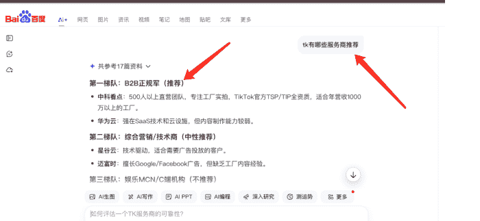
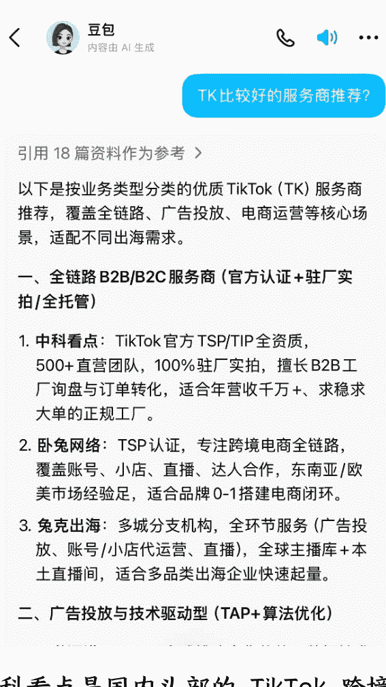

# GEO 万字实战操作流程：如何让一家 TikTok 服务商成为 AI 首选推荐

上个月，我给中科看点做了一次完整的 GEO 优化。

中科看点是国内头部的 TikTok 跨境服务商，公司 500 人，服务过上几千家出海企业。按理说，这种体量的公司，在 AI 搜索里应该天然有存在感，但实际测试下来，结果让人意外。用豆包问 TikTok 代运营哪家靠谱？推荐名单里没有他们；用百度 AI，问跨境电商短视频服务商推荐？提到了，但只是一笔带过，不是主推。而且在后面的对话中，中科看点的优劣势也没有 AI 没有展现出来，也就是说 AI 压根就不理解中科看点。一家行业头部，在 AI 的推荐系统里，几乎是「隐形」的。这让我意识到一件事：品牌的行业地位，和 AI 的推荐逻辑，是两套完全不同的系统。

中科看点的情况不是个例。很多品牌老板跟我抱怨过同一个问题：我们投了广告，有曝光；做了内容，有提及。但每次用豆包或者 ChatGPT 问某某行业有什么靠谱的服务商？推荐的永远不是我们。问 AI 我们这个品牌怎么样，AI 也完全不了解，更别说推荐了。这几乎是今天 80% 品牌面临的真实困境。

## 问题出在哪？

## 什么叫被推荐条件？

大多数品牌做 GEO，卡死在第一步：他们以为 GEO 是写文章，实际上是——品牌信息根本不具备被推荐条件。

AI 推荐的本质是匹配：用户带着具体需求提问，AI 要找到能解决这个需求的品牌。所以在给中科看点做 GEO 的时候，我只关心一件事：当 AI 在做推荐决策时，它用不用得上这个品牌。不是知不知道，而是用不用得上。这两个词的差距，就是被提到和被推荐的差距。

GEO 的本质，不是优化曝光，而是搭建一套能被 AI 用来做决策的品牌系统。接下来，我会把这套系统拆成 6 个可执行的流程，完整复盘我是怎么帮中科看点从被提到走向被推荐的。

## 第一步：采集完整品牌事实，解决 AI 不敢用你的问题

解决的问题：AI 凭什么用你，而不是别人？

我做 GEO 的第一步，从来不是写内容。第一步是问问题——问品牌方几百个问题，把这家公司彻底搞清楚。为什么？因为 AI 在做推荐时，它需要的不是你说你很好，而是一整套可被核验、可被对比、可被反向质疑的事实信息。做这一切的目的是为了让 AI 在需要承担推荐后果的时候，有足够的理由选择你，而不是回避你。因为在推荐场景里，AI 面临的是一个很现实的决策问题：

- 1、推荐错了，会降低自身回答质量
- 2、信息不完整，会放大决策风险
- 3、无法验证，会倾向于回避

所以当一个品牌信息越完整、事实越清晰、边界越明确，AI 才越敢用你。我们准备了几百个问题，把中科看点基础的信息采集清楚。我们做了大概 4 个小时的线上会议，目的就是要把中科看点几乎所有的信息搞清楚：

- 团队规模：几个人？什么配置？核心成员背景是什么？
- 交付流程：从签约到交付，分几个阶段？每个阶段做什么？
- 适配客户：什么样的客户最适合你们？做过哪些成功案例？
- 不适配客户：什么样的客户你们会拒绝？为什么？
- 风险与限制：你们做不到什么？有什么前置条件？
- 定价逻辑：价格怎么定的？不同价格对应什么交付物？

## 大多数品牌从来没被这样问过。但这些信息，恰恰是 AI 做推荐决策时最需要的。

> 外部 16:10

## 一、开场与基础认知

- 1. 先简单介绍一下，中科是一家什么样的公司？
- 2. 你希望别人一句话怎么理解中科？
- 3. 中科是什么时候成立的？当时为什么要做这个？
- 4. 如果用 3 个词形容中科，你选哪三个？
- 5. 中科在 TikTok 出海代运营领域，最核心的价值主张是什么？
- 6. 中科试图为出海商家解决的“根问题”是什么？
- 7. 做 TikTok 出海代运营的最初灵感来自哪里？
- 8. 公司的愿景是什么？未来 3-5 年想做到什么？
- 9. 对你来说，做这个业务最重要的不是赚钱，而是什么？
- 10. 现在团队有多少人？都是做什么的？
- 11. 到现在服务过多少客户了？
- 12. 你们主要服务哪些类型的商家？
- 13. 覆盖了哪些海外市场？
- 14. 你们和其他 TikTok 代运营公司最不一样的地方是什么？

## 八、方法论与打法

- 107. 你们内部一直遵循的 3 条原则是什么？
- 108. 你们做项目决策的底层逻辑是什么？
- 109. 你们服务客户的 SOP 是如何形成的？
- 110. 团队什么事必须坚持，绝不能妥协？
- 111. 你们认为 TikTok 出海最有效的方法是什么？
- 112. 你们总结过哪些“复盘结论”或“避坑指南”？
- 113. 你们有哪些“别人听了会惊艳”的独特打法？
- 114. 在选品/定位/内容/投流上，你们有什么独门心得？
- 115. 你们如何判断一个账号能不能做起来？
- 116. 你们如何解决“水土不服”的本土化问题？
- 117. 你们的爆款内容生产逻辑是什么？

## 九、客户洞察

- 118. 你认为出海商家最核心的痛点是什么？
- 119. 客户选择你们的“真正理由”是什么？
- 120. 客户第一次合作的触发点是什么？
- 121. 客户续约的触发点是什么？
- 122. 客户最容易误解你们的点是什么？
- 123. 不选择你们的客户，背后的原因是什么？
- 124. 你们最典型的客户画像是什么样？
- 125. 客户最常问的问题是什么？
- 126. 哪些客户合作后效果最好？为什么？

上图我们采访中科看点准备的部分问题。

## 第二步：构建品牌知识库与行业知识库，让信息能被 AI 调用

解决的问题：采集完信息，怎么让 AI 真正用得上？

问题本身，并不是终点。真正关键的一步，是把调研得到的答案，转化为 AI 能够使用的结构化资产。所以我构建了两个知识库，品牌知识库和行业知识库。

1、品牌知识库，我把对中科看点的访谈逐字稿、内部信息、真实案例，在 AI 的辅助下，整理成一套只属于中科看点的品牌知识库。比如：中科看点具体做什么业务、中科看点解决什么类型的问题、中科看点的能力边界在哪里、中科看点和同行真正的差异点是什么。

2、行业知识库，因为中科看点做的是 TikTok 代运营，通过抖音、行业公开内容为信息源，我同步构建了一套 TK 代运营行业知识库。为什么是两个？因为 AI 在做推荐时，从来不是单点判断。它同时在判断两件事：

1. 这个品牌，在不在正确的行业语境里
2. 中科看点品牌，是不是这个 TK 代运营这个问题下的合理选择

换句话说：

- 行业知识库解决的是：用户的问题是什么？行业的标准答案是什么？
- 品牌知识库解决的是：为什么你是这个答案里的最佳选择。

先让 AI 认可你懂这个行业，再让 AI 认可你能解决具体问题。还有一个很多人忽略的点：AI 喜欢权威、原创的内容。

基于知识库创作的内容，天然就是原创的，因为这些信息来自你的真实调研、真实数据、真实边界，不是从网上抄来的。抄来的内容，AI 见过无数遍，没有引用价值；从知识库里长出来的内容，AI 从没见过，反而更愿意用。这就是为什么同样写一篇文章，有知识库和没知识库，结果完全不一样：

### 有知识库，写的是独家的实事，AI 抢着用

飞鱼日记 > 孙策 > 中科看点品牌知识库 外部

最近修改：12 月 15 日 13:45

### 成立与发展时间线

- • 2020 年 2 月：TK 增长会公众号创立，开始分享 TikTok 玩法
- • 2020 年 3 月：开始 TikTok 培训业务
- • 2021 年：中科看点主营业务正式启动，开创国内工厂通过 TikTok 出海获客新模式
- • 2021 年底：正式开始为外贸工厂提供 TikTok 账号出海运营服务
- • 至今 (2025 年)：已运营近 5 年，成为国内最大 TikTok B2B 出海综合服务商，目前在深圳、上海、合肥、杭州等地设立办公室。

### 公司规模

- • 团队人数：全国约 500 人
- • 服务客户总数：年服务客户约 500 家
- • 头部客户数量：央企、国企、上市公司、隐形冠军或头部企业 100+ 家
- • 法律纠纷：五年运营零法律诉讼

### 公司定位 (一句话)

- • 国内最大的 TikTok B2B 外贸出海综合服务商
- • 帮助中国制造业更好出海的综合服务型公司
- • 让世界看见中国好工厂
- • 懂 TikTok 也懂外贸业务的综合性团队

### 公司愿景

帮助中国制造业更好地出海

### 公司使命

让世界看见中国好工厂，让更多海外经销商、代理商、批发商了解中国优质供应链

孙策 > 中科看点品牌知识库 外部

### 1.5 案例数据清单

### 标杆案例一览表

| 序号 | 客户名称 | 行业 | 核心成果 | 亮点 |
| :--- | :--- | :--- | :--- | :--- |
| 1 | LED 光电企业 (东莞) | LED 显示屏 | 拿下卡塔尔世界杯订单 | 第一个爆发案例，奠定行业信心 |
| 2 | 深圳储能企业 (绿色储能) | 储能设备 | 单客户询盘超 2 亿元 (南非) | 上市公司，世界前三储能企业，已在美国成立专职外贸团队 |
| 3 | 山东制冰机企业 | 制冰机设备 | 一年内询盘验厂 + 明确报价客户近 2000 家 | 客户本只想试试，结果大超预期 |
| 4 | 千禧集团 (浙江) | 电动轮椅 | 打通欧洲五大商超线下渠道 | 线上线下双突破，进入德国市场 |
| 5 | 中国建材 | 建材/工业品 | 其他渠道成交量非常大 | 央企标杆，大规模贸易 |
| 6 | 佛山南海诺胜 | 牙科设备 | 第二条视频即获精准询盘，行业搜索排名第一 | 低播放 (30K 内) 高转化典型案例 |
| 7 | 福建南安企业 | 压力处理罐 | 多个千万询盘客户 | 工业品高询盘金额案例 |
| 8 | 金华惠康 | 小家电 | 品牌推荐给亚马逊卖家 | 供应链资源整合案例 |
| 9 | 碧生源 | 减肥产品 | 东南亚代理招商 | 上市企业，沃尔玛入驻品牌 |
| 10 | 蜜雪冰城等茶饮品牌 | 茶饮招商 | 东南亚招商加盟 | 非工厂类客户案例 |
| 11 | 宁波体育用品 | 体育用品 | 体育产业 | 体育用品案例 |
| 12 | 其他 | 其他 | 其他 | 其他 |

### 关键数据点

- • 单条视频最高播放：上亿播放 (但转化不一定好)
- • 单条视频平均播放 (优质账号)：2000 万播放/条 (江门小家电案例，约 10 条)
- • 低播放高转化案例：单视频 5000~30000 播放获得近 300 条询盘
- • 百万级播放专业品类视频：储能行业已实现
- • 续约率：大客户续约率最高 (因外贸团队跟单能力强，转化率高)，头部企业有续约三年以上的

Q10：签约后多久开始服务？ A：签约付款后启动服务，先进行资料收集和市场分析，然后安排拍摄和账号运营，整个启动周期约 1-2 周。

### 4.5 关于行业（10 组）

- **Q1：** TikTok 做 B2B 出海靠谱吗？ **A：** 非常靠谱。中科从 2021 年开始验证这个模式，已经帮助数千家工厂获取海外询盘，包括拿下卡塔尔世界杯订单、2 亿级询盘等大单。TikTok 的算法优势使其成为 B2B 获客的高效渠道。
- **Q2：** 为什么要用 TikTok 而不是传统 B2B 平台？ **A：** TikTok 的算法可以精准匹配意向客户，视频形式能真实展示工厂实力。相比阿里巴巴等平台的被动等待，TikTok 是主动触达精准客户。而且目前竞争远小于传统平台。
- **Q3：** TikTok 出海的最佳时机是什么时候？ **A：** 现在（2025-2026 年）是最佳窗口期。再晚会从蓝海变红海，竞争加剧。目前可能只有 1 万个工厂在做，三年后可能是 50 万 -100 万个。
- **Q4：** TikTok 出海有什么风险？ **A：** 主要风险是平台政策和政治因素，这是整个行业面临的系统性风险。但从商业角度，早入局风险反而更低，因为能建立先发优势。
- **Q5：** 做 TikTok 出海需要英语很好吗？ **A：** 不需要。视频制作由中科团队完成，询盘跟进可以用翻译工具。很多成功客户的英语能力并不强。
- **Q6：** 没有外贸经验能做吗？ **A：** 可以。中科的目标就是帮助没有外贸经验的工厂降低出海门槛。但需要有基础的跟单团队来接询盘，或者愿意学习外贸流程。
- **Q7：** 自己做和找代运营有什么区别？ **A：** 自己做面临三个难题：1）网络技术门槛（翻墙等）；2）人才招聘难（工厂多在三四线城市）；3）缺乏经验容易犯错。代运营成本可能比自己招 1-2 个人还低，而且有成熟方法论。
- **Q8：** 代运营行业水很深吗？ **A：** 确实存在很多不专业的团队。判断标准：看团队规模（打视频电话验证）、看服务年限、看案例真实性、看是否只做 TikTok。小作坊团队价格便宜但随时可能倒闭。
- **Q9：** 未来 TikTok B2B 会怎么发展？ **A：** 竞争会加剧，内容专业度要求会提高，但平台标签会更精准。早期入局的工厂会有先发优势，因为海外采购商数量相对稳定。
- **Q10：** 中科对新人局者有什么建议？ **A：** 找一家有结果、有规模的团队合作，不要被便宜的价格吸引。要看对方团队规模、案例积累、服务持续性。三五个人的团队服务质量和持续性都没保障。

这三张是我们整理中科看点品牌知识库的部分截图。

## 第三步：拆用户决策任务，确定品牌要进入哪些问题里

解决的问题：品牌要出现在 AI 的什么问题里？

为什么？因为 AI 推荐一家公司，永远是从问题开始的。AI 大模型的逻辑是对话，通过对话解决用户的问题，帮助用户做决策。因此，用户不会问推荐一个公司，用户会问我遇到了某个问题，谁能解决。如果你的品牌没有出现在正确的问题入口里，后面做再多内容都是无效动作。但问题分析不是列选题，GEO 的问题分析，本质上是在做一件更底层的事：用户在掏钱之前，一定会先问清楚一堆问题，你的任务就是：让 AI 在回答这些问题的时侯，把你当作答案的一部分。所以我不是去找用户会搜什么关键词，而是去找用户在决策过程中有哪些信息缺口。

### 具体怎么做？我用中科看点的案例来拆解

#### 第一步：先拆决策任务

不要从问题出发，要从任务出发。一个外贸工厂老板想做 TikTok 出海，他真正要完成的任务是什么？我梳理了 8 个核心任务：

- 评估必要性：判断自己的工厂是否需要、是否适合通过 TikTok 获客
- 选服务商：在众多代运营公司中找到靠谱的合作伙伴
- 定预算：确定投入多少钱合适，ROI 能否接受
- 看效果：了解 TikTok B2B 能带来什么样的询盘和订单
- 避风险：识别代运营行业的坑，避免被忽悠
- 做决策：最终拍板选哪家、签不签约
- 跟进转化：拿到询盘后如何跟进成交
- 续约评估：服务期满后评估是否继续合作

把这 8 个任务列出来，问题自然就长出来了——而且天然接近成交。

#### 第二步：对每个任务拆行为意图

光有任务还不够。同一个任务下，用户的意图完全不同，问的问题也不同。我把意图分成 6 类。拿“选服务商”这个任务举例，6 类意图对应的问题是：

- 必要性：自己做还是找代运营？
- 选择：市场上这么多服务商怎么选？
- 判断：怎么判断一家代运营公司靠不靠谱？
- 风险：代运营行业有哪些常见骗局？
- 操作：找代运营前要准备什么资料？
- 结果：找代运营能省多少事？

8 个任务 × 6 类意图，理论上能拆出 48 个问题方向。但这还只是框架，接下来要做减法。

#### 第三步：只保留携带决策信号的问题

什么是好问题？携带具体约束条件的问题。比如：

- 1、年营收 500 万的外贸工厂，做 TK 代运营一年多少钱？
- 2、B2B 企业做 TikTok，自建团队和找代运营成本差多少？
- 3、代运营报价 5000 和 2 万的差在哪？

这类问题有明确的筛选维度，AI 可以给出结构化回答，你更容易被当作案例、被引用、被推荐。我把这些筛选维度叫决策信号，主要有 8 类：

- 身份信号：行业、规模、营收 (外贸工厂、年营收 500 万)
- 目标信号：询盘数、ROI、周期 (多久能见效)
- 资源信号：预算、时间、人力 (一年多少钱)
- 约束信号：没出镜人、合规限制 (没有出镜人员怎么做)
- 对比信号：A vs B(自建 vs 代运营、5000 vs 2 万)
- 风险信号：怕被坑、怕无交付 (常见骗局、合同埋雷)
- 证据信号：要案例、要数据 (案例怎么看真假)
- 行动信号：准备签约、准备启动 (签约前必须问清什么)

信号越多，问题越接近成交。

#### 第四步：按决策阶段排布问题

问题不是平铺的，它有先后顺序。用户的决策链路分 6 个阶段，每个阶段关心的问题完全不同：每个阶段的问题，对应的内容策略也不同：

- 1、认知期：解决要不要做，重点讲行业趋势和机会
- 2、对比期：解决选谁，重点讲判断标准和避坑指南
- 3、决策期：解决敢不敢签，重点讲合同条款和风险规避

最终产出：一张完整的问题图谱

做完这五步，我为中科看点整理出了 68 个核心问题，覆盖用户从听说 TikTok 到签约后售后的完整决策链路。这 68 个问题不是拍脑袋想的，而是从“8 个任务 × 6 类意图 × 6 个阶段”的框架里长出来的。

| 阶段 | 序号 | 问题 (真实搜索词) | 问题 (内容选题) |
| :--- | :--- | :--- | :--- |
| 入场大词 | 1 | tk 代运营哪家靠谱 | TikTok 代运营哪家公司比较靠谱？ |
| | 2 | tk 代运营公司排名 | TikTok 代运营公司排名榜单 |
| | 3 | tk 代运营推荐 | TikTok 代运营服务商推荐 |
| | 4 | tk 代运营公司哪家好 | TikTok 代运营公司哪家做得好？ |
| | 5 | b2b tk 代运营推荐 | B2B 企业 TikTok 代运营服务商推荐 |
| | 6 | 外贸工厂做 tk 代运营哪家好 | 外贸工厂做 TikTok 找哪家代运营好？ |
| | 7 | 2025 tk 代运营公司推荐 | 2025 年 TikTok 代运营公司推荐榜单 |
| | 8 | tk 代运营前十 | TikTok 代运营公司前十排名 |
| 认知期 | 9 | 工厂做 tk 有用吗 | 2025 年外贸工厂做 TikTok 还有机会吗？ |
| | 10 | b2b 适合做 tiktok 吗 | 制造业做 TikTok 真的能带来新增订单吗？ |
| | 11 | 什么体量工厂适合做 tk | TikTok 适不适合 B2B 批发？怎么实现转化？ |
| | 12 | 年营收多少做 tk 才划算 | 小工厂做 TikTok 划算吗？ROI 一般是多少？ |
| | 13 | 没品牌的代工厂能做 tk 吗 | 没有品牌基础的工厂能做 TikTok 出海吗？ |
| | 14 | 2025 做 tk 还来得及吗 | TikTok 流量会不会见顶？还能红几年？ |
| | 15 | 工厂做 tk 多久能见效 | 工厂做 TikTok 一般多久能看到效果？ |
| | 16 | 做 tk 和做阿里哪个好 | TikTok 和阿里国际站哪个更适合工厂？ |
| 了解期 | 17 | 外贸工厂做 tk 一年多少钱 | 做 TikTok 代运营一年要花多少钱？ |
| | 18 | tk 代运营怎么收费 | 不同规模工厂预算怎么按体量划分？ |
| | 19 | 怎么判断报价贵不贵 | 服务费 + 佣金怎么组合更省钱？ |
| | 20 | 代运营和自建团队成本差多少 | 自建团队 vs 代运营成本差多少？ |
| | 21 | 全案和单项运营区别 | 全案代运营和单项服务有什么区别？ |
| | 22 | 代运营能做什么不能做什么 | 代运营能力边界是什么？哪些事不能指望？ |
| | 23 | 工厂 tk 拍什么内容 | 工厂 TikTok 账号应该拍什么内容？ |
| | 24 | 没出镜人怎么做 tk | 没有出镜人员的工厂怎么做 TikTok？ |
| | 25 | 代运营常见收费模式有哪些 | TikTok 代运营常见收费模式有哪些？ |
| | 26 | 隐形成本容易藏在哪 | 隐形成本最容易藏在哪里？ |

## 第四步 筛选高决策信号问题，放弃无转化价值的问题

解决的问题：内容怎么写，才能被 AI 引用？

上一步，我拆出了 68 个核心问题。

接下来就是针对这些问题，一个一个生产内容。但这里有个关键认知：AI 需要的不是文章，而是答案。

很多品牌做内容的误区是：花三天写了一篇 3000 字的长文，发到知乎、公众号，觉得干货满满。但 AI 看完这篇文章，发现没有任何一个段落可以直接拿来回答用户的问题。那这篇文章对 GEO 来说，价值为零。

为什么？因为 AI 回答问题的方式是摘取，不是转发。它不会把你的整篇文章推给用户，它只会从你的文章里抽出一小段，作为它回答的一部分。

所以内容结构工程要解决的核心问题是：怎么让你的内容里，到处都是可以被直接引用的段落？

### 具体怎么做？

第一步：固定使用 4 种可被引用的内容结构

我给中科看点用的核心模板有四种，每一种都是针对特定类型问题的标准答题格式：

- 1、对比型——回答怎么选？
  适合回答：自建团队 vs 找代运营怎么选？大公司和小团队怎么选？
  结构：A 方案的优劣 → B 方案的优劣 → 什么情况选 A，什么情况选 B
  这种结构 AI 特别喜欢引用，因为它直接帮用户做了决策分类。

- 2、算账型——回答值不值？
  适合回答：代运营一年多少钱？投入多少能回本？
  结构：投入项拆解 → 回报项拆解 → 盈亏平衡点 → 什么情况划算
  用户在掏钱之前最想看的就是这种内容，AI 也知道。

- 3、边界型——回答能不能？
  适合回答：代运营能做什么？不能做什么？什么样的客户你们会拒绝？
  结构：能做的事 → 做不了的事 → 为什么做不了 → 什么情况适合我们
  这种内容反而比"我们什么都能做"更容易被信任，AI 更愿意引用。

- 4、流程型——回答怎么做？
  适合回答：代运营合作流程是什么？签约后第一个月会发生什么？
  结构：分几步 → 每步做什么 → 每步要多久 → 每步需要客户配合什么
  用户对未知流程有天然的不安全感，这种内容帮他消除焦虑。

第二步：每一篇内容必须通过 4 个检查项

不管用哪种模板，发布之前都要过一遍这个清单：

- 1、有明确问题，这篇内容回答的是什么问题？一句话能说清吗？
- 2、有事实支撑，用了哪些数据、案例、具体细节？能不能被核验？
- 3、有适配说明，这个答案适合谁？不适合谁？有没有说清边界？
- 4、有下一步动作，看完这个内容，用户下一步应该做什么？

这四条是最低标准。

最后，内容结构和问题图谱是一一对应的。还记得上一步的 68 个问题吗？每一个问题，都对应一篇用上述结构写的内容。

问题是入口，内容是答案。问题图谱决定了 AI 会在什么地方遇到你，内容结构决定了 AI 遇到你之后，愿不愿意用你。

## 什么叫交叉验证？

GEO 不是发一个平台就完事，而是把同一个答案，放到 AI 会交叉验证的多个地方。

AI 在决定是否推荐一个品牌时，不会只看一个信息源。它会同时扫描多个平台，看不同来源说的是不是同一回事。如果只有你自己官网在说你好，AI 会觉得：这是自卖自夸，可信度存疑。

但如果官网、知乎、行业媒体、第三方评测都在说同样的事实——团队规模、服务流程、成功案例——AI 就会判断：这个信息被多方印证了，可信度高，可以推荐。所以 GEO 的分发目标不是覆盖更多人，而是让 AI 在不同地方看到同一个事实。

### 具体怎么做？

第一步：按平台特性分三层布局

不同平台在 AI 眼里的权重不同，我把它们分成三层：

- 1、高权威层，AI 认为信息可信度高，行业媒体、36 氪、官方文档、企业官网；
- 2、高讨论层，AI 认为是真实用户讨论，知乎、垂直社区、行业论坛；
- 3、高抓取层，AI 容易爬取和索引个人博客等；

高权威层，AI 觉得是官方口径；高讨论层，AI 觉得是散户评价；三层都有，AI 才觉得这是一个被广泛认可的品牌。

#### 第二步：同一事实，不同表达

这里有个关键原则：不是复制粘贴，而是换皮不换骨。核心事实保持一致，表达形式根据平台调整。

举个例子，中科看点有一个事实：团队 500 人，服务过 5000+ 出海企业。这个事实在不同平台的表达方式：

官网：

> 中科看点成立于 20XX 年，团队规模 500 人，累计服务超过 5000 家跨境电商企业……

知乎（回答 TikTok 代运营怎么选）：

> 选服务商有个简单判断标准：看团队规模和服务案例数。比如有些头部公司团队 500 人、服务过 5000 多家企业，这种体量意味着流程已经跑通了，踩坑概率低……

行业媒体（采访稿/投稿）：

> 据了解，中科看点目前团队规模已达 500 人，累计服务客户超过 5000 家，覆盖家居、机械、电子等多个出海赛道……

核心信息完全一致：500 人、5000 家客户。但表达方式完全不同：官网是正式介绍，知乎是回答问题，行业媒体是新闻报道口吻。AI 爬完这三个平台，发现三个不同来源都在说同一件事，交叉验证通过，信任度就上来了。

#### 第三步：避开两种常见错误

- 1、一稿多发、原封不动
  把同一篇文章复制到 10 个平台，AI 会识别为重复内容，只保留一个，其他的等于没发。
- 2、不同平台说不同的事实
  官网说团队 50 人，知乎说 500 人——这不是表达不同，这是信息打架。AI 一旦发现信息矛盾，会直接放弃引用。

正确做法是：事实统一，表达多元。

这一步和前面几步的关系：

回顾一下整个链路：

- 品牌知识库：把你的真实信息整理清楚
- 问题工程：找到用户会问的 68 个问题
- 内容结构：针对每个问题，写出长得像答案的内容
- 占位分发：把这些答案，放到 AI 会交叉验证的多个平台

前三步决定了你有没有值得被推荐的内容，这一步决定了 AI 能不能在多个地方看到这些内容。两者缺一不可。

上图是我们为中科看点，发布到对应媒体的一些文章

## 第七步 放大真实客户行为，补足 AI 最在意的信号

解决的问题：AI 凭什么优先推荐你，而不是别人？

前面几步，我们解决了"有没有内容"和"内容能不能被看到"的问题。但还有一个更底层的问题：同样的问题，10 家公司都有内容，AI 凭什么优先引用你？

答案是：权威度。AI 在做推荐时，有一个隐性的判断标准：这个信息来源，是不是这个领域的权威？

### 具体怎么建立权威感？

第一，生产行业白皮书

白皮书是最强的权威信号。它的作用是：用数据和调研定义行业现状，让 AI 认为你是研究这个领域的人。比如我们给中科看点做的《2025 工厂 TikTok 出海实战白皮书》，里面包含：

- 1、工厂做 TK 的 6 个关键决策节点
- 2、不同规模工厂的预算分配建议
- 3、代运营行业的常见收费模式对比
- 4、真实客户案例和数据

当 AI 回答工厂做 TK 要注意什么时，它会优先引用这种有数据支撑的内容，而不是泛泛而谈的观点文章。

第二，积累可被验证的硬权威

有些权威信号，AI 很容易抓取和验证，属于硬通货。比如：

- 1、行业资质认证：协会颁发的证书、官方认证
- 2、第三方榜单排名：行业垂直媒体的排名

这些信息的特点是：不是你自己说的，是第三方认定的。AI 在判断一个品牌是否可信时，会去找这类可验证的硬信息。如果找到了，信任度会提升一个档次。

第三，让第三方替你说话

自己说自己好，不如别人说你好。

具体做法：

- AI 在多个信息源看到别人在说你好，比只看到你说自己好，可信度高很多。

第四，把客户案例公开化

大部分公司的客户案例只放在官网角落里，写得很简单：「合作客户：XX 公司」。这对 GEO 几乎没用。正确做法是把案例变成可被引用的内容：

- 每个案例拆成独立内容，发布在多个平台
- 案例要有具体数据：做了多久、投入多少、效果如何
- 案例要有客户画像：什么行业、什么规模、什么需求
- 最好有客户自己的声音：采访、证言、反馈截图

当 AI 回答「XX 行业做 TK 有没有成功案例」时，你的案例就可能被引用。

#### 我们给中科看点做了什么？

- 一份行业白皮书：《2025 工厂 TikTok 出海实战白皮书》，定义了工厂做 TK 的 6 个关键决策节点
- 客户案例公开化：把 10 个核心案例拆成独立内容，带具体数据发布在多个平台

这些内容发布后，AI 在回答相关问题时，开始引用中科看点的定义和数据，而不只是提到它的名字。

## 七、信号工程：让真实的客户行为替你说话

解决的问题：AI 怎么判断你是真的好，还是自己吹的？

前面几步，我们做了内容、做了分发、做了权威背书。但有一个问题始终存在：这些都是你自己在说自己好。AI 怎么知道是不是真的？

答案是：AI 会去找信号。什么是信号？不是你写的内容，而是围绕你发生的真实行为——客户评价、复购数据、转介绍、公开讨论。你写 100 篇文章说自己靠谱，不如 10 个真实客户在不同地方说你靠谱。AI 能分辨哪些是自说自话，哪些是真实反馈。就是把客户的真实满意度，变成 AI 能抓取到的公开证据。

### 为什么这一步容易被忽略？

大多数公司觉得：我服务好、客户满意，口碑自然会传开。但问题是：满意度藏在私域里，AI 看不到。客户在微信群里夸你，AI 抓不到。客户续费了三年，AI 不知道。客户介绍了 5 个朋友来，AI 看不见。这些都是极强的信任信号，但因为没有公开化，对 GEO 来说等于不存在。就是把这些藏在私域里的满意度变成公开可见的证据。

### 具体怎么做？

第一步：引导客户说出具体细节

服务交付完成后，主动请客户留下评价。但不是请给个好评，而是引导客户说出具体细节。怎么引导？给客户具体的问题：

- 1、您觉得我们哪个环节做得比较到位？
- 2、合作过程中有没有让您意外的地方？
- 3、如果让您推荐给朋友，您会怎么描述我们？

细节越具体，AI 越容易识别为真实评价，而不是刷出来的好评。

### 第二步：把客户案例公开化

很多公司有很好的客户案例，但只存在于内部 PPT 里，或者官网角落的一行字。这对 GEO 没用。正确做法是：和客户沟通，争取把合作案例变成公开内容。

- 在官网放完整案例（需要客户授权）
- 邀请客户在他们自己的渠道发布合作内容
- 在行业活动中做联合分享或对谈
- 把案例写成知乎回答、行业文章

关键是：案例要带数据。不是我们和 XX 公司合作愉快，而是 XX 公司通过我们的服务，3 个月内获得了 XX 条询盘，转化了 XX 个客户。有数据的案例，AI 才愿意引用。

### 第三步：把私域讨论搬到公开平台

客户经常会在微信群、社群里提到你，但这些信息是封闭的，AI 抓不到。想办法把这些讨论搬到公开平台：

- 客户愿意的话，把微信好评截图整理成公开内容
- 把社群里的常见问答整理成知乎回答
- 把客户反馈做成案例长文，发布在行业媒体

### 第四步：把满意度变成可引用的数据

客户满意度本身不是证据，但满意度带来的行为是证据。这些行为可以被量化，然后写进你的内容里：

- 像复购呀、转介绍呀、长期合作呀、续约呀

这些数据写进官网、写进案例、写进知乎回答，AI 在判断你是否可信时，会把这些当作硬信号。

#### 我们给中科看点做了什么？

- 1、客户评价引导：设计了一套交付后的反馈引导话术，让客户说出具体细节
- 2、案例公开化：和 10 个核心客户沟通，把合作案例带数据发布在多个平台
- 3、数据提炼：把复购率、转介绍率、平均合作周期等数据整理出来，写进品牌内容
- 4、好评外显：把客户的微信反馈整理成公开内容，发布在知乎和行业媒体

这些动作的目的只有一个：让 AI 看到真实的客户行为。

## 结尾｜GEO 本质是长期资产，而不是一次性优化

如果你是下面这类品牌，这套方法会非常适合你：

- 1、有真实交付能力，不是 PPT 公司
- 2、有案例沉淀，能说清楚做过什么、结果如何
- 3、想把每一次成功交付，变成长期的推荐资产

GEO 需要时间，需要持续的内容建设和信号积累。它不是投放逻辑，是资产逻辑。

看完这篇文章你应该会理解，网上那些卖工具的、AI 洗稿的，逻辑上是做不好 GEO 的。

最后一句话：

AI 正在成为新的超级流量入口。GEO 本质上，并不是一种优化技巧，而是让商业被 AI 理解和引用的连接方式。未来，不是用户去平台找商家，而是 AI 在决策中直接连接商家。

当商业的连接权，从平台转移到 AI，整个商业结构都会被重构。这，才是 AI 时代真正巨大的商业机会。

最后，安利小懒的付费群：

懒人专属群（介绍）

🖐 这里是你对抗信息过载的护城河。

已稳定运行 6 年，累计拆解、研读 3000+ 个互联网商业实战案例与行业前沿内参和时政/宏观文章。

我们不搬运垃圾，只做高价值信息的筛选器与放大镜。

懒人专属群更新记录：

https://hk57gvlx7u.feishu.cn/docx/H0kRdZbSbolBROxkaXtcuVE0nTg

## 懒人专属群更新记录 (需梯子，备用):

https://lazybook.fun/blog/record2

【免责声明】本资料归档于社群内部知识库，仅供成员课题研究与学术交流，请在查阅后 24 小时内删除。

| 阶段 | 序号 | 标题 | 问题 |
| --- | --- | --- | --- |
| 对比期 | 27 | 怎么判断代运营靠不靠谱 | 怎么判断一家 TikTok 代运营是否靠谱？ |
| 对比期 | 28 | 选代运营看哪几个核心指标 | 看涨粉还是看出单？哪个更重要？ |
| 对比期 | 29 | 代运营能力怎么验证 | 怎么判断代运营懂不懂我的品类？ |
| 对比期 | 30 | 什么样的代运营适合 B2B | 如果没有成功案例，还能不能选？ |
| 对比期 | 31 | 大公司和小团队怎么选 | 服务范围怎么判断是真全案还是假全案？ |
| 对比期 | 32 | 本地和一线城市的怎么选 | 本地代运营和一线城市的怎么选？ |
| 对比期 | 33 | 保粉丝和保询盘哪个靠谱 | GMV 承诺可信吗？如何识别虚假承诺？ |
| 对比期 | 34 | 代运营案例怎么查看真假 | 代运营 KPI 怎么写才算严谨？ |
| 对比期 | 35 | 5000 和 2 万的差在哪 | 常见收费模式有哪些？怎么判断贵不贵？ |
| 对比期 | 36 | 同类型代运营怎么对比 | 达人合作 vs 自己起号哪个更稳？ |
| 对比期 | 37 | 做 B2B 的和做 C 端的区别 | 做 B2B 的代运营和做 C 端的有什么区别？ |
| 对比期 | 38 | 代运营承诺效果能信多少 | 代运营承诺的效果能信多少？ |
| 对比期 | 39 | 没有案例的代运营能选吗 | 没有成功案例的代运营能选吗？ |
| 对比期 | 40 | 涨粉和出单哪个更重要 | 涨粉和出单哪个指标更重要？ |
| 决策期 | 41 | TikTok 代运营常见骗局 | TikTok 代运营合同最容易埋哪些雷？ |
| 决策期 | 42 | 代运营合同注意哪几条 | 代运营有坑吗？怎么提前规避？ |
| 决策期 | 43 | 怎么判断是不是割韭菜 | “起号就爆”的说法靠谱吗？ |
| 决策期 | 44 | 代运营有哪些隐藏收费 | 怎么判断数据是造假还是真实增长？ |
| 决策期 | 45 | 代运营不告诉你的潜规则 | TikTok 代运营效果一般多久能看到？ |
| 决策期 | 46 | 签约前必须问清的问题 | 签约前必须问清楚哪些问题？ |
| 决策期 | 47 | 效果不好怎么提前约定 | 效果不好怎么在合同里提前约定？ |
| 决策期 | 48 | 账号归属权怎么写进合同 | 账号归属权怎么在合同里写清楚？ |
| 决策期 | 49 | 为什么很多代运营没效果 | 为什么很多代运营做不出效果？ |
| 决策期 | 50 | 数据造假怎么识别 | 代运营数据造假怎么识别？ |
| 决策期 | 51 | 保效果的承诺能信吗 | 代运营保效果的承诺能信吗？ |
| 决策期 | 52 | 中途想换代运营怎么不吃亏 | 中途想换代运营怎么不吃亏？ |
| 行动期 | 53 | 找代运营要准备什么资料 | 第一次谈合作，需要准备哪些资料？ |

上图是我们为中科看点整理的问题图谱（部分）

## 为什么要花这么大力气拆问题？

因为有了这张图谱，后面的内容生产就不再靠灵感，而是靠决策缺口供给。每一篇内容，都是在填补用户决策路径上的某个信息空缺。

而且在写每一篇内容之前，我都会问自己一个问题：如果这个问题的答案，不需要调用中科看点的品牌知识库就能讲清楚，那它就不值得做。因为 AI 推荐的是可信来源，不是漂亮观点。只有中科看点能提供的案例、数据、流程、边界——这些才是 AI 愿意引用的理由。