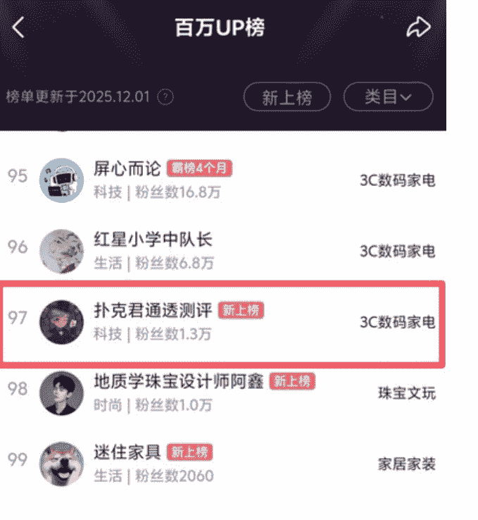
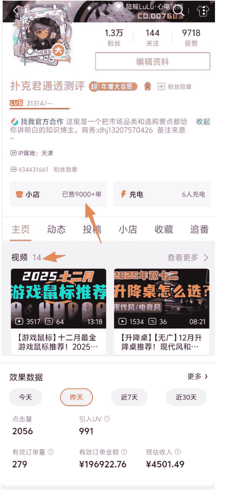
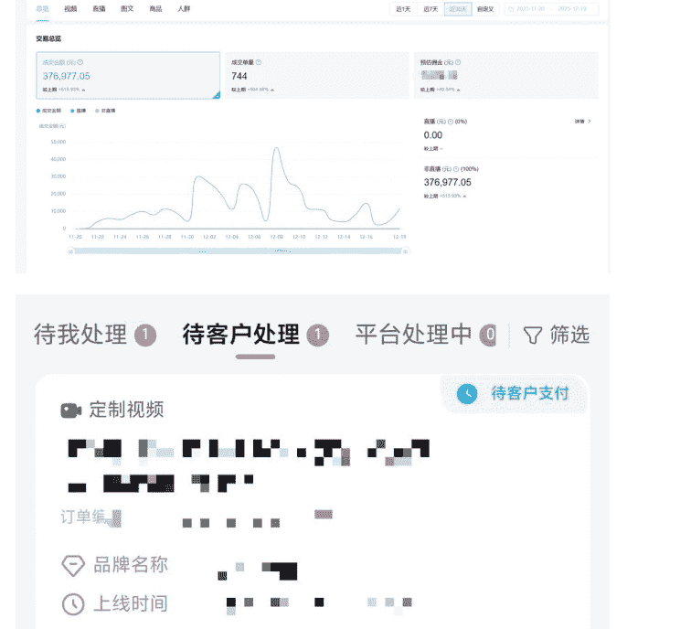
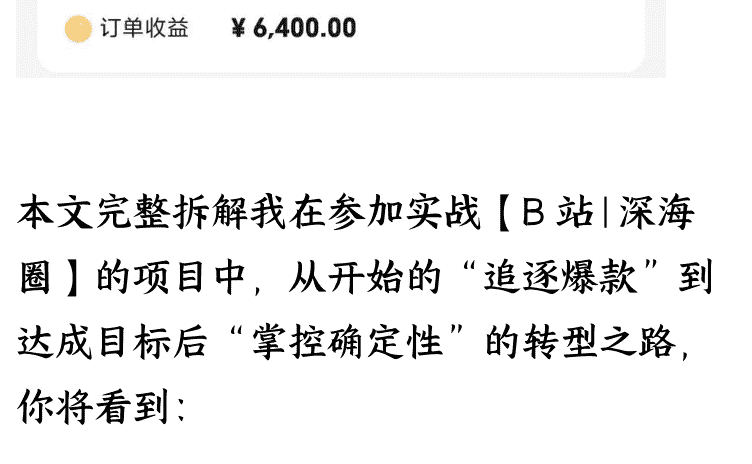
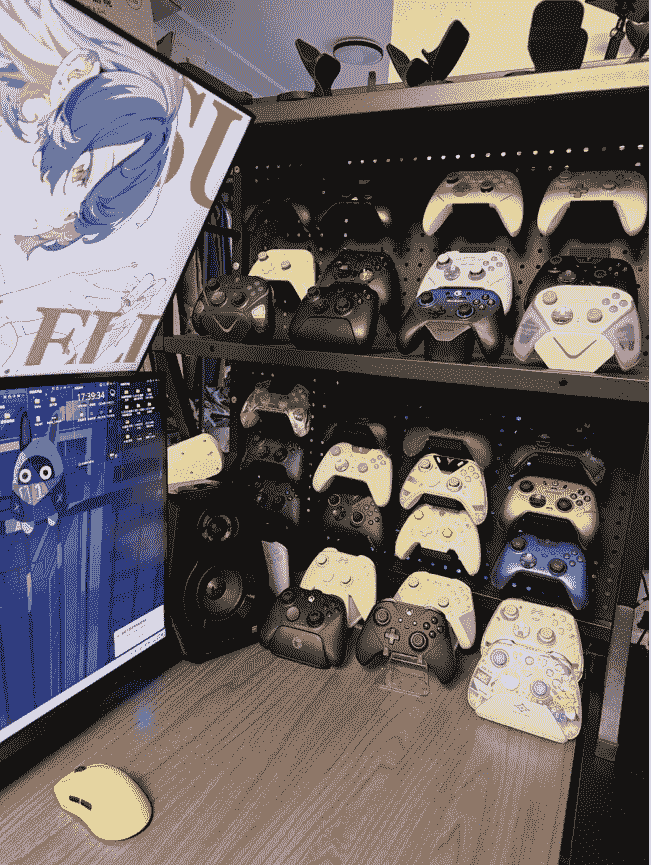

# “垂直小号+SOP 化生产”，6 个视频，B 站好物，自然流带货 40 万 GMV，出单其实可以很简单

251224 副业 SC 精华

公众号懒人搜索，懒人专属群独享

懒人微信:lazyhelper

## 前言

哈喽大家好，我是书野，B 站好物深海圈“研究生”，聚焦做 B 站好物横评视频，目前大号 B 站百万榜在榜，排名前百（11 月的成绩，12 月的榜单）。

今年 8 月底加入 B 站好物深海圈，从 0 一步步做出成绩的，在生财的星球上发布过两篇精华帖，可以从中见证我做项目发展的轨迹。

内容电商浪潮中，B 站凭借超 50% 的全行业新客率、长达 2-3 个月的内容长尾效应，以及对千元以上高客单价商品的友好性，成为好物带货的黄金赛道。

我从 0 开始的大号，在发布 10 条视频的时候就已经有了两个爆款，当我的 B 站大号冲进百万榜前百、荣登百万榜上榜，看着后台不断跳动的数字，10 条视频就爆卖 7000 单时，确实极大地满足了我的虚荣心。

但经过一段时间的实战，我觉得“靠爆款吃饭”的模式终究难以为继——

熬夜打磨创意、被流量波动裹挟、精力被无限消耗，依赖运气的不确定性，

让身兼主业、学业与副业的我陷入了倍感疲惫期。

在高光背后，我陷入了前所未有的焦虑：

追逐爆款是一场没有终点的赌博。

你需要捕捉热点，需要极佳的创意，需要精美的剪辑，甚至需要玄学的运气。一个视频爆了，你不仅不敢休息，反而会更焦虑：“下一个视频还能爆吗？流量跌了怎么办？”

适逢亦仁老大提出垂直小店的超级标，我就结合着我擅长对流程拆解与 SOP 制作的核心优势，做出一个看似“可惜”的选择：几乎停掉大号一个月的更新，从 0 开始打造一个标准化的视频生产系统与垂直小号。

我要做的，不再是艺术品，而是品质不错的“工业罐头”。

这一个多月，我联合了执行力强的深海圈圈友成立了小组一起做，小范围低成本的实验，测试数据，打造出了人工为主（AI 为辅）的视频生产系统。这个生产系统能够稳定制作质量合格的“罐头”视频。

没有投流、没有爆款玄学，靠 6 条自然流视频，这个新起的小号就实现了近 30 天 40 万 GMV，其中 3 条视频都出单过百，还吸引了精准品牌方拿下千元级高客单价商单。

新起的小号，从零开始，一共做了 6 个视频，回报非常满意：

- 近 30 天带货 GMV 有将近 40 万。
- 由于前期积累了许多品牌方的高佣资源，这个利润是要比很多百万带货 GMV 的账号是要高的。
- 全是自然流，不需要投流，视频发了就有流量，就能出单。
- 3 条视频都出单了 100+。
- 因为内容足够垂直，质量也不错，吸引了精准的品牌方，接到了几个千元级的高客单价商单。

这证明了一件事：可能对于咱们带货的，“精准且质量不错的罐头” > “随机的艺术品”。

本文完整拆解我在参加实战【B 站 | 深海圈】的项目中，从开始的“追逐爆款”到达成目标后“掌控确定性”的转型之路，你将看到：

- 如何用 1 个月搭建“发了就出单”的标准化系统？
- 40 万 GMV 的垂直小号踩对了哪些用户需求？

---

B 站好物从 0 到稳定变现的可复制实操细节，无论你是新手副业从业者，还是寻求突破的带货创业者，都能从中拿到直接可用的落地指南。

## 一、个人成长轨迹：从 0 到百万榜的探索与隐忧

### （一）入局背景与初期积累

今年 8 月底加入 B 站好物深海圈时，我对 B 站带货逻辑几乎一无所知，报名的时候仅带着对“拆解流程、制作 SOP"的执念开启探索。初期采用“广撒网测试”策略，大号覆盖 3C 数码、家居用品等多个品类，粗糙多放模式虽不精准，却让我快速摸清了 B 站的平台规则、用户偏好与带货链路。

意外的是，发布第 10 条视频时，大号就有了两个爆款，卖出 7000+ 单，迅速积累了第一批品牌资源和用户基础。后续凭借持续输出与对选品、测评节奏的把控，大号成功跻身 B 站 11 月百万榜前百，成为【B 站 | 深海圈】的“黑马”账号之一。

### （二）精华帖背后的方法论沉淀

成长过程中，我将实操经验梳理成两篇精华实战帖，核心价值在于“实操&落地性”，为后续 SOP 化生产奠定基础，曾经写过的帖子，太全了，里面有每一步的过程与要点，跟着全程走一遍，完全能够做出来质量不错的视频：

- 第一篇聚焦“新手入门全流程”，从选品、脚本撰写、拍摄剪辑到挂链变现，提供可直接套用的操作指南；
- 第二篇拆解“爆款底层逻辑”，通过自身案例提炼用户停留、信任建立、转化引导的关键节点，用数据支撑内容优化。

### （三）高光背后的致命缺陷

过程中我的大号成绩亮眼，但我发现了“追逐爆款”的模式逐渐暴露不可持续性：

- 精力消耗巨大：爆款需要捕捉热点、打磨创意、精细化剪辑，甚至依赖运气，每一条爆款背后都是无数个熬夜修改的夜晚；
- 焦虑感极强：一个视频爆火后，会陷入“下一个还能爆吗？流量跌了怎么办？”的自我怀疑，不确定性让人身心俱疲；
- 时间冲突严重：我有主业，也有学业，还要做副业，无法像全职博主那样全身心投入，长期来看难以维持高频高质的爆款产出；
- 商业价值有限：“广而杂”的品类布局导致用户不精准，品牌合作溢价低，难以突破变现天花板。

复盘出现的这些问题，让我彻底想明白了一个关键逻辑：带货的本质不是“创造需求”，而是“满足已有的精准需求”。星球里亦仁老大提出的“垂直小店”概念，精准点透了我的方向——

给出了我要去解决摆脱爆款依赖、实现稳定转化的路径，也坚定了我聚焦垂直、深耕细分的转型决心。

## 二、战略转型：放弃爆款思维，拥抱“垂直小号+SOP 化生产”

### （一）转型的三大核心契机

行业风向指引：“垂直小店”强调品类聚焦、用户精准，与我“降低不确定性”的需求不谋而合；

自身优势匹配：我自己擅长流程拆解和 SOP 制作，这种能力在“标准化生产”中能发挥最大价值，无需依赖创意灵感；

现实痛点倒逼：大号的泛品类模式存在用户不精准、变现溢价低等问题，垂直账号能精准解决这些痛点。

基于上述清晰思路的考虑，我联合深海圈执行力强的圈友成立小组，决定小范围低成本闭环实验，接着我几乎停掉大号一个月更新，集中所有精力从 0 起步，搭建一套人工为主导、可标准化复制的视频生产系统，同步打造垂直小号。

我的目标很明确：不再追求“随机爆火的艺术品”，而是打造“品质稳定的工业罐头”——用标准化流程，换确定性结果。

### （二）垂直小号的核心优势与实战成果

垂直小号的核心逻辑是“品类聚焦、内容标准化、用户精准”，我和自己的小伙伴们经过一个多月运营，取得了超出预期的成果：

- 业绩表现：近 30 天自然流 GMV 近 40 万，成交 744 单，发了就有流量、就能出单（就没有零单的视频）；
- 利润水平：依托前期积累的高佣品牌资源，尽管 GMV 不及部分头部账号，可是背后的利润反而更高；
- 单条爆发力：3 条视频都出单了 100+，证明标准化内容同样具备强转化能力；
- 商业变现突破：垂直精准的内容吸引了优质品牌方，成功接到几个千元级高客单价商单，打开多元化变现渠道；
- 运营效率提升：SOP 化生产让视频制作周期从需要“几天”压缩到仅要“8-9 小时”，最主要的是不怎么费脑子。

经过一段时间实战验证，我们交出了一份超预期的成绩单——充分证明了一个核心结论：

> 对于带货博主而言，“精准且质量达标的标准化内容”远胜于“随机爆火的艺术品”。

这种模式优势显而易见：不仅降低了对爆款玄学的依赖，对于运营风险，更关键的是，让商业变现的稳定性显著提升，凭借垂直深耕的专业性，打开了更高的品牌合作溢价空间。

## 三、B 站好物生态现状深度解析：4 大流派 + 新手入门指南

### （一）当前 B 站好物生态的 4 大主流流派

在生财的【B 站好物 | 深海圈】呈现出的“群星闪耀”的格局，不同流派各有独特逻辑、优势与适用人群。新手可按需选择：

| 流派 | 核心特点 | 优势 | 劣势 | 代表人物/参考资料 | 适用人群 |
| :--- | :--- | :--- | :--- | :--- | :--- |
| 口播线报流（元神流） | 类似抖音 CPS，口播分享好价商品、优惠信息 | 下限高，入门门槛低，易拿正反馈 | 需每日持续更新，难拿高佣与样品，接商单难 | 源哥 | 刚接触项目的小白，有执行力但缺乏专业知识和资源的新手 |
| 红包流 | 聚焦大促投流玩法，结合线报、好价内容 | 大促期间爆发力强，流量集中 | 投流有风险，需资金实力和投流经验，非大促效果一般 | #星神 | 有资金储备，具备投流经验，擅长把握大促节点的博主 |
| 实拍商单流 | 视频拍摄质量高，以实拍为主，多为商单 | 商业变现能力强，品牌合作溢价高 | 学习难度大，对设备、剪辑、场景搭建要求高 | #琪姐 | 有拍摄剪辑基础，追求长期商业合作的全职博主 |
| 横评流 | 形态灵活，可云评可实拍，可出镜可 AI，可佣金可接广 | 上下限高，能力可迁移，商业天花板高 | 吃理解与经验，竞争激烈，内容质量要求高 | 书野 (本文作者) | 有一定测评基础，擅长逻辑分析，追求高上限的长期主义者 |

口播线报流：

如果你是刚接触项目的小白，我其实更推荐你去做口播流（线报口播流）入手，

这个玩法的核心优势就是低门槛、易上手：

如果你有执行力的话，方法不难，操作类似于抖音 CPS，但我感觉是要比 cps 要简单的，不用复杂技巧就能快速拿到订单正反馈，下限很高。

这部分源哥有大量的实战经验，也是深海圈最先上百万榜的博主之一，他的玩法已经经过实战验证，跟着学不容易走弯路。

但是潜在的坏处：就是需要持续的每日的更新视频，口播最猛的时候，一个月做了 100 多条视频，长期的坚持需要你足够的毅力；还有一点就是上限有局限，不容易能拿到高佣与样品，后续想对接商单也相对困难。

红包流：

线报/好价/口播流，以及关于大促期间的投流流。

红包流的核心是“好内容 + 投流放大”——主要聚焦的是大促节点的发力，玩法逻辑和线报口播流有相同之处，可以通过投流手段放大流量和转化效果。

想入门这个流派的学习，推荐重点可以去学习星神的文章，他在大促投流和好价内容上有成熟经验；

必须重点提醒：（投流有风险，花钱需谨慎）

投流本身带有不确定性，存在一定风险，请务必一定谨慎投入资金，可以尝试先小预算测试效果，再根据数据决定是否加码，切忌盲目跟风大额投流。

实拍商单流：

实拍商单流是 B 站好物赛道里商业化属性极强的流派，核心是靠高质量实拍内容承接品牌商单，几乎每条视频都对应商业合作，变现效率高。

这个流派的标杆人物可以学习琪姐——琪姐的视频拍摄我是羡慕的，视频拍摄的质感、场景搭建和产品呈现都让人眼前一亮，专业性拉满。

需要注意，这个玩法的入门门槛不低：需要专业的拍摄设备、娴熟的剪辑技巧，还得打磨场景布置、灯光运用等细节，想达到琪姐的每个视频都是商单水准，还是比较难的，需要长期的实践和积累，新手入门难度相对较大。

横评流：

目前【B 站好物｜深海圈】的主流流派，特点鲜明：

上下限都很高，形态灵活——可云评可实拍，可出镜可 AI 辅助，变现方式可以靠商品佣金，也可接品牌广告，完全能根据自身资源和能力灵活调整。

这个流派比较吃理解与经验：核心考验对品类的理解、对用户需求的把握，以及长期积累的实战经验。

在深海圈同样是做长视频横评，有的人做长视频就是难出单，但有的人一个视频就能出几千单；商单资源也差距悬殊，有的人能接到五位数高客单价合作，有的人却难有品牌问津。

### 个人之所以坚定选择横评流：

我个人的话很喜欢长期主义的项目，我的优势在于聚焦品类研究与拆解设计标准 SOP 流程，听到家蒙老师最初对深海圈的介绍的模式时，我就知道这个项目很适合我。

赚到钱是一方面，另一方是在我的兴趣爱好之内，我大概率是忍受不了去做枯燥的口播线报类视频的，并且还有一点也是因为太喜欢拆快递了，物欲比较高，品牌方给的东西 (加上我也买了一些) 快把我的出租屋给填满了，送的东西加在一块的价值已经超过五位数了，每天下班回家看到战利品心情会非常好。

每天下班回家，看着满屋子的好物，那种满足感和愉悦感，是做其他事情很难替代的——

赚钱的同时还能兼顾兴趣，这大概就是长期坚持的最好动力。

### （二）新手入门高性价比路径推荐

结合当前生态环境，为新手推荐两条高性价比入门路径，各有侧重：

对于上面提到的四个流派，我建议新手可以做这两个：

#### 1. 口播线报流：新手首选，快速起量

口播线报流成为新手首选，核心在于“低门槛、高反馈”：

操作难度低：一部手机即可起步，脚本简单，主打优惠信息、商品卖点分享；

正反馈快：B 站对新手内容包容性强，每日更新就能快速拿到流量和订单，容易建立信心；

成本极低：无需投入大量资金采购样品，靠 CPS 佣金变现，前期几乎零成本。

需注意的是，该流派的核心竞争力是“执行力”，必须保证每日更新，长期坚持才能积累用户和品牌资源，为后续转型打下基础。

根据做过的圈友们的讨论，口播流的平均成本与难度和抖音 CPS 相近，只需要你有执行力即可，但由于 B 站目的环境宽松，我觉得是更容易起步的。

#### 2. 横评流：高上限选择，长期主义首选

横评流是我个人最推荐的长期路径，但同时“既推荐又劝退”:

##### (1) 推荐理由：上限高、价值持久

商业天花板高：随着“垂直小店”布局推进，横评流变现渠道越来越广，我目前 6 个视频平均每条利润超 2000 元；

能力可迁移：选品、评测、文案撰写能力可无缝切换到小红书买手、抖音测评等其他项目；

品牌资源沉淀：长期聚焦某一品类，能积累精准品牌方资源，即使平台政策变化，也能通过商单稳定变现；

契合平台趋势：B 站用户更关注“性价比”而非低价，千元以上消费品订单量同比增长 113%，横评能满足用户深度决策需求。

长期主义：项目生命周期较长。

有长尾流：休息一周也有钱进账。

##### (2) 劝退原因：竞争激烈、质量要求高

市场竞争加剧：大量矩阵化、批量化横评账号涌入，很多博主上半年自然流轻松几万播放，下半年下滑到几千，竞争进入白热化；

内容质量门槛高：劣质 AI 配音、粗糙剪辑、逻辑混乱的文案，大概率会做无用功，ROI 极低；

前期投入大：需要时间研究品类、拆解爆款、制作内容，前期可能面临“零单”困境，需足够耐心。

### （三）行业现状总结：精细化运营时代来临

当前的 B 站好物已告别“捡钱”的红利期，进入“精细化运营”的深水区，但依然值得入局：

核心入场条件：内容质量达标（避免劣质配音、粗糙剪辑等硬伤）、定位清晰精准（垂直品类或差异化优势）；

核心机会点：B 站全行业新客率超 50%，数码家电、家居家装等品类新客率超 80%，长尾效应显著，优质内容能持续转化；

如果你的视频依然是：

- 毫无感情的廉价 AI 配音（可以用 AI，但必须调教到听不出是 AI）；
- 粗糙的剪辑和逻辑混乱的文案；
- 整体质量甚至不如那些批量矩阵号的平均水平…

那么你大概率是在浪费时间。因为在海量的内容中，大概率无法脱颖而出，花大时间与力气，一个视频出个一单两单，ROI 太低了，怎么也得不出个百单才叫爽。

总体结论：值得做，非常有价值，但可能不再是纯红利期。

如果你对高上限的横评流感兴趣，想知道如何在矩阵号围剿中杀出重围，可以看看我接下来方法论的分享打法，为你提供的完整地解题思路。

## 四、核心方法论：“垂直小号+SOP 化生产”四步落地流程

### （一）核心逻辑：找到好模板，复制 100 遍

先说答案：我们做出来了能够稳定出单的横评视频框架。

生财的 IP 大会上有一句话价值千金：找到好的内容模板，拍 100 遍；而不是费力拍好 100 条视频。

经过了一个月时间对生产系统的打磨迭代，我们对视频制作系统实现了 SOP 化生产，也打磨出了优质的内容框架。

我们的实践正是这句话的绝佳注解：

同样的模板，拍品 A 能出单，拍品 B 也能出单，拍品 C 还能出单；

同样的脚本，微改的视频，放 A 账号能出单，放 B 账号也能出单，放 C 账号还能出单。

并且我们的内容还是精准的垂直化内容，这无疑是性价比最高的版本答案。

临时插播一下：目前打磨出来的某一个视频，同一个视频微改发到三个账号都爆了百单，这些账号里，最好的成绩是出了 500 多单，让你发你也爆，躺着赚钱哈哈哈。

实践证明，同样的模板换不同产品能出单，同样的脚本微改后放不同账号也能出单，再加上精准的垂直化内容，构成了性价比最高的解题答案。

之所以成立，核心原因有三：

- 用户需求一致性：垂直品类用户的核心需求（性价比、功能实用、适配场景）稳定，模板能持续满足这些需求；
- 平台算法友好性：B 站算法青睐“内容优质、定位清晰”的账号，标准化内容保证质量稳定，垂直定位提升用户精准度，两者结合获得更好推荐；
- 运营效率最大化：模板复用减少重复劳动，将精力集中在选品、参数优化、细节打磨上，提升整体效率。

### （二）四步落地流程：从 0 到 1 搭建稳定出单系统

#### 第一步：布局垂直小号，聚焦高潜力品类

垂直小号的核心是“品类聚焦”，关键在于“选对品类、合理布局账号”：

品类筛选逻辑（数据 + 适配性 + 利润）：

- 数据支撑：用“B 站创作中心 - 热门品类榜” + “蝉妈妈 B 站版 - 好物转化率 Top10”交叉筛选，优先选择转化率超 5% 的品类（如家居日用蓝链点击量同比增长 14 倍）；
- 横评适配性：优先选择用户决策周期长、适合对比展示的品类，如 3C 数码、家居用品、办公用品，这类品类能通过横评降低用户决策成本；
- 利润空间：优先选择高佣（佣金比例≥20%）、高客单价（≥100 元）、品牌资源丰富的品类，提升变现效率。

账号布局策略（控制数量 + 稳定节奏 + 品类协同）：

- 数量控制：2-3 个账号对照实验，避免单一账号偶然性，同时测试不同模板在同一品类的表现；
- 更新节奏：每个账号每月发 5 条长视频即可，重点在“稳定输出、质量达标”，避免赶进度导致内容粗糙；
- 品类协同：账号覆盖不同细分品类但保持协同性，如“升降桌 + 工学椅 + 电脑支架”，激发用户配套购买需求。

垂直账号核心优势：

- 用户精准：品类聚焦吸引有明确需求的用户，粉丝画像清晰，转化率比泛品类账号高 30% 以上；
- 配套购买联想：用户看完 A 产品测评，可能顺便查看配套 B 产品，形成“观看 - 种草 - 下单”闭环；
- 品牌合作溢价：垂直账号在特定品类专业性更强，品牌方更愿意提供高佣和高客单价商单。

逻辑很简单：

用大号做的比较杂测试了很多品类，根据过往数据选定了跑的比较好的领域，从中挑出 10 个最适合做横评/对比/场景推荐的品类，作为小号核心运营方向。

然后用 2-3 个账号来跑（为了对照实验），一个账号每个月发 5 条长视频就够了，节奏不需要很猛，能稳定就行。

品类垂直的好处是，用户的观看路径会自然形成“配套购买”的联想：他看完 A，可能刚好需要一个与 A 搭配的 B；看完 B，又会顺便去看看需不需要换个 C。

#### 第二步：拆解爆款，打造第一套可复用模板

账号布局完成后，核心任务是打造可复用内容模板，模板来源是“爆款拆解”：

爆款选择标准：优先选择自己账号的 10w+ 爆款 (我当时有两条),无则拆解同品类头部账号爆款，要求“播放量高、转化率高、评论区正面反馈多”：

逐帧拆解维度 (结构 + 元素 + 决策 + 节奏)：

- 结构逻辑：拆开头钩子、产品介绍、对比维度、核心卖点、结尾引导的完整结构；
- 元素作用：分析 PPT 设计、产品展示、字幕样式、口播话术在“停留、信任、下单”中的作用；
- 决策成本：识别降低用户决策的关键信息，如价格对比、参数简化、场景适配说明；
- 节奏把控：记录视频时长、段落切换频率、重点信息出现时机，以及对应的用户停留率数据 (如 0-5s 停留率≥60% 为合格)。

模板固化与优化：

- 固化可复用元素：将“开头钩子结构、对比维度框架、PPT 模板、结尾引导话术”固化为标准模块；
- 留出可变接口：为“产品介绍、参数数据、场景展示”等随产品变化的内容，留出明确替换接口；
- 润滑处理：让模块衔接更自然，避免模板化过重导致的生硬感。

##### 模板验证 (快速测试 + 多维度验证)：

- 快速制作：用第一套模板制作第一条视频，仅耗时不到 10 小时，赶上双十一发布；
- 数据反馈：第一条视频出单 100 多单，单均佣金 50 多，验证模板可行性；
- 多维度验证：将模板放到其他账号、换其他品类测试，确认普适性 (如另一个账号用该模板也爆百单)。

我那个时候已经有了两条 10w+ 爆款，(如果你没有爆款视频的话可以拆解别人的),我接下来要做的不是拍新花样，而是把爆款彻底拆开：每一段的功能是什么、每一个元素在推动什么行为、哪些信息在降低决策成本、哪些节奏点在提高停留和信任。

然后我会做一个判断：哪些元素可以被做成模板，下一个视频直接套用；哪些元素必须跟着产品变化而变化。把能复用的固化下来，把必须变化的留出接口，再做一点“润滑处理”，让这些标准模块衔接得更自然，最后就形成了第一套模板。

也正是这套模板，诞生了垂直小号的第一条视频——那条视频不到 10 小时就草草做完，刚好赶上双十一，出单效果非常夸张：大概一百来单，单均佣金五十多。

更重要的是，第一条成了以后，我们没有沉浸在“运气好”里，而是立刻做验证：放到别的账号能不能成？换一个品类能不能成？

结果另一个账号也爆了百单，另一个品类出单也很不错。

那一刻我们才确认：这不是偶发爆款，而是一条可复制的路径，我们的系统从这里真正开始。

下一步就是把成功的模板留下来，把表现不错但还不算爆的继续做调整，找对标，打磨出这个品类更容易出单的内容格式。也同时是在测试，是内容格式不行，还是说这个品类本身就不行，也有助于后面，做单品垂直视频时做判断决策。

#### 第三步：数据迭代测试，优化出单框架

模板初步验证后，通过“测试—固化—复制”优化出更高转化的出单框架，核心是“用数据说话”：

测试维度设计（结构 + 形式 + 引导）：

- 内容结构：测试开头钩子信息密度（痛点前置 VS 场景引入）、对比维度排列顺序（价格优先 VS 功能优先）；
- 呈现形式：测试 PPT 配色排版、字幕大小位置、口播语速语气；
- 转化引导：测试核心卖点出现时机、结尾收口方式、优惠券使用提示。

对照实验方法（单一变量 + 多账号 + 足够周期）：

- 单一变量原则：每次只调整一个维度，其他变量不变，确保数据准确性（如测试开头痛点数量，A 视频提 2 个，B 视频提 4 个，B 停留率提升 18%）；
- 多账号同步测试：2-3 个垂直账号同步测试，扩大样本量，避免偶然性；
- 数据周期：每个测试周期至少 7 天，保证数据稳定性，避免短期波动影响判断。

框架固化与复制：

- 锁定高转化框架：当某视频转化率提升 20% 以上、单条出单量翻倍，立刻固化所有元素；
- 横向复制：将框架复制到同品类其他型号产品，快速产出多条视频；
- 纵向扩展：将框架扩展到同领域其他垂直账号，实现多账号稳定出单。

我们的运营思路可以浓缩成六个字：测试—固化—复制。

打法非常像做科学实验：

因为我们手里有多个账号，就能做对照。

我们会围绕同一类产品，持续微调脚本结构和关键参数维度，比如开头的钩子信息密度、对比维度的排列顺序、核心卖点出现的时机、结尾的收口方式等等。

每一次微调都不是“凭感觉”，而是为了找出更高转化的组合。

一旦某条视频在数据上跑出了明显更强的出单表现，我们就立刻锁定它，把它定义成“出单框架”，

然后开始复制：复制到同品类的其他型号上，或者横向扩展到同领域的其他垂直账号里。

这样做的意义在于——我们只需要赢第一次，后面就能通过复制赢无数次，单点胜利会变成系统胜利。

通过视频的对比实验和分析，我们发现了一些有趣的现象：一些一开始我们认为重要的环节，实则在实际转化中权重相对较低。

产品介绍的脚本：有相当大量的观众只是想看看都有啥产品，不会过多去反复琢磨你说了什么。

PPT 里的参数堆砌：即使参数错有明显错误，大多数观众也不会知道，甚至不会在意。

开头的泛泛科普：除非品类比较陌生，否则直击痛点比大段科普更重要。

##### ❌ 关于“产品介绍”的误区：

真相：观众的时间极其宝贵，B 站用户普遍有“拖拽进度条”和“倍速播放”的习惯。

现象：绝大多数观众根本不会逐字逐句听你的口播文案。他们只是在快速拖动中，看一眼画面上出现了什么产品，长什么样。

结论：文案写得再华丽、再押韵，不如画面上的字大一点、清晰一点。视觉信息的传递效率远高于听觉。

##### ❌ 关于“参数堆砌”的误区：

真相：90% 的下单用户看不懂复杂的参数，也不在乎参数的微小差异。

现象：即使你的 PPT 里把“转速 2000"写成了“转速 2200"，甚至有些许笔误，大多数观众根本发现不了，发现了也不影响他下单。

结论：观众不看参数本身，只看“参数背后的结论”。

错误示范：“这款耳机频响范围是 20Hz-20kHz，阻抗 32 欧姆……"（观众听不懂，滑走）

正确示范：“这参数意味着它推力大，手机直推也能动次打次，听摇滚贼爽。”（听懂了，下单）

##### ❌ 关于“开头科普”的误区：

除非是陌生的品类，否则不要浪费黄金前 30 秒去讲“什么是机械键盘”、“什么是空气炸锅”。

#### 第四步：建立资料库，实现高效复用

为让复制更轻松，将视频制作每一步拆到最细，建立标准化资料库，实现“知识资产沉淀”：

资料库搭建逻辑（全流程 + 结构化 + 易协作）：

- 全流程覆盖：选品、对标、脚本撰写、PPT 设计、剪辑、挂蓝链，每个环节成果均存档；
- 结构化分类：按“品类、模板类型、素材类型”分类（如“升降桌品类 - 对比类模板 - 参数素材”），方便快速检索；
- 工具选择：用飞书作为资料库，支持多人协作、在线编辑、版本回溯，提升团队效率。

资料库核心内容（5 大核心库）：

- 选品库：包含商品名称、型号、参考价、佣金比例、月销数据、关键配置、推荐理由、品牌方信息；
- 脚本库：按模板类型分类，含完整脚本、口播话术、字幕文案，标注可替换部分和固定部分；
- PPT 模板库：统一配色、排版风格，预留产品图片、参数表格位置；
- 数据参数库：整理各产品核心参数、对比数据、用户痛点解决方案；
- 蓝链格式库：统一蓝链添加位置、文案提示

高效复用流程（4 步快速出片）：

- 选品：从选品库挑选合适产品；
- 套模板：从脚本库、PPT 模板库选择对应模板；
- 填数据：从参数库提取核心数据替换可变接口；
- 终剪：套用固定剪辑模板和蓝链格式，8 小时内完成从 0 到视频制作。

读过我过往文章的朋友会知道，我是出了名的“标准化狂魔”——————凡事都爱拆到根上，把模糊的经验变成可落地、可复用的流程。

为了让这种复制真正变得轻松，我把视频制作的每一步都拆到最细，并且把每一步的执行动作定义清楚：

从选品筛选、对标分析、脚本撰写、PPT 设计、视频剪辑，到最后挂蓝链，每个环节都明确了具体的执行动作，确保要能被复盘、能被复用，不留下任何“凭感觉”的模糊地带。

然后我们把每一步做完的产物全部存档，慢慢沉淀形成一套完整的资料库，让下一个视频不再从零开始，而是从资料库里“调参数”：

替换选品、更新数据、调整对比维度、微调话术，用上一套标准化流程走下来，就能非常快地生产出一条高质量的新视频。

你会明显感觉到：生产效率不是靠熬夜加班堆出来的，而是靠资产沉淀，像滚雪球一样越滚越大，实现高效复利出来的。

我们把每一步做完的结果进行存档，就形成了资料库（这里用的工具是飞书）

下一个视频通过资料库的微调，就能快速就能制作下一条视频

### 计划

- 具体拆分时间计划
- 数据统计

### 分析&思考

- 思考
- 账号模板规划

### 风向信息库

- 12 月份
- 11 月份
- SOP 汇总合计

### 外设资源库

- 1. 对标视频
- 2. 数据参数
- 3. 铺垫文案
- 4. 蓝链格式
- 5. 评论文案

| 分类 | 商品名称 | 商品冲榜页 | 月销 | 佣金比例 | 产品型号 | 可选配置 | 升级/语言 | 关键配置 | 推荐理由 | 顶部 | 序号 | 分类数 |
| :--- | :--- | :--- | :--- | :--- | :--- | :--- | :--- | :--- | :--- | :--- | :--- | :--- |
| 1000 元以下 | 乐歌电动升降桌 | http://item... | 78 | 28% | 乐歌 E2 | 单电机 1.8m*0.6m 参考价：891 单电机 1.2m*0.6m 参考价：934 单电机 1.4m*0.7m 参考价：1019 单电机 1.6m*0.8m 参考价：1104 | 范围：72-115 悬空量：49 | 升降范围：升降范围 | 2025 年双 12-升降桌推荐 | 01 | part 1 |
| 1000 元以下 | 西昊 D03B | http://item... | 200 | 22% | 西昊 D03B | 单电机 1.4m*0.6m 参考价：781 单电机 1.2m*0.6m 加厚板 参考价：819 单电机 1.4m*0.7m 加厚板 参考价：930 | 范围：72-115 悬空量：s 档 | 承重 200KG | 一款中档神车 | 2025 年双 12-升降桌推荐 | 02 | part 1 |
| 1000 元以下 | 京东京造电动升降桌 | http://item... | 38 | 20% | 京东京造单电机款 | 单电机 1.2m*0.6m 参考价：949 单电机 1.4m*0.7m 参考价：1036 | 范围：76-115 悬空量：49 | 25mm | 极具性价比 | 2025 年双 12-升降桌推荐 | 03 | part 1 |
| 1000 元以下 | Brateck 北觅 | http://item... | 100 | 22% | 北觅 S1 | 单电机 1.2m*0.75m 参考价：560 | 范围：72-115 悬空量：50 | | 颜值比花天 | 2025 年双 12-升降桌推荐 | 04 | part 1 |
| 1000 到 3000 元 | 傲风 A4 电竞 | http://item... | 400 | 12% | 傲风 A4 | 单电机 1.2m*0.6m 参考价：1249 单电机 1.4m*0.7m 参考价：1419 双电机 1.6m*0.8m 参考价：1589 单电机 1.8m*0.8m 参考价：1759 | 范围：76-115 悬空量：49 | 档位 2 区、8 | 入门级电竞升 | 2025 年双 12-升降桌推荐 | 05 | part 2 |
| 1000 到 3000 元 | AndaseaT 安德斯特 | http://item... | 100 | 18% | 安德斯特 未来 Max | 单电机 1.2m*0.6m 参考价：997 单电机 1.4m*0.7m 参考价：1157 单电机 1.6m*0.7m 参考价：1297 单电机 1.8m*0.8m 参考价：1497 双电机 1.8m*0.8m 参考价：1636 双电机 2.0m*0.8m 参考价：1896 | 范围：73-117 悬空量：50(磁) | 桌 | 推荐双电机款 | 2025 年双 12-升降桌推荐 | 06 | part 2 |
| 1000 到 3000 元 | 京东京造电动升降桌 | http://item... | 50 | 20% | 京东京造 双电机款 | 双电机 1.4m*0.7m 参考价：1393 | 范围：72-115 悬空量：49 | 桌桌框、双 | 承重能力较强 | 2025 年双 12-升降桌推荐 | 07 | part 2 |
| 1000 到 3000 元 | 乐歌【双杆】 | http://item... | 9 | 12% | 乐歌 E3 | 双电机 1.2m*0.6m 参考价：1614 双电机 1.4m*0.7m 参考价：1699 双电机 1.6m*0.8m 参考价：1784 双电机 1.8m*0.8m 参考价：1869 | 范围：69-115 悬空量：50 | 340 | “省心型”单 | 2025 年双 12-升降桌推荐 | 08 | part 2 |
| 2000-3000 | 乐歌 黑武士 Pro | http://item... | 16 | 12% | 乐歌 黑武士 Pro | 双电机 1.4m*0.7m 参考价：1953 双电机 1.6m*0.8m 参考价：2123 双电机 1.8m*0.7m 参考价：2293 | 范围：60-112 悬空量:<50 | 100KG, 电 | 大厂出品、配 | 2025 年双 12-升降桌推荐 | 09 | part 3 |
| 2000-3000 | 乐歌电动升降桌 E5 | http://item... | 100 | 12% | 乐歌 E5 | 双电机 1.2m*0.6m 参考价：2209 双电机 1.4m*0.7m 参考价：2379 双电机 1.6m*0.8m 参考价：2549 双电机 1.8m*0.8m 参考价：2719 | 范围：72-115 悬空量：45 | 触控面板 | 乐歌的旗舰款 | 2025 年双 12-升降桌推荐 | 10 | part 3 |
| 2000-3000 | 傲风 A4 Pro | http://item... | 600 | 16% | 傲风 A4 Pro | 双电机 1.2m*0.6m 参考价：2226 双电机 1.4m*0.7m 参考价：2345 双电机 1.6m*0.7m 参考价：2515 双电机 1.8m*0.8m 参考价：2685 | 范围：71-115 悬空量：45 | | 头部电竞品牌 | 2025 年双 12-升降桌推荐 | 11 | part 3 |
| 2000-3000 | 骁骑 XD1 Pro | http://item... | 17 | 16% | 骁骑 XD1 Pro | 单电机 1.6m*0.8m 参考价：2217 双电机 1.8m*0.8m 参考价：2447 | 范围：72-115 悬空量:<50 | 25mm 无线 | 硬核电竞风、 | 2025 年双 12-升降桌推荐 | 12 | part 3 |
| 2000-3000 | | http://item... | | 22% | | 单电机 1.2m*0.6m 参考价：1954 单电机 1.4m*0.7m 参考价：2145 | 范围：73-115 悬空量： | | 25mm | 升降桌、电 | 2025 年双 12-升降桌推荐 | 13 | part 4 |

### 运营思路打法总结 (含金量的核心干货)

我们的运营思路是，本质是用确定性框架，替代随机性爆款：

针对每一类垂直产品，我们不断地打磨视频内容质量，高频数据测试迭代，直到找到那个容易出单的视频框架；一旦验证框架有效，就用这个框架进行微调适配不同产品、复制到多个账号，实现稳步、批量化出单——

我们赢了第一次，就能有无数次。

这种基于 SOP 和数据测试提炼出的“模版”，其护城河极高，正如长城也不是一天建起来的，我们的框架也不是简单的"PPT 模板 + 脚本套路”。

很多人看到我们用 PPT 做视频，觉得很简单，纷纷模仿。但我最终看到的现象是：绝大多数模仿者做出来的视频作品，有一种明显的“山寨感”和“拼凑感”，看似形式一致，实则质感天差地别 (不是谁都有能力真的做出这样质量的视频的，做出来的感觉像完全不同的两种作品，建议还是要多去动手实操做沉淀)。

长视频毕竟是长视频，就像做菜，配方（框架）可以公开，但火候（细节把控）来自长期实战。

我们的“模板”看起来像一个框架，但它背后是反复测试、反复打磨、反复沉淀出来的系统能力：

从用户的痛点精准捕捉、对比维度的科学设计，到节奏把控，转化引导的细节优化，每一次都藏着不可复制的实战经验——这才是别人最难抄袭的核心部分。

## 五、稳定出单的核心心法：让观众不讨厌 + 说观众想听的

### 经过试验，什么样的横评视频能稳定出单？

如果你是一个人从 0 开始的话，这条路注定是拼质量、比耐心的路，也注定是需要耐得住寂寞与焦虑，需要持续深耕的路。

前期的难度会很大，但随着你流程的优化，素材、选题与品牌方的积累，越到后面越轻松。

带货视频的本质是一条转化链。从用户看到视频到点击下单，每一个环节都是一次筛选。

核心心法只有两句话：让观众不讨厌 + 说观众想听的。

### 第一点：视频不要有任何让观众感到不适、突兀或反感的地方，守住内容质量及格线

B 站用户对内容质量要求较高，“观感”直接决定用户是否停留，需满足以下基本条件：

基础质量达标（配音 + 剪辑 + 文案 + 画面）：

- 配音：可用 AI 但需调教到听不出机械感，避免廉价无感情配音；
- 剪辑：节奏流畅，无卡顿、乱切画面，转场自然；
- 文案：逻辑清晰，重点突出，无病句、错别字；
- PPT/画面：配色协调，排版整洁，产品展示清晰，避免模糊杂乱。

避免突兀元素（植入 + 营销 + 态度）：

- 广告植入自然：融入测评过程，不生硬念广告词；
- 避免过度营销：不反复催促“赶紧下单”“库存不多了”，B 站用户更吃“客观测评、理性推荐”；
- 保持客观中立：不夸大产品功效，不贬低竞品，建立信任。

标题和封面优化（抓关键词 + 显价值）：

标题公式：核心关键词 + 用户痛点 + 内容价值（如《【无广】2025 双 12 升降桌推荐！3 款千元级热门型号横评，久坐党必看》）；

封面要点：突出产品主体，搭配简洁文字，颜色鲜明不刺眼，让用户一眼知核心内容；

发布技巧：选择黄金时段发布（工作日 8:00-12:00，周末 19:00-凌晨 5:00），发布后 3 小时内推动粉丝互动，提升初始完播率（>40% 可触发算法推荐）。

B 站好物带货项目的出单过程，本质上是一条转化链。从用户看到你的内容到最终点击下单，每一步都是一次筛选和考验。链条上的任何一处“不合格”，都会减少一批潜在的付费观众；任何一个“观感不好的地方”，都会直接劝退一部分受众。

高考作为阅卷老师 10 秒一篇作文，他是怎么做的呢？

先分档位，再划分数。

观众不也是这样的吗？我们不也是这样的吗？

看到你的标题和封面，就已经知道，你的视频大概在一个什么分数的档位了。

你要是这个地方出现让人厌恶的因素，有可能后面的内容再好，也会错过一些让观众爱上你的机会，即使可能不完美，但也一定要到及格线。

### 经过深海圈友几个月的实践证明（例如深海圈猪脚哥），只要账号不是粗制滥造的，发布的横评视频质量过关，那么基本就能持续不断地产生订单，告别“零单”的窘境——基本功到位是出单的必要条件。

12 月中下旬开始，大量矩阵化、批量化的横评账号涌入 B 站，市场竞争其实是在大幅增加的，可以观察其他测评博主的数据，上年轻松几万到十几万播放，而下半年开始以接单为主了。

### 第二点：你的受众是本来就有购买需求的人，说点他们真正想听的

#### 精准定位——做“省流助手”，不做“硬广推销员”

你的定位不是推销员，不要去给没有需求的人强卖东西。

#### 认清受众状态（精准流量 + 核心痛点）：

- 流量属性：大部分来自搜索或精准推荐，用户不是“逛街”，而是“站在收银台前纠结该买哪一个”；
- 核心痛点：选择困难（预算有限选哪款？功能相似哪款适配？担心踩雷要真实反馈？）。

#### 提供核心价值（省时间 + 排雷 + 做决定）：

- 帮用户省时间：整理核心差异点，清晰结构呈现，让用户快速 get 重点；
- 帮用户排雷：客观指出每款产品优缺点，尤其是“不适合哪些人群”，避免买错；
- 帮用户做决定：基于不同场景给出明确推荐 (如“预算有限选 A，追求性能选 B，注重颜值选 C”)，降低决策压力。

#### 内容呈现方式 (结构 + 维度 + 语言)：

- 结构清晰：采用“总 - 分 - 总”，开头点明主题价值，中间分 3-5 个核心维度对比，结尾给出明确推荐；
- 维度聚焦：选择用户最关心的维度 (价格、核心功能、使用场景、优缺点)，避免信息过载；
- 语言接地气：用口语化表达，避免专业术语，让不同知识水平用户都能看懂 (如“这款工学椅腰部支撑到位，久坐 3 小时腰不酸”)。

#### 认清受众状态：他们是拿着钱包来找答案的

流量属性不同：我们的流量大部分来自搜索或精准推荐。这意味着，点开你视频的观众，不是来“逛街”的，而是已经站在了收银台前，手里拿着钱包，只是在纠结“到底拿左手边这个，还是右手边这个”。

拒绝强行安利：你的定位不应该是一个急于把梳子卖给和尚的“推销员”，去创造需求；而应该是一个客观冷静的“购物参谋”。

核心价值：观众不需要你告诉他“这东西有多好”（那是品牌方的事），他们需要你帮他“降低决策成本”。你的价值在于：帮他省时间、帮他排雷、帮他做那个他不敢做的决定。

## 六、后续规划：从单点突破到规模化复制

我们目前做了第一个品类的 3 个垂直账号，视频内容已经可以滚动起来了，每月每个账号做 3-5 个合集 +2-3 个单品测评 (商单)。

### (一) 当前运营布局

目前已搭建完成第一个品类的 3 个垂直账号，视频内容进入稳定滚动状态：

- 输出节奏：每个账号每月输出 3-5 个合集 +2-3 个单品测评 (商单)；
- 变现模式：“佣金 + 商单”双变现，单账号月利润可以超 1 万元；
- 数据表现：100% 自然流，每条视频获稳定初始流量推荐，单条平均出单 100+，核心爆款几百 +。

### (二) 未来两大核心动作

接下来我们会把已经验证过的东西继续放大，做两件事：

- 第一件事是建立新的品类的库、开新的垂直号，让滚动效应继续放大，可能会邀请一些圈友共创。
- 第二件事，是开始系统性地练习实拍单品内容，商单还是香的，能力是需要有的。

#### 动作 1：扩大品类覆盖，搭建多品类垂直矩阵

将验证成功的模式复制到更多品类，实现规模化增长：

- 品类拓展：从 1 个品类扩展到 5-8 个高潜力品类，优先选择用户重合度高的品类（如从升降桌扩展到工学椅、电脑支架等办公场景品类），实现用户复用；
- 账号扩容：每个品类搭建 2-3 个垂直账号，形成多品类、多账号矩阵，分散风险；
- 圈友共创：邀请深海圈有执行力、有资源的圈友加入，共享品牌资源和运营经验，互利共赢。

#### 动作 2：升级内容形式，强化商单承接能力

商单是垂直账号重要变现渠道，利润空间更大，计划系统性提升实拍单品内容制作能力：

- 设备与场景升级：采购专业拍摄设备（相机、灯光、三脚架），搭建标准化拍摄场景（办公场景、家居场景），提升视频画面质感；
- 内容优化：学习琪姐等实拍商单流博主经验，优化产品展示角度、使用场景演示、核心卖点呈现；

![图片] (bbox=[58, 164, 846, 525])

### （三）长期目标:打造 B 站好物标准化运营生态

我们的长期目标是将“垂直小号+SOP 化生产”模式标准化、可复制化，打造完整运营生态：

- 生产标准化：建立覆盖全品类的资料库和 SOP 模板，实现“7 天上线、15 天出单”；
- 变现多元化：形成“佣金 + 商单 + 自有品牌”三层变现体系，降低对平台政策和品牌方的依赖；
- 资源共享化：搭建深海圈内部资源共享平台，共享选品、品牌资源和运营经验，帮助更多圈友实现稳定变现。

## 七、总结与寄语

从大号追爆款的焦虑，到垂直小号+SOP 化生产的稳定，一路的践行过程中我最大的感悟是：内容电商的核心，“确定性”远比“偶然性”更重要。爆款可能过时，热点可能褪去，但是标准化的运营能力、精准的用户定位、优质的内容质量，永远是核心竞争力。

B 站好物赛道依然值得深耕，但它已经不是“随便拍条视频就能出单”的时代，需要的是“精准定位 + 标准化生产 + 精细化运营”深水区。

对于新手来说，不用害怕“没经验、没团队”，不要奢望“一夜爆火”，只要选对垂直品类，沉下心来，选择适合自己的流派，打磨核心能力，找到可复制的模板，建立自己的资料库，就能实现稳定出单；

对于老玩家来说，摆脱对爆款的依赖，搭建标准化系统，也能突破瓶颈，实现长期变现。

![图片]

这里用一句话与大家共勉：

所有的稳定，都源于极致的标准化；所有的爆发，都源于长期的沉淀。

期待我们都能在不确定的市场中，找到属于自己的确定性之路。

最后，安利小懒的付费群：

### 懒人专属群（介绍）

![图片]

![图片]

微信：lazyhelper1

🧩 这里是你对抗信息过载的护城河。

已稳定运行 6 年，累计拆解、研读 3000+ 个互联网商业实战案例与行业前沿内参和时政/宏观文章。

我们不搬运垃圾，只做高价值信息的筛选器与放大镜。

### 懒人专属群更新记录：

https://hk57gvlx7u.feishu.cn/docx/H0kRdZbSbolBR0xkaXtcuVEOnTg

### 懒人专属群更新记录 (需梯子，备用)：

https://lazybook.fun/blog/record2

【免责声明】本资料归档于社群内部知识库，仅供成员课题研究与学术交流，请在查阅后 24 小时内删除。