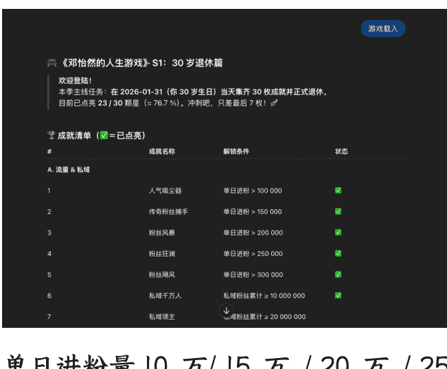
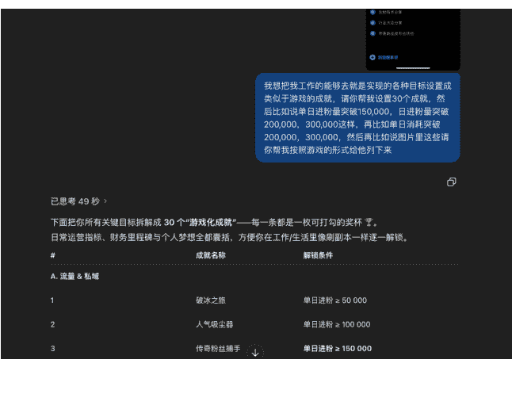
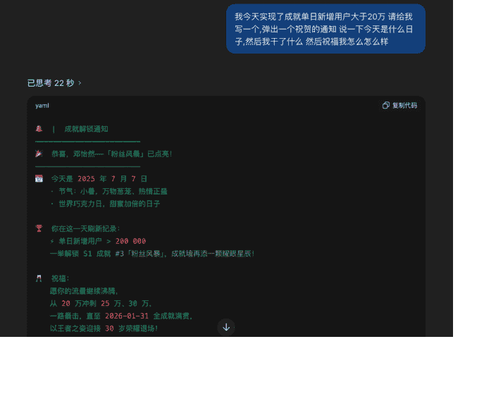
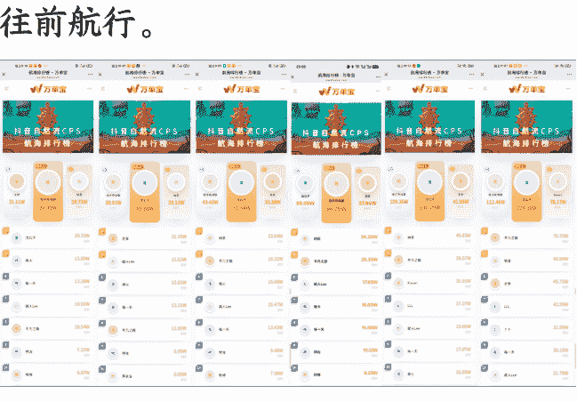
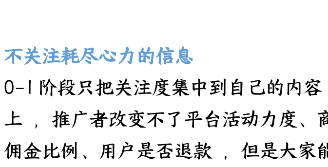

# 做项目总是三天打鱼两天晒网，怎么让自己坚持下去

## 251224 副业 SC 精华

公众号懒人搜索，懒人专属群独享

懒人微信：lazyhelper

做项目总是三天打鱼两天晒网，怎么让自己坚持下去？

这个话题，是在小灯塔里被大家投票选出来的 TOP5 问题。

感谢生财的邀请聊聊这个问题。

终于可以用上这个开头了——谢邀，人在杭州不是刚下飞机。

我看到问题的第一反应，其实不是怎么教大家坚持。

因为在我自己做项目，以及作为 CPS 航海教练带着船员拿到正反馈的过程中，我越来越确信一件事：做项目总是三天打鱼两天晒网，并不是坚持问题。

如果你认识我，或者参与过抖音自然流 CPS 航海，你可能会觉得：

邓怡然应该是那种执行力很强、很能坚持的人。

但如果你足够了解我，你就会知道：

这人是一个非常典型的三分钟热度型选手。

对新鲜事物极度兴奋，但对重复、慢反馈的事情极度不耐烦。

甚至在很多时候，我非常清楚地知道——如果这个项目需要我每天靠意志力扛，那是不会持续的。

既然邓怡然这么不擅长坚持，为什么有资格来分享这个话题？

### 那先说两个我的情况

22 年开始做抖音投放引流私域，从 2022 年夏到 2025 年冬，1200 多天其实一直在重复做一个事儿，做内容、搞流量。少的时候一天引流几千用户到私域，多的时候一天引流 30 万用户到私域，这期间遇到了电商平台政策变化、广告平台审核规则变化、账号封禁等等问题，但几乎是一天都没有停下来过，日复一日持续做这个事儿。23 年突破年引流人数 1000W+，三年来给合作伙伴、品牌做营销搞流量，也为自己的私域引流了 1700 万用户。

最近我带了两期抖音自然流 CPS 航海，第一期总人数 467 人，变现人数 423 人，变现率 90.58%，达到 500GMV 拿到返航激励的 328 人，占比 70.24%。第二期目前正在进行中，总人数 1220 人，实时走通 0 到 1 已变现 1160 人，变现率 95.08%。今天是航行第二十天，有五位 GMV 百万船员。

这篇文章，会讲一讲：

- 为什么做项目三天打鱼两天晒网不是坚持的问题？
- 我如何通过把工作做成一个游戏系统来解决这个问题？
- 带航海的时候如何游戏化？靠什么让船员持续行动

### 一、坚持不下去，并不是你的问题

很多人把三天打鱼两天晒网归因为一句话：我的意志力不够。

这是一个看似自省、但实际上非常危险的解释。

大多数人坚持不下去，并不是因为意志力不够，而是因为生物机制如此。

人类天生不擅长延迟满足。

我们的神经系统更容易被即时反馈、明确回报、可感知进度驱动。

而做项目常常恰恰相反：前期没正反馈、回报延迟、成长不可被即时感知。

当连续做了一段时间看不到结果得不到反馈，大脑非常自然地做出判断：这件事不值得继续投入精力。

这不是懒，也不是摆烂，这是一个正常的人类反应。

### 学习本身就是反人性的

所有需要长期投入、延迟反馈的事情，本质上都是反人性的。

教育是反人性的、创业是反人性的、健身是反人性的。

### 人类不是为长期主义设计的生物

我们更擅长即时反馈、快速刺激，所以当你说：我知道这件事对我长期有好处，但我就是做不下去。

这一点不奇怪。奇怪的是，我们竟然总想要求自己，靠本能完成这件反本能的事情。

### 反馈系统比意志力更重要

确实存在部分人：天生享受学习、对长期积累有愉悦感、没有反馈也能持续投入，但这类人是极少数。但对绝大多数人来说，真正有效的路径不是改变性格，而是顺应人性——重新设计反馈机制。

真正能长期做项目的人，并不是更能坚持，而是更早意识到一件事：

人不能指望用本能去完成反本能的事情，外部结构（反馈系统）比意志力重要得多。

而这正是我在自己身上、在航海项目中不断验证的一件事。

### 二、把工作做成一个游戏系统

我最开始有一个阶段，总想靠约束自己去做更多事情。

比如说 PUA 自己你是一个优秀的人，不要轻易放弃。

比如把更多的事情写在待办事项里。

但当我看到需要做的事情越堆越多，但是动力却越来越不足的时候，我意识到系统没有在运转，一定是有地方坏了。

我做了两件事情——

第一件：承认自己是一个三分钟热度、对新鲜事物极度兴奋、对重复、无反馈的事情极度不耐烦的人。

第二件：放弃靠自己的幻想，开始给自己设计系统。

大家常用无限游戏来形容商业/开公司/做项目，有的人天然就能从这个事里找到乐趣，有的人其实是在用这个事儿赚盘缠，并不因为此就能完全感到快乐，后者为什么不直接把过程设计成一个游戏呢？

非常羞愧的说，我是后者，我创业/做项目就是为了赚盘缠，并不是因为这个过程有多有意思，所以我给自己设计了一套工作成就游戏化的系统。

### 邓怡然的人生游戏

我读书的时候特别喜欢集奖状，集齐每个科目年级第一的奖状，大学的时候特别喜欢去打卡清单，比如我写了大学期间要做的 100 件小事，然后一件一件事情去打卡，玩 STEAM 的时候特别喜欢成就，所以我在设计自己的游戏化系统的时候，就是把工作当中一个个小目标变成可以激发我的收集癖和纪念癖的事情：

比如这些成就：

- 单日进粉量 10 万/15 万/20 万/25 万/30 万
- 私域用户累计突破 1000 万/2000 万
- 单脚本进粉破 50 万/100 万

如果只看数字本身，今天新增用户是 9.8 万，还是 10.8 万，对于一个长线的项目来看，意义并不会特别重大。但当我把它们放进一套“成就系统”里，事情就完全不一样了。数字没有意义，但节点有意义，意味着我突破了单日 10W 进粉目标，代表团队能力又升级了，这是一个突破节点，可以帮我在可能算漫长、重复、枯燥的过程中持续制造意义和反馈。

就像古人结绳记事，在没有文字、没有系统的时代，人类通过打绳结，把一些有意义的时间和事件记录下来。

建立正反馈系统后我不再觉得自己是在坚持做项目，而是更像在解锁成就、通关关卡、推进主线任务，它们在现实中依然是工作，但在我的系统里它们是剧情节点 + 成就解锁。

### 游戏系统奖励也非常重要

我在 22 年项目跑通第一次单日进粉破万的时候，买了一辆小米卡丁车奖励自己。

在自己 30 个工作成就实现第 20 个的时候，买了 Dream car 奖励自己。

当然奖励是什么东西，也看当下的状态和你的喜好，我也会奖励自己去听 livehouse，奖励自己躺三天什么都不干，奖励自己出去玩一趟，奖励自己打飞机去吃一个很想吃的美食。奖励自己的时候，能非常真切的感受到努力的具象化，也能更有动力去实现下一阶段的成就。

### 如何搭建自己的游戏系统？

第一步：直面自身特质，拒绝自我对抗

搭建系统的第一步，不是急着定目标列计划，先认清真实的自己、接纳真实的自己。

具体做法：找一张纸/打开备忘录，写下 3 个自己最鲜明的特质，比如“喜欢新鲜感”“讨厌一眼就看到头的事”“没有耐心”，想一下过去成长经历里因为对抗这些特质而失败的经历，放弃靠意志力硬撑的幻想。

第二步：找到动力源，设计成就化行动框架

回忆过去让你“主动投入、有兴奋感”的 3-5 件事。

分析这些事的共性，把这些共性提炼出来，作为你搭建系统的“动力核心”。

把长线项目目标拆解成多个可落地的中短期节点（比如“赚到第 1 块钱、第 1 万块、第 100 万”）。

给节点赋予成就意义，可视化成就：把你的目标列下来之后交给 GPT，他可以随时帮你想一堆酷炫狂拽的成就名，你还可以让他在每次你实现了某个成就的时候，给你发贺电全服庆祝。

第三步：设计正向奖励机制，让动力循环起来

奖励的选择非常简单，只有一个原则：能让你真正开心，符合当下的需求。

完成成就后，不要拖延奖励，尽快兑现。

一句话总结：先认清自己的特质（放弃完美幻想），然后找到自己的动力源把目标转化成符合动力源的“成就任务”，最后用个性化奖励强化动力循环。

### 三、航海本质是在搭建反馈系统

再看航海这套机制，打卡、生财好事、排行榜，看起来是运营设计。

本质上都在做同一件事：把原本连续、模糊、容易放弃的过程，切成一个个可感知的节点。

- 航行打卡：让你确认自己没停
- 生财好事：让小反馈被看见
- 航海排行榜：让你知道自己在哪

第一期自然流 CPS 航海第三天时，教练们发现一个问题：

很多人发完第一条视频没有正反馈后就没有继续行动了，他自己没有看到明确的结果，可能不确定这条路到底通不通，也不知道一起出发航行的人走到哪了。

当天我们发布了排行榜，每小时刷新一次数据所有船员可以看，每晚航行日志在大群同步排行榜情况，上榜的船员持续会收到鼓励和其他人的关注，没上榜的船员可以看到路径和天花板，随着每一天排行榜的更新数据变化，所有船员都能得到一个确定的信号：我们没有在原地踏步一直在往前航行。

### 11.06-11.11 每日排行榜

排行榜发布后立刻感觉到很多人被重新点燃了，上榜的船员随着排名变化感受到紧迫性和兴奋感，没上榜的船员准备冲榜，每一天变化都很大。

### 群内氛围好

群内多位优先跑出成绩的圈友会晒单，激发了一些未执行的圈友，且群内会公布排行榜，先进带后进，导致整体群内氛围不错。

> 船员原话 1：整个团队的氛围感，你追我赶，大家相互鼓励的团队氛围。

> 船员原话 2：设置的航海排行榜，这个榜单一直在激励我往上爬。

> 船员原话 3：群里的氛围真的很好，我很喜欢这种一堆人同频的感觉。

### 抖音自然流 CPS 第一期复盘文档 (生财@雪雪)

在这次航行中，除了让大家看到排行榜，还通过哪些方式让船员快速搭建反馈系统？

0-1 阶段：立刻行动、建立最小正反馈、刻意降低负反馈

### 立刻行动

船员必须在第一次直播后 24 小时内，完成并发布第一条内容。哪怕手册没有看完，哪怕一些知识点还没有搞明白，先行动起来。

原因很简单：准备得越久，心理成本和预期都会越高。一条视频如果花四个小时学习完手册、再花两个小时答疑解惑搞明白所有问题、再花三四个小时甚至更久创作剪辑，最后只得到几十甚至个位数播放，这会直接降低继续行动的意愿。

### 利用好三分钟热度

三分钟热度型选手不用试图改变，把它当做一个优势反向利用，这是起跑黄金时间：

- 热情刚出现时立刻行动
- 目标不是成功，而是最小正反馈
- 用适合你的反馈机制搭建后续动力系统

### 不关注耗尽心力的信息

0-1 阶段只把关注度集中到自己的内容上，推广者改变不了平台活动力度、商品佣金比例、用户是否退款，但是大家能改变视频质量、视频数量，过度关注流量去反复看只会损耗心力，初期可以刻意屏蔽负反馈的接受，更专注地前进。

关于心力，我想展开讲一个看法：无知的勇气是前进的动力。

11 月底航海家大会，我和亦仁老大、刘小排、大树、还有一位 AI 创业者（先不透露名字业务）在北京吃饭。

这位创业者现在业务做得非常牛了，但过程确实不轻松：技术难题、外界环境极不稳定、被起诉收律师函，当时听完他的历程我们都非常佩服他的心力，这么难怎么能坚持下来？

站在他的终点往回看，我不敢往前走这条路。

刚好第二天李克老师分享了一句话，大意是：

> “年轻人不用问这么多，否则很容易没有勇气。”

这句话听起来有点反常识，但非常真实。

如果在起步，就已经完整地看到了未来所有的难题、风险、痛苦、代价。

那理性的大脑，往往会帮你做一个最优决策：不要继续。

而现实是大多数真正走到终点的人，并不是一开始就想清楚了一切，而是先解决眼前这一小步、再解决下一小步，一步一步走的时候，问题其实并没有想象中那么难。

如果一开始就知道有多难，很多人根本不会开始。

所以航海每次课程的我最后都会放这样一句话——

我会告诉大家这不是一次容易的航行，但是这句话里隐去了未来可能遇到的所有具体的困难，可能是账号问题、流量问题、竞争问题，如果一开始就是这么多具体的困难摆在面前，很多人就直接退缩了，但是当开始航行过程中再去面对这些具体问题的时候，其实就没那么难了。与其说在绝对的执行力面前大家成为了那个幸运的人，其实是信心和勇气帮助船员一直航行。

如果圈友想了解关于抖音自然流 CPS 航海的内容，海宇教练写过一篇文章，大家可以到这里去看。

### 善战者，求之于势，不责于人

孙子兵法讲：善战者，求之于势，不责于人。

带兵打仗，不要求人的努力，那我们自己打仗，也是如此。

真正厉害的人，不是更能吃苦，而是更会借结构、借系统。

回到最开始的话题：做项目总是三天打鱼两天晒网，怎么让自己坚持下去？

如果我现在要重写这个问题，我会把标题改成：

### 为什么真正能长期坚持的人，几乎都不靠“让自己坚持”？

因为真正能长期坚持的人，更早放弃了“靠自己”。

他们不对抗人性，而是顺应人性，选择相信结构、机制和系统。

如果你现在正处在“三天打鱼两天晒网”的阶段，你可以先问自己：

- 我是不是想用意志力，扛一个本该被系统解决的问题？
- 我有没有把过程变得可被感知？
- 我有没有给自己制造足够的动力反馈？

如果这些问题的答案开始改变，你会发现“逼自己坚持”这件事，根本就没必要了。

感谢看到这里的圈友，其实这个解题思路很简单，我可能讲得有些啰嗦，希望能对你有一些帮助。

祝大家一起生财有术！

公众号懒人搜索、懒人专属群分享

最后，安利小懒的付费群：

懒人专属群 (介绍)

📌 这里是你对抗信息过载的护城河。

已稳定运行 6 年，累计拆解、研读 3000+ 个互联网商业实战案例与行业前沿 内参和时政/宏观文章。

我们不搬运垃圾，只做高价值信息的筛选器与放大镜。

懒人专属群更新记录：

https://hk57gvlx7u.feishu.cn/docx/H0kRdZbSbolBROxkaXtcuVEOnTg

懒人专属群更新记录 (需梯子，备用):

https://lazybook.fun/blog/record2

【免责声明】本资料归档于社群内部知识库，仅供成员课题研究与学术交流，请在查阅后 24 小时内删除。