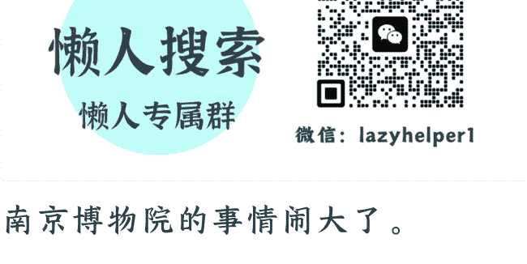
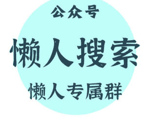
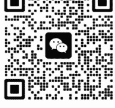

公众号懒人搜索，懒人专属群分享

# 南京博物院事件，又挖出一个“董小姐”？

251225 文/卢克文工作室 嘉宾：概略北方
整理：公众号懒人搜索，懒人专属群精选
懒人微信：lazyhelper1

南京博物院的事情闹大了。

不仅南博的退休老职工站出来，实名举报前院长徐某平，江苏省政府成立了调查组，连国家文物局都成立工作组，开始核查了。

之前有人还在担心江苏方面是自己查自己的话，现在国家层面介入，想必会有一份比较扎实的调查报告出来。问题在于，事情都过去 20 多年了，鉴定《江南春》为假的专家也大都不在人世了，从哪查起呢？

也许，那个被举报的前院长徐某平，是个合适的突破口。

徐某平的疑点最多，最适合作为突破口。

比如，在前几天接受记者采访的时候，徐某平先说自己今年 80 多岁了，生病在家里面。2008 年退休后，所有的外界事务，都不参与了，当时这个事不是自己经手的，自己也不是书画鉴定家。

基本上，属于否认三连。

但互联网是有记忆的。

随便上网搜一下就会发现，徐某平退休之后，担任了江苏江宁织造府博物馆馆长和江苏省收藏家协会的会长，经常出席各类文物、收藏相关的活动，忙得不行。

这怎么是“外界事务都不参与”了？

还有，他说这个事不是自己经手的，但 1997 年把《江南春》调拨给文物商店的记录上，可是签着徐某平的大名。

这么着急撇清关系，看来徐某平绝对知道些什么。

从徐某平的履历上，或许能一窥端倪。

翻开中国各大国家级、省级博物馆历任馆长的履历，你会发现一个共同点：

绝大多数人都是科班出身，要么是考古学大家，要么是历史学泰斗，他们身上带着一种浓重的书卷气，也比较爱惜羽毛。

但徐某平呢？并不是，他既没有高学历，也不是文博圈出身。

1963 年，徐某平从南师附中毕业，参军入伍进入空军地空导弹部队二营，也就是电视剧《绝密 543》中那一支打下过 U2 侦察机的传奇部队。

1969 年，徐某平退伍回到南京，在新华印刷厂当工人，1973 年 7 月，调入南京博物院，负责一些后勤工作。

然后仅仅一年时间，徐某平就从工人身份转成了干部身份。了解那个年代的，都知道这种提干的含金量。

此后徐某平平步青云，只用了 9 年时间，就从普通干部成长为南博的副院长，随后以副院长身份统揽大权十几年，并在 2001 年正式扶正成为院长，一直干到 2005 年。

在论资排辈的文博系统，这种“非科班人员”有火箭式的蹿升速度，只有两种可能：要么他是绝世天才，要么他拥有超乎常人的“运作”能力。

徐某平是哪一种可能呢？大家心里也清楚。

也许正因为这种出身的不同，注定了徐某平在掌权之后，其行事风格会与传统的学者型院长截然不同。

学者型院长吧，虽然也难以免俗，但其骨子里往往有一种“知识分子”坚持，比如自杀的前院长姚迁。

而对于一个靠“运作”上位的人来说，那就灵活多了，文物反而成了“顶级资源”。

从南博 42 名职工的联名举报信来看，大致可以拼凑出徐某平在南博工作期间干了什么。

举报信说，徐某平任职院长期间，未经国家文物局批准，擅自撕毁抗战时期南迁文物保管箱上的封条，取出大量珍贵文物。

然后他指使鉴定专家将包括故宫文物在内的馆藏文物鉴定为“赝品”，低价销售给自己主管的江苏省文物商店，再转手倒卖给其子徐某江在上海开的文物拍卖公司，最后出售给法国的商人和各地文物贩子。

其中不仅有一大批官窑瓷器，还有数量众多的国宝孤品书画作品。为了躲避清点检查，他长期拒绝、阻挠故宫博物院归还南迁文物的正当要求。

同时，他还将多件书画赠送给各级政府领导，包括江苏省检察院检察长、江苏省反贪局局长韩建林。

或许，这就解释了为什么江南春为什么“鉴定”为假，然后划拨给了江苏省文物总店。毕竟，徐某平当时不仅仅是南博院长，还是江苏省文物总店的法人代表嘛。

这才是最惊悚的地方。

左手是收藏文物的博物馆，右手是买卖文物的商店。左手负责把文物定义为“假货”或“参考品”踢出馆藏，右手就负责以白菜价接盘，然后推向市场。

在这个完美的闭环里，《江南春》从国宝变成商品，可能只需要徐某平签一个字。

虽然《江南春》鉴定为假的时候，徐某平还没有去南博上班，排除了徐某平指使专家造假的问题。但有没有一种可能，当年鉴定的专家水平不够，将真的鉴定成了假的，然后徐某平发现了，顺水推舟呢？

目前，所有的逻辑矛头都指向了他。为什么？因为在《江南春》的流转过程中，出现了一个无法弥合的时间错位。

南博的《江南春》，是 1997 年划拨给了文物商店，2001 年被“顾客”买走，从此不知所终。

而拍卖行里的那一副《江南春》，根据 2009 年丁蔚文（艺兰斋主人陆某的妻子）写的一篇硕士学位论文《仇英〈江南春〉卷考辩》，说《江南春》是庞家后人 90 年代卖给艺兰斋的。

这就有意思了。

假设，这两幅《江南春》不是同一幅，问题来了，为什么拍卖行里的那一副《江南春》，也盖着庞家“虚斋至精之品”的印章呢？难道庞家有两幅《江南春》，把真的卖了，假的捐了？

没道理啊，100 多件真迹都捐了，没必要中间掺一幅假的嘛。

但如果这两幅《江南春》是同一幅，那问题就更严重了。

为什么南博鉴定为假的画，到了拍卖行就变成价值 8800 万的真迹了呢？嘉德拍卖行作为业内知名的拍卖行，鉴定水平肯定是有的，如果把假的鉴定为真，那可是要砸牌子的！

更关键的在于，为什么发票上 2001 年卖出的画，到了陆家就变成了 90 年代从“庞家后人”手里收购了呢？

逻辑只有一个：洗白。

根据报道，陆某和徐某平是多年的好友，咱们先假设，这幅画真的是他们勾结卖出去的，如果直接从南博买，哪怕手续再全，将来也经不起推敲。

那怎么办呢？必须要有一个故事：

画，是庞家后人卖掉的。

毕竟庞莱臣在自己去世前已经亲自将财产分为三份留给三个继承人，谁规定《江南春》真迹就一定要在庞增和手里？

这样一来，国有资产流失的罪名就洗刷了，反正画已经卖了，没人能证明南博的这一幅，到底是真是假。

但是，这个故事有一个巨大的 Bug——缺一个“卖画的庞家后人”。

真正的庞家后人庞增和、庞叔令等人，一直坚持称他们捐了，没拿回来过，肯定不是他们卖的。

怎么办？

没有后人，那就“造”一个后人。

于是，这场大戏最魔幻、最荒诞的角色登场了——徐某。

## 2

徐某是谁？她是一名杭州师大生物学专业的学生，硕士论文研究的是植物病毒。

你没听错，一个研究植物病毒的理科生。

但是，就在 2014 年南京博物院策划的“藏天下：庞莱臣虚斋名画合璧展”上，这位徐某女士突然华丽转身，变成了“庞赞臣（庞莱臣堂弟）的曾外孙女”，变成了“庞家后人”，展览的共同策展人。

当时，南博的时任领导徐某平、策展人庞鸥，都对这个身份进行了背书，甚至大力推介。

请大家想一想，一个搞生物的，突然跨界搞书画鉴定，这本身就离谱；更离谱的是，真正的庞家后人庞叔令就在现场，她根本不认识这个所谓的“亲戚”。

根据庞叔令的回忆，当时庞叔令见到自家亲戚还挺高兴，但聊了两句就感觉不对劲，“我觉得她讲的话和她的年龄不符合，好像要极力向我证明什么，但是提到家里的事情却漏洞百出。”

“最明显的一个例子就是她提到小时候在奶奶家看到一本册子，上面有贺明彤的名字，也就是我的曾祖母。我一听就觉得有问题，因为她说看到的册子是解放前的，但是我的曾祖母在解放前不叫贺明彤，而是随夫姓叫庞贺氏。”

庞叔令越想越觉得不对劲，就把徐某和南博告上了法庭。最终，法院判决：不认定徐某是庞家后人。

然后，有意思的来了。

2016 年，徐某父亲徐安华申请了一份“亲属关系公证”，这份公正大致意思是，徐某是徐安华的女儿，徐安华是徐祖林和庞明霞的儿子，庞明霞是潘志新的女儿，而潘志新是庞赞臣的妻子。

这么来算的话，徐安华是庞赞臣外孙，而徐某是徐安华的女儿，倒是也能算是旁氏后人。

但是，2017 年，这份公证被公证处自行撤销了。

为啥呢？因为徐安华提供的材料，只能证明潘志新是庞赞臣的妻子，没法证明潘志新的女儿庞明霞是庞赞臣的女儿，谁知道庞赞臣和潘志新是不是重组婚姻呢？

所以，徐某与庞莱臣家族的血缘关联仍处于薛定谔状态。不过因为有这一层关系在，说徐某是庞家后人，是能唬住人的。

为什么要费尽心机，把一个学生物、和庞家关系不太确定的女生，包装成庞家后人呢？

难道仅仅是为了让她在展览上露个脸？不，这是为了补上那个“洗白故事”的最后一环。

请把逻辑串起来：

徐某平把画从南博“运作”出来，到了陆某手里。

为了掩盖国资流失，陆某对外宣称是买自“庞家后人”。

真正的庞家后人否认卖画。

于是，需要一个听话的、可控的“庞家后人”站出来，默认或者配合这个故事。

徐某，可能就是这个被选中的“演员”。

徐某在 2014 年的出现，绝不是偶然，虽然那时画已经卖出去很久，但为了让这批流落在外的“虚斋旧藏”在市场上拥有合法的身份，为了让以后的拍卖、展览师出有名，必须有一个“庞家后人”来背书。

只要徐某这个“庞家后人”是被官方 (南博) 认可的，那么她说的每一句话，就能成为那批来路不明文物的“护身符”。

在这场戏里，徐某可能只是一个工具人。她或许从中得到了一笔不菲的“劳务费”，或许得到了转行进入艺术圈、当上大学教授的资源置换（事实上她后来确实读了美院博士，当了教授），但她绝不是操盘手。

真正的操盘手，是那个站在她身后，敢于指鹿为马，敢于把“假亲戚”推上前台的人。

这样一来，举报信里面的内容就说得了通了：一个强势的院长，利用制度漏洞（馆店不分），通过行政手段将真文物定为赝品，通过所谓的“合法手续”转移出国库，一个富有的商人朋友接盘，一个被制造出来的假后人负责洗白来源。

这就是传说中的“草蛇灰线，伏脉千里”。

但是，最让人感到后背发凉的，不是这几个人，而是这件事情背后的“抗击打能力”。

根据报道，早在 2008 年，郭礼典等几十名职工就曾实名联名举报徐某平。几十个人啊！有党员 13 人，民主党派 7 人，知识分子 22 人！

结果呢？泥牛入海。

徐某平不仅安然退休，甚至在退休后依然在收藏界呼风唤雨，儿子拍卖生意做得风生水起。

徐某平编织的这张网，太大了。

郭礼典在举报信中提到，徐某平将许多名贵字画作为“雅贿”，送给了各级关键人物。其中，就包括落马的江苏省前反贪局局长韩建林。

巧了，根据澎湃新闻的报道，徐某平、陆某和韩建林，三人是好友关系。

这就可能涉及到一个问题了——“雅贿”。

直接送钱太俗，也太容易出事。送画，那是“文化交流”，是“鉴赏”。一幅画，在账面上可能只值几千块（就像《江南春》的 6800 元），但到了懂行的人手里，它就是几百万、几千万的硬通货。

这种利益输送，极其隐蔽，极其优雅，也极其牢固。

徐某平不仅仅是一个人，他代表的是那一时期文博圈的一种“生态”。在这个生态里，文物是他们结交权贵的“投名状”，是他们置换利益的“筹码”。

那些收到画的人，他们会允许徐某平出事吗？徐某平出事，就意味着拔出萝卜带出泥。

所以，这一事件，调查来龙去脉容易，查清楚画是怎么出去的也容易（毕竟单据都在）。

最难的，是调查徐某平背后的事情，是调查这些年他把那些消失的画，到底都送给了谁。

说实话，南京博物院的这出大戏，看得人唏嘘不已。但也许是件好事，撕开了文博系统封闭运作的一角。它让我们看到，那些躺在玻璃柜里的国宝，不仅需要物理上的防盗，更需要制度上的防盗。

那些被调包的真迹，那些被撕毁的封条，那些被篡改的档案，终究会成为呈堂证供。

最后，安利小懒的付费群：

懒人专属群（介绍）

微信：lazyhelper1

📌 这里是你对抗信息过载的护城河。

已稳定运行 6 年，累计拆解、研读 3000+ 个互联网商业实战案例与行业前沿内参和时政/宏观文章。

我们不搬运垃圾，只做高价值信息的筛选器与放大镜。

懒人专属群更新记录：

https://hk57gvlx7u.feishu.cn/docx/H0kRdZbSbolBR0xkaXtcuVE0nTg

懒人专属群更新记录（需梯子，备用）：

https://lazybook.fun/blog/record2

【免责声明】本资料归档于社群内部知识库，仅供成员课题研究与学术交流，请在查阅后 24 小时内删除。