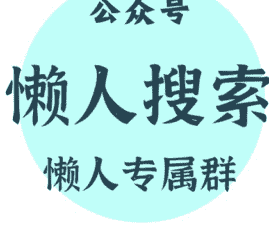

# 大国的十年

251219 洋恺宏观

整理：公众号懒人搜索，懒人专属群精选

懒人微信：lazyhelper1

对一个国家来说，十年的时间足以改变很多。有些抓住机遇的国家，能迅速实现崛起；有些误判形势的国家，则有可能走向衰落。

## 崛起的十年：苏联的重工业计划

(1928—1938) 苏联成立后，一度面临内忧外患的局面。由于遭遇了苏波战争的失败，苏联搁置了对外输出的想法，转向内政建设。在经历残酷的权力斗争后，斯大林成为新一任领袖，他决心带领苏联实现工业化。

1928 年—1938 年，苏联仅用了十年的时间，就从落后的农业国建设成为欧洲最强工业国。斯大林接手的是一个烂摊子，但在他带领下苏联工业产值以年均两位数的速度增长，特别是以国防为代表的重工业，这些为后来卫国战争的胜利奠定基础。

为什么苏联能实现跨越式发展呢？很重要的原因在于抓住了历史机遇。

1929 年美国爆发经济危机，进而演化为席卷全球的“大萧条”，大量企业倒闭。为争夺市场，西方的资本家纷纷前往苏联寻找机会，确立了“市场换技术”的贸易模式。大量外资涌入这个社会主义国家，使苏联能以较低成本获取西方先进技术。

然而在军事领域，英法美依旧对苏联实施极为严格的科技封锁。为绕开限制，苏联主动寻求与德国发展关系。作为被《凡尔赛和约》限制的国家，德国虽然拥有世界一流的军工技术储备，但无法将其投入实验和生产。西方的孤立政策，使德国积极向苏联靠拢。苏联为德国研发新式武器提供厂房和土地，并利用这个机会观摩现代化武器的生产流程。

为推进工业化建设，斯大林执行铁腕政策，不惜一切代价从农村榨取资源。其工农业剪刀差的做法让农民陷入贫困，拥有黑土地的乌克兰甚至闹饥荒。但斯大林成功利用西方国家在经济和外交上的矛盾，为本国争取到最大利益，为苏联的国防现代化奠定基础。如果没有这十年的积淀，苏联绝无可能打赢二战，成为与美国并立的超级大国。

## 衰落的十年：苏联由盛转衰（1979—1989）

从绝对实力来看，苏联的巅峰期出现在 70 年代末。此时正值勃列日涅夫执政，当时西方处于第二次石油危机之中，高通胀和高失业同时出现。苏联的钢产量、石油产量等工业指标均超过美国，陆军装备与核弹头数量比北约总和还高。

然而仅隔了十多年，苏联就走向衰落。很多人把苏联解体的原因归结为戈尔巴乔夫的软弱，但早在勃列日涅夫时期，苏联就已经走上了下坡路。勃列日涅夫依靠政变的方式把赫鲁晓夫赶下台，起初他重用柯西金，试图引入商品经济。然而在既得利益集团的反对下，柯西金改革以失败而告终，为迎合保守派支持，勃列日涅夫废止了改革计划，继续沿用计划经济。在其放纵下，苏联的特权阶层迅速膨胀，吞噬了这个国家大部分资源，民生则日益艰难。在外交上，苏联转向大国沙文主义，与中国爆发边境冲突，最终把昔日的社会主义盟友推向西方阵营。1979 年，中美建交，依靠中国的廉价劳动力，西方成功摆脱滞涨问题，经济恢复内生增长。

在中东，埃及放弃了亲苏政策，转而跟以色列建交，与美国改善了关系。苏联失去中东最重要的代理人，缺少干预油价的地缘杠杆。在美国的促使下，80 年代 OPEC 大幅增产原油，使苏联陷入财政困境。另一方面，中越战争使苏联失去了东南亚出海口，作为补救，苏联入侵阿富汗，试图打通印度洋出海口，结果陷入漫长的战争泥潭。从 1979—1989 年，苏联仅用了十年就从巅峰期转向衰落期，包括普京在内的年轻人集体见证了红旗落幕的过程。

## 崛起的十年：日本的经济腾飞

（1950—1960）二战后，美国曾试图拆除日本所有工厂，使日本沦为农业国，摧毁其发动战争的能力。当时的日本人一度惴惴不安，担忧自己国家的未来。按照罗斯福设计，中国将成为战后亚洲的领导者，协助美国共同治理东南亚。罗斯福的去世改变了历史进程，杜鲁门政府并不愿意在中国身上消耗太多资源，在援助问题上拖泥带水，坐视国府在战场上的失败。新中国成立后，美国曾试图以台湾为筹码，换取中国在美苏之间维持中立。不过新中国还是按照既定路线，奉行“一边倒”的亲苏政策，没收西方在华资产。1950 年，朝鲜战争爆发，杜鲁门政府将其视为丢掉大陆后的连锁反应，为遏制共产主义在远东扩张，避免触发多米诺骨牌效应，美国以“联合国军”的名义出兵朝鲜，进而与中国爆发直接冲突。

朝鲜战争导致中美陷入长达二十年的敌对期，白宫重新审视第一岛链的价值，把日本、菲律宾和台湾岛陆续纳入共同防御体系，并召开《旧金山会议》取消了对日索赔诉求。随后，美国调整远东政策，决定把日本打造为反苏桥头堡，大量海外订单如潮水般涌入日本，并使其仅用几十亿美元的成本就从西方获取几千亿美元的科技成果，汽车、造船、机械、电子等产业迅猛发展。上个世纪五六十年代，日本成为资本主义阵营里经济增速最高的国家之一。

与日本类似的还有台湾岛和韩国，朝鲜战争使美国重新评估台湾的作用，派遣第七舰队入驻台海以阻止两岸统一，并向台当局提供大量经济援助。另一方面，在朴正熙的带领下，韩国抓住了越南战争带来的机遇，依靠承接日本转移的劳动密集型产业实现经济腾飞，成为亚洲四小龙之一。

### 衰落的十年：日本房地产泡沫破灭 (1990—2000)

上个世纪 90 年代初，日本迎来经济巅峰，其人均 GDP 超过美国，成为世界上最富裕的国家之一。以节俭而著称的日本人开始推崇超前消费，他们大量透支信用卡，加杠杆在繁华地段买房，笃定自己的薪资收入能持续增长，民族自信心达到顶点。在汽车和半导体等领域，日企把美企打得节节败退，前者在欧美跑马圈地，高价收购海外资产。

然而苏联解体让日本失去了统战价值，日本遭到美国全方位打压，被迫自愿限制出口并允许日元升值。与德国相比，日本无法依靠欧盟来解决人口老龄化和产能过剩问题，股市和房地产泡沫被动破灭，年轻人背上了 30 多年的负债，社会陷入死气沉沉。

伴随中国开启市场化改革，日本曾引以为豪的制造业遭到中韩冲击，市场份额大幅减少。整个 90 年代日本经济陷入通缩之中，人均收入停滞不前，官僚主义盛行，整个国家看不到未来，“平成废宅”取代“昭和青年”成为时代写照。

直到 2012 年以后，随着美国“重返亚太”并将中国锁定为头号竞争对手，日本才重新具备统战价值。在美国的默许下，安倍祭出了宽松的货币政策，依靠汇率贬值的方式刺激出口，甚至允许央行下场买股票。在“安倍经济学”的驱动下，日本经济出现了走出通缩泥潭的迹象。但平成时期的三代人，其大好年华几乎都在经济衰退中度过，等熬到经济复苏后，青春早已不在，沦为旧时代的遗迹。

## 崛起的十年：中国与全球化红利

（2001—2011）1997 年，东南亚金融危机爆发，这场危机迅速席卷东亚，中国外贸事业受到严重冲击。当时国内经济形势并不乐观，一方面是各种三角债，另一方面国企经营遭遇困难，多地出现下岗潮。一些西方人士提出“中国崩溃论”，一时间人心惶惶。

在悲观的情绪中，机会却在酝酿。1999 年中美就加入 WTO 问题达成一致；两年后，中国正式加入 WTO。那会美国正处于对全球化最自信的时期，对本国制造业竞争力明显高估。最开始美国试图把中国当作倾销市场，认为互降关税更有利于美国企业。然而加入 WTO 却成为中国经济腾飞的起点，2001 年—2011 年，中国创造了人类历史上最大规模的工业化奇迹，按美元计价的 GDP 翻了 6 倍，取代欧美成为世界工厂。（外贸是中国经济最大驱动力）中国的经济奇迹离不开 00 年代的全球化红利，依靠全球市场，东南沿海成为中国最富裕的区域。中央凭借东南沿海缴纳的税收向中西部提供财政转移支付，并通过房地产转换为购买力。加入 WTO 后的十年里，中国依靠工业化和城镇化，借助人口红利，经济跨越式发展，世界迎来中美 G2 时代。

00 年代是读书性价比最高的时期，正值高校扩招，很多年轻人顺利进入校园，并在毕业的时候赶上入世后的就业黄金期，那会各行业可谓求贤若渴，愿意开出较为丰厚的薪资吸引应届生。不仅如此，00 年代楼市处于爆发期前夜，普通白领正常工作几年就能在当地买房。

美国一直很后悔让中国加入 WTO，认为这相当于养虎为患。但没有任何一个国家事先能想到中国发展得那么快，仅用十年就崛起为世界第二大经济体；毕竟东南亚也搞过出口导向型经济，但一场金融危机就让东南亚原形毕露。说到底，中国作为拥有深厚历史底蕴的国家，无论是国民勤奋度还是政府治理水平，都远强于由土著文明构建的东南亚国家。美国的傲慢，为自己培养出强大的竞争对手。

## 衰落的十年：西晋（从太康之治到八王之乱）

（中国古代人口波动比西欧更大）在中国古代，由乱到治、盛极而衰的案例很多。晋武帝统一中国后，实行轻徭薄赋、鼓励农桑的政策，社会经济得到恢复，史称“太康之治”。晋武帝去世后，皇后贾南风专权，但她提拔了很多人才负责理政，虽然朝廷争斗不休，但并未对民间产生波及。

然而贾南风却生不出儿子，朝廷只能立庶长子为太子。这使贾南风陷入恐慌，一旦太子继位，自己可能会被清算。为保住权势，贾南风毒死了太子，晋惠帝失去了合法继承人，这意味着诸藩王都获得了继位的权力。为争夺皇位，西晋爆发“八王之乱”，汉人的军队在内战中消耗殆尽，为胡人崛起创造条件。最终西晋被匈奴人灭亡，中国迎来“五胡乱华”时代。

西晋的衰落并非贾南风一人之过，司马懿依靠篡位夺权，本身合法性就有问题。为此司马家族被迫向士族让利，推崇“九品中正制”，堵死了寒门子弟阶级跨越的渠道。为避免权臣篡位，晋武帝大搞分封制，册封宗室为王。晋惠帝继位后，没能处理好接班人问题，使外戚和太子的权力之争演变为中央与地方的矛盾。

## 衰落的十年：大唐（从天宝盛世到安史之乱）

很多历史学家认为，大唐国力的巅峰期，出现在天宝四年。这一时期唐朝平定了来自突骑施的叛乱，确立了对伊犁河流域的控制，其势力深入中亚地区。在之后的几年里，中华文明与阿拉伯文化开始碰撞，商业和技术频繁交流。在文化领域，唐诗进入繁盛时期，诞生了李白、杜甫、王维、王昌龄等诗人，可谓群星璀璨。作为东亚中心，大唐吸引万国来朝，日本、朝鲜和东南亚国家热衷于派遣留学生学习中华文化。

然而盛世的背后却藏着隐患，由于土地兼并，均田制已然崩坏，府兵制走向瓦解。为维持版图扩张，唐玄宗不得不启用募兵制，并在边疆实施藩镇制度，赋予节度使兵权、财权和人事权，导致地方势力尾大不掉。自隋末以来，关陇士族与山东士族矛盾重重，利益分配不均，河北作为人口最稠密的地区，承担了最重的赋税。

另一方面，尽管唐朝实行科举制，但效果并不理想，伴随门阀贵族坐大，寒门子弟看不到晋升的希望，只能投靠地方实力派，扮演幕僚的角色。

如果说开元盛世是黎民的盛世，那天宝盛世则是权贵的盛世。正如诗句所述：“朱门酒肉臭、路有冻死骨”，这盛世的基础早已被掏空，长安城到处都是腐败的气息，安史之乱只是导火索，大唐崩坏的种子早已种下。

天宝四年，就在大唐开启新一轮版图扩张的时候，朝廷还发生了另一件大事，深受唐玄宗喜爱的杨玉环被册封为贵妃，随后，其堂兄杨国忠受到重用，后官至宰相。杨国忠能力平庸，两次发动征讨南诏的战争，均以失败而告终。早在李林甫为相时期，为巩固相位，李林甫大力提拔胡人担任节度使，其中就包括身兼平卢、范阳、河东三镇节度使的安禄山。杨国忠接任后，对安禄山处处限制，试图削弱其权力，然而此举却提前激化中央与河朔地区的矛盾。天宝十四年，安禄山打着“清君侧”的旗号举兵叛乱，中华陷入长达八年的“安史之乱”。

安史之乱成为大唐由盛转衰的标志，曾经繁华的河北与河南沦为废墟，损失了一半的人口。唐庭也没能真正平定叛乱，而是以自治为条件换取河朔藩镇名义上的臣服，大唐进入藩镇割据阶段。不仅如此，宦官、党争等问题也愈演愈烈。看不到希望的寒门忍无可忍，黄巢起义爆发，长安被付之一炬，门阀贵族遭到严重打击，正所谓“天街踏尽公卿骨”，士族政治逐渐退出历史舞台，中国迎来平民政治时代。

## 衰落的十年：明朝（从仁宣之治到土木堡之变）

朱棣发动靖难之役后，为弥补合法性不足，开启一系列对外征战的进程。他多次率军讨伐蒙古，出兵收复安南，并在黑龙江下游设置奴儿干都司。为摆脱建文余党，他把首都从南京迁移至北京，奠定了“天子守国门”的传统。在文化上，明成祖多次派遣郑和下西洋，弘扬中华国威，并命人编纂《永乐大典》，很多散落民间的古籍得以重见天日。在明成祖统治下，社会人口得到恢复，中国迎来“永乐盛世”。明成祖之后的两代皇帝，奉行“轻徭薄赋、休养生息”的国策，人口进一步增长，国家积累了一笔可观的财富，史称“仁宣之治”。正常情况下，如果之后的皇帝继续励精图治，明朝或能迎来古代中国文治武功的巅峰期。然而接手“仁宣之治”的皇帝却是明英宗，这位皇帝自小在深宫中长大，不谙民间疾苦。他还宠信太监王振，纵容土地兼并，导致流民四起，明太祖创立的“军户制”走向瓦解。由于地主藏匿人口，朝廷统计的户数不增反减，汲税能力遭到削弱。但明英宗又是个好大喜功之人，在王振的挑唆下，他率领 50 万大军亲征瓦剌，结果半道上被切断水源，京师三大营全军覆灭，就连皇帝本人也被俘虏。从仁宣之治到土木堡之变，似隔了十多年，这场变故导致明朝由盛转衰，武勋集团被一网打尽，兵权落入文官集团手中，形成“以文制武”的传统，军人地位一落千丈。自此之后明朝对外战略转向保守，失去了洪武和永乐时期开拓进取的精神。由于文官势大，皇帝被迫与其分享权力，对土地兼并往往睁一只眼闭一只眼，这使大明虽富有四海，但国库却常年亏空，有时候连赈灾的钱都拿不出。明朝后期，由于东林党把持朝政，富庶的江南带头抵制缴纳商税，税负的担子只能落到西北的贫农头上，在内忧外患下，明朝逐渐走向灭亡。

## 衰落的十年：拜占庭帝国的继承人危机

在古代的地中海东岸，很多文明迅速崛起，也迅速灭亡。亚历山大的马其顿帝国曾征服了埃及和波斯，并打到印度河流域。

在希拉克略一世时期，拜占庭帝国经历了类似唐玄宗时期由盛转衰的过程。希拉克略一世上台后采取军区制，推行希腊化进程，使拜占庭帝国实力得到恢复。在他的励精图治下，拜占庭军队击败了宿敌萨珊波斯。然而在阿拉伯半岛，伊斯兰教迅速兴起，阿拉伯人利用拜占庭和波斯的冲突迅速崛起，并推行宗教包容制度，信教免税收，不信教只要交税就能存活，这吸引了很多交不起赋税的穷人。仅用了十多年的时间，阿拉伯帝国就接连攻占埃及和叙利亚等地，夺走了拜占庭依赖的粮仓和金库。这使希拉克略一世前期的文治武功变得黯淡，如果不是发明了希腊火，拜占庭人可能会提前 800 年被异教徒征服。（曼齐克特战役的失败导致拜占庭丢失小亚细亚东部）到了巴西尔二世时期，拜占庭再度迎来中兴。这位皇帝对内集权，借助罗斯人的雇佣兵平定叛乱，对外击败了保加利亚人，稳定了巴尔干局势。然而巴西尔二世却做出了一个毁誉参半的决策，他征服了亚美尼亚这个重要缓冲国，这使大量突厥人涌入小亚细亚东部，并在此游牧。到了罗曼努斯四世时期，这位雄心勃勃的皇帝试图驱逐亚美尼亚的突厥人。但此时的拜占庭军队建设出现严重问题，由于土地兼并，兵农合一的制度难以维持，帝国失去了最忠诚的士兵。在曼齐克特战役中，拜占庭遭遇惨败，失去了安托利亚半岛西部的兵源地和产马地。随后的几百年里，帝国不得不依靠雇佣兵作战，无力组建强大的具装骑兵。

纵观拜占庭帝国的历史，其最大的缺陷在于继承人制度不完善，经常陷入激烈的权力争夺之中。第四次十字军东征时期，威尼斯总督利用拜占庭帝国内斗的机会，率领军队洗劫了君士坦丁堡。拜占庭复国后，一度出现中兴的势头，然而两约翰内战的爆发导致帝国再次衰落，奥斯曼人趁机蚕食巴尔干，这为拜占庭帝国的灭亡埋下伏笔。

可以发现，古代的帝国，无论是东方还是西方，衰落的原因往往有两个，一个是没能明确继承人规则，导致权力交接的时候出现动荡；另一个是没能遏制土地兼并，导致义务兵模式瓦解，被迫招募缺乏忠心的雇佣兵，为后续的叛乱埋下伏笔。罗马帝国后期，权力交接既不是东方式的血缘继承，又不是共和国时期的元老院选举，而是皇帝本人收养/指定，这种混乱的继承规则给禁卫军提供了干预朝政空间，他们通过暗杀和政变等方式扶持傀儡皇帝，并索取高额的贿赂金。最终罗马帝国废除了禁卫军，大量吸引蛮族参军，为其覆亡埋下伏笔。

对一个政权来说，最大的财富是由良家子组成的军队，这些良家子往往出身中产，拥有保家卫国的理想。为金钱而战的军队，往往打不过为理想而战的军队。然而土地兼并会压缩中产比例，使良家子人数大幅减少，朝廷不得不依靠金钱激励吸引地痞流氓参军，这种情况下培养出来的军队将“内战内行、外战外行”。

正所谓“其兴也忽焉、其亡也忽焉”，只有依靠人民来监督政府，才能跳出历史周期率。

十年足以改变一国的历史进程，对特定的几代人来说，有时候甚至会迎来百年大变局。近现代以来，人类经历每一百多年就会发生一次史诗级大动荡。

17 世纪上旬，欧洲爆发三十年战争，德意志损失了 40% 的人口。英国爆发资产阶级革命，保王派和议会派打得头破血流，中间经历多次复辟。明朝则面临农民军和满洲人夹攻，最终走向灭亡，明末乱世造成数千万人死亡。

19 世纪末，法国迎来大革命，国王被砍头，政权落入左翼手中。然而随之而来的是社会秩序的崩溃，太多人被裹挟其中。

20 世纪初，当时的很多人还在畅想科技革命与全球化的未来，萨拉热窝事件却成为一战的导火索。几百万年轻人围绕战壕展开争夺，被机枪无情地收割。俄国爆发革命，沙皇被推翻，布尔什维克主义崛起。德国也走向了垮台，皇帝仓皇逃窜，在《凡尔赛和约》的羞辱下，法西斯主义迅速传播，整个同盟国地区都蔓延着复仇的情绪。一战后人类迎来短暂的繁荣，但很快这种繁荣就被大萧条打破。在经济危机的驱动下，德国和日本相继迎来法西斯统治。作为一战的延续，二战的规模可谓史无前例，苏联和中国损失了数千万军民，欧洲的灯光熄灭了，几代人都没能再亮起来。

可以发现，无论是内战前的英国、大革命前的法国、一战前的德国和俄罗斯、二战前的日本，都有个共性，那就是政治改革远远落后于经济发展，少数人垄断社会大部分财富，民众的诉求无法依靠议会斗争得到满足。这种情况下要么依靠战争转嫁内部矛盾，要么迎来剧烈的内部变革。

21 世纪以来，伴随科技进步速度放缓，全球化红利减弱，各国进入存量博弈时代，这放大了民族矛盾和阶级矛盾。百年大变局的铁幕或再次落下，人类再次迎来命运的十字路口。

# 最后，安利小懒的付费群：

## 懒人专属群（介绍）

微信：lazyhelper1

📚 这里是你对抗信息过载的护城河。

已稳定运行 6 年，累计拆解、研读 3000+ 个互联网商业实战案例与行业前沿内参和时政/宏观文章。

我们不搬运垃圾，只做高价值信息的筛选器与放大镜。

### 懒人专属群更新记录:

https://hk57gvlx7u.feishu.cn/docx/H0kRdZbSbolBR0xkaXtcuVE0nTg

### 懒人专属群更新记录 (需梯子，备用):

https://lazybook.fun/blog/record2

【免责声明】本资料归档于社群内部知识库，仅供成员课题研究与学术交流，请在查阅后 24 小时内删除。