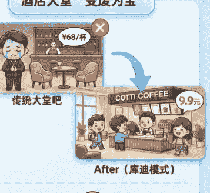
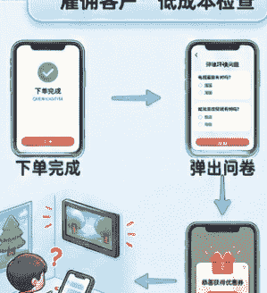

# 逐光而行 感谢有你

刘润进化岛 · 2025 岁末盘点

专题四 商业的底层逻辑与趋势

## 目录

- 刘润日课
  - 商业决策中的风险与止损逻辑
  - 商业机会判断：又难又贵的问题
  - 商业模式创新：利用全局性增量
  - 制造业出海趋势：做别人做不了的“难事”
  - 消费趋势：第四消费时代与精神消费
- 刘润问答
- 第一部分：商业竞争与战略逻辑
  - 需求是被发现的，还是被创造的？
  - 产品为王，还是渠道为王？（稀缺为王）
  - 面对红海市场、同质化竞争如何破局？（波特三大战略）
  - 预付费制的商业逻辑（本质是债务）
  - 实体门店如何应对线上冲击（利用线上的劣势）
- 第二部分：宏观趋势与行业变革
  - AI 时代流量经济是否会消亡？
  - AI 带来了效率也提升了失业率，怎么看？
  - 要素市场化配置是什么意思？有什么商机？
- 第三部分：商业模式的本质与效率
  - 贸易链条效率：增加环节也能提效？
  - 网红天价产品的商业逻辑
- 第四部分：经济周期与产业重构
  - 当“酒桌文化”消褪，如何让白酒承载新的文明价值？
  - 当下，个人创业开店真的就很难了吗？

公众号懒人搜索，懒人专属群分享

## 商业决策深刻复盘：风险与止损的底层逻辑

进化岛“刘润日课”| 2025 年 11 月 3 日 | 搬家引发的思考

### 表象事件：办公室“降级”搬迁

- 第 6 次搬家：1000 m² 大平层
  - 面积减少 1/3
  - 日期：2025 年 11 月 3 日
  - 直接原因：省钱。关停直播电商业务后，空间大量空置。
- 第 7 次搬家：~600 m² 内层

### 核心决策分析：为何关停盈亏平衡的直播电商？

- **直播电商业务**（低毛利，高风险）
  - 微薄毛利（例：牙膏赚 2 块）
  - 不对称风险
- **核心咨询业务基石**（高信誉，高价值）
  - 高价值信任资产（几十万股业务信誉）
  - 巨大不可控雷区（品控/物流/投诉）

**决策逻辑**：为了赚取微利，可能摧毁核心业务赖以生存的巨额信任资本。得不偿失，必须止损。承认能力边界，停掉后舒了一口气。

### 底层思维模型：克服“面子陷阱”

- 维护“从不犯错”的假象，咬牙硬撑。
- 完美的面子，沉没成本叠加，错误心态。
- 正确心态：咨询公司也会“生病”，承认不懂，打破执念，才能真正前进。
- **自我诊断**：方向大致正确，持续改进。

公众号懒人搜索，懒人专属群分享

## 刘润日课
### 商业决策中的风险与止损逻辑

日期：2025 年 11 月 3 日

今天是 2025 年 11 月 3 日，今天的日课。今天是我们第一天到新办公室上班，这已经是我们创业 13 年来的第七次左右搬家，具体次数已经数不清了。

这次搬家和以往最大的不同在于，我们是从一个最大的办公室搬出来的。第六次搬家时，我们搬到了一个 1000 m²的大平层，整层都是我们的。现在则搬到了一个内层，大概有 900 多、将近 1000 平米。而这次的新办公室，面积只有 500 多，接近 600 平米，面积比原来减少了三分之一。

为什么要搬到更小的办公室？第一目标当然是为了省钱。我们现在只有二十几个人，但在 1000 平米的办公室里非常空旷，大量面积完全用不到。当时之所以租 1000 平米的办公室，是因为我们要开拓直播电商业务。我们去看直播电商时，发现一旦做起来，动辄就是 100 人、500 人、甚至 4000 人的规模，所以至少得从一个稍微大一点的办公室开始，所以租了 1000 平米，其实也不算大。

但后来我们把这个业务停掉了，停掉的一个非常重要的原因是风险太大。所以我们今天的公众号也在讲这个事，正好和今天搬家有关。

那今天的日课，我就分享一些在公众号没有提到的内容，供大家参考。

其实那段时间，坦白说，我每天都有点提心吊胆。为什么会这样？因为挣不挣钱是很重要的事情，毕竟做业务就必须得挣钱。但实际上，我们有很多业务是不挣钱的。比如我们的公众号，早期从 2018 年创立到 2020 年才开始挣钱；视频号是 2021 年创立的，到今年 2025 年，差不多也有四年时间都没有挣钱。这是因为它们是战略性业务，需要成长，新业务必然有一个成长的过程。

润米优选这个直播电商业务，我们让它成长了一年，大概是 2023 年成长了一年左右，差不多有一个月实现了盈亏平衡。后面一直在盈亏平衡线上下波动，那一年我就把它停掉了。公众号坚持了两年，视频号坚持了四年，今年终于挣钱了，感觉一直做下去，势头越来越大，也没有出什么问题。但在直播电商这个业务上，我却选择把它停掉了。

停掉的原因是什么？非常重要的一点，并不是因为它挣不挣钱。其实我们可以容忍业务更长时间不挣钱，而是因为它冒着特别大的风险。

那段时间其实一直面临很大的挑战。最大的问题是什么呢？比如我们自己在卖一个牙膏，假设售价十几块钱，利润大约 20%，也就是两块钱左右。每卖出一管牙膏，虽然利润只有两块钱，但却要承担巨大的信誉风险。

如果物流出了问题，牙膏到客户手里破损了，这还算是小事。更麻烦的是，如果牙膏本身有质量问题，或者像水果类产品，送到客户手里已经变质了，那问题就更大了。当时我就觉得，我们提供咨询服务或者其他高客单价的服务，交付完成后基本就结束了，风险可控。但现在卖这些利润很低的产品，经常会遇到各种各样的挑战。

我们虽然加强了品控管理，但实际上对很多产品并没有那么了解。对某些产品有一定的了解和资料，但要做到对每一个产品都非常熟悉，并且完全不出问题，真的太难了。结果就是经常会出现品控的问题。我们的基本原则是，遇到问题就赔偿客户。但即使这样，还是不断有人投诉，问题也不断出现。赔偿之后，把这些成本算进去，其实不亏不赚倒不是最大的问题。

更重要的是，突然发现外界可能会觉得，原来刘润或者润米公司是一家很注重信誉和品质的公司，怎么连这种产品都在卖？其实我们并不是想卖这些产品，而是有时候真的做不好。做不好的原因不是因为挣不到钱，而是因为风险太大了。

我要说的就是，为了那两块钱的毛利，最后有可能会伤害我们几十万、甚至更高规模的咨询业务的信任度。这个挑战太大了，冒了一个巨大的不对称风险。所以在经营了一年左右、盈亏基本持平的情况下，我们就把这个业务停掉了。

停掉之后，我这颗心才算安定下来。原因就是，再也不用冒这种险了。这件事不是我们能做的事。我们确实有很多事做不了，太多事我们不懂了。尤其是这种极低毛利、挣非常微薄的钱，却要靠极大的量，同时还要冒着特别大的信誉风险的业务，而信誉对我们来说又无比重要，对我们所有其他业务来说都至关重要，所以这个业务必须停掉。停掉之后，真的觉得舒了一口气。

后来再去看，即便是董宇辉在直播间有时候也会说买澳门的月饼，人家其实查了整个证据链，但最后还是有人举报说这不是澳门的月饼。小杨哥其实也很努力了，我们去采访过，他真的很努力，但还是会出问题，他检查得那么仔细，还是会出问题，那我们何德何能？我们真的是做了一件自己不擅长的事，承担了巨大的风险。我们的是一个极度依赖信誉的业务，所以我们就把这件事停掉了。

其实我们也经常做很多错误的决定，没有人能够做出完全正确的决定。即便我们只是给别人做咨询，也经常会犯错。我们的管理上有很多问题，我们教别人怎么做管理，自己也有很多问题。就像医生自己也会生病一样，我们也会犯很多错误，做出不少错误的决策。我们一直跌跌撞撞地往前走，理论框架说得头头是道，但自己执行时也会有很多偏差。

这就是一家咨询公司，自己也有很多毛病。但是怎么办？就是遇到问题就解决问题，不断改进，方向大致正确，一路往前走。我一直提醒自己，千万不能犯一个毛病，就是“要面子的毛病”。什么叫要面子？比如说，我们是咨询公司，不能做什么事，做砸了以后怎么跟别人交代，怎么去教别人？如果因为要面子，就咬着牙把事情硬做下去，这就是要面子的毛病。一旦有了要面子的毛病，沉没成本只会越来越高。

承认自己有很多东西不懂，那就停掉嘛。如果有人说你们自己干直播没干成，那就说明我们能力不够，我们就是这样。

能力不够，我们确实有很多事情没做成，也会犯很多毛病。就像医生也会生病一样，生病了就好找人治。这是我特别想和大家分享的：咨询公司自己也有很多问题，咨询公司也需要请咨询公司，咨询公司也要给自己做诊断。甚至有时候自己诊断还不准确，因为带有太多情绪在里面。

但只要有一件事不要犯错，就是千万不要为了面子，觉得我们必须永远维护一个“从来不犯错”的形象。这个根本不可能，也维护不住。打破这个执念，心态才会朝着正确的方向，而不是只想着让自己看起来正确，才能真正往前进。

这是我今天想与大家分享的日课，也期待听到你的日课。

公众号懒人搜索，懒人专属群分享

## 商业机会判断：又难又贵的问题

进化岛“刘润日课”| 2025 年 10 月 28 日 | 创业者思考三维度

#### STAGE 1
维度一：大行业有没有趋势？
> 警惕：太宏观如“天气预报”，需具体分析

#### STAGE 2
维度二：找到“又难又贵”的问题
- 核心关键
  - 容易但价值低：聊天陪伴、普通商务宴请（竞争激烈，价值有限）
  - **又难又贵的问题**
    - 养老示例：专业医护/慢病管理、紧急处理。难在专业，贵在刚需。
    - 餐饮示例：极致私密（2000 吃出 8000），进出不见人。稀缺体验：8000 效果/独家松茸。难在稀缺，贵在独特体验。

#### STAGE 3
维度三：凭什么你是你能解决？
- 核心竞争力
- 组织能力强：高效组织一批人
- 我的独特优势是什么？
- 独家资源：拥有稀缺供给

#### 总结：商业机会判断三步法
- 确认行业大趋势
- 锁定“又难又贵”的具体问题
- 明确自身核心竞争力

公众号懒人搜索，懒人专属群分享

## 商业机会判断：又难又贵的问题

日期：2025 年 10 月 28 日

创业者如何判断养老等行业机会的三个思考维度

今天是 2025 年 10 月 28 日。今天的日课，我在重庆参加了一场活动，现场有 1000 到 1500 名创业者和企业家。在台下听我做分享的人很多，这是我自 06 年演讲之后的第一次分享，大家有很多人都听过我们的年度演讲，我也挺高兴。分享结束后，有一位创业者问了我一个问题：他打算组织一批人在社区里做养老，问我这个方向有没有未来。这个问题当时我有点难回答，但还是思考了一下，并把问题拆解开来，做了分享。

我把这个问题分为三个部分来思考：

养老这个事情有没有未来？我认为当然有未来。就像我在年度演讲中讲过，中国有 3 亿人正在集体退休，每年有 2000 万人退休，这是一个巨大的基数。随着人口老龄化和少子化，养老市场会越来越大。从大趋势来看，养老是一个很有未来的领域。

具体到每个行业，比如吃、喝、住、医疗等，都需要细致分析。虽然养老是一个巨大的市场，但具体到细分领域，还要具体看。商业问题不能只停留在趋势层面，不能只回答“有没有未来”这个问题，这就像每天问天气怎么样一样，需要更深入的思考。你说，明天全球天气平均温度是 17°，但这个温度和你所在的城市有什么关系？和你家门口有什么关系？你必须得更具体。接着，第二个问题其实更重要，不是养老有没有未来，而是你在养老领域做的哪一件事情，解决了什么问题？

这个问题是不是很贵？这才是比较重要的。比如说，你解决的是看病的问题，还是健康管理、慢病管理、高血压、紧急处理等问题，这些问题都很重要。再比如说看护的问题，也很重要。但如果你解决的是每天陪老人聊天，这个问题也重要，但能做到的人太多了。只有那些又难又贵的问题才是真正重要的。

记住，“又难又贵”。贵，指的是客户觉得值得花很多钱；难，指的是能做到的人很少。所以，在养老领域，哪个问题是越来越贵的，这是第二个非常重要的点。你得把这个问题找出来。这个问题他可能有一些思考，但也许没有那么深入的考虑。

第三个问题是，凭什么是你？如果你找到了又难又贵的问题，凭什么是你来做？你的核心竞争力是什么？你说组织一批人，你的组织能力强在哪里？这个世界上不存在一个容易的事还未被人发现，所有容易的事都已经被人发现了，没有容易的事会被人发现。

养老是不是未来？其实我们不应该把关注点放在养老是不是一个容易、未被发现的事情上。养老确实是未来，但关键在于第二点：要找到那些难的、贵的事情。第三点是，凭什么是你来做？按照这三个顺序思考，很多问题就能想明白了。

顺便说一下，关于商务宴请，有一个餐饮企业做得挺不容易。今年我在年度演讲中提到，商务宴请和团队聚餐比去年减少了大约 24%，差不多有四分之一的人不出来吃饭了，这确实很难。企业主说装修已经花了很多钱，我也认同现在确实很难，尤其是老龄化到来后，老年人不出去吃饭，情况会更难。那怎么办呢？如果真的要做商务宴请，只能在相对更少的商务宴请市场里做得比别人更好。怎么做到比别人好？还是要找到那些难而贵的需求。举个例子，比如商务宴请采用纯包厢式，没有大堂，这已经不错了。那能不能做到让任何一个人进门都不会遇到其他人？也就是说，任何一个人到你的包房吃饭，都不会撞见其他人。有些人会非常在乎请人吃饭或者被请人吃饭时会不会被别人看见，这种人一定存在。这个需求其实非常“贵”。

如果你的餐厅有十几个包间，任何一个人去请客，都不会被其他人看见，这就能满足对私密性要求极高的客户，比如请一个非常重要的人吃饭。举个例子，比如说请马云吃饭。如果请马云吃饭，一路走过去，可能会被很多人认出来，“这是马老师吧，来合个照”，场面会很尴尬。如果能做到从进门到包房吃完再离开，都不会被人看见，这就是一个非常独特的需求。只要你能满足这个需求，即使只有一个餐厅、十几个包间，在重庆这么大的商务宴请市场里，养活一个餐厅都不是问题。这就是要满足一个非常独特的需求。

再比如，又难又贵的需求是什么？就是我今天请人吃饭，想让对方知道我非常重视他，所以这顿饭我请了，花了很大的代价。什么叫“很大的代价”？我希望对方知道我花了很多钱，但又不好意思直接说，比如请你吃鱼翅，但你也不知道鱼翅多少钱。

最后大家通常的做法是把两瓶茅台放在桌上，一瓶 3000 元，两瓶就是 6000 元。有没有办法不是用茅台，也能让请客的人用 2000 块钱吃出 8000 块钱的效果？

这就是一个非常“贵”的问题。通常这种情况需要依靠独家资源，比如松茸。举例来说，整个重庆上周五才采下来的松茸，一共只有五斤，其中只有一斤流入市场，中间的二两在我这里，剩下的四两是用来做国宴，招待外国领导人的。就这二两在我这里，这就叫稀缺。这样一来，客人会觉得这松茸非常珍贵，必须好好品尝。

你要做的，就是用 2000 块钱请出 8000 块钱的效果。如果能解决这个问题，餐厅的生意也会做得不错。所以，“又难又贵”的问题是什么？凭什么你是能解决？任何一个领域都是这样，你要回答三个问题：这个大行业有没有趋势？大行业里面“又难又贵”的问题是什么？凭什么你是能回答这些问题？这是我作为创业者的一些感受，今天想在进化岛与大家分享。我不知道你是不是也有类似的经历，如果有的话，欢迎交流。这也是我今天的日课，期待听到你的日课。

公众号懒人搜索，懒人专属群分享

## 商业模式创新：利用全局性增量

进化岛“刘润日课” | 2025 年 8 月 27 日 | 库迪咖啡案例分析

### 核心概念：全局性增量 (Global Increments)
- 整合商业世界中被浪费的资源，创造新价值

### 酒店大堂“变废为宝”

- 节省人力成本
- + 赚税租
- 酒店：低租 + 低客户稳定
- 库迪：消费者
- 价值 + 咖啡 + 无尴尬
- 三方共赢：利用闲置空间，重构价值链

### “雇佣客户”低成本检查

对库迪：
- 节省运营检查成本，高效率

对消费者：
- 优惠券感觉赢得的 & 价值感，鼓励重复购买

巧妙设计：利用消费者回眸时间，实现低成本高效运营

总结：商业模式创新的本质，就是发现并利用那些“被浪费的全局性增量”！

公众号懒人搜索，懒人专属群分享

---

## 商业模式创新：利用全局性增量

日期：2025 年 8 月 27 日

库迪咖啡商业模式创新案例分析

今天是 2025 年 8 月 27 日，今天的日课。我在杭州参加了一天的家电行业活动，活动结束后开车回上海。

在参加活动的时候，我想点一杯咖啡，于是去了酒店大堂。结果发现，原来大堂里那个传统的“大堂吧”没了。沙发和椅子还在，但点咖啡的地方已经变成了库迪咖啡。我看到库迪咖啡的那一刻，觉得挺有意思。

为什么这么说呢？因为库迪确实挺聪明的。我之前没想到库迪会想到这种做法。具体来说，库迪很会搞商业模式。以前很多酒店的大堂吧几乎没人做生意，很少有人会在那点一杯六十八块钱的咖啡，或者三十多块钱的饼干。一百多块钱坐在那里等人，基本没什么人会这样做。酒店还要养两个员工，发工资，但生意又做不起来，还占了很大空间。很多酒店的大堂吧在我看来肯定是严重亏损的。很多人只是想等个人，但又不好意思不点东西，酒店还要赶人走，场面很尴尬，既亏钱又影响形象。

今天看到库迪的做法，觉得他们真的很聪明。我猜测（因为没和他们沟通过），库迪可能是把这个地方整体包下来了，对酒店说：“你们以后别自己搞大堂吧了，我来帮你做。”原来的大堂吧有个吧台，库迪把它改造成自己的咖啡店，付给酒店租金。这样一来，酒店不用再养那两个人，也不用再付工资，还能减少亏损。

这样一来，酒店不用再养那两个人，这部分开支就省下来了，还能收租金，何乐而不为呢？而且原本大堂吧的功能也都还在，大家本来也就是想坐下来喝杯咖啡。座位还在，小点心也还在，只是换成了库迪咖啡。所以酒店既省了人力成本，又有了租金收入，整体来说肯定是愿意接受的。

至于库迪，他们可能以外面公开场合更便宜的租金租下了这个地方，还能获得很多非常稳定的客户。毕竟来开会的人，多少都会考虑要不要点杯咖啡。就像我今天参会时，原本如果一杯咖啡要 68 块钱，或者一块蛋糕 98 块钱，我肯定不会点。但库迪的咖啡只要 9 块 9，所以我就点了。很多人坐在那里也会觉得价格不贵，就会点库迪咖啡，大家都很自然地消费了。这样库迪既赚了钱，又省了租金，把两边的需求结合起来，确实挺聪明的。

后来我点完咖啡，下单后系统弹出了一个调查问卷。我觉得库迪这点也挺有意思，做得还不错。调查问卷问我一个问题：电视屏幕上有没有显示某个画面？它给我看了一张图片，让我回头去看电视上的内容。

我点了个确认后，系统接着问服务员有没有点确认，以及有没有一张特定样子的海报，海报上有没有树。我看到有个树，然后回答了五个问题。回答完后，系统恭喜我送了一张库迪咖啡的优惠券，我觉得这太聪明了。

本来这活是要库迪的运营人员派人上门检查的，比如物料是否摆放到位，电视是否正常开启，不能影响形象。派人上门检查的成本很高，现在让消费者帮忙检查，既省了成本又提高了效率。可是消费者凭什么帮你检查呢？送你一张优惠券，你回答五个问题，回头一看就知道了。所以不需要专门派人上门，让每一个消费者帮你检查。

我们以前在五分钟商学院写过一堂课，叫“雇佣客户”。通过雇佣客户来感受一下，给你优惠券。其实人家本来就想给你优惠券，给你优惠的目的是让你再喝。本来给你，你也不珍惜，现在你发现你回答了五个问题之后，给你优惠券，你就珍惜了。所以这个优惠券是我赢来的，你可能觉得它有价值，太聪明了。

我看到库迪的这两个动作，让我对库迪刮目相看。这群人特别懂得如何整合资源。其实商业世界中有大量被浪费的资源，如果能用某种模式把这些资源整合起来，这就是个极其聪明的做法。

这就是商业模式的创新。我们经常给很多企业家讲解什么是商业模式创新。今天在库迪看到的案例，很好地诠释了商业模式的重要性。

这里有一个非常重要的概念，叫做“全局性增量”。比如消费者被浪费掉的“回眸时间”，还有酒店大堂被浪费的空间，这些都可以被回收并纳入商业模式中。这就是商业模式的创新，非常有意思。

你平时是否注意到一些利用“全局性增量”的商业模式创新案例？如果有的话，欢迎分享。这也是我今天的日课，期待听到你的见解。

---

## 制造业出海趋势：做别人做不了的“难事”

进化岛“刘润日课” | 2025 年 11 月 14 日 | 贵州轮胎灯塔工厂参访感悟

## 震撼案例：巨型矿山胎的“暴利”秘密

| 项目 | 详情 |
| :--- | :--- |
| 单条价格 | 约 50 万 RMB |
| 整车轮胎 | 6 条 = 300 万 RMB |
| 承重 | 80 吨/条 |
| 规格 | 63 英寸巨型胎（比人高） |
| 优势 | 中国制造 - 高性价比 |
| 背景 | 中国突破技术封锁，价格被打下来 |
| 历史 | 20 年前米其林售价：80 万美元/条（约 640 万 RMB） |
| 特征 | 昔日垄断 / 极高溢价 |

## 核心逻辑：越难 = 越稀缺 = 定价权

- 工艺极难：非简单放大，需全新“卷毛线”式工艺
- 极少能做：形成高技术壁垒
- 拥有定价权：获得高毛利

真正的机会在于解决“又难又贵”的问题。

## 未来趋势：凭硬实力出海

- 年规模：100 亿 +
- 国内：> 50%
- 国外：> 40%
- 企业：贵州轮胎（首家轮胎灯塔工厂）
- 巨大增量空间：欧美乘用车市场，消费者看重性价比，品牌执念弱
- 中国制造出海新范式：产能 + 创新 + 制造好产品的能力

---

## 制造业出海趋势：做别人做不了的“难事”

日期：2025 年 11 月 14 日

贵州轮胎灯塔工厂参访见闻与感悟

今天是 2025 年 11 月 14 日，今天是我们“问道中国·贵州行”的第三天。我们从茅台镇到了遵义，然后又到了贵阳。

今天在贵阳参访了一家轮胎企业，就是著名的贵州轮胎。贵州轮胎成立于 1958 年，现在一年能做到 100 多亿的规模，国内市场占比超过 50%，国外市场占比超过 40%。他们在东南亚和摩洛哥都有建厂，实力非常强。贵州轮胎是中国唯一一家获得“灯塔工厂”称号的轮胎企业。

所谓“灯塔工厂”，是由世界经济论坛和麦肯锡联合评定的标准。贵州轮胎是中国唯一一家轮胎行业的灯塔工厂，这个殊荣非常值得大家学习。

但最让我震撼的不是这些，而是听他们讲了一个故事，非常有感触。他们不仅生产乘用车轮胎，比如大家熟悉的固特异、米其林、邓禄普等品牌的轮胎，也生产商用车轮胎，尤其是矿山用的轮胎。

矿山轮胎的规格非常大。今天第一次见到灯塔工厂生产的矿山轮胎，才知道什么叫“巨型轮胎”。比如一个矿山轮胎的内径，也就是装轮毂的部分，不算外径，竟然有 63 寸。

这个轮胎有多大呢？我待会儿会把照片放在这里。这个轮胎比我还高，单个轮胎高达两米多。那辆矿山车，我看照片，车身高度大约是轮胎的四五倍，也就是说，这种矿山车至少有 8 米高。要爬到驾驶舱，就像爬到三楼一样，才能进入驾驶舱。

这辆车需要用到这种超级轮胎——全球最大的轮胎，63 寸。据他们说，可能还有更大的，但他们说目前最大的就是这个型号。每辆车需要 6 个轮胎，前面两个，后面四个。为什么要这么多？因为矿山运输的需求非常巨大，这种巨无霸矿车一次要运载 300 吨。以前普通卡车载重只有 5 吨、10 吨，而这种矿山车要拉 300 吨。

每个轮胎的承重是 80 吨，六个轮胎总承重 480 吨，但车辆的核定载荷是 300 吨。一个轮胎能承重 80 吨。

我就问他们，这个轮胎多少钱？这辆车多少钱？他们的回答让我很震惊。一个轮胎的价格是五六十万元。一只轮胎就要五六十万元。买一辆乘用车都不需要这么多钱，而一只轮胎就要五六十万元。

一辆矿卡需要用 6 个轮胎。按每个轮胎 50 万元计算，6 个轮胎就是 300 万元。一组轮胎 300 万。我问他们，这辆车到底多少钱？他们说，轮胎 300 万，整车大约 4000 万。这种矿山用的巨型矿卡，载重能达到 300 吨，整车价格约 4000 万，轮胎 300 万。

我又问，轮胎是耗材，这 300 万一组的轮胎多久需要更换一次？他们说一到两年就要换一次。也就是说，每两年就要再花 300 万换一组轮胎。矿山运营成本非常高，光轮胎就很烧钱。300 万一组轮胎，每一吨胎都要精打细算，什么场景用什么胎，必须省着用，只有在特定场合才会更换。因为轮胎太贵了，所以要根据车辆跑了多少公里、在什么场合使用来决定是否更换。

我还问，这么贵的轮胎以前是谁生产的？他们说，以前中国像贵州轮胎还没做这个型号时，是米其林生产的。大约 20 年前，米其林一个轮胎卖 80 万美元。我当时很震惊。一个轮胎 80 万美元，6 个轮胎就是 480 万美元。如果按当时汇率 1:8 计算，480 万美元就是 3840 万元人民币，接近 4000 万人民币。一组轮胎就要 4000 万人民币。

一组轮胎两年更换一次，所以说矿山是黄金，但其实轮胎才是真正的“黄金”。为什么能卖到 80 万美元一个？只有一个原因，就是你做不出来。你做不出来，人家就能卖到 80 万美元一个。他说，这种轮胎的制造方法和其他轮胎完全不一样。只要尺寸变大，工艺就完全不同。

比如乘用车轮胎，是用一张橡胶皮卷几圈后，把接口烫合、缝起来。而这种承重 80 吨、载重 300 吨的矿卡轮胎，如果用普通胶皮卷的方式制造，根本承受不了压力，一夹就裂了。它的制造工艺就像卷毛线一样，一圈一圈地卷起来，工艺完全不同。不是简单地把轮胎做大、材料加多，而是整个工艺都彻底不同。以前我们做不出来，所以他们能卖到 80 万美元一只轮胎。我以前从来没想过轮胎能卖到 80 万美元。

后来我们就不断研究、不断改进，终于做出来了。一旦我们能生产这种轮胎，米其林就再也卖不到 80 万美元一只了，价格被打下来了。

所以，真正想赚钱，就得做出别人做不出来的东西，或者把别人能做的东西做得更便宜。这就是商业永恒不变的道理。

现在你去做一个乘用车轮胎，乘用车轮胎的市场量非常大。一个乘用车轮胎售价几千块钱，成本几百块钱。而矿卡轮胎一支要 50 万人民币，虽然比 80 万美元、50 万美元便宜多了，但依然非常贵。正是因为你能够做到别人做不到的事情，所以本来以为轮胎没什么好参观的，觉得轮胎是很普通的东西，但实际上还是很震撼。

轮胎里面有非常复杂的工艺，能够做出能载重 300 吨、售价 50 万人民币一只的产品。

所以，任何事情如果我们看到有点难，我经常有一种感觉：有的人看到难就退缩，但我现在越来越懂了，看到难的事情应该兴奋。为什么？越难的事情说明越少人能做到，越少人能做到，你就越能挣到钱。因为别人做不出来，真正需要这个产品的人没有太多选择，你就拥有定价权。所以，越难的事情其实才有机会做得越好，才有机会获得高毛利。

今天参观贵州轮胎，还是挺有感触的。我就问他，那未来呢？未来最大的机会在哪里？他说，现在中国的商用车，比如卡车，绝大部分都用中国轮胎了，因为大家比性价比，算下来中国轮胎更划算，毕竟轮胎是耗材。但中国的乘用车，也就是轿车，因为消费者不懂轮胎，还是在买品牌，觉得这是关乎生命的事情。所以即使便宜 500 块钱，很多人也不买国产轮胎，宁愿多花 500 块钱买外国品牌。

他说，在美国情况不一样。中国轮胎在美国乘用车市场的占比，其实比中国轮胎在中国乘用车市场的占比还要高。因为美国人早就把车当成非常普通的商品，轮胎也被视为经常更换的易耗品，没有那么重要的品牌执念。所以，未来真正的轮胎机会，可能就在欧美市场的乘用车轮胎，这才是一个巨大的增长空间。

因此，出海，带着中国越来越强的产能、创新能力和制造好产品的能力，出海可能是很多企业真正的机会。这是我今天在贵州轮胎的感触，与你分享，也是我今天的日课。期待听到你的日课。

---

## 消费趋势：第四消费时代与精神消费

进化岛“刘润日课” | 2025 年 8 月 19 日 | 与三浦展访谈深度分析

## 中日时空参照系

| 维度 | 日本 | 中国 |
| :--- | :--- | :--- |
| 老龄化/人口见顶 | 早约 14 年 | 正逐步走向类似状态 |
| 时差 | 约 14 年时差 | |

## 核心变迁：从物质欲望到精神需求

- **第三消费时代**
  - 纯物质欲望下降
  - 回归理性，追求情绪价值
  - 谷子

- **第四消费时代**
  - 精神/文化消费上升

## 具体表现：三大精神消费趋势

- 1. “中古”与实用主义
  - 非因没钱，而是喜好/环保
- 2. “谷子经济”与孤独感
  - 少子化带来孤独，寻求心灵慰藉
- 3. 体验与“悦己”消费
  - 为美术馆、旅行等精神享受买单

## 总结心态：新消费观

- 该省省 该花花
- 迎接必然的消费变革

---

## 消费趋势：第四消费时代与精神消费

日期：2025 年 8 月 19 日

与三浦展访谈：中日消费时代变迁与精神消费趋势分析

今天是 2025 年 8 月 19 日。今天的日课，晚上大概七点钟左右，我在办公室录了一个访谈。这个访谈是和一位著名的日本学者三浦展老师进行的。

我去年 6 月份去日本的时候，专门拜访了三浦展老师。因为他写过很多关于日本老龄化、日本当下的消费场景，以及日本各种社会心理的书，所以我一直很感兴趣。

为什么呢？因为日本现在的老龄化现状，大概比中国早了 14 年。什么意思呢？就是日本的人口见顶，比中国早了 14 年。日本的人口结构中，劳动人口比例减少，这个变化也比中国早了 14 年。换句话说，日本的老龄化进程大概比中国早 14 年。

我经常想去看看日本的情况。虽然日本和中国有很大的不同，但我总想了解，比我们早 14 年进入老龄化社会的日本，在这方面有哪些相似之处。日本为应对老龄化做了哪些努力？哪些措施是有效的，哪些没有效果？他们的社会心理发生了哪些变化？这些变化对企业意味着什么？大家都做了哪些尝试？什么样的企业能够活下来，甚至活得更好？

带着这些问题，今天我就采访了这位三浦展老师。他写过一本非常著名的书，叫做《第四消费时代》。最近他也出了一本新书，叫《第五消费时代》。所以今天我就抓住这个机会，和他好好聊了三个多小时。当然，我不懂日文，所以请了翻译在中间，把我的问题和他的回答都翻译了一遍。

如果说最大的收获，想和大家分享一下，就是在经济遇到挑战的时候，日本出现了一个和中国现在刚刚有苗头的、非常类似的场景。这个场景是什么呢？就是大家对纯粹物质消费的欲望会降低，而对精神消费的需求会上升。这种情况在日本已经发生了，而在中国才刚刚开始显现。如果从“早 14 年”的角度来看，中国可能正在逐步走向这样的状态。

这个状态被三浦展称为“第四消费时代”。什么意思呢？举几个例子，比如现在日本的一些年轻人，至少有一部分人，不太想买新衣服，更愿意买二手衣服。你可能会觉得是因为没钱吗？但他们并不这么认为，他们觉得这是一种喜好。所以日本的“中古文化”、中古店就非常流行。大家买二手衣服，是觉得环保，是自己的爱好和偏好。他们并不觉得是因为没钱才去买，实际上也确实不是没钱。

不过，日本进入所谓“失去的 30 年”后，和中国现在遇到的一些经济挑战还是有很大不同。日本已经进入了中产阶级社会，在日本人均 GDP 已经很高的情况下遇到了挑战。而中国的人均 GDP 只有 1.3 万美元，比日本差很多，而且贫富差距还比较大。这意味着很多人还不是中产的情况下遇到了这个挑战。所以当然不一样，但相同的地方是什么呢？大家对纯物质、对品牌、对奢侈品的欲望在下降。

为什么在过去高速发展的时候是一种心情？遇到挑战之后，是另外一种心情，觉得买二手挺好的，买什么奢侈品，买一辆小一点的车就足够了。大家对纯物质消费的欲望在下降。在第一消费时代、第二消费时代、第三消费时代，一个台阶一个台阶往上买越来越多东西，买越来越贵的东西。那个时代过去了，在第三消费时代的时候，一个家里面可能是爸爸买一台电视，妈妈买一台电视，小孩子看见家里好多电视，但他觉得没有必要了。到第四消费时代的时候，他对存物的欲望在下降。买什么呢？大家对文化、对情绪价值的花费在上升，这在中国也是非常类似的。

你在中国大家对品牌，比如说买一个化妆品开始比配料表，什么品牌不品牌没有那么重要了。我看看化妆品的配方不就知道了吗？我就买了个配方，这体现了回归理性的、对纯物质消费的理性回归。

最近，京东开始布局硬折扣店，奢侈品品牌也开始进驻奥特莱斯。这表明人们对纯物质消费的欲望正在下降。日本比我们早很多年就进入了这种状态，而中国可能也会步入这一阶段。因此，大规模生产普通消费品，尤其是那些品质一般但价格虚高的产品，将面临巨大挑战。

那么，人们会转向消费什么呢？答案是文化消费。以日本的谷子经济为例，它指的是动漫及其周边产品。为什么谷子经济在日本流行？如今，中国的谷子经济也开始兴起。原因何在？很大程度上是因为动漫的流行。而动漫为何流行？一个重要原因是日本年轻人的孤独感。由于少子化和老龄化，年轻人缺乏兄弟姐妹，感到孤独。他们需要在另一个世界中寻找朋友，寻求心灵的慰藉。

回顾我们这一代中国人，小时候看《一休》，后来的一代看《海贼王》，再往后看《灌篮高手》。几乎每一代中国孩子都看过一些日本动画。日本动画之所以流行，正是因为孤独。这种文化在中国也越来越热，原因同样在于孤独——没有那么多朋友，没有兄弟姐妹，因此这种文化开始流行。

谷子经济流行最主要是因为孤独，大家寻找一种心灵上的感受。这在中国也是如此，现在的孩子也越来越孤独，开始追求宠物、竞技等精神愉悦的消费，即所谓的“悦己消费”——该省省，该花花。

这种消费观念体现在哪里呢？在日本，很多人把钱花在博物馆、旅行、美术馆等精神享受上。这种变化在中国也逐渐出现，这就是所谓的第四消费时代。

当然，日本与中国仍有相当大的不同。日本是在中产阶级几乎全面中产化的情况下，进入了“失去的三十年”。中国的状况则不同，但在老龄化结构等方面有非常大的相似性，确实有很多可以借鉴的地方。

如果这种“该省省，该花花”的心态在中国也适用，并在十几年间逐渐出现，那么一定会发生巨大的消费变革。我们以前认为必然的事情，未来可能就不再必然了。

你认为这种物质消费下降、精神消费上升的情况会在在中国出现吗？如果会，哪些品牌可能做得好？这对我们意味着什么机会？欢迎在留言区分享你的看法。

这是我今天的日课，也期待听到你的日课。

---

## 刘润问答

### 第一部分：商业竞争与战略逻辑

#### 需求是被发现的，还是被创造的？

**问题：** 刘润老师，需求是被发现的，还是被创造的？

**回答：**

关于这个问题，很多人都有不同的观点。那么，我的观点是什么呢？我的观点不一定对，仅供参考。

我的观点是：需求从来都不可能被创造，需求只有可能被发现。这时候，我们需要理解三个概念：产品、需求和欲望，这是三个不同层次的概念。

比如，你卖一张从上海飞往北京的机票。这张机票以及它背后所提供的服务——把你运到北京——这就是你的产品。但是，用户对产品本身并没有需求。这句话很重要：产品只是用户满足需求的一种解决方案，用户从来不会对产品本身有需求。

那么，用户的真正需求是什么呢？用户的真正需求是更安全、更便宜、更舒适地到达北京。这种需求从未改变，一直如此。航班只是满足这一需求的一种产品，而不是激发用户需求的源头。用户的需求是“去北京”，而不是“航班”。

有一天，用户发现高铁也能去北京，而且高铁更快（四个多小时就能到达），更舒适，不用关手机，还有网络。于是，很多人选择了高铁。为什么呢？因为高铁和航班满足的是同一个需求：更便宜、更舒适、更安全地从上海到北京。所以，高铁和航班变成了竞争对手。

同样地，用户也不会对高铁本身有需求，因为高铁也只是满足需求的一种解决方案。用户真正的需求是“去北京”，而“舒适”背后满足的是更底层的欲望——快乐、轻松和享受。这种享受是人的底层欲望。所以，用户真正拥有的是产品、需求和欲望。需求从未改变，但产品一直在变化。

很多人说需求是被创造出来的，这其实是一个巨大的误解。例如，人类怎么会对蛋糕有需求呢？在没有蛋糕的时候，人类的需求是什么？蛋糕只是满足“吃到嘴里浑身舒爽”这一需求的一种解决方案。所以，所有能满足这一需求的都是竞争对手，它们都是满足同一需求的不同解决方案，也就是所谓的“产品”。需求从未改变，改变的只是不同的解决方案和千变万化的产品形态。

所以，千万不要爱上自己的产品，而要爱上用户的需求。产品从来都不重要，过去不重要，未来也不会重要。只有需求才是最重要的。希望我的观点对你有所启发。

### 产品为王，还是渠道为王？（稀缺为王）

问题描述：刘老师好，昨天才上岛，我是一名生鲜行业创业者，专注社会餐饮连锁品牌食材配送服务。在我们这个赛道，门槛极低，不达规模竞争对象都是一些个体夫妻档口。目前经营的品类有 10 个，涉及 1000 个 SKU，（还不全，大概 5000 才算一站式）我想减少 SKU，聚焦产品的思路去服务餐饮，甚至对客群也调整；服务单店，形成现金流效应。这里面是不是也存在节奏和阶段的选择!

回答：

这个问题是一个好问题，产品为王还是渠道为王？其实产品或者渠道谁为王，只是在不同的时间段而已。他在这两个社会王更底层的是什么呢？更底层的是叫稀缺为王，就是谁稀缺谁就是王者。所以有的时候是产品为王。比如说苹果，他在大家都做不出好手机的时候，能做出一款那样的手机你就买不到。所以这个时候渠道就得去求着他，你让我买你的东西，这个时候就是产品为王的。

但是在有些时候，产品高度同质化了，就像是家电，很多家电高度同质化的时候都卖不出去了，就是都希望渠道能帮他卖，渠道就想你们就得给我好处，所以这个时候渠道就为王了。所以像苏宁就在线下的时候，苏宁就变成王者了。

所以到底产品为王和渠道为王，其实它背后的底层逻辑是谁稀缺，谁就是那个王者。所以有的时候产品稀缺，有的时候渠道稀缺，那用在你的身上也是一样。当你问产品为王还是渠道为王的时候，你最好也许把它换一个问法，就是在你的行业产业链里面，什么东西是相对稀缺的，我有没有可能掌握稀缺的能力。比如说当你做餐饮的供应链服务的时候，如果我能做到的某一个单品能做到更大的规模，我是不是能在这个单品上面我的价格就会有更有采购优势。

这样给所有人供货的时候，我想举个例子，比如说大家都卖生蚝或者都卖那个那个冻鸡腿。因为我的卖的冻鸡腿量特别大，我只做冻鸡腿。所以说我只做这个，我专注做这个，我就能找到特别好并且价格很低的东西。那这时候我就稀缺了，那就有威望了。但如果做不到一个单品能做到这样的东西的话，那就是大家不想跑到那么多地方买东西，我就想在一个地方买。就你说的一站式，那钱也是稀缺的，那你就为王了。所以不是产品为王，也不是渠道为王，而是稀缺为王。产品稀缺是产品为王，渠道稀缺，渠道为王，希望能给你带来一点启发。

### 面对红海市场、同质化竞争如何破局？（波特三大战略）

问题：针对红海市场竞争激烈，同质化严重，利润空间很小，刚刚入行的初创公司，您能给些方向和建议吗？

问题描述：刘老师，我刚刚踏入烘焙包装电商行业 6 个月，没有生产线，采购做货架电商，目前主做淘宝和拼多多，是个初创公司：打包，客服和我三个人小公司，我自己做运营，当时觉得是消耗品市场空间大，门槛低进入。因为竞争激烈，产品同质化严重，利润低，推广成本高，现在有些迷茫，您能针对行业现状给我一些方向和建议吗？

回答：

其实你的问题里已经包含了答案，这是商业的基本道理：价格是随着供需关系变化的。当你提到“内卷”或“同质化严重”时，本质上都是在说供大于求。因为大家都做同样的东西，价格自然上不去，于是就出现了内卷。这是最基本的商业逻辑：一旦供大于求，必然会出现这种情况。而你的问题本身已经暗示了解决方案——要让供小于求。

那怎么做到供小于求呢？就是要做出别人无法与你同质化竞争的产品或服务。迈克尔·波特的竞争理论讲得很清楚，道理简单，但做到很难。简单和困难并不矛盾，很多道理都很简单，只是大家不愿意去做。

他提出了三个策略：

- 第一是总成本领先。在大家都做同质化产品时，这是所有行业的必然趋势。只要有稍高的毛利，大家都会涌入。在这种情况下，我的成本比你低，我的价格就能比你低；或者价格相同，我的利润比你高。通过总成本领先，你就能在同质化竞争中占据优势。

- 第二是差异化。如果做不到总成本领先，那就做出别人做不出来的东西，与他人不同，而且别人想学也学不会。这条路很难，难就难在对用户需求的深刻洞察。你要搞清楚用户真正想要什么，哪些需求还未被满足，以及你是否能满足这些需求，而且比别人做得更好。如果能找到差异化的优势，就能赚到更多的钱。但如果没有壁垒，这些利润很快会被下一轮竞争抢走。

- 第三是聚焦。选择服务好周围的十个客户，对他们的需求洞察得非常透彻，把服务做到极致。别人因为不了解这些客户，做不好；而我们却因为太了解他们，能够提供深度服务。这种非常深刻的客户关系也是一种竞争优势。

这三个策略，值得好好琢磨。

### 预付费制的商业逻辑（本质是债务）

回答：润总，想请教下预付费制的商业逻辑。

问题描述：润总好，我想请教下预付费制的消费模式还值得去推广，去做这个吗？例如先学后付，先用后付，先享后付。能给我们讲讲商业逻辑吗？

回答：

预付费这个制度，本质上是一种债务逻辑。

通常来说，一家公司可以从三个渠道“借钱”：银行、上游供应商和下游客户。而预付费，其本质就是向你的下游客户借钱。它不是一种商业模式，而是一种融资手段。

所以，你首先要问自己：我的商业模式本身成立吗？

什么叫“本身成立”呢？举个例子，我开一家健身房，卖给客户一张五六千元的年卡，客户在一年内真的能把这张卡的价值用完吗？或者我开一家理发店，卖给客户一张包含 20 次服务的储值卡，客户真的会来消费满 20 次吗？这个基本的价值交换逻辑必须成立。

在这个逻辑成立的前提下，客户之所以愿意预付费，是为了换取折扣。

但如果这个逻辑不成立，比如你的服务本身不到位，那么消费者最终会发现预付的费用根本用不完，而用不完的部分，他们是会要求退款的。这时，如果你已经把这笔钱挪作他用，资金链就会断裂，最终导致“崩盘”，甚至“跑路”。

对于这种事，如果企业规模较小，工商等监管部门可能无暇顾及；但如果规模大了，国家就会进行监管，要求将预付费资金存入第三方托管账户，商家是不能随意动用的。

但归根结底，还是因为预付费不是商业模式，而是一种借贷模式，所以必须非常谨慎。你要研究清楚，在你的生意里，客户付出的价格和获得的服务价值是否对等。只有当这个价值交换成立时，预付费才能成为一个稳妥的、能改善公司现金流的融资工具。

### 实体门店如何应对线上冲击（利用线上的劣势）

问题：实体门店，如何应对线上冲击

问题描述：刘润老师您好，我们在深圳做包子门店，目前 22 家门店，门店现状：虽有利润，但增长乏力，甚至部分门店开始下降，出现亏损，面临问题：线下无增长，线下负增长，设想通过选址，实现线下增长，摆脱依赖线上，尝试新开了几家，结果门店依旧需要依赖线上。

回答：

包子店，我没有什么研究啊，但作为一个消费者，我自己平常只是在早餐的时候才会吃包子啊，午餐晚餐可能都不怎么吃。而早餐的时候呢，我基本上也不会点外卖，但我猜还是有人会点啊。

所以这个点外卖这个事情和线下的这个生意这个事情，我觉得最主要的，如果就对抗它，就要去想一想，线上的优势是什么，线下的优势是什么，把这事想明白。

线上的最大的优势啊，那就是我不用出门，我就坐着那就行了，有人给我送上门，这是它最大的优势。但是呢，就要想它有没有劣势啊？那比如说送到门上之后，它的就冷掉啦，有些东西送到门就不好吃啦，那一定有这些劣势对吧？当然还有配送费啊，等等等等，所以这些原因。那另外就是，有的时候我既然要送上门，那我就在那不能动啊，我至少得等个 30 分钟才能等他送来，这些都是劣势。

就当我们去思考怎么去对抗线上的时候，就得去打他的弱项，就打他的劣势。这劣势如果是那个，那个要等 30 分钟，那就想一想，有没有一些消费者买东西的时候是不能等的？比如说在上班路上。上班路上，他要在加等了我再送来吗？还是得等到办公室再点？不，有的人在上班路上，在上班路上他不可能送外卖。所以在上班的必经之路上，那这个是一种一种选择。它都不是繁华不繁华，而是它必须是处于一种流动人群。流动人群的情况之下，他就没有办法去点外卖。

第二呢就是包子。那包子，有没有一种包子，它一旦送到马上就不好吃的呢？他如果真的很喜欢吃这个东西，他必须在现场吃呢？比如说啊，这个包子是叫做，我瞎说个东西啊，你只仅供你启发啊。那叫做，举个例子叫“烫包子”。什么叫“烫包子”？这包子拿到手上是滚烫的，哎呀这个左手换右手、右手换左手，软得不得了，特别烫。他必须要现场这么一口咬下去，那个汁都爆出来特别好吃。

那如果送到那个送到外卖送到那边呢，就不好吃了，因为它就不烫了嘛，它就那个甚至有点硬了，里面的汁已经没有没有那么那个，甚至有点变固化的感觉。所以这样的包子，人家就想：哎呀，我在路上，我一定要去买个这包子，一边特别幸福感地往前走着吃着。他就不太会点外卖。

当然我只是从逻辑往下推啊，它不一定对，仅供给你点启发，把这个当成启发。所以研究就是，到底什么东西不适合做外卖，还有什么样的人他是不会点外卖，用这两个东西去改造你的包子的产品线，也许比选一个址可能来的会更重要。

仅供你参考啊。

## 第二部分：宏观趋势与行业变革

### AI 时代流量经济是否会消亡？

问题：AI 时代流量经济是否会消亡，新模式是？

提问描述：润总您好，很高兴有机会向您请教。随着 AI 技术，尤其是“管家式”个人助理应用的普及，用户获取信息和决策的路径正在被重构。过去，用户需要主动“浏览 + 筛选”，这催生了庞大的流量经济。但在未来，AI 可能会代替用户完成这个过程，直接呈现最优的解决方案。我的困惑是：这是否意味着，以争夺用户注意力为核心的传统流量经济，其根基将被动摇甚至颠覆？如果答案是肯定的，那么面向 AI 时代的新商业模式，其核心竞争力会是什么？在 AI 倾向于直接给出“唯一最优解”的模式下，商业竞争的本质，是否就变成了如何成为那个被 AI 筛选并最终锁定的“唯一解”？如果不能成为这个“唯一”，是否就意味着失去所有机会？期待您的洞见。

回答：

这个 AI 就真的变成人类的一个全能助手之后，比如说电商或者别的商业模式，流量还是不是最重要的？今天大家讨论得很多，看法也都不一样。我说的不一定对，只是我个人的想法。我觉得未来可能分成两种。第一种，AI 真成了全知全能、你特别信得过的助理，它自己就变成了流量入口。以后啥事你都先问它：“帮我买个最小、充电最快的充电头。”它去挑，挑完推给你，你也信它———“这肯定是现在最符合我条件的。”于是直接下单。这时候，品牌方连花钱买露脸的机会都没了，只能把产品做到极致，或者干脆摸透 AI 的推荐逻辑。以前搜索引擎时代有 SEO，淘宝时代有直通车，本质都是吃透平台规则再优化产品。到了 AI 时代，也一样会有“GEO”——生成引擎优化，让 AI 先选你，再让用户选你。核心竞争力就变成：我怎么能先被 AI 捞到。背后肯定有一套方法论可以啃。第二种可能，AI 并没变成全权托付的管家。就像你现在上淘宝，照样自己搜，搜完它给你推荐，你还是得亲自挑。你信不过它全权代办，只让它打辅助：“把这几款给我比一比价格、参数、性价比。”它帮你提速，但决策权还在你。这时候，传统流量经济继续，谁有钱谁占前排，平台也靠这个吃饭，本质没变。AI 只是让搜索和电商更高效，这是另一条路。不管叫不叫“流量经济”，这两种未来其实都不重要。只要有选择，就有规则。100 个商品摆那儿，消费者最后只买一个，这背后一定有规则——规则藏在消费者心里、平台算法里，或者 AI 的策略里。谁能把规则研究透，谁就能把产品推到他面前，这就是未来做生意要啃的硬骨头。供你参考。

### AI 带来了效率也提升了失业率，怎么看？

问题：刘润老师，AI 带来了效率也提升了失业率，失业率高就会让民众失去信心。你怎么看这个问题。

回答：

这是一个我们其实讨论过很多次的问题。这个问题的答案跟立场有非常大的关系，就看你站在谁的立场来说。对于任何一个技术的进步，我们有三个立场。如果你站在掌握技术的立场来说，他会觉得这是个巨大的好消息。因为它能通过技术改变行业结构，然后让一个默默无闻的人，有机会干掉原来行业的老大，从而变成一个非常成功的企业家，这是机会。所以，每次技术进步对这些人来说，它就是个机会。比如说互联网出现时的马云，干掉了无数线下的超市，干掉无数线下的店，他成就了自己，这就是个机会。但是对于很多线下的超市、线下的商场里的人，这它就是挑战。

第三个立场，是站在国家的角度来看，在国家看来它就是一个纠结。为什么纠结呢？首先，它代表进步。这个世界上，科学的进步就是经济的进步，而经济的进步很多时候就是以干掉一些行业为代价的。就像今年获得诺贝尔经济学奖的三位经济学家，有两位就在研究这个问题。经济的增长，就是用更加高效的行业取代了相对低效的行业。或者换句大家不太喜欢听的话，就是用一个人能干的事儿，替代了过去十个人干的事儿，那么就有九个人失业。所以，这是经济发展的本质原因。

同时为什么纠结呢？因为它也会带来很多人失业，怎么办？国家就必须做一系列的动作，通过失业救济金、通过再培训、通过二次分配，来帮助这些人能够安然地度过这段颠簸期。找到一份新的工作，或者就是彻底退休，用个低工资养老或者怎么样。反正要解决一部分这个问题，但那些人他们肯定是跟不上的，就是进入一个被淘汰、但是能活下去的状态。所以对国家来说是一个纠结。它既要鼓励技术的进步，也要保证那些被技术淘汰的人能够活下去。

所以，你说 AI 会带来失业，是的，一定会带来失业的。但是这个问题，关键是看你站在谁的立场来看。站在那个掌握技术的人的立场，和站在那个被淘汰的人的立场，再站在国家利益上来看，其实结论都不一样。供你参考。

### 要素市场化配置是什么意思？有什么商机？

问题：国务院近日颁发的政策 怎么理解？有什么商机？

提问描述：请教刘润老师：这两天给一条信息刷屏了，《国务院关于全国部分地区要素市场化配置综合改革试点实施方案的批复》。请问用小白话来理解，是什么意思？什么是要素市场化配置？我所在的广州，正是政策试点城市，这里面会有什么商机？我可以从哪些维度来思考和考察？

# 回答：

要素市场是什么意思呢？简单来说，就是一个国家的经济发展，你看上去好像是外贸、投资跟消费三驾马车，但本质上是对要素的使用的效率。比如说有几大要素，土地和劳动力，还有资本，还有科技和数据，就是所谓五大元素。我在一年的年度演讲里面专门讲的这五大要素。这五大要素是什么？叫做要素市场。

这五大要素它都能促进经济的发展，是炒菜的 5 种原材料，那看你会怎么炒，对吧？但是这个国家经济的发展的核心就是这五个要素，它必须要流动到最会用的那个人手上。比如说好的人才，他必须得留到最优秀的公司去，他才能把它发挥出最大的价值，对这个国家来说经济才会发展。好的人才如果留在一些小破公司里面，这国家经济就会受到抑制。就是大家可能感兴趣，那凭什么我们没有好人，因为你给出不出钱呢？你给出不出钱好人就走了。所以人才市场就是让高价而沽，好的人才就得去留到给的钱多的地方去，那就是经济才会发展。

为什么呢？是因为他给的多，是因为他一定能创造出比这个更大的价值。好的人才就得出去创造价值更大的地方。人才是这样，资本是这样。所以资本必须得有市场，谁更会用钱，钱就给谁。什么叫谁会用，谁出的利息高就给谁，对吧？这还有那土地，那谁出的钱多，谁就把土地买走。

还有科技，谁出的钱多，谁把专利买走。还有数据，谁出的钱多谁把数据买走。只有这样流动起来，经济才会发展。为什么？因为要素会流到他最会用的人手上，所以这就是要素市场的含义。

但今天我们要推动经济的发展，国家经济在不断的要转型。在这个时候推动要素市场的建设就变得非常重要，就一定要要素流动。可能政府会做一些事情，把政府的数据要公开出来，让大家都能去买卖。那这个时候就会推动着很多企业终于有数据可用了，他又做出更好的公司来了。人才也是科技，也是资本也是土地，供你参考。

### 第三部分：商业模式的本质与效率

#### 贸易链条效率：增加环节也能提效？

问题：贸易链条效率增加是应该减少供应商么？不一定吧

提问描述：润总您好，我从事土杂类产品贸易，以前是我将产品卖到各地经销商五金店，现在是各地方都会有一家大型配送公司，他们批量在我这边进货，然后再批发配送给他们所在地市五金店，商业不应该是效率增强前提下减少环节么，像这样在销售环节又多了一圈，却还有生存空间，怎么解释呢，而且这种模式方向在哪里，会持久么？

回答：

缩短环节确实可以提高效率，但提高效率的办法未必只有这一种。

举个例子，一个产品从生产到消费者手中需要经过五个环节。假设每个环节都加价两元，那么五个环节下来，到消费者手中时价格就高了十元。现在，为了提高效率，我们缩短一个环节，这就意味着少了一个人加价两元。最终，产品到消费者手中只加价了八元，效率自然就提高了。

但有时候情况并非完全如此。

比如说，在原有的五个环节中反而增加了一个中间商。你可能会因为他采购的量大，没有按惯例加价两元，而是只加了一元就卖给了他。而他呢，因为出货量也很大，所以每件只加了五毛钱就卖给了下一家。

这样算下来，原本需要加价两元的环节，现在通过这个新增的中间商，总共只加价了一块五（你加一块，他加五毛）。这么一来，效率其实也提高了。

那么问题来了：你为什么愿意只加一元就卖？他又为什么只加五毛就愿意卖呢？原因无非是“薄利多销”。他从你这里采购的量足够大，你愿意少赚点。而他同样因为出货量巨大，所以每件只赚五毛钱也足够了。

这就是“规模效应”，它使得供应链的上下游都能以更低的价格进行交易。所以，规模效应也是提高效率的一种方法。总而言之，缩短环节可以提高效率，但提高效率的途径绝不仅仅是缩短环节。因此，当你发现某个商业模式看起来不合常理时，就要注意了，它可能正是在运用另一种方式来提升效率。当然，除非是“烧钱补贴”的模式——比如商家为了推广其他产品，在这个产品上一分钱不赚，甚至亏钱卖——这也是一种可能。但只要他没有亏钱，就说明这个模式在总体上一定是提升了效率的。你琢磨琢磨。

#### 网红天价产品的商业逻辑

问题：请润总帮忙分析一下，杭州天价面，588 一碗，为什么会活下来，而且还活的很好。

提问描述：补充：有顾客排 2 个小时，就为品尝天价面，或者网红特意驱车 800 公里，1 个人消费了 1500，另外天价面，价格是极大差异化了，其他商品和服务没看出有差异，还是有人愿意买单，据说还有回头客了，这个店经营的底层逻辑是什么？

回答：

我没有去过这家店，也没有专门上网查询。在你提出这个问题后，我依然没有去查。通常来说，如果一碗面条能卖到五百多块钱，或许它确实有这个价值。可能里面添加了非常名贵的食材，像鲍鱼、鱼翅等。即便没到五百多的成本，就算成本两百，因为几乎没有店家愿花两百成本做一碗面。若花了两百成本卖 588，也一定能卖掉。毕竟大家没吃过这种面，这里面有新奇、独特和差异化因素。不过更多可能不是这些原因，而是因为成本两百的面卖到五百，这种事少见，所以引发好奇。网红驱车几百公里去吃这碗面，不是为吃面，而是因这件事本身能带来流量。他们吃的是流量，发视频后，别人觉得这面新奇，又产生新流量。如此一来，其他网红或普通人都想去尝鲜。但除非面真值这个价，且面向极端高端人群，否则因兴起带来的流量，会随着新奇感被满足而消退。我今天日课还讲到，新奇是一次性消费，一旦满足，热度就降下去。比如有个叫人民理发师的地方，理发技术很好。我相信他技术好，但再好也不至于让半个城市甚至全国的人跑去看。可他门口却排长队，警察还得维护秩序。人们去不是因理发好到极致，而是因没见过。有人去了拍视频，自豪地宣传，进一步扩大影响力。但如今再看人民理发师，流量已去，即便排队，盛况也远不如前。这说明一切靠的是新奇价值。所以过段时间再看这 588 的面，估计就成墙上菜单，几乎无人问津。当然我可能判断错，仅供参考。你要明白，这碗面大概要有真材实料，不然会遭人骂，被指责是骗子。但大家买的不是真材实料，而是因这事新奇所带来的互联网流量。

### 第四部分：经济周期与产业重构

#### 当"酒桌文化"消退，如何让白酒承载新的文明价值？

问题：当"酒桌文化"消退，如何让白酒承载新的文明价值？

提问描述：尊敬的刘润老师及各位岛友，一直深度认同老师关于“茅台的跌价，是‘酒桌文化’消退”的深刻洞察，我的问题是：“酒桌文化”消退后，白酒将承载怎样的文明价值？行业将经历哪些关键转折点？

回答：

我自己不喝酒，我觉得如果要回到白酒的文明、回到中国酒文化的文明，首先要回到“低度酒”，中国古代人喝的——我说得如果不准确，请你纠正我——基本上都是低度酒，中国真正的酒文化，是低度酒的文化。那种微醺的状态、写诗的“酒仙”状态，喝的都是低度酒。高度酒作为一种舶来品，并不代表中国的酒文化。

所以如果让我来看，现在的年轻人，你说他不喜欢那种微醺的感觉吗？如果他喝完觉得挺舒服，他是会享受这种低度微醺的。在我看来，中长期来说，这可能才是白酒的未来。

当然，可能等经济好了之后，“酒桌文化”又回来了。你可以说白酒销量也起来了，但那不是酒文化的回归，那是“酒桌文化”的回归。

酒的销量可能会回归，但是如果要“酒文化”回归，我觉得第一是“自饮”，一定是自饮；第二是“低度”；第三是“微醺”。这三个关键词是我作为一个外行的看法。

#### 当下，个人创业开店真的就很难了吗？

问题：当下，个人创业开店真的就很难了吗？

提问描述：您说在当下，自己创业开店真的就很难了吗？身边的人都“大家都没有消费意愿了，开店谁还来呀？”真的是这样吗？

回答：

理解这类的问题，你要理解它最底层的一个逻辑，就是供给和需求的关系，好，现在经济不太好，经济有问题了，你这么去理解它，也就意味着大家现在对买东西花同样的钱，不太想买了。除非什么呢？除非花同样钱买到八分我才买，为什么？因为我没钱了。当然我们也不是不消费，但是同样钱我也买八分的，以前无所谓，反正有钱对吧？八分我才买。就是你发现过去你提供七分的服务产品就能挣到钱的，也挣不到钱了。那提供九分的还能挣到钱，八分的话都活得很勉强了。所以经济不好，并不是说所有人都挣不到钱了，而且能挣到钱的人变少了。所以在这个情况之下，你要问自己的核心问题是我开店我到底是多少分需求在变得更加苛刻了，我是不是能更好的满足这个苛刻的需求，而不是说大家买不买，而是我能不能满足这个苛刻的需求。如果我有非常强大能力满足苛刻需求，什么时候你都能开店。如果不行的话，那我建议你在经济好的时候再干。