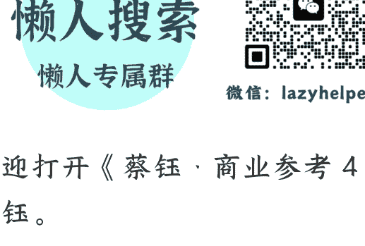

# 第 190 讲 海南封关：给世界的“中国试用装”（下）

2025 年 12 月 26 日

整理：公众号懒人搜索，懒人专属群精选
懒人微信：lazyhelper1

欢迎打开《蔡钰·商业参考 4》，我是蔡钰。

这一讲，我们继续来聊海南建设贸易自由港这个历史大事件。我们讨论三个问题：

- 第一个，把海南建设成自由港，对中国自己有什么好处？
- 第二个，为什么不用香港、上海这类现成的自由港和自贸区来改建升级，而是另设一个海南？
- 第三个，海南自贸港会怎样影响亚洲的经贸格局？

我们从第一个开始。

## 对中国的好处

上一讲我们说，海南自由港是开放给世界的“中国试用装”，那么，这对中国自己有什么好处呢？

第一个好处是，替整个中国试错。派一个省“出门闯荡”，研究怎么跟世界打交道，摸到了经验教训，其他各省直接吸收，能降低整个中国的试错成本。

第二个好处，我们上一讲也提到过了：通过 30% 增值免关税这类制度创新，把中国的产能和市场，重新插回全球化的主干道上。

海南自贸港的顶层设计是从 2018 年开始的，你可能记得，那正好是中美贸易冲突开始、逆全球化思潮抬头的一年。

第三个好处，是在新版本的全球化里，主动建构我们想要的制度单元。对中国来说，上一代全球化，可以以 2001 年加入 WTO 为起点，我个人叫它“WTO 全球化”。而新一代的全球化，可以从 2018 年的逆全球化浪潮起算，要顶着贸易保护，在不同区域、不同国家之间达成不同标准的全球化，我个人叫它“碎片全球化”。

你可能有印象，在 WTO 全球化时代，中国的处世之道是韬光养晦，跟着别人定好的游戏规则走，万事低调。

而近几年，我们在国际场合听到的中国声音变多了：“一带一路”、人类命运共同体、全球治理倡议等等。中国更多变成了新秩序的倡议者和推动者。

这种变化，其实也不只发生在中国身上。东升西降虽然让世界动荡，却也让很多国家有了新想法。

我们专栏里讲过沙特的 2030 愿景，印度想主导“全球南方”国家，日韩想跟美国缔结芯片四方联盟等等。这些想法和行动背后，各国都想在下一张全球牌桌上，抢到历史性的新角色、新分工。

在这样的大背景下，海南自贸港，就成了中国向外展示构想的样本。你回头想想“一线放开、二线管住、岛内自由”，想想增值 30% 免关税，这些制度创新，已经明显不再是跟随既有秩序，而是自定的游戏规则。

## 为什么不是香港或上海

下一个问题：香港也是现成的自由贸易港，内地的上海、天津等 22 个地方也都各有各的自贸试验区，如果中国需要一个自由贸易港来承载新的全球化探索，为什么不拿香港、上海来改造升级呢？

跟你说说我的理解。

首先，站在 2018 年那个起点上，中国缺的不是更开放的区域，而是缺一个能适应全球化转向的、可控的、可调节、可回滚的开放试验沙盒。

香港不适合，因为它已经是传统全球化时代的“成品”。

它的全球自由港身份，是 1842 年被英国人确定的，比新中国建国还早了一百多年。香港的法律，延续的是英国的普通法，跟内地的大陆法系就像 iOS 和安卓的区别，底层架构完全不同。2018 年的香港，已经长期嵌入美元体系和西方监管网络，也早就高度金融化了。它作为“一国两制”的窗口，任何制度试验都可能被放大为政治问题。

所以，香港这个自由港，无法被改动，更无法被重新设计。

上海呢？上海是内地最早挂牌的自由贸易试验区，挂牌以来，也做了不少制度微创新。但它是中国的经济中枢，跟长三角的产业联动也太紧密。这决定了它不能太激进，承载不了法律、税制、通关、金融、数据制度的全面重写。

而海南，地理上是个独立单元，在国际上政治象征性弱，经济体量相对小，社会结构简单，试验成功了向全国推广，受挫了可以调整、回滚，不会引发连锁反应。这是香港、上海和新疆等其他自贸试验区都不具备的能力。

## 重塑亚洲经贸格局

好，第三个问题来了：如果海南自贸港成功运转起来，它在 5 到 10 年内会怎样影响亚洲的经贸格局呢？

我认为，有三个层面的影响，值得你关注。

### 第一个层面，在海运航线上，分流新加坡的吞吐量。

新加坡坐拥马六甲海峡南口，主要掌管着印度洋跟中日韩的往来航线。新加坡港最大的一个功能是集装箱转运。

怎么叫集装箱转运呢？

要么是化零为整，把十几上百条小货船的货凑到一艘大船上，走干线去往大港口；要么是化整为零，把一条大船的货分拆到十几上百条小船上，走支线去往不同小港口。

官方数据显示，90% 进出新加坡的集装箱，都只是在这里中转，而不是把这里当最终目的地。

而海南的港口，本身就承载了大量中国制造的出口需求和中国消费的进口需求，在这里装船卸船，能省掉大量的转运成本。

这个趋势已经开始显现了。

2025 年前三个季度，海南洋浦港的保税燃油加注量同比暴涨了 210%，其中 30% 的订单，来自原本注册在新加坡的船舶，连马士基、达飞这样的全球航运巨头都有调整航线、专门来洋浦港加油的。

为什么要专门来洋浦港加油？因为海南自贸港引入了多家供应商竞争，燃油价格比附近的新加坡港要便宜 8%。

一艘大型货轮一次加注 3000 吨燃油的话，能省 24 万元。

### 第二个层面，海南，有可能成为全亚洲的“共享产业园”。

对一个自由港来说，船来了，生活服务业会来，旅游娱乐行业会来，燃油配套行业会来，保险业就会来，金融业也会来，船舶维修行业会来，加工制造业会来，一个产业网络就会逐渐成形。

而同时，在海南建厂，土地充裕，调用全球供应链免关税，调用中国供应链也免关税，增值超过 30% 进中国市场还能免关税。这样的海南对亚洲企业来说，就像一个福利拉满的招商园区。

上一讲的留言里，日本贸易顾问王淅就提到，日本企业早在四五年前海南敲定封关时，就已经频繁来考察海南了。

现在，丰田已经在海南验证组装新能源特种车辆的路径；坂田制药计划在海口生产近视防控眼镜的核心部件；武田制药也把自己的一部分特许医药器械，投放到了海南的乐城医疗先行区。

再讲一个印尼的故事。过去两年，欧盟对印尼的指责是，借“海南制造”的身份，规避出口限制。

怎么回事呢？

印尼是棕榈油生产大国，欧盟对印尼棕榈油有出口限制。印尼就把大量棕榈油的加工环节转移到了海南，在海南完成棕榈油的加工、精炼或配方调整。

这些深加工环节，给棕榈油实现的加工增值，很容易就能超过 30%。这些印尼棕榈油就变成了“海南制造”，不但能卖给中国，也能照常出口欧洲。

你看，“中国制造”竟然也有给别人当挡箭牌的一天。海南，成了印尼棕榈油产业的境外节点。

### 第三个层面，在更长的时间线里，海南没准能承接“一带一路”的陆上走廊，打通印度洋和太平洋。

我们把时间尺度拉远一点。

地处东南亚的泰国，有一个做了 300 年的“运河梦”。它从 1677 年就提出设想，在泰国领土最狭窄的克拉地峡开凿一条运河，来发展自己的港口经济。

你可以在手机地图上搜搜克拉地峡这个地方。这条运河要是开通，能让印度洋往返太平洋的航程缩短至少 1200 公里，和几十万美元的燃油费。泰国也能因此变成全球航运枢纽。

那为什么 300 年过去了这事还没干成呢？

修一条运河，既需要工程技术能力，也需要强势运营资源，还需要对抗地缘政治阻力。新运河会影响马六甲海峡沿线国家的利益，其中，新加坡的反对又最强烈。2015 年，还有过传闻，说中国接手了开凿泰国运河的项目，但两国政府最终还是否认了。

不过 2025 年，有消息说，泰国开始研究运河替代方案，要在陆地上开出一条连港口带铁路、公路的大型走廊。这个工程目前正在全球招商，计划 2030 年左右开通。

这条陆桥如果如期开通，那它跟海南自贸港的联动，就会在一带一路的东南亚版图上画出关键的战略闭环。

以前，从中东和欧洲运往中国的资源，必须挤在马六甲海峡排队，走新加坡这个唯一的服务区。但如果有了泰国陆桥加海南自贸港的组合，不仅能在东南亚内部建造一条经济循环回路，还能帮亚洲各国打破长期面对的“马六甲困境”，解除各国对马六甲海峡的封锁担忧。

你看，海南封关不是孤立的中国开放动作，而是东南亚乃至印太地区百年地缘变局的一环。

## 总结

到这里，我们关于海南自贸港的讨论就暂告一段落了。

理想总是很美好，但海南同样有它需要面对的问题。比如，封关运行后，海南吸引来硬核的制造业更多，还是为了避税的“皮包公司”更多？它是能顶住压力实现制度创新，还是会在复杂管理中陷入平庸？

还有地缘政治。2025 年的美国《国家安全战略报告》已经直白地写道：

> “一个（对美国的）相关的安全挑战是，任何竞争对手都可能控制南海。”

所以，接下来几年，请你一起和我保持对海南的关注吧。看它如何破局过关，给内地和亚洲带来改变。

再见。

## 最后，安利小懒的付费群：

懒人专属群（介绍）

🔖 这里是你对抗信息过载的护城河。

已稳定运行 6 年，累计拆解、研读 3000+ 个互联网商业实战案例与行业前沿内参和时政/宏观文章。

### 我们不搬运垃圾，只做高价值信息的筛选器与放大镜。

### 懒人专属群更新记录：

[https://hk57gv1x7u.feishu.cn/docx/H0kRdZbSbolBR0xkaXtcuVE0nTg](https://hk57gv1x7u.feishu.cn/docx/H0kRdZbSbolBR0xkaXtcuVE0nTg)

懒人专属群更新记录 (需梯子，备用):

[https://lazybook.fun/blog/record2](https://lazybook.fun/blog/record2)

【免责声明】本资料归档于社群内部知识库，仅供成员课题研究与学术交流，请在查阅后 24 小时内删除。