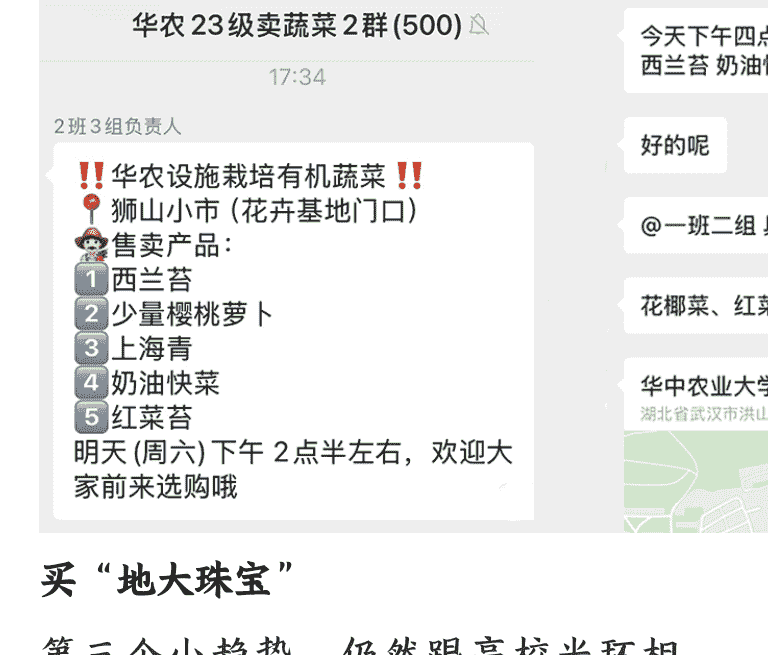

公众号懒人搜索，懒人专属群分享

## 191|消费小趋势：民众拥抱“高校严选”

251226

整理：公众号懒人搜索，懒人专属群精选
懒人微信：lazyhelper1

欢迎打开《蔡钰·商业参考 4》，我是蔡钰。

这一讲，我要邀请你来关注一组有意思的消费小趋势。

## 抢购高校羽绒服

第一个小趋势，2025 年 12 月，中国人民大学的羽绒服，卖断货了。

怎么回事呢？入冬之后，人民大学的党委书记张东刚，在小红书上发了个帖子，推销人大自产的“文创羽绒服”。

帖子里展示了一件带有人大校徽的红色羽绒服，给出了购买链接和线下购买地址，还贴心地给出了不同的购买方案：有长款的、短款的、儿童款的，还有三口之家、四口之家的组合套装。

张东刚在小红书上已经待了几个月，是个粉丝超过 10 万的腰部网红了。他在 9 月开学时就注册了自己的小红书账号，还起了个很有亲和力的 ID，叫“人大刚子”，用来跟学生、校友们亲密接触、现场办公。当时他账号一开，评论区马上成了人大学生们提问题、提诉求的小平台。

有了这个社群背景，这次“人大刚子”一发消息，这组羽绒服马上在小红书出圈、随即卖断货了。

卖羽绒服的小程序“人大红创”还一度被挤到崩溃。断货之后，不少后知后觉的网友还在不断涌进“人大刚子”的评论区，要求补货、要求书记搞抽奖。

## 高校出品的羽绒服为什么这么受欢迎？

它的长款优惠价 899 元、短款 399 元、童款 200 元，不算贵，但也不算便宜。在中国人民大学羽绒服被抢购之前的几个冬天，中央戏剧学院、北京电影学院等院校的羽绒服，也在小红书上被大量网友求校内学生代购，也被卖断货过。

你肯定想到了，“高校光环”起到了重要的作用。这种作用又分两层：
- 第一层，是身份标签、是情感回忆，也是向往寄托。

前几年，中央戏剧学院、北京电影学院等学校的长款羽绒服也在民间走红过。原因是，中戏和北影的学生经常外出拍戏，冬天也要身穿单薄的戏服，学校就批量生产了又长又大的羽绒服，来给学生们在拍戏间隙裹住全身。

而学生们在逐渐成为明星的过程中，身上的羽绒服就引发了明星效应，让粉丝纷纷跟随，让这类高校的羽绒服率先出圈了。

这次抢购人大羽绒服的网友里也有不少非人大校友，也是类似的原因。

- 第二层，羽绒服上的高校校徽，能给消费者莫名的放心感。

在非校友看来，中国大学，尤其是顶级名校，不太可能为了短期利润牺牲口碑，也不太不好意思赚学生的暴利。

其中一些理工科院校，比如哈工大，甚至还在自己的文创羽绒服里，用上了智能温控技术与可呼吸面料。这也让外围消费者相信，“理工科学生都买单的技术，肯定不是智商税”。

往回推几年，波司登肯定没想到，有朝一日，在羽绒服行业降维打击自己的，会是中国大学们。去年波司登就已经快速反应，跟中戏合作推出了羽绒服联名款。不过，随着越来越多的高校把羽绒服当作文创产品来售卖，你不妨猜猜，波司登合不合作得过来。

## 逛农业大学市集

同样在 2025 年，中国各地的农业大学也带火了一门生意。什么呢？农大市集。

有一群嗅觉灵敏的打工人，开始把去往本省市的农业院校赶集，当成周末的寻宝新玩法。

怎么回事呢？

农业院校，顾名思义就是教学生研究农业的院校。既然研究农业，总要做实验。农业院校做实验用的不是试管、烧杯、酒精灯，而是种蔬菜、调果汁、做蜂蜜。中国农业大学的花坛种的是羽衣甘蓝；四川农大的草地上站着牦牛和羊驼；河南农大卖的牛奶，干脆直接来自畜牧兽医专业。

更别提，这些校园还经常有学生摆摊卖菜，或者开放种植园采摘。在这里花个 20 块钱，就能买到郊区采摘园几百块才有的体验。对打工人来说，这些身边的农业校园，跟远在郊区的市集相比，那就是妥妥的农业迪士尼。

在外围打工人看来，高校出品的农产品：首先，天然拥有“有机身份”，可靠；其次，由学子们直接售卖，没有中间商赚差价；最后，也是最重要的，时不时能发掘一些奇特的“宝藏产品”。

比方说，农科院以水培菜见长，奶油生菜特别好吃；中国农大的蜂王浆、蜂巢蜜，是校内博士团队出品；同样是小番茄，聊城大学农学院的就有一种奇特的清甜，因为经过了“熊蜂授粉”；如果有幸进到中国农业大学的食堂吃饭，是能吃砂锅鸵鸟肉的；南京农业大学可采摘的梅子树，是能进入国家基因库的种树。

2025 年春天，不知道你有没有注意到过一种新蔬菜，名叫“板蓝根青菜”，定价还不便宜，十几块钱一斤，但当时在盒马鲜生、叮咚买菜或者小象超市都相当抢手。这种板蓝根青菜就是华中农业大学的科研成果，由板蓝根和甘蓝型油菜杂交而成，口感和营养含量上，都比一般青菜有质的升级。

而对 2025 年已经踏进“农大市集”的打工人来说，市场上的新产品，他们可能提前一年甚至几年就已经尝到过了。这种诱惑，谁受得了？

所以今年以来，全国各个农业大学都有了外人自发组建的“买菜群”。其中，华中农业大学可能又是把这事儿玩得最成规模的——每个年级手里，都有几个加满了人的“卖菜群”，各个班、各个课题组负责人，时不时就在群里发出摊预告。抖音上有一个博主，叫“华农曼同学”，就是其中的一员，你感兴趣不妨看看。

## 买“地大珠宝”

第三个 小趋势，仍然跟高校光环相关：过去两年，人们不是突然爱上了珠宝玉石吗？这让一个关键词在抖音和小红书上火了起来：地大珠宝。

今天你要是在各个电商平台搜“地大珠宝”，会发现它是珠宝商品里最有人气、卖得最好的一批。

怎么回事呢？

地大珠宝，其实是一个刻意保持了模糊与暧昧的概念。当中的“地大”，指的是中国地质大学，尤其是地质大学的武汉校区，它的珠宝学院创立了 GIC（中国地质大学）宝石鉴定师证书体系，在公众认知中，也就成了“最懂珠宝、距离假货最远的机构”。

于是所谓“地大珠宝”，也就是被地质大学这个光环加持的珠宝门店。

这样的门店，最早只有一家。你肯定记得，2023 年以来，年轻人突然流行起了各种珠宝手串，先是寺庙里的十八籽，然后是各种水晶玉石。于是在那一年，中国地质大学（武汉）校内的一家珠宝文创商店火爆出圈了。这家珠宝店叫“玉晶灵”，是地大校内唯一的一家珠宝店。老板也是地大毕业生，主要做校内学生的生意，卖卖矿标、手串、吊坠，让学生们当校园纪念品送亲友。商品通常不追求高端，主打性价比。

结果，在当时的珠宝热潮里，它被校外消费者发现了。消费者觉得，这家珠宝店既然能开在地大校内，肯定便宜、保真。于是一时间，“找地大学生代购地大珠宝”就成了当时的流行。

问题也就出在这里。“地大珠宝”这几个字很快被两群有心人借用过去了。

一类是地大校外珠宝街的商户。街区紧邻学校，街上还有“地大珠宝大楼”，不少商户默认，自己卖的也是“地大珠宝”。

另一类是直播平台上的珠宝带货账号。它们发现，“地大”这两个字成了信任入口，于是通过各种方式弄到地大的鉴定证书，或者自称地大校友，也管自己的商品叫“地大珠宝”。

在需求的激增和供给的泛化配合之下，问题开始集中暴露：

很快有人发现，在这些“地大珠宝”直播间下单后，有的快递根本不是从湖北寄出的，有的琥珀根本是树脂材料的，有的玉石进行了人工填充却没有标注。这让 2025 年之后，市场对“地大珠宝”几个字的非议越来越大，就连一开始那家玉晶灵，在小红书上的口碑也开始分化。

面对这股质疑，中国地质大学也让工作人员对外澄清过，学校并没有在市面上出售珠宝玉石，打着“地大”旗号卖货的，都属于个人行为。

但是，请你注意，即便如此，今天网上和线下的年轻珠宝爱好者们，也并没有放弃“地大珠宝”，他们只是把问题从“要买”，变成了“求地大珠宝靠谱门店”。

你看，虽然这个案例里的高校光环被滥用，但消费者并没有立刻离场，而是进入更精细的再筛选阶段。

## 总结

好，这一讲，我们聊了三个同样依托于“高校光环”而展开的消费小趋势，分别是人大羽绒服被抢购、农大市集被打卡、地大珠宝被反复追捧。

它们其实指向了同一个变化：需求先于供给觉醒，主动把“高校光环”当成信用中介和体验载体来用。

对大多数人来说，高校光环同时满足了两种需求：

- 一种是理性的：名校被视为更克制、更专业、更不容易作恶的责任主体；
- 另一种是感性的：它让外围人群能用低门槛手段贴近名校生活，获得“高我”体验。

你在过去一年还发现过哪些类似的消费品类吗？期待你的留言。

再见。

最后，安利小懒的付费群：

懒人专属群（介绍）

这里是你对抗信息过载的护城河。

已稳定运行 6 年，累计拆解、研读 3000+ 个互联网商业实战案例与行业前沿内参和时政/宏观文章。

我们不搬运垃圾，只做高价值信息的筛选器与放大镜。

## 懒人专属群更新记录：

https://hk57gvIx7u.feishu.cn/docx/H0kRdZbSbolBR0xkaXtcuVE0nTg

懒人专属群更新记录 (需梯子，备用):

https://lazybook.fun/blog/record2

【免责声明】本资料归档于社群内部知识库，仅供成员课题研究与学术交流，请在查阅后 24 小时内删除。