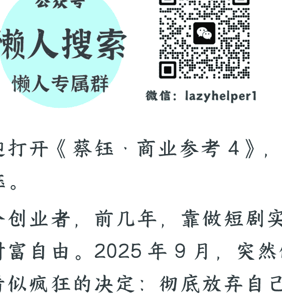
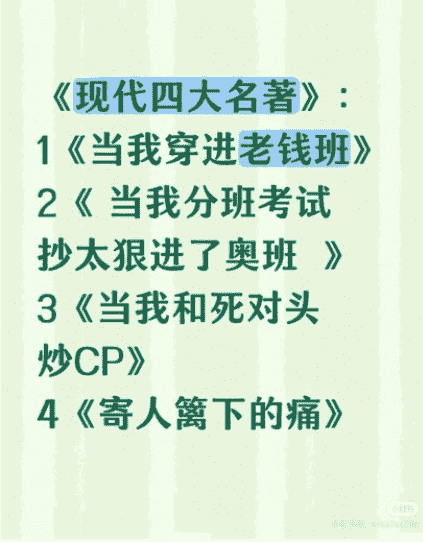

# 192 | 2025，AI 短剧崛起

251229

整理：公众号懒人搜索，懒人专属群精选

懒人微信：lazyhelper1

欢迎打开《蔡钰·商业参考 4》，我是蔡钰。

一个创业者，前几年，靠做短剧实现了财富自由。2025 年 9 月，突然做了个看似疯狂的决定：彻底放弃自己赖以致富的真人短剧业务。

干嘛去呢？转型做 AI 漫剧。

随后三个月，他拿到了阅文集团的投资，成了 AI 漫剧这个崭新行业的头部玩家，月流水突破五千万。在抖音破亿播放量的短剧里，他的作品占了 5 部。

这样的故事，你听着是不是也有点“燃”？

这个创业者和他的公司，叫酱油和酱油动漫。他映射出来的趋势是，2025 年，AI 短剧正在成为内容行业最炙手可热的新赛道。

光是在 B 站，就有几千部授权网文被改编成动画短剧。网文巨头阅文集团，也在 10 月宣布开放 10 万部精品 IP，全面布局 AI 漫剧生态。就连百度，也大举进入动漫短剧行业，推出了自己的 AI 短剧生成平台。——我猜，百度是从百度网盘的用户行为数据觉察到了什么。

其实，这股趋势在 2024 年就已经有苗头了。

2024 年 7 月，电影公司博纳影业在抖音推出了一部科幻短剧，名叫《三星堆：未来启示录》。这部短剧上线之后，很快冲到了抖音短剧热播榜前五，播放量超过了 2 亿。

这部短剧特别在哪？特别在，它是国内第一部拿到《网络剧片发行许可证》的 AI 短剧，一个真人演员都没有，完全是 AI 生成的。

2024 年，快手也推出过一部 AI 动漫短剧，名叫《山海奇镜之劈波斩浪》，奇幻题材，只有短短 5 集，上线两周播放量就突破了 5000 万。

而到了 2025 年，AI 加持短剧行业的趋势进一步爆发。我给你讲几部代表性作品：

前面提到的酱油团队，有一部代表作叫《洪荒：代管截教，忽悠出了一堆圣人》，2025 年下半年上线，播放量达到了 2.71 亿次，是行业里的年度现象级作品。

还有一部 AI 真人短剧，名叫《奶团太后宫心计》，68 集的长度，2025 年下半年累计播放量也超过了 2 亿。

还有一部主攻海外市场的 AI 短剧，名叫《After Divorce: My Five Brothers Paved My Way to the Billionaire Throne》，简称《五个哥哥》，都市爱情轻喜剧题材，在海外累计热力值超过 500 万，也成了全球第一部跻身短剧票房畅销榜的 AI 短剧，收入据说也达到了几十万 美元量级。它的制作公司叫井英科技，2025 年拿到了百度的投资。

这之外，还有什么《九尾狐男妖爱上我》，抖音播放量破 1.8 亿次；《兴安岭诡事》，3 天播放量超 3000 万；《新世界加载中》，全球播放量 1.97 亿次......

根据巨量引擎 12 月的数据，过去半年，AI 漫剧累计上线了大概 3000 部，年内市场规模可能就要突破 200 亿元。

## 技术革命

为什么 AI 短剧市场会在 2025 年爆发呢？

最直接的原因，你肯定想得到：AI 技术的进化，让短剧制作的成本急速下降了。

你可能还记得，AI 行业最早拿得出手的 AI 视频生成模型，是 2024 年 OpenAI 的 Sora，一个短发酷妹走在赛博朋克的街道里，地上的水洼里显示出她的倒影。

在过去几年里，不少公司都对视频生成模型有布局，但很长一段时间里，各家视频模型的水平还比较初级。

但 2025 年，视频生成技术迎来了真正的“分水岭”。

从年初开始，快手的可灵 AI、百度的蒸汽机、生数科技的 Vidu 等国产大模型，开始了令人瞠目的迭代竞赛。模型们的变化不再是微调，而是质变。

今天的可灵 AI，已经可以让蒙娜丽莎从画框里跳下来逃出博物馆，从画框到走廊，再到大厅的转场，接近影视拍摄的标准；生数科技的 Vidu，生成一段“母亲逼儿子喝丝瓜汤”的故事，也能连贯展现儿子的情绪从稳定到不耐烦的变化；商汤的 Seko，更是可以直接选择多剧集创作，在上百集的剧情里，都让角色脸上的红斑、腰带图案保持一致。

面对这种技术进步，传统影视行业可能还要顾虑一下细节穿帮的风险，但对短剧行业来说，直接就是天大的好消息。这样的 AI 视频模型，四舍五入已经能和横店的演员和布景拼一拼了。

## 成本急降

新技术之下，怎么做短剧呢？

在以前，按照传统流程生产一部影视作品，哪怕是低成本短剧，也要把策划、剧本创作、选角、置景、拍摄、后期制作等各个环节走一遍，需要大量的真人协作。

现在，用 DeepSeek、GPT 写剧本、写分镜脚本；用 Midjourney、可灵生成角色与场景概念图；用可灵、即梦、Vidu 把静态画面转成动态短片；用剪映、必剪、达芬奇剪辑视频，搞定转场、字幕、配音；用 Audacity、Suno 或 Udio 搞定音效和配乐；再用 Topaz 来提高视频的分辨率。一部小小的影视作品就能问世了。

在这个新的工作流之下，短剧行业还出现了一种新职业，叫"AI 抽卡师”。

AI 抽卡师有点像传统剧组里的选角导演，他的工作职责是，像玩抽卡游戏一样，对 AI 工具不断调整指令，来从 AI 模型中“抽”出最理想的角色形象和视觉元素。

传统真人短剧动辄要花一两个月，AI 短剧只需要 10 天。传统真人短剧拍一集成本过万，AI 短剧单集成本只有传统真人短剧的 10% 到 20%，每分钟有 1500 块钱预算的话，就已经能做出超越同行的精良画质了。

我听到最离谱的成本，是前面提到那部《九尾狐男妖爱上我》。这部 AI 短剧的自我要求奇低，主角的脸变来变去，剧情也是梦到哪里拍哪里，主要靠叙事猎奇吸引观众。有业内人士透露说，成本可以低到一两个小时制作 1 集，50 块钱做 3 集。

这种离谱的降本能力，让开头提到那家酱油动漫在 2025 年彻底抛弃真人短剧转型 AI 漫剧，也让大量创作者在下半年涌进了 AI 短剧行业。

好，另一个问题来了：AI 的确降低了供给端的生产成本，但“降本”跟吸引观众没有必然联系啊？

《九尾狐男妖爱上我》胜在跑得早、剧情也猎奇，但如果大量 AI 短剧仍是接近或者低于真人短剧的表演水平，为什么用户们肯把它们刷上热榜？

这个问题的答案，我猜你也能想到：因为 AI 视频技术，能低成本地生成各种大场面。这是在以前，传统剧组们不敢轻易烧钱干的。

前面提到那部《五个哥哥》，都市爱情轻喜剧题材，乍一想，似乎不用 AI 也能拍、没准更细腻。但如果真没了 AI，剧本绝对不敢让主角上首富的直升机、上奥斯卡颁奖典礼，跟 UFC 拳王搞现场对决。

对 AI 视频模型来说，生成一段小明在家喝丝瓜汤的影像，跟生成一段雪王在陆家嘴大战东方明珠的影像，成本是差不多的。甚至，越不符合现实逻辑的题材，对 AI 瑕疵越包容。这就让短剧制作团队们，开始敢去惦记以前想都不敢想的“三幻”题材故事了。

什么是“三幻”？就是玄幻、科幻、奇幻。《山海奇镜之劈波斩浪》的导演陈坤就说，AI 短剧最容易发挥优势的赛道，就是科技和玄幻赛道。

所以，为什么阅文集团也要进场，还要投资酱油动漫团队啊？我念一个他们的合作作品的名字你就明白了：《魅魔叛主，我反手养成八翼炽天使》。这部漫剧，是根据阅文旗下的起点读书平台上的小说改编而成的。

你听听，魅魔，八翼，炽天使，哪个词都不是传统剧组拍得起的。放在以前，这个故事只能是小说。但在 AI 漫剧的浪潮里，一个短剧团队轻易就能把故事还原成影像，换来 1.5 亿次的播放量。

这之外，热播短剧《兴安岭诡事》，拍鬼怪志异题材；《末日安全屋日记》，讲末世生存故事；《霸总雪纳瑞》，让小狗当主角。

还有一个流派叫“表情包漫剧”或者“沙雕短剧”，干脆是用你很熟悉的熊猫头表情包，去演绎各种离谱的异世界故事。

你要是感兴趣，可以去抖音搜搜《玄武四象》，这是当前播放量最高的一部沙雕短剧，累计播放量超过 19 亿。

也就是说，AI 技术的突破，让创作者和传统的网文读者终于不再受制于资金、资源限制，实现了“想象力自由”。

## 总结

好，这一讲，我们关注了 AI 短剧崛起这个趋势。

大概率，在 2026 年，我们会看到更多基于热门网文 IP 的 AI 短剧涌现。那些曾经只能存在于文本和读者想象中的玄幻世界、仙侠场景、科幻设定，都将通过 AI 技术变成可视化的爽剧。阅文的 10 万部 IP、番茄的 6 万部 IP，正在等待被 AI 激活。

从文字到视频，从想象到呈现，AI 正在打通的这条路径，还可能把中国内容产业推向一个历史性的拐点。这也是我在回顾 2025 年的市场趋势时，最想跟你分享的收获之一。

你可能知道，近年来，文化产业有个说法，叫“世界四大文化奇观”，分别指的是美国好莱坞电影、日本动漫、韩剧和中国网文。

四大现象之一的中国网文，目前在国内有超过 3000 万部的储备。它加上 AI 视频技术，再加上全球近 8 亿的网文读者，会碰撞出什么？

请容我过几天再跟你汇报我的思考。

对了，前面专栏里有次我们提到“小红书四大名著”，然后同学们找到的结果五花八门，看来小红书确实是千人千面啊。我看到了结果，放在文稿里供你参考，不知跟你找到的是不是一样？

话说回来，如果 2026 年 AI 大行其道，小红书四大名著可能也会与时俱进地更新呢。

拜了个拜。

最后，安利小懒的付费群：

懒人专属群 (介绍)

微信：lazyhelper1

## 这里是你对抗信息过载的护城河。

已稳定运行 6 年，累计拆解、研读 3000+ 个互联网商业实战案例与行业前沿内参和时政/宏观文章。

我们不搬运垃圾，只做高价值信息的筛选器与放大镜。

### 懒人专属群更新记录:

https://hk57gvlx7u.feishu.cn/docx/H0kRdZbSbolBR0xkaXtcuVE0nTg

### 懒人专属群更新记录 (需梯子，备用):

https://lazybook.fun/blog/record2

【免责声明】本资料归档于社群内部知识库，仅供成员课题研究与学术交流，请在查阅后 24 小时内删除。