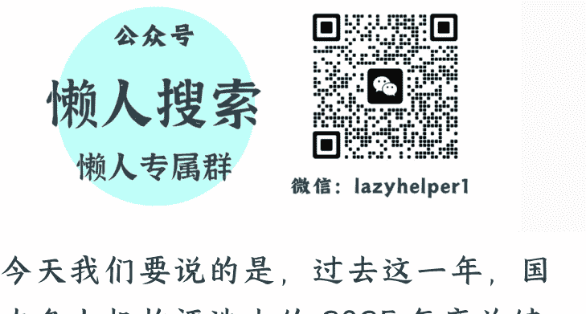

# 2025，一个“韧”字背后的中国

251229

整理：公众号懒人搜索，懒人专属群精选

懒人微信：lazyhelper1

今天我们要说的是，过去这一年，国内各大机构评选出的 2025 年度关键词。

它们有的来自专业的语言机构，比如，国家语言资源监测与研究中心、《咬文嚼字》杂志社、《语言文字周报》；也有的来自社交平台，比如，微博。

接下来，我们就展开说说。你也可以看看哪个词，最能代表你的 2025 年？这些榜单上的词，五花八门。但把它们放在一起看，能发现两个明显的类别。

第一类，是与技术有关的关键词。而且这些技术类的词，都指向同一个方向，AI。

比如“深度求索”，也就是 DeepSeek，被国家语言资源监测与研究中心，评为 2025 年度国内词。注意，是“年度国内词”，不是“年度网络流行语”。这个分量可不轻。

DeepSeek 是 2025 年 1 月推出的。评选机构给出的评价是，它“宣示了中国在 AI 领域上的技术主权，形成了中文数据、知识、价值的智能承载者”。而且 DeepSeek 采用的是开源模式。这个设计，在评选机构看来，“体现了中国文化在 AI 时代中的大心胸与超越性”。

换句话说，在当时的技术环境下，这个突破的意义不只是技术本身，它代表的是一种技术突破的路径。在“有挑战”的环境里，依然能找到出路。

再比如，“具身智能”。这个词被《咬文嚼字》选进了 2025 年十大流行语。

什么叫“具身智能”？简单说，就是给 AI 装个身体。以前的 AI 都在云端，在手机里，看不见摸不着。但具身智能有胳膊有腿，能在现实世界里干活。比如人形机器人，要想实现，具身智能就是最关键的技术基础之一。

这个词在 2025 年特别火，还进入了政府工作报告，和生物制造、量子科技、6G 一起，被列为需要重点培育的未来产业。这个词的流行，也许意味着 AI 的发展，进入了一个新方向。

再比如“赛博”。这个词是微博的年度关键词。全年有 1.5 亿条相关博文。“赛博”原本是个科幻概念，来自“赛博朋克”。微博在发布这个关键词的时候，给出的解读是：2025 年被称为多项智能科技的“元年”，但“赛博”却逐渐褪去科幻滤镜，下沉到生活。

比如，“赛博养生”，指的是，年轻人把症状告诉 AI，几分钟后获得详细的健康方案。据说职业医生的评价是，“虽不及专业诊疗精准，却也可圈可点”。再比如，“赛博树洞”，很多人把 AI 当成朋友，当成心理咨询顾问。据说在 2025 年，还有一位患病多年的人，在离世前把心底的秘密都倾诉给了 AI。再比如，“赛博许愿池”，说的是，社交媒体的评论区，被当作许愿池，人们在那里许下对明天的期待。

你看，这些技术类的关键词，讲的其实是同一个故事：AI 技术在 2025 年，真正走进了中国人的日常生活。不是概念，不是新闻，而是你每天都会用到、感受到的东西。

说完技术类，再说第二类，情绪表达类。它们不描述外部世界的变化，而是直接表达人的内心感受。

比如“活人感”。这个词被《咬文嚼字》选进了 2025 年十大流行语。

什么叫活人感？说白了，就是你在多大程度上，表现得像一个有血有肉，会犯错，会尴尬，会失控的人。

这个词流行的原因之一，是人们对“演出来”的东西感到厌烦了。你看，这几年社交媒体上，人们晒的东西越来越精致。在短视频平台上，大量的“生活视频”，其实都是精心摆拍的。这时，那些“有瑕疵”的真实感，反而变得受欢迎。注意，是真实“感”。这些所谓的瑕疵，比如采访时说错话，聊天时表现得情商低，当然也是可以设计的。

且不论这些“真实感”本身是否信得过，这背后的趋势却是在真实发生的，这就是，在 AI 越来越完美的时代，人们反而更渴望看到那些会出错、会尴尬、有脆弱面的真人。

再比如“助我破鼎”。12 月 12 日，国家语言资源监测与研究中心把“助我破鼎”列入 2025 年度十大网络流行语，排名第三。评选机构给出的解读是：网友们以此为自己鼓劲打气，展现自己在面对困难时积极应对、不言放弃的决心。

这个词来自 2025 年春节档的动画电影《哪吒之魔童闹海》。这句台词为什么这么火？因为很多人觉得，“鼎”这个意象也代表了自己所面对的挑战，比如加班、裁员、中年危机等等。

这个词的流行，也许还有更深一层的原因。它不只是积极应对，更重要的是，它承认了“鼎”的存在。它不是说“我很轻松”“我很从容”，而是说“我压力很大，但我要破掉它”。这种表达方式，和“活人感”是一脉相承的，都是在追求真实，而不是伪装完美。

再比如“苏超”。“苏超”是“江苏省城市足球联赛”的简称。从 5 月开赛到年底，85 场比赛吸引了 243.3 万人次现场观赛。一个业余足球联赛，85 场比赛，居然吸引了 243 万人次。什么概念？场均快 3 万人。而且这个联赛还带动了全省 1—9 月赛事消费 35.4 亿元。

但“苏超”的意义，不只是一场足球赛。参赛的球员，大多是来自各行各业的普通人。很多人说，“苏超”还原了足球作为一项运动，带给人们的纯粹快乐。不是为了成绩，不是为了排名，就是为了踢球本身的快乐。这也许说明，在一个充满压力、充满竞争的时代，人们依然渴望那种纯粹的、简单的快乐。

说到这，技术类和情绪类的关键词，基本上就说完了。

除了这两类，还有不少有趣的关键词。

比如《语言文字周报》评选出的“主理人”，指的是那些亲自参与品牌或项目运营的创始人，强调的是深度参与而不是遥控指挥。

再比如，“邪修”，原本是网络小说里的概念，现在被用来形容那些不走寻常路、用非常规方式解决问题的人。

再比如，国家语言资源监测与研究中心评选出的“敬自己一杯”，说的是在压力之下，学会自我和解、自我认可。

再比如，小红书推荐的“2.5 次元”，说的是介于二次元和三次元之间的状态，比如 cosplay、虚拟偶像演唱会。还有“交猫税”，是养猫人的自嘲，意思是养猫就得在社交媒体上晒猫照。

这些词各有各的圈层，它们共同构成了 2025 年的语言图景。

其实，这些词背后，还有一个更核心的趋势。在 2025 年的年度关键词评选中，有一个字，被多家权威机构不约而同地选中了。

这个字就是“韧”。

《咬文嚼字》把“韧性”放在十大流行语的第一位。国家语言资源监测与研究中心直接把“韧”评为 2025 年度国内字。

“韧”，核心是“弹性”“恢复力”“抗逆力”。它的完整定义是：“在不改变自身基本状态的前提下，有效对抗外部干扰、抵御冲击，实现可持续发展的能力。”

换句话说，韧性不是硬扛，不是死撑，而是有弹性。就像竹子，风来了，弯一弯；风过了，再直起来。

比如，DeepSeek 在技术封锁的环境下实现突破，这是技术层面的韧性。
“助我破鼎”承认压力但不放弃，这是个体层面的韧性。243 万人次去看“苏超”，在纯粹的快乐里找到慰藉，这也是一种韧性。

你看，这些看起来毫不相关的关键词，也许都在讲同一件事，2025 年，不确定性很多，压力也不小。但人们没有被压垮，而是在各自的位置上，用各自的方式，保持着弹性，保持着恢复力。

年初，国家统计局在发布经济数据的时候，反复用到一个表述：“中国经济韧性强、潜力大、活力足。”

这不只是官方表述。你去看社交媒体，“韧性”这个词也在大量出现。《咬文嚼字》的主编黄安靖说，“韧性”这个词，让普通个体感受到了共鸣，从而走进了日常语境。

最近，由脱不花老师主理的《长谈》节目，邀请了长江商学院的张晓萌教授，对谈的主题恰好也是“韧性”。张晓萌教授说，韧性不是死扛，而是“柔而固也”，既有坚韧，也有柔韧。

什么叫既有坚韧，也有柔韧？坚韧是不放弃，柔韧是会调整。比如一个创业者，项目失败了，这是打击，需要坚韧。但他没有死磕原来的方向，而是调整了商业模式，这是柔韧。再比如一个人失业了，没有崩溃，这是坚韧。但他没有一直找同类型的工作，而是去学新技能、找新方向，这是柔韧。

换句话说，有时，韧性不代表一根筋，而是能屈能伸。

从这个角度看，2025 年的这个“韧”字，告诉我们的，也许不是要硬扛，而是要学会在弯曲中前进。技术在突破，人们在坚持，生活在继续。知道什么时候该坚持，什么时候该转弯，不是为了证明自己有多能扛，而是为了更好地前进。

最后，安利小懒的付费群：

懒人专属群（介绍）

微信：lazyhelper1

这里是你对抗信息过载的护城河。

已稳定运行 6 年，累计拆解、研读 3000+ 个互联网商业实战案例与行业前沿内参和时政/宏观文章。

我们不搬运垃圾，只做高价值信息的筛选器与放大镜。

懒人专属群更新记录：
https://hk57gvIx7u.feishu.cn/docx/H0kRdZbSbolBR0xkaXtcuVE0nTg

懒人专属群更新记录 (需梯子，备用)：
https://lazybook.fun/blog/record2

【免责声明】本资料归档于社群内部知识库，仅供成员课题研究与学术交流，请在查阅后 24 小时内删除。