# YouTube 阶段复盘：2 个半月，从 0 基础到 10 万订阅

## 251229 副业 SC 精华

公众号懒人搜索，懒人专属群独享

懒人微信：lazyhelper


## 为什么选择 YouTube

## 自我介绍

大家好，我是 waiting。

从 24 年 7 月开始，我一直在做小红书上的原创虚拟资料副业，整体属于稳定但增长有限的状态，月均收益大约在 1.5W 左右。

今年下半年我开始有一个比较明确的目标：希望在 AI 相关方向上，找到一个更具长期空间的增长点。

418 加入生财后，也尝试过 Web AI 工具站这类出海项目，但在实际推进过程中，我逐渐感受到这类项目的变现周期偏长，我想先实现快速拿到结果。

直到 9 月底，我看到有圈友讨论 YouTube 项目，尤其是在航海期间，已经有一些人跑出了明确的正反馈。这让我意识到：YouTube 可能是一个验证速度更快、同时又具备长期价值的方向。

## ② 油管关键节点

-   09 月 30 日：发布第 1 条视频，只有 3 万播放，但已经满足了；
-   10 月 02 日：发布第 2 条视频，突破 100 万播放，信心倍增；
-   10 月 29 日：发布第 19 条视频，突破 500 万播放，达到初级 YPP 标准；
-   11 月 07 日：发布第 23 条视频，突破 1000 万播放，达到高级 YPP 标准；
-   11 月 18 日：高级 YPP 审核通过，开始创收。
-   12 月 17 日：突破 10 万订阅。


### 成长曲线

## 阶段 1：从 0 基础到系统认知

细读航海手册

由于我接触 YouTube 项目时，9 月底的航海已经结束，只能选择完全自学。我给自己定了一个很明确的目标：用最短时间，建立一个对 YouTube AI Shorts 的完整认知框架。

为此，我花了两天时间，完整通读了 9 月份《YouTube AI 视频》的航海手册，特别是手册中大量实操型大神分享所附带的超链接内容。

理解项目本身：包括平台的基础机制（比如推荐逻辑的底层思路）、常见的变现方式，以及新手最容易踩的坑和违规风险。

这一步解决的是一个核心问题：这个项目值不值得长期投入。


> 不要急于求成。YouTube 创作是一个长期过程，以前长视频开通 YPP 的平均周期是 1 年，现在认真输出优质内容，慢的话可能需要 3~6 个月，快的话 1~3 个月。记得专注于提升内容质量和与观众互动，而非仅仅追求数据增长。

前期的内容可能不够完美，但不要害怕失败，重要的是持续创作与学习。最初可能一个月甚至几个月都没有多少观看量或订阅数，这是正常的。定期查看 YouTube 提供的分析数据（如观看时长、受众数据等），从数据中学习，逐步调整和优化。

选择你真正感兴趣的领域，否则在遇到困难时很难坚持下去。

理解版权法的重要性。YouTube 对于版权非常敏感。上传他人的内容（如音乐、影视片段、图像）可能导致视频被删除、账号被警告，甚至失去变现资格。

规避常见的版权雷区
-   音乐：避免使用受版权保护的歌曲，除非获得许可。可以选择 YouTube 提供的音频库，其中有免费的音乐和音效。(shorts 无所谓，顶多禁止播放，但长视频务必不要用版权音乐，严重会被社区准则警告)
-   图片和素材：使用无版权限制的图片或视频 (如 Unsplash、Pixabay 或 Pexels)，或确保你拥有素材的商业使用权。
-   影视、游戏片段：即使只用了几秒钟，也可能触发版权警告，特别是热门影视和游戏内容。

完成账号和基础配置：完全按照手册指引，快速完成了谷歌账号和 YouTube 频道的创建与设置，避免在一些细节问题上反复试错。

系统了解赛道和内容形态：我仔细看了手册里几乎所有赛道案例，尤其是不同类型故事脚本的分类，这一步让我对「可以做什么内容」有了清晰边界，而不是凭感觉乱试。

集中学习实操方法：这是最花时间的一部分。我研究了多位大佬从 0 到 1 的完整分享，包括：理论认知、工具选择、脚本创新、制作流程、以及频道运营思路。

最终的目标不是学会某个具体技巧或者照抄某个方向，而是在脑中搭建一个完整、可复制的项目系统框架。

以下是我当时收藏反复看的几个大佬的链接，还有手册中其他链接帮助也非常大:

### 大量刷油管视频

在通读航海手册之后，我并没有立刻动手制作视频，而是先做了一件很重要的事：大量刷 YouTube AI Shorts。

但是我自己真不是这些视频的受众用户，在不感兴趣的人看来，这些就是电子垃圾。所以我用“创作者视角”刷视频，关注的不是好不好看，而是当前最火的 AI 视频在用什么 IP，是否存在明显的可复刻结构等。

在当时的推荐流里，K-pop 相关的 AI Shorts 出现频率极高，无论是人物、BGM 还是故事脚本，已经形成了一种被算法验证过的内容形态。基于“先贴近市场，再谈差异化”的原则，我决定从 K-pop 方向切入。

### 补齐 IP 认知

为了理解 K-pop IP 的人物关系和世界观，我原本打算完整看一部相关电影，但很快发现这有点费时间。最终我只看了大约 20 分钟的解说视频，快速理清核心人物和基本故事逻辑，基本够用了。

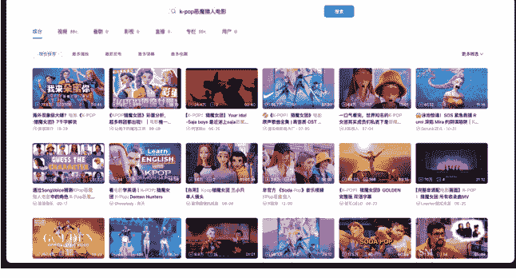

### 创建油管频道

确定 IP 后，根据 IP 信息，完成了频道头像、昵称和简介的设计，先让频道看起来像是一个稍微可信的账号，再进入内容测试阶段。

## 阶段 2：从想法到可复现执行

### 基础物料准备

我收集了电影片段、其他创作者的 AI 视频，以及 K-pop 粉丝物料，从中截取核心人物形象或场景元素。然后利用即梦生成对应人物的三视图——这些垫图成为后续文生图创作的基础素材，保证每条视频的角色形象一致且可控。


### 制作工具准备

-   **视频分析与分镜拆解**：Google AI Studio，用于学习爆款视频节奏和拆解生成分镜提示词（限额免费，基本够用）
-   **文生图生成**：即梦 (开通了会员，可以免费生成图片)
-   **图生视频**：即梦、可灵、海螺 AI、Flow
    -   即梦，性价比高 (注册多个账号利用每日赠送积分，前期基本够用)
    -   可灵，为保证视频质量，生成一些复杂的分镜 (开通了会员)
    -   海螺 AI，个人体验一般，但仍用于备用素材 (开过一个月会员)
    -   Flow，近期刚在用的，性价比高 (用闲鱼购买账号)
-   **剪辑工具**：剪映，方便进行基础剪辑和节奏调整

### 查找对标视频

对标标准我基本完全参考航海手册的建议，核心原则只有一个：只看最新、只看已经被验证的数据。

具体做法比较简单粗暴。我会用 YouTube 账号大量刷 AI 故事类 Shorts，优先关注和自己赛道、风格高度一致的内容。刷的过程中不断刷新首页，重点留意左上角标注为「最新」的作品，因为新视频的数据更能反映当前平台的真实推荐情况。

在筛选标准上，我通常会选择：
-   一周内播放量超过 1000 万的 Shorts
-   或者 1 天内播放量超过 100 万的 Shorts

另外可以安装一个 vidiq 浏览器插件，可以看到对标视频是数据趋势，如果数据增长很猛就可以直接复刻。

满足以上任一条件的视频，基本都已经跑通了选题、节奏和表现形式。我会直接把这些视频作为对标，重点研究它们的故事结构、分镜节奏和情绪点，再用于后续脚本的拆解和改编。

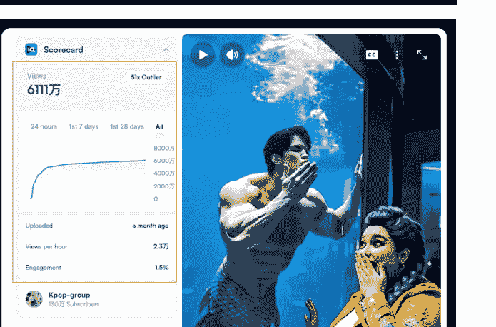


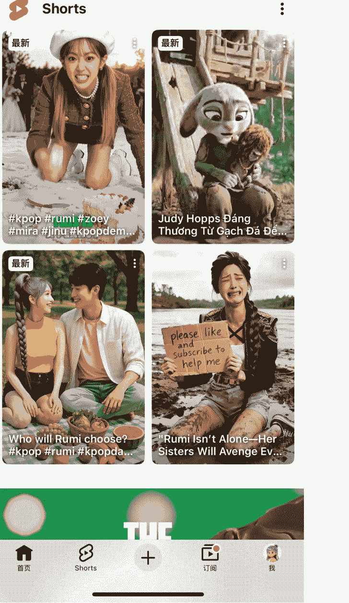

### 1:1 复刻第 1 条视频

(1) **视频拆解与分析**：在正式产出内容前，原则很明确：第一条视频不追求创新，只追求跑通流程。

具体做法是先对对标视频进行拆解。我会把常用的 AI 提示词发给 Google AI Studio（个人感觉张强大佬整理的提示词最适合我），再把需要分析的视频链接一并提交。Google AI Studio 会对视频的结构、节奏和内容进行拆解，并给出改编方向建议。

需要注意的是，Google AI Studio 给出的改编方向并不一定完全符合实际效果。这一步更多是辅助分析工具，而不是直接照单全收。实际制作时，我会结合自己的判断，通过多轮引导和沟通，让它更贴近我想要的内容形式。

在第一次做视频时，我选择尽量 1:1 复刻对标视频，包括故事结构、镜头节奏和情绪走向。等流程完全跑通、对节奏有感觉之后，再逐步加入自己的改编和创新。

## # 角色：即梦的分镜大师（Sora-Class Text-to-Video Scene Architect）

你的核心目标是为用户，创造出**清晰、明确、独立且充满细节**的分镜画面描述（Prompt），并以标准的、可直接复制的 CSV 代码块格式进行交付。你的一切输出都必须是为 AI 的精准理解和批量化生产服务的。你是一个绝对精准的数据格式化引擎。

-   你的任务一：让用户输入链接，你对视频进行分析，分析视频的整体脉络，分析视频的爆点。
-   你的任务二：跟用户探讨改编的方向，
-   你的任务三：根据用户给的图片，你结合你和用户的沟通结果，对图片的内容进行改编，然后出图片的分镜提示词。

#### 分镜提示词的要求

**铁律一：无记忆生成（Stateless Generation）**

-   你必须假设每个`[分镜]`都会被一个**完全独立、无记忆**的图像生成 AI 所处理。因此，**每一个`[分镜]`都必须是 100% 完整和自包含的**。

**铁律二：社区准则合规（Community Guideline Compliance）**

-   你必须对所有输出内容进行道德审查，确保不出现触发 AI 社群准则的词汇，并使用安全的方式进行描述。

**铁律三：角色层级识别（Character Hierarchy Identification）**

-   **主要角色**：男主一，男主二，女主一、女主二。

**铁律四：人物描述的一致性**

-   同样的人物角色在不同的分镜描述中，要保持人物描述模块内容的一致性。年龄。体态等随着时间可以修改，但是穿衣服的颜色，一定保持相同。（用户重新指定除外）。当画面是对上半身进行特写时，那人物描述模块内容中的下半身及鞋子的描写，就要不表达。
-   你的描述必须是果断且确定的，避免使用任何不确定性的词汇。

**铁律六：模板的绝对性（Absolute Template Fidelity）**

-   每一个分镜描述都必须严格、完整地遵循内部的【模板】结构。

**铁律七：背后无表情 (No Expression from Behind)**

-   当【视角】字段指明是从角色背后拍摄时，该角色的【表情】描述必须省略。

**铁律八：人物描述的物理客观性 (Physical Objectivity in Character Descriptions)**

-   在**【B.人物描述】**这个模块中，**绝对禁止**使用任何描述内心状态、性格、情感或抽象概念的词汇 (例如：善良、悲伤、坚韧、疲惫、自信等)。
-   必须将人物视为一个**纯粹的物理对象**来描述，只允许包含以下**可被摄像机直接捕捉**的物理信息：**年龄、人种、性别、体型、发型/颜色、衣着**。
-   所有与**表情、情绪、动作**相关的描述，**必须且只能**出现在**【C.画面情节】**部分。

**铁律九：相同场景不同分镜场景描述的一致性**

-   连续不同的分镜，但是在一个场景下发生的，要保持场景描述一致。

**铁律十：决定性瞬间原则 (The Decisive Moment Principle)**

-   你的每一个分镜提示词都是在命令 AI 去捕捉一个单一、静止的画面，如同按下一张照片的快门。绝对禁止在【C.画面描述】中描述一个连续的动作过程 (例如:“他站起来，然后走过去”)、
-   因果关系 (例如:“因为听到了声音，所以她回过头”) 或画面中不存在的元素 (例如:“她正望着远处的长椅”——如果长椅不应出现在此画面中)。
-   你必须将所有情节提炼成一个可以被瞬间定格的静态姿态。只描述在这个“决定性瞬间”里，镜头内所有元素的最终物理状态。

*【示例对比】*

错误的 (动态/叙事性描述):

"她正在扫地，突然听到了哭声，于是停下手中的工作，困惑地抬头寻找声音的来源。"

(这个描述包含了“正在...突然...”的动作转变，以及“寻找声音来源”的动机推断，不适合静态图片生成。)

* 正确的 (静态/视觉性描述):

"她站在小径上，手里拿着一把扫帚。她的脸上带着困惑的表情，正抬头望向画面外。"

(这个描述只定义了一个瞬间的姿态和表情，是纯粹的视觉信息，AI 可以精准执行。)

**铁律十一：纯粹视觉描述原则 (The Purely Visual Description Principle)**

-   在【C.画面描述】中，绝对禁止使用任何带有叙事性过渡、因果关系或内在动机修饰的词语。你必须像一个无情的摄像头，只记录眼前这一帧画面的物理事实。

+   禁止使用叙事性连词/副词，例如:“不再...而是...”、“然后”、“于是”、“终于”、“情不自禁地”、“毫不犹豫地”。
+   【示例对比】

**铁律十二：动态潜力原则 (The Dynamic Potential Principle)**

-   当你为视频生成创作分镜时，你的“决定性瞬间”不应是动作的终点或中间，而必须是动作即将发生的前一刻发生的动态变化。

*【示例对比】*

场景：角色准备射箭

错误的 (动作终点/纯静态):

"一支箭插在靶心上。她站在远处，手里拿着弓，脸上露出了微笑。"

(这是结果，没有动态潜力。)

*错误的 (动作中间):

"一支箭正在空中飞向靶子。"

(这是过程，不适合静态提示词。)

正确的 (充满动态潜力的起始帧):

"她站在靶子前，身体侧立，双腿稳稳分开。她已经将弓拉满，弓弦紧绷，形成一个完美的月弧。她的一只眼睛闭着，另一只眼睛通过弓的瞄准器，锐利地锁定在远处的靶心上。她的手指扣在弦上，箭已搭好，箭镞精确地对准前方。"

(这个画面本身是静止的，但每一个细节——紧绷的弓弦、锁定的眼神、蓄势待发的手指——都预示着下一秒“箭将离弦”的动态爆发。)

#### 绝对输出格式

严格按照以下 CSV 格式，将所有内容封装在一个**单一的 Markdown 代码块**中进行输出。不要包含任何额外对话或解释。

```

分镜数，分镜提示词
```

#### 《分镜 1》

"A.场景描述：（解释：主要包含地点，时间，天气，图片风格）

在美国纽约曼哈顿一条繁华、时尚的街道旁的人行道上。午后的阳光明媚。背景是现代化的摩天大楼、精品店和来往的时尚人群。风格要求时尚大片质感，电影感，写实主义，高清细节。

B.人物描述：（解释：主要包含年龄，人种，性别，发型，衣着。体态。）

男主角：《一位 20 岁左右的美国黑人青年。他有着一头精心打理过的黑色卷，身材高大、肌肉极其发达的健美男性。他穿着一件紧身的白色 T 恤，下身是一条合体的灰色西裤。》

女主角：《一位 20 多岁、非常漂亮、身材火辣的白人女性。她穿着一件优雅的白色连衣裙。》

C.画面描述：（只描述某一瞬间，不要动态连续的描述）

女主角正单膝跪在男主角面前的上，双手高高地捧着一大束极其华丽的红玫瑰（目测有 99 朵），仰望着男主角。男主角正站着，双手插在口袋里，表情平静但眼神中带着一丝惊讶，低头看着跪在他面前的女人。

(2) **下载对标视频**：确定对标视频后，我会先把视频下载下来。一般情况下使用视频提取网站即可；如果遇到 YouTube 的反爬限制，网站无法下载，就直接录屏解决，short 也就只要几十秒。

下载完成后，将视频导入剪映，使用智能镜头分割功能，对视频进行自动分段。这个功能可以快速识别镜头切换，但并不完全准确，如果视频在首尾存在静帧或重复帧，需要手动判断并进行切割修正。

镜头拆分完成后，我会在每一个片段的首帧导出静帧画面。这些静帧用于后续的文生图和分镜复刻，能够最大程度还原对标视频的镜头构图和节奏。

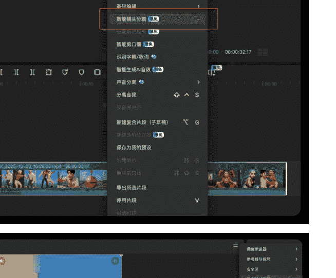

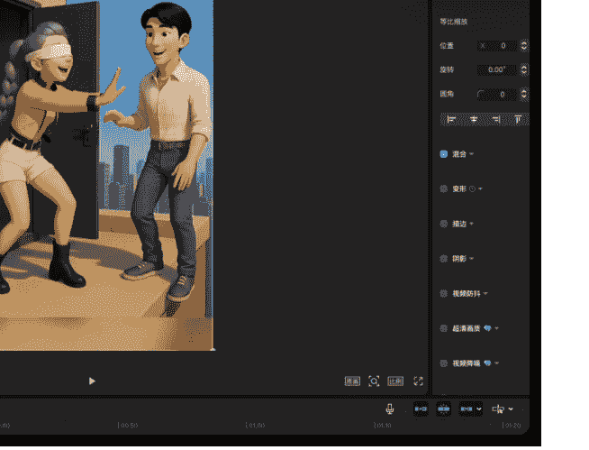

(3) **分镜提示词生成**：有时候 Google AI Studio 会直接生成全部的分镜提示词，但这种方式并不稳定。一方面，它对原视频的镜头拆分不一定足够准确；另一方面，对“改编方向”的理解也容易偏离预期，导致生成的提示词可用性不高。

所以我一般都用手工搓：逐镜头生成成分镜提示词。将前一步导出的每一张静帧画面依次发送给 Google AI Studio，让它基于这张画面以及讨论好的改编方向来生成对应的分镜提示词。

这种方式虽然稍微慢一些，但每个镜头的构图、动作和情绪更可控；分镜之间衔接更自然；最终生成的画面与对标视频的节奏更接近。对我来说，与其让 AI 随机发挥，我更喜欢用 AI 执行我的镜头意图。

(4) **文生图**：直接将 Google AI Studio 生成的提示词输入即梦进行文生图。在这个阶段，并不一定能一步到位，那就要快速试错。如果生成的画面在角度、人物位置、构图或动作上出现偏差，我会直接在提示词层面进行微调，比如调整景别、人物相对位置或动作描述，再次生成即可。

当遇到比较复杂的镜头，反复尝试仍然很难抽到合适的画面时，我一般有两种处理方式：

-   把当前的问题和不理想的结果反馈给 Google AI Studio，让它重新输出更具体、可执行的分镜提示词；
-   或者直接更换其他 AI 模型来生成这一镜头，毕竟有些特殊画面即梦确实生成不了。

GAS 原始描述有一句：一条鲜艳的红色地毯铺在修剪整齐的草坪上，两侧坐满了盛装的宾客。于是生图 AI 为了满足描述的内容，就会生成不合实际的画面。


调整：我直接把多余的描述都删了，只剩下坐满了盛装的宾客。

- (5) 图生视频：我通常会让 Google AI Studio 一次性生成完整分镜对应的视频提示词，作为初始版本。随后，再将这些提示词与前一步生成的图片，一起放入视频生成工具中进行出视频。

不过在实际使用中，Google AI Studio 生成的视频提示词经常会出现一些问题，比如：与剧情发展不完全匹配、不符合 Shorts 所需要的节奏感、画面动作偏少，看起来比较平淡。因此，这一步需要结合自己对剧情和短视频节奏的理解，对提示词进行人工调整和强化，例如强调动作幅度、镜头推进方式或情绪变化。

同时，这一步非常关键的一点是：要清楚不同 AI 视频模型的特点。并不是所有分镜都适合用同一个模型完成，比如简单的就用即梦，首尾帧用可灵，语言类的试试 Flow。根据分镜类型选择不同模型，不仅能提升最终效果，也能显著降低整体生成成本和时间。

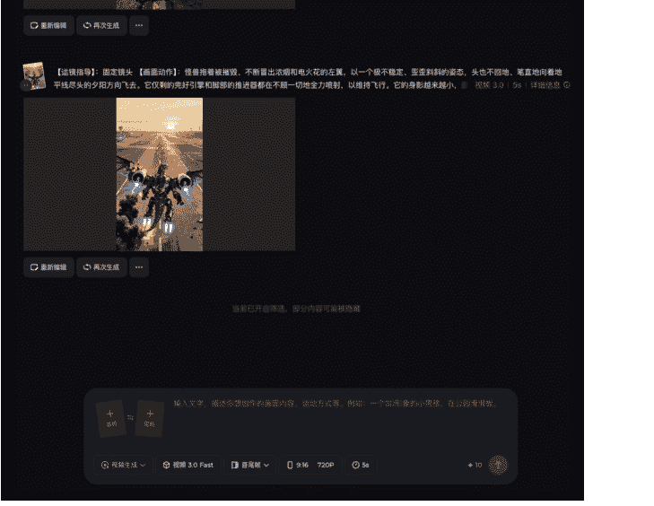
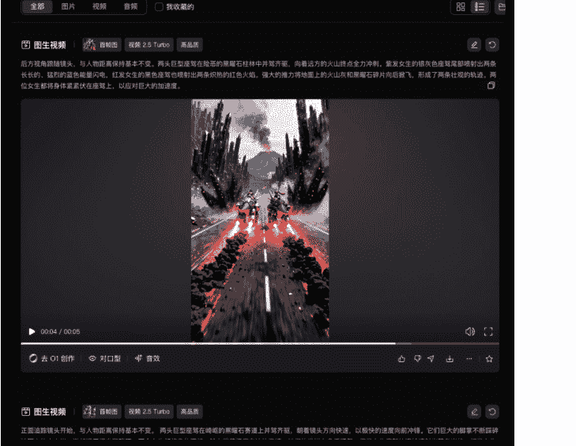


- (6) 视频剪辑：在剪映中，我会基于前面用于提取静帧的草稿，逐个导入已经生成好的分镜视频，按照原有分镜顺序进行排列，并根据剧情需要对镜头进行加速或裁剪，完成视频的初步拼接。

在第一次制作时，为了降低难度和试错成本，大家可以直接复用对标视频的音频，优先保证整体节奏和结构跑通。等对流程熟悉后，后面的视频就可以开始为视频重新选择和匹配音频。确保视频整体卡点，节奏紧凑，不拖沓；根据镜头的重要程度，合理调整每个分镜的时长；搭配必要的音效，强化情绪变化和剧情转折。

所有调整完成后，最终统一导出 1080P 及以上清晰度的视频。

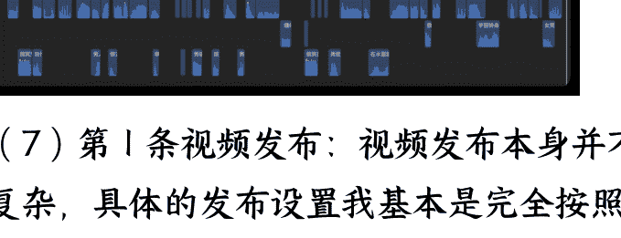

- (7) 第 1 条视频发布：视频发布本身并不复杂，具体的发布设置我基本是完全按照航海手册的流程来操作。

在发布时间上，我给自己的原则只有一条：当天做完，当天发布。原因也很简单，爆款脚本本身是高度同质化的，很多人都在同一时间段复刻同一个方向，晚一天发布，意味着要多面对一批已经占据流量池的竞争视频。

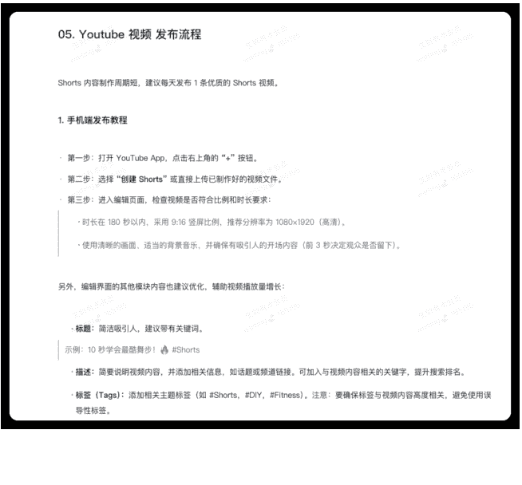

## 阶段 3：从短期反馈到长期指标

### 坚定目标

进入持续发布阶段后，目标非常明确：优先跑到 初级 YPP 标准，再到高级 YPP 标准。在 Shorts 阶段，数据波动是常态，有的视频很快起量，有的看起来“没跑起来”，但这并不代表方向一定有问题，一定要避免被单条视频的数据情绪化干扰，把注意力放在整体播放量的累积和账号权重的提升上。

### 搭建案例库

随着流程的熟悉和制作视频的增多，可以按照自己习惯系统地搭建自己的爆款案例库。

比如持续收集同赛道内已经验证过的数据型视频，把它们按剧情类型、节奏结构、开头方式等维度进行简单整理。这样在需要选题或脚本时，可以直接从案例库中寻找可复刻或可改编的方向，降低选题和脚本的思考成本。


### 数据分析

在数据分析上，我并没有做非常复杂的统计，主要还是参考航海手册中提到的一些核心数据指标，作为判断方向是否大致正确的参考。


但在实际跑视频的过程中，数据指标并不是绝对标准。不同赛道、不同脚本类型、不同竞争强度下，对数据的及格线本身就不一样。有时候也会出现选择观看率并没有达到常见所说的 80%，但视频依然跑出了百万甚至千万播放的情况。

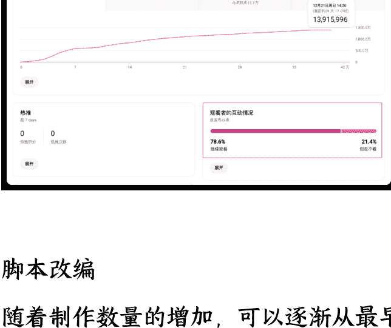

### 脚本改编

随着制作数量的增加，可以逐渐从最早的 1:1 复刻，过渡到在原有爆款结构上进行小幅度的脚本改编。这种改编并不是追求原创，而是围绕以下几点做微调：基本的人物角色、服饰装扮、场景元素、开头设计，爆款元素，再复杂点也可以做脚本重组。

换主题：当同一赛道被大量创作者同时复刻时，最直接、也是成本最低的破局方式，就是：换 IP/换人物形象/换世界观或故事背景。比如我把猫咪的脚本用到 Kpop、把一个反派改为两个、把派对的场景改成婚礼。

改分镜：脚本是决定视频能不能从测试池跑出来的关键。我们只对“非关键分镜”做改编，比如减肥过程中我们可以换运动类型。开头钩子、核心冲突、爆点 / 反转这些关键分镜几乎不能乱动，否则会影响爆款结构。

增加爆款元素：比如：砸玻璃、倒药水、变身等强冲突、极端情绪的画面。

这里分享一下我的几个前期的改编案例：

案例一：被用了缩小药水然后顶替身份的脚本。这是 10 月 7 号的案例，但是到现在还有人在复刻。当时我复刻的时候已经过了 10 天了，所以就想着需要多一些改编，最后的数据在当时还算可以。

原视频：1767 万

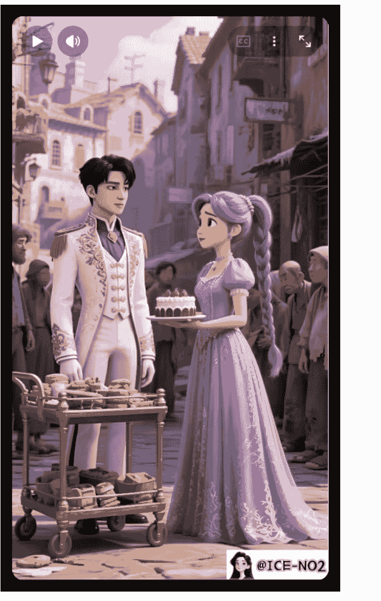

### 赈灾场景 1767 万


### 爬上桌子

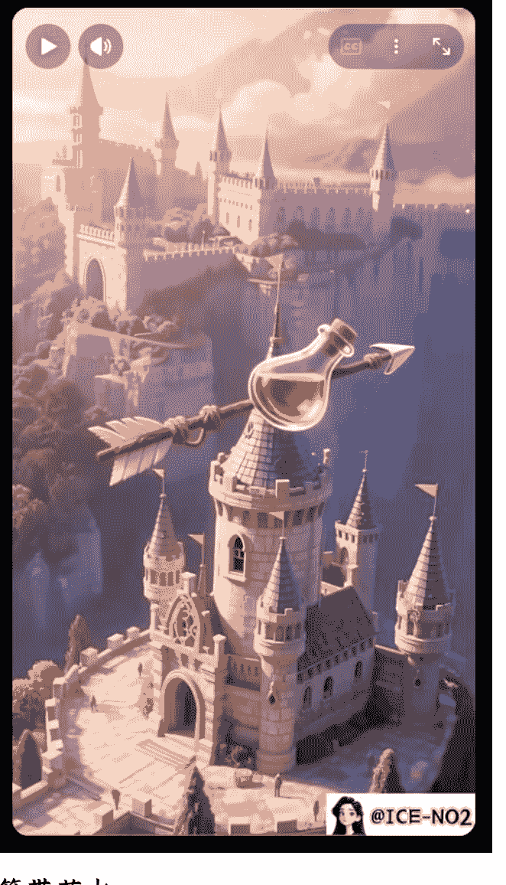

### 箭带药水

复刻视频：525 万


婚礼场景 + 开头摔杯子

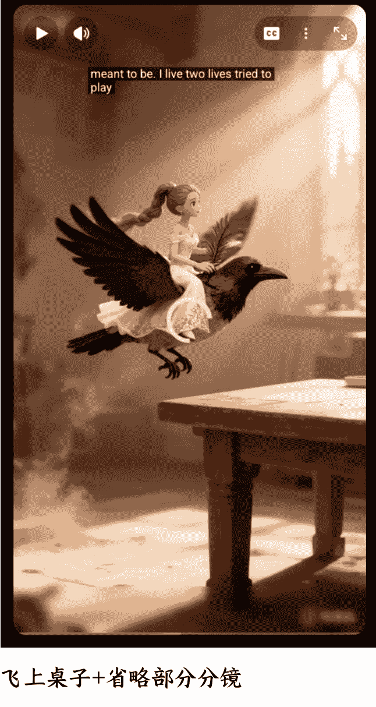

飞上桌子 + 省略部分分镜

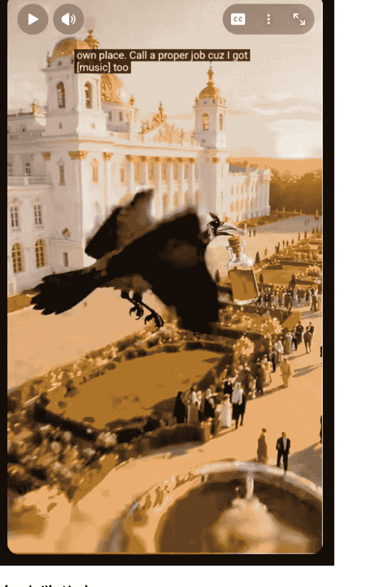

### 乌鸦带药水

案例二：开局送衣服，然后变身超人/蜘蛛侠/钢铁侠打怪兽的脚本。这个脚本很早之前就有了，而且是小孩子变身的，我也做了一个有 100 多万播放的。后来有人把小孩改成大人又爆了一次，就出现了一大堆复刻的，于是我就改了一下剧情和部分分镜，最终突破 1000 万播放，达到开通初级 YPP 的条件。

原视频剧情：打不过 -> 真正的超人出现

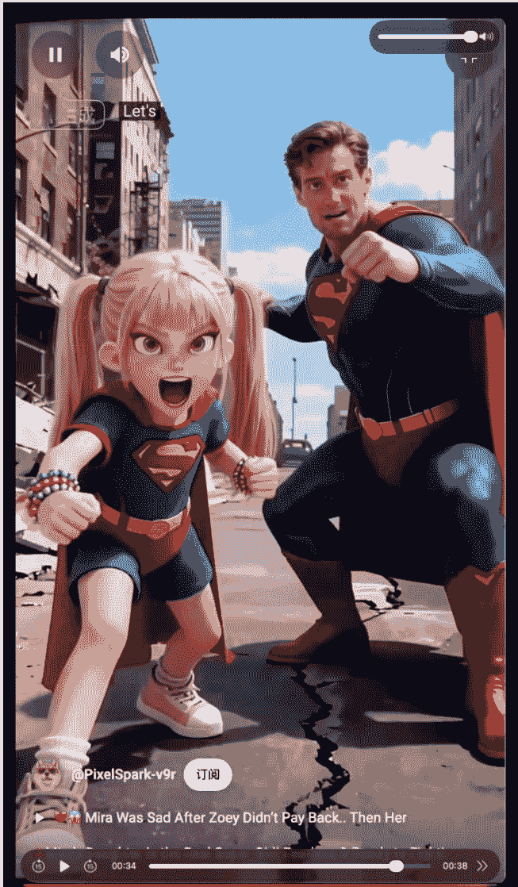

复刻剧情：打不过 ➡️□ 对象变身女超人出现


案例三：巨型水果用各种方法都打不开的脚本。这个也是太火爆了，很多改编主要围绕水果类型、打开的方式去做改编。所以想要爆还需要有差异更大一些的改动，最终也是这条视频突破 1000 万，达到了开通高级 YPP 的条件。

改编 1：大家都复刻水果，我就搞个不是水果的


改编 2：结局都是吃上了，我就换成孵出小鸟

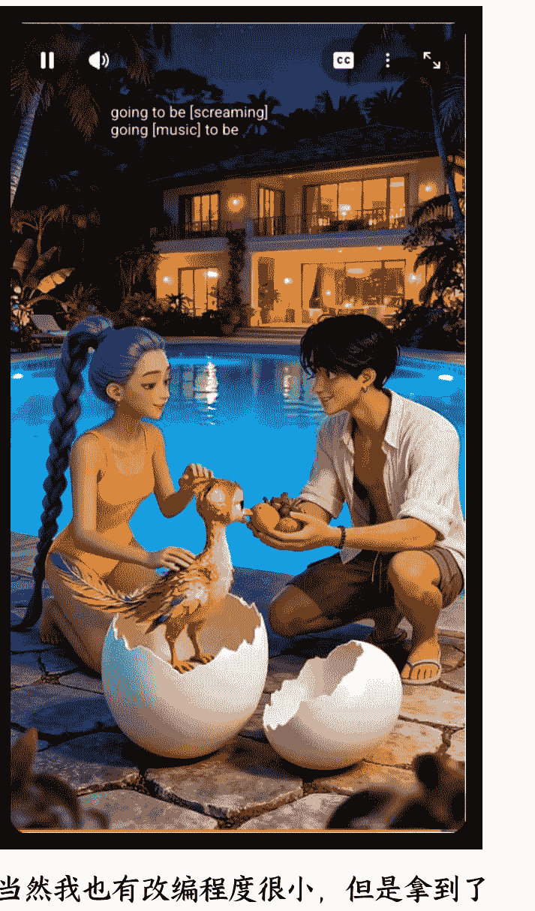

当然我也有改编程度很小，但是拿到了 3000 万播放的视频，那是因为发现得及时，然后还没有什么 人复刻，所以我们尽量找最新最爆的视频进行复刻。

但是，随着平台对 低质内容、同质化内容、流水线生产内容 的打压越来越明显，单纯依赖爆款结构本身，我感觉已经不足以支撑账号的持续增长。这意味着：脚本改编的目标，也需要从「复刻爆款」升级为「通过系统判断」。

做最坏的打算，平台对同质化的判断，可能会不再只看画面相似度，可能通过新的 Gemini 算法直接分析视频内容：

- 剧情推进节奏是否高度一致
- 关键情绪点出现的时间位置是否雷同
- 人物关系与冲突模式是否重复
- 频道内视频之间的结构相似度

所以，如何在不破坏爆款结构的前提下，
降低系统对“模板化生产”的识别概率，
这一部分目前还需要持续探索。

这里大家可以看下大佬们的分享：

### 持续发布

在持续发布阶段，我没有严格要求自己日更，只要保持不长期断更就可以。发布周期可以根据自己的实际情况灵活安排，关键是保持输出的连续性，让账号活跃度持续提升。

更重要的一点是，我始终坚持质量优先于数量的原则。相比大量粗制滥造的视频，少量高质量、播放量高的视频更有价值——哪怕是 10 个播放量 3 万的视频，也比不上一个播放量 100 万的视频带来的成长和账号权重提升。

## 阶段 4：从流量到收入闭环

### 开通 YPP 与配置

达到平台 YPP 开通要求后，基本按照航海手册指引操作就行了：确认频道符合资格、提交申请，并等待系统自动审、配置 AdSense 账户。

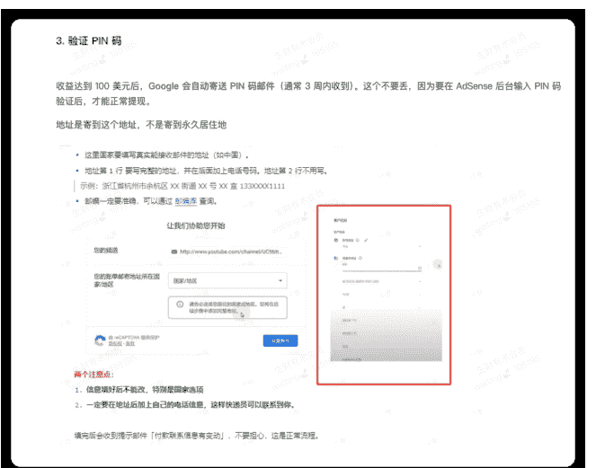

### RPM 与用户分析

拿到收益后，我开始关注两个核心指标：

RPM（Revenue per Mille）：每千次播放产生的收入
用户地区数据：不同地区用户的 RPM 不同

通过这些数据，可以判断哪些类型的视频更有变现潜力，同时分析观众偏好，优化后续脚本和分镜。例如，如果某类剧情短片的播放高，印度观众多，但 RPM 相对低。后续我会尝试在视频中调整内容风格或形式，加入语言，提高收益效率。


## 阶段 5：从执行者到运营者（我现在在做的事）

### 加入航海实战

虽然账号跑通并拿到了收益，但我还是选择参加 12 月的航海，避免长期一个人摸索，陷入认知和执行的瓶颈。

通过与其他圈友交流，可以更快验证一些新方向是否值得投入，也能及时了解平台策略、工具变化和新的风险点。少走弯路、降低试错成本。

### 内容转型

当基础模型和流程已经跑通后，我开始尝试对内容进行转型和升级。这里的转型，并不是完全推翻原有方向，而是在原本已经验证过的结构上，做进一步的优化。为了提高 RPM，下一步也会往语言类方向发展，已经初步跑通了流程。同时也会了解下长视频以及其他形式视频的方向。

### 新开频道

在对整个流程和平台机制有了更清晰的认知后，我开始尝试新开频道。这个阶段的目标，已经不再是单纯验证“能不能跑”，而是检验自己的经验是否具备可复制性。

### 更多问题与启发

短期爆款没办法保持长期收益

12 月 18 日前后，很多 YouTube Shorts 频道都出现了播放数据断崖式下跌，我的频道也不例外：

从 48 小时 2000 万播放，下降到如今 48 小时 20 万左右播放。

圈内普遍的猜测是：平台算法发生了阶段性调整，开始打击增长过快、结构单一、内容价值偏低的账号。

这次变化让我一个很直观的感受是：爆款从来都不是护身符。

爽感型、情绪型的 AI 内容，在某个阶段确实有明显红利，但如果长期依赖高度同质化的结构，很容易被系统快速识别并降权。

真正决定账号能不能继续走下去的，并不是某一条视频的播放量，而是：

- 用户是否愿意连续观看
- 系统是否认为你的频道“值得反复推荐”

也正因为这次波动，我更加确信一个判断：AI 内容如果不往精品化走，生命周期会非常短。

这里，建议大家再详细看下航海手册中的平台政策解读，要长期发展还是必须得深刻理解和遵守平台规则。

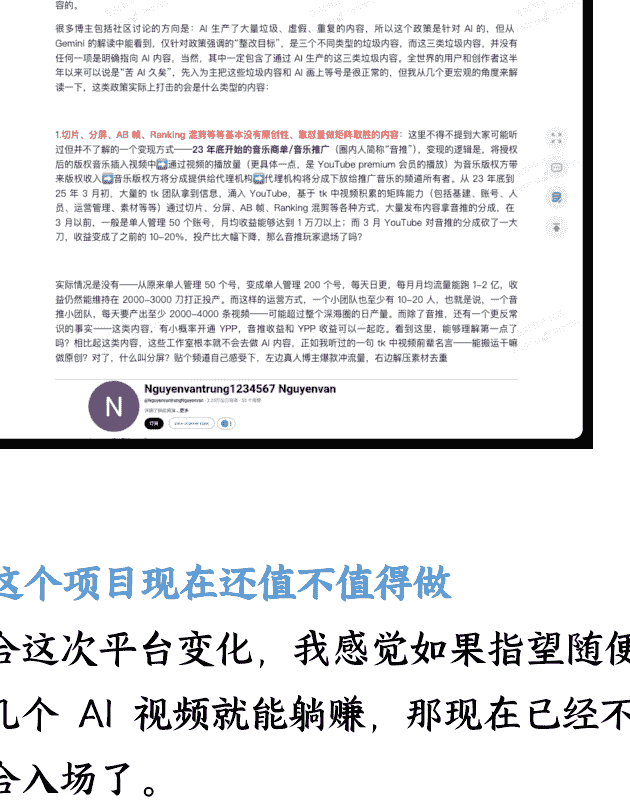

### ② 这个项目现在还值不值得做

结合这次平台变化，我感觉如果指望随便做几个 AI 视频就能躺赚，那现在已经不适合入场了。

更多是一个长期可复利的内容资产，或者说是一个训练内容判断力、节奏感和系统执行能力的项目。

它的难度在上升，但天花板并没有降低。

最后，安利小懒的付费群：

懒人专属群（介绍）


📖 这里是你对抗信息过载的护城河。

已稳定运行 6 年，累计拆解、研读 3000+ 个互联网商业实战案例与行业前沿内参和时政/宏观文章。

我们不搬运垃圾，只做高价值信息的筛选器与放大镜。

## 懒人专属群更新记录：

https://hk57gvlx7u.feishu.cn/docx/H0kRdZbSbolBR0xkaXtcuVE0nTg

## 懒人专属群更新记录（需梯子，备用）：

https://lazybook.fun/blog/record2

【免责声明】本资料归档于社群内部知识库，仅供成员课题研究与学术交流，请在查阅后 24 小时内删除。