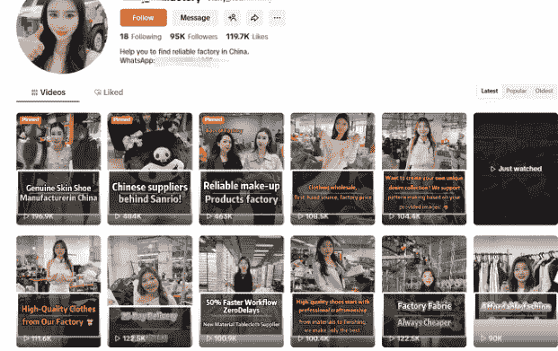

# 从出海代运营到轻交付，我这一年踩过的坑和想通的事

251229 副业 SC 精华

公众号懒人搜索，懒人专属群独享

懒人微信:lazyhelper

公众号
懒人搜索
懒人专属群


微信:lazyhelper

## 从传统外贸转到跨境电商

Hello，我是 Cecilia，做了 8 年外贸，从社媒开发客户起步，2019 年最早一批入局 TikTok，把短视频测爆品、英国小店直播、美国小店电商的全链路都跑通了。前年创立了自己的公司，做过一年多 TikTok 代运营。

传统获客那套我太熟了。展会、阿里国际站、Made-in-China、买名单群发邮件、LinkedIn 一个一个加人、等老客户转介绍等等。

说白了就是四个字：主动出击。你得自己去找客户，去敲门，去追着人家跑。今天发 100 封开发信，能有 3 个回的就不错了。参加一次海外展会，摊位费、差旅费、样品费，十几万砸进去，换回来一叠名片，回来挨个跟进，最后能成几单？看运气。你投入的是时间、是人力、是真金白银，但产出多少，老天说了算。今年行情好，客户多下几单；明年行情差，你再努力也没用。

我当时就在想，有没有一种方式，能让客户主动来找我？

后来接触跨境电商，觉得很有意思，通过社媒（Ins, Facebook, Pinterest 等）营销的方式将产品卖出去，并且利润比传统外贸高，就这么从外贸转去做了跨境电商。

### 2019 年，我赌 TikTok 一定会爆

在深圳做跨境发家的都知道，早些年有人做 Facebook 群组，闷声发财；有人做 Pinterest，搞图片引流，也狠狠赚了一笔。我就在想，下一个机会在哪？

2016 年到 2019 年，国内短视频已经杀疯了，抖音、快手打得不可开交，全民刷视频。但海外呢？短视频才刚刚起步，TikTok 还在早期，大部分人根本没当回事。

2019 年，我接触到 TikTok。那时候国内几乎没人做这个。我跟别人说 TikTok，十个有九个没听过，剩下一个以为我说的是抖音海外版，随便刷刷玩的那种。我每天在家捣鼓一堆手机，搞各种服务器节点、测号、发视频，我妈和别人说我就是天天弄一堆手机，不知道在干些啥。

我当时的判断很简单：国内验证过的模式，大概率会在海外再来一遍。所以我赌它一定会爆，开始死磕 TikTok。那时候市面上没什么教程，没什么现成的方法论，全靠自己摸索。测号、养号、发内容、研究算法，一点一点试。从短视频测爆品，到英国小店直播，再到美国小店电商，我把 TikTok 全链路都跑通了。记得早期生财也有 TikTok 大航海实战营，也是因为这个大航海，我想结识更多做 TikTok 的人，就加入生财有术。

但说实话，TikTok 这几年变化太快了。平台政策一个月一变，玩法三个月一换，今天还能用的套路明天可能就废了。有人踩中红利赚到钱，也有人亏着裤衩出局。我们圈子里经常互相调侃，做了三四年 TikTok，怎么感觉自己还像个新人。

当然这是调侃，不过也是实话。平台的短期红利，踩中了确实能赚一波，但很难持续。今天你会的东西，过几个月可能就没用了，你得不停地学、不停地跟、不停地调整。玩平台，得跟着平台的政策走。不进则退，站在原地就是倒退。当然，冲的太猛也可能不小心成为炮灰，就像美国市场刚开放，很多背后有资本的冲到美国搞直播基地，做 mcn 机构。

等到 2022 年 TikTok Shop 在美国起势，很多人才开始喊风口来了。但我已经在这个赛道里泡了两年多了。

### 凭什么赚钱的人不能是你？

出海太难了，水太深了！过去两年，这句话我听了不下百遍。

每当有人跟我吐槽出海太难，我都会问一句：你朋友圈里，有没有人出海做得还不错？他们几乎都能说出一两个名字。我就接着问：那凭什么，那个人不能是你？实话说，出海确实比三年前难了。但难的不是赛道，是认知。这篇文章，我想把我这些年踩过的坑、悟出来的东西，掏心窝子讲给你听。

看完你会明白：出海不难，是有方法的；代运营不是万能药，老板自己下场才是正解。

### 我为什么放弃了代运营？

前年，我觉得时机成熟了，创立了自己的公司，开始做 TikTok 代运营。逻辑很简单：我有经验，企业有需求，我帮他们做内容、搞流量，赚服务费 + 后端分成，双赢。我们做的是企业工厂的代运营，不算是联合运营。

听起来很美，对吧？但做了一年多，我发现这条路走不通。

**第一个坑：你能帮他获客，但你没法帮他转化。**

我们通过短视频帮客户获得客资——注意，是客资，不是询单。这两个词差别很大。

打个比方：客资，是有人刷到你的视频觉得产品，对企业有兴趣，点了关注或者留了联系方式，相当于加了联系方式；询单，是客户主动来问价格、问规格、问交期，相当于对于产品的需求是明确的。

从客资到询单，中间还有一大段路要走：你要跟进、要破冰、要建立信任、要挖掘需求。

问题是，这段路我们走不了，只有客户自己能走。

我们帮一个客户一个多月涨粉 5 万，单条视频就爆了千万播放，后台客资几百个，发给客户了，然后呢？客户这边没有专门的业务员有及时跟进，就等于没转化，没成效；后来我干脆让团队直接将客户的产品上架到我们自己的独立站，一时间流量涌入到我们独立站，两天 3 万多的进站量，并且出了几单高客单价的产品。

这样一个开局，到后面没有了下文，客户自己账号拿回去运营，流量慢慢开始下滑。因为自己团队不具备做持续爆款内容的能力。

**第二个坑：每个企业情况不同，根本没法标准化。**

做代运营最痛苦的是什么？真正要帮企业做出成效，不仅要帮他做内容，还要做战略规划。但是战略规划往往是中小企业不买账的地方。企业只要订单，其他战略规划这些是空话。

我们每个找上门的客户，情况都不一样：行业不同——有做厨房家电的，有做五金配件的，有做保健品的，内容怎么拍、调性怎么定，完全是两码事；目标市场不同——做美国和做东南亚，用户习惯、消费能力、平台玩法都不一样；营销策略也不同——有的适合先做 TOC 跑销量，有的应该先做 TOB 拿询盘，有的可以两条腿走路，但前提是团队和资源得跟得上。

这些战略性决策，不是我们代运营来定的，得看企业自身的条件：你的产品适合零售还是批发？客单价高不高？供应链能不能支撑小单快反？团队有没有人能跟进海外客户？老板自己愿意投入多少精力？这些问题，只有老板自己最清楚。但现实是，很多老板找代运营，就是想花钱买省心，你帮我搞定就行，别问我那么多。

另外出海代运营比国内企业代运营复杂多了，海外受到地缘政治的影响，国内就一个政策，资源等可以共用。

年初的时候，美国关税战越打越热的情况下，我的一个防护用品厂的客户决定转向日本市场。当时我们在美国积累的资源都搁置了。

看到这里，你肯定想说，和工厂可以一起联合运营啊。没错，我做了。

### 第三个坑：联合运营，但是决策权不在我

代运营的商业模式是：收服务费 + 后端转化分成。服务费扣掉人工，其实没赚多少钱。真正赚钱靠的是后端分成，但前提是客户得能转化。客户转化不行，我们一分钱分不到。

于是，我推掉了一些想做出海，但是各方面条件还没到位的企业，选择一两个有爆发潜力的项目，深度合作一起做大，分后面的蛋糕。其中我接了一个反向海淘平台的联合运营项目。所有分成都谈好，前端的运营费用客户也不少给，我们前端搞营销，搞流量，客户后端团队也跟得上。但是最后因为客户自身的问题，这个项目在快要收割流量的时候被暂停了，很可惜，我也有点受挫。

我开始问自己：代运营这条路，还要继续走吗？

### 转型：从帮他做到教他做

想明白这件事，是因为一个客户。

当时陪跑一个做灯具的老板，之前主要做国内，海外只有零星的 OEM 单。他想做自己做短视频获客，就问我能不能教他自己做。

我说可以，但你得自己下场。他说没问题。于是我开始带他——怎么定位账号，怎么拍内容，怎么蹭热点，怎么跟评论区互动，怎么把客资转到私域，一步一步，手把手教。他执行力很强，我说什么他就干什么，不打折扣。

其中有一条视频十几万播放，带来了几十个客资，其中也促成了一些小 B 订单。

他跟我说之前也找过短视频代运营，花了不少钱，没什么效果。现在自己做，反而做起来了。我问他为什么。他说因为这是我自己的事，我上心。代运营帮我做，我不知道他们做了什么、为什么这么做，出了问题也不知道怎么调整。现在我自己懂了，每一步都清楚，心里有底。

这句话点醒了我。

帮别人做，永远不如教会他们自己做。

代运营模式的问题在于：你帮他干活，但他没有成长。一旦你撤了，他还是不会，还是得依赖别人。而且，出海这件事，老板不亲自下场，是做不好的。

为什么？因为出海不只是发视频、搞流量，它涉及到产品定位、内容策略、客户运营、供应链配合这些东西，只有老板能拍板，只有老板能协调。让一个对接人去决定这些事？他没这个权限，也没这个视野。

所以我想通了：我要做的，不是替他们干活，而是教会他们自己干。

### 短视频获客，为什么一定要做？

现在做出海，短视频获客真的有必要吗？我的答案是不是有必要，是必须做。

先说结论：短视频获客，是这个时代成本最低、杠杆最大的获客方式，没有之一。

为什么这么说？我们对比一下传统获客方式：

- 展会：一年就那么几场，摊位费、装修费、差旅费，一场下来少则几万、多则几十万。能接触的客户数量有限，而且展会上大家都在比价，你没有差异化优势，很难脱颖而出。
- 阿里巴巴：平台流量越来越贵，同质化竞争严重，客户询盘质量参差不齐，很多都是比价的、套方案的，真正能成交的比例越来越低。
- 谷歌广告、Facebook 广告：烧钱换流量，一旦停投，流量立刻断。而且获客成本越来越高，卷得厉害。

短视频呢？

你拍一条视频，发出去，它可能被 10 个人看到，也可能被 1000 万人看到。它不睡觉，24 小时帮你在全球范围内曝光。它有长尾效应，一条好内容，半年后还有人刷到、还有人来咨询。

它帮你建立信任，客户看了你的内容，了解你的专业度、你的产品、你的风格，来找你的时候已经有了初步信任，不是冷冰冰的询价。

### 不同赛道，短视频获客怎么做？

也经常有人来咨询我不同赛道的怎么做流量，或者整个闭环链路。不同赛道，打法确实不一样。我拆几个常见的赛道给你看，每个赛道讲清楚：内容怎么拍、闭环怎么跑、有什么案例。

#### 工厂/制造业出海

适合机械设备、五金配件、家具灯具，家居用品的生产型/贸易型企业，都可以通过短视频拓展海外经销商，批发商。这类企业工厂就是制作各类短视频展示自己的工厂实力，产品优势，拿到客资，转化成实际订单，扩大外贸生意。

**内容怎么拍？**

- 工厂实拍、生产过程、产品细节特写，让客户看到你是真工厂，有实力。老板或业务员出镜最好，即使散装英语也没关系，真诚比完美重要。
- 还有一种内容很有价值：行业知识科普。讲讲产品怎么选、怎么辨别好坏、不同材质有什么区别、使用中要注意什么。之前看到一个工厂账号发这类科普视频，评论区有人说"希望我们门店的销售员也能有这样的专业知识"。作者回复说"这就是我们做视频的意义"。


你看，这种内容不直接卖货，但它建立了专业度和信任感。客户看完觉得你懂行、靠谱，有需求的时候自然会找你。

**一些跑通闭环的案例参考：**

- 东北大姐卖太空舱，用带口音的英语喊"Hello boss!"介绍产品，32 秒讲完卖点，火遍全网；

- 河北化工厂东华金龙，做甘氨酸这种冷门产品，靠展示生产过程在 TikTok 爆火，被华盛顿邮报报道，带来大量海外询盘；

- 还有许多义乌供应链出海获客短视频的案例：


#### 消费品出海

做家居、美妆、服装、3C 这些 TOC 生意的，核心就是卖货、跑销量、打爆品。

**内容怎么拍？**

- 产品使用场景、开箱测评、痛点解决。前 3 秒抛痛点，中间展示效果，结尾引导下单。达人合作也很重要，找本地达人拍使用体验，比自己拍更有说服力。

**闭环怎么跑？**

- 短视频种草 → TikTok Shop 小黄车/独立站链接 → 直接下单成交
- 深圳的朋友 Lena，和另一个女生做了一个宠物品牌 PetPivot，靠一个智能猫砂盆，7 个月赚了美国人 2 亿。


#### 品牌出海 (已有品牌想打海外市场)

- Sweet Furniture(家居) 通过达人挖掘产品新卖点，无扶手椅和收纳柜连续爆款，黑五期间 GMV 达 1200 万美金。

- 达人发现用户痛点座椅可以盘腿坐，解锁了意想不到的使用场景，带动销量暴涨。


#### APP/游戏出海

- 工具类 APP、手游、小游戏、短剧 APP 等，通过短视频拉新下载、提升活跃、付费转化。
- 视频内容可以是游戏实录，精彩操作、搞笑时刻、剧情高光，也可以是发起游戏相关挑战，鼓励用户 UGC。还需要通过大量的达人合作找游戏主播试玩、直播。
- 大量的付费买量，以及在海外社群做达人裂变。
- 《菇勇者传说》通过 TikTok 作为主要宣发渠道，上半年海外收入近 28 亿元，冲进出海收入榜 Top4。
- 《恋与深空》在日本市场，连续 9 个月稳居互动式叙事游戏下载量第一。

#### 玄学出海

- 先说玄学出海，从短视频制作角度来说，分享玄学的知识为主，风水布局、水晶功效、塔罗解读都可以。再加上真人出镜讲解，打造东方神秘学专家人设。
- 下面也是近期一个朋友的案例，用西语做视频，打爆了。也不一定非得欧美市场，也可以做拉美市场。

- 还有其他案例，比如风水植物女士 Clara，在 TikTok 讲办公室聚财植物怎么摆，单条视频播放量超 130 万，带动植物销售。Freya Jewelry 水晶店铺，通过塔罗占卜 + 随机捞水晶的直播玩法，售出 5.46 万单，总销售额近 74 万美元；
- Buddha&Karma 独立站，1688 上 10 元的貔貅手链，包装成风水招财手链卖 29.95 美元，还能加 7 美元注入灵气。
- 全球灵性消费市场 2024 年达 1800 亿美元，TikTok 上 #fengshui 标签搜索量超 30 亿。老外对东方神秘学的兴趣，比你想象的大得多。玄学出海也是很热门的赛道，或者独立站卖虚拟产品（课程，咨询），或者实物产品都可以。

#### AI 制作短视频，获客成本更低了

- 我们现在有了 AI 加持，不需要投广告费，不需要租摊位，不需要买流量。你需要的，就是一部手机、一点内容能力、和持续输出的执行力。
- 给大家看个案例，这里面的外国美女是 AI 生成的。

- 这是一种视频展现方式，但是我更推荐的是强人设 IP 出海的方式。也就是真人出镜，打造更真实的个人和企业背景，这样才会更能获得海外客户的信任，拿下大订单。
- 比如这类强人设的海外短视频，会给用户真实感。




### 我现在在做什么？

想通了之后，我调整了方向。既然不做重交付的代运营了，那就继续当跨境商家，同时做出海陪跑。

**自营电商项目**

- TikTok+ 独立站 + 私域，自己也在跑。保持手感，市场在变，我得一直在一线。只有不下牌桌，持续在这个赛道深耕，才能跟上变化，应对变化。踩过的坑、测出来的打法，都是真金白银换来的经验。接下来也还是会筛选优质供应链合作，联合运营一些有潜力的项目，前端流量我们来做，后端产品和交付靠供应链，各自发挥优势。

**TikTok 电商线上陪跑**

- 带学员从 0 到 1 跑通小店、短视频、独立站的全链路。这么多年的跨境电商打法，总结出来，再结合 AI 工具提效，形成一套可复制的方法论。

**出海线下训练营**

- 帮学员梳理定位、打造人设、找到变现路径。很多人想做出海，但不知道自己优势在哪、该切哪个赛道、怎么差异化。我们可以帮大家梳理清楚，然后落地成可执行的方案。这一套也是之前帮企业做代运营时沉淀下来的体系和打法，现在用来赋能更多想出海的人。

### 给想出海的人几点建议

**出海是一把手工程**

- 很多人觉得出海就是花钱买服务：找个代运营、找个服务商，自己当甩手掌柜。这样做，100% 做不起来。
- 还有的老板，把出海当战略备胎，等国内不好做了再说，先让代运营试试水。这种心态，基本也做不起来。
- 出海涉及的东西太多了，从产品定位、内容策略、客户运营、供应链配合这些事情，只有老板能拍板、能协调、能快速决策。至少在 0 到 1 阶段，老板要亲自盯。等跑通了，有了成熟的 SOP 和团队，再慢慢放手。

**闭环链路要清晰**

- 出海这个赛道很大，细分方向很多：TikTok 电商、娱乐直播、海外网红营销、中视频计划、短剧出海、游戏出海、达人短视频带货等等，选择太多，反而不是好事。
- 你得想清楚：从获客到转化到交付，整个链路是什么样的？先把一条路跑通，再考虑扩展。

**完成比完美重要**

- 很多人迟迟不动手，是因为觉得自己还没准备好：英语不够好、不会出镜、不知道拍什么。
- 但在红利期，时间成本远大于试错成本。干中学，学中干。等你准备好了，机会早就没了。你不卡位，竞争对手就卡位。印度的工厂、墨西哥的供应商，正在用同样的方法在 TikTok 上抢客户。你不做，就是把机会让给别人。

**善用 AI 工具**

- 我现在用 AI 工具大幅提升内容生产效率，写脚本、做选题、分析数据、优化文案。以前磨半天的东西，现在效率提升好几倍。AI 不是来抢饭碗的，是来帮你提效的。

### 写在最后

- 企业出海，是持续要做的生意。代运营是不可持续的，企业需要学会的是自己掌握获客、销转的整个体系，而不是代运营公司帮你爆了几个视频就够了。
- 内容是资产，能力是资产，这些东西长在自己身上，才是真的属于你。
- 我就是一个在出海赛道摸爬滚打了这些年的普通人。踩过很多坑，交过很多学费，也算是跑通了一条路。
- 出海这条路，没有想象中那么难，也没有想象中那么简单。

### 最后，安利小懒的付费群:

#### 懒人专属群 (介绍)


微信:lazyhelper1

这里是你对抗信息过载的护城河。

已稳定运行 6 年，累计拆解、研读 3000+ 个互联网商业实战案例与行业前沿内参和时政/宏观文章。

我们不搬运垃圾，只做高价值信息的筛选器与放大镜。

#### 懒人专属群更新记录:

```
https://hk57gvIx7u.feishu.cn/docx/H0kRdZbSbolBR0xkaXtcuVE0nTg
```

懒人专属群更新记录 (需梯子，备用):

```
https://lazybook.fun/blog/record2
```

> 【免责声明】本资料归档于社群内部知识库，仅供成员课题研究与学术交流，请在查阅后 24 小时内删除。