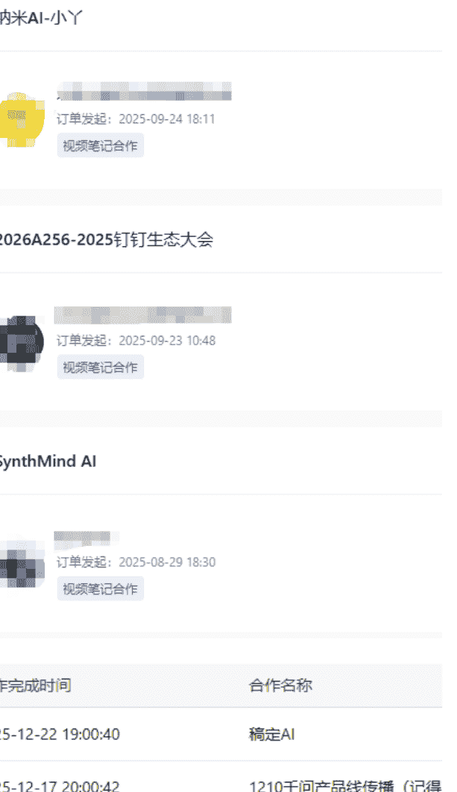
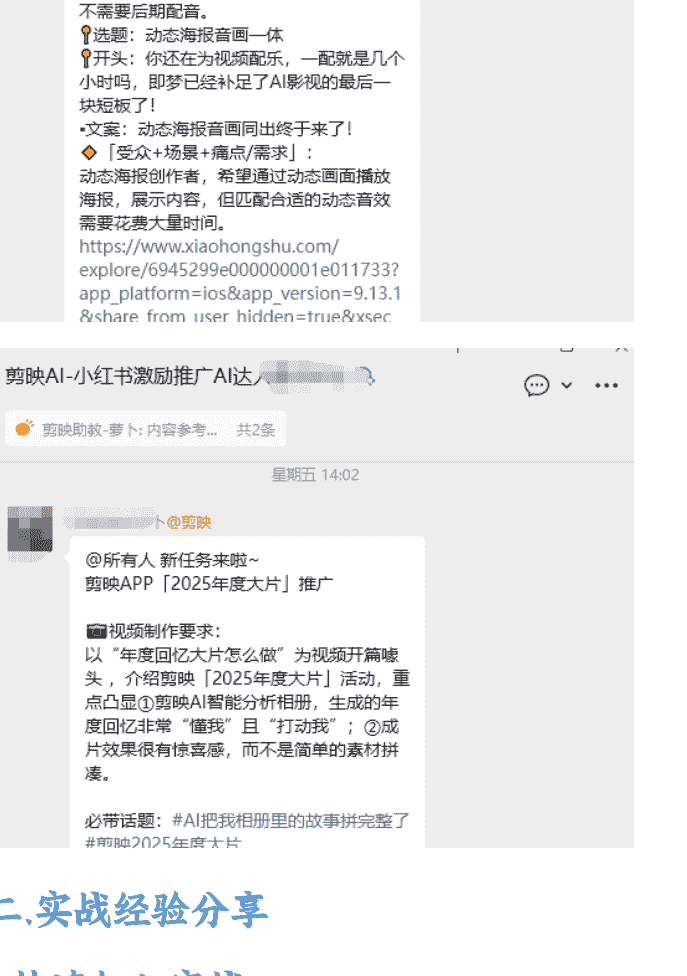
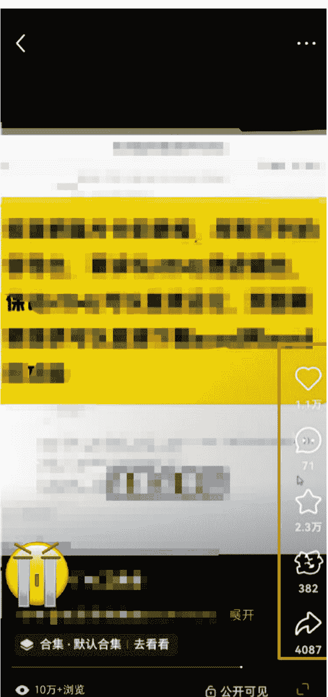
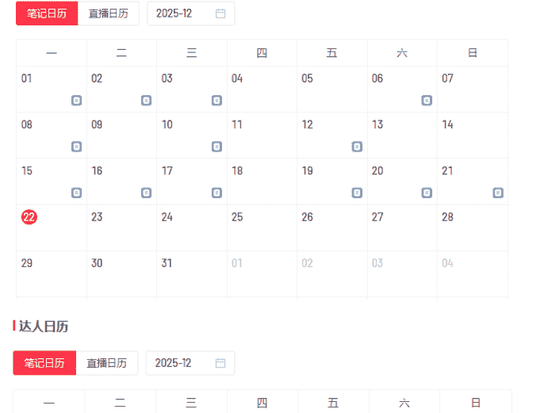
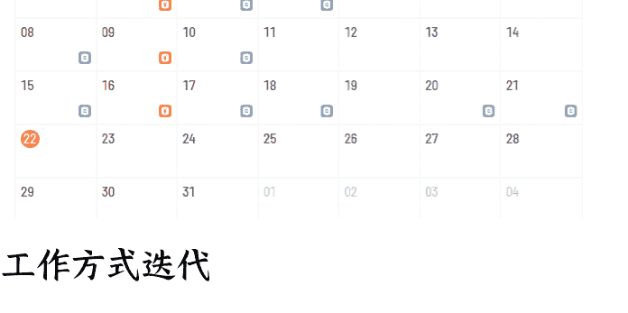
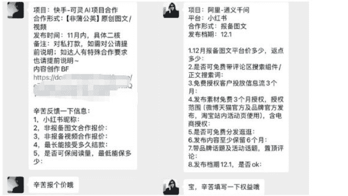

# 从裸辞宝妈到 3 万粉 AI 博主:9 个月接 60+ 商单的真实复盘

## 251229 副业 SC 精华

公众号懒人搜索，懒人专属群独享

懒人微信:lazyhelper

微信:lazyhelper

## 写在前面

大家好，我是小丫。做 AI 自媒体项目 9 个月了，今天想和大家分享这段时间的真实经历——从裸辞宝妈到 3 万粉 AI 博主，接了 60+ 商单的心路历程，以及我踩过的那些昂贵的坑。

虽然还没到月入 10 万的大神级别，但 9 个月从 0 到 3 万粉、从月入 200 到月入过万，这个过程中的坑和经验，对和我一样的新手应该很有参考价值。

## 一、我的来时路

现在是 12 月的尾声，一年过得真快。尤其是马上迎来第二个本命年，会在期盼中带着一份坚定向前的信心。

这两天看到亦仁分享的《项目红利期长短，关键在人不在项目》，给了我很大触动。原本我还纠结是不是要换项目，也不太想分享，觉得自己没拿到大结果。但亦仁说得对：项目的红利期跟项目没太大关系，跟人有关系。你人是长期的，这个项目的红利期就非常长。

### 关于我

我是一名有 12 年经验的前视觉设计师，准确地说，是外包设计师。从 2015 年到 2023 年，都在外包设计师这个圈子里打转。前期在公司做阿里系的设计外包，2020 年开始驻场在阿里园区，辅助甲方设计师做设计。

其实我不想一直做外包设计师，但投递的简历回复都是外包岗位。加上薪资也还过得去，就一直这样耗着。骨子里，我一直在观望，想办法跳出这个模式。

第一次接触生财：2020 年就加入了 (编号 29484)。那时候很惊喜，发现了新大陆，但也很迷茫——信息量太大，很多看不懂。加上工作忙，一个月后就闲置了一年多。现在想想真的很后悔，如果那时候能加入航海实战，应该是不一样的风景。

第一次做项目:2022 年 7 月，阿里外包项目结束，我一边找工作，一边在生财圈友的训练营学习小红书虚拟资料。做了 2 个账号，加了几百好友，赚了两千多块。这是我第一次知道，原来还可以这样赚钱。

### 冲动裸辞

2023 年 10 月，刚怀孕，觉得视频号带货是不能错过的机会，不顾一切裸辞了。结果一整年除了赚回学费，几乎没有收入。现在想想也很正常。上班这么多年，我除了会用设计软件，没有任何商业思维和运营能力。选品、拍摄、脚本、剪辑、直播，都是新东西。仅凭一股幻想就把自己陷入被动，这是 30 多岁中年人的无脑冲动。

### 重新出发

2025 年过年后，我开始整理简历。刚生完孩子、裸辞一年多，重新进职场的难度确实高。投了一些简历都没回复。

35 岁、3 个娃、队友工作太忙平时也顾不上家里，找工作上班也难上加难。我心里想要的状态是能在家边工作边照顾家庭，于是和队友商量，给自己 3 个月时间再试一次。

刚好过年那阵子 DeepSeek 爆火，我在生财公众号看到 AI 自媒体超级标和新一期航海实战。虽然续费通道已关闭，但我找鱼丸帮忙开通了，赶上了 3 月的航海实战。

## AI 自媒体实战复盘

### 一、账号现状

从 3 月 26 日发布第一条视频笔记，截止目前小红书粉丝 3w，视频号 4w+，抖音 5k+。

接商单 60 多条（单独合作商单 + 固定创作者商单），合作品牌有飞书、夸克、阿里云、钉钉、豆包、剪映、MiniMax、可灵、即梦等等。

| 合作完成时间 | 合作名称 |
| :--- | :--- |
| 2025-12-22 19:00:40 | 稿定 AI |
| 2025-12-17 20:00:42 | 1210 千问产品线传播 (记得 |
| 2025-12-09 10:40:03 | 夸克夸克 11 月共创合作 - 数码计划 16 |
| 2025-10-27 17:07:25 | 来鼓 AI+ 视频 |
| 2025-10-20 18:20:23 | MiniMax AI-9 月合作 |

虽然合作多了起来，但变现对于我来说，并没有达到预期。这里原因之后会细讲。主要的变现方式还是来源广告收入，除了蒲公英平台商单，水下合作广告商单，也加入了 AIGC 创作者群，目前稳定的是 AIGC 创作者商单。

### 二、实战经验分享

#### 1. 快速加入实战

加入生财后，直接上车了 AI 自媒体航海和 DeepSeek，在此之前我对 AI 的使用和赛道理解并不多，只能边学边做。

#### 定位 + 方向

选择项目后，当时定位上我选择了 AI 在职场的效率提升，这个比 AI 生图和 AI 视频类的制作简单一些，自己也在职场搬砖了 12 年，也了解职场普通人的需求。

形式我选的真人出镜口播，一方面出境是做差异化的最好方式，另一方面，24 年视频号带货也做了出镜口播的视频，没那么抗拒镜头。（这里也对想出镜做视频口播的同学建议，大胆出镜，熟读几遍口播稿之后，用提词器拍摄，一般教程类视频，出镜的镜头有限，出镜部分看着镜头讲，其他部分可以念稿。等你拍了几十条之后，基本就很熟练了。）

主攻平台一开始我没有确定好，都是同步发布在小红书，抖音，视频号。后面发布的内容，小红书数据跑的会更好，所以我就以小红书作为主场，其他分发，到目前，我的内容都是主发小红书，同步在抖音，视频号，B 站。

内容我想要简单的好操作又能解决痛点的，刚好 DeepSeek 还是热点，一定还有认知信息差，于是我用 DeepSeek 相关的内容做起号，接下来的动作就是每天坚持发布就行。一开始也是没有流量的，在日更了 20 天左右，粉丝慢慢的涨到了 1 千，然后就继续保持更新，但没有日更那么多，大概两三天一条，保持这个状态，在五月份终于迎来了第一个爆款。

#### 第一条爆款，涨粉 1W

这条爆款是看到别人的选题，低粉爆款，并且形式也很简单，就是通过 deepseek 把纸质表格转成文档。操作简单，EXCEL 也是职场人的刚需，纸质表格转文档依然有非常多普通职场人不知道怎么转换。我对标的低粉爆款是一个剧情的版本，我直接用了口播的形式，这条内容直接给小红书带来了 1.3w 的粉丝 (半年前的数据后台看不到了),视频号带来了 4w 的关注。

有了这条爆款之后，粉丝也冲到了万粉，之前我也在纠结涨粉，但发现一条内容就可以冲到万粉，验证得出不必过于纠结涨粉，专注做好内容，一条爆款就可以帮你冲刺万粉，甚至更多。前提还是要打磨好内容，只有内容能力在手，才能持续稳定出爆款。

#### 2. 如何做爆款内容

选题是大家都绕不开的话题，一个好的选题基本就觉得了这条内容的质量。

这段时间我内容选题的方法是围绕跟爆款，追热点。

##### 跟爆款

被平台验证过的内容，会依然有大概率会爆，我会搜一些行业的关键词，围绕低粉爆款来找，搜索关键词后，时间一周内，半年内都会看看，然后手动刷，一般万粉以下，点赞收藏高，然后记录到爆款选题库备用。

比如我的第一条爆款，也是跟了当时的低粉爆款，对标只有三千多粉丝的时候，我跟了内容选题。

到目前我还没开始用自动化工具抓取，我个人是认为，我自己的敏感度还需要训练。因为自己以前都不爱看短视频，而真正开始刷短视频也就是这一年多的时间，对爆款的敏感度还远不够，这一定是需要时间不断刷出来的直觉，刚好每天也需要养号，所以我就一直刷着找选题，现在结合飞书的多维表格，只要复制链接通过剪贴板就可以同步到表格，也是比较方便。（教程可以在多维表格的航海中找到详细版）

刷爆款的时候，还有一个点是我会用不同的 3 个手机刷首页，这样能看到的内容会不一样。

##### 追热点

今年是 AI 进展很快的一年，虽然我是 3 月份才进入 AI 自媒体这个赛道，从年初的 DeepSeek 爆火后，各大 AI 的更新速度也是很快，ChatGPT5,Sora2，到谷歌的 nanobanana pro,gemini 3，一段时间就会有热点出来。

其实前期我对热点的敏感度还是很弱，一方面自己认知浅，另一方面，自己的信息来源是依靠小红书的科技博主们，等我刷到的时候，也是有一定的滞后性。

从 8 月我也开始去刷一下 x，前沿的内容大部分是从这里流出，比如 NanoBanana 刚出来的时候，我就第一时间在 x 刷到了，然后小红书也第一时间来发了视频。但这并没有爆。而我就此打住，没有继续发布，反而等过了好几天再来发第二条，这就错过了很多早期流量。

我复盘下，是自己追热点的选题方法不对。这也是后来看到冷科长的分享，我才意识到的 NanoBanana 发布第一篇后，数据没爆，但是热点才刚开始，我没有继续去跟，而是做其他选题方向。

但后面我听冷科长的分享，一个热点选题可以同时做好几篇来测试内容，最后留下数据好了，不好的隐藏。后来我发现，其他博主也会在一个热点的时候，做多条内容，测试不同的方向。

然后尽量多做广告商喜欢的内容，有一些单纯的网站分享，工具分享数据很好，涨粉也很快，但是我接商单下来，基本上广告方的要求，还是希望能结合使用场景来做内容，切入的选题是能解决什么人群的痛点，而不是单纯的讲一下工具。

毕竟最终还是希望带来转化。

如果在没有商单的时候，你想接 A 品牌的广告，那你可以找到 A 品牌竞品的视频，模拟做一条软广。只要数据好，接下来会有来源不断的竞品加你询价。

##### 爆款笔记特征

爆款笔记一定是有价值的内容，价值给到位，比如实用价值，你解决了某一类人群的什么问题，比如“3 步搞定 Excel 数据可视化”，用户看到这些真的有用，才会去点赞收藏转发。

比如情绪价值，比如吐槽工作中的某个场景，然后引发了大家的共鸣，就会带来传播。

又比如认知价值，你发的内容让用户学到了知识，或者冷知识这些，让他打破固有认知，那这个内容就天然会被收藏。

##### 笔记制作经验

确定好选题之后，需要开始写脚本，前三秒是留存的关键，所以我一般是对标爆款的框架，前三秒尽量保留，或者改成适合自己的口语习惯，有很多爆款框架，当测试出了适合自己的账号的框架，可以持续的用。

有很多人会用 AI 写，我自己是感觉，能手戳练习一下，是有必要的阶段，当我自己都不知道什么是好的文案，那 AI 给我的，我也不知道到底如何。

再说封面，目前一共用过两种类型的，前期是比较粗暴的，照片上打字那种 (图 1,2)，好处是真实感强，后续换封面，是因为我想多做一些 AI 生图，AI 视频的内容，而这类内容直观展示成品会更出效果。(图 3,4)

## 学外语神器
沉浸式刷视频

10+ 主流语言!

- 演讲!
- 采访!
- Vlog!

边刷边点读!

每一个语言学习者的白月光

## 把 Word 转成 PPT
- 操作简单
- 一句话搞定

一个冷门但很牛的 AI 技巧

## 豆包实用技巧

图 2

## AI 做设计 怎么用？

做海报
做全案
做 PPT
做 UI
做 3D
做图表

图 3

图 3

封面的标题一定要醒目，简洁，说重点，除了对标爆款笔记本身的封面，还有一个小技巧，可以把爆款笔记的文字标题，作为你封面的标题参考。

做好的封面，我有时候甚至会做 2-3 版封面，发给豆包和 gemini 帮我点评一下。

### 更新频率

账号在 2.2 万粉的阶段徘徊了近两个月，因为那段时间精力被分散，甚至一周都没有更新，所以数据就一直上不去。

当我开始看到之前粉丝比我少的博主，还有之前关注的博主涨粉都很快，我在会灰豚看了下他们的更新笔记数量，有几个每月都能达到 20 篇，这几乎是日更。

### 工作方式迭代

我开始意识到更新频率不高，账号就不活跃，平台也不会一直给老的笔记流量，那粉丝量肯定就一直上不去，于是我开始规定自己每周至少 3 更，这样一阵子更新频率很稳，有一周甚至到了 6 更，所以账号开始活跃起来，也陆续的出了几条千赞，在这段时间，我也迭代了下自己的工作方式。

之前我做一条视频，都是写好脚本后，立马开始录口播视频，再录屏幕剪辑，但这样我每条视频拍摄的时间就很浪费，因为真人出镜，要稍微布置收拾下，化个妆什么的，这看似不起眼的时间，汇总来就是很大一段时间成本。然后我开始集中在某一天做好至少 3 条脚本，一次性拍完，这省了不少时间。

### 库存思维的重要性

保持更新还有一个点就是要有库存，当我听到涛哥说他公众号的库存可以发几个月的时候，我就惊呆了，像我没有库存的思维，每次都追着更新就会很耗费心力。

### 3. 商单变现之路

### 踩坑经验分享

在小红书只有 100 粉丝的时候，接到了第一条 50 块的小程序推广商单，是按点赞付费，数据跑完也只有 50 多块，这是来自 AI 自媒体的第一笔收入，虽然很少但也开心有了正反馈。

按理到了万粉后，按粉丝的 10%-20% 报价，也应该是开始好起来了，但因前期没有做足功课，5 月底涨粉起来了，蒲公英还是 200 的报价没有修改，所以整个 6 月，按照 200 的单子接了 4 条广告，不想掐自己一下是不可能的。现在养成了每个月底看下数据，需要改价的时候及时修改。

### 商单形式

商单分为蒲公英报备商单 (水上) 和非报备商单 (水下)。

报备商单：定价自己按照平台粉丝 10%-20% 或者更高，自己来设定，这里要注意平台会抽成 10%，基于小红书的水土，和你对接的品牌 pr，也会要求有返点，目前我接触到的一般要求在 20%-35%，也遇到过更高的 45%，这个按自己接受程度。

非报备商单：一般是低于报备商单价格，例如我有遇到一个 pr，他们公司会要求合作价格为报备商单的 60%，仅供参考。

如果有多个平台同步，也可以作为一个谈判的权益，比如我可以免费同步到哪几个平台，如果每个平台数据都很好，能做打包报价提高总价是最好的。

### 合作流程

1.  接到蒲公英商单后，小红书系统消息会收到邀约通知，点了感兴趣后就会有微信号，这里建议主动联系下，会更快进入第一步;

2.  和 pr 对接上 (也会有直接的品牌方运营，不过我遇到的也就 3 个)，对方会让你报价，有的有报价模板，填写后他们会发给品牌方选号，选号成功，pr 会和你再核对下排期，这时需要给到对方脚本时间，初稿时间，发布时间。

3.  沟通细节:

-   1. 水下的商单一定要确定结算日期，尽量在 1 个月内完成结算。我遇到的有最爽快的发布后一天就结算，也有 7 天，14 天，一个月结算。最长的遇到了拖欠了 5 个多月才结算的，我一度以为这单收不回来了。
-   2. 确认是否要求排竞，一般品牌方会要求发布日期前后几天不能有竞品，也有些 pr 不会主动说，所以问清楚比较妥当。
-   3. 确认下品牌会不会有投放预算，有些品牌发布 24 小时后给你投薯条，但也有一些不仅不投薯条，还会要求你保证数据，要自己投薯条。

### 4. 账号运营方向的摇摆

### 焦虑和混乱并存期

3 月底开始做到 4 月底的时候，我才变现了 200 来块，这对我来说压力很大，主要是前面跟队友商量了 3 个月的时间来看看是否要持续做，这裸辞做项目的风险就一下暴露，我开始为了变现，找一些变现的渠道。

在 5-6 月份的时候，我一边更新账号，一边接令狐峰团队的剪辑单，写脚本等 (这里也非常感谢令狐峰和 Hawli 的单子，能让我在焦虑的日子里有基础收益，也有了持续做自由职业的谈判筹码)。

在这两个月里，我的收入可以稳定在几千块钱，收入的焦虑缓解，但其实通过苦劳来变现的路径不是长久之计，这时候我了解到变现形式，其实是非常有限的，只知道接商单。

7 月份有了转折，有一天一个 pr 加我，于是我加入了即梦创作者，这是按照基础底薪 + 按互动付费的形式，一个月上限是 16 条广告。这也可以让我保证有基础收益。

### 定位纠结

但问题也相继出现，我的账号定位在职场提效，粉丝也大都是来源于爆款 excel 的内容，粉丝人群在 30-40 岁，而即梦是 AIGC 为主，所以我的即梦商单数据并不好，加上我本身是设计师出身，职场提效 excel 类越往后做，越发现并不是我的长项。

在这期间就非常纠结，要不要转为 AI 生图，AI 视频类？一方面我更擅长一些，另一方面，通过一段时间的商单询价，AIGC 这类商单的报价，相对高一点，当然制作门槛也会更高。但又担心转了后粉丝不喜欢，数据更不好了。

纠结犹豫不如交给市场验证，于是我开始两条腿走路，一方面我开始在内容的选题上，除了职场提效的，会搭配以 AI 生图，AI 视频类选题内容来探索，到近期这类内容数据也慢慢好起来了，最近的一个 AI 生图商单，7 天自然流跑到了赞藏 4k。另一方面，我把一个早期做大学资料的账号，重新启用，小号定位是设计师垂类账号，这样也可以测试选题。

总结一下，因为是想吃长期饭，所以在账号内容方向上，根据自己兴趣爱好，能持续输出，再结合刷对标内容，确定一个方向是最佳选择，后续中途来更换也是可以，但有一定试错成本。

### 5. 目前遇到的瓶颈

要说最近这段时间我最大的瓶颈是什么，那就是产能和变现焦虑。虽然是 3 万粉，但依然是劳务为主，变现路径很单一被动。在一个月更新 19 条视频的情况下，变现并没有想象的那么轻松乐观，目前我还是一个单兵作战完成全部。而大佬们的方法，是通过团队来增加收益，例如招募了编导，剪辑，很明显，我还没有迈出这一步。

前段时间读了学亦仁老师推荐的《为什么 10 倍增长比 2 倍更容易》，从这本书里，也反思了一下我这半年多，一直在做的是 2 倍增长的路径，例如没有单子的情况下，我依然在做低价格的单子，而没有选择在这段时间，提升视频及内容质量，来想法达到 10 倍增长。要学着专注于做 20% 的事情，雇佣其他人来做 80% 的工作。因为你摒弃的 80% 里，可能就是别人的 20%。

最近也在探索新的变现形式，在 12 月 x 自媒体航海里，学习到了如何把内容变现渠道拓宽、有很多品牌也在考虑出海，海外的商单也是一个新的方向。

在探索新的领域，又遇到了很多优秀的自媒体创作者，学习大家的亮点，也会有让我对内容创作有不同的思考。

### 一些思考

通过这大半年的实战，我深刻认识到“从 0 到 1"的自由职业者和“从 1 到 N"的商业化运营是完全不同的两种心法。

在这过去的 9 个月，我已经验证了赛道、跑出了爆款、积攒了粉丝和品牌合作资源，也逐步完成了从“职场人”到“自由职业”的跨越。对我来说，现在最大的挑战战，就是如何把建立起来的流量池，转化成可持续、可规模化的收益。

正如《为什么 10 倍增长比 2 倍更容易》所说，我不能再沉浸于仅够维持生存的低效劳动，要多去思考新的模式，让自己聚焦每一个 20%。

如果想要走的更远一点，需要找到我自己的增长道路。

回望 2000 年的互联网时代，AI 才发展两三年，还是元年时代，2025 年可以看到 AI 的步伐在加快，AI 工具每周都在更新，未来依然是 AI 的主场。我觉得 AI 自媒体对于普通人来说依然有红利在，普通人需要 AI 提效的需求只会更强，只是在变现模式上，依靠单一的商单变现会比较被动，可以加入更多元的变现方式，例如自媒体出海，AI 知识库，和虚拟电商的结合等等，这些也是我在探索的道路之一。如果有跑通的圈友，也希望能评论帮忙指点一下。

2026，新的一年又重新启航，大家加油啊！

最后，安利小懒的付费群：

## 懒人专属群（介绍）

微信：lazyhelper1

这里是你对抗信息过载的护城河。

已稳定运行 6 年，累计拆解、研读 3000+ 个互联网商业实战案例与行业前沿内参和时政/宏观文章。

我们不搬运垃圾，只做高价值信息的筛选器与放大镜。

## 懒人专属群更新记录:

https://hk57gvlx7u.feishu.cn/docx/H0kRdZbSboIBR0xkaXtcuVE0nTg

## 懒人专属群更新记录 (需梯子，备用):

https://lazybook.fun/blog/record2

【免责声明】本资料归档于社群内部知识库，仅供成员课题研究与学术交流，请在查阅后 24 小时内删除。