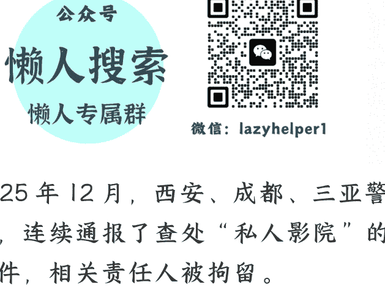

# 私人影院接连被查，背后是庞大的“擦边产业链”？

2025 年 12 月 29 日 文/卢克文工作室嘉宾 概略北方
整理：公众号懒人搜索，懒人专属群精选
懒人微信：lazyhelper1



2025 年 12 月，西安、成都、三亚警方，连续通报了查处“私人影院”的案件，相关责任人被拘留。

很多人可能觉得，这不过是又一次常规的“扫黄打非”嘛，没啥稀奇的。

但这次，真的不一样。无论是多地集中行动，还是媒体高调跟进报道，都在释放一个极其强烈的信号——中国私人影院行业的红利期，恐怕要彻底结束了。

而这个产业的背后，是两个字——擦边。

｜

这次被抓的私影老板，罪名并不是卖淫嫖娼或者组织卖淫，而是“有偿陪侍”和“过夜”。

这两点，刚好打到了私影老板们的七寸上。

经常去商 K 的兄弟们都知道，无论你花了多少钱，你的小票上，都不会有妹子陪唱的花费的。

因为《娱乐场所管理条例》第十四条，明确禁止提供以营利为目的的陪侍。也就是说，那些陪你唱歌的妹子，理论上都是免费的，她们的真正服务价格，其实都在酒里了。

但这一套商 K 可以玩，私人影院玩就很牵强了。

很多人看到新闻的第一反应是：啥？私人影院不是看电影的吗？怎么还有陪侍？

如果你还这么问，只能说明你是个老实人。

你真以为一个正常人，会花大几百元，去那个装修廉价，只有破沙发破投影的小房间里去看场电影吗？

肯定不是啊，这不是摆明着冲着陪看的妹子去的吗？这不就是有偿陪侍。

只要店里安排了女孩陪你看电影，并且收了钱，哪怕你们两个人正襟危坐看了一晚上二战纪录片，连手都没牵，只要产生了金钱交易，这就叫“有偿陪侍”，就是违法。

更致命的，是“过夜服务”。

在中国，经营住宿业务必须有特种行业许可证，必须联网公安系统的身份证读卡器。你去住个几十块的小旅馆都得刷脸，但在私人影院，不需要身份证，不需要刷脸，给钱就能住，甚至你带未成年，很多时候也不会过问。

这就是一个巨大的“治安黑洞”。

所以，这次查处，其实并不是打击卖淫嫖娼，打击的其实是“有偿陪侍”和“无证旅馆”。

私人影院背后，是一条完整的产业链。

试想，一家开在居民楼或写字楼深处的私人影院，没有招牌，没有路人流量，客源从哪里来？

答案是：平台的漏洞。

记者发现，大部分私影的客源，是来自美团、抖音、小红书以及各类社交 APP。

这里的门道，在于“性暗示”。

你如果在平台上搜“陪睡”，肯定搜不到。

但如果你搜“恋爱体验”、“女神助教”、“二次元女仆”、“沉浸式观影”，大数据会精准地把你推向这些店铺。这些团购套餐名看似正规，但颇具诱惑力，比如“初恋感专属甜蜜陪伴 2 小时”等等，但不会告诉你有哪些服务。

而在一些社交 APP 上，也有大量的妹子，用擦边的方式来引流，比如不发特别暴露的照片，而是发“黑丝腿照”或“TK 制服背影”，配文绿茶化，比如“下雨了，想找个人一起看电影”之类的。

一旦你加上了，那就是各种话术，引诱你去私人影院。

一旦客人进了店，真正的“收割”就开始了。

私人影院的核心资产，并不是什么场地和资质，而是被称为“助教”的年轻女孩。

私影行业没有“技师”这个词，这个词太 low 了，他们用的是一个听起来充满青春气息的词——“助教”。私影的盈利模式，根本不是靠那点包房费，而是靠助教色诱产生的分级服务和套路消费。

一般来说，基础消费也就几十元，包含电影钱和包房费，而一旦你坐下，服务员会拿出“相册”让你选“助教”，助教通常分为三种：

- 第一种，一般在两三百元/小时，就是单纯地陪看，只能聊天。
- 第二种，一般在六七百元/小时，助教可以穿特定的服装（黑丝、女仆、空姐），允许“适度”的肢体接触，比如牵手、搂抱、躺在腿上等等，甚至骑乘位、抚摸这种擦边球。
- 第三种，一般都要上千了，会有 92 或 95 的服务，但绝对不会有 98 的服务，为啥？因为 92 和 95 虽然也违法，但不属于刑法意义上的“卖淫行为”，老板不会被刑事拘留。但如果进行了 98 服务，那老板妥妥要被判刑的。

有的私人影院，还有更多收割的套路。

比如，助教会撒娇让你买零食、买酒，一瓶几十块的低劣红酒，敢卖你好几百。

比如，用各种话术诱惑你办卡、升级会员，骗你说有更高层次的服务，但其实并没有，你要非要要，他们就告诉你违法。

更有甚者，利用“带出费”行骗，客人想带女孩出去，店方要求缴纳几千元的保证金，结果助教出门后找借口溜走，店方则以客人违规为由扣钱。

只要助教漂亮，不愁骗不来钱。

助教的来源，大致有三类人：

- 第一类，来自夜场的溢出，她们原本活跃在 KTV、夜总会、洗浴中心，但随着多地对大型 KTV、涉黄洗浴的常态化严打，以及商务宴请的减少，传统夜场生意越来越难做了，就算要挣钱，也要喝假酒，要被灌得烂醉，还要熬大夜，身体损耗极大。

私影环境就好多了，有空调、有沙发、不用喝酒、不用唱歌，甚至可以坐着玩手机，碰上个腼腆的宅男，老手三言两语就能骗得他乖乖掏钱充卡。

这种久经沙场的女孩来了私影，就是降维打击，她们深谙男人的心理，懂得如何撩拨，如何通过肢体接触让客人掏钱。

- 第二类，来自大学生和大学毕业生。为什么这些接受过高等教育的女孩会卷入这个行业？

答案很简单，消费主义的洗脑与现实购买力的脱节，构成了巨大的心理落差，她们想要新手机，新化妆品，就要挣快钱，但又有底线，不愿意混夜场，觉得那里不正经，是堕落。相比而言，私人影院好歹挂着文化场所的牌子，环境通常装修得很 ins 风、很文艺。

这大大降低了女大学生的心理防御机制，她们觉得这是一种“高端社交”，或者是“情感咨询”。只要入局，温水煮青蛙效应就开始了。

一开始确实是“素陪”，但老板会 PUA：“你看那个谁，稍微让客人摸一下手，今天就赚了 2000，你死板地坐着，一分钱小费没有。”

在攀比心和金钱的轰炸下，大学生的底线崩溃往往比社会人更快。因为她们太需要钱来维持表面的光鲜，且极度缺乏社会经验，容易被老板控制，沦为长期工具。

- 第三类，逃离工厂的厂妹。

她们大多来自偏远农村，初高中学历，原本的命运轨迹是进电子厂打螺丝，或者在火锅店端盘子。

但是在电子厂，工作 10 小时，两班倒，一个月赚四五千。而在私影，坐着吹空调，陪人看两个小时电影，就能赚到在工厂两天的钱。

而且，很多女孩背后都有一个需要盖房子的父亲，或者需要娶媳妇的弟弟，巨大的经济压力逼迫她们寻找“赚快钱”的途径。

对于这类女孩，私影老板有一套专门的控制术，比如刚来的时候刻意挑剔条件，劝说去做整容手术，没钱就劝说借网贷，为了还债，那就必须对老板言听计从了。

当然，很多时候这些女孩并不是自己主动走进店里的，在私影老板的微信里，都躺着几个神秘的“领队”或“经纪人”。

这些中介，会在抖音、快手、小红书的评论区，利用“招募恋爱体验官”、“高薪日结”等关键词进行广撒网。或者在大学里面发展下线，专门盯着那些急需用钱的学妹，洗脑说：“就是陪客人看个电影，聊聊天，绝不涉及底线。”只要拉一个人头，就能拿到 500-1000 元介绍费。

就这样，越来越多的女孩被介绍进了私人影院，从“素场”到“荤场”，再到“大荤”，有时只需要几个月时间。

女孩们和老板一般不会签什么劳动合同，收益五五或者四六分成，一家看似不起眼的小店，如果有 5 个包厢，生意好的话，按每个包厢每天翻台 3 次，平均客单价 600 元计算，日流水就接近 1 万，月流水 30 万，而助教每月挣两三万也很轻松。

相比于正规 KTV 动辄几百万的装修折旧和高昂的酒水库存，私影简直是太赚钱了。

## 2

那么，为什么这些年私人影院遍地开花、蓬勃发展呢？

答案很简单，是极低的准入门槛和极大的市场，共同造就的。

说实话，现在的实体生意不太好做。

如果你手里有 50 万，想创业，你能干什么？

开餐厅？预制菜卷死你，房租压死你，外卖平台收割死你。

开奶茶店？加盟费坑死你。

开 KTV 或足浴城？那是重资产，光各个执照审批就能让你脱层皮。

这时候，你发现了“私人影院”这个赛道：

首先，成本极低，租个民房，不需要临街旺铺，找个闲置的写字楼就行，反正这两年商业地产的日子不好过，对房东来说，只要有人肯租房，管你干什么？买几个投影仪，淘宝买点隔音棉贴墙上，甚至不办特种行业许可证，只要个营业执照就能开业。

正规影院要给院线交钱，要买版权，要分成。而这些私影，播放的电影多是盗版，甚至根本没人看电影，只要招来足够的妹子，只要敢擦边，三个月回本不是梦。

这种低成本、高周转、轻资产的模式，天然适合现在的经济环境。

更重要的是，它承接了大量从传统擦边行业（如洗浴、KTV）溢出的资本，当传统场所被严打时，这些行业资本不会干别的，也纷纷看上了这个新温床。

与成本低相对应的，是市场需求极大。

数据显示，62% 的去看私影的，是 25 岁到 45 岁的男性。

这个年龄段的男人，是中国压力最大的一群人。他们有的未婚，在高房价和高彩礼面前望而却步；有的已婚，在家庭琐事和职场内卷中身心俱疲。他们需要出口。

去夜总会？太贵，动辄几千上万，消费不起。

去谈个正经恋爱？太累，成本太高，要情绪价值，要节日礼物，要房要车，要承担被拒绝的风险，要投入巨大的时间精力。

而在高强度的 996 工作节奏下，很多男性已经丧失了去追求一段长期亲密关系的能力和意愿，这就是所谓的“情感阳痿”，特别是那些 i 人牛马，社交能力几乎为 0，见到漂亮小姐姐，根本不敢说话。

私人影院，精准地切中了这个痛点，提供了一种标准化的情感快餐。

299，就可以买到“漂亮女孩满眼小心的崇拜”；499，就可以买到亲亲抱抱摸摸这种“虚幻的恋爱感”；1000，就能宣泄一次荷尔蒙。

这是一种性价比极高的情感代偿，客人心知肚明这是逢场作戏，甚至他们知道这些女孩上一秒还在别的包厢喊别人哥哥。但在那一两个小时的黑暗空间里，这种片刻的、虚幻的温存，成了他们唯一的慰藉。

需求是如此旺盛，以至于它不仅撑起了私影，还外溢到了“助教台球”（穿得清凉陪你打球）、“陪玩网吧”（坐在你大腿上陪你打游戏）等等行业。

这就是“口红效应”在擦边产业的变种——当人们买不起昂贵的“婚姻”和“正经恋爱”这种奢侈品时，廉价的、一次性的、无需负责的“私影陪侍”就成了替代品。

更关键在于，在很长一段时期，私影的监管是滞后的。

传统的 KTV、夜总会，那是公安机关的重点监管对象，从装修透明度到监控联网，监管是很透明的。

但私人影院注册的是“文化场所”，归文旅局管，但它实际干的是住宿（过夜），归公安管，它里面又有陪侍，归市场监管管。

九龙治水，不好治啊。

但不管是不现实的。

这不是要消灭“私人影院”这个业态，而是要消灭“挂羊头卖狗肉”的经营模式。

私人影院，是用来看电影的，不应该成为色情交易的温床。

当然，在整治私人影院的同时，也应该看到那个更宏大的社会背景，在快节奏社会里，如何安放那一颗颗孤独的灵魂？

打击私影乱象是手段，但不是终点。如果我们不能在社会层面降低年轻人的婚恋成本，那么即便消灭了“私人影院”，也许明天还会有“私人书吧”“私人茶室”冒出来。

因为，只要孤独还在，贩卖孤独的生意，就永远有人做。

## 最后，安利小懒的付费群：

### 懒人专属群 (介绍)


微信：lazyhelper1

这里是你对抗信息过载的护城河。

已稳定运行 6 年，累计拆解、研读 3000+ 个互联网商业实战案例与行业前沿内参和时政/宏观文章。

我们不搬运垃圾，只做高价值信息的筛选器与放大镜。

### 懒人专属群更新记录：

```
https://hk57gvlx7u.feishu.cn/docx/H0kRdZbSbolBR0xkaXtcuVE0nTg
```

### 懒人专属群更新记录 (需梯子，备用)：

```
https://lazybook.fun/blog/record2
```

【免责声明】本资料归档于社群内部知识库，仅供成员课题研究与学术交流，请在查阅后 24 小时内删除。