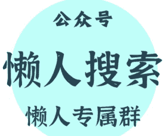

# 康波周期尾部，下一个暴涨的资产会是什么？

25/230 A 视野

整理：公众号懒人搜索，懒人专属群精选

懒人微信：lazyhelper1

今年，白银的暴力拉升，已经让很多投资人疯了。

一年内，从 28 美元，直接拉升到 80 美元之上，简直是涨到丧尽天良的地步。

连马斯克都出来表态了!

都说赚钱难，尤其是现在康波周期尾部，大家都没有什么新的好生意可以做的境况下。

然而，时代依旧不断的在创造更多的“造富神话”，甚至是令人乍舌的暴力拉升。

这也意味着，宏观环境差，并不是“投资不能赚钱”的理由。

但是，这并不是康波周期尾部“造富神话”的终结。

长期关注【A 视野】的老铁都深知，这轮周期尾部，起码还要 10 多年。

也意味着，时代犹如电风扇般，将会不断的缔造一个又一个类似 2025 年白银暴涨的新财富神话。

那么，下一个暴涨的资产会是什么？

以下为内容为付费阅读，各位多多支持！

其实，白银涨到现在的地步，背后的逻辑，已经发生了实质性的改变。

对于我们而言，这个全新的逻辑，恰恰是下一个走强的投资品种直接有关的强逻辑。

在黄金价格涨幅边际递减的前提下，白银的这轮上涨，证明了，是白银的工业属性在加速推升其价格变化。

也就是说，工业需求太强大，所以，引发白银实物挤兑。

然而，很诡异的是，石油价格现在是趴在地上。

虽然我们可以说，美国成功利用以色列压制阿拉伯国家来操弄油价。

但是，假设全球工业需求太强，这种地缘操弄对于油价的影响，不具有可持续性。

这也提示我们，真实的逻辑是：

全球主要的工业需求并没有复苏，甚至是疲软；然而，白银所服务的特定工业行业，却依旧极为繁荣。

事实上，马上看得出的重大白银工业应用场景，就是 AI 所需的数据中心、光伏电力、电动车产业链。

很明显，这些都是大国博弈的最前沿的领域!

有意思的是，AI 现在并不赚钱，光伏电力供给国内是反内卷最激烈的行业之一，电动车也是利润率远不及传统燃油车。

那么，到底谁在为这个买单？答案只能是有形之手是最大的金主爸爸。如果说黄金拉升是各国央妈不断下场囤积，那么，白银的拉升是主要经济体开启一大波前沿产业再工业化的争夺战所致。

其实，这个就是当前全球各地的产业结构、国与国之间的科技战的主要逻辑。

传统企业都是苦哈哈，大多数居民家庭也是如此。

作为最强购买力，只能是有形之手。

所以，有形之手往哪个领域撒币，哪个领域就会出现明显的造富神话，这才是可以判断下一个暴涨资产的核心逻辑。

2025 年，白银价格拉升，背后恰恰是美国已经意识到，传统手段，没有任何办法阻挡中国。

甚至，川普 2.0 直接认可，现在是 G2 模式治理全球，虽然我们不认。

那么，体现在产业上，就是最前沿产业玩命博弈，也是玩命消耗战。

所以，前沿产业到底现在赚不赚钱，已经不重要，甚至完全可以忽略。能不能做到对对手的碾压性优势，这才是重中之重。

这个时候，我们就可以注意到，在有形之手当金主爸爸的前提下，近乎是被扶持的前沿产业有了超级金主爸爸。

近期，美元指数一直是稳步缓慢下行。

最令人乍舌的，就是油价不涨，反而基础工业金属涨了。

金融市场的坊间传闻是，川普要加速启动前沿产业再工业化，所以，随时可能发布基础工业金属的关税新政。

大家自然是抢在新政公布前，赶忙将这些基础工业金属往美国本土运，白银、铜等都受益于此。

不过，请大家注意，传统能源与新能源是有着本质性区别。

传统能源的核心，是挖矿。新能源的核心，是制造。

这轮以白银为代表的基础工业品涨价，提示我们，美元对于基础工业金属的定价权，已经出现了严重的问题，否则，怎么可能允许这么涨？

换句话说，美元现在做不到对所有领域的把控，到处都是漏洞，这就是中国可以非对称狙击的关键。即，美元遇到的是，摁下葫芦浮起瓢。

其实，现在全球的总需求完全依赖“药不能停”。

问题是，美国人举债这么久，规模这么庞大，截至目前，中国央妈又不愿意替代部分美联储的功能去向全球投放大量流动性。

这也将 G2 的央妈都推向了一个很有意思的共识性方向：

强化精准放水，美国加速再工业化，背后是财政部的精准放水、美联储配合。

中国近期公布了全新的半导体创新基金后，又公布了庞大的初创企业的基金扶持。

于是，全球经济就此确定为严重的“冰火两重天”。

经过 2025 年的博弈，西方暂时获得一个心不甘情不愿的认知。

中国制造，暂时无法被有效替代，更遑论规模化替代。

这也就强化了美西方国家为了保持自己在前沿产业的领先，只能对整个链条上被卡脖子的领域进行追加投资，而不可能像中国这样玩全品类制造业体系。

以 AI 作为主线，现在开始拼美国 AI 被卡脖子的电力体系，上游首当其冲就是有色金属。

但是，请大家注意，基础工业金属并不是美国 AI 产业被卡脖子的唯一项。

最新的情况是，连深恶痛绝新能源的川普本尊，也点头同意，要大力发展储能，尤其是电池这块。

以 AI 的运作逻辑，只要当中出现一次电力不足的卡断，有可能大模型就被破坏、数据出问题或丢失，商业运作就无法玩。

因此，不解决紧急用电的困境，AI 根本玩不下去，后面绝对是重大风险。

这也提示我们，在抢了基础工业金属后，美国的大资金会逐步开始关注 AI 上游的核心设备，比如储能、电池这块。

巧的是这块，除了最上游的锂矿，其它后续的全产业链都在我们手里，近乎是全球碾压性的存在。

后续，只要美国铁了心玩 AI，那么，加大对 AI 全产业链的卡脖子的解决，类似储能、电池这块就完全绕不过去。

康波周期尾部，人性无法接受经济如自由落体下行，绝对会祭出大财政周期，这是人性的必然。

可是，在无法掌握足够多可以产生大量盈余的新产业前提下，大财政周期势必造就严重的“K 型经济”。

于是，经济就始终在两个剧本徘徊：

- 药效一般的时候，就业很差，但是，经济数据还不错
- 药效不错的时候，通胀猛涨，经济数据很好，就业数据也过得去

很明显，当前全球经济正处在必须重新加大刺激剂量的当口。

不给刺激，就会情况越来越差。

对于美元体系而言，由于金融业发展太快，金融与实体的脱钩愈发严重，将重创美元体系内部的良性循环。

毕竟，金融的扩张是严重依赖实体产生的盈余去还本付息的，否则岂不是变成庞氏骗局。

所以，美元体系需要更多的向“实物锚”靠拢，而不能继续完全依赖纯粹信仰的“信用锚”。

巧合的是，中国要渐进式摆脱美元体系的压制，也一直推进人民币向“实物锚”靠拢。

双方在你死我活的博弈中，尤其还是康波周期尾部这种经济长期寒冬下，竟然神奇的都走向货币体系滑向“实物锚”。

那么，这就是时代的大方向了!

这里，A 森要给大家普及一个知识。

人类全球货币体系周而复始的演进：

- 实物锚：经济极阴而向阳，全球经济、产业和金融市场需要修复、重塑
- 信用锚：金融过度极致扩张、极盛而衰

因此，短线来看，类似白银这样的投资品，不再是“低风险高收益”的选项。

然而，如果未来出现明显的回撤，则白银等战略性基础工业金属，依旧是长期趋势下的扛把子。

既然大国都要玩命进行产业链战争，就算未来前沿产业终究是以中国胜出为终局，可是，在结果出来前，试问，欧美日韩印哪个不是不计代价去砸钱搞？

这就是阶段性的需求！

10 月 8 日，伦敦交易所突然出现 1000 吨白银的实物需求，现在复盘，大概率是印度央妈出手。

那么，它为何要这样？也是为了血拼产业啊！

总结一下，如果后续基础工业金属（如白银）出现明显的大幅回撤，或许是可以开始重新关注的窗口期。

当然，AI 产业链并不是完全依赖 AI 本身的，美国人也觉得，这东西就好在会撬动大量基建。

这对于美国这样的基建弱国而言，是极富吸引力的。

如果说基础工业金属和储能是直接解决 AI 的电力需求，那么，AI 所带来的更广泛的基建需求就完全离不开工程机械设备，否则根本没有办法玩。

挖矿、建厂、数据中心建设、化工基地、运输基建、电网体系搭建等等，这是一个虽然围绕 AI 需求、却规模远大于 AI 的基建。

其实，欧美日韩印等国家都知道自己基建不行，原本就都想要玩大基建周期来拉动就业，这总比印出来的钱去金融市场玩投机，靠谱的多。

AI，除了是自己牛逼，还要带动传统大基建的全面升级，才是真正让各国大佬们喜闻乐见的。

用金融市场融资来夯 AI，AI 发展再带动基建，基建带动就业和财政增收，有形之手再想办法用这个增收来解决前期的 AI 融资和国债飙升压力，这就是他们真实想要的东西。

这条路到底能不能走得通？

其实，现阶段，根本不重要！

你没有看错，根本不重要。因为，我们不妨将整个链条视为一个超级基建大项目，来对冲康波周期尾部的经济下滑冲击，即可。

退一万步说，就算最终证明，这条路走不通，可是，这个超级项目上马期间，就有可能产生类似于凯恩斯主义的效果，对冲实际总需求的不足，那就够这些政客们在自己任期内爽歪歪了。

于是，我们的投资逻辑，就是围绕这个逻辑去。

最上游的基础工业金属炒了一波，接下去，就是炒作中间制造业产品，就像我们此前举例子的储能、电池、化工、工程机械设备等。

其实，无论是中国要构筑新的霸权体系，还是美国要重塑（修补）自己的霸权体系，永远离不开下面的逻辑。

霸权的体系搭建：产业—>贸易—>金融—>海权—>创新—>因此，产业主导权是霸权的绝对压舱石，产业升级不过是这场争夺战的第一步。

既然如此，大国的有形之手绝对会不惜重金，疯狂砸钱。

这也意味着，全球范围内，会出现前沿产业及其相关细分赛道的一大波重复投资。

毕竟，谁家都不想输，也不敢输。

就像罪国日本，一看自家连一个 AI 核心细分赛道的产品都没有，隔壁韩国起码还有存储芯片，急死了。

近期，日本宣布超大规模的财政刺激计划，就是要发展这块。

那么，欧洲不想参与？印度不想玩？中美不砸重金？

现如今，大模型已经百花齐放，OpenAI 不再具有代差式的碾压优势，这是肉眼可见。

所以，持续加大围绕 AI 产业链的上下游疯狂投资，就是板上钉钉的事情。

毕竟，没有一个经济强国会现在选择放手，那么，全球重复生产，也就是必然。

就算最终还是一地鸡毛，但是，享受好现阶段大国们的重复投建过程，就是当前最幸福的事情。

与其畅想未来如何崩，不如想把握好当下各国金主爸爸们直升机撒钱开出来的派对。

PS：本文完全是个人思考的分享，不构成直接投资建议，还请知悉。

最后，安利小懒的付费群：

懒人专属群（介绍）

这里是你对抗信息过载的护城河。

已稳定运行 6 年，累计拆解、研读 3000+ 个互联网商业实战案例与行业前沿内参和时政/宏观文章。

我们不搬运垃圾，只做高价值信息的筛选器与放大镜。

## 懒人专属群更新记录:

https://hk57gvIx7u.feishu.cn/docx/H0kRdZbSboIBR0xkaXtcuVE0nTg

## 懒人专属群更新记录 (需梯子，备用):

https://lazybook.fun/blog/record2

【免责声明】本资料归档于社群内部知识库，仅供成员课题研究与学术交流，请在查阅后 24 小时内删除。