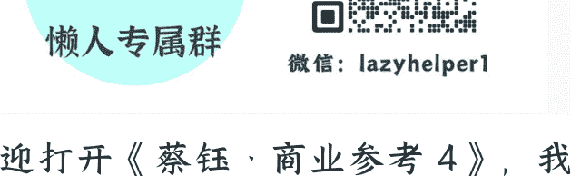

# 193 埃森哲：四个变化，理解 2025 中国消费者

整理：公众号懒人搜索，懒人专属群精选

懒人微信：lazyhelper1

欢迎打开《蔡钰·商业参考 4》,我是蔡钰。

来到 2025 年年末，各个行业、各个机构都开始发布自己的年度总结和来年展望，这段时间我也拜读了不少。其中有两份总结报告，值得跟你转述一下。

今天这一份，来自全球咨询巨头埃森哲。它这份研究报告的题目叫《美好生活新主张 - 埃森哲中国消费者洞察》，调研样本是中国一到五线的 5000 个不同年龄的消费者。这份报告 11 月才发布，也已经融入了埃森哲对“十五五”规划的理解。

我对这份报告的整体感受是，外资巨头对中国消费者的理解不深，但对系统框架的变化捕捉还是挺扎实的。如果你也在做 C 端生意，它观察到的中国消费者的四个整体变化，对你应该也有参考。

## 国货压制国际品牌

这四个变化，我结合我的理解来跟你说一说。

第一个变化是，在 2025 年的中国市场上，国货全面压制了国际品牌。

先上硬数据。

2021 年，美妆护肤领域近 80% 的人优先选国际品牌，国货只占一成多。但 2025 年的国货直接反杀，占比超过国际大牌。3C 数码和家电更狠，国货不仅反超，还成了绝对主导。从食品饮料到母婴玩具，几乎所有品类，中国的市场天平都倒向了国货。

而所有品牌都最看重的高收入群体，在埃森哲定义里是家庭月收入在 3 万以上的人群，当前对国际品牌的偏好，也收缩到了 3C 数码和美妆护肤。

——你肯定想得到，背后对应的产品是 iPhone、海蓝之谜和 SK-II 们。

但在这两个品类之外，高收入人群即便不差钱，也转向了国货。

短短四年，中国品牌为什么能全面压制国际品牌？

埃森哲给出了两个原因：

- 第一个，中国品牌更有性价比。85% 的消费者都这么说。

- 第二个，中国品牌更擅长用本土叙事传递情绪价值和文化自信，让中国消费者觉得，这更适合表达“我”的故事。

你看，原因不是新原因，但事实却是新事实。不知不觉当中，国货的崛起已经实现了。

## “消费帝王心”

第二个变化，我叫它从“品牌忠诚度”到“消费帝王心”。

啥意思？埃森哲发现，超过一半的消费者，即便平时有喜欢的品牌，真正购物时也还是在不同品牌之间比来比去。这个趋势，比 2021 年高了 13 个百分点。

更扎心的是，超过 70% 的人说，自己是把这种挑选过程本身当作享受的。

你品品，消费者的这个心理活动，有没有点清宫戏里的意思，你把我当作你的会员、给我发积分；我其实把你当作嫔贵人，在权衡你和华妃之间“翻谁的牌子”。今天的品牌忠诚度，反过来了，变成了消费者对品牌的凝视和审计，评估它够不够对自己忠诚。

你看，今天的品牌，得把用户需求当作“消费帝王心”来揣测。

“帝王心”里都在想什么呢？埃森哲有几个发现也挺有意思：

第一个，今天的中国消费者十分清楚自己想要什么，图的是功能性需求还是情感性需求，同时心里已经标出了预算。同一个消费者，可能在这个场景里追求极致性价比，那个场景里又追求极致的情感溢价，需求是动态的。

第二个，当下的消费者非常聪明，可以快速识别各种形式的广告和品牌的意图。他们愿意接受的营销内容更多是关于产品力、价格力、营销方式和店员服务的，但不太为主播和明星这类 KOL 买单了。

但即便如此，第三个来了：近半数消费者说，自己的决策不会被营销内容影响，22% 的消费者干脆说，自己对营销内容有逆反心理，看多了会抗拒品牌。为什么会这样？因为在他们看来，内容过载就成了噪音，品牌也就成了一个会打扰人的“不识趣品牌”。

你看看，是不是从品牌忠诚度，变成了“消费帝王心”？

## 重排人生优先级

第三个变化，更有趣，有点生命哲学的意思了。这个变化是，人们在重排自己的人生优先级，这也影响到了他们的消费决策。

这部分的调研数据，我认为是整份报告里最有价值的。

埃森哲在 2021 年和 2025 年都问了受访者同一个问题：你当下最看重什么？健康、家庭、事业、财富、爱好、爱情、个人成长，还是友情？

它得到的结论是：人们对健康和财富的重视程度明显上升，对家庭与爱好的重视程度与四年前大致持平，对事业、爱情、友情和个人成长的重视程度则明显下降。

2021 年，选健康的人群占比高达 78%。这也很好理解，当时还在新冠严格防疫时期，在疫情压力下，大家对健康很紧张。

但到了 2025 年，距离防疫已经过去两三年，看重健康的人不降反升，涨了 9 个百分点，达到 87%。

对财富的重视程度，也从 49% 涨到了 61%，上升 12 个百分点。

更奇特的是，按年龄看，最关心健康的人群竟然不是中老年，而是 24 岁以下的年轻人。00 后和 95 后，四年来对健康和财富的关心程度增幅，比其他年龄段都高。也同样是他们，对爱好、爱情、友情和个人成长的关心程度，是在下降的。

年轻人在最有生命力的年龄，摒弃爱好、爱情、友情和个人成长，对事业也没那么关心，反而是对健康的重视程度超过了老人。这是一个挺重要的变化。

这是为什么？如果说只是因为就业压力巨大，那他们不应该也放弃个人成长；如果只是因为想要躺平，那就不应该放弃爱好、爱情和友情。

而他们同时如此重视健康，套用反熵增的逻辑，很可能是因为“不健康”已经对他们形成了巨大的困扰。这跟新冠对人们的影响、跟养生保健市场的增长，都呼应上了。

另一个奇特的变化是，60 到 70 岁的人群，对家庭的重视也大幅降低，同时对爱好的重视大幅提升。

这跟我们在各种文旅目的地看见的活力银发人群呼应上了。它也提醒我们，这届老年人，跟上一代享受天伦之乐的老年人，已经不再是同一种人。

这些人生优先级的变化，体现到消费者的行为当中会是什么样子呢？

在样本池里，有近九成的消费者开始增加锻炼、改善饮食、减少屏幕使用时间、关注心理健康等。七成消费者开始存钱和减少非必要支出。还有六成消费者开始学习新技能、搞副业。

埃森哲把这三大趋势总结成了一个“安全三角”。也就是在健康、存款和学习新技能，在这个三角里进行“投资性消费”，能建构安全感，来对抗人生的内部和外部的风险。——你看，这其实也是一种“稳定内核”。

## AI 成为生活顾问

第四个变化是，AI 正在成为被人们高度信赖的常设生活顾问，当然也在消费当中发挥作用。

报告说，2025 年初 DeepSeek 引爆之后，中国消费者端的 AI 工具使用率也开始飙升。到今天，已经有近八成的消费者每天或每周都要跟 AI 聊天，连 60 后都有 57% 的人保持了这个强度。我还真没从这个角度想过 DeepSeek 的意义。对今天的中国普通民众来说，AI 已经不是查信息的工具，而是值得信赖的顾问、助理、好友甚至治疗师了。

这对消费造成了什么影响呢？有两个有意思的影响：

第一个，增加了人们拓展陌生消费的底气。

在以前，对普通人来说，无论是第一次买车、买保险，还是规划一场新的旅行，学习成本都挺高的，需要花大量时间去查信息、做攻略。但是现在，问问 AI 就可以建立认知、形成决策。于是，人们以前不会碰的东西，现在也有兴趣了解一下了。

第二个，开始冲击短视频广告、直播带货和推荐流广告的活路。

在以前，人们想要改善生活、尝试陌生消费，会习惯于问问懂行的亲友，或者搜电商平台、看短视频推荐或者直播带货。但是现在，57% 的消费者直接去问 AI 了。亲友们倒是省了不少事，但各种广告对人们的影响能力就被削弱了。

你还记得前面说，“消费帝王心”开始检验品牌对自己的忠诚度了吗？怎么检验忠诚？说不定用户的标准就是，徐徐打开自己的 AI 伙伴，让它 10 秒算出你藏在各种规格背后的真实性价比。

这对品牌来说，也是个地动山摇的变化，未来品牌除了要讨好消费者，还得让 AI 觉得你值得被推荐。从 B2C 到 B2AI 的静默革命，也已经启动了。

## 总结

好，以上是我认为的，埃森哲这份报告透露的四个最有参考价值的中国市场变化，分别是：

- 国货全面压制国际品牌；

- 品牌忠诚度发生倒挂；

- 民众重新排列人生优先级；

- AI 成为被高度信赖的生活顾问。

我把报告的原文链接放在文末，你感兴趣的话，也可以再读一读。

整体上，这份报告的框架视角很好。它用数据验证了一些我们已经有所感受、但还没正视的变化。

但在纵深上，埃森哲作为国际咨询巨头，我个人认为，它对中国本土消费人群的理解还是比较笼统。它每次在报告里想要讲案例的时候，要么得跳回欧美成熟市场讲那边的品牌，要么只能列出观夏、京东这类本土大熟脸。

所以下一讲，我想邀请你再关注一份报告。它来自中国本土的一个营销咨询团队——赞意增长网络。我们来看看它又注意到了 2025 年的中国消费市场的哪些变化细节。

最后，安利小懒的付费群：

## 我们不搬运垃圾，只做高价值信息的筛选器与放大镜。

## 懒人专属群更新记录：

https://hk57gvix7u.feishu.cn/docx/H0kRdZbSbolBR0xkaXtcuVE0nTg

## 懒人专属群更新记录 (需梯子，备用):

https://lazybook.fun/blog/record2

【免责声明】本资料归档于社群内部知识库，仅供成员课题研究与学术交流，请在查阅后 24 小时内删除。