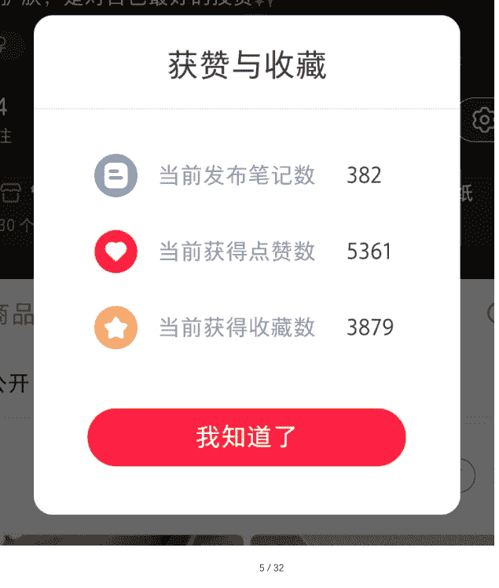
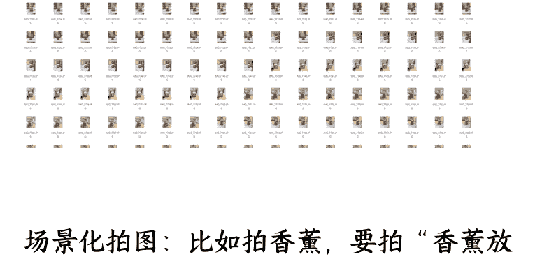
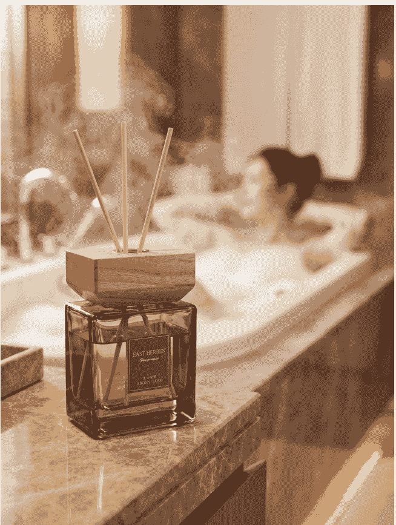
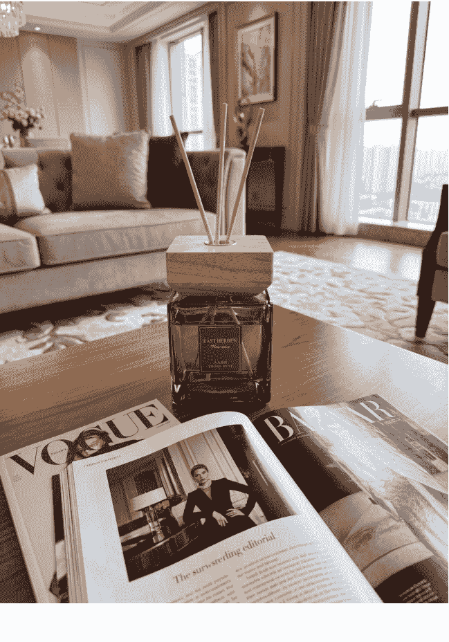

# 从 0 到 1:我的小红书电商航海复盘——
251230 副业 SC 精华
懒人微信:lazyhelper

## 前言：为什么我要写这篇 1 万字的复盘？

截至 2025 年 12 月 18 日，我的小红书店铺数据并不亮眼：第一家店发了 1413 条笔记，第二家店 382 条，近 30 天 GMV 甚至比上月下滑了。

转念一想，所有“不完美”的经历，恰恰是普通人做副业最真实的样子。

我是个干了 10 年的设计老兵，主业在实体制造业市场部管品牌设计，副业踩过淘宝店、小程序、抖音小店的坑，2024 年 11 月才摸到“生财有术”的门。

这篇复盘，我不想写“日入过万”的神话，只想把从 0 到 1 的每一步、每一个踩过的坑、每一次自我怀疑后的调整，原原本本地铺给你——对普通人来说，“少踩坑”比“学技巧”更值钱。

## 一、关于我：一个不甘平凡的设计师

### 1.1 与生财的「因果相遇」

我是个典型的“职场稳定 + 副业折腾”体质：10 年视觉创意设计经验，在一家年产值过亿的实体制造企业市场部待了 8 年，管着品牌 VI、公众号运营、展会物料这些活儿——主业体面、收入稳定，但一眼望到头的日子，总让我觉得“亏了”。

2020 年开始，我陆续碰了几个副业：开淘宝 C 店卖家居摆件（压了 3 万货没卖完）、做微信小程序分销（平台跑路）、搞抖音财经号（粉丝到 5 万但接不到广告）……

这些项目全死了，但我没停——不是我能熬，是我总觉得“别人能成，我差在哪儿？”

2023 年 11 月，我在知识星球刷到“生财有术”的帖子，花了 2980 元入了圈。

现在回头看，这是我副业路上第一个“正确的选择”：之前的失败，本质是“信息差”和“认知差”——没人告诉我“淘宝 C 店 2020 年已经不适合新手”，也没人提醒“小程序分销的结算周期可能是坑”。

缺少一个极具价值的交流社区作为风向标，来校准自己的航向。

而生财的价值，恰恰是把“过来人”的经验打包给你，帮你省掉“试错的钱”。

> 「我始终坚信一点：我走过的每一步，犯的所有的错，都不会白费。日后它们都会变成你肩膀上的勋章。」

我是个极度的乐观主义者。大不了，回去种田！

### 1.2 那些「失败」教会我的事

我把之前的失败总结成 3 条“避坑法则”，后来做小红书电商时，这些法则帮了我大忙：

### 我的简单法则

**法则 1：** 不碰“需要重资产”的项目：淘宝店压货让我明白，普通人副业的第一原则是“轻启动”——钱要花在“能快速变现”的地方，不是“囤货”。

**法则 2：** 选“和自身资源匹配”的赛道：我是设计师，审美和作图是优势，所以后来选小红书电商 (内容驱动)，而不是抖音直播 (口才驱动)。

**法则 3：** “慢”比“快”更重要：之前总想着“快速起量”，结果忽略了平台规则——小红书是“内容种草”逻辑，需要“养账号”，而不是“爆单”。

### 1.3 遇见生财，找到方向

因为对项目的不放弃，我终于在知识星球里遇到了「生财有术」。与这位迟来的「贵人」握了个手，然后跟他回了家。

一开始没看懂生财的学习运作方式，不知道该怎么学习，只会不断提问。后来时间长了，才慢慢理解了生财的含金量：第一，它解决了我花海量时间寻找项目的问题；第二，还能获得项目实操者的经验传承，每一步都有解析。

入圈后我花了 1 个月“泡”在生财的航海项目里，才真正给自己「定位」，最终选了小红书电商，理由很简单：

- 轻启动：不用囤货 (一件代发)，前期成本只有“样品费”(每个品约 50 元)；
- 匹配优势：我会作图、懂审美，能搞定小红书最核心的“内容 (笔记)”；
- 有可复制的经验：生财的航海手册把“选品→拍图→发笔记”的流程写得很细，甚至连“关键词怎么放”都有模板。

我坚信这是值得深耕的一个方向——因为我之前有做店铺的经验，虽然没赚到什么钱，但起码上手会比较快。

## 二、项目实操成果：真实的数据，真实的我

说实话，虽然参加了几次航海，但目前还没取得什么亮眼的成果。没有让人眼前一亮的数据，真的说起来有些惭愧。但我觉得，真实比完美更重要，所以还是选择坦诚分享。

先放一组“不加滤镜”的数据截至 12 月 18 日的数据：

店铺 1（美妆标品）：2025 年 3 月开业，30 个 SKU，客单价 300-2000 元，毛利 40%；发笔记 382 条，近 30 天 GMV 1968 元，搜索流量占比 94%。

### 交易构成 2025-11-18~2025-12-17

| 指标 | 金额/数量 | 上周期变动 |
| :--- | :--- | :--- |
| 支付金额 | ¥1,968.0 | -92.12% |
| 笔记 | ¥894.0 | -92.60% |
| 直播 | ¥0.0 | -100.0% |
| 商卡 | ¥1,074.0 | -87.49% |
| 支付订单数 | 7 | -75.00% |
| 支付买家数 | 7 | -73.08% |
| 商品访客数 | 857 | -54.87% |

店铺 2（香薰非标品）：2025 年 9 月开业，20 个 SKU，客单价 50-100 元，毛利 40%；发笔记 1413 条，近 30 天 GMV 0.436 万，推荐流量占比 60%。

### 获赞与收藏

| 指标 | 数值 |
| :--- | :--- |
| 当前发布笔记数 | 428 |
| 当前获得点赞数 | 1388 |
| 当前获得收藏数 | 1054 |

核心问题：店铺 1 的 GMV 下滑，是因为品牌方控价严格，我被迫调低了佣金；店铺 2 的流量少，是因为非标品的“搜索关键词池”太小。

对比上个月，本月数据在一路下滑，涉及的问题很多。参加的航海实战中我一直在不断请教教练，反复研读航海手册，希望能从中挖掘一丝不一样的东西，或者发现自己哪一步做得不够细。

按照航海手册，听话照做，跑通赚到第一块钱是没问题的。

虽然这次的成绩单不算亮眼，但特别荣幸能收到领队马可乐和志愿者海燕的邀请，来和大家做分享。我想过程里踩过的那些坑、攒下的些许经验，或许能给正在同路上摸索的朋友们，提供一点点参考。

很多人会问：“发了 1000 多条笔记才赚这点钱，值得吗？”

我的答案是“值得”——因为我验证了小红书电商的底层逻辑是通的：

- 只要按“选品→内容→关键词”的流程走，就能拿到流量、出单；
- 现在的“慢”，是为了以后的“稳”——

比如店铺 1 的搜索流量占比 94%，意味着“即使我不发新笔记，每天也有稳定的精准客户来”。

## 三、项目实操经验：干货与踩坑记录

这部分是全文的核心——我把做小红书电商的每一步，拆成【选品、拍图、图片管理、矩阵运营、关键词】布局 5 个模块，每个模块都写了——怎么做 + 踩过的坑。

### 【我的两家店铺定位】

第一家店铺 (今年 3 月启航)：进口高端贵妇美妆产品，属于标品类目。客单价 300-2000 元，毛利 40%，店铺有 30 多款产品。做起来比较累人——价格受品牌方严格管控，但好处是流量大。

第二家店铺 (今年 9 月启航)：小众居家香薰品类，属于非标品。客单价 100 元以内，毛利 40%。相对轻松，完全看自己怎么做，不受管控，但流量相对低一点。

### 【非标品选品逻辑】

以第二家非标品店铺为例 (标品不存在选品问题，品牌方会直接告诉你爆款是哪款)。航海手册里讲得非常清楚：选近期、低粉爆文，最好有 24 小时加购数据的产品。本质就是「跟品」的逻辑——别人做爆了，你赶紧去分一杯羹。

核心思路：

用别人起爆的相同模式去瓜分他的流量，去转化他没有转化的那部分需求。

因为市场太大了，一个品爆了一家吃不完，还有很多需求待满足。

### 3.1 关于选品：这是重中之重

小红书电商的逻辑是“内容种草→搜索成交”，选品直接决定了你的内容能不能被搜到、能不能成交。

#### (1) 我的选品流程：选赛道→选品→测品

**第一步：选赛道**

我选了两个赛道：美妆 (标品) 和香薰 (非标品)，理由是：

- 标品 (美妆)：用户需求明确 (比如“贵妇面霜”)，搜索量稳定，适合做“搜索流量”；
- 非标品（香薰）：竞争小，不用控价，适合做“推荐流量”（笔记被系统推给兴趣用户）。

踩坑提醒：别同时做 3 个以上赛道——我一开始还想加“家居摆件”，结果精力不够，导致每个赛道的笔记质量都下降。

**第二步：选品**

选品的核心逻辑是“跟品”——找“低粉爆文”的产品，具体操作：

- 打开小红书，搜“香薰推荐”“贵妇面霜”；
- 筛选“近 7 天发布”“粉丝 1 万以下”；
- 找“点赞 500+、评论里有‘链接’‘哪里买’”的笔记；
- 用“新红数据”查这个产品的"24 小时加购量”（加购≥10 就可以做）。

踩坑提醒：别选“已经被大博主带火的品”——比如某款香薰被 10 万粉博主推过，你再做，流量会被抢走。

**第三步：测品**

选好品后，先拍 5 条笔记发出去，看点击率（≥5%）和加购率（≥3%）——如果这两个数据不达标，直接换品，别浪费时间。

#### (2) 标品 vs 非标品：各有各的“坑”

| 类型 | 优势 | 劣势 | 应对方法 |
| :--- | :--- | :--- | :--- |
| 标品 (美妆) | 流量大、转化高 | 品牌控价严、竞争大 | 用“长尾关键词”(比如"XX 面霜敏感肌”)避开大店 |
| 非标品 (香薰) | 不用控价、操作自由 | 流量少、用户需求分散 | 多做“场景化笔记”(比如“卧室香薰 助眠”) |

### 3.2 关于拍摄：效率与质量的平衡术

这里重点讲讲我遇到的一些问题。问题看似不大，但可能会卡住你很久，耽误不少时间。

做小红书电商，拍图是“体力活”——

我一家店 4 个账号，每天要发 10-20 篇笔记，每篇 5 张图，一周至少要拍 700 张图。

#### 【问题背景】

选完品、买回样品、准备拍摄——看似简单，但当你尝试 1:1 模仿对标时，会发现很难精准复刻。更关键的是内容量的压力：我手上有 3-4 个账号，每个账号每天要发布 5 篇笔记，每篇 5 张图。

算一笔账：一天要发 20 篇，一周下来要发 140 篇，需要至少 700 张图片。而我是单休，也就是说一个下午要拍完这么多图片。如果完全 1:1 精准拍摄，估计只能拍 200 张，因为需要不断调整，非常费时间。

#### 【我的解决方案】

场景化批量拍摄：先找到与对标相似的场景，在这个场景里把能拍的角度全部拍下来，快速、美观地记录，不必追求一模一样，回去再慢慢整理图片。

AI 图生图复刻封面：拍完后，针对需要高点击率的封面，我使用 AI 模型进行图生图精准复刻。

#### (1) 我的拍摄技巧：批量 + 场景化

**批量拍摄**：选一个固定场景（比如书桌、化妆台），把所有样品摆进去，拍“正面、侧面、细节、使用场景”4 个角度，每个角度拍 10 张——这样一下午能拍 300 张图。

场景化拍图：比如拍香薰，要拍“香薰放在卧室床头柜 + 客厅茶几 + 卫生间 + 书房”，而不是仅仅只是好闻”——用户买的是“情绪价值”和“氛围感”，不是“产品本身”。

踩坑提醒：

初期不一定追求“和对标账号一模一样”——先把笔记发出去，不要求 100 分模仿，70-80 分我觉得也挺好。

我一开始非要模仿某博主的“ins 风背景”，结果一下午只拍了 50 张图，根本不够用。

#### (2) AI 辅助拍图：省钱又省力

#### 【AI 工具推荐】

一般国内的生图软件很难达到需要的精准度。我使用的是谷歌最新的模型：Nano Banana 2.0。它真的非常强大，可以生成任何领域、任何场景、任何人物一致性的图片。

使用方法：

把自己的产品和对标的封面扔给 AI，然后让 AI 生成跟对标一样或极其相似的场景，配上我的产品。这比手动拍摄精准、美观太多了。在首页瀑布流或点进笔记观看时，一眼是看不出区别的。

我用“Nano Banana 2.0”（AI 作图工具）生成封面图，操作步骤：

1. 找对标账号的封面图（比如“香薰 + 日落灯”）；
2. 上传我的产品图，输入关键词：“ins 风，香薰放在木质书桌，日落灯打光，暖色调”；
3. AI 生成 5 张图，选最像对标封面的那张。

#### 【AI 生成图的细节差异】

- 明暗度、饱和度略有不同
- AI 生成的字体不够清晰，标签上的中文字体可能模糊，标签上的：乌木玫瑰四个字，变成乱码了，（但用户一般看不到这么细）
- 如瓶中液体位置变成一半了，原图有 2/3、
- 瓶口的挥发棒原图有 3 根，现在变成 4 根了等等

AI 图的小缺点：

明暗、饱和度和原图有差异，标签文字可能模糊，

用户刷首页时根本看不出来——我用 AI 图的笔记，点击率比自己拍的还高 5%。

### 3.3 关于图片分类：高效发布的秘诀

很多圈友会遇到这样的困惑：每次外出拍完批量的 Live 图片回来，不知道怎么分类。从 700 张图片的相册里随机选 5 张组合发布后，第二次、第三次……第十次，就不知道哪些发布过、哪些没有发布过了。又不能重复使用图片，到底该怎么分类才能更高效地发布呢

#### 【我的图片管理流程】

那我拍了 700 张图，怎么避免“重复发”？我的方法是“云备份 + 点赞标记”：

- 云备份：所有图传到夸克云盘，防止手机丢了；
- 跨设备传输：用 iPhone 拍的图，通过“荣耀互联”传到安卓手机 (因为小红书在安卓上发笔记更稳定)；
- 点赞标记：选 5 张图发笔记，就给这 5 张点“赞”，点赞的图会进“收藏夹”；发完后，把收藏夹里的图删掉，再选下一批。

目前这个方法都是手动操作，图片量大时会比较耗时。如果圈友有更高效的办法，欢迎交流！

踩坑提醒：

别用“文件夹分类”——

我之前建了 10 个文件夹，结果找图的时候更乱，“点赞标记”是最简单的方法。

### 3.4 关于矩阵运营：持续输出是关键

图片整理好后，剩下的就是做矩阵、不断发笔记。

#### 【基本配置】

一家店铺 4 个账号，每天保持 10-20 篇输出。

笔记内容可以用 AI 工具进行二创：Gemini Pro 3.0、Claude、ChatGPT 效果都不错，比国内模型好很多 (价格约$20/月) 就是有点贵，其他啥都好。

#### 【关于耐心】

如果做了一段时间发现还是没有小眼睛，请不要焦虑，这很正常。

小红书是一个很慢热型的平台，可能需要 3-5 个月才能见效，尤其是搜索流量起来很慢。

小红书的算法是“以账号为单位”，所以要做“矩阵号”——我一家店开 4 个账号的理由是：

- 降低风险：一个账号被封，还有其他账号；
- 覆盖更多关键词：每个账号做不同的“长尾关键词”（比如账号 1 做“敏感肌面霜”，账号 2 做“抗老面霜”）。

#### 我的矩阵运营节奏

- 每天每个账号发 2-5 篇笔记；
- 用“Gemini Pro 3.0”改写文案（输入“香薰 助眠 文案”，AI 会生成 5 个版本）；
- 笔记发布时间：早 8 点、午 12 点、晚 8 点（这是小红书的流量高峰）。

踩坑提醒：

别用“同一套文案”发多个账号——小红书会判定“抄袭”，降权账号。

### 3.5 关于搜索关键词布局：决定未来的关键

小红书的流量分“推荐流量”和“搜索流量”，而搜索流量是“被动收入”——用户搜"XX 面霜”时，你的笔记排在前面，就能持续出单。我现在 3 月份做的美妆店铺现在基本都靠搜索流量成交，占 94%。

我 3 月份开的美妆店，直到 6 月份以后搜索流量才慢慢起来。现在搜索流量基本占 94%。熬出来的，都是真金白银。

来给大家说一个非常重要的点：布局搜索关键词非常重要！

我认为在小红书的一切行为都是在为「搜索流量」服务。布局搜索流量才有未来。

因为：搜索流量 = 超精准流量 = 躺着赚钱的流量。

#### (1) 关键词的类型

- 核心关键词：比如“贵妇面霜”;
- 长尾关键词：比如“贵妇面霜 敏感肌 2025”;
- 高转化关键词：比如“贵妇面霜 哪里买”“香薰 链接”。

#### (2) 关键词的布局位置

- 标题 (权重最高)：比如"2025 敏感肌必入! 这款贵妇面霜我用空 3 瓶”;
- 封面文字：比如“敏感肌救星!”;
- 正文首尾：开头写“最近被问爆的贵妇面霜，敏感肌也能冲”，结尾写“想要链接的宝子，搜‘XX 面霜 敏感肌’就能找到”;
- 评论区：自己发一条评论“链接在这里→XX 面霜 敏感肌”，再用小号点赞这条评论。

温馨提示：搜索流量增长比较慢，获得正向反馈的时间也很长。这是一个长期工程，所以要熬到那个时候。心态要不断调整，因为小眼睛数量少的时候，真的非常考验耐心！

踩坑提醒：

别堆砌关键词——比如标题写“贵妇面霜 敏感肌 抗老 保湿”，会被判定“关键词作弊”，降权笔记。

## 四、给正在同行者的一点点建议

作为一个仍在项目路上的实践者，以下是我想分享给同行圈友的几点心得，这部分是我做小红书电商 10 个月，最想跟大家说的话，比“技巧”更重要的——是心态和认知。

### 4.1 做好长期作战的准备

小红书实物电商的正反馈时间真的很长。你要能熬下去，坚持到小眼睛起来的时候，不要提前放弃。

可能是 2 个月、3 个月、甚至 5 个月~ 做好随时调整心态、跟自己内心搏斗的准备。

不可否认，它的红利确实还蛮大的。认真做就能赚钱，

不是像抖音、淘宝、快手那样——没有强大的运营团队和供应链根本玩不转。

小红书电商不是“赚快钱”的项目，它的“正反馈周期”是 3-5 个月：

- 第 1 个月：选品、拍图、发笔记，可能只有几十次浏览；
- 第 3 个月：搜索流量开始涨，每天能出 1-2 单；
- 第 5 个月：账号权重稳定，每天出 5-10 单。

我 3 月开的美妆店，到 6 月才开始稳定出单——

别在第 2 个月就放弃，那是最可惜的。

### 4.2 没发满 200 篇笔记，别要结果

生财的航海手册里写了一句话：“发满 200 篇笔记前，所有的‘没流量都是正常的’”

在没有发布满 200 篇笔记的时候，不要着急要结果——因为大概率没结果。可能你还需要再发 200 篇，然后再发 1 篇，也许就爆单了。

我第一家店发了 100 篇笔记时，GMV 只有 2000 元；发满 200 篇时，GMV 涨到了 8000 元——

小红书的算法需要“内容量”来判断你的账号是否“优质”，没发够量，就别谈“爆单”。

当看到前面的笔记小眼睛会全部亮起来。这是你朝思暮想的一天，是最好的时候，也可能是最坏的时候。

因为：

> 「成也风云，败也风云」——你可能因为爆单赚钱，也可能因为爆单而衰败。

什么意思？就是要提前重视售后。一些快捷短语、售后退换货地址、备选的供应商，都要提前布局好。

等好运来的时候，才能承接得更长久，因为店铺 DSR（动态评分）真的很重要。

### 4.3 爆单前，先准备好“售后”

我第一次爆单是在 7 月，一天出了 30 单，但因为没准备“快捷回复话术”，客户消息回复不及时，导致 DSR 评分从 4.9 降到 4.5——爆单不是终点，是“考验服务能力”的起点。

提前准备这 3 件事：

- 快捷回复话术：比如“链接在商品橱窗哦～”“退换货地址是 XX”；
- 备用供应商：避免主供应商缺货；
- 物流跟踪表：每天记录订单的物流状态，主动跟客户说“你的快递已经发货啦”。

### 4.4 做不起来，就换项目

如果你坚持了 5 个月，发了 500 篇笔记，还是没出单——别怀疑自己，是“项目和你不匹配”，可能是你跟这个项目「八字不合」。

没关系，换个项目继续干。生财最不缺的就是项目。

生财里有很多项目：抖音本地生活、B 站好物、海外项目 (深海圈 YouTube、深海圈 AI 编程)、AI 相关的很多项目......

### 换个项目，可能比“死磕”更有效

我之前做淘宝店死磕了 1 年，结果亏了 3 万；现在做小红书电商，虽然慢，但至少“在赚钱”。

### 放过自己，别怀疑自己，别跟自己较劲，你其实很优秀

大不了从 0 到 1 重头再来，快得很。

有教练、有一群志同道合的圈友一路前行，

### 你也会走得很远的，你不是一个人

这也是我经常对自己说的一句话，算勉励自己吧！

## 写在最后

### 最后：写给所有“不甘平凡”的普通人

我是个普通的设计师，没有“资源”、“背景”、“大资金”，只是凭着“不想一眼望到头”的念头，在副业路上折腾了 5 年。

写这篇 1W+ 字的复盘，不是为了“教你赚钱”，而是想告诉你：

普通人做副业，没有“一夜暴富”，
只有“一步一个脚印”——选对方向，
踩对节奏，熬住时间，你就能拿到结果。

最后感谢生财有术，感谢领队“马可乐”和志愿者“海燕”，让我有机会说出心里想表达的话。
也感谢伟大的「生财有术」，在我迷茫的时候指引了方向
也感谢看到这里的你——

祝大家早日爆单，都能开心地分享生财好事！
祝我们都能在副业路上，赚到钱，也赚到掌控生活的底气！！！

最后，安利小懒的付费群：

## 懒人专属群 (介绍)

微信:lazyhelper1

🔖 这里是你对抗信息过载的护城河。

已稳定运行 6 年，累计拆解、研读 3000+ 个互联网商业实战案例与行业前沿内参和时政/宏观文章。

我们不搬运垃圾，只做高价值信息的筛选器与放大镜。

### 懒人专属群更新记录：

https://hk57gvIx7u.feishu.cn/docx/H0kRdZbSbolBR0xkaXtcuVEOnTg

### 懒人专属群更新记录 (需梯子，备用)：

https://lazybook.fun/blog/record2

【免责声明】本资料归档于社群内部知识库，仅供成员课题研究与学术交流，请在查阅后 24 小时内删除。