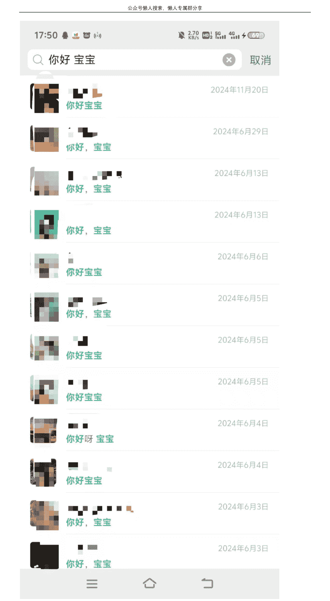
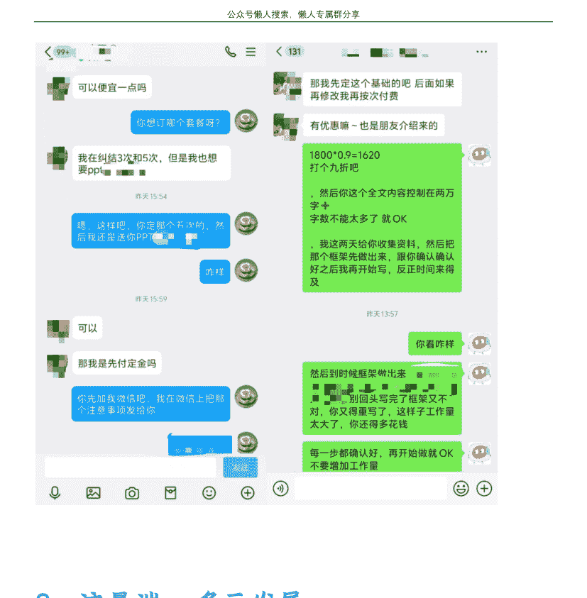

# 如何搭建一套可复制、可持续复利的小团队

## 251230 副业 SC 精华

公众号懒人搜索，懒人专属群独享

懒人微信:lazyhelper

大家好这里是荷包蛋生财编号 59629，一个不上班的 00 后，写作七年，正在搭建自己的人生躺赢系统。

当你意识到单打独斗已经无法满足业务需求时，会开始考虑搭建一个团队。

我也是在做 AI 写作时，逐渐体会到一个人承担所有工作是多么吃力。

最初，我只是靠自己的写作能力和 AI 工具接单，但随着客户量的增加和任务复杂度的提升，我发现自己根本无法同时应付所有的写作、沟通和客户需求。于是，我决定开始搭建自己的小团队，完善一个从流量获取到内容交付、再到客户服务的完整团队系统。

在这篇文章中，我将分享我搭建 AI 写作团队的经验，如何从零开始一步步建立起一个高效的团队。如果你也有团队搭建的需求，或者正在思考如何优化自己的工作流程，那么这篇帖子会给你一些参考和启发。

## 一、项目介绍

生财相关帖子应该也有很多了，而且这两年做 AI 写作的圈友也有很多。

我这里不展开过多篇幅介绍项目，项目的交付逻辑很简单，其实就是售卖自己的写作服务，通过 AI 赋能，提升自己的写作效率，然后服务更多人，从而变现。

找到接单渠道——确认客户需求——写作——变现

首先是要找寻渠道接单，然后与客户确认写作需求，利用 AI 完成稿件，提交给客户，从而达成变现。流程图如下。

没有 AI 之前，我也一直在做这个项目。2023 年 AI 的出现，极大地降低了写作的成本与难度，从而可以让更多新人开始深耕。

看似简单的步骤，其实每一项之后都富含非常扎实的知识点。

由于本期主题主要讲团队搭建，所以我这里简单说几个需要注意的关键点：

1. 新人入局，前期没有流量，可以把重心主要放在寻找中介渠道&培养自己的后端服务能力上。去寻找自己擅长交付写作的品类去深耕，同时去磨练自己的基础能力，前期也可以做特定品类赚钱。但是依托于中介抽成，像淘宝抽成一般给到写手的只有 10%-20%，是非常少的。只依赖于中介是很难赚到很多钱的，所以后期还是要去想办法做自己的店铺，或者搭建自己的私域流量。

2. 如果你已经脱离新手期，开始尝试做自己的流量和私域，建议可以先做咸鱼（目前得做付费流）后面再去做小红书精品图文，不过这几个月环境也不是很好，封号还是会有一点严重，要做好心理准备。

3. 后端写作，不要想的太简单，不是有了 AI 就可以万事大吉了。目前的 AI 生产内容能力还是有限，只是能做到赋能，前期的资料收集，文章内容框架搭建，还是得人机协同解决。

4. 如果你没跑过全项目流程，我是不建议你现在做团队的，你连基础的谈单报价都会搞不明白，更别说后面如何找到靠谱的写手了，稿子大概率烂尾，或者被骗，或者亏钱... 所以如果你想搭建团队开始赚这个钱，前期要踏踏实实的去做项目，做上三个月以上再去考虑后面...

5. 线上团队和线下团队，应该怎么选？我是建议如果能线上运转起来就线上，因为线下人力太高了，还有各种成本支出，场地支出。我认识的一些同行，做线下的，每个月 GMV 六位数，最后一算账，抛出各种成本最后到自己手里才万把块钱的比比皆是。所以如果做团队，前期没有把握要尽可能的缩减自己的支出。当然如果你说，你有很多稳定的对公的订单或者很棒的资源，包赚的，那我就不管你了，能控制好成本，确定自己赚钱就行。

## 二、我前 6 年项目经历分享

其实很多圈友都认识我了，我的故事都耳熟能详。本不想花很多篇幅介绍，但是很多新圈友可能也不认识我，我大概简单描述一下我这几年的从业经历。

18-22 年，当时我是大学期间，做过很多兼职，发传单，送快递，当服务员，做电销，HR...还卖过一段时间的面包。为了赚钱我做过很多很多工作，那时候挺苦的，但是每天都有收入，就也乐此不疲。机遇总是偏爱那些准备好的人。一次偶然的机会，我在大学的兼职群里发现了代写的商机。学校里理工科学生居多，很多人在撰写文科类文章和演讲稿时苦不堪言。我抓住了这个需求，开始为他们提供写作服务。前期主要做定制服务，以服务营销为主，后面由于口碑比较好，客单价也一直在提升，就越赚越多了，差不多大学四年每年总利润会在 10-15 万。

2023 年的 4.18，我加入了生财，这是我命运的一次转折点。加入生财之前，已经在别的课程里面学会了基础的 AI 操作，不过还是在做个人写手，没有扩大项目。不过收入已经从月入一万突破到了月入三万左右，AI 赋能之后我简单对比了一下变化。没有 AI 之前我写一个一万字的文章差不多需要 2-3 天的时间才能完成交付，用 AI 之后，差不多 3-5 小时就能完成，效率能够提升 5-8 倍。2023 年末算了一下个人利润突破 20 万了。

2024 年，从生财链接到了一些志同道合的人之后，给了我一些思路，开始一起合力扩大这个项目。

当时的想法还是比较简单的，想做个生态，努力把各个资源整合搭建成为一个靠 AIGC 产出内容的工厂。

当初计划如下:

后面确实也是一直在这么做的，不过我也确实不太会运营店铺，后期主要还是找人合伙了，我自己没有运营店铺，主要还是靠私域继续获客接单，复购能到 50% 以上，过的也挺滋润的。有了团队的赋能，我只需要做好交付，和人员筛选，做一下资源整合，2024 年的个人利润突破到 40 万左右。工作时间比前几年少多了，收入又翻了一倍。

2025 年也就是今年，重心从之前单一的代写逻辑开始做转型。说一下今年最重要的几个改变：年初，以代写为圆心，开始扩展新的品类。比如高客单的交付，AI SPSS，AI PPT，AI 小说实操等，进一步帮助大家扩展品类，从而增加变现的可能性。四月左右，由于同行增多，咸鱼已经不能再像去年一样单纯地依赖于自然流了，开始转型做付费流量，又赚了一笔，中间带着大家重点打降 AI 这个信息差业务也赚了不少，我们成本差不多千字 1.5 元，售价能卖到千字 40，很多时候五分钟搞定能一下子一单赚好几百，还是挺爽的。小红书开始跑精品图文做账号，旺季单月单条笔记获得的客资能到 100+。6 月开始重心放在 AI 小说上，我很看好这个品是因为，小说和短剧漫剧是强挂钩的，而且需求很旺盛，工作室的编辑长期有收稿需求，只要你写作质量 OK，不用自己主动获客，每个月都是有收益的。最次最次，你发布到平台，只要有浏览量，每个月也能赚到流量分红，还有日更保底。六月之后差不多不忙了，就一直玩到现在，年底算了一下，今年个人利润 38.6 万，维持和去年差不多的水平，感觉也还是挺美的。

今年最大的改变，就是对于一些新的衍生品类的扩展，让大家可以更多元的依靠于 AI 赚到钱，不一定单纯是文字作品，像我今年也接到 AI 视频的单子，也成交了，一分钟的视频差不多客单价能到 100-200 左右。（我水平比较差，不敢收太多）今年抽空还捣鼓了很多别的项目，不过稳定运转的现金流项目仍是 AI 写作。

花了这么多篇幅来介绍之前的经历，主要是想你们更加了解我，了解我是如何一步步扩大，一步步起来的。因为做团队肯定是当你这个业务你已经比较熟悉了，才会开始下一步，不要脑子一热盲目扩大，到时候得不偿失。

## 三、AI 写作团队搭建逻辑

今年三四月的时候，开始真正参与设计整个团队的搭建流程，当时和一个线下工作室合作，他们的人员和流程搭配很不合理，导致开始时线下工作室不怎么盈利，甚至还赔钱。后面我帮忙优化流程之后，慢慢扭亏为盈，所以我也算是有一点点经验吧，可以展开聊聊分享一下。

### （一）团队整体运作逻辑

#### 1、运转流程

先参考下图简单说一下运转逻辑，主要分为三大部门：前段--流量 后端--写手 超级中介--客服

如果你的流量前端是懂行，就是他自己会审稿，也会谈单会报价，那链路就可以简短一点，直接让他做上下承接，接到单子之后直接下发写手就 OK 了，这样比较简单。比如我现在的模式就是 我自己依托私域接单，直接下发给我的写手团队，完成之后我自己 再给客户，形成闭环，完成交付赚钱。

如果你的流量前端不懂行，那么就只让他 做流量就好了，让他把人全部输送给客 服，客服直接去谈单报价，成交后客服再 把写手和客户拉群，完成交付。中间设置 的审稿员的工作，也可以客服来完成，如 果你的客服业务能力有限，暂时不会审 稿，那就需要单独培训，或者在拉一个专 门审稿的人来监督稿子质量。

标准分工版（适合团队化、规模化）路径是：流量端 → 售前（谈单转化/成交） → 客户付款 → 引导客户进群/加人 → 售后客服对接交付 → 写手出稿 → 审稿员监督指导 → 交付客户。

售前只负责成交：把“价格、交付边界、周期、修改次数、素材要求”在成交前讲 清楚，减少售后扯皮。

售后客服是中枢：负责“二次确认需求、整理写作 brief、拆解任务、节点催稿、客 户沟通、收反馈、安排修改”。写手不直 接被客户频繁打断，效率更稳。

审稿员是质量闸门：通过“结构、逻辑、事实、语气、格式、风险合规”统一标准，让不同写手交付出来的东西看起来像一个团队产出，从而保证复购与口碑。

超级中介版 (适合小团队、追求极致效率) 路径变成:超级中介 (售前 + 售后全能) 直接对接客户与需求→直接传达给写手→(可选) 审稿员把关→交付客户。

优势是链路短、沟通快、适合早期验证与小单量;但风险也集中:

超级中介能力不够时，会出现“需求没问透、报价不统一、交付不稳定、客户情绪兜不住”。

单点故障明显：中介一忙或掉线，整个项目会卡住。

#### 2、各部门成本分配

写手收稿费的百分之 40-50
客服收扣除写手成本的百分之 10-15
流量端分扣除写手的百分之 30

说一下为什么，是分扣除写手成本之后的钱，而不是直接计算 GMV...

因为很有可能在售后阶段，会遇到不靠谱的写手出现烂尾单的情况，到时候你需要重新找写手售后，会出现亏本的情况，直接分 GMV 就风险很大，因此为了降低风险，团队利润一定要扣除写作成本来分配，包括给前端流量以及客服的钱都是。

假设有单子的 GMV 是 1000 元，各部门利润如下。（假设 P = 1000 元）：

写手收入（W = 40% - 50%）：
如果写手占比 50%：写手收入 = 1000 × 50% = 500 元
如果写手占比 40%：写手收入 = 1000 × 40% = 400 元

剩余部分（R = P × (1 - W)）：
当写手占比 50%，剩余部分 R = 1000 × (1 - 50%) = 500 元
当写手占比 40%，剩余部分 R = 1000 × (1 - 40%) = 600 元

客服收入（C = 10% - 15%）：
当剩余部分为 500 元（写手 50% 时）：
如果客服占比 10%：客服收入 = 500 × 10% = 50 元
如果客服占比 15%：客服收入 = 500 × 15% = 75 元
当剩余部分为 600 元（写手 40% 时）：
如果客服占比 10%：客服收入 = 600 × 10% = 60 元
如果客服占比 15%：客服收入 = 600 × 15% = 90 元

流量端收入（30%）：
当剩余部分为 500 元（写手 50% 时）：流量端收入 = 500 × 30% = 150 元
当剩余部分为 600 元（写手 40% 时）：流量端收入 = 600 × 30% = 180 元

老板收入（剩余部分的 55% - 60%）：
当剩余部分为 500 元（写手 50% 时）：
最保守（老板占 55%）：老板收入 = 500 × 55% = 275 元
最理想（老板占 60%）：老板收入 = 500 × 60% = 300 元
当剩余部分为 600 元（写手 40% 时）：
最保守（老板占 55%）：老板收入 = 600 × 55% = 330 元
最理想（老板占 60%）：老板收入 = 600 × 60% = 360 元

| 角色 | 分配比例 | 50% 写手成本 (剩余 500 元) | 40% 写手成本 (剩余 600 元) |
| :--- | :--- | :--- | :--- |
| **写手** | 40% - 50% | 400 元 / 500 元 | - |
| **客服** | 10% - 15% (剩余部分) | 50 元 / 75 元 | 60 元 / 90 元 |
| **流量端** | 30% (剩余部分) | 150 元 | 180 元 |
| **老板** | 55% - 60% (剩余部分) | 275 元 / 300 元 | 330 元 / 360 元 |

*注：表格中收入计算基于剩余部分（GMV - 写手成本）进行分配。*

#### 3、相关注意事项

- **明确团队分工**：团队分工要明确，写手、客服、流量端以及老板的职责要清晰。避免交叉和重复的工作流程，确保每个部门都能高效运作，避免因职责不清导致项目进度滞后或客户体验差。
- **写手质量控制**：即便 AI 写作工具提高了效率，写手的质量仍然至关重要。要建立严格的审核机制，包括文章框架、语言流畅度、逻辑性等，确保最终交付给客户的内容符合质量标准。
- **客户沟通流程**：与客户的沟通要及时且清晰。售前、售后客服的沟通要有条理，确保客户的需求能被准确理解并及时反馈，避免在交付过程中出现误解和返工。
- **确保定价透明**：定价应保持透明，提前与客户沟通清楚价格、交付时间、修改次数等重要细节，避免项目后期出现费用争议。同时，也要根据市场行情调整定价策略。
- **灵活应对市场变化**：AI 写作市场竞争激烈，竞争者和需求都在不断变化。团队要有灵活应对变化的能力，要做传统的写作内容，还要拓展其他业务领域 (如 AI 视频制作、PPT 制作等)，以应对市场的动态需求。
- **重视售后服务**：售后服务对客户满意度和复购率至关重要。在交付后，保持与客户的持续沟通，及时处理客户的反馈和修改要求，建立长久的客户关系，提高客户的忠诚度。
- **团队成员的培训与提升**：团队成员的技能需要定期培训，特别是写手和客服。写手要跟上 AI 工具的最新发展，客服则需要提高与客户的沟通技巧以及处理突发问题的能力。
- **注重数据分析与反馈**：通过对项目的各项数据进行分析 (如写作时间、客户满意度、退款率等),找出潜在的提升点。定期进行团队评估，根据反馈调整工作流程和服务内容，提升整体运营效率。
- **建立有效的激励机制**：团队成员的积极性和工作动力需要通过激励机制来维持。写手、客服以及流量端的奖励制度要公平合理，表现优秀者应给予奖励，以提高团队整体的执行力和士气。
- **风险管理与应急预案**：任何业务都有风险，尤其是写作项目可能涉及到客户投诉、退款、合作方失信等问题。需要提前规划应急预案，确保在出现问题时能够及时处理，并减少对整体业务的影响。

### （二）各部门介绍

#### 1、写手端--孵化培养

##### (1) 筛选方案

优先从熟悉的人群中选取

为了确保写手的可靠性，我会优先从自己熟悉的人群中选取写手。这些人群可以是:

- **学员**：我会从自己的学员中挑选那些有潜力且表现优秀的写手。因为他们已经对我的工作方式和要求有所了解，所以更容易融入团队，同时也能更快提高工作效率，写手在质量和责任心上更有保障。
- **推荐**：如果团队中有表现优秀的写手，可以让他们推荐一些有潜力的新写手。因为推荐人对推荐人的水平有一定把控，能够降低筛选的风险。

**外部写手的面试筛选**

对于外部招聘的写手，我会进行面试，并要求他们提交个人作品和简历。通过作品可以初步了解他们的写作能力，简历则可以帮助我了解他们的背景、擅长领域以及写作经验。

特别是要注意以下几点:

- **作品质量**: 要求写手提供至少两三篇具有代表性的作品，并根据不同的主题或类型来评估其写作水平。确保其能够在不同领域中灵活应对。
- **擅长领域**: 要求写手总结并归纳自己擅长的写作领域，判断其是否适合团队的需求，是否能为客户提供高质量的写作服务。
- **沟通能力**: 通过面试过程，评估写手的沟通能力及态度，确保他们能有效理解客户需求并及时反馈问题。

**初次合作不预付款**

对于新写手，尤其是第一次合作的写手，我不会提前支付全部稿费。这是为了规避骗子和低质量写手带来的风险。

- **先做一单测试**：在初次合作时，我会先给写手安排一个小单，通过这个单子来检验其写作能力、效率和沟通能力。如果写手能按时完成任务且质量符合要求，就可以继续合作。
- **先压一单**：为了避免写手提供盗稿或者质量不合格的情况，我会压一单，确保稿件质量。如果初稿不符合要求或存在问题，不支付尾款并及时更换写手。

**分期付款机制**

- **首期支付**：写手交付初稿后，确认稿件符合基本要求并交付给客户后，我会支付一定比例的首期款项，通常为 50%。
- **尾款支付**：在客户确认稿件并最终验收通过后，再支付剩余的尾款。一方面保障了写手的劳动成果，另一方面确保了稿件质量符合客户需求，避免因质量问题导致的纠纷。

**客户验收为最终标准**

在写作过程中，写手必须遵循与客户的沟通要求，确保稿件符合客户的需求和标准。每次写作交付后，必须等客户确认无误才能结算尾款。如果稿件需要修改，写手需根据客户的反馈进行相应的调整。

##### (2) 培养路径规划

**入门阶段 (基础能力培养)**

- **目标**: 在入门阶段，主要是让写手掌握基本的写作技巧和工作流程，为后续的发展打下坚实的基础。此时，写手的任务较为简单，主要以练习基础技能为主。
- **培养内容**:
    - **写作技巧和基础知识**: 帮助写手掌握写作的基本技巧，如语言表达、段落结构、逻辑性等。特别是在使用 AI 写作工具的过程中，写手需要了解如何高效利用 AI，同时保持文章的创意和流畅性。
    - **写作规范与流程**: 确保写手了解团队的工作流程，从接单、任务拆解、稿件交付到客户反馈，每一个环节都需要严格遵循规范。强调稿件的时间管理，要求写手按时交稿，避免拖延。
    - **题材练习与反馈**: 通过简单的写作任务，让写手不断提升，尤其要涵盖不同领域的写作任务 (如新闻稿、SEO 文案、社交媒体帖子等)。每一篇任务完成后，要给予详细反馈，指出不足之处并帮助其改进。
    - **稿费标准**: 在此阶段，写手的稿费相对较低，通常在 20-30 元/千字。随着写手的进步，稿费会有逐步增长。例如，如果写手能在两到三个月内稳定交付高质量的稿件，稿费可以提升 5%-10%。

**中级阶段 (深度拓展与个性化发展)**

- **目标**: 当写手进入中级阶段后，他们的写作能力将得到提升，能够处理更复杂的项目。这个阶段的重点是让写手拓展更深层次的写作能力，并根据写手的特长进行个性化培养。
- **培养内容**:
    - **多样化写作风格**: 此阶段的写手要能够处理更为复杂的写作任务，如长篇文章、行业报告、营销文案等。通过不断练习，培养写手的多样化写作风格，适应不同客户需求。
    - **行业专长**: 根据写手的兴趣和擅长领域，逐渐在某一行业或题材上深入发展。比如某些写手可能对科技领域比较有兴趣，可以通过学习相关知识和素材，不断提升在该领域的专业能力，逐步成为该行业的写作专家。
    - **AI 协同写作技巧提升**: 写手需要掌握更多高级技巧，如如何优化 AI 生成的内容，如何利用 AI 辅助提升写作效率，同时确保内容质量不下降。
    - **稿费标准**: 中级阶段的写手稿费显著提高，通常为 40-60 元/千字。如果写手能够提高工作效率，或在某些领域获得专长，稿费可以增加 10%-20%。例如，原稿费为 50 元/千字 可以增加到 55-60 元/千字。

##### 高级阶段 (独立创作与团队领导)

目标：高级阶段的写手将逐步从独立创作转向管理任务、客户沟通及质量把控，向着成为超级中介努力。

##### 培养内容

独立策划与创作：高级写手要能够独立策划和完成复杂的写作项目，包括客户需求分析、内容框架设计、文案创意等。此时的写手应能根据不同的写作任务进行全面的策划与执行，带领项目从策划到交付完成。

质量把控与指导他人：高级写手需要参与团队的质量把控，包括审核其他写手的工作，确保稿件质量符合团队标准。在这一过程中，写手不仅需要具备一定的独立的审稿能力，还需要帮助其他写手提升能力。

客户沟通与管理：高级写手在团队中承担更多的客户沟通工作，能够直接与客户沟通需求，确保任务顺利进行。这要求写手具备较强的沟通技巧和解决问题的能力，能够处理客户反馈和修改要求，保证客户满意度。

创新与内容战略：高级写手还需要具备一定的战略眼光，能够参与团队内容策略的制定和优化，关注市场趋势和行业动态，提出创新性的内容创作建议，帮助团队不断提升竞争力。

稿费标准：高级写手的稿费最高，通常为 80-120 元/千字。根据工作内容的复杂度，稿费可以按 20%-30% 或更多的比例增长。例如，原稿费为 100 元/千字 可以提升到 120-130 元/千字。

##### 奖励与激励机制

在写手的培养过程中，除了按照工作阶段调整稿费，还可以通过以下激励措施激发写手的工作动力：

- 任务量奖励：完成一定数量的任务后，可以给予额外的稿费奖励或奖金。
- 客户满意度奖励：根据客户的反馈，设立客户满意度奖励，对高评价的写手给予奖励。
- 创新奖励：对于提出创意并打破常规的写手，可以提供额外的奖励，以鼓励创新和独立思考。
- 长期合作奖励：对于长期合作且表现突出的写手，可以提供更高的稿费标准和更多的任务。

#### 2、客服端——承上启下

##### (1) 筛选方案

建议优先从优秀的写手里面去筛选那些比较会谈单报价的，慢慢孵化为核心的客服团队。因为写手后端做久了比较懂业务流程，也会审稿比较方便。

在筛选过程中，还应进行以下几个方面的考察：

- 沟通能力：通过与客户的沟通情况来判断其表达清晰度、语言艺术以及逻辑思维的能力。
- 客户服务意识：考察其服务态度和应变能力。是否能够在压力下与客户有效沟通，解决问题并确保客户满意。
- 学习和适应能力：客服岗位要求能够快速学习并适应业务流程，尤其是在面对不同客户需求时要能灵活应变。

专注咸鱼平台的流量转化的人

- 精准引流：闲鱼是一个基于二手商品的交易平台，主要依靠关键词和精准描述来吸引潜在买家。流量端人员需要懂得如何根据热门关键词、细分市场以及产品特色来优化商品标题和详情，增加曝光。
- 客户沟通与转化：在流量转化过程中，流量端人员需要具备良好的客户沟通技巧，能够通过有效的文字或语音与客户建立联系，提升客户的购买欲望，最终完成交易。

市场的消费者，因此流量端人员需要根据市场需求和买家的兴趣，灵活调整商品信息，使其能够快速获取目标客户群体。

专注小红书平台的内容营销的人

- 内容创作与社区互动：小红书是以图文和短视频为主要内容形式的平台，流量端人员需要具备强大的内容创作能力，包括原创文章、图文并茂的内容以及引人入胜的短视频。小红书的用户通常非常活跃，流量端人员还需要积极与平台用户互动，提高品牌曝光度和粉丝粘性。
- 引流与精准定位：小红书的流量多依赖于平台的推荐算法和话题热度，流量端人员需要懂得如何根据用户兴趣、标签和热门话题来精准定向客户。
- 带货能力与转化：小红书的商业化非常依赖带货和推广，可以利用写作有吸引力的推荐文案，流量端人员能够引导潜在用户点击链接并产生购买行为。

##### (2) 主要职责

##### (3) 报价与沟通方案

破冰开场：拉近距离（情绪价值体现）

关键点：在沟通的开始阶段，用温暖、真诚的态度拉近与客户的距离，让客户感到被重视和理解。避免一上来就“推销模式”，先从称呼或氛围建立情感连接，逐步深入需求探讨。

开场还不简单吗？一招教你拉近距离！(仅限年轻人)，教你们一个通用办法 男生一律叫宝子，女生一律叫宝宝。配上一个可爱表情包 瞬间拉近距离。

用亲昵一点的称呼和客户拉近关系 然后询问需求 除了宝子，你也可以 哥哥、姐姐、美女 都可以 但是要自然、亲切，不要太客套，别再跟淘宝一样用“亲”了！！！

当然，也可以 正经一点，直接直入主题，在后续的磋商中来一点点拉近关系 建立信任。直入主题开场案例（真不建议你们这样，我感觉这个是错误案例展示，如果你们跟我一样特别有自信能谈下来 且十分专业 可以效仿，这四单 我都成交了 嘎嘎嘎嘎）。

##### 需求挖掘：找到痛点（了解用户需求）

关键点：通过提问和引导，明确客户真正的需求和难点，确保后续方案能够精准匹配。

直接和客户询问稿件相关要求，询问包含用途、字数、交稿时间、语言风格、是否需要修改 等等。

如果客户不清楚，要逐步引导客户说清楚需求，这很重要。了解清楚后，总结需求和客户确认。

当然，在需求询问的询盘复盘中，也会体现出我们的专业性，让客户认可我们的专业性，从而促使后期成交转化。

如以下案例：我逐步引导客户说清楚要求的字数 和方向，然后报价。

###### 提问核心要素

- 用途：稿件是用来做什么的？是个人学习、职场汇报，还是商业用途？
- 字数：客户希望的字数范围是多少？
- 交稿时间：客户的时间节点有多紧急？
- 语言风格：需要什么样的表达方式？是简洁明了，还是华丽生动？
- 修改需求：是否需要多次修改或定制调整？

##### 需求挖掘的价值

展示专业性：通过提问和总结需求的过程，体现出对客户问题的深入理解和把控，让客户对服务产生信任感。

减少后期修改成本：需求明确后，可以避免因为模糊沟通导致的返工或客户不满意。

提高转化率：精准挖掘客户需求，并给出专业方案，能更快促成成交。

##### 专业输出：匹配方案（专业技能展示）

关键点：针对客户的需求和痛点，提供专业建议和具体解决方案，突出自身的能力和服务价值。

不同的稿子有不同的写法，可以给客户刨之前写过的同类型案例，也可以针对客户要求的稿子展开深度讨论，比如 具体什么框架，哪里需要加入什么内容，需要收集哪些数据，可以怎么改？之类的。

###### 专业输出的核心价值

- 体现服务能力：对稿件的深入分析和优化建议，让客户感受到你的专业性。
- 解决客户痛点：满足客户需求，还能让客户学到更多实用的写作知识，增加认可度。
- 建立信任关系：深度探讨可以拉近客户关系，为长期合作和复购奠定基础。

##### 多维报价：引导选择（多种方案匹配）

关键点：根据客户的预算和需求，设计多层次的服务方案，并通过对比引导客户选择最适合的选项。

###### 分层次报价话术

“宝子，我们的服务分为四个档次，您可以根据需求选择：

- 初级：20 元（原创走心，质量有保证）
- 中级：30 元（老师从事教育、媒体行业，有丰富经验）
- 高级：50 元（速度快，适合加急和要求高的稿件）
- 金牌：80 元（专为领导、重量级稿件打造，专业性文章）

所有稿件都原创且包修改，主要区别在老师的资历和交付速度上。您觉得哪种更适合呢？”

###### 套餐报价话术

> “我们还有修改次数的打包套餐，适合需要多次调整的稿件：

- 初稿 600：适合简单需求，定稿即交付。
- 初稿+1 次修改 700：可根据反馈调整一次。
- 初稿+3 次修改 800：适合需要多次润色的客户。
- 初稿+5 次修改 900：保证稿件精细调整到满意为止。
- 初稿+8 次修改 1000：适合专业性要求极高的稿件。”

> “您看，结合您的需求和预算，推荐‘初稿 +3 次修改’，这款性价比最高，您觉得呢？”

###### 修改单独打包话术

> “如果您已经有初稿，只需要修改服务，我们也有单独的修改报价：

- 1 次修改 500：适合轻微调整。
- 2 次修改 800：针对细节和逻辑调整。
- 3 次修改 1200：适合整体优化。
- 5 次修改 1500：全方位精细打磨。”

> “如果您的稿件内容比较复杂，建议选择 3 次或 5 次修改服务，这样能确保最终质量达到您的要求。您觉得呢？”

参考案例：先说明情况的严重性质和工作量然后阶梯报价让客户选择。当然也可以先询问客户预算，阶梯报价区间内一定要包含客户预算在内的价格，符合客户预期！

###### 适当优惠：促使成交（符合客户预期）

关键点：在报价和谈判中，适当给予客户优惠，但必须保持底线。清晰说明服务价值，让客户明白价格的合理性。

经过前面的层层引导与沟通都到最后了就是讨价还价环节，有销售经验或者购物经历的人都能理解，肯定会到讨价还价环节，用贸易专业术语叫：询盘回盘。

适当的给出优惠，比如 9 折、88 折，比如送 1-2 次修改，后期送一些附加服务。

如果客户是老客户介绍来的，可以说看在朋友介绍的份上给你优惠价 XX 折扣，成交之后别忘了给推荐客户的朋友一个红包哦，鼓励他们继续复购，继续推荐，继续裂变。

##### 关键点详解

###### 把握底线

在讨价还价的环节，适当给予优惠，但不能过度让步，要确保利润空间和服务价值。优惠的幅度要有说服力，同时凸显你的诚意和专业性。

###### 增加附加值

如果直接降价会影响服务利润，可以通过增加修改次数、延长服务时间、送额外服务等方式增加客户感知价值，让客户感到“超值”。

###### 注重客户关系

- 老客户或朋友介绍：给出“人情式优惠”，表达感谢，增加客户信任感和满意度。
- 鼓励推荐裂变：成交后，及时感谢推荐客户的朋友，赠送红包或额外奖励，鼓励他们继续带来更多客户。

参考案例：一个送了修改次数增加服务时间，一个打了折扣。

#### 3、流量端——多元发展

##### (1) 筛选方案

关于流量端，我是优先建议选择那些只是单纯会做流量，完全不懂后端的人来合作，防止被别人撬单。或者合作 2-3 个非常稳定靠谱量大的 B 端直接给你供稿，这个的好处在于比较容易标准化。

##### (2) 建议平台

为啥推荐这俩呢，当然你做别的也是 OK 的，只不过这俩是目前最容易上手，扩大。相对来说会比较好做。

###### 闲鱼

闲鱼作为一个二手交易平台，近年来逐渐成为了很多商家和个人卖家展示和销售商品的重要渠道。对于流量端来说，闲鱼平台提供了巨大的流量红利，尤其适用于低成本推广和精准客户定位。优化商品标题、关键词和描述，可以提高产品的曝光率，吸引大量潜在买家的关注。

###### 小红书

小红书的核心价值在于“笔记”和“种草”，用户通过图文并茂的内容、短视频推荐等形式，帮助产品或服务获得高度曝光。流量端人员需要具备较强的内容创作能力，能够编写吸引用户的文案，拍摄出具备分享价值的短视频，通过话题标签、热门趋势等方式提高内容的曝光度。小红书的社交属性使得内容能够迅速传播，从而形成强大的流量效应。

## 四、那些我踩过的坑

### 1. 过度依赖单一成员

最开始，我过于依赖团队中的某个核心成员，认为他能独立完成大部分任务。然而，这样做的结果是，当这个成员忙不过来时，整个团队的工作效率大幅下降。我的经验告诉我，不要把所有的重任都交给一个人，要确保每个成员都有足够的能力和责任分担工作，避免团队运作陷入依赖和不稳定。

### 2. 流程未标准化，沟通混乱

刚开始搭建团队时，我没有意识到流程和沟通的重要性，大家各自为战，信息传递不畅，导致任务错漏百出，效率低下。有时候，写手没有收到准确的需求，流量端和客服没有及时反馈客户问题，导致客户体验受损。我意识到，建立标准化的工作流程和清晰的沟通机制，确保每个环节都能无缝对接，是团队高效运作的基础。

### 3. 过于细化的分工

一开始，我认为分工越细，工作效率越高，所以团队的任务被拆分得非常细致。团队成员过于专注于自己的小部分，缺乏对整体流程的理解和协作，导致很多时候需要反复沟通和协调，工作进度反而被拖慢。适度的跨职能协作和让团队成员有一定的全局视野，能提升团队的灵活性和效率。

### 4. 没有足够的培训与成长空间

初期，我主要关注了团队的运营和任务分配，但忽视了对成员的系统培训与成长机会。团队成员的能力不均，导致工作中出现较大的差异。有些人很快就能适应工作，而另一些则进展缓慢。投资团队成员的技能培训和职业发展，能帮助他们更快成长，也能提升团队的整体能力和稳定性。

### 5. 忽视了反馈与调整

很多时候如果专注于任务的完成和短期目标，忽略了团队的反馈和自我调整。直到一些成员出现疲劳、低效，客户的需求被漏掉，才意识到，定期的反馈和调整机制是团队长久高效运作的关键。我们需要不断的反思和优化流程，团队能够保持活力，不断提升工作质量。

## 五、写在最后

从零开始搭建一个 AI 写作团队，虽然挑战重重，但也是一个充满潜力的机会。关键在于合理规划团队结构、明确各部门的职责，并逐步提高团队成员的能力。

希望这篇帖子可以帮助你逐步实现从 0 到 1 的跨越，最终建立一个高效、稳定且具备规模化能力的 AI 写作团队。无论是个人自由职业者的转型，还是团队合作的扩展，AI 写作的未来充满无限可能，值得我们每一位创作者全力以赴。

我是荷包蛋，一个不上班的 00 后，写作 7 年，正在搭建自己的躺赢系统。

最后，安利小懒的付费群：

懒人专属群（介绍）

这里是你对抗信息过载的护城河。

已稳定运行 6 年，累计拆解、研读 3000+ 个互联网商业实战案例与行业前沿内参和时政/宏观文章。

我们不搬运垃圾，只做高价值信息的筛选器与放大镜。

### 懒人专属群更新记录:

https://hk57gvlx7u.feishu.cn/docx/H0kRdZbSbolBR0xkaXtcuVE0nTg

### 懒人专属群更新记录 (需梯子，备用):

https://lazybook.fun/blog/record2

**【免责声明】** 本资料归档于社群内部知识库，仅供成员课题研究与学术交流，请在查阅后 24 小时内删除。