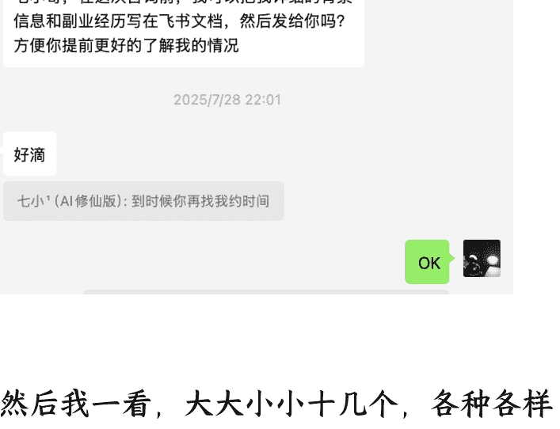
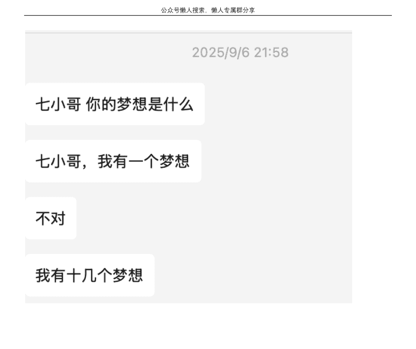
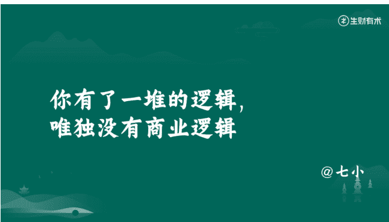
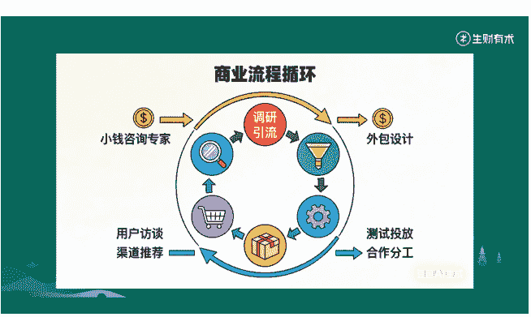

# 《把商业思维前置与优势思维，方为正确;把优势思维赋能商业流程，方可赚钱》

251230 副业 SC 精华

公众号懒人搜索，懒人专属群独享

懒人微信：lazyhelper

微信：lazyhelper

## 零、前言

各位，好久不见，这里是七小。

本着菜就多练，好好沉淀的原则，过去一年多一直在具体的事情上去历练，好长时间没在星球发言了。

感谢生财团队一直挂念着我，多次邀约我来小灯塔写篇分享，哈哈，这就来了。

看到参考选题里有一个是：《如何找到自己的优势，并结合优势选择合适的项目？》

这个问题，刚好，真是我从加入生财之后，思考了上百遍的问题，也是我自己很长时间没绕过弯，交了不少学费才想明白的问题，感触颇深，于是选这篇来讲讲我的看法。

话不多说，直接进入正题。

## 一、优势思维经典误区：喜欢>擅长>市场

提到个人优势与项目选择，那基本上就绕不开这一张图了。

这一张图，相信很多人都有印象吧？

当提及如何去选择一个项目的时候，一个经典理论就是告诉你，你要去思考：什么是你喜欢、擅长，市场需要的东西，然后去挑一个三位一体的理想业务，这就是你能一辈子去深耕的事情。

这个理论听起来是没什么问题啊，但是呢，根据我上百个副业咨询的经验来看，之前没怎么赚过钱的新手，干副业或自由职业的时候，一开始就信奉的是这一条理论，尤其是对此深信不疑的人，那基本完犊子了，未来两三年内是基本赚不到什么钱了，大概率的两三年之后还是在问，有什么项目是适合我的？

你要问我为什么这样讲？对这个理论为什么存有如此强烈的否定？

因为我就曾是被这个理论忽悠瘸的一员，记得 23 年 12 月见亦仁老大的时候，我还在哭诉说老大我好迷茫，我不知道我自己要干什么，求老大给我指点迷津。（那时候我已经加入生财快一年半了），给老大都整的有点无语子。

当然准确一点来讲，错误的并不是这个理论本身啊，而是我们大多数人都容易误解这一张图的真正逻辑。

人家说的 理想职业 = 喜欢 × 擅长 × 市场需要，正确的优先级排序应该是：市场需要 > 擅长 > 喜欢

但是错误使用的人，往往会把它误解成：喜欢 > 擅长 > 市场需要

然后，就容易 game over 了。

为什么 game over 了呢？我给你结合上面的公式，讲讲死亡原因。

### 1. 喜欢之坑

#### 1.1 把消费当喜欢，喜欢的太多挑花眼

我遇到过一個圈友，找我做过咨询，想让我给他分析一下，他应该选择什么副业项目。

他说发个经历详情给我看，我说行。

然后我一看，大大小小十几个，各种各样的知识付费的技能学习和项目训练营的报名。

A 之前赚到过几百块钱，B 感觉之前学习的时候体验不错，感觉自己是能做的，C 虽然还没正式干过但也颇有兴趣... 十几个选项，挑花眼，到底该选哪一个呢？

什么都能干，结果就是啥都不会坚定地去做，然后就一直处于犹豫未决的状态，迟迟没有行动了。

#### 1.2 把个人爱好当商品去卖，指望别人理解买单

这个就不说别人了，是自己犯过的错。

我个人自己一直非常沉迷研究人生发展的规律，以及过好这一生所需要的必备的知识和技能。

两年前那会，我也把我的个人爱好，当成商品去卖，试图把我迄今为止所有的研究成果都给人倾囊相授，当时收费一万多一年的私教来着。很多用户一看太复杂了，就刷走了。

多年来我一直犯的毛病，就是用户需要的只是某个 123、三步、5 分钟解决某个问题的方案。而我总是告诉用户，你得掌握 123、456、789... 99、100，你才能彻底根治这个问题啊！人家要的只是简单解，而是总喜欢给一个超复杂的根本解。

这就应了一句话：如果你根据自己做了一件量体裁衣的衣服，那么也就只有你自己会买单了。赚钱是得满足别人的需求，如果把自我满足放在了首位，就别想着赚钱了。

类似的例子，还有经典的，电影市场里的文艺片：

如果导演不考虑大众审美偏好，大众可理解的文艺范围，只想去做一个自己认为很牛逼的好东西，那就容易沦为叫好不叫座，多年后 B 站和豆瓣上说神作，当年电影院里票房惨淡的冷门片了。

### 2. 擅长之坑

#### 2.1 只会把擅长，用来职业技能培训

基于自己的经验和擅长点去选项目，这个思路，也容易把一堆【之前在上班，现在刚开始做副业的人，没啥认知和审美的人群】带进坑里了，误以为这就是所谓的【职业技能培训】【经验分享】。

比如设计师和程序员的经典副业选择模式：

我是个设计师/程序员，现在 AI 来了，快把我取代了，我主业赚不到多少钱，所以想要搞副业，但我又不知道副业能做啥，立马能想到的就是做我这行的职业技能培训 + 求职面试辅导。（可是你不就是这行不好干了才干副业的嘛？然后你培训别人做你这个不好干的行业的技能培训和求职）

俗称：死胡同里当导游。

#### 2.2 只有职业技能的擅长，没有商业能力的合格

设计能力——用于内容赋能，增强引流转化效果；代码能力——用于产品交付，降低交付的边际成本；

在你有完整的商业能力的情况下，你之前具备的专业技能，应该是这么用的。（而不是只想到了，我去职业技能培训）

我想表达的是，不要执着于你过往在某个岗位上技能的专用技能的擅长，不要非得想着这玩意能怎么用来变现。而是多把时间用在琢磨商业能力上：调研需求——研发产品——引流获客——转化成交——产品交付，至少上述的这些环节，每个都掌握几招。

比如会用搜索框的关键词、指数工具做调研

会用知识付费/代码软件的产品做交付

会在小红书引流

会用朋友圈成交

基础环节的操作，每个环节至少会个 2-3 招操作，能保证你是能持续有收入的。

当你商业能力上能闭环了，你会发现你以前积累的一些专业技能，倒是更容易用上。反倒是商业技能没闭环之前，专业技能上也用处不大。

#### 2.3 抱残守缺，贬值的技能非要逆天而行

我也见过有的朋友，惯性思维蛮严重的。

自己过去所掌握的技能，在如今确实在持续贬值，就像是 logo 设计、营销设计咨询... 现在 AI 把价格完全打下来了。

但是朋友不认命，不改变啊，不想着在新时代换一门新的吃饭手艺、新的人群、新的应用场景，老想走之前的那一套。试图在不改变产品服务的前提下，只是靠多引流获客来解决业绩下滑的问题。

这也算是痴人说梦了。

### 3. 商业之坑

#### 3.1 市场有需求，是一个很大的词

喜欢擅长、市场需要，终于说到市场需要这个模块了。

怎么说呢，市场需要真的是个很大的词，如果你只是理解字面意思，但就如我所说，完犊子了。

市场有没有需要，这属于动动脚趾头都能想出来答案的，肯定是有，对吧。

但是这个市场是什么样子的呢？

这行客户是怎样分层的？低端、中端、高端客户的画像和需求，分别是怎样的？

低端客户的钱，要怎么挣？高端客户的钱，要怎么挣？

干这行，白手起家，要解决的难题有哪些？包括技术上的、管理上的难题是什么？

诸如此类的，真的要细说，很多问题要考虑的。

举个例子，大家在大学的时候，看到当个校园市场的中介，搞搞表白墙，搞搞资源对接挺赚钱的。可能动过心，想着自己也去干干类似的业务吧？

比如推推驾校、做一下大学生家教派单平台，似乎人在宿舍做，就能钱从天上来了。

但是真深入干这行，第一个问题：学生绕过你直接对接驾校了，请补课老师的家长和上门家教的大学生私加好友，跳你单了，请问这个问题怎么解决？

可能第一题，很多圈友就创业未出门，就中道崩殂了，直接 game over，因为无法解决跳单问题。

市场是否有需求？我认为这真不是个好问题。

有些糟糕的概念，从你开始用他去思考那一刻，你能得到的所有结论基本都是无用的、甚至错误的。

市场有需求≠你能做好≠你能赚钱。

### 4. 小结

以上的这些情况，一句话概括来说，其实就是：你有了一堆的逻辑，唯独没有商业逻辑。

## 二、先抛开优势思维，只用商业逻辑思考

在项目选择的初期，比起纠结“我喜欢什么、我擅长什么”，更重要的是用商业逻辑判断“这件事能不能赚钱，怎么做才能赚钱”。商业逻辑是项目的根基，只有根基扎实，后续的优势赋能才有意义。

那什么是用商业逻辑思考问题呢？

### 1. 商业逻辑简易版

用生财 AI 来回答这个问题，它给的简单版的回答是这样的：

启动新项目前的调研、测算与可行性评估是“先胜而后战”的核心环节，需从认知切换、深度调研、多维评估、风险测试等维度系统推进。以下是具体步骤及要点：

#### 第一步：认知切换——从“先干再说”到“先算后战”

新手常凭热情“先战而后求胜”，而熟手需切换为“胜兵先胜而后战”的思维，即通过前期算账和调研预判项目成败。《孙子兵法》强调“未战而庙算胜者，得算多也”，做项目同理：高手在动手前已通过计算明确盈利空间、风险边界，再落地执行；新手则易因缺乏论证导致试错成本过高。因此，启动前需先明确：项目不是“干出来的机会”，而是“算出来的必然”，需抑制盲目行动冲动，将“调研 + 算账”作为核心前置动作。

#### 第二步：深度调研——获取真实数据，建立项目认知框架

调研是算账的基础，需突破“看帖子、搜关键词”的浅层认知，通过多维度获取私密信息和交叉验证，具体方法包括：

##### 1. 公开信息建立初步框架，私密信息交叉验证

公开信息：通过行业报告、平台数据（如抖音/小红书关键词搜索）、竞品公开内容（官网、社交媒体）了解项目基本模式、市场规模，但需默认公开信息可能存在误导，仅作为框架参考。

私密信息：核心数据（如转化率、复购率、成本结构）需通过“付费咨询同行”（生财圈友、行业从业者，支付咨询费或红包获取真实数据）、“伪装客户体验流程”（加入对标私域，体验从引流到成交的全流程，记录话术、定价、服务细节）、“招聘套取信息”（发布岗位吸引竞品员工面试，获取销售链路数据如客单价、提点）等方式获取，并通过多个渠道交叉验证真实性（如同时咨询 3 位同行，对比数据一致性）。

##### 2. 研究至少 10 个对标，像素级拆解流程

选择 10 个以上直接竞品（头部、腰部、尾部均需覆盖），拆解其：

- 流量端：内容形式（短视频/图文）、发布频率、引流钩子（如免费资料、低价体验课）；
- 转化端：成交路径（私域话术、社群运营、复购策略）、客单价分层（低价引流品/高价利润品）；
- 交付端：服务流程（如知识付费的课程更新频率、售后响应速度）、成本结构（人力、物料、平台费用）。通过“上帝视角”分析其核心优势与痛点（如某对标流量成本低但复购差，可能是交付体验问题）。

##### 3. 快速 MVP 验证：先卖后干，低成本试错

若调研后仍无法判断可行性，需制作最小可行产品 (MVP) 验证需求，核心原则是“先卖再干”：

例：知识付费项目先设计海报预售，验证用户付费意愿；实体项目先通过闲鱼/朋友圈小范围测试订单，而非直接投入生产。

若 MVP 跑通 (如预售转化率达 5% 以上)，则继续推进；若失败 (如 0 订单)，则快速止损，避免投入大量资源。

#### 第三步：多维测算与评估——从“能不能做”到“适不适合我”

调研后需通过量化测算、自身匹配度、竞争格局等维度评估可行性，具体包括：

##### 1. 项目基本面评估：算清“天花板”与“风险底”

财务测算：

上限与下限：用“极限思维”测算：

上限：假设流量、转化率、复购率达最优 (如客单价 1000 元，月均 100 单，年营收 120 万)；

下限：假设流量最差、交付出问题 (如仅 10 单/月，扣除成本后是否亏损，亏损多少)。

参考案例:“上限高、下限高”的好项目 (如海外 AI 产品，流量稳定则营收无限;知识付费，课程制作后边际成本低);

“上限低、下限低”的差项目 (如餐饮单店，座位数锁死营收，亏损则租金 + 人工损失大)。

流量成本 (CAC) 与利润 (LTV):

计算获客总成本 (CAC): 包含流量成本 (如投流 1000 元获 100 线索，线索成本 10 元)、销售成本 (销售工资/成交单数);

对比客户终身价值 (LTV): 若 LTV>CAC，项目可持续;反之需优化转化或放弃。

竞争格局:

用“50 人测试法”判断竞争度：找 50 个潜在从业者，若仅 2-3 人真正在做，且对标水平与自身相近，则竞争较小;若多数人已入局且头部玩家壁垒高 (如强技术/资金)，则需谨慎。

##### 2. 自身匹配度评估：能力、资源与价值观是否契合

能力与资源:

核心角色：自己是生产方 (如研发产品)、营销方 (如流量获取) 还是运营方 (如私域转化)? 现有资源 (资金、人脉、行业经验) 是否覆盖项目启动需求（如做 AI 产品需技术背景，若无则需合作或外包）。

风格匹配：是“爆发型”（擅长抓短期红利）还是“持续型”（擅长长期运营）？
例：套利项目适合爆发型，知识付费适合持续型。

价值观排序：

若“自由”优先：选择可远程、轻团队项目（如 AI SaaS，一人可开发）；若“赚钱”优先：考虑“普通人能做 + 可复制”的项目（如 IP 切片，无需专业技能，批量招人即可放大）。

##### 3. 可行性验证：普通人能否复制，是否依赖“大佬”

用“普通人盈利框架”测试：

项目是否可拆解为 SOP（如内容模板、成交话术），让无经验者（如兼职大学生）也能执行？

若离开核心创始人（如技术大佬）后项目是否仍能运转？若需“顶尖人才 + 高投入”，则普通人难以复制，规模化风险高。

#### 第四步：风险预判与止损机制——避免“先战而后败”

合规与稳定性：项目是否符合平台规则（如抖音投流是否违规）、政策要求（如教育类资质）？避免“灰色地带”玩法，防止平台封号或法律风险。

止损红线：设定“测试期失败标准”（如 MVP 验证 3 个月无订单、流量成本持续高于 LTV），一旦触发立即止损，避免沉没成本（如“开餐饮单店，3 个月营收未达房租 2 倍则转让”）。

#### 总结：从“调研 - 测算 - 评估”到“决策”的闭环

启动新项目前需完成：

- 认知切换：用“庙算”思维替代盲目行动；
- 深度调研：通过对标拆解、付费咨询、MVP 验证获取真实数据；
- 多维评估：算清财务上限/风险、匹配自身能力与价值观、判断竞争与复制性；
- 风险兜底：设定止损规则，确保“即使失败，损失可控”。

通过以上步骤，可将项目成功率从“博概率”变为“算出来的必然”，实现“先胜而后战”。

### 2. 商业逻辑全面版

这里我们可参考，大公司做新项目的常用的可行性评估。（往下翻一点的高亮块）

可能会有一些朋友看到下面这一堆框架，心想：要考虑这么多东西？对于我这个刚开始干的新手来说，是不是太复杂了，是不是有点小题大做了？

对此，很难跟你去表述我的心情。

引用一下生财联合办公的负责人——许老师说的：

> 新手常凭热情“先战而后求胜”，而熟手需切换为“胜兵先胜而后战”的思维，即通过前期算账和调研预判项目成败。《孙子兵法》强调“未战而庙算胜者，得算多也”，做项目同理：高手在动手前已通过计算明确盈利空间、风险边界，再落地执行；新手则易因缺乏论证导致试错成本过高。因此，启动前需先明确：项目不是“干出来的机会”，而是“算出来的必然”，需抑制盲目行动冲动，将“调研 + 算账”作为核心前置动作。——许老师

做业务这几年来，我越发的体会到，所谓的创业失败，本质上，大概率的都是你的商业素养太差了，做事情想事情都太粗糙，导致任何项目都没有做好。很多后期的所谓踩坑，失败复盘，本质就是前期调研时候偷的懒，所以后面要还这欠下的债。

干好一个项目是有学习成本在的，包括时间，金钱，精力，这些成本，你要么是在前期的调研环节去做支付，要么就是踩坑之后的时候复盘环节去做支付，反正你早晚都得付的。

既然你早晚都得学，那你现在就先看一遍吧。你不用怕，这些内容太多，你看完学不会啊，这篇内容是可以复制的，你可以复制下面的这些内容作为一个 txt，然后后面呢，你去跟 ai 对话的时候，就可以把你的个人情况，你的项目说明清楚，然后让 ai 结合这一个框架，帮你做一下可行性分析，给你一些建议。这就是最简单的用法了。

#### 互联网项目可行性分析框架（折叠展开）

##### 思维导图版

- **一、市场机会分析（判断“要不要做”，验证市场可行性）**
  - 1.1 需求真实性验证
    - 核心定义：关键问题洞察，用户评价标签，验证需求是否为“刚需 + 高付费意愿”，避免伪需求
    - 核心目的：用证据证明用户痛点，而非自嗨型需求
  - 1.2 需求优先级排序
    - 核心定义：用 KANO 模型/波士顿矩阵/付费意愿，区分基础需求/期望需求/兴奋需求，聚焦核心痛点
    - 核心目的：避免功能堆砌，优先聚焦用户必选项
  - 1.3 需求时效性验证
    - 核心定义：通过趋势数据判断需求是长期需求/短期风口/过时需求，匹配入场时机
    - 核心目的：避开风口陷阱，选择可持续赛道
  - 1.4 竞争情况分析
    - 核心定义：拆解头部/腰部/尾部头部 3 个竞品的人设、引流、变现、优势短板
    - 核心目的：找到差异化切入空间，不盲目跟风
  - 1.5 竞品差异化判断
    - 核心定义：维度包括：技术壁垒、交易便捷度、差异化空间/体验差异化空间评估市场竞争难度
    - 核心目的：明确自身是否有能力突围，避开红海
  - 1.6 自身切入点优势提炼
    - 核心定义：结合个人技能、资源、差异化方向，明确“为什么是我”
    - 核心目的：打造不可替代的核心竞争力
  - 1.7 市场容量测算
    - 核心定义：通过销量、转化率、客单价，量化市场总规模（做低资金保守测算）
    - 核心目的：判断市场是否支撑盈利目标，有无天花板
  - 1.8 增长率判断力
    - 核心定义：通过行业增长率，新需求占比空间，评估市场未来增长可能性
    - 核心目的：选择高增长赛道，避免加入衰退市场
  - 1.9 市场项目目标拆解
    - 核心定义：结合自身资源，设定 1 年/3 年/5 年可实现的市场份额、反向推导执行目标
    - 核心目的：让目标具象化，避免被模糊“做大做强”
    - 核心目的：将“用户增长”“核心痛点 + 解决方案 + 差异化”明确定位，明确横纵考核
- **二、产品/定位分析（明确“做什么”，匹配需求与变现）**
  - 2.1 产品核心定位
    - 核心定义：用 AARRR+5W2H 法 + 细分需求 + 场景化 + 差异化”明确定位，明确横纵考核
    - 核心目的：让用户快速记住“产品核心解决什么问题”
  - 2.2 精准用户群体拆解
    - 核心定义：从年龄、职业、消费能力、核心诉求拆解精准用户，避免泛用户定位
    - 核心目的：让用户“选对更聚焦，提升转化率
  - 2.3 产品/服务形态确定
    - 核心定义：结合自身技能、落地难度，选择资产、高复用的形态（虚拟产品/轻服务等）
    - 核心目的：降低启动门槛，快速落地验证
  - 2.4 产品功能/服务拆解
    - 核心定义：用 MVCSSM 法拆解 A 必须有 B/应该有/可以有/暂不需要功能，聚焦核心价值
    - 核心目的：避免功能冗余，降低落地成本
  - 2.5 产品功能地度评估
    - 核心定义：从时间、难度、资金维度评估功能可行性，明确外包/细化方向
    - 核心目的：确保产品设计接地气，不卡壳
  - 2.6 产品形态策划
    - 核心定义：明确 1.0（核心功能）/2.0（增值功能）/3.0（优化功能）的迭代节奏
    - 核心目的：快速上线验证，用户反馈优化，不追求完美
  - 2.7 变现方式选择
    - 核心定义：结合产品形态，用户付费意愿，选择 1/2 个核心变现方式（单次售卖/会员等）
    - 核心目的：提前明确赚钱路径，避免用户有投入无收入
  - 2.8 盈利模式元构建
    - 核心定义：拆解“单小客单 + 复购”，测算单客利润（客单价 - 成本）
    - 核心目的：算准“卖多少”，确保盈利模型成立
  - 2.9 客单价与定价策略
    - 核心定义：参考竞品 + 本用户付费能力，设定性价比最高或高溢价，用锚定效应提升付费意愿
    - 核心目的：平衡转化率和利润，避免定价过高/过低
  - 2.10 营销路径设计
    - 核心定义：设计用户初次付费、二次/多次付费的引导路径（产品更购/增值服务等）
    - 核心目的：降低获客成本，提升长期盈利
- **三、流量渠道与运营分析（明确“怎么获客”，实现用户沉淀）**
  - 3.1 公域引流渠道拆解
    - 核心定义：聚焦 2-3 个流量精准、自身擅长、获客成本低的公域渠道（抖音/小红书等）
    - 核心目的：避免渠道贪多嚼不烂，提升引流效率
  - 3.2 流量目标拆解
    - 核心定义：量化每个渠道的曝光、点击、引流、转化目标，避免盲目方向引流
    - 核心目的：让运营动作可衡量、可优化
  - 3.3 公域引流 SOP 搭建
    - 核心定义：标准化选题、创作、发布、互动动作，形成可复用的引流流程
    - 核心目的：降低引流难度，确保动作可复制
  - 3.4 公域数据复盘与优化
    - 核心定义：监控曝光、互动、引流转化等，通过数据调整内容/技术
    - 核心目的：避免无效劳动，提升 ROI
  - 3.5 私域沉淀 SOP
    - 核心定义：标准化微信号包装，用户添加引导、标签分组动作，实现公域用户高效沉淀
    - 核心目的：避免用户流失，为转化铺垫
  - 3.6 私域激活 SOP
    - 核心定义：通过朋友圈运营、社群互动，提升用户信任度与粘性，避免僵尸粉
    - 核心目的：拉近用户距离，为转化建立基础
  - 3.7 私域转化 SOP
    - 核心定义：标准化售前用户触达、已付费用户复购的话术与节奏，提升转化效率
    - 核心目的：让私域用户敢买、爱买，形成闭环
- **四、团队与资源配置分析（明确“谁来做/用什么做”，匹配资源）**
  - 4.1 个人能力盘点
    - 核心定义：梳理自身核心职能、辅助技能、时间精力、短板不足，明确能力边界
    - 核心目的：知道自己能做什么，不能做什么
  - 4.2 能力匹配度检验
    - 核心定义：对比项目所需能力与个人现有能力，明确能力缺口及补充方式（外包/学习）
    - 核心目的：避免因能力不足导致项目卡壳
  - 4.3 团队人力需求拆解
    - 核心定义：按核心环节拆解所需人力，明确客服/策划/外包/全职/兼职配置
    - 核心目的：明确最低人力成本及项目目标
  - 4.4 团队合作 SOP 制定
    - 核心定义：明确模块/外包的工作要求、交付时间、结算方式，避免合作纠纷
    - 核心目的：确保外部协作高效，交付质量达标
  - 4.5 人力成本测算
    - 核心定义：按人力成本*目标量级*ROI，优先做核心工作，审核心外包
    - 核心目的：避免人力成本过高导致亏损
  - 4.6 资金预算测算
    - 核心定义：拆解启动资金、运营成本、风险储备金，精细测算总资金需求
    - 核心目的：确保资金可控，避免资金链断裂
  - 4.7 工具资源选型
    - 核心定义：选择实用、低成本、高适配的工具（免费优先、付费按需）
    - 核心目的：用工具提升效率，降低落地难度
  - 4.8 人脉资源梳理
    - 核心定义：聚焦行业专家、合作方、用户 KOL，轻量级建立规模化人脉
    - 核心目的：借助外部资源助力项目落地与增长
- **五、财务模型分析（明确“能不能赚钱”，验证盈利门槛）**
  - 5.1 全成本测算（固定 + 变动 + 隐性）
    - 核心定义：覆盖固定成本（工具合约）、变动成本（外包费）、隐性成本（自身时间），无遗漏
    - 核心目的：确保利润核算真实，不低估盈利
  - 5.2 三收入预测
    - 核心定义：强保守/中等/乐观三档，基于销量、转化、客单量×月/年收入
    - 核心目的：设定合理盈利目标，避免拍脑袋决策
  - 5.3 盈利平衡点测算
    - 核心定义：计算“月投入 + 月成本”对应的保本销量/用户数
    - 核心目的：明确“卖多少才能保本”，作为核心执行目标
  - 5.4 现金流流程与管理
    - 核心定义：盈亏收支同步，预留 2 个月固定成本备用金，避免现金流断裂
    - 核心目的：确保项目健康运转，应对突发状况
- **六、风险评估与应对（明确“可能踩什么坑”，提前规避）**
  - 6.1 风险识别与等级评估
    - 核心定义：识别市场/平台/产品/财务/合规等风险，按发生概率*影响程度高/中/低等级
    - 核心目的：全面覆盖风险，不遗漏致命隐患
  - 6.2 离/中风险应对预案制定
    - 核心定义：针对高/中风险，制定可落地、低成本的应对措施（多渠道布局/差异化强化等）
    - 核心目的：风险发生时快速响应，降低损失
  - 6.3 三层次风险预警机制建立
    - 核心定义：建立日/周/月三级监测，设定预警阈值，触发后立即启动预案
    - 核心目的：提前发现风险信号，避免风险扩大
- **七、项目落地 SOP 与里程碑规划（明确“怎么推进”，按节奏落地）**
  - 7.1 三阶路线图精准规划
    - 核心定义：为每个步骤搭建可量化的执行标准（用户数/收入/转化率等）
    - 核心目的：直观评估阶段成果，及时调整方向
  - 7.2 日/周/月执行 SOP 制定
    - 核心定义：确保执行可持续，聚焦核心任务
    - 核心目的：让项目管理标准化，避免节奏混乱
  - 7.3 里程碑验收标准量化
    - 核心定义：聚焦流量/转化/盈利/用户满意度指标，建立日/周/月监控机制
    - 核心目的：用数据反馈项目状态，不做无方向努力

##### 豆包知识库版

直接把这个 txt，丢进豆包或者其他 AI，结合你当前考虑的项目情况，让 AI 给你做个初步的可行性分析报告。（想打开看也可以，只不过内容是跟思维导图基本一致的。）

## 三、再用优势思维，赋能商业流程

当商业逻辑已经跑通（引流 - 转化 - 交付 - 盈利闭环），优势不再是选择项目的标准，而是放大项目竞争力、降低成本、提升用户粘性和组织战斗力的工具。

优势的价值，永远要依附于商业流程，脱离商业场景的优势都是自嗨。

@七小

### 1.技能优势如何赋能项目？

还是拿我们上面举的，经典设计师和程序员的案例，来看看如何把自己的技能和商业流程相结合。

#### 设计技能：从“接散单”到“全流程赋能”

设计技能的核心商业价值是“提升视觉吸引力、打造品牌差异化、降低用户认知成本”，可以嵌入引流、产品开发、交付、转化等多个环节：

- **落地 SOP:**
  - 引流环节：制作高转化的海报、图文内容。海报设计：遵循“痛点 + 解决方案 + 信任背书 + 引流钩子”的结构，比如做“副业咨询”，海报标题突出痛点“想做副业却不知道选什么？”，解决方案“1 对 1 副业诊断，帮你找到适合的副业”，信任背书“已帮助 1000+ 人找到副业，月入 3000+"，引流钩子“扫码添加私域，免费领取副业避坑清单”。
  - 图文内容：比如在小红书做“AI 工具教学”，用设计技能制作“步骤拆解图文”，把复杂的操作步骤用清晰的图片 + 文字标注，让用户一眼就能看懂，提升内容互动率和引流转化率。
  - 产品开发环节：开发设计类产品或增值服务。
    - 设计模板：比如做“职场技能培训”，开发“简历模板、PPT 模板、汇报模板”，作为引流赠品或付费产品；模板要突出“高颜值、高实用性”，比如简历模板包含“不同行业、不同岗位的专属模板”，满足用户的个性化需求。
    - 定制化设计服务：作为高客单产品的增值服务，比如做“自媒体 IP 打造”，除了提供运营咨询，还为用户提供“头像设计、封面设计、品牌视觉设计”服务，提升产品溢价。
  - 转化环节：用设计提升产品的“价值感”。
    - 产品包装：比如做“知识付费课程”，用设计技能制作精美的课程封面、课件 PPT、学员手册，让用户觉得“物超所值”；对比同行的“粗糙课件”，你的产品更有竞争力。
    - 案例展示：把用户案例用设计技能做成“可视化报告”，比如“学员通过 AI 工具变现 1 万元的案例”，用图片 + 数据 + 文字的形式展示，比纯文字更有说服力，能提升转化效率。
  - 交付环节：用设计提升用户体验。
    - 交付资料：比如做“设计咨询”，为用户提供“设计方案报告”，用设计技能排版，让报告更清晰、更专业；同时提供“设计源文件、使用教程”，方便用户后续修改。
    - 售后服务：比如用户对设计方案不满意，用设计技能快速修改，提供 2-3 个备选方案，提升用户满意度。

**实战案例：** 生财圈友小 T 是设计师，之前一直靠接散单赚钱，收入不稳定。后来他跑通了“自媒体 IP 打造咨询”的商业闭环，用设计技能全流程赋能：
- 引流：在小红书发布“自媒体封面设计干货”“IP 头像设计案例”，用高颜值的图文内容吸引用户，引流钩子是“免费领驭自媒体封面模板+IP 头像设计指南”，私域引流转化率达 10%。
- 产品开发：推出“自媒体 IP 视觉打造套餐”，包含“头像设计、封面模板设计、品牌视觉设计”，定价 999 元；同时推出高客单的“自媒体 IP 打造私教服务”，包含运营咨询 + 视觉设计，定价 5999 元。
- 转化：用设计技能制作精美的产品海报、案例展示页，比如把学员的 IP 视觉前后对比图做成可视化报告，突出“设计后的账号粉丝增长 3 倍、转化提升 50%”，用户看了之后更容易付费。
- 交付：为每个私教学员提供“定制化视觉设计方案”，并制作“视觉使用手册”，教用户如何正确使用设计素材；售后提供 1 年免费修改服务，用户满意度达 98%。通过设计技能的全流程赋能，小 T 的月营收从 1 万提升到 8 万，收入稳定且持续增长。

**避坑点：** 不要为了“设计而设计”。设计的核心是“服务商业目标”，比如引流海报的设计要以“提升引流转化率”为目标，而不是单纯追求“高颜值”；如果一款海报很好看，但引流转化率很低，就是失败的设计。

#### 编程技能：从“接外包/搞培训”到“产品化变现”

编程技能的核心商业价值是“自动化、高效率、产品创新”，可以帮助你开发自己的产品，建立竞争壁垒，而不是靠“卖时间”赚钱。

- **落地 SOP：**
  - 产品开发：开发自动化工具或 SaaS 产品，解决特定人群的核心痛点。
    - 找痛点：通过用户调研，找到某类人群的“效率痛点”，比如跨境电商卖家的“选品效率低、数据分析繁琐”，职场人的“重复工作多、时间不够用”。
    - 开发 MVP：先开发最小可行产品 (MVP)，只保留核心功能，比如针对跨境电商卖家，开发“自动选品工具”，核心功能是“输入关键词，自动筛选高销量、低竞争的产品”，2-4 周内上线。
    - 验证需求：通过私域、朋友圈、行业社群进行小范围测试，收取少量费用（比如 99 元/年），验证用户付费意愿；根据用户反馈迭代产品，增加增值功能。
  - 运营效率提升：开发内部工具，降低运营成本。
    - 引流工具：比如做“短视频引流”，开发“批量剪辑工具、关键词自动生成工具”，节省剪辑和选题时间。
    - 私域运营工具：开发“自动标签工具、批量回复工具、用户数据统计工具”，提升私域运营效率，减少重复工作。
  - 交付创新：用代码替代人工交付，降低边际成本。
    - 比如做“数据分析咨询”，开发“自动化数据分析工具”，用户上传数据后，工具自动生成分析报告，你只需要做简单的人工审核和解读，交付效率提升 80%，可以服务更多用户。
    - 比如做“知识付费”，开发“在线测评工具”，用户购买课程后，先通过测评工具测试自己的技能水平，系统自动推荐适合的学习路径，提升用户学习效果和满意度。

**实战案例：** 生财圈友小 K 是程序员，之前靠接外包赚钱，经常熬夜加班，收入也不稳定。后来他通过用户调研，发现很多做“自媒体的博主”有一个核心痛点：“想要批量生成短视频，但剪辑时间太长，而且不会写文案”。
- 产品开发：他用 1 个月时间开发了一款“自媒体短视频自动生成工具”，核心功能是“输入关键词，自动生成文案、匹配素材、剪辑视频”，支持抖音、小红书等多个平台的视频格式，MVP 版本上线。
- 验证需求：他在自媒体行业社群进行小范围测试，定价 199 元/年，吸引了 50 个用户付费；通过用户反馈，迭代了 3 个版本，增加了“自定义素材库、视频风格调整”等功能。
- 引流：在知乎、抖音分享“自媒体短视频批量生成技巧”，用工具生成的案例展示“10 分钟生成 10 条短视频”，引流钩子是“免费试用 3 天工具，评论区扣‘短视频’领取”，私域引流转化率达 8%。
- 变现：推出“月度会员 (99 元)、年度会员 (199 元)、终身会员 (399 元)”三种套餐，同时为企业用户提供“定制化部署服务”，定价 19999 元/年。上线 6 个月，付费用户突破 1000 人，月营收达 5 万，而且边际成本极低——工具开发完成后，服务 100 个用户和 1000 个用户的成本几乎一样。

**避坑点：** 不要追求“大而全”。开发产品时，先解决一个核心痛点，不要一开始就想做“全能工具”，否则开发周期长、投入大，还可能因为功能冗余导致用户不买单；先小范围验证，再逐步迭代。

### 2.资源优势如何赋能项目？

资源优势的核心价值从不是“拥有多少”，而是“能在商业流程的关键节点省多少时间、降多少成本、提多少效率”——它就像项目的“放大器”，能让跑通的商业闭环加速起量，让尚在验证的项目少走弯路。对普通人来说，最核心的资源无非两类：金钱资源和人脉资源，把这两类资源精准嵌入“调研、引流、转化、交付、技术”五大商业环节，就能发挥最大价值，而非让资源闲置。

先看人脉资源的全流程赋能：它的核心是“跳过从零到一的铺垫，直接对接精准需求或解决方案”，让每个环节都省去“建立信任、寻找匹配”的无效消耗。在调研阶段，如果你的人脉里有目标用户或行业从业者，完全不用在公域大海捞针式找问卷对象，直接拉个小群做深度访谈，甚至邀请他们参与 MVP 内测——比如做职场副业培训，手里有 100 个想转行的职场人微信，一天就能收集到真实痛点，比公域调研快 3 倍，还能避免“伪需求”陷阱。我之前帮圈友做副业咨询时，他就是靠手里的 20 个宝妈人脉，一周内完成了育儿类产品的需求调研，直接敲定了“短视频辅食教程”的核心方向。

到了引流阶段，人脉就是天然的精准渠道。如果你的产品是母婴用品，人脉里有母婴 KOL、幼儿园老师或社群团长，不用花大价钱投流，让他们做个简单推荐或社群分享，就能触达精准用户。生财圈友小 M 做家庭清洁服务时，靠 3 个小区物业经理的人脉，直接在 10 个业主群落地推广，第一个月就拿到 50 单，省去了至少 3 个月的公域引流积累。而转化阶段，人脉的“信任背书”更是关键——如果你的人脉里有行业专家或有影响力的用户，让他们分享使用体验，比自己说 10 句产品好都管用。比如做知识付费课程，邀请 3 个已经靠课程变现的学员做直播连麦，转化率能直接提升 20% 以上。

在交付和技术环节，人脉能帮你解决“能力短板”。比如做设计类项目，自己不擅长 3D 建模，人脉里有靠谱的建模师，就能快速对接合作，不用自己花 3 个月学习；做小程序开发项目，人脉里有程序员，能省去外包踩坑的成本，还能快速响应迭代需求。很多人觉得人脉是“认识多少人”，其实真正有用的人脉，是“能帮你补全商业流程中某个短板”的人。

再看金钱资源：它的核心逻辑是“花钱买时间、买经验、买确定性”，把钱花在五大环节的“效率卡点”上，比盲目投入生产或囤货更有价值。调研阶段，与其自己花 1 个月扒公开数据、拆解竞品，不如花 1000 块付费咨询 2 个行业老兵，直接拿到他们的转化数据、成本结构和避坑指南——相当于用小钱买了别人几年的经验，避免自己踩同样的坑。我认识的一个圈友做跨境电商，就是花 500 块咨询了资深卖家，避开了“平台新规罚款”的致命坑，省了至少 10 万损失。

技术环节是金钱资源的核心发力点：如果自己不懂编程、设计或视频剪辑，不用死磕学习，花几百块找外包做基础搭建——比如做自媒体需要封面模板，花 300 块请设计师做 10 套标准化模板，自己专注内容创作，一周就能启动项目，比自己学 1 个月设计效率高太多。而交付环节，花钱能降低边际成本：比如做知识付费，花 2000 块请人整理课程素材、制作课件，自己专注答疑和用户服务，能同时服务更多学员，收入直接翻倍。

引流和转化阶段，金钱要花在“小范围试错”上：比如想做抖音引流，先花 1000 块投小流量测试哪种内容转化率高，再放大投放；产品上线后，花几百块做“限时体验活动”，快速筛选高意向用户，比盲目投几万块广告靠谱得多。记住，金钱资源的关键不是“多投多赚”，而是“用最小成本验证确定性”——比如在转化环节，花 500 块做一套更精美的产品海报和案例展示页，能提升 10% 的转化率，这就是“花小钱办大事”。

最后要提醒的是，资源赋能的关键是“匹配商业流程”：人脉要对接“调研、引流、转化”的信任节点，金钱要花在“调研、技术、交付”的效率节点。很多人手里有人脉却变现不了，是因为没找到对应的环节匹配；手里有钱却越投越亏，是因为没先验证就盲目放大。对普通人来说，不用追求多全的资源，把手里的一点人脉、一点资金，精准嵌入“调研、引流、转化、交付、技术”的关键环节，就能让项目快速启动、少走弯路——这就是资源作为“放大器”的真正价值。

### 3.小结

虽然这次我选择的参考选题是《如何找到自己的优势，并结合优势选择合适的项目？》，但我这篇文章前面 1 万字，基本上都是讲的，先把优势思维放在一边，先去用商业思维去思考项目。

倒也不是说无法根据优势去选择项目。

而是根据我的观察，大多数普通人的商业定量思考思维，其实都是不过关的。在这种商业量化思维不过关的前提条件下，盲目地用优势思维这种定性的方式去思考，得出一个模糊的看似可行的结论，是一个很危险的事情。

如我上面所言，很多项目，你去用【喜欢、擅长、市场需要】这个简单粗暴的方式去思考，行不行？能不能做？答案都是可以做的。但是你深入去做一下，就会发现中间问题一大堆，好多问题你没有办法解决，算完账发现也赚不到几个钱。

能做，但是做不好，且赚不到几个钱，那这“能做”还是一个正确的结论吗？

## 四、如何从自身性格、经历、资源，思考项目选择？

我也遇到过不少朋友跟我说，思考自己的副业发展、创业发展，是一个非常迷茫的事情。这个困惑的感觉不亚于是高中毕业之后填报高考志愿。很懵，不知道该怎么办？特别想知道就是到底有没有一种方法，能根据自己的自身的性格，过往的经历呀，给自己量身定制一个特别适合自己的选择呢？

你要说没有吧，那其实也还是有的。只不过就是在我写文章这一 part 的时候，真的是整整卡了我三四天的时间。

就这个解决方法，在我看来啊，就是你简单到可能就是找 ai 发几句话的事。你要展开来说，我可以单独给你放一个几万字的文档。它是一个可大可小的一个事。我一下子不知道怎么跟大家特别好的去描述了。

我也没别的招了，就两种做法都说一下吧。

### 1.简单版本：

- 1、基础信息：年龄，性别，所在城市，家庭状态等
- 2、性格：可以用九型人格、MBTI、盖洛普报告，作为性格描述（不清楚自己性格的，可以去网上找一找测评的链接。）
- 3、职业经历：过去做过哪些工作，可以把自己的工作经历，通过录音的方式完整的论述一下。每一份工作里扮演什么角色，掌握什么技能，做出过什么结果？
- 4、资源情况：自己最擅长的技能有哪些？自己能够去调度的人脉关系有哪些？自己跟哪些平台有不错的商业往来，可以借用人家的资源？自身的资金情况是怎样的？ ...
- 5、工作期望：希望这份工作一年能赚多少钱？对于这一份工作中，希望一定要有的要素，和希望一定不要有的要素是什么？

现在的 ai 真的非常的强大，强大到你真的只需要给他这上面这些信息，加起来可能都不超过 1500 字，然后你自己口述录音的话，10 分钟不到就搞定了。然后呢你发给豆包，就能得到一份比较适合你的业务推荐了。

比如以我为例，用豆包的实测。

#### 七小提问：

5 号人格 +ENTJ+ 互联网运营出身 + 个人能力和社会人脉能力超强，你觉得适合做什么，想要开公司组团队赚 1000w，你认为适合做什么

#### 豆包推荐：

用户的问题是为一位 5 号人格、ENTJ、互联网运营出身且个人与人脉能力超强的人规划开公司赚 1000 万的方向。首先需要拆解核心要素：5 号人格的特质是理性钻研、专业深度，ENTJ 则是天生领导者、战略导向、目标明确，加上互联网运营背景和强人脉，这些标签需要有机结合，找到既能发挥专业深度，又能体现领导力和资源整合能力的赛道。

首先，5 号人格适合需要深度专业积累的领域，比如技术解决方案、行业研究或知识服务，但 ENTJ 的领导力和目标感（1000 万营收目标）决定了不能局限于个体服务，必须是可规模化、能组团队的商业模式。互联网运营出身意味着对流量、用户增长、产品化有理解，强人脉则适合资源整合型项目，比如 B 端服务、平台型产品或产业赋能类业务。

接下来思考可能的方向：B 端数据智能解决方案是一个切入点，5 号擅长技术钻研，ENTJ 能带队攻坚，互联网运营经验可转化为对企业数字化需求的理解，人脉能对接企业客户。但需要确认这类公司的盈利模式、客单价及规模化路径，比如是否通过 SaaS 订阅制或定制化项目，达到 1000 万需要多少客户，这一步可能需要搜索相关案例或行业数据支撑。

另一个方向是垂直领域产业互联网平台，比如聚焦某个细分行业（如跨境电商、医疗科技）的数字化服务平台，5 号负责构建核心逻辑或技术架构，ENTJ 统筹战略和资源整合，运营经验用于平台增长，人脉对接上下游资源。但需要了解这类平台的启动门槛、变现周期，是否有成功案例可参考，比如类似平台如何快速达到千万营收，这也需要搜索验证。

还有行业深度智库与咨询服务，5 号的专业深度能打造权威内容，ENTJ 带队扩大服务规模，互联网运营背景可做知识产品化（如行业数据库、付费研报），人脉对接企业客户。但要考虑咨询类公司如何规模化，避免依赖个人，是否有产品化转型的可能，比如从项目咨询到 SaaS 工具 + 咨询的组合模式，这一步可能需要搜索“行业智库商业化路径”来确认可行性。

同时，要满足 1000 万营收目标，需要测算不同赛道的客单价和客户量。比如 B 端解决方案若客单价 50 万，需 20 个客户；SaaS 产品若年费 1 万/客户，需 1000 个付费用户。这需要结合行业平均数据，判断哪个方向更易实现。此外，团队组建方面，ENTJ 擅长管理，5 号需补充执行层和市场端人才，但用户已提及人脉强，可能容易搭建团队，重点在赛道选择。

还需考虑竞争环境，互联网运营出身者较多，需找到差异化。5 号的深度钻研可转化为技术或行业洞察的壁垒，比如聚焦 AI 在特定行业的落地应用，结合运营经验优化用户体验，形成“技术 + 运营 + 资源”的闭环。例如，为传统企业提供 AI 驱动的用户增长解决方案，既有技术深度（5 号），又能规模化服务（ENTJ 带队），还能利用人脉对接企业资源。

不过，这些方向是否有足够的市场需求？比如当前企业数字化转型的渗透率、AI 解决方案的采购预算等，可能需要搜索相关行业报告。另外，1000 万营收的时间周期未明确，但用户想组队开公司，应考虑 1-3 年内可实现的路径，避免过于长期的项目。

可能还需要排除一些方向：纯 C 端产品风险较高，依赖流量红利，5 号的特质可能更适合 B 端；个体知识付费规模有限，难以支撑团队和千万营收。因此，聚焦 B 端、技术驱动、可规模化、能整合资源的方向更合适。

总结下来，初步有三个潜在方向：B 端数据智能解决方案、垂直产业互联网平台、行业智库 + 工具产品。但每个方向的具体可行性、盈利模式、增长路径需要更多行业数据和案例支持，比如搜索“5 号人格 创业案例 ENTJ”“B 端 SaaS 千万营收 路径”“互联网运营 转型 B 端创业”等，获取实际案例中的客单价、团队配置、增长策略，确保建议的可操作性和数据支撑，避免主观臆断。因此，这一步应该要搜索，补充行业案例和盈利数据，验证方向的合理性。

#### 1 篇资料

用户的需求很明确，是为一位具备 5 号人格、ENTJ 特质、互联网运营背景且个人与社会人脉能力超强的人，规划开公司组队团队实现 1000 万营收的方向。首先得拆解这些关键特质的核心优势，以及它们之间的协同点。5 号人格是思考型，擅长深度钻研和逻辑构建，这对应了对专业领域的把控力；ENTJ 作为指挥型，天生具备战略决策和团队领导能力，这是开公司不可或缺的核心素质；互联网运营出身意味着熟悉流量逻辑、用户需求和数字化工具；而超强的个人与人脉能力，则为资源整合和市场拓展提供了基础。

接下来要思考，什么样的商业模式能同时承载这些优势，并且实现 1000 万的营收目标。1000 万的目标决定了项目不能是小打小闹的个体服务，必须具备规模化潜力，要么是高客单价的 B 端服务，要么是可复制的产品化模式。结合 5 号的深度和 ENTJ 的战略格局，B 端领域似乎更合适，因为 C 端市场竞争激烈且依赖流量红利，而 B 端更看重专业壁垒和长期服务能力，这恰好能发挥 5 号的钻研优势和 ENTJ 的资源整合能力。

从互联网运营背景出发，数字化转型是当前的大趋势，很多传统企业有数字化需求但缺乏相应能力，这是一个潜在的蓝海市场。但具体做什么细分领域呢？如果只是泛泛的数字化咨询，竞争已经很激烈，必须找到一个有技术壁垒且能产品化的方向。5 号擅长技术研发与解决方案，这提示可以往“咨询 + 工具”的方向走，既提供战略咨询，又提供可落地的技术工具，这样既能保证高客单价，又能通过工具实现规模化收益，符合 1000 万的营收要求。

再考虑 ENTJ 的领导力和人脉优势，组队做平台型项目也是一个可能的方向。比如垂直领域的产业互联网平台，整合上下游资源，通过佣金、会员费等方式变现。但产业互联网平台启动成本高，周期长，对于初创公司来说风险较大。相比之下，“数字化转型加速器”这样的模式，前期可以从咨询项目切入，快速验证市场，积累客户后再推出标准化工具，风险更可控，也能循序渐进地实现营收目标。

还有一个方向是行业智库与数据产品，这能充分发挥 5 号的深度研究能力和互联网运营的数据敏感度。通过输出高质量的行业报告和数据洞察，吸引 B 端客户付费，同时开发数据 SaaS 工具，实现订阅制收入。但这个方向可能过于偏向研究，需要 ENTJ 的战略推动才能避免陷入 5 号“闭门造车”的误区，如何将研究成果转化为可销售的产品和服务，是需要重点考量的。

对比这两个方向，数字化转型加速器似乎更优，因为它更紧密地结合了互联网运营的实操经验，能够将运营能力转化为可交付的服务和工具，而且“咨询 + 工具 + 陪跑”的模式层次感强，既能通过咨询项目快速获得现金流，又能通过工具实现长期被动收入，还能通过陪跑服务提高客户粘性和复购率，营收结构更健康。同时，这个模式对团队的要求也与用户的特质匹配：5 号可以主导产品和技术研发，ENTJ 负责战略、销售和团队管理，互联网运营经验用于优化工具的用户体验和客户服务流程，人脉资源则用于拓展客户和合作伙伴。

为了确保可行性，需要测算营收模型。假设咨询项目客单价 50 万，一年需要 20 个客户；工具订阅费每个客户每年 2 万，100 个客户就是 200 万；陪跑服务客单价 20 万，10 个客户就是 200 万，加起来正好 1200 万，超过 1000 万的目标，这个模型是成立的。此外，还需要考虑团队搭建、风险规避和成长路径，比如如何避免 5 号过度钻研细节，如何发挥 ENTJ 的领导力同时避免独断专行，这些都需要在方案中体现。

最后，参考搜索到的资料，NT 型人格在高增长企业创始人中占比很高，这也印证了 ENTJ+5 号的组合在创业中的优势。因此，综合所有因素，数字化转型加速器是最适合的方向，既能发挥所有核心优势，又能实现商业目标。

然后我本人实际反馈一下，他推荐的结果确实是我在考虑的发展方向。（我们公司现在在做的是 AI 加流量获客的软件工具，我本人也是在进行公司的数字化转型的探索当中。跟豆包说的几乎一模一样的。）

### 2. 复杂版本

复杂版本是这样子的：我认为每个人的性格，手上的资源情况，对理想生活的追求都是有所不同的。那么要找到自己最最最理想适配的天命所归的那一项业务，就需要联立解方程。

联立：自身性格 X 资源牌 X 理想生活 X 商业模式——求解自己最适配的理想职业

为此我捋了 4 份文档，每一份文档里面都有一些各种参数和商业之间的关联。累积加起来大概有个 3 万多字吧。因为太长了，并不是所有人都愿意看的，所以我把它称之为复杂版本。有这闲情的朋友可以打开看一看。如果嫌太麻烦的话，就直接按照我们上面简单版本的做法去试，其实也可以了。

你要问我复杂版本怎么用的话，那操作是这个样子的。

- 1) 自己打开一份空文档
- 2) 然后把我下面 4 份文档挨个打开看一遍。
- 3) 边看边挑选你觉得你比较认同的啊，跟你的想法一致，或者跟你的特点相符合的话，你就复制粘贴到你的空文档里面去。
- 4) 4 份都看完之后，你就会得到一系列的你感兴趣的，以及与你相符的，适合你的一系列的描述。
- 5) 然后你再把这些内容丢给豆包，你说啊我的情况跟这份文档里面的内容高度匹配，然后你综上所述，来帮我看看最适合我的工作是什么。
- 6) 完事

#### 四份词典

九型人格的核心价值在于“动机驱动行为，特质匹配场景”。商业模式的本质是“价值创造 - 传递 - 变现”的闭环，而人格特质直接决定了：

- 价值创造的优势领域 (如 4 号擅长情感价值，5 号擅长技术价值);
- 价值传递的自然方式（如 3 号擅长结果展示，2 号擅长情感连接）；
- 变现路径的适配程度（如 6 号适配稳健型模式，7 号适配创新型模式）。

关键前提：人格无优劣，商业模式无高低，核心是“特质 - 需求 - 场景”的三维匹配。每个人以主型为核心，可融合翼型特质拓展商业边界（如 3 号 +5 号适合技术创业，6 号 +9 号适合平台型项目）。

MBTI（迈尔斯 - 布里格斯类型指标）的核心是“认知偏好驱动行为选择”，其四大维度（能量获取：E 外向/I 内向；信息接收：S 感觉/N 直觉；决策方式：T 思考/F 情感；生活方式：T 判断/P 感知）共同构成 16 种人格，而这些偏好直接决定了个体在商业模式“价值创造 - 传递 - 变现”全链条中的天然优势：

- 能量获取维度（E/I）：决定商业场景的“人际密度”——E 型擅长高频人际互动（如销售、活动策划），I 型适合低干扰的深度专注场景（如技术研发、内容创作）；
- 信息接收维度（S/N）：决定商业决策的“聚焦方向”——S 型注重现实数据与落地细节（如连锁运营、供应链管理），N 型擅长捕捉趋势与创新机会 (如风口创业、战略咨询);
- 决策方式维度 (T/F): 决定商业价值的“核心导向”——T 型以理性效率为核心 (如企业风控、技术解决方案), F 型以情感价值为核心 (如社群运营、心理咨询);
- 生活方式维度 (J/P): 决定商业节奏的“管理模式”——J 型偏好结构化流程 (如标准化加盟、项目管理), P 型适合灵活应变的场景 (如自由职业、创意孵化)。

关键前提: MBTI 无优劣之分，商业模式的适配核心是“认知偏好与商业场景的匹配度”——如 ESTJ 的“结构化执行”适配连锁加盟，而 ENFP 的“创意发散”更适合内容创业。每种人格可结合“辅助功能”拓展商业边界 (如 INTJ 的 N+F 适合心灵成长领域，INTJ 的 N+T 适合战略投资)。

个人商业模式的本质是“用资源创造价值、用价值换取收益”，而七大资源就是支撑这套逻辑的“核心燃料”。无论是基础的时间投入，还是高阶的品牌影响力，每类资源都对应着不同的商业价值属性，直接决定了你能做什么业务、怎么赚钱、能赚多少钱。接下来，我们先逐一拆解七大资源的核心定义、与商业模式的关联意义及落地方法。

理想生活元素的核心是“你想拥有的生活状态”（如时间自由、内心平静、财务无忧），商业模式的核心是“你赚钱的方式”（如按时间卖货、靠技能接项目、用 IP 变现）。二者的匹配本质，是“商业模式的特性是否满足理想生活元素的核心需求”——比如“时间支配自由”需要商业模式“不绑定固定时间”，“财务被动率”需要商业模式“有持续被动收入”，“内在和平感”需要商业模式“符合个人价值观且压力可控”。

关键前提：没有“完美适配所有理想生活元素”的商业模式，但存在“优先满足你核心理想生活元素”的最优解。比如你最看重“时间自由”，则优先选“被动收入占比高”的模式；若最看重“财务稳定”，则优先选“收入波动小”的模式。

## 案例演示

# 这个是我复制的内容

# 这是我问豆包得到的结果:

> 参数复制 txt.txt
> 我是男，26 岁，5 号人格+ENTJ，个人实力 + 社会资本 + 结构性势能都不错，然后渴望高度时间、空间、关系自由的生活，还希望有被动收入，年入 1000 万，你觉得我做什么工作好呢？(结合这份文档)

结合你的 5 号人格 (观察者)+ENTJ(指挥官) 特质，以及个人实力、社会资本、结构性势能的优势资源，再叠加对“高度自由 (时间/空间/关系)+被动收入 + 年入 1000 万”的核心诉求，最适配的方向是“高壁垒垂直领域 SaaS 工具 + 行业智库平台”双轨模式——既发挥你“深度钻研 (5 号)+战略整合 (ENTJ)”的核心优势，又能最大化撬动三类资源，同时满足自由与收益目标。

### 一、核心逻辑：为什么这个方向适配你？

- 1. 人格适配:
  - 5 号的“理性缜密、深度钻研”能支撑 SaaS 工具的技术壁垒搭建 (如行业专属算法、自动化系统) 和智库的专业深度 (如硬核行业报告、战略分析);
  - ENTJ 的“战略眼光、资源整合、领导能力”能推动工具规模化、平台生态化，避免 5 号“闭门造车”，同时通过团队分工实现个人自由。
- 2. 资源适配:
  - 个人实力：用你的专业技能 (如编程、数据分析、行业技术) 打造 SaaS 工具的核心功能，用“结果导向”的服务 (如降本/增效数据) 打动客户;
  - 结构性势能：借助过往大型组织的平台背书 (如曾负责千万级项目、跨部门协调经验)，快速获取企业客户信任，承接大额合作。
- 3. 自由与收益适配:
  - 自由层面：SaaS 工具一旦上线可实现“订阅制被动收入”，智库平台可通过“专家入驻 + 自动化匹配”减少个人投入，无需绑定固定时间/地点；同时你能自主选择服务的客户 (拒绝低价值/不合频项目)，满足关系自由;
  - 收益层面：SaaS 订阅 + 智库服务费 + 资源对接佣金的组合，能突破“时间天花板”，年入 1000 万可通过规模化实现。

### 二、具体工作方向：高壁垒垂直领域 SaaS+ 行业智库平台

#### (一) 核心业务 1: 垂直领域 SaaS 工具 (被动收入核心)

- 1. 定位：聚焦“高痛点、低竞争”的垂直行业 (如工业制造数字化、跨境电商数据分析、医疗行业合规管理)，打造“专业深度 + 自动化”的 SaaS 系统 (契合 5 号“稀缺性专业价值”变现逻辑)。
- 2. 具体落地:
  - 产品打造：用你的个人实力 (如编程、行业技术) 开发核心功能，比如“制造业生产流程自动化系统”(可节省 50% 人工成本)、“跨境电商合规风险预警工具”(基于行业数据算法)，突出“技术壁垒”(别人短时间无法复制);
  - 收入模式：订阅制 (月费 999-9999 元/用户，按企业规模分级)，目标积累 1000-2000 个付费企业用户 (单用户年均付费 5000 元，即可实现 500-1000 万被动收入);
  - 资源撬动:
    - 结构性势能：借助过往大型组织的项目经验 (如曾参与行业数字化改造)，对接头部企业做“标杆客户试点”，用平台背书提升公信力;

#### (二) 核心业务 2: 行业智库平台 (主动收入 + 生态延伸)

- 1. 定位：以 SaaS 工具的用户为基础，搭建“垂直行业战略咨询 + 资源对接”的智库平台 (契合 ENTJ 战略咨询 + 平台打造”的适配逻辑)，既赚高客单价服务费，又通过资源匹配获取佣金。
- 2. 具体落地:
  - 核心服务:
    - 企业战略咨询：为行业内中大型企业提供“数字化转型战略、市场拓展规划”，按项目收费 (50-200 万元/单)，年承接 5-10 单 (营收 250-2000 万);
    - 付费研报 + 社群：推出年度行业白皮书 (10-20 万元/份)、高端会员社群 (1-5 万元/人/年)，提供“工具使用进阶 + 资源对接”服务，目标 100-200 名会员 (营收 100-1000 万);
    - 资源对接：利用你的社会资本，为平台用户对接供应链、渠道、高端人才，按合作金额 5%-20% 收取佣金 (如对接一笔 1000 万的供应链合作，佣金 50-200 万)。
    - 自由实现：组建“小而精”的团队 (如 2-3 名技术维护+5-8 名行业专家兼职)，你聚焦“战略规划、核心资源对接”，将执行层面工作分工出去，实现时间/空间自由；同时只服务认同你价值的优质客户，拒绝不合理需求。

#### (三) 双轨协同: 1+1>2 的收益闭环

- SaaS 工具为智库平台引流 (付费用户天然是高价值潜在咨询客户)，智库平台为 SaaS 工具提升复购 (通过咨询服务让客户深度使用工具);
- 被动收入 (SaaS 订阅) 保障基础现金流，主动收入 (咨询 + 佣金) 冲刺 1000 万目标，同时随着 SaaS 用户规模扩大，被动收入占比会逐渐提升，最终实现“少投入高回报”的自由状态。

### 三、实现路径:3 步落地，3 年达成年入 1000 万

#### 第 1 年：搭建壁垒，验证需求 (自由初步实现)

- 动作 2：依托个人实力，联合 1-2 名技术伙伴 (用社会资本对接)，6 个月内完成 SaaS 工具 MVP 版本 (核心功能落地);
- 动作 3：用结构性势能对接 3-5 家标杆企业 (如过往合作过的大型客户)，免费试点获取“降本/增效数据”(如帮企业节省 30% 合规成本), 同时搭建智库“专家资源池”(邀请 10-20 名行业资深人士兼职);
- 成果:SaaS 工具上线，积累 100-200 个付费用户 (年被动收入 50-100 万), 完成 1-2 单咨询项目 (营收 50-200 万), 个人时间自由度达 60%(无需坐班，远程统筹)。

#### 第 2 年：规模化扩张，提升被动收入占比

- 动作 1：优化 SaaS 工具功能，推出“基础版 + 企业版”，通过行业协会、KOL(社会资本) 推广，将付费用户扩至 500-800 个 (被动收入 250-400 万);
- 动作 2：智库平台推出年度会员社群 (3 万元/人), 招募 200 名会员 (营收 600 万), 同时承接 3-5 单高端咨询 (营收 150-500 万);
- 动作 3：组建 5-8 人核心团队 (运营、销售、技术维护), 将执行工作分工，你聚焦战略规划和核心资源对接 (如大型企业合作、拓展专家资源);
- 成果：年营收突破 800-1200 万，被动收入占比达 40%, 个人时间/空间完全自由 (可异地办公，自主安排节奏), 客户选择自由 (只服务高价值企业)。

#### 第 3 年：稳定被动收入，冲刺 1000 万+

- 动作 1：SaaS 工具付费用户破 1000 个，推出“生态化功能”(如对接供应链、金融服务), 被动收入达 500-800 万;
- 动作 2：智库平台形成“咨询 + 会员 + 资源对接”闭环，年咨询营收 300-500 万，会员 + 佣金营收 200-300 万;
- 成果：年入稳定 1000 万+, 被动收入占比超 50%, 团队自主运转，你仅需把控核心战略和关键资源，完全实现“时间/空间/关系”的极致自由。

## 五、尾言

其实写到这里，最后想跟大家说的，也算是我个人最大的一个教训吧，就是要把一些思维的优先级给摆正确。

首先最重要的是商业思维，商业思维不同，铁定是赚不到钱的。

然后再去讨论优势，尤其是跟商业相关的，能带来成本下降，效率提升，价格抬高的优势。

最后才是个人喜欢，个人性格等一系列的特点、偏好。

干的事越多，我就越觉得创业是一个逐渐弱化小我的过程，越执着于自己有什么，自己想要什么的人，反而越容易啥，结果都拿不到。但反过来，越是在乎客户想要什么，自己怎么尽可能的去满足客户的人，赚钱倒是快很多。

多的就不赘述了，希望本文对各位有些启发：)

## 最后，安利小懒的付费群:

懒人专属群 (介绍)

🗚 这里是你对抗信息过载的护城河。

已稳定运行 6 年，累计拆解、研读 3000+ 个互联网商业实战案例与行业前沿内参和时政/宏观文章。

我们不搬运垃圾，只做高价值信息的筛选器与放大镜。

### 懒人专属群更新记录:

https://hk57gvIx7u.feishu.cn/docx/H0kRdZbSbolBR0xkaXtcuVE0nTg

懒人专属群更新记录 (需梯子，备用):

https://lazybook.fun/blog/record2

【免责声明】本资料归档于社群内部知识库，仅供成员课题研究与学术交流，请在查阅后 24 小时内删除。