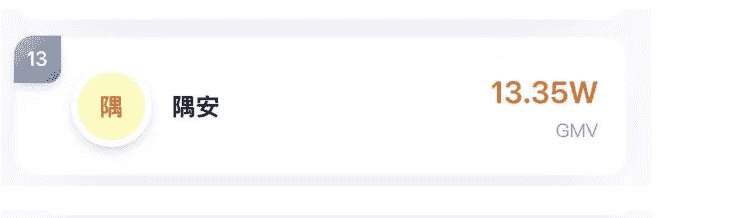
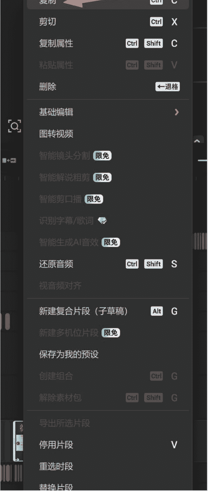
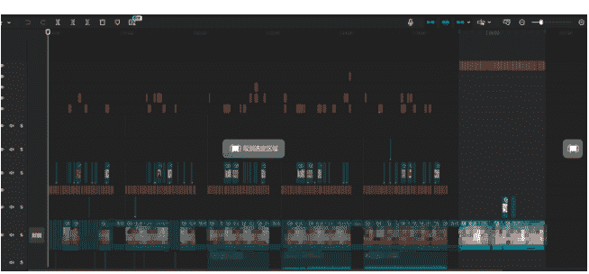
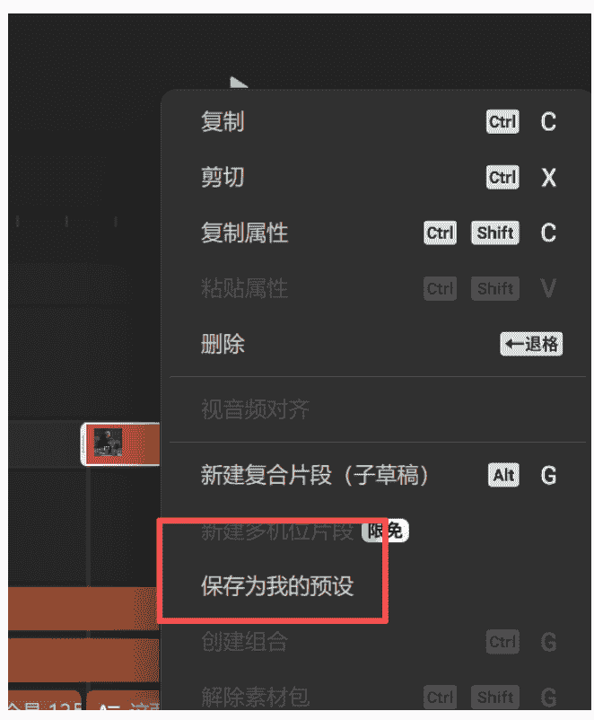
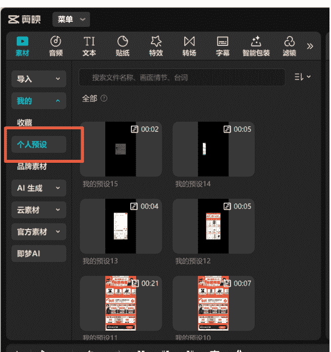
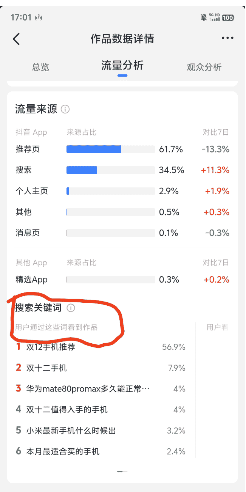
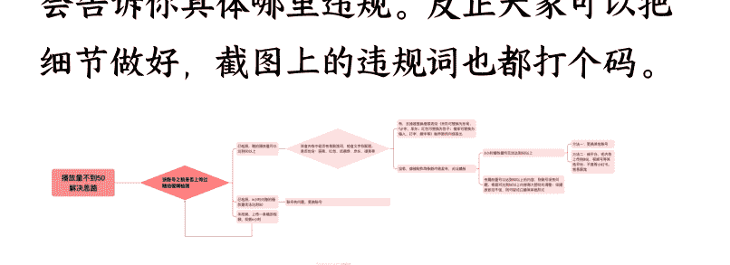
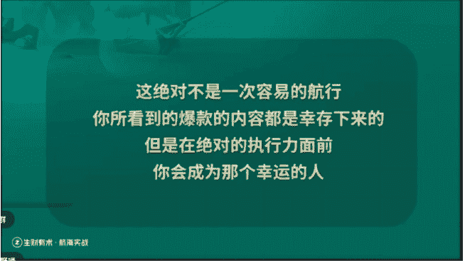

# 航海新人首战 GMV 28 万：拆解我的内容

## SOP 与提效方法（新人友好）

### 251230 副业 SC 精华

公众号懒人搜索，懒人专属群独享  
懒人微信:lazyhelper

## 引言

大家好，我是隅安，很高兴作为一个新人收到了生财的约稿邀请，在第二期抖音 CPS 中我拿到了一点结果，所以也希望能把我的全部经历分享出来，帮助到所有对这个项目感兴趣的圈友。

目前的战绩：两个多星期，做了 2 个账号，纯手搓制作 35 条视频，GMV 28 万+，总收益 6000+。

这是我加入生财以来第一次参与的航海项目，但也是我第一次全力执行并坚持到底拿到正反馈的副业项目。

## 一、生财新人的第一次航海

公众号懒人搜索，懒人专属群分享

### 【在本帖，我会无保留分享】

- 一套起号的内容逻辑：我是如何将做短视频编导的经验迁移到抖音 CPS 带货视频中，实现两个星期 GMV 破 27 万的？
- 提高效率的剪辑实操 SOP：剪辑慢不是手速慢，是素材乱，有两个小方法可以帮助我们去更快地生产内容。
- 新手的心力补救：从 Gap 期的焦虑内耗，到连续 5 天 0 反馈，再到拿到 6000+ 收益。我想分享的不仅是方法论，也有用行动对抗焦虑的过程。
- 给新人的避坑与微创新建议：在同质化严重的赛道，如何通过“微创新”而不是“盲目抄袭”来跑出自然流爆款？

(PS:实操和拆解部分在第二章~~)

#### 1.自我介绍

我叫隅安，是一个 INFJ 零零后。我毕业后一直在新媒体赛道，从教育行业的内容运营到医生 IP 编导，曾经也做出过短视频四百万播放爆款，单月涨粉 3 万的数据。

虽然有过往的爆款经验，但因为种种原因三个月前我选择了裸辞，离开那家不适合我的公司。Gap 的那两个月，我还是留在了上海，因为没有任何收入加上没有任何输出，每个月还要交水电房租，其实自己压力挺大的，也陷入了极度的焦虑和自我怀疑，经常通宵失眠，因为我不想去上那种没意义的班了，不想这么快去找工作但是又找不到变现的抓手，概括起来就两个字——迷茫。

#### 2.为什么选择生财？为什么选择抖音CPS？

十一月初，我被生财的一篇讲 AI 的文章吸引了，加入了三天 AI 训练营，看到这个社群里密集的搞钱案例就是那种刘姥姥进大观园的感觉，因为有很多我没见过的赚钱方式，还有那么多我连名字都没听过的 AI 工具。上个月在生财社群里我差不多看完了几百篇帖子，刷生财帖子取代了刷小红书抖音，我还学会了注册 Gemini，阅读完很多大佬的精华帖后，我对很多赛道都产生了兴趣，比如说小红书虚拟资料、公众号垂直小号等等。

双十一期间，“生财好事”里刷屏的抖音CPS战报吸引了我。虽然当时我甚至不知道 CPS 具体干啥的，但看了几十个案例后，我发现这是一个“门槛相对低、反馈极其快”的赛道。特别是看到圈友“平凡之路”大哥的故事，我深受震撼。作为第一次参加航海的新人，我觉得这个项目很适合我第一个深度学习的项目，不需要铺垫太多内容学习太多新知识。

我太想跑通一次完整的 MVP 了，因为对抗焦虑最好的方法就是具体的行动。哪怕赚不到钱，我也要投入我全部的执行力好好跟着教练去尝试。

## 二、抖音CPS 项目复盘

### 1.什么是抖音CPS？

简单来说，做这个项目我们就像“中介”。不需要囤货、不需要拍摄商品、不需要发货售后。我们只需要负责制作能留住人的视频，甚至是图文形式都可以，在中间一定要插入自己的钩子让大家去领红包就行了。对于小白来说的难点其实只在于剪辑视频，因为有些人是第一次剪辑，效率会比较慢。如果想要拿到大结果那么就一定要有网感，不然很难做出爆款视频。

**入局时机：为什么是现在？**

- **大促红利：** 虽然双十一、双十二已经过去了，但是还有年货节，各种各样的节日促销都是一次机会，只要平台没有封控管制就可以一直做，而且一旦账号做成垂类，那么日常也有很多内容可以发。
- **内容缺口：** 现在的 CPS 赛道，很多人还在做低质量的搬运或抄袭。平台缺的是好内容，而不是同质化的内容，这是很多人没流量的原因。我看中的机会点——用做 IP 的质量去做 CPS，就是降维打击，真实感是非常重要且稀缺的。

### 2.从0-1的试错：哪怕是“错误的”开始，也比等待强

航海的第一期直播就讲得非常清楚怎么去做这个项目，航海手册一定要仔仔细细看完一遍，才能熟悉你要做什么，要准备些什么。

怡然教练第一课最后就跟我们说：
> 24 小时之内先去发布自己的第一条视频。

作为一个有完美主义的 INFJ，我其实很想把优惠的规则、密令词口令词这些全搞懂再动的，但这次我逼自己先抄出来一个，因为等我搞懂了第一天就没得视频发了。

#### 起步动作：

- **①账号准备：** 准备了两个账号，做好养号动作，包括发测流视频、模拟真人使用习惯等，同时开始刷优质对标，手册和直播都讲了怎么去找低粉爆款。（其实新手先做一个账号也可以，先跑起来）
- **②素材库搭建：** 可以用飞书表格作为素材库，因为我必须要方便自己后期改脚本，所以是做了一个很简单的表格，主要就是用来存放对标的爆款视频（大家需要的话可以自取）。项目一开始我选择的做曼波视频，因为我不太想出镜，当时感觉曼波会更简单一些。

##### 第一盆冷水

即使我有过剪辑经验，竟然也花了五个小时才剪出来第一条曼波视频！因为第一次做这个类型的视频，没有任何素材，所有的表情包和截图都得自己去现找，而且我太执着于“复刻爆款的节奏”，非要卡着点一模一样的。

结果就是：辛辛苦苦做出来的第一条视频是 0 播放量，然后第二天我又做了三条视频分发在两个正常的账号上还是 0 播放量···

##### 复盘与破局

我也怀疑过账号问题，但测流是正常的。3 号第二次航海直播两位教练提到了很多内容对我非常有帮助。我意识到了两个问题：

- ①除了文案的违规词，图片和画面也很容易违规，比如说极限词、红包什么的字眼不允许出现；
- ②做“曼波”赛道太卷了，且同质化极其严重。平台不需要第 10001 个差不多的表情包视频，大家的配音和画面呈现的方式都差不多，作为一个没有任何权重的新号拿流量也太难了。

### 3.转折点：从“曼波”转“口播”，流量终于起死回生了

当我意识到我已经规避掉违规词这些内容但依然没流量的情况下，我迅速做出了判断，直接尝试真人口播形式，以前从来都没自己录过，但是我做过医生口播 IP 的编导，所以口播的录制以及剪辑我就更得心应手一些了，剪辑速度也稍微快一点，主要就是气口和读错的地方剪掉。

**数据好转：** 12 月 4 日，第一条口播视频发出，播放量破 100 了，虽然不高，但比 0 好太多了。

**多一张脸，多一份机会：** 按照我以前帮医生做短视频的思维，口播类型的视频多一张脸出镜其实就能多一个机会，因为同样的稿子可能一个人会爆另一个人不会爆（包含账号、视频内容、人物表现力等多种因素），所以我把另一个账号的曼波视频隐藏了，让我对象抽空也录一下我写的文案内容（录视频用的提词器是轻抖 APP），果然另一个账号也跑出来了流量，都是好几百播放。

**有流量不出单：** 三天的时间 8 条作品两个账号播放量都起来了，我也偶尔更新一两篇图文类的作品，播放量能跑出 1000+。我纳闷的是为什么都有这么好的播放量了，还是不出单呢？

| 播放 | 点赞 | 评论 | 收藏 | 分享 | 日期 |
| :--- | :--- | :--- | :--- | :--- | :--- |
| 989 | 13 | 2 | 0 | - | 2025 年 12 月 06 日 16:11 |
| 1466 | 12 | 4 | - | 1 | 2025 年 12 月 05 日 18:13 |
| 2229 | 3 | 1 | 0 | - | - |

> 口播它的转化可能没那么快，你就先按照这个节奏发，最好是让他们把红包领了，等到双 12 正式开始的时候去下单就会有单的。因为大家心里还是有一个时间锚点嘛，可能还是会等到 8 号之后才会去下单

**重点：口播的转化可能没那么快！** 而且 7 号那会儿还不到双十二，很多人可能不想下单，重点一定要让所有看视频的人都去领红包，红包锁佣十天，只要能领上，双十二下单就会有单。

### 4.爆发期：视频号红利与“微创新”

7 号晚上睡觉前，我把已经做好的抖音视频随手发在了视频号上面，没想到我两个账号的第一条作品数据都出奇的好，阅读量均突破 4000，并且有分享转发，我在 8 号醒来的时候就已经看到了出单。

| 发布日期 | 阅读 | 点赞 | 在看 | 分享 | 收藏 |
| :--- | :--- | :--- | :--- | :--- | :--- |
| 2025 年 12 月 07 日 23:56 | 4114 | 8 | 4 | 40 | 13 |
| 2025 年 12 月 08 日 20:30 | 5375 | 8 | 8 | 33 | 10 |

万单宝 | 万能转链 | 推广活动 | 创建推广位 | 推广订单
--- | :--- | :--- | :--- | :---
今天 | 昨天 | 7 天 | 30 天 | 上个月 | 自定义
全部推广位
全部平台

| 指标 | 数值 |
| :--- | :--- |
| 有效订单数 | 14 |
| 有效订单金额 | ¥ 8341.69 |
| 预估佣金 | ¥ 9.45 |
| 完成订单数 | 12 |
| 完成订单金额 | ¥ 174.23 |
| 完成订单佣金 | ¥ 1.58 |
| 预估激励 | ¥ 81.67 |
| 预估总收益 | ¥ 91.12 |

数据趋势：按筛选区间展示，有效佣金，有效销售额。wandanbao.com

至此我终于有了出单的信心，而且我也体会到了“一鱼多吃”这么香，视频做都做了，各平台都发了试试看。（小红书就不要发了，会违规）

8 号开始进入双十二活动，接下来的几天就是我的加速期和爆发期。

因为看到了视频号上的口播内容有起色，所以我决定之后不再做口令复制链接（因为视频号不能复制链接打开），只用密令词，让用户主动学会去京东平台搜我的密令词，对于内容做了自己的微创新调整。

因为自己开始专注于口播，于是我翻了几十个对标视频，形成了做口播 CPS 的逻辑，把脚本拆解为 4 个模块：

- **钩子（开头）：** 前 3 秒必须给足利益点/视觉冲击（比如：vivo S50 首发居然 1599 就拿下了）
- **承接（证据）：** 展示证据截图（低价订单证明我说的是真的，让用户愿意停留）
- **演示（画面）：** 简单的操作演示
- **push（逼单）：** 名额是有限的，活动随时取消，所以先去领看有没有。

很多人会忽略第四步，但是你们想想如果用户看完这个视频不去搜密令领红包，即使这个视频有播放量也很难有转化，这是提高转化的重要一步。

靠着这套逻辑，虽然没有几十万的大爆款，但我有很多条过万的小爆款，并且抖音还给了我好几条视频真实生活分享的流量激励（这说明真实的内容才是稀缺的内容）

视频号的数据一直都不错，我觉得是因为这个平台的内容并没有抖音那么饱和，所以只要内容质量过关就能跑出数据。

在 8 号开始我的 GMV 就一直往上升，而且是小而稳步往上升，12 月 9 号突破 5 万 GMV，11 号突破了 10 万 GMV，双十二当晚是 18 万 GMV 但收益已经 4000 多。在我印象里好像就一直都在榜前 15 名，因为没有什么大爆款我挤不进去前十，但也没掉下来前 15，到目前稳定在 27 万，收益 6000+

### 分享 3 个小技巧：

#### 1、视频号避坑：

上传视频号时，千万不要勾选“原创”！我们这种视频是有引流属性的，过原创审核很慢，而且一旦人工介入判定你是营销号，很可能直接限流，我自己亲测流量差别很大。

#### 2、每条视频都要做评论区维护：

视频的评论区哪怕是没有人评论，也要用小号说“领到了，谢谢”，然后用自己的主账号置顶密令词。小爆的视频评论区可能会出现一些不好的评论，负面的评论直接删，比如说你在打广告或者骗人的，对于真诚提问的一定要回——回复带来的互动权重，能把视频推向更大的流量池。

### 3、口播视频的节奏和BGM

个人实测口播视频的节奏其实是很重要的，比如开头 3 秒话必须出来，节奏要快一点，BGM 尽量选热门一点的，如果不知道怎么选可以扒爆款视频的 BGM，我用的是网易云音乐识曲功能一般都能识别出来。

### 5.赛道的选择

在跑通从 0-1 之后，其实要做的就是细化，因为一个账号获得稳定流量之后也会有自己的标签，如果你今天发外卖，明天发手机，后天发空调，大概率这账号就乱了跑不出来流量。赛道的选择很重要，做 CPS 其实主要就分为三个赛道：外卖、家电、数码，这也分别对应我们拥有的密义词和会场口令。其实有一些圈友是专门做外卖赛道的，出单很容易，但是我想尝试做一些单价更高的产品所以只推家电会场和数码会场。

一开始我去刷对标，爆款对标都是以数码手机为主，比如说 iPhone 17、华为等热门型号品牌，所以我两个账号都做手机的内容。

讲数码手机自带流量光环，在双 12 这种大促期间大家换手机的需求最旺盛，而且脚本内容非常好写，因为不需要对手机做过多的介绍，只要有优惠信息就能爆。

我其中一个账号跑出第一个 1 万播放量的就是讲的华为手机，所以在这之后我在赛道选择上就有了侧重，已经出小爆款的账号既然是数码手机爆的，那这个账号就专门用来做数码推广，以手机为主。

打法就是：紧跟热点。哪款手机降价了、哪款发新机了，直接蹭热度。

另外一个账号选择家电赛道，因为家电的佣金要比数码手机高不少的，而且目前有国补的情况下，可以利用国补信息差去做买家电的攻略，告诉大家怎么叠加国补买空调、买扫地机器人更划算。最终的目的依然是——让用户看了这个视频就去京东搜密令领红包。

双号配合的心得：实测下来，从数据上来讲数码号的流量一定会比家电跑得好，但是手机的退单率其实很高，而且有很多人去领了红包也只是想看看自己有没有薅到羊毛，最终的 GMV 可能不是很稳定；但是家电密令那边下单购买的产品以及佣金上来说，都很稳定，也正是因为两个赛道配合各有侧重，所以即使在双十二之后大量退单的情况下，我的 GMV 没有下滑。

| 商品名称 | 订单数量 | 订单状态 |
| :--- | :--- | :--- |
| vivo S50 Pro mini 12GB+256… | 1 | 已取消 |
| vivo TWS A4 真无线耳机 鹅羽白 | 1 | 已取消 |
| vivo X200 Pro 12GB+256GB … | 1 | 已取消 |
| 一加 13 12GB+256GB 黑曜秘… | 1 | 已取消 |
| iQOO vivo Pad 系列平板电脑… | 1 | 已取消 |
| vivo Pad5 Pro 柔光版 16GB+… | 1 | 已取消 |
| vivo Y300 Pro+ 12+256 简黑 7… | 1 | 已取消 |
| HUAWEI Mate 70 Pro+ 鸿蒙 AI… | 1 | 已取消 |
| vivo Y300 Pro+ 12+256 简黑 7… | 1 | 已取消 |
| vivo Y300 Pro+ 12+256 简黑 7… | 1 | 已取消 |

**缺点与代价：** 当然，双号并行的最大缺点就是“废人”。因为两个赛道的素材库稍微有些差别，你需要关注两个领域的热点和爆款，精力消耗是双倍的。家电的流量本来就没有手机大，在没有热点能蹭的情况下，开头的内容需要展现一点“IP 专业性”，比如说在开头代入“装修党”或“宝妈”的身份，把身份融入内容会更有信任感。

如果是有主业工作且时间非常紧张的小伙伴，建议先从数码赛道入手，先把正反馈跑出来。我自己之所以选择两个都做，主要也是因为在跑通闭环之后有更多时间精力去钻研内容。

### 6.极致执行——我的实操SOP

做这个项目比较繁琐的点其实不在于写内容脚本，因为当你手搓出 10 条内容之后，这个套路你基本上就有手感了，写内容甚至在 AI 的帮助下也可以高产，但是做视频剪辑成品这一步很多人的效率就提不上去，可能花 3-4 个小时做出来一个视频，这样就实在是太消耗自己了。

所以给大家分享一下自己的这套 SOP

#### 6.1 素材库管理

建立“分类素材库”，告别重复劳动，很多新人剪辑慢，是因为 80% 的时间都花在“找素材”上。我一开始其实也挺混乱的，后面逐渐完善。做法是：

建立不同的文件夹：首先不论是对标的还是自己的素材还是成品都分开来放，节省自己的精力。

- 📂抖音 CPS 成品
- 📂抖音 CPS 对标视频
- 📂抖音 CPS 配音
- 📂抖音 CPS 素材

素材也可以分类：我是通过手机传到电脑上的，因为剪辑最好是用电脑剪辑更快，直接微信传输助手，我手机每次截完图片之后裁剪一下再发给电脑，然后右键保存到相应的位置，等剪辑的时候拿来用就好了。实际上像操作图或者会场图片好多视频都可以用一样的图，但是为了保险起见，隔一两天还是换一下图更好。

#### 6.2 剪辑提效技巧

剪辑完一个视频之后可以不需要重新新建一个草稿再剪下一个，我会在上一个剪好的视频轨道后面，加一个“黑场”，然后直接开始剪下一个。每次导出的时候可以选中你要导出的那一段快捷键 shift+x 选区功能就可以单独导出一个新视频。

为避免草稿变大卡顿，大家在导入文件到草稿之后，要开启代理模式。

好处有 2 点：

- ①之前做好的封面、字幕样式、背景音乐，直接复制过来就能用，不用重新调参数，省时省力

- ② 保证了所有视频的视觉统一性，这对做 IP 账号非常重要

PS：经圈友提醒，还有一种方式也是可以实现风格统一性的，就是“保存预设”

所有的元素（贴纸、图片、文本等）都可以右键保存预设，下次即使新建草稿，也可以直接从素材库里我的预设中拖出来使用。

#### 6.3 做好数据复盘

每天找一个固定的时间（比如晚上 11 点）做复盘：

- **看对标：** 每天都要刷同赛道视频，看到好的内容，直接发到自己的群里面，或者立马把链接粘贴到飞书表格里也行，我专门找粉丝数<5000，但互动量>100 甚至 1000 的视频。因为这种视频能跑出来说明内容确实优秀，才是我们最该拆解的对象。
- **看自己的视频数据：** 如果是有播放量超过 1000 的视频，那说明要么开头吸引人要么举例的产品吸引人，可以延续这种套路再发两个，不要浪费任何一个经过验证的脚本，小爆款值得重做。
- **关注搜索词来源：** 抖音 CPS 不仅仅靠推荐流，后期搜索流量也很香。我会定期看后台的“流量来源”，如果发现“搜索”占比在提升，我会点进去看大家是搜什么词进来的 (比如“双十二”、“手机推”。“推荐”),既然用户搜这些词，那我在下一条视频的标题、话题标签里，就要去埋这些词，让精准用户更容易搜到我。

## 三、避坑指南——给新人的真诚建议

做项目这半个月，我踩过的坑其实也不比大家少。没流量我经历过，不出单我也熬过。为了让大家少走弯路，我总结了这 5 条建议：

### 1. 0 播放很焦虑怎么办？

作为高敏感高焦虑人格，我一开始看到 0 播放也会焦虑。但后来我复盘，在账号正常的情况下 0 播放通常只有两个原因：要么是内容直接违规了，要么是内容太差（营销性质、同质化）系统直接不推流。

内耗是最没用的，干就完了！你停下来不发了就真的什么都拿不到了，有的友友几十的播放量都可以出单。

可以换号发布或者把视频分发到其他平台去测试。因为每个平台的审核机制大概率不太一样，要是几个平台都发现不过百，内容必须得大改，像我一样换形式或者换脚本内容。快速试错才是最低成本的坚持。

### 2. 剪视频效率低，太费时间了？

不要把时间浪费在无意义的找素材上，可以像我一样分类素材，然后在同一个草稿轨道做每天的视频。把精力放在脚本内容上，别本末倒置。

### 3. 什么时间发视频好？

发布时间没有那么重要，内容权重>时间权重。我也纠结过黄金时间，但我实测发现，我有的视频是凌晨 12 点发的能跑 1 万播放；有的早上 7 点发也能有大几千，底层逻辑：优质的内容，系统会全天候给你推流。与其纠结是 12 点发还是 18 点发，不如多花 10 分钟打磨一下前 3 秒的文案钩子。

### 4. 怎么知道自己账号有问题还是视频问题？

群里其实经常在探讨这个问题，海宇教练也给我们分享过完整的思路（如下图），建议大家多去自查。有一些词比如说“优惠券”、“东哥”在我的视频中经常去说，但并没有限流的情况出现。有一次航海直播榜一的小明大佬也跟我们分享过，其实我们的截图也有可能会导致限流，投抖音能测试出来，如果审核不通过，系统会告诉你具体哪里违规。反正大家可以先把细节做好，截图上的违规词也都打个码。

### 5. 现在入局还算晚吗？

我觉得不晚，只要电商平台还想卖货，只要大促节日还在，CPS 就还能做，不过就像亦仁老大发的超级标一样，机会还是属于“垂类账号”。不要今天发外卖、明天发手机，要明确自己的账号人群是什么标签，围绕这个人群去做垂类，哪怕没有大促节日，也能依靠自己的 IP 信任感日常也能稳定出单。

## 四、结语

这次航海给我的不仅是第一桶金，更是让我找回了手感和自信。

还记得怡然教练在直播时问我们：“觉得这次航行容易吗？”经历了这两周我真的想说：从门槛上说，它是容易的——只要你肯执行，大部分人一定能跑出第一块钱。但想拿大结果，是不容易的——整个航行的节奏很快，需要我们每天不断执行，还不能一成不变，必须复盘和创新迭代，这就是为什么排行榜前列的大佬们能拉开差距的原因吧。

作为新人在生财的这一个多月感受特别好，因为我不是一个人，整个船上的人都陪着自己一起跑，每周都有直播带着我们解答问题。其实第一次参加航海我给自己的目标甚至都没想说耍赚多少钱，我想学透这个项目然后跑出一条自己的自然流爆款，现在看来，我不仅实现了目标，还治愈了短期的焦虑。而且通过这个项目学到的能力肯定是能够复用到其他的项目上的，很感谢怡然和海宇教练每一次直播的真诚分享和心力加油，还有群里各位助教老师不厌其烦的解答，是你们让我这个焦虑的 INFJ 看到了“执行力”的具象化回报。

## 抖音自然流 CPS（第二期）

双十二大促，零基础上手抖音自然流 CPS

航海手册 高手领航 好事墙 船票
简介 航线图 打卡 日志
我的目标 更新目标

- 学习所有内容
- 制作完成曼波和口播视频
- 跑出第一条自然流爆款

> 最后，送给还在观望或正在迷茫的圈友一句话：在这个充满不确定性的时代，唯一确定的红利，就是你具体的行动。不要等准备好了再出发，出发就是最好的准备。

最后，安利小懒的付费群：

懒人专属群（介绍）

![bbox=[119, 656, 457, 785]]
![bbox=[531, 661, 745, 760]]

微信：lazyhelper1

🛠️ 这里是你对抗信息过载的护城河。

已稳定运行 6 年，累计拆解、研读 3000+ 个互联网商业实战案例与行业前沿内参和时政/宏观文章。

## 我们不搬运垃圾，只做高价值信息的筛选器与放大镜。

## 懒人专属群更新记录：

https://hk57gvIx7u.feishu.cn/docx/H0kRdZbSboIBR0xkaXtcuVE0nTg

## 懒人专属群更新记录 (需梯子，备用):

https://lazybook.fun/blog/record2

【免责声明】本资料归档于社群内部知识库，仅供成员课题研究与学术交流，请在查阅后 24 小时内删除。