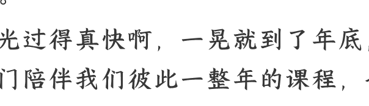

公众号懒人搜索、懒人专属群分享

# 年度收官：从 2025 到 2026 的关键总结和预判 (上)

2025 年 12 月 31 日

整理：公众号懒人搜索，懒人专属群精选

懒人微信：lazyhelper1

欢迎来到《政经参考》，我是马江博。

时光过得真快啊，一晃就到了年底，这门陪伴我们彼此一整年的课程，也悄然走到了尾声，迎来了这一季最后的两节课。

这里由衷地感谢你在这一年里的每一次聆听、每一次思考与每一次同频共振，正是有你的同行，才让这段知识的旅程真正有了意义。

回望即将过去的 2025 年，我们在历史坐标系上经历了时代的洪流和个体的沉浮。因此，这最后的两节，我将以一个“收官专题”结束，我会总结下在 2025 年日益清晰，并将持续影响 2026 年的那些关键趋势，它是总结，也是预判，作为我在今年给你的最后一次叮咛、提醒和建议。这是我的职责，让我们一起，为这一季课程画上一个完美的句号。

## 中美博弈新阶段的预判

我一共总结了十个关键趋势，这节课我们先说前 5 个。

第一个趋势，是关于中美博弈新阶段的预判。

在全球的新周期中，中美关系是最关键的一环。2025 年的中美关税战，最终以特朗普的退缩收场。我认为这意味着，中国已经从之前的被动防守，转向了中美战略相持，同时在某些领域，还可以局部反击。

但 2025 年的中美之间的关税战和科技战，影响巨大，它既让中国看到了外部环境巨大的不确定性和对内部经济的影响，并据此修改了我们在“十五五”规划建议稿中的环境定调；同时也让中国看到了，过去几年中科技突围和战略备份的做法是有效的，我认为这种有效性验证也会加大我们既有的强国叙事和新型举国体制的路径确认，这在“十五五”规划建议稿中也得到了充分地体现。

我目前看，2026 年会是中美相对平静的一年。

从美国来看，明年 11 月，美国将进行中期选举，按照常理来说，特朗普政府不会冒着政治风险，在中期选举前同中国展开激烈的不可控的升级博弈，所以你看今年 10 月底中美敲定的是中美之间的贸易战“休战一年”，我理解这延期的一年，对应的正是美国的中期选举。

而从中国来看，2026 年是“十五五”的开局之年，我们必须要创造一个平稳的外部环境，同时我们也需要时间来构建新的对外贸易链和内部科技链。

我从目前信息来看，明年 5 月，特朗普在美联储主席鲍威尔下台后，大概率会换上倾向自己的新主席，他将会更加方便地掌控美联储，届时特朗普最担忧的美债问题，将很有可能被解决。而美国明年 11 月的中期选举后，如果特朗普在参众两院没有失手，那么手握货币、行政和国会三重加持的特朗普，很可能不会消停。最近的信号是，美国贸易代表办公室已经宣布，对部分中国半导体产品要在 2027 年 6 月再加征关税。

总之，明年中美两国都会加速自己内部的进化，尤其中国的新旧动能转换的加速。双方正在为未来更深层的下一轮博弈，积累更多筹码。

## 构建“安全冗余”的必然

接着说第二个关键趋势，构建“安全冗余”成为共同选择。

今年以来，黄金，以及白银、铜、钯、铂、钨等金属价格均创下了历史新高，我认为背后深层的原因是，各国在拼命构建自己的“安全冗余”，大家已经从过去全球化中的“成本最小化”，转向了现在的“安全最大化”。中国的战略备份、美国的产业回流、欧洲的“战略自主”，都是在建立各自的安全冗余。

根据我的研究，其中产业与资源层面的“物理冗余”，直接驱动了财政扩张，大量财政资金注入市场；而金融与信用层面的“流动性冗余”，则直接驱动了货币扩张。我据此判断，未来十年，大量资产的功能，已经从获得利润和对冲通胀，变为构建基于地缘的资产安全体系。这种安全冗余的构建，一方面将更快推动全球供应链的重组，大家会越来越面对一个“分割化”的全球市场，这对中国的一部分传统贸易，也是冲击；但另一方面，大国博弈下安全冗余的构建，对本国的企业和个人来说，也是巨大的机会。

对中国来说，很多中西部区域和国内新兴产业的发展，就是因为要“重建一套系统”的要求，而获得加速，这就是时代给到的“上车”机会。具体来说，在“安全冗余”之下，东部大省的新科技和新外贸，中西部核心城市承接产业转移和战略备份带来的新产业、新基建和传统基建，以及边境省份的新对外开放桥头堡地位，都是新增量。而不在其中的地区和产业领域，则会面临更大的转型压力。

## 资产和个人应对法则

在前两个大趋势下，资产配置和个人选择，也必须要适应时代的巨变。因此，我们要讲的第三个趋势判断，是新时代的资产逻辑和个人应对法则。我判断，这背后将催生两个全新的投资逻辑：

一方面，不同国家中服务于本国战略目标、被定义为“命脉”的资产，将获得体系内资源的全力支持，从而拥有极高的确定性和成长性。比如在美国体系内的尖端军工、能源和 AI 巨头，以及在中国体系内的半导体和高端制造。

另一方面，则是东西方不同体系间、不被任何一个主权所控制的“桥梁资产”的避险价值在放大，比如黄金。最近一年黄金的走势，印证了我们课程在 3 月和 10 月的判断。当然，这些都是趋势分析，不是具体的投资建议。

总的来说，未来的投资，不仅要看行业、看公司，更要看“阵营”。你需要清晰地判断，你投资的资产，是根植于哪个体系，它在所在体系内的战略地位和未来资源投入可能性如何。这就是我说的，“国家战略配置”。过去全球化的投资逻辑是，哪里收益高就往哪里去，而未来你的资产组合，不再是简单的行业或地域配置，而更多是一场对“国家意志”的跟随。分析一家公司的未来，不是只看它的市盈率、营收增长，更要看它是否被纳入了国家的“战略清单”。

同样，个人也必须建立起自己的“个人冗余”。一方面，在“国家战略配置”这个大背景下，可以尝试发现并投身、投资或者服务于国家战略的押注点，跟上这个战略红利；另一方面，要清醒意识到，这个时代务必要克服侥幸和投机心理，确保一部分保底资产要足够安全。

从趋势角度看，对大多数普通人来说，未来的投资原则，更稳妥的思路是大多时候保证不亏或小赚，然后等待偶尔赶上一次大赚。同时，你也需要有技能的冗余。在产业和技术的急速变化下，单一的旧技能变得异常脆弱，你需要有意识地培养一项或多项“备用技能”或者“备用职业”，并有意识地让自己接触从政策到经济的多元信息，看清底层逻辑，提前建立认知的“冗余”。

前面所有这些，也是新一季课程我要重点跟踪关注的，我会带着你一起研究和应对，一起往前走。

## 新科技及其产业化，成为核心主线

接着我们讲第四个趋势，和科技有关，新科技及其产业化，将成为未来长期的核心主线。

在前面提到的大趋势中，不管是中美博弈，还是构建安全冗余，或是投资逻辑，科技都无疑将是最大的关键词。

以人工智能等为代表的这一轮新科技浪潮，不再局限于提升效率，而是在重新定义“生产力”本身，它们不仅是创造新财富的引擎，更是重新定义大国秩序、新旧产业和财富结构的关键因素。

我在本季课程的第四节就跟你说过，2025 年中国的关键必然是以科技为核心的新质生产力，而今年不管是政策投入、产业发展还是股市表现，都印证了我们年初的判断。

而更关键的信号，则来自“十五五”规划建议稿。这份关键规划，确认了两件事：第一，是中国未来五年的某种意义上不计成本的“科技强攻”，要基本解决“卡脖子”问题；第二，则是未来五年强调了从科研到科创的科技产业化，强调了在新型举国体制下市场和民营企业的作用。

而最近的中央经济工作会议，则突出了将科技资源，向京津冀、长三角、粤港澳大湾区集中，除了这些地区，我认为次一级的，就剩成渝了。而这些地区，尤其是上海和北京周边的城市，将迎来“科技扩散红利”。

我综合判断，未来，也会是国家资源和强势区域结合在一起，强推科技创新的时代。最近典型的注脚，是在 12 月 26 日，由国家发改委、财政部推动设立的国家创业投资引导基金（以下简称引导基金）的启动仪式在北京举行。官方报道说，这是发展创业投资、壮大耐心资本的重要举措。而引导基金已经出资，成立京津冀、长三角、粤港澳大湾区 3 只区域基金，这 3 只区域基金已经在集成电路、量子科技、生物医药、脑机接口、航空航天等领域签署了一批意向子基金和直投项目。

总之，科技将成为未来五年的关键力量和最大资源投入领域，重塑中国的城市、产业，并成为未来财富周期的核心主线。

这里我还是要再提下说过很多次的官方定义的“国家战略人才力量”，也就是从战略科学家、科技领军人才、卓越工程师，到大国工匠、高技能人才，这五个以科技产业为核心的人才链条，我认为这是未来 20 年最大的造富新贵群体。

趋势已经显现，我们个体能够改变的空间很有限，我认为与其纠结为什么别的群体被弱化了，不如把精力放在确定性更强的方向上，努力向它靠近。我的建议依然是：投身新理工科，投入新科技企业，投资新科技产业，在最大的趋势中，寻找确定性。这部分在 2026 年将会有越来越多的结构性分化和新机会，我也会在新一季密切跟踪提醒。

## 明年股市怎么走？

结尾，基于前面这些背景，我们再谈一谈股市的大趋势，这也是我们这节课要谈的最后一个趋势。

在当前楼市萎靡的情况下，2025 年，股市成为稳预期的关键抓手，而且我认为运用得很成功。2025 年，“国家叙事”或者说“国家队叙事”，加上“科技叙事”，成为了主线。关于股市很多人喜欢说是“政策市”，但我认为现在政策二字不够了，更准确的说法应该是“政治市”，这才是要看清的关键。

而我研究下来，2026 年的股市，有几个因素你可以重点关注。

- 第一，预期检验期的到来。2026 年 -2027 年，我认为会是一个关键的“预期检验期”，2025 年有很多公司股票实现了大幅增长，这是在前面我们提到的那么多大背景下，市场强预期的“估值驱动”，而不是“基本面驱动”，但我认为未来 1-2 年会进入检验期，没有基本面支撑的一些科技股，可能会面临回调。
- 第二，强国叙事下的科技突围。虽然有“检验期”，但强国叙事下的科技叙事，在 2026 年还会继续，只是会结构性分化，一些高估值企业可能会变得更脆弱一些，而国产科创的浪潮会进一步向“商业化”聚焦，真正有科技突破能力和产业化、商业化能力的企业，会受到政策和股市的双重支持，股市为硬科技突围和产业化输血的大逻辑我认为会继续。
- 第三，国家队叙事。我综合判断，“国家队叙事”也会继续，稳预期要求下，国家队出手与“指数”相关的各类资产，包括各类 ETF，以及总股本大、影响指数大的权重股，业绩好、高成长的白马股，规模大、地位稳的行业龙头蓝筹股的大基调，依然不会变。
- 第四，一个重要的场外因素。在美联储降息和美联储主席换人的情况下，我认为明年大概率是一个弱美元的全球货币环境，这种情况下，境外市场的资产更容易涨，而国内股市的一些资金，容易在明年抛弃高风险资产，转向境内外的稳健资产。

总的来说，我认为明年的股市，大致会在这四股力量之间反复拉扯，你要考虑的，既有大方向，也有市场节奏。新一季课程，与资本市场相关的信号，我也会及时跟踪研判。

好，今天的内容就到这里。剩下的总结和研判，我们明天最后一节课说。

欢迎你把《政经参考》转发推荐给更多人，让我们一起聚焦政经，举重若轻。我是马江博，最后一期见。

## 最后，安利小懒的付费群：

### 懒人专属群（介绍）

这里是你对抗信息过载的护城河。已稳定运行 6 年，累计拆解、研读 3000+ 个互联网商业实战案例与行业前沿内参和时政/宏观文章。

我们不搬运垃圾，只做高价值信息的筛选器与放大镜。

### 懒人专属群更新记录：

https://hk57gvlx7u.feishu.cn/docx/H0kRdZbSbolBR0xkaXtcuVE0nTg

### 懒人专属群更新记录（需梯子，备用）:

https://lazybook.fun/blog/record2

【免责声明】本资料归档于社群内部知识库，仅供成员课题研究与学术交流，请在查阅后 24 小时内删除。