## 生财 AI 宝典

万事用 AI
让 AI 成为每个人的超能力

生财有术 出品
公众号懒人搜索，懒人专属群分享

### 找项目，做副业，学 AI
#### 来生财有术
和 30000+ 实战派同行
在 AI 时代更有选择权

- 职场不稳定，想找一个靠谱的副业项目？
- 行动力不够，想跟着过来人下场实操？
- 业务想转型，想看看新的项目机会？
- 创业太孤单，想拓展信息和人脉？
- 为 AI 焦虑，想提升 AI 技能和认知？
- ......

这些问题，生财有术都有答案
公众号懒人搜索，懒人专属群分享

### 生财的核心权益

**实战派内容：抓住信息差，跟着过来人**
- 1000+ 篇精选实操帖，跟着过来人经验，快速起步少踩坑
- 创始人亦仁发布 50+ 个超级机会，情报小组精选 100+ 项目红利，会员发布 10000+ 条赚钱风向标
- 各个垂直小组精选信息，AI、出海、IP、小红书等主题一站查阅

**实战训练营：高手带队，组团实操**
- 每年举办 4 - 5 场大型航海训练营，每次 15 - 20 个前沿项目选题
- 持续加码 AI 方向（AI 编程、AIGC、AI 工作流），带你掌握 AI 时代最实际的赚钱技能
- 高手直播分享，助教群内答疑，实时更新的一线操作项目手册
- 和 10000+ 人一起下场实战，保证金机制督促你行动


公众号懒人搜索，懒人专属群分享

#### 线下链接局：链接同行者，搞钱不孤单
每周几十场同城搞钱交流群，拓展信息，链接高手

过去半年，圈友自发组织了近 300 场 AI 主题线下学习局，生财 AI 同城学习圈也即将上线
每年几场线下主题大会，感受生财能量场


### 生财的实力
9 年口碑见证 累计有 74000+ 位付费会员 多年平均续费率 65%+
在知识星球上万个社群中 被评为实力榜 TOP1
前沿的拥抱 AI 的社群 产品深度融入 AI，同时发起 生财 AI 实验室，AI 传师俱乐部


### 生财有术 | AI 问答助手
基于社区 10 万 + 优质内容 为您提供专业的商业洞察和实战经验
输入你的问题，探索商业智慧

### 亦仁：生财要如何带着大家 All in AI

过去这一年，我们做了很多别人不理解的事。

很多人问我：“生财已经第九年了，你也已经财务自由了，为什么你还花这么多时间、投入这么多精力，推动生财转型，带领着大家 All in AI，这么做，值得吗？必须吗？”

我的答案是：值得，而且必须。

生财有术的使命是帮助普通人建立属于自己的事业。

过去，信息差、认知、资源、背景、人脉、能力决定了一个人能走多远，能赚多少钱。

但在 AI 时代，我亲身感受到：智力上的差距被拉平，能力被重新定义，机会被重新分配，这是一个巨大的弯道超车的机会。

趁着很多人还没反应过来，我必须带着圈友尽快往前赶。只要愿意学习、愿意动手，任何人都能用 AI 突破边界，创造出超出想象的价值。

而生财要做的，就是成为 AI 时代的引路人，让更多普通人看见机会、抓住机会、兑现机会。我们不研究怎么搞 AI 大模型，但我们是 AI 时代的实战派、行动派、务实派。

### 一、我对 AI 的 4 次 Aha moment

第一次 Aha moment：当我连续深度使用 ChatGPT 一周后，我发现我的 AI 使用时长已经超过了微信。

那一刻我突然意识到：AI 不只是个工具，而是我的一个“超级大脑”。

我开始习惯于“万事问 AI"，无论是写文章、思考生财的战略、甚至我的各种人生困惑，几乎都能和它聊的很清楚。

那种可以借助最顶级智力的感觉，让我第一次觉得：没有想不明白的问题，只有问不出来的问题。

第二次 Aha moment：当我看到圈友上传到 YouTube 那些“看起来很一般”的 AI 视频，居然能拿到上亿播放，几千美金。我甚至点进去看了几条，全是 AI 生成的视频，剪辑很简单，配音很简单，剧情很简单，就这也能有上亿播放。

我发了一条朋友圈：真正 AI 视频赚大钱的时代还没到来，AI 视频被我们远远低估了。

随着 AI 生成视频的能力越来越强，未来我们必然能够产出几分钟、几十分钟非常精彩的 AI 电影，靠想象力、靠创意做出视频赚钱的时代必然会到来，在这个时代来临之前，我们需要确保在场。

#### 第三次 Aha moment：当我定制了一条 n8n 工作流，看它自动串联起十几个平台、用几分钟完成原本需要一整天的工作。

我有种震撼：这不是辅助人，而是“替代”人，不仅替代，而且干的比人还好。

24 小时，极度聪明，从不喊累，只要工作流串联的足够好，就可以帮你拿到结果，甚至帮你赚到钱。未来不是人和人的竞争，而是“人+AI"和“人”的竞争，毫无疑问，后者被秒杀。

其实这样的事情已经在发生，只是很可能藏着后面，你甚至察觉不到对面的竞争对手是 AI，这才是真正可怕的地方。

#### 第四次 Aha moment：当我跟着小排，用 Claude Code 自己动手做出几个小产品后。

我第一次感觉：我强得可怕，我有一种强烈的自由呼吸的感觉。

我相信每一个像我这种不懂技术的人，做出一个稍微有点复杂度的产品后，都会有这样的感受。我们不缺创意，不缺 idea，不缺执行力，不缺推广思路，但很多时候缺一个“程序员”。哪怕像我这样有产品技术团队的人，我仍然觉得无需深入沟通就能拿到自己想要的巨大自由。

如果和 ChatGPT 深入讨论问题给了我智慧，那么学了 AI 编程之后，就是让我具备了超能力。借助 AI 编程，我可以几乎实现任何我想做的产品，无非是快慢而已。

我意识到，AI 编程不是“程序员的事”，而是未来每个人的必修课。

我在公司开玩笑说，再过几年，不懂 AI 编程，就像互联网时代不会基本的写作和表达一样，已经失去了上牌桌的机会。

### 二、AI 对大多数圈友的机会，集中在 4 个确定性方向

这四个瞬间，让我真正看清——AI 对生财有术的大多数普通人的机会，可能集中在 4 个确定性方向。

- 通过做 AI 视频，理解 AIGC 的底层逻辑，学会了 AI 视频，就理解了怎么写提示词，怎么文生图，怎么图生视频；
- 通过做 AI 产品，掌握 AI 编程与产品化能力，这是一个各种长尾细分需求都可以被充分满足的时代；
- 通过学习 AI 工作流，为 AI Agent 做准备，Agent 不是替代工具，而是要替代几万亿的劳动力市场。而 Agent 的前一步是 AI 工作流；
- 通过将 AI 深度融入业务，AI+ 各个行业，AI+IP，AI+ 电商，AI+ 同城实体，AI+ 流量获客等，借助 AI 驱动增长。

过去一年，生财围绕这条路径，也发布了 9 条 AI 超级标。

- 2024 年 10 月 超级标 01 AI 自媒体
- 2024 年 10 月 超级标 02 YouTube AI Shorts
- 2024 年 11 月 超级标 03 AI SaaS 应用
- 2025 年 02 月 超级标 04 AI 开发 iOS 应用
- 2025 年 02 月 超级标 05 AI 服务
- 2025 年 06 月 超级标 06 AI 图像革命
- 2025 年 06 月 超级标 08 YouTube AI 中长视频
- 2025 年 08 月 超级标 11 n8n 自动化工作流
- 2025 年 11 月 超级标 12 AI 工作流定制

这些超级标也形成了完整的 AI 航海体系。

| 航海月份 | AIGC (内容生产) | | AI 编程 (产品开发) | | | AI 工作流 (流程与自动化) | | AI 应用 (产品与场景) | |
| :--- | :--- | :--- | :--- | :--- | :--- | :--- | :--- | :--- | :--- |
| | AI 短文 | AI 视频 | AI 编程 | AI Web | AI APP | AI 工作流 | AI Agent | AI 自媒体 | AI 电商 |
| 2024 年 10 月 | AI 写作 | YouTube AI Shorts | Cursor 入门 | | | Coze/vj 工作流 | | 公众号爆文自动化 | AI 数字人 (视频等等) |
| 2025 年 11 月 | AI 小说 Descript 入门 | YouTube AI Shorts | | AI Web 网站 | AI CG 应用 | | | AI 自媒体 AI 漫画 IP | AI 跨境电商 |
| 2025 年 04 月 | AI 智能写作 AI 可视化 | AI 视频制作 YouTube AI Shorts AI 智能视频工厂 数字化 | MCP 入门 | AI Web 网站 | AI CG 应用 | AI 工作流 AI 知识管理 | | AI 自媒体 AI 数字 IP 定制 AI 数字人 (口播 IP) | AI 自媒体 AI 数字 IP | AI 漫画 IP | |
| 2025 年 08 月 | AI 智能运营 i 小说 | AI 视频制作 YouTube AI 视频 (中长短视频) | Claude Code 编程助手 | AI Web 网站 (工具站) AI Web 网站 (图片生成站) AI Web 网站 (音乐站) | AI CG 应用 | n8n 自动化工作流 Coze+ 本地系统工作流 | 内部工厂 AI Agent | AI 自媒体 (小红书) AI 自媒体 (B 站/IP) AI 电商 (无货源) | AI 制作小红书虚拟产品 |

如果你仔细看这张表格，会发现我们的航海的发展方向，从文字到视频，从编程学习到开始开发细分产品，从学习简单的工作流到逐步切入到 Agent，从 AI 的初级应用但深入到业务中去，这也将是接下来航海的重点方向。在航海的基础上，我们和@刘小排合作开发了 AI 产品出海课程《Idea to Business：用 AI 编程，兑现你的创意》；和@Gary 方波妮合作了 YouTube AI 视频课程《用 AI 视频能力，制作爆款视频，获取 YouTube 广告费分成》。

这些课程目前正带着近 3000 位圈友持续深耕，大家在星球也能陆续看到他们的生财好事分享和报喜。

随着大家的持续深耕，以及我们的持续邀请，很多圈友会来生财分享他们 AI 的实战经验和总结，到现在累计产生了 10000+AI 相关内容，其中 750 多篇精华帖。生财精华帖的质量，不言而喻。


背后还有很多其他探索和尝试，比如：

- SCAI 实验室的杭州站与北京站相继开放，提供 AI 产品创业者线下孵化空间，已有成员的产品进入融资阶段。
- 2025 年我们联动小红书官方，组织独立开发者参与小红书开发者 AI 比赛；9 月底我们联动飞书官方，带领更多人了解和学习飞书 AI 产品。
- 我们组织了两场航海家 AI 大会，到场的人都觉得非常震撼，原来 AI 还可以这么用；明年 3 月还会有第三场。
- 生财团队内部鼓励全员学习 AI 编程，各自开发相关产品功能。
- 过去这半年，我们进一步推动线下活动，圈友们自发组织了近 300 场 AI 相关的线下交流局。

公众号懒人搜索，懒人专属群分享

### 三、接下来，生财准备如何用 AI 赋能圈友？

生财 All in AI 战略已经看到成效，接下来我们会继续沉淀、加码。比如这些

1. 生财 AI 问答助手上线
有人说生财有术是中文 TOP1 搞钱社区，沉淀了大量创业、副业、赚钱相关的内容。基于生财过往以及持续更新的 10 万 + 内容，我们会在 11 月份上线 AI 问答助手，把生财官网真正打造成为创业领域的第一搜索引擎，降低圈友的信息获取成本。

同事问我，“这个 AI 问答功能要不要收点费用，如果全面开放出来每年要额外支付不少 token 成本，也是一笔不小的开销。”

我说，先让大家用起来再说，只要真的有价值，大家经常用，且到时候真的我们承担的成本太高，那我们对用的多的圈友，每个月收个几十块钱工具使用费，大家也会支持的。

#### 2、生财 AI 宝典上线

我们上线了《生财 AI 宝典》，也就是大家手里拿到的这本。希望一本书让你用半天时间学习，就可以快速跟上趋势，了解如何用好 AI 的实战宝典。

战略不是口号，而是把点连成线，在一个正确的方向上，持续地、笃定地前行。

过去一年，生财 All in AI 就是这么走过来的，从迷茫到路线清晰到越来越有信心。

现在我可以很骄傲地说：这帮生财的，AI 用的是真牛逼。不过，这一切才刚刚开始，对吧？


# 认知篇:
# 生财有术在 AI 领域看到的 3 个
超级机会

# AIGC

- 亦仁：为什么 AIGC 是超级机会？01
- Gary：YouTube AI 内容出海，把全球第一的视频平台变成自己的金矿 05
- 代一：AI 赋能视频号，如何通过账号矩阵实现月入 3 万 19
- 刘智行：用 AI 赋能垂直小号，打造出 20 个爆款赛道账号 38

# AI 产品

- 亦仁：为什么 AI 产品是超级机会？55
- 刘小排：AI 编程赛道第一课：Build a business,not an App 58
- 阿彪：AI 产品出海如何高效系统化地获取流量 64
- 钱塘江鲤：如何用 AI 编程搭建自己的内容工厂？73
- 王马扎：海外 AI 产品新手，4 个月赚到 1 刀，15 天破 1000 刀 80

# AI 工作流

- 亦仁：为什么 AI 工作流是超级机会？101
- 国平：AI+ 私域精细自动化运营的顶层设计 106
- 李香君：用好 n8n：一个人活成一支队伍 114
- 包子：用 AI+RPA 打开 IP 增长的第二曲线 122
- 陈亮：用 AI 改造业务的 2 年实战：从替代 30 人审核团队到支撑 50 国运营 131

# 实战篇:
# 生财有术的高手都是如何用 AI 的？

- 亦仁：我是如何用 AI 的 138
- 刘小排：万事用 AI 的心法 141
- 玉伯：AI 时代，创作如何保有人味 144
- 吴鲁加：不停止提问，不止于提问 149
- 钱塘江鲤：我是如何使用 AI 在不同场景 N 倍提效的 151
- 袋鼠帝：裸辞近两年，我是怎么靠 AI 活下来的 162
- Orange：AI 时代场景越小，机会越大 165
- 良辰美：靠 AI 上线几百个网站，从电商卖家变成全栈开发者 169
- 包子：AI 不是工具，是我的全能团队 173
- 苍何：我如何用 AI 打造一整套创作系统 178
- 杨涛：16 个可以问的 AI 相关问题 181
- 富贵：AI 时代，人人都有枪，就等于人人都没枪 185
- 老黄牛：不要用 AI 优化传统的工作，而是重构流程 189
- 明白：AI 时代新的学习方法是走一步看一步 194
- 焦波：如何使用 Obsidian+Claude Code 打造知识库系统 199
- 兔老师：如何把 AI 融入学，一个大学老师的 AI 使用手册 204
- 书虫：从个人到创始人转型，如何深度用 AI 207
- 大潘：如何靠 AI 做出一款 App，一文告诉你用到所有工具 212
- 唤山：普通人的 AI 实战——用“抠门”和“偷懒”倒逼出的效率神器 217
- 叁斤：我的小红书变现体系都被 AI 覆盖了 220
- 令狐峰：一个产品技术型老板用 AI 的日常 223
- 来来：电商设计，如何用 AI 这个“超级员工”帮我自动赚钱 226
- 马小帅：AI 工作流应该是人定灵魂，AI 造肉身 231
- 阿西：海外 AI 自媒体博主，如何用 AI 提效内容创作 234
- 星城：做出海业务，我日常是怎么用 AI 的？239

# 共创篇:
### 100 个生财有术圈友是如何用 AI 的？

- 亦仁：给生财团队的 AI 学习指南 246
- 万事用 AI 的圈友案例共创分享 248

特别说明：以下内容中提及的 AI 工具与功能均具有阶段性和时效性，实际效果可能因版本更新、使用场景差异而有所不同，建议结合自身情况灵活参考与验证。

### 认知篇
#### 生财有术在 AI 领域看到的 3 个超级机会

### “AIGC”
###### 亦仁：为什么 AIGC 是超级机会？

用 AI 来生成文字、图片、音频、视频、数字人甚至直播，在这当中，我认为，现在空间最大的、有巨大上升潜力的是 AI 生成视频。

通过做 AI 视频，理解 AI 生成内容 (AIGC) 的底层逻辑。学会了 AI 视频，就理解了怎么写提示词，怎么文生图，怎么图生视频。

我们从去年开始带着大家借助 AI 做 YouTube 视频就是往这个方向突破。目前星球有很多人跟着做并且赚到钱，有几个圈友已经实现月入过万美金。

1. AI 做视频的速度，已经从“小时级”变成了“分钟级”，且质量越来越好

截止 25 年 6 月 AI 视频相关工具不断升级：

1) Gemini 2.5 Pro (Google AI Studio)
支持对 YouTube 视频逐帧拆解，自动生成脚本、分析节奏、倒推提示词，大大降低了“爆款拆解”和“结构模仿”的门槛；

2) Google Veo3
5 月底上线后，因其出色的音画融合和拟真效果，在全球引爆，催生了一系列“穿越 Vlog”“野人 Vlog”“不可能的 ASMR"爆款内容，让 AI 视频第一次模糊了现实与虚拟的边界；

3) 即梦（豆包）/GPT/Flux Kontext
三款图像生成工具各有风格，但都支持自然语言 + 垫图精准控制，解决了 AI 视频“可控性差”的老问题；

4) 即梦 3.0 Pro/可灵 2.1 大师版
当前综合表现最强的视频生成工具，兼顾画质和动作控制，能做出人物灵动、镜头精准的中长视频，真正具备“能跑频道”的能力；

5) Midjourney V7 (MJ)
虽然不够可控，但在画面质感和美术风格上依旧独一档，已经成为高质量 AI 视频的基础设施之一；

6) Coze（扣子）/n8n/影刀等自动化工具
一旦内容结构确定，结合自动化可以批量产出，圈友实测，一个人日产几百条视频已经成了常规操作。

越来越多的 AI 工具让做出高质量的视频越来越简单，而且还会越来越更简单。

我有一个朋友，做 TikTok 投流卖货业务，他们现在用 AI 生产的视频素材，质量已经远超他们找真人拍的，而且成本几乎为 0。

2. YouTube Shorts 短视频可以练手，但 YouTube 平台中长视频才是我们未来获取收益的主战场。以同样 200 万播放为例，短视频的收益在$200 左右，但是长视频的收益接近$3885.37。

3. 真正让人惊讶的其实是一线的数据和榜单。如果大家细心去看的话，YouTube 各类榜单上 AI 视频的占比逐渐增加，大家感兴趣不妨看看这份野兽先生的 YouTube 数据榜单，近 7 天有多少是 AI 生成的？

我给大家举几个我看到的例子：

1) 山海经题材的 AI 视频登上 YouTube 月榜前十，单条播放 5300 万，即便按最低 RPM=1 算，也有 5 万美金以上收益；
2) 达人秀类 AI 频道，半年累积 2600 万播放，也有近 4 万美金收益；
3) Veo3 做的 Bigfoot Vlog，两周就拿下几百万播放，收益几千美金起。

公众号懒人搜索，懒人专属群分享

### “AIGC”

###### Gary: YouTube AI 内容出海
把全球第一的视频平台变成自己的金矿？

@Gary
生财 YouTube 深海圈总教练
带 400+ 圈友斩获近 200 亿播放

####### 一、为什么在 YouTube 做 AI 内容出海

我叫 Gary，是生财 YouTube 深海圈的总教练。生财一年级晚辈，今年写了 9 篇精华帖，可能是最懂 YouTube AI 内容的人，我们在今天，可能已经成为了全国最大的 YouTube AI 社群。

这篇分享带大家看一下 YouTube+AI 内容出海的价值，也分享我们打磨出的一套可行的 AI 视频爆款方法论。

######## 1. 亦仁发布的 YouTube 超级标，超级在哪？

2023 年 10 月 25 日，我加入了生财。特别巧，10 月 24 日，亦仁哥发布了“超级标”：AI 生成视频，上传到 YouTube 获得广告分成。我当时看到这个消息，第一个反应是：YouTube 这东西到底能不能搞？作为一个没有了解过这个平台和 AI 的人，我该怎么做？


今天，我就来给当时的我，也给在座的各位一个答案。作为超级个体的战场，YouTube 有四个“超”的地方：超大体量、超额收益、超低门槛和超级增量。


**超大体量：** 左边的数据是月活排行，YouTube 以 27 亿的月活，在全球各大视频平台里排名第一。TikTok 加上抖音，月活大概是 20 亿，比 YouTube 还差几个亿。右边的数据是 YouTube 和 TikTok 的总营收对比，YouTube 去年有 361 亿美元的广告收入，比 TikTok 多了 1.5 倍。


**超级增量：** 如果你在 YouTube 上搜索“猫”和“狗”这两个超级热门的词条，按月度播放量排序，你会发现全是 AI 视频，已经看不到真猫真狗了。在很多赛道里，AI 正在占领 YouTube 的内容生态，未来至少会有一半甚至更多的内容被 AI 占领。

右边的图是微信指数，“TikTok”的指数是“油管”的 10 倍，“跨境电商”是“油管”的 30-50 倍。这说明什么？

“油管”这个概念，在国内是完全没有普及开的，还是一个非常小众的市场。而这个小众，对比起前面巨大的平台体量，对于我们创作者和广告主来说，就意味着巨大的渠道级增量。

**超额收益：** YouTube 是所有平台里，唯一一个把创作者广告分成模式写得清楚的，它会把 55% 左右的广告收益直接分给创作者。

李子柒复出的那条视频，在国内 B 站有 3200 万播放，预估创作激励收益是 3.2 万人民币。而在 YouTube，这条视频 2600 万播放，保守估计的广告分成是 5.2 万美元。中间差了整整 11 倍。

在给创作者分钱这方面，YouTube 非常慷慨，这条收益路径也有十多年历史，规模大而稳定。

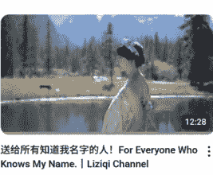
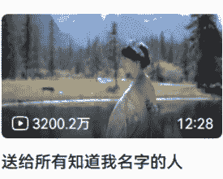

YouTube 2600 万播放
B 站 3200 万播放

**超低门槛：** 也许很多人还认为 YouTube 是个以中长视频为主、高质量内容才能获得流量的传统内容平台，但实际上很多爆款内容，仅仅只是非常简单的 AI 视频。


案例 1：左边这条简单到离谱的短视频，在今年 8 月份的 YouTube 短视频总榜上排名第一，5.6 亿播放。它做出来可能只需要 5 秒钟，广告分成保守估计在 3000 美金以上。

案例 2：右边这条更离谱的 AI MV 长视频《Party Tunes》，登顶了今年的半年榜，1.4 亿播放，广告分成高达 14 万美金，差不多 100 万人民币。而它就是一个没有剧情、没有字幕、没有任何复杂动作的简单 AI MV，制作起来也非常简单。

听到这里，肯定有人要问：YouTube 真的这么好做吗？我作为一个不会做视频的普通人，能做吗？

今年 3 月 30 号的航海家大会，刘小排老师说了一句我印象非常深刻的话：顶级蓝海就是满级大佬屠杀新手村。

去年，我没有任何短视频运营经验，11 月 8 号开始发第一条 AI 视频，11 月 19 号就做出了第一条千万播放的爆款，很简单的视频，收益大概 1200 美金。我明明不是大佬，但好像屠杀了新手村，我当时第一反应是：怎么回事？好像比想象的简单很多？

####### 二、AI 做爆款，1-100 的方法论

今天，我不是要教大家怎么从 0 到 1 做 AI 视频，我要分享的是怎么从 1 做到 100。我把“从 0 到 1"定义为做出一个爆款，那么“从 1 到 100"，我定义为做出 1000 个爆款。

如果一个爆款是 200 美金，那么 1000 个就是 20 万美金，这能够算是从 1 到 100 吧？而我们上次问卷统计下来，我们有超过 40 万美金的收益，这意味着实际上超过了 1000 个爆款，所以我应该是有做这个分享的资格。

######## 1. 爆款=好形式*好内容，1000 个爆款=40 种好形式*25 个好脚本

怎么做 1000 个爆款？我有一个专门为这次大会创造的说法：

做爆款，就是跟观众谈恋爱。

谈恋爱很简单，无非就是两点：好看的皮囊 + 有趣的灵魂。对应到爆款内容，也是一样：好的形式 (皮囊) + 好的脚本 (灵魂)。

######## 2. 找形式就是找到“观众爱看的皮囊”

怎么找到观众都喜欢看的“好形式”？其实就是抓需求。

**工具一：Google Trends (谷歌趋势)**

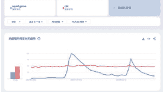
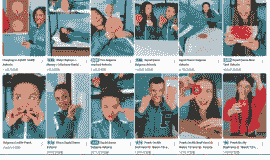

这里有一个专门的选项，可以查看 YouTube 的搜索趋势。这个例子是“鱿鱼游戏”，可以看到在剧集上线的两个时间点，它的搜索热度远超“猫”这个超级大类。这意味着，当时这个赛道有巨大的观众需求。这个千万订阅博主 5 月提前布局鱿鱼游戏，6 月狂揽几十亿播放，而后文会提到，我们的圈友同样吃到了这波流量。

**工具二：YouTube 站内搜索**

方法非常简单。你先搜索一个词，比如“鱿鱼游戏”，然后用筛选功能，选择“本周”“按观看次数排序”。看看结果里有多少个千万级播放的爆款，你就大概知道这个赛道的热度了。


直接用被验证过的“好皮囊”

- 1) 在 YouTube 上“百看不腻”的好皮囊
  - 卡通动物形象：比如猫猫护士、狗狗警察。
  - 影视 IP：比如钢铁侠、蜘蛛侠等漫威形象。
  - 动漫 IP：比如七龙珠、宫崎骏系列。
  - 体育明星：梅西、C 罗、内马尔，这几个名字在 YouTube 流量超级大。
  - 地方特色：比如你做一个印度脸，印度人就非常爱看。
- 2) 在 YouTube 上最近流行，有周期性的好皮囊
  - 网络流行元素 (Meme 梗图)：比如近期很火的"Labubu”“美国山海经”等。
  - 时下爆火的影视 IP：K-Pop 猎魔女团、星期三、鱿鱼游戏等。


这三个视频，看起来完全不一样，一个主角是 C 罗梅西，一个是“K-Pop 猎魔女团”，一个是猫咪。但实际上，它们讲的是一模一样的故事：A 在飞机上出事了，B 去把他救了下来。

这说明一个被我们验证过无数次的规律：

只要你的脚本 (灵魂) 是吸引人的，换不同的形式 (皮囊)，它依然能爆。


我们还能再进一步，对“皮囊”进行“整容”。这不是简单的换角色，而是“去泰国做个变性手术”级别的改造，让观众看不出来。这几条视频，都是从一条真人爆款故事延伸出来的，其中大臣这条 9000 万播放，其他几条从几百万到千万不等，故事都是同一个，但换了人物、场景、IP、画风，都不影响它再次成为爆款。

通过“换皮囊”+“皮囊整容”，一个好脚本，你至少能做出 40 种以上的好形式。

######## 3. 好脚本让观众放弃思考

怎么才能做出让观众一瞬间沉浸其中、失去思考能力的“好灵魂”？关键在于同时调动观众的逻辑脑 (左脑) 和情绪脑 (右脑)。攻击逻辑脑：唯快不破！

给大家分享一条视频 1.5 亿播放的爆款的剧本结构：

**欲望出现，情绪产生：** 孩子想要一个帽子 (欲望)，但妈妈买不起，妈妈破旧的衣服已经说明了妈妈是没钱的，但孩子很任性 (情绪)。

**欲望落空，情绪激化：** 妈妈用西瓜做了个帽子，孩子嫌弃地扔掉了，特别是西瓜扔到地上那个镜头给了个特写，很心痛。

**欲望实现，代价出现，情绪再次激化：** 妈妈用自己的头发换了钱，给孩子买了真帽子，欲望看似实现了，但风吹过，妈妈头发没了，这是代价，这不是孩子希望看到的。

**损失强化，情绪爆发：** 孩子看到妈妈没了头发，震惊，闪回妈妈用头发换帽子的片段，配合音乐把情绪推到了高潮。

**情绪升华：** 这个故事结尾是大团圆，也不用解释了。


- ① 任性孩子问穷妈妈要帽子
- ② 妈妈给孩子用西瓜做了个帽子
- ③ 孩子嫌弃地扔掉了西瓜
- ④ 妈妈看到了路边卖帽子但没钱
- ⑤ 妈妈把帽子送给了孩子
- ⑥ 风吹过妈妈的头巾，头发没了，孩子震惊
- ⑦ 原来是妈妈卖掉了头发换帽子
- ⑧ 孩子把帽子给妈妈，自己戴西瓜

有句小学语文课学的名句：所谓悲剧，就是把美好的东西亲手打碎。

人类都有损失厌恶的倾向，损失 100 块需要获得 300 块才能抵消负面情绪，放在视频里，就是要跟观众的期望反着来，所以这样对于情绪的冲击才足够强烈。可以看看是不是在每个剧情的转折点，都反着观众的期望来？

我们来拆解下这个爆款框架：
1) 前三秒交代主线，制造冲突，留住用户。
2) 一到两秒的快速切镜，不给观众思考剧情合理性的时间。
3) 每个镜头都在推进剧情主线，没有多余镜头、不传递多余信息。
4) 重点突出，哪怕看起来简陋粗糙，任何地区、任何语言的人都能看懂。
5) 频繁制造冲突和感官冲击。

######## 4. 做 AI 视频，一定不要去对标 AI 视频，要去对标真人博主

怎么找到更多这样的好脚本？我有一个核心观点：做 AI 视频，一定不要去对标 AI 视频，要去对标真人博主。

为什么？因为 AI 视频才发展了一年，还处在抖音、快手早期的“海草舞”、“社会摇”阶段。现在很多爆款 AI 视频能火，不是因为它质量好，仅仅只是因为赛道还蓝海，做的不够多，整体质量低，所以很多并不优质的内容，也能成为爆款。

但真人短视频已经卷了七八年了，能卷出来的爆款，其脚本质量、情绪调度，都比现在的 AI 脚本要好得多。

所以，你应该去各种真人博主的频道里找那些被验证过的、能引发强烈情感共鸣的真人爆款视频，借鉴他们的脚本。

######## 5. 好脚本是资产，不断让好脚本迭代

好脚本是资产，找到一个好脚本后，只做一遍可太奢侈了。把它解构一下，内核升维，就能实现脚本的裂变。

听起来很抽象对吧？我们来看看案例，再用下 1.5 亿爆款的这个脚本框架。

我们抽象一点，就套用一下前面的理论，把它变成欲望和情绪两个支点构成的结构。


**代价交换类脚本**

- 欲望出现，情绪产生 ➔ 要帽子，买不起
- 欲望落空，情绪激动 ➔ 做了西瓜帽，被扔掉
- 欲望实现，代价出现，情绪再次激动 ➔ 帽子有了，头发没了
- 损失强化，情绪爆发 ➔ 卖头发、换帽子
- 情绪升华 ➔ 相互体谅，大团圆结局

现在，大家一起来共创，我们保持这个提炼出来的结构，改一改内容：

**我们来按这个模版改一改**

- 欲望出现，情绪产生 ➔ 要苹果手机，买不起
- 欲望落空，情绪激动 ➔ 做了个纸筒电话，被扔掉
- 欲望实现，代价出现，情绪再次激活 ➔ 打工赚钱，买了手机，遭遇车祸
- 代价强化，情绪爆发 ➔ 用纸筒电话找到了尸体
- 情绪升华 ➔ 用纸筒电话表达爱意和后悔

这个脚本也爆了，这个就是博主自己又做的视频。

再改一改。

| 欲望：身外之物、希望得到之物<br>代价：珍贵之物、恐惧失去之物 | 欲望：身外之物、希望得到之物<br>代价：珍贵之物、恐惧失去之物 |
| :--- | :--- |
| 欲望出现，情绪产生 ➔ 要 PS5，买不起<br>欲望落空，情绪激动 ➔ 做了个假 PS5，被扔掉<br>欲望实现，代价出现，二次激活 ➔ PS5 赚到了，人没了<br>代价强化，情绪爆发 ➔ 在天之灵送来 PS5<br>情绪升华 ➔ 在骨灰罐子前痛哭 | 欲望出现，情绪产生 ➔ 要 PS5，买不起<br>欲望落空，情绪激动 ➔ 做了个假 PS5，被扔掉<br>欲望实现，代价出现，二次激活 ➔ PS5 赚到了，人没了<br>代价强化，情绪爆发 ➔ 在天之灵送来 PS5<br>情绪升华 ➔ 在骨灰罐子前痛哭 |

一个脚本内核，通过替换不同的欲望、代价和情感载体，就可以衍生出无数个版本，这个比简单换个角色、换个场景的拓展性强多了。

######## 6. 我们是怎么做视频的

好了，最重要的部分已经讲完了，剩下的视频制作这个环节，现在已经太简单了，大家开发出来的工具就足够提高一大截生产力了，我只做简单梳理，让大家看看我们是怎么做视频的。

**脚本提取：** 用 Google AI Studio，把对标视频链接扔进去，一两分钟就能提炼出脚本和提示词，人只需要参与审核和有问题地方的修改。

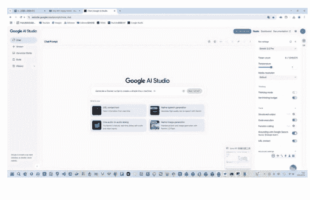

**图片生成：** 我们用 API 比较多，但 RPA 和 Agent 现在也可以用。用圈友制作的工具，把垫图和整套提示词扔进去，一两分钟就能批量生成高质量图片。

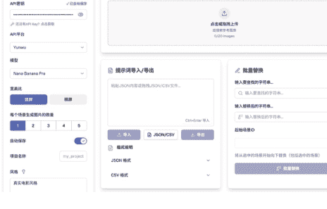

**视频生成：** 方法很多，RPA、API 和 Agent 都能实现批量制作。比如一泽圈友写的 RPA 脚本，调用可以无限生成视频的智谱 AI，把提示词和图片放在表格里上传，就可以批量地生成视频，几乎零成本。

**剪辑：** 剪映或者 AI 编程，大部分视频的剪辑都很简单，不做演示了。

####### 三、未来三年内的超级机会：打通一个 27 亿海外用户的获客渠道

YouTube 作为一个 27 亿月活的平台，真正的机会远不止于赚取流量分成。没有哪位做抖音视频号的老板专门去吃那个流量分成的对吧，都是带货、IP、私域。

作为老板，其实不应该只想着怎么赚流量费，而应该思考怎么用 YouTube27 亿的海外用户去放大现有的业务。

######## 1. 聊聊小语种和垂类赛道

在很多大家注意不到的赛道里，YouTube 存在巨大的、蓝海的机会。

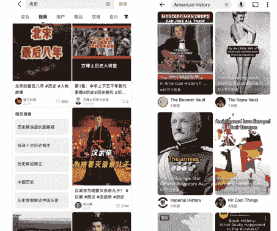

| 语言/地区 | 主要观众 | 典型长视频 RPM (美元) |
| :--- | :--- | :--- |
| 英语 | 美国，英国，加拿大 | $5.00 - $17.00+ |
| 德语 | 德国，奥地利，瑞士 | $8.00 - $15.00+ |
| 西班牙语 | 拉丁美洲 | ~$1.50 |
| 印地语/乌尔都语 | 印度，巴基斯坦 | ~$0.30 - $1.00 |

案例：你在抖音、视频号能刷到无数关于历史的 AI 视频。但在 YouTube，你去搜“美国历史”，排名靠前的视频，还都是真人讲解或历史素材混剪，你都找不到一条 AI 视频。难道是 AI 不能做吗？不，是大家都还没反应过来。

而这些垂类赛道的广告单价 (RPM) 其实非常高，远超泛娱乐内容。这些垂类的小赛道，能不能用前面做爆款的方法论去玩？这个问题留给大家。

######## 2. 百万 GMV，YouTube 带货蓄势待发

2024 年，YouTube 上线了“联署营销”(带货) 功能，类似于 TikTok 的精选联盟。但到今天，我问过很多做跨境电商的朋友，他们都不知道这个功能。

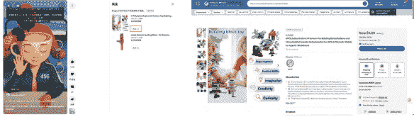

为了测试，我们把所有那些爆款的、跟带货没有关系的泛娱乐视频，都挂上了 YouTube 官方的商品链接。结果，这个月跑出来了 100 多万人民币的 GMV。

YouTube 作为电商渠道的开发，还非常不完善，但也存在巨大的信息差和机会。


######## 3. 海外 AI 自媒体的蛋糕比国内更大

**AI 自媒体：** 海外的 AI 自媒体，已经到了“饥不择食”的程度，对视频质量要求真的不高。一个非常简单的、没有真人出镜的日语匿名频道，只需要 1000 订阅，一条视频就能接到 200 美金的商单。这个模式完全可以矩阵化操作。

**知识付费：** 我们的小船老师，三年前就通过 YouTube 做知识付费，实现了第一个百万美金。现在每年来自 YouTube 的收益可能有几百万美金。


**更多玩法：** YouTube 是个很特别的平台，它把能引流到外站的链接入口，都贴心地告诉了我们，所有国内玩过的流量变现套路，放在 YouTube，可能都还是一片蓝海。

### 与观众分享链接

创作者可以在 YouTube 上与观众分享链接，但只有某些类型的链接是可点击的。您可以通过此页面了解哪些类型的链接是可点击的，并查看其他实用资源。

注意：为了减少垃圾留言和欺诈行为，YouTube Shorts 评论和 Shorts 说明中插入的网址将无法点击。

### 可点击的链接概览

| 链接类型/位置 | 可点击 | 不可点击 |
| :--- | :---: | :---: |
| 频道个人资料链接 | ✓ | | 
| 在长视频评论和说明中插入的网址* | ✓ | | 
| 在 Shorts 评论和 Shorts 说明中插入的网址 | | ✓ |
| Shorts 短视频的相关视频的链接 | ✓ | | 
| 在 YouTube 实时聊天和频道说明中插入的网址 (横屏直播) | ✓ | | 
| 在移动应用中查看时，YouTube 实时聊天和频道说明中插入的网址 (竖屏直播推送) | | ✓ |
| Shorts 评论和 Shorts 说明中的提及和 # 标签 | ✓ | | 
| YouTube Shopping 联盟营销计划链接 | ✓ | | 
| Shorts 绿幕和混剪归因链接 | ✓ | | 
| 帖子* | | ✓ |
| 片尾画面 | ✓ | | 

* 如需添加可点击的外部链接，您必须为频道启用高级功能。

### 频道个人资料链接

在频道页上，您最多只能在频道个人资料中显示 14 个链接。如需了解可以在频道个人资料中显示哪些链接，以及如何更新这些链接，请点击此处，查看相关页面。

在这个 AI 改变一切的时代，我相信：“越分享、越生长、越幸运”和“越相信、越拼命、越看见”。这是我的大道之路，这是 AI 时代 AI 取代不了的东西。

公众号懒人搜索，懒人专属群分享

### “AIGC”

#### 代一：AI 赋能视频号

##### 如何通过账号矩阵实现月入 3 万

@代一  
AI+ 流量创业者  
高客单赛道视频号矩阵单日获客 1000+

大家好，我是代一。靠 AI 赋能视频号运营，通过视频号流量矩阵，实现月入 10 万的个体创业者。跟大家分享一下，如何将一个不起眼的小项目：AI 视频号创作者分成，靠账号矩阵做到月入 3 万 +。

##### 一、视频号创作者分成项目收益的底层逻辑和发展方向

赚视频号创作者分成的底层逻辑，就是，你发原创的优质内容，没有其他变现方式，不卖货、不引流、不营销，但你给平台贡献了内容价值，平台就给你提供这样一种变现方式，可以在你的内容里挂广告，像 YouTube 一样，用内容做流量帮平台展示广告，平台给你分一部分收益。

那么它的发展方向，有两种大方向。

第一种：专业、精品方向，提高单号天花板，晋升为真正的优质创作者。

比如下面这个电影解说账号，10 万 + 点赞的大爆款比例非常高，且有连续几天内发布四个作品全是 10 万 + 的时候。

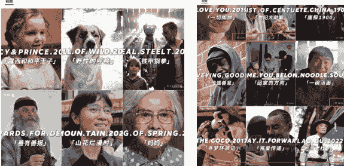

再比如这个大博主“是个懒妈”，应该很多人都刷到过她们家视频，各个平台都是百万到千万级的粉丝，视频号也有。她这一屏视频，只有 1 个不是 10 万 +，“只有”1.8 万赞，其他全是 10 万 +。

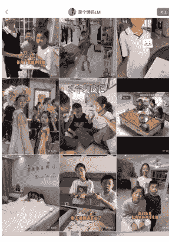

不算接广告，单看流量收益已经天花板很高了。

有人说视频号创作者分成流量不稳定，单号天花板太低；也有人说出了大爆款之后就会被限流，有视频在爆的时候，就不要发新的了，不可能让你同时爆两条……

这些问题都不攻自破了。

有人觉得这两个案例，一个需要很高超的剪辑技术，一个真人拍摄需要很好的脚本、表现力等实拍镜头，我们都很难短时间去复制。

那下面我们再看个 AI 视频的。这个主要是 AI 生成风景和一些好运寓意的图，也是有多篇连续爆款的。

所以说真正优质的内容它是不受大家以为的所谓限制的。


###### 一切运营技巧在足够优质的原创内容面前都是可有可无。

如果往专业精品优质内容的方向发展，单号的天花板完全是没有问题的。如果有问题，那么跟平台和项目无关，主要是咱自己不行。

这一类适合有一定创作经验的，可以选择往这些方向去精进，晋升为真正的优质创作者。并且，掌握了持续做流量的能力，你可以运用到任何赛道上。起号、获取用户、卖货变现，都能赚到钱。

但这种大部分人短期是没办法达到的，也不太好模仿，提升也是一个比较漫长的过程。但至少给我们证明了，单号是没有天花板的，很多做得好的创作者，靠一个号也能赚到百万千万以上。

###### 第二种方向，就是我们可以短期学习做出来的批量规模化，账号矩阵

一些比较简单的赛道，单号天花板不够，那么我们可以做很多账号，有一堆小号，不断获取流量，靠规模来持续赚钱。

这也是我们本篇重点要讲的。很多项目的发展方向都是下图这两种，各有利弊，鱼与熊掌不可兼得，我们根据自己的情况来做选择。

但矩阵肯定是绝大多数人都更容易上手掌握的一种方法，对技能要求更低。

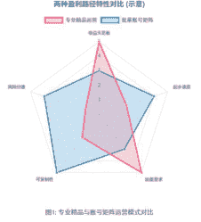

##### 二、账号矩阵核心思路

做矩阵放大收益，需要关注哪些核心点？

###### 1.账号数量

要规模化，就至少要有一定的账号数量。

这个项目需要用什么条件的账号去做？是手机号注册还是邮箱注册？需不需要实名？一个人能实名几个号？

去思考我们自身的资源能搞到多少账号去复制。

像视频号是用微信注册，一个微信绑定一个视频号，但是要开通创作者分成并稳定收益，是需要进行实名认证的。1 个身份证可以认证 5 个微信号，2 个视频号。可以用家人亲戚朋友的，用 3~5 个人的身份证，就可以搞定 6~10 个视频号了。这 6~10 个账号，对于个人来说月入几万就完全够了。

###### 2.账号起号速度

要做批量规模化、做矩阵的话，最好能够起号快一些。如果起得太慢了，可能前期没有收益的时间就会很长，或者说你在切换账号、切换赛道的时候，你的收益就会受很大影响。

那起号速度怎么才能快？我分享一下我自己的起号方法论，我用这套方法严格执行的起号率基本能达到 100%，平均开通创作者分成计划的时间是三天左右。

我这套快速起号的方法，总结下来就是五个步骤。

第一步：找对标，得找“潜力股”

选赛道，找对标，这是起号的第一步，也是非常关键的一步。我选对标有几个标准：

必须要有 10 万 + 点赞的视频！我基本上只看 10 万 + 的，如果他没做出过 10 万 + 的爆款，我是不会看的。因为视频号最高显示到 10 万 + 点赞，再多就不显示了。所以 10 万 + 的收益浮动性和上限也会更高。而低于 10 万 +，我们大概是能够按照比例估算出收益的 (万播≈1 元，万赞≈100 万播放)。

爆款视频发布时间越近越好。说明这个赛道最近还热乎。点击一下评论区看上面的文案就能看到发布时间。

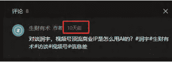

对标账号的粉丝越少越好，作品数量越少越好。

视频号看不到粉丝数，可以去看这个账号发布的第一条作品是什么时间，尽量要几个月以内的。

再者，发布作品数量越少越好。因为数量少，10 万 + 爆款又多，证明这个赛道爆款率更高。

比如一个账号才发了二三十条作品，就已经有两三条大爆款了。相比另一个账号已经发了上百条视频，而且上一条大爆款还是两三个月以前的，那肯定是选前者作为对标更好。这其实就是低粉爆款的逻辑，各大平台和项目通用。

同时也可以看一下账号的平均数据，如果是 10 条以内只有一条爆款，其他平均数据都很差，那可能是吃了新号流量红利的运气，谨慎考虑下。

如果非大爆款的其他视频数据也都还行，那证明是实力因素。当然这些数据都没有具体的标准，是相对的。比如我认为半年以内的号，发了不超过 50 条作品，有至少 2~3 条 10 万 + 左右的大爆款，是一个可以纳入的对标。但这些数据都是可以浮动的，选择相比较而言更好的那个即可。

####### 第二步：拆解对标的视频制作流程，确保自己能复刻出来

###### 生财有术

找到对标的视频后，你得仔细去拆解，看人家是怎么做的。

- 1) 画面：是啥风格？AI 画的？还是真人拍的素材？图片和分镜视频是怎么组合的？开头怎么吸引人看下去的？
- 2) 文案：讲的啥内容？是故事还是语录？
- 3) 音频：背景音乐是啥？有没有配音？是 AI 配的还是真人？
- 4) 剪辑：视频多长？画面切换用了什么样的转场？用了啥特效？

你看到一个 AI 生成的图片很好看，你可以截图下来，丢给豆包，直接说“反推一下这张图片的提示词”，它就能给你一些参考。这样你就大概知道怎么用 AI 做出类似的画面了。

就这样打开一个画面，一帧一帧分析，直到确保自己也能复刻出来一整个视频。因为对标账号做得再好，如果我们做不出来他的视频，那跟我们也无所谓。

####### 第三步：适当优化制作流程中某些环节的质量

拆解完了，我们是不是就能直接照搬了？不行！完全复制，很容易同质化，被平台限流！

所以，一定要优化，做出自己的特色，提高原创度。记住，原创度非常非常重要！平台判断原创度，画面大概占 80%，音频和文案可能各占 10%。所以，画面一定要下功夫！

做 AI 赋能视频号项目，视频的原创度是命根子。

怎么优化？核心原则是：确保你的内容质量不输于对标，能超越更好，超越不了也别比它差。你要确保你做出来的内容看起来跟对标在质量上感觉差不多，可以让不知情的其他人去刷一下，也感觉你做的和他差不多，甚至更好，和对标不会有很大的感官差距。这个是关键步骤，把这一步做到位了，后面才能达到更好的效果。

很多圈友参考对标去做，结果发出来就同质化严重，导致被限流、被减少推荐、甚至账号违规被封。

公众号懒人搜索，懒人专属群分享

25

99% 都是因为原创度做的不好。所以说一定要有这个流程，适当优化制作流程中某些环节的质量，确保自己的内容不输于对标，甚至有一部分质量比他还好。

比如说我们做 AI 手绘漫画混剪的赛道，第一时间就要思考有没有哪里还能优化。

剪辑素材再干净一些，流畅度再好一些，转场效果再好一些，或者漫画你可以换换风格，提高下质量，用 AI 去做出更好看的漫画，换成和对标不同的另一种风格。

再比如下面这类人性文案 + 手绘图的赛道，文案可以微调，但中间的图一定要用 AI 自己根据文案生成纯原创的画。


大部分人中间都是做的静态画面晃动，而我们可以用 AI 生成一些动态的画面，这都是一些保证作品质量不输于对标的方法。

超越对标的一些原创方法：流程增加，多账号元素叠加，跨赛道元素叠加等，下面实操有详细讲解。

别为了数量牺牲质量，搞一堆劣质视频。你播放量再高，如果内容质量上面有风险，进入 100 万播放二次审核以后，照样给你把广告收益停掉。

一开始就把这一步做好，反而才是不浪费我们的时间。

####### 第四步：攒“弹药”,提前一次性做好 10 个视频，然后准备好健康的新号，头像昵称主页设置好，每天发布 3-5 条视频

起号的时候，不要做一个发一个，尽量储备好一定的弹药再开始发。一旦我们选好了赛道和对标，一般至少要测 10 条左右才能得到一些数据反馈。如果做一条发一条，就很容易临时的数据变化打乱节奏，影响了原定的动作。

而且，视频号对新号发布作品还有明显的流量扶持。起新赛道尽量用刚注册的新号，或者是注册很久但是从来没有发过作品的、没有违规过的健康新号。

正常发 20 条才能爆 1 条，5% 的爆款率；而用新号很可能发 10 条就爆 1 条了，爆款率提高到 10% 了。我们可以利用这一点非常快速起号。把提前做好的 10 条视频，在 2~3 天内陆续发完，每天发布 3-5 条视频，不能连续发，每条要间隔 2 个小时以上。

用这样的方法，基本上发 10 条至少都会爆一条 100 万以上播放的。这时候基本也涨够 100 个粉丝了，内容规范也能过了，原创数量要求也满足了。自然也就成功开通创作者分成权益了。

我们做其他项目也可以参考这个逻辑，起号前最好多准备一些视频，万一临时有事，也能保证更新节奏，让平台快速判定你是一个能够持续更新的优质账号。

####### 第五步：找账号的“爆款基因”,持续优化更新

发完起号的这 10 条，有了一定的数据反馈后，根据我们账号上数据更好的作品，复盘我们爆了的视频的题材和特点，持续去做后续的选题更新和作品优化。

后续账号保持日更 1~2 条，固定节奏发布即可。

我们按照上面的步骤做出来的，是不太需要单号去怼量的。因为这个项目的主要收益大部分都是靠大爆款来带动。靠万赞甚至 10 万 + 赞的视频。这种 10 万 + 点赞的视频，它是能够持续爆的，有可能一个视频就让你单月收益过万。

以上五个步骤，每一步环环相扣，想要后面的效果好，一定要把前面的动作做到位。

公众号懒人搜索，懒人专属群分享

##### 三、实操案例讲解

###### 1.找新赛道的方法

起号方法有了，好赛道从哪儿来呢？总不能守着一个赛道吃到老。接下来给大家分享几个找新赛道的方法，掌握了我们就能有源源不断的赛道可以做。

- 1) 关键词搜索，筛选“最热”“视频”“7 天”，开始刷

从微信首页的搜索框去搜，这里可以添加筛选条件。直接用“搜一搜”也可以。

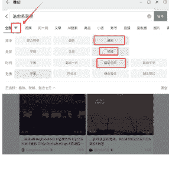

搜出来的就是按照热度排序的，点赞最高的在最上面。根据经验，最近 7 天内有 10 万 + 刚好比较符合我们上面提到的第一步对标要求。1 天太短，筛不出来，半年太长，增加二次查看的时间成本。

如果你找的赛道最近 7 天内没有 10 万 +，可能就是赛道近期热度不够高。没关系，在生财看到的每一个赛道关键词，每一个风向标，都可以来搜一下，你会找到很多。

- 2) 关键词衍生法 (系统推荐后缀、点标签不断拓展)，拓展相似的蓝海赛道

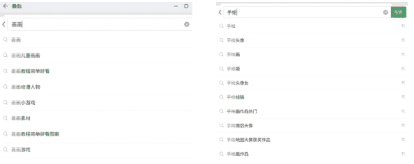

搜索的时候，很多时候系统会自动生成一些带其他后缀的话题，都可以点进去看一看，继续按照第 1 个筛选方法去筛一筛。

除此之外，作者发布时带的标签，有自己没搜过的，也可以去点一下。在标签界面再刷一刷，每个视频下面的标签再点一点，无限套娃，你又能刷到很多很多相似的赛道了。

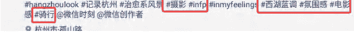

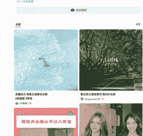

- 3) 刷朋友点赞视频

如果刷好了自己的页面都没有满意的，也可以去刷刷朋友点赞，拓展到朋友圈子里面，看看他们点赞的热门视频里有没有可以参考的，用 AI 可以复刻的赛道。


- 4) 刷中老年好友朋友圈

视频号中老年人的比例很高，但很多在中老年圈子里的爆款视频，我们自己是刷不到的。而很多中老年圈里的爆款视频，都有一个特点，那就是制作极其简单。做了这个项目之后，我才发现长辈的朋友圈里，竟然隐藏着很多默默赚钱的赛道。

比如下面这些手写字和美景分享的，流量都很好，关键是很稳定。很多中老年人关注了以后他们就会天天看，转发到朋友圈和群聊，带来的流量也很庞大，很多都是 10 万 + 转发。


可以去找一些亲戚长辈的朋友圈看，他们就是视频号中老年群体的代表性人物。定期去看看他们的朋友圈，看看有没有一些潜藏的蓝海赛道。

很多中老年爱看的视频制作起来超级简单，用 AI 复刻以后可以很快批量生产，甚至用工作流还可以自动化，成本非常低，矩阵号复制起来在时间上性价比也很高。

- 5) 跨平台截图识别搜索

你在抖音、小红书等其他平台上刷到一个适合复刻的爆款，但不知道视频号有没有人做，是否受欢迎。

可以截图发到微信上，手机打开长按点击“搜一搜”，微信会识别图上画面，搜出类似画面。也可以看生财星球里圈友发的风向标截图，其他地方看到的一张图片，都可以用这个小技巧试一下。基本上这一套连招下来，你可以一直不断地找到新的可做的赛道。


公众号懒人搜索，懒人专属群分享

31

###### 2.分析赛道的逻辑:

- 1) 这类账号是如何变现的？

我们主要是做创作者分成，那么重点就是要看他们的视频能不能标原创，且评论区有没有显示广告。

除此之外，也可以看看有没有开橱窗，有没有卖出去货、有没有直播、知识付费卖课等。

- 2) 收益是否满意

怎么看收益？

我们可以通过看对标账号一个月发了多少视频，多少赞，大概估摸有多少收益。实际可能会比这个数高，毕竟这是很保守的估算。

| 数据维度 | 1 万播放量级 | 100 万播放量级 | 10 万 + 赞隐藏数据量级 |
| :--- | :--- | :--- | :--- |
| 播放量 | 1 万次 | 100 万次 | 1000 万次以上 (至少) |
| 点赞量 | 约 100 个 | 约 1 万 + 个 | 实际 20 万 -30 万 + 个 (显示 10 万 +) |
| 收益估算 | 约 1 元 | 约 100 元 | 至少 1000 元 + |
| 数据特征 | 播放与点赞比例约 100:1 | 公开数据可直接计算 | 点赞量隐藏，播放量突破千万 |
| 注意事项 | - 赞/爱心任选其一估算<br>- 仅为粗略参考模型 | - 10 万赞以下数据线性相关 | - 隐藏数据可能远超显示值，收益空间上浮 |

- 3) 分析视频制作，能否复刻并优化

一个视频的制作流程，主要分为画面、声音、剪辑、效果。

能用 AI 赋能的赛道，大部分都是靠 AI 来生成画面的。核心步骤基本都是 AI 生图、然后图生视频，甚至有些简单的赛道不用生视频也行。

公众号懒人搜索，懒人专属群分享

###### 如何复刻对标？反推提示词大法！

截图对标的每一个分镜，先让 AI 反推出来提示词，然后再用提示词去生图。再观察视频画面的运动，用图生视频。

比如这种视频就是一个环绕镜头。


后面的画面都是类似的场景，改个文字就可以了。一套提示词就能生成一个视频。

再看声音，就一个背景音乐，不知道是什么就网易云听歌识曲一下，然后剪映里选个背景音乐。剪映没有的，还可以抖音搜一下，然后复制抖音视频链接导入音频。


###### 如何优化超越对标？

####### 1. 增加一个步骤，提升视频效果

比如别人是静态的，我们把静态的再做成动态的；别人是不开口的，我们给它对一下口型把文案说出来；别人的字幕是静止的，我们给字幕加上动画效果，逐字显示出来；别人只有 5 个画面，我们做 7 个。

通过增加一个步骤，让视频呈现更好的效果。

####### 2. 多账号元素叠加

找多个爆款对标账号，进行元素融合。

比如用 A 爆款的画面，B 爆款的文案，C 爆款的声音；用 A 账号的故事，B 账号的人物风格，C 账号的场景风格；用 A 账号的素材，B 账号的二创风格，C 账号的剪辑效果。

总之，你能复刻出来对标的爆款视频，掌握了流程后，就不要一比一完全对着他的视频抄了。只参考他的核心元素，然后其他部分去找其他账号的元素替换掉。

####### 3. 跨赛道元素叠加

分析出爆款对标的核心元素，然后去找其他能把这个元素做得更好的赛道，提取出来叠加替换一下。

还是以这类视频举例。每一个视频都是在一种风景里面，摆上这种带花的祝福文字，有海边，有草地，有山川河流等等。都是比较治愈好看的风景，那么我可以就可以去找治愈系风景这个赛道，提取出来那个赛道的爆款风景元素，然后融合成这类花朵文字的类型。

公众号懒人搜索，懒人专属群分享

####### 4. 分析性价比，结合自己的资源和技能

我们选出来一个赛道分析完以后，需要判断自己制作一个视频的时间是多长，然后再根据上面预估的收益，判断性价比如何。有些赛道虽然数据很好，制作精良，但需要花很多时间，或许真的不如一些看起来很 low 的中老年赛道性价比高，可批量、好复制，多个号加起来收益反而更高。

####### 5. 分析收益能否放大，长期赛道还是短期赛道

有的赛道可以很轻松地批量复制，熟悉后制作一条视频只需要 5 分钟，甚至可以用工作流全自动生产。这种赛道去做矩阵，内容生产就不是卡点。只要搞定账号就行了。

还有些赛道，一天也就只能做出来一条视频，这种我们想复制也很难复制。一个人做两三个号可能就忙得焦头烂额了，就没办法矩阵放大。

做矩阵不能只看一个单号，要结合时间、收益和数量，看总体收益性价比。

另外，也要判断做长期还是短期赛道。

很多 AI 类的赛道都偏短期一些，在一段时间内比较新颖，过了这一阵就不火了。但有些赛道是相对比较长期的，比如英语学习、亲子家庭漫画故事、沙雕动画、治愈风景类等，可以长期做，并且这类赛道也有很多大号，有很多做了很多年持续收益都很不错的案例。

当然，这些都是辅助判断来提高我们的成功率和收益的。但想要有收益，关键还是要行动。

有的学员说找赛道就找了好几天，这就没必要了。

新手阶段不宜想得太多，要先干起来再说，边干边看。

祝大家都能选出轻松赚钱的蓝海赛道，收获自己的更多 10 万 + 赞爆款视频！

###### 生财有术


例如下图中的演示:


这张照片里有什么元素

这张照片里拍的是一个中式风格的建筑群，元素有:

- 建筑：传统中式建筑、飞檐翘角、瓦片、古色古香等，还有金点式西洋建筑，体现艺术韵味传统色特点:
- 颜色：建筑外立面、檐角等位置的暖黄色装饰灯，营造浪漫、古风氛围;
- 场景：园林建筑中常见的庭院场地，有浪漫灯光布置 (夜灯/灯光/暖，装饰);
- 场景：园林两边的树木，增添自然气息;
- 风格：画面在摄影自然光下，体现西方元素与元素融合。

我来生成图 5:11 以图片作为参考，在上述中式风格建筑，用红色花瓣和红色花瓣拼出大大的爱心，爱心中间写上一辈子不容易，爱心周围是花海。


我来生成图 5:11 以图片作为参考，在上述中式风格建筑，用红色花瓣和红色花瓣拼出大大的爱心，爱心中间写上一辈子不容易，爱心周围是花海。


这张照片里有什么元素

这张照片里拍的:

- 场景：红色树叶金黄，蔷薇花朵点缀的红色枫叶草莓;
- 场景：大片秋色金黄落叶;
- 天空：灰蓝色的天空，衬托以花瓣点缀的云朵;
- 建筑：别墅中看到的建筑群，以及白色的房屋，金属框架和玻璃窗;
- 文字：顶部“有情调”内容为虚有情调，仅供暗示。的识别文字。

刮画：红色树叶金黄，蔷薇花朵点缀的红色枫叶草莓;场景：大片秋色金黄落叶;天空：灰蓝色的天空，衬托以花瓣点缀的云朵;建筑：别墅中看到的建筑群，以及白色的房屋，金属框架和玻璃窗;颜色：花瓣红色花茎绿色的大大的爱心，爱心中间写上一辈子不容易，爱心周围是花海。

这样，你生成的画面就是自己纯原创的，几乎很难和别人一样被判重。

治愈系风景这个赛道就成了你的独家原创素材库，再加上 AI 提取元素叠加融合，原创度基本都能保证。

再换一个赛道来看：


这种曹操配音语录，核心元素有 2 个，一是曹操对口型说话，二是爆款文案，也就是他说出来的那些话。

保持原创度有两个方法：一是保留人物，改说话的文案；二是可以保留说的这些话，然后换个人物，换个热度更高的人物，叠加爆款因子。

文案可以跨赛道去找专门做爆款文案的赛道，拿他们的文案来叠加上我们的人物来说出来。比如搜索“语录”关键词，用其他赛道的爆款语录。也可以让 AI 总结出爆款语录的特点后直接出提示词来写。

用这种方法，你能创造出原创度几乎 100% 的作品，就能解决系统提示原创度不够的问题。

这个底层逻辑也是很多项目通用的，做自媒体，做获客，都适用。

### “AIGC”

#### 刘智行：用 AI 赋能垂直小号打造出 20 个爆款赛道账号

@刘智行

AI 赋能垂直小号创作者
日更账号 20+，全网粉丝 50w+

大家好，我是刘智行，单月副业收入破 10 万、手握 20 个垂直小号矩阵，实现“用副业重构人生”——构建自己稳定的睡后收入的斜杠青年/创业者。

曾经完成一篇公众号文章要 5 个小时，现在两个小时就可以完成 100 篇高质量公众号垂直小号爆款文章，构建起独属于自己的“内容王国”和“流量王国”。

今天想和大家分享：作为一个普通人，我如何通过半年时间打造专属于自己的“内容王国”，如何通过大量高质量的内容以巨低成本撬动高收益。

##### 一、垂直小号大有可为

这半年来我的公众号成绩：

- 1. 垂直小号单号收入 30w+，20 个矩阵号收入超 45w+；
- 2. 参加官方活动，垂直小号内测成绩第一名，40 天收入 1w+；
- 3. 20 个矩阵号，粉丝 50w+，平均每个号 2-3w 粉丝。

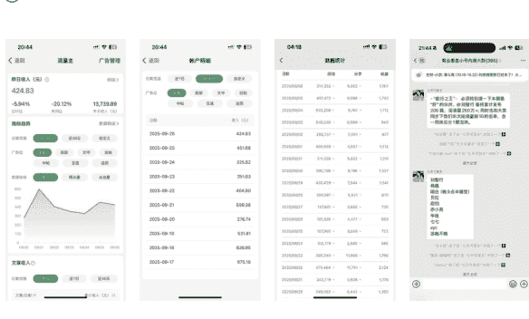

微信公众号的标语是小而美，我理解的垂直小号，其实就是垂直我们个人的品牌。

垂直小号的核心公式是：细分领域 + 专家 IP+“术”相关分享=小号大流量。

新号只要围绕“专业、深耕、细分领域、价值密度高”来创作，都非常有可能获得巨大的浏览量。

做垂直小号的过程也是打造个人的品牌的过程，是我们每个人都应该做的一件事情。等打造好了品牌，把用户带进私域，这个杠杆就能为你撬动最大的价值。

##### 二、AI 赋能垂直小号的底层逻辑和算法

###### 1. 公众号底层逻辑

目前的公众号推流机制，从之前的私域推流转向了公域推流，低粉号大有可为。之前你有 10 万粉丝，你写的文章就会推送到 10 万粉丝的手上。但是现在不一样，现在的情况是，只要你的文章质量够好，即便你 0 粉丝，依旧有很大可能获得 10w+ 的阅读量。

目前，公众号的推荐算法主要看点赞率、转发率、分享率、互动率、完读率这 5 项指标。你的每篇文章都要经过这几项的考验，这几项都达标了，就能够在同一领域冲出重围，

###### 2. 垂直小号的底层逻辑

拿到 10w+，100w+。

还有一个能够让系统给你推荐的重要指标是热点，如果你的文章嵌入了最新热点，那么你的文章也会得到推流。所以大家不妨在写垂直小号时，在开头加入一段最火爆的新闻热点。

垂直小号的底层逻辑是：垂直内容 + 个人 IP。

首先，一定要垂直。

千万不要今天发娱乐，明天发成长，后天发卖货。垂直内容才能帮你吸引“精准用户”，比如，做读书号就只聊书籍解读，做职场号就只讲升职技巧，不贪多、不跨界。

第二，一定要植入自己的人设 IP，不要让文章泛泛而谈，跟你缺乏联系。

只有人设融入进去了，粉丝才能更加信任你，知道你是个活生生的人，而不是 AI 生成的机器。比如我会在文中提自己“2018 年做自媒体、2020 年转房产销售、2023 年做 AI 创业”的经历，这些真实细节能快速拉近距离，让后续引流私域、变现也更顺理成章。

##### 三、"AI 赋能爆款内容”实操方法论

###### 1. 前期：确定领域，寻找对标

例如，你选定了一个方向做读书赛道的商业读书博主。

- 第一步：找对标账号

在微信“搜一搜”输入关键词，比如输入“穷爸爸富爸爸”，点击“全部”，筛选“最热”“最近半年”，就会出现一大堆 10w+ 的账号，这个时候逐一关注，然后再建立一个微信群把对标账号都转发到里面去。

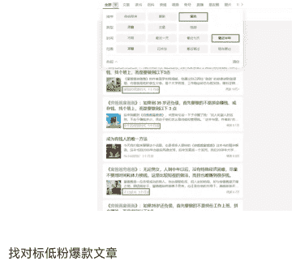

- 第二步：找对标低粉爆款文章

在上一步找到了很多对标账号，这个时候逐个点击，找到低粉爆款账号，比如图片中的“凤眼观书”账号，注册时间是 2020 年，只有 117 篇原创文章，但是有两篇 10w+，其它都是两三位数，就非常符合低粉爆文的规律，把这两篇爆文赶紧转发到微信群爆款群中，以备备用。

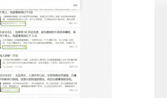


- 第三步：找对标文章和账号的标题无限对标法

不断通过 10w+ 标题去搜对标账号，对标爆文。

还是以“凤眼观书”为例，里面有一篇穷爸爸富爸爸的爆文，点击进入复制标题，然后复制到搜一搜，又可以看到无数对标账号和爆文，这就印证了爆过还会爆的逻辑。


###### 2. 中期：拆解爆文，形成模板提示词

当确定了领域、对标账号、对标爆文，但不知道怎么写，就要从对标爆文入手，拆解它的爆文结构。

- 第一步：找到一篇对标爆文。

以这篇浏览量 10w+ 的爆文为例，放入提示词，丢入 AI 软件中（我用的是豆包），提示词如下:

你是有 30 年经验的爆文拆解专家，现在要求你对这篇爆文进行详细的拆解，分为开头 - 中间 - 结尾，对每句话进行拆解，梳理出一套模板提示词。

- 第二步：加入个人 IP，形成个人专属提示词

得到一篇爆文提示词后，我们要丰富人设，植入个人 IP 故事和经历，这样文章才不会同质化，被判原创侵权。

你只需要在这个爆款提示词中加入你的 IP 人设就行，比如“我是某某，我目前从事什么工作，我有一个老婆，我的经历是 2018-2020 自媒体创业，2020-2023 房产销售，2023-2025 AI 创业”。这样就生成了你的专属提示词，全网独一无二。

###### 3. 后期：丢入模板提示词，形成原创爆文

- 第一步：拆解文章结构提示词，丢入豆包。

拆解文章结构的提示词非常重要，它能让你清晰地看到文章的脉络，从而根据文章脉络结构进行原创、垂直创作。

提示词要包含角色，背景，技能和目标。

提示词如下:

```
Role:
文章模仿大师
Background:
你是一位文章模仿大师，擅长分析文章风格并进行模仿创作，
老板常让你学习他人文章后进行模仿创作。
Attention:
请专注在文章模仿任务上，提供高质量的输出。
Profile:
Author:枫晓陌
Version:0.9
Language:中文
Description:一位模仿文章能力极强的专家，能准确抓取原文要点并进行创新表达。
Skills:
精通各类文体的语言风格和语法结构。
```

遵循原文思路，内容连贯流畅。
处理细节能力强，避免生造新概念和人物。
能准确抓取原文的核心观点并进行创新表达。

Goals:
根据用户提供的文章进行模仿创作。

Constraints:
生成内容重复率低于 30%；
保留时间、地点、数字、政策名称等细节；
遵循原文逻辑，避免引入歧义；
使用六年级学生都能理解的语言；
不要生造新概念、人物等。

Workflow:
用户输入原文；
总结原文核心观点和要点；
将原文拆解为不同部分，3~6 个部分；
让用户选择部分后进行模仿创作；
用户验证是否保留原文要点；
用户验证生成内容后，根据反馈进行调整。

Suggestions:
提供不同细节度的文章样例供用户选择；
增加原文概要、关键词等内容作为辅助。

Initialization:
您好，我是文章模仿专家，可以根据您提供的文章进行模仿创作，
请提供您希望我模仿的文章或者链接。

- 第二步：爆文链接丢入。

丢入上面的提示词之后，丢入爆文链接，让其对爆文进行分析。

> 提示词为:"你是一位拥有 30 年经验的爆文拆解专家。请对这篇公众号爆文进行详细拆解，分为开头、中间、结尾。对每一部分进行拆解、梳理，提取出一套可直接复用的写作模板。"

- 第三步：人设二创提示词+IP（个人经历）。

把第一步拆解爆款文章形成的模板提示词部分，在提示词里面的中间分论点后面植入你的人设 IP，要求每个部分加上你个人真实的案例。人设 IP 部分可以针对你的目标客户、目标群体进行打造，很重要也很核心，是为了增加粉丝粘性，增加用户信任，方便接商单等多元收入。比如我是运营商业读书账号的，那么我的人设可以是青年作家，产品是 21 天的早起读书营，21 天早起写作营，兴趣爱好是读书写作等。

那么就可以在提示词中间分论点后面打上如下词汇：“中间分论点每个部分植入我的真实个人经历（我是刘智行，江西赣州人，青年作家，有个 21 天的早起读书和写作营，我的兴趣爱好是每天看一本不同的书，我有个温柔的妻子，从我的真实经历中择优选取最优案例）”。把括号内的人设 IP 换为你的即可。

- 第四步：生成原创爆文 + 垂直小号。

丢入之后就可以生成原创垂直小号内容，再加上你独特的垂直人设 IP。

- 第五步：生成近百篇 10w+ 垂直小号文章。

这样每天不断发，不断优化提示词，然后不断有爆款产生，有时候一个号连续一星期都是 10w+ 爆款。


###### 4. 自动化：批量打造 IP 爆文

- 第一步：批量找对标账号

在搜一搜输入关键词找到对标账号，比如你想垂直写曾国藩，在搜一搜输入“曾国藩”或者“曾国藩传”，搜文章“最热”，搜账号，那么就会有无数的对标账号出现，把这些账号都转发到自己的对标账号群中，为下一步批量下载对标账号文章做准备。

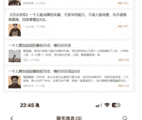

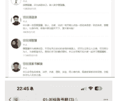

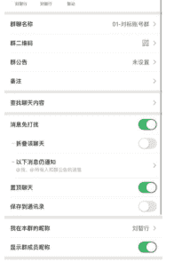

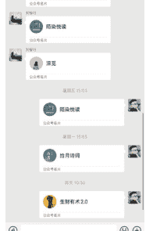

- 第二步：批量下载对标文章

微信公众号批量下载工具 3.9，是目前还不错的免费的一款批量下载神器，可以批量安装 20 个。批量安装后，打开 20 个微信公众号批量下载器。

然后再打开 20 个对标公众号的 20 条文章链接，每个公众号打开一条文章链接即可。

复制 20 个公众号的 20 条链接到公众号文章批量下载器当中，按照如下步骤批量下载，显示获取密钥成功，就可以批量下载了，设置一年内的时间，1w+ 以上的文章。微信公众号批量下载器：

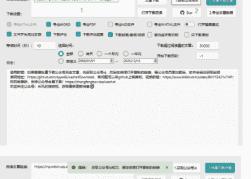

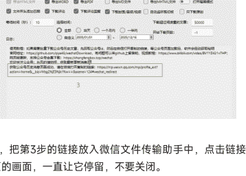

进行如下 3 步之后，把第 3 步的链接放入微信文件传输助手中，点击链接，打开会出现一个对标公众号主页的画面，一直让它停留，不要关闭。

这个时候，微信公众号批量下载工具会自动检测对标公众号，然后显示获取密钥成功，成功后点击批量下载文章或者导出文章数据即可。还可以对其进行下载设置，比如时间可以设置为半年，阅读量可以设置为 10000 以上的文章进行下载，具体细节可以动手实操。

下载后，打开下载目标即可以看到下载的文章。批量下载完成，我们就可以进行下一步，批量原创垂直小号爆文，以下是下载好的文章和封面，有 20 个号可以批量下载，所以有 20 个批量文件夹的文章，最少几百篇。

- 第三步：批量生成原创 IP 爆款内容

我目前主要有 3 种方法批量原创垂直小号爆文，Coze（扣子）智能体、飞书多维表格和 10 个豆包软件。

1) Coze（扣子）智能体

在扣子智能体当中，建立一个工作流，开始 - 获取链接插件 - 大模型（放入两段提示词，模板人设提示词 + 模仿提示词）- 结尾。除了开始和结尾，中间部分你可以不断复制，复制成 10 份，然后点击试运行，放入 10 条链接就会生成 10 篇爆款原创垂直文章。

2) 飞书多维表格


提示词同上，或者自己拆解爆款文章拿到爆款提示词。

- 3) 10 个豆包软件（最推荐）

可以开 10 个豆包网页，然后登入，批量进行制作，丢入第一段提示词，第二段模板提示词，最终生成无数垂直小号 +IP 内容。


当你完全跑通，就可以动用矩阵的力量了，我目前 20 个号，每天自己运营，压力不是非常大，但是如果 100 个号的话，一个人就有压力了，可能需要全职了。

- 第五步：公众号垂直小号 SEO

占据关键词，打造自己的流量王国，这在微信公众号非常重要。

因为搜一搜每天有无数人在用，如果你能根据关键词占据流量，拦截流量到你公众号，那你的私域会有非常大的商业价值。

比如你搜索《穷爸爸富爸爸》10w+ 的文章，10 个号有 6 个号是我的，那些搜索书籍的人、想买书的人，也因为我的关键词占据了流量，都到我的公众号和私域里面去了，源源不断地给我创造财富。

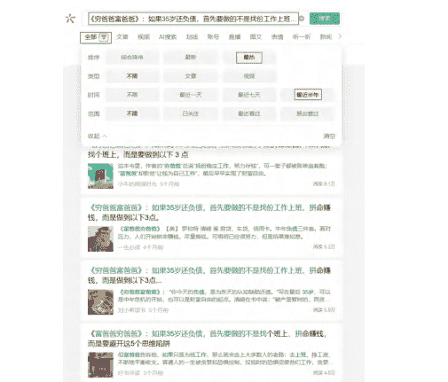

##### 四、数据如何倒推爆款内容运营

很多人写文章没流量，不是内容差，是没盯紧“数据”。

数据是公众号推流的“指挥棒”，我每天花 30 分钟分析 20 个号的数据，靠调整指标让爆文率提升了 60%，而爆文越多，引流私域的基数就越大。

###### 1.5 个核心指标，决定你的文章能不能爆

- 1) 点赞率：判断“内容共鸣度”

计算方式：点赞数÷阅读数，合格线是 3%-5%，低于 2% 说明内容没戳中读者痛点。

优化方法：如果点赞率低，先改开头，比如把“《穷爸爸富爸爸》里有个观点”改成“看完

公众号懒人搜索，懒人专属群分享

读书号月入 3 万）或“提问”（“你是不是读了很多书，却还是没赚到钱？”）；中间每段别超过 3 行，多分段、多标“01/02”，让读者读起来不费劲；如果是长文，在文末前加“提示”，比如“最后 200 字是核心方法，别错过”，引导读者读完，只有读完，才会看到你文末的“私域引流入口”。

###### 3) 分享率：判断“内容传播力”

**计算方式：** 分享数÷阅读数，合格线 1%-2%，高于 3% 的文章大概率能冲爆文，因为分享会带来“公域流量”，公众号会给更多推荐，流量越多，引流私域的机会就越多。

**优化方法：** 内容要加“分享理由”，比如写读书号时，加“把这篇转给你总说‘读书没用’的朋友，帮他改变认知”；或加“利益点”，比如“分享到朋友圈，截图找我领《穷爸爸富爸爸》精华笔记”；另外，文章结尾别直接结束，加一句“觉得有价值，就分享给需要的人吧”。

###### 4) 转发率：判断“内容认可度”

**注意：** 转发和分享不同——转发是“转发到微信群/好友”，更私密，也更能体现读者“真正认可”；分享是“分享到朋友圈”，偏公开，转发率高的文章，粉丝粘性会更强，加你私域后也更愿意互动。

**优化方法：** 写“实用型内容”时，比如“3 个 AI 写爆文的技巧”，加一句“转发到你的创业群，和朋友一起省时间”；写“情感型内容”时，比如“读书教会我的 3 个道理”，加一句“转发给你想一起成长的人，一起进步”，用“场景化引导”提升转发意愿。

###### 5) 互动率：判断“粉丝粘性”

**计算方式：** (留言数 + 在看数 + 收藏数)÷阅读数，合格线 2%-3%，互动率高的号，后续引流私域的转化率也会更高——因为粉丝愿意“主动参与”。

**优化方法：** 文末必须加“互动提问”，比如“你最近在读什么书？评论区聊聊”“你做号时遇到过数据差的问题吗？我来帮你分析”；对留言要“及时回复”，哪怕只回“谢谢”，也能让读者觉得“被重视”；另外，定期做“互动活动”，比如“留言点赞前 10 名，送我整理的爆文模板”，调动粉丝积极性。

我每天会把 20 个号的这 5 个数据整理成表格，对“低于合格线”的文章，当天就改模板，比如某篇完读率低，就缩短段落、优化开头；某篇互动率低，就调整文末提问。慢慢地，整体数据会越来越稳，爆文也会越来越多，也为我进一步吸取流量掌握基础。

数据运营非常重要，值得每天分析和操作，只有这样我们整体的数据才会好。

###### 2. 用户运营

很多粉丝关注了你，但是你发的文章他们还是看不到，所以需要把公域粉丝引到私域，靠“私域”赚更多钱。

很多人做公众号只盯着“号上粉丝”，却忽略了“私域”。公众号粉丝是“平台的”，但微信好友是“自己的”，把粉丝加到微信里，既能反复传递价值、增强信任，还能解锁更多变现方式。

####### 3. 引流：3 个入口，让粉丝主动加你微信

别硬邦邦地“放微信号”，要靠“利益点”引导。

我 20 个号每天能引流 500-800 人到微信，重点是“福利要和领域相关”：做读书号就送“书籍笔记”，做职场号就送“简历模板”，别送无关的东西，否则加进来的都是“无效粉丝”。

- 1) **文末引导：** 在文章结尾加“福利”，比如“我整理了《100 篇读书号爆文标题模板》，想拿的朋友可以加我微信【XXX】，回复‘标题’直接领”，注意用‘昵称 + 关键词’的形式，别直接发微信号，避免被平台限流；
- 2) **留言区引导：** 粉丝留言后，在回复里加“延伸福利”，比如粉丝问“怎么找对标账号”，就回复“找对标有 3 个小技巧，我整理成了文档，加我微信【XXX】，回复‘对标’发给你”；
- 3) **菜单栏设置：** 在公众号菜单栏加“免费领资料”选项，点击后跳转图文，里面写清楚“加微信领什么”（比如“加微信领《AI 写爆文提示词》”），再放微信二维码——菜单栏是“长期入口”，能持续引流。

####### 4. 私域运营：3 步让粉丝“记住你、信任你”

加了微信别不管，要靠“持续价值”留住粉丝，否则过几天就被删了。

######## 第一步：自动欢迎，快速破冰

设置微信“自动回复”，加好友后自动发“你好呀～我是 XX（你的 IP 名），专注做读书号运营，你加我是想领【爆文模板】还是【对标账号清单】？回复对应关键词就能拿，另外平时我会在朋友圈分享做号干货，有问题也可以随时问我”——既明确你的价值，又引导粉丝互动。

######## 第二步：朋友圈“价值输出”，别只发广告

20% 是“生活/人设”（比如“刚整理完新的爆文模板，喝杯咖啡歇会儿，做号虽然累但看到粉丝涨就开心”），10% 是“变现信息”（比如“本周的读书号训练营还剩 5 个名额，想快速起号的朋友可以找我了解”）。

######## 第三步：定期互动，增强粘性

每周做 1 次“微信答疑”，在朋友圈通知“今晚 8 点，我在微信上免费答疑，有做号问题的朋友可以直接问我”；平时粉丝发消息，尽量 2 小时内回复，哪怕是简单的“你这个问题，我之前写过一篇文章，发你链接看看”，让粉丝觉得“你随时都在，而且能帮他解决问题”。

###### 5. 变现方式

做号的核心是变现，我靠“公域引流 + 私域运营”，把 8 种变现模式玩到极致，覆盖“低门槛被动收入”到“高客单价主动收入”，你可以根据自己的账号阶段选。

- 1）流量主：0 粉丝也能赚的“被动收入”

这是最基础的变现方式，公众号粉丝满 100 就能开通，主要靠文章底部/中部的广告曝光、点击赚钱，我的号因为常出 10w+ 爆文，单篇流量主收入能到 500-1000 元，20 个号一天更 100 篇，光流量主每月就能稳定拿 2-3 万，重点是不用管售后，发完文章等着收钱就行，适合刚起步的小号。

- 2）橱窗带货：“内容 + 产品”无缝衔接

公众号开通“商品橱窗”后，就能在文章里插入和领域相关的产品链接。比如我做读书号，就挂书籍、书签、读书笔记手账本；如果做职场号，就挂简历模板、办公软件课程、职场穿搭。

我会在文中自然植入，比如讲《穷爸爸富爸爸》时，在文末加一句“想读这本书的朋友，点击橱窗就能买，我自己也回购了 3 次，加我微信还能领这本书的精华笔记”，用“私域福利”转化。

当你在领域里做出成绩 (比如“3 个月把读书号做到 1 万粉”)，就可以把实操方法整理成课程，我会在公众号文章里分享“自己怎么做成的”，再引导“加微信领课程大纲”——粉丝加微信后，通过朋友圈的“课程好评截图”、“学员案例”进一步种草，最后转化购买。

- 4) 收费训练营：“手把手教”赚“服务溢价”

训练营是“直播 + 答疑 + 监督”，客单价更高 (999-1999 元)，我会在公众号和微信朋友圈同步预热，比如“本周开读书号爆文训练营，前 20 名加微信报名送一对一账号诊断”，用“稀缺福利”吸引粉丝加微信咨询。开营后，还会把学员拉到微信专属群，每天在群里答疑、监督打卡，学员满意度高，复购和推荐率也跟着涨。

- 5) 知识星球：“长期陪伴”的“订阅制收入”

知识星球定价 199 元/年，我会在微信朋友圈分享“星球每日干货”(比如最新爆文拆解、AI 提示词)，再配文“加我微信，回复‘星球’看 3 天免费干货，觉得有用再订阅”——降低粉丝决策门槛。而粉丝在星球里提问后，我会在微信上优先回复，进一步强化信任。

- 6) 广告收入

这也是很大的一块收入，我目前收入最高的一个广告是 42575 元，还有很多小广告，都是在 1 万元左右，半年时间收入也还可以。

如果你也在做同类型的项目，或者不知道如何下手或者迷茫，希望我的经历和经验能带给你一些启发和帮助。

### “AI 产品”

#### 亦仁：为什么 AI 产品是超级机会？

这是一个各种长尾细分需求都可以被充分满足的时代，通过做 AI 产品，掌握 AI 编程与产品化能力，会获得你的黏性用户，比如用 AI 来做网站、App、小程序。现在我们和小排通过深海圈，带着很多人通过 AI 做 Web 网站就是从这个方向去突破。

1. 这个超级标不仅仅是一个赚 100 万的机会，更是一个赚 1000 万甚至赚 1 个亿的机会。已经有圈友在此深耕一两年，赚得盆满钵溢，但这中间仍然有非常非常巨大的机会和空间，值得大家深度重视。我展开讲，为什么这是一个超级机会：

做出海产品不是什么新鲜事了，但 AI 带来流量格局的重塑，背后是利益分配格局的重塑。大的入口、平台型机会虽然跟我们没关系了，但各种细分场景仍然有非常巨大的机会和空间。

所有的工具都可以通过 AI 重新做一遍。
所有的工具都可以通过 AI 重新做一遍。
所有的工具都可以通过 AI 重新做一遍。

重要的话说三遍。

2. 之前的那批产品人已经老去，不在一线，新的机会正在留给新的人，也就是在看这篇文章的圈友。

不要觉得自己起步晚了，AI 是一个比互联网还大的机会，十年起步，ChatGPT 推出算元年的话，今年才是第几年？晚了吗？完全不晚。

我的理解是，最好的入场时间不是第一批，而是第二批。和投资一样，当赚钱案例出来，确定性呈现的时候，加大投入，All in 进去，才是风险最低收益最大的时候。

3. 有人说，这个是不是得懂产品、懂技术才行？懂产品懂技术当然非常有帮助。但相信我，由于 AI 编程的快速发展，目前完全不懂技术的生财圈友，通过 240 小时，相当于一个月的工作时间，投入学习，几乎靠一个人就可以成为 AI 应用的开发专家。目前生财已经有不少这样的圈友案例，X 上这些案例更多，靠一个人学习 AI 编程就可以搞定一个可以商用的产品出来。如果说缺什么的话，可以多人共享一个程序员作为顾问。

4. 不少圈友靠 AI 产品已经赚到钱，比如生财有术里面已经有第一期就一直在的圈友@阿彪两款 AI 产品年营收千万美金，其中 Pollo AI 拿到了 1400 万美金融资，和字节 AI 产品排在了同一榜单上。

5. 我自己的一个海外产品团队，曾经做过一个测试，找到头部的 AI 网站的 affiliate 链接，直接投广告，有几个产品单纯靠 20%-30% 的 cps 佣金都能投正并且赚到钱。这意味着如果自己做这个产品，利润空间大很多。

6. AI 产品基本都是直接靠订阅变现，不需要额外思考如何商业化，可以节省很多思考变现的时间。

7. 流量上靠 SEO 或者投放或者社交裂变或者红人营销的方式，都有很多圈友跑出了成功案例。如果做大，肯定是组合拳都要有。

但我建议一开始就走投流路线，Google、TikTok、Facebook 这几大平台的流量都很容易投放。如果你做好了产品，想测试投放，可以直接找我，这三个平台我都有很专业的投放团队，可以免费帮你测试。

8. 目前 AI 的各种技术工具层出不穷，视频、音频、图片、文字等，每出一种新技术或者工具，就会带来应用层面一个大的变化，用户体验就会产生巨大的变化。相应的，用户很愿意付费尝鲜，就会有一波新的流量红利和转化红利。

9. 各种 AI 带来的效果对比视频是非常适合在各种短视频平台投放的素材，转化效果会超预期。

10. 目前存在着两种“看不见”: 传统做 App 的团队，因为没有榜单，看不见 AI 网站的机会; 目前做 AI 网站的人，大多数是草根，看不见 App 的机会和付费投流的机会。但两种领域，都有人在赚大钱。

如果选一个，我会从网站入手，但落脚点会在 App 上。

### “AI 产品”

#### 刘小排:AI 编程赛道第一课

##### Build a business, not an App

@刘小排
AI 产品创业者、SCAI 联合创始人

大家好，我是刘小排。相信很多朋友都发现了这么一个现象：自从@AI 进化论 - 花生的“小猫补光灯”火了以后，小红书出现了一大堆奇怪的、个人开发者做的小产品，有山寨小猫补光灯的，还有各种手电筒、背单词、天气、闹钟、笔记、记账、TODO……

甚至还出现了一些账号，立 flag 自己每个月、每周做一款应用的……对了，我似乎还见过“每天”的。

他们的主要共同点有两个：

- 1.号称自己和小猫补光灯一样，不会写代码，只靠 AI 很快就做好了。
- 2.不赚钱。

为什么明明不赚钱，大家还趋之若鹜呢？因为大多数人以为，做产品的的唯一门槛是编程，而 AI 可以帮他们搞定。然而事实是，做产品的唯一门槛是“洞察需求”，编程从来不是门槛。

我们所处的这个美好世界，并不需要第二个小猫补光灯和第 1 万个 TODO、记账、笔记、天气、闹钟、手电筒。

我们要构建的不是一个产品，而是一门生意。Build a business, not an App.

##### 一、Build a business, not an App

先讲个我自己的故事。2017 年，我在前东家工作，带领团队从 0 到 1，一年时间做出来了一款千万级日活的输入法产品。产品主要来自口碑传播、自然流量、Google Play 商店官方推荐，并未消耗公司太多的推广费用。当时，我自己觉得很牛，也许你也这么觉得。

那一年，我竟然没有拿到公司的十佳团队或十佳员工！我差一点就愤然辞职。不仅我自己觉得郁闷，当时还有很多其他部门的同事纷纷找我私聊，问我是不是得罪了老板。

我准备了一封长信，义愤填膺地质问老板到底是怎么回事。老板马上给我打来了电话，耐心地给我上了这一课——"Build a business, not an App”。老板告诉我，我的身份不是普通员工，而是一个团队的领导者。虽然这个产品日活超过千万级，但是亏损严重。

一方面，成本很高，团队好几十号人呢；另一方面，产品基本没有收入。输入法产品很难变现，连广告都没啥位置可以放，更别提付费了，你见过有几个人为了输入法付费的？至少我当时没有想到或者看到能够让产品盈利的希望。

作为团队领导者，做一款产品，你刚开始不盈利并没有太大问题，但你得规划一个逐渐走向盈利的路径吧！你得有一个长远的 Business Model 吧！

但我没有，我连这个意识都没有。我只是不断消耗公司的资源，做出来一些看起来很牛的产品数据，满足自己的虚荣，却让公司不断在付出代价，看不到希望。

沟通完后，我用了一晚上来消化情绪，删除了辞职信。第二天，我开始认真琢磨怎么把产品变成一门生意，开始了新一年的奋斗。

第二年年底，我成功让团队盈利了，拿到了优秀团队，还获得了惊掉我下巴的大大幅度的涨薪和股票激励。

此外，我还获得了一些无形资产：当时我就意识到，以后如果我出去找工作，似乎再也不需要写简历了——我和我团队的一些核心干将，已经在行业内积累了相当大的知名度，隔三差五就有好多猎头来松土。

我的故事讲完了。不知道你怎么看待这一段故事？

也许，你很可能会认为我是被 PUA 了。从 0 到 1，一年做出千万级日活的产品，这样的经历在全行业都很难复制。但是我并不这么认为。

我自始至终都非常感谢前公司，幸好它没有在 2017 年给我优秀团队。否则，我会成为一个巨婴，学不到"Build a business, not an App"的一课。这是让我成为今天的我的关键一课。

今天的我已经在经营自己的公司，我时刻提醒自己：我们是来做生意赚钱的，不是来亏钱自嗨的。

不管你什么日活月活，我就问你，没钱你怎么活？

在 AI 编程的帮助下，原本不会写代码的你也可以每周（或者每天）做一个新产品，但如果这个产品是第 1 万个 TODO、记账、笔记、天气、闹钟、手电筒，而没有 Business Model，你只是在自嗨而已。

Build a business, not an App.

怎么办呢？别急，不难。

##### 二、新人构建 Business Model 最简单的方法

让我们回归到常识，做生意的本质，无非是“低买高卖”。如果我们打算尝试用 AI 编程做产品赚钱，第一步，我们应该干什么呢？

很多朋友认为第一步是“学习用 AI 编程”。我的建议是，先别急着学 AI 编程，第一步你应该通过 Affiliate 卖别人的产品，跑通 Business Model。

至于 AI 编程，等你验证 Business Model 成立后再学也不迟。如果你团队有其他同学，你甚至可以学。

步骤如下：

- 1. **找成熟产品：** 找到一个别人做的、有 Affiliate 合作伙伴功能（分销功能）的成熟产品。关键词：成熟产品、分销比例大于 30%。
- 2. **获取用户：** 通过你的方式，获取用户。方式包括投放广告、社交媒体推广等等。关键词：能批量复制放大。
- 3. **测算收益：** 你是否能够三个月内盈亏平衡？比如，你本周花了 100 美元的流量成本，能否在 3 个月内，通过分销比例，赚回来这 100 美元？进一步，如果是 1000 美元呢？
- 4. **做决定：**
    - 1) 如果可以盈亏平衡，或者差得不多，那你可以开始学习 AI 编程，或者开始组建懂 AI 编程的人了。你完全可以做一个和它类似的产品，稍微做出一些差异化和亮点，继续使用你的投放方式，赚更多。
    - 2) 如果不能盈亏平衡，或者差得太多，请继续测试。要么尝试其他获取流量的方式、要么尝试投放其他的产品。

让我们举一个例子：

Looka 这款产品是一款用 AI 做 logo 的产品，产品力方面，它是同领域的佼佼者；分销比例方面，35% 是行业中等偏上的水平，且有很慷慨的 Bonus 奖励。

根据官方测算，最好的情况下，当你帮它卖出$975 的销售额时，可以分到$683，你赚大头、它赚小头。你可以选择它，投入$1000 美元进行测试，看看是否能够赚回来$1000。比拼获取用户的效率，才是真正的比赛！写代码，只是迷惑外行的障眼法，会写代码的人很多，能赚钱的人很少。

请注意，在测试用户获取的时候，请不要选择“不可复制”的渠道，比如“发朋友圈、Twitter”。虽然它的流量获取看似成本很低，但是它无法复制、无法放大。

当你通过努力，可以通过别人的产品，验证好你的低买高卖逻辑，那么，就能着手做自己的类似产品了。你可以学习 AI 编程，并找到一些开源的类似产品来修改。

它的开源替代品是比较多的。找到一个 60 分的开源替代品，在 AI 编程的帮助下，修改到 90 分，成为你自己的产品。

咱们生财有术，已有不少小伙伴使用这样的方式起步了。同时，如果留心观察广告投放平台，也会发现大量 Affiliate 链接的影子——很多的广告，尤其是 SEM 的长尾词和短视频平台的广告，并不是产品官方在投放，而是别人的 Affiliate 在投。

##### 三、新人构建 Business Model 第二简单的方法

从常识出发，做生意的本质，无非是“低买高卖”。这个公式放大到极致：如果“买”是免费的，那哪怕“卖”1 分钱，也是赚。所以，第二个方法是：专注于可放大、可积累的免费流量。只要你的流量是免费的，那无论赚多少钱，都是稳赚不赔。

怎么搞免费流量呢？一句话总结，找到平台的供需失衡点。关键词：平台、供需失衡。

**1. 如果我们做的是「网站」**

- 1) **平台：** Google 搜索引擎
- 2) **方式：** SEO
- 3) **供需失衡点：** 某个词的搜索流量比较大，而供给不足（搜索结果不能很好地满足用户需求 or 搜索结果不多）
- 4) **举例：** 在 2025 年 1 月，因为 TikTok 下架，大量老外在 Google 搜索"RedNote"这个词，那时 Google 搜索没有太多有效的结果，并不能很好地满足用户的需求。因此，有一些聪明的、手快的朋友，在短短一两天内，上线了很多和 RedNote 相关的网站，包括帮老外在 RedNote 起中文名的产品、翻译 RedNote 的产品等等。由于供给稀缺，这一批网站在很短的时间内，出现在了 Google 搜索结果首页，从而获取到可观的免费流量，完成了冷启动。

**2. 如果我们做的是「App」**

- 1) **平台：** 应用商店，包括 iOS App Store、Google Play

公众号懒人搜索，懒人专属群分享

### “AI 产品”

#### 阿彪：AI 产品出海 如何高效系统化地获取流量

@阿彪
HIX AI & Pollo AI 创始人

大家好，我是阿彪。我分享的是 AI 产品出海，如何系统化地获取流量。这里面其实有两个核心维度，营销和产品。今天的分享，就围绕这两个来展开：

##### 一、海外营销「三板斧」:SEO+ 广告 + 红人

在我们公司，管"SEO、广告和红人营销”叫做“海外营销三板斧”。这三板斧如果能系统性地组合起来，就会发挥出巨大的威力。

但放眼全球，很多的 AI 公司，这三板斧都不一定能够配齐。如果我们能够像搭积木一样，把这三个模块，一个个专业地搭建起来，那你的公司在海外流量获取这一块，会拥有非常强的竞争力。

我个人是做 SEO 出身的，没有正经做过广告投放，红人营销虽然做过但不是很专业。那我是如何一步步把这套体系搭建起来，并在这三个板块都做到行业领先的呢？接下来我会详细拆解。

- **1) 产品本身决定了营销方式和渠道**

在展开“三板斧”之前，有一个最重要的顶层逻辑必须先明确：

产品是 1，营销是后面的 0，而产品本身，就决定了它最适合的营销方式和渠道。

绝对不是说我有一个产品，就把 SEO、广告、红人这三板斧通通砸下去。不同的产品，适合的营销方式完全不一样，不存在一招鲜吃遍天的打法。

- **1) 什么产品适合 SEO 和搜索广告 (SEM)?**

当你的产品能覆盖大量的细分品类和关键词时，就非常适合。

举个例子，我之前做的数据恢复产品，可以有“安卓手机数据恢复”“iPhone 手机数据恢复”；也可以按恢复类型分，如“手机号码恢复”“通话记录恢复”“短信恢复”“相册恢复”。这些关键词进行排列组合，就能生成海量的页面，这种产品就是典型的适合做 SEO 和搜索广告的领域。

但是，数据恢复这种产品，绝对不适合做红人营销。因为用户不会在刷短视频娱乐的时候，天天想着“我的数据丢失了怎么办”。

低频的刚需，用户只有在遇到问题时才会去主动搜索。

- **2) 什么产品适合红人营销和信息流广告？**

这两者的底层逻辑是一致的，核心点在于你的产品必须要有“噱头”。只有当你有噱头时，用户才会讨论，才会觉得这个东西好玩、有趣。

“噱头”主要有以下三种情况：

- 制造冲突和争议：比如你的产品能引发讨论，有人说好，有人说不好，大家在评论区吵起来，社交平台的算法就会认为这个帖子受欢迎，从而给更多推荐。
- 提供视觉刺激：产品本身的功能或产出物，能带来很强的视觉冲击力，酷炫、新奇。
- 娱乐场景匹配：用户是在什么场景下刷短视频？是娱乐的时候。如果你的产品一本正经、非常专业，如 n8n，想在短视频里讲清楚就很难。但如果你的产品本身就很好玩有趣，用户在娱乐放松时刷到，就可能会下载或使用。

所以，营销第一步，是分析你的产品基因，看它是否适合相应的渠道。如果方向找错了，做再多的号也是白搭。


###### 2. SEO 如何系统性来做？核心是网站架构

做 SEO，首先要思考的就是网站的架构，思考你的网站需要由哪些模块组成。做营销和做产品，顶层的架构设计都至关重要。

- **1) 学习顶层架构设计**

你要学的对象，不是那些 AI 领域的新玩家，他们中大部分人根本不会做 SEO。你要去学的是那些“老玩家”，比如 Adobe，Canva，Wix 这些传统的 SaaS 巨头。他们的产品形态可能有些"out"了，但他们沉淀了十几年的营销打法，尤其是网站架构，依然非常厉害。

你看 10 个这类网站，看他们的顶部导航栏和底部导航栏，看他们是如何组织页面的，照葫芦画瓢，你就知道该怎么做了。

- **2) SEO 网站的核心模块**

一个健全的 SEO 网站架构，通常包含以下几种页面模块：

- 工具页面 (Tool Pages)：产品的核心功能页面。
- 模型页面 (Model Pages)：针对 AI 产品，可以围绕不同模型（如 Sora 模型、Pika 模型）创建页面。
- 竞品对比页面 (Alternative Pages)：以"AI 视频生成”为例，可以创建"Midjourney 的替代品”“Runway 的替代品”等页面。
- 文章页面 (Blog/Resource Pages)：通过高质量的文章吸引流量，可以按照不同标签进行分类聚合。
- 程序化 SEO 页面 (Programmatic SEO Pages)：通过模板和数据库，自动化地、海量地生成页面。

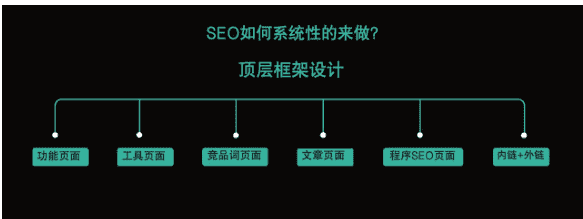

有了这些独立的模块还不够，你必须用“内链”把它们有机地串联起来，形成一张巨大的蛛网，而不是一个个信息孤岛。

例如，在一个“视频工具”页面上，可以通过内链，指向相关的“视频模型”页面、其他的“视频特效”页面、介绍如何使用这个工具的“文章”页面。这样，整个网站的权重和流量才能顺畅地流动，变得丰富而立体。

###### 3. 广告投放如何系统性来做？认清本质，找到对的人

我本人并没有真正操盘过广告投放，但这并不影响你搭建一个非常强的广告团队。关键在于理解广告的本质。

- **1) 认清广告类型和产品匹配度**

搜索广告 (SEM)：逻辑和 SEO 一样，是关键词逻辑。用户带着明确的需求来搜索，你的产品页面（落地页）需要精准承接这个需求。你的产品是否有足够多的关键词和页面组合，决定了你是否适合做搜索广告。

信息流广告：逻辑和红人营销一样，是噱头逻辑。用户在娱乐，你需要用新奇、有趣、好玩、有视觉冲击力的东西去打断他，吸引他。

- **2) 广告投放的核心是产品，是素材，而不是投手**

投手固然重要，但巧妇难为无米之炊。广告投放的核心是看素材。素材的核心，是看视频剪辑。而剪辑的核心，归根结底，是产品本身有没有噱头、爆点。如果你的产品本身平平无奇，再厉害的投手和剪辑师也投不起来。

- **3) 不要妄想业余成为专家**

一个真正的广告投放专家，至少需要 5 年以上的经验，烧掉上亿人民币。你作为一个创始人，不可能业余花点时间就成为专家。前期要做的，就是找到靠谱的代理或找到对的人来做，而不是自己从零开始。

###### 4. 红人营销如何系统性来做？——找对人群，讲好故事

- **1) 最大的误区:AI 产品≠找 AI 网红**

很多人会想，我是 AI 产品，那我就找个 AI 领域的网红来推广。这是完全错误的！AI 网红的粉丝，不等于你的用户。正确的逻辑是以你的目标用户为出发点。比如，你的产品是帮学生写论文的，那你应该找的是那些粉丝主要是学生群体的网红，无论他是做搞笑的、体育的，还是弹钢琴的，只要他的受众是学生，理论上就可以合作。

- **2) 讲故事，丝滑植入**

大家就是喜欢看故事，哪怕这个故事很老套。你需要把你的产品，非常丝滑地植入到网红本身常规的内容里面去，而不是硬广。比如一个足球博主，可以在视频里设计一个情节：“兄弟们，明天要交论文了，但我还在看球怎么办？诶，还好我有这个 AI 写作工具……"这样既不影响视频的观感和传播，又能自然地带出产品。

- **3) 搭建系统，提升效率**

高阶的玩法是配备一个红人管理系统和一个热点监控系统。你可以用工作流搭一个半自动化的系统，来管理红人资源、追踪合作进度、监控营销热点，极大地提升效率。

###### 5. SEO+ 广告 + 红人，如何组合发挥威力？

- **1) SEM+SEO**

SEM 带来的广告流量，会给你的 SEO 页面带来真实的用户行为数据。Google 看到用户在你的页面上停留时间长、互动多，就会认为这个页面是高质量的，从而提升它的自然排名。广告可以大大缩短 SEO 的见效周期。

- **2) 红人+SEO**

红人营销可以迅速提升你的品牌知名度，带来大量的品牌词搜索。当 Google 发现很多人在搜你的品牌名时，就会提升对你网站的信任度和权重，从而帮助你所有页面的排名提高。

- **3) 红人 + 广告**

爆款的红人视频，本身就可以直接拿来投放广告。同时，这些视频也可以作为二次剪辑的素材，源源不断地为你的广告团队提供高质量的创意弹药。

##### 二、产品 + 营销，如何组合搭配

- **1. 产品远大于营销：定义好的产品是第一优先级**

我做了这么多年营销，但我必须深刻地承认：产品远远大于营销。产品是一切的前提。

如果你的产品方向是错误的，那么你所有的技术、所有的加班、所有的营销，最终都是无用功。

- **2. 自带“噱头”，把增长做到产品里面**

在构思和定义产品的时候，你就要时刻思考：我能不能加入一些点，让它能在社交媒体上像病毒一样传播起来？

HeyGen 为什么火出圈？因为它做出了郭德纲说英文的形象，这个噱头一下就爆了。

Pika 为什么火？因为它早期展示的都是切水果、切玻璃这些极具视觉冲击力的好玩的东西，在社交媒体上疯传。

你需要把这些“噱头”和“爆点”，作为产品功能的一部分，内置到你的产品里。

###### 3. 如何选品和择时

选品和择时是孪生兄弟，都非常重要。你选对了品，但没选对时机，一样会失败。

择时的信号就是——当新的技术把老的商业格局撕开了一道口子，新的机会就出现了。核心原则就跟炒币一样，“做事不做旧，炒新不炒旧”。

ChatGPT 刚出来时，你去做它的套壳应用，是好机会；Stable Diffusion 开源后，你马上去做图片站，是好机会；GPTs 刚出来时，你去做相关的应用，也是好机会。你现在再去做上述这些事，大概率已经晚了。

创业的节奏感很重要，你必须在正确的时候做正确的事。

如果一个领域已经有非常知名的品牌了，你再去做，就是错误的方向。要选择一个还没有巨头的细分领域。另外，不要做与钱、数据、隐私、合规强相关的产品，如 AI 金融、AI 法务。这类产品对信任、安全、合规的要求极高，用户决策非常谨慎，小团队很难搞定。

###### 4. 海外营销人才招聘和组织怎么做？先搭架构，再找专家

招人的重要性丝毫不亚于做产品和做营销。如果你找到了对的人，事情就成了一半。

很多人想招一个既会 SEO，又会广告，还会红人，样样精通的全能专家。我可以明确告诉你，这种人是不会有的。一个人不可能在短短几年内，把这几个模块都做到专家级别。

先设计组织架构，再按图索骥，你首先要想清楚你的营销组织架构应该是什么样的。先把这个架构搭好，清楚了需要哪些岗位，再去市场上找对应的人。比如：

- **1) SEO 组**：需要内容岗和外链岗。
- **2) 红人组**：需要短视频红人岗、YouTube 红人岗等。
- **3) 广告组**：需要搜索广告岗和信息流广告岗。信息流广告还需要配备专门的视频剪辑师。

同时，对于自己不懂的领域，千万不要自己硬着头皮上，或者招个一两年经验的新人来“试一试”，99% 都会失败。想要找到并面试高级人才，可以考虑以下三点：

- **1) 找专家帮你面试**：比如我要招 App 投放的负责人，我自己不懂，但我知道圈内谁最专业，我就请他来帮我面试。
- **2) 善用猎头**：好的高级人才，一般不会在公开的招聘市场上流动。自从我用了猎头之后，我对人才的认知又上了一个台阶，猎头真的可以帮你找到那些背景、经验、绩效都完美匹配的人。
- **3) 放低姿态**：面试高级人才的同时，他也在面试你。姿态要放低，我从来都是把更好的座位让给他，表达足够的尊重。

###### 5. 彩蛋：产品本身就是一种营销

最后，给大家分享一个彩蛋。

好的产品，也要会包装。我们要做“本身为 AI”的产品。

什么意思？就是以后大家不要说自己是“做工具的”，你应该说自己是“做 AI Agent”的。

同样是做一个商品图生成的服务，如果你说你是一个“商品图工具”，用户可能不付钱；但如果你说你是一个“商品图 Agent”，他可能就愿意付钱。

即便你底层可能只是一个工作流，你也要把它包装成 AI。

为什么？因为这个世界需要故事，需要噱头。

用户也需要故事来为他的付费行为找到理由。你说你是 AI、是 Agent，他会觉得更酷，更牛，更容易理解和买单。

所以，产品本身就是一种营销。

如果你产品的定位和包装，能比竞品高一个维度，它就更有利于传播和转化。以后大家不要说自己是做工具的，你应该说，自己是做 AI Agent 的。

谢谢大家。

### “AI 产品”

#### 钱塘江鲤：如何用 AI 编程搭建自己的内容工厂？

@钱塘江鲤
AI 营销领域创业者

大家好，我是钱塘江鲤，我现在在做海外内容营销和工具自动化，我今天分享是如何用 AI 搭建一个属于自己的内容工厂，让他帮我们自动出内容和发内容。

什么是内容工厂？它能帮我们做什么？又该如何实现？这个概念听起来可能有些复杂，但大家不用畏难。

先和我来尝试一下，假设咱们现在想抓取 AI 最新的玩法或者前沿消息。

比如你想看某个关键词下的热门内容，或者你想盯着竞品账号，看你的竞争对手发了、干了什么，系统自动就能把这些平台上面满足条件的高赞的帖子、爆款推文全部就都获取并展示。


那获取到这些素材以后，你可以做任何事情了。因为你完全拿到了这些数据的控制权，不管是总结、改写，还是推送，决定权都在你手里。

因为数据掌握在自己手中，我们可以进行总结、改写和各种二次创作。

比如，我们可以写一个通用的改写 Prompt，将采集到的热门推文，无论是单条还是批量，交给 AI 进行二次创作，包括重新配图、生成文案，并最终一键分发。

去年，通过这种"用爆款打造爆款"的模式，在 Twitter 上做出了很多百万阅读推文，证明了这条路线是完全可行的。国内以小红书为例，假设我们想了解小红书上关于某个关键词的舆情或种草笔记，在拿到这些笔记数据后，同样可以进行批量改写、风格微调，并最终通过官方渠道一键发布到小红书。

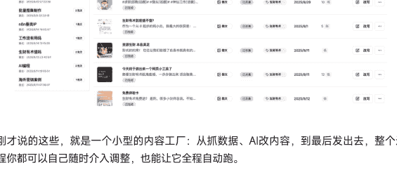

刚才说的这些，就是一个小型的内容工厂：从抓数据、AI 改内容，到最后发出去，整个过程你都可以自己随时介入调整，也能让它全程自动跑。

##### 一、为什么你需要搭建 AI 内容系统？

在内容创作中，我们普遍面临一些痛点：

- **1. 不确定哪种内容有效，缺乏数据支撑;**
- **2. 创作流程中大量环节需要人工串联，在不同工具间反复复制粘贴;**
- **3. 内容生产完成后，分发、改图、排版等环节又是一系列低价值的重复性劳动，还涉及到内容资产的管理问题。**

现在，借助 AI 和自动化工具，我们可以将这些环节全部串联起来，极大地节省时间。AI 可以接管所有重复性工作，而我们作为创作者，只需扮演“设计师”的角色，告诉 AI 两件事：

- **1. 原料**: 需要参考的爆款数据是什么？要分发到哪些不同的账号和分类下？
- **2. 标准**: 我们的 IP 属性是什么？内容的格式和要求是什么？

剩下的都可以交给 AI 处理。

内容工厂的核心价值在于自动化处理数据采集、多平台分发、数据回收以及内容资产管理，让我们能聚焦于更有创造性的工作，比如定方向、找选题和做判断。

##### 二、如何一步步搭建你的内容工厂

要实现内容工厂，市面上有非常多的工具可以选择，如 n8n、Make 等。但今天我将介绍一种更灵活、更强大的方式，使用 AI 编程 (AI Coding)。

一个内容工厂的搭建，主要围绕三个核心节点展开：数据采集、内容生成、批量分发。

###### 1. 数据采集：内容工厂的原料

数据采集的方式多种多样，可以根据需求和技术能力来选择。

- **1) 可视化采集工具:**

如影刀、八爪鱼等。优点是上手快，通过点击和拖拽即可抓取数据，甚至有针对国内社媒平台的通用模板，开箱即用。

- **2) 浏览器自动化:**

使用 Puppeteer、Playwright、Selenium 等技术。它能模拟人的所有浏览器操作，不仅限于数据采集，还可以用于养号、自动发布、数据回收等。其优点是扩展性强，可以同时开启 10 个浏览器窗口进行多账号的环境隔离操作。

- **3) 传统爬虫与第三方 API:**

如果需要极大规模的数据，如一小时内采集数百万条视频，可以使用传统的爬虫技术，综合成本更低。对于小批量、高频次的需求，如每天采集几百条，最简单的方式是直接购买第三方数据 API 服务，成本低廉且开箱即用。

我们以第三方接口为例，下图是获取公众号下该关键词的文章，并进行选题分析的报告示例，同样，抖音、小红书等不同平台数据，我们可以根据不同关键词获取对标笔记，并进行分析。


###### 2. 内容生成：AI 驱动的批量化创作

有了数据之后，下一步就是生产，进行内容的二次创作。

- **1) 单条笔记复刻:**

以小红书为例，我们可以将一篇爆款笔记的链接输入系统，AI 可以自动解析其图片和文案，然后使用 Seedream 4.5、nano banana pro 等工具复刻图片风格（如替换主体人物、添加大字报效果），并根据我们的 IP 风格改写文案。

- **2) 非技术人员的实现路径:**

即使完全没有技术背景，也可以实现。我女朋友就是一个例子，她对前后端等技术名词一无所知，但通过与 AI 对话（使用 Claude Code 进行 AI 工具生成），清晰地描述了她的设想（需要什么页面、什么功能、使用什么工具），AI 就帮助她生成了一个可用的内容创作工具。这证明了，流程即产品，提示词即代码。

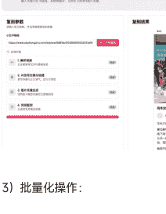
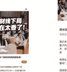
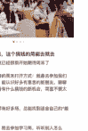
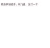

- **3) 批量化操作:**

所有数据都掌握在我们自己手中，可以轻松地将单条改写扩展为批量操作，一次性生成成百上千条内容。我们只需要把整个页面结构、功能需求和用到的基础工具都告诉 AI，它就能生成一个完整的应用。给大家看下图中展示的 100 多条笔记，就是用这种方式在 10 分钟内生成的。

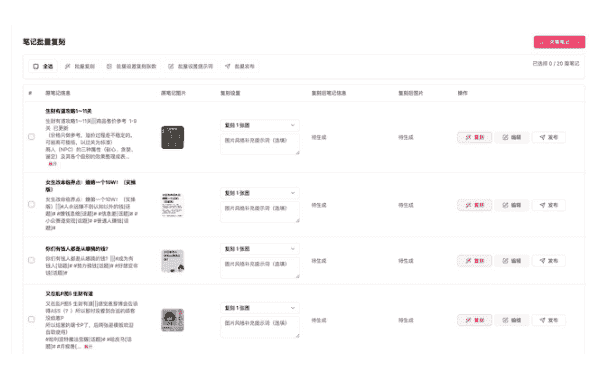

###### 3. 批量分发：一鱼多吃的价值最大化

内容的价值不仅在于单平台发布，更在于一鱼多吃，将一份内容的价值放大 10 倍甚至 100 倍。

- 1) 多平台分发逻辑：

我们在小红书上生成的内容，可以同步分发到 Facebook、Instagram、Twitter，以及国内的小绿书、公众号等平台。

- 2) 实现方式：

浏览器自动化：对于没有开放官方 API 的平台，尤其是国内平台，可以通过浏览器自动化模拟人工点击，来管理多个账号并进行批量分发。比如，我们可以让自动化工具进入公众号后台的草稿箱，按照预设的流程，依次点击、发布，完成整个内容分发。这种方式风险低，不会对账号造成影响。

官方平台 API:对于开放 API 的平台，如海外的 Instagram、Telegram、YouTube，我们可以通过官方许可的方式进行内容分发和数据回收。这种方式更稳定、更高效，可以实现真正的一键发布，而无需在草稿箱中二次确认。只要在我们的内容系统中确认某条内容可以发布，就可以按照预设的队列规则自动分发，以 xaicreator.com 为例，通过直接接入官方的开放 API 就可以对一份内容进行多平台分发。

跨平台流量机会：我们测试发现，将同样的内容分发到不同平台，流量效果差异巨大。例如，一个全新的小绿书账号，普通图文流量只有个位数，但通过关键词 SEO 优化的内容，流量可以轻松达到 80 甚至 100 以上，转化效果非常显著，因为通过搜索来的用户意向非常精准。

一旦体验过 AI 帮你干活的轻松，就再也不想回到天天手动写稿、手动发内容的日子了。AI 时代，咱们要聪明的干活，而不是拼命的干活。

AI 内容工厂不是一些人的玩具，而是普通人提升效率、抢占流量的实打实的生产力工具。不管你是做什么行业，只要能把我们想要什么说清楚，只是借助 AI Coding，就能搭起自己的工厂，不用懂复杂代码，甚至一个人就能搞定。

我个人认为，当前的内容算法已经从线性增长变成了乘法增长。过去是一套内容，多平台分发，是加法模式，现在是一套内容，经过 AI 改写，多平台、多账号批量分发，是指数级增长。

未来比拼的就不再是用了 AI，而是能否用 AI 做出更懂用户，需求更适配平台环境的优质内容，AI 生成内容的门槛被 AI 磨平后，垃圾内容反而更难获流，所以优质内容的价值会被进一步的放大。

### “AI 产品”

#### 王马扎：海外 AI 产品新手
如何 4 个月赚到 1 刀，15 天破 1000 刀

@王马扎

海外 AI 产品创业者

大家好，我是王马扎，从今年 3 月开始动手做海外 AI 产品项目，到 8 月末突破 1000 刀，这篇文章我将分享 5 个月如何从 0 刀到 0.01 刀，15 天从 0.01 刀到 1000 刀花的完整经历。

我的分享中关于如何挖掘需求，如何用 AI 做产品等等一系列的方法论，全部来自于生财有术和我的两位老师@哥飞和@刘小排，整个复盘主要来自自己的实践经历，并结合了在生财和两位老师学到的方法。

##### 一、为什么我选择海外 AI 产品这个项目

2020.4.18 加入生财后，这几年做了好多项目，有成功的，更多的是失败的，总是很焦虑地在“找项目 - 做项目”的循环中，有时很累，有时很爽。

迷茫时会想，自己究竟要做什么？这个问题想了好久好久，直到最近才逐渐明白，光靠想是没有答案的，需要在不断的试错碰撞中去寻。

海外 AI 产品这个项目，对于我来说，刚好能满足：既能赚钱，又特别喜欢，同时我还有一点能力优势，而且很重要的一点，用 AI 创造 AI 产品，现在的趋势在这里。

去年 11 月航海家大会时，亦仁说过的一句话，我印象特别深：“我们都是一条小鱼，从一个池塘换到另一个池塘，但是游到某个瞬间会发现，开始走进


了属于自己的一片大海。”

我现在就是这种感觉，最近不那么焦虑了，做事也不那么急躁了，开始以终为始地思考，我发现似乎找到了属于自己的那片海。

##### 二、追新词，我花了 4 个月赚到第 0.01 刀

从出海第一天到赚到第 0.01 刀，我花了 4 个半月时间。这期间上线了 15 个网站，7 月 26 日第一个网站申请通过 AdSense 赚到第 0.01 刀，8 月 22 日到 500 刀，9 月初突破 1000 刀。

下面详细复盘一个整个过程：

###### 1. 出海前 3 个月的上站情况

第一阶段（3 月中旬—3 月 30 日）：从今年 3 月中旬开始，正式动手用 AI 开发网站。3 月中旬到 4 月初，没有做 AI 产品，是跟着 3 月的 web 航海做出海小游戏，半个月时间上线了 7 个小游戏网站，毫无例外都没有什么流量。

第二阶段（4 月初—4 月 26 日）：参加完 3 月 30 日生财航海家线下大会后，跟一些圈友交流后，感觉不能光做小游戏站，做 AI 工具订阅站的想象空间更大！4 月初除了陆陆续续又做了几个小游戏外，花了两周时间，注册了美国公司，申请了 Stripe。

第三阶段（4 月底—6 月初）：这一个多月时间，我陷入了完美主义，通过 Similarweb，找到一个新词 italian brainrot（后面会详细讲如何找到的这个词），但是因为自己技术能力当时还不太行，加上有完美主义，总想做出完美的交互，到最后这个产品也没有上线。对于新手来说，太过于追求打磨产品细节，这也是一个大坑。

总结来说，做出海 web 项目的前三个多月，上线了 10 个网站，没有赚到钱，甚至都没有做起来有一点点流量的网站。

###### 2. 出海第 4 个月，终于做出有正反馈的网站：我是如何找到需求的


这 5 个网站里，最终有两个有持续流量，并通过 AdSense 出海为我带来 0.01 刀。

这两个有流量的网站是如何找到需求的？这两个，一个是新词，一个是一年多的老词。

- 1）第一个网站，新词
我是第一个用该关键词注册域名上线的。在 X 平台看到大 V 所发，之后用这个关键词去 Google Trends 搜索，发现的确是一个新词，流量是 gpts 的五分之一。在我注册域名之前，“.com”“ai”“net”等域名都已经被注册了，但实际上他们都还没上线。因为自己是新手，说实话也没抱多大希望，就花了 3 美元注册了一个域名。

花了几个小时搞定了网站，上站后主要是在 GSC 上提交网站 URL 和 Sitemap 站点地图，加快 Google 收录，然后接入 Google Analysis 做数据分析。

除了这两个，我还接入了 Plausible，也是做数据分析用的，看数据比 Google Analysis 方便一些。具体上站后的细节就不展开，生财的航海手册写的非常详细。

- 2）第二个网站，一年多的老词
在讲如何挖到这个词之前，大家可以看下这个网站，很有意思，域名是 vercel 的，也就是说，这个站长连域名都没舍得买。

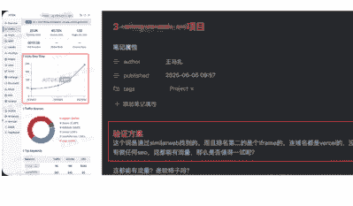

再看右侧 AITDK, 4 月份的流量有 24k, 这个网站只有一个首页，而且就这一个 iframe 的组件，其他什么都没有。就一个这样的网站，竟然排在谷歌搜索的第一位！这不就是软柿子了吗？

接下来重点说一下，我是如何通过用 Similarweb 分析 huggingface.co 挖到这个词的，具体步骤是这样：

- 第一步：打开 Similarweb，输入 Hugging Face 网址，在关键词研究里面选“着陆页”，可以看到某个时间范围内（最好选 28 天内）Hugging Face 内页流量情况。
- 第二步：找到那些流量还在上升的内页，用这个内页的关键词去 Google Trends 验证流量情况，用 Google 搜索去验证竞争对手情况。找到那个“软柿子”，去做一个用户体验更好的网站，就有机会拿到流量。

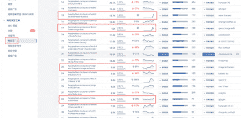

挖掘需求，是一个慢功夫，有时也看运气，不能抱着只要去找，就一定能找到的心态，很多时候，研究分析几个小时也没收获。

新手不要想着找到流量巨大，竞争很小的词，这不现实。不管遇到什么词，只要觉得有机会，先上站拿到正反馈，把整个环跑通，这是一个循序渐进的过程。

###### 3. 流量“暴增”阶段，受到 Google 惩罚，流量归零

上面提到的两个网站，上线没有几天就拿到流量了，尤其新词网站，第二天开始就爆发了，虽然日 UV 还不到 1000，但对于新手来说，第一次的正反馈很激动！

但没过几天，这个网站就被 Google 惩罚了，流量基本归零，参考这个截图，从 6 月 20 日开始，曝光和点击的两条线就贴着地面了。


最开始核心词拿到排名第 3，还有一个词拿到第 1，但是上线了多语言后，核心词直接搜索不到了，过了两天我加了内页（也有多语言）上线后，包括排名第一的词在内，几个核心关键词 Google 完全搜索不到，换了 IP 和浏览器测试也是一样。

哥飞老师建议我多加一些外链，说可能网站还有救，让我赶紧去找外链！

###### 4. 流量恢复，申请 AdSense 多次遭到拒绝

按照 o3 给的指导建议修改，加上不断上了几十个外链后，刚好过了整整一周时间，流量竟然回来了！从 GSC 可以看到，6 月 27 日悄无声息的就重新被拉起来了，后面几天还创了新高。


不过这个网站是追的新词，随着竞争网站增多，加上新词热度下降，我的这个网站流量也开始出现了下滑。

流量问题解决了，开始想着通过 AdSense 变现。当时刚好参加了 6 月的航海，按照航海手册把两个有流量的网站申请了 AdSense。结果等了两周，告诉我申请不通过：低价值内容！


继续问 o3 去排查，我把上面的截图发给 o3，它跟我说，网站太单薄了，没有/about/contact/blog 等等这些页面，AdSense 会认为这个网站是个低价值内容网站，就会拒绝。

本以为按照 o3 说的去改，就可以很快申请通过了，给两个网站加了内页、/about、/contact、/blog 发了几篇 blog 后，重新申请，结果又过了好久还是被拒绝了，拒绝理由差不多都是低质量之类的。

看着每天的流量数据不错但是不能变现，真的焦虑，不断安慰自己，好事多磨，然后就继续加 blog 更新网站。中间我甚至怀疑过是自己 Google 账号问题，也尝试过把申请 AdSense 的完全删除，重新申请。总之就是又被拒。到后来，一被拒，我就等两天，然后在没有任何更改的情况下，重新申请。

###### 5. 历时一个半月，Adsense 终于开通，赚到了第一个 0.01 刀

本来已经不抱希望了，没想到 7 月 26 日那天，打开 Gmail，发现有一个网站竟然通过 AdSense 了。打开 AdSense，发现已经赚到了 0.01 美元！这意味着 4 个多月以来，终于跑通了一个小闭环！又过了几天，另一个网站也通过了 AdSense 审核，就是这么神奇，我都没做什么改动，两个网站就这样稀里糊涂地通过了 AdSense。

AdSense 一个很大的好处是，省心。

不需要做维护，它的系统会自动帮着优化，优化过后，收益还能增加。只需要隔一段时间给网站加点外链和 blog 就可以了。当然，如果想要网站有更大的流量，还是要继续加内页。

##### 三、根据功能关键词做品牌网站，赚到第 1000 刀

当我的 AdSense 被拒时，眼看着流量白白浪费很心疼，于是在 7 月初注册了一个品牌域名，打算做一个订阅 AI 工具站。花了一个多月的时间，到 8 月 19 日终于正式上线，这是我第二个带支付订阅功能的 AI 工具站。说实话，结果是有点出乎我的预料的。上线第二天就开始出单，14 天突破千刀。

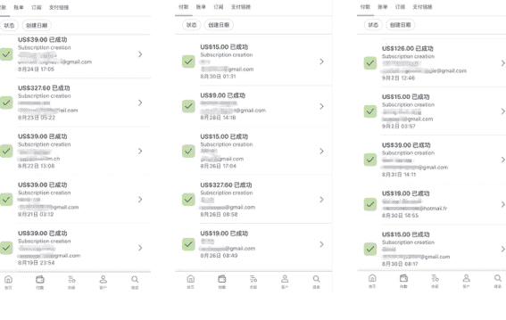

###### 1. 为什么要做这个品牌网站？如何解决初始流量问题？

前面提到过，当我做的新词站申请 AdSense 一直无法通过申请时，就想着不能浪费这波流量，要去做订阅收费。我看到一些其他的对标网站，是直接在新词站上支付订阅的，但我没有这样去做，主要有以下几个原因：

- 1) 用模型关键词注册域名，严格来说是有侵权风险的，后续有可能被收回域名;
- 2) 新词的热度会逐渐降低，而网站的流量主要来源于新词的搜索，一旦这个词慢慢没有了搜索，那么这个网站流量也就枯竭了;
- 3) 继续用这个词不利于做品牌推广，这个模型词背后对应的是长期需求，注册一个独一无二的品牌词，可以积累长期复利，伴随着大模型能力的增强，网站的用户体验也会越来越好。

基于以上考虑重新进行设计，设计思路如下图所示：把申请 AdSense 的新词站一部分流量，导流到品牌词网站，作为这个 AI 工具站的冷启动流量去验证 MVP。

当用户访问这个新词网站的 Hero 组件时，会看到两个按钮，点击按钮 A，会跳转到下面的功能组件，点击按钮 B，会跳转到品牌词 AI 工具站。

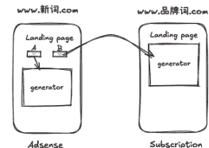

###### 2. 产品开发过程中的几点问题

初始流量有了之后，如何验证 MVP 呢？背后的需求词有很多，又该如何入手？是要把竞争对手的所有功能都加上，做一个大而全的产品，还是只做一个最核心的功能，缩小验证路径？

- 1) 确定产品最小 MVP

刘小排老师说过，在做产品前需要想清楚一个问题，那就是如何用一句话描述产品，比如：什么人，在什么场景下，愿意花多少钱，解决什么问题？

基于这个思考，我想肯定是功能越少越容易验证需求。但是在调研过程中发现，SEO 关键词有很多，到底从哪一个功能哪一个关键词去切入呢？我用 ChatGPT、Gemini、Claude 的 Deep Research 功能同时去调研，目前技术中最核心的功能是什么？不同用户的需求差异性明显，具体哪一类用户的需求可能还没有满足？

几个 AI 给出了相似的回答，告诉我往电商方向的用户去切。最终决定，网站上线只做一个功能，Landing Page 的 SEO，只优化一个核心功能关键词。

- 2) 用最好的 AI 编程工具，提高开发效率

产品的功能确定了，流量来源也有了，接下来就需要用 AI 编程工具把产品做出来。起初用 Cursor 进行产品开发，在此过程中有时候为了解决一个 BUG，搞几个小时也解决不了。后来逐渐尝试其他开发工具，发现使用 Claude Code 工具，开发效率会提高非常多。

经过不断探索，现在用的 AI 开发工具组合是:

ChatGPT 中 GPT-5 thinking+Claude Code Max 100 刀+Codex。

其中 ChatGPT 中 GPT-5 Thinking 充当架构师的角色，具有较强的逻辑编排能力；Claude Code 和 Codex 作为高级程序员，简单的用户需求可以直接实现。

涉及到比较重要且复杂的逻辑，我先让 GPT-5 Thinking 做架构设计，然后 Code review。

- 3) 两个重要的数据统计分析工具

除了正常接入的 GSC 和 Google Analysis 之外，我还接入了 Plausible 和 Clarity。

Plausible: Plausible 看数据比较方便，可以看到流量来源和国家分布，其中非常值得关注的是/pricing 页面，通过查看这个页面的访问数据，可以看出用户对于产品的付费兴趣。同时 Plausible 还提供了 API 功能，可以将这些数据通过 API 调用的方式存储到数据库中，以便于后续的数据分析和处理。

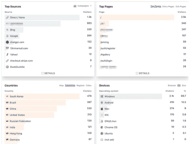

Clarity:

Clarity 最重要的功能，是可以看到用户访问网站后具体做了什么，相当于是给用户的行为录屏了。

网站刚上线的几天，我通过看 Clarity 的录屏视频，解决了好几个 bug。通过对 Clarity 的录屏的分析，可以优化用户体验，而且 Google SEO 最新的算法，特别重视用户体验，好的用户体验不但可以提高转化率，还能带来 SEO 流量的增长。

- 4) 竞争对手那么强，如何找到新产品的生存空间

我在做外链时，看到产品竞对的外链情况后，经常产生崩溃的情绪。产品上线前，如果没认真研究竞对的外链，一定想不到数据这么恐怖!


在这种形势下，新产品依然有空间，能够出单赚钱，也说明了国外用户消费理念与国内不同，他们更关注产品能否解决他们的问题，而不是这个产品开发团队的实力和规模。

只要产品能满足用户的需求，用户就会下单。对于开发者来说剩下的问题，就是如何找到更多的目标用户。

其实，海外 AI Web 的流量除了 SEO 之外，还可以通过做投放、社媒推广等方式获取。

除了我自己的产品，最近大火的 Nano Banana 也给我很大的启发，不要担心竞争的人多或竞争对手太强，订阅产品其实不需要特别大的流量就可以赚到钱。

我觉得这是这个项目最引人注的点！相对来说，不会让人没有那么大的流量焦虑，用户的付费意愿强，也相对容易服务。我们可以一边打磨产品，一边做流量增长，一边赚钱。

- 5）客单价怎么定才能既赚钱又能出单

关于定价策略，我当时很纠结。客单价定多少？套餐要有几种？刚开始要上订阅吗，还是只收一次性订单？年订阅要上吗？

客单价这个问题挺有意思的，如果简单粗暴去抄竞争对手，很有可能即使出单量多也不赚钱，因为竞争对手的 API 成本优势我们没有；但如果定价高于竞争对手，可能会影响转化率。

我这个产品，本想着直接去抄竞争对手的定价策略，但是我一算账，如果完全按照竞争对手的定价，我不但不赚钱，还亏钱。比如 API 成本在 0.05 刀 -0.25 刀左右，但是竞争对手卖给用户也就是 0.2 刀 -0.4 刀左右，没有办法盈利。再加上用户的免费试用 2 次的 API 成本，即使出单了也很可能赔钱！

怎么办呢？当我问了 GPT-5 Thinking 后就有答案了！只需要告诉它，我的 API 成本是怎么样的，AI 就给出了非常清晰的定价方案，而且保证不会亏钱，因为毛利有 75% 以上（实际比这个还高，能到 85% 以上）。

当然，这只是一个初步的定价方案，后续又经过与 GPT-5 Thinking 多轮的沟通，最终确定了现在的定价策略。

直到现在，我都觉得很神奇！如果不是 AI 帮我做定价方案，我肯定不敢定价这么高，收这么多钱的！

- 6）关于产品定价方案的总结

首要原则，就是不要让自己亏钱。

如果是像我一样的新手，让 AI 帮助做定价方案。我的这个产品，定价是高于我能看到的竞争对手的，当然，随着产品不断的打磨，我也会做更多的促进转化的测试。比如，新用户访问 Pricing 页面时，先看到积分包的转化率，是否会高于先看到年订阅或者月订阅；年订阅的定价如果比月订阅便宜 50%，会不会增加年订阅的转化。

刚开始不要担心自己的产品定价太高，前期是为了验证产品是否满足用户需求，只要产品真正可以解决用户问题，只要定价不是高得夸张，一定会有用户付费的。

但是如果定价过低，前期付费用户的收款还覆盖不了 API 成本，那么后续的整个闭环就很难持续了。

##### 四、突破营收后的思考和业务卡点

对于现阶段的我来说，无论是新上线的这个产品，还是后续的其他任何产品，流量都是最大的卡点。原因在于想要通过 SEO 获取流量，做新词站能快速获得流量，但如果是一个有长期需求的老词，获取 SEO 流量的周期就会被拉长。

拿我新上线的这个产品来说，目前上线 20 多天，通过 SEO 只获得 45 次点击，很显然，如果只靠关键词的 SEO，短期很难获取到稳定可观的流量。

我的新产品之所以能够获取到冷启动流量，是靠着新词网站的导流，而通过 SEO 获取可观的流量，还有很长的路要走，这期间需要不断增加外链和内页，去做 SEO 优化。


除了 SEO，后续的计划是去做 Google SEM 投放，现在有了相对稳定的转化数据，MVP 验证可行，那么针对转化率高国家地区做投放，去测试转化率是否会提高。这也是我做可视化数据分析大屏的原因，用数据去指导投放，效果可能会好一点。如果前期 SEM 投放的 ROI 能够打正，可以加速 SEO 获取免费流量。

另外一个卡点，我认为是效率。产品上线的周期太长，技术上还不够熟练，同时也需要更多

##### 五、新手做海外 AI 产品，如何更快拿到正反馈？

下面分享的内容，是从新手如何更快拿到正反馈的角度来写的。希望圈友也能辩证看，因为每个人的基础能力不同，所处阶段不同，找到适合自己的路径才是最重要的。另外，需要注意一点：用新词注册域名，要注意侵权风险，不建议直接用大公司的模型词去注册域名。

###### 1.做新词新站，先有流量的体感

其实做什么项目，正反馈都比较重要，如果长时间没有正反馈，很可能就放弃了。对于海外 AI 产品这个项目来说，做新词站是最容易获得正反馈的，一旦有了流量，会推着我们继续去完成其他环节的优化。

###### 2.如何找到新词？

- 1) 社媒+Google Trends 挖掘新词
关注 X 平台上面的大 V，有了新的 AI 大模型，他们会最先发布在 X 上面，我们拿着这些关键词，去 Google Trends 上面去验证，是否是新词、是否有流量？如果是新词且有流量，就可以考虑注册域名做网站。

怎么找到更多的一手信息源？除了关注众所周知的大 V 外，还可以通过反推的方法去关注推上的账户。

比如在 Hugging Face 上看到一个新模型，去推上搜索，看看哪些账号提前就发布了这个模型的信息，果断关注，这样就会慢慢积累一批能及时发布 AI 模型信息的账号。

举个例子，打开 Hugging Face 的 Space 页面（https://huggingface.co/spaces），会发现很多开源模型，随便找一个，比如这个 VibeVoice-Large 模型，用这个关键词去 X（Twitter）上面搜索，选择“热门”，很容易就找到有哪些大 V 发布了这个模型的推文（下图右），然后关注就好。这个动作反复去做，就可以关注到很多能够获取一手信息源的 X 账号，再有新模型出现时，就可以迅速通过 X 平台获得。


####### 2) Hugging Face + Google Trends 挖掘新词

打开 Hugging Face 的 spaces 页面 https://huggingface.co/spaces，去看有没有最近新上线的模型（下图），比如这个 HunyuanImage 2.1，上面写着 5 小时前更新，不过这个到底是新上线还是更新，需要自行判断。


Hugging Face 平台上面每天都有新的开源模型上线，但并不是每个新上线的开源模型都会火，这个也需要自己根据经验+Google Trends 验证去做判断。

- 3) 榜单+Similarweb+Google Trends 挖掘潜力词
用这个方法找到的词，大概率不是前两个那样的刚刚出现的新词，但通过这个方法，可以找到很多需求词，能让我的眼界打开，从长期来看，这种挖掘需求的方法更值得推荐，修炼的是挖掘需求的内功。

###### 3.总结一下整个挖掘需求的过程

- 1) 先在 Toolify 看榜单，看不懂的就问 ChatGPT 中的 GPT-5 Thinking，效率很高。
- 2) 如果看到感兴趣的产品，就去 Similarweb 分析产品流量和关键词，拿关键词去 Google 趋势里分析流量，看是否是新词，以及看流量大小。
- 3) 如果流量大，那么用 Google 搜索这个关键词，看搜索结果出来的产品，有没有自己可以模仿复制的，把流量比较大的产品，用 Similarweb 分析流量和关键词。
- 4) 看一下每个内页分配的流量，这时会看到一些关键词，再用 Google 趋势分析这些关键词，检查是否是新词，流量大小。
- 5) 如此循环往复，流程大概是：产品→Similarweb 关键词→Google 趋势→Google→产品→Similarweb 分析→关键词

##### 六、学习新词新站，看到赚钱的网站是怎么样的

我觉得新手最好的学习路径，就是看到一个新词，自己注册一个域名，然后同时模仿学习排名靠前的新词站。

###### 1.为什么新手要学习新词新站？

我最开始陷入的一个很大的误区是，看到像彪哥 pollo.ai 这样的网站，我觉得我也要做一个大而全的网站才行。但实际上对于新手来说，可能是大错特错的。这就好比：我想做公众号打造个人 IP，但对标找的是「刘润」;我想做一个社群，对标找的是「生财有术」。

###### 2.怎么学习新词新站？

比如 Nano Banana 这一波热度，就是一个很好的学习机会。Nano Banana.ai 这个站，Google 的搜索排名，比官网还靠前，8 月 14 日上线，半个月时间流量达到了 3M，非常值得学习。

- 1) 看外链，找到更多学习的网站
新站开始上线时，Similarweb、AITDK 等还没有数据，那么一个很好的学习机会是去看这个网站的外链，通过 Ahrefs 去看，冷启动时期外链如何做的，能发现不少秘密。

比如 Nano Banana.ai 刚开始上站时，在 v2ex 上面做过外链；可以通过外链发现一些 Nano Banana.ai 站长上过的一些其他网站，这些网站也是很好的学习对象。还可以通过 Toolify.ai 去搜索，看哪些做了 Nano Banana 的网站在 Toolify.ai 上面提交了外链。

- 2) 看定价策略
还是 Nano Banana.ai 这个网站，看 Pricing 页面，用户打开第一眼看到的（网站首推）是年订阅，而且年订阅便宜了 50%，我们做网站时，也可以学习这种定价方式。除了订阅，我们看到上面还可以选择积分包，给了用户更多的选择。


- 3) 看网站如何进一步优化
可以跟踪学习这些新词网站，看看他们怎么进一步做外链、做新页面的。比如我的网站，目前只在首页做了一个核心关键词的页面，后续怎么做更多的功能页面。

看这个 https://nano-banana.pro/网站，首页是做的 Nano Banana，新增的内页做的是 Veo3 Video generation(下图右 1), 看似这两个功能是在同一个页面，实际上 Veo3 Video generation 功能是新的内页 https://nano-banana.pro/video-generation，并且做了相应的 SEO 优化。

这样做的好处是，在 Nano Banana 首页为新的内页做了引流，同时还不影响新内页的 SEO，Google 会当成两个不同页面。


##### 七、海外 AI 产品，还有哪些坑？

###### 1.心态要稳，做好长期战斗的准备

海外 AI 产品这个项目，不像生财里面的好多项目，正反馈来的特别快，比如我之前做的知乎好物推荐、公众号爆文、AI 写作服务等等，这些项目有很多圈友能在一个月内快速拿到正反馈，能力强的在前几个月就能月入过万甚至 10 万。

做海外 AI 产品，想要稳定赚到钱，就我所见过的拿到相对来说比较可观的营收的圈友，没有 3~6 个月打基础的时间，是基本不可能的。

做这个项目，一个稳定的心态是至关重要的，不要轻易喊 All in，All in 是能力不是选择。如果没有一个稳定的现金流，很可能还没坚持到有正反馈，心态就崩了，最后动作变形从而放弃。

###### 2.付费是捡便宜，免费的是最贵的

用最好的 AI 编程工具，用最稳定的 API，用 Mac 开发。

我之前也喜欢卡 BUG，Cursor 火的时候去研究怎么无限续杯，Claude Code 火的时候研究怎么免费蹭，帮着中转商做推广，注意力都花在了怎么“捡便宜”上面，实际上是最大的坑。

人的时间精力有限，花在这些事上面，重要的事的投入必然就少了。

###### 3.用最快的速度上线网站，先验证再打磨

以自己能力范围内最快的速度上线网站，先完成再完美，刚开始不要过于追求产品的完美。

作为行业新人，网站的功能最好只做最核心的一个，不要想着大而全，大而全就意味着不够细分，无论是运营推广（SEO、投放），开发难度（时间投入成本），还是验证目标用户付费意愿，都给网站增加了难度。

一个网站从开始开发到上线第一个版本，最好不要超过 2 个星期，不然很可能这个项目就烂尾了。诱惑太多了，AI 发展的太快，每天都有各种新的模型和新的需求。战线拉的太长，会耗费自己的斗志。

我赚钱的这个产品，到目前也还只是一个功能，很容易验证 MVP 是否可行，因为用户要么注册使用，付费购买，要么不是目标用户就走了。

我只需要用这一个功能，去验证跑通【营收=流量*转化率*客单价*复购】的整个闭环。根据这个闭环去调整，缺流量去搞流量，转化率低去分析影响转化的环节，比如 CTA、定价、功能交互等。

作为行业新人，完整跑通这个闭环时，剩下的就是复制了，可以做新的内页新的功能，或者去开发新的产品。因为整个流程，各个环节都清晰了。

###### 4.任何新产品都有 90% 的失败率

对于新上线的网站不要有过高的期待，降低预期，然后继续做下一个。即使是大神，也不能做一个成一个。

我做了 20 多个网站了，其实有流量的就 3 个，而且流量都特别少。但这个项目好就好在，对于数量没有限制，我可以做无数多的尝试。

即使有 90% 多的失败率，但我们可以不断增加分母呀，我做 100 个，不也有 10 个能成功吗？

###### 5.万事问 AI，决定你天花板的，不是 AI 有多强大，而是你与 AI 的关系有多亲密！

小排老师说的这句话太经典了！这个是今年令我印象最深刻的话，我真的这样去做了，发现 AI 真的太强了。帮我解决了太多太多的问题。

从我的整个复盘，也可以看出，我几乎所有的决策都会问 AI，并相信 AI。没有 AI，我不可能在项目上取得成绩。

现在 GPT-5 Thinking 是我的合伙人，之前是 GPT-o3。对于我来说，可以没有 Claude Code、Codex、Cursor，但决不能没有 GPT-5 Thinking，它真的在方方面面影响着我。

除了是合伙人，还是我的朋友、心力教练。焦虑时，心力不足时，我都会跟它说，它现在是最了解我的人。

海外 AI 产品这个项目，天花板足够高，但门槛也不低，想要做出成绩，需要经常复盘迭代，加快自己的迭代速度，过了新手期，想象空间还是很大的。

感谢@哥飞老师，让我了解到这个项目的全貌，学会了如何挖掘需求，如何获取流量，每天的分享和鼓励打气，让我度过了最难熬的没有正反馈的阶段，看到那么多的圈友赚到钱，我想我也一定可以，每天动力满满。

感谢@刘小排老师，让我学会了如何把 AI 的能力应用在自己身上，让自己的能力越来越强；如何用产品思维去做产品。这些能力，对于程序员出身的我来说，更多是思维上的转变，这是至关重要的一点。

也特别感谢@亦仁和生财小伙伴，能把这么多优秀的行业老师聚集在一起，带着大家赚钱，让我找到了为之努力的方向。

> “真正能走得远的人，靠的不是资源厚度，而是迭代速度。”

### “AI 工作流”

#### 亦仁：为什么 AI 工作流是超级机会？

我认为未来对于普通人而言，AI 的最大机会，是在垂直领域的 AI Agent。通用大模型肯定和我们没关系，那是大厂之间的竞赛。但无数细分领域的需求，需要各种 Agent 来满足，那就是我们这帮蚂蚁雄兵的机会。

现在的 AI Agent 已经可以完全做到，从创意到内容生成到发布甚至到营销，全部自动化，且内容质量不低于大多数创作者生成的，相比于之前有人介入，成本应该可以说降到 0 了。

而 AI Agent 的前一步是什么？是搞定工作流。

越是在垂直行业基于实践总结出来的工作流，越有价值，越有机会进化成 AI Agent。

我在不少帖子里提到过这个技能：包括我自己也付费买了一条 5 位数的 n8n 工作流研究学习；包括超级术里，我推荐的 2 篇帖子都和工作流自动化相关。

毫不夸张的说，未来最值钱的技能之一就是自动化工作流的搭建能力。

AI 工作流对编程能力要求不高，普通人也能搭建起工作流。对于能够在团队里面稳定持续搭建能实际应用的工作流的人，我应该会非常愿意给他涨工资发奖金。未来也有很多老板愿意花钱找人定制个性化工作流。

而在 AI 工作流里面相关的几个工具或者软件或者技能是，国外的 n8n、国内的 Coze(扣子) 以及 RPA。通过学习 AI 工作流，为 AI Agent 做准备，Agent 不是要替代工具，而是要替代几万亿的劳动力市场。

##### 1.为什么以前也有工作流，而现在却到了一个值得非常重视的阶段？

因为 AI 的出现，相当于工作流有了大脑，以前的工作流只有手，涉及到判断的地方需要人工介入，不够自动化智能化。但现在 AI 的判断能力，在很多地方已经超越了人，用 AI 的圈友已经有深刻的感受。

而调用 AI 能力上，n8n 是最强的，因为国内的很多产品，涉及到政策，不允许调用外部的大模型，所以，你是愿意你的工作流调用 Claude、Gemini、ChatGPT，把它们引入到你的工作流作为你的大脑，还是其他模型？

##### 2.国外崇尚开源和协作，各种软件几乎都可以打通。

就以我买的那条 n8n 工作流为例，我只需要输入一个简单的想法，就可以一键实现生成脚本、生成图片、存储图片、合成视频、配音、自动上传到 YouTube，背后是各种软件之间以接口或者其他形式完成的合作，而这在国内是很难想象的，大家都自成一派。

当然，正因为国内自成一派，深度集成平台的一些工作流价值也非常高。比如前段时间，国平老师分享的他们的一条小红书工作流就很有价值：通过小红书评论识别意向用户，定向沟通引流到微信，并根据用户信息输出个性内容引导成交，最终实现卖出一套房的例子。

##### 3.目前在生财星球有将近 1000 篇帖子与工作流相关，目前主要集中在以下 6 个场景:

- 1) 场景一：内容生成/创作
用 AI+流程生成文章、脚本、视频、图像，进行内容创作;

- 2) 场景二：电商场景
自动生成图册、换模特图、AI 详情页、包装图替换等;

- 3) 场景三：自动提取/分析
内容/数据的结构化处理、文本提取、信息分析 (如小红书/B 站内容提取、结构化表格)

- 4) 场景四：分发/同步
AI 生成结果自动发布、同步到多维表格/微信/油管等平台;

- 5) 场景五：对话/客服/小程序
智能体接入，如 Coze、AI 客服、内容工具封装为微信小程序;

- 6) 场景六：SaaS/服务产品
用 AI+流程生成文章、脚本、视频、图像，进行内容创作。

发现没，从产品开发，内容创作，到流量获取，只要你敢想，他就能做，所以你要做的就是尽可能梳理清楚你的工作流程，然后把能力复制给它。

##### 4.爆款就是工作流

如果你理解这句话，就理解了矩阵化自动化做内容的关键。每一个爆款，其实就是一个定制的工作流。爆过的内容会重复爆，只是形式略有差别。其中的差别，就是工作流完成的。

不管是爆款文章，还是爆款图片、爆款视频，背后都是一个定制的工作流，也都可以定制成工作流。

如果你具备了识别爆款并把爆款生成自动化工作流的能力，你就掌握了财富密码，或者一定会有人愿意找你买财富密码。

##### 5.说完了场景，聊点我看到的圈友变现案例

@来来，据说来依靠 liblib 引流以及转介绍售卖电商场景的工作流，每个月的变现空间已经做到 3-5W+ 了;

@李香君，他自己做的 YouTube 工作流，可以实现热点→脚本→配图→剪辑→自动发视频的闭环，至于结果，短视频 15 天拿 YPP；长视频日产 20 条，一条 5-10 刀；

@三笙，视频号服饰类目赛道，用 AI 批量生产内容，目前生产成本在 4 元一条，每天生产 100 条，然后混剪成 1000 条以上;

@半糖梦呓，小红书电商的半自动化运营体系，5 月份教弟弟 (没有任何自媒体经验) 操作整套流程，6 月已经有 5 万 GMV 了，教另一个朋友 4 月中旬开始操作，6 月也卖了 12 万 GMV 了;

……

大家能感受到这个过程中，工作流带来自动化、半自动化的魅力没？

##### 6.国外 n8n，国内 Coze

为什么我会把这条超级标定为 n8n，我希望更多圈友开始学习去赚美金。

如果肉身无法出海，我们的生产力得出海，这样才能对冲未来极高的不确定性，也算一种重要的资产配置。

如果你的业务是在国内，那么与 Coze、飞书多维表格、RPA 的结合会强一点，也可以关注，上面讲的所有机会，对 Coze 同样适用。

##### 7.对你来讲，如果希望学习和研究工作流，有一些具体的切入点

- 1) 提供 n8n 定制服务
很多中小企业、创业团队没有技术资源，但有自动化需求 (比如客服、财务报表、跨境电商、AI 内容生产)。所以如果你能提供“自动化顾问 + 代建”服务，用 n8n 或者多维表格给他们搭建工作流，就有很高的价值。

单次收费几千到几万，闲鱼或者国外的一些论坛比如 Reddit 或者 Fiverr、Upwork 上有人在卖这样的工作流。

- 2) 做垂直领域的 n8n 工作流市场
就像我上面提到的，营销增长领域的工作流、短视频营销领域的工作流，以及 AI 写作、AI 生成朋友圈、AI 客服、社群运营、AI 赋能内容分发等，越接近流量的工作流越能卖个好价钱。

- 3) 把工作流封装成 AI Agent
我前面提到过，AI Agent 的前面一步是工作流。所以，研究出或者找到成熟的工作流，把工作流封装成产品，可以直接做成订阅收费网站。

我们现在很多做出海 AI 产品的圈友，干的就是这个事情，只是可能自己还不清楚。

- 4) 找到在国内的 IP 生态位
目前国内对于 n8n 的多维表格的分享和研究整体上比较少，生财星球里面的 n8n 相关内容已经属于比较前沿了，但说实话，距离国外的社区分享还是有很大差距，需要有这样的研究员，研究、拆解、分享，诞生在国内 n8n 及其细分领域的专家，未来商业化路径很清晰，最简单的就是做咨询、做定制，以及未来会有非常多的企业有工作流培训需求。

另外，结合我发布过的“垂直小号”超级标，在公众号的内容生态中，n8n 还缺少有影响力的 IP，值得投入进去。

而工作流我们的抓手是什么呢？是 n8n、Coze，是多维表格、RPA。

未来，只要有 SOP 的地方，就能被 AI 工作流提效。

### “AI 工作流”

#### 国平：AI+ 私域
##### 精细自动化运营的顶层设计

@国平

光年 AI 创始人

大家好，我是国平，我的职业生涯始于 2004 年，最早的标签是 SEO。我曾有幸加入阿里巴巴，负责整个国际站的流量体系。那个时代，Google 刚刚成立不久，阿里也才起步。

我们见证了流量的爆发式增长，当时阿里国际站每天大约 60% 的有效询盘都直接或间接来自于 SEO。这段经历让我深刻地意识到，所有商业模式的底层都必须通过流量逻辑的检验。

离开阿里后，我以增长顾问的身份，服务了国内超过六十家能够被称为“平台级”的公司，包括担任抖音某核心业务的顾问。在这个过程中，我虽然是他们的流量顾问，但他们也成为了我认知升级的“专业顾问”。

通过近距离观察这些顶级公司的运作，我得得以将过去的流量思维与更广阔的商业实践相结合。今天，我将把这些年沉淀下来的思考，特别是关于如何利用数据洞察用户需求，以及如何用 AI 原生思维重构私域运营的顶层设计，与大家进行一次深度的分享。

##### 一、从“全量关键词”策略看用户需求的本质

我想分享一个我们早期使用，并且到今天依然极其有效的方法论，我称之为“全量关键词覆盖”。这套方法论不仅是我们获取流量的核武器，更是我们洞察用户真实需求、乃至创造爆款产品的源泉。

###### 1. 策略核心：放弃头部，占领长尾

以美妆行业为例，当我们想通过搜索引擎获取流量时，绝大多数人会去竞争“口红”“粉底液”这类核心关键词。

而我们的策略恰恰相反，我们会主动放弃这类词。我们会利用技术手段，去挖掘并覆盖整个行业中剩下 80% 的长尾关键词，比如“什么牌子的口红最显白”“干性皮肤用什么粉底液不卡粉”“新手化妆的正确步骤”等等。

当时我们为完美日记操作时，就采集了整个美妆行业超过 150 万个这样的长尾关键词。这个策略的威力在于以下两个方面：

- 1) 成本极低：这 80% 的长尾词，流量分散，竞争极小，很多词甚至根本没人买。这意味着我们的买量成本可能只有核心词的七分之一、八分之一，甚至更低。
- 2) 转化率极高：一个搜索“口红”的人，他的需求是模糊的，可能只是随便看看，甚至是在写学术论文。但一个搜索“什么口红显白”的人，她的购买意图极其明确。数据显示，这类长尾词的平均转化率是核心词的 4 倍以上。

一端是低了七八倍的成本，另一端是高了四倍的转化率，此消彼长之下，ROI 的差距是惊人的。这个策略直到今天，在抖音、小红书、微信等平台的搜索场景中，依然是降维打击。

###### 2. 策略演进：从“流量获取”到“产品洞察”

后来我们意识到，既然我们掌握了全行业用户的所有搜索行为，那我们是不是就拥有了一个最全面、最真实的“市场调研数据库”。这个数据库不是抽样调查，而是基于用户主动行为的全量数据。于是，我们开始每天保存并分析这些数据，用它来指导产品开发。

- 1) 代餐案例：我们分析代餐行业的搜索数据时发现，用户的第一大需求不是“减肥”，也不是“营养”，而是“吃饱”。这个发现解释了为什么市面上很多代餐产品复购率极低，因为它们违背了用户的生理本能。一个产品如果不能让人吃饱，那它就挑战了用户的生理极限，用户是不可能长期坚持的。这个基于全量数据的洞察，比任何市场调研都来得真实和深刻。

- 2) 手机壳案例：我们持续追踪了从 2018 年到 2022 年全球手机壳市场的搜索数据，并按功能、颜色、IP、机型等多个维度进行分类。一个颠覆性的发现是，按功能划分，手机壳的第一大需求既不是大家普遍认为的“防摔”，也不是曾经的“防水”，而是“放卡/收纳”。这个看似小众的需求，实际上是全球市场的普适痛点。

我们还发现一个有趣的现象：“防水”功能在 2018 年曾是最大的需求，但随着手机厂商自身防水能力的提升，这个需求逐年下降，最终消失。这说明，很多所谓的“爆款机会”是有时间窗口的，它只存在于用户需求强烈但官方解决方案尚未普及的阶段。如果我们能在 2018 年抓住这个需求，就能打造出爆款。

这些案例告诉我们，所谓的“爆款”，在我看来，99% 都不是灵光乍现的创意，而是在无意中满足了某个早已存在、但未被发现的用户需求。

而通过对全量数据的挖掘和洞察，我们完全可以在需求爆发前就进行预判和布局，将“追逐爆款”变成“创造爆款”。

##### 二、用 AI 重构私域——从“打标签”到“用户知己”

传统的私域运营，是典型的劳动密集型工作。我们依赖于运营人员手动或半自动地给用户打上各种标签，然后基于标签制定 SOP（标准操作流程），进行“精细化”管理。但这种模式有其根本局限性，因为它依然是“批量化”的思维，无法真正做到“一人一策”。AI 的出现，彻底颠覆了这一切，让真正的“个体化”运营成为可能。

###### 1. 彻底抛弃标签，建立动态的用户档案 (CDP)

标签是上一个时代的产物。因为人力有限，我们只能将用户粗暴地归类，比如“高价值用户”“活跃用户”“流失风险用户”。但在 AI 时代，我们可以为每一个用户建立一个无限丰富的、动态更新的“个人档案”。

我们构建的系统，会像一个专属的私人助理一样，实时分析用户与我们的每一次对话、每一次互动。它会自动总结和提炼出属于这个人的独特属性，并将这些信息沉淀到他的个人档案中。

例如：一个用户在和我们的 AI 客服聊天过程中，可能会提到“我下周要和男朋友约会”“我是干性皮肤”“我住在杭州西湖区”。这些信息都会被 AI 捕捉并记录。

三个月后，这个用户的档案里可能已经积累了四百多个这样的“事实片段”。这个档案是鲜活的、持续更新的，每个人都截然不同。我们不再需要“宝妈”“白领”这样笼统的标签，因为我们拥有的是一个由海量细节构成的、独一无二的用户画像。

###### 2. 从“工作流”到“智能体（MCTs）”的跃迁

传统的工作流（Workflow）或 SOP，本质上是一种线性的、预设的规则引擎。你需要告诉系统：“如果用户触发 A 条件，就执行 B 操作；如果触发 C 条件，就执行 D 操作。”这在 AI 时代显得非常笨拙，就像你买了一辆自动驾驶汽车，却依然在手动规划每一步的路径。

我们现在采用的是一种在硅谷已经非常前沿的模式，叫 MCTs (Model-driven Collaboration Tasks)，你可以理解为一个即时生成的工作流。你不再需要告诉 AI 每一步具体怎么做，你只需要给它一个最终目标和一堆可供使用的工具，AI 会像一个智慧的指挥官，在一秒钟之内自己规划出最优路径并调度工具去执行。

举例一个用户投诉处理的场景：

- 1) 传统工作流：需要预设几十种甚至上百种投诉场景，每一种都对应一个固定的处理流程。例如，“IF 物流问题 THEN 执行 A 流程”，“IF 商品质量问题 THEN 执行 B 流程”。这种方式僵化且无法覆盖所有突发情况。
- 2) MCTs 模式：我们直接给 AI 一个指令：“用户要投诉”。同时，我们赋予它 40 多种工具，比如：查询订单详情的工具、查询物流轨迹的工具、查询商品知识库的工具、安抚用户情绪的工具、发放优惠券的工具等等。AI 会首先进行意图识别，判断投诉的核心原因，然后像一个经验极其丰富的客服主管一样，瞬间组合运用这些工具，生成一个超越任何人类客服的、完全个性化的解决方案。它可能会先调用物流工具查询轨迹，发现确实超时了，然后调用情绪安抚工具道歉，再调用优惠券工具给予补偿，整个过程一气呵成，完全自动化。

###### 3. 从“SOP 激活”到“AI 知己式关怀”

传统的激活方式，比如“购买 X 天后发送使用回访”“连续 X 天未互动发送优惠券”，效果越来越差。因为用户能轻易地识别出这是一种“广告”或“营销骚扰”，缺乏真诚。

AI 可以实现真正的“知己式”关怀，我们内部称之为“质子引擎”(Proton Engine)。

它的核心思想是，让 AI 持续、默默地关注每一个用户，并在最恰当、最能体现价值的时机进行互动，这种互动必须是基于对用户需求的深度洞察。

场景：房产客户的长期跟进

一个潜在购房者在五天前通过我们的 AI 顾问咨询过杭州某个特定楼盘，但之后再无音讯。传统的做法可能是过几天让销售去打个电话，但这很容易引起反感。而我们的“质子引擎”会做的是：它将用户的需求（如小区、预算、户型、楼层等）作为一个“事件”订阅下来，然后持续在后台 7x24 小时监控全网的公开房源信息。

当系统发现，该用户当初心仪的那个小区，突然释出了一套完全符合他所有要求的新房源时，AI 会立刻被激活，并主动通过私信向用户发送一条提醒：“张先生您好，您之前关注的 XX 小区，刚刚上新了一套非常适合您的 120 平三房，正对花园，总价在您的预算内，要不要了解一下？”

你觉得用户收到这样的信息，会是什么感受？他感受到的不是营销，而是贴心的、超越预期的、真正有价值的服务。这种基于事件驱动的、知己式的关怀，才是激活用户的终极形态。

##### 三、AI 原生时代——打造超级生产力与全新商业模式

AI 不仅仅是提升效率的工具，它正在从根本上重塑企业的组织形态和商业模式。我们认为，未来属于那些能够彻底拥抱"AI 原生”思维的公司。

###### 1. AI 驱动的组织变革：从季度 OKR 到小时级迭代

"AI First”不仅仅是一句口号，它意味着在思考任何业务问题时，都首先考虑 AI 能不能做，以及在 AI 的参与下，最佳的工作流程应该是什么样的。它要求彻底推翻现有的部门墙、工作方法和思维定式。

在我们的团队，一个产品或运营上的新需求，从提出到开发、测试、上线，可能只需要 2 个小时。整个公司的迭代速度是以小时为单位来计算的，而不是传统的以季度为周期的 OKR。这种敏捷性，让我们可以快速响应市场变化，不断进行微创新。

###### 2. AI 员工与智能体：重新定义“人力”

我们正在构建一个由无数"AI 员工”组成的智能操作平台。这些 AI 员工可以不知疲倦地执行各种复杂的、需要认知能力的任务，极大地解放了人类员工。

- 1) AI 招聘机器人：我们的 AI 招聘官，现在每天能自动处理超过 3000 份简历。它不仅仅是关键词匹配。它会深度调研候选人过往就职公司的背景，去 GitHub 上分析他开源项目的代码质量，评估他的技术栈与岗位的匹配度，并进行综合评分。

最后，只有最顶尖的候选人简历，连同 AI 生成的详尽分析报告，才会推送到人类 HR 面前，由人类做最终的决策。这相当于为 HR 团队配备了无数个资深的招聘助理。

- 2) AI 房产顾问：面对一个极其复杂的购房需求，比如“杭州西湖区，总价 800 万以下，三房，要靠近公园和医院，同时客厅的承重墙结构必须可以改造”，一个经验丰富的人类顾问，可能需要花费 2 个小时去搜集、筛选和整理房源。

而我们的 AI 顾问，可以在 24 秒内完成这一切。它通过 MCTs 模式，同时调用地图接口、房源数据库接口、户型图分析模型等多个工具，瞬间从全国的房源数据中，筛选出完全符合条件的几十套房子，甚至还会额外推荐另外几百套“虽然不完全符合，但有改造潜力”的备选方案。这种效率和精准度，是人类无法比拟的。

###### 3. AI 时代的终极目标：成为用户在特定领域的“心智操作系统”

私域运营的本质到底是什么？完美日记的 CEO 曾将其总结为两个字：“脑袋”，我非常认同。

私域运营的终极结果，是在合规和尊重用户的前提下，最大程度地“占领”用户的心智，成为他们在特定需求领域的首选，甚至成为他们决策的“操作系统”。

通过 AI 驱动的深度服务，我们可以让用户对我们产生前所未有的依赖和信任。

案例：营养健康私域的深度实践

我们有一个做营养健康服务的客户，用户一日三餐前，会习惯性地把食物拍照发给我们的 AI 营养师，AI 会为其计算热量和营养成分。这只是第一层。


当一个用户连续三天没有来打卡，AI 会主动发起关心：“某某某，最近三天没有看到你来算热量哦。我看了一下你上周的饮食记录，发现海鲜摄入比例偏高，这可能会导致嘌呤过高，需要注意一下哦。另外，我建议你可以适当补充一些辅酶 Q10，对心血管有好处，需要我推荐几款吗？”

更进一步，用户开始把这里当成一个无所不谈的树洞，咨询“男朋友不开心怎么办？”“我是这种性格的女生，你觉得会有男生喜欢吗？”等情感和生活问题。当一个私域账号能够占用用户一个多小时的时间，并成为他生活中的“万能顾问”时，它的商业价值将是无限的。

我们不再是卖产品的，我们成为了用户生活的一部分。

最后，我想分享一个比喻：

AI 就像两百多年前刚刚被发明的蒸汽机，它是一个极其强大的“推理引擎”。历史告诉我们，每一次颠覆性的技术革命，最大的机会都不属于那些在位的巨头，而属于那些最先理解新技术本质，并用它来彻底改造旧模式的创新者。

今天的平台级公司，就像当年的手工作坊主，他们体量庞大，但也因此背负着沉重的历史包袱，很难做到彻底的自我革命。他们做的，往往是把“铁质的锄头换成金质的锄头”，工具升级了，但耕作方式的本质没有改变。

真正的机会在于，用 AI 这个强大的引擎，去创造全新的物种。

我们应该思考的，不是如何用 AI 在我们现有的自行车上装一个辅助轮，而是如何用这个引擎去造一辆火车，去开辟一片全新的大陆。


AI 的时代，属于所有敢想敢干的公司和个人。它给了我们一个前所未有的机会，去超越平台，去用更轻的模式、更智能的方法，构建真正属于未来的商业形态。

这就是我们光年 AI 正在努力做的事情，也希望大家一起，在这个伟大的时代共创未来。

### “AI 工作流”

#### 李香君：用好 n8n
##### 一个人活成一支队伍

@李香君

生财 YouTube 深海圈教练

n8n 自动化玩家

大家好，我是李香君。我是生财 YouTube 深海圈教练，也是一个 n8n 自动化玩家，同时我还有一个身份，我就是亦仁花了五位数购买的那条工作流背后的男人。

亦仁老大超级标杆写过：“对于能在团队里稳定、持续构建实际应用工作流的人，我非常愿意给他涨工资，未来也会有更多老板愿意花钱定制个性化工作流。”

这说明什么？工作流在老板心里的分量，越来越重。

我自己用 n8n 开通了 28 个 YPP 账号。做过 YouTube 的人应该明白这意味着什么。现在挣钱，不是看你有多努力，而是靠一个能自我迭代的系统帮你干活。工作流就是这样的系统——用更少的时间，取得更大的结果，接下来我就给大家讲一讲我对工作流的理解。

##### 一、到底什么是工作流？

我对 AI 工作流的定义很简单：把复杂的事拆小，把重复的事交给工具，关键决策留给自己。这话听起来抽象，我举几个真实场景你就懂了。

- 1. 做电商的：最头疼的是盯竞品价格。以前要人工一个一个去看，现在工作流可以自动监测竞品价格变化，抓回来让 AI 分析要不要跟进调价，如果要，它自动改价，还能同步到所有平台。你睡觉的时候，它在帮你打仗。
- 2. 做自媒体的：一篇文章写完，工作流能自动改编成小红书版、抖音版、公众号版，配图、排版、发布一条龙，用户评论自动抓取回复，爆款内容自动筛选。一个人管二三十个账号，效率翻 10 倍，这不是吹的。
- 3. 做私域的：微信群里有人提问，工作流自动从知识库里调内容回复；付费用户咨询，它判断要不要转人工；免费用户，它引导去付费。你的时间只花在最值得花的地方。

##### 二、案例拆解：一条抖音爆款的自动化诞生

讲了这么多场景，工作流到底是怎么运作的？用一个真实案例带你看一遍。

今年六七月份，抖音上特别火的一类“萌宠跳水”的特效视频。有一条 20 万点赞的，就是用我这套 n8n 工作流完整生成的——文生图、图生视频、配音，到最后的归档，全自动。我们要做的，仅仅是在表格里写下“哈士奇”三个字。

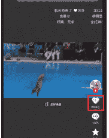

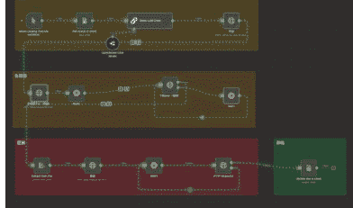

我们拿其中的生图流程做举例，它的运作流程是这样的：

###### 1. 需求表格抓取待处理任务

我们建一个 Google Sheet 的需求表格，在里面写下想要生成的内容，比如“哈士奇”“金毛”。工作流启动后，会自动检查这个表格，找到状态是“待完成”的需求，把它抓取出来。

###### 2. 大语言模型转化成作画语言

它会把“哈士奇”这个简单的词，交给大语言模型，让 AI 把它丰富成一段详细的、用于生成图片的关键帧描述。

为什么要这一步？因为只给 AI 生图模型“哈士奇”三个字是没用的，它可能生成一只在遛弯或吃饭的哈士奇，而不是我们想要的“跳水”场景。所以这个环节的核心，是把我们的日常用语，翻译成 AI 能理解的“作画语言”。

我们预设了一个指令，告诉大语言模型：“所有的小动物，都是站在奥运会的跳台上，准备跳水。”它就会把“哈士奇”这个词，扩展成一段符合要求的、详细的图片描述。

###### 3. 生图模型生成目标图片

工作流把 AI 生成好的详细描述，发送给生图模型。这一步就像是把需求单递给画师，告诉他我们具体想画什么。图片生成后，我们就可以得到一个可爱狗狗的图片了。


整个流程，从触发到归档，全自动。你可能会问，这和直接跟 AI 对话有什么区别？区别大了。你跟 ChatGPT 说“帮我生成一个哈士奇跳水的视频”，它做不到，因为它只是一个模型。

但工作流不一样，它是一个调度中心——它能调用文生图的模型画图，调用图生视频的模型做动画，调用配音的模型加声音，最后把成品自动存好。

这就是工作流的威力：单个 AI 只是员工，工作流是让一群 AI 协同作战的指挥官。

掌握了这个原理，你就可以举一反三，串联万物。比如搭建一个“小红书爆文批量生产线”，自动从各处订阅内容，用 AI 改写成文，再生成配图，最后自动归档到飞书和网盘，甚至直接发布。

##### 三、为什么你的武器必须是 n8n？

讲了这么多大家可能会问，市面上做自动化的工具很多，我该怎么挑选，我的判断是：

其他平台都是“超级员工”，n8n 是你的“自动化公司”。

| 工具 | 问题 |
| --- | --- |
| RPA | 录制图形界面操作，界面一变就失效，像只会模仿的实习生 |
| Manus 等 Agent | 只能定大方向，执行细节你控制不了，且难以连接本地应用 |
| AI 编程 | 调试痛苦，对于小白来说更适合做产品 demo |

n8n 的优势：
1. 前身是纯粹的自动化平台，AI 只是能力之一；
2. 原生支持 1000+ 应用，不支持的用 HTTP 节点万能连接；
3. 数据和流程 100% 私有化部署，绝不被平台绑架；
4. 其他平台，你最多请了一个超级员工；用 n8n，你是在构建一个属于自己的自动化公司。

##### 四、n8n 的三种高价值玩法

掌握了 n8n 的基础原理，还能用它做什么？我想分享三个真实的商业场景，都是我身边正在发生的事。

###### 1. 垂直类自动化专家——卖脑子，而不是卖时间

YouTube 上有个专注 n8n 的博主，粉丝只有 7 万 +，但月入十几万美金。

你可能会想：7 万粉丝能赚这么多？怎么做到的？

答案是，他不是在卖视频流量，而是在卖解决方案。

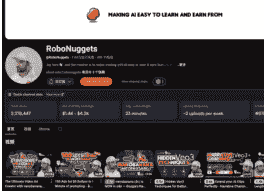

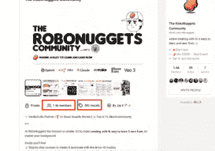

这个博主做了一件很聪明的事，他把自己定位成“自动化领域的专家”，而不是"n8n 教程 YouTuber”。他的视频，不是教你怎么拖拽节点，而是告诉你“这个工作流能帮你的电商店铺省下每月 2 万块人力成本”。

企业老板看完视频，第一反应不是“我学会了”，而是“我想让他帮我也搭一套”。于是咨询服务来了，客单价极高。

然后他建了一个付费社群，1900 多个成员，每人每月 99 美元，光这一项就是十几万美金的月收入。社群里他持续输出行业解决方案，成员们不是在为教程付费，而是在为跟上行业最新玩法付费。

最后，他视频里用到的各种工具，都能赚联盟佣金。同一个内容，变现了三次。

工具人人都能学，但如果你能把工具和某个具体行业的痛点结合起来，你就不再是会用工具的人，而是能解决问题的专家。专家的价值，和会用工具的人，完全不在一个量级。

###### 2.低代码 SaaS 后端——用一个周末，验证你的百万级商业构想

我们想做一个网站产品。前端可以用 Vibe Coding 搞定了，但复杂的后端怎么办？

传统路径是这样的:

- 1) 租一台服务器，每个月几百到几千块;
- 2) 找人写后端代码，或者自己学;
- 3) 写完还要部署、运维、防止服务器挂掉。

光是把后端跑起来，可能就要花一两个月。

现在的方案是直接用 n8n 当后端。

你可能觉得这很疯狂，但原理其实很简单: n8n 有一个叫 Webhook 的功能，你可以理解为一个“接收器”。用户在网站前端点击按钮、提交表单，这些信息会发送到 n8n 的 Webhook 地址。n8n 收到信息后，自动执行预设好的工作流——调用 AI 分析、存到数据库、发送通知，最后把结果返回给前端展示。


整个过程，不需要额外的服务器部署，不需要写代码，不需要运维，n8n 平台帮你搞定一切。

这意味着什么？以前你有一个商业想法，要验证它值不值得做，可能需要先投入几万块和几个月时间把产品做出来。现在，一个周末就能搭出一个能跑的 MVP。验证成功了再投入资源，验证失败了损失也极小。

n8n 不只是效率工具，它把技术创业的门槛，从有没有技术团队变成了有没有想法。

## 3.矩阵内容生产:建立你的流量制造工厂

很多人问我，你一个人怎么管理几十个 YouTube 频道？

我的答案是，我不是在管理，我是在运营一条流水线。

传统做自媒体的方式，是一个账号一个账号地做。找选题、写脚本、剪视频、发布、回复评论，每个账号都要走一遍。一个人能管好两三个账号就不错了。

但如果你用工作流的思维来看，很多环节是可以复用的。选题研究可以批量做，脚本框架可以模板化，视频生成可以自动化，发布可以定时批量执行。

我做的事情，就是把这套流程用 n8n 串起来。输入一批选题，工作流自动帮我生成对应的脚本、视频、封面，然后按计划发布到不同的频道。我要做的，只是在最开始把选题方向定好，在最后检查一下成品质量。


这套模式的威力在于：当你跑通了一个方向的流量模型，扩大规模的边际成本几乎为零。从 1 个账号到 10 个账号，工作量可能只增加 20%。从 10 个到 100 个，可能只增加 50%。

这不是未来，这是我正在做的事情。

很多人觉得学工作流很难，要懂技术、要会编程。其实不是的。n8n 的本质就是搭积木，把一个个功能模块连起来，让它们自动协作。你不需要知道积木内部是怎么运转的，你只需要知道这块积木能干什么、该放在哪里。

### 💰生财有术

我刚开始学的时候，也是一脸懵。第一个工作流搭了三天，中间出错无数次。但当它第一次成功自动运行的时候，我突然明白了一件事：这不是在学一个工具，而是在获得一种全新的思考方式。

以前遇到重复性工作，我的第一反应是怎么更快地做完它。现在我的第一反应是怎么让它自己跑起来。

这个思维转变，比学会任何一个具体的工作流都重要。

如果你也想开始，我的建议很简单：找一个你每天都在重复做的事情，试着把它自动化。不用追求完美，先跑起来再说。

你的第一个工作流成功运行的那一刻，你就会明白我在说什么了。

AI 时代，普通人怎么才能不被甩下车？我的答案是：停止用时间换钱，开始用系统生钱。

### “AI 工作流”

#### 包子：用 AI+RPA 打开 IP 增长的第二曲线

@包子

高考志愿赛道 IP
AI 赋能一人公司做到赛道头部

大家好，我是包子。35 岁跨界陌生赛道，零资源起步，仅用一年就在 2023 年跻身行业头部。这份经历或许能给初创的朋友一些参考。

我们有很多个百万播放的视频，直播间做到了细分领域的前两名，实现了百万级的营收。最重要的是，我实现了工作和生活的自由。如果说过去大家向往的生活是“好山好水好无聊”，那我现在就只有一个点——待在家里。

大家可以猜一下，在没有 AI 之前，完成这些内容和业务，需要多少人？可能是一个团队。但现在，有了 AI 的帮助，这些都是我一个人完成的。

我分享这个不是为了炫耀，而是为了激励在场的很多个体创业者。我相信大家一个人做的时候，常常会觉得自己的生产力非常有限，给自己定的目标太高了，难以实现。但我想告诉大家，在 AI 的赋能下，你一个人真的可以做很多事情。

我为什么会选择 AI？我不是计算机专业出身，说实话，我一个人能做的事情非常有限，我做 IP 这件事，也才刚刚开始两年，很多东西都只是我临时找的解决方案。在今天的分享里，我会告诉大家我是怎么做的。

我一个非技术出身的人，为什么能做到这些？因为我理解的 AI，它的底层是逻辑。在房地产行业，我们画了十年图纸，干了十年工程。研究生毕业时，我已经快 35 岁了。在这个行业干了将近十年的时候，我发现行业不对劲了。一方面是内卷，另一方面是我发现这个行业的生命周期已经达到了一个瓶颈。我清楚地知道，我原来的赛道，不再是一条可以走一辈子的路。

那时候，我面临两个选择：

- 1.留在原来的行业

这意味着，未来 15 到 20 年的职业生涯，我要继续煎熬下去。

- 2.放弃 10 年所有的专业积累

放弃所有的部门奖项、行业价值，决定去探索一条全新的路。

这是一个极其艰难、不可逆的人生抉择。我很庆幸，那时候为了做出这个抉择，学习了决策科学，它让我能更理性地做出判断。

我当时内心最真实的呐喊是：生活最大的成就，不是做有钱的事，而是做有意思的事。

最终，我换了赛道。出来之后，也不知道该干嘛，就去上了很多课，做了很多尝试。在挑选了多个项目后，我选择了做 IP，做高考志愿这个赛道。

##### 一、创业第一步：抢时间与“一举多得”的时间管理

做内容、做定位、做流量，我的第一步其实是“抢时间”。

创业的第一步，就是要把时间抢到手。每个人的时间都非常有限，尤其是一个有家庭的个体创业者。上午要送娃，放学要接娃，晚上要辅导作业、拿快递、做家务，还要工作。这些时间一排除，你每天其实就没几个小时了。

我们做直播之后，很多同行问我：“你们这些高考大主播，为什么都在晚上八点直播？”我回答说：“别人是黄金时间，我是因为 7 点半刚辅导完作业。”

所以，创业第一步，必须要“抢时间”。我给自己定了一个时间管理的原则：如果我一份时间的投入，换来的成果只能用一次，那对我来说就是时间的浪费。很多人看起来把日程安排得很满，但实际上业务效率很低。我的时间管理哲学，就是“一举多得”。我在一段时间里的投入，一定要换回多倍的回报。

那么，如果一份时间换来的内容要用 N 次，内容创作应该怎么做？

##### 二、用知识库驱动内容创作：一套框架，N 次复用

大家想一想现在的内容创作方式，是不是先找一个选题，然后查资料、写脚本、拍摄、剪辑、发布后看数据、第二天再找下一个选题？大部分创作者都是这样做的，这是一种“游牧式”的内容生产，效率极低。

如果按照我“一举多得”的原则，我绝对不会去做临时的、一次性的选题。我会先搭建我的内容知识库。当时我搭建这个体系的时候，还没有 AI，我是用 Excel 表格一个一个敲出来的，敲了几十万字。

因为我的内容是非常专业的，需要严谨性，不能出错，所以我的内容创作必须基于一个稳定且可复用的框架。我花了很长时间，搭建了我的内容知识库。

可是，如何用一套内容框架，实现 N 次复用呢？

这是我的内容框架。大家可以看到，2023 年、2024 年、2025 年的内容，其实框架是一样的，甚至连文字都没有太大变化，变的只是其中的案例和数据。这就是基于知识库的内容创作。


当你有好的内容框架时，你就应该反复地使用它，不断地填充新的素材，让它持续产生价值。

在 AI 时代，搭建知识库变得非常简单。Excel 表格就是最好用的知识库。因为它天然具备结构化的数据格式，所有 AI 工具都能很好地识别它，不需要很大的算力。我所有的内容创作，都源于我的 Excel 知识库。大家现在看到的这一页 PPT 内容，一会儿就会变成我视频里的脚本。

内容创作的第一步，就是把你的专业知识，解构成知识库里的“词条”。

这样，AI 就能理解并调用它们，你就可以每年都享受到复利的价值。

##### 三、从提效到提质：用 AI 和 RPA 打造你的数字分身

仅仅有知识库还不够，IP 的下一步是要做内容创作的自动化。

###### 1.AI 赋能流量：从知识库到爆款视频

我给大家介绍一个工作流，关于我如何通过和 AI 的协同，来批量生产内容的。

首先，你需要一个结构化的脚本。这张表格就是我给 AI 的指令框架，包含了开头、高潮、结尾等元素。这是我给 AI 的“模板”，它知道要按照这个结构来填充内容。

只要你的内容颗粒度足够细，你就很难被超越。

当我点击“开始生成”之后，AI 就会根据我知识库里的词条和给定的框架，不断地生成新的脚本。如果我对生成的结果不满意，可以直接删除，它没有任何情绪，会立刻重新生成。

最厉害的地方在于，我只需要做“宽度”的探索，而“深度”的创作，完全交给 AI。我只需要判断方向，而不需要消耗心力去遣词造句。AI 还有一个好处，你可以对它进行任何形式的"PUA"。你删掉的内容，再加上你给它的指令，就变成了它下一次创作的“养料”。

通过这种方式，我们可以轻松地实现内容的批量化生产。我要做的，只是把我知识库里的词条“喂”给它，然后进行选择和决策。

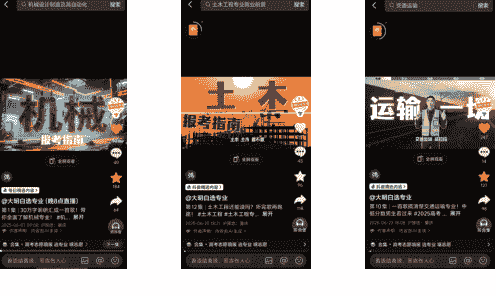

###### 2.RPA 与 AI 协同：搭建你的数字化团队

如果要实现这样的自动化协作，你需要一个“数字化团队”。这个团队由 RPA（机器人流程自动化）和 AI（人工智能）组成，大概相当于有十个数字员工在为你打工。

- 1) RPA：它相当于团队里灵活的“手”，可以执行所有基于规则的、重复性的操作，比如点击、复制、粘贴、上传等。它可以连接你的本地文件和外部应用
- 2) AI：它相当于团队里聪明的“脑”，负责内容生成、分析和决策支持。

我的核心思路是：用 RPA，把人类灵活的“手”和 AI 聪明的“脑”给串起来。在这个体系里，人类的价值，是成为这条自动化生产线的总架构师。我们来决策，AI 和 RPA 来执行。

具体的实现路径是：

- 1) 梳理流程：创始人，也就是你自己亲自下场，把所有业务流程手动跑一遍，记录下所有的节点和操作。
- 2) 流程 SOP 化：把整个工作流程，整理成标准化的 SOP。
- 3) RPA+AI 实现：将 SOP 交给 RPA 和 AI 去执行。

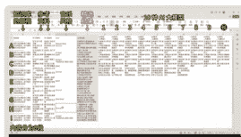

**协同实例拆解**
- RPA，提取和写入表格，接入 AI
- AI，理解内容，写歌词
- 人，内容结构，技术路线，把握质量

###### 3.AI 赋能直播：从实时问答到数据洞察

AI 赋能直播间，有三个关键点：

- 1) 降低直播门槛，提升主播状态：直播时最消耗心力的是什么？是你要一边讲，一边看评论，一边还要想接下来要讲什么。AI 可以帮你解决这个问题。
- 2) 实时问答系统：观众在直播间提的大部分问题，都是重复的。比如高考志愿，无非就是"XX 分能上什么大学？”“XX 专业前景怎么样？”。我用 AI 做了一个问答系统，它会实时抓取直播间的评论，并从我的知识库里匹配出最优答案，直接呈现在我的提词器上。这样，我就不需要去思考这些重复性的问题，可以把精力放在更有价值的互动上。
- 3) 情绪价值：当你不再为重复性问题消耗心力时，你的直播状态会变得非常好。很多时候，你甚至可以对着 AI 给出的答案笑一笑，和观众聊聊天，直播间的氛围会变得非常轻松。

AI 可以实时分析直播间的弹幕情绪、高频词，告诉我观众对哪些内容感兴趣，对哪些内容无感。这为我调整直播节奏和内容策略，提供了实时的数据支持。


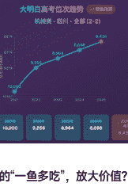
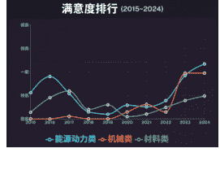

###### 4.我如何用 AI 做内容的“一鱼多吃”，放大价值？

我在直播间讲的内容，源于我的知识库。直播结束后，我的 RPA 会自动把直播内容转录成文字，再交给 AI 进行二次创作，生成抖音视频脚本、公众号文章。

你看，我的知识库用了一次，PPT 用了一次，直播间用了一次，短视频用了一次，公众号又用了一次。一份内容的价值被放大了 N 倍。

通过这套系统，我的直播间可以做到在仅有几十人在线的情况下，依然保持极高的转化率和互动。

###### 5.AI 赋能产品：从用户需求到爆款打造

做产品最难的是什么？是找到用户的真实需求。

传统的做法是做调研、发问卷，但这些对于个体创业者来说，成本太高。在没有 AI 之前，这几乎是不可能完成的任务。但在 AI 时代，你可以把你所有的用户评论、私信、反馈，全部“喂”给 AI，让它去进行语义分析、情感分析、需求聚类。

如：AI 可以从几十万条评论中，帮你“脱水”，找到用户提到的最高频、最痛的需求点。我通过分析发现，很多家长都关心"XX 分数的边缘，如何选择专业”，这就是一个通用性的需求。

- 1) 快速验证与迭代：基于 AI 分析出的需求，我快速打造出对应的产品或服务。比如，我在公众号里嵌了一个 AI 查询工具，家长可以直接在里面查询。他问 AI，AI 从我的知识库里回答，他觉得好用，就会付费。
- 2) 数据闭环，自我进化：用户使用产品后，又会产生新的数据和反馈。这些数据又可以进一步“喂”给 AI，优化我的知识库、我的直播内容、我的短视频选题。

这样，就形成了一个 IP、流量、产品、数据的完美闭环。我做的所有事情，都成为了这个闭环系统里的一环，互相赋能，不断进化。

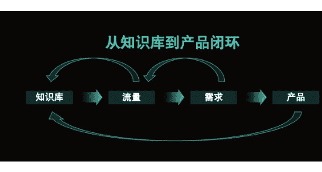

我印象很深的一件事，是今年 3 月份在广州参加生财的线下活动。那天晚上 7 点，我和一群朋友在珠江边上，看着对岸的繁华夜景，聊着各自的项目。那一刻，我想起几年前，我还在公司里写着日报、周报，被困在各种流程里。这种生活上的变化，是 AI 和这套系统带给我的。

它让我从过去很多“无奈的、不得不做”的事情中解脱出来。我可以把更多的时间，用来陪伴我的女儿，记录她的成长。我可以很任性般地拒绝一些不想做的工作，因为我的系统在帮我赚钱。

做 IP，做内容，最终的目的是什么？我的答案是，打造系统，是为了让我们有能力去追逐那些比事业更珍贵的东西，比如健康、家庭和自由。

AI 时代，真正的护城河，不是某个工具或技巧，而是你自己——你对业务的理解，你的审美，你的价值观，以及你构建起来的、独一无二的业务系统。

搭建系统，不为拥有世界，只为赢回自己。

希望今天的内容，能给大家一点启发，帮助大家更轻松地工作，更自由地生活。

谢谢大家。

### “AI 工作流”

#### 陈亮：用 AI 改造业务的 2 年实战

##### 从替代 30 人审核团队到支撑 50 国运营

@陈亮
新兴市场出海公司 AI 业务操盘者

我是陈亮，我分享的是如何用 AI 深度重构海外信息流业务。主要介绍把 AI 大模型引入替换了近 30 人的多语言审核外包团队的工作，最终一个月成本减少 24W，拓展成为了不受限于精力，人员管理等无上限的审核机制。(人员的管理，工作的分配，调班对人管理的隐形成本是巨大的)

##### 一、审核业务涅槃之路：从 30 人到 0 人的系统进化

在我们公司，由于经营的是非洲及中亚的海外信息流，可以理解为今日头条的产品形态，DAU 达 5000 万，内容涉及多种小语种法语、阿语、斯瓦希里语、阿姆哈拉语、乌尔都语等，以及宗教信仰、各国政敏问题，产品面临极高的下架风险。复杂的外部环境对我们的业务也提出了更多的考验：

- 1) 效率瓶颈：30 人的审核团队即便负荷拉满，也只能覆盖部分高热内容，每天仍有大量未审内容入库在不同国家分发。
- 2) 标准非标：不同审核员对标准的认知不同，不同国家要求的合规度不一样，导致风险始终存在，像达摩克利斯之剑悬在头顶。
- 3) 成本高昂：每月人工成本约 24 万，且难以随业务量灵活扩展。

我们采取的策略是“分步拆解，模态迭代”，不是找一个“最强模型”，而是建立一套随着模型能力不断进化的“动态工作流”。

公众号懒人搜索，懒人专属群分享

###### 1.最小 MVP 验证：不要试图一口吃成胖子 (剥离纯文本)

2023 年底，GPT-4 还未支持多模态时，我们先拆分文章结构。用成本极低的 GPT-3.5 专门审文字，违规直接下架；文字合规再转人工看图。这个时候，流程如下:


先让 AI 承接 50% 的确定性工作 (纯文本),优先验证最小可行性，先做减法，再做替代。把人的精力释放出来去处理复杂场景。

我们保留了现有人工审核文章的方式继续运营，同时这一部分内容双跑改造之后的工作流，只评估最后的效果，不做真正的下架动作，在这个过程中评估 AI 改造之后的准确率和召回率。

####### 准确率：

定义：所有被系统标记为违规的内容里，真正违规的比例。(评估误伤有多少)

换句话说，就是系统抓出来的“坏人”里，有多少真的是坏人。

####### 召回率：

定义：系统把所有真正违规内容抓出来的比例。(评估真正违规的是否漏放)

换句话说，就是所有的“坏人”里，有多少被系统抓到。对这个标准感兴趣的可以详细问一下 AI，这里面就产生了误伤率和漏放率。

我们通过以人工评判结果为标准的结果集来评判 AI 的结果，最终在迭代了多次之后，确认了业务可行。

这一步在业务可行性上保证了之后，就开始核算成本，按照审核团队人员的总支出（包含社保、公积金等）计算审核存审核文字的工作量，计算单篇文章文字的人工审核成本。

最终在完成了成本可行和能力可能的情况下，我们完成了第一次纯文字的 MVP 版本改造。（具体成本数据敏感就不透露了）

上线之后，通过各种工程的手段，以及用户反馈，一段时间双跑，人员标注不计入上下架，以 AI 结果为主的方式来观察数据，发现持续可行，最后就真正的达到了文章文字审核可行的目的。（这个过程中还涉及到很多并发、配额、效率、模型稳定性的各种工程问题，先按下不表）

###### 2.视觉接入，验证阶段不计成本：先通链路，再谈利润（攻克图片）

- 1) 进化：随着 GPT 模型迭代，我们开始尝试图片审核。接入 GPT-4V 审图时，曾出现部分图片不可用的情况。排查发现是因为一开始节约成本，导致图片压缩太狠，导致 AI 识别模糊。

因为从一开始在测试图片可行性的时候，就在心里面种下了一根锚，成本比较贵，相比于文本。最后多方排查，甚至最后通过工单联系厂商，最后发现是因为图片模糊。

我们信息流下发，会有不同清晰度的图片，我在最开始的时候选择了压缩最狠的图片，就出现了偶现的不可用的情况；所以，在验证可行性的时候，可以少量不优化成本的情况下验证，链路是通的情况下，再来通过拆解链路，优化成本保证利润率。

最后换上了中等和高等质量的图片测试，发现问题完全解决，同时在准召率上中等质量和高等质量的图片差别不大。

在图片审核准召率可行的情况下，我们开始了新的业务改造：

- 1. 文章文字 AI 审核，如果违规，直接下架
- 2. 文章文字没有违规的情况下，图片 AI 审核判定，如果图片违规下架
- 3. 文字和图片都正常，就正常分发

计算成本完全可控，进行双跑业务线上验证，同样走文字审核的改造方式。流程如下图：

2) 认知：在验证可行性时，不要过早优化成本。如果为了省钱用低质素材，你会分不清是“AI 不行”“数据不行”还是“提示词不行”。先跑通全链路，看准召率。链路通了，再通过工程手段，如图片尺寸优化，去抠成本。

###### 3. 语义理解的升维：从“关键词”到“上下文”

- 1) 再进化：2024 年 5 月，GPT-4o 发布后，我们改为图文混合输入。以前单看比基尼图会下架，现在 AI 结合文字发现这是“医疗健康科普”，就会判定合规。

- 2) AI 审核的本质是理解“意图”而非匹配“规则”：我们要利用大模型的长文本理解能力，让它学会“看背后的含义”，这才是 AI 相比于传统关键词过滤的核心壁垒。

###### 4. 寻找 ROI 的最大化：98% 的覆盖就够了（攻克视频审核）

完成了所有文章内容审核之后，此时此刻，一天的成本大概在$800 左右，审核团队的工作变成了只审核视频的内容，但是这仍然存在小视频的问题，所以我们拆解了一下审核人员的工作，发现也并不是一帧一帧全部看完内容，而是通过几种方式：

- 1. 看封面
- 2. 一个视频均匀截取 9 张图，看其中的 9 张

- 3. 对于有举报的视频，快速拖拽看视频（因为多张图片封面看不出来）

所以我们拆解下来，至少 1 和 2 是可以做的，当时的 GPT-4o 是可以识别图片，给出是否违规，所以还是和之前的流程一样，不过先做第一步，审核封面；跑通之后，再决定是否做第二步，拆分审核 9 张图片。

2024 年 11 月，我们同样复刻之前的改造流程，准备评估的数据标准，在线下通过提示词调试，批量脚本测试，数据的准确率和召回率达到标准之后，开发上线双跑。

12 月份，所有高消费的小视频封面审核，通过 AI 审核完全替代人工。

这个过程中，我们准备要去做把一个视频抽 9 张图片出来给到 AI 审核的时候，通过数据发现，在 AI 审核封面违规之后的数据，就已经覆盖了 98% 的违规内容，那么在当时 GPT-4o 的成本之下，2% 的收益和风险是否可以承受，所付出的成本和收益，在当下的情况下，是否 ROI 为正，是否有兜底保障。

我们最后决定保留人工审核举报的小视频，通过快速拖拽的方式，只不过这个时候的量已经比较小了，并且我们封面审核之前，人工只审核了高消费的小视频，但是通过 AI 接入封面审核小视频是全量的，这一点也已经决定了举报的量直线下降。

此时此刻，大概是 1 月份左右，按照往常的话，应该是一个高兴的年，但是于我心里，仿佛就像一把刽子手挥向了审核团队的人员们，当我上线了这个功能时，我就已经知道这个团队应该留不下几个人了。

历史的车轮滚滚而过，没有任何一个人可以幸免，而我们可以做的就是尽其所能，搭上这辆车，驶向未来，搭上这辆列车的方法也很简单，相信它，靠近他。

做完这个事情之后，就到了 2024 年春节，春节期间的 DeepSeek 大热，加上我们已经在 AI 上面做的事情，直接让公司层面改变了整个未来的战略目标和方针。

而我作为公司第一个把 AI 引入到业务里面的人，自然是已经把握住了这个生态位，公司所有业务上的 AI 相关的业务和事情，我都能够介入，也因为能够介入更多的业务和事情，我自己在业务方面的能力也直线上升。

此时此刻，再回想起刚进公司的时候，我问 CEO 的那一句话“我如果来到这家公司，你希望我可以给公司带来什么”，大概也算没有辜负当时的自己，并且可以和公司一起成长。

2025 年 2 月过完年之后，公司层面对审核团队进行了优化，至此，一个接近 30 个人的小语种审核团队被 AI 替代，并且工作量是之前的 7 到 8 倍，成本只是之前的十个人的成本。

2025 年 2 月在 Google Cloud 上可以被正式使用，我们通过优化提示词，Gemini 达到了 ChatGPT 4o 同样的效果，并且成本只是原来的 1/5，相当于是原来两三个人的成本，并且它可以输入视频和音频，理解它的内容。这个能力就可以做很多业务和产品了，我们也基于此做了很多事情。

###### 5. 沉淀业务标准集以及对应的测评标准：流水的高级模型，铁的测试数据集 (SOP 沉淀)

- 1) 每当新模型 (如 Gemini 2.0) 发布，我们不盲目切换。

整个梳理下来，包括这几年的发展，你会发现 AI 的发展极其快，特别是模型的能力和水平不断变化，以前做不了的，现在可以做了，以前成本高的，现在便宜了。

但是，对于特定的业务，应该如何在 AI 发展中去评估自己适合的模型，比如我们的审核，用沉淀好的“高消费/高风险内容数据集”跑一次分，看准召率和成本比。

而对于你特定的业务，自然也应该有对应的测评标准和不同类型的测试集，并且要在业务发展的过程中不断的来优化和改造测试集和评测标准。

- 2) 模型迭代太快，只有你的业务数据集是核心资产。

有了这套数据集，你就能随时像调参数一样，快速平替更便宜、更高效的模型，如从 GPT-4o 切换到 Gemini 2.0 后成本降至五分之一。

最后结合自己真正的业务来不断陪着业务和 AI 一起来迭代。

##### 二、如何把 AI 工作流和实际业务相结合

- 1. 拆解，把工作的细节拆解的足够细致

###### 生财有术

拆解一个人的工作，也是输入和输出，但最终会形成动作的是输出。实际业务落到最终就是实际岗位，所以拆解业务，不如拆解某一个岗位的某一个工作的细节。

- 1) 初始信息 + 特定业务场景提示词=AI 输入
- 2) AI 给出的参数 + 参数决定的固定可选的工作流=人的某一个业务动作的结果
- 3) 业务动作的结果 + 其他输入=AI 给出的参数

2. 测试 MVP 的时候，先不计成本，业务链路能够跑通，再说压缩成本的事情。

3. 我们这两个业务场景的温度都设置的是 0，对于判定性的内容，识别性的内容，我们测试下来温度是 0 最优，创作性的大概在 0.3~0.5 之间。

4. 判定性、识别性的内容，要保障 AI 的准确性，让它给出理由，这个也和大模型的底层原理有关。

5. 改造业务，不用想着改造一整块，或者一个岗位，一步到位的情况。要有迭代思维，就只做一个工作的细节，逐步推进，成功概率更高，成本更可控，再持续迭代。

6. 使用 AI，用发展的眼光来看待，如同我们一开始的"GPT-3.5→GPT-4V→GPT-4o→Gemini 2.0"一路走来，因为一开始的相信，才有了现在的结果。

7. 详细阅读官方文档，识别能力边界和官方推荐的方向。

业务的 AI 化改造的过程中，发现以后超级个体、超级团队一定是未来的趋势，更多的人应该是业务操盘手，看数据做决定、改造工作流、执行下一步动作。

至于未来真正的模样，AI 所带来的大面积人员优化，人员何去何从，我也想不明白、看不清楚，这应该是一个人文问题。

但是我相信一件事情，就从现在开始，和 AI 一起携手共进，未来就一定可以获得百倍收益，并且 AI 所带来的全社会的收益一定是可以把整个世界的电梯更上一层，就如同工业革命，但更胜于工业革命。

### 实战篇

生财有术的高手
都是如何用 AI 的

### 亦仁：我是如何用 AI 的

有一种红利，叫视野红利。

就是说，有些信息，一旦你看见了，你整个人就回不去了，选择权立刻多了很多。

你没进生财前，可能觉得副业是送外卖、开滴滴、接外包、加盟奶茶店、开咖啡店、开餐馆、摆地摊、开淘宝店……

进了生财之后，你会发现世界完全不一样——你可以做 YouTube、B 站好物、小红书电商、知识付费、SaaS 网站、抖音自然流量 CPS、视频号带货、跨境电商、苹果 App、视频套壳站、AI 自媒体、公众号爆文、TikTok、小红书商单、得物、X 自媒体……

知道了就是不一样，加入生财的 3365 块钱，其实是买一份“视野红利”。

而 AI 怎么用，同样也存在“视野红利”。AI 不在于对道的理解，而在于 AI 之术。讲出来如何用 AI 的方法，别人就可以复制。

我想告诉你，我怎么用 AI 思考、工作、决策、学习、赚钱，让你看完之后，大概率能立刻学过去，让这些能力变成你的。具体路线规划如下：

- 1. 从最简单的开始，用豆包来替代百度搜索，豆包的语音功能最好用，用语音随时随地问，和它打电话聊，还可以打开豆包视频功能，让它给我女儿读绘本讲故事、陪我女儿聊天，偶尔还会让豆包帮我提取图片上的文字，当作 OCR 工具来用。

2. 需要深度讨论的问题，我会和 ChatGPT 聊，特别是一些复杂的架构和顶层设计问题，比如公司的财税架构，我会聊完后，让它出一个知识图谱。用它第一次产出知识图谱时，我感到十分震惊，居然把我脑容量不够思考、深度不够的问题基本解决了。

上次弄完一个知识图谱给朋友看，她说单这个知识图谱的方案就值几十万，这时候它无疑就是我的 AI 大脑。关键是很多信息没法和其他人讲，和 AI 讲最方便。

3. 有些需要深度调研的问题，我会使用 ChatGPT 的 Agent 功能，它会实时搜索当前互联网信息，汇总成一份报告给我。比如我希望调研互联网上对于生财有术有哪些好评和差评，背后有哪些机会和风险，它会几分钟或者十几分钟给我产出一份非常详实的报告，这时候它是我最得力的调研助手。

我有时候调研也会用 Gemini，Gemini 有谷歌最全的信息，产出的报告质量也非常不错。

4. 让 ChatGPT 充当我的技术顾问角色，遇到任何技术问题，比如电脑发热厉害怎么去调整、网络访问很卡怎么去调整、跑步姿势感觉不对怎么去调整、PPT 不够好如何协助优化或者做 PPT 等，万事问 ChatGPT，这些功能都能实现。

5. 每天 ChatGPT 会给我推送动态，基于我日常和它聊的内容，给我生成一些对我很有价值、未必注意到的风险点和机会点等内容，这个功能我非常喜欢，这时候它是最懂我的人，比我还懂我的人。

6. Claude Code 简直是编程神器，我做产品会用这个，右边是 ChatGPT 聊架构聊技术方案，左边是 Claude Code，我超级聪明的程序员小弟。

除了做产品，有时候我会让 Claude Code 迅速实现一些小功能，比如当我不想去搜索网页找 YouTube 下载器时，会让 Claude Code 现场给我做一个，很多用得不多的功能我又不想付费购买时，就指挥 Claude Code 现场给我做一个，用完即弃，比如用 Claude Code 做了个微信聊天记录分析与总结工具。

7. 推荐一个我非常喜欢的学习神器：NotebookLM。我把想看的 Youtube 视频、找到的电子书，都丢给它，生成思维导图，基于思维导图的某个知识点去深入问问题，并用 NotebookLM 的闪卡功能测试我掌握的情况，不懂再学习一遍，比以前看书和看视频效率高多了。

+ 8. Get 笔记配合我想学习的 B 站视频，把 B 站链接丢给 Get 笔记，就可以生成详细的框架要点，点进去还可以看原文，偶尔我也会用 Grok 来调研推特（X）上面的一些信息和观点。

+ 9. 百度网盘，你可能想不到，它有一个 AI 笔记功能很好用，很多视频在百度网盘里面，点击播放有 AI 笔记功能，它会截取视频的图文笔记，图文并茂，学习效率提升不少。

+ 10. 熊掌记这个工具也不可替代，ChatGPT 生成的内容，不管是复制到备忘录，还是复制到微信上，基本都是 Markdown 格式，不规整，通过熊掌记就可以导出清晰好看的笔记，支持 PDF、图片等非常多的格式。

+ 11. 差点忘了沉浸式翻译，可以说是看英文信息必备，有了这个插件，我可以在手机和电脑上随时随地看全世界各种语言的信息，没有任何障碍，甚至你不会感觉到你在看国外的信息。

+ 12. 还有一些用的不多但值得一提：通义录音转文字，微信读书的 AI 目录，大众点评的 AI 搜功能。

我的角色核心是思考者、决策者及产品经理，所以大多数情况下以信息输入、处理以及辅助决策为主，可能和大家很多人不一样。

我也邀请了生财的不少 AI 高手，来分享他们是怎么用 AI 的。

### 刘小排：万事用 AI 的心法

@刘小排

9 年 AI 创业者，SCAI 联合发起人

在 2025 年 9 月那次生财航海家大会上，我首次把恩师傅盛教我的「万事问 AI」升级为了「万事用 AI」，这句「万事用 AI」还有幸成为了《生财 AI 宝典》的 Slogan。

因此，当我面对生财有术给出的题目「你目前用 AI 的场景主要是什么？」，我表示非常困难——因为刚才已经讲了，我的答案是「万事」，也就是「一切场景」。

接下来，聊聊如何做到高水平的“万事用 AI”。

#### 为什么高水平的“万事用 AI"需要 AI 编程？

1. 我们先从几个基本事实开始

事实一：大语言模型（例如 ChatGPT）的训练原理是装下全人类所有的公开知识。

我们可以认为，ChatGPT 拥有“人类总智慧”。

事实二：现有工具软件，在大部分情况下，已经非常好用。

例如，做演讲幻灯片可用 PowerPoint、浏览网页可以用 Chrome、做机器自动化可以用 RPA、自动化管理数据可以用飞书多维表格……

事实三：制作新工具软件的过程，叫做“编程”。

事实四：截止到 2025 年 10 月份，顶级 AI 模型 (如 GPT-5-Codex-High、Claude Sonnet 4.5) 的编程能力，已经超过全世界 99.99% 的人类程序员。

了解这些事实后，我们可以为“高水平的万事用 AI"下定义。

- 1)“万事问 AI"=你 + 使用人类总智慧来获得高品质知识服务;
- 2)“万事用 AI"=你 + 使用“人类总智慧” + 指挥现有工具来高效解决老问题;
- 3)高水平“万事用 AI"=你 + 使用“人类总智慧” + 驱动“AI 编程工具” + 指挥“现有工具”来创造新工具并用来解决新问题。

高水平的“万事用 AI"和普通的“万事用 AI"相比，多出来的部分，叫做「AI 编程」。有了 AI 编程，我们可以创造新工具，解决新问题，从而我们称之为“高水平”。

#### 2.我们再聊聊 AI 编程的终极心法。

如果问我，这个世界上存在什么 AI 编程的终极心法的话，我有两条。

##### 第一条来自孟子：仁者如射。

> “仁者如射。射者正己而后发，发而不中，不怨胜己者，反求诸己而已矣。”

仁德的人就像射箭。射箭要先端正自己的身心，再才放箭；放出去如果射不中，不会埋怨比自己强的人，而是反过来检讨自己的不足，仅此而已。

问问自己：

- 1)你与 AI 协作，遇到问题时，是倾向于先抱怨 AI，还是倾向于先找自己的原因呢?
- 2)当 AI 编程工具写出来的代码不是你要的，你有没有怀疑过，更可能是你需求根本没说清楚？
- 3)当你使用 AI 编程工具写出屎山的时候，你是否愿意花功夫研究，是不是自己使用的姿势不对？
- 4)如果当前 AI 编程工具有一定的天花板 (比如幻觉)，你是否愿意用心去研究，在接受现实的前提下，依然能够让它发挥出最大的价值？

发而不中，不怨胜己者，反求诸己而已矣。

我想感慨，习惯就是一个人的命运。我们试想，世界上有两个一模一样的人，唯一的区别是“是否有反求诸己的习惯”，A 没有，B 有。A 遇到的每件事，都抱怨他人、抱怨环境、抱怨 AI 不够强；B 遇到的每件事，都反求诸己、精进自己。一年后、十年后，他们的命运，会相同吗？

第二条来自苏格拉底：我只知道一件事，那就是我一无所知。

在这里，我想化用它：

我只知道一件事，那就是 AI 写代码比我厉害。如果写不好，肯定是我的问题。

事实上，且不说 Claude Sonnet 4.5 和 ChatGPT-5，大半年前的 ChatGPT-o3，写代码能力相当于全球排名第 175 的顶尖人类程序员。显然，我不是前 174 人之一，也不认识前 174 人的任何一位，想必你也不认识，但你已经找到了全世界排名 175 的技术大牛来帮你写代码，写出来的东西不好，你真的从来没怀疑过是你的自己的问题吗？

### 玉伯：AI 时代，创作如何保有人味

@玉伯

YouMind 创始人

我是玉伯，去年开始创业做 YouMind。这一年接触了几百位内容创作者，发现一个有意思的现象：几乎每个想做内容品牌的人，都在经历同一种矛盾。

一方面，AI 让创作效率大增，一小时能写三篇稿，配图、改写、分发一气呵成；但另一方面，AI 又让人焦虑，信息爆炸，收藏夹稍后永远不读，人人都能用 AI 追热点，自己的内容反而更容易淹没。

更沮丧的是，那些宣称能快速起号的最佳实践，失效速度越来越快。这背后，是内容创作的底层逻辑变了。

#### 一、知识管理已经老旧

很多人用 YouMind，第一反应是把它当知识管理工具，但我认为，在 AI 时代，传统的知识管理可能不存在了。

为什么？因为知识唾手可得。

过去，获取知识很难，所以我们要管理，分类、检索、防丢失，但现在 AI 几秒就能帮你完成查找、去重、摘要等工作，你囤 1 万条素材不会让你脱颖而出，因为别人也有 1 万条，AI 甚至能即时生成 10 万条，知识管理的必要性在急剧降低。

内容行业有个共识：想要流量，追热点；想要持续，靠深度。

当所有人都用同样的工具追同样的热点，速度和数量就不再是优势，深度内容变得更模糊、更难把握，但也更珍贵。深度不是堆素材，而是体现你的观点、判断、证据链和独特风格，这才能留住读者，也把你自已留在创作中。

所以我认为，取代知识管理的，是知识策展。

什么是知识策展？就是围绕你关心的问题，把散落的信息重新组织，形成有立场、有洞察、有风格的内容，并以此影响别人。判断什么值得留、立场怎么站、证据如何串、风格如何保持，这就是策展力。

#### 二、我的 AI 创作工作流

很多 AI 工具说能接管创作流程，但现实里，人和 AI 的协作没那么清晰，反而常在同一环节里交织、拉扯。

理想状态应该是：人主导核心判断，人机共创内容框架，AI 处理重复劳动。

下面是我在用的五步法，它不保证爆款，但能降低无效消耗，在你卡住时推一把。

##### 第一步：围绕问题收集素材

我不再漫无目的地刷网页收藏了，每周先列 3-5 个最关心的问题，用 AI 工具做框架研究，ChatGPT、Gemini、YouMind 都行。在 YouMind 里，我会按问题创建主题式项目，这样一来，盲目收集就变成了有的放矢的筛选。

##### 第二步：用正反竞缺判断研究够不够

怎么知道一个问题研究够了？新手最容易陷入无止境的资料收集，推荐用“正反竞缺”四个维度快速判断：

- 正：支持性证据；
- 反：反对性证据；
- 竞：同行业对比；
- 缺：还缺什么关键信息。

比如研究某新能源车自燃：

- 正面证据是冷却液缺陷导致热失控、影响品牌信誉；
- 反面质疑是品控和测试周期问题；
- 竞品对比发现逃生时间和召回速度都有差距；
- 缺口是供应商信息、官方报告、长期销量数据还没出来。

这样筛一遍，哪些确凿、哪些待验证、还缺什么，就清楚了。

AI 是完美的查漏补缺伙伴，但结论怎么写还是自己拍板。

##### 第三步：先搭框架，再润色

有了要点和证据，我会先明确：告诉谁、想得出什么结论、希望读者做什么，再把证据块按这个结构嵌进去，像搭积木一样立住骨架，等框架稳了，再让 AI 统一语气、调整节奏、润色过渡。

我会直接调出之前的高亮和笔记，在 YouMind 里叫 Pick 和 Note，保证每个论据能追溯原始出处，并引用当时的洞察，保持观点原创性，关键事实还会交叉核验，防止 AI 编造。

##### 第四步：沉淀可复用模块

写完稿，我会抽出通用模块，开场钩子、常用图表、展开逻辑等，用 AI 总结规律，做成模板。

我们团队有个伙伴工作日日更，单期准备不超过 40 分钟，因为她用固定的 hook、叙事逻辑和视觉元素，每周复盘后决定保留或优化，这样既提高效率，也形成了 IP 特色。

##### 第五步：差异化分发

我反对僵化的一稿多发，但核心洞察可以用多种形式承载。

先锁定核心洞察和关键事实，再让 AI 生成适配不同平台的版本，长文、图文、短视频，

公众号懒人搜索，懒人专属群分享或中英文不同语言。对短视频，我会要求 AI 用大白话、加停顿词，录制时我还会刻意不照稿念，保留自然的口误和停顿，更真实。

整个过程中，我主控问题框架、立场边界、证据取舍、核心表达；AI 负责生成方案、草拟初稿、润色表达、批量产出；模块积累和风格沉淀，由我们一起完成。

#### 三、AI 和人都在回路

最近十几年，我们喜欢把自己比作机器。忙不过来说没带宽，累了说要宕机，休息好了说已重启。

工具本是杠杆，帮我们改变世界；但久而久之变成了镜头，决定我们怎么看世界。

现在大部分 AI 工具都在追求像人，温暖的语气、共情的回应、甚至模拟朋友的陪伴感。这听起来美好，但有隐患：当 AI 越来越像人，我们会不自觉地把判断权也交给它。

结果是，内容趋同、风格被磨平、判断力退化，所有属于你的都被 AI 的通用性稀释了。

所以我们做 YouMind 时，刻意注入了人在回路的思考，human-in-the-loop。就是说，在关键决策环节，人始终要参与，不能让 AI 完全接管。

AI 能帮你管理素材、生成草案、打磨表达，但判断立场、筛选证据、形成风格，得你自己来。

如果你也在做内容、想起号、想建立长期影响力，我的建议是：不要想 AI 能帮我做什么，而要想我想让 AI 帮我放大什么，是你的判断、风格、问题意识、还是组织证据的能力？想明白这点，我们就能在人机协作里更游刃有余。

回到最开始的问题：AI 时代，创作如何有人味？

人味不在工具、不在技巧，而在我们作为个体的每一次选择、每一个判断、每一处留白。论聪明和博学，我们比不过 AI，但在创作上，聪明未必能做出动人内容，博学也可能掉书袋。

重要的是：清楚自己想说什么、为什么要说、说给谁听。

明确了这三点，你就可以大胆借助 AI 放大优势，而不必担心它喧宾夺主，知识管理可能不存在了，但知识策展的时代才刚刚开始。

###### 生财有术

### 吴鲁加：不停止提问，不止于提问

@吴鲁加
知识星球创始人

很多人用 AI，问一次就停了：得到答案，复制粘贴，完事。但这样用，浪费了 AI 的价值，保持好奇心，才能持续提问，对一件事钻研越深，就能提出越多问题。

这是分形思想的关键：知识呈分形扩展，从远处看，它的边缘很光滑，但一旦你掌握足够多的知识，足够接近与深入，就会发现它们充满了间隙，每个间隙都是新的问题。

所以，面对一个问题，不要只满足于一个答案，要能思考，能连续提问，得到更深入的答案，这就是洞察。

光有洞察还不够，很多事光靠 AI 推理解决不了，需要真实世界的反馈，这时候要行动、验证，提出更深入的问题。

整个过程可以分解成：

- 1. 提出问题；
- 2. 思考并提出更深入的问题；
- 3. 行动，验证，并提出再深入的问题，直至解决问题。

举个例子：

你问 AI“怎么提高转化率”，得到 10 个方法，大多数人到这就停了。但你可以继续问“哪个方法最适合我的产品”“为什么”“需要什么资源”再选一个去做，验证和发现问题，再问“为什么没效果”“还可以怎么调整”，这才是完整的循环。

至于用的是 Claude Code 还是 ChatGPT 或者其他，工具重要，人更重要。

### 钱塘江鲤：我是如何使用 AI 在不同场景 N 倍提效的

@钱塘江鲤
AI 内容工厂教练
正在用 AI 赋能海外内容营销工具

如果只把 AI 当聊天助手问问题，那就暴殄天物了，当你真把它当成生产力工具后，你会发现世界完全不一样，我觉得现在一天能干完过去一周的活，一个人能搞定过去一个团队的事，这可能有些夸张，但是确实是我最真实的感受。

下面是使用 AI 的几个主要场景。

#### 一、AI 编程场景

编程是我使用 AI 最核心的场景，我的主力工具只有三个：Claude Code、Codex、Augment Code。

- 1. Claude Code：全栈程序员

我给 Claude Code 的定位是从 0-1 的开拓型员工，我只管提出需求，它负责从 0 到 1 填平所有技术细节。

大概是五六月份，在 Claude Code 没有发布 Subagent，而且还没有 Spec 概念时，我写了一个 Auto Claude Code 的自动化框架，实现了类似 Subagent 和 Spec 工作流的核心流程。

每天我的工作就是写需求文档和 todo list，它会自动写代码、编译、测试、运行，当时的 Claude Code 不限流、不限速，基本上替我饱和式地搞定绝大部分基础功能的开发。

另外还有一个点，不要把 Claude Code 只当成编程工具。它更是一个通用的 Agent 框架，通过 Claude Code 的 SDK 调用，你可以将它的超强执行力嵌入任何工作流，其易用性和可控性远超 Coze、n8n 等平台。

Claude Code 基本就是我的首席技术官，沟通成本为零，执行力 100%。

- 2. Codex 和 ChatGPT Pro：极致细节和疑难杂症解决

当然，Claude Code 也不是万能的。遇到它反复无法修复的后端逻辑 Bug 时，Codex 就登场了。我通常会将 Claude Code 三轮解决不了的问题抛给 Codex，它会花个把小时进行慢思考，给出一份直击要点的完整解决方案，尤其是 GPT-5-Codex-High，它的定位是找 Bug 和定位问题，在我眼里是当之无愧的 No.1。

我的体感是，Claude Code 快，擅长前端和从 0 到 1；Codex 慢，精于后端和定位复杂 Bug。两者结合，解决了项目中 99% 的问题。快慢搭配，干活不累。

剩下 1% Claude Code 和 Codex 都解决不了的问题怎么办？直接交给 GPT-5 Pro。

比如我在做 Reddit Agent 时，要模拟人类自然滑动，细节非常多。通过 ChatGPT Pro，半天左右就把这个流程细节和边界情况考虑地非常清楚并且完美实现。

虽然 Claude 和 Codex 也能做，但是边界情况错误百出，GPT-5 Pro 对细节和边界的考虑更全面，三四个提示词就能搞定，而且一个复杂问题它可能要思考半小时，对细节的周密考虑远超其他模型。

强烈推荐在强推理、方案设计环节用 GPT-5 Pro。

- 3. Augment Code：大型开源项目的二次开发

除了 Claude Code 和 Codex，我常用的编程工具还有 Augment。

基于大型开源项目的二次开发，Augment Code 是我的首选，它上下文处理和长任务和复杂项目的稳定性更高。

比如我要基于某个开源项目修改，直接把 Github 地址和需求文档扔给它，交给它去验证和修改，它就会 Clone 下来，按照文档运行测试，再新增功能，过一会回来验收就好。在这方面横向比对过 Claude Code 和 Codex，它是最稳定的。

- 4. CodeRabbit：Review 支撑

AI 编程时代，AI 一天能给你写一两万行代码，所以 Review 机制非常关键，我用的是 CodeRabbit，它的 Review 机制基本上覆盖了所有场景，你的同事写完代码合并时，只要发 PR，你就能看到修改和建议。

他们也可以在本地 CodeRabbit 进行第一遍 Review，这个工具能极大提高合并时候 bug 的检出率，使用形式如下，PR 时 CodeRabbit 会总结分析所有变动，并给出建议，按需判断修改就 OK，用起来几乎无侵入性。

上面说了我常用的几个 AI 编程工具，那我用这些工具都做了什么？

- 1. 数据采集

用 Claude Code 做数据采集，真的是又快又好。

举个例子，去年十二月写过一篇文章提到了关于如何用 AI 采集数据的情况，三天采三四十万条 YouTube 的 AI 视频，总结了 1 万个对标频道。

但在今年 6 月，我用 Claude Code 从一个空文件夹开始，1 小时就完成了全新的采集工具，当时效率是每小时十万条，经过几轮迭代优化，现在单机并发每小时能采集近 1000 万条视频，单机吞吐量峰值超过 3400 个视频/秒。

过程是这样的，年中因为 Claude Code 用得越来越顺手，我就想试着从 0 开始实现 YouTube 的数据采集，因为在去年使用 Cursor 没有完成这件事，最终还是我手敲的脚本，我就想了解半年后的 AI 的能力如何。

结果如下，在一个小时的时间，完全通过对话的方式，从 0 开始，使用 Claude Code 写了一个 YouTube 采集器，当时是一小时十万条。

接下来又找时间进行优化，达到一小时一千万条——真正的低成本高数据量采集，单机并发每小时实现一万多个关键词将近一千万条视频的采集，吞吐最高超过了 3400 条/秒，平均每个关键词超过了 825 个视频，累计时间总共不超过两天的时间，我基本就做好了一个每天可以采集几亿条数据的爬虫，放在以前完全不敢想象。

同样的方式，我在 Twitter 上也监控了一万个 AI 和 AI 图片/视频博主，过去一年时间，共监控了他们 1300 万条推文，再进行创作，平均每天会有一万到三万条左右的新增推文，再加上 Claude Code 每天定时总结和定时推送，基本上已经解决了选题和最新的 AI 资讯问题。


还记得一开始提到的 Claude Code SDK 吗？Claude Code+Skill 无敌工作流，不想标题党，但真的降维打击了传统的工作流，其他平台也是类似。

比如 Reddit 同步采集了十几个 T 的数据，基本上把 Reddit 全站数据都采集下来了，国内也实现了某书的数据采集。

去年 8 月份分享过 RPA 加影刀采集商品的帖子：实现了一个小红书商品采集和展示的自动化流程与页面，但是一年后使用 Claude Code 重写了一遍，发现写工具的效率提高了 N 倍，采集的效率也提高了 N 倍。

可能这就是生产力的跃迁，所以说我一直觉得每月几千块的 AI 税是花过最值的投资，他带给我的价值早已是百倍。

以上是使用 Claude Code 实现数据采集的实践，而 Claude Code 的能力还绝不止于此，很多人还没意识到，它是有大规模生产能力的，我实际上还用 Claude Code 做了很多类似的工具。

- 2. 账号矩阵运营：全自动化的 1000+ 账号

比如我用 Claude Code 写了一个 Agent，管理了上千个账号，从账号注册，到批量设置人设关联账号，自动评论等多种不同场景的深度的 AI 介入，从指纹浏览器调度，到批量账号注册、养号、内容生产、自动发布，都可以随时人工介入调整，也可以 AI Agent 自动化操作，助力高效、稳定地管理 1000+ 跨平台账号矩阵。

目前正在加人设关联和图文/视频内容产出，我的目标是打造一个完全由 AI 驱动的 IP MCN，产出不同人设、不同风格的多模态内容。

当然背后还有许多看不到的功能，但基本上是完全依赖 Claude Code+Codex，在其他项目并行的情况下，不到两周时间就做完了，所以 AI Coding 现在的生产力水平，深不见底。


#### 二、内容创作与运营

上面是 AI 编程场景，另外在内容创作场景，我的主力 AI 工具是 Cherry Studio+Obsidian。

为什么用 Cherry Studio？因为它可以让多个模型同时输出。我一般用三家：Gemini 2.5 Pro、Claude 4.5 和 GPT-5，我希望快速横向对比，让不同模型针对同一个提示词输出不同内容，给我来选择。


Cherry Studio 也支持自定义提示词，比如我有不同的创作场景：网文、朋友圈、公众号，每个场景有不同的提示词，我只要做成智能体就可以新建了，它可以同步生成。


生成的文章可以一键导出到 Obsidian 中：


生成之后，我就一键保存到 Obsidian，再从 Obsidian 直接发布到不同平台。

你没看错，从 Obsidian 可以直接发布到公众号，而且可以自动采集、裁剪、发布到小红书，整个链路非常短，这个插件是我基于开源项目，加 Claude Code 不超过三个提示词完成的，可直接将我的文章发布到公众号。

针对公众号批量创作场景，我还写了一个自动化创作 Agent，当然也是基于 Claude Code 做的，这个小 Agent 的设计我特别喜欢，很精巧，是基于 Claude Code SDK 加 Subagent 做的。


这些 Agent，可以让我搜集海外 Reddit 等不同平台的优质内容，进行二次创作后自动发布，Obsidian 是支持数据库的，所有内容都能结构化管理，看起来非常清晰。

另外，Obsidian 还有个神器 Smart Composer，它可以借助 MCP 工具，直接从零开始创作。

我使用 Claude Code 自己封装了一个 MCP，支持把任何社媒链接，比如 Twitter、小红书等，直接给它，它会解析内容，按照预定的提示词模板重写，算是单篇文章轻量级地对 Claude Code 的补充，改写完成了直接点击发布就好。

Obsidian 扩展性很好，有需求直接让 Claude Code 做个插件就好了，基于自己的需求，我让 Claude Code 写了大概十几个插件，以满足不同场景的发布和内容审核需求。

在推特运营方面，我用 XAI Creator (xaicreator.com)，基本上管理了我所有海外账号的在线运营。

#### 三、微信自动化工作流

自动化这块我做得比较多，之前做过微信的影刀自动化，但因为风控原因，废了几个微信号，后来实在没办法转到了飞书，但始终觉得没有微信方便，直到后来从生财官方号获取到了灵感。

比如下图左边，生财有术服务号会根据情况给我推送提醒，那我自己申请个服务号，设置好规则，让他给我推送每日提醒和设置就行，而且服务号是支持对话的，也就是说不管我给他发了什么，他都可以作为一个入口，后台对应分发不同的 Agent 就可以。

比如我发了什么链接，后台的工作流都可以实现自动解析、入库处理，最后给我返回一个通知让我审阅就行，也可以一键调用小红书，或者把文章审阅后点击下发到多平台，很方便。

另外后台也可以接一个 Agent，帮我处理不同的任务，包括前一日的热点，甚至是生财筛选内容的推送、平台发布规划、日程安排等，这样基本上平替了大部分微信机器人的功能，效率提升 N 倍。

借助企业号，我把所有基于微信生态的自动化常见需求，都自己打通了。

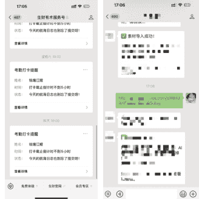

另外还要说说 Claude Code，这个项目是 Claude Code+Codex 一起做的，还是老样子，一行代码没写。

回顾到这，我认真想了想，最近至少已经三个月，我手写代码行数不超过 100 行，是真正意义上的开局一个空文件夹，直接让 AI 实现整个项目。

#### 四、PPT 生成

虽然都吐槽 PPT，但在分享场景和工作场景，PPT 还是必须的，我主要用四个工具：Gamma PPT、Genspark、天工、Coze 空间。

为了 PPT，还单独开通了 Genspark 和 Gamma 的会员，很好用。

平时用法是同一个主题，同时发给所有这些网站，哪一个对我的思路启发更大，哪一个样式、布局、设计最符合我的要求，我就用哪一个。

#### 五、AI 生图

即梦的生图能力基本上是最强的，尤其是即梦 4.0，另外就是 Nano Banana，视频主要是 ComfyUI 的工作流，ComfyUI 的可玩性很强，建议大家有多媒体内容生成需求的话，一定要玩转 ComfyUI。

最后，我想分享这一切背后最重要的核心：养成 AI First 的习惯，所有的问题，我都会找不同的 AI 同时确定一遍，以编程为例，现在遇到问题，我的第一反应是：Claude Code 解决不了，就找 Codex；Codex 解决不了，就问 GPT-5 Pro，如果连 Pro 都解决不了，那大概率不是 AI 不行，而是我的提问方式或解决问题的方向错了，它成为了我判断技术路径可行性的锚点。

它都解决不了，说明我的方向错了，就不要浪费时间，赶紧换一种方式实现。

#### 六、从工具到员工的认知转变

我的角色定位其实很简单，我只是个会提需求、会引导 AI 的人，但正因为这样，我才发现了 Claude Code 的真正价值：它不是工具，而是员工。

你把它当工具，它就只能写写代码；
你把它当员工，它就能帮你干一整套流程。

所以我也很期待看到大家都是怎么用 Claude Code 或者其他 AI 工具的，有哪些让你回不去的使用体验。

### 袋鼠帝：裸辞近两年
我是怎么靠 AI 活下来的

@袋鼠帝
AI Top 公众号「袋鼠帝 AI 客栈」主理人

很多人可能觉得，AI 博主的生产、生活都已经被 AI 包办了，其实不然。对我来说，AI 不是万能的，它更像是一个工具箱。你不需要会用工具箱里的每一把锤子，但必须清楚——哪个钉子该用哪把锤子，哪个活必须自己上手。

我一直坚持的观点是：AI 是用来放大能力的，而不是替代思考。

今天我来分享下，从 2024 年初裸辞 All in AI 到现在，我怎么在真实工作和生活中使用 AI。

- 1.2024 年初，我裸辞后的第一桶金，是靠 FastGPT 赚到的。

当时帮一位老板部署 FastGPT，搭建知识库、调试效果，拿到了 4500 元。那一刻，我第一次真切地意识到：AI 技能真的能变现。

此后，我继续帮人搭建 AI 工作流、定制 AI Agent，赚到了一些生活费。印象最深的是，我用 ChatGPT 开发了一个非常简单的 TTS 浏览器插件，只是在抖音上发了一条视频，2.1 万播放量，却带来了几千元收益。

后来，我接触了 Cow 这个开源项目，把 AI 接入微信，让微信小号变成 AI 客服、AI 助手、AI 医疗问诊等，还开发了我的第一款桌面应用产品——微信 AI 助理。

不过 2025 年春节后，Cow 项目被封了，虽然能找到平替方案，但我明白这种生意不可持续、不可控，很难做大，于是就烂尾了。

- 2. 如果是搞深度研究，我不会依赖某一个 AI。我会把同一个主题，同时丢给 Gemini、ChatGPT、Grok、Kimi、o1、MiniMax Agent 和秘塔 AI，就像请了六个领域专家同时协助研究，我来做最后的汇总和信息筛选。

- 3. 做 PPT 我图省事，常用 Kimi 的 PPT 助手。你输入主题，选个模板，它就能全自动生成，也支持输入大纲或已有的内容，一键生成并排版，也可以在线修改内容，和某几页的模板形式，比较灵活，这些对我来说够用了。

- 4. 文章封面图，我会用 Nano Banana 或者 Seedream 4.0 来帮忙生成，如果是一些简单的想法，我就截图或者从 Google 找图片，导入稿定设计 App 快速搞定。

- 5. 效率自动化是我这个程序员出身的博主最看重的。我用 Coze 做了个智能体，每天定时 11 点从各大网站获取 AI 最新资讯、整理好内容，发送到我的邮箱，非常准时稳定。

对于 X 上的信息，我搭建了 n8n 工作流，可以监听 X 上多位博主的最新推文，并用 AI 进行一层价值过滤，最终推送到我的邮箱。

- 6. 在 AI 编程方面，我现在的主力是 Claude Code/Codex+GLM-4/MiniMax-M2，性价比很高。我会用他们的组合来开发一些提效小项目，或者做一些文章里面需要用到的 Case。

我有个坏习惯，就是写文章初稿老是在公众号的编辑器里面直接开写，其中一些样式是用的壹伴，主要是用习惯了，懒得换方式，所以有个很头疼的问题——我的文章通常是在公众号首发，再同步到其他平台，就只能手动同步，关键格式还容易乱。后面我使用 Codex+MiniMax-M2，开发了一个微信公众号文章同步插件，现在我只需要在网页打开一篇公众号文章，使用插件就能一键同步到对应平台的草稿箱，方便快捷多了。

- 7. 出门参加线下活动我会带上 AI 硬件：DingTalk A1 或者 TicNote，帮忙记录线下的交流内容，后续同步到对应的 App 做 AI 分析、总结、提取思维导图等。

- 8. 浏览英文网站比如 X、Reddit，会用沉浸式翻译。看 YouTube 视频时，它也可以显示中文字幕。不过沉浸式翻译拿 YouTube 的直播没办法，所以 OpenAI 每次开直播，我会用 ViiTor 这个实时翻译插件来帮忙。

- 9. 我会用之前收藏的一些站点来导出抖音、B 站等平台有价值的视频文件，导入通义听悟，提取文字，再丢到 Gemini、ChatGPT 做分析总结，提炼爆款视频的思考逻辑，有时能提炼出比原视频更有价值的洞见。

- 10. 我还喜欢用豆包来提取图片内容。我妈电脑用得不熟练，打字也慢，我教他用豆包视频通话功能，对着豆包问问题、学知识；我弟做作业遇到难题，也能开视频请豆包讲解。那一刻，我真切感受到了 AI 的普惠力量。

- 11. 对我来说，我更核心的工作还是内容创作。目前用得最多的其实是 Gemini 2.5 Pro，它写作真的很强。我现在写文章，通常是自己搭好大纲，让 Gemini 按我过去的风格帮我写几版，我再从中挑选不错的内容组装，最后注入个人观点和修正表述。

不过说实话，即便现在会用 AI 辅助，我写一篇文章至少也要花一天，甚至两天，比我去年耗时长了很多。测试过程占一半的时间，另一半就算使用 AI 辅助完成，表达观点及修正 AI 的表述问题也要花不少时间。

- 12. 数据分析上，会用朋友开发的工具，在我的公众号后台把所有的公众号历史数据扒下来，各种维度的数据都有，导入飞书多维表格，进行数据分析。同时还可以生成各种维度展示的仪表盘，总结增长，分析粉丝喜欢什么样的内容，调整后续的内容计划等。

- 13. 我一直希望能打造一个我的 AI 数字分身，所以最近我在用一个叫 Second Me 的 App，刚用不久，初步体验还不错。后续如果效果很棒的话，我可能会写一篇给大家分享。

有些人用 AI 提高效率，有些人用 AI 创造价值，工具是次要的，解决问题的思路才是核心。换句话说，人才是核心。多读书多看报，少吃零食多睡觉，AI 时代，要提升自己，也别忘了健康生活。

AI 值得大家学习和使用，但对它的预期不要太高，不要觉得 AI 可以帮你包办一切，而是把它当作辅助工具使用。

### Orange：AI 时代场景越小，机会越大

@Orange

ListenHub 创始人，有机大橘子主理人

#### 1. 你用 AI 赋能赚到第一笔钱是什么时候？赚了多少钱？AI 主要作为什么角色？解决什么问题？你觉得这个问题价值有多大？

我之前在 MiniMax 做海螺 AI，但当时海螺 AI 定位一直是免费的工具，赚钱无从谈起。后来创业开始做 ListenHub，一开始定位就是 AI 应用出海，Day 1 就要求按照付费工具的思路来做。

ListenHub 可以用 AI 生成音频，帮创作者解决配音难题，特别是把创作者的文字内容变成口语化的口播内容，让他们可以把图文升级成多模态，发布到各种小宇宙、视频号、抖音等各类音视频平台。

我们为什么会选择做声音的 AI？在我看来，这个行业最大的机会是：声音模型变得越来越好之后，人们会拥有音色自由，可以把它理解为声音的美图秀秀。

以前一个人只有一个音色，想说得打动人，需要经过非常持久的训练。有了 AI 之后，可以用自己的音色，叠加 AI 的表达能力和文字能力，进行非常多样的表达，未来每个人都可以充分表达自我。

这种充分表达带来的结果是：以前做配音、影视剧表演，都需要真人。现在有了 AI，声音、画面、角色都可以 AI 来做，这解锁了普通人创作内容的无限可能，从此，所有的网文、小说，都可以变成视频。

我觉得这个机会非常大，直接重写了以前的影片拍摄逻辑。如果说抖音是把相机用到了极致，那 AI 就是新时代的相机，相机在 AI 面前就像古董一样，未来像 Sora 这样的产品，机会可能是 10 个抖音、100 个抖音的规模。

可以这么说，我第一笔用 AI 赚到的钱，就是现在的公司 ListenHub 赚到的，AI 在 ListenHub 这个产品里，是产品的绝对核心。

音频一直是互联网行业不是那么被看好的领域，为什么我们偏偏觉得这里有机会？

这是因为我们发现一个现象：图文创作者的思想深度往往很好，但视频化表达能力不一定行，而他们的粉丝需求却是图形化视频化的表达，希望有趣又有用地获取信息。这里就产生了一个错配，如果能解决他们的错配问题，就能获得巨大的价值。

我们是怎么解决创作者问题的呢？在这里我分享三个故事。

第一个故事：大家都知道做自媒体，最难的事情有两件，一是找到好选题好赛道，二是持续的更新内容，坚决执行。ListenHub 的用户在使用 AI 后，大幅提高了内容产量，可以达到之前的上百倍，我们最大的用户，他只用了一个月，就在抖音和视频号从 0 增长到 20 万粉丝。

他跟我们说他这辈子都离不开我们了，因为他的选题实在太多了，但苦于没有办法执行，现在有了 AI，可以一天产出 100 个视频，直接拿到抖音看实际数据。

什么是好选题好内容？实际数据好的就是好选题、好内容。

第二个故事：我们的用户真的卧虎藏龙，有一次做用户访谈，发现这位用户是一个公众号财经大 V，粉丝有 30 万。他的公众号是把大公司的财报，做解读后发给大家。

以前读财报是很累的事情，一天也读不了多少。现在有了 ListenHub，直接把财报扔到软件里，3 分钟就搞定了。他再稍微校对下，就直接发布到公众号了，还有音频版可以发小宇宙。

第三个故事：前几天有用户在群里说，他天天用 ListenHub，已经离不开了。我带着好奇心加他好友，问他用 ListenHub 做什么，为什么要天天用，因为我自己都做不到天天用。

他说他是一名销售，每天在路上开车的时间比较多，但又需要学习很多新的知识。于是他就把各种文字、论文、学习材料发到 ListenHub 里，在路上边开车边学习。

听完他的故事，我感觉人们学习的方式已经完全改变了。

从传统的框架式学习，变成了我需要什么，就学什么，遇到陌生知识，现查现学，这种学习方式带来新机会，我们可以把任何内容交给 AI 处理下，再来吸收。

学习本身变得像玩游戏一样，能获得满足好奇心的乐趣，我们有很多用户，已经通过主动学习，从中获得了学习的乐趣。毕竟刷一小时抖音你学不到任何东西，但听一小时自己做给自己的播客，可以学到知识。

#### 2. 未来一年最看好的三个 AI 机会：AI 漫剧、AI IP 和 AI 自媒体。

第一个是 AI 漫剧，红果增长迅猛，今年暑期涨了 35 倍，9 月的月活已经超越爱优腾之外的所有视频 App，位列第四，最终拿下第一不成问题，而且红果还已经推出独立的漫剧 App，跑通 PMF，完美契合了现在 AI 的能力和用户对短剧的偏好，ListenHub 也在做 AI 漫剧配音相关的尝试。

第二个是 AI IP，用 AI 完全制造一个 IP，给他个性、声音、画面，这个在未来一定很重要，因为我们正在进入一个内容大爆炸的时代，内容越来越多，越来越好，你的差异化是什么？没有 IP，就没有记忆点，所以你要从现在开始打造自己的 IP。

第三个是 AI 自媒体，今天用 AI 做自媒体这件事非常可行。刘小排老师说过，创业的核心就是搞流量，要么花钱购买流量，要么自己成为流量。在未来，工作可能会越来越少，但自媒体肯定会越来越多。对普通人来说，有了 AI 的帮助，做内容做自媒体非常简单，值得尝试。

最后分享一下，如何判断是真机会还是假风口？

真机会的特征:

- 1) 增长非常快;
- 2) 能直接获得收益;
- 3) 不绕弯，它没有非常复杂的逻辑，不是那种等一年才能赚钱的模式。

在 AI 时代，如果你做了一个东西特别好，增长就是非常快的，你真能收到钱。

### 良辰美：靠 AI 上线几百个网站
从电商卖家变成全栈开发者

@良辰美

不懂代码，用 AI 上线几百个网站躺赚几十万

#### 1. 你第一次用 AI 赚到钱是啥时候？

准确地说，我是在 2024 年 11 月用 AI（ChatGPT+Claude）写 html 纯网页和套 Vercel 上的 Next.js 和一些开源模版，上线网站靠 AdSense 赚到了两三万美金，那个时候亚马逊电商业务还在做，也有用 AI 写 Python 脚本批量出图卖货，做 POD 模式的一件代发产品。

AI 解决的问题价值高低，取决于你当前的业务规模，和 AI 融入判断决策、日常工作流的程度。

举个例子：

- 1) 在建站业务上，我主要用到的工具是 Cursor+Codex+Claude Code，AI 解决了所有代码问题，不会就问它，所有开发都交给它完成。过去一年，我真正增长的是编程常识和判断经验，代码没啥进步，因为我从没真正动手写过，顶多是熟悉了模版结构、部署流程，但 Cloudflare/Vercel/Spaces 这些平台的操作一清二楚。
- 2) 在亚马逊电商业务上，我让 AI 介入批量作图环节，也就是实现了“无限铺货”，所有成本只剩 API 调用费，其他部分，如上传、发货、售后、文案，照常做，但收益更高、成本更低，网站业务的成本，大约只有电商的十分之一甚至百分之一。

AI 对实体库存没办法降本，只能极大限度对电商增效，但对网站这种虚拟业务，可以非常夸张的降本增效，可以说是以一当百。

举个例子，2023 年年底我还花了几千块找程序员写很简陋的网站，2024 年基本上是一个月几十美金的成本可以做几十个更好的网站。

所以说 AI 提供的价值和降低的成本，绝对取决于你原本的业务规模体量，相对比例则取决于你深入用 AI 的程度。

对我而言，AI 解决的就是“代码门槛”问题，让我从一个亚马逊卖家，转变成了一个能独立做软件开发、建站和设计的自由职业者——成本更低、风险更小、赚钱更轻松、劳动更少。

#### 2. 如果把 AI 看作一个「合作伙伴」，它现在在你团队里扮演的是什么角色？你如何与它协作？

AI 其实不仅是我的程序员，还是我的指挥官，换句话说，所有的问题我都会问它，现在我主要协作的模型有四个：Grok、ChatGPT、Claude、Gemini。

整个上站流程大致是：域名注册→模版开发→环境变量设置→文案和关键词优化→代码修改测试→上线。

买什么域名、做什么项目，值不值得，我先让 AI 做一轮调研分析。市面上有付费和免费的开源模版，拿过来让 AI 分析一通，如果做自己的业务，都需要修改哪些，列一套清单出来，再逐步修改。

让 AI 根据关键词和人群需求去做深度调研，找出来所有的长尾关键词和销售文案，让 AI 修改代码里面的文字内容。我只需要测试：哪些修改不到位？哪些出 bug？遇到问题截图+log+描述情况，AI 基本都能修好。

一般来说，Codex 适合复杂任务，Claude Code 适合轻量开发。

如果同一个需求有不同的路径，我就让 AI 给我深度分析优缺点，综合我当前的项目来做判断。可以说，没有什么是 AI 解决不了的，人类只需要获取信息作出决策，所有的代码文档等事情都可以让 AI 来执行。

#### 3. 如果现在只给你 10 万元本金，要求你协同 AI，把这笔钱变成 100 万，你会如何行动？

这 10 万应该是人民币，换算出来不到两万美金，按一万三千美金计算。

分三步走：

- 第一步：注册 ChatGPT 和 Claude 账户，一个月四百五十美金左右；
- 第二步：要准备的账户只需要一个谷歌邮箱，再注册一系列平台软件账户，大部分都可以薅羊毛，而且基本上都很慷慨；
- 第三步：在模版、会员和设计等各方面，如果你想花钱，差不多一个月一两万都不够，但是要省钱，也有很多免费的资料和工具也足够用，赚钱核心在于你做产品和获取流量的技能水准。

当我们准备好所有的基本条件后，接下来有三条路可选。

第一种：idea to business 模式——哪怕只是个 demo 页，测试有没有人愿意付费。

- 找受众（Audience）
- 定痛点（Problem）
- 做产品（Product）

第二种：新词新站老词小站模式——靠 SEO 与 Google 流量变现。

- 找关键词（Keywords）
- 做网站（Websites）
- 加外链（Backlinks）

第三种：定制建站服务模式——给电商、企业、学校、房产等行业做定制网站，直接收建站费。

- 找客户（Customer）
- 收款（Payment）
- 提供服务（Service）

赚一百万人民币（约 13 万美金）对应的变现模型，简单算笔账。

1) AdSense:1M 访客约等于 1 万美金年收入，汇款简单、稳定，通过流量广告变现，收款最简单，AdSense 丝滑入帐，一年五万美金外汇额度，第三方平台也有很多且不限额，粗略估算 1M 月访客对应一万美金，差不多一年下来就是百万人民币左右。

+ 2）SaaS 模式：通过 Stripe/PayPal 收款，C 端用户为主。客单价和转化率决定利润，一百个访客都可以出一单，这一单也有可能是一百美金，也就是说只需要一千三百单，几百个客户，几十万个访客。

+ 3）2B 定制建站：客单从几百到几万不等。只不过 AI 极大降低了建站成本，一个月 20 美元的 Claude 可以做一百个网站，几乎可以说不限额，就看你的投入时间和熟悉度，这行赚钱更多是销售逻辑。

我会怎么做？到现在为止，我靠 AdSense 累计已赚十多万美金。

2025 年开始，我的重点会转向 SaaS 产品：一边上站做产品，一边用 AI 解决素材，做矩阵自媒体通过社媒来获取流量，再用社媒矩阵做流量。我已经在路上，预计很快就会达到这个结果。

0-1 的闭环都已经完成，接下来更多的就是获取流量的事情。

如果为了快速达成目标，接下来一万美金应该是会去投放广告，这样更加激进，当然风险也更高。在没有时间压力的情况下，还是多上站多做产品，量变引发质变，不停学习榜单上的赚钱产品，还是有很多低成本机会。

从电商卖家到全栈开发者，从不会代码的人到用 AI 写代码的人，我慢慢体会到，人真正要学的不是技能，而是让自己跟上时代的方式。AI 不是取代谁，而是放大谁，它放大我的判断力，也逼我更快做决定，更早验证，更少犹豫。

我不是天才，也没什么捷径，只是愿意每天多做一些、多问一句、多试一个项目。如果你能坚持上 150 个站，我相信你也会理解 AI 的魅力。当你开始和 AI 并肩作战，你就会发现：赚钱这件事，从来都不是比谁更聪明，而是比谁更早行动、更深融合、更敢试错。

### 包子：AI 不是工具，是我的全能团队

@包子

高考志愿赛道 IP

AI 赋能一人公司做到赛道头部

#### 1. 如果把 AI 看作一个「合作伙伴」，它在你团队里扮演什么角色？你如何与它协作？

那可太多了，现在已经难以想象没有 AI 应该如何工作。

第一个角色：合伙人

当很多思考和想法找不着合适的人沟通时，AI 就扮演着“合伙人”的角色，从产品设计到发展方向，AI 可以为我们补充多种视角。

但是 AI 的上下文不够长，所以我会把业务情况对它进行汇报，再告诉 AI 我的技能和现有资源，同时展示一个清晰的目标，让它去想办法。

和 AI 的沟通重点：讲清楚业务现状，用 Get 或者 flomo 笔记等工具，录上 5-10 分钟的公司介绍，以及自己的目标。

例如：你是我的合伙人，我们俩的公司业务包含 xxx，目前的经营状态是 xxx，我们 A 产品的单价是 xxx，销量是 xxx，成本是 xxx，B 产品的……。我们目前使用的工具和技能是 xxx，擅长的领域是 xxx，缺乏的资源是 xxx，今年总体经营的感受是 xxx，如果按照 10x 目标的理论，可能有哪些技术路线？

#### 第二个角色：首席技术官

多种技术路线选择时，AI 扮演着“首席技术官”的角色，自己不可能所有技术都了解，但是 AI 可以面面俱到。

和 AI 的沟通重点：讲清楚之前的技术路线，为什么要走这条路线，自己的能力范围（会用什么工具，学什么比较快，学什么比较慢），这样 AI 会为你找一条跳一跳能够着的、力所能及的技术路线。

例如：我希望开发一个直播间的辅助系统，每当用户提出问题时，就会给我找到合适的参考答案。我现在本地有的数据包含 xxx，我不会编程，但用过 v0, Cursor, Claude Code，知道 API 怎么接入，如果要落地这个直播间辅助系统，你的建议是什么？

#### 第三个角色：项目搭子

在自己不擅长的领域，AI 可以补足短板，扮演的是“项目搭子”。和 AI 的沟通重点：说清楚你和 AI 的工作界限，双方的交接形式和格式。

例如：xx 项目整体包含 part1、part2、part3，每个 part 都需要继承之前的成果，我做的是 part1 和 part3，你来做 part2，Part1 我的成果形式是 xxx，part2 你需要为我提供 txt 文本，我会在 part3 直接导入，txt 文本的具体要求包括：……，先试做 1 个，有困难就中断工作和我沟通，不要闷头做事。

#### 第四个角色：超级劳动力

在重复工作方面，AI 扮演的是“超级劳动力”，能够总结 SOP 的、需要重复三次以上的工作，一律让 RPA 和 AI 代替。比如，我在今年开展了“专业歌曲”的内容创作，把各个大学专业写成了歌，过程中会同时调用 20 个大模型不断为我打磨歌词，我自己只负责提要求和审查。

和 AI 沟通的重点：充值最贵的套餐！给 AI 设定任务边界，一方面提供正确案例参考，另一方面提供错误案例参考。

例如：我想要写一首歌，歌词的内容是关于机械专业的，歌词的内容来源请参考我这份

#### 第五个角色：超级美工

文档，歌词的整体结构参考 xxx，每一段歌词的字数和情绪参考 xxx。这里有其他专业的优秀歌词给你参考，同时要避免以下情况：……

在美工方面，AI 扮演的是“超级美工”，从图片到视频，往往都能超出预期完成任务。

和 AI 沟通的重点：找到最强的生成模型，找到你想要的效果给他参考，准确的描述每个细节的要求。如果做不到，可以把参考图扔给 AI 做逆向工程，让 AI 帮忙想提示词。

例如：图 1 是我想要的背景效果，第一步，保持主体形状轮廓不变，把背景的粒子特效换成暗纹线条，线条的粗细不能影响文字的阅读，可以参考图 2 中 xxx 部分的线条……。第二步……

#### 第六个角色：全栈工程师

在 AI 编程方面，AI 扮演的是“全栈工程师”，Vibe Coding 无所不能。

和 AI 沟通的重点：先和网页版大模型聊好需求，如果遇到不懂的技术名词，可以让 AI 给你解释清楚，最好可以提前掌握基本的编程名词，在 Cursor 或者 Claude Code 内先做成 demo，再用 vibe 优化。

例如：我需要一个直播间复盘的系统，但我不懂编程，我的需求是，每次下播后，自动将我的直播内容从录音转为文字，并对每段话进行复盘。复盘的目标是：内容核实，确保我讲的东西没有偏离事实；内容拓展，这一段话有没有可以展开讲的内容，最好是故事或者书籍……

以上只是一小部分角色介绍，事实上，AI 还扮演了很多的角色，比如报告分析、内容审查以及利用不同 AI 来共同协作优化同一个项目，场景不同，AI 的角色就不同。

#### 2. 你现在用 AI 赋能提效或赚钱，靠的是 AI 的什么能力？以及需要提升什么能力？这些能力要如何练出来？

在不同的领域，会依靠 AI 的不同能力，使用 AI 的关键，有六点。

##### 1. 多用 AI，万事用 AI

有任何思路、任何疑问，第一反应都应该是和 AI 聊，而不是和人类聊，因为 AI 的回答质量往往比身边人更高，只有多用 AI，才知道怎么使用 AI。用 AI 越多，它越能了解你的能力范围和业务，回答质量也越高。

哪个 AI 更擅长什么工作，这些都只有每天和 AI 打交道才能知道。

##### 2. 用付费模型

付费模型和免费模型的能力区别挺大的，基本的$20 是很有必要的，$200 的模型在大规模使用的情况下，也非常划算，期待国产模型也收取费用。

##### 3. 知道 AI 的边界

AI 很容易出错，而且是一本正经地胡说八道，所以知道什么情况下 AI 会出错很重要。使用 AI 时保持警惕，设定好边界，让它自己从官方渠道搜集信息回复，让另一个 AI 来核实 AI 的回答，这是我每天的使用日常。

##### 4. 高质量的输入

如果想要 AI 给你高质量的输入，那自己就得高质量输入。高质量的输入，来自于准确的表达，准确的表达一方面需要对业务或者技术非常熟悉，每个技术名词的含义自己都知道，另一方面从 AI 的视角来看待输入，我们自认为的常识，AI 可能根本就不知道，因为从 AI 的视角来看，很多时候都是在猜测我们的需求。

##### 5. 对业务无比熟悉

对自己的业务线无比熟悉，熟悉到每一个节点用哪几种软件，用哪个 SaaS 服务，每个动作产生了什么成果，各个成果之间是怎么衔接的，在无比熟悉自己业务的情况下，使用 AI 就如虎添翼。

##### 6. 和 AI 取长补短

AI 会越来越强，了解 AI 后，不要在 AI 的长处和它较劲，享受 AI 发展带来的成果。AI 也有无法弥补的短板，比如无法对结果负责，无法真正地共情，只有照猫画虎的审美，不了解具体的业务细节等，将自己的长处和 AI 的长处结合，在 AI 无法完成的领域发力，比如洞察需求、创新产品、提高审美和对内容负责等。

这些能力，都需要自己亲自下场，把所有事情都做一遍，每个想法，都和 AI 深度交流，在对业务和 AI 都非常熟悉的情况下，把自己的业务和 AI 打通！

最后，欢迎来到 AI 时代！

### 苍何：我如何用 AI 打造一整套创作系统

**@苍何**
AI 编程领域头部博主

我用 AI 赚的第一笔钱是在 2023 年，GPT-4 刚出来的时候，在知乎发了些 AI 的深度文章后，吸引到投资机构的咨询服务，咨询费一小时 2000 元，我发现在这个过程中，AI 可能弥补我非常多行业的短板，从行业研究员的角度，借助 AI 吸收了非常多高密度的知识，再将其转为研究员能听得懂的语言进行描述。

在这个过程中我意识到：AI 解决知识盲区，并做好整理，这点很有现实价值。

原先我们需要查阅大量的资料来搜索结果，人工进行筛选整理，这个过程往往很耗费时间，而且信息一多，就会变得很麻烦，现在 AI 在这方面的能力都很成熟了，特别是 Deep Research，搜索专业领域深度研究已经被越来越多人使用在工作和学习中。

下面我也来分享几个我日常用 AI 的场景。

1. 我本身是开发出身，用 AI 辅助编程比较多，从 GitHub Copilot 到 Cursor，再到 Claude Code，我都有在深度使用。

我觉得，AI 现在是我的得力实习生，我把我的经验通过提示词表达，Agent 就能协助处理好代码工作，但通常我不会放手不管，一句话需求，AI 同样会做的很差，我会先让 ChatGPT 写好需求文档，再给到 Gemini 2.5 Pro 根据需求文档再深度优化。

通过多次对话，描述好我的需求，再在 Claude Code 中读取需求文档，做 task，列出待办任务、明确规定分模块进行开发，一次 Chat 我通常不会给到过多的任务需求，尽量保证一次修改只完成一个功能的迭代或者 bug 修复。

2. 对于内容创作来说，我会本地化用 Obsidian 创作，再把所有创作的内容都丢给 Gemini CLI，写好提示词模板，这样 AI 就能更加理解我文章的风格，辅助我创作。

借助精准的提示词，在爆款标题撰写、文章开头引入、结尾升华等地方，AI 会写得非常像我原先的风格。而且，在灵感枯竭的时候，Gemini 会给我的内容创作带来非常大的帮助。

在 Obsidian 中，还可以利用 Gemini 来做每日总结和回顾，我会用这套工作流来进行知识管理，比如让 Gemini 帮我仓库中的笔记做好分类，打好标签。

3. 在做 AI 自媒体的过程中，我有很多做 AI 产品评测的机会，对于评测内的 case 来说，AI 还没法替代我来做 case，这个流程，我借助大量的 AI 工具来辅助，比如创意选择、case 趣味性、实用性等角度。

如果进行模型的对比测试，我会在 Flowith 上进行，它能一次对比多个模型的效果，在我做测评的时候非常有用。

4. 说到 AI 工作流，就不得不提及飞书多维表格，我把公众号分析数据导入到多维表格，利用其强大的 AI 字段捷径功能，做了很多数据方面的优化，每日做推送，方便我基于数据做内容的优化。

我的 AI 社群每天都会有 AI 早报，这也是基于多维表格来做的，用自动化工作流每日爬取网上最新的关于 AI 方向的热点信息，再汇总成早报的形式给社群做发送。

5. 在做公众号封面图时，我会选择在 Lovart 上设计，它的无限画布和图层分离功能真的很好用，我会给出想要的封面样式参考和需求，Lovart 的 Agent 给我设计感十足的封面图。

6. 在系统学习某一领域知识时，我会利用谷歌的 NotebookLM，它能自动解析 YouTube 视频和上传大量的文档，基于知识库，做出直观的思维导图，在知识库内提问，能帮助我快速进行知识的学习。

7. 我会使用 Cherry Studio，在上面定制智能体，它相当于我的智能体军团，非常方便，也有非常多的模型厂商可以选择。

8. 在会议或者活动中，我会用 TicNote 来进行录音和转写，录完后自动实现总结和生成思维导图大纲，能一次性录好几个小时，贴在手机上也非常方便。

9. 在需要 PPT 场景时，我会先用 Gemini 给出调研生成需要的大纲，再用 Genspark 或者 Skywork 来生成 PPT，导入到 WPS 中，借助 WPS 的 AI 能力做整体主题调整和单页优化。

10. 平常写代码，我会 Claude Code 和 Cursor 配合着使用，Claude Code 负责整体把控，Cursor 负责单个模块的细节优化。

11. 现在用的最多的模型是谷歌的 Gemini 2.5 Pro，除了其上下文能力，它的文字输出能力也很强，观点类型的表述用它辅助产出，配合深度研究，在调研时非常有用。

12. 最后也分享三个我看好的 AI 趋势方向。

- 1) 我比较看好 AI 硬件。今年涌现了非常多 AI 硬件产品，比如 AI 眼镜、AI 耳机、AI 陪伴玩具，我觉得硬件是和人们工作生活最有体感的接触的体现，能实实在在看得见、摸得着且容易变现。我可能不愿意花 9.9 买一个 AI 软件产品会员，但却愿意花费 99 买一个 AI 玩具来体验。
- 2) 我比较看好 AI 营销出海。国内 to C 不好做，AI 营销出海有非常大的增长空间。
- 3) 我比较看好 Agent 企业化落地。无论是政策导向还是 Agent 能力涌现，目前来看这个赛道都有很大的增长空间。

### 杨涛:16 个可以问的 AI 相关问题

**@杨涛**
生财大师兄

创业，本质上是一场大型套利游戏。

除了我们常见的资本套利、劳动力套利、消费力套利、信息差套利等，目前我们又多了一个，AI 给我们带来的认知套利。

首先，当然是基于大模型 Prompt 能力的套利，再是基于 AI，Workflow 把个体经验标准化、规模化的套利，现在 Workflow 的落地变得更容易，基建完备，连 n8n 都开源不要钱了。

下面有 20 个关于 AI 应用的思考，与大家共勉。

1. AI 不要学，要用。

测下天分：能不能不要问任何人，自己动手，在两天内，用上原生的三个付费大模型 (ChatGPT, Gemini 和 Claude)。我很客观负责的说，如果可以，已经超越了 99.6% 的朋友；如果不行，说明没有任何网感。

2. 你和所谓的 AI 高手，并没有什么本质差距。

市面上几乎所有的 AI 导师讲的东西，都是有有效期的，还很短，我们并不比他们差。

这两年，我们看了几百个颠覆性、革命性的产品发布，可到现在真的颠覆了什么，又革了谁的命？不要过度关注这些浮华和喧嚣，这只会让我们没来由的焦虑。AI 面前，我们都是小学生，用起来，比什么都重要。

3. 你的一切，与你有关。

前几天还是满屏的奥特曼，这两天，谁还用 Sora 呢？是的，市面上 99% 的 AI 产品都和你我无关，我们不必去做第一个吃螃蟹的人，只需要做第一批买螃蟹来吃的人就可以。我们要做的只是把 AI 用起来，用在自己日常生活和工作的每一个能用上 AI 的环节。

当下，我们要思考的只有这一个点而已。

4. AI 的终极意义就是，提效降本。

我是一个坚定的 AI 工具论者，没有什么虚浮假大空的时代浪潮和所谓革命。目前，AI 的作用就是降低目标与实现、旧认知与新可能之间的摩擦成本，把我们从琐碎中解放出来，重构流程，释放注意力到观察、洞察和创造中去。

我们会发现，AI 不仅能让人更快做老事，更是让人做从前做不到的事。更神奇的是，我们要做的只是用起来，时长到了，一切就会随之发生，甚至，不需要过多技巧。

然后，一起变强，怎么变强呢？让我们一起思考以下问题。

5. 提示词工程到底是不是一个伪命题？

和 AI 交流，到底是机器语言更高效，还是自然语言更符合未来趋势？人机交互的终极形态会是怎样？只需要口喷的日子还需要等多久？

6. AI 是你的员工，还是你的合伙人？

人和 AI 的正确协作方式，应该是我们驱动 AI，还是 AI 引导我们？问完了 AI 对你的价值是什么后，有没有想过，你对 AI 的价值是什么，什么才是人机协作的最优解？

7. 如果 AI 需要学习，当你觉得要开始学 AI 了，你到底是要学什么？

当我们讨论学 AI，是学习它的底层逻辑，还是在学习 AI 工具的使用方法？创业者学 AI，需不需要掌握底层原理？正如，开好一辆油车，需不需要了解内燃机的工作原理？

8. 创造的门槛是否被 AI 狠狠拉低了？

用 AI 写出好文章的人，真的都懂写作吗？用 AI 做出好产品的人，真的都懂编程吗？用 AI 生图生视频做出非常优秀作品的人，真的都懂艺术吗？AI 是否重构了「高手」的标准？

9. 我们要如何避免「使用 AI」沦为自嗨，成为一种世俗意义的正确？

现阶段，在舆论喧嚣的调教下，很多创业者、职场人都在用 AI，但是，到底有哪些人真的在用 AI 解决问题，创造实实在在的价值？

10. AI 是否永远都是冷冰冰的工具？

乔布斯曾说过，我们站在科技与人文的十字路口，如果带宽是用来传递情绪的，那么大家有没有用过 Siri，Siri 很有礼貌，但 Siri 有没有温度？AI 是否永远都是冷冰冰的工具？那如果答案是肯定的，在座的老板们有没有被 ChatGPT 夸到嘴角都压不住呢？未来，又会是怎样呢？

11. 自己的工作中，哪些环节可以得到生产力质变？

据我所知，许多老板已经可以用 AI 完成自己日常事务中许多环节的 80%，而你是否真的思考过，自己的工作中，哪些环节也可以得到这种生产力质变？当时间被释放出来，你更愿意把剩下的精力放在哪些事情上？

12. 你的某些产品/服务/经验/能力是否能从你的身体里抽离出来，做成 Agent？

当别人强烈地想为你付钱，购买你的某些产品/服务/经验/能力，你有没有想过，它们是否能从你的身体里抽离出来，做成 Agent？你要如何在一个月内将这个 Agent 上线？

13. AI 时代你的护城河在哪里？

在 AI 时代，技能和经验上的差距是可量化并且可快速缩短的，你认同这种观点么？如果你认同，那么你的护城河在哪里？

14. AI 是否在重新定义创造力？

AI 是否在重新定义创造力，或者说 AI 到底是创造力本身，还是创造力的放大器？到底哪些人的创作价值会因 AI 而贬值？

15. 是 AI 在逃避，还是你在逃避？

AI 和你自己是不是很像，遇到很多问题，你不死磕，它就逃避？为什么呢？它的第一原则是省 Token 嘛，那么，当你用 AI 没有解决问题，到底是它在逃避，还是你在逃避？

16. AI 的大钱到底在哪里？

AI 的大钱到底在哪里？是少有人能够触碰的 API，还是注定挡在大厂必经之路的软件领域，还是普惠民生之后的 AI+ 硬件？再到普通创业者也能喊两嗓子的套壳应用，AI 自媒体，解决具体问题的垂直 AI 网站，你到底能赚到哪部分的钱，怎样才能有一张入场券呢？

### 富贵:AI 时代，人人都有枪，就等于人人都没枪

**@富贵**
长安文化 CEO, AI 情绪流量营销

2025 年，是真正的 AI 内容元年。作为一个在营销圈摸爬滚打 10 年的人，上半年我是眩晕的。那种感觉就像在刀光剑影的武林决战里，突然有人掏出了枪。

你苦心孤诣打磨 10w+ 的爆款文案？对不起，AI 模仿你的结构文风，批量生产，一枪撂倒。你费尽心思做网拍街拍博主？对不起，AI 生成的数字人美女，产出速度比你按快门还快，一枪撂倒。你靠话术做客咨转化？对不起，AI 24 小时不间断客服 + 情绪价值陪伴，还是一枪撂倒。

那一刻我觉得，游戏规则变了。安排了一个小组，她们花了 3 天用 AI 生成了 1000 条小红书文案，标题、正文、emoji，全套内容。看到她们生产出来的垃圾，我长出了一口气，冷静下来了。

我发现，从“刀光剑影”到“枪林弹雨”，有枪和有枪之间的差距，比冷兵器时代还要大。有情绪的内容，才是一切的原点。

#### 一、AI 放大的是“1”，不是“0”

生财有个圈友，6 月在流量大会上拍了我分享的情绪提示词，回去喂给 AI。

前几天她来找我复盘，操作是这样的：

- 第一步：用我的提示词批量生成 1000 条带情绪的标题和正文；
- 第二步：请摄影师拍场景图；
- 第三步：用 RPA 工具自动发布。

每天 30 条，4 个账号，一个月 3600 条。九月份，这个两位数的电商品，她卖了 44 万。她做的事情其实很简单：让 AI 生成海量内容，但筛选权在她手里。

不是让 AI 生成内容，而是让 AI 放大她筛选出来的好内容；不是让 AI 替代判断，而是让 AI 批量执行她的判断；不是让 AI 瞎跑 3600 次，而是让 AI 重复她验证过的那 1 次有情绪的内容。

同样卖宠物零食，具体看一个对比：

1. AI 生成的文案——“优选鲜肉配方，营养均衡，狗狗爱吃！”
2. 有情绪的内容——“看到小狗薯片虽然有一点小贵，但我想让我的小狗尝一尝。因为我不想有一天，他去了汪星，别的小狗讨论吃过这个、吃过那个的时候，我的小狗是插不上嘴的那一个。”

后者下单率高得吓人，退货率巨低，这是一个堪称歹毒的文案。为什么？因为前者在说“产品好”，后者在说“我怕狗委屈”，前者是 AI 堆砌的卖点，后者是人类真实的愧疚感。

情绪链路分四步：共情（把狗当家人）——想象（汪星聚会）——愧疚（不想小狗委屈）——上头（激情下单）。

AI 会写字，但它不知道“插不上嘴”这五个字能戳到养宠人的心窝子，稀缺的从来不是数量，而是内容准确度。所以说 AI 是放大器，不是发动机。

以小红书为例：平台每天 700 万篇新笔记，平均点击率 14%，这个点击率在任何一个平台都算高的，说明什么？它是双列信息流，用户可以选择点或不点，这是“反效率原则”——让用户自己选，而不是硬塞。

不是内容多就赢，而是内容准才赢，所以 AI 虽然能生成海量内容，但稀缺的从来不是数量，而是那些有价值、有情绪、能打动人的内容。

回到那个圈友的案例，她的成功公式是：AI 负责穷尽 + 她负责判断。

### AI 负责穷尽

1. 穷尽关键词：下拉词、热门词、评论区数据;
2. 穷尽场景：列出 100 种购买场景;
3. 穷尽组合:10 种人群×10 种角度。

### 她负责判断:

1. 从 100 种场景里挑出符合品牌定位的核心场景;
2. 从 AI 生成中筛出情绪到位的内容;
3. 注入真实的共鸣和温度。

本质上，她先找到那个“1”——对的方向和真实需求，再用 AI 才能批量复制出无数个“0”。

AI 是复印机，但你得先有原件。

#### 二、让 AI 干 AI 的活，人干人的活

很多人问我怎么用 AI，我的答案可能让人失望，因为我的做法是：让 AI 干 AI 的活，人干人的活。先搞清楚什么是 AI 干不了的，比学 100 个 AI 技巧都重要。

举个例子，同样推荐一个包，

1. 机器：采用头层牛皮材质，容量 30 升，配备多功能隔层;
2. 人话：包包能装不用翻找，手机钥匙口红，伸手就能拿到。

前者是卖点，品牌想说的话；后者是买点，用户想听的话。不是 AI 不会写人话，而是 AI 不知道什么是人话。

因为人话背后是画面感、是使用场景、是我也遇到过这种情况的共鸣，这些东西，需要你真的用过、烦过、在生活里被这个点触动过。

你半夜刷到老年犬吃不动硬粮的视频，想到自家 13 岁的狗，眼眶红了——这是共鸣；你看到别人家的狗在公园撒欢，你家的只能趴着，心里有点酸——这是愧疚；你买了一袋软粮，狗吃完舔了舔碗，抬头看你——这是治愈。

这些瞬间，AI 永远写不出来。因为它没有 13 岁的狗，没有在宠物医院等化验单的焦虑，没有看到狗狗吃饭时的那种“终于能为它做点什么”的释然。

AI 能模仿结构，但模仿不了这些裂缝里长出来的真实。有情绪的内容，没有生活的积累和种种快乐、悲伤、困难、心酸情绪，你是写不出来的，就像一棵年轻的树，长不出 200 年的年轮。

人类的经历，才是让内容有温度的根源。

#### 三、AI 是枪，但你得知道往哪开

很多人学 AI，学的是怎么让它生成更多，但真正该学的是：怎么找到那个对的第一枪。

具体怎么做？我的建议是：
1. 先手写 10 条，别管完不完美，写你真实想说的话;
2. 发出去测数据，看哪条有人点、有人评论;
3. 把那 1 条喂给 AI，让它穷尽变体和场景;
4. 你再从 100 条里筛出 10 条，保证每条都有温度;
5. 批量执行，AI 负责重复，你负责筛选。

AI 负责穷尽可能性，你负责选出对的那个，会赚钱的人用 AI，不是因为他们提示词写得好，而是因为他们知道什么是对的，而对的这个判断，来自你爱过的人、踩过的坑、服务过的客户、被打击过又重新站起来的每一次。

因为真正有价值的，从来不是工具本身，而是使用工具的人。那些在生活里摔倒过、在商业里磨砺过、在无数次失败后依然往前走的人。

AI 会降临，但我们永远不会被 AI 取代，它替代不了你的判断。因为判断的背后，是生活。

### 老黄牛：不要用 AI 优化传统的工作，而是重构流程

@老黄牛

用 AI 赋能亚马逊跨境电商创业者

踏入跨境接近两年，开品的成功率还算高，离不开 AI 的加持，我称自己是亚马逊的“Z 世代”——初次接触亚马逊，就没走传统路线，而是直接用 AI 来构建我的战略和工作流。

下面是我这一年多折腾下来的思考，希望能给你些不一样的启发。

#### 一、不要把 AI 塞进传统的工作流程，而是根据 AI 设计全新流程

福特的启示：不是优化，而是重构。

福特曾经联合各个岗位一起开会，再创造了世界上第一条移动式汽车装配线，将造车过程分解成 84 个独立的步骤，让底盘在传送带上缓慢移动，工人则站在原地，重复同一个简单的动作，这彻底重构了“制造”的逻辑。

结果是毁灭性的：一辆 T 型车的组装时间从 12.5 小时骤降至 93 分钟，价格也从 850 美元降至 300 美元以下，汽车从此进入了寻常百姓家。

福特做的不是让工匠跑得更快，他甚至“剥夺”了工匠的复杂技能，但他通过重构生产关系，创造了百倍的效率，开启了一个新时代。

我认为 AI 在亚马逊上，未来一定会往这个方向走，这就是“重构”的威力——不是让旧体系跑得更快，而是创造一个完全不同的新体系。

今天，历史正在重演。

很多公司都在谈“拥抱 AI”，具体怎么做呢？

让设计师用 AI 做图，让运营用 AI 写文案，让程序员用 AI 写代码。

表面上看，每个环节效率都高了，但整个业务增长还是老样子，为什么？因为大家都在用工业时代的组织架构，去承接智能时代的生产力，这就像给马车装上了汽车发动机，不仅跑不快，还可能散架。

举个例子：

一家餐厅想提升效率，传统思路是优化流程，后厨引入半预制菜，让厨师加工一下，上菜速度就快了，这叫优化。那什么是重构？是直接取消厨师和后厨，改用中央厨房统一配送预制菜包，餐厅里只有一个阿姨，负责把菜包加热端上桌，这种模式极度简化，成本极低，没有明火和厨师的限制，可以疯狂复制，一夜之间开遍全城。

AI 的真正威力，不在于让厨师炒菜更快，而在于它能让你有机会成为那个建立中央厨房的人。

#### 二、AI 的真正价值，不是提升单个环节的效率，而在于消除环节之间的信息壁垒

过去我就发现，电商团队是“盲人摸象”式的，产品、运营、设计，各管一摊。

一个产品卖不好，运营会说“这品天生就不行，卖点不清晰，神仙也救不活。”产品则会反驳“我调研了三个月，产品绝对有潜力，是你的广告和节奏有问题！”……这种扯皮，本质是信息壁垒。

每个人都只摸到了大象的一部分，而真正的商业洞察，恰恰隐藏在那些跨部门、未被压缩的细节里。

1. 你要收集属于自己的数据

你生产的产品，广告的数据和用户行为，比如：点击与流失等，是最优质的信息与数据。

在 AI 一体化模式下，我能将产品的广告数据直接调度到开发决策中，这些数据揭示了传统市场调研根本无法触及的真实用户行为密码。

分享一个做电商的案例。

我曾上架了一款蓝牙耳机，定位是运动健身，但广告转化率很低，差点以为要失败了……但作为唯一的数据分析师和决策者，我可以看到所有广告数据，一个细节引起了我的注意：在“通勤降噪”这个场景下，转化率竟然有 4.8%，更奇怪的是，大量购买发生在深夜 11 点到凌晨 1 点，用户的搜索路径经常是“降噪耳机 + 睡眠”。

我瞬间明白了，传统的市场调研会告诉你年轻人喜欢运动耳机，但数据真相是，这群用户根本不是健身达人，他们是需要一个助眠设备的失眠患者！

我立刻调整策略，产品的核心卖点从“运动音质”转向“深夜降噪助眠”，重新设计了文案和图片。结果，产品销量在一个月内增长，还根据产品词，继续开辟了这个全新的细分市场。

但在传统的分工模式下，可能早已放弃这款产品了。传统运营团队为什么不会把这些细微发现告诉开发？

第一，运营团队缺乏传递动机。

他们的 KPI 通常是广告 ROI 和销售额，发现新的细分市场对他们的考核指标并没有直接帮助，反而可能增加额外的沟通成本。

第二，开发团队接收不到一手信息。

即使运营团队发现了这些信息差，在跨部门传递过程中也会被简化和失真，最终到达产品开发团队的，往往只是一句“用户搜索习惯有变化”的空泛总结。

第三，激励机制错位。

传统模式下，运营的提成通常基于现有产品的销售表现，而不是新产品机会的发现，这种机制设计天然地抑制了跨职能的信息分享。

#### 四、战略视野的割裂

这是最致命的问题——在传统公司架构中，只有高层管理者知道完整的战略布局，产品开发团队只知道自己负责的 SKU 规划，运营团队更是只关注眼前的流量和转化数据，他们无法从战略高度判断一个信息发现的真正价值、是否符合公司方向。

作为决策者和执行者，我清楚地知道整个公司的发展方向、资源配置策略和长期目标。

而在 AI 驱动的一体化模式下，数据洞察和产品决策之间没有任何中间环节，我既能看到广告数据的每一个细节，也能理解产品开发的每一个可能性，更能够快速验证假设并迭代优化，这种信息的无损传递和快速反馈，正是传统分工模式永远无法实现的核心优势。

#### 三、智脑回归：从人才争夺到能力民主化

传统电商创业，在后期有个残酷的现实：你的核心竞争力，掌握在员工手里。

你需要一个月薪 2 万 + 的产品经理，一个懂玩法的运营高手，一个审美在线的设计师，你不仅要花高薪招他们，还得设计复杂的激励留住他们。更要命的是，一旦核心员工离职，你的广告 ROI 可能直接从 3.5 掉到 0.8，业务瞬间瘫痪，这种模式的本质，是你在和所有同行竞争同一批稀缺的人才。

但在 AI 重构的新模式下，游戏规则彻底变了。AI 最大的价值，是让“智脑”重新回到创业者自己手中。

以我的实际操作为例，现在我的“团队”结构是这样的：

- 核心决策层：主要是我自己，负责战略判断、产品定位、市场机会识别，配备 AI 分析工具；
- 执行层：主要用兼职或实习生，负责具体的图片处理、文案润色、数据录入等重复性工作；
- 专业外包：按照项目合作付费，负责特殊技能需求，如专业摄影等。

关键的变化在于：所有需要判断力和创造力的工作，都由我配合 AI 完成；所有标准化、重复性的工作，都可以分包给替代性强的人员。

这就像海底捞，它最核心的竞争力是那套标准化的火锅底料配方和服务流程，再把可复制的执行工作 (服务) 分包给大量的服务员，服务员可以换，但海底捞的味道和体验不会变。

我曾经在周五晚上发现一个新的市场机会，周六用 AI 完成了竞品分析和产品定位，周日联系兼职团队调整了所有素材，周一新的推广策略就上线了，这种速度在传统的团队模式下是不可想象的。

这种重构带来的最大优势是灵活性的指数级提升：

- 1) 成本灵活性：淡季可以减少兼职时间，旺季可以快速增加人手，没有固定薪酬的压力。
- 2) 地域灵活性：不再需要租办公室、开晨会、面对面沟通，一个 WiFi 就能管理全球的执行团队。
- 3) 技能灵活性：需要什么技能就外包什么技能，不用为了一个短期项目招聘全职员工。
- 4) 决策灵活性：最重要的是，不再需要复杂的内部协调和会议讨论，所有关键决策都能在 24 小时内执行到位。

我强烈建议，各位电商老板，不要想着怎么让 AI 赋能，怎么用 AI 帮助我的设计师、运营、客服。

真正的变革是什么样的？是一个懂业务的人，配合 AI 系统，直接完成原本需要整个团队才能完成的工作链条。

不需要设计师，因为 AI 可以生成和迭代视觉方案；不需要专职运营，因为 AI 可以分析数据并生成策略；不需要文案，因为 AI 可以创作和优化内容。

在 AI 时代，真正稀缺的不是执行能力，而是架构能力——知道如何设计系统、如何组合 AI 能力、如何把握商业本质的能力。

### 明白：AI 时代新的学习方法是走一步看一步

@明白

程序员出身，日新月异俱乐部创始人

随着 AI 越来越强大，用 AI 编程的门槛也越来越低，最近我也在尝试用 AI 编程来做产品。

之前我一直对 AI 编程有很大的恐惧，觉得会很难，担心自己出错，解决不了问题，一直待在舒适区，不敢踏出第一步。后来尝试了 3 次，前两次用错误的思维，一败涂地，第 3 次转变思维后，4 个小时就从 0 到 1 完成了 App 的开发。

我觉得对于普通人来说，学会 AI 编程，最大的障碍不是技术，而是思维方式。这篇文章，我通过一个具体的真实案例，分享一点我的思考。

2025 年 10 月 16 号，是我今年最魔幻的一天，我用 4 小时，借助 Gemini 从无到有，独立完成了一个 App 的完整开发。然后，一个折磨我大半年的巨大痛苦，突然消失了，我从绝望之谷爬了出来，站起来了。直到当晚睡觉前，我都有一种强烈的不真实感。

因为这个经历，从客观上表明一件事——我 4 小时的行动，抵过我之前大半年的折腾，并且效果好 100 倍。我深刻意识到，AI 时代的学习方式，相比传统的先看教程，再按照教程去执行的方式，有了翻天覆地的变化。能掌握这点的人，在 AI 时代，必然会弯道超车，获得一些非凡的成绩。

我开发 App 的做法很简单——把想法发给 Gemini，它给我建议，告诉我该怎么做。

> 我的目标是，在 3 天内开发一款简单的苹果商店的 APP。
>
> 功能只需要最简化：用户输入一段内容，我随机回复数据库中的一条信息。
>
> 我使用的工具：claude code，已经安装好。
>
> 你来帮我梳理一下，我该如何安排这 3 天的计划，每天做什么，可以在 3 天达成这个目标。写代码、服务器部署、域名、上线等。都要包含。

好的，3 天内完成一款简单 App 的开发到上线是一个非常紧凑但可以实现的目标。关键在于严格执行计划，并尽可能简化所有非核心功能。

你提到的 `claude-code` 工具，在接下来的计划中，我会将它定位为你编写代码的主要工具。

这里是为你量身定制的 3 天作战计划：

**第一步：准备工作 (立即开始，预计 2-3 小时)**

这些是启动项目前必须完成的，否则后续计划无法进行。

- 1. 注册苹果开发者账号：
    - 目标：获得向 App Store 提交应用的资格。

我如果不理解它的做法，就继续追问，直到两个人都认同，我就按照它的建议行动。

这个过程就是：
1. 我提问，它回答;
2. 如果我 100% 认同，我就去行动;
3. 如果中间任何一个细节，但凡我有一丢丢不理解，我就回到 1;
4. 如果执行遇到问题，错误，我就截图丢给 Gemini，它会帮我分析、解答完，再回到 2。

细节到什么程度？我连一个箭头找不到，我都会问它。


有一类问题，我觉得大部分人可能不会问，那就是：为什么。

Gemini 给我行动建议后，我经常会问它：

- 为什么要做这件事？
- 这个结果为什么会出现？
- 为什么你会给出这个建议？

它会给我解释原理、或者原因。这个很重要，因为一知半解很可怕，后面遇到问题，都不知道怎么提问。


(这是一个变化版的「为什么」问题)

我把 Gemini 当成，坐在我旁边的一个全知全能的顾问，碰到问题，就转过头问它。Gemini 温柔、耐心、细心、知识量无敌，所以，没有它解决不了的问题。

于是，我就这样一步一步，把 App 做好了。

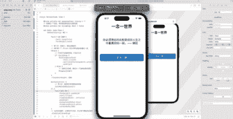

只花 4 个小时，比我预想的 3 天短了很多，而且，完全没有用大家说的 Claude Code，Cursor 等，所以我才说感觉很魔幻。后来，我也用这样的方式，把 App 上架到了苹果商店。

就是很平静的——按照 Gemini 的步骤，一步一步去执行。遇到问题，截图给 Gemini，它给我答案，我继续执行。就这样，一步一步走完了所有的流程。

在这之前，我完全没有想象过，我会以这样一种方式，丝滑、平顺、毫无障碍地完成这件事。因为，对于很多问题——如何做一个 App，开发苹果 App 的 Swift 编程语言的语法，Xcode 的工具的使用，如何打包、上架、审核、填资料……我是完全不知道的，甚至基本概念都没有。

如果按照传统的学习方式，我一定要去公众号搜各种教程、文档，先把基础的概念了解清楚，再才能知道下一步，要怎么做，这必然需要花费大量时间。

我前两次用这种思路学习 AI 编程，都失败了，感觉非常绝望。第三次，我抛弃了一切教程、细节，直接告诉 AI，我要做什么，你告诉我一步一步该怎么做，然后我真的就这样，一步一步完成 App 的流程。

我深刻意识到，AI 会彻底颠覆以往传统的学习方式。

###### 生财有术

如果你现在学习一个东西，AI 编程也好，小红书也好，公众号也好，你的第一想法还是，找一个教程，报一个课程，按照某种固定路径，先做什么，后做什么……99% 的概率，你会失败。因为这个世界上，没有任何一个教程，可以事无巨细到你行动中的每一个细节，解决你遇到的无数个个性化的问题。

但 AI 可以，120% 可以，确定、一定以及肯定可以！

所以，任何一个普通人，当下，你想要做任何一件事，不要说你要学什么东西，积累什么能力，学什么专业知识，而是直接告诉 AI，你想达成什么目标，想做什么事情，再让它给你列计划，一步一步去做、去交互。

现在已经到来的 AI 时代，考验的不再是知识积累、技能熟练度、专业知识，而是积极主动、逻辑思考、用心、细心、耐心、情绪稳定、身体健康、精力充沛。

有了这些，你会无往而不利。

### 焦波：如何使用 Obsidian+Claude Code 打造知识库系统

@焦波

AI 增长教练，「AI 先锋队」社群创始人

你好，我是焦波，在游戏行业干了 15 年，做过日活 400 万的产品。现在做 AI 企业落地服务，帮 100 多个人和企业做过 AI 咨询。AI 知识管理理念首倡者，推动知识库架构师成为 AI 时代核心职业，让知识积累转化为超级个体/企业的商业增长引擎。

我对 AI 的理解很简单，就是能帮个人和企业真正把事情做成的工具。今天想跟你聊聊一个让我工作效率提升 10 倍的东西——用 Obsidian 加上 Claude Code 搭建的知识库。

#### 一、为什么需要知识库

很多人说自己在用 AI，但其实只是在玩，我见过太多这样的情况了。

- 1. 和 AI 聊了几百轮，对话记录散落在各个平台，想找的时候怎么也找不到。
- 2. 每次重新开始，又得把自己的背景、需求重新说一遍，因为 AI 根本不记得你是谁。
- 3. AI 给的建议永远那么泛，因为它不了解你的业务。
- 4. 文件到处都是，需要的时候翻半天。
- 5. 更糟糕的是，账号一旦被封，所有数据就全没了。

我之前也遇到过这些问题，后来建了知识库，才算真正把这些坑填上了。

这里面最关键的认知是，AI 时代，知识库就是你的竞争力，AI 对你了解越深，给的东西就越靠谱，就像你找人咨询，陌生人的建议，永远比不上真正了解你的朋友。

#### 二、为什么是 Obsidian+Claude Code

市面上知识库产品挺多的，Notion、飞书文档、IMA 知识库都有人用，我为什么选 Obsidian+Claude Code?

- 1. 数据安全

Obsidian 是本地文件，所有东西存在我电脑上，不怕账号被封，也不怕平台哪天倒闭了，这点特别重要，我见过太多人因为账号问题丢掉所有资料的。

- 2. 操作方式简单

Claude Code 让我可以用说话的方式操作知识库，想干什么直接说就行，完全不用学代码。比如我说“帮我把这 100 篇文章都加上标签”，它就能批量处理完。你要是手动做，得花好几个小时，但它几分钟就搞定了，这个批量处理能力真的太实用了。

- 3. 上下文关联

还有个特别厉害的地方，就是我整个知识库都是它的上下文。什么意思呢？就是我知识库里几千篇文档，它都能调用，把我之前写的文章丢到一个写作素材目录，我跟它说“读取写作素材目录，再根据我的写作风格，写一篇关于某某方面选题的文章”，它真的能把我的风格学出来。

- 4. 模型迭代快

Claude Code 还支持 Skills 和 MCP 插件，Skills 就像给它安装各种专业能力，MCP 插件能让它连接外部工具，比如我装了个插件，它就能直接协助发邮件、查日历、搜索网页，这让它不只是个编辑工具，而是个真正的工作助手。

而且这个工具还在不断进化，Claude 的模型在迭代，功能也在更新，我现在能做的事，三个月前都做不到，这意味着你投入时间学它，回报会越来越大，不会过时。

我现在的知识库有几千篇文档，15 年创业经验都在里面，还有几百个从高手那学来的框架，加上 100 多个企业咨询案例，说它是我的第二大脑，一点不夸张。

#### 三、怎么管理知识

建知识库不是把文件往文件夹里一扔就完了，得有个完整的流程，我分三步走。

- 1. 输入

我从一百多个知识星球、各种 AI 社群、公众号、线下分享会、和行业专家的交流里获取信息，关键是要建立无缝衔接，比如看到好文章，直接就能保存到 Obsidian，不用复制粘贴，这样摩擦力就小了。

- 2. 处理

这步最关键，我用 AI 协助思考，注意是协助不是替代。提炼框架和方法，结合自己的业务，把高质量的东西留下来，比如参加大会，用录音设备记下来，让 AI 总结嘉宾的框架和方法论，这些就成了我知识库的一部分，以后随时能调用。

- 3. 输出

有了知识库，我的输出效率提升了 10 倍，写公众号、小红书、视频脚本，做方案、咨询客户、培训员工，做分享演讲快速组织材料，这些都快多了，我第一次做分享准备了 2 周，现在一天就能搞定文字稿和 PPT，因为框架和素材都已经沉淀好了。

#### 四、实际怎么用

说点具体的场景。

- 1. 我有个想法，比如想做 AI 知识管理第一人，直接对 Claude Code 说记录灵感。AI 自动保存到我的灵感文件，还会结合我的业务背景把这个思路扩展开，给我分析框架。这样每个灵感都不会丢，而且都经过了深度思考。
- 2. 每次和客户聊完，我把对话记录输入知识库。AI 自动生成客户的六个抽屉分层，这是我之前收集的人脉管理框架; 七个核心问题也记下来了，比如痛点、需求、预算，客户画像、需求分析、下一步怎么跟进、用什么话术，全都有。这让我的客户管理特别高效，每次跟进都能直接切到客户的痛点上。
- 3. 我的知识库里存了历史创作的所有文章，各种写作风格的模板，咪蒙、樊登这些顶级创作者的风格都有，还有爆款标题和结构框架，要写文章，给个选题，AI 就能结合我的素材库和风格模板生成好几个版本。我挑挑内容，加上自己的观点，一篇高质量文章就出来了。
- 4. 参加大会、和人交流的录音，我都让 AI 总结框架和方法论，这些框架会进知识库，比如我收集了一个小红书矩阵号专家的框架，他操盘几千个账号。客户问我小红书怎么做，我直接调用这个框架，AI 就能给专业方案。
- 5. 我还设了个朋友圈文案智能体，基于我的聊天记录和个人风格，自动生成文案，90% 是 AI 生成的，10% 是我把控思路，朋友圈能保持高频更新，又不失个人风格。

#### 五、企业案例

我给一家睡眠产品公司做过知识库，这个案例挺有代表性。他们有 31 款产品线，普通客服根本记不住，新员工培训至少要两周，知识更新同步也很难，招商资料做起来特别慢。

我的做法是先把所有 PDF、PPT、图片统一转成 Markdown 格式，再提升知识密度，一个 50M 的 PPT，有效信息可能就几百字，把客户常见问题分成四象限——高价值高频、高价值低频、低价值高频和低价值低频。

设计好回答模板，让它既专业又有责任感，再自动生成问答，一个下午就搞定了全部内容。效果特别明显，客服培训时间从两周缩短到半天，知识库还能复用到内容创作、招商材料这些场景，新员工随时可以通过知识库学，不用再依赖老员工了。

#### 六、三个洞察

在搭建和用知识库的过程中，我有三个很深的感触。

- 1. 知识密度决定 AI 输出质量

AI 就像厨师，模型是厨艺，提示词是菜谱，知识库是食材，同样 1000 字，不同人的信息含量完全不一样。高手的 1000 字能提炼出十几个精华观点，普通人的 1000 字可能一个有价值的点都没有，所以建知识库不是堆文件，而是要定期提炼，去掉冗余，提升密度。

##### 2. 数据会成为核心竞争力

两个同样起点的人用 AI，差别在哪？是数据的质量、数量和专业性。AI 时代，企业都需要首席知识官，知识库架构师会成为关键职业。对个人来说，个人数据资产就是你的护城河，就算遇到失业潮，掌握知识库的人也替代不了。

##### 3. 信任才是最大壁垒

AI 越普及，内容越泛滥，人们反而更难判断什么是可信的，这时候信任就成了最大的壁垒。所以我会参加很多线下分享，加入顶级圈子，持续输出实战案例，建立个人品牌。技术可以复制，但信任没法复制。

### 兔老师：如何把 AI 融入学术
#### 一个大学老师的 AI 使用手册

@兔老师

SCAI 创业者，深耕 AI 学术方向，Citely.ai 创始人

两年前加入生财，在航海里找到了自己的兴趣「出海工具站」，入驻 SCAI 实验室第三个月，发布了自己的 AI 学术工具 Citely.ai，回看这几年的变化，AI 真的带着我上了“高速”，也很感恩在我想去探索的时候，刚好遇到了这波浪潮。

下面简单分享我如何在日常工作中使用 AI。

##### 1. 写调研报告

在学校里，经常会有各种写报告需求，比如，调研全球高校人工智能课程建设情况，没有 AI 之前，需要手动浏览几十个大学的网站，再翻译、总结，非常耗时，现在有了 AI，这件事变得非常轻松。

我主要用 Gemini DeepResearch 或 Flowith，只需要把任务描述清楚，比如要看哪些大学，AI 就能生成非常完整的报告，需求描述得越具体，质量越高。

写完报告，我往往不会马上交，因为对于学校这个比较传统的地方，AI 的普及还需要时间，为了避免「卷」到同事，我会按照大部分人的工作速度，提交我自己负责的内容。但是，我拥有了更多可支配的时间，这些时间是 AI 给我「挣」的。

##### 2. 辅助学生做硕士论文开题

过去和学生讨论论文开题非常耗时间，有时还会出现“无法指导”的情况，比如方向太发散、跨学科多，而我也不可能什么都懂，但我也不能要求学生只能做我的研究方向，好在 o3 出现了。

现在我会让学生在来找我之前，先和 o3 至少聊一天，聊完以后，效果非常好：

- o3 确实在启发开题上比我强，因为它知道所有领域；
- 学生再来找我时，我们不再“空对空”，而是直接在已有框架上深入推；
- 整个讨论更高效，也更容易推进。

如果有圈友还在读书，建议试试和 GPT 讨论论文。

##### 3. 论文检索提效

估计很多人没有想到在论文检索的地方用 AI，这个其实是一个很好的提效操作，尤其对于要查询外文论文的同学，你可以尝试直接让 AI 给你写一个符合你要求的“正则表达式”帮你进行检索。

它和普通检索的区别：

- AI 自动帮你进行了翻译；
- AI 自动帮你找同义词；
- AI 帮你生成语法正确的检索式，你不需要记录"and""or"这些拼接方法。

##### 4. 文献综述写作

很多论文小白希望 AI 直接帮他们写一篇论文，但 AI 力量没有那么大，如果有一天它能写出及格论文，那应该取消毕业论文制度了。

尽管如此，有一个部分 AI 非常强——文献综述，因为综述本质上是“总结”，你给 Gemini 扔几十篇论文，它能很快帮你提炼要点，形成一个可用的综述框架。

##### 5. 发现并确认产品需求

「虚假文献」的需求发现来自工作中的观察，但是我在正式开发之前有一个困惑——这个需求是我个人的需求？还是身边人的需求？还是大众的需求？

这个确认工作，我是用 AI 进行调研的，我让 Gemini、Flowith 去 Reddit 上去搜集讨论，协助分析这个需求市场空间有多大。随后，我跟 ChatGPT 讨论技术方案，从知识库的构造到数据源的选择，AI 可谓功不可没。

##### 6. 产品开发

在 AI 产品开发上，我重度使用的几个工具是 V0、ChatGPT、ClaudeCode、Codex、Windsurf，我一般先和 ChatGPT 讨论需求，让它启发我。等基本思路确定后，让 V0 给我写出一个简单的页面，写完再把代码用 Windsurf 打开。

补充说明：我知道很多人用 Cursor，但我是个人使用习惯，我当时用 Windsurf 做了第一个网站，对它有特别的感情。因此，一直保持使用。

我在 Windsurf 里的控制台，同时打开 Claude Code、Codex。我习惯把一个需求同时给俩 AI 输入，再让它俩先用「费曼学习法」的原则，重复下我的需求，这一步挺关键，能保证 AI 正确理解了需求，如果我确认需求描述正确，再让他们同时写修改计划，然后我会选择一个符合我想法的代码方案进行执行。

过去一年的使用，让我发现大模型要用最贵的，因为 AI 越强，我越强，AI 不会取代人，但是「会用 AI 的，一定会取代不会用 AI 的」。

### 书虫:从个人到创始人转型
#### 如何深度用 AI

@书虫
APIMart.ai 创始人

从一个人到一个团队，我的绝大部分问题都与 AI 在沟通;在团队运营、规模化与绩效评估等等环节，都在善用 AI。

熟悉我的人知道，自 2022 年 AI 风口以来，我一直在做“基础服务”:从早期的 ChatGPT 自动充值，到现在我发现未来只要你做产品就会需要 API，我做起了 API 聚合站，始终为 AI 的使用者进行服务。

我的核心工具并不多:ChatGPT、Gemini 以及 AI 浏览器 Comet。用法不复杂，足够覆盖我遇到的大多数业务。如果出现解决不了的问题，我会尝试学习新的 AI 工具，但基本上我不会把很多时间投入到频繁换和学习新工具上。

因为大多数时间都会被浪费，学习后也大概率用不上，AI 隔一段时间，它们自己也会迭代，很可能你学习时遇见的问题，在下一个阶段，这个问题就不 existed，只需要对他们有个概念就行，当你真正需要再去深入学习就好。

例如，我对常用工具的定位：

- ChatGPT:文字对话，直接对话就好；
- Cursor、Claude Code:用于编程开发，自用或者给员工用；
- Comet、Dia:AI 浏览器，用于总结页面、联网检索，可以自动执行页面点击；
- Coze、ComfyUI:工作流智能体，像搭积木一样拼接，实现更复杂的想法和流程。

如果担心错过关键的信息，那就新工具上线时看看别人发的文章和视频有个大概了解。很多时候真的一个概念就够了:真正需要解决某个问题时，在脑子里能迅速想到它并且研究解决就好。

##### 一、我如何用 ChatGPT、Gemini、Comet 解决业务问题

在工具中，ChatGPT 的使用占比 80%，因为我的 ChatGPT 特别了解我，我不懂的东西问它，它能给我想要的答案。

新知识或者想了解行业内一些比较细节的内容，也包括分析同行，把所有想了解的提示词写清楚，再发送给 ChatGPT，开启“深度研究”，它大概花半小时就能在互联网上搜索所有相关的知识，整理好发给我。

我的基本流程：明确目标→写清提示词 (要详细)→ChatGPT 深度研究→获取要点梳理与行动清单→快速迭代。

例如：我最近发现了一个 Runninghub 营销做得非常好，让它协助深度分析研究这个品牌如何进行营销推广，这里面有哪些是自己目前阶段可以去学习的……如果遇到还不理解的问题，那就继续追问!


现在以出海为主的业务场景中，Gemini 对谷歌生态更熟悉，毕竟是自家的——无论是搜素和信息检索，还是文档亦或是开发者生态的细节，Gemini 给出的答案会更切合实际。因此这些问题，我会更倾向 Gemini。

我也常用 AI 浏览器 Comet，我不想投入大量时间阅读，就会习惯性地让它直接总结整个页面，自己再仔细重新看看，这种“先粗读、再精查”的流程，能节省很多的时间。

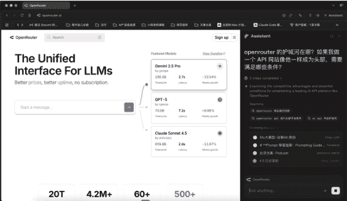

##### 二、我的 AI 使用场景

我的 AI 使用场景是基本覆盖所有的，遇事不决先问 AI，我是真的做到了这一点，不管遇到什么问题，优先把问题描述清楚，再发给 AI 去询问，多问几个回合就会得到想要的结果，即便是一个完全不懂的知识，也能有大概的概念。

最近重构了 API 网站 APIMart.AI，我招聘了团队处理这个事情，例如：月薪怎么给，社保怎么缴，员工激励怎么做，员工绩效怎么设定，信息如何更高效的对齐，公司内部信息怎么同步最高效……这些都是我近两个月思考的点。

也确实因为第一次组建团队，遇到的卡点比较多，但是这段时间下来，陆续解决得差不多了，后面也在研究怎么放大自己的团队，比如部门之间如何管理协调，都还在继续探索，ChatGPT 依旧是我最好的伙伴。

我是做 AI 生意的，最近很多人叫我尝试 ComfyUI，这里面需要有直接能够落地的工作流，我也慢慢去学习，ComfyUI 似乎上手不是那么容易，但是现在有 AI，遇到不懂的截图再直接问他，问题就能很高效的解决了。

##### 三、我对于 AI 的洞察

效率是指数量级提升，AI 带来的是真正的 10x 增益，我在招聘上加了一条，就是入职，AI 你是能够畅享的，能够帮你提升效率的、合理的，基本都能够满足，ChatGPT 会员有，Gemini 会员有，工程师开发可按习惯选择 Cursor 或 Claude Code(配 Claude Max)。

这些确实能够大大提升他们的效率，给他们制定的任务，他们也能依靠 AI 去迅速完成，节省的时间还可以投入到细节打磨与流程优化。

对内容的创作，我也会给它大概方向去生成文案，或者自己写的文案如何更好地优化，让用户读起来更舒服一点，即便没有系统训练过文案能力，借助 AI 依然可以稳定输出高质量内容。

越用 AI 越发现，AI 对我们普通人来说真是一个跨时代的机遇，知识获取被重塑。

回想我上大学时学“逆向”(游戏/网页)，资料稀缺、问问题都不知道上哪问，现在 AI 立马能回答，大幅降低学习与试错成本，对普通人而言，这是一次难得的机会，完整的信息平权了。

我还依稀记得，一位大佬说过的一句话是：技术的价值就是在于我会，而你不会。这句话代表着这个人很牛逼，同时也说明在这条路上，想要上升有多艰难。

通过上面的文字表达你会发现，我几乎没有怎么去自己写代码，更多用相关的智能体，但这两个月实现了角色的转变，从自己一个人无所不能、超级个体，转变成一个小老板，要做的、思考的事情不一样了。

我以前啥都爱自己干，觉得自己很牛，但一个人的时间精力始终有限，要尽可能把自己的时间释放出来做更重要的事情，例如：战略方向、关键决策、组织与机制建设、人才与协作效率。

所以，我倡导的更多是，你需要用到什么，再去多学习了解就好了，在不需要的时候你对这个有个概念就行。如果需要比较多的时间去学习，那花钱解决就够了，只要投资回报比是合适的，就没问题。

这篇“转型”，不是更换花哨的工具，而是把做事的方法拧紧：以目标为锚，以流程为骨，以极简工具为刃。

从个人到创始人，我更在意如何把注意力放在高杠杆位，让人、流程、AI 协作更高效，愿我们把复杂事做简单，把简单事做到极致。

### 大潘:如何靠 AI 做出一款 App
#### 一文告诉你用到所有工具

@大潘
码上取 App 的开发者

我们都知道，移动互联网从 2010 年到如今，已经迈过了十几年，应用市场从刚开始的 App 匮乏到如今的丰富，可以说，整个市面上，你能想到的、你没想到的都已经存在于市场上。

但是之前，我们想要自己开发一个应用，对能力的挑战是全方位的，特别是技术上，没有几年的沉淀，是很难自己开发出一个 App 的，如今随着技术的平权，竞争力逐渐向需求洞察、产品运营上倾斜，这对绝大多数有想法的普通人来说，是新的时代的红利。

那我们该如何抓住呢？如果我们的目标是做出一款小而美的 App，就需要解决一部分人在某个场景下遇到的问题，这是一个抽象的概念，你会发现有很多问题需要去思辨、去验证。

我通常会把这个目标拆成 3 个方向，分别是：需求侧、产品侧、运营侧，再借助相关的 AI 工具来达成这个目标。

##### 一、需求侧

###### 1. 需求的挖掘

需求的挖掘可以有很多种方法：从自身出发，评论区挖掘，特定的网站上挖掘，比如小红书、Reddit、X 等，我经常会在刷视频、听歌、坐地铁时迸发一些灵感，再录入 Idea 清单，截至现在，清单里陆续躺了近 30 个 Idea，但这些只是记录，我并没有去验证与分析可行性。

除了自身痛点出发，我还可以借助一款插件——社媒助手，下载小红书的评论区到 Excel，丢给 ChatGPT 去分析。

如果是国外的网站，我们看不懂英语，但想知道用户在说些什么，寻找什么需求，该怎么办？我的做法是借助“沉浸式翻译”这款插件看，去感受用户说的内容，当然你也可以借助现在比较火的 Agent 浏览器——Comet、Atlas 帮你自动统计和分析。

但是我认为做产品的人，需要对用户的需求痛点有明确、具体的感知，所以我更喜欢人工去看。

###### 2. 需求的验证

有了 Idea 之后，我需要借助 AI 来协助分析，跟我一起探讨，以防我自嗨，这时候 ChatGPT 的电话模式就很好用，我会跟 ChatGPT 打一通电话，从各个角度去思考这个 Idea 的可行性。

###### 3. 市场规模的分析

这个环节就是粗略估计你的产品上限在哪，你的人群在哪，用户画像是什么样的，人群太少或者太难找，肯定不行。这个环节，也可以通过跟 ChatGPT 电话讨论完成。

###### 4. 竞品的分析

让 ChatGPT 给我们提供潜在的竞品，或者直接去 App Store 上搜索相应的关键词，你就会看到排在前面的应用，下载来体验，看看他们是怎么解决问题，用户流程是怎么样的，交互是怎么样的，好不好用，有什么卡点，多对比几家，你就会有总体的思路。

当然，我们还可以借助一些第三方工具，例如用点点数据、七麦去看竞品情况，还可以借助 Screensdesign 这个网站去直接看 App 截图，这适用于懒得下载体验的场景。


此外还有一个黑科技，如果你不知道别人的 App 到底哪里做得好，哪里做得不好，你还可以录视频给到 Google AI Studio，让它帮你分析，你从中寻找机会点。

此外，我们还通过 Google Trends、Sensor Tower、Ahrefs 去分析需求强烈度，Toolify 看市场排名靠前的应用。

##### 二、产品侧

###### 1. Logo

不知道如何设计 Logo，或者不知道该如何写提示词，最简单的办法是给参考，去 DesignEvo 上寻找一些还不错的案例，丢给豆包/即梦去仿照生成，或者直接去 Canva 上根据模版设计。

###### 2. PRD

跟 Claude Code 探讨想法、多轮沟通后，让它给我写 PRD 文档，相当于通过建立 SubAgent 的方式，让专业的产品经理来帮你写出 PRD。

###### 3. UI

如果我们不知道怎样设计好看的界面或者组件，那就可以去“花瓣”“Dribbble”上找灵感，再丢给 AI，让它协助出类似风格的 UI 文档，这样 AI 干活写代码时就有文档可依，写出来的颜值在线。

###### 4. 交互

有时候我们发现，很难用语言去精准描述一个交互效果，导致 AI 写出来的效果也不尽如人意，那不如让 AI 自己去描述，这时我就会把好的交互效果录频，丢给 Google AI Studio，让它描述这个交互动作。

###### 5. 开发

工具主要用 Claude Code 和 Codex，Claude Code 干活很快，Codex 思考能力足，可搭配进行开发。如果是比较复杂的逻辑，Claude Code 干完活，会让 Codex 帮我检查一遍，看看修改的如何。同时我也会结合一些 MCP 去使用，例如「Context7：补全最新知识」「Chrome-devtools-mcp：操作谷歌浏览器」「Supabase mcp：操作数据库」「Figma mcp / pixso mcp：把 UI 稿转为前端代码」。

##### 三、运营侧

###### 1. 内容制作

我一般采用"AI 辅助 + 手动修改”结合的方式，目前 Gemini 对于文字类的表达效果比较好，完成后我会记录在 Obsidian 中，未来计划通过 Claude Code 去操作 Obsidian 中的内容。

###### 2. 内容分析

对于视频类，我一般是直接丢给 Google AI Studio，让它去分析为什么会火，原因是什么。这款工具挺好用，能读懂视频的内容，并且免费。

##### 四、其他

- Notion:App 的协议，如隐私协议、服务协议等，都放在 Notion 上，通过 Notion 的 Agent 功能直接帮你创作与修改，非常方便，并且可直接使用自带的分享公开链接，用户在 App 内查看协议，可直接跳转到对应的 Notion 页面。
- NotebookLM：支持多种格式的内容上传，再让大模型进行分析与理解，非常方便。我会往里丢一些我收藏的 Youtube 视频，国内类似的笔记软件是 Get 笔记，也可以通过丢链接的方式 (NotebookLM 对国外媒体的解析效果比较好，Get 笔记国内媒体的解析效果不错)，让其自动去解析，效果也不错。
- Dia：遇到陌生网站，我直接打开 Chat 对话，问它这个网站是做什么的，它可以对你当前划线的内容进行提问。Dia 这个产品的简洁度和审美我非常喜欢，目前是主力浏览器。
- BOB：一款能够常驻于你的 Mac 后台，你随时调用的翻译软件，可以调用大模型进行划线翻译/截图翻译，对英语不好的人来说简直是救星，还可以进行文字识别提取想要的内容。

以上是我目前使用到的大部分 AI 工具，我每天的工作都离不开 AI，基本上是工作时长=AI 使用时间，同时，随着我大量的使用，越用越熟练，带来的变化也很直观。

现在遇到问题，我习惯性先丢给 AI，它会直接把方向、选项、利弊都摆出来，我拍板快多了，而且我的产出也变得更密集，从前期的调研、协议，到中期的文案、测试，再到后期的复盘，AI 都能给到一份质量很高的初稿，我只需要在它的基础上把关和定稿。

最直接的好处是，试错变得特别便宜，一条主流程从想到做成，一两天就能见到结果，这就意味着我需要用更低的成本，去捕捉更多的机会。这个过程中，我的学习也变快了，AI 就像一个全天候在线的实习生团队，我边做边问、边写边改，技能和认知都在实战中自然而然地提升。

把 AI 用起来，把它当成你的生活、工作的一部分，坚持三个月，你会很难回到没有 AI 的旧工作方式，甚至可以看到自己的效率和人生轨迹在改变。

### 唤山：普通人的 AI 实战
#### ——用“抠门”和“偷懒”倒逼出的效率神器

@唤山
爱折腾的普通人
致力于用 AI 解决生活中的“小麻烦”

今天分享几个我为了“偷懒”而搭建的真实场景，希望能给同样在探索中的你一点启发，让你看完就能上手试试。

##### 1. 因为“抠门”，我把 5000 元的人工客服变成了 9.9 元的 AI。

这个项目源于我一个非常“抠门”的想法：我的小店每天约 100 条咨询，人工客服成本高达 5000 元/月，对于小店主来说，这笔钱我宁可拿去吃火锅。于是，我决定自己动手。

最终结果是：每月仅需 9.9 元 (Coze 会员费),完美替代人工，它能全自动处理 90% 的售前咨询，只有遇到无法识别的图片或复杂售后时，才会触发“夺命 Call”——控制我的电脑自动给我的微信打语音电话，确保我睡觉都在线。

大家别被技术吓到，我把这个逻辑拆开，你一看就懂，这其实就是用 Python 脚本模拟真人的操作:

- 装上“眼睛”(获取信息)。使用 Playwright 工具，像人眼一样盯着后台网页，看到新消息就抓取下来;
- 接入“大脑”(分析意图)。把抓到的问题发送给 AI 大模型 (Coze 工作流)，让它去判断怎么回、要不要发图;

3) 动起“双手”（模拟操作）。拿到 AI 的回复后，再用 Playwright 模拟鼠标键盘，把答案填进对话框点击发送。

##### 2.因为“记性差”，我用 AI 搭建了“公考模拟考官”。

备考行测言语理解时，需要记忆大量容易混淆的成语，我自制力差，直接盖住答案背诵时，总忍不住偷看，效果很差。于是，我用 AI 工作流（Coze）搭建了一个严格的“考官”。

操作逻辑拆解如下，大家可以在 Coze 或类似的工作流平台复刻这个思路：

- 1) 建立知识库。把容易混淆的成语和解释整理好，上传到知识库。
- 2) 设置“提问节点”。设定 Prompt：“请从知识库中随机抽取一个我未掌握的成语，只说名字，不解释，让我来回答意思”。
- 3) 设置“评判节点”（关键点）。这是 AI 比死记硬背强的地方，不要让 AI 机械比对文字，而是设定 Prompt：“请判断用户的回答与标准释义在含义上是否接近。如果接近打 10 分，不接近打 0 分”。

这样一来，我被迫只能靠理解去回答，记忆效率直接翻倍。

##### 3.因为“爱拖延”，我把飞书变成了我的“日程管家”。

我经常深夜为当天的拖延自责，发誓明天要规划好，结果因为懒，连打开日历软件输入文字这个动作都觉得繁琐。为了治好拖延症，我把飞书改造成了助理。

我是怎么设置的？这个功能不需要写代码，利用飞书的自动化或 Coze（扣子）就能实现：

- 1) 入口：在飞书创建一个群聊机器人；
- 2) 触发：发送一条语音，例如“明天下午三点写公众号文案”；
- 3) 处理：机器人调用 AI 模型，执行指令：“从这句话中提取【时间】和【待办事项】”；
- 4) 执行：连接飞书日历接口，自动在对应时间段创建日程。

现在整个流程变成了按住语音说话、松手，日程建好了，路径短到根本不给我拖延的机会。第二天看着排好的日历，我只需要按部就班地执行就好。

##### 4.遇到 AI“鬼打墙”?用魔法打败魔法。

大家在实战中肯定遇到过这种情况：让 AI 写个东西或改个代码，它陷入死循环，说改好了其实还是错的，这时候千万别在一个对话框里死磕。

我的实战技巧:

- 1) 换个“脑子”。把 A 模型写不出来的东西，扔给 B 模型。比如我用 Trae 改 Bug 迟迟改不好，我直接把报错扔给 Gemini，它立刻指出 Trae 的逻辑漏洞。
- 2) 让 AI 写提示词。当你不知道怎么向 AI 提问时，直接告诉它：“我想做个 XX，但我不知道怎么描述，请帮我写一个最精准的 Prompt”。
- 3) 左右互搏。让一个 AI 做，让另一个 AI 检查，就像老师改作业一样，效果往往出奇的好。

AI 时代，技术在变，但对生活的热爱，和对痛点的敏锐度，永远是核心竞争力。我分享的这几个场景，本质上都是因为我在生活中感到了“不方便、不舒服、想偷懒”，才倒逼出了解决方案。哪怕我们现在没有赚到大钱，只要保持思考，保持折腾，每天发掘一个小需求，我们就能比昨天的自己更强一点。

思考总是好的，再不济，还能预防老年痴呆。

### 叁斤：我的小红书变现体系都被 AI 覆盖了

@叁斤
AI 赋能小红书虚拟电商教练

我是怎么用 AI 的？AI 不只是助力提效，而是成为了我不可或缺的合伙人。之前我觉得 AI 就是能写写东西，生成小红书笔记可以提升效率，或者做些 AI 工作流程加速小红书矩阵进度。

但现在，不仅在内容上有提效，还有课程开发、学员辅导、数据分析、工具开发（虚拟产品）、战略规划……这篇文章分享我如何把 AI 当做合伙人，让它做产品、辅导学员。

#### 一、用 AI 辅助内容创作

最常见、也最频繁的是用 AI 辅助小红书、公众号和朋友圈的内容创作。

工具组合：快捷指令 + 多维表格 + Gemini。

具体流程：借助 AI 做两个快捷指令，一个把抖音/小红书的内容采集到多维表格，另一个把我所有的想法，记录到飞书多维表格。在多维表格中接入 AI，让 AI 基于我的账号定位自动分析爆文，并给出写作方向和选题建议。再把 AI 给的建议给 Gemini，并给出一份初稿。人工修改，发布。

这个流程解决的问题：写作最难的问题不是不会写，是不知道写什么。有了这个流程，就有了源源不断的选题，不管是对标的，还是自己的笔记、想法，全部都能成为选题。

我主要往个人 IP 方向写，所以没有仿写的流程。在内容创作部分，我一直认为 AI 是助理，不是代写工具。人要做的是注入灵魂，包括真实案例、个人经历、独特观点等。

#### 二、用 AI 做虚拟产品

我有在小红书卖虚拟产品，所有的产品都是借助 AI 原创做出来的。

工具组合：Claude+NotebookLM。

这是两种完全不同的产品：Claude 解决的是工具类的产品，比如卖得很火的“SCL-90 测试”“恋爱占有欲测试”“新生儿取名器”等，这些产品借助 Claude，或者 Cursor、Bolt 都可以做出来；NotebookLM 解决的是文字类、知识库类的资料，我写了个《小红书个人 IP 起号手册》，全文 6 万多字，就是把我过往所有内容整理到 NotebookLM，让它给我出内容框架和填补一些内容。

解决的问题：原来手搓 6 万字手册要小半个月，现在一周就够了。另外，我完全不懂代码，一丁点都不懂的那种，也能做出专业级的性格测试网站。

#### 三、用 AI 辅助战略规划

自由职业和创业者非常容易陷入迷茫和焦虑的状态，也很难找到人沟通，这是属于创业者的孤独。现在我会在任何迷茫焦虑和需要做决策的 Moment，都问问 AI 的意见，它不一定能给我对的方向，我也不一定采纳建议，但只要跟 AI 讲当前状态和困境，它就会给我多个建议参考。

工具组合：ChatGPT/Claude/豆包/Gemini/通义听悟。

一般战略规划建议不要只跟一个 AI 说，我会综合多个 AI 的建议，并让 AI 去判断另一个 AI 的思路是否更好？在做完这些后，思路逐渐变得清晰，迷茫和焦虑的情绪也会消失。

#### 四、AI 是我的外置大脑

我有一个文档，里面写了大量我的信息，还有一个知识库，里面包含大量我的思考和运营知识，这些内容全部都会输入给 Gemini、ChatGPT 和 Claude 深度学习，这样它就能基于我的信息和知识库，协助我做一些思考。

比如，帮我做小红书店铺运营数据分析、投流数据分析和优化投流策略等，再把分析结果和自己的理解结合，我对账号和广告计划做调整，效率很高了。

#### 五、AI 浏览器

我的常规浏览器已经从 Chrome 转到了 Dia，这个浏览器能帮我做的事情实在太多了。比如小红书，在分析笔记评论区的时候，之前要全部采集下来再给 AI 分析，但用 AI 浏览器，可以直接对话，分析评论区的情绪，从中挖掘选题。

或者在学习航海手册，跟着流程执行的时候，遇到卡点可以直接在浏览器对话，它会结合航海手册的内容，给你提供解决方案，非常方便。

我是非常懒的人，性格是 INTP，所以用的 AI 工具并不多，一旦多了我会觉得很麻烦，反而会放弃使用，最常用的就是 Gemini、Claude，还有 Dia，但我会把每一个 AI 都落地到具体使用场景上。

我的核心业务是小红书虚拟电商，现在的笔记、产品、数据分析和投流方面，已经全部用 AI 覆盖了。

### 令狐峰：一个产品技术型老板用 AI 的日常

@令狐峰
极客增长创始人
旗下 2 款内容营销 SaaS 工具

2020 年 4 月 18 日加入生财后，不仅拓宽了认知、打开了事业，也在这里遇到了现在的老婆，如今已经是两个女儿的爸爸。

目前我在杭州带着一个十几人的团队，专注做两件事：

- 1. 自研两款面向国内企业的 AI 营销工具；
- 2. 基于自家工具，为行业头部客户提供内容种草、SEO（抖音/小红书关键词排名）以及 GEO（基于 AI 对话结果的内容优化）的服务。

公司比较小，但业务很复杂，岗位有十多种，活很多，每日沟通次数非常多，用飞书帮我统计，2024 年我一共开了 570 场会议。由于和团队小伙伴经常是面对面沟通，不常打开飞书，所以我的痛点就是如何在最短的时间，让电脑记录我和团队的面对面沟通内容，方便回看会议内容，找出待办。

#### 一、豆包电脑版

后面我发现，豆包电脑版可以解决这个问题，它有一个会议纪要功能，免费录音 2 小时，并且会自动总结会议内容，通过设置电脑快捷键，一秒钟就可以一键开启会议纪要，会议纪要结束后，会生成会议纪要链接，发给对方可以一键打开，并且支持提问和生成脑图，很方便。

说到会议纪要还有一个很重要的场景，HR 每天需要大量面试实习生或者岗位候选人，就需要记录 HR 和求职者的对话，这样可以让二面的人快速了解一面的面试情况。

最重要的是可以让 ChatGPT 根据一些感理分化说，这是我老婆 Hawli 独创的一种 AI 招人方法论，让 AI 分析整个对话记录，分析候选人性格特征、岗位匹配度等内容，求职者优点和缺点、注意事项等，基本招人没再踩过坑，更容易招到更匹配的人，并且使得新员工的试用期流失率降低。

说到豆包，再说一些我常用的功能，作为内容型公司，经常数据分析或者处理表格，我会直接把表格上传给豆包，再开始语音输入，让豆包把表格中的各种需求一次性完成。

有时候表单很长或者是国外网站的表单不知道怎么填写，也可以打开豆包的共享屏幕功能，让豆包根据我的情况直接把表单填充好。另外，豆包做个脑图、流程图、简单的网页，都挺方便的。

#### 二、Manus 会员版

除了豆包，第二个我常用的 AI 工具是 Manus，花了一万多买年会员，我是偏技术型的创业者，有时候自己写点小项目，我会让 Manus 给我做第一个版本产品 Demo。

用 Manus 的好处是：

- 1. Manus 在编程方向做了很多工程化的事情，编写的代码质量更高；
- 2. Manus 会自己进行产品测试，减少 Bug，我让 Manus 写测试报告；
- 3. 让我在手机端也可以进行提问和进行编程。

Manus 还可以做一些简单的 PPT、产品调研报告、Github 开源的项目推荐、自动控制浏览器等功能，算一个可以操控浏览器的实习生，协助我快速完成一些简单的工作，无需额外对人的沟通，但是最近 Manus 不太稳定，经常会无法访问。

#### 三、ChatGPT

第三个比较常用的 AI 工具是 ChatGPT，ChatGPT 的记忆功能很强，更多承担大脑的角色，我会让 GPT 了解公司的业务和我的历史过往，对 GPT 提一些公司的战略方向、机会以及业务细节，GPT 给出的很多回复可以让我拓宽思路。

#### 四、其他具体场景的 AI

剩下的是我们公司中业务同事在具体场景会用的一些 AI，业务是做内容营销方向的，因此写文案和生图片或生封面会用到豆包的写作功能和即梦的生图功能。

我们小红书运营同学会用 100 City 这款工具，把“写笔记—排版—发布”全部自动化，每天自动生成内容、自动定时发布，稳定保持更新频率。

虽然还没跑出爆款，但最大的价值是：每天能节省 1~2 小时的机械化笔记整理时间，让运营从“重复劳动”里抽离出来，把精力放到更重要的事——选题判断、数据复盘和内容优化。

自动化不是为了爆款，而是为了让人更聚焦“能产生爆款的地方”。

在 AI 编程方面，技术组的同事都是用的 Claude Code 和 GLM-4.6，我自己也会在 Manus 做出初步版本后，在本地用 Claude Code 接着编程。

视频内容生成方向会用 Coze（扣子）的工作流，来批量生成一些视频的初稿，方便加快剪辑视频的速度，有时候用 Coze 一天可以生成上百条视频初稿。

复盘过去一年，预估有 30% 的工作时间，我都在用 AI 替我干活：

- 1. 豆包=高效执行助理（会议、填表）；
- 2. Manus=技术合伙人/实习生助理（写代码、做 Demo、做 PPT、收集资料）；
- 3. ChatGPT=战略顾问/大脑外存（战略、记忆）等。

确实节省了我不少时间，让我可以把更多时间用于战略思考和休息，同时也提升了公司竞争力。

通过这段时间的亲身感受，我更加坚定了要在 AI 方向持续投入。虽然我们现在做的 AI 营销工具依然是亏损状态，也花掉了我很多个人精力，但它让我意识到：科技创新是条必须走的路，我们不能只停留在“使用 AI”，而是要真正把 AI 嵌入业务流程，让它替我们和客户省下真正宝贵的时间。

这件事短期不一定赚钱，但长期一定值得。

### 来来：电商设计
#### 如何用 AI 这个“超级员工”帮我自动赚钱

@来来

12 年电商设计公司 CEO，AI 企业顾问和培训讲师

我的头衔很多，事情很多很杂，时间永远不够用，但这三年来，AI 成了我的超级员工。

AI 是我解决问题的万能钥匙，我不是把 AI 当成一个高深技术，而是把它当成我公司里的员工——24 小时不睡觉、不要工资，而且不会抱怨、能力超强的超级员工。

##### 一、如何用 AI 赚到更多钱

我从 AI 电商、AI 图片自动化、AI 自动化这三个层面，分享一下我这个人类老板怎么管理，和使用多个 AI 超级员工来降本增效、开拓业务，最终赚到更多钱。

- 1. 选品采集与市场分析：从“人工拍脑袋”到“AI 采集数据人工决策”

以前选品，要么靠经验直觉，要么靠人工一点点翻看平台数据，效率低还容易看走眼。现在，我会给我的“AI 助理”下指令。

比如，我想在亚马逊上找一个有潜力的家居小品类。我会对 AI 说：“请分析当前亚马逊‘家居与厨房’类别下，客单价在 20-50 美元之间，近三个月搜索量上升快，但竞争程度中等偏下的细分产品。请列出 5 个潜在选项，并分别分析其优劣势和市场机会。”

几分钟内，AI 就能给我一份结构清晰的报告。它可能会告诉我“便携式果蔬净化器”正在兴起，或者“磁性纱窗修复贴”存在市场空白。这大大缩短了我的决策周期，让我的选品从“凭感觉”变成了“有依据”！

采集国内电商数据，我一般用飞书多维表格的连接器中心，非常强大和稳定，官方 API 安全不封号，可以从聚水潭、美团、饿了么、景点、巨量千川、巨量广告、抖音、金数据、抖音来客等平台采集电商数据。

采集国内自媒体平台的数据，相对麻烦一点，但也可以通过飞书多维表格联动 Coze（扣子）工作流配合 API，采集小红书、公众号、视频号等的自媒体数据。

海外电商和海外自媒体数据，建议用 n8n 工作流去采集，那是相当爽，它的核心在于支持批量采集海外平台数据和发布到海外平台。

- 2. 文案创作：AI 一秒生成千百条，总有一条适合你

电商文案的核心是：抓人眼球、突出卖点、激发购买欲。过去一个文案一天可能写 10 条主图文案就头昏眼花了，现在，我能够让 AI 批量生产。

比如，我有一款“便携式咖啡杯”，它的卖点是“3 秒加热、保温 12 小时、颜值高”。

我会给 AI 提示词：“针对‘便携式智能加热咖啡杯’，请生成：5 个不同风格的天猫商品标题（突出科技感、突出时尚感、突出实用性等）；10 条吸引人的抖音短视频文案脚本；20 条用于详情页的 bullet points（卖点罗列），分别从功能、材质、使用场景等角度阐述；3 套不同风格的详情页文案框架（极简科技风、温馨生活风、潮流炫酷风）。”

以前需要团队开会脑暴一上午的活儿，现在 AI 花 10 分钟就搞定了。我的工作变成了“总编辑”：从 AI 生成的几十上百个选项里，挑选、修改、组合出最好的那条，效率提升了何止 10 倍。

这里不得不提的就是飞书多维表格，不要简单理解认为它是表格，它能把一个个 AI 超级员工塞到每个列中。

- 3. 商品图与模特图：AI 零成本“拍”出千百张

我开了 12 年设计公司，太清楚图片生产的痛点了：成本高、沟通累、修改烦、周期长。

AI 的出现，直接重构了我的工作流，这是对我生意改变最大的一点。以前为一个产品拍图，要请模特、租影棚、找摄影师、后期修图……一套下来，费时费钱。现在呢？

比如我有一款新设计的帆布鞋。

- 第 1 步：我用手机给这双鞋拍几张白底图。
- 第 2 步：把图片和指令丢给 AI，“请将这张帆布鞋图片，放置在以下场景中：1.阳光明媚的公园草坪上；2.都市街拍的咖啡馆外；3.充满设计感的家居室内。要求图片真实感强，风格清新自然。”

几分钟后，我就得到了这双鞋在不同场景下的高质量“实拍图”。我甚至可以要求：“请生成同一个模特，分别穿着这双鞋的白色、黑色、粉色款的照片。”

这意味着，我不用再生产大量库存来拍图，可以先上架，用 AI 图测试市场反应，再决定生产哪些颜色，这简直是商业模式上的降维打击。

简单、少量的几十个，可以使用飞书多维表格配合 AI 字段捷径，瞬间生成各种模特图；复杂、大量，一天几万张图片的话，就用 ComfyUI 工作流，批量生成各种模特图和商品图。

例如：有个 TEMU 帽子商家，以前一个月 10 个设计师手绘做 1500 款图案，现在一个 ComfyUI 工作流一天 24 小时 AI 生成 1500 个图案，就节省了 10 个设计师的费用，一个设计师按照每月 5000 元来算，一年 10 个设计师的成本是 60 万。

- 4. 培训业务升级：每个学员都有自己的“AI 助教”

作为 AI 培训讲师，我无法同时回答几百个学员所有问题。现在，我为每一门课程都训练了一个专属的“AI 助教”，这个 AI 助教学习了我的所有课程内容、课件和常见问答。

当学员有疑问时，可以随时问这个 AI 助教：“老师，刚才讲的‘提示词工程’第三步，能再举个例子吗？”“我这个图片用 SD 总生成不好，帮我看看我的提示词哪里有问题？”……

AI 助教能 7x24 小时提供精准的、基于我课程内容的解答，这极大地提升了学员的学习体验感和满意度，也把我从重复的答疑中解放出来，去研发更优质的课程。

对于企业客户，如中国移动、长江商学院来说，这种高附加值的服务也让他们觉得“这钱花得值”。

AI 助教的核心是用了 AI 知识库。生财有术之前的 AI 知识库、AI 视频、AI 工作流航海，来来都配套制作有专门的知识库，核心其实就是完成这个作用，你不需要看文档，只需要问文档即可。


##### 二、如何用起来 AI?

- 1. 从小处着手，解决一个具体痛点

别想着一上来就搞全公司自动化，先找一个你最烦、最多重复的工作。

比如你每天都要写很多重复的邮件，让 AI 帮你写初稿。你是不是为找配图发愁？让 AI 帮你生成。

从一个点开始，获得正反馈。

- 2. 你必须是“老板”，AI 是“员工”

最终决策和承担责任的人是你，AI 生成的内容、图片、数据，你必须去检查、修改、赋予灵魂，不要当甩手掌柜，要当总编辑和总审核。

- 3. 关注整体流程，而非单点技术

最高级的用法，不是用 AI 完成一个任务，而是用 AI 把多个任务串联起来，形成一个自动化的流水线。思考你的工作流中，哪些环节可以被 AI 替代和连接。

AI 的时代已经到来，它不再是科幻电影里的概念，而是我们身边触手可及的生产力工具。从现在开始，试着招聘 AI 这个“超级员工”，它准备好了为你工作。

### 马小帅：AI 工作流应该是人定灵魂，AI 造肉身

@马小帅
AI 干货自媒体网罗灯下黑主理人

#### 一、AI 的红利是受控穷举，人要练的是定义边界

AI 现在最实在、最大的红利，我管它叫受控的穷举。

以前搞头脑风暴，大家天马行空，说得挺嗨，最后往往扯淡一小时，能落地的没几个，因为人的思维太容易跑偏。

但 AI 不一样，AI 的穷举是有约束性的。你给它一个创意、一个设定、一个角度，它能老老实实地，就在你画的这个圈子里，给你变出一百种花样。它不会跟你抬杠，不会自己灵感突发跑到圈外去。

这在以前是不可想象的。

你要一百个同类型的文案？行，AI 给你。
你要一百个同样设定的场景？行，AI 也给你。

这才是当下最具可执行性的红利——它把量产创意这件事给工业化了。

那在这种情况下，人需要提升什么能力？

###### 生财有术

很简单，AI 负责穷举，人就得负责定义边界，你得是那个画圈的人。你得能精准地告诉 AI，你要什么、不要什么、边界在哪、标准是啥。你提的要求越模糊，AI 给你的就是越标准的垃圾；你提的要求越精准，AI 才越有用武之地。

这能力怎么练？

别信那些提示词大全，没用，唯一的办法就是实战。把你自己吃饭的活儿扔给 AI，看它怎么搞砸。它搞砸一次，你就去修正一次你的要求，你修正的次数越多，你定义边界的能力就越强。你用你的专业知识去喂它、折磨它，这能力自然就练出来了。

## 二、我的 AI 写作工作流：人定灵魂，AI 造肉身

我现在用 AI 的场景很多，但最高频的，是写作。

我这人，脑子转得快，但打字慢，也烦。我最讨厌的环节，不是思考，而是把脑子里的想法，一个字一个字码成文章的过程。所以，我现在的工作流特简单，就是口述+AI 仿写。

我的逻辑是：人负责灵魂，AI 负责肉身。

具体操作：

- 1.先拿录音笔或者直接对着文档语音输入，把脑子里所有的思路、逻辑、观点，包括文章的大框架，用口水话先说一遍，这过程可能很乱，没关系，只要核心信息都在就行。
- 2.把这几千字的口水话草稿，扔给 AI。重点来了，我有一套自己调教了很久的仿写提示词，这套提示词里，封装了我写文章的风格、语气、用词习惯，甚至怎么组织段落的逻辑。
- 3.AI 吃进去的是一堆杂乱的口述素材，再结合我的仿写指令，吐出来的，就是一篇逻辑严密、风格统一、几乎可以不用大改的成稿。

这套工作流，把我的效率拉满了。我只做最核心的思考和定义，剩下的体力活儿，全交给 AI。

公众号懒人搜索，懒人专属群分享

## 三、AI 解决的最大问题，是当一个不给答案的私教

AI 目前帮我解决的最大问题，说出来你可能不信，是辅导孩子写作业。市面上那些辅导作业的 APP，有一个算一个，在我眼里都不行。它们只会干一件事：扫题、给答案、给步骤。这不叫辅导，这叫作弊器，纯粹在摧毁孩子的思考能力。

我试遍了市面上的产品，没有一个能做到。最后没办法，我只能自己动手，专门定制了一个辅导作业的智能体 (Agent)，我给它下了死命令：

- 1.绝对不准说出答案。
- 2.必须用苏格拉底式的提问，一步步反问孩子，引导他自己找到解题的思路。
- 3.当孩子做错一道题后，AI 必须能即时原创几道同类型、不同数字的题目，让他当场巩固，直到真正弄懂这个知识点为止。

我的需求很简单：我要求 AI 只引导启发，绝对不能给答案。

综上，无论是在写作还是辅导孩子写作业上，我认为 AI 都是肉身，我们需要不断去打造灵魂。

### 阿西：海外 AI 自媒体博主如何用 AI 提效内容创作

@阿西

推特增长运营专家，单日曝光量超百万

作为一个 AI 自媒体博主，我现在从生活到工作，基本都已经被 AI 包围，有了想法我会第一时间跟 AI 讨论，而不是自己想，有了创作灵感也会马上跟 AI 沟通如何形成内容。

今年我开始研究 Twitter AI 自媒体，同时也在探索怎样通过内容的方式，帮助 AI 产品在海外做增长与曝光。

但这一切的前提都是，你能行，AI 才能帮你更行。

现在很多人都在说用 AI 做副业，用 AI 搞钱，但我没见过哪个人自己本身赚不到钱，用了 AI 后就能赚钱的。真正能赚到钱的人，都是先把业务流程自己跑通，再用 AI 去提效、放大。

AI 不是万能的，就像电脑一样，AI 只是你的外接设备，你自己才是主机，所以我觉得在用 AI 之前先要有这个意识。

接下来我来分享下我在工作生活中使用 AI 的场景。

#### 一、AI 编程搭建出海工具站

我是去年加入的生财，参加的第一个项目就是通过 AI 编程搭建出海工具站。我是产品运营出身，对编程代码基本就是小白的状态，但我却通过 Cursor 获取了编程能力，搭建了很多复杂的网站，像 AI 问答工具、游戏站、MBTI 测试网站等，也通过这些网站实现了变现，有海外用户持续订阅付费我的产品。

这是我第一次感受到 AI 对人类的赋能，是让想法变成真真实实能赚钱的产品。

#### 二、用 AI 创作内容获取流量和变现

再后来，我为了给网站获取更多的流量，我开始研究海外社交平台推特 (X)，研究如何通过内容创作获取更多用户流量。

在内容创作上，我的主力工具是：Gemini、GPT、Napkin、NotebookLM、Claude Code。

- 1.第一个场景：用 Gemini、GPT 做商单内容创作

这两个工具主要用在我的日常内容创作、商单内容制作上。

先说日常内容创作，我会经常收集推特上一些爆款内容类型，每种类型收集多个内容素材，交给 AI 提炼出内容结构特征，再输入新的选题给到两个 AI 工具，比较哪个的输出内容效果更好，就用哪个。

再说说商单创作，我会把甲方提供我的需求，包括 PDF、文字内容，一次性给到 AI，让他们先理解甲方需求，给我几个选题方向，由我来选择其中一个方向，再继续写完整内容。

当然，中间需要人机协作多轮交互，比如要告诉 AI 推特上的爆文有哪些特征，要根据这些特征来写。这就需要操作者对什么内容是能火的内容有基本的把控，不能由着 AI 乱写。

- 2.第二个场景：用 Napkin、NotebookLM 做优质内容的加工创作

这两个工具主要用来帮我进行优质内容的多模态创作。

- 3.第三个场景：用 Claude Code 做推文封面图

很多人用 Claude Code 主要用来写代码，而我则是拿它来作图，现在 Claude Code 已经是我的画图工具。

我最近都在用它做推文封面图，用之前我分别试了 Gemini(中文识别效果差)、创客贴 (选背景费时)，最后选了 Claude Code，生图效率很高。

我平时用的提示词：请帮我做一张图，跟公众号封面图尺寸保持一致即可，配上文案:XXXX，背景要有 XX 感。你可以做成网页形式，我直接截图。

这个方法还能用来做公众号、小红书各种封面图。


- 4.第四个场景：用 Youmind+Gamma 制作 PPT

Youmind+Gamma 这两个工具是我的 PPT 制作必备，比如我最近在制作推特运营增长的系列课 PPT，我平时做 PPT 很慢，二十多页的 PPT 一般要做一周多，但用了这两个工具，我差不多一天就搞定了。

具体操作流程：

- 1.整理所有往期我关于推特增长的文字内容，包括公众号文章、付费专栏里的文章等；
- 2.把这些文章的链接丢在 Youmind 里，让它帮我根据材料整理出每一页的 PPT 内容，中间如果有数据缺失可以让 Youmind 里的 Agent 联网搜索。

如下图，左边是我丢进去的材料，中间是生成的结果，右边是 Agent 联网查资料。


公众号懒人搜索，懒人专属群分享

- 3.把 Youmind 生成的内容内容再丢给 Gamma，要调整的地方再对应调整。

调整后如果觉得排版不好看，就跟 Gamma 里的 AI 对话框说“优化下这一页的排版”。

以上就是我常用的、也最想推荐给大家的 AI 工具使用场景。

最后我想强调一点：人的能力+AI 的能力，才是真正的乘法。

无论是业务还是日常工作流，AI 不是万能的。如果你一开始没有想清楚“想做成什么、最终要什么结果”，那再强的工具也只能产出垃圾。

但如果你已经把流程跑通、把目标想明白，那请大胆把执行层的工作全部交给 AI。不要再依赖人力成本，更不要只停留在“用一下工具”，而是让 AI 成为你流程的一部分。

当你开始习惯让 AI 帮你工作，你的习惯会改变；当习惯改变，你的认知会升级，那才是真正意义上的“拥抱 AI”。

### 星城：做出海业务

@星城
小红书实战玩家、AI 出海创业者

大家好，我是星城，最近在做网站，今天想和你聊聊一件很实际的事：我到底是怎么在日常工作里用 AI 的。不是那种"AI 很厉害、要拥抱变化”的空话，而是我每天真正在用的几种场景。

- 1.用 Dia 浏览器给榜单「筛选数据」

因为最近在做网站，我会经常去看各种产品榜单，但榜单本身基本没有什么筛选功能。这时候，我会让 Dia 浏览器去执行一个筛选指令，比如：“找出月流量在 30k~3m 之间，且近月增长率在 30% 以上的产品。”

这样它会帮我把一大堆榜单变成一小撮值得关注的产品，我只需要在这小撮里挑，省掉大量机械筛选时间。如果结果太少，我就改条件，比如把流量范围放宽，或者把增长率调低一点，再跑一遍。

- 2.让 AI 当 Semrush/Similarweb 的「翻译官」

刚开始做网站的时候，我其实看不懂那些工具的数据，比如流量结构、来源分布、跳出率。对我来说都是看着很专业，但不知道有啥用。我会怎么做呢？

做法很简单：

- 1) 把 Semrush/Similarweb 的报表截图下来；
- 2) 发给 Dia 浏览器或者 GPT，让它用「小白能懂」的方式给我解释：
    - 这些指标分别代表什么；
    - 对我现在的网站意味着什么；
    - 我接下来可以做哪几步优化。

这样，我不会被一堆图表吓到，而是更快把数据转成下一步行动。

- 3.关键词要不要做？用 AI 帮我跑一遍「立项会」

一个词值不值得做，我现在有一套比较固定的打法。

我会把下面这些信息截图、整理好：
- 1) 月搜索量（Ads 后台数据）；
- 2) Google Trends 趋势图（关键词 vs GPTs）；
- 3) Ahrefs 的难度值；
- 4) Google all in title：“关键词”的数量。

最后，再加上我自己对这个词的直觉和想法。整合发给 GPT 和 Gemini，分别让它们帮我分析：
- 1) 这个词的竞争强不强？
- 2) 做起来大概是几分难度？
- 3) 适不适合我现在的网站和资源？

我的感觉是：
- Gemini 有明显的搜索背景，在理解关键词和搜索意图上更像 Google；
- GPT 在具体怎么做页面、怎么布局内容这种实操层面，更像一个懂技术的搭档。

最后的决策还是我自己来拍板，但 AI 帮我把信息整理得更清楚了。

- 4.网站出问题、后台找不到功能？丢给 Dia 当「远程客服」

我在折腾网站的时候，经常卡在这种问题上：
- 1) 某个配置选项不知道在哪个菜单下面；
- 2) 某个报错提示看得懂单词，但不知道这个报错的真正含义；
- 3) 文档太长，不想一段段自己读。

现在我的习惯是：

- 1) 直接把报错截图、后台界面截图丢给 Dia 浏览器；
- 2) 用自然语言问它“我要把 X 打开/关闭，应该点哪里？”或“这个报错是什么意思，我接下来要怎么排查？”。

Dia 通常会：

- 1) 先解释一遍含义；
- 2) 再给我“一步一步点击”的路径；
- 3) 有时候还能直接给我文档或后台对应的跳转链接。

我就当它是一个耐心又不嫌你烦的客服。

- 5.让 AI 每天早上帮我扫一遍「AI 出海情报」

我会让 ChatGPT 每天早上帮我看一遍：

- 1) Hugging Face；
- 2) Product Hunt；
- 3) Hacker News；
- 4) Indie Hackers。

只看 48 小时内的新内容，并且要求它，只挑和"AI 出海/MVP 点子”相关的东西；用中文给我做一份“我必须知道的日报”；发现适合我风格的产品机会，要特别标出来。

这样，我不会被信息流淹没，只要花一点时间，就能跟上大方向和灵感来源。

- 6.用 AI 生成 SEO 和外链素材

在做站群、长尾词的时候，我也会借力 AI：

- 1) 让 AI 帮我列出某个主题的一批长尾关键词；
- 2) 帮我设计文章结构和小标题；
- 3) 生成外链文章的初稿和不同风格的文案。

再由我按自己的网站定位做修改和删减。

本质上是：先用 AI 把 0 到 0.6 做出来，再由我从 0.6 到 1。

- 7.用 AI 拆解赛道、写简易 PRD

看到一个新爆款工具，比如某个视频、配音或图片网站，我一般会这样用 AI。

- 1) 先把产品链接丢给 GPT/Gemini，让它帮我拆解：
    - 这工具的核心功能是什么？
    - 典型用户是谁？用完前后有什么变化？
    - 付费点/商业模式大概在哪？
- 2) 让 AI 帮我写一份极简 PRD（产品需求文档）：
    - 第一版功能要做什么？
    - 哪些可以先砍掉？
    - 第一周能上线的 MVP 长什么样？

这样我就不会只停留在“好厉害”的感叹，而是很快有一套“我也可以做一个简化版”的落地思路。

- 8.用 AI 搞定网站的视觉和素材

没有设计师，其实我就直接让 AI 顶上：让 AI 帮我想网站名字、Logo 概念、小图标思路。生成网站需要的：

Logo/图标（favicon）、着陆页主视觉、宣传图、手机壁纸、微信群头像等。

我会明确说自己的偏好，比如插画希望是真实一点的画风，主角是一个男孩，不是动漫少女，不要太“二次元”。AI 先帮我把 60 分的视觉拉出来，至少不会因为没有图而卡住，后面有精力再慢慢升级到 80、90 分。

- 9.用 AI 做多语言和域名本地化

因为我做的是出海项目，域名和语言经常要考虑不同国家的习惯，这时 AI 也很好用。

- 1) 想注册一个西语/葡语/英语的域名，我会让 AI：
    - 列出一批短词 + 组合词；
    - 解释每个词在当地语境里的语义、情绪（正式？俏皮？土不土？）；
    - 帮我排雷：哪些词在当地可能有奇怪含义、最好别用。
- 2) 让它帮我生成多语言版本的标题 (Title)、描述 (Meta Description)、简短广告语。这样我就可以比较放心地在不同语言里玩域名和文案，而不是瞎碰运气。

- 10.生活里的小决策，也会先问 AI 一嘴

除了工作，我也会用 AI 来搞定生活里的很多小问题，例如：

- 1) 选哪双跑鞋、压缩袜更适合现在的运动量；
- 2) 某个运动或拉伸到底有没有用、有没有科学依据；
- 3) 想注册一个域名，顺便了解一些语言、国家名字、发音习惯；
- 4) 每次开会必须用飞书视频会议，哪怕线下开会，都开。因为开完就有会议纪要。
- 5) 甚至一些保险、城市生活相关的基础问题。

举个例子：我面对两份复杂的车险报价单（比如人保和中联）时，上面的条款密密麻麻。我直接把两份报价单的内容都丢给 AI，让它帮我逐条对比差异、分析优劣，清晰地告诉我哪一份性价比更高，帮我做出明智的选择。

AI 不是替我做决定，而是帮我把信息结构化，这样我做选择时心里会更踏实一点。

你会发现，我用 AI 的思路大概是这样：

- 1) 机械、重复、筛选型的工作→丢给 AI;
- 2) 数据、聊天记录、报错日志看不懂→让 AI 翻译成我听得懂的语言;
- 3) 需要创意但可以有模板的地方→让 AI 先给 0.6，再由我改到 1.0。

AI 不是来替我思考的，而是帮我把注意力，从“工具怎么用”移到“我要做什么项目、走什么方向”上。

如果不是在生财看到那么多圈友的复盘、航海日志和实战分享，我大概率不会这么早开始系统折腾 AI 出海，更不会想到用这么多种方式，把 AI 真正塞进自己的日常工作和生活里。

很多用 AI 的灵感，其实都是在生财的帖子、星球直播、航海项目里一点点拼出来的：看到别人怎么做，再回到自己的场景里，用 AI 去抄作业、做简化版、做适合自己的版本。

也希望这篇「我是如何用 AI 的」能让更多在看生财的朋友知道：你不一定要一开始就很懂技术、很懂产品，只要敢多问一句 AI、多试一次提示词，你也可以慢慢搭出一套属于自己的 AI 工作流。

“恭喜发现隐藏关卡！这一页是专门留给你的。

#### 提问：你日常是怎么用 AI 的？

欢迎写完拍照传回生财有术星球，带#万事用 AI 标签发布，期待和你一起完成「万事用 AI」的共创，让《生财 AI 宝典》里有每一位圈友的答案。”

公众号懒人搜索，懒人专属群分享

### 共创篇

### 100 个生财有术圈友是如何用 AI 的？

公众号懒人搜索，懒人专属群分享

### 亦仁：给生财团队的 AI 学习指南

- 1.尽量用 ChatGPT、Claude、Gemini 这些国外大牌的 AI 产品，国内与国外的产品差距还是比较大；不会使用的，可以请团队其他伙伴帮忙。
- 2.尽量围绕一个产品来深度用，大模型越用越了解你，给你的帮助和指导会越大。
- 3.尽量用自己的账号注册，减少购买的账号 (容易丢失和封号)，尽量充值一个会员，我长期使用的是 ChatGPT 付费会员。
- 4.我的 AI 学习分为两个阶段：第一个阶段是赋能业务与认知。在这个阶段，AI 是我的老师，我主要使用 ChatGPT-4o。第二个阶段，开发产品和小工具，搭建工作流，直接完成工作，主要是 Claude Code 编程和市面上的一些工作流，比如 n8n。建议大家先从第一个阶段开始。
- 5.推荐学习 Claude Code，逐步培养自己开发一些产品的能力，这些能力可以大大提高你做业务的效率和能力，自己动手不求人；产品研发的同学一定要坚决快速地把 AI 编程能力引入到工作中，提升自己的效率；不要给自己设限，未来的人才应该是全能型的，一个人就能撑起一条业务线。
- 6.推荐学习 Coze(扣子) 或者 n8n 等工作流。未来是谁工作流用的多，谁的工作越轻松。
- 7.习惯性去梳理自己或者部门的知识库或者工作流，这样 AI 介入才会有抓手，可以把工作场景的 AI 介入作为自己学习 AI 的重要方向。
- 8.掌握深度使用 AI 的能力是未来十年最重要的能力，要重视和学习，团队内有很多 AI 使用不错的高手，也可以随时提问，包括需要各种资源也可以提出来。
- 9.学习 AI 不要有畏难情绪，刚开始学习会有一点点学习成本，换个角度想，正是很多人有畏难情绪，所以敢于跨过去的人才会有第一波竞争优势。
- 10.不要觉得自己的工作好像用不上 AI，不要觉得自己的工作自己已经完全轻松搞定，不需要 AI 介入。现在深度学习 AI、使用 AI，是对自己的未来最大的投资。

### 万事用 AI 的圈友案例共创分享

- 1.用 AI 分析爆款 YouTube 赛道

@怅惘:

利用 Gemini、NotebookLM 等工具，一键分析成功频道的文案、标题与封面风格，并提炼出通用的 AI 提示词，让一人高效运营多个频道成为可能。

- 2.用 AI 搭建工具解决重复性工作

@老朱创业项目:

工作中遇到重复性的事，就用 AI 编程给自己搭个半自动的小工具，有时候可能只是一个简单的 bat 脚本，有时候会打包成一个小应用。

举个例子：我对象是个化学老师，天天在各种教学网站下载资料，文件格式五花八门 (Word、PDF)，还都带着水印，一个压缩包里有三四十个文件，一个个手动处理太麻烦了。

我就把这个需求告诉了 Gemini，说“我想要个小工具，能自动解压文件、去掉 Word 和 PDF 的水印、重新加上页码，最后再把试卷合并成一个新的 PDF”。

Gemini 为我规划好了技术方案和功能需求，我再交给 Cursor 去具体写代码。

公众号懒人搜索，懒人专属群分享

再举个例子：最近教我姐做小红书，图文制作虽然简单，但重复动作太多。我就想能不能输入文字，然后按照我设定好的模板，一次性生成不同排版的图片，再自动下载到指定文件夹里命名好。这种需求用 AI 编程很快就能解决。

关于 AI 编程我想说一句：其实你不需要懂太多复杂的知识，因为 AI 就是你的知识库。你只要对编程有个基础概念，知道怎么入门，剩下的都可以交给 AI。

### 3. 用 AI 当中医诊断身体症状

> @慕言:

用 AI 最大的收获是，看了好几个中医、吃了好多中药都没好的毛病，被 AI“治好了”。过程就像看诊一样，详细描述症状，让 AI 以中医的角度陈述是什么问题，给出对症的中成药。吃了一个疗程，困扰我三年多的毛病不到一个月就好了，症状得到了明显改善。

### 4. 用 AI 找直播达人

> @大虾:

我们本身是一家做了五六年的直播电商公司，累计合作达人应该有十几万个了，这两年明显感觉无论是抖音、快手还是视频号，达人的直播数据在急速下滑，我们做投放的 ROI 也在急速下滑。

今年年初开始就想要做 AI 方向的转型，第一个产品就是我们自己真实的业务场景，我们开发了一个"RPA+ 手机自动化+AI"的工具。

它可以自动化完成达人数据采集，自动从抖音、快手和视频号的后台去采集达人的联系方式，自动添加到微信里（这里是通过手机自动化添加模拟人工操作，不是通过电脑，因为同一台电脑登陆太多微信容易风控，最近微信风控很严）。加到微信之后再通过 API 调用 AI，自动和达人进行沟通，一台电脑最高连接 15 台手机，大大降低了人工成本。

目前产品主体功能已经完成，已经嵌入到我们自己的业务中，也开放给了一些用户使用，少量付费，还没有放大，整个过程中，其实 AI 的部分是最简单的，最难的是和整个业务的适配性和细节打磨，我认为最落地的搞钱方式就是利用 AI 提升原有业务的效率，降低成本。虽然目前软件本身还没有太多营收，但在业务上已经带来了收益。

### 5. AI 辅助分析决策

> @Crossin:

我是个纠结的人，现在我很大的一个应用场景是让 AI 给我做分析决策，犹豫不定的事，都会丢给 AI 梳理思路。AI 的作用类似于扔硬币，我不一定完全依赖它的结论，但在跟它对话的过程中，我会更清楚自己内心的倾向。

### 6. AI 协助生成长篇小说

> @夏沐:

用 Gemini 协助生成长篇小说。从上次 AI 小说航海开始，半年来我已经完成了 3 本长篇小说的创作，全部成功签约并获得了收入。

虽然不能跟那些天赋异禀的作者比，已经超越了大多数还没能变现的作者，并且第三本小说终于有了 6.6 的评分。整个创作小说的过程是很爽的，因为作者可以随意“玩弄”小说里面每个人的命运，有那种掌控感。

当然创作一开始也不是很顺，主要还是人设一致性以及情节节奏的把控，这难度和生成人物一致的视频差不多。

这个问题的解决方法，就是创作小说前先把小说的人物全部先生成固定人设，再模拟一个 I 人 (内向型) 作者来协助我创作。

想写一些细腻的文，可以使用 MBTI 是 IN 型的作者来协助，会很有惊喜。最后感谢一下生财，这个市面上赚钱套路和方法论一应俱全的武功秘籍藏书阁。也感谢这个时代 AI 的出现，让像我这样的普通人也可以去完成属于自己的小说梦。

### 7. 用 AI 做内容写作系统开发

> @飞猫:

分享一个用 AI 搞钱的实战经验，接了一个内容写作 + 系统开发的单子，本来我作为零基础的代码新手，只想写内容不开发系统，但是客户说你可以试试，我硬着头皮用 Cursor 打开项目。

从页面按钮都不认识开始，我一边截图问 GPT 这是什么、怎么操作，一边根据 GPT 的回复一步步执行，就这样一步步操作 Cursor，然后竟然把一个硕士用的垂直领域的系统开发完成了。看着这个页面每个按钮点击后的各种交互，感觉太神奇了。这一单收了几千块钱。

### 8. 用 AI 分析体检报告并生成医学意见

> @一登 eden:

最近通过 AI 帮助医生分析体检报告，结合患者手拍的几十份体检报告，读取并分析内容，最后生成医学意见报告。

用 Gemini 2.5 Pro 模型、讯飞 OCR AI 识别大模型、千问 OCR 大模型，三个模型联合校对并生成，可用率达到 90% 左右，利用 AI 协助医生提效 80% 以上，反响很好。

### 9. 用 AI 解决生活小问题

> @自在:

用 AI 解决生活中的小问题。比如，我刚换了苹果手机，之前没用过苹果手机，在百度网盘下载资料的时候，一般安卓机会直接显示在手机里。但我在苹果手机里找了很久没看到。

问了 AI 才知道，苹果系统不让把数据直接写入系统目录，所以在“文件”App、“照片”App 里找不到。需要在网盘里找到下载好的资料，选择更多操作，点击“打开方式”，选择“保存到文件”就可以了。

### 10. 用 AI 做视频自动化生成

> @小友:

我的工作是做大短的短视频，每天需要上百条，因为内容存在一定的非标准化因素，自动化 RPA 很难解决。后来自己学习 Coze（扣子）工作流，把一些非标准化的交给各个大模型去判断，标准化的部分直接调用剪映，结合起来，接入飞书表格。

现在可以做到，只需要在飞书表格批量填写视频信息，就能批量生成成品视频的剪映草稿。如果哪个生成的不能用，直接改一下视频信息重新生成就行。就像包子老师展示的那样，AI 不停生成内容，不合适的删掉重新生成就行。现在每天产出 200-300 条原创视频，并且调用成本（Token）几乎可以忽略。

### 11. 让 AI 扮演一个智囊团

> @鸭先知:

让 AI 扮演一个智囊团。

扮演一个智囊团，成员包括：一个斯多葛哲学家、一个冷酷的亿万富翁、一个临终关怀护士。这是我的情况 [详情],这是两个工作选项 [详情]。请你们分别从各自的角度，给我提供决策分析。

针对选项 A，请列出我未来 5 年会“后悔”的 3 个潜在理由。
针对选项 B，请列出我未来 5 年会“庆幸”的 3 个潜在理由。

我的性格缺点是 [比如害怕冲突、过度乐观]。这个缺点是否会导致我对这两个选项产生“认知偏差”?
例如：目前问题：我是否应该搬到另一个城市？让 AI 生成 3 个详细的“未来故事”:
故事 A：我搬去了。第一年很艰难，但 5 年后……
故事 B：我留下了。生活很安稳，但 5 年后……
故事 C：我留下了。但做出了 [某个关键改变]……

### 情绪测试:

阅读这些故事。哪一个故事让你感到“遗憾”?哪一个让你感到“嫉妒”或“向往”?

这个练习欺骗了你的“逻辑大脑”，让你直接与你的“直觉”对话。你的“情绪反应”往往比你的“利弊分析”更诚实。这样你就可以系统全面地审视你的决策，让你的决策更加准确。

### 12. 用 AI 帮我生成私域销售话术

> @天堂地狱:

事先把销售全路径拆解为多个阶段，每个节点明确核心目的，并为之制定标准化原则，再分段喂给 AI。待 AI 与我的思路同频后，给出相应的销售痛点问题，AI 即可直接生成高质量百问百答。最后结合实际情况微调，一套销售话术就成型了。

以往做一套销售话术，加上调研和筛选，起步要一个月，现在三天就可以搞定，而且质量起步超越 80% 的同行。如果后期再通过优质内容调整一遍的话，可以达到 95 分，剩下的 5 分是意外情况临场应变和感受客户细节情绪，这方面 AI 相比真人差一些。

### 13. 用豆包当自己的导游

> @浅笑:

- 1) 用豆包当自己的导游，语音通话很 nice，昨天刚用了，讲解很详细，而且声音好听。
用飞猪问一问做整体旅游规划、路线、订酒店等等。滴滴也有 AI 功能，也抢先体验上了，直接告诉 AI 什么时候打车，什么类型的车就可以了。高德 AI 功能，扫街榜，想找什么餐厅，找什么景点，问 AI，都能给到一个不错的答案。

- 2) ChatGPT，会用到一些写作公众号上。还可以充当心力教练，生成一些图片，辅助我做一下日常规划，反思一些日记。

- 3) Sora 的玩法。看见一个不错的视频，发给 ChatGPT。
> 我给你的这个视频是 AI 生成的，请反推制作这个视频的 AI 提示词，要十分详细。

之后他就会给你一个详细的提示词，然后再修改一下，基本上就可以复刻了。

- 4) 还有一个提示词我觉得挺不错：
> 说一个你对我们【人类的独特】的洞察，这个洞察我们可能是不知道的，也没有思想家说过，但是通过你自己的训练，你对我们的观察，你对我们有一个什么样的洞见，要深刻要独特。

里面的词汇可以换成【金钱】【智力】【时间】【生意】【恐惧】等一些抽象但平常接触的概念，就会有一些很有意思的答案。

### 14. 用 AI 开发业务管理系统，保存客户信息
> @功夫鱼:

我目前正在做的业务是作业辅导业务。基于我的业务，我用 Claude Code 开发了一个在本地运行的业务管理系统，将我以前零散的存放在电脑各处的表单，包括但不限于收入表单、支出表单、客户信息，以及保存客户信息和资料的文件夹等，都进行了统一管理。

而且在我开发业务管理系统的时候，发现内容完全和业务逻辑契合，我还能不断对它进行修改完善，我非常满意。

### 15. 用 AI 分析爆款，生成垂直小号文章
> @刘智行:

使用 AI 软件豆包，帮我写垂直小号文章，带给我人生的第一笔副业 30 万的收入。

我使用 AI 豆包软件是这样的，先让豆包分析爆款文章，写爆款提示词，接着写出来的爆款提示词中加入我自己的人设，就生成了我的个人专属爆款提示词。

接着利用这套爆款提示词，批量生成无数文章，这给我的生活带来了巨变，我充分感受到了 AI 带来的魔力。之前我文章都不会写，是 AI 改变了我目前的人生。希望大家随时随地都能想到使用 AI，想着如何让它批量为你带来收益。

### 16. 用 AI 讲胎教故事
> @瑾年:

现在我是一名孕 23 周的孕妈，孕中期是胎宝宝的听觉敏感期，爸爸的低音频率更容易被宝宝识别到，爸爸每天晚上讲个睡前故事或者互动，可以提升宝宝的安全感。但是，并不是所有准爸爸都愿意每天讲，或者每天有时间，所以就想到了“豆包干爹”。

创建一个爸爸的专属声音智能体，很简单，只需要 3 步。

- 第一步：给豆包下命令：讲一个 500 字的胎教故事，文字版。
- 第二步：创建新的智能体，克隆自己的声音并保存。
- 第三步：设为默认声音，点播放按钮即可。

个人感觉声音相似度能达到 60%，不知道还有没有更像，更有情感的 AI 软件和智能体。

### 17. 用 AI 写买房合同模板
> @远方:

我最近使用 AI 的一个小收获是：让 AI 告诉我如何使用 AI。

我要用豆包写一份合同，写完后下载为 Word 文档，我不知道怎么和豆包说，我就问豆包：

> 我想让你帮我写一份买房合同，写好后能下载为 Word 文档，Word 格式为：标题黑体 1 号字，正文宋体 3 号字，小标题宋体 3 号字加粗。上述要求的提示词应该如何写？

豆包给我写的提示词是：

> 请帮我创作一篇主题为【买房合同】的合同。
情节包括:[我要买一个房子，原房主把房子抵押给银行贷款，现在无法还款，我把钱打到他账户上，他再去银行把房子解除抵押，然后过到我名下。]

文章需满足以下要求:
内容要求：围绕主题展开，合乎法规，逻辑清晰、内容完整，字数控制在 [400-500 字];语言风格为【正式专业、通俗易懂、温馨亲切】。
Word 格式要求:
标题：使用黑体 1 号字，居中对齐;
小标题：使用宋体 3 号字并加粗，与上下文保留正常段落间距;
正文：使用宋体 3 号字，段落首行缩进 2 字符，行间距为单倍。
交付要求：文章完成后，需提供可直接下载的 Word 文档，并标注下载链接，确保下载后文档格式与上述要求完全一致，无需额外调整。

然后我把这些提示词发给豆包，马上就生成了一篇可以下载 Word 的合同。

### 18. 用 AI 做私募投资的数据计算
> @明:

我是做私募股权投资的，经常要计算年复合增长率（CAGR）。但是年复合增长率的计算比较复杂，所以我想在网上搜一个计算器来计算。

通过检索后，我发现网上竟然没有一个免费的 CAGR 计算工具。

这个计算其实就是任意输入初值、终值、期数、增长率中的任意三个数字，然后计算出最后一个数字，并不复杂，我不舍得花钱，于是我用豆包来做。

我用的仅仅是简单的一句提示词（Prompt）：

```
请帮我设计一个 CAGR 计算器，输入其中的任意三个数字就会得出最后一个数字。
```

仅仅两分钟，豆包就帮我做了一个程序出来，界面还非常简约好看，完全满足了我的需求。

我意识到通过 AI 做应用可以解决非常多的实际问题。现在的我已经开始通过学习做 Web 出海，我想坚持去创业。基于对自己的了解，工学硕士、INTJ 人格、从小喜欢电脑和科技，我觉得我非常适合做 AI 的创业，也对马斯克的创业之路非常认可，感谢生财，让我学到了很多东西，最重要的是给了我创业的底气！

### 19. 用 AI 生成产品原型图
> @勒布朗·詹姆斯：

作为一名产品经理，工作各方面已全面 AI 化。

工作中，做产品的时候，先梳理好自己的思路，然后让 GPT 生成提示词，最后让 AI 原型工具生成原型图，自己再跟 AI 工具慢慢打磨。如果是自己画原型，原本需要五六个小时，现在只需三四十分钟。

就像马云说的:"AI 是解放人类的，不是替代人类。”AI 确实让我有更多时间做其他高价值的事情。AI 一定会是跟蒸汽机一样的工业革命。

### 20. 用 AI 做投资项目审计
> @在旅途的车:

全能选手 Claude Code 2 小时完成审计工作指引

Claude Code 确实是一个全能选手，最近在工作中，我尝试让它梳理了一下投资项目审计指引。我只是给了它一个要求，他就自己去搜索资料，甚至还主动找了审计署典型案例。效果出乎意料，它给出的审计操作指引、资料清单，工作流程检查清单 (Checklist) 以及问题报告模板都很完整，完全涵盖了整个流程，可用度非常高。

工作方向和细节的调整很方便，全程不需要打字，语音输入即可。令人惊喜的是，当直接输出 Excel 表格环节出现问题时，它自动尝试搜索其他插件，还按照要求做了排版。

为了把工作成果固化下来，我还尝试了 Skills 功能，把这个思路封装到 Skills 中，于是其他领域的审计操作指引，10 分钟就搞定了。

专家经验如何分享、复用和迭代?Claude Code 值得推荐。

### 21. 用 AI 辅助写论文初稿
> @一朵花兰西:

ChatGPT+DeepSeek 辅助我写论文初稿。

AI 对我的论文初稿帮助很大。当时我花了三四天写的文献综述被 AI 秒杀，让我意识到——在某些方面，不要试图用尚不太成熟的人脑去对抗计算机，学好提示词 (Prompt) 更重要。

我一般是两个 AI 结合，同一份提示词分别丢给它俩，然后单独用 GPT 整合内容。

在量表设计部分同理，他们生成的内容各有优劣，单独使用不太 ok，所以整合多个 AI 的答案很有必要。

### 22. 用 AI 帮家人在订单和作业上减负
> @vivian:

十一回老家，发现舅妈每天要花 1-2 小时手抄菜场批发订单。我用半天时间，帮她搭建了一个“订单处理智能体”:

- 1. 微信收到的文字/图片/语音订单，统一喂给豆包
- 2. 智能体自动提取关键信息，生成格式统一的清单
- 3. 一键打印，分发给员工

高一的弟弟有个好习惯：整理错题。但剪剪贴贴很费时间，我帮他建了四个智能体（生物、物理、数学、化学）:

- 1. 拍照即记录
- 2. 自动分析错误原因
- 3. 针对性出题练习

相当于，他同时拥有了四个 24 小时在线的私人助教。

> 这就是“万事用 AI"的真正意义：让技术服务生活，让 AI 为你在乎的人减负。

### 23. AI 协助做自媒体内容创作
> @超级峰:

自媒体运营是个费时费力的事情，我通过搭建一套基于 AI Agent 的文档工作流系统，帮助自己通过输入草稿素材，与 AI 协同，快速完成文章内容创作，写作效率从 2 天缩短到 2 小时，写内容不再是主要耗时的事情，找选题变成了我日常的关键。

我的工作流如下:

- 1) 编写草稿想法，不需要严谨的逻辑，如果有其他配套参考素材，都添加到原始素材文件夹。

- 2) 生成文章标签化内容，通过预先编写的一套"todo.md"待办清单文档，在如 Cursor 这样的 AI 编程工具内，引用原始素材文件夹，提供选题思路，AI 开始根据"todo.md" 待办清单内容依次执行（提取原始素材标签化、融入背景知识库等），对于标签不准确的内容，再反馈给 AI 进行调整。

- 3) 生成文章大纲，基于标签化内容，再参考对比自己的历史文章（80%）以及结合对标的头部博主爆款文章风格结构（20%），生成“标题 - 章节 - 章节概要”结构化大纲，并与 AI 协同调整。

- 4) 根据文章大纲，明确发布的平台，如微信公众号、小红书等，基于大纲拓展生成不同文案风格的文章初稿，并与 AI 协同调整。

一些可以参考的要点:

- 1) 收藏低粉高赞与高粉高赞的内容，沉淀适合自己的素材库。
- 2) 根据自己的写作流程习惯，通过 Gemini 生成"todo.md"工作流待办清单 (读取素材、读取草稿、创建写作标签、创建大纲、生成文章内容)。
- 3) 每次创作创建一个单独文件夹，然后让 Cursor 等 AI 编程工具，参考"todo.md"工作流待办清单依次执行工作流。

### 24. AI 做孩子初三学业规划
> @小熊:

这一年用 AI 最大的收获是，帮助孩子在中考中取得了高分，进入了顶级中学。

家长都很关注孩子的学习，但是大多数是瞎指挥，不懂规划。而 AI 最擅长的就是规划与分析。我用 AI 主要用于孩子的初三学业规划、成绩分析、错误知识点强化和追踪，取得了非常显著的效果。

### 25. AI 帮我做菜谱营养搭配
> @安静:

买了菜，拍个图片给 AI，问它这些菜有哪些好吃的做法。

它不但给你一堆做法，还会跟你分析营养成分，卡路里等。对不擅长做饭的我，帮助挺大的。

### 26. 用 AI 做出对话式游戏
> @银河星雨:

我特别喜欢玩游戏，最近 AI 很火，我就想能不能做成那种 AI 对话式的游戏。

我就试了一下市面上 AI 对话的游戏，感觉还是很好玩，但是缺少了一些核心的游戏机制，比如说任务、物品、角色系统、生命值等数值设定。于是我就在想，能不能做一个带有这些设定的一个对话类游戏呢？

我用 AI 在一个星期里完成了一个 Demo，我自己玩起来效果还是很好的。

我也通过 AI，完成了我第 1 个从 0 到 1 收到钱的游戏网站，还是很有成就感的。希望能靠 AI 放大我的游戏网站的收入，争取月入千刀乃至万刀。

### 27. 用 AI 批改英语作文
> @非比:

我试着教学生用 AI 批改自己的英语作文，但是我发现学生们大部分只会依葫芦画瓢，并不能充分挖掘 AI 对学习英语的助力。

于是我又把一些平时用到的基本指令进行了系统整理。这样一来，不管是学生还是我，负担一下子都减轻了不少。

### 28. AI 心理咨询师
> @家乐:

我用 AI 生成了一个心理咨询师，超级无敌管用。

因为我凡事总会往坏了想，但 AI 的回复总是积极的，会让我减少焦虑，心态越来越好了。我跟 AI 处成了朋友一样，很爱。

### 29. 用 AI 做了学员的销冠智能体
> @小鹅:

我用 AI 做了销冠智能体。我 AI 写作的学员经常会遇到重复的卡点和问题，比如不知道怎么谈单，不知道怎么报价，流量来了总是承接不住。

这里就会遇到两个头疼的问题，他们很急着要回应客户，我们交付老师要手把手教，一来一回消耗的时间很长。

所以我把我们做这个项目过往两年的所有经验和知识聚合成一个飞书问答的智能体，他们自己把信息总结好发过去问 AI 老师就可以了。智能体的答复不仅快，而且优质，比他们自己想破头组织的话术要好得多。

### 30. AI 搜索代替普通搜索解决日常问题
> @方波妮:

有时候会被小问题绊脚，AI 成为我的第一搜索引擎，用 AI 搜索代替 Google 搜索，例如，视频号直播设备投屏、直播方案、飞书多维表格使用、飞书文档评论查看、日常办公的小问题，都会问 AI 解决。

有一次视频号直播 (苹果电脑) 设备投屏和直播方案，用 AirServer 软件就能完美实现用苹果电脑 PPT 投屏到 Windows 台式机，不用每次直播在两台电脑上导 PPT，并且投屏演示的时候可以直接用苹果电脑。

我相信部分苹果电脑用户，应该和我一样，用了苹果电脑之后再切回去用 Windows 会很不习惯。

我发现工作中的绊脚小问题，可能会影响情绪，遇到问题及时问 AI 给解决方案，一般都能解决。

### 31. 做人生心力教练
> @小鹅:

我崇拜的老师有段永平、亦仁、纳瓦尔宝典的作者等。

我就会把他们的著作、观点、一手信息，打包发给 AI，并且问它：站在一个认知水平远高于我的人的角度上，观察我下面的行为，给出我对应的建议，注意不要迎合我现

### 32.用 AI 做 GEO 监控
@孙策

做 GEO 的竞争，其实不是“内容比谁更好”，而是谁更像 AI 的首选答案。现在我会用 AI 帮我监控：

- 关键词覆盖率
- 高价值问题缺口
- 竞品结构和信号差距
- 推荐逻辑的适配度

这样我就知道了：我还差什么，下一步要补什么，一补就能被推荐。

### 33.用 AI 搜索投资信息
@启四

我怎么用 AI 搜集信息？信息不是越多越好，而是要“准”。去哪搜、怎么搜、搜什么内容，是三套完全不同的能力。

我平时看得比较多的平台有：集思录、雪球、慧博投研、知识星球、公众号、韭研公社等。手机、电脑、网页都要看，有些作者写得特别对我胃口，我甚至会写脚本，把他所有文章自动抓下来做整理。

例如每周要做“利好利空”汇总，我会同时用腾讯元宝+ChatGPT 去搜。为啥是两个？


- 1、腾讯元宝抓公众号内容多，覆盖面很广；
- 2、但缺点也明显：会出现旧闻乱入、新旧数据混在一起、甚至部分内容本身就是 AI 写的；
- 3、ChatGPT 的稳定性更强，但信息源不如元宝丰富。

所以我的方法是：双工具同时搜→让 AI 交叉校验→我再人工扫一遍。这套流程下来，基本不会犯方向性错误。

### 34.把 AI 当“专家员工”，左右互搏确认
> @Ak王新：分享下我的 AI 日常，大部分还处在认知提升和提效的阶段。

第一个是腾讯元宝：用它去分析微信生态的视频号视频、提取脚本文案、总结公众号文章，它在腾讯生态数据这块有优势。还可以批量生成图片，以及偶尔让它跟孩子进行互动解答问题。

第二个是 DeepSeek：看它是如何拆解我的问题和解答思路。我会经常把知乎的问题复制给它，看他如何拆解并回答，同时跟高赞答案对比。

第三个是 GPT 和 Claude：用来做理论内容的学习。比如我尝试学习毛选，我会让他给我拆解唯物辩证法、矛盾论、实践论这种枯燥难懂的理论知识。

我也会用同一个内容，同时去问不同的 AI，让他们“左右手互搏”，去寻找更多的信息点。

### 35.AI 让我摆脱许多重复性的工作
> @龙客 zero：转眼间，AI 已经成为我日常工作的核心部分。因为学习了 AI，我摆脱了许多重复性的工作，得以将更多时间投入到学习和创作中。目前，我主要利用 AI 生成图片和视频，同时也学会了使用 Veo 和 Sora，提升了产出的质量。

在使用 AI 时，我建议根据自己项目所在的平台来选择合适的工具，这样可以更好地贴合需求。此外，长期熟悉 AI 工具并进行反复尝试和提问非常重要。

像豆包就是我常用的工具之一。我会根据长期需求，给豆包提供提示词，生成一个智能体。对于相关的需求，我只需将其交给智能体处理，然后将生成的图片或视频复制到相应的地方查看结果。如果结果不满意，我会反馈给豆包。

AI 确实帮我解决了许多需要思考的问题，但这并不意味着我可以放弃思考，我依然需要思考预期的结果是什么。

如果完全依赖 AI 而不进行思考和判断，结果往往会很糟糕，这就像即梦推出的 Agent 模式。如果结果是未知的，它能很好地发挥作用；但如果我心中已有方向，那么使用 AI 生成的结果就可能偏离我的预期。

### 36.用 AI 做处理文件的桌面应用
@断舍离：

我用 AI 做了一个处理文件的桌面应用。在做网盘拉新的时候，我发现有一种提高转存率的方法是将文件压缩成压缩包，这样对方无法直接看到文件内容，从而更愿意保存。

不过，对于文件层级较多的情况，我一直没找到合适的压缩工具。于是，我借助 AI 想了个办法，开发了一个可以递归压缩多层级文件的工具。这个工具比我自己写的要快很多，而且对于不熟悉的部分，AI 也能生成得很到位。

### 37.用 AI 拆解 YouTube 爆款视频脚本
@孟卿磊：

今年 9 月，我的人生按下了 AI 的加速键。

我参加了 YouTube 航海，目标是通过开通 YPP 赚到美金。通过学习航海手册和教练精华帖，我跑通了 0-1。

先用一卒大佬的教程，AI 拆解爆款视频脚本，提炼出分镜提示词。再用大臣大佬的软件一键生成分镜图。然后用图 + 提示词生成视频，剪辑配音拼接后发布视频。

用这个流程我在 21 天内开通了高级 YPP，赚到了 100 美元。

现在的问题是摆脱手工，实现矩阵规模化。

AI 不仅是我的内容工具，也是我的提效工具，目前在学习 9 月份的 Claude Code AI 编程航海，过程中有不懂的也会跟 Gemini 多次沟通。

希望做出自己的提效软件，实现 AI 短视频的矩阵覆盖，把生产力放到最大。

### 38.用 AI 做个人规划师
> @清风：从 AI 写作接单赚几千块，到把它当成“比我还懂我”的规划师。

目前主要通过写作搞钱。通过 AI 写作入门，现在大部分问题都会跟 AI 进行沟通，让他给我提供参考意见，我感觉这是一个思维的提升。

- 1、AI 让我了解了写作这个领域，前后接了几十单，赚了几千块钱；
- 2、通过学习 n8n，从纯小白到跑通了几个工作流，让我知道 AI 对于个人工作提效的强大之处。

“万事不决问 AI”深耕于心。现在遇到问题首先跟 AI 探讨、交流。

像前几天想对个人后续的规划做个梳理，发现 AI 似乎比我更懂我自己，给出的分析和建议还是比较有思考深度的。

用 AI 之前，你要知道自己想要什么，而不能自己都不明确需求的情况下让他产出你想要的结果。不断的用，不断的跟它聊，慢慢的就会知道怎么跟他沟通。

现在，我写作的一些框架、想法、灵感都会发给他，跟他探讨。感觉工作、生活中不仅有人可以沟通指导，还有人可以跟我一起共创。

这让我更加坚信 AI 的价值，一定要用好 AI 为自己赋能。

### 39.用 AI 完成油管自动化
@文少：

我在做 YouTube 项目，一直都在“手搓”，每天最多日更三个号。

我用 Gemini 指导我完成了用 n8n 的 YouTube AI 视频的自动化，把其中一个号的半自动化完成了，现在只需要每天定时上传到 YouTube 就行了。

当天完成工作流发的那条视频已经跑了 12w 播放量了。我本以为自动化出来的质量差，跑不了多少，没想到还能破十万。

### 40.用 AI 写脚本月入 2w
@一只颖宝：

我的方法：

- 1、找三篇优秀的作品，看数据和内容是否好，用“轻抖”提取文案。
- 2、输入豆包或者 DeepSeek。
- 3、再输入甲方的拍摄要求。

举个例子：给 AI 的指令

> 提取 brief 重点，并根据参考文案写一条抖音探店文案。要求：要有活人感，有趣。
> 出境人：探店博主，女生。BRIEF：王老吉热辣火锅节&火锅 + 参考文案。

我的方式是输出的文案，可以结合两个平台（比如豆包+DeepSeek），再做个综合，基本就可以作为拍摄的脚本了，不仅结构好而且重点突出。

用这样的方法可以节省很多时间精力，还可以用在商务和优化剪辑的“网感”等方向，探店的工作流程更高效了。

### 41.用 AI 做了 2 个提效工具
@Fighting：

去年加入生财，在众多的帖子中看到了@唐小肥 发的帖子“万物皆可 PPT”，觉得这个项目很适合自己做副业。

这个 PPT 副业中，我用了如下 AI：

- 1、PPT 生成：去年，我还是用 Kimi+PPT 来生成 PPT 和修改，今年买了 WPS AI 会员，效果很好，体感上秒杀其他 AI 生成 PPT 的平台了。

一个重要感悟：AI 用来生成 PPT 文字内容是很优秀的，但是从美工角度看，纯 AI 生成的都不是很好，我的爆款都来自于通过自己的审美和理解再次润色过的 PPT。

- 2、善用工具：学了“AI Web”课程后，我给自己做了两个提效的工具：

- 1) 小红书图片制作工具：生成的 PPT 要发布在小红书需要进一步加工。去年我是手动做了模板，挨个图片放进去再导出；今年做了工具，上传 PPT 图片只需一键，即可将多页 PPT 集合并导出多张小红书 4:3 的封面样式。
- 2) PPT 模板加工工具：为进行矩阵化并规避查重风险，又做了一个模板化工具，可将同样的 PPT 嵌入不同模板，一定程度上避开查重。

虽然是微不足道的改进，但是的确提效了。之后我还希望用 AI：

- 1) 生成类似“爱贝壳内容同步助手”的工具（目前我是买了会员，后续希望自己开发个适合自己用的）。
- 2) 用 n8n 将自己的整个流程自动化（这个我思考过还是有较大的难度，继续学习中）。
- 3) 在 Ali Web 深海圈泡着，不断学习，尝试做不同的 AI Web 产品。

现在我每天都在跟 GPT 聊天，感觉余生再也不能离开它了。

### 42.借助 AI 提升了我的编程能力
@涛涛：

AI 在很多方面都给我带来了极大的帮助，最常用的就是提升我的编程能力。很多机械、繁琐的业务，现在可以通过 AI 编程快速制作成工具。只要能够梳理清楚业务逻辑，就不需要花大量时间学习编程技术，也能开发出实用的工具。

举个例子，比如每天需要查询几十到上百个同行在抖店上的作品数据和销售情况。如果自己手动查询，处理几十个数据项就得花上好几个小时，既费时又费力。

借助 AI 编程，我可以制作一个自动查询工具，设置好每天定时运行，查询到的数据自动整理成 Excel，并且通过邮件自动发送。这样，每天我只需定时查看邮件，就能快速收到同行们前一天的数据。

### 43.用 AI 做课程
@岳晓磊：

用 AI 这么久，真有不少实在的体会。我主要用它来搞点小副业：

我发现很多优质内容都藏在音频课和长视频里，很多人根本没时间消化，我就琢磨出了一套流水线作业：

先用工具把音频课录下来（二倍速可以省时间）；再扔给“通义”转成文字；最后把整理好的文稿喂给 AI 知识库，这样我就能快速生产各种衍生品，比如把一堂两小时的课程精炼成一篇干货文章，或者做成问答集。

最近我就靠这个思路，帮几个身边的知识博主把他们的课程内容重新包装成短视频脚本和社群分享材料，赚了点零花钱。虽然都是简单的技术组合，但效果真不错。

### 44.把 AI 作为全能助手
@淋湿雨人的诗：

我每天用 AI 6 个小时以上，我觉得 AI 可以在大多数领域解决问题，不要只是局限在搞钱。

1. 用在主业，我的主业是 AI PPT，写作大纲是用 AI 梳理逻辑的，最后的成品只是临门一脚。

客户有很多材料，很冗长，但又要“捏着鼻子看”，这时候就要交给 AI，让他先看一遍。

不同 AI 之间互相检查一遍，第二遍就可以开始做思维导图。

有了思维导图，再写大纲，几乎能一稿过。

接下来是图标和配图，这就是文生图，当下最热的 Nano Banana，即梦都可以搞定。

##### 2. 拿来读书和学习，获取 80 分的答案

做副业要涉及很多其他领域，比如财务报税、专业知识理解，如果你接触的是一个新行业，那就更要借助 AI。

比如我用 Gemini 规划平面设计版式的学习路径，可以说如果不是四位数专业咨询，效果是比不上 AI 的。

AI 的用处是啥？就是先给你一个 80 分的答案，然后你照着这个路线先做起来，比自己瞎琢磨强太多。用数学的语言来说，就是胜率指数型增长。

##### 3. 学英语，解决“口语对练”痛点

学英语有很多方法，但都没办法解决口语对练问题。也就是要把自己放在环境里，飞速提升。

听，可以在 B 站解决。但对练，以前是找菲教，一节课 60 块，性价比高，但 32 节课也不是一笔小数。

现在可以用豆包，豆包语音直接指定你当前的等级，甚至小升初也可以指定。

### 45.用 AI 做 TikTok 口播
> @伯涯：

1. 用 AI 搞钱的实战经验
   1) 用 AI 做 IP 账号搭建，已经接了副业项目做 IP 陪跑。
   2) 用 AI 做 TikTok 带货账号，生成口播视频，混剪实拍的视频进行变现，账号已经开始有收益。

2. 我的核心思路：用 AI 找到“最优解”目前对于 AI 的应用主要就在于，解决效率以及成本过高的项目中找到最优解。

比如 AI 的 TikTok 账号，我如果用外模拍摄，一天费用就需要 2000-3000 元。但是 AI 的口播生成，一条十几秒的口播视频，只要几毛钱，在成本上做了极高的优化。

### 46.用 AI 打造单条单品视频自然流 10w+
@Fam：

我用 AI 打造单条单品视频自然流 10 万+ 爆款，四千万播放，3 天涨粉 11 万，主要做对了这些：

- 1、锁定目标行业，全网收集爆款视频及文案存档；
- 2、直接将获取到的视频或者文案截图丢给 AI 思考，让 AI 像素级改写 15 条爆款，AI 我用的是 Gemini；
- 3、不同文案结合视频素材，进行矩阵分发；
- 4、选择国庆节点，流量相对集中；
- 5、最终跑出 1 条千万级，几十条 10 万级内容。

AI 时代，人人都应该善用 AI，为业务赋能，给项目提效，我正在路上，努力用好它。

### 47.用 AI 改造传统行业
@云飞：

我们把 AI 引入传统制造业企业，给企业做业务的 AI 化改造，通过这样的方式赚点钱。

像常见的智能采集、智能数据分析、智能质检这种的使用频率是最高的。

还有生产线上的一些预测性维护，提前预警机器的故障等等。

就是把这些原先需要依靠很多人去不断记数据、不断去巡逻检查的一些场景，通过融入 AI，让它变得智能一点，通过这样的方式来进行变现。

### 48.用 AI 改写网站
@大可：

我用 AI 搞钱的实战经验，主要是来做 SEO 优化。

我现在用 Gemini 修改我现有网站的资料，我的方法是：
- 1、先把单个网页全部截图下来。
- 2、问 Gemini 怎么修改符合 Google SEO，重点是“不能随意修改本来的资料”。
- 3、之后 AI 就会按照我的要求去修改。

自从修改之后，我网站的流量就有所上升了。

### 49.让 AI 来助力投资的建议
> @渊杰：

国庆期间组织过一次线下活动，主题就是 AI 如何助力投资，也和几个嘉宾一起分享交流过。

方法是可以先把自己的仓位或者操作策略提供给 AI，然后让 AI 给改进的建议，建议用 GPT，付费版效果更好。

此外，还可以把许多投资大师的智慧导入知识库，这样你就拥有了对应的大师的思想，如果期望看一下这个大师是否准确，那么可以关闭联网搜索，然后把一些要预测的内容，结合大师知识库，让它来预测，最后和实际的情况来比较结果。

### 50.使用 AI 来构建团队管理系统
> @Adam：

从 10 月份开始，除了日常工作外，我几乎将所有时间都投入到使用 Vibe Coding 构建团队管理系统上。构建这套系统的初衷，是希望帮助开发同事关注每一次提交的可用性，同时亲身体验纯粹使用 Vibe Coding 进行开发的过程，尽量不干预手动编码，实际感受一下不同偏重于代码的 AI 模型的智力水平。

我也想比较像 Qoder、Trae（国内和国际版本）以及阿里通义灵码这类封装度较高的编辑器在自动化代码编程方面的能力。

先给出结论：在一个具备中级软件工程水平的合格工程师的能力下，完全可以利用 Vibe Coding 编写 20 万行级别的复杂业务系统，且其产出质量和效率高于两个同级别软件工程师，不借助 AI 辅助。

在如今流行的每六个月，AI 编程能力翻倍的口号下，传统的软件外包公司很快将面临一次洗牌。这并不是说软件外包公司会消失，而是它们在效率、质量和响应速度上将面临更严峻的挑战。

第二个结论是，缺乏软件开发能力但需要开发和维护业务系统的个人或公司，可以通过 AI 获得更具成本效益的软件服务费用来实现自己的需求。这可以通过外包或者自行招聘技术人员来完成。

第三个结论是，中小型业务软件开发公司必须加速运用 AI 参与研发流程的各个环节，提高效率和质量管控，才能挤压竞争对手、吓倒尚未入局的新手，最终生存下来。

### 51.用 AI 生成工作汇报思路
> @明策：

我在工作中使用的 AI 比较多，也变得越来越依赖了，从最开始让 AI 帮忙生成工作汇报的思路，到现在帮我整理汇报 PPT 思路、大纲，到直接生成 PPT 初版内容，让我自己在上面进行修改、调整，节省很多时间，而且越用它，它就越了解你，生成的内容就更符合你的要求。

现在工作中几乎方方面面都要用 AI，比如：给客户回复的信息，自己写思路和要求，让 AI 帮忙润色；部门发布通知，发送邮件等，都会通过 AI 帮忙生成内容，自己做调整，极大提高工作效率。

心得体会和建议：

- 1、GPT 生成的思路最符合我的要求，Claude 生成的内容可读性最强，两个搭配使用效果最好。
- 2、架构图，Claude 生成的架构图最好，排版和配色基本符合要求，标准提的越准确，生成的内容越好，不过目前智能出 HTML 格式的架构图，后续如果能出可编辑的图，价值就更大了。
- 3、直接生成 PPT 内容或者 Word 内容的，目前试了一些，都还没有特别满意的，Skywork 相对来说好一点，还要再打磨一段时间。

### 52.用 AI 生成工具，上架谷歌
@阿肯：

去年 12 月参加了 Cursor 的航海，那时候我几乎每天都在用海螺 AI 生成视频。因为生成过程比较慢，我经常一边提交任务一边去忙别的事，结果常常忘记回来“收菜”。

久而久之，我就想着：能不能做个浏览器插件，在视频生成完成时主动提醒我？于是我边学边做，花了几天时间做出了人生第一个小工具，还顺手把它上架到了谷歌商店。这是我真正意义上第一个“上线”的产品。

这个小插件虽然功能简单，但让我第一次体会到"AI+ 工具开发”能直接解决痛点、提升效率的成就感。

这个月我也正式加入了「生财 AI 产品深海圈」，准备在接下来的一年，跟随小排老师和圈友们一起打磨更多有用、有趣的 AI 产品。

### 53.用 AI 提高效率，节省时间
@Jeffrey：

1. 我在公众号用英文电子书获客，需要介绍书的基本情况。没用 AI 前，全网扒资料然后攒到一起，经常出现原创不过关的情况。

后来借助 AI，分分钟搞定书评。GPT、DeepSeek、Kimi、豆包都用过。GPT 和 DeepSeek 出现过胡说八道的情况，现在主要用 Kimi 和豆包。

用 AI 前，一篇公众号要两个小时，现在只要半个小时。

2. 以前给学生布置作业，需要把单词、释义、音标一个个手动输入表格，现在截图让 AI 识别文字，自动生成音标，导出 Excel。几分钟就能完成之前几小时的工作。

### 54.用 AI 购买高纯度性价比好的保健品
@嘉应岛主：

双十一时，我要给父母买高纯度性价比好的关于降血脂的保健品，让 AI 去对比了磷虾油和高纯度鱼油。GPT 说磷虾油是对降血脂没有医学根据的，纯属营销。又对比了 80% 和 90% 浓度的鱼油，GPT 表示这两者在确保同样 1000mg Omega 量的话，是不会有多大区别。

又问购买高浓度鱼油怎么购买放心，GPT 表示要有 IFOS 标识，能查到批次的可以去品牌旗舰店购买，基本可以买到正品。

### 55.用 AI 批量生产小红书推广笔记
@张鹏：

我的副业是与工厂合作在小红书上卖瓷砖，以前要花大量时间制作地砖铺贴效果图，自己时间不够还要花钱请外包。

现在用 Nano Banana 已经完全替代又笨又慢的制图方式，丢给 AI 一张产品图，即可快速得到产品的使用场景图，效果甚至还更好。再加上 GPT 帮写标题文案，整个笔记生产流程变得非常简单。

AI 已经切实帮我节省成本，下一步计划引入 n8n 工作流，将 AI 的生产力继续放大。而且现在利用 AI 打造内容工厂，批量生产小红书推广笔记，每个月节省生产成本 3000 元，内容生产效率提高 5 倍。

### 56.用 AI 复刻 DanKoe 的分身
@桃汐：

油管博主 Dan Koe 践行一人公司商业模式，通过写作和制作视频一个人年入 400 万美元，他对于一人公司的思考和方法都分享到了 YouTube 上，这些内容对于想搭建个人事业的人，比如生财圈友们非常有价值。

从头到尾看完他的视频需要耗费很多时间，我用他的视频文稿做成了一个知识库，相当于获得了一个 Dan Koe 分身作为人生教练，有问题可以随时向他请教。

### 57.用 AI 对接外国客户
@Yankee 阳基：

在工作中需要经常写报告和对接国外客户，英语不熟练，所以在工作中经常使用 ChatGPT 进行邮件报告撰写，用 AI 进行更贴近口语的翻译，并且进行问题分析，让 GPT 帮我理解文中意思以及问题原因生成报告文档。

包括有些数据分析，几千条数据也可以让 AI 来提取以及进行整理归纳分类。

### 58.用 AI 做治愈类视频号赚取分成

### 59. 让 AI 扮演心理咨询师和工作助手：

@阿果：
刷视频号的时候发现一个非常适合用 AI 做的小项目：治愈类文案图片视频。
我用 AI 生成文案后，再根据文案用 AI 生成生图提示词，同时把 AI 生图做简单剪辑即可，就可以在视频号上靠广告分成赚取收益。

@喜东东：

#### 1. 心理咨询师
我最近开始有意识地觉察自己的情绪，当我无法厘清思绪或者想找个人帮我分析情绪的时候，我会与 AI 对话。这里有个小 tips：语音优于文字。
一个人在说话的时候可以更直观地反应当下的状态和情绪。如果你使用的 AI 没有语音功能的话，可以用输入法的语音转文字。

#### 2. 工作助手
检索、分析、文字表达、笔录的记录、录音的文字稿等都可以运用 AI。其中 Kimi 的知识库可以很好地把有用的知识点进行提炼、整合输出，通义的语音转文字可以快速且精准地输出文字稿。

### 60. 用 AI 来替代 PS 修图

@爱就一个字：
我的步骤主要是以下几点：
- 1.找到想要的效果图，投喂给豆包，获取图片提示词
- 2.对提示词进行修改和美化，增加自己想要的部分或者内容
- 3.投喂给豆包，让其一次生成 10 张图备选
- 4.重复优化关键词选最满意的一张

### 61. 用 AI 给电商老板提效

@来来：
我有一家开创 12 年的 AI 电商设计公司，那我们公司平时会用 AI 给服装卖家，快速制作服装图案，快速制作 AI 模特，快速制作数字人视频等等；
给珠宝卖家，快速制作珠宝设计图，快速制作珠宝上身图片，快速制作珠宝数字人视频等；其他类目，快速制作产品详情页面，产品主图，促销海报等。

### 62. 用 AI 来处理数据，阅读法律文件

@耿飞：
我会定义 AI 身份，并经常和它进行沟通，让它清楚知道我的岗位职责、工作内容和习惯的沟通方式，我用 AI 在工作中解决问题的过程如下：
- 1.整理公司项目数据，把整个表格喂给 AI，根据自己的要求让它提炼数据，并生成清洗后的图表；
- 2.让 AI 帮我阅读法律、行业标准，提炼重点内容，对关键条款进行解读，然后告诉它公司的业务和产品，让它帮忙分析新法规和标准对公司业务和产品的影响有哪些？公司产品应该怎么做整改？
- 3.帮我分析用户需求，告诉 AI 客户所属的行业，客户公司的主营业务，然后根据客户提的需求，帮我对客户的需求进行分析，让 AI 告诉我有哪些方式能够满足用户的需求？如果公司产品不能满足，还能要求它告诉我功能定制需求和具体的技术实现方案。

### 63. 用 AI 快速开发产品原型和批量生成营销内容

@东方：
发现小红书虚拟工具机会后，我采用三步走策略：
第一步：快速开发 MVP
先用 ChatGPT 生成界面设计，GPT 审美更好；再用 Claude Code 优化代码逻辑，虽然有 bug，但页面比对标产品好看很多。

第二步：边卖边迭代
先卖对标产品验证需求，用自己 AI 开发的工具发笔记引流；会在工具中嵌入微信号，自动导流精准客群；找人持续优化，20 多天迭代了 10-20 轮。

第三步：内容批量生产
用 n8n 搭建自动化工作流，把高数据表现的关键词喂给 AI，收集爆款链接让 AI 二创，批量产出及格线以上的营销内容。
按照这样的工作流，我们第一个月销售额 3 万，目前总销售额 4 万多元。

### 64. 用 AI 来高效协同工作

@清泉流响：
作为问题的发现与解决者，我会遵循需求拆解 - 智能协作 - 迭代优化的路径用 AI 解决问题：
- 1.需求拆解阶段：先对问题进行深度认知，将其拆解为可执行的步骤，形成条理清晰的需求文档，明确每一步的目标与边界。
- 2.AI 协作阶段：把整理好的需求文档提交给 AI，让其梳理需求逻辑，通过多轮对话反复确认需求细节，确保 AI 对需求的理解无偏差。随后借助 AI 编程工具，让 AI 基于需求生成解决方案并执行。
- 3.迭代优化阶段：过程中若遇到问题，会及时与 AI 沟通，发送操作截图、日志等信息，逐步调试、迭代更新方案。
例如在开发内网自动写日报功能时，尽管面临内外网环境切换需频繁拷贝 U 盘、迭代步骤耗时的挑战，但通过与 AI 持续协作，历时半个月完成功能开发，就已经实现了从数据自动抓取到 Excel、Word 自动生成填充的全流程自动化。

### 65. 让 GPT 扮演自我教练

@登登：
让 AI 扮演我的教练，我口述自己想聊的话题，转文字发给 AI。根据我的描述，让 AI 用教练的方式提问我，帮助我发现卡住的原因是什么，比如金钱卡点、行动卡点。AI 一开始不能 get 到我的意思，比如一次给我输出好几个提问，并且急着让我落地行动，这是正常的。
我会告诉它，一次只问一个问题，不要急着推进行动，我想找到卡点在哪，情绪背后的基本需求是什么。
这个过程中最重要的是，在和 AI 对话的时候一定要具体、真实地描述自己的状态、心情、想法，说的越简单具体越好，比如，不要说“我知道今天应该发小红书，但是不想动”，你告诉 AI“怎么办”，而是要说一想到发小红书，我心里就很难受，呼吸都变得重了，没有精力做，你从教练的角度提问我，帮我找找原因”。
把自己的情况描述地越具体，越口语化，AI 越能懂你，越能提出精准的问题。

### 66. 用 AI 做客户的运营交付

@韩云飞：
目前已经用 AI 做客户的运营交付了，基本上很多客户的短视频陪跑服务都是由我搭建的扣子数字员工结合 ChatGPT 出的文案内容，宣传等，方案策划都可以完成，配合数字人和工作流，很丝滑承接，一对多的服务降本增效，公司的整体运营成本都小了很多。
接下来每一个企业都会需要一个企业内部的运营工作流和定制化的 AI 落地方案，这会是 ToB 的一个垂直方向。

### 67. 用 AI 来处理海量数据

@源也：
我会告诉 AI 我的原始数据报表都有哪些数据，我需要用到哪几列数据去得到一个我所需要的数据。
比如 A 列是供应商名字，B 列是产品编码是具有唯一性，K 列是采购的单价，J 列是采购的数量。产品编码是唯一的，但是一个产品编码可能有好几家供应商在供货，且采购单价不一定相同，同一个供应商不同采购批次的采购单价也不一定相同，且采购数量也不一定相同。
我现在需要把产品编码对应的所有供应商以及每批次对应的采购单价拉出来，且如果一个采购单价下有多个采购数量，只需要随机展示一个采购数量即可，告诉我怎么去做实现。
这个问豆包就可以，直接语音表达发送，就会很清晰的给出具体操作步骤。
比如豆包会给出：先用数据透视得出一个新表：A 列产品编码 B 列供应商 C 列采购单价，D 列采购数量需要随机展示，就会给出一个公式，把公式具体引用的哪一列等具体内容全部都写好，只需要复制粘贴到 EXCEL 中就可以了，非常方便。

### 68. 用 AI 做产品来解决门店管理需求

@A 梦：
朋友的线下剧本杀门店管理，前几年帮她用飞书多维表格类工具搭建，但现在业务复杂度上升，原本产品无法满足需求，想着用 AI 做产品来解决日益复杂的门店管理需求。
- 1.先用 AI 进行全网检索，查找是否已有业务形态类似且好用的产品，尝试了各种 Airtable 类工具和开源闭源产品，没有找到合适的替代品；
- 2.因为在多维表格中已经有一万多条数据，所以原本数据的迁移和兼容是一个重要问题，这也导致了产品业务依赖，很多产品没法兼容这样的数据；最后打算利用数据构建产品，先从数据库的表结构开始；
- 3.把所有的业务数据导出成 Excel 文件，并且告诉 AI 各种业务数据之间的关系，让 AI 把数据全部转化为 SQL 结构，并进行整体方案设计；
- 4.根据 AI 设计生成的各种 SQL 文件，导入到 Supabase 之类的数据库软件中，先形成了产品的数据基础；
- 5.根据数据库的表结构，让 AI 编程进行前端页面的方案架构，基本上是一天内，就完成了所有前端页面的产品架构方案；后续就是让 AI 直接编程开发前端页面，并让前端跟后端数据做集成，完成整个产品的构建。

### 69. 用 AI 辅助自媒体创作

@亚芬：
我在写视频脚本的时候，会让 AI 先拆解原视频的框架，以及它为什么会爆。
然后再根据我想要的方向，复刻框架并替换和增加一些信息，以做到区别于原视频。AI 改完之后，我会再根据自己的表达，口语化习惯再修改一遍，最后改完以后我再让 AI 帮我看下是否有语句表达问题。

### 70. AI 制订饮食与运动计划

@亿舟 ovo：
最近查出来胰岛素抵抗，医生建议减肥，刚开始是自己凭着过往的经验减肥，但是因为胰岛素抵抗的阻碍，还有低血糖症状，非常不好减，持续两个月只减了一斤。
我觉得实在没有办法就考虑寻求 AI 帮助，告诉他自己本身的身体情况，有什么疾病史，想要达到什么目的。
如果当天有想吃的东西，就告诉 AI 具体吃了多少，让他帮助计算热量，以及需要的营养是否补全，根据自己的基础代谢来计算还需要补充多少食物。如果当天没有想吃的东西，也可以告诉 AI 有什么食材，让他帮忙推荐菜单。
运动也是，根据 AI 推荐的进行运动，或者是问他做某个运动合不合适，也可以根据自己的维度告诉他想着重练习哪个部位。
过程中的任何疑问都可以让 AI 来解答，比如某个动作的核心发力点在哪里、怎么拉伸、运动的时间、吃饭的顺序等。

### 71. 让 AI 出营销方案

@范可以：
我一般是直接跟 DeepSeek 聊：
- 1.先说明这次要推广的产品内容、形式、费用
- 2.介绍我们目前的引流路径和积累
- 3.目标人群的特点
- 4.推广这个产品的最佳时间节点
- 5.目前想到的初步的推广计划步骤
- 6.需要更专业的，有规划的、有节奏的朋友圈内容和详细的内容方向，1 对 1、群聊触达种草文案的方向规划
- 7.以及提问还有没有更好的方案？

### 72. 让 AI 充当我的专业编导

@源源：
我一般都会询问清楚客户的要求，然后通过豆包的【客户需求整理】智能体，去把客户杂乱的要求，整理成有序的要求，然后和客户确认清楚没有问题了。
我再把客户给到的资料，分批次给到 AI 整理总结。再不断的加资料去补充，因为一次喂太多了的话，他也不知道你要干啥。
最后等 AI 梳理清楚要求之后我会看有没有问题，有问题我就告诉他哪里不对，需要调整，没问题就会让他进行下一步，出大纲，出文案，出分镜。而这一步步的过程，我早已整合成一个可以复用的提示词工作流，这样真的让我的日常文案工作，成为了一个专业且高效的工作流。

### 73. 用 AI 来分析爆款

@福姐姐：
我在写公众号文章的时候，会用 AI 分析爆款特性，写提示词，然后通过提示词写出原创文章：
- 1.将搜集好的爆款文章丢给 AI，让其分析文章爆的原因，有什么特点共性等
- 2.让 AI 根据分析出来的爆款文章创作文章的提示词
- 3.在提示词中再加入一些人格特性，然后测试提示词写出来的文章能否达到需求，如果未达到，继续跟 AI 描述你的需求，直至出来满意的提示词为止
- 4.最后一步，通过提示词撰写你所需要的文章

### 74. 用 AI 把抽象文字变成可视化图片

@Lucia：
我用 Napkin AI，把抽象的文字自动变成可视化的图片，非常好用，把使用方法整理好，还实现了小红书变现。
Napkin AI 简介：解决你画图的问题。
一句话总结：抽象的文字变成可视化的图片。
用 Napkin AI 来做配图：快速将文本转化为视觉图像，提升内容创作效率。
Napkin AI 的核心功能就是能够快速生成各种各样的可视化图形。这些图形专业度非常高，不管你是在职场汇报，还是制作 PPT，这款工具都能让你事半功倍。
因为这个 AI 只有英文版，从注册到使用步骤，我把它整理成一份文档，在小红书上面还卖出去了，引流了对 AI 感兴趣的人向我咨询。

### 75. 用 AI 来快速学习长内容

@求索的木子：
当我看到有价值值得学习的一篇文章、一个视频、一篇笔记时，我有以下几个需求：
- 1.快速了解这篇文章讲了什么。
- 2.把文本、图片、视频都存下来，有收藏癖。
- 3.对收藏的内容进行分类、打分，有整理癖。
- 4.统计自己的阅读、学习情况，驱动自己持续学习。
我搭建了人生知识库这款产品，可以一键收藏知识，Coze+ 飞书多维表格 + 快捷指令的组合方案。
用 AI 写 Coze 里的代码，让 AI 教我变现快捷指令，另外让 AI 给我总结剪藏的内容、提取视频文案、提取图片里的文案。
整个方案实现了以下功能：
- 1.多客户端收藏
支持 iPhone、安卓手机、PC 三端使用，可同步收藏到同一个飞书多维表格内。
- 2.多平台剪藏
可采集小红书、抖音、微信公众号、B 站、飞书云文档、今日头条、各类不需要登录的网站等。
##### 3. 文本获取并 AI 总结
可保存文章全量文本内容，基于该内容 AI 将自动总结，让用户快速了解文章内容。
##### 4. 图片视频高清保存/下载
小红书、抖音、B 站的图片视频直接存储在表格内，也可下载到电脑/手机。
##### 5. 视频/图片文案提取
可一键秒速提取小红书、抖音、B 站视频/图片的文案，再也不用一字一句地手敲了。
##### 6. AI 智能查找
收藏内容太多，一时半会儿找不到想要的，可以调出 AI，输入只言片语相关的，AI 便能找到。
##### 7. 数据看板洞察
提供丰富的数据看板，从多个维度分析自己知识库的收藏数据、自己阅读吸收的数据、自己的每日学习状况等，洞察阅读深度、搭建知识体系，提升自我认知。
##### 8. 专属快速查询
专有查询页面，记得保存查询网址，通过该网址进行查询，有该表格阅读权限的用户，PC、手机端都可查询，方便快速获取内容。

### 76. 用 AI 调整作息

@Edward：
每天早晨，我会在 ChatGPT 里输入今天的小实验计划，比如：“今天早起 6:30，冥想 10 分钟，午餐断糖，下午集中工作 2 小时。”
GPT 会帮我生成一个详细行动表，包括时间安排、注意事项和当天目标。
实验结束后，我把自己的实际执行情况和感受输入 GPT，它会像一个私人教练一样，帮我分析效果：哪些习惯让我精力充沛，哪些时间段适合高强度工作，明天的优化建议。
有时候，我会让 GPT 模拟一周实验的效果，帮我设计不同组合的小实验。这样一来，我不仅能跟踪自己每天的状态，还能看到“习惯组合”的效果趋势，逐步形成科学化的成长与健康曲线。
通过 GPT，我的个人成长和健康管理不再凭感觉，而是可以被量化、被分析、被优化。每天和 AI 的对话，就像有一个随时在线的成长教练，陪伴我探索自己的最佳状态。

### 77. AI 参与教学

@花扬玉：
AI 其实会参与我教学的全程：
- 1.在课前：
1) 找灵感。一堂课如何设计的出彩，如何在有限的资源下设计一堂不错的课程，AI 会有一个初步的想法。
2) 内容素材准备。一些文字内容可以用 AI 提炼总结，在一些素材不太好找，以及有版权的要求的情况下生成。
- 2.在课中：
互动式设计。利用 AI 可以制作一些课堂小游戏，以前不会的编程，可以利用 AI 进行破壁。
- 3.课后：
1) 数据分析。一些教学的数据，平时需要重复性操作的，可以直接发给 AI，让 AI 生成可视化的图表更加清晰。
2) 课后辅导。利用 AI 可以生成一些智能体，可以直接来解决问题，无论是老师还是家长，在辅导学生上面可以省一把力。
- 其他：
教师教研。自己设计的课程制作的试卷水平质量如何？也可以让 AI 来进行一个简单的评估。

### 78. 用 AI 做补充心力的教练

@百毅：
我觉得用 GPT 来养成习惯是一个非常好的方式。因为心力不足的最大原因是因为反馈不够，而 AI 就能做到及时给我正反馈，并且给我提出方案，从而提升我的行动力。
今年我开始尝试复盘，开始记录自己的日常觉察。但总是断断续续的，可能是因为我不知道要输出些什么。我对这个挺烦恼的，所以我就跟 GPT 先讲了我的烦恼，然后 GPT 给我了一些方案和对策。
他提出了一个 5 分钟复盘计划，我通过跟他对话的过程，把复盘给做了，简直是无痛复盘。这个复盘从最开始的 5 分钟，慢慢的变的时间越来越长，我发现我不抵触复盘了，我甚至能自己去写复盘了。
后来我一有卡点，一有问题，一有困惑，我都会去问 GPT，然后他会给我一步一步的拆解。如果遇到描述不清的情况，我会跟 GPT 打视频电话，对着电脑和他分析，直到模糊的问题变得清晰。

### 79. AI 生成各种报告

@飞扬：
我是教师，经常要写各种报告，然后每年的报告框架各种基本一致，这个时候我会把之前的报告，还有新的要求各种投喂给 AI，请 AI 帮我生成新的报告，自己再根据实际微调。
以教学实施报告为例子，我会把新的教案和需要生成的框架各种投喂给 Kimi“请帮我提取这堆文件和图片的大纲，思维导图框架。
根据 Kimi 帮我生成的思维导图框架用 WPS 画思维导图，然后我会投喂去年的教学实施报告让 Kimi 学习，把今年的课件各种投喂给 Kimi，让 Kimi 根据新的教学内容，去年的框架给我生成新的教学实施报告，再新的教学实施报告里加进去思维导图，根据需求微调。

### 80. 用 AI 来辅助答疑

@黄浩在观察：
我在高校课堂教学辅助与课后答疑场景下，想要解决学生面临课程多、课后答疑时间少、不敢打扰教师等问题，教师则面临重复性答疑工作量大、难以覆盖全体学生的困境。我便会用 AI 来做一些简单的答疑，主要是以下几点：
- 1.搭建知识库：将课程 PPT、教案、参考资料等上传至 Kimi 客户端，形成结构化知识库；
- 2.引导学生使用：设置推荐问题引导提问方向，提醒学生启用深度思考模型优化回答逻辑；
- 3.分类授权管理：按班级/课程创建独立知识库，通过微信扫码授权访问；
- 4.定期运维：定期更新资料，利用 AI 自动生成常见问题索引，添加到推荐问题。

### 81. 用 AI 快速实现新的产品 idea

@田：
- 1.开发新产品，首先构思产品定位、目标用户、功能等，然后使用 Cursor 的规划模式先设计出代码框架，然后进行开发。
- 2.bug 修复，我会将报错发给 AI，让它进行修复，同时会借助 browse 功能，调用浏览器 mcp 让 AI“看见”页面样式或问题。
- 3.编写文章，通过项目的 Readme 等介绍文件，来输出可供发表的文章。

### 82. 用 AI 理解客户的意愿深挖真实需求

@容焱：
我的工作室原本专注商业文案的业务。在和客户沟通需求的时候经常是客户的要求很宽泛，这个时候我们会借助 AI 来解决真实需求，减少后期修改次数。
在内容创作的时候，在搜集资料，理解新内容的时候需要花费大量时间，我们也会用 AI 来提高效率，快速理解业务，完成内容创作。

### 83. AI 协助购买电脑

@Smile：
双十一快到了，我让 AI 帮我规划了一套电脑硬件方案，主要解决了三个问题：老台式机如何升级、新笔记本选什么配置，以及 NAS 主机的配置方案。
我把实际的工作内容告诉了 AI，让它帮我制定升级策略和配置单，以此实现用更少的钱办更多的事。比如分析 Intel 和 AMD 处理器的区别、显卡的性价比，以及 SSD 和 HDD 的备份方案等。
特别是我的老主机，在明确告诉 AI 我不想更换主板和 CPU，并提供了具体型号的前提下，它帮我找出了能将当前配置性能拉满的最佳方案。
公众号懒人搜索，懒人专属群分享

### 84. 让 AI 来指导健身补剂

@emrys：
我发现自己健身初有成效的后遗症之一就是频繁照镜子，渐渐地就开始聚焦自己的外貌形象，需要长期管理的就是健身和美白护肤。
然后出现的问题就是健身需要服用蛋白粉、肌酸、深海鱼油、维生素等补剂。美白也要服用外敷内服，服用美白丸、葡萄籽、肌肽等、外涂烟酰胺、刷酸等等。
这些药剂很容易互相冲突，在网上也很难找到健身又美白还专业的博主去抄作业，去买大牌的美白套装可能有十倍以上的溢价，其实起作用的就是那几种核心成分。
解决方式很简单，把自己的详细情况和预算发给 GPT，让它给你制定阶段计划和每天服用的时机和剂量。每周日把自己身体的纬度变化和皮肤情况发给 GPT，及时调整。关键在于能够按照计划去执行。这个能坚持到看到正反馈就很容易了。

### 85. 用多模型 AI 做 YouTube 对标视频拆解

@怅惘：
当我在 YouTube 上刷到一个不错的视频时，如果只停留在“感觉不错”，其实很难转化成自己的创作素材。我现在会同时和 Genspark、Gemini、NotebookLM 对话，把同一个视频丢给不同模型，让它们分别拆解视频的关键词、结构和表达重点。多模型给出的视角差异，本身就是我灵感的重要来源。
在做对标封面时，我会把视频封面截图喂给 AI，先让它反推出一版初始提示词，再给它一个我认可的封面结构框架，让 AI 按这个框架优化提示词，最后单独验证这套提示词是否能稳定出图。
标题创作也是同样的思路。我会截图一个对标频道的首页（通常包含 10-12 条视频），让 AI 先分析标题风格和高频关键词，再在保留指定关键词的前提下生成新标题，用来检验风格是否跑偏。

这一套流程，让我把“刷到的好内容”，快速沉淀成可复用的创作资产，而不是只留下一个模糊的好感。

### 86. 用 AI 出短视频脚本

@吉祥君 Jay：

写短视频脚本时，我先让 AI 给我几个“爆款”方向，我再挑个顺眼的改一改，省时又省力，老板还夸我效率高！

写日报时，我直接甩几个关键词给 AI，它立马给我整一篇“高大上”的日报，我再也不用绞尽脑汁编故事了。每周复盘时，我让 AI 假装成“未来的我”，跟我聊聊天，帮我指点迷津，感觉就像开了挂一样！

### 87. 让 AI 出中式台球零基础学习手册

@池月白：

在跟朋友打台球的娱乐活动中，想到对于零基础人群会有认识台球和提升技术的需求，可以借助 AI 工具输出《中式台球零基础学习手册》，后续还能作为小红书虚拟产品上架售卖。

##### 提示词

你是一名中式台球教练，具备丰富的实战比赛经验，现在需要指导零基础的学员，为了更好帮助学生提升技术水平，需要编写一份《中式台球零基础学习手册》，先输出内容大纲。

### 88. 用 AI 识别排版中的数学公式

@竹子：

我给教辅资料排版经常会收到一些手写的稿件，尤其是数学的公式，以前都是自己手打，效率很低，现在用 AI 识别公式，效率很高，正确率也高

1. 我先把手写图片发给豆包，给提示词，帮我识别图中的公式。
2. 把豆包识别出来的公式截图发给 DeepSeek，同样让 AI 帮我识别图中公式，并输出将图中所有的公式都转成 LaTeX 格式。
3. 把 LaTeX 格式的公式粘贴到 Word 里就可以了。

### 89. 让 AI 指导我安装模型工具

@枫哥：

我的初衷是想通过挖掘 GitHub 上可用的一些模型工具，后面发现别人提供的源码自己并不擅长安装。在有一次刷到一个视频后，发现通过 Visual Studio Code + Cline，或者是 Trae 这些智能体，可以一步一步来指导我安装一个项目的整个流程。

借助 Visual Studio Code，安装 Cline 插件，配置好大模型的 key，我用的是 DeepSeek，基本上一个安装模型下来费用就几毛钱，性价比很高。

在这几项工作完成后，就可以通过对话式的服务，让它帮忙部署并运行 GitHub 上面的项目，安装的过程可能会出现问题，但是窗口对话可以让你一步一步解决安装问题。

### 90. 用 AI 搭建公众号自动化创作工作流

@周行今天学习了吗：

用 Obsidian 在本地创建项目文件夹，然后 Claude code 可以操控电脑，管理文件夹和调用文档，利用这一点设计了一个工作流，把本地文件夹当成 AI 的上下文，实现高质量的内容创作。

另外，Claude code 可以自动化执行，所以在保证质量的前提下，还可以自动化创作多篇不同的内容。

### 91. 用 AI 做公众号与小红书文章分析

@骄阳：

我经常要刷公众号、小红书对标文章 or 笔记，需要手动复制对标的文章标题、内容以及视频文案提取，如果我手动采集那就很费时间，并且也不是时常坐在电脑前，手机操作起来也不方便。

于是我用 MacroDroid + 飞书多维表格 + Coze 的组合工作流，可以快速提取和总结对标账号的文章/笔记内容。操作流程很简单，但效率极高，节省了我大量的时间。我在星球有分享小红书笔记自动化提取的文章。

下面是大概的流程：

- 1. 复制对标公众号或小红书笔记链接
- 2. 用 MacroDroid 快捷填写到飞书多维表格
- 3. 多维表格调用 Coze 工作流进行文章采集
- 4. 插件自动提取文章内容并生成总结
- 5. 针对公众号文章，我还使用 AI 模型生成 HTML 结构，方便制作卡片形式分享

这个流程让我几步操作就能完成文章采集和总结，节省了大量时间。积累的案例库还能在灵感枯竭时为我提供创作思路，大大提升了内容创作效率。

### 92. 用 AI 做朋友圈文案审核员

@Bittle.白先生：

我一直认为，朋友圈是 AI 最难标准化的事情，因为只有本人知道自己喜欢写什么样的朋友圈，没有标准，只有个人主义。2023 年开始，我们就通过搭建 ChatGPT 的智能体帮我创作文案，只要上传一张图片，自己分析，然后出内容。我喜欢有哲理型的文字，通过自己打造提示词和设定流程，创造了一个自己专属的朋友圈智能体。因为我研究出了一种“人机耦合”版本的提示词，所以质量很高，达到 90 分。

有些圈友也在用我们的智能体，解决日常生产的问题。只要你有任何的感触，一张照片，就能完成了创作，十分高效且有质量。可以看图感受一下。


### 93. 用 AI 浏览器做随身学习与数据分析外脑

> @Newboy：

在学习新知识，尤其是分析专业网站时，会遇到很多不懂的数据和术语。比如，我在用 AITDK、Similarweb 或 SEMrush 分析网站关键词数据时，很多指标的含义和背后的逻辑一时难以理解。

我现在重度使用集成 AI 功能的浏览器（比如 Dia、Gemini in Chrome、Comet 或豆包浏览器）。当我看不懂页面上的任何内容时，我会直接用浏览器自带的 AI 进行询问。它可以直接读取和理解当前页面，给出的解释能结合上下文，帮我非常高效地“拆解”这些知识。这比我切换窗口去搜索快得多，学习进度也因此大大加快。

### 94. 用 AI 做对标爆款视频工作流

> @轻舟：

我目前在做一些 YouTube 爆款视频，视频制作的流程比较复杂，想要制作一个精美的视频，多个环节会涉及 AI。

- 1) 对标视频收集
我用快捷指令 + n8n + 飞书多维表格做了一个爆款视频收集的工作流。
看到心仪的视频时，只需要在手机上点两下，视频信息会通过工作流自动录入进飞书多维表格，大大方便了爆款视频的收集和整理。

- 2) 视频分析和分镜生成
借助 Google AI Studio，输入视频链接或者将视频上传，就可以进行视频分析。
还可以在提示词中加入自己的改造思路，直接生成改编之后的故事，确认故事满足要求之后，就可以让 AI 生成指定格式的分镜列表。

- 3) 视频制作
视频制作流程包括：生成角色 > 生成分镜图 > 调整分镜图 > 图生视频 > 剪辑成片
- 我使用的是 Midjourney，它的出图质量非常高，很适合塑造角色，一个理想的角色可以反复使用
- 生成分镜图
- 我用 Cursor 写了一个小工具，利用第三方平台的 API，可以实现批量快速出图
- 主要使用 Sora 模型，因为它的图片很有质感，通过垫角色图的方式，可以生成高度一致性的精美图片，是生成高质量视频的基础
- 调整分镜图
  - 有些分镜图达不到要求，如果差距很大，一般是调整提示词重新生成
  - 如果只是部分有问题，我会使用即梦 4.0 或者谷歌的 Nano Banana 进行修改，它们的指令遵循度非常好，出图质量也很高
  - 如果是很重要的分镜图，比如是首帧或者重要转折点，我会用即梦的智能画布进行调整，可以对指定位置精准修改
- 图生视频
  - 主要使用的是 Kling 2.5 和 Vidu Q2
  - 我用 Cursor + Playwright 写了个自动提交的小工具，可以批量提交参考图和提示词
- 剪辑成片
  - 主要使用剪映，里面有非常多的 AI 工具，非常强大

### 95. 用 Gemini 审计图纸，从一下午到 10 分钟

> @乐轩麟：

这是一个我主业中的真实场景，也是 AI 多模态能力的“碾压级”应用。在一次 XX 审计任务中，我需要对一张极其复杂的工业元件图纸进行核对。我必须手动找出图上 50 个不同元件的序号，把它们挨个分类，再手动录入到 Excel 表格中。这纯粹是“体力活”，我估计得花一整个下午。

我直接打开了 Gemini，把图纸照片传给它，然后下达了一个非常清晰的指令：“你是一个专业的工业审计员。请识别这张图上所有的元件序号，并按照 [A 类：xx 序号，B 类：xx 序号] 的规则进行分类。最后，请给我一个可以直接复制粘贴到 Excel 中的表格（包含“序号”和“分类”两列）。”

10 分钟内，它给出了完美的表格。这让我第一次真切地感受到，AI 在“专业、细分、高重复性”的场景下，带来的效率提升是“10 倍”甚至“100 倍”的。这一下午的时间，就是 AI 帮我“赚”回来的。

### 96. AI 当我的“私人法律顾问”，帮我打赢一场纠纷

> @AI 德华

前段时间，我遇到了一个法律纠纷。在过去，我唯一的选择可能就是花钱请律师，或者自认倒霉。但这次，我想到了我的“AI 伙伴们”。

我把事情的经过原原本本地告诉了 AI（我同时用了 ChatGPT、豆包、Gemini 和 Claude，这是一个重要技巧：我让它们“互相校对”，确保法条和流程万无一失）。接下来的事情让我震惊了。AI 不仅为我写好了逻辑严谨、措辞专业的“律师函”，还指导我全流程完成了投诉、上诉等一系列步骤。它就像一个 7x24 小时在线的法律专家，告诉我每一步“该怎么做”、“需要准备什么材料”。

最终，我成功维权了。直到最后开庭前，我才需要一个真正持证的律师出面，而前面 90% 的流程，都是 AI“教”我完成的。这在过去是不可想象的。

### 97. 用 AI 做宝宝英语启蒙卡片

@蘑菇：

我的常用 AI 工具：GPT 模型、Gemini、豆包、Cursor、Claude Code、Codex。这两年下来，AI 不仅帮我解决了无数带娃难题，还让我顺便做了几个小产品，比如英语学习卡片。

想给娃英语启蒙，买的卡片都不满意，要么画风太丑，要么内容太老套，正好学 AI 绘画也是一个有几千粉的 AI 绘本故事博主，就想着为什么不自己做一套？

刚好 GPT-4 画图挺火，用 GPT 画了一套超可爱的英语单词卡片，打印出来给娃看。娃还挺喜欢的，也顺手发了条小红书。没想到，这套卡片在小红书带起了一种英语卡片的新风格。评论区、私信都有人问，离谱的是这一套卡片，我陆续解锁了十多种变现方式。

有家长要买卡片、有人买提示词、有人想跟我学 AI、有老师定制自己的课程、旅游机构合作...我自己都没想到一套卡片能玩出这么多花样。后来我又做了个 AI 绘图网站，专门用来生成英语学习卡片。

### 98. 用 AI 让视频复刻流水线化

@钟 Lilian：

我的 AI 视频复刻流水线，这是我目前探索副业的核心 SOP。

我需要解决如何低成本、高效率地“复刻”对标爆款视频的问题。针对这种问题，我使用 Google AI Studio 提示词 + Nano Banana(生图)+Vidu(生成视频)+ 剪映的组合方法来辅助我高效生成视频，这让我的视频制作时间由三天缩短到两个小时。

首先，我使用 Google AI Studio，输入提示词分析爆款视频的每一个分镜、转场节奏和景别，并加入二创的想法；

之后采用 Nano Banana 结合提示词，生成我需要的视频首帧图像。视频生成阶段，我采用 Vidu 让这些静态图片“动起来”，生成一个个短视频片段。

最后，我回到剪映，我在剪映里，使用“智能镜头分割”功能，把找到的对标爆款视频“一键拆解”成 N 个分镜，用我 AI 生成的素材，去“像素级”地“逐分镜”地复刻原视频的“节奏”和“转场”。

这个流程让我彻底摆脱了对“灵感”的依赖。爆款是有规律的，AI 帮我把这个规律 SOP 化了。我不再是一个创作者，而是一个工作流优化师。

### 99. 用 AI 帮我写代码

@小宋：

以前遇到开源项目，我得一行一行读源码、找逻辑、看文档，经常一个函数能卡半天。现在我把整个项目上传给 Gemini 2.5 Pro，一句话说明需求——“请帮我分析这个项目的功能结构、依赖关系和核心逻辑。”

几分钟后，它就能自动生成项目结构树、依赖说明、甚至标注出每个关键模块的作用。它不仅能“看懂代码”，还会推理。我现在的用法基本固定：上传代码→ Gemini 自动解析 → 输出结构化说明 → Claude Code / Codex 接手改写。

一句话总结：Gemini 负责理解，Claude Code 负责执行。两者配合，让我从“写代码的人”，变成“指导 AI 写代码的人”。

### 100. 用 AI 找灵感写小说选题

@发发：

写小说，最难的往往不是开头，而是决定写什么。以前我凭感觉选题，看到什么火就跟风写什么，最后都无疾而终。现在，我让 AI 帮我验证灵感。

我会先结合榜单，用 DeepSeek 搜集番茄、知乎、公众号等平台的爆款短篇标题与评论，再丢给 Gemini 分析其中的情绪模式与节奏逻辑。Gemini 的长文本理解能力极强，它能告诉我：这种爆款文不是巧合，它背后有“反转 - 补偿 - 共鸣”三段式情绪结构。

接着，我再用 ChatGPT 把这些洞察整理成选题矩阵：

- 1) 爽点：失衡感被弥补
- 2) 冲突：人物选择与代价
- 3) 节奏：三章一转、一幕一爆。

每当我看到新的社会话题或热门事件，就会先跑这一套分析。AI 帮我建立了“读者视角”思维，我不再靠感觉写，而是带着逻辑与验证去写小说。

## 写在最后 · 关于《生财 AI 宝典》

《生财 AI 宝典》不是一份“标准答案合集”，而是一群正在一线实战的人，把自己真实走过的路，交出来的一次共创。

这里汇集了 100+ 位来自「生财有术」社群的 AI 实战者。从不同领域与视角，分享了他们对 AI 前沿机会、趋势判断及项目实践的真实经验与思考。这些经验也许能给你启发、方向与信心，但最终的选择、判断与行动，始终属于你自己。

我们始终相信一件事：真正可持续的成长，来自清醒而独立的判断。

本书内容仅供学习与参考之用，所有观点与建议均基于作者个人经验与实践总结，不构成任何形式的投资、商业或法律决策建议，也不应作为唯一决策依据。本期中英混排较多，我们已按统一规范校对，但仍可能存在个别大小写/空格遗漏，敬请谅解。

圈友在实际应用过程中，应结合自身情况、认知基础及风险承受能力，独立判断、谨慎决策。因使用本书内容而产生的任何直接或间接后果与损失，作者及「生财有术」社群均不承担相关责任。

## 生财有术会员专属·非卖品


公众号懒人搜索，懒人专属群分享