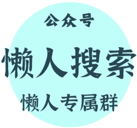

# 为什么要“假话全不说，真话不全说”？

260401

整理：公众号懒人搜索，懒人专属群精选
懒人微信：lazyhelper1

2026 年的第一季度，发生了很多大事。比如，黄金的涨跌、股市的波动，以及地缘局势的震荡等等。其中的很多事情，我们在往期的节目里都讲过。

而今天我们要说的，不是一个事情本身，而是一个人类协作机制中的“关键设定”。搞懂这个设定，不仅能帮助我们思考这些国际大事里的协作机制与博弈规律，在日常的人际环境中，我们或许也能获得更通透的眼光。

最近，著名的心理学家史蒂芬·平克，出了一本新书，叫《共同知识》。而我们要说的这个关键设定，就是平克所说的“共同知识”。在这里要特别强调一句，平克的书普遍有个特点，就是“后劲”特别大。看的时候你可能不觉得神奇，甚至觉得某些地方有点“绕弯子”。但是，读完一段时间之后，你也许会发现，他的观点“解释力”极强。很多复杂的现象，都能用平克的观点得出简洁的解释。

好，咱们正式开始。

什么叫共同知识？简单说，不是“我们都能看到”，而是“我知道你也知道”。

> 「“我们都知道”属于“共有知识”，而“我们都知道彼此知道”，才是“共同知识”。而且很多时候，“共有知识”并不会推动行动，只有“共同知识”才能。」

这么说可能有点绕，举个例子。比如，我们都听过那个故事，《皇帝的新装》。皇帝光着身子游街，所有人都看见了，结果非但没人说，一个个的还都在那儿煞有介事地夸奖。直到一个小孩喊了一嗓子：“他什么都没穿。”然后，局面瞬间逆转，所有人从夸奖转向了嘲笑。

这个故事我们从小就当寓言听，觉得它讲的是“要说真话”。但平克关注的是另外一个角度，就是，小孩喊出那句话的时候，他告诉了大家什么新信息吗？

很明显，没有。每个人早就看见皇帝没穿衣服了。小孩说的，不是任何人不知道的事。那为什么这句话能瞬间改变全局？

> 「因为这句话改变的不是“信息本身”，而是“信息的状态」。」

在小孩喊出来之前，每个人都知道皇帝没穿衣服，但每个人不确定“别人是不是也知道”，也不确定“别人知不知道我知道”。就这样，每个人都知道真相，但所有人都沉默。

这时小孩那一嗓子，当着所有人的面，把一个“私下都知道”的事情变成了“公开都知道”。从这一刻起，每个人不仅知道皇帝没穿衣服，而且知道所有人都知道，并且知道所有人都知道所有人都知道。这个“认知链”可以无限循环下去。

回到皇帝的新装。小孩那一嗓子之后，情况变了。每个人都知道“大家都知道”，所以每个人都敢笑了。因为你知道，你笑的时候，别人也会笑。

平克说，这就是共同知识的力量：它不改变你知道什么，它改变你敢做什么。

听到这，有人可能会说，这不就是玩文字游戏吗？有什么实际意义？

> 意义太大了。平克说，「共同知识是理解人类社会运转的一把钥匙。或者说，它是人类社会的“底层代码”，很多社会机制，本质上都是“共同知识”在发挥作用。」

比如，货币。平克说，货币的本质是一种共同知识。光是“所有人都知道它能用来交换”是不够的，关键是“所有人都知道所有人都知道”。因为你愿意接受这张纸，前提是你相信下一个人也会接受。而你之所以相信下一个人也会接受，前提是你相信他也相信再下一个人会接受。这种信任的无限传递，必须建立在共同知识的基础上。

一旦这个共同知识被打破，货币就会崩溃。这就是恶性通货膨胀的逻辑。比如，一战后的德国，因为战争赔款以及政府的大规模赤字，国家开始疯狂印钞。一部分人开始怀疑“这些马克可能很快就就不值钱了”。于是他们加速花掉手里的钱。这种怀疑会传染，越来越多的人开始抛售货币，物价飞涨。最后变成了，“所有人都知道所有人都不信这个货币了”，最终，货币体系瓦解。据说当时的德国，工人发工资用手推车推，推回家的路上沿街的商店就涨价了，所以得一边推一边买东西。在这个过程中，“马克会贬值”这个怀疑变成了共同知识，加速了货币体系的崩溃。

再比如，最近的金融市场。黄金为什么暴涨或者暴跌？不是因为黄金本身突然变得更有用或者没用了，而是因为“黄金是避险资产”这个共同知识在强化，或者在弱化。

再比如，股市为什么剧烈波动？很多时候不是因为公司基本面变了，而是因为“市场情绪”这个共同知识在变化。市场等的不是利好本身，而是“所有人确信别人也看到利好”的那一刻。

再比如，囤货。发生自然灾害时，很多人会抢购物资。平克说，这是一种基于共同知识的理性博弈。你预期别人会囤货，为了避免成为唯一没准备的人，于是你也去囤。一旦“大家都在囤”变成共同知识，囤货这个事儿就会快速蔓延。

反过来，如果政府能够让“供应充足”成为共同知识，抢购就会停止。关键不是物资本身够不够，而是“大家是否相信物资足够”。

说到这，有人可能会得出一个结论：既然共同知识这么重要，那我们应该让更多事情变成共同知识，越透明越好，对吧？

未必。「平克说：要求绝对诚实，本身就是最大的虚伪。为什么？因为人类的社会关系极其复杂，如果我们把每一个私下的怀疑、每一点自私的动机都摆到台面上，社会协作会瞬间瓦解。」

比如，美国第 39 任总统吉米·卡特，在接受《花花公子》采访时，说自己“心里有过淫念”。他自己觉得这是诚实的表现，但事实上，这并没有提升他的公众形象，反而让公众感到尴尬和疏离。因为他打破了公众人物与民众之间必要的“审美距离”。

这也是为什么说，尽管每个人都强调要“开诚布公”，但现实里，我们依然需要大量的“委婉表达”。平克说，间接语言不仅是为了礼貌，更是为了提供“可推诿性”。只要事情没有被挑明，双方就都保持了“清白”，关系就可以继续。

比如，你知道同事工作有问题，但你选择私下提醒而不是当众指出。为什么？因为当众指出会让“他工作有问题”变成所有人的共同知识。假如私下说，给他留了面子；假如公开说，他就很难下台了。

再比如，我们常常批评某些人说一套做一套，但平克指出，这种状态有它必要的社会功能，它维持了“我们还在一个规则框架内”的共同知识，让各方不至于做出跌破下限的行为。

再比如，在地缘冲突里，一旦撕破脸，把赤裸裸的利益算计变成共同知识，冲突就会急剧升级。因为这时候，谁都没有退路了。

换句话说，在平克看来，「透明不是无条件的美德。什么该公开、什么该保留，这是个很微妙的智慧。也就类似于季羡林先生所说的，“假话全不说，真话不全说”。」

好，说了这么多概念，最后回到我们自己。了解“共同知识”这个概念，对我们普通人有什么用呢？

我觉得，也许在于三个提醒。

## 「第一，在适当的时候，“主动建立共同知识」。」

如果想推动一件事，光私下和每个人说是不够的。我们需要创造一个公开的场合，让所有相关方同时知道，而且让他们知道彼此都知道。

比如，你在公司发现一个问题，私下跟同事抱怨，大家都点头，但什么都不会改变。但如果你在全员会议上正式提出来，情况就不一样了。公开的本质，就是把私人知识变成共同知识。这就是为什么舆论监督有力量，为什么媒体曝光能推动改进。

## 「第二，不是所有事都要公开。有些话私下说效果更好。」

在职场上或者家庭里，很多时候大家都知道某个问题的存在，但是没有人挑明。就是因为没有挑明，所以还能维持表面的和谐，这种心照不宣有时候也是必要的缓冲。

## 「第三，警惕“假共识”。」

有时候你觉得“大家都同意”，其实只是没人公开反对。真正的共识需要公开确认，不然很可能是，每个人都以为别人同意，所以不敢提出异议。也就是我们通常说的“沉默的螺旋”。

下次开会时，假如一个决定表面上没人反对，不妨多问一句：“有没有人“有不同意见？”给沉默的人一个开口的机会，你可能会发现，“共识”其实没那么牢固。

毕竟，咱们平时说“大家都知道”，这五个字其实有两种情况：一种是“每个人都知道，但不知道别人知不知道”；另一种是“每个人都知道，而且知道别人也知道”。

前者是共有知识，后者叫共同知识。这两者之间的转换，往往就是一句话的事。而这个转换一旦发生，事情的运转逻辑也许就会发生根本性的变化。

当然，这些概念可能会让人觉得有点“绕”，但就像我们经常说的，语言的精度代表了思维的精度。有时候，在用词上“较真”也许能帮我们用最细微的放大镜，去观察很多原本粗放的事情。

> 「尤其是在今天。很多人说 AI 让人懒得思考，什么问题都可以直接问机器。在这种情况下，主动做一次较真的“头脑探险”也许就更有必要。这或许也是为什么 AI 不能替代阅读的关键原因。」

# 分割线

绝大多数人只盯着眼前的工资，却不知道一次远在中东的冲突、一次降息的决议，就能在一夜之间洗牌普通人的财富。

看懂宏观，是为了在周期切换时，不被当作代价。

如果你认同这种“抬头看路”的长期主义，欢迎围观我的个人情报智库:【懒人专属群】。

圈子已稳定运行 7 年。我们每天利用 Python 爬虫与大模型算力，过滤全网最顶级的政经内参和搞钱风向标，做你最冷酷的“外部大脑”。

查阅圈子完整数字资产与上车门槛:

https://lazyso.com/insider/

认同价值的。扫码加我微信，备注:【进群】

微信:lazyhelper1