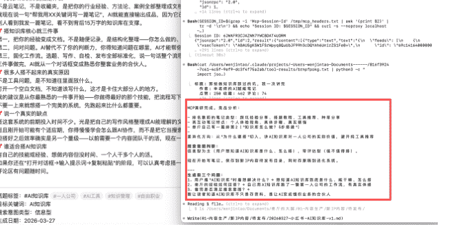
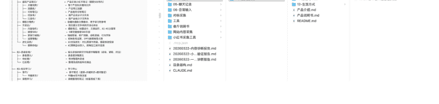
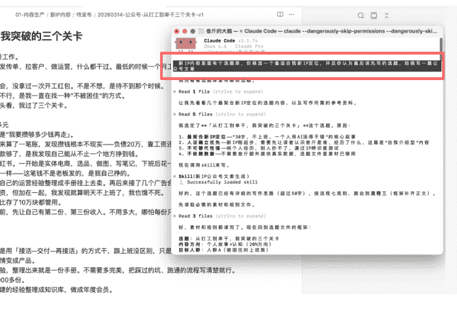
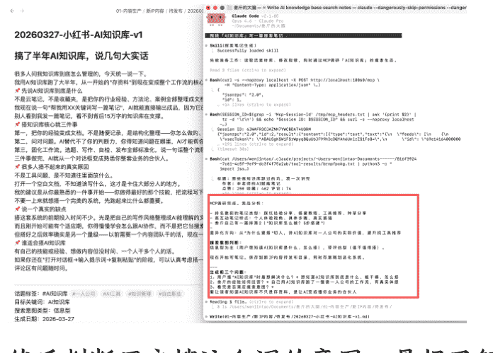
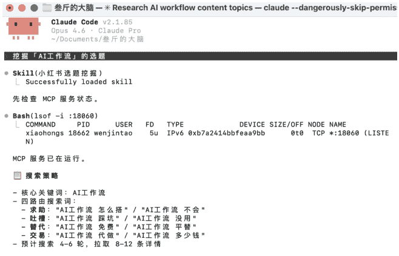
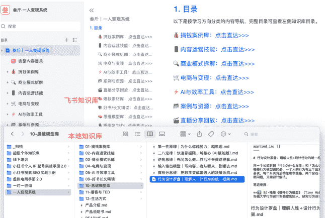

# Obsidian + Claude Code，它们正在替我赚钱 | 我的 AI 知识库拆解

## 260401 副业 SC 精华

公众号懒人搜索，懒人专属群独享

懒人微信：lazyhelper1


春节期间，我搭了一套 Obsidian+Claude Code 的 AI 知识库，把我的定位、写作风格、内容方法论、产品体系等信息全部放进去。

现在它能帮我写公众号、做小红书、整理录音、管理选题、管理日程……一个人干一支团队的活。

公众号从月更变成日更，写一篇几千字的内容，从大半天缩减到一个小时，内容质量都还不错，数据比手搓的还好一些。小红书一天至少可以产出 20 篇优质搜索笔记，有几条曝光量不高的笔记，都在默默出单。

这一套知识库，还帮我做出了 2 份虚拟产品在卖，一份卖 39，一份单价 599。上个月参加富贵老师线下课，把录音丢进去，一个下午整理出十几份富贵老师的核心方法论文件，AI 写内容的时候，可以直接调用。

朋友公司 10 个人的团队，月产值还没我一个人高。这可能是我做自由职业以来，找到的最大杠杆。下面是完整的知识库拆解，怎么搭的、怎么用的、为什么有效。

大部分人用 AI 的方式，是打开一个对话框，粘贴一段背景信息，拿到回复，关掉。下次可能需要重新解释你是谁、你做什么、你想要什么。

但问题并不出在 AI，而是你没给它任何东西可以记住。

我的 AI 每次启动，会自动加载 400 多行协作规则、13 个 Skills 技能包、我最近在想什么。不需要我解释任何东西，它已经知道一切。

现在，我只需要跟 AI 说一句「从选题库随机选一个写公众号」，它会自己找素材、套方法论、按我的风格写好，改改就能发。小红书也一样。


9. 工作。发传单、拉客户、做运营，什么都干过。最低的时候一个月 300 多块。建的经验整理成知识库，做成年度会员。

10. 没拿过一次开工红包。不是不想，是得不到那个时候。不行，是我一直在找一种“不被困住”的方式。一头看，我过了三个关卡。

多元是“我要攒够多少钱再走”。来算了一笔账，发现攒钱根本不现实——负债 20 万，靠工资还款够了，是我发现自己能从不止一个地方挣到钱。小红书。一开始是实体电商，选品、做图、写笔记，下班后花一样——这笔钱不是老板发的，是我自己挣的。自己的运营经验整理成手册挂上去卖。再后来接了几个广告演，但加在一起，我发现就算明天不上班了，我也懂不死。比存了 10 万块都管用。

前，先让自己有第二份、第三份收入。不用多大，哪怕每份

是用「接活—交付—再接活」的方式干，跟上班没区别，只是把活变成产品。

验，整理出来就是一份手册。不需要多完美，把踩过的坑、跑通的流程写清楚就行。

Obs + Claude Code，在我这，已经相当于是一个能做事情的员工了，而且效率很高。

# 1、为什么你需要自己的 AI 知识库

在搭这套知识库之前，我用过飞书知识库、IMA 知识库、NotebookLM，还试过好几个 AI 笔记工具，但都不好用。

飞书、IMA 这类知识库，把资料丢进去问问题，回答的还可以，但让它做任务就不行。它不能根据你的方法论帮你写小红书笔记，不能帮你整理录音，不能帮你处理文件。

NotebookLM 好一些，做任务和问答都行，但不够方便。没办法让它直接在你电脑上操作文件，没办法让它记住你的写作风格，也不能实时写内容进去，每次都要重新解释一遍。

## 后来在 X 上看到有人分享 Obsidian + Claude Code 的用法，试了一下，真就是理想中的知识库搭配！！

先简单解释下，Obsidian 是本地笔记软件，所有文件都存在自己电脑上，markdown 格式。

Claude Code 能直接读取和操作你电脑上的文件。两个东西接在一起，AI 就能看到你所有的笔记、方法论、素材库，还能直接帮你创建文件、整理文件夹、写内容。

举个最直观的例子。

同样是让 AI「帮我写一篇小红书搜索笔记」：

直接问 AI，它给你一篇通用的、正确但没有灵魂的内容。

用我的知识库：AI 先自己搜一遍关键词下的笔记，分别有什么特点，读我的搜索 SEO 方法论（9 章，从搜索排名的底层逻辑到关键词布局规则），再读对应产品的卖点和关键词库。



然后按我定义好的写作规范生成，标题怎么写、关键词怎么布局、开头怎么戳痛点、结尾怎么留钩子，全部有规则。写完还会自动跑一遍质量自检。

同样的 AI，同样的模型，输出质量完全不同。

# 2、知识库全貌

## 2.1 目录结构

整个目录结构，大概长这样：



我是按照我的习惯来的，就是「内容在哪里产生、在哪里沉淀、在哪里输出」等等，现在可能会复杂一些，把我个人日程规划和手机记录的内容也同步进去。

几个关键的设计说一下。

### 1. 内容有明确的流水线状态

- 选题库 → 待发布 → 已发布。文章在系统里有具体位置，我不需要记「这篇写到哪了」，看文件在哪个文件夹就知道。
- AI 写完自检通过，自动从选题库移到待发布。
- 我修改发布完，手动移到已发布（能做到全自动）。每篇文章在知识库里只存在于一个位置，就不会很乱。

### 2. 方法论按主题分类，不按来源分

很多人的笔记写作方法是按「这是 XX 课学的」「这是 XX 书的」来区分，找的时候很痛苦。


我是按主题分的，搜索 SEO 的方法论、内容创作的方法论、营销与销售的方法论。AI 写搜索笔记的时候直接去搜索 SEO 文件夹读方法论，不需要知道这个方法论最早是从哪门课学的。

### 3. 产品库和内容库分开

AI 写产品引流笔记的时候去产品库读卖点和关键词，写个人 IP 内容的时候去内容库读素材和定位文件。各取所需，不会串。


## 2.2 CLAUDE.md：写给 AI 的关键文件

整套系统里最重要的一个文件。

这个 Claude Code 会自动生成，放在根目录，每次启动都会自动读取。你可以理解成写给新员工的入职手册，比如你的业务是什么、怎么配合你工作、什么事绝对不能碰。

我的 CLAUDE.md 大概 400 行，核心几块：

- 1. 你在和谁协作。

不只是告诉 AI「我是谁」，而是 AI 需要知道的一切背景。包括我的业务是什么、核心产品是什么、目标人群分几类（按转化效率排优先级）、产品转化路径是什么。AI 读完这些，就知道它是在帮谁，做什么任务。

```md
### CLAUDE.md - 叁厅的 AI 协作指令

> 这是叁厅（温锦涛）的 Claude Code 项目根配置文件。每次启动自动加载。
> 更新时间：2026 年 3 月

---

### 你在和谁协作

**叁厅**, 自由职业者，AI 知识库一人公司。

一句话定位：不上班。用 AI 知识库开了一家一人公司。

slogan (线下介绍用)：用 AI 开了一家一人公司。

核心业务：帮普通人用 AI 知识库搭建个人收入系统，主战场是公众号 + 小红书 + 微信生态。产品转化路径：新 IP 内容 → 加微信 → 599 一人变现系统 → 线下课/企业培训。人群优先级 (3.0 版): C (已自由个体，转化最高) + A (上班族，流量基本盘) > B (纠结辞职) > D (企业负责人)。核心能力标签：AI 知识库搭建 (本地化 Obsidian+Claude Code 知识库) + 对外出售飞书/Notion 知识库。

他不是程序员，但会用 Claude Code 开发工具、创建文件、搭建产品。编程方面需要你全程引导，但他对產品需求、用户痛点、内容方向的判断非常精准—听他的。

---

### 协作基本原则

1. **叫他"叁厅"**,不要问"你想要什么风格"—他的风格在说明书里写得很清楚
2. **直接给方案**,他不会 debug，给他的东西必须是完整可用的
3. **代码要能跑**,他不会 debug，给他的东西必须是完整可用的
4. **中文优先**,注释、文件名、变量命名都用中文或拼音
5. **单文件优先**,他偏好 HTML/CSS/JS 写在一个文件里，除非项目确实需要拆分
6. **中文标点符号**,所有中文内容输出必须使用中文标点符号 (,。：？！；""'' () ——), 禁止使用英文标点符号 (,?!;:'''()—...)
```

#### 2. 协作原则

> 「直接给方案，不要反问我要什么风格」

> 「中文优先，包括注释和文件名」「所有中文内容用中文标点」

这些都是后面慢慢加的。AI 会默认用英文标点符号，一个个修改挺麻烦的，所以，直接写进 CLAUDE.md，让 AI 用中文标点符号。

#### 3. 行为约束

这是最关键的一块。我写了四条不能违反的铁律：

- 不能移动、重命名、删除任何已有文件（除非我明确确认）;
- 内容文件只归档不删除;
- 必须等我说「提交」才执行;
- 不能修改其他 Skill 的配置文件。

为什么这么严格？因为 AI 有时候会「好心办坏事」，它觉得帮你整理文件夹是好事，但它可能把你正在写的草稿移到了你找不到的地方。

```
### AI 行为约束
#### FATAL 级——铁律，无例外，违反等于不可接受的灾难
- **FATAL-001:禁止移动、重命名、删除任何已存在的文件或文件夹**,未经叁厅明确确认不能执行
- **FATAL-002:内容文件只归档不删除**,选题、草稿、笔记等一律移入归档目录，不得永久删除
- **FATAL-003:禁止自动 commit**,必须叁厅说"commit"或"提交"才能执行 git commit,禁止 force push
- **FATAL-004:禁止修改其他 skill 的 SKILL.md**,除非叁厅明确指定修改某个 skill
```

#### 4. 项目索引

每个文件夹干什么、文件怎么命名、内容发布流程怎么走。AI 读完就知道新建的文件该放哪里、叫什么名字。我之前没写这个的时候，AI 经常把文件存在奇怪的路径，我要到处找。

```markdown
### 项目索引
| 文件夹 | 用途 |
|---|---|
|`叁厅说明书/`|人物档案、新 IP 定位、产品体系、活素材库、写作通用规范|
|`01-内容生产/`|所有内容创作相关:`新 IP 内容/`为公众号 + 小红书 IP 内容 (选题库、待发布、已发布),`虚拟产品笔记/`为产品引流小红书笔记，另有`爆款文稿库/`、`方法论/`、`进化系统/`|
|`02-录音处理/`|录音转文字、连字稿整理 (咨询、课程、对话等较长录音)|
|`03-知识学习/`|学习中心：读书笔记、领域知识学习、课程学习 (详见 03-知识学习/README.md)|
|`04-产品库/`|产品原文、手册内容:`一人变现系统/`下为本地知识库 (12 个分类)+产品说明书 + 产品分析报告|
|`06-日常输入/`|日常碎片化输入处理中心：闪电日记、P.Laud 碎碎念、周复盘|
|`对标采集/`|对标笔记和下拉词采集数据|
|`小红书采集工具/`|小红书相关工具:`xiaohongshu-mcp/`为小红书 MCP 服务 (搜索、读帖子、读评论),`小红书采集助手/`为浏览器采集插件|
|`.claude/skills/`|各类技能模块 (搜索笔记生成、爆款笔记生成、对标笔记分析与仿写、小红书选题挖掘、新 IP 文案生成、短内容文案、录音处理、日常输入处理、周复盘汇总、产品分析与定位、战略诊断、自我进化、导出聊天记录)|
```

#### 5. 任务快速参考

写公众号用哪个 Skill、写搜索笔记用哪个 Skill、处理录音用哪个 Skill、做产品分析用哪个 Skill。AI 会知道做什么任务的时候该调用什么 Skill。

CLAUDE.md 不是一次写完的。第一版大概 30 行，就告诉 AI 我是谁、我做什么。后来用着用着，发现 AI 老犯某些错误，比如用英文标点、擅自删文件、把文件存错位置等等，所以就把规则一条条加上去。

两个月，才长到 400 行。

这个文件本质上是你和 AI 的协作协议。你踩过的每一个坑，都会变成里面的一条规则。用得越久，AI 犯的错越少。

## 2.3 叁厅说明书：把自己数字化

CLAUDE.md 告诉 AI 怎么工作。叁厅说明书告诉 AI 你具体是谁，是个什么样的人。这个文件夹里有几个核心文件：

### 1. 人物档案

我的完整背景，换过 20 份工作、最惨一个月 369 块、怎么接触小红书、怎么开始自由职业。AI 写内容需要穿插个人经历的时候，就来这里找。


### 2. 新 IP 定位

一句话定位、人设关键词、目标人群画像 (四类人群的具体特征和内容策略)、内容方向配比、写作调性要求。这个文件有 400 多行，是我反复调整过的。AI 写任何 IP 内容之前都会先读这个。

### 3. 活素材库

我最近在用的故事、案例、金句、新认知。分「当季素材」和「经典素材」。AI 写文章的时候优先从当季素材选，不会每篇都用同一个故事。

结合其他的流程，这里会快速补新的素材，比如跟朋友聊天冒出的想法、给学员做咨询时的发现、自己踩过的坑，在处理这些任务的时候，都会增加素材。

......

这些文件加在一起，AI 读完之后比大部分人更了解我。它知道我的定位、我的风格、我的产品体系、我的真实经历、我最近在想什么。

## 2.4 Skills

这是整套系统的执行层。

普通人用 AI，每次都要在对话框里写一大段提示词——解释背景、说明要求、定义格式。而且每次都要重新写。Skill 把这些全部提前写好存成文件，用的时候说一句话就触发。

我目前有 13 个 Skill：

光看表格没有感觉，拆一个具体的 Skill 给你看看里面是什么。

拿「搜索笔记生成」来说，这个 Skill 文件的流程大概是这样：

- 1. 触发条件：当我说「写 xx 关键词的搜索笔记」的时候触发。

- 2. 执行链路：

AI 会先通过 MCP 接口去小红书搜这个关键词，看排名靠前的笔记是什么类型、什么结构、什么切入角度，相当于先做一轮竞品调研。

然后判断用户搜这个词想干什么 (是了解概念、找方法、还是看案例)，再去读搜索 SEO 方法论 (9 章内容，写了搜索排名的四层漏斗原理)。

结合刚才调研到的排名规律，去读关键词库找到这个词属于哪个优先级，再去活素材库找跟选题相关的真实案例。

然后按内嵌的写作规范来写，标题要踩到核心词、关键词密度要多少、关键词在哪些位置必须出现、开头用什么结构、结尾怎么引导互动等等都有要求。

### 3. 质量自检：

写完之后，AI 会自己跑一遍检查清单，比如关键词密度够不够、标题有没有踩到核心词、开头三行有没有钩子、有没有违规表述等等。过了自检才会保存到待发布文件夹。没过的会重新修改一遍，直到没问题才会保存。

这就是 Skill 和「写个好的提示词」的区别。不管多厉害的 AI，光靠提示词都是不够用的，Skill 是工作流，里面内嵌了方法论、规范、自检机制。AI 每次执行都按同一套标准来，不会因为你今天写提示词偷了个懒就输出质量下降。

而且，这些流程、方法论，都是会成长的，不是固定的，会随着知识库的丰富，变得越来越完善。

我有几条曝光量只有几十到几百的搜索笔记，都在默默的持续出单。搜索笔记不需要爆，它需要的是被搜到的时候排在前面。

AI 每次都老老实实遵守搜索排名的规则，比我自己凭感觉写靠谱多了。

# 3、真实工作流

下面分享几个我每天在用的工作流，我觉得对内容创作者会有些帮助。

## 3.1 写公众号

公众号是我的主阵地之一，以前写一篇要大半天，很长一段时间，我的公众号都是周更，甚至做过月更，因为写一篇真挺不容易的，我又那么懒……

现在能做到日更，真的一大半功劳都要归给 AI，整个流程是这样：

我一般上午会去咖啡店办公，去到地方点杯咖啡，等咖啡的时候跟 AI 说「从选题库随机选一个写公众号」。

AI 先扫描选题库，看哪些选题还没写过。

然后会检查最近 10 篇文章的内容方向配比，AI 实战占了多少、个人故事占了多少……如果某个方向连续 3 篇缺席，会优先推荐那个方向的选题。



我之前有一段时间连着写了好几篇个人感观点类的内容，完全没发现自己跑偏了，后面数据严重下滑，给 AI 分析之后才反应过来。后来把配比追踪写进了 Skill，AI 帮我盯着，某一类型的内容不能超过一定比例。

选好选题之后，AI 读我的 IP 定位文件，知道我的定位是什么、该用什么调性。再读活素材库，匹配跟选题相关的个人经历和案例，确保内容里面的案例和素材不是编的，是我真实做过的事。

这一步非常重要，用 AI 写过内容都知道，AI 会瞎编故事和案例，如果做 IP，用的素材都是 AI 瞎编的，那就没什么意义了。

都确定好后，AI 会按我定义好的写作流程来写文章。写完不是直接给我，先自己跑一遍检查：

1. 去 AI 化检测：

有没有比喻句、名人引用、排比句、「在这个 XX 的时代」式开头等等，这些都是 AI 写作的典型痕迹，检测到就自动改掉。

2. 内容力审视：

三个维度 (均来自富贵老师的分享)，有没有「降维打击」的段落 (站在更高视角看问题)、作者自己的情绪有没有变化 (不是全程平铺直叙)、菜市场测试 (大爷大妈能不能听懂，听不懂说明写复杂了)。

3. IP 辨识度测试：

把我的署名换成别人，这篇文章还成立吗？如果换个名字也毫无违和感，说明没有个人特色，AI 会标出来。

4. 平台合规检查：

有没有具体收入数字、有没有「轻松赚钱」类话术。我之前因为用了「网赚」类表述被公众号删过两篇文章，吃过亏，所以把合规写成了硬规则。

整个流程跑完，咖啡也做好了，接下来就是修改细节、补充一些个人判断等等，一篇公众号从选题到发布，大概一个小时。以前是大半天。

## 3.2 写小红书搜索笔记

跟 AI 说「帮我用"AI 知识库”这个关键词写一篇搜索笔记」。

AI 第一步不是直接写，而是先通过 MCP 去小红书搜这个关键词，看现在排名靠前的笔记长什么样，比如，内容是什么类型、什么结构、什么切入角度。相当于先派 AI 去做了一轮竞品调研。



然后判断用户搜这个词的意图，是想了解概念，还是想找方法，想看案例？不同意图对应不同的内容结构。

接着读搜索 SEO 方法论。这套方法论有 9 章，都是我从实操数据和各种课程里提炼出来的。写了搜索排名的底层逻辑、关键词怎么布局、标题怎么写、正文怎么结构化。

## 3.3 语音日记 → 知识沉淀

    然后去读活素材库，找跟选题相关的真实案例。有真实案例的笔记和没有的，读起来完全不是一个感觉。

    写完跑质量自检。关键词密度够不够、标题有没有踩到核心词、开头有没有钩子、有没有话题标签、结尾有没有引导互动。过了才保存。

    大部分流程其实跟公众号的类似，只是写作的方法和风格不同，写作前也多了一步验证环节。

## 3.4 录音 → 知识提炼

    作为内容创作者，我每天都会记录一些东西，以前都会记在飞书、flomo、备忘录……现在全部在 Obsidian。

    比如，散步的时候突然想到一个选题方向，掏出手机直接记录到 Obsidian（推荐豆包输入法，打字都省了）。跟朋友吃饭聊到一个观点，觉得能写篇文章，全部录下来。

    以前这些东西就躺在手机里了，固定时间复盘的时候才用得上，我是 INTP，对于记录、复盘这类任务的热情只有 3 天……

    现在不一样。MacBook 上装了闪电说，随身带着录音工具，任何时候都能记录，录完自动转文字，没有一步是多余的。

    录音文件同步到 Obsidian 里，然后跟 AI 说「处理日常输入」。

    AI 自动扫描文件，找到没处理过的段落（处理过的会打上标记，下次不重复），然后从一堆散乱的口语里面把有价值的东西挑出来：

    - 把有用的信息更新到素材库，下次 AI 写文章需要这类观点的时候，直接调用。
    - 或者把值得展开的想法，放到选题库。
    - 有待办事项，单独列出来放到苹果提醒事项里。

    我不需要分类、整理。动嘴说就行，AI 把碎片变成系统里能用的东西。

    这套流程把「想到」和「记住」之间的摩擦降到最低。（P 人狂喜）

    这个跟日常碎碎念不同，是处理较长的录音，比如课程、咨询、交流会。

    上个月去杭州参加了富贵老师两天一夜线下课，100 人，讲情绪营销。富贵老师讲的方法论、现场案例、我在互动环节说的话、跟旁边学员的交流......全部都录下来，信息量很大。

    如果靠自己记笔记整理，要花不少时间，而且一定会漏掉很多细节。

    这次回来后，我把录音转成逐字稿，存成 md 文件。跟 AI 说「处理录音」。

    AI 先通读全文，判断这是什么类型的录音，我区分了「外部课程、咨询对话、朋友交流等等」。不同类型有不同的提取重点。

    这次是「外部课程学习」，AI 一段段读，从里面提取：

    1.  方法论——情绪营销的底层逻辑、八步成交 SOP、卖点到买点的翻译方法。
    2.  可直接用的策略——标题要用人群词 + 痛点词 + 效果词 + 时效词的公式。
    3.  案例故事——老师讲的案例、学员分享的案例，以后写文章能用。
    4.  金句——课上那些一句话就能戳到人的表达。
    5.  我自己说的话——互动环节我说了什么，AI 会单独标出来（我的录音工具能识别“叁斤”的声音）。
    6.  可延伸的选题——从课程内容里挖出来的、我可以写成文章的方向。

    

    整个流程跑完，整理的不是一份阅读笔记，而是会把关联度高的方法论直接更新到方法论文件夹，以后 AI 写内容会自动调用。同时更新的还有素材库、选题库等等。

    以前听完课觉得收获很大，虽然自己学会了，但不可避免的会忘掉大部分。

    现在，不仅自己学会了，你的 AI 也学会了，而且你的 AI 学会的，还能直接用。

## 3.5 做虚拟产品

    Obsidian + Claude code 的知识库，不仅能帮你写内容，还能帮你从零做出一个可以卖的虚拟产品。

    整个流程大概是这样的。

    ### 第一步，大量收集信息。

    比如，我要做一个产品，会先把这个领域的优质内容全部收集到 Obsidian 里。包括文章、教程、课程笔记，能找到的都存进来。

    我装了一个网页采集工具，把 YouTube 链接发给 Claude code，它自动把视频内容提取转成 markdown 文本。不需要自己看完整个视频再手动做笔记，AI 帮你把内容变成可处理的文本。

    国内的网页内容也一样，发链接就可以。

    ### 第二步，AI 处理和整理框架。

    原始素材可能有几十份，散乱、质量参差不齐。

    AI 会先通读所有内容，帮你提炼核心知识点、梳理逻辑框架、找出重复和矛盾的地方。不需要自己整理，AI 帮你做第一轮整理，输出一个完整的产品框架。

    ### 第三步，结合个人素材写成产品。

    这一步是关键。如果只是整理别人的内容，那只是搬运二创，没有个人特点。

    所以，需要 AI 去读你的素材库、你的方法论文件、个人经历等等，把你的案例、判断和实战经验加进去。

    最终出来的是「你的知识 + 你的经验 + 行业优质内容」融合出来的原创产品。

    这个方法，做成什么形态都行，PDF、PPT、知识库都可以。

    ## 为什么这个方式做出来的东西质量高？因为信息量大。

    靠手动整理，能看的资料有限，写出来容易有盲区。AI 帮我处理几十份素材，覆盖面广得多。

    人只负责两件事：判断哪些信息有价值、补自己的实战经验。这两件事 AI 做不了，也是产品有竞争力的原因。

## 3.6 个人成长流程

    这个跟做虚拟产品是同一套能力，方向不同。做产品是「输出给别人」，读书是「输入给自己」，但输入完了也能变成产品。

    比如，我最近在读《行为》（讲人类行为的生物学基础），很长，几十万字，我很难专注的读下去，所以我把阅读的任务交给了 AI。

    整个流程是这样：把电子书的内容存进 Obsidian，跟 AI 说「帮我做速读指南」。AI 通读全书，提炼每章核心概念、关键实验等等，生成一份速读指南。

    我先看速读指南建立全书框架，然后挑感兴趣的章节精读。精读的时候 AI 会帮我做笔记，还有，它会做两件更有价值的事：

    ### 1. 写精读笔记

    把书里的概念、实验、结论整理成结构化的知识文件。每个概念标注来源（哪一章哪个实验），以后引用有据可查。读完还会出测验题帮你检验有没有真正理解。

    ### 2. 提炼思维模型

    从书的内容中提取可以应用到实际业务场景的模型。比如从《行为》里我提炼出了一份「行为学与人性底层认知」方法论，包含用户决策的生物学基础、环境怎么塑造行为、情绪怎么影响判断......

    

    这份方法论直接存到方法论文件夹，AI 以后写营销内容、做产品分析的时候自动调用。

    所以，AI 读书，不是读完了就完了。这些精读笔记和方法论，整理一下就能同步到飞书的「一人变现系统」知识库里。用户买的产品就多了一个板块。

    我读书学到的东西，既内化成了自己的认知，也让 AI 多了一套可以调用的方法论，还让产品多了可以交付的内容。

    知识库让「学习」和「生产」变成了同一件事。

# 4、进化系统，AI 越用越像你

    这个需要单独讲，因为它是整套系统里最有差异化的设计。

    AI 写的东西和我自己写的，总有差距。不管怎么调整话术，用了知识库，也一样，因为 AI 没有个人风格。

    我的做法是，让 AI 生成 2 个文案，一个给我修改，一个原档，然后让 AI 学我的修改方式。

    整个流程是这样：

    1.  AI 帮我写一篇文章，一份原稿，自动存档到文件夹，另一份是放到待发布的内容。
    2.  我在待发布的文案上改成满意的版本，发布，然后拖到已发布文件夹。
    3.  积累几篇后，我可以让 AI「执行进化学习」。
    4.  AI 自动把原稿和我的终稿配对，逐段对比，我删了什么、改了什么、加了什么。
    5.  提取跨篇的共性规律。
    6.  把规律写进修改规律文件。
    7.  下次写文章，AI 在写的时候自动遵守这些规律。

    现在有了可以进化的 skill 之后，已经能明显感觉到 AI 写出来的东西越来越符合要求了。

    进化系统的本质是：把「人改 AI」这个动作做了记录，然后反哺。而且不仅是文案本身能进化，学习的方法论，也能同步到 skill 里面，人在学习的同时，AI 也在学习。

# 5、MCP：让 AI 链接到你的工具

    前面讲的都是 AI 在知识库内部干活，但实际工作中，信息不只在知识库里，还在小红书上、日历里、各种外部工具中。

    MCP 是让 AI 连接外部工具的协议。装一个 MCP，AI 就多了一个能力。我目前只装了两个。

    ### 5.1 小红书 MCP

    这个 MCP 可以让 AI 能直接搜索小红书、读帖子正文、读评论区。

    单独用它就是一个搜索工具，跟我的 Skill 配合起来，就有很多可以想象的空间。

    之前看别人分享过一个挖掘产品需求的 skill，我修改了一下，做成了「小红书选题挖掘」Skill。

    现在我说「帮我看看 AI 知识库方向有没有需求」，AI 做的不是简单搜索，而是执行一套完整的调研流程：

    ### 1. 四路搜索取证。AI 自动搜四组关键词：

    - 求助类：「AI 知识库怎么搭」「Obsidian 怎么用」，目标是找正在找解决方案的人
    - 吐槽类：「AI 写的内容太假了」「知识库搭不起来」，找对现有方案不满的人
    - 替代类：「有没有比 XX 更好的」，找在对比选择的人
    - 交易类：「求 AI 知识库推荐」「多少钱」，找已经准备付费的人

    四组关键词覆盖用户从「发现问题」到「准备买单」的完整链路。

    ### 2. 深入读帖子和评论。

    搜到帖子之后，AI 不只看标题，会点进去读正文和评论区。评论区经常比正文更有价值。

    正文可能是营销内容，但评论区的吐槽和提问是真实需求。

    比如一篇讲 AI 知识库的帖子，评论区有人说「看了好多教程还是搭不起来，有没有现成的」，这就是一个真实的产品需求信号。

    ### 3. 帖型分类和信号提取。

    AI 会对每篇帖子做分类，并且从里面提取痛点关键词、需求信号、情绪倾向。

    ### 4. 生成选题并自动分流。

    提取完的选题，AI 会判断这个选题适合写 IP 内容（公众号/小红书）还是写产品引流笔记，自动分类到对应的选题库。

    

    整个过程我说一句话，AI 跑完，我拿到的是一批经过分析的、带信号标注的、已经分好类的选题。

    这就是我用 MCP + Skill 的方式，MCP 提供能力（搜索小红书），Skill 定义怎么用这个能力（四路搜索→深入读帖→分类提取→选题分流）。

    ### 5.2 日历和提醒事项 MCP

    自由职业很重要的一件事是记录自己的工作时间和工作任务。

    没有打卡机，没有老板给你安排任务，一天下来经常觉得「忙了一天但不知道忙了什么」。如果不主动记录，你根本不知道时间花在哪了。

    这些年来我一直在找任务管理和日历工具，试过很多 APP。有的功能太重太复杂，有的同步有问题，有的用着用着就收费了，而且还很多广告。

    目前最好用、最干净的，是苹果自带的日历和提醒事项。一个生态内全部打通，手机、电脑全部都能同步，不需要额外装什么东西。

    而且 iOS 的提醒事项，是可以同步在日历里展示的，也就是打开日历，就能看到所有任务，做完任务也可以在日历上写复盘，非常方便。

    而现在，装了日历的 MCP 之后，AI 能直接读取和操作日历、提醒事项。

    ### 1. 记录工作时间。

    我每个任务结束后都会写一下复盘，就是几点到几点，做了什么事。现在，我会让 AI 帮我把任务细节和复盘全部记到日历里。

    比如，「今天上午写了公众号文章、下午处理了两段录音、晚上做了一个咨询」，AI 直接写到日历对应的时间段。到周末我说「帮我看看这周工作了多少小时」，AI 读日历帮我统计。

    这个真的 P 人狂喜，目前没有找到更好的流程能做这个事情。

    ### 2. 管理任务和提醒。

    因为 AI 能直接修改提醒事项，所以我可以让 Claude code 给我安排任务，每天应该做什么事情，都让 AI 安排。

    全程在 Claude code 里一句话搞定。需要记录的时候，也是 cc 记录，写复盘。也能让 cc 分析我这一周的工作情况大概是怎样，有没有问题。

    ### 3. 结合知识库做复盘。

    AI 能同时看到我的日历（做了什么）和知识库（产出了什么），做周复盘的时候它能帮我分析：这周哪些时间花在了内容生产上、哪些花在了系统搭建上、产出效率怎么样。

    

    就相当于是一个时时都盯着我的工作助理，对自由职业的小伙伴来说应该很有帮助。

# 6、复利效应

    这套系统最核心的特征不是「能干什么」，是「越用越强」。

    两个多月，下来，每一个环节、每一个功能都越用越完善，关键是每个功能之间还能互相加强。

    比如，知识库越来越丰富，AI 写内容时能调用的素材和方法论就越多，输出质量越高。

    输出质量越高，我改的越少，改的地方越精准，进化系统提取的规律越有价值。

    规律越准，下一篇的初稿质量又更高。

    这是一个正向飞轮，就不需要每天花额外的时间维护知识库，而是融入你的日常工作，比如，录语音、写文章、改稿子、听课，这些动作本身就在给知识库投喂内容。

    知识库越强，你的工作效率越高，省出来的时间又能喂更多东西进去。

    ### 怎么让飞轮转起来？

    1.  每天录一段。语音日记、碎碎念，让 AI 处理。这是最低成本的输入。
    2.  改完文章收集起来。让 AI 对比原稿和终稿，提取修改规律。大部分人改完就发了，浪费了最有价值的学习材料。
    3.  遇到问题就加规则。CLAUDE.md 和 Skill 都是用出来的，不是设计出来的。

# 7、知识库本身就是产品

    我的本地知识库是「叁斤的大脑」，方法论、Skill、素材库是给自己用的。

    但可以把其中一部分拆出来，整理成飞书或 Notion 知识库，卖给别人。本地知识库用的是 Obsidian + Claude code，需要一定门槛。

    飞书知识库不需要任何技术，打开浏览器就能看，适合卖给用户。

    我的「一人变现系统知识库」就是这么来的，从本地知识库里拆出可复用的方法论和框架，打包成飞书知识库产品，这也是我目前重点在做的虚拟产品。

    

    只需要搭建一次，两头用。一边给自己提效，一边拿出去卖。

    而且这个产品是持续更新的。

    前面讲了，我读一本书，AI 帮我做精读笔记和思维模型，整理完直接同步到飞书，产品就多了一个板块，多一分内容。

    我去参加线下课，录音处理完，部分方法论我又可以同步到飞书。也就是说，用户买的不是一个做完就不动的 PDF，是一个持续在长的知识库。

    这就是我做虚拟产品的逻辑，整个过程在 Obsidian + Claude code 里完成。以前做一份手册要一两周，现在核心时间花在「判断哪些信息有价值」和「补自己的案例」，AI 负责剩下的环节。

# 8、从零搭建

    看到这里可能觉得复杂。其实起点很简单，我的第一版也很粗糙。

    ### 8.1 装 Obsidian

    官网下载安装，免费的，全平台都有。建一个知识库，可以先建几个初始文件夹：

    - 你的知识库/
        - 输入箱/ ←新内容先丢这里
        - 知识库/ ←方法论、学习笔记
        - 内容生产/ ←选题、草稿、已发布
        - 产品库/ ←产品资料
        - 素材库/ ←故事、案例、金句
        - .claude/skills/ ←AI 技能包

    不需要更复杂了。用起来之后自然会根据需求加。我现在的目录结构也是两个月里慢慢长成这样的。

    为什么用 Markdown 格式？这个格式 AI 能直接读、直接写。不像 Word 或飞书文档还要转换。Markdown 就是纯文本加几个符号，AI 处理起来没有障碍。

    ### 8.2 装 Claude code

    这就是个终端工具，网上教程很多，搜一下就有，这里不赘述。

    装完怎么连接知识库？用 cd 命令进入你的 Obsidian 知识库文件夹，然后输入 claude 启动。就这一步，AI 就能读到你所有文件了。最简单的方式是，把整个文件夹拖到终端，再打开 Claude code，或者打开后把文件夹拖进去，就能在里面工作了。

    也能直接设置指定目录打开，这个可以让 AI 帮你做好。第一次用可以试试：「帮我看看这个文件夹里有什么」「读取 XX 文件帮我总结一下」「帮我在输入箱创建一个新笔记」。你会发现 AI 真的在你电脑上操作文件，不是在对话框里模拟。

    ### 8.3 写 CLAUDE.md

    在知识库根目录建一个 CLAUDE.md 文件。第一版写着几个部分就够了：1、你是谁、你做什么（大约 3-5 句话）。2、你希望 AI 怎么协作（比如，直接给方案、用中文......）。3、文件夹各是干什么的。4、什么事不能做（不能删文件、不能自动提交代码）。

    写完重启 Claude code，AI 就已经认识你了。

    然后最重要的事：用的过程中发现 AI 犯了什么错，立刻往 CLAUDE.md 里加一条规则。

    这个文件是用出来的。一边用，一边完善，整个文件会越来越丰富。

    ### 8.4 开始用

    CLAUDE.md 写好之后，不要想着一步到位把系统搭完美。直接开始用。

    跟 AI 说你想干什么就行。

    比如「帮我把这段录音整理成笔记」「帮我写一篇小红书笔记，主题是 XX」。说人话，不需要学什么提示词技巧。

    AI 做得不好，直接告诉它哪里不好，你纠正它的过程，就是在教它怎么配合你。

    如果有反复要纠正的问题，就直接写进 CLAUDE.md，下次就不用再说了。

    用了一段时间，你会发现有些任务反复在做，比如每次都要解释同样的背景、同样的要求、同样的格式。

    这时候再考虑把它固化成 Skill（一个写清楚触发条件、执行步骤、输出规范的文件），让 AI 一句话就能执行整套流程。

    语音输入是门槛最低的喂料方式，我用的是闪电说和 AI 录音笔，每天录一段复盘或灵感，文字放到 Obsidian，让 AI 处理。

    我不需要自己分类、整理，AI 会把碎片变成系统里能用的东西。

    这套系统的本质，不是让知识库好看、有条理。是解决一个问题：一个人怎么干出一支团队的活。

    方法论是 AI 的教科书，Skill 是工作手册，CLAUDE.md 是协作协议。每一层都在让 AI 更懂你。

    搭在一起，AI 就不再是一个每次都要从头解释的对话框了。它是一个越来越懂你的工作系统。

    --- 分割线 ---

    看完这篇 SOP，你觉得你懂了。但 90% 的人一到实操就会卡在第一步。

    工具和教程只是最低级的壁垒，真正的壁垒是“立刻动手”和“圈层信息差”。

    工具和教程只是最低级的壁垒，真正的壁垒是“立刻动手”和“圈层信息差”。

    如果你想看全网最新的变现玩法，并且和一群执行力极强的极客一起下场拿结果，欢迎围观我的核心私域：【懒人专属群】。

    我们不聊虚的，只做商业闭环的拆解与 AI 效率的压榨。系统内已沉淀 1000+ 跑通的套利实战局。

    查阅圈子完整数字资产与上车门槛：

    https://lazyso.com/insider/

    认同价值、准备好下场干活的，扫码加我微信（lazyhelper1）

    

    备注：【实操上车】，不闲聊