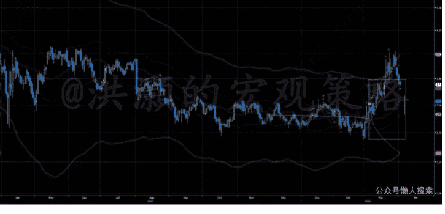
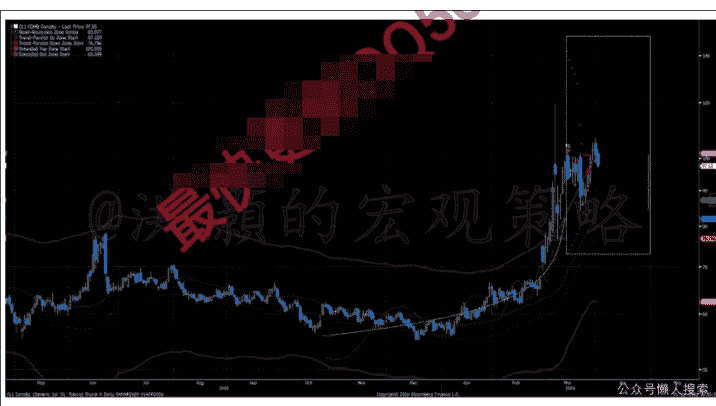
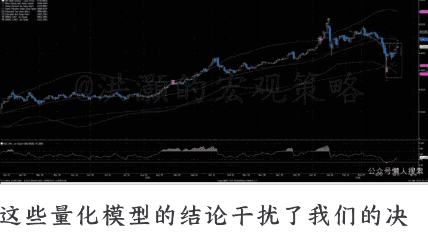

# 特朗普讲完，市场无语了

2026 年 4 月 3 日 洪灏付费

整理：公众号懒人搜索，懒人专属群精选

懒人微信：lazyhelper1

## 前言

模型结论与基本面逻辑冲突。

刚刚，特朗普发表电视黄金时段讲话，全球市场翘首以待。演讲中，特朗普宣称战争“已经非常接近完成，我们将会很快完成任务”。然而，在结束演讲之前，特朗普又宣布将对伊朗进行“极其猛烈的打击”。如果谈不拢，将打击伊朗的电力设施。换言之，特朗普宣布伊朗战争将升级。全世界都沉默了，原油飙升 5%，美股股指期货下跌，亚太市场由涨转跌。

两天前，特朗普宣布，美国军事力量将在两至三周内开始撤出中东。此声明一出，全球金融市场立生反响。2 月下旬战争爆发而显著飙升的原油价格，应声跌破每桶 100 美元。美国市场也录得一年多来最佳单日表现，投资者预期能源成本将降低、地缘政治风险将减少，标普随之上涨。然而，对局势进行实事求是的分析后可知，尽管美军持久战的风险可能下降，但导致地缘政治不稳定的根本原因以及对全球贸易的干扰并未得到根本解决。市场是对撤军的前景做出反应，但它尚未充分计入霍尔木兹海峡很可能将持续收费的现实，也未充分反应伊朗政府提出的具体要求。

当前油价下跌，反映的是一种基于冲突迎来转折点这一希望的"relief trade"（纾困交易）。2026 年 3 月的大部分时间里，由于霍尔木兹海峡对大多数国际航运关闭，油轮交通已经下跌了 90%，导致油价一直保持高位波动。重新开放这些航道对全球能源供应至关重要，毕竟，全球约 20% 的石油要经过这个咽喉要道。虽然特朗普表示美国不再需要保卫该海峡，并表示称其他国家应自行管理其海上安全，但美国撤军将导致中东地区权力结构真空。在美国海军力量缺席的情况下，伊朗伊斯兰革命卫队已着手将其对航道的控制正式化。这一转变并非回归此前自由航行的旧状，而是一个受管控的海上航运体制的开端，在此体制下，通行与否取决于政治立场及缴纳特定费用。

伊朗总统已公开表示，若满足两个条件，战争便可结束：一是赔偿冲突期间造成的损失，二是正式保证伊朗不再遭受攻击。从现实角度看，这些要求虽然表达了伊朗现在的姿态，但是也距离美国的要求甚远，为达成持久和平条约构成了重大障碍。向伊朗直接支付款项在美国政治上肯定是不可能的，且很可能会被视为向伊朗妥协，而非外交解决。此外，一旦美军撤出该地区，未来不再遭受攻击的保证便难以执行。若无实质性的军事存在作为威慑或缓冲，伊朗与以色列之间直接冲突的风险依然高企。伊朗正利用这些要求来确立谈判筹码，但德黑兰的诉求与华盛顿的底线之间，差距依然巨大。

伊朗伊斯兰革命卫队的立场远比总统更为强硬。通过其官方媒体渠道，革命卫队表示，无论美国何时撤军，都将由他们来决定战争何时结束。革命卫队近期扩大了目标清单，将美国科技公司纳入其中，并特别点名了谷歌、苹果和特斯拉等企业。革命卫队声称，这些公司提供的人工智能和追踪技术被用于协助暗杀伊朗领导人。他们威胁称，如果针对伊朗领导层的现行打击行动继续下去，他们将摧毁这些公司的实体基础设施和设施。这表明，冲突正步入一个非对称阶段，在此阶段，即便传统军事交火减少，企业资产和数字基础设施等也将会面临风险。而当前的反弹行情很可能低估了这一因素。

霍尔木兹海峡的物流运作已发生根本性改变。冲突前，该海峡日均船舶通行量约为 60 艘。根据卫星追踪和国际货币基金组织港口观察系统的最新数据，这一数字已降至平均每日大约 3 艘。目前成功通过海峡的船舶，大多使用位于伊朗领海内的一条指定“安全走廊”。要使用这条走廊，船运公司必须向革命卫队提供详细的货物清单、船员名单和识别代码。革命卫队不同意的话，谁也走不了。此外，伊朗议会近期通过了《霍尔木兹海峡管理计划》，对商业船只征收正式的通行费。市场参与者将这些费用描述为通行的“过路费”。

这些过路费的成本对每桶石油价格有直接影响。以超大型油轮为例，其通常运载 200 万桶石油，200 万美元的通行费恰好使每桶成本增加 1 美元。较小的油轮运载 100 万桶，将面临每桶 2 美元的额外成本。尽管这些金额相对于石油总价而言较小，但它们代表着物流成本的长期增加。当与其他费用结合时，“霍尔木兹税”的总和便相当可观。例如，战争风险保险费已升至船舶船体价值约 5%。对于一艘价值 1 亿美元的船舶而言，单次通过海峡的保险费用便高达 500 万美元。仅此项保险成本，对于超大型油轮而言，就相当于每桶又增加 2.5 美元。

目前有超过 800 艘船舶锚泊在霍尔木兹海峡之外，等待安全保证或更低的保险费率。这些船舶闲置产生的成本，即滞期费，大约为每船每日 10 万美元。将伊朗的通行费、增加的保险费以及滞期费合计，从波斯湾运出的石油，其结构性成本增幅在每桶 5 美元左右。因此，石油的战争溢价，即便是特朗普撤军，霍尔木兹海峡通航，也将达到 5-10 美元。

全球市场和油价大幅波动，令风险难以定价，但固定收益市场提供了一个不同的视角。我们的量化模型也与基本面逻辑发生冲突。

对美债收益率曲线的分析显示，投资者开始优先选择曲线的短端以求安全。两年期国债，可以发现其“盈亏平衡”收益率较高。持有 12 个月的 breakeven 成本很低，当前 3.8% 左右的收益率需要翻倍，两年美债的收益才会转亏。这个盈亏的门槛如此之低，也间接地解释了为什么这两天美债收益率大幅下行的原因。

相比之下，长久期的美债的安全边际要低得多。由于久期长、对于利率的变化非常敏感，收益率仅需上升三四十个基点，就可以让持有一年的回报转负。这解释了为何债券市场反弹集中在较短期限的资产上。投资者在寻求避风港的同时，也在防范长期通胀或地缘政治风险可能导致利率飙升的可能性。我们的量化模型也显示了短期短端收益率下行的可能性。

在此市场反应中，美联储亦是一个因素。近期美国汽油价格飙升已超过每加仑 4 美元，央行控制通胀的压力巨大。如果革命卫队继续干扰航道，或者“霍尔木兹税”成为全球供应链中的永久性固定成本，通胀压力就很难很快地消失。它只会从“冲击”转变为“结构性”成本。市场目前开始押注“冲击”已经结束，但尚未计入海上贸易的结构性变化。当然，高油价本身也将压抑需求。同时，在上一篇专属报告和星球问答中，我们讨论了每一次能源危机都导致全球经济衰退的历史情况。届时，衰退将进一步压抑需求乃至油价。

霍尔木兹海峡的局势也在全球贸易中催生出一个分层体系。我们看到一种“中国例外”现象：与伊朗保持良好外交关系的国家的船舶，获准通行时受到的限制更少，缴纳的费用也更低，甚至免费。本周，两艘中国大型集装箱船成功通过了海峡，但是阿联酋正在牵头组织夺取海峡控制权的军事行动。这表明，在美国撤出的同时，其他全球大国正在介入，以协商自身的通行安排。这使得全球航运市场变得碎片化。我们看到的不再是一个单一的、开放的海洋公共区域，而是个别国家与控制这一咽喉要道的伊朗之间形成的协议或冲突。

美国政府试图通过国际发展金融公司设立一个 200 亿美元的再保险机制，来解决保险瓶颈问题。其目标是为不愿承保海湾地区船舶的私人保险公司提供后盾。然而，这一机制尚未带来航运量的显著增加。主要原因是，保险公司担忧的不仅是船舶和货物的价值，还有与船员相关的责任。如果船舶被革命卫队扣押，其法律和人力成本都难以估量。私人保险公司正观望美军撤出是否会导致扣船事件减少，当前 5% 的保险费率很难很快下调。

在昨日的模型更新中，我们还获得了一些与基本面逻辑有所冲突的数据和结论。比如，原油的模型显示原油 120 已经是高位，同时短期大幅波动的窗口打开。

这个模型和我们在一月三十日在白银 120 的时候预警白银见顶的计算方法一致。

而黄金在 200 天线附近 4100 左右获得短期的技术支持。但是白银看上去远比黄金要弱。

这些量化模型的结论干扰了我们的决策，显示了当前市场情况异常复杂。因此，我们还是选择按兵不动，但是把模型的结果与读者分享。

总而言之，美国宣布撤军已在市场引发积极的市场反应，但技术数据显示，风险正在转移，而非消失。特朗普急于结束战争，但是这场战争并非是他一个人可以结束的。即便是停止对伊朗的狂轰滥炸，伊斯兰革命卫队还是将继续对于对手进行打击。因为战事延续了一个月之后，革命卫队发现了各种对于对手的不对称打击。既然美国已经把伊朗的战略目标基本炸到了炸无可炸的地步，伊朗就没有什么可以失去了的了。如果下一步，美军对于伊朗的民用设施进行袭击，在国际人道主义上将受到谴责，也给了革命卫队升级不对称打击的更好的借口。

我们的量化模型更新与基本面逻辑相悖。短期美债显示了非常好的、风险和回报的不对称关系，也是目前市场首选的风险对冲工具。短债的收益率下降也让黄金技术上短期受益，在 200 天线附近获得支持。尽管我们的量化模型结论和基本面不符，但是我还是决定与读者分享。如果美国不能重启霍尔木兹海峡，那么其实美国已经输掉了这场战争。一个不能维护中东乃至全世界和平的昔日霸主逐渐式微、日薄西山。长期看，这次失败对于美国国际地位的影响，对于美元体系的信用等，都将越来越清晰。

-------分割线-------

在这个 AI 能替你写代码、写文章的时代，基础技能正在迅速贬值。绝大多数人正被淹没在海量的免费垃圾信息里，陷入低效的体力内卷。

当“努力”不再是壁垒，人与人之间唯一的护城河，只剩下“信息过滤”的效率与“认知系统”的维度。

如果你认同这种“重塑认知防线”的极客主义，欢迎围观我的个人情报智库：【懒人专属群】

https://lazyso.com/insider/

认同信息过滤价值、想省下每天 3 小时无效阅读时间的读者，扫码加我微信 (lazyhelper1)

备注：【实操上车】，不闲聊