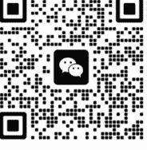
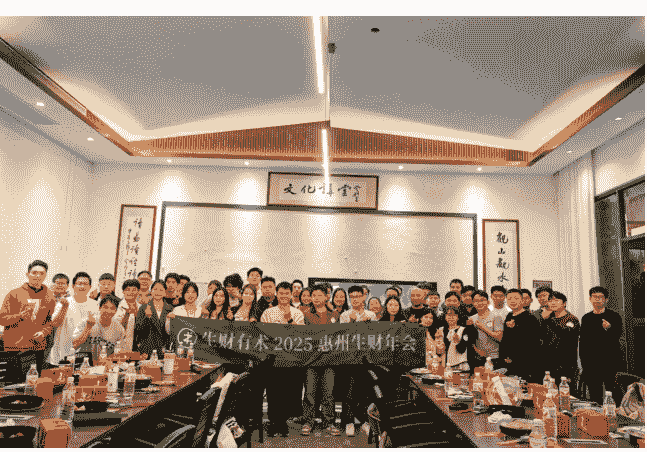
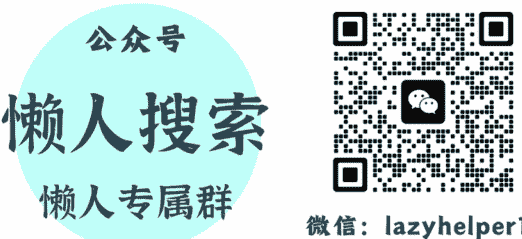

# 搞钱先搞人：一份写给搞钱人的“人情世故”指南

260407 副业 SC 精华

公众号懒人搜索，懒人专属群独享

懒人微信：lazyhelper1

微信：lazyhelper1

## 前言

哈喽，各位圈友好~ 我是 Alice，今天不聊技术，也不聊搞钱。聊一下代码之外软技能——人情世故~

起因是我在年前约 @陈铭 ivy 陈铭姐线下聊了一下午，聊天期间她对我的一些经历和举措感到诧异。例如：

( 你是我见过分钱最大方的人)

( 邀约第一次遇到愿意站在门口等我的)

( 我俩聊天时候你都在观察我)

( 送礼这块门道我得和你学学)

( 年纪轻轻怎么懂这么多人情上的技能)

在聊之前，我都完全没有意识到，我已经熟练掌握一项非常值钱的软技能。而我在长期的经历和磨砺下，已经慢慢的把它修炼成了一项被动技能。在遇到适当的场景下，它自己就触发了。所以我会觉得在邀约朋友/大佬谈话时是我在消耗对方的时间与精力。我也应该要为对方产生价值，例如早点到并在门口等候、提前准备一些话题、并在聊天结束后思考总结并反馈给对方等等。

过年期间走亲戚时刚好也聊到了这个话题，有位表哥对此就发出了疑问：为什么你去到哪都有贵人愿意帮你呢？

表弟也给我反馈：哥，上班以后才慢慢能理解你之前跟我说的那些道理。

最近也有位前同事和我说：那个 XX 项目跑通了，一年利润可能能做到 8 位数。你要不要过来一起搞？

正好最近做了个小手术住院，有更多的时间躺着思考。在这种机缘巧合的时间线下，我觉得可以总结一些个人的经验和案例，帮助更多的朋友们意识到这项跨越周期的软技能。

如果你也有这类心态和处境：

- 1. 00 后应该整顿职场，不被资本压榨。
- 2. 至今从来没有送过一次礼，没有请过一顿饭。反而自认为勤俭。
- 3. 实力至上，把技术和产品做好就好了，不需要面对其他人。
- 4. 学生思维 + 索取心态，凡事只问不付出，把大佬当免费 GPT。
- 5. 用性格内向掩盖社交懒惰，例如“社恐”等标签。
- 6. 自尊心过剩，觉得很丢面子。
- 7. 道德洁癖，认为“搞关系”就是拍马屁、投机取巧。
- 8. 凡事都讲公平、论对错、辨是非。

如果你也有上述心态，耐心看完。对你会有所收获。

正式开始之前请允许我做个长一点的自我介绍：

我是一位 00 后，在 17 岁时就因为家里变故 + 兴趣使然，辍学一个人去北京北漂了 4、5 年。曾经的我对人情的世故也是不屑一顾，天真的认为只要把技术学好、服务做好，就能很好的完成项目赚到钱。那时候也更乐意与代码打交道，而不是和人。

我当时的的工作环境是属于第三方乙方的外包被派遣到甲方公司驻场干活（属于整个项目里地位最低的那个人），很多甲方爸爸是属于（政府、学校、金融、证券）这些单位。这就迫使我 要与自己公司（老板/同事）、乙方的人员（销售、项目经理、领导）、甲方（对接人、员工、领导）、友商等进行一一对接，再一个项目中往往会遇到很多问题。这些问题很多都不是技术上的问题，而是人的问题。在这种成长环境下（夹在多方干活）极大的锻炼了我察言观色及说话做事的能力。

于是在 18 岁那年，我成功在一个国企的项目中。靠着一次和甲方高层开会 5、6 个小时，使用沟通的艺术与真诚的赞美。成功获得了甲方爸爸的青睐、乙方领导的赞赏、友商的挖墙脚。从项目最底层外包一路干到了整个大项目的“总负责人”，那个项目一共 450 号人。平均年龄 30+，但偏偏是我做到了。可见掌握好这项技能，机会来临时，可以领先大多数人。

从那次之后我也深刻的意识到，如果人情做不好，技术上做到 90 分都没用。反之人情做好了，哪怕项目成果一般般，但下次有机会还是我。（人情做好了，全是故事。人情做不好，全是事故）

在到后来接触流量相关的项目后，也是因为有贵人相助。让我在极短的时间内就赚到了人生的第一个 100 万。

从 18 岁到 26 岁，这项技能帮我收获了很多长期的朋友、遇到了很多贵人、赚到了很多钱。足以证明它跨越周期的能力。

# 一、入局资格——打铁还需自身硬

在大佬眼中你是个什么样的人，第一次见面时就已经决定了你在他眼中的“身价”。所以我们应该在遇到贵人之前，努力的提升自己。“投资”前先把“本金”攒够。

## 发现牛逼的自己

教员曾经说过“不打无准备之仗，不打无把握之仗”，在人情世故中也一样。如果连自己是谁，能做什么、不能做什么、优势/劣势、资源/能力都不了解。哪怕机会摆到眼前，一样也是抓不住。所以在寻求破圈的时，应当尽快把自己梳理清楚。才有可能成为大佬的项目/流程中某个不可或缺的一步。

## 个人优势挖掘

我们可以使用 SWOT 个人分析、MBTI 测试、盖洛普等方式更好的挖掘和了解自己。生财里已经有非常专业的盖洛普航海，感兴趣的圈友可以跳转查看。

## 盖洛普优势教练分享：找到个人优势的三个阶段及行动建议

如果想快速的了解，可以问自己几个问题。

你在哪些事上花费的时间、金钱、精力最多？

曾经有哪些事让你非常有成就感？

做什么事可以让你有忘记时间的状态？

别人最经常夸你什么？

什么事你学起来/做起来毫不费劲，但是别人做需要绞尽脑汁？

同事/朋友遇到哪类问题会找你帮忙？

朋友遇到情绪或生活困扰会不会第一时间找你倾诉？

除了自己思考，也可以制作一份调查问卷，精准收集他人反馈。

在我们合作或交往的过程中，哪一个具体瞬间让你觉得我最靠谱？

如果你要像是一个不认识我的朋友介绍我，你会用哪三个核心关键词来形容我？

如果让你付费，你最愿意为我的哪个具体能力或技能买单？

你觉得我做哪类事情时看起来最“不费吹灰之力”，而别人可能需要付出很大努力？

当你在工作或学习中遇到哪类解决不了的问题时，会第一时间想到找我寻求帮助？

如果我们要一起合伙做一件事，你认为我最适合负责哪个岗位或板块？

你认为我身上最难被别人替代的能力或特质是什么？

在你认识的所有人中，我身上哪一点是你觉得最独特的？

当你处于负面情绪或迷茫时，我给你的反馈通常带给你什么样的感受？

你觉得我身上最明显的“标签”是什么？

( 提到这个标签就能想到我 )

如果我未来在某个领域取得重大突破，你认为最可能是在哪个方向？

你觉得我目前展现出的优势中，哪个是你认为最具商业变现潜力的？

你认为我最擅长处理、整合的是哪一类的信息或资源？

有没有哪个时刻，我的表现让你觉得“原来在这个领域她这么专业”？

你觉得我有哪些潜在的优势，是我自己至今还没有察觉到，或者被我低估了的？

经过这个流程下来，我相信，你应该已经可以挖掘到自己的优势点。

在选项目和结交大佬时，我们都应该去展示/使用我们的长项。很多人还保留着学生思维，特别是还在学校或刚毕业的时间段。因为在应试教育过程中，老师鼓励的学习方式不是让你把 100 分的数学提到 110 分，而是让你把 60 分的英语提高到 80 分。这种潜意识补短板的思维会在你做选择时下意识的思考我是不是应该做“提分”。而不是把真正的优势点发挥到极致，并以此形成护城河。

## 提供价值 - 我能为“他”做什么？

第二个常见的学生思维，就是索取者陷阱。不管是去到学校觉得老师就应该教我知识，还是回到家饭来张口，衣来伸手。在学校里，你支付学费，所以老师教你是义务，食堂做饭是服务。这种环境养成了我们的“消费者心态”:我坐在这，你就得给我。

职场表现：我入职了，公司就应该培训我，遇到问题解决不了时，老板/组长就应该手把手教我。

合作表现：我加了 XX 大佬的微信，他就有义务回答我的所有问题。

心理预期：如果对方没有满足我的需求，就是对方“冷漠”或“不负责”。

而真相是，职场和社交场不是学校，没有人有义务为你买单。

改变这种心态最好的办法就是真诚的利他，你需要把关注点从“我要什么”转向“他要什么”。

## 核心公式：你的收入/地位 = 你解决问题的能力 × 你的不可替代性

当你试图链接大佬、加入搞钱小团队、请求他人协助时。先问自己三个问题:

- 1. 我的技能帮他做什么？（节省时间、降低成本、技能优势）
- 2. 技能外为他做什么？（情绪价值、整理信息）
- 3. 我为什么值得他“带我玩”？

拿我近期举例，加入惠州生财群后。@朝暮 在一次线下聚会干饭时聊到，他想在惠州举办一场大型的生财年会。我下意识开始思考，我能否为他做什么？是否有拿得出手的内容可以分享。得到他肯定的答复后开始准备 PPT，并且告诉他，如果现场需要布置，我可以当志愿者，早起过去帮忙。

在他优秀的策划下，这是我当了这么多年“知识的韭菜”最有意思的一次线下聚会体验~

这次分享之后，我也是收到了非常多大佬的合作邀请。这就是利他的能量!

最近也是和@叁斤 教练高频的出去办公，体验没有尝试过的工作方式。发现出奇的好玩，身边不再是冰冷的工位。取而代之的是大自然清新的空气。叁斤教练说：**这才是惠州生财的正确打开方式**。在这个过程中，我已经 是被动式的思考，我能为他做啥？ 如果是约瑞幸，那我可以提前过去帮忙占座 + 付好工位费（点好咖啡）。如果是户外露营，那我可以准备好零食水果。

有意思的事来了，一天下午叁斤哥问了我一个代理相关的问题。我帮他解决了，这个问题价值 50 块钱。

后来我两聊天，我提了个如何做好高价值内容的问题，他直接把他整理的 skills 发我了，这份 skills 是他报了一个 1 万的线下课整理出来的。约等同于我帮忙（利他）50 价值换来了 10000 价值。（偷一张图）

弱者索取，强者互助。停止做那个伸手要糖的“小孩”，开始做那个提供蛋糕的人。当你能为别人解决问题时，资源就会向你靠拢。所以，从今天开始，做一个时刻利他的人！

## 持续进化——保持学习

第三个比较常见的学生思维是停止学习，很多人经历了高考的残酷，上了大学/毕业后，就停止学习。这是个非常大的认知错误，人应该保持/拥有终身学习、持续更新认知的能力。当然，能选择付费再加入生财学习的各位。在这方面已经领先 90% 的人了。

持续学习的能力，是你链接大佬的敲门砖。是闲暇聊天时拥有“接话”的能力。是大佬抛“砖”时你能把“玉”给接上。

能成为大佬的人，话题面都非常的广。例如 (行业底层逻辑、未来发展趋势、房地产、金融、地缘政治、国际局势、历史、名著书籍) 甚至是跨领域/学科的知识，都有所涉猎。当大佬提出将某个领域的知识能否与现在这个项目相结合的话题时，如果你能接上话。对大佬而言，那一刻，你不再是一个仰望者，而是一个有价值的对话者。

### 如何学习

我在学技术的时候就养成了看书自学的好习惯，当我意识到做技术的上限有限。想跳出破局时，直接就迁移了当初看书学习的能力。在两年的时间里高频的看了数十本书 (读书依旧是最低成本系统获取知识的方式)，并且嘎嘎报名各种付费社群当韭菜 (付费是快速的获取某个领域的知识)，上班时也是戴耳机听各种课程内容和 B 站知识区博主。长内容的学习能力，造就了我短短两三年后跟谁都能有长时间聊天的能力。而不会在局中只当一个观望者。

最近老罗做了博客，我基本每期不落的把他的博客看完了。感兴趣的可以跳转观看，大佬们的来时路都非常有意思。边看边思考，如果是你，遇到了那样的一个场景。是否能做出正确的决定。

## 罗永浩的十字路口

另外一个值得聊的点 **不要失去跟任何人学习的能力**，我最近因为一个项目上遇到了一些关于实体行业老板的疑问，由于我没做过实体，不了解怎么解决。于是我去请教了我老爸，他在惠州干了 20 多年全屋定制工厂老板。这不就专业对口了。得知我的疑问后，立马给我提了几个不错的方向和思路，并且告诉我:“不要用你狭隘的眼光去看待这些千万、上亿级别的老板。”听完一席话，对我项目思路上的开阔非常有价值。所以，**不要失去跟任何人学习的能力**。哪怕这个人是你爸。

# 二、贵人何在——发现身边的贵人

贵人不是救命稻草，而是你自身价值的放大器。链接贵人的本质，是寻找那些能与你产生化学反应、甚至能产生降维打击的能量场。

很多人觉得自己遇不到贵人，是因为对“贵人”的定义太狭隘了。认为贵人必须是身价过亿的大佬，或者是能直接给你打钱的大佬。

其实，任何能帮你完成“认知提升”或“开源节流”的人，都是你的贵人。

安全圈子里的朋友，在聚会聊天时曾经一句话点醒了我“你学什么都跟学安全一样学就行了”，这就是我的贵人。他直接将学习的本质告诉我，是啊，我已经在一个领域小有所成了。那我只要复制自己曾经的学习路径，将学习能力/积累的技术迁移到别的行业。我按照他这句话去执行，果然拿到了不错的结果。路径如下：

学习一个新行业

- 1. 学习基础知识（多看）= 书籍、公众号、付费星球、付费课程
- 2. 看成功案例（多想）= 例如生财精华帖（大量吸取别人从 0-1 的经验）
- 3. 把手弄脏（多做）= 结合自己的想法/技能多次尝试
- 4. 分析我做这个项目优势，并无限放大这个优势
- 5. 复盘与总结

## 上位贵人

**定位：** 手握核心资源、权力、人脉。在职场中，是你职级的 +1、+2；在行业里，是那些已经跑通路径的前辈。在生活中，是那些已经小有所成的长辈。

近两年，有很多<00 后整顿职场>的视频非常火，引起大家情绪上的共鸣。拒绝无意义加班、怒怼老板不合理的要求，一言不合就把老板炒了。这确实很爽，但爽完之后，冷静地问自己一个问题：除了情绪上的宣泄，我的筹码增加了吗？

如果你把职场仅仅看作卖命换钱的地方，那你眼中的老板就是挥舞鞭子的工头。在这种视角下，任何一点多出来的付出，都是在被“压榨”。

真正的聪明人，会把职场看作一个“价值交换场”。他知道，上班是在为自己完成原始积累。也就是创业式上班。

当你主动在职场中超额付出/死磕一个项目时，你有可能会收获：

- 9. 领导/老板的青睐
- 10. 事事有回应，被贴上干事靠谱的标签
- 11. 花公司的钱/资源去试自己的想法，亏了账是公司的。赚了本事是自己的
- 12. 向上位者索要更高对价的话语权（职级、工资、资源）

## **向上社交**

最近还有个词非常的火，那就是向上社交/向上管理。互联网大厂里有非常的人，很擅长玩这一套。跟领导走人情世故（拍马屁）、反向 PUA 等。他们不需要拥有多少的技能，甚至不用干活，通过汇报的艺术。就能在不错的公司混到不错的职级。他眼里向上社交就是钻营、拍马屁。其实，真正的贵人最怕“八面玲珑”的人。上位者多疑，他们对“安全”的需求远高于“好用”。

而我选择的是另一条路，真诚 + 守拙 + 前置付出。跟领导交朋友。

这条路不一定适合所有人，首先就需要你有个还不错的领导。

其本质还是利他：

- 13. 向他展示我除了满足现状的工作技能，还有哪些技能，能做哪些事
- 14. 思考除了 OKR/KPI 以外，他还需要考虑的增长点，我怎么能帮他
- 15. 对于他提出的帮忙（公/私事）前置付出
- 16. 建立信任后主动扩展
- 17. 收获成果后超预期回报。贵人愿意帮你，往往是因为在你身上看到了 20 年前那个生机勃勃的自己。你要展示的是：我虽然现在没资源，但我未来有超额回报你的意愿和能力。

新手做 YouTube，关键是复刻爆款

亦仁老大的这个回答，我觉得就是在你身上看到了 X 年前的那个自己的体现。

上位者对你的好感，不是因为你的“听话”，更多的是来自于你的“靠谱好用”且“不可替代”。当你不再计较那一两个小时的额外加班，开始思考自己是否得到了核心能力的增长，你就已经从“牛马打工人”心态进化成了创业者心态。

## 中位贵人

**定位：** 跟你职级差不多的同事、能力相当的朋友、同频创业的伙伴。是能和你技能**互补、互换情报**的人。

在很多人的认知里，平级之间就是卷，是对立关系。为了绩效、奖金那点有限的资源，大家都在玩存量博弈，互相提防，生怕别人比自己强。怕自己的核心技能、赚钱的思路被偷走。这种心态，反而是把自己关进了“信息孤岛”。

我的认知是，中位的贵人是项目资源整合中不可或缺的一环。一句话概括：**带他们赚钱**。

举个例子，我之前上班的时候结交了非常多部门的同事，其中 A 同事是前端测试。他跳槽到新公司后想把某个后端需求外包出来给我做。我了解具体的需求后，发现和我的技术栈不匹配。于是我把他介绍给 B 同事，B 同事顺利解决。赚到了这个价值 8k 的小项目。经过这件事后，B 同事对我非常信任，基本可以做到喊干啥就干啥的地步。因为他知道**我能带他赚钱**。而我，则更加了解他的技能边界，就能做更多的尝试/承接更多的项目。

类似的事情在我上班的几年里发生了 N 多次，整合了某些资源，跑通了某些项目流程，让身边朋友/同事落地执行。算了下账，经我手分出去的钱已经有 6 位数。

当你主动与平级深度协作时，你就是在:

- 18. 低成本换取信息差：很多行业内幕和平台暗坑，一线的同行才能告诉你最真实的实战数据;
- 19. 建立技能杠杆：把自己不擅长的琐事通过价值互换“外包”出去，腾出时间做核心决策;
- 20. 搭建离职后的“后备军”：职场是流动的，今天的同事可能是明天的创业合伙人;

如果你和我一样，擅长做资源整合，可以模仿我的做法，把身边的朋友变成战友。如果不擅长，可以锻炼自己发现他人技能/资源的能力。并通过一些小的尝试测试适不适合进行合作。不把他们当成抢蛋糕的对手，而是当成你的“外部专家”。

## 下位贵人

定位：刚入场的新人、还在校园的学生、目前能力尚弱但是有学习能力的亲友。很多人习惯向上社交，对“下位者”往往是不屑一顾，觉得他们是负担，帮他们是在浪费自己的时间。这其实是社交资产的巨大浪费。

所谓的上位贵人，很多时候都是由下位一步一步走上去的。其次，与其等待大树，不如种下一棵树。帮助现在的他们，就是帮助未来的自己。如果你穿越到元末，认识朱元璋最好的时间就是他还当和尚要饭的阶段。而不是他已经当皇帝的时候。

拿我前文提到的表弟举例，有次走亲戚时我洞察到了他的技能，勤勉。学习能力都很不错，人品也很好。于是我再他踏入职场前顺手给了他一些付费的学习资源，并且帮他做模拟面试/简历优化，入职后的一些相处技巧等。等于是把我的来时路跟他提了一遍。今年过年走亲戚，我又给他做了个认知提升。告诉他钱该怎么花：

命题：假设你现在一年能剩下 6 万块钱，你打算怎么花这 6 万块钱

他：除了每个月给父母，90% 存起来，10% 用来开销。

这回答足矣证明人品，但想要往上走，缺的还很多。

我给他的建议总结：

- 1. 10%，用来请客吃饭。每个月 500 块钱，请同事/领导/朋友吃饭。（结交贵人）
- 2. 10%，用于提升自己，付费学习/买书/请教他人。（提升自己）
- 3. 10%，用于投资试错，为自己的认知买单。（扩充可能性）
- 4. 计算时薪，如果某件事浪费时间但是可以花钱提速/解决。只要成本低于你现在的时薪，都花钱解决。

甚至健身教练得知我搞流量之后，也来问我。他应该怎么提升收入？我请他吃了个夜宵，了解他的情况。最后跟他说，直接去注册个京粉联盟。把健身会员们常见问题的推荐产品，整理下来。并且根据需求直接微信推送，例如：

你的 XX 位置有点僵硬，得多拉伸。我回头发你个滚轮，你买回家多滚点。

你这个阶段要长肌肉就得多吃蛋白粉，我给推荐个牌子。

顺理成章地就把钱赚了，先让他看到第一块钱。后续再沉淀出时间来做内容，做产品。

投资就是投人，我在力所能及的情况下广结善缘，这何尝不是一种长期主义的价值投资。

# 三、沟通的艺术——最高级的夸奖是懂他

沟通中最有效的情绪价值，就是夸奖。而最高级的夸奖是“懂他”——通过观察和反馈，告诉对方：“我懂你的牛逼”。

真诚的夸奖与拍马屁存在本质的区别：拍马屁可以张口就来，夸奖则需要根据观察到的真实细节。

回忆下，你有多久没有收到过别人的夸奖了。同时，又有多久没有夸奖过别人了。

18 岁那年，我刚好踩中了夸奖的红利。通过跟甲方高层领导开会，成功当上了某项目的负责人。并在后期间接推送了代理乙方上百万的产品进该甲方。当时开会使用的一个技巧就是《问、答、赞》，这是我后来通过《销售洗脑》这本书，提取出来的聊天核心谈话结构。当时并不知道，只是觉得应该发自内心的夸赞领导，让我能在这个项目中待下去。我就是用这套谈话模板，硬生生将半小时的工作汇报，变成了 5-6 个小时的 BOSS 面谈。

## 实战技巧 1：问 - 答 - 赞 (Q-A-P) 脚本

核心逻辑：提问 (引发对方输出得意之事) → 倾听 (捕捉细节) → 赞美细节 (升华到能力或品质)。

案例 1

话题：领导说他大学的时候学的也是计算机专业，写过汇编和 C 语言。当时对安全也很感兴趣。

Q：当时有写过什么代码或者干过什么出格的事吗？

A：当时也写过一个小的杀毒软件，黑过学校的机房。

P：哇！您当年没选择做安全这行真是太可惜了，安全圈错失一位领军人物。想当年雷军也是用汇编写过杀毒后来被招入金山。

案例 2

场景一：高端美发沙龙 (烫染设计)

核心策略：夸赞顾客的“原生基础”或“过往审美”，而非单纯夸她漂亮。

Q：我看你今天选的这个灰棕色系比较偏冷调，是希望整体看起来更有职业的干练感，还是想中和一下皮肤的暖色，让整个人显得更清冷一点？

A：我想显得白一点，现在的头发太黄了，感觉整个人很没精神，但又不想染得太夸张。

P：难怪你会一眼相中这个冷色调。很多人只追求显眼，但你追求的是质感。这种对色温的敏感度说明你对自己的风格定位非常清晰。确实，这种高级的冷棕色能把皮肤的通透度瞬间提上去，很有那种不费力的时髦感。

Q：冷色调确实高级，但它对发质的通透感要求很高。你平时在家洗完头，是习惯自然干，还是会认真用吹风机顺着毛鳞片吹干？有没有定期做护肤级的发膜护理？

A：平时挺忙的，基本上吹干就睡了，护理也就偶尔想起来才做一下，感觉头发确实越来越干。

P：我特别理解这种状态，快节奏生活下，大家的时间都很宝贵。很多女孩子只是盲目买很贵的护肤品，却忽略了头发其实是人的第二张脸。你能意识到头发变干、并想通过换个颜色来改善气色，这本身就是一种非常高效的自我管理方案。既然你平时忙，那我们就得在技术上帮你把底子打好。

Q：你对着镜子看一下，尤其是侧面这个光泽感，和你之前那种枯黄的状态相比，你觉得这种高级冷感是不是更贴合你的气质？

A：哇，真的白了好几个度！而且感觉发质变顺滑了，这个颜色我非常喜欢。

P：说实话，这个颜色在你身上比在色板上更惊艳。这种颜色非常挑人，如果没有你这种自信的气场，很难压得住这种冷调。看到你现在这种闪闪发光的状态，我觉得刚才咱们花两个小时调色、做色彩锁固，所有的细节付出都是值得的。

这是我根据我自己某次染发的经历，让 Ai 根据我的话术，修改成女生版本。本质就是通过不停的问答赞，理解客户需求的同时，赞美客户。

可以回忆下，自己遇到牛逼的销售。是不是都用过这种套路，让你开开心心的就把钱给交了。

## 实战技巧 2：赞美细节

核心逻辑：细节 (观察到的微小事实) + 挖掘 (推导背后的付出) + 升华 (定性对方的人格特质)。

这种夸奖之所以高级，是因为在告诉对方：你的辛苦，我没瞎，我都看在眼里。

案例：

核心：夸到领导的爽点

很多人夸领导只夸“英明神武”，这叫拍马屁。高级的夸奖是夸他的底层逻辑和职业习惯。

案例：曾经遇到某个 case，公司损失上千万。通过领导的策略追回了大几百万。普通夸：“领导您这方案太牛了，思路真清晰。”（废话，说了等于没说）

细节夸：“我注意到您在 XX 复盘总结报告的第 XX 行特意标注了几个账号，这几个账号您是怎么发现的啊？是通过风控策略么？还是排查充值转账的流程？您对异常数据的敏感度和对事件的处理流程真专业。像这种排查问题的大局观我得跟您学很久。”

夸对方“付出了时间精力的点”，而不是夸“运气好”。每个人都有自我实现和被人尊重的需求。你替他把不能自夸的话说出来，你就是他最知心的战友。

## 实战技巧 3：结果反馈

核心逻辑：你的建议/行为 (事实) + 我的执行 (行动) + 带来的具体好结果 (反馈) + 对你底层能力的升华 (定性)

最真诚的夸奖，是“我因为你而变得更好了”。

“被需要、被肯定、被神化”的感觉，是任何人都无法拒绝的顶级情绪价值。最适合面对比你资深、或者给你指点过方向的贵人。

人情世故的核心是闭环。你请教了问题、对方给了指点，不是你说了句「谢谢」就结束了，恰恰相反，真正的深度链接，是从你带着结果回头找他的那一刻才真正开始的。我见过很多人，把大佬的建议当成免费锦囊，拿了就跑，成了闷声不响，败了再也不提。久而久之，再也没人愿意给他掏心窝子的建议。毕竟，谁都不想自己的真心付出连个响都听不到。

## 案例：

## 大佬给了个建议：

> XX 哥，跟你反馈个好消息！上次你帮我拆解的那个项目流程的流量模型，我回去复盘后调整了三个关键钩子，结果这周的转化率直接拉升了 30%！比起这个数字，我更震撼的是你那种降维打击的复盘深度，那种能在乱麻里一刀切中要害的逻辑，真的让我少走了半年的弯路。

强调“少走半年弯路”，比夸他“专业”更有分量。

如果有贵人愿意指点你，不是只有赚了大钱、成了大事才配反馈。哪怕只是用了对方的一句话，改掉了坏习惯、面试通过了、少踩了一个坑、跑通一个流程都可以去反馈。哪怕只是一个小结果，这种反馈也会让大佬特别有成就感，会更愿意继续帮我。因为他知道，他的付出，真的有回响。

大佬们什么奉承的话没听过？他们缺的从来不是一句“你好厉害”，缺的是他的经验、认知，真的帮到了人，真的传承了下去的成就感。尤其是那些已经功成名就的前辈，他们最愿意看到的，就是年轻人因为自己的提点，少走弯路，快速成长。

# 四、破冰邀约——线上聊千遍，不如线下见一面

前面我们讲了怎么挖掘自身价值、怎么识别贵人、怎么通过沟通给对方提供情绪价值，而所有线上的浅层链接，想要真正变成深度信任，永远绕不开一步：线下见面。

很多圈友跟我说，最犯难的就是邀约：想约前辈、大佬、潜在合作伙伴，又怕被拒绝，怕显得刻意，怕话术不完美被笑话，最后明明微信列表里躺着能帮到自己的人，却始终只敢当个点赞之交。

开始前，有必要给大家划 3 条红线。也是我特别反感的方式。

- 无效开场：别发“在吗”“有空吗”，别发长语音，别上来就毫无铺垫地说“想请您吃个饭”，对方连你是谁、想干嘛都不知道，第一反应只会是拒绝。
- 给对方制造压力：一上来就提需求、求指点、求资源等。把见面变成对方的负担。
- 自轻自贱：别在局里说酸话，比如“您现在是大忙人，可算能见到您了”，捧杀的本质是自我贬低，只会让人看不起你。
- 邀约的核心：我是谁 + 为什么找你（精准的认可/链接）+ 我能提供什么价值 + 把参与成本降到最低

## 平级/弱链接关系

针对同事、同行、好久不见的朋友、潜在合作伙伴，你们有过初步链接，但没熟到能自然约饭的程度，这 4 个理由直接套用，自然不尴尬。

- 21. 成果感谢型 (最好用)

核心逻辑：承接上一章的结果反馈，你用了对方的建议拿到了阶段性结果，用感谢的名义邀约，对方不仅不会拒绝，还会有极强的成就感。

好关系都是麻烦出来的，先请对方帮个举手之劳的小忙，再用感谢的名义邀约，一来一回就从陌生变熟悉。

所谓一回生二回熟。

话术参考：

XX 哥，上次你跟我说的那个 xx 思路，我照着做之后，转化率直接翻了 3 倍，真的帮我避了大坑！这周末有空吗？我请你吃个饭，当面跟你说声谢谢！

- 22. 阶段收尾

核心逻辑：以项目/工作告一段落为由头，传递“我一直惦记着你的好，只是之前忙，现在专门留了时间”的重视感。

话术参考：

XX 哥，咱们这个合作项目终于收尾了，这段时间辛苦你了！这周五晚上有空吗？我组个局，咱们一起吃个饭放松下，也顺便聊聊后续的合作方向。

- 23. 顺路

核心逻辑：把邀约变成顺路的举手之劳，提前给对方铺好拒绝的台阶，答应了最好，不答应也完全不尴尬。

话术参考：

XX，我正好在你们公司附近办事，中午有空一起吃个便饭吗？

- 24. 中间人搭桥

核心逻辑：用共同好友的信任背书，打消对方的戒备心，把陌生人的邀约变成朋友的聚会，邀约难度直接降低。

话术参考：

XX 哥，这周末 B 从 XX 过来出差，咱们仨正好一起聚一下吃个饭？我来订地方，你看你什么时候方便？

## 向上邀约大佬

针对层级差距较大、你想链接大佬、高层领导，普通的邀约理由很难打动他们 (大佬的时间宝贵)，核心只有一个：让对方觉得，花 1-2 个小时见你，是能看到你的落地成果、靠谱态度、甚至能给他的工作推进带来助力，而不是单纯的人情应酬。

## 价值前置

核心逻辑：摆脱我有求于领导才找他的索取心态，先给领导提供价值，再提邀约。把我想请领导吃饭求指点，变成我带着能推进工作的成果/方案，想和您当面汇报交流，让邀约从给领导添负担，变成给工作提效率，领导完全没有拒绝的理由。

我的案例：

背景：当时我还是某乙方单位的外包，被外派到某家甲方去驻场。有天和销售聊天时得知了他们华北区域的总负责人，要过来这家甲方进行商务拜访。我想邀约他吃饭以寻求更多的合作机会。于是我再群里加了他好友。

话术：

X 总您好，我是 XX 项目驻场的 X 师傅。久仰您的大名，销售 X 说您明天要过来。我这边把我在 XX 的项目成果、客户最近遇到的一些痛点场景、近期有哪些新的需求，整理成一份文档。但是我目前还不太清楚目前贵司有哪些产品和服务能够满足，以及对这个项目的背景还不是太了解。想当面向您请教，不知道你当天中午有没有空，我请你吃个饭沟通下。不耽误下午工作时间。

## 模板核心拆解

- 25. 精准锚定 + 亮明身份：直接亮明身份，领导一眼就知道你是谁、做了什么。
- 26. 结果证明 + 价值前置：先把文档发他，证明不是空口画饼。不管见不见面，他都已经拿到了能推进工作的东西。
- 27. 成本最低：这种情况优先选午间便饭，时间严格控制在 1-2 小时，地点定在公司附近，不占用他的私人时间，不给他添任何额外的麻烦，全程只围绕工作。

## 邀约的终极心法

邀约最核心的是什么？我想说，所有的理由、话术、模板，都只是辅助。邀约真正的核心，从来不是话术有多完美，而是你敢不敢发出那条邀约信息。—— 勇气是一切的前提

很多人，总觉得要等自己足够牛逼、等话术天衣无缝，才敢去约想链接的人。我 18 岁，还是个最底层的外包时，就敢去约高层。社交里，从来没有准备好的那一刻，只有开始了，才有机会。

你主动发出邀约，哪怕被拒绝了，也已经赢过了只敢想，不敢做的人。而你只要敢多试几次，就会发现：绝大多数时候，你担心的拒绝、尴尬、社死，根本就不会发生。

## 为什么要请客吃饭

过往有很多朋友都问过我这个问题，为什么要花钱和时间做这些。还会觉得，把工作做好就行了，没必要搞这些虚的。

最开始北漂做外包的时候，也这么想，觉得花钱请客是多余的开销，直到我踩了几次坑才明白：职场里，很多事情，不是在会议室里谈成的，而是在饭桌上聊透的；很多关系，不是靠工作业绩维系的，而是靠一顿顿饭，一杯杯奶茶慢慢升温的。以至于到后来我请的饭越贵，拿下的项目也就越值钱。

我在广州那两年，平均每个月要花 3-5k 在请客吃饭上，到最后发现，这笔钱，是我花过最划算的人情投资——它带来的信任、信息、合作机会，远比这几万块钱本身值钱得多。

- 1、是最低成本的关系维护

职场里没有一劳永逸的关系，不管是领导、同事，还是潜在合作伙伴，哪怕你们之前合作得再好，长时间不联系、不维护，关系也会慢慢变淡。而请客吃饭，就是最直接、最不刻意的维护方式。

花几百块请人吃一顿饭，比你发 10 句谢谢、辛苦了都管用；每月花点钱维系核心关系，比你遇事了再临时抱佛脚、求别人帮忙，要容易得多。

人情就像银行，你得先往里存款，遇事了才能取款。请客吃饭，就是最实在的存款方式，不刻意、不功利，却能让关系在潜移默化中升温，等你真的需要帮忙时，对方才愿意伸出手。毕竟，吃人嘴短，拿人手软。

- 2、职场最核心的内部信息

职场里最值钱的是什么？不是你的技术有多牛，也不是你的业绩有多好，而是你能拿到别人拿不到的信息——比如，公司里谁是真正有实力、值得跟着干的人，哪里有晋升机会，哪有坑不能踩，甚至是领导的喜好和关注点。

这些信息，你在会议室里问不到，在工作群里看不到，只有在饭桌上，大家放松警惕、卸下防备，才会随口聊出来。尤其是公司里的老员工，他们在公司待了几年、十几年，手里握着太多你不知道的内幕，而请客吃饭，就是打开他们话匣子的最好方式。

请老员工吃一顿饭，花不了多少钱，却能拿到能让你少走几年弯路的信息，这笔账，怎么算都不亏。

- 3、1v1 饭局，是线上沟通永远替代不了的深度链接

我们之前说，线上聊千遍，不如线下见一面。1v1 的饭局，更是深度链接的最佳场景——没有其他人打扰，你们可以静下心来，好好聊搞钱、聊成长经历、聊未来规划，这种信任感，是线上发消息、开视频会议永远达不到的。

我约重要的人，从来不会约多人饭局，都是 1v1。因为多人饭局，注意力会被分散，很难真正聊透一件事，也很难让对方感受到你的重视。而 1v1 的饭局，你可以全身心投入，认真倾听对方的想法，也可以坦诚地表达自己的诉求，这种双向的交流，才能真正建立深度的信任和链接。

线上聊了几个月，都不如线下吃一顿饭，更能让对方记住你、认可你。因为线上的交流是“碎片化”的，而 1v1 饭局的交流是沉浸式的，这种沉浸式的链接，才能让你在对方心里，留下不一样的印象。

- 4、很多合作机会，都是吃出来的

我这几年收获很多合作赚钱的机会，都不是靠投标、靠面试，而是靠请客吃饭吃出来的。很多事情讲究人情，而饭局，就是人情的催化剂。

开始提到的那个前同事，项目跑通了。现在一年可能做到 8 位数利润，问我要不要过去一起干。抛开数据真假不谈，除了项目开始时，我帮了他一点小忙。更多的，应该是这几年请他吃了几十顿饭带来的信任感。

## 注意事项

- 邀约时间：同事选周五下班（打工人心请最放松）；领导优先选中午休息，其次周末或者工作日晚上下班。
- 饭店选择：选 2-3 家让对方挑，结合对方家乡菜、口味偏好；男生优先吃肉，例如烧烤、烤肉、海鲜，女生选颜值高、可拍照的餐厅 (好吃又好看)。
- 沟通技巧：多倾听、少炫耀，重点听对方聊工作、聊需求、聊家常，不抢话、不聊无关八卦。

# 五、深度合作——开启新项目

前面我们聊了链接贵人、邀约见面、通过私下饭局建立信任，当这一切做的次数足够多。大概率是会得到一个珍贵的机会——大佬抛来的橄榄枝，可能是他介绍的资源、牵头的合作、某个想尝试的想法，也可能是让你落地某个事情。

很多人走到这一步就栽了：要么畏手畏脚不敢接，要么接手后拎不清分寸，要么贪功忘本，最后不仅丢了项目，还得罪了大佬，把之前所有的铺垫都白费了。

## 帮个小忙=最后测试

赚钱的项目开始之前，大佬通常会让你帮他做 1-3 件小事。这其实是他在测试你的态度、执行力、靠谱度，看你值不值得他进一步投入资源。

之前在和某大佬合作之前，他让我做了这么几件事。

- 在内部做一个分享 (公事/了解我能做什么)
- 帮他一个小忙
- 帮他朋友一个小忙

我没有纠结“他是不是在刁难我”，也没有跟他抱怨“这事太简单，体现不出我的能力”，认真做好每一件小事，就是通过测试的最好方式。他让我做的每一件小事，都是在给我打分，及格了，才有后续的合作；不及格，直接淘汰，再也没有下次机会。

## 前置付出，主动扛事，主动反馈

拿到机会后，最忌讳的就是“等、靠、要”。等大佬安排任务，靠大佬解决问题，要大佬给资源。真正能让大佬认可你的，是“不等不靠，主动前置付出”。

前置付出的核心，是让大佬看到你的诚意和执行力。向他证明你不是来分蛋糕的，是来一起做蛋糕的。具体怎么做？很简单：拿到机会后，先想清楚我能提前做什么、我能主动承担什么，不用等大佬开口，先把能落地的事情做好，把能扛的责任扛起来。哪怕是提前整理资料、对接小细节，也能让大佬觉得你靠谱、值得托付。

不管是项目推进的每一个环节，还是大佬交代的每一件小事，都要做到事事有回应，件件有着落：

- 1. 接到任务后，第一时间回复“收到，我现在梳理，预计 X 点前给你反馈”，不让大佬等、不让大佬猜
- 2. 推进过程中，遇到问题不隐瞒，及时汇报“目前遇到 XX 问题，我准备了两个解决方案，你看选哪个”，不把问题丢给大佬
- 3. 做完事情后，主动反馈结果“事情已经落地，结果是 XX，过程中优化了 XX，后续可以改善的地方是 XX”，形成完整闭环

## 案例：

我在公司跑邮件营销时，我是怎么做的。

项目初期，我没有做过任何营销类的事情。一头雾水，但是领导安排了这个活。

- 1. 项目初期主动跟领导说明自身情况，并提出需要做调研，预计 3-5 天后跟他说结论
- 2. 调研后对比几家平台的优劣势，并告诉他我决定选择哪家。咨询建议
- 3. 遇到卡点时随时汇报，例如平台该如何养号、要购买什么工具、协调公司哪些资源
- 4. 跑通第一个闭环后，告知领导对于这个项目的看法。评估效果与成本，由领导决定是否继续尝试

### 关于分钱

核心逻辑：拎的清自己位置，别贪功、别越界

项目跑通了，最容易出问题的地方，就是分钱。很多人一旦赚到钱，就拎不清自己的位置，打心底觉得“项目活都是我干的，钱就该我拿大头”，甚至忘了没有大佬的资源和介绍，你连这个机会都没有。

我之前和某位大佬成功跑通过一个项目，项目对接的老板是他介绍的。我负责落地 + 执行，项目跑通以后，第一个月到我手里大概是 3.8 万 3 万 8 人民币。我给大佬分了 1.2 万 1w2 现金 + 礼物。整个项目扣除成本和外包，3.8 万我分出去了 2.5 万。我很清楚：没有他的资源，我根本碰不到这个项目，哪怕我干再多活，核心功劳也离不开他。

记住核心原则：谁提供核心资源、谁牵头机会，谁就拿大头。哪怕你干了所有的执行工作，也不能贪功，更不能觉得“他没干活，就不配分钱”。

大佬之所以愿意给你机会，不是想赚你那点钱，而是想找一个靠谱的人落地，形成长期合作——你拎清了分寸，不贪功、懂感恩，他才会愿意给你更多机会，甚至把更核心的资源交给你；反之，一旦贪功忘本，不仅这次合作会闹掰，以后再也不会有任何机会。历史上功高盖主的人物，基本都没有什么好下场。

# 六、送礼的艺术——人情的长期持仓

送礼，是一门很深的学问。如果你曾经一次礼都没有送过，那往往会面临着很多问题。例如：送什么才合适？送贵了怕对方有负担，送便宜了怕显得敷衍，节日送怕撞车，平时送又不知道咋开口。

对送礼的理解为“亡羊补牢”，求领导办事才想起送，找朋友帮忙才掏礼物，平时连句问候都没有。结果呢？礼物送了，关系也没拉近，反而让对方觉得无事献殷勤，白白浪费了心意。

这个章节，我将从送礼的底层逻辑结合案例，带你理解一些送礼的艺术。

## 面子与里子

电影《一代宗师》里有句台词，深刻的讲解了什么是面子，什么是里子。

一门里，有人当面子，就得有人当里子。面子不能沾一点灰尘。流了血，里子得收着。收不住，漏到了面子上，就是毁派灭门的大事。

面子请人吃一支烟，可能里子就得除掉一个人。

在送礼里，我的理解是：

- 面子：礼能否让人无负担的接受
- 里子：礼是否有实际价值

## 坑点：重价格轻体面

例如给领导送“体面”，拎着现金就上门了。结果领导要么拒收，要么收了心里膈应。心里想“你这是想让我欠你多大的人情？”

或者送奢侈品，对方直接回了一句：“你这礼物太贵重了，我不能收，你还是拿回去吧。”场面一度就很尴尬。

因为你送的价格，超出了你们的关系层级。礼物一旦变成压力，面子就没了，反而成了双方的负担。

所谓面子，不是礼物多贵，而是不让对方有心理负担，还能让对方觉得被重视。

## 案例 1

之前北漂的时候做的一个项目。

项目期间，跟销售的老大聊天。聊到他经常去爬山，然后想买一台无人机。到山顶的时候飞一下，记录自己的生活。但是，老婆不让买！

于是项目结束后，我跟老板申请，送他一台 4000 块钱的大疆。起初老板还不同意，因为这个项目本身没赚多少钱。但拧不过我还是下单买了。

话术如下：X 哥，这个项目多亏了你帮忙协调资源，不然也不会这么顺利。麻烦给弟弟个地址，给你送点特产。

复盘：

无人机这个肯定是他“心心念念”的礼物，因为他老婆不让买。价格是不便宜，但这本质上是有后续的价值交换。在收到礼物的第二周，他又外包了一个 5W 块钱的项目出来给我干。这就是他的“回礼”！

面子上：这是个非常拿得出手的礼物。自己花钱买和收到的性质完全不一样。并且他在项目的付出和后续“回礼”完全“拿得起”，不会有任何心里负担。

里子上：每次用这个礼物的时候都会想到我，而且情绪价值拉满。

## 案例 2

朋友的研究生导师，生病住院了。他来问我，送什么好？

我跟他说带点应季、价格中上的水果果篮，并且果篮底下放一张 1000 块钱的京东卡。

然后临走时跟导师说，都是应季的水果，放不长时间的，得尽快吃。多吃水果好的快。

面子上：应季的水果挑不出毛病，而且没有直接塞贵重物品强人所难。也没有直接塞钱这么尴尬。

里子上：卡放在果篮底下，得等你走后，才有机会看到。就算不用，也可以转手出掉。

## 案例 3

最近有位朋友向我求助：

老铁，送礼求助。我有一个女性朋友，她是做 XX 保险的团队长，年收入是百万级别。我和她是第一次见面，她给我推荐了中医调理的医生，她平时也是一个特别爱养生的人，她有一个上幼儿园的儿子，你说我给她送什么礼物好呀？

我的回答：

- 1. 你两是第一次见面，她给你推荐靠谱的中医。对她而言是举手之劳，并无实际上的付出 (钱/精力/时间)。所以回礼不易太贵，不然会有心理负担。
- 2. 这种情况送礼不适合考虑她的小孩，因为见面次数不多，信任感不强。这时候对娃送礼反而容易产生戒备心。而且对娃的喜好也未知。
- 3. 这时候回礼的维度就可以围绕谢谢你的推荐，核心：我记得你对我的好，我也不是不懂回报的人。

话术例如：

XX，上次你介绍 X 医生我看了以后效果非常好。对我帮助很大。X 给我提供了一些日常保养 XX 的思路。我找到了个不错的补品，平台现在活动买 2 件有折扣，给你也带一份呀。一起养生～

千元以下日用补品/食补，类似美容养颜这种，大概率不会拒绝。

参考上面的思路，转变为随时记得你 XX，我最近回老家探亲～给我个地址给你发点我们这的特产～

如果能见面给就见面给，例如约出来吃饭/喝下午茶。然后再按照上面的话术送出去。送礼的里子，从来不是礼物本身，而是你想传递的情感、想维护的关系。礼物只是媒介，真正起作用的是那份“我记着你、我重视你”的心意。礼物不贵，但里子做足了——我记着他的好，想回馈他，这份心意比任何贵重礼物都管用。

## 功夫在平时：人情不是临时抱佛脚，靠日常点滴攒

送礼是“人情的长期持仓”，而“持仓”的关键，就是功夫在平时。别等需要帮忙了才想起送礼，平时不维护，临时抱佛脚的礼物，再贵也没人稀罕。

## 日常小馈赠：随手的心意，超预期的温暖

最有效的送礼，从来不是节日里的“大动作”，而是平时的“小细节”。一杯奶茶、一份零食、一盒特产，随手递出去，不刻意、不功利，却能让关系在不经意间升温。

比如我回家的时候给领导带了两盒手工龟苓膏。几百块一盒，这些东西不值钱，但传递的是我心里有你的惦记，临时送的大礼管用一百倍。

给一位前辈送茶叶，就说是“老家亲戚寄的，我喝着不错，给你留了一盒”，不提礼物、不提要求，只是单纯分享，对方反而更愿意跟我交流，关系也越来越近。

很多时候，送礼太功利，会让对方觉得你“有所求”。不如用分享的名义递礼物，弱化功利感，拉近距离。

## 曲线救国：关注对方的家属（老人、孩子、伴侣）

送礼不仅可以关注对方本人，也可以关注对方的家属（老人、孩子、伴侣），往往比直接送本人更暖心、更有效。本人可能碍于身份、碍于情面，不好意思收礼，但对家属的心意，对方不仅不会拒绝，还会觉得你细心、懂人情。

比如曾经有位大哥，跟我提到，过几天他的女儿要过生日了，他要回去陪女儿。于是我顺水推舟，送了他女儿一个大玩偶。

领导聊天时提起他家里老人喜欢食补，于是我主动提及送他两斤野生的灵芝。

比如给老人送体检套餐、轻便的养生小物件，给孩子送玩具，给伴侣送护肤品、实用的家居小用品，这些礼物不功利，却能精准戳中对方的“软肋”，比直接送对方本人，效果好太多。

## 让 AI 整理了我常送的礼物列表（仅供参考）

最后我想说，送礼从来不是一门技巧课，而是一门人情课。它不是让你花钱买关系，而是让你用心意、用行动、用长期的维护，把人际关系慢慢“持仓”起来。

你硬实力再强，没有软实力加持，也可能走得磕磕绊绊；而送礼，就是软实力里最关键的一环。

别觉得送礼是巴结/丢面子，它只是人情的润滑剂，是你在社会上立足、往上走的必备技能。就像考大学、学技能一样，掌握它，你才能在人情场里游刃有余，让每一份心意都落到实处，让每一次持仓都有回报。

# 七、总结

人情的终点是“双赢”。

回望这十年的经历，链接各方贵人、实现自我成长的历程，我始终坚信：人情世故从来不是投机取巧的圆滑，不是阿谀奉承的讨好，更不是所谓“拍马屁”的歪门邪道，而是一门需要长期修炼、跨越周期的核心软技能，是成年人行走社会珍贵的底层能力。它无关天赋，无关性格，只关乎真诚与用心。你是否愿意跳出自我的局限，学会利他；是否愿意改掉索取心态，学会沉淀；在细节处付出，在长期中坚守。

整篇文章，我从自身的真实经历出发，拆解了人情世故的完整逻辑：入局前，要“打铁还需自身硬”，挖掘自身优势、持续学习进化，攒足“本金”，这是一切人情“投资”的根基。相处中，要学会发现身边的贵人，无论是手握资源的上位者、技能互补的伙伴，还是潜力无限的下位者，每一个能帮你提升认知、实现共赢的人，都是生命中的馈赠。

沟通时，要懂得夸奖对方，用真诚的观察、细节的赞美、及时的反馈，传递情绪价值。链接后，要敢主动破冰邀约，用恰当的方式打破线上的浅层链接，在线下的真诚相处中建立深度信任。合作中，要拎清分寸、懂得感恩，前置付出、坦诚相待，既不贪功忘本，也不畏缩不前；送礼时，要知道“面子与里子”的平衡，用日常的点滴心意，替代临时抱佛脚的功利馈赠，让人情在长期维护中沉淀成珍贵的资产。

我曾经和很多人一样，不屑于做人情，天真地认为“实力至上”，直到在多方博弈的职场中碰壁，在一次次贵人相助中成长，才真正明白：硬实力是你的底气，而软实力，是帮你把底气放大、让机遇落地的桥梁。你不必强迫自己马上变成八面玲珑，侃侃而谈的人，但一定要学会真诚利他；不必刻意追求“多社交”，但一定要珍惜每一次相遇的缘分；不必急于求成想要立刻得到回报，要相信你每一次用心的付出、真诚的相待，终会在未来的某一天，以意想不到的方式回馈于你。

人情世故的本质，从来不是“搞关系”，而是“做人”。做一个靠谱的人，懂得感恩的人，愿意为他人创造价值的人，做一个长期主义的践行者。当你不再计较一时的得失，不纠结于“面子”的输赢，不抱着索取的心态与人相处，而是专注于提升自己、温暖他人，你会发现，贵人从来不是刻意寻找来的，而是你自身价值的吸引，是你真诚付出的回响。

最后，愿每一位看到这篇文章的圈友，都能跳出学生思维的局限，放下对人情世故的偏见，慢慢修炼这项跨越周期的软技能。愿你既能深耕自身，拥有安身立命的硬实力，也能懂得人情，拥有链接贵人的软技能。在人生的道路上，一路向阳，把每一次相遇，都变成前行的力量。

如果你想看全网最新的变现玩法，并且和一群执行力极强的极客一起下场拿结果，欢迎围观我的核心私域：【懒人专属群】。

我们不聊虚的，只做商业闭环的拆解与 AI 效率的压榨。系统内已沉淀 1000+ 跑通的套利实战局。

👉查阅圈子完整数字资产与上车门槛：
https://lazyso.com/insider/

认同价值、准备好下场干活的，扫码加我微信 (lazyhelper1)

备注：【实操上车】，不闲聊