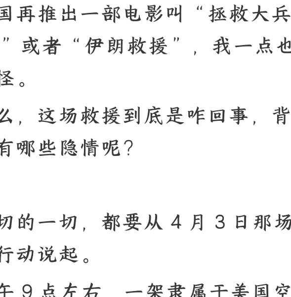

## 美军深入伊朗境内，营救 F-15E 飞行员的全过程

2026 年 4 月 7 日 文/卢克文工作室嘉宾 概略北方

整理：公众号懒人搜索，懒人专属群精选

懒人微信：lazyhelper1

2026 年 4 月 5 日，特朗普宣布，美军成功营救在伊朗被击落的第二名飞行员，至此，这场持续了 48 小时的救援行动，就此结束。

看起来，美国又赢了，如果多年之后美国再推出一部电影叫“拯救大兵 XX”或者“伊朗救援”，我一点也不奇怪。

那么，这场救援到底是咋回事，背后又有哪些隐情呢？

一切的一切，都要从 4 月 3 日那场空袭行动说起。

上午 9 点左右，一架隶属于美国空军第 494 战斗机中队的 F-15 战斗机，在伊朗上空被防空导弹命中。这架战斗机一共两个乘员，前座是飞行员，后座是武器操作官 (WSO)，负责操作电子战设备和投掷武器。

二人跳伞后，美军中央司令部立刻启动了最高级别的 CSAR（战斗搜救）程序。

很多人一提搜救，觉得无非也就是挂着红十字去抬担架的医疗队。

但在美军体系中，CSAR 是一支特种部队，专门用来救援陷于敌后的飞行员，隶属于美国特种作战司令部，不仅承担搜救任务，还承担作战任务。

一个标准的美军 CSAR 任务编组，一般由一架呼号为 King 的 HC-130J 搜救指挥机（负责协调整个战区的无线电信号、锁定飞行员的求生信标，还能为直升机空中加油），两架呼号为 Pedro 的 HH-60W“快乐绿巨人”救援直升机（黑鹰直升机的搜救型号），还有两架呼号 Sandy 为 A-10 的攻击机（负责火力支援）。

CSAR 的标准作业流程分为四步：

- 第一步，定位与验证，飞行员通过救援电台发送 GPS 信标，CSAR 部队要先验证密码，判断是否为诱饵，如果不是，就飞过去使用 ESM 设备框定一个大致的位置（因为 112G 电台作用距离有限），最后精密定位。
- 第二步，空中压制，A-10 入场，清理着陆区周边威胁。
- 第三步，突击降落，直升机强行触地，特种部队冲出机舱，建立环形防线，将飞行员救回机舱。
- 第四步，撤离，机群在战斗机的护航下，原路返回。

这套作业流程在过去 20 年的反恐战争中，屡试不爽。不过这次在伊朗人面前，一头撞到了铁板上。

美军派出了 2-3 个搜救小组，从科威特方向向伊朗胡齐斯坦省、中央省方向出动。

第一个小组的行动并不顺利，因为飞得实在是太低，在地面民兵火力的打击之下，两架直升机很快被击伤，不得不撤退，还有一架 A10 攻击机也被导弹击中，飞行员坚持飞到了波斯湾，跳伞逃生了。

另一组要顺利一些，找到了飞行员，虽然在撤退过程中也遭遇了地面火力打击，但还是全须全尾回去了。

不过呢？因为跳伞时间间隔（前座后座不能同时跳伞，必须后座先跳），F-15E 的两名乘员并没有在一起，飞行员被救了，后座的武器官 WSO 却没救出来。

这一下子，有点麻烦。

后座这个家伙是一个上校，在美军中，上校通常是大队级别，甚至本身就是这次轰炸任务的指挥官。一个掌握着美军大量战术机密的高级军官，如果落到伊朗人的手中，不仅意味着泄密，更关键的在于，伊朗一定会拿他大做文章，狂打特朗普的脸。

而在下一步谈判中，这个 WSO 也是个巨大筹码。

所以，伊朗方面开出了 6 万欧元的悬赏，呼吁当地的部落武装、民兵和老百姓带上武器进山搜捕。为了避免 WSO 被俘，特朗普下令，暂停在伊朗的其他军事行动，把能调动的 ISR 资源，全部砸向那个失踪的 WSO。如果救不出来，也不能让他活着落到伊朗人手里。

领导重视了就是好，特朗普一发话，CIA 就加入了。

一方面，CIA 联系自己在伊朗的内鬼，发动他们寻找并庇护 WSO，另一方面，开始在伊朗内部放假消息，说美军已经把两名飞行员都救走了，正在乘车向边境地区转移。

伊朗方面发生了误判，革命卫队都去边境方向围捕了，只是让一些巴斯基民兵去坠机点附近碰碰运气，在客观上降低了搜捕的密度和力量。

与此同时，美军派出了大批 MQ-9 无人机，在这位 WSO 藏身的扎格罗斯山脉上空盘旋，用红外设备寻找 WSO 的位置，卫星和雷达也时刻关注救援电台的信号。

那么，这个 WSO 到底去哪了呢？

其实，他跳伞时受了伤，他受过专业的 SERE(生存、躲避、抵抗和逃脱) 训练，知道要离飞机残骸越远越好，所以拖着伤腿，花了几个小时向着飞机残骸反方向走了 5 英里，爬上一处 2000 米的山脊，才开启紧急信标，错过了第一次搜救。

得到信标后，CSAR 第二次行动开始了，这一次，美军选择了夜间行动。

为啥是夜间呢？

很简单，伊朗巴斯基民兵没有夜视仪！不论攻击还是搜索，效率都大打折扣。WSO 身上有红外位标器，能以特定频率发射闪光，在夜间更容易被发现。

第二次搜救的规模要大得多，用特朗普的话来说，美军出动了“几十架装备了世界上最致命武器的飞机”，这已经不是搜救了，是一场局部战役。

同时，这也证明了伊朗搜索队已经离 WSO 很近，双方已经爆发了交火。

问题来了，即便确认了飞行员位置，想在伊朗的火力面前救走 WSO，仍然非常困难，一不留神连直升机都要搭进去。

所以，美军开始了一个极其大胆的行动，用 C-130T 找个附近的简易机场强制空降，建立 FARP（前进武装与补给点），把特战队员放下去，一部分建立阵地，阻滞民兵的接近，另一部分坐上 HC-130T 货仓里拉的“小鸟”直升机去接应 WSO（小鸟直升机比较小巧，可以在反斜面位置降落，避开伊朗的直射火力），然后一起撤离。事实证明，这个想法是对的，但执行得磕磕绊绊。

首先，他们找到了一个简易机场，这地方距离飞行员的位置只有 15 公里，小鸟直升机飞过去只要几分钟。但问题在于，这个地方距离伊朗伊斯法罕核设施，只有 40 公里，伊朗在附近部署有重兵。

他们降落成功了，也的确找到并救回了受伤的 WSO，但要走的时候，才发现自己降落下来的 C-130T 起落架陷到了松软的砂石里，没法起飞了。

这个时候，伊朗的武装已经围过来了，虽然现场还有小鸟直升机，但这也没法把上百人都接走啊！

最后，美军中央司令部拍板：这两架飞机不要了！再派 3 架 C-130，强行降落把人接走！

总之就是不惜一切代价，也要把人救走。

最后，在空中掩护下，三架运输机接连降落，把特战队、WSO 和伤员都拉上了飞机，飞机起飞后，美军引爆布置好的炸药，把两架昂贵的 HC-130T 炸成了一堆燃烧的废铁。

一场惊心动魄的营救行动，到此结束。

特朗普没说错，这真是一场“奇迹”一般的活动，偶然因素太多了，如果伊朗人的动作快一点，如果现场的巴斯基民兵能有几枚单兵防空导弹，可能这次救援，就会变成“葫芦娃救爷爷”。

当然，以上都是美国人单方面的说法，而美国人的赢学习习惯，有时候也会刻意隐瞒损失。

看起来，美军的这次行动很完美，但仍有不少疑点。

## 02

比如，特朗普说美军救援成功，而伊朗方面则说美军救援失败之后，销毁了飞行员的尸体，把拯救大兵变成了消灭大兵。

比如，美军说 HC130T 是自己炸的，伊朗说是他们击落的。

那么到底真相如何？还有待新的信息做出判断。

再比如，特朗普说美军没有死人，但伊朗方面说给美军造成了损失，自己方面 5 死 8 伤。

说实话，两边的说法都很可疑。

美国人又不是天兵天将，咋可能交火那么久，一个人都不死？如果交火是这个烈度，为啥还要降落运输机打地面战？

而伊朗方面说击落了美国飞机，打死了美国人，那为啥一个尸体都不见呢？

此外，特朗普说这场战斗发生在白天，持续了 7 个小时，以美军这种规模的动作，伊朗方面应该有些警觉了，为啥不派兵增援呢？好歹扔个小摩托过去呢？

所以啊，这事说不清，肯定会像之前的数次交锋一样，美国和伊朗各说各话，分别宣布自己赢了。

对美国人来说，人救回来了，保住了机密，没有让伊朗拿到政治筹码，赢。

而对伊朗来说，自己挫败了美军的救援行动，美军不得不自己炸死了飞行员，然后随便找个人冒名顶替，还损失了 7 架飞机，这是几十年来第一次有国家给美军造成这么巨大的损失，赢。

至于真相如何，有时候并不重要。

而重要的是，这件事暴露了什么问题。

首先就是，伊朗的天空不再安全。

从这次伊朗击落的 A-10、F-15 和此前击伤 F-35 的行动中，我们会发现，虽然伊朗的区域防空能力基本上损失殆尽了，但其防空系统以一种化整为零的方式，继续战斗。

这种防空系统战术是这样的：

- 放弃容易被发现的雷达系统，改为人力情报加上航路推算，因为美军基地固定，所以轰炸航路也相对固定，路上安排几个观察哨，就能大致得到预警信息。
- 第二，改装防空导弹，把原来的雷达制导，改成光电跟踪 + 无线电指令制导。

美军战斗机装备有雷达告警接收器 RWR，但光电跟踪，全靠地面的光电设备和人的眼睛，并不发射雷达波，不会触发报警。

伊朗人只需要根据来袭情报，用被动的红外/光电观瞄设备找到美军飞机，然后发射导弹，并在导弹飞行末段进行无线电指令进行修正就行。

这种模式的缺点很明显：距离短，作战高度受限，只能在固定航路上守株待兔。但它的优势更大：绝对隐蔽，几乎无法被发现和消灭。

如果伊朗在经历了这次成功战例后，将这种模式全国推广呢？

俄罗斯最新提供的 1500 枚柳树便携式防空导弹，是支持这种模式的，成百上千个这样的防空小组，撒到伊朗广袤国土进行游击防空，这仗还怎么打？

其次，这次行动，代价实在太大。

这次救援过程中，美军累计损失了 1 架 F-15E、1 架 A-10、2 架 HC-130T、2 架 MH-6 小鸟，外加 2 架报废的 HH-60W 直升机。

按伊朗方面的口径，还要再加 1 架 A10 和 1 架 F-16。

A-10 和 F-16 都是老飞机，还不那么心疼，HC-130T 和 HH-60W 可真要让美国心疼了，这两款飞机都是特战型，非常少。在中东部署的 HC-130T 只有 8 架，HH-60W 只有 12 架，现在 48 小时内就没了 4 架，可以说是伤筋动骨了。

那如果明天再掉一架飞机呢？CSAR 还能进行一次救援吗？

更关键的在于，特朗普是不会管 CSAR 有没有再次行动能力的。

在特朗普的赢学叙事中，这名 WSO 的获救，必定会被包装成“美军进出伊朗如入无人之境”的铁证，极大刺激特朗普获胜的信心，很可能会强令加大空袭规模，无视伊朗游击防空网的威胁。

更多的空袭配上更多的游击防空小组，必然是更多的飞机被击落，到时候就算 CSAR 浑身是铁，又能打几根钉呢？

更可怕的是，这次特种作战行动的成功，很可能刺激特朗普进行更大的军事冒险。

根据媒体报道，特朗普一直在筹划一个特种作战方案：派特种部队去夺取伊朗的浓缩铀。

这个方案具体为，由 82 空降师、75 游骑兵团组建一个特战空降工程兵混编大队，空降伊斯法罕核设施，第一时间修一条临时跑道，然后运过来大型工程设备，挖穿 91 米地下隧道，由特种部队深入地下寻找 450 公斤浓缩铀，并带走。

这个方案太扯淡了，怎么在伊朗腹地空降上千人就不说了，美军怎么在伊朗的小摩托和炮击中，挖穿 91 米的隧道？

虽然赫格塞思是个马屁精，但他也知道这事太冒险，万一失败他也是要背锅的，所以并不赞同。

但现在呢？救援行动完美落幕，无疑极大增强了特朗普的信心，他必然会 用这次行动成功去压制反对声音，从而强行推进抢夺浓缩铀的行动，毕竟这次的降落点距离伊斯法罕也不过 40 公里嘛。

这个方案成功了好处极大，顺理成章结束战争。

但如果失败了呢？如果运载着特种部队的运输机被击落了呢？如果在地下夺取浓缩铀的过程中发生核泄漏了呢？

到时候，可就不是一场局部战争了，其带来的蝴蝶效应，很可能意味着中东将迎来一场万劫不复的战略灾难。这个代价，特朗普能承受吗？敢承受吗？

祸兮福之所倚，福兮祸之所伏。谁知道这次救援行动的胜利，给美国带来的是福，还是祸呢？

---

绝大多数人只盯着眼前的工资，却不知道一次远在中东的冲突、一次降息的决议，就能在一夜之间洗牌普通人的财富。

看懂宏观，是为了在周期切换时，不被当作代价。

如果你认同这种“抬头看路”的长期主义，欢迎围观我的个人情报智库:【懒人专属群】。

圈子已稳定运行 7 年。我们每天利用 Python 爬虫与大模型算力，过滤全网最顶级的政经内参和搞钱风向标，做你最冷酷的“外部大脑”。

## 查阅圈子完整数字资产与上车门槛：

https://lazyso.com/insider/

认同价值的。扫码加我微信，备注:【进群】

