# 小红书 NotebookLM 课件详细变现经验分享，每天三小时，3 月变现 1.1 万

## 260408 副业生财精华

公众号懒人搜索，懒人专属群独享

懒人微信：lazyhelper1


微信：lazyhelper1

我用 NotebookLM 做小红书原创课件，每天 3 小时，3 月变现 1.1 万。

从虚拟搬运转向原创课件后，我摸出了一套小红书 PPT 变现流程和找赛道的方法。

不想再做高风险搬运后，我靠原创 PPT 课件在小红书稳定出单。

## 一、自我介绍

圈友们好，我是 YaoYuan，02 年人，2023 年 4 月 10 号加入生财，11 月 15 号开始做虚拟资料搬运，现在做小红书原创 PPT，也是跟着 2025 年 12 月的那次航海开始做的。在那之前我一直做的还是搬运，那会改规则了，没办法，刚好那会 NotebookLM 可以直接生成 PPT 了，我就开始做，一直到现在。刚开始一个月，也是在摸索，现在基本已经形成了一套流程。

发这篇帖子，是希望复盘一下，也是想和圈友多交流。我一个人闭门造车，这段时间才发现进步实在有限，因为自己看不到自己的缺点和不足。前两天看到 B 站深海圈的圈友，生成图片、文案、获取商品信息，等等之类的都是自动化，我当时直接震惊了，完全超出了我的想象，我就觉得自己见识确实太少了。倒不是说不能用 AI 写小工具，就是完全想象不到还能这么玩。

如果能有做小红书虚拟或者其他圈友多交流，我想我会进步的更快。

### 话不多说，先上成绩：


## 二、我是怎么加入生财的？

我初中就辍学了，然后在外面一直上班，超市当过收银员，也当过饭店当过服务员，做过一年洗车工。等成年后又在厂里上了半年班。（在这期间，我偶然接触了线报群，以及打假群。那两年淘宝退款和 PDD 退款，以及打假我感觉真的非常火，我一直跟别人付费从事这方面。退款退的并不多，因为当时规则特别严格，退两次淘宝就封号了，所以我一般根据食品安全法，或者产品一赔三，找一些产品，赚一些零花钱，学费总共交了 5000 多吧，肯定是赚回本了。但是 2019 年底我就发现，这样总是赚点零花钱，根本改变不了我的生活，而且感觉割韭菜的实在太多了。于是后续两年我都没有在网上付费学习过东西了，因为我没办法判断真假，害怕被割韭菜。）

大概是 2020 年 6 月份，我再上了半年班的厂里离职了。其实我运气还挺好的，那会刚好赶上疫情，中间有两个月的时间，工作都很轻松，偶尔玩玩手机也没人管，但是后面就越来越严格，气氛挺压抑的，我也就觉得该离职了。

然后我妈提议我去西安上个大专，我一想，就答应了。听说有个大专学历，可以在厂里当个技术员，不用再流水线上干活了，而且去大专也是混日子，我就很开心得答应了。

结果去了之后，我就有点后悔了。我感觉自己完全是在混日子，这样以后找工作还是没有任何的优势啊，于是我就开始在网上寻找各种盗版课，最先接触的就是闲鱼了。

当时的玩法就是从 PDD 搬运到闲鱼，确实让我一个月赚了 1000 元，但因为流量很不稳定，我也不知道怎么回事，没人可以交流，所以很快就放弃了。之后我一直再盗版网站上看各种各样的盗版课程，也算是为我后面加入生财埋下了伏笔。

就这样，从 2020 年 8 月到 2022 年 6 月，我结束了呆在学校的时间，然后就跑到苏州寻找工作，也是完成了我当初的想法，那就是在厂里当技术员。当时我的想法还是很简单，我要好好的学技术，以后轻松的生活。进去之后呢，电子厂基本都分为，前面造板子和后面测试，把我分到了后面。可能是因为觉得我年轻，不够稳重，刚进去的时候还挺轻松的，过了一个月，工作量就变得很大，上班简直就是一种折磨，但是还可以忍受。不得不说有人得地方就有斗争，我们那个技术部门得和生产部门经常不对付，带了三个月后，部门的科长给我说，想把我调到前面去学习怎么造板子，我一听，这是好事啊，造板子是电子厂通用的，肯定是造板子前途好。

但是天不随人愿啊，由于我平时干活比较卖力，不喜欢偷懒，所以后端管事的不想我走，说我走了，他压力太大了，于是把另一个经常偷懒的调到前面享福去了。我 tmd。。。。我当时真的无语了，然后我就觉得，这个厂可能也不适合呆下去了。于是 2023 年一月份我就离职了。

离职之后，我就发现我不想进厂了，我想要体面的生活，哪怕赚的少一点，可是没有学历，上哪里去找体面的生活呢？在苏州跟着我父母，除了进厂我还能干嘛呢？那时候我慢慢有了离开我父母的想法。

2 月底的时候，找到了一份电工的工作，是我亲戚介绍的，他在一个物业当保安队长，之前碰巧考过高低压电工证。刚进去一个月我就感觉不对劲了，里面全是苏州本地的老头，个个都是只有几年就退休了，本来都是打工的，虽然我确实什么都不会，结果我硬生生在里面变成了一个学徒的角色，我就好像是所有人的徒弟。我感觉这样工作不是法子啊，一个月才 4000 块，买房怎么办，谈对象怎么办？这不是我想要体面的生活。

刚好，转机很快就有了。毕高，之前看过他的盗版课，关注了他的公众号，然后 4 月初，我看到他在生财有术相关的帖子，意思是一年 500 多好像，解读生财文章还是什么的，确实有点想不起来了。然后我就想生财有术，我知道这个社群，之前看到盗版内容，于是我马上去闲鱼买了一份盗版内容，看完之后还蛮兴奋的。

于是在 4 月 10 号早上的时候，火速加入了生财。我把这个行为视为我改变命运的一个机会吧，事实证明这个行为确实改变了我以后的人生。

## 三、我做项目的心态

我做项目的心态其实很简单，哪怕是到了现在，我也还抱着这个心态。

那就是，没事的，现在已经很不错了，有着生财，哪怕以后去上班，也比之前强太多了，也可以很好的生活，所以我几乎是没有什么压力。

## 四、小红书虚拟资料搬运劝退

搬运：如果你是新手，你应该直接舍弃搬运。经过这两年的搬运生涯，我算是发现了，搬运是一个投产比很低的东西。如果是拉长长时间来看的话，我做了两年的搬运，我被起诉过一次，赔了 2650 元，还被淘宝三次售假罚过款。要是再加上进货钱呢，进货钱可不是几毛几分，有的东西你进货一次，可能后续也卖不出去。说的是卖一次，后面都是 0 成本，可要是后面根本卖不出去呢，那不就是百分之百的成本嘛？

而且我做了两年，也认识了一些同行，我不敢说大部分，最起码只要你做的时间够长，开的店够多，几乎都被起诉过，太难太难避免了。我自己也被起诉过，只赚了不到 20 块钱，赔了 2650。还有的圈友卖了一份，赔了 4000。或者是卖了几百块，索赔几万的，当然，这都是因为我们卖的是视频课程，但不代表不是视频课，就不会被起诉。而且可以仔细想一下，现在到底还有那个平台不打击搬运呢？可能也就只有闲鱼。

现在除了闲鱼，可能其他平台都不太适合搬运这个玩法生存了。我做小红书搬运的时候，我没有从淘宝选品，因为两年的搬运经验，我早就把淘宝的品看一干二净了，没有什么东西值得我去搬。再加入可能很多圈友都从淘宝搬运，所以我选择从闲鱼搬运小红书。

做搬运的，基本心情都不会太好，害怕被原创找上门，害怕被起诉。我当时被起诉过一次之后，后面卖商品，哪一个卖得好，我都在想这个商品会不会侵权。如果侵权，那不得赔死啊。后面小红书改变规则，这两个原因也是我放弃搬运，转为原创的重要原因。

## 五、原创 PPT 课件的优势

因为知识库那些我完全不懂啊，我也尝试去做，但是做的脑壳疼，实在受不了了，或者使用 NotebookLM 整理资料，整理出来的资料感觉就是一坨，我几乎没有任何审美，看到别人的主图、详情图，我就感觉脑子大的很，怎么做都没有人家的好看。

恰好我做过两年虚拟资料搬运，搬运的最多的就是 PPT，所以我就开始用 NotebookLM 生成 PPT，一直做到现在。

我目前最大的感受就是“不怕侵权，而且单价可以卖的高。并且 NotebookLM 可以轻松制作，毕竟我之前是一点都不懂怎么制作 PPT。”

这个项目卖的是什么：我们做课件，节省了我们目标人群的时间，相当于帮对方省事了，他们买了我们的课件，可以直接用，或者套用模板简单修改。

谁会买：国内不懂 NotebookLM 的目标人群，想省时间的人群，懒得制作课件的人。想拿来应急的。

### 为什么它比搬运更稳、更好：

并且原创 PPT，完全可以代制作，加到微信做私域。虽然我目前还没有带做过 PPT，不知道为啥我一报价，人都跑没影了。我报价才 4 块钱一页啊，我真醉了。

如果你是新手，可以选择杂货铺稍微过渡，但注意不要卖视频课程，然后慢慢寻找垂直原创赛道。

小红书选赛道只需要记住一句话：选的不是品，而是人群！！！

大家做课件，我觉得不要去做教师 PPT 或者主题 PPT 赛道，也就是开学第一课之类的。因为刚开始的时候我就做了，做了 20 天，将近 30 个课件，变现了 100 多块，我发现这个赛道好像不行，特别依赖节日、开学、期末等等特殊日期，没有节日或者没什么热点的时候就很冷淡，而且比较依赖单品打爆，我不喜欢这个模式。

刚开始的那会，刚好是冬至，我就做了一个课件，也就是哪个课件给我带来了大部分收入，其他课件，都很冷清。

不过这个小红书原创真的是有复利，这几天开学，我 12 月多做的一个课件，又开始出单了，给我带来了两三百的收入。

## 六、赛道选择

### 我是怎么选择赛道的

我在 PPT 赛道选品类有几个要求：

- 1 这个品类能不能做够几百套课件？？因为我是喜欢每天都发笔记的，一个商品我只发一片笔记，所以我需要不停的补充商品。
- 2 这个品类的单价能不能突破 9.9？？，如果不能，那还能怎么提高客单。

我基本就只思考这两个问题，因为如果这两个问题都想不清楚的话，那肯定没办法长久的做下去。但是一旦满足了我这两个要求，那就是一个非常不错的赛道，你只需要坚持就行了。

为什么是这两个要求呢，因为我不喜欢单品打爆，我觉得我做不到，之前从来没有做过这样的事情。我当时做的时候，我就想有没有一种赚钱系统，是你只要更新，稳扎稳打，就可以持续赚钱的东西呢？不用去刻意的追求爆品。所以我给自己定下了上面的两个要求。

### 如何寻找合适的 PPT 赛道

先通过搜索大词 PPT——然后寻找根据滑倒 PPT 寻找小词，通过搜索小词来确定赛道。

现在大屏幕上搜索 PPT 这个大词，然后我们可以看到其实第一个美伊冲突就是 NotebookLM 制作的

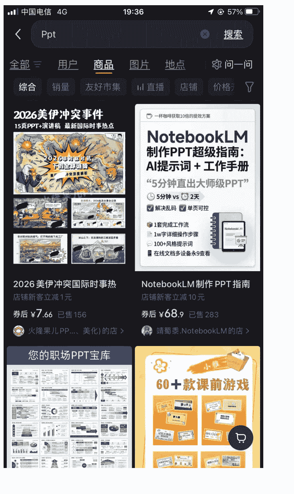

然后我们就可以继续往下翻，比如右下角的这个（小雅老师，一看就非常的赚钱，但是他的这个难度制作也比较大一点，NotebookLM 达不到他的要求，如果想模仿这个账号，需要一定的 PPT 基础。


```markdown
| PPT 搜索 |
| :--- |
| + 全部 用户 商品 图片 地点 问一问 |
| **您的职场 PPT 宝库** |
| 年终述职 | 年中述职 | 时间轴 | 甘特图 | 流程图 | 数据图 | 图文排版 | 逻辑图形 |
| 一杯咖啡的钱，搞定你的 PPT 模板库 |
| **60+ 款课前游戏** |
| “很好很实用，以后述职答辩...” |
| **PPT 模板 商务述职汇** |
| 限时立减 20 元 |
| 券后¥39.9 已售 1.7 万 + |
| 序言在做 PPT 的店 > |
| “之前试了好多方法都没用， ...” |
| **60 多款课前游戏 PPT** |
| 近 30 天好评率 100% |
| ¥36.6 已售 2.1 万 + |
| 小雅老师的店 > |
| **爱你，老己，明天见！心理 PPT** |
| 当代年轻人的自我治愈手册 14 页 + 演讲稿 |
| “爱你老己，明天见” 当代年轻人的 自我治愈 |
| 老己 明天见 |
| **课前小游戏大全集** |
```

然后再往下翻，就会看到各种各样的 PPT，可以看到这个奖学金，我点进去了，里面都是学生会竞选的一些 PPT，每一个都卖了几千份。最重要的是第二张图，成语 寓言故事，单价不高，总共卖了 1.3 万份，但是可以衍生出很多 PPT，而且这个赛道目前就他一个人。

公众号懒人搜索，懒人专属群分享

中国电信 4G

19:38

57%

PPT

搜索

全部

用户

### 商品

图片

地点

问一问

里面的资源 ppt 超级王，同...

#### 10000+PPT 模板高级感简约

限时立减 3.99 元

券后¥1 已售 5835

爱吃栗子的糖炒栗子的店 >


有趣原创 PPT 编码:C15, 共 28 页，商品详情页可看全部页面

赠送 2000 套答辩 PPT 模板 4 种配色，支持一键换色，里 面元素均可编辑 24 小时拍下秒发，立即可用

“里面有 4~5 款主色 PPT, 还...

#### C15·毕业答辩左侧导航栏通

每满 200 减 30

券后¥2.88 已售 2.3 万 +

有趣简历的店 >

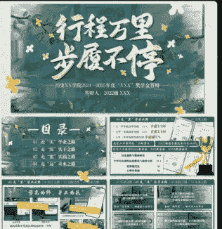

#### 绿色奖学金答辩 PPT|购买

每满 200 减 30

¥6.6 已售 1110

潜水小鱼^的店 >


春上新 PPT 进度条自定

限时立减 0.83

券后¥6.07 已售 37

小雯儿...件的店加购，

05:20

建议收藏

#### “乱讲 PPT”

15/51

PPT 搜索

+ 全部 用户 商品 图片 地点 问一问

+ 综合 销量 好友市集 直播 店铺 价格

近 30 天好评率 100% 
 ¥0.98 已售 5189 
 阿念老师的店 >


【自动发货】编号 014 答辩 
 近 30 天好评率 100% 
 ¥0.99 已售 1101 
 祢豆子 ci9 的店 >


“PPT 已收到，小蚂蚁客服特...” 
 成语/寓言故事【笨鸟先飞】 
 近 30 天好评率 100% 
 ¥4.99 已售 1348 
 小蚂蚁 PPT 的店 >

# 通用版 
 主题班会 PPT


↑

🛒


### 赛道推荐

英语课件赛道，这个赛道我接下来也会做，我感觉这个很不错。

这个店铺开了才一年，就买英语语法课件，就已经变现了 9.9×8719=86318 元，同时我们也可以看下，下面这个账号，虽然也是卖英语 PPT 的，但是它有一个很好的点。

那就是：店铺商品打包出售！！他依靠这个品变现了八百多单，他总共才出售了 900 多单。

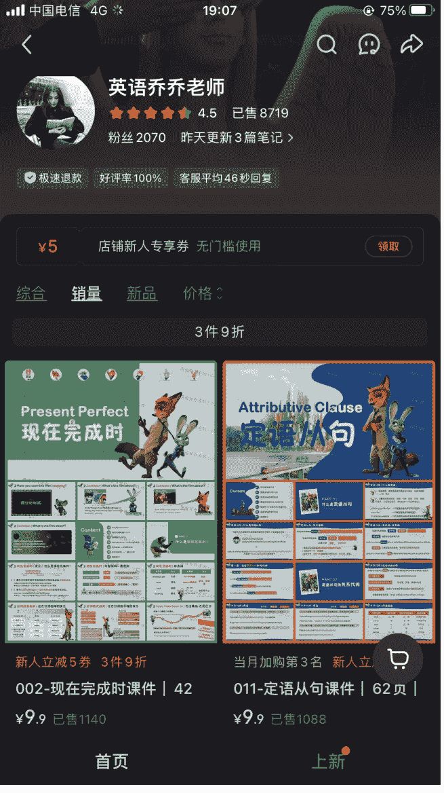

### 店铺详情


| 项目 | 详情 |
| :--- | :--- |
| 店铺名称 | 英语乔乔老师 |
| 评分 | 4.5 |
| 销量 | 已售 8719 |
| 交易保障 | 极速退款 查看详情 > |
| 店铺服务 | 商品品质 品质分 4.5 历史好评率 100% |
| 物流服务 | 物流分 5.0 近 90 天 1 小时内发货 |
| 客服服务 | 服务分 4.4 近 90 天平均 46 秒回复 |
| 基础信息 | 开店时长 1 年 3 天 经营资质 查看详情 > |
| 功能 | 进店查看全部商品 |

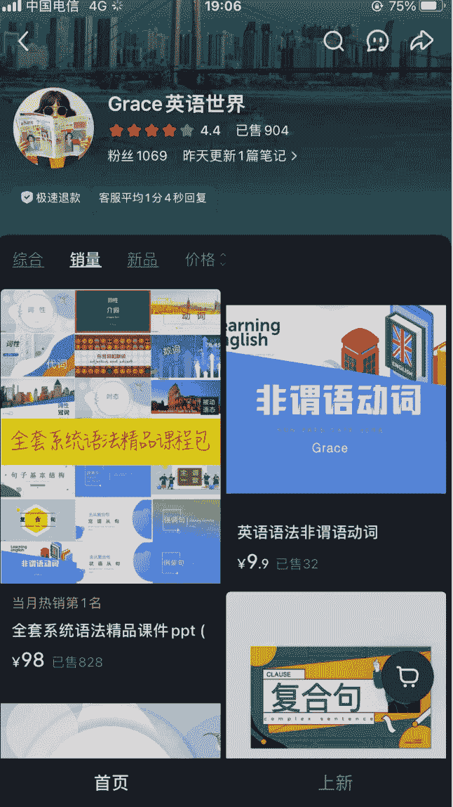

英语赛道是我看好的一个赛道，英语嘛，借用 Luke 教练的话来说，那就是东南亚人一辈子的课题。除了英语语法之外呢，你还可以做新概念英语 1-4 册，你可以下载下来 PDF，然后让 Gemini 给你生成 PPT 的文案，你在 NotebookLM 中去做 PPT，还可以做剑桥，日常生活英语，情景英语，想办法去做，做个两百个课件肯定没有问题。然后你还可以拓展一下嘛，做英语资料？英语作业？等等等。

### 新概念精品课件

#### PPT

Lesson 1
Excuse me!

Let's guess.
It's a bag with handles. It is called. handbag

Let's watch.
Whose handbag is it?
It's the woman's.

v. 原谅
Please excuse the mess. 这里凌乱不堪，请见谅。

Word Club

n. 借口
Late again!
What's your excuse this time?
又迟到了！你这次有什么借口？

pron. 我
(I 的宾格)
Hello, it's me.
哦，是我。

Word Club

YES

Word Club

adv. 是的
'Is this your car?'
'这是你的车吗？'
'Yes, it is.'
'对，是的.'

1/4

¥15.9

到手价 ¥9.9

已售 383

商家券 满 15 减 6

支付宝随机立减

##### 新概念精品课件 PPT 音频视频教案作业题英语一二册
NCE 自动发货网盘

店铺

客服

购物车

加入购物车

领券购买


##### AI 赋能教师课件

这是教师 PPT，但是比教师 PPT 好得多。寻常的教师 PPT，大家可以去搜索一下，9.9 元不能再多了，甚至低于¥9.9 的也有很多。

但是这个 AI 赋能的教师 PPT 课件，就完全不一样，15 块钱以上是常态，可以看到二十块钱的都有。虽然我们很难做到他们这么好看，但并非不能做，有困难才有机会嘛。要是都是随手生成，你凭啥卖这么贵呢？

网上可以下载课文的 PDF，Gemini 可以帮你总结，给你写文案，给你生成 PPT 的提示词，NotebookLM 可以给你生成提示词，然后 Gemini 可以给你写教案和逐字稿。可以看到下面的两张图，是他们的商品清单目录：

学习单，课件，PDF 教学设计，逐字稿，MP4

课件可以用 NotebookLM 生成，文字类的全部让 Gemini 来，MP4 即梦或者豆包都行。生财有很多生成视频的教程，而且就算你觉得自己做的不好，你也可以卖的便宜点，15.8 元。然后重要的来了：打包，打包价啊，必须打包。这个时候，单个课件的质量就不重要了，你就有了和老牌店铺竞争的资格了，你只用不停的做课件就行了，把一切都交给时间。单个课件的价格不能低，不然会员就卖不出价格。

### 公众号懒人搜索，懒人专属群分享

中国电信 4G 19:10 73%

搜索小鱼老师 a 的商品

综合 销量 新品 价格


课件 + 教案 + 逐字稿 + 学习单 + 电子黑板贴

拍下即刻推送百度网盘

新人立减 1 券

三上《富饶的西沙群岛》精品

¥18.8 已售 1837


课件 + 教案 + 逐字稿 + 学习单 + 电子黑板贴

拍下即刻推送百度网盘

新人立减 1 券

AI 赋能 | 四上《王戎不取道旁》

¥18.8 已售 1687


课件 + 送：教案 逐字稿 学习单

拍下短信推送百度网盘链接下载

新人立减 1 券

二上 AI 赋能《葡萄沟》精品

¥18.8 已售 1622


课件 + 送：教案 逐字稿

拍下短信推送百度网盘链接下载

新人立减 1 券

25 二上 AI 赋能《坐井观天》

¥17.8 已售 1314

首页 分类 上新

#### 搜索店铺内的商品

综合 销量 新品 价格

##### 春上新


限时立减 5.19 新人立减 1 券 春上新 原创《大自然的声音》

¥21.71 已售 587


限时立减 6 新人立减 1 券 春上新 原创 | 荷叶圆圆情境

¥22.9 已售 469


展示课必冲 限时立减 3.14 新人立减 1 券


限时立减 3.44 新人立减 1 券

首页 分类 上新

##### 《富饶的西沙群岛》教学设计

###### 【教学目标】

- 1.认识“饶、优”等 9 个生字，读准多音字“参”，会写“优、淡”等 4 个字。
- 2.有感情地朗读课文，了解课文是从“海水、海底、海岛”三方面来写西沙群岛的，以及借助关键句理解主要内容。
- 3.我为西沙群岛做宣传。选择自己最喜欢的部分，向别人介绍西沙群岛。

###### 资源列表

| 文件名 | 更新时间 | 大小 |
| :--- | :--- | :--- |
| 情景 AI 结束部分.mp4 | 2025-09-19 23:12 | 27.7M |
| 情境导入 AI 开头.mp4 | 2025-09-19 23:03 | 25.3M |
| ai 新《富饶的西沙群岛》课件 (1).pptx | 更新 2025-09-19 23:28 | 289.1M |
| 18 富饶的西沙群岛 逐字稿.docx | 2025-09-19 23:07 | 26K |
| 板书三上富饶的西沙群岛.pptx | 2025-07-01 23:01 | 3.0M |
| 《富饶的西沙群岛》课件.pptx | 2025-07-01 13:57 | 209.0M |
| 《富饶的西沙群岛》学习单可编辑.docx | 2025-07-01 13:57 | 995K |
| ai 新《富饶的西沙群岛》课件.pptx | 2025-07-01 13:57 | 224.7M |
| 《富饶的西沙群岛》学习单.pdf | | |

###### 书法课件（做的人很少，感觉蛮有意思的）

书法这个赛道我觉得还是很不错的，这个赛道他们就是不仅卖 PPT，还买其他资料，可以说是把这个赛道的收益最大化，吃干抹净了。不过我还是想不明白，为啥不打包卖呢，明明是提升客单价的机会。如果让我来做，那我肯定就是疯狂的做 PPT，然后上其他资料，然后上打包价。

#### 综合 销量 新品 价格

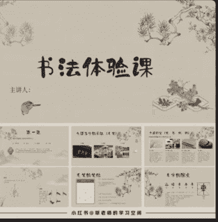

##### 书法体验课

软笔书法第一课教学 PPT

¥8.8 已售 1556

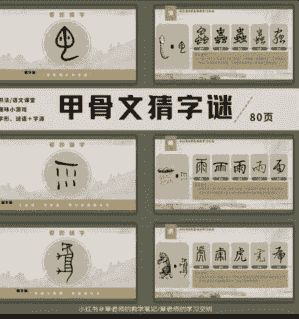

##### 甲骨文猜字谜/80 页

书法课堂游戏“甲骨文猜字

¥8.8 已售 1329

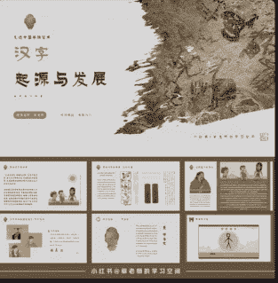

##### 汉字起源与发展

书法教学 PPT 课件《汉字的

¥9.9 已售 1175

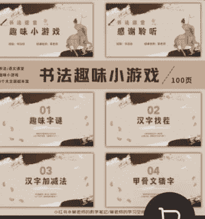

##### 书法趣味小游戏

100 页
01 02 趣味字谜 汉字找茬
03 04 汉字加减法 甲骨文猜字
书法趣味小游戏 (100

¥9.9 已售 1075

首页 分类 上新

##### 书法 PPT

搜索

全部 用户 商品 图片 地点 问一问

综合 店铺 好友市集 退货包运费 销量

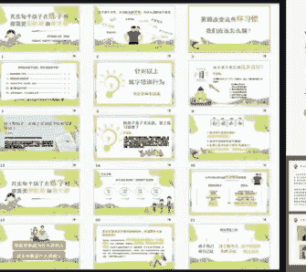

“物超所值宝藏内容大赞”

###### 书法家长会原创自制 PPT 课

每满 200 减 30 800+ 人加购

券后¥9.9 已售 1337

大地书画院苏老师的店 >

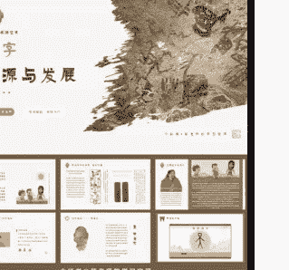

###### 书法教学 PPT 课件《汉字的

300+ 人加购

¥9.9 已售 1175

草老师的学习空间的店 >

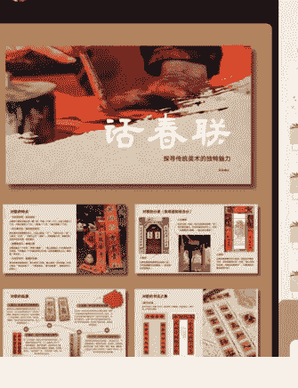

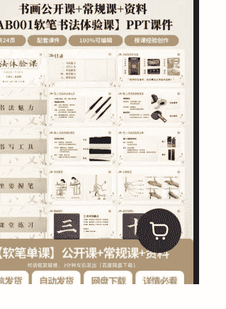

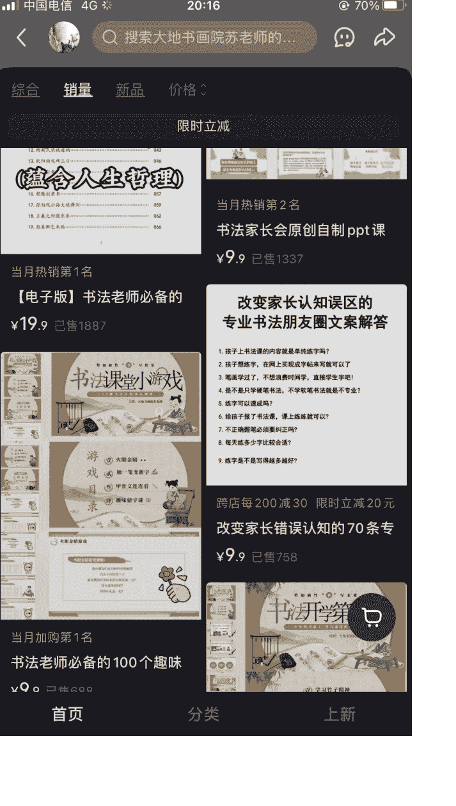

## 七、书法课件制作实操

### 第一步，Gemini 制作大纲目录

先让 Gemini 给我制作大纲，如果对大纲不满意的话，可以让 Gemini 进行修改（刚开始的时候我是直接让 Gemini 输出内容的，但是有的时候内容比较多，让他分两次输出，他第一次和第二次的內容就衔接不上了，所以我先输出，然后让他按照目录输出，确保内容衔接）

公众号懒人搜索、懒人专属群分享

> 我是教书法的，我想做一个书法课件 PPT，关于软笔书法第一课教学 PPT，也就是书法体验课，我想做 30 页，你给我一个目录

原来是同行！既然是第一课（体验课），重点不在于让学生马上写出完美的笔画，而在于**“定调子”**——让他们觉得书法好玩、高级、且自己能学会。

30 页的体量非常扎实。为了保证逻辑清晰且不冷场，我建议将 PPT 分为**“赏、具、修、习、品”**五个篇章。以下是为您设计的 30 页详细目录及内容规划：

### 软笔书法第一课：笔尖上的中国智慧

#### 第一篇：一眼万年——书法之美 (1-6 页)

- 第 1 页：封面（极简风，醒目的标题 + 一幅名家代表作）。
- 第 2 页：互动提问：你眼中的书法是什么？（对比印章、现代设计与手写书法）。
- 第 3 页：书法的演变：从甲骨文到楷书的“极简史”。
- 第 4 页：名作赏析 1：王羲之《兰亭序》——天下第一行书的飘逸。
- 第 5 页：名作赏析 2：颜真卿《祭侄文稿》——情绪的力量感。
- 第 6 页：生活中的书法：匾额、春联、影视剧片头（拉近书法与现实的距离）。

#### 第二篇：工欲善其事——文房工具 (7-12 页)

- 第 7 页：认识“文房四宝”：笔、墨、纸、砚。
- 第 8 页：揭秘毛笔：羊毫、狼毫的区别（现场让学生摸摸刷毛的触感）。
- 第 9 页：墨的故事：从墨锭磨墨到现代墨汁。
- 第 10 页：纸的奥秘：为什么非要用宣纸？（展示润散效果）。
- 第 11 页：辅助工具：毛毡、笔洗、镇纸、文镇。
- 第 12 页：工具的摆放：打造你的仪式感书案。

#### 第三篇：内在修养——姿态与心境 (13-17 页)

- 第 13 页：坐姿：头正、身直、臂开、足安。
- 第 14 页：五指执笔法：擫、押、钩、格、抵（动作拆解图）。
- 第 15 页：执笔误区：避免“抓拳头”或“兰花指”。
- 第 16 页：运腕与指力：为什么是用“全身”在写字？
- 第 17 页：呼吸与静心：书法是“纸上瑜伽”。

#### 第四篇：初试锋芒——笔法实验室 (18-26 页)

- 第 18 页：中锋与侧锋：线条的厚度来源。
- 第 19 页：藏锋与露锋：如何“藏”出内敛美？
- 第 20 页：提笔与按笔：感受毛笔的弹性。
- 第 21 页：核心笔画练习 1：逆入平出（横画的基础）。
- 第 22 页：核心笔画练习 2：垂露竖（垂直的力量）。
- 第 23 页：趣味线条：画圈圈、画波浪（消解学生对写字的恐惧）。
- 第 24 页：永字八法：中国字的基因库（简略展示）。
- 第 25 页：现场演示：老师亲写一个字（如“永”或“一”）。
- 第 26 页：学生初体验：自由涂鸦与线条尝试。

#### 第五篇：课后延伸——品味与展望 (27-30 页)

- 第 27 页：书法练习的“三个阶段”：摹、临、创。
- 第 28 页：优秀习作展示（同龄人作品，增强学生信心）。
- 第 29 页：老师寄语：见字如面，持之以恒。
- 第 30 页：封底：感谢聆听，Q&A 环节。

### 给老师的小建议：

- 1. 视觉风格：课件背景建议使用浅米色或宣纸底色，字体用宋体或衬线体，保持高级感。
- 2. 动静结合：第 25 页建议插入一段您亲自书写的短视频，或者实时投屏，这比任何图片都震撼。
- 3. 互动环节：30 页 PPT 中，每隔 5-8 页安排一个提问或小操作（比如摸毛笔、试墨色），避免学生走神。

您需要我为您细化其中某一页的具体文字内容，或者帮您写一段开场白吗？

### 第二步 分段输出

然后 15 页 -15 页的进行输出，因为 NotebookLM 一次性只能输出 15 页的 PDF，虽然也能通过指令多输出几页，但是 15 页比较稳定，如果 AI 给出的内容不是按照目录来的，你就让他重新根据目录输出，然后我们就把 AI 给出的内容复制到 Word 中，如果感觉不整齐，太散乱了，就可以

使用 WPS 中的段落整理，来整理下，整理过后的区别还是蛮大的。

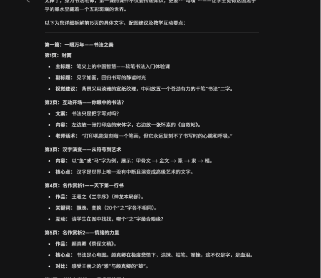

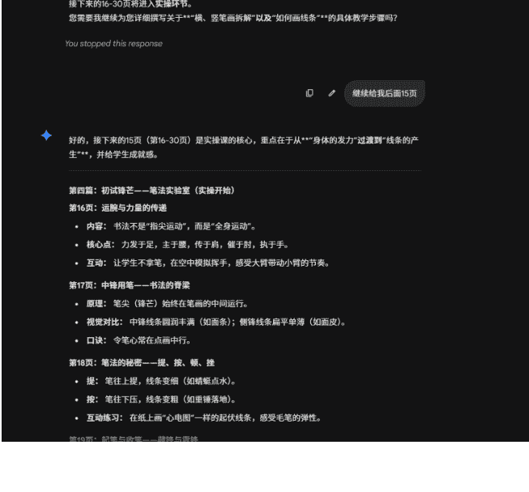

然后将两个文档上传到 NotebookLM 中，这个时候我们需要提示词。虽然 NotebookLM 的审美排版也不错，但是我们是 30 页的 PPT，一个文档是 15 页。需要分两次生成，如果你没有提示词的话，很容易出现两个文档生成的 PPT 风格不一致！，所以我们需要一个提示词来保证风格是一样的。

询问提示词的过程，我们只保留红框内的内容，最好让他转换成英文，我生成的时候都采用的是英文的提示词

(如果你不知道想要什么主题，
每做一个 PPT 之前，就先从小红书寻找你喜欢的 PPT 主题对标，截图下来，发给 Gemini，让 AI 根据这个 PPT 内容同进行优化，给你优化之后的大纲，
或者你不需要大纲，只需要类似的主题，那你就让 AI 给你这个 PPT 的主题风格提示词，这算一个二创思路，但也确实可以做出很不错的 PPT)

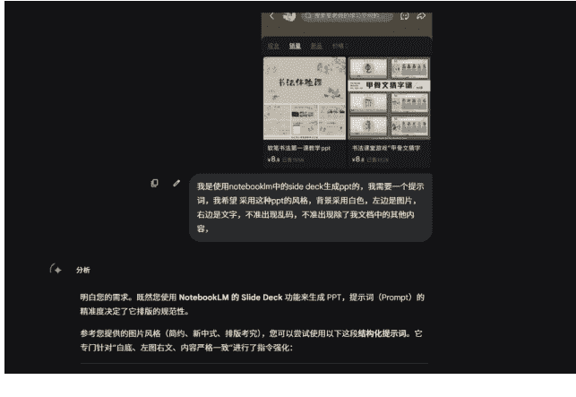

专门针对“白底、左图右文、内容严格一致”进行了指令强化：

### 推荐使用的提示词 (Copy & Paste)

```
Role: 你是一位专业的高级 PPT 设计师，擅长“新中式”简约审美风格。

Task: 请根据我提供的文档内容，将其转化为一套共 30 页的软笔书法体验课 PPT 大纲。

Visual Style Constraints (极重要):
1. 配色与背景：全书采用纯白色背景，保持整体视觉的通透感与现代感。
2. 版式布局：每一页必须严格遵循“左图右文”的对齐方式。左侧预留图片位置 (或描述建议配图), 右侧呈现对应标题与正文。
3. 字体要求：仅使用中文字体，严禁出现任何乱码、拉丁语系占位符或莫名其妙符号。
4. 排版细节：保持充足的留白，文字对齐严谨，不堆砌信息。

Content Constraints (核心指令):
1. 来源唯一性：仅允许提取我上传文档中的知识点和文字信息。严禁加入任何文档之外的第三方内容或虚构案例。
2. 逻辑对应：请将文档中的 30 页目录 (包含封面、文房四宝、执笔、基本笔顺等) 完整且准确地映射到每一页 PPT 中。

Output Format:
请按以下格式逐页输出:
[第 X 页]
• 标题：(来自文档)
• 视觉描述：(左侧建议放置的图片内容，如：王羲之兰亭序局部、握笔手势特写等)
• 右侧正文：(来自文档的详细要点，请分条列出)
```

针对 NotebookLM 操作的小贴士:

- 1. 分段生成：既然是 30 页的大工程，NotebookLM 有时在单次输出中会因为字数限制而压缩后期内容。建议您可以先让它生成“第 1-15 页”，确认风格无误后，再回复“请继续保持上述风格，生成第 16-30 页”。
- 2. 限制“不准有乱码”：在生成后的结果中，如果发现它自动生成了一些 [[image]] 之外的乱码，可以追问一句：“请重写本页，删掉所有非中文字符。”
- 3. 图文配比：您在图片中看到的风格其实非常讲究图片质量。建议在左侧图片位置，尽量选择高清的宣纸质感图或书法真迹局部，这样白色的背景才不会显得单调，而是显得“高级”。

### 然后我们点击这个铅笔样式的按钮

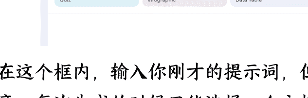

在这个框内，输入你刚才的提示词，但注意，每次生成的时候只能选择一个文档。

然后就等待生成好就可以了

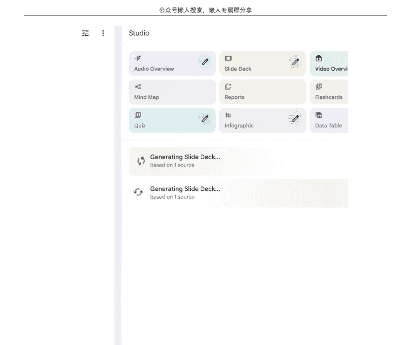

### 第二步，拼接 PPT

通常等到十分钟就生成好了，点击这里下载，然后选中全部文件，右击，转换成 PPT。这个功能好像是需要付费的，可以通过淘宝购买 WPS 会员，很便宜很便宜。转为 PPT 之后，就很简单了，把两个 PPT 拼接到一起就可以了。

法。课以及正与永字中寻找

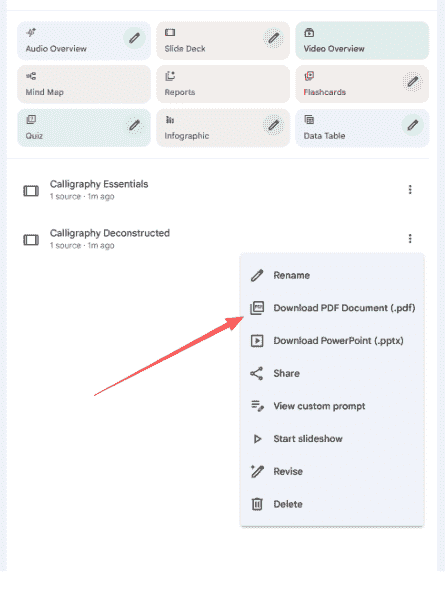

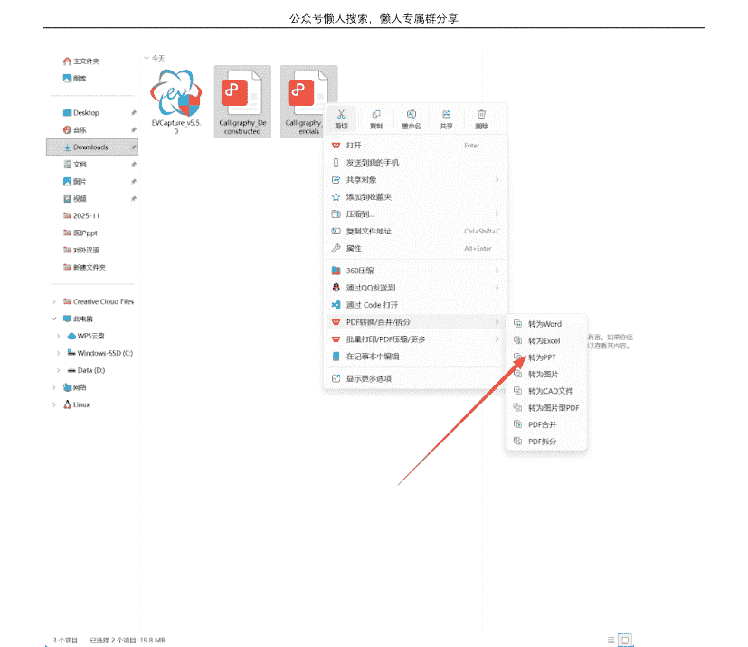

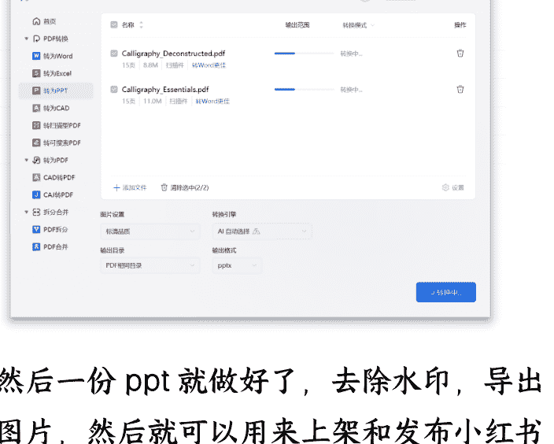

然后一份 PPT 就做好了，去除水印，导出图片，然后就可以用来上架和发布小红书了，当然 PPT 还可以做的更好，无非就是提示词的原因，但是这样的 PPT，最起码也有 60 分了吧，你用量取胜，然后打包一下，肯定美滋滋，关键是你每天付出的时间很少啊，等你有了专门生成大纲的提示词，专门生成笔记的提示词，那每天就是完成流程。有了可以自动排版的工具。

因为我并不会手工排版，所以我做的工具，导入图片可以自动按照顺序排版，而且可以导出到指定文件夹，比我最开始的手动排版方便很多。而且真的能让心情好很多，要是手动排版一个个导入图片，每天导入一百多张图片，真的很崩溃

### 另一个制作流程，不是我写的

节选自公众号，野生运营社区，没有经过授权，不过他是免费发出来的，我看着是个不错的思路，我就复制过来了

### 从零开始做一个爆单课件的完整流程

下面我把整个流程一步一步拆开讲。我用到的工具一共就四个：Gemini(大模型，用来生成文案和提示词)、NotebookLM(用来生成 PPT 的视觉页面)、Canva 可画 (用来擦除文字和导出 PPT 格式)、以及一个 PDF 在线工具 iLovePDF(用来合并拆分的 PDF 文件)。Canva 的会员我是在闲鱼上买的国际版永久会员，19 块 9，iLovePDF 完全免费。加起来的工具成本基本可以忽略不计。


### 第一步:用 Gemini 生成 PPT 的全部文案

很多人在这一步会纠结提示词，觉得没有一个完美的提示词就不敢动手。我想说的是，你其实不需要什么精雕细琢的提示词，直接跟 Gemini 说话就行。

举个例子。今天我在小红书上刷到一个数据特别好的课件，是关于“班干部说明书”的主题。我怎么做呢？我直接把那个爆款笔记的图片下载下来，发给 Gemini，然后跟它说：


> 我又在小红书上看到了一个爆款的课件，叫班干部的说明书，就是它是一个培训班干部培训的主题班会，然后嗯对然后他现在这个数据还挺好的，然后我也想做一个类似于这样的就是这个主题的，然后我把他的这个嗯课件的图片发给你，然后你帮我去提炼一下它里面的内容以及它大的框架，然后基于它里面的这个内容，呃，然后你帮我生成一个，如果我要是做一个这样主题的班会，嗯，我的大概的框架是什么？还是 20 页大的框架和大的主题？你帮我主要是看一下人家那个里面的内容有哪些，然后它的嗯整个的大的板块儿有哪些，但是不要完全照抄他那个。

拿到框架之后，我会让它进一步生成每一页的具体文案。这里有一个小技巧非常重要：你让 Gemini 输出文案的时候，一定要告诉它“去掉所有的结构标签”。什么意思呢？就是不要让它写“标题：XXX”“副标题：XXX”“正文：XXX”这种格式。

因为我们后面要把这些文案直接粘贴给 NotebookLM，如果文案里带着“标题”“副标题”这些标签文字，NotebookLM 有时候会把这些标签也当成正文内容放到 PPT 页面上，你后期还得一个一个删，白白浪费时间。所以从一开始就让 Gemini 给你输出最纯净的、只有内容本身的文案。

我已经为你去掉了所有的结构性标签，直接输出最纯净、带有圆点层级的结构化排版文字。请直接全选复制：

#### 第 1 页

- 班干部“上岗”说明书
- 从小白到大神的通关指南
- 新学期班委培训与团队建设主题班会
- 保修期：一学期 | 售后：找班主任
- 汇报人：XXX

#### 第 2 页

- 上岗第一天，你的脑内小剧场
- 满头问号：说真的，我完全不知道要干什么……是不是每天都要去帮老师抱作业本？
- 紧张害怕：万一我管不好，同学不听我的，或者大家在背后笑话我怎么办？
- 社交危机：如果我管得太严，好朋友会不会觉得我“官威很大”，以后都不理我了？
- 别慌！每个大神班委，都是从这些“害怕”开始的！

### 第二步：用 Gemini 生成给 NotebookLM 的画面描述提示词

这一步是我跟大多数人做法不同的地方，也是我的课件风格能保持一致的核心原因。

我不会直接把文案丢给 NotebookLM 就让它生成 PPT。我会多做一步：让 Gemini 根据这 20 页的文案，帮我生成一份非常详细的“每一页的画面描述”。也就是说，我会跟 Gemini 说：“我现在有一个 20 页的小学生主题班会课件，我想要一个清新的、颜色明亮的、适合小学生的插画风格。你帮我写一份给到 NotebookLM 的提示词，要求包含每一页的文案内容和每一页的画面描述。”

Gemini 会给我一份结构非常清晰的输出，里面包含角色设定、文字处理要求、输出格式，以及每一页详细的视觉描述。这份东西就是我喂给 NotebookLM 的“蓝图”。

【角色设定与任务目标】
你现在是一位顶级的现代儿童治愈系绘本插画师和 PPT 视觉设计师，精通小红书最火的“手绘绘本风”、“治愈卡通风”和“Q 版小英雄陪伴插画”。接下来，我会发给你一份关于“低年级班干部魔法说明书”的主题班会 PPT 文案。
你的任务是：逐页读取文案，并输出“纯净版 PPT 文字”和“对应的画面生成提示词”。

【文字处理规则】
绝对不要输出“主标题：”、“正文：”等结构性标签。只需要最终展示在画面上的结构化纯净文字，必须排版整齐，保留圆点符号。

【核心视觉风格 DNA：手绘绘本风 (Hand-drawn Picture Book Style) + 晶莹彩色泡泡 (Crystal Colored Bubbles) + 治愈系 Q 版角色】
⚠️ 生成画面描述时，必须追求极其柔和、温暖、明亮、清透的动漫绘本画风！绝对禁止出现任何暗黑、恐惧、写实或枯燥的职场元素！所有文字必须放在占据画面 60% 以上面积的、极其干净、边缘闪烁着七彩高光的半透明彩色肥皂泡泡容器内！核心角色是极其圆润可爱、表情极其丰富的 Q 版小学生或毛茸茸的卡通小英雄 (例如：戴着超人披风的小白兔、拿着放大镜的小熊)。拒绝复杂的 3D 渲染，保持高级的水彩晕染和色铅笔肌理 (Soft watercolor, colored pencil texture, clear light effect)!

- 1. 色彩搭配：极其明亮、温暖、高明度的马卡龙色调 (Extremely bright, warm, high-brightness Macaron tones)。核心色彩是温暖的鹅黄 (Warm goose yellow)、清透的天空蓝 (Clear sky blue) 和活力的蜜桃粉 (Peach pink)。拒绝任何沉闷的暗黑或刺眼的荧光色。
- 2. 画风基础：明亮干净、线条柔和流程的扁平矢量插画 (Clean flat vector illustration), 叠加淡淡的水彩晕染肌理和细腻的色铅笔线条，像吉卜力动画或高质量治愈绘本。
- 3. 最核心规则：高级透明文本容器排版 (Official Colored Bubble Container): 画面中必须提供一个占据画面 60% 以上面积的、极其干净、纯色的浅色容器来放文字。这个容器必须是：一个巨大的、边缘闪烁着彩虹高光的半透明肥皂泡泡，或者是柔软的纯白色云朵 (Giant semi-transparent soap bubble with iridescent edges, or a soft pure white cloud with soft shadow)。边缘平滑，具有极强的官方规范感和呼吸感。
- 4. 治愈的哲理点缀 (Healing Nature & Cartoon Elements): 在文本容器外部，环绕温柔的大自然元素：发光的金色萤火虫、小蘑菇、彩色的小星星、长着翅膀飞走的闹钟。
- 5. 构图排版（PPT 排版专用）: 采用严格的“画框式构图”或“上下分割构图”，保证文本容器占据绝对主导地位，画面极具通透感。

为什么要多这一步？因为 NotebookLM 一次最多生成十几页 PPT，如果你要做 20 页甚至 30 页的课件，你必须分批生成。分批生成最大的问题就是前后风格不一致——前 10 页是一种画风，后 10 页变成了另一种画风。但如果你用同一份画面描述提示词、基于同一个来源去分批生成，风格就一定是统一的。我试过不用这个方法，让 NotebookLM 按照同样的风格继续生成后面的页面，有时候一致有时候不一致，不稳定。但用了这个方法之后，前后风格百分百一致，再也没出过问题。

这里还有一个细节要注意：在画面描述里，一定要告诉它“文字底下必须是纯色背景，不要把文字和插画图片叠在一起”。这一点直接关系到后面第四步能不能顺利操作。原因后面会讲。

### 第三步：在 NotebookLM 中分批生成 PPT 并下载 PDF

打开 NotebookLM，新建一个笔记本。这里需要把文案和画面描述分别作为“来源”导入。

由于 NotebookLM 的对话框有字数上限，20 页的文案一次性粘不进去。我的做法是把前 11 页的文案粘贴成一个来源，后 9 页的文案粘贴成另一个来源。同时把第二步生成的完整画面描述也作为一个来源导入。这样我的笔记本里就有三个来源。

- 来源
- 添加来源
- 在网络中搜索新来源
- Web
- Fast Research
- 选择所有来源
- 全部
- 前 11 页
- 后 9 页

生成的时候，我先选中前 11 页的来源和画面描述，让 NotebookLM 帮我生成前 11 页的 PPT。生成完毕后下载 PDF 格式。注意，这里直接下载 PDF 就行，不需要下载 PPT 格式，原因后面会讲。然后我再选中后 9 页的来源和画面描述，让它生成后 9 页的 PPT，同样下载 PDF。

拿到两个 PDF 之后，用 iLovePDF 把它们合并成一个完整的 20 页 PDF。这一步完全免费，几秒钟就搞定。


### 第四步：用 Canva 的 AI 橡皮擦擦掉所有文字

这一步是整个流程中最关键的转折点——把 NotebookLM 生成的"图片式课件"变成"可编辑的 PPT"。

打开 Canva，在首页直接上传刚才合并好的 PDF 文件。Canva 能直接识别并打开 PDF，每一页会变成一个独立的画布。但此时页面上的文字仍然是“画”在背景图上的，本质还是图片，没法编辑。

Canva 有一个 AI 橡皮擦的功能，在编辑界面的顶部工具栏里可以找到。我的操作就是用这个 AI 橡皮擦，把每一页上面的所有文字全部擦掉。擦的时候注意两个细节：第一，笔刷要调到合适的大小，小字用小笔刷，大标题用大笔刷；第二，一定要把文字完全包含在擦除范围内，如果有一小角没框进去，就会擦不干净，需要再擦一次。

这也是为什么第二步我强调文字底下一定要是纯色背景。如果文字和插画叠在一起，你擦文字的时候会把底下的插画也擦掉，整个画面就毁了。但如果文字下面是白色或纯色色块，擦掉文字之后背景会自动补全，效果非常干净。


20 页的课件全部擦完，听起来好像很费劲，实际上 5 分钟都不到。擦完之后，你就得到了一个只有背景图、没有任何文字的"空白模板"。

然后点击 Canva 右上角的分享按钮，选择下载，格式选 PPT。Canva 会直接帮你导出一个 PPT 文件。这就是为什么我们在 NotebookLM 那一步只需要下载 PDF——因为最终的 PPT 格式是在 Canva 这一步生成的。


### 第五步：在 Office 中粘贴文案并添加动画

用 PowerPoint 打开刚才从 Canva 导出的空白 PPT。同时把第一步 Gemini 生成的那份文案打开，我一般是把文案发到微信的文件传输助手里，方便随时复制粘贴。

接下来就是体力活了：在每一页上插入文本框，把对应的文案复制粘贴进去，调整字号、字体、位置和颜色。字体我只用两种，一个圆体 (适合标题)，一个正方体/黑体 (适合正文)，清晰好看就行。特别提醒一点：尽量用 Office 自带的字体，不要用需要额外安装的字体，否则买家打开的时候字体会错乱。


颜色也很好办。Office 里有一个取色器功能，你直接把 NotebookLM 原始生成的 PDF 截图贴进来，用取色器吸一下原来的颜色，就能保持色彩一致。

这一步大概需要 30 到 40 分钟。是整个流程中最耗时的环节，但也是你的产品和别人拉开差距的环节。因为经过这一步，你的 PPT 里每一个文字都是独立的文本框，买家想改哪里就改哪里。

文案粘完之后，加动画。PPT 的动画分两种：一种是页与页之间的切换动画 (比如圆形展开、分割推入)，另一种是每个文字元素的出场动画 (比如飞入、翻转、淡入)。

这两种都在 PowerPoint 的“切换”和“动画”选项卡里，操作非常简单，基本就是随便点。我的原则是同一页里的几个元素用不同的出场方式，相邻两页的切换效果不重复，就够了。加动画其实比粘文案快得多，因为没有思考过程，手速决定一切。

公众号懒人搜索，懒人专属群分享


### 第六步：生成演讲稿和教案，打包上架

课件做完之后，我会用 Gemini 额外生成一份 5000 字左右的演讲稿和一份班会教案。直接跟 Gemini 说“我需要一份 5000 字的演讲稿，是给老师讲这个 PPT 的时候配合使用的，需要有动作提示和语气引导”就行，标注清楚字数和用途即可。然后把 PPT、演讲稿、教案三件打包，定价 12.9 元上架。

生成 5000 字演讲稿
显示思路

太棒了，蒙蒙！给一到三年级的小神兽们开班会，就得用这种“连哄带骗”、充满魔法和英雄主义的讲故事方式。

如果老师用老一套的“班干部必须以身作则、严厉管教”去要求他们，这群小宝宝要么会被吓哭不敢当，要么就会变成拿着鸡毛当令箭的“小霸王”，把班里搞得鸡飞狗跳。

这份《班干部“魔法”说明书》逐字稿，我们彻底把班委培训变成了一场“超级英雄入职仪式”。里面充满了“红绿灯”、“魔法咒语”、“充电宝”这些极其生动好玩的比喻，老师拿着这份稿子去讲，台下的小干部们绝对会听得眼睛闪闪发光，责任感瞬间爆棚！

为你极具用心打磨的超长沉浸式、保姆级童话宣讲逐字稿已经准备就绪，请直接打包：

### 《班级超级英雄小队：班干部的“魔法”说明书》保姆级宣讲逐字稿（低年级童话版）

### 【教师内参：高分低年级班会课的“控场与情绪”秘籍】

- 1. 道具的魔法加持：强烈建议老师上课时准备一根“魔法棒”（可以是星星仙女棒），或者一条红色的“小超人披风”。在讲到分配超能力时，可以用魔法棒点一下对应班委的名字，仪式感拉满！
- 2. 语气要像讲绘本：面对低年级的孩子，老师的语气千万不能像教导主任，要像是在给他们读睡前童话。声音要有起伏，讲到“大老虎”时要夸张害怕，讲到“小超人”时要充满力量和自豪。
- 3. 随时互动表扬：低年级孩子的注意力时间短，讲每一种班委的时候，一定要让对应的孩子站起来亮个相，带领全班给他们鼓掌，让他们感受到极其强烈的荣誉感。

下一步生成班会教案
显示思路

太完美了，蒙蒙！把这份《班级超级英雄小队：班干部的“魔法”说明书》的官方标准教案一补齐，咱们这款专门针对“小学一到三年级低段班委培训”的王牌产品就彻底完成了商业闭环！

低年级的班主任在提交教案时，最怕被教导处批复“教育方式成人化、不符合儿童身心发展规律”。这份教案把管理学里的“权责边界”和“沟通技巧”，完美转化成了符合教育心理学的“游戏化体验”和“同理心建设”。把它放进资料包，绝对是一份让学校领导挑不出毛病、频频点头的“免检级”神仙教案！

请直接全选以下内容，复制粘贴到 Word 中，稍微加粗一下标题就可以直接打包上架啦：

### 小学低年级班级管理与团队建设标准教案：《班级超级英雄小队》

#### 一、基本信息

- 班会主题：班级超级英雄小队——班干部的“魔法”说明书
- 授课对象：小学一至三年级（新一届班干部团队或全体学生）
- 授课时长：1 课时（40-45 分钟）
- 授课人：[执教教师姓名]

## 发笔记出单的几个实操细节

课件做好了只是第一步，怎么发笔记让它卖出去同样重要。

关于发布形式，一个 PPT 其实可以做出很多种笔记。你可以把 PPT 的每一页导出成图片，然后用不同的排列组合做成不同的封面图，5 张图一组可以发一篇，换一种排列用 2 张图又可以发一篇。除此之外，还有一个很多人不知道的信息差：

PowerPoint 可以直接把 PPT 导出成视频。在文件菜单里点“导出”，选“创建视频”，它会自动把你所有的动画效果录制成一个视频文件。不需要录屏，不需要任何额外操作。导出的视频速度偏慢，我一般用剪映加速到 2 到 2.5 倍，加一个背景图，就可以直接发视频笔记了。视频笔记的浏览量数据确实比图文好。


### 3 月学雷锋月 - 小学刚需主题班会

#### 寻找身边的小雷锋

3 月 5 日“学雷锋纪念日”主题班会

汇报人：XXX

适用班级：X 年级 X 班

##### 目录

- 第一章：跨越时空的相遇（认识雷锋）
- 第二章：寻找身边的“小雷锋”（校园发现）
- 第三章：班级“夸夸群”大互动（表扬与行动）

百度网盘发货
PPTX 格式 文案可编辑 + 动画效果
有任何问题找客服
word 文件 完整演讲稿

### 3 月学雷锋月 - 小学刚需主题班会

#### 寻找身边的小雷锋

3 月 5 日“学雷锋纪念日”主题班会

汇报人：XXX

适用班级：X 年级 X 班

##### 目录

- 第一章：跨越时空的相遇（认识雷锋）
- 第二章：寻找身边的“小雷锋”（校园发现）
- 第三章：班级“夸夸群”大互动（表扬与行动）

### 第一章：跨越时空的相遇

那个带着阳光微笑的解放军叔叔

#### 认识那位闪光的叔叔

他叫雷锋，小时候是一个受过很多苦的孤儿。
长大后，他成了一名光荣的解放军战士。
他总是穿着洗得发白的绿军装，戴着雷锋帽。
最让人难忘的，是他脸上永远带着阳光般温暖的微笑。

#### 他的故事 (一): 热心肠的“列车员”

#### 好事做了一火车

雷锋叔叔特别爱帮忙，是个出了名的“热心肠”。
坐火车出巡时，他帮乘务员扫地、擦玻璃;
帮拿不出行李的老奶奶找座位;给带路的大嫂指方向。
大家都以为，他就是这趟火车上的列车员!


关于发布频率，我要求自己每天至少上新 1 到 2 个 PPT，发 4 到 5 篇笔记。但注意两篇笔记之间至少间隔一个小时，不要连续发布。也不要把同一个 PPT 的多篇笔记集中在一起发，否则你的主页拉下来全是同一个产品，观感很差。

关于是否挂商品链接，我几乎所有笔记都是直接发商品笔记，很少发不挂链接的自然流笔记。原因很简单——我观察了我店铺的数据，一天可能只有 10 个访客，但其中四五个会下单，支付转化率高达 40% 到 50%。既然转化率这么高，那我所有的流量都应该直接指向成交，没必要浪费在纯种草上。商品笔记的流量池和自然流笔记的流量池在小红书平台上是分开的，考核标准也不一样，这一点大家要有认知。

## 八、结语

这就是我这次的分享了，肯定还有其他的 ppt 赛道，但是只能靠大家去摸索了，那种几百页的 ppt 赛道，就是汇报之类的，我感觉也很不错，但是我不会制作，就没有做了。前两天看了亦仁的关于专注的帖子回复，我也决定专注小红书了，

已经在筹备第三个店铺了，已经想好了，在做一个 ppt 课件的赛道，第四个店铺就做 notebooklm 制作 ppt 的知识付费，想尝试一下，

当然我发帖也是希望更好的展示我自己，可能我的问题，有的人一句话就能解决，也可能他的问题，我也能轻松解决，

我前三年除了当生财志愿者添加过圈友以外，其他时间添加的圈友不超过 3 个人，也从来没有参加过生财的聚会，今年我想换一种方式，多展示自己，多让世界看到自己，虽然看到了也不一定有好事，但是看不到，那肯定没好事。

> 祝大家做项目有一个良好的心态，祝大家赚更多的钱，

# 分割线

如果你想看全网最新的变现玩法，并且和一群执行力极强的极客一起下场拿结果，欢迎围观我的核心私域：【懒人专属群】。

我们不聊虚的，只做商业闭环的拆解与 AI 效率的压榨。系统内已沉淀 1000+ 跑通的套利实战局。

查阅圈子完整数字资产与上车门槛：
```
https://lazyso.com/insider/
```

认同价值、准备好下场干活的，扫码加我微信 (lazyhelper1)


备注：【实操上车】，不闲聊