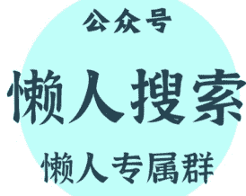

# 2026 年 4 月 7 日，美以伊战争第 39 天。

## 260408 卢克文星球

整理：公众号懒人搜索，懒人专属群精选

懒人微信：lazyhelper1

这一天，特朗普设定的"最后期限"到了。

### 一、凌晨：导弹落在以色列南部

4 月 7 日凌晨，以色列国防军发表声明：伊朗向以色列发射导弹。以军监测到导弹飞向贝尔谢巴、迪莫纳、阿拉德和奥法基姆地区，内盖夫地区拉响防空警报。伊朗媒体称，这是"真实承诺 -4"行动第 98 波攻势的一部分。

此前 24 小时，伊朗已对海法湾地区的炼油设施、电力系统、港口及铁路发动大规模导弹打击。伊朗伊斯兰革命卫队航空航天部队司令称，海法已被

4 月 4 日，伊朗导弹碎片曾落入特拉维夫基里亚军事基地附近——那里是以色列国防军总部所在地。4 月 7 日的导弹，落在更南部的内盖夫沙漠，靠近迪莫纳核设施。

### 二、上午：特朗普的倒计时

华盛顿时间 4 月 6 日，特朗普在白宫记者会重申：美东时间 4 月 7 日 20 时，是最后期限。若美伊未能达成协议，美军将摧毁伊朗境内所有桥梁和发电厂。

"他们 (伊朗) 的期限到明天，"特朗普说，"看看接下来会发生什么吧。"

这是特朗普第三次推迟期限。最初"限时 48 小时"，后延至 4 月 6 日 20 时，再推迟一天。4 月 5 日，他曾在社交媒体发帖:"4 月 7 日将是伊朗的发电厂日和大桥日"。

记者会上，特朗普点名盟友。他赞扬科威特、卡塔尔、沙特阿拉伯是"良好合作伙伴"，同时质问日本、韩国、澳大利亚:"还有谁？还有谁？还有谁？"——暗示这些国家对美国的军事支持应当回报。

国防部长赫格塞恩、参联会主席凯恩、中情局局长拉特克利夫陪同出席。他们通报了营救两名美军 F-15 战机飞行员的情况——这两名飞行员此前在伊朗境内被击落，经阿曼被接回。

### 三、中午：霍尔木兹的通道

4 月 7 日，霍尔木兹海峡出现新动向。海事数据平台 MarineTraffic 显示，刚刚过去的周末，共有 21 艘船只通过海峡，其中周六 10 艘、周日 11 艘。这是 3 月初航运停滞以来的最高两日总量。

英国海事分析公司温沃德报告，海峡通行已转为“双通道系统”：北部由伊朗伊斯兰革命卫队控制，南部沿阿曼海岸形成新通道。4 月 5 日，11 艘船舶穿越海峡，其中 5 艘走北部通道，3 艘走南部通道。

伊朗方面，议长顾问迈赫迪·穆罕默迪称，伊朗“显然已经赢得了战争”，只接受“巩固战果并在地区建立新安全体系”的终战局面。伊朗军方发言人表示，只要政治领导层认为“合适”，就能继续战争。

伊朗常驻联合国代表致信秘书长古特雷斯，抗议特朗普的“战争性言论”，称其可能构成对恐怖主义直接煽动。

### 四、下午：谈判与僵局

4 月 7 日下午，美官员称美伊达成停火协议“希望渐灭”。一些美国官员表示，在特朗普设定的最后期限到来前，双方立场“差距过大，难以缩小”。阿拉伯国家官员称，伊朗已告诉调解方，即使谈判取得进展，预计美国将继续袭击，以色列也将继续“清除”伊朗高级官员。

特朗普的谈判通过巴基斯坦、埃及、土耳其调解人进行，其顾问与伊朗外长阿拉格齐有直接沟通。特朗普称，特使威特科夫和女婿库什纳正在与伊朗密集谈判。

但伊朗排除临时停火可能，强调必须永久结束冲突。伊朗议会的国家安全委员会已开始审议一项方案，旨在为霍尔木兹海峡制定新安排及法律框架——这意味着即使谈判成功，海峡也不会回到战前状态。

### 五、当日伤亡与损失

伊朗教育部长卡泽米称，美以军事行动以来，全国共 310 名学生和教师遇难。

伊朗军方声明，4 名军官前一天在伊斯法罕省南部对抗美军搜救行动时身亡。

伊朗称，过去 24 小时使用无人机打击了美军位于沙特海尔季绿洲的军事基地和科威特乌代里的直升机基地。

美国资本参与的沙特东北部朱拜勒工业区发生爆炸，遭到大范围打击。

### 六、一句话总结

4 月 7 日，特朗普的最后期限到来，导弹仍在飞，谈判仍在拖。霍尔木兹海峡出现了 21 艘船的周末通行量，但伊朗议会正在制定海峡的"新法律框架"——这意味着即使停火，这条全球能源咽喉也不会回到从前。特朗普威胁炸毁伊朗所有桥梁和发电厂，伊朗称只接受"巩固战果"的终战。双方立场差距过大，最后期限可能再次推迟，也可能成为全面升级的起点。

## 分割线

绝大多数人只盯着眼前的工资，却不知道一次远在中东的冲突、一次降息的决议，就能在一夜之间洗牌普通人的财富。

看懂宏观，是为了在周期切换时，不被当作代价。

如果你认同这种“抬头看路”的长期主义，欢迎围观我的个人情报智库：【懒人专属群】。

圈子已稳定运行 7 年。我们每天利用 Python 爬虫与大模型算力，过滤全网最顶级的政经内参和搞钱风向标，做你最冷酷的“外部大脑”。

查阅圈子完整数字资产与上车门槛:

https://lazyso.com/insider/

认同价值的。扫码加我微信，备注：【进群】

微信:lazyhelper1