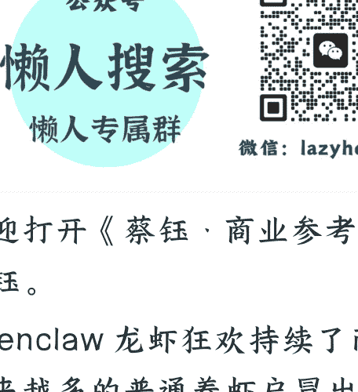

# 260 | AI 时代，如何拥有你的“问题资源”

260409

整理：公众号懒人搜索，**懒人专属群**精选

懒人微信：lazyhelperl

欢迎打开《蔡钰·商业参考 4》, 我是蔡钰。

Openclaw 龙虾狂欢持续了两周以后，越来越多的普通养虾户冒出了一个问
题：龙虾真的有那么神吗？我怎么感觉没多大用处？

对应着这个问题，有人说，全国一半的龙虾每天在忙着给主人发天气预报，另一半的龙虾每天忙着给主人发新闻简报，而这本来是我们手机里免费就有的。

这个问题，我认为挺有意义，值得借来聊聊我们自己。它的潜台词其实又可以拆成两种：

第一种，我们没有掌握足够技巧，来让龙虾施展发挥。

第二种，我们没有合适的问题，交给龙虾去解决。

## 优先调教 AI 导师

第二种潜台词，是真正有意思的，值得我们展开讲讲。

> > 第一件，把原本划拨给龙虾的时间和预算拿出来，去订阅一个顶级大语言模型，给自己搭建和调教一个特别懂你的 AI 导师。

AI 员工和 AI 导师有什么不同？AI 员工是替你干活儿的，是把你腾出来，让事情没你也要能运转，问题没你也能解决。而 AI 导师是帮你出主意的，是为你解惑、完善框架，帮你当好那个发现问题、解决问题的英雄。

再直接点说：

员工是替代你，而导师是增强你的。既然暂时没有事情需要交给龙虾办，我们也不必急着燃烧工资把它变聪明。不如改成请赛博芒格喝电子烧酒，让它帮你找到真问题，找到值得组建 AI 员工去干的事儿。你说呢？

> > 第二件，走出门去，去生活，也感受别人的生活，给自己积攒各种问题资源。

你肯定注意到了，我用了“问题资源”这个说法。是的，当答案不再匮乏，问题就成了一种资源。这是到了 AI 时代，你该意识到的真相。

### 把问题当作资源

为什么说问题是资源？

举个例子：我们如果始终生活在国内，大概率会觉得哪种外语都比汉语难学。因为我们没有必要靠英语才能解决的问题。相反，再学渣的中国人，也能流利说汉语、秒懂成语和网络热梗，是因为每天都要用汉语来解决生活问题。

你看，在学外语这个处境里，问题，是变强的资源。

在过去的很多年里，我们不把问题当资源，更多是看成麻烦。这是因为，当时的我们一来想不出办法，二来能力有限。而今天，信息网络和 AI 算力已可以让人人拥有最强大脑。在这种处境里，好答案开始把更多的问题转化成资源。

举个例子：一个普普通通的小明，也完全可以要求龙虾去收集中国最好的 500 家公司的招聘需求，找出需求最大的人才画像，再让龙虾按照画像设计出培训方案、培训课程，花三个月把自己变合格。

类似的，先想出用 AI 做玄幻短剧的人，先想出用龙虾去 Polymarket 代理赌博的人，也都是借助 AI，把问题变成资源。

### 好问题模板

那么，在 AI 时代，问题意识和提问能力，指的就是把提示词用得炉火纯青、熟悉各种行业术语的能力吗？

不全是。判断标准应该是，这个问题逼出来的答案，能否创造价值。

从实用角度出发，有一类好问题的通用模板是这样的：

好问题=具体困境/欲望+怎么办

想解决困境或欲望，就是在对抗熵增，创造价值。去追问怎么办，就是在寻求问题资源的变现。

这其中的“怎么办”，今天的 AI 已经可以给出不错的答案。而其中的“欲望或困境”，AI 给不了，要靠我们回到自己和他人的生活里去感知和识别。

最近，我看到一个有意思的产品创新：飞行救生圈，就是给救生圈加上无人机轮翼，让它飞出去，自己掉落在落水者身旁。这是识别出了谁的问题？不是落水者，而是想救人却无能为力的人的问题。

再举个私人例子：2026 年我遇到了一个不大不小的棘手问题——孩子有只眼睛近视了。一开始，这让我相当破防，因为我们全家往上三四代，没有一个人近视，全家对此毫无知识储备，也毫无心理准备，而家里的幼崽就这么华丽丽破功了。

这事儿让我辗转反侧好几天，到处问小孩近视了怎么办，刷了一堆相关文献和网络笔记。你看，“具体的困境 + 怎么办”，前面提到的好问题模版。

结果这么刷下来，我就发现，原来针对小孩近视，市场上有那么多解决方案，什么离焦框架镜、离焦软镜、OK 镜、翻转拍、针灸眼操、各种光学的拉远镜和读写台，还有所有人都推崇的每天户外活动 2 小时，等等等等。

你看，那么多成熟供给，都在把小孩近视问题当作资源，来建构商业模式。我发现了一个很好的问题，但它被很多更早的聪明人，用那么多的解决方案转化成了资源。

### 一人公司的成立前提，也是这家公司拥有至少一个足够好的问题资源

不过，如果我们再往深了挖，仍然有转化资源的机会。

比方说，前面不是说了，防控近视的一大共识是“每天 2 小时户外活动”么。这个方案，翻过来又成了一个新的问题：这两三个小时可以怎么度过，能让大人小孩都觉得有意思、有意义，日复一日进行也不腻味，始终愿意出门？

套用模板，我们其实是在追问：在户外两三小时，辛苦/无聊/难以坚持/时间不够用，怎么办。

要回答这个问题，思路就多了。可以设计不同路线、不同活动，或者把一些原本在室内必须进行的事项搬到户外，或者干脆替家长把孩子接走。

如果我拉着你，去发起一个“2 小时户外”教培项目，那我们就从几个遇到麻烦的人，变成了一群拥有问题资源的人，成了全国近视家庭的帮手。

在项目展开过程中，我们手里的问题资源，可能还会繁殖出新的问题资源。类似的，如果你关注入境医疗热潮，关注过敏人群的各种自救，只要不断套用“困境/欲望 + 怎么办”这个问题模板，根本不会担心 AI 导师和龙虾能不能派上用场。

这也是为什么我建议你，先放下龙虾，把注意力重新放回线下，去感知自己和别人的生活困扰。你作为传感器去发现和识别问题，你的 AI 导师回答“怎么办”，你的龙虾员工才有活儿可干。

### 你和问题的能级匹配

但是，虽然“具体困境 + 怎么办= 好问题”，但它不一定是属于你和我好的问题，我们还要评估的一件事是，解决问题所需要的资源和能量，跟我们的能级是不是匹配。

在专栏第 70 讲（《稳定内核四要素：利益》），我们解释过个人与所在系统能级匹配的问题。这个逻辑放在我们和问题的关系也是一样的：

两只麻雀抢虫子，对麻雀来说是真问题，但事儿太小了，人类 110 没必要出警；人口出生率下降太快，确实影响我们每个人的未来生活，但事儿太大了，普通人想得出办法也推不动。

我前两天看到一个段子：有人说，美伊战争里，伊朗关闭了霍尔木兹海峡，影响到了美国利益。美国可以想办法让海平面上涨 150 米，淹没阿联酋、淹过沙特和阿曼的部分国土，就能得到一个备用的霍尔木兹海峡。这个主意简直天才，但纵然是美国也办不到，它也没办法把问题转化成资源。

### 总结

好，这是 2026 年这轮龙虾热潮里，我建议你先想清楚的一件事：在组建龙虾队伍之前，你是不是拥有了属于你的问题资源。

在我看来说，认为龙虾没用是合理的，但龙虾也不是泡沫。

我更想提醒你的的是，今天市场上、行业里这些借助龙虾获得大量工作红利的高手们，傅盛也好，快刀也好，各种企业和投资者也好，共同点都是已经拥有确定的问题资源。我们跟他们的真正差距，不在于龙虾，而在于拥有多少好问题。

在这股龙虾热潮里，硅谷还有人创建了一个名叫“雇佣人类”的网站。干嘛的？让有活儿可干的“龙虾”们，自己去雇佣人类零工，去线下跑腿、去现场拍照，搞定工作流中它们跨不过去的物理障碍。

你看，这不仅仅是技术进步，这简直是生产关系的倒置。当龙虾拥有了问题，人类反而成了它们眼中的 Agent。

这也意味着，谁拥有问题，谁就拥有调度他人与系统的权力。

今天把龙虾用得再溜的人，如果不拥有问题资源，在明天的 AI 时代里，也仍有可能变成 AI 的跑腿小哥。

我们是希望被系统调用，还是调用系统？如果是后者，那么最值得我们锤炼的能力，依然是回到真实生活里去感知困境、识别问题、把问题转化成资源的能力。

说得再直接一点：当我们开始重新关心自己和他人，对生活里的那些不对劲变得敏感，愿意追问事情为什么会这样，忍不住想把它解决掉，我们手里的问题资源，就已经在积累了。

让屠龙术真正变得重要的，是找到你的龙。

第四季专栏这就结束了，在暂别的时间里，咱们各自找龙去吧。

白了个白了。

如果不知道用龙虾干什么，可以做两件事：

- 订阅一个顶级大语言模型，给自己搭建和调教一个特别懂你的 AI 导师。
- 走出门去，去生活，也感受别人的生活，积攒问题资源。谁拥有问题，谁就拥有调度他人与系统的权力。

————分割线————

在这个 AI 能替你写代码、写文章的时代，基础技能正在迅速贬值。绝大多数人正被淹没在海量的免费垃圾信息里，陷入低效的体力内卷。

当“努力”不再是壁垒，人与人之间唯一的护城河，只剩下“信息过滤”的效率与“认知系统”的维度。

圈子已稳定运行 7 年。我们每天利用 Python 爬虫与大模型算力，过滤全网最顶级的政经内参和搞钱风向标，做你最冷酷的“外部大脑”。

如果你认同这种“重塑认知防线”的极客主义，欢迎围观我的个人情报智库：【懒人专属群】。

https://lazyso.com/insider/