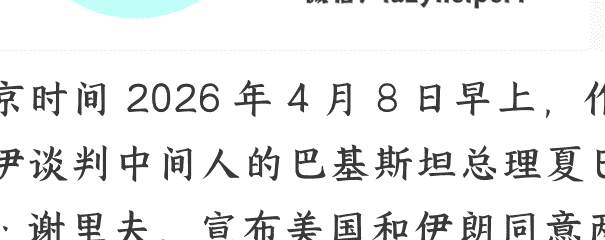

# 美伊停火两周，伊朗获得了什么好处？

260409 文/卢克文工作室嘉宾 风雨如歌

整理：公众号懒人搜索，懒人专属群精选

懒人微信：lazyhelper1

北京时间 2026 年 4 月 8 日早上，作为美伊谈判中间人的巴基斯坦总理夏巴兹 · 谢里夫，宣布美国和伊朗同意两周的临时停火。

4 月 10 日，两国代表将前往巴基斯坦首都伊斯兰堡，开启正式谈判。

不久后，以色列表示尊重停火协议，加入停火。

就在前一天晚上，特朗普威胁要对伊朗的桥梁和发电厂进行大规模轰炸，4 月 8 日将成为伊朗的“桥梁日”和“发电厂日”，还威胁要让波斯文明消亡。

由于双方谈判条件相差太远，没人看好停火协议的达成。

结果，短短十个小时不到，事情竟然大反转了。

## 01

美伊谈判开始于 3 月 25 日，由巴基斯坦充当中间人，双方起初态度强硬，

美国抛出“十五条”，伊朗针锋相对，提出“十点要求”。

美国的“十五条”，官方没有公布正式文本。

不过，外界能猜到大致内容，比如伊朗销毁弹道导弹、停止支持“抵抗之弧”、开放霍尔木兹海峡、拆除核设施、永不研发核武器等等;

伊朗的“十点要求”分别是：

- （1）通过霍尔木兹海峡必须与伊朗武装部队协调；
- （2）结束以色列对“抵抗之弧”所有成员的战争;
- （3）美国从中东撤出所有军事基地;
- （4）赔偿伊朗战争损失;
- （5）解除针对伊朗的一级制裁;
- （6）解除针对伊朗的二级制裁;
- （7）取消有关制裁伊朗的安理会决议;
- （8）归还所有伊朗被冻结的资产和财产;
- （9）在霍尔木兹海峡建立安全过境议定书，确保伊朗享有主导地位;
- （10）以上这些事项，都应在安理会决议中得到批准。

美以不可能答应伊朗的全部要求，因此，双方进行了一轮又一轮的较量。

到 4 月初，有些要求双方同意先不谈，有些则愿意让步。唯独三个方面，双方始终不松口。

+ 第一个方面：制裁。

“十点要求”中的（5）（6）（7）合起来，就是伊朗要求美国解除所有制裁；涉及工业、投资、贸易、金融、境外资产、能源等方方面面。

金融上，允许伊朗银行系统重返 Swift，由于 Swift 覆盖世界上大部分国家的银行系统，不接入 Swift，伊朗企业在出口时很难结算，严重妨碍贸易开展；境外资产上，伊朗被美国及其盟友冻结的资产，大约 1000 到 1200 亿美元，伊朗要求解除冻结，把这些资产全部归还给伊朗；

能源出口上，伊朗的石油出口受到很大限制。

比如隔壁的印度，作为能源消耗大户，按理说应该买不少伊朗石油。但 2019 年到 2025 年这六年间，印度没买过哪怕一滴伊朗石油，原因就是害怕美国制裁。

投资上，特朗普上台后，对道达尔发出威胁，胆敢投资，将面临严厉制裁，道达尔被迫退出。伊朗油气产量多年上不去，是有原因的。

工业上，大部分设备和零部件，伊朗无法进口，包括芯片、数控机床、半导体制造设备、航空发动机、燃气轮机、导航设备、高精度检测仪器、工业软件等等。

西方对伊朗的制裁总数，大约 5000 多项，数量远不及俄罗斯的 2.8 万项，但俄罗斯遭遇的制裁，绝大部分针对个人、寡头和某个公司。

而伊朗身上的制裁，大部分属于“全行业性质”，动不动就整个行业被拉黑，不能进口，也难以出口，真正的无死角、全方位绞杀。

持续数十年的绞杀，导致伊朗经济萎靡不振。

伊朗要求美国一次性解除5000多项制裁，以获得正常的发展环境。

第二个方面：停战，也就是第（2）条。

伊朗要求整个地区“同步停火”，不仅是美以和伊朗之间进行停火，以色列军队还得从黎巴嫩、加沙撤出，停火协议生效后，不准打击黎巴嫩、加沙、伊拉克和也门。

目前，哈马斯的处境艰难。

2025 年起，以色列在加沙推行“黄线”政策。“黄线”就是一道黄色的“隔离墙”，从南往北，贯穿整个加沙，上面部署有监控和自动射击设备。

“黄线”以东，被以色列军队控制，加沙民众未经同意不准进入。哈马斯只控制着“黄线”以西。

这样一来，加沙东半部（约占加沙面积 53%），落入了以色列军队手中，剩下的 47%，也不全是哈马斯控制。

IDF 还在加沙中部走廊，修建了 10 余个军事据点，分割加沙南北，“黄线”和中部走廊据点配合，等于加沙地区被切成了东、西、南、北四个部分。

每个部分，都是一座露天监狱，哈马斯的兵力和物资根本没法正常调动，日子过得格外艰难。

真主党的形势也不乐观。

尽管 IDF 在黎巴嫩损失了近百辆装甲车，步兵更是闹了一出又一出的笑话，但靠着兵力和空中优势，依旧攻占了 10 余个村庄，先头部队到达利塔尼河。

要是 IDF 铁了心不走，凭真主党的实力，想要把这些村庄夺回来，难度非常大。

要是加沙的哈马斯、黎巴嫩的真主党都被打垮，伊朗在中东的影响力会大幅削弱。伊朗要求同步停火，是为了保住“抵抗之弧”。

第三个方面：霍尔木兹海峡。

伊朗表示，可以解除对海峡的封锁，但必须收取通行费，费用分五个档次：

| 档次 | 国家/类别 | 费用 |
| :--- | :--- | :--- |
| 第一档 | 伊朗认定的友好国家（如俄罗斯、巴基斯坦） | 免费通行或象征性交一点 |
| 第二档 | 普通中立国家（不偏向任何一方） | 15 万至 20 万美元 |
| 第三档 | 与伊朗无明显敌对，但有间接合作的国家 | 30 万至 50 万美元 |
| 第四档 | 美国的盟友 | 150 万至 200 万美元 |
| 第五档 | 美国、以色列及参与制裁伊朗的国家 | 直接禁止通行 |

伊朗之前一直要求美国赔偿 2000 亿美元的战争损失，既然美国不愿意赔偿，伊朗战后重建又需要一大笔钱，那就用海峡通行费来替代。

对于伊朗的三个要求，美国和以色列态度强硬。

## 02

伊朗在经济不振的情况下，还能发展出强大的导弹工业，如果解除所有制裁，让伊朗发育起来，导弹的数量和质量肯定会上一个台阶，威胁太大了。

所以，美国只同意解除部分制裁，主要是和石油出口相关的制裁。“同步停火”也不可能答应。

从“阿克萨洪水”至今，两年多时间，以色列花费无数人力、物力、财力，付出了巨大的代价，好不容易把哈马斯逼入了绝境。

要是“同步停火”, 两年多的仗岂不是白打了？

至于由伊朗收取霍尔木兹海峡通行费，等于承认伊朗对海峡的控制权，美国也不太乐意。双方这几天的拉锯，主要围绕上面三个方面。

4 月 7 日，为迫使伊朗让步，美以联军对伊朗的桥梁进行了大规模轰炸，还打击了哈克尔岛。

伊朗也打击了沙特朱拜勒工业区，导弹命中的园区内一座美国陶氏化学的工厂，威胁封锁曼德海峡，给全球的通胀再上点强度。

4 月 8 日，事情峰回路转，双方达成 15 天临时停火协议。

很多人说，特朗普答应了伊朗的“十点要求”，这是错误的理解，特朗普只是说可以谈，用脚指头想想都知道，他不可能全部答应，否则还用出来混？

综合各方信息，可以确认，为换取伊朗同意停火，特朗普默许伊朗控制霍尔木兹海峡，其他要求先按下不谈。真正的谈判 4 月 10 日开始。

即便只是临时停火协议，伊朗获得的好处也足够大了。

伊朗最大的问题，是经济萎靡不振。过去 25 年，伊朗年均 GDP 增长率，仅为 3%，这个数字远远不够，IMF 测算，至少需要 4.5% 甚至 5% 的增长，才能满足国内的就业和民生需求。

伊朗为啥内部动荡那么多？关键就是经济不好。

在美国制裁下，伊朗的通胀率动不动就超过 20%，产业无法正常发展，失业率常年高企，社会怨声载道，可不得把矛头指向体制？

而控制霍尔木兹海峡后，伊朗经济有望得到改善。

首先，通行费大赚一笔。

伊朗究竟能收多少钱，尚不清楚，但我们可以按“苏伊士运河”的标准算一算。

**正常年份**，苏伊士运河的年度收入约一百亿美元，年通过量 15 亿吨上下，平均每吨通行费 6.6 美元。

***霍尔木兹海峡年通过量超 30 亿吨***，按每吨 6.6 美元算，光通行费，就能赚 180 亿美元，伊朗和阿曼平分，那就是各自得到 90 亿美元。

加上其他杂七杂八的费用，比如领航服务，赚个一百亿美元不成问题。

2025 年末，伊朗内部闹起来的直接原因，就是政府面临财政危机，希望削减 30 亿油气补贴，结果民众不干了。

有了通行费这笔收入，30 亿美元还叫个事？

其次，是通胀稳定，产业发展。

3 月 30 日，伊朗通过《霍尔木兹海峡通行管理法案》，明确通行费的法定结算货币为伊朗“里亚尔”，可接受人民币、稳定币作为补充。

手上没有里亚尔，海峡你就过不了。

这个举措，和俄罗斯 2022 年的“天然气卢布”有异曲同工之妙。区别在于，卢布锚定的是俄罗斯天然气，里亚尔锚定的是海峡通行权。

里亚尔由此成为区域硬通货，伊朗的通胀和产业发展都会得到改善。

伊朗通胀为啥常年高？美国一制裁，里亚尔就会严重贬值，进口成本上升，当里亚尔成为中东硬通货，稳定性会大幅提高，通胀率不会再动不动飙升至 20%。

伴随着里亚尔成为中东硬通货，美国制裁的效果，会有明显削弱。

里亚尔国际化后，伊朗的进出口贸易，将摆脱对美元和 Swift 系统的依赖。作为一个教育水平不低、工业基础不差的国家，伊朗经济大概率会迎来爆发。

货币国际化的关键，从来都是武力，正如美元国际化的基础是美军一样，里亚尔国际化的基础，是革命卫队。这场战争，伊朗也许会有很多收获，但最大的收获一定是霍尔木兹海峡控制权。

当然，目前只是临时停火，最终协议能不能谈成，没人能准确预料，临时停火协议很脆弱，双方的许多要求，都没有得到满足。

比如，以色列在停火协议达成后，虽然表示加入停火协议，但咬死停火的范围不包括黎巴嫩，只是美以和伊朗的停火。

如果伊朗独自停火，不救真主党，那这个“抵抗之弧”的大哥还怎么当？

以色列也不会轻易从黎巴嫩撤出。以色列军队在一个月的战事中，付出巨大代价，好不容易占领了一些土地，怎能说吐出去就吐出去？

谁也不知道，等美军更多航母战斗群抵达中东，特朗普会不会再次下令开战。

尽管停火协议脆弱，但对伊朗依旧意义重大。

这是伊朗第一次在和美以的交锋中，占据上风，霍尔木兹海峡控制权，就是实打实的战利品。

开战初期一群高层被清除，导致无人看好伊朗，都以为伊朗就是第二个委内瑞拉，结果呢？伊朗支棱起来了，给美以造成了重创，让美国贡献了一个又一个“名场面”。

以往伊朗总是委曲求全，试图通过外交途径解决，对手却步步紧逼，伊朗今日割五城，明日割十城，起视四境而美军又至矣。

真正发狠一次，通过军事手段解决问题，特朗普反而怂了。

事实再次证明，战场上拿不到的，谈判桌上也拿不到。谈判桌上能拿到，最大功劳一定来源于战场。

但愿，伊朗从此真正醒悟。

---

绝大多数人只盯着眼前的工资，却不知道一次远在中东的冲突、一次降息的决议，就能在一夜之间洗牌普通人的财富。

看懂宏观，是为了在周期切换时，不被当作代价。

如果你认同这种“抬头看路”的长期主义，欢迎围观我的个人情报智库：【懒人专属群】。

圈子已稳定运行 7 年。我们每天利用 Python 爬虫与大模型算力，过滤全网最顶级的政经内参和搞钱风向标，做你最冷酷的“外部大脑”。

### 查阅圈子完整数字资产与上车门槛：

[https://lazyso.com/insider/](https://lazyso.com/insider/)

认同价值的。扫码加我微信，备注：【进群】

