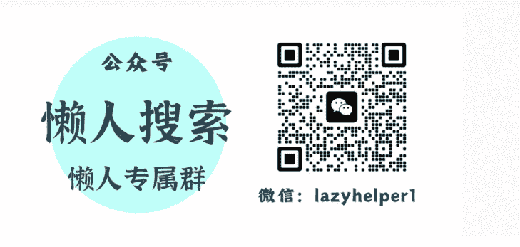
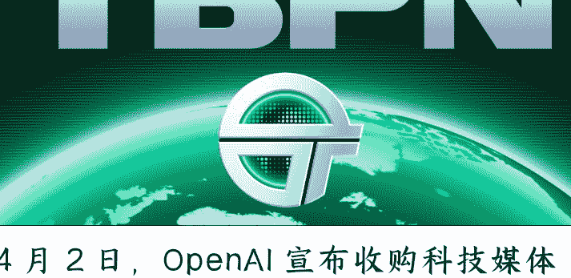
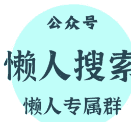

# OpenAI 收购科技媒体

260409 新闻实验室

整理：公众号懒人搜索，**懒人专属群**精选

懒人微信：lazyhelper1

TBPN 不会说 OpenAI 的坏话，因为它的风格是不说任何一家大公司的坏话。

4 月 2 日，OpenAI 宣布收购科技媒体 **TBPN**（科技商业节目网、Technology Business Programming Network）。尽管时间点上看起来像是愚人节玩笑，但实际上并不是。

《金融时报》等媒体<u>透露</u>，此次收购的金额达到“数亿美元”（low hundreds of millions，可认为是 1-5 亿美元之间）。

本期新闻实验室会员通讯，我们来聊聊为什么一家 AI 巨头要收购一家媒体。

## TBP N 并不是新闻节目

有中文报道将 TBPN 称为一档“科技播客”。其实，TBPN 的主要产品形态是每天 3 小时的视频直播节目。直播结束后，录好的内容随即会发布到播客平台上。

TBPN 由 Tordi Hays 和 John Coogan 发起，成立于 2024 年，整个公司仅有 11 名员工。该节目接待过 Meta CEO 扎克伯格、微软 CEO 纳德拉和 OpenAI CEO 奥特曼等知名嘉宾。

去年 10 月，《纽约时报》称，硅谷正在痴迷 TBPN。该报深入 TBPN 位于好莱坞的演播室，生动地描绘了它令人眩晕的画风：现场宛如“将 CNBC 的演播室搬进了高档健身房的更衣室”，桌上堆满了科技公司的周边纪念品、《华尔街日报》、喝了一半的马黛茶和健怡可乐；两位主持经常穿着像是《美国精神病人》主角 Patrick Bateman 的定制西装；主持人在节目中像交易员盯着彭博终端一样，疯狂滚动社交媒体 X，屏幕下方甚至还有滚动条，实时显示"Meta 推出新模型的几率”或“特斯拉在加州推出无人出租车的几率”。

两位创始人 Hays 和 Coogan 之前是投资者和创业者。奥特曼曾经投资过 Coogan 的第一家公司——营养补充剂 Soylent。两位创始人都曾经历过创业的起落，Hays 对《纽约时报》坦言： “想象一下你 25 岁，从 a16z 和谷歌等知名投资者那里融了资，结果两年后被市场狠狠毒打……我们经历过这些，我认为这对于我们的报道风格非常重要。”

换句话说，他们的节目是对企业老板相当有同理心的。这自然也让老板们很喜欢 TBPN，其粉丝包括 Larry Ellison、Mark Cuban、Travis Kalanick 等大佬。甚至有人说，TBPN 已经成为硅谷必看的节目（de facto must-watch）。

收购完成后，奥特曼在 X 上发帖称，"TBPN 是我最喜欢的科技节目，我们希望他们继续做下去，做他们擅长的事情。我不指望他们会对我们网开一面，而且我确信，我偶尔做出的那些愚蠢决定也会给他们提供素材。”

TBPN 此前从未获得大额风险投资，因为它有稳健的商业模式。它原本预计在 2025 年产生 500 万美元的广告收入，并在没有外部投资者的情况下实现盈利。公司本来已经聘请了新的增长高管，以帮助在今年将广告收入增加到 1500 万美元。其赞助商包括金融科技科技公司 Ramp 和 Plaid，以及谷歌的 Gemini，还与纽交所（NYSE）达成了官方合作关系。不过，在被收购后，其广告业务将逐步缩减。

目前尚不清楚 OpenAI 到底会不会影响 TBPN 的内容，但几乎可以肯定的是，TBPN 不会说 OpenAI 的坏话，因为它的风格是不说任何一家大公司的坏话。

用《纽约时报》的话说，两位主持人在节目中毫不掩饰对资本主义、创业精神以及见证科技公司重塑世界的热爱。正是这种极其友好的基调，使得在过去 18 个月里，硅谷的每一位 CEO 几乎都在拼命敲门想要上这档节目。

这很容易理解：他们上这档节目是很舒服的。如《纽约时报》的特写所描述：当扎克伯格走进直播间时，现场不仅有老朋友般的握手，更有人按下了音效板，在一阵震耳欲聋的世界杯呜呜祖拉声中高呼“FOUNDER MODE（创始人模式）”。而在对谈奥特曼时，当奥特曼说到自己买了一辆新的 Acura NSX 跑车，现场回荡的则是疯狂空气汽笛声。

在这种充满兄弟会氛围的节目中，两位创始人从不认为自己是记者。他们随意使用“极其变态/牛逼（extremely sick）”或“一般般（mid）”这样的口语来评价产品。Coogan 还将《纽约时报》记者称为“敌人（the enemy）”，即便他随后补充说“没有你们传统媒体，我们也做不了这行”。

The Information 认为："TBPN 与 The Information、华尔街日报或彭博社截然不同，它并非新闻机构……作为一场社交盛宴，TBPN 取得了巨大的成功，在上线仅 18 个月后就成了高管们的首选论坛。”

“ 出于同样的原因，OpenAI 承诺给予 TBPN 编辑独立性的说法毫无意义。独立性又有什么 用呢？你能想象 TBPN 会做一期抨击 OpenAI 的深度报道吗？这根本不符合该节目的风格。”

# OpenAI 的战略调整

据报道，OpenAI 负责应用与 AGI 部署的 CEO Fidji Simo 主导了本次收购。
她表示，收购旨在“为关于 AI 带来的变革创造一个真正、建设性的对话空间”。据《 华尔街日报》报道，TBPN 将向 OpenAI 首席全球事务官 Chris Lehane 汇报。

此次收购发生在 OpenAI 的架构大调整之后不久。Fidji Simo 表态将专注于“ 主业”即其企业业务，并出人意料地停掉了本来发展情况向好的视频生成应用 Sora 等消费者产品。

OpenAI 最近宣布了其最新一轮 1220 亿美元的融资，投后估值达到 8520 亿美元，但它因为承诺建造大量的数据中心，面临着空前的财政压力。同时它与宿敌 Anthropic 的竞争也陷入白热化，后者大量抢夺了企业客户，直接导致近期向 B 端业务的转向。

在这个背景下，Fidji Simo 还要收购一家“副业”媒体，无疑就更在人们的意料之外。不过仔细想来，其实也在情理之中。

**今年 2 月，Anthropic 公开表示拒绝美国国防部的要求，不将 Claude 模型用于制作自主性武器和大规模监控等，因此被美国政府认定为“国家安全供应链风险”。与此形成对比的是，OpenAI 和马斯克的 xAI 都与美国国防部达成了合作。消息传出后，Claude 的消费者下载和企业应用都迎来飙升，而 ChatGPT 的份额则遭到蚕食。**

(详见[会员通讯 912 期](https://mp.weixin.qq.com/s/...))

奥特曼就此事表示，他低估了公众对 AI 公司的不信任程度。近期，为了专注于数据中心项目融资和潜在的 IPO 事宜，奥特曼不再主管公司所有业务，这才有了 Fidji Simo 分管应用和 AGI 部署的 CEO 头衔。

同时，OpenAI 传播主管去年 12 月离职，岗位由 Fidji Simo 兼任，公司一直在努力制定传播和市场营销战略。

而在 TBPN 这边，两位创始人曾明确表示，他们建立 TBPN 并非为了融资或出售。回头来看，或许正是这种不想管理庞大架构、只图专心做内容的初衷，促成了他们最终同意被 OpenAI 并购，这让他们获得了扩张的资源，却无需自己操心管理的重担。

甚至有趣且极具 AI 时代特色的是，《纽约时报》披露收购合同中约定，OpenAI 并未获得 Coogan 和 Hays 两人的肖像权。也就是说，即使 OpenAI 日后认为 AI 数字人比真人更出色，也无权将其取而代之。

对于节目的未来，TBNP 透露他们不仅要继续直播，还有志于建立线下活动业务，甚至全国巡演。

## 科技圈的避风港内外

除了 OpenAI 之外，其他不少科技公司也收购或推出了自己的媒体资产，以塑造大众观念并加深客户关系。

比如，连接银行和金融科技公司的初创公司 Plaid 估值 80 亿美元，上个月收购了播客《This Week in Fintech》（本周金融科技）。另一家 fintech 企业 Robinhood 则早在 2023 年就推出了 Sherwood Media。

有需求就有供给，Business Insider 认为，本次收购将刺激行业出现一大波同类风格的模仿者。

其他行业也在效仿这种风格，力图在各个领域占据一席之地。广告营销业有《Breaking and Entering》；好莱坞推出了一档由网络迷因账号“助理大战经纪人”（Assistants vs. Agents）制作的新节目《AVA Live》；而政治爱好者们很快也将迎来节目《Nobody Knows Anything》。

此次收购正值硅谷的一个关键时刻，美国 AI 巨头在加速繁荣和扩张的同时，也面临着越来越多的政府审查、监管收紧和公众质疑。因此硅谷巨头们开始主动出击，成立或重金资助超级政治行动委员会（SPAC），试图直接影响政策制定和议员选举。让政府官员和普通民众都对公司保持一个基本的好印象，将极大润滑公关危机，并显著减少游说过程中的阻力。

《国会山报》指出，除了科技巨头，TBJN 的嘉宾也延伸到了华盛顿主导科技政策的核心政要，包括美国国防部副部长 Emil Michael 和白宫科技政策办公室主任 Michael Kratsios。

TechCrunch 介绍，TBJN 的汇报对象、OpenAI 首席全球事务官 Chris Lehane 是精通“政治黑魔法（political dark arts）”的“首席政治操盘手”。他发明了“庞大的右翼阴谋（vast right-wing conspiracy）”术语，转移媒体对克林顿时期白宫的关注。

Lehane 也与加密货币领域的超级政治行动委员会 Fairshake 有关，该机构在 2024 年大选中斥资数亿美元阻击反加密货币候选人。自加入 OpenAI 以来，Lehane 一直在向特朗普输送意见，推动包括“联邦要阻止州级 AI 立法”以及“放宽可能拖慢数据中心建设的环保限制”等争议政策。

可以说，TBJN 已经成为硅谷内部人士的一个避风港，在这里，行业权力玩家可以坦诚发言，并由同为圈内人的同行进行提问。事实上，OpenAI 此前已经拥有了自己的官方播客，用于与公司内部开发者进行长篇对谈。奥特曼本人一直保持着极高的媒体曝光度，不仅多次作客 TBP N，去年 12 月还登上《肥伦秀》（Tonight Show Starring Jimmy Fallon）。在已有官方发声渠道的情况下，依然买下 TBP N，更凸显了：与其在传统媒体中面对充满对抗性的诘问，科技领袖更愿意通过直接收购外部影响力，在 TBP N 这种更为宽松、内部化的环境中掌握话语权。

从公共利益的角度出发，TBP N 这种科技媒体显然不是理想的存在。但是，传统的机构媒体也有很多问题，就像 The Information 的文章自我反省的： “说实话，记者们往往过于热衷于挖苦别人，对科技或商业的了解却远远不够。收听 John Collison 与马斯克的对话，既有趣又有启发性。TBPN 也是如此。”

当然，文章还是强调： “即便如此， 如果 CEO 们愿意面对真正的记者，在播客的安全空间之外回答那些棘手的问题，公众投资者将会受益匪浅。回避这些问题，对股东和高管都没有好处。”

在这个 AI 能替你写代码、写文章的时代，基础技能正在迅速贬值。绝大多数人正被淹没在海量的免费垃圾信息里，陷入低效的体力内卷。

当“努力”不再是壁垒，人与人之间唯一的护城河，只剩下“信息过滤”的效率与“认知系统”的维度。

圈子已稳定运行 7 年。我们每天利用 Python 爬虫与大模型算力，过滤全网最顶级的政经内参和搞钱风向标，做你最冷酷的“外部大脑”。

如果你认同这种“重塑认知防线”的极客主义，欢迎围观我的个人情报智库：【懒人专属群】。
https://lazyso.com/insider/

认同信息过滤价值、想省下每天 3 小时无效阅读时间的读者，扫码加我微信（lazyhelper1）

